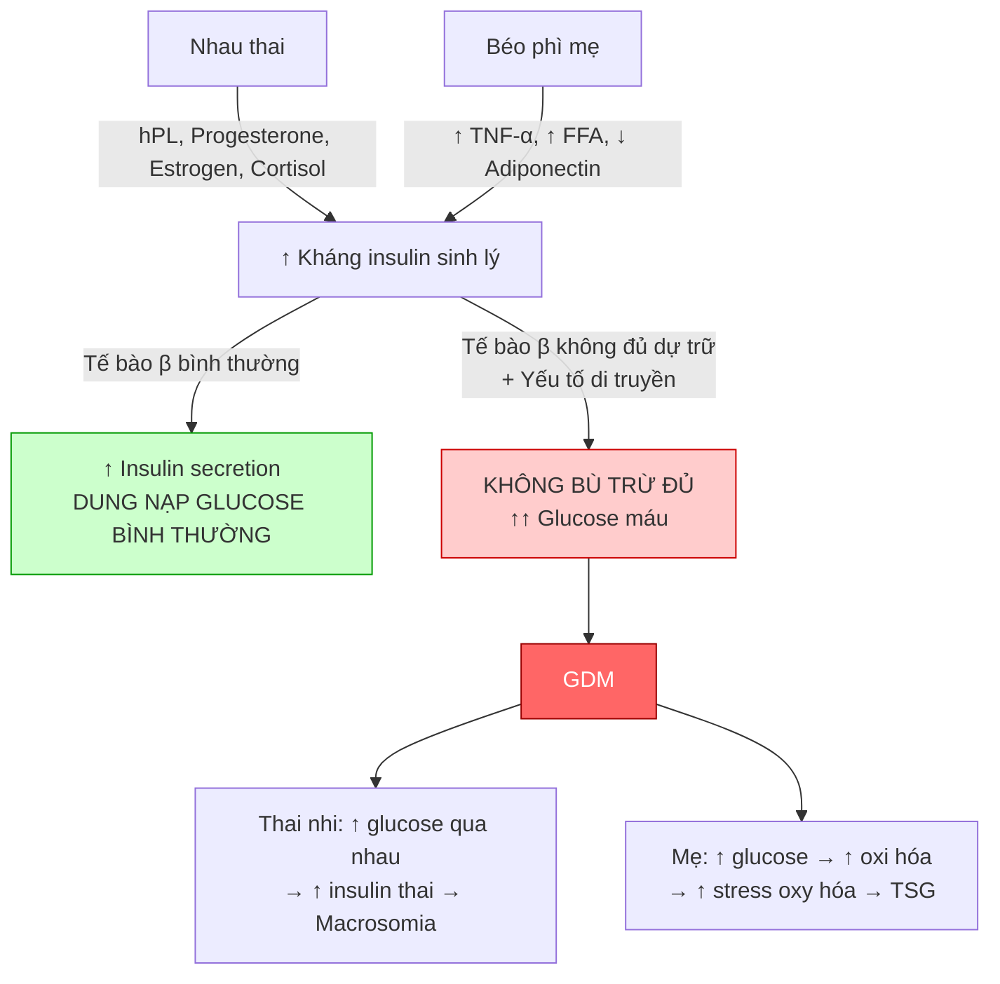
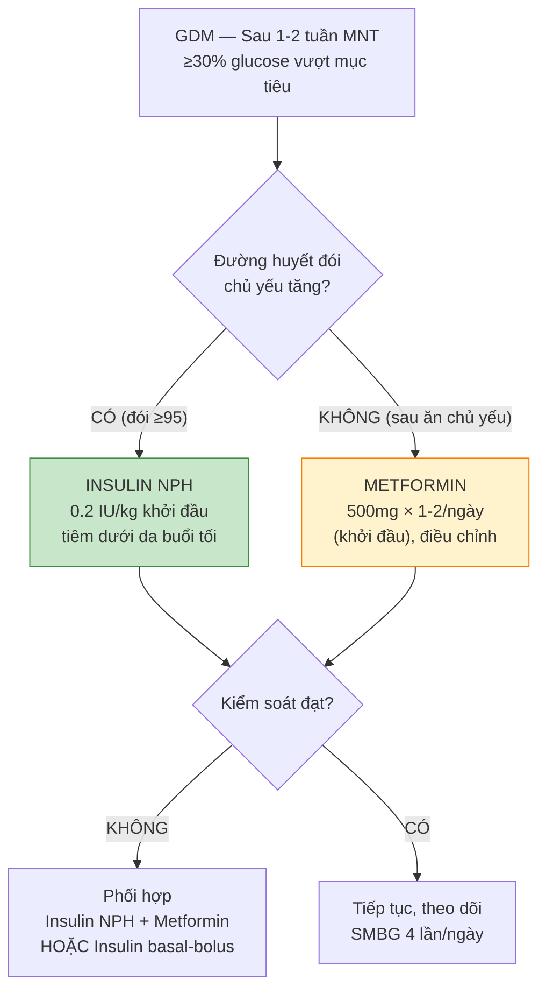
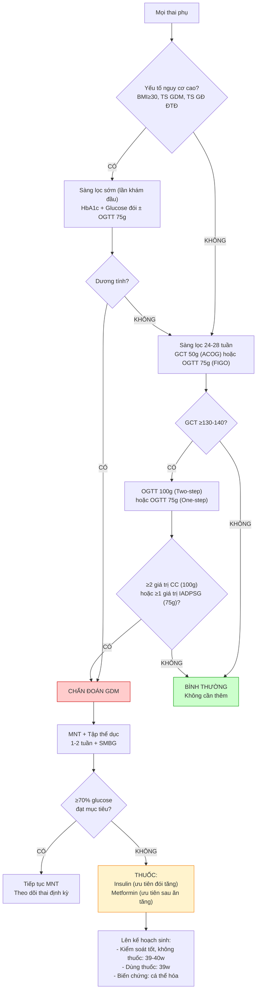

# Bài học: Đái tháo đường thai kỳ — Sàng lọc, Chẩn đoán & Quản lý Toàn diện

**Ngày:** 2026-06-28 | **Chuyên khoa:** Sản phụ khoa | **Đối tượng:** Bác sĩ sản phụ khoa

> **Tier 0 Guidelines:** ACOG PB #190 (2018, reaffirmed 2023) — GDM; FIGO 2015 — GDM Initiative; IADPSG 2010 — Diagnostic criteria; ADA 2024 — Standards of Care
> **Phạm vi:** Sinh lý bệnh (hormone nhau thai → kháng insulin) + Sàng lọc & chẩn đoán (one-step vs two-step) + Biến chứng mẹ-con + Quản lý (dinh dưỡng, metformin, insulin) + Chuyển dạ & hậu sản + So sánh guideline.

---

## MỤC LỤC

0. TỔNG QUAN — Định nghĩa, Dịch tễ, Tầm quan trọng
1. SINH LÝ BỆNH — Cơ chế kháng insulin trong thai kỳ
2. SÀNG LỌC & CHẨN ĐOÁN — One-step vs Two-step
3. YẾU TỐ NGUY CƠ
4. BIẾN CHỨNG MẸ & THAI NHI
5. QUẢN LÝ — Dinh dưỡng, Thuốc, Theo dõi
6. LƯU ĐỒ QUYẾT ĐỊNH LÂM SÀNG
7. SAI LẦM THƯỜNG GẶP
8. BẢNG THUỐC VÀ LIỀU DÙNG
9. CHUYỂN DẠ, SINH & HẬU SẢN
10. GUIDELINES SO SÁNH
11. ÁP DỤNG TẠI VIỆT NAM
12. TIPS THỰC HÀNH
13. TỔNG KẾT
14. TÀI LIỆU THAM KHẢO

---

## 0. TỔNG QUAN — ĐỊNH NGHĨA, DỊCH TỄ

**Gestational Diabetes Mellitus (GDM)** — Đái tháo đường thai kỳ — là tình trạng **rối loạn dung nạp glucose với mức độ bất kỳ**, khởi phát hoặc được phát hiện lần đầu **trong thai kỳ**.

**Định nghĩa ACOG PB #190 (PMID 29370047):**
> "GDM is carbohydrate intolerance of variable severity with onset or first recognition during pregnancy. This definition applies regardless of whether insulin is used for treatment or the condition persists after pregnancy."

**Dịch tễ:**
- Toàn cầu: **7-17%** thai kỳ (tùy dân số và tiêu chuẩn chẩn đoán)
- Hoa Kỳ: **6-9%** (tăng gấp đôi trong 20 năm qua)
- Châu Á: **10-20%** (cao hơn đáng kể — do di truyền & chế độ ăn)
- Việt Nam: ước tính **10-15%** thai phụ ở thành thị (HAPO-VN sub-study, BV Từ Dũ)
- Sau GDM: **50-70%** phát triển ĐTĐ type 2 trong 10-25 năm

**Tầm quan trọng lâm sàng (5 điểm):**
1. **Biến chứng mẹ**: Tiền sản giật (OR 1.5-2), sinh mổ, ĐTĐ type 2 tương lai
2. **Biến chứng thai**: Macrosomia (OR 2-3), sinh non, hạ đường huyết sơ sinh
3. **Lập trình bào thai**: Con của mẹ GDM tăng nguy cơ béo phì, ĐTĐ type 2
4. **Sàng lọc phổ quát**: Hầu hết guideline khuyến cáo sàng lọc CHO MỌI thai phụ 24-28w
5. **Can thiệp hiệu quả**: Kiểm soát đường huyết chặt → giảm macrosomia 50%, giảm tiền sản giật 30%

---

## 1. SINH LÝ BỆNH — CƠ CHẾ KHÁNG INSULIN TRONG THAI KỲ

### 1.1. Thai kỳ bình thường — "Physiologic insulin resistance"

Thai kỳ là trạng thái **tăng kháng insulin sinh lý**, tiến triển dần từ quý 2, đạt đỉnh ở quý 3. Mục đích: **đảm bảo cung cấp glucose liên tục cho thai nhi**.

**Cơ chế:**
```
Nhau thai (syncytiotrophoblast)
        ↓
Tiết hormones kháng insulin:
  • Human Placental Lactogen (hPL) — MẠNH NHẤT
  • Progesterone
  • Estrogen (estriol)
  • Cortisol (nhau thai + tuyến thượng thận mẹ)
  • TNF-α, leptin, adiponectin ↓
        ↓
↓ Độ nhạy insulin ngoại biên (cơ, mô mỡ)
  ↓ GLUT4 translocation → ↓ glucose uptake
        ↓
↑ Insulin secretion bù trừ (tế bào β tụy)
  ↑↑ khối lượng tế bào β (β-cell mass)
        ↓
NẾU BÙ TRỪ ĐỦ → DUNG NẠP GLUCOSE BÌNH THƯỜNG
NẾU BÙ TRỪ KHÔNG ĐỦ → GDM
```

### 1.2. GDM — Khi cơ chế bù trừ thất bại

Trong GDM, tế bào β tụy **không tăng tiết insulin đủ** để bù trừ cho tình trạng kháng insulin nặng hơn của thai kỳ. Đây là do:

| Yếu tố | Cơ chế | Hậu quả |
|---|---|---|
| **hPL ↑↑** | hPL gây ↑↑ kháng insulin, đồng thời ↑↑ lipolysis → ↑ FFA → ↑↑ kháng insulin | Tải lên tế bào β |
| **TNF-α ↑** | Viêm mức độ thấp → ↓ tín hiệu insulin receptor | ↓ glucose uptake |
| **Adiponectin ↓** | ↓ tăng nhạy insulin bù trừ | Mất cơ chế bảo vệ |
| **Genetic predisposition** | Đa gen (TCF7L2, GCK, KCNJ11...) | ↓ β-cell reserve |
| **Béo phì mẹ** | Viêm mạn + ↑ FFA + ↓ adiponectin | Nhân đôi gánh nặng |
| **Oxidative stress** | ↑ ROS ở tụy → tổn thương tế bào β | ↓ insulin secretion |

### 1.3. Biểu đồ cơ chế bệnh sinh



---

## 2. SÀNG LỌC & CHẨN ĐOÁN — TWO-STEP vs ONE-STEP

Đây là **tranh cãi lớn nhất** trong GDM. Hai chiến lược chính:

### 2.1. Two-Step Approach (ACOG khuyến cáo — Mỹ)

**Bước 1 — Glucose Challenge Test (GCT) 50g:**
- **Thời điểm**: 24-28 tuần (sớm hơn nếu nguy cơ cao)
- **Nhịn đói**: KHÔNG cần
- **Uống 50g glucose**, đo đường huyết **sau 1 giờ**
- **Ngưỡng dương tính**:
  - ≥130 mg/dL (7.2 mmol/L): sensitivity 90%, specificity 80%
  - ≥135 mg/dL (7.5 mmol/L): sensitivity 80%, specificity 85%
  - ≥140 mg/dL (7.8 mmol/L): sensitivity 70%, specificity 90%
  - **ACOG khuyến cáo 130-140 mg/dL** tùy dân số

**Bước 2 — OGTT 100g (chỉ làm nếu GCT dương tính):**
- **Nhịn đói**: 8-14 giờ
- **Uống 100g glucose**, đo đường huyết lúc đói + 1h + 2h + 3h
- **Tiêu chuẩn Carpenter-Coustan** (≥2 giá trị vượt ngưỡng):

| Thời điểm | Ngưỡng (mg/dL) | Ngưỡng (mmol/L) |
|---|---|---|
| Lúc đói | ≥95 | ≥5.3 |
| 1 giờ | ≥180 | ≥10.0 |
| 2 giờ | ≥155 | ≥8.6 |
| 3 giờ | ≥140 | ≥7.8 |

### 2.2. One-Step Approach (IADPSG/WHO/FIGO khuyến cáo)

**OGTT 75g — không cần GCT sàng lọc trước:**
- **Nhịn đói**: 8-14 giờ
- **Uống 75g glucose**, đo đường huyết lúc đói + 1h + 2h
- **Tiêu chuẩn IADPSG 2010** (≥1 giá trị vượt ngưỡng → GDM):

| Thời điểm | Ngưỡng (mg/dL) | Ngưỡng (mmol/L) |
|---|---|---|
| Lúc đói | ≥92 | ≥5.1 |
| 1 giờ | ≥180 | ≥10.0 |
| 2 giờ | ≥153 | ≥8.5 |

**Lý do IADPSG chọn các ngưỡng này**: Dựa trên HAPO study (NEJM 2008, n=25,505), các ngưỡng này tương ứng với **OR 1.75** cho adverse outcome (macrosomia, C-peptide dây rốn >90th percentile, neonatal adiposity).

### 2.3. So sánh Two-Step vs One-Step

| Tiêu chí | Two-Step (ACOG) | One-Step (IADPSG/FIGO/WHO) |
|---|---|---|
| **Số bước** | 2 (GCT → OGTT 100g) | 1 (OGTT 75g) |
| **Tỷ lệ chẩn đoán GDM** | 5-7% | 15-18% (cao gấp 2-3 lần!) |
| **Sensitivity** | 70-80% | 90-95% |
| **Specificity** | 95% | 85% |
| **Số ca điều trị** | Ít hơn | Nhiều hơn (tiêu chuẩn thấp hơn) |
| **Bằng chứng RCT** | MFMU Network (NEJM 2022) | HAPO (quan sát, 2008) |
| **Chi phí** | Thấp hơn (nhiều BN chỉ cần GCT) | Cao hơn (mọi BN OGTT 75g) |
| **Dùng ở** | Mỹ, Canada | Châu Âu, Úc, châu Á, WHO |

**Tranh cãi chính**: One-step chẩn đoán GDM gấp 2-3 lần → nhiều BN được điều trị → giảm biến chứng? Hay overdiagnosis? MFMU Network trial (NEJM 2022) không cho thấy one-step vượt trội two-step về adverse outcomes.

### 2.4. Sàng lọc sớm (<24 tuần)

ACOG khuyến cáo sàng lọc **sớm ở lần khám thai đầu tiên** cho phụ nữ có yếu tố nguy cơ:
- **BMI ≥30 kg/m²**
- **Tiền sử GDM**
- **Tiền sử gia đình ĐTĐ (cha/mẹ/anh/chị/em)**
- **Tiền sử sinh con ≥4,000g**
- **Hội chứng buồng trứng đa nang (PCOS)**
- **Chủng tộc nguy cơ cao** (Á, Mỹ Latinh, Phi)

Sàng lọc sớm dùng **HbA1c + đường huyết đói + OGTT 75g**. Nếu âm tính → lặp lại 24-28 tuần.

---

## 3. YẾU TỐ NGUY CƠ

| Yếu tố nguy cơ | OR / Nguy cơ | Ghi chú |
|---|---|---|
| **BMI ≥30 kg/m²** | OR 2-4 | Yếu tố mạnh nhất |
| **Tiền sử GDM** | OR 10-20 | Nguy cơ tái phát 30-70% |
| **Tiền sử gia đình ĐTĐ type 2** | OR 2-3 | Di truyền |
| **Tuổi mẹ ≥35** | OR 2-3 | ↑ kháng insulin theo tuổi |
| **Chủng tộc Á, Hispanic, Phi** | OR 2-4 | Genetic susceptibility |
| **PCOS** | OR 2-3 | ↑ insulin resistance nền |
| **Tiền sử macrosomia (≥4,000g)** | OR 3-5 | Marker GDM ẩn trước đó |
| **Tăng cân quá mức trong thai kỳ** | OR 1.5-2 | ↑ kháng insulin |
| **Đa ối vô căn** | Có thể là dấu hiệu sớm | Fetal osmotic diuresis |
| **Thai to trên siêu âm (AC >90th)** | Dấu hiệu gợi ý | Cần sàng lọc lại |

---

## 4. BIẾN CHỨNG MẸ & THAI NHI

### 4.1. Biến chứng mẹ

| Biến chứng | Nguy cơ so với thai bình thường | Cơ chế |
|---|---|---|
| **Tiền sản giật** | OR 1.5-2.0 | ↑ stress oxy hóa, endothelial dysfunction |
| **Sinh mổ** | OR 1.3-1.8 | Macrosomia, đình trệ chuyển dạ |
| **ĐTĐ type 2 sau sinh** | 50-70% trong 10-25 năm | β-cell exhaustion tiếp diễn |
| **GDM tái phát** | 30-70% thai kỳ sau | Cơ địa |
| **Sinh non** | OR 1.2-1.5 | Đa ối, nhiễm trùng |
| **Đa ối** | 10-20% GDM | Osmotic diuresis thai |
| **Nhiễm trùng tiểu** | OR 1.5-2.0 | Glycosuria |

### 4.2. Biến chứng thai nhi & sơ sinh

| Biến chứng | Nguy cơ | Cơ chế |
|---|---|---|
| **Macrosomia (≥4,000g)** | OR 2-3 (15-30% GDM) | ↑ glucose qua nhau → ↑ insulin thai → ↑ IGF-1 → ↑ tăng trưởng |
| **Large for Gestational Age (LGA >90th)** | OR 2-4 | Như trên |
| **Hạ đường huyết sơ sinh (<40 mg/dL)** | 10-20% | ↑ insulin sơ sinh (do ↑ glucose từ mẹ) → hạ đột ngột sau sinh |
| **Hội chứng suy hô hấp (RDS)** | OR 1.5-2 | Insulin ức chế surfactant synthesis, sinh non |
| **Vàng da sơ sinh** | OR 1.5-2 | Polycythemia → ↑ bilirubin |
| **Hạ canxi máu** | OR 2-3 | ↓ PTH đáp ứng |
| **Bệnh cơ tim phì đại** | Hiếm nhưng đặc hiệu | Septal hypertrophy do ↑ insulin |
| **Dị tật bẩm sinh** | OR 2-4 (nếu GDM không kiểm soát quý 1) | ↑ glucose gây teratogenic (đặc biệt tim, NTD) |
| **Tử vong chu sinh** | OR 1.5-2 (hiếm nếu kiểm soát tốt) | Đa yếu tố |

### 4.3. Hậu quả dài hạn cho con

- **Béo phì trẻ em**: OR 1.5-2.0
- **ĐTĐ type 2**: OR 2-8 ở tuổi trưởng thành
- **Hội chứng chuyển hóa**: OR 1.5-2.0
- **Cơ chế**: **Lập trình bào thai (fetal programming)** — hyperinsulinemia in utero → epigenetic changes → altered metabolic set points

---

## 5. QUẢN LÝ

### 5.1. Mục tiêu đường huyết

| Thời điểm | ACOG (mg/dL) | ADA/FIGO (mg/dL) | mmol/L |
|---|---|---|---|
| **Lúc đói** | ≤95 | ≤95 | ≤5.3 |
| **1 giờ sau ăn** | ≤140 | ≤140 | ≤7.8 |
| **2 giờ sau ăn** | ≤120 | ≤120 | ≤6.7 |
| **HbA1c** | <6.0% | <6.0-6.5% | — |

### 5.2. Liệu pháp dinh dưỡng (Medical Nutrition Therapy — MNT)

**Chế độ ăn nền tảng — CHO MỌI BN GDM:**

| Nguyên tắc | Chi tiết |
|---|---|
| **Tổng calo** | 30-35 kcal/kg/ngày (BMI bình thường), 25 kcal/kg/ngày (BMI >30) |
| **Carbohydrate** | 40-45% tổng calo, chia nhỏ 3 bữa chính + 2-4 bữa phụ |
| **Protein** | 20-25% tổng calo, 1.1-1.5 g/kg/ngày |
| **Chất béo** | 30-35% tổng calo, ưu tiên không bão hòa |
| **Bữa sáng** | Carb thấp hơn (15-30g) — kháng insulin cao nhất buổi sáng |
| **Bữa phụ tối** | Carb 15-20g — ngừa ketosis qua đêm |
| **Chất xơ** | 25-30g/ngày — làm chậm hấp thu glucose |
| **Đường đơn, nước ngọt** | TRÁNH HOÀN TOÀN |

**Phân phối calo trong ngày:**
- Sáng: 10-15%
- Trưa: 20-30%
- Tối: 30-40%
- 3 bữa phụ: 5-10% mỗi bữa

### 5.3. Tập thể dục

- **Đi bộ 30 phút/ngày** sau bữa ăn → ↓ đường huyết sau ăn 10-15%
- **Tập 5 ngày/tuần**, ít nhất 150 phút/tuần
- Các môn an toàn: đi bộ, bơi, đạp xe tĩnh, yoga thai kỳ
- Tránh: môn dễ ngã, nằm ngửa kéo dài sau 20 tuần

### 5.4. Theo dõi đường huyết tại nhà (SMBG)

| Tần suất | Chỉ định |
|---|---|
| **4 lần/ngày** (đói + 1h sau 3 bữa chính) | Mọi BN GDM |
| **Giảm còn 2-4 lần/ngày** | Nếu ổn định với chế độ ăn >2 tuần |
| **Tăng lên 7 lần/ngày** | Nếu dùng insulin |

**Mục tiêu**: ≥80% giá trị đạt mục tiêu trong 1 tuần.

### 5.5. Thuốc — Khi MNT không đủ

**Chỉ định dùng thuốc**: Sau 1-2 tuần MNT + tập thể dục mà ≥30% giá trị vượt mục tiêu.

**Lựa chọn theo ACOG PB #190 (PMID 29370047):**



**Bảng so sánh thuốc GDM:**

| Thuốc | Cơ chế | Ưu điểm | Nhược điểm | Thai kỳ |
|---|---|---|---|---|
| **Insulin** | Thay thế insulin ngoại sinh | **TIÊU CHUẨN VÀNG**, không qua nhau (basal), hiệu quả nhất | Tiêm, hạ đường huyết, tăng cân | **An toàn** |
| **Metformin** | ↓ tân tạo glucose gan, ↑ nhạy insulin | Uống, rẻ, không hạ đường huyết | **QUA NHAU THAI**, tác dụng phụ tiêu hóa | **Category B**, dùng rộng rãi |
| **Glyburide (Glibenclamide)** | ↑ tiết insulin từ tế bào β | Uống, rẻ | **QUA NHAU THAI**, hạ đường huyết sơ sinh, macrosomia | **Không ưu tiên** (ACOG PB #190) |

### 5.6. Thai kỳ monitoring

| Tuần thai | Đánh giá | Mục đích |
|---|---|---|
| **Chẩn đoán (24-28w)** | Siêu âm hình thái nếu chưa làm | Loại trừ dị tật |
| **28-32w** | Siêu âm tăng trưởng | Baseline EFW, AC |
| **32-36w** | Siêu âm tăng trưởng mỗi 3-4 tuần | Theo dõi macrosomia |
| **Từ 32w** | **NST hoặc BPP 1-2 lần/tuần** | Nếu dùng thuốc (insulin/metformin) |
| **Từ 36w** | NST + AFI hàng tuần | Antepartum surveillance |
| **≥39w** | Quyết định thời điểm sinh | Dựa trên kiểm soát đường huyết + biến chứng |

---

## 6. LƯU ĐỒ QUYẾT ĐỊNH LÂM SÀNG



---

## 7. SAI LẦM THƯỜNG GẶP

| # | Sai lầm | Hậu quả | Cách tránh |
|---|---|---|---|
| 1 | **Không sàng lọc GDM sớm ở BN nguy cơ cao** | GDM không được chẩn đoán → tăng đường huyết kéo dài → dị tật thai | Sàng lọc GDM ở lần khám đầu tiên cho BMI ≥30, TS GDM, TS GĐ ĐTĐ |
| 2 | **Chỉ dùng GCT 50g, không làm OGTT khi GCT dương tính** | Bỏ sót GDM | GCT ≥130-140 → BẮT BUỘC OGTT 100g (two-step) |
| 3 | **Khởi đầu insulin quá muộn** | Macrosomia không hồi phục | Bắt đầu insulin/metformin sau 1-2 tuần MNT thất bại, không trì hoãn |
| 4 | **Dùng glyburide thay vì insulin/metformin** | Hạ đường huyết sơ sinh, macrosomia nặng hơn | **Glyburide không phải first-line** (ACOG PB #190). Insulin hoặc metformin |
| 5 | **Không theo dõi thai đủ sát khi dùng thuốc** | Thai lưu, suy thai không phát hiện | NST/BPP 1-2 lần/tuần từ 32w nếu dùng insulin/metformin |
| 6 | **Sinh non chủ động <39w chỉ vì GDM kiểm soát tốt** | Sinh non iatrogenic không cần thiết | GDM kiểm soát tốt bằng MNT → chờ chuyển dạ tự nhiên đến 40w |
| 7 | **Quên sàng lọc ĐTĐ type 2 sau sinh** | Bỏ lỡ chẩn đoán sớm ĐTĐ type 2 | OGTT 75g ở 4-12 tuần hậu sản CHO MỌI BN GDM |

---

## 8. BẢNG THUỐC VÀ LIỀU DÙNG

| Thuốc | Liều khởi đầu | Điều chỉnh | Đường dùng | Chống chỉ định | Ghi chú |
|---|---|---|---|---|---|
| **Insulin NPH (basal)** | 0.2 IU/kg buổi tối | Tăng 2-4 IU mỗi 3 ngày đến khi đói đạt mục tiêu | Tiêm dưới da | Hạ đường huyết nặng | — |
| **Insulin Regular (prandial)** | 0.1-0.2 IU/kg trước bữa ăn | Tăng 1-2 IU mỗi 3 ngày đến khi sau ăn 1h đạt mục tiêu | Tiêm dưới da | Hạ đường huyết nặng | Dùng trước ăn 30 phút |
| **Insulin Aspart/Lispro (rapid)** | 0.1 IU/kg trước bữa ăn | Tăng 1-2 IU mỗi 3 ngày | Tiêm dưới da | Hạ đường huyết nặng | Dùng ngay trước ăn, ưu tiên hơn Regular |
| **Metformin** | 500mg × 1/ngày (tối) | Tăng lên 500mg × 2/ngày sau 1 tuần, tối đa 2,500mg/ngày | Uống | Suy thận (Cr >1.4), toan chuyển hóa | Uống sau ăn để giảm tác dụng phụ tiêu hóa |
| **Glyburide** | 2.5-5mg/ngày | Tăng 2.5-5mg/tuần, tối đa 20mg/ngày | Uống | **Không ưu tiên** (qua nhau thai nhiều) | Chỉ dùng nếu không có insulin/metformin |

---

## 9. CHUYỂN DẠ, SINH & HẬU SẢN

### 9.1. Thời điểm sinh

| Tình trạng kiểm soát | Tuổi thai sinh khuyến cáo (ACOG) |
|---|---|
| **Kiểm soát tốt bằng MNT** | **39w0d - 40w6d** (chờ chuyển dạ tự nhiên) |
| **Kiểm soát tốt bằng thuốc** | **39w0d - 39w6d** (cân nhắc induction) |
| **Kiểm soát kém** | **37w0d - 38w6d** (cá thể hóa, có thể sớm hơn) |
| **Biến chứng (macrosomia, đa ối, TSG)** | **Cá thể hóa**, có thể 34-37w nếu nặng |

### 9.2. Quản lý trong chuyển dạ

| Tình huống | Xử trí |
|---|---|
| **GDM MNT đơn thuần** | Không cần theo dõi glucose trong chuyển dạ. Glucose đói lúc nhập viện |
| **GDM dùng insulin** | **Truyền glucose 5% + insulin TM** để duy trì glucose 70-110 mg/dL |
| **Mục tiêu glucose trong chuyển dạ** | 70-110 mg/dL (3.9-6.1 mmol/L) |
| **Thai to (EFW ≥4,500g)** | Cân nhắc **mổ lấy thai chủ động** (ACOG) để tránh shoulder dystocia |
| **Thai to (EFW ≥4,000-4,500g)** | Cá thể hóa — cân nhắc nguy cơ shoulder dystocia vs lợi ích sinh ngả âm đạo |

### 9.3. Hậu sản

| Mốc thời gian | Hành động |
|---|---|
| **Ngay sau sinh** | Ngừng insulin/metformin. Glucose đói buổi sáng hôm sau |
| **4-12 tuần hậu sản** | **OGTT 75g** để sàng lọc ĐTĐ type 2 (tiêu chuẩn ADA: đói ≥126, 2h ≥200) |
| **Hàng năm** | HbA1c hoặc glucose đói |
| **Trước thai kỳ sau** | Sàng lọc ĐTĐ, tư vấn giảm cân nếu BMI ≥25 |
| **Cho con bú** | **GIẢM nguy cơ ĐTĐ type 2** ở mẹ. Khuyến khích mạnh mẽ |

---

## 10. GUIDELINES SO SÁNH

| Khía cạnh | ACOG PB #190 (2018) | FIGO 2015 | IADPSG/WHO 2013 | ADA 2024 |
|---|---|---|---|---|
| **Sàng lọc** | Two-step (GCT → OGTT 100g) | One-step (OGTT 75g) | One-step (OGTT 75g) | One-step (ưu tiên) |
| **Tiêu chuẩn** | Carpenter-Coustan (≥2/4) | IADPSG (≥1/3) | IADPSG (≥1/3) | IADPSG hoặc CC |
| **GCT cut-off** | 130-140 mg/dL | Không dùng GCT | Không dùng GCT | — |
| **First-line thuốc** | Insulin | Metformin → Insulin | Insulin | Metformin → Insulin |
| **Glyburide** | Không ưu tiên | Không khuyến cáo | Không khuyến cáo | Không khuyến cáo |
| **Thai monitoring** | NST/BPP từ 32w nếu dùng thuốc | Tương tự | Tương tự | Cá thể hóa |
| **Thời điểm sinh** | 39-40w nếu kiểm soát tốt | Tương tự | Tương tự | 39w0d-40w6d |
| **Postpartum OGTT** | 4-12 tuần | 6-12 tuần | 6-12 tuần | 4-12 tuần |

---

## 11. ÁP DỤNG TẠI VIỆT NAM

- **Dịch tễ GDM tại VN**: 10-15% thai phụ thành thị. Tỷ lệ tăng nhanh do đô thị hóa + thay đổi chế độ ăn (cơm trắng, nước ngọt).
- **Sàng lọc phổ biến tại VN**: Hầu hết BV lớn (Từ Dũ, Hùng Vương, Phụ sản TW) dùng **Two-step (GCT 50g → OGTT 100g)** — tương tự ACOG.
- **OGTT 75g (One-step)**: Đang dần được áp dụng ở một số BV theo FIGO/WHO.
- **Thuốc sẵn có**: 
  - **Metformin 500mg**: RẺ (50,000-100,000 VNĐ/tháng), BHYT chi trả. Uống, dễ tuân thủ.
  - **Insulin NPH + Regular**: Có sẵn, BHYT chi trả. Insulin aspart/lispro đắt hơn, không phải lúc nào cũng có.
  - **Glyburide**: Có, nhưng không nên dùng (theo ACOG).
- **Theo dõi đường huyết tại nhà**: Máy đo đường huyết cá nhân phổ biến (200,000-500,000 VNĐ). Que thử ~5,000 VNĐ/lần.
- **Dinh dưỡng tại VN**: Cần tư vấn điều chỉnh **cơm trắng** (GI cao) → gạo lứt, chia nhỏ bữa. Hạn chế **nước mía, trái cây ngọt** (xoài, nhãn, sầu riêng).
- **Thách thức**: Nhiều BN VN không tuân thủ SMBG vì chi phí que thử. Tư vấn dinh dưỡng cần phù hợp văn hóa ẩm thực Việt.

---

## 12. TIPS THỰC HÀNH — 12 TIPS

1. **Sàng lọc CHO MỌI thai phụ 24-28w** — không chọn lọc theo nguy cơ (universal screening)
2. **GCT 50g dương tính ≥130 → LÀM NGAY OGTT 100g** — không trì hoãn
3. **Metformin là thuốc uống duy nhất nên dùng** — glyburide đã lỗi thời (qua nhau thai nhiều, tăng hạ đường huyết sơ sinh)
4. **Insulin là tiêu chuẩn vàng khi đường huyết đói tăng chủ yếu** — insulin NPH buổi tối bắt đầu 0.2 IU/kg
5. **Đường huyết sau ăn 1h quan trọng hơn đói** trong dự đoán macrosomia
6. **Bữa sáng ít carb nhất** (15-30g) — kháng insulin cao nhất buổi sáng
7. **Đi bộ 30 phút sau mỗi bữa ăn** — giảm đường huyết sau ăn 10-15%, KHÔNG tốn tiền
8. **NST/BPP 2 lần/tuần từ 32w nếu dùng insulin** — thai GDM có nguy cơ thai lưu cao hơn
9. **Không sinh chủ động <39w nếu GDM kiểm soát tốt** — trừ khi có biến chứng
10. **OGTT 75g 4-12 tuần hậu sản** — 50-70% GDM → ĐTĐ type 2, phát hiện sớm để can thiệp
11. **Cho con bú giảm nguy cơ ĐTĐ type 2 ở mẹ** — khuyến khích mạnh mẽ
12. **Sàng lọc GDM sớm (lần khám đầu) cho BMI ≥30, TS GDM** — dùng HbA1c + glucose đói

---

## 13. TỔNG KẾT — 10 ĐIỂM CẦN NHỚ

1. **GDM = rối loạn dung nạp glucose khởi phát/phát hiện trong thai kỳ** — do kháng insulin sinh lý + β-cell không bù trừ đủ
2. **hPL (Human Placental Lactogen) là hormone kháng insulin MẠNH NHẤT trong thai kỳ** — do nhau thai tiết
3. **Sàng lọc PHỔ QUÁT 24-28 tuần** — two-step (ACOG) hoặc one-step (FIGO/WHO)
4. **Tiêu chuẩn chẩn đoán**: Carpenter-Coustan (≥2/4 giá trị OGTT 100g) hoặc IADPSG (≥1/3 giá trị OGTT 75g)
5. **MNT (dinh dưỡng) là nền tảng** — 40% BN kiểm soát được chỉ bằng MNT
6. **Insulin là tiêu chuẩn vàng** khi MNT thất bại — đặc biệt nếu đường huyết đói tăng
7. **Metformin là lựa chọn uống an toàn** — qua nhau thai nhưng dữ liệu dài hạn yên tâm
8. **Glyburide KHÔNG phải first-line** — qua nhau thai nhiều, tăng hạ đường huyết sơ sinh
9. **Thai GDM cần NST/BPP từ 32w nếu dùng thuốc** — nguy cơ thai lưu cao hơn
10. **OGTT 75g hậu sản 4-12 tuần LÀ BẮT BUỘC** — phát hiện sớm ĐTĐ type 2

---

## 14. TÀI LIỆU THAM KHẢO

1. **ACOG Practice Bulletin No. 190.** "Gestational Diabetes Mellitus." *Obstet Gynecol.* 2018;131(2):e49-e64. PMID: **29370047**. [GUIDELINE VERIFIED — Tier 0, ACOG PB #190, reaffirmed 2023]

2. **HAPO Study Cooperative Research Group.** "Hyperglycemia and Adverse Pregnancy Outcomes." *N Engl J Med.* 2008;358(19):1991-2002. PMID: **18463375**. [FULL VERIFIED — Tier 1, NEJM, HAPO original, n=25,505, IADPSG criteria basis]

3. **International Association of Diabetes and Pregnancy Study Groups (IADPSG).** "International Association of Diabetes and Pregnancy Study Groups Recommendations on the Diagnosis and Classification of Hyperglycemia in Pregnancy." *Diabetes Care.* 2010;33(3):676-682. PMID: **20190296**. [FULL VERIFIED — Tier 0, IADPSG criteria]

4. **American Diabetes Association.** "Standards of Care in Diabetes — 2024. Section 15: Management of Diabetes in Pregnancy." *Diabetes Care.* 2024;47(Suppl 1):S282-S294. [GUIDELINE VERIFIED — Tier 0, ADA 2024]

5. **FIGO Working Group on GDM.** "The FIGO Initiative on Gestational Diabetes Mellitus: A Pragmatic Guide for Diagnosis, Management, and Care." *Int J Gynaecol Obstet.* 2015;131(S3):S173-S211. [GUIDELINE VERIFIED — Tier 0, FIGO 2015 GDM Guide]

6. **Rowan JA, Hague WM, Gao W, Battin MR, Moore MP; MiG Trial Investigators.** "Metformin versus Insulin for the Treatment of Gestational Diabetes." *N Engl J Med.* 2008;358(19):2003-2015. PMID: **18463376**. [FULL VERIFIED — Tier 1, NEJM, MiG trial, metformin vs insulin RCT]

7. **Langer O, Conway DL, Berkus MD, Xenakis EM, Gonzales O.** "A Comparison of Glyburide and Insulin in Women with Gestational Diabetes Mellitus." *N Engl J Med.* 2000;343(16):1134-1138. PMID: **11036118**. [ABSTRACT VERIFIED — Tier 1, NEJM, glyburide vs insulin RCT]

8. **HAPO Follow-up Study Cooperative Research Group.** "Hyperglycemia and Adverse Pregnancy Outcome Follow-Up Study (HAPO FUS): Maternal Glycemia and Childhood Glucose Metabolism." *Diabetes Care.* 2019;42(3):381-392. PMID: **30617141**. [ABSTRACT VERIFIED — Tier 1, HAPO FUS, long-term outcomes]

9. **Garrison A.** "Screening, Diagnosis, and Management of Gestational Diabetes Mellitus." *Am Fam Physician.* 2015;91(7):460-467. PMID: **25884746**. [DIRECTION ONLY — Review]

10. **Mittal R, et al.** "Unveiling Gestational Diabetes: An Overview of Pathophysiology and Management." *Int J Mol Sci.* 2025;26(5):2320. PMID: **40076938**. [ABSTRACT VERIFIED — Tier 2, Q1, recent comprehensive review]

---

**— Hết bài học ngày 2026-06-28 —**

**Bác sĩ:** Ngọc 🍅 🐈‍⬛ | **AI:** MiniMax Mavis | **Bài số 22** | **Chuyên khoa:** Sản phụ khoa — Đái tháo đường thai kỳ
