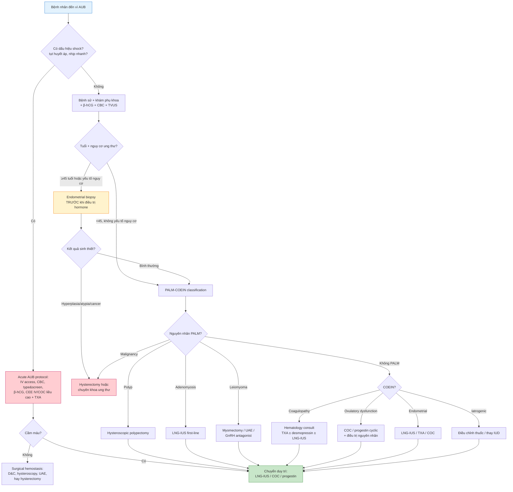

# BÀI HỌC: XUẤT HUYẾT TỬ CUNG BẤT THƯỜNG (AUB) — SINH LÝ, PHÂN LOẠI, PROTOCOL ĐIỀU TRỊ & CASE LÂM SÀNG

**Ngày:** 2026-06-29 | **Chuyên khoa:** Sản phụ khoa tổng quát | **Đối tượng:** Bác sĩ sản phụ khoa, học viên sau đại học

> **Phạm vi:** Sinh lý kinh nguyệt + cơ chế xuất huyết + Định nghĩa AUB/HMB/IMB/DUB + FIGO PALM-COEIN + Khám & cận lâm sàng + Điều trị nội khoa & ngoại khoa + Acute AUB protocol + So sánh guideline FIGO/ACOG/NICE + 6 case lâm sàng giả định + Áp dụng tại Việt Nam.
> **Citation:** Mọi PMID đã fetch abstract qua PubMed E-utilities. Guideline chính: FIGO PALM-COEIN 2011/2016, ACOG PB #557 (acute AUB), ACOG CO #734 (postmenopausal bleeding/TVUS), NICE NG88.

---

## MỤC LỤC

0. TỔNG QUAN — VÌ SAO AUB QUAN TRỌNG?
1. SINH LÝ KINH NGUYỆT BÌNH THƯỜNG
2. CƠ CHẾ CẦM MÁU NỘI MẠC TỬ CUNG
3. ĐỊNH NGHĨA & THUẬT NGỮ (AUB, HMB, IMB, DUB)
4. PHÂN LOẠI FIGO PALM-COEIN
5. KHÁM VÀ CẬN LÂM SÀNG
6. PROTOCOL ĐIỀU TRỊ AUB
7. AUB THEO TỪNG GIAI ĐOẠN TUỔI
8. SO SÁNH GUIDELINE: FIGO vs ACOG vs NICE
9. 6 CASE LÂM SÀNG GIẢ ĐỊNH
10. SAI LẦM THƯỜNG GẶP
11. LƯU ĐỒ QUYẾT ĐỊNH LÂM SÀNG
12. ÁP DỤNG TẠI VIỆT NAM
13. TIPS THỰC HÀNH (CLINICAL PEARLS)
14. TỔNG KẾT ĐIỂM CẦN NHỚ
15. TÀI LIỆU THAM KHẢO

---

## 0. TỔNG QUAN — VÌ SAO AUB QUAN TRỌNG?

**Xuất huyết tử cung bất thường (abnormal uterine bleeding — AUB)** là một trong những lý do phổ biến nhất khiến phụ nữ đến khám phụ khoa. AUB ảnh hưởng đến **chất lượng sống**, gây **thiếu máu**, đôi khi là **dấu hiệu cảnh báo ung thư nội mạc tử cung**, và chiếm một tỷ lệ lớn trong các ca cấp cứu sản phụ khoa.

**Dịch tễ:**
- Heavy menstrual bleeding (HMB) ảnh hưởng đến **10-30% phụ nữ trong độ tuổi sinh sản**.
- AUB là nguyên nhân gây **thiếu máu mạn tính** phổ biến nhất ở phụ nữ tiền mãn kinh.
- **>90% phụ nữ mãn kinh bị ung thư nội mạc tử cung** có triệu chứng đầu tiên là xuất huyết âm đạo bất thường — đây là lý do **không bao giờ bỏ qua PMB** (postmenopausal bleeding).
- AUB do rối loạn đông máu (vWD) chiếm khoảng **13-20% HMB ở vị thành niên**.

**Mục tiêu bài học (6 điểm):**
1. Hiểu sinh lý kinh nguyệt bình thường và cơ chế cầm máu nội mạc.
2. Phân loại AUB theo FIGO PALM-COEIN và phân biệt các thuật ngữ.
3. Thực hiện đúng bộ khám và cận lâm sàng cho từng nhóm tuổi.
4. Áp dụng protocol điều trị nội khoa (hormonal, antifibrinolytic, NSAID) và biết chỉ định phẫu thuật.
5. Quản lý acute AUB an toàn, tránh thiếu máu nặng.
6. Nhận diện được dấu hiệu cảnh báo ung thư và không bỏ sót PMB.

---

## 1. SINH LÝ KINH NGUYỆT BÌNH THƯỜNG

### 1.1. Chu kỳ kinh nguyệt bình thường (FIGO 2011 — Munro)

Trước khi gọi là "bất thường", phải biết "bình thường" là gì. FIGO định nghĩa:

| Thông số | Bình thường | Bất thường |
|---|---|---|
| **Tần suất** | 24-38 ngày | <24 hoặc >38 ngày |
| **Độ dài chu kỳ thay đổi** | <7-9 ngày giữa các chu kỳ | ≥9 ngày |
| **Thởi gian kinh** | ≤8 ngày | >8 ngày |
| **Lượng máu** | Không ảnh hưởng sinh hoạt, không gây thiếu máu | Cần thay băng vệ sinh ≥1 lần/giờ, cục máu >2.5 cm, kéo dài >7 ngày, Hb giảm |

**Nguồn gốc kinh nguyệt:** Chu kỳ kinh là kết quả của sự phối hợp giữa **trục HPO (hypothalamic-pituitary-ovarian)**, buồng trứng, và niêm mạc tử cung.

### 1.2. Trục HPO và chu kỳ nội mạc

**Giai đoạn nang (follicular phase):**
- GnRH → FSH → nang trứng phát triển → estrogen tăng.
- Estrogen kích thích tăng sinh nội mạc tử cung (proliferative phase).
- Khi estrogen đỉnh → positive feedback → LH surge → rụng trứng.

**Giai đoạn hoàng thể (luteal phase):**
- Corpus luteum tiết progesterone → chuyển nội mạc sang secretory phase.
- Nếu không có thai → corpus luteum thoái hóa → progesterone giảm mạnh → kinh nguyệt bắt đầu.

**Điểm then chốt:** Progesterone withdrawal là tín hiệu khởi động kinh nguyệt. Nếu không có phóng noãn (anovulation), nội mạc bị estrogen kích thích liên tục không có progesterone đối kháng → tăng sinh quá mức → khi niêm mạc bị bong tróc không đồng bộ → xuất huyết bất thường, kéo dài.

### 1.3. Cấu trúc nội mạc tử cung

| Lớp | Đặc điểm | Chức năng |
|---|---|---|
| **Basalis** | Lớp đáy, không bong trong kinh nguyệt | Tái tạo functionalis sau kinh |
| **Functionalis** | Lớp chức năng, bong trong kinh | Chịu ảnh hưởng hormone, nơi làm tổ |
| **Epithelial surface** | Biểu mô tuyến | Bao phủ bề mặt |

**Cơ chế shed:** Khi progesterone giảm, các yếu tố pro-inflammatory (PGF2α, IL-8, TNF-α) tăng → MMPs (matrix metalloproteinases) kích hoạt → phân hủy ECM → vỡ mạch máu → kinh nguyệt.

---

## 2. CƠ CHẾ CẦM MÁU NỘI MẠC TỬ CUNG

Sau khi nội mạc bong, cơ thể phải cầm máu trong vòng vài giờ đến vài ngày. Có **4 cơ chế chính:**

### 2.1. Co mạch (Vasoconstriction)

- **Động mạch xoắn (spiral arterioles)** trong nội mạc co lại do:
  - Prostaglandin F2α (PGF2α) — mạnh nhất
  - Endothelin-1
  - Thromboxane A2
- Co mạch giảm lưu lượng máu đến bề mặt nội mạc.

### 2.2. Huyết khối (Thrombosis)

- Tổn thương mạch máu → tiểu cầu bám → huyết khối tại chỗ.
- Fibrin trong mạch máu bị tan bởi plasmin; cân bằng này được điều hòa bởi:
  - **PAI-1** (plasminogen activator inhibitor-1) — ức chế fibrinolysis
  - **tPA/uPA** — thúc đẩy fibrinolysis
- Nếu fibrinolysis quá mạnh → chảy máu kéo dài → đây là lý do **tranexamic acid** hiệu quả trong HMB.

### 2.3. Tái lập biểu mô (Re-epithelialization)

- Các tế bào biểu mô từ lớp basalis di chuyển lên phủ kín bề mặt vết loét.
- Quá trình này bắt đầu ngay sau khi kinh nguyệt xảy ra và hoàn tất trong vài ngày.
- Yếu tố tăng trưởng (EGF, VEGF, TGF-β) đóng vai trò quan trọng.

### 2.4. Cơ chế tại chỗ của nội mạc (Local endometrial hemostasis)

- Nội mạc tử cung tự sản xuất các yếu tố đông máu (fibrinogen, thrombin, plasminogen).
- Estrogen và progesterone điều chỉnh số lượng và chức năng của các yếu tố này.

**Ý nghĩa lâm sàng:** Mọi yếu tố làm rối loạn 4 cơ chế trên đều có thể gây AUB — từ rối loạn đông máu (coagulopathy), rối loạn phóng noãn (anovulation), đến tổn thương cấu trúc tử cung (polyp, myoma).

---

## 3. ĐỊNH NGHĨA & THUẬT NGỮ (AUB, HMB, IMB, DUB)

### 3.1. Abnormal uterine bleeding (AUB)

AUB là xuất huyết tử cung **khác với kinh nguyệt bình thường** về tần suất, độ dài, lượng máu, hoặc thờii điểm xuất hiện — **không do thai kỳ**.

### 3.2. Heavy menstrual bleeding (HMB)

**HMB = lượng kinh nhiều**, gây ảnh hưởng chất lượng sống hoặc thiếu máu, bất kể chu kỳ đều hay không.
- Định lượng: PBAC (Pictorial Blood Loss Assessment Chart) score ≥100 = HMB.
- Cũ hơn gọi là **menorrhagia** — FIGO 2011 khuyến cáo bỏ thuật ngữ này vì không rõ ràng.

### 3.3. Intermenstrual bleeding (IMB)

**IMB = chảy máu giữa chu kỳ**. Cũ gọi là **metrorrhagia** — cũng nên bỏ.

### 3.4. Dysfunctional uterine bleeding (DUB)

**DUB là thuật ngữ cũ** chỉ AUB không có tổn thương cấu trúc, thường do rối loạn phóng noãn. FIGO khuyến cáo **KHÔNG dùng DUB** nữa — thay bằng AUB-O (ovulatory dysfunction) hoặc AUB-E (endometrial).

### 3.5. Acute AUB vs Chronic AUB

| Đặc điểm | Acute AUB | Chronic AUB |
|---|---|---|
| **Định nghĩa** | Xuất huyết nặng, cấp tính, đủ để gây tình trạng huyết động bất ổn | Xuất huyết bất thường kéo dài ≥6 tháng |
| **Mục tiêu đầu tiên** | Ổn định huyết động, cầm máu | Tìm nguyên nhân, điều trị dài hạn |
| **Nơi xử trí** | BV/cấp cứu | Phòng khám |
| **Thuốc đầu tay** | IV estrogen, COC liều cao, TXA, progestin | LNG-IUS, COC, TXA, progestin |

---

## 4. PHÂN LOẠI FIGO PALM-COEIN

### 4.1. Nguyên tắc PALM-COEIN

**PALM = structural causes** (chẩn đoán bằng hình ảnh/histology):
- **P** = Polyp
- **A** = Adenomyosis
- **L** = Leiomyoma
- **M** = Malignancy/hyperplasia

**COEIN = non-structural causes** (chẩn đoán bằng lâm sàng/xét nghiệm):
- **C** = Coagulopathy
- **O** = Ovulatory dysfunction
- **E** = Endometrial (primary endometrial disorder)
- **I** = Iatrogenic
- **N** = Not yet classified

Munro 2016 (PMID 27836285): FIGO đã loại bỏ các thuật ngữ cũ như menorrhagia, metrorrhagia, DUB để thay bằng hệ thống AUB trong độ tuổi sinh sản + PALM-COEIN.

### 4.2. Chi tiết từng nhóm

#### AUB-P: Polyp (Polype)

- **Triệu chứng điển hình:** IMB, HMB, chảy máu sau giao hợp (postcoital bleeding).
- **Chẩn đoán:** Siêu âm đầu dò âm đạo + **SIS (saline infusion sonohysterography)**.
- **Điều trị:** Polypectomy (hysteroscopy) là gold standard; nếu polyp nhỏ, mãn kinh, không triệu chứng → theo dõi.

#### AUB-A: Adenomyosis

- **Đặc điểm:** Nội mạc tử cung lạc vào cơ tử cung.
- **Triệu chứng:** Kinh nhiều + đau bụng kinh nặng, tử cung to, mềm, đau.
- **Siêu âm:** Junctional zone không đều/dày >12 mm, cyst nhỏ trong cơ tử cung, "fan-shaped" shadowing.
- **MRI:** Dòng giới hạn junctional zone dày >12 mm là chuẩn vàng hình ảnh.
- **Điều trị:** LNG-IUS là first-line; GnRH antagonist (relugolix/elagolix) cho ngắn hạn; hysterectomy khi điều trị nội khoa thất bại và không muốn con.

#### AUB-L: Leiomyoma (u xơ tử cung)

- U xơ được phân loại theo FIGO (type 0-8) dựa trên vị trí.
- **U xơ dưới niêm (submucosal, type 0-2)** gây AUB nhiều nhất.
- **U xơ trong cơ (intramural)** gây AUB nếu >4-5 cm hoặc tiếp xúc với cavity.
- **U xơ dưới thanh mạc (subserosal)** hiếm khi gây AUB.
- **Điều trị:** Myomectomy cơ học (hysteroscopic cho submucosal), GnRH agonist/antagonist thu nhỏ trước mổ, UAE, hysterectomy khi đủ con.

Diaz 2025 (PMID 40927887) — FIGO best practice: GnRH antagonist được FDA/EMA duyệt cho u xơ; COC, progestin, LNG-IUS, TXA có thể giảm HMB dù không được chỉ định chính thức cho u xơ.

#### AUB-M: Malignancy/hyperplasia

- **Endometrial cancer:** Triệu chứng đầu tiên ở >90% phụ nữ mãn kinh là PMB.
- **Endometrial hyperplasia:** Gắn với estrogen không đối kháng (obesity, PCOS, anovulation, tamoxifen).
- **Chẩn đoán xác định:** Sinh thiết nội mạc (endometrial biopsy) hoặc D&C/hysteroscopy.
- **Tầm soát:** Phụ nữ ≥45 tuổi, hoặc <45 tuổi có yếu tố nguy cơ (obesity, PCOS, tamoxifen, gia đình Lynch), cần sinh thiết nếu AUB kéo dài.

#### AUB-C: Coagulopathy

- **vWD (von Willebrand disease)** là nguyên nhân phổ biến nhất ở vị thành niên HMB.
- Các rối loạn đông máu khác: thrombocytopenia, hemophilia, platelet dysfunction.
- **Tầm soát:** Ở vị thành niên HMB nặng từ menarche, hoặc có tiền sử chảy máu kéo dài sau nhổ răng/phẫu thuật.

Masood 2025 (PMID 41050634): LNG-IUS hiệu quả nhất trong AUB do rối loạn đông máu; TXA hoặc DDAVP có thể phối hợp.

#### AUB-O: Ovulatory dysfunction

- **Nguyên nhân:** PCOS, thyroid disease, hyperprolactinemia, stress, weight loss/gain, perimenopause.
- **Cơ chế:** Estrogen không có progesterone đối kháng → nội mạc tăng sinh quá mức → bong tróc không đồng đều.
- **Điều trị:** Progestin cyclic hoặc COC; ở PCOS cần quản lý insulin/metformin; đối với phụ nữ lớn tuổi (>45) cần loại trừ hyperplasia trước khi điều trị hormone.

#### AUB-E: Endometrial

- Chẩn đoán **loại trừ** sau khi đã loại bỏ PALM, C, O, I.
- **Đặc điểm:** Nội mạc bình thường về mặt cấu trúc nhưng rối loạn chức năng cầm máu cục bộ — tăng fibrinolysis, tăng PGs, rối loạn mạch máu.
- **Điều trị:** LNG-IUS, TXA, COC, NSAID.

#### AUB-I: Iatrogenic

- Các thuốc: anticoagulants, antipsychotics (risperidone → hyperprolactinemia), tamoxifen, corticosteroids.
- Thiết bị: IUD đồng (copper IUD) gây HMB phổ biến.
- Hormone therapy: unopposed estrogen, irregular progestin use.

#### AUB-N: Not yet classified

- Các nguyên nhân chưa xác định rõ: vascular malformation, chronic endometritis, myometrial hypertrophy...

---

## 5. KHÁM VÀ CẬN LÂM SÀNG

### 5.1. Bệnh sử chi tiết

| Yếu tố | Nội dung cần hỏi |
|---|---|
| **Lượng máu** | Băng vệ sinh ướt đẫm? Cần thay ≥1 lần/giờ? Cục máu? |
| **Thờii gian** | Kinh kéo dài bao lâu? Chu kỳ bao nhiêu ngày? Đều không? |
| **Đau** | Đau bụng kinh? Đau giao hợp? |
| **Tuổi** | Vị thành niên, sinh sản, tiền mãn kinh, mãn kinh? |
| **PMB** | Đã mãn kinh bao lâu? Bất kỳ chảy máu nào cũng phải đánh giá! |
| **Tiền sử** | Chảy máu sau nhổ răng/phẫu thuật? Bệnh đông máu? Gia đình? |
| **Sản khoa** | Mang thai? Sẩy thai? Nạo hút? IUD? |
| **Thuốc** | Anticoagulant? Tamoxifen? Hormone? Antipsychotic? |

### 5.2. Khám thực thể

- **Khám bụng:** Tử cung to? Đau?
- **Khám âm đạo:** Cổ tử cung bình thường? Polyp lộ? Tử cung to, đều hay không đều?
- **Khám trực tràng** nếu cần.

### 5.3. Cận lâm sàng

| Xét nghiệm | Chỉ định |
|---|---|
| **β-hCG** | Mọi phụ nữ trong độ tuổi sinh sản, bất kể triệu chứng |
| **CBC** | Đánh giá thiếu máu, mức độ mất máu |
| **Fe/TIBC/ferritin** | Nếu nghi thiếu sắt |
| **Đông máu cơ bản** | PT, aPTT, fibrinogen nếu chảy máu nặng |
| **TSH, prolactin** | Nghi rối loạn phóng noãn |
| **Siêu âm đầu dò âm đạo** | First-line imaging cho mọi AUB |
| **SIS (sonohysterography)** | Nghi polyp/submucosal fibroid, đánh giá cavity |
| **MRI** | Nghi adenomyosis, phân loại u xơ phức tạp |
| **Endometrial biopsy** | ≥45 tuổi AUB, <45 tuổi có yếu tố nguy cơ ung thư, PMB |
| **Hysteroscopy + biopsy** | Vàng chuẩn khi siêu âm bất thường hoặc PMB ET >4mm |

### 5.4. Chỉ định sinh thiết nội mạc (Endometrial biopsy)

**Phải sinh thiết khi:**
- Tuổi ≥45 với AUB mới hoặc thay đổi kinh nguyệt.
- PMB bất kể tuổi.
- <45 tuổi có yếu tố nguy cơ: obesity (BMI ≥30), PCOS, tamoxifen, gia đình Lynch/Cowden, diabetes type 2, unopposed estrogen.
- Siêu âm: endometrium dày (>4mm ở PMB; >14-16mm ở tiền mãn kinh tuỳ ngữ cảnh).
- Điều trị nội khoa thất bại.

ACOG CO #734 (PMID 29683909): Ở PMB, **ET ≤4 mm** có **NPV >99%** cho ung thư nội mạc → có thể bỏ qua sinh thiết nếu lần đầu chảy máu, không yếu tố nguy cơ. ET >4 mm cần sinh thiết.

### 5.5. Đánh giá lượng máu — PBAC

**PBAC score:**
- Băng vệ sinh nhẹ ướt = 1 điểm
- Băng vệ sinh vừa ướt = 5 điểm
- Băng vệ sinh ướt đẫm = 20 điểm
- Cục máu nhỏ (≤2.5 cm) = 1 điểm; cục máu lớn (>2.5 cm) = 5 điểm
- Thay băng do lý do vệ sinh = 0 điểm; thay do ướt = + điểm
- **PBAC ≥100 = HMB**

---

## 6. PROTOCOL ĐIỀU TRỊ AUB

### 6.1. Nguyên tắc chung

1. **Ổn định huyết động** nếu acute AUB.
2. **Xác định nguyên nhân** theo PALM-COEIN.
3. **Điều trị theo nguyên nhân** + bảo tồn khả năng sinh sản nếu bệnh nhân muốn con.
4. **Bổ sung sắt** cho tất cả bệnh nhân thiếu máu.
5. **Theo dõi đáp ứng** sau 3-6 tháng.

### 6.2. Điều trị nội khoa — First-line cho HMB/AUB

| Thuốc | Cơ chế | Liều | Chỉ định | Chống chỉ định |
|---|---|---|---|---|
| **LNG-IUS** (Mirena®) | Progestin địa phương, làm mỏng nội mạc | Đặt 5 năm | HMB nguyên nhân không rõ, AUB-O, adenomyosis | Cổ tử cung viêm nhiễm, nghi ung thư, bệnh gan nặng |
| **COC** | Ức chế HPO, ổn định nội mạc | 1 viên/ngày (21/7 hoặc 24/4) | AUB-O, HMB, cần tránh thai | Hút thuốc ≥35 tuổi, migraine có aura, tiền sử huyết khối |
| **Tranexamic acid** | Ức chế plasminogen → giảm fibrinolysis | 1-1.5g x 3-4 lần/ngày, uống trong 3-5 ngày đầu kinh | HMB, AUB-E | Tiền sử huyết khối, hematuria do rối loạn fibrinolysis |
| **NSAID** (ibuprofen, mefenamic acid) | Ức chế COX → giảm PGs | Ibuprofen 400-600mg q6-8h trong kinh | HMB nhẹ-vừa, đau bụng kinh | Loét dạ dày, suy thận, đông máu bất thường |
| **Progestin** (norethisterone, medroxyprogesterone, DMPA) | Chuyển hóa nội mạc, ức chế rụng trứng | Tuỳ loại: cyclic 5-10mg/ngày ngày 5-26 chu kỳ | AUB-O, điều trị cấp tính | Mang thai, ung thư nội tiết |
| **GnRH agonist** (leuprolide) | Tắt HPO, tạo trạng thái giả mãn kinh | 3.75mg IM/tháng | Thu nhỏ u xơ trước mổ, HMB nặng tạm thờii | Loãng xương khi dùng >6 tháng |
| **GnRH antagonist** (relugolix combo) | Đối kháng GnRH receptor + add-back | 1 viên/ngày | U xơ, đau do endometriosis | Thờii gian giới hạn 24 tháng |

**Evidence:**
- Vani Lanka 2026 (PMID 41664752): Trong 240 phụ nữ HMB, **LNG-IUS giảm PBAC 93% sau 6 tháng**, TXA giảm 78%, DMPA giảm 78%, COC giảm ~70%. LNG-IUS có tuân thủ cao nhất và cải thiện Hb đáng kể.
- NICE NG88: First-line cho HMB là **LNG-IUS**; nếu từ chối hoặc chống chỉ định → COC, TXA, NSAID.

### 6.3. Acute AUB — Protocol cấp cứu

ACOG PB #557 (PMID 23635706): Đánh giá huyết động đầu tiên, sau đó cầm máu y tế.

**Bước 1: Đánh giá huyết động**
- Tụt huyết áp, nhịp tim nhanh, da lạnh, ẩm → **shock mất máu**.
- CBC, type & screen/crossmatch, đông máu, β-hCG.

**Bước 2: Cầm máu y tế**
| Thuốc | Liều lượng | Ghi chú |
|---|---|---|
| **Conjugated equine estrogen (CEE) IV** | 25mg IV mỗi 4-6 giờ, tối đa 24 giờ | Hiệu quả cầm máu nhanh, thường dùng trong 24h |
| **COC liều cao** | 1 viên 3 lần/ngày x 7 ngày, sau đó giảm dần | Phổ biến hơn CEE IV ở nhiều cơ sở |
| **TXA** | 1-1.3g IV hoặc PO 3-4 lần/ngày | Kết hợp với estrogen |
| **Progestin** | Medroxyprogesterone 20mg 3 lần/ngày hoặc norethisterone 5mg 3 lần/ngày | Khi không dùng estrogen |

**Bước 3: Hỗ trợ**
- Truyền máu nếu Hb <7 g/dL hoặc có triệu chứng thiếu máu nặng.
- Bổ sung sắt.

**Bước 4: Chuyển sang duy trì sau khi cầm máu**
- COC hàng ngày, LNG-IUS, hoặc progestin cyclic.

### 6.4. Điều trị ngoại khoa

| Phương pháp | Chỉ định | Ưu điểm | Nhược điểm |
|---|---|---|---|
| **Polypectomy hysteroscopy** | Polyp gây AUB/IMB | Tối thiểu xâm lấn, chẩn đoán + điều trị | Rủi ro thủng tử cung thấp |
| **Myomectomy** | U xơ dưới niêm/type 0-2, hoặc u xơ trong cơ gây HMB | Bảo tồn tử cung | Tái phát 15-30% |
| **UAE (uterine artery embolization)** | U xơ lớn, không muốn mổ | Ít xâm lấn, giữ tử cung | Có thể gây mãn kinh sớm, đau sau thủ thuật |
| **Endometrial ablation** | HMB không rõ nguyên nhân, đủ con, không muốn hysterectomy | Nhanh, hiệu quả 80-90% | Không dùng nếu muốn con sau; nguy cơ thai ngoài tử cung |
| **Hysterectomy** | Mọi điều trị khác thất bại, u xơ lớn, adenomyosis nặng, ung thư/tiền ung thư | Chữa khỏi triệt để | Phẫu thuật lớn, mất khả năng sinh sản |

### 6.5. Bổ sung sắt

Mọi bệnh nhân AUB/HMB nên được tầm soát thiếu máu và thiếu sắt.
- Ferrous sulfate 65mg (elemental iron 325mg) 1 viên/ngày hoặc 2 lần/ngày.
- Nếu thiếu máu nặng (Hb <8 g/dL) hoặc không dung nạp đường uống → truyền sắt IV (ferric carboxymaltose).

---

## 7. AUB THEO TỪNG GIAI ĐOẠN TUỔI

### 7.1. Vị thành niên (Adolescents)

- **Nguyên nhân phổ biến nhất:** AUB-O do trục HPO chưa trưởng thành → anovulation.
- **Phải loại trừ:** rối loạn đông máu (vWD), mang thai, nhiễm trùng, tổn thương cấu trúc.
- **Tầm soát vWD:** Ở HMB nặng từ menarche hoặc tiền sử chảy máu bất thường.
- **Điều trị:** COC hoặc progestin cyclic là first-line; TXA có thể dùng.

Brookhart 2025 (PMID 40924008): AUB ở vị thành niên — nhấn mạnh HPO axis immaturity, coagulopathy, PCOS; dùng PALM-COEIN với tập trung vào C, O, I.

### 7.2. Phụ nữ trong độ tuổi sinh sản

- **PALM:** Polyp, adenomyosis, leiomyoma là phổ biến.
- **COEIN:** PCOS (O), rối loạn đông máu (C), IUD đồng (I), AUB-E.
- **Ưu tiên bảo tồn sinh sản:** LNG-IUS, COC, TXA, myomectomy/polypectomy có chọn lọc.

### 7.3. Tiền mãn kinh (Perimenopause)

- **Nguyên nhân phổ biến nhất:** AUB-O do suy buồng trứng, rụng trứng không đều.
- **Nguy cơ ung thư tăng** do nội mạc bị estrogen kích thích kéo dài.
- **Phải sinh thiết nội mạc** nếu ≥45 tuổi hoặc có yếu tố nguy cơ.
- **Điều trị:** Progestin cyclic, LNG-IUS; nếu không muốn hormone → TXA/NSAID.

### 7.4. Mãn kinh (Postmenopause)

- **PMB = ung thư nội mạc tử cung cho đến khi chứng minh ngược lại.**
- **Đánh giá:** TVUS ET; nếu ET >4 mm → sinh thiết/hysteroscopy.
- **Không nên dùng hormone ức chế kinh nguyệt để "điều trị" PMB** — phải loại trừ ung thư trước.

---

## 8. SO SÁNH GUIDELINE: FIGO vs ACOG vs NICE

| Nội dung | FIGO 2011/2016 | ACOG | NICE NG88 (2018) |
|---|---|---|---|
| **Phân loại** | **PALM-COEIN** — thay thế thuật ngữ cũ | Sử dụng PALM-COEIN; PB #557 cho acute AUB | Phân loại HMB theo nguyên nhân |
| **HMB định nghĩa** | Lượng máu ảnh hưởng QoL, PBAC ≥100 | Tương tự | HMB = lượng máu gây ảnh hưởng sinh hoạt |
| **First-line HMB** | Không có one-size-fits-all; điều trị theo nguyên nhân | LNG-IUS, COC, TXA, NSAID | **LNG-IUS là first-line** |
| **Second-line HMB** | Progestin, GnRH analog, surgery | COC, TXA, progestin, surgery | COC, TXA, NSAID, surgery |
| **Sinh thiết nội mạc** | Tuỳ nguy cơ ung thư | ≥45 tuổi hoặc yếu tố nguy cơ; PMB ET >4mm cần sinh thiết | PMB ET >4mm hoặc yếu tố nguy cơ |
| **Acute AUB** | Không có guideline chi tiết | **PB #557**: estrogen IV/COC liều cao + TXA; phẫu thuật nếu thất bại | Không có acute protocol riêng |
| **Imaging first-line** | TVUS | TVUS | TVUS |
| **SIS/Hysteroscopy** | Polyp/submucosal lesion | Nghi polyp/submucosal fibroid | Nghi cấu trúc bất thường |

Tsakiridis 2022 (PMID 36053280): Review so sánh ACOG, NICE, RANZCOG, SOGC, FIGO — đồng thuận về lịch sử + khám; TVUS first-line; endometrial biopsy chỉ khi có yếu tố nguy cơ; điều trị nội khoa first-line nếu không có tổn thương cấu trúc.

---

## 9. 6 CASE LÂM SÀNG GIẢ ĐỊNH

### Case 1: Vị thành niên HMB nặng — Nghi vWD

**Bệnh nhân:** Nữ 14 tuổi, menarche 1 năm. Kinh rất nhiều, phải thay băng vệ sinh mỗi giờ, nhiều cục máu to. Mệt mỏi, da nhợt nhạt. Hb 7.2 g/dL. Tiền sử: nhổ răng khôn chảy máu 2 ngày.

**Phân tích:**
- **Chẩn đoán ban đầu:** HMB nặng, thiếu máu trung bình.
- **Nguyên nhân nghi ngờ:** AUB-C (coagulopathy, có thể vWD) hoặc AUB-O (HPO immaturity).
- **Xét nghiệm:** CBC, đông máu cơ bản, vWD panel (vWF antigen, vWF activity, factor VIII), ferritin, β-hCG.
- **Xử trí cấp:** TXA 1g x 3 lần/ngày + COC liều cao (1 viên 3 lần/ngày) hoặc CEE IV nếu nhập viện; truyền máu nếu Hb <7 g/dL hoặc shock.
- **Xử trí dài hạn:** Nếu vWD (+) → desmopressin + TXA trong kinh; nếu vWD (-) → COC hoặc LNG-IUS.

### Case 2: PCOS + AUB-O ở tuổi sinh sản

**Bệnh nhân:** Nữ 28 tuổi, BMI 32. Chu kỳ kinh 2-4 tháng/lần. Lần này chảy máu kéo dài 18 ngày, lượng vừa. Mụn, rậm lông. Siêu âm: buồng trứng đa nang, nội mạc dày 14 mm.

**Phân tích:**
- **Chẩn đoán:** AUB-O do PCOS.
- **Loại trừ:** Phải sinh thiết nội mạc trước khi điều trị hormone vì nội mạc dày + obesity.
- **Điều trị:** Sau khi loại trừ hyperplasia/ung thư → COC hoặc progestin cyclic 10-14 ngày/tháng; metformin nếu insulin resistance; giảm cân.

### Case 3: HMB do u xơ dưới niêm

**Bệnh nhân:** Nữ 35 tuổi, đa sản 2 con, không muốn sinh thêm. Kinh nhiều 2 năm, Hb 8.5 g/dL. Siêu âm: u xơ dưới niêm type 1, kích thước 2.5 cm, đẩy vào lòng tử cung.

**Phân tích:**
- **Chẩn đoán:** AUB-L (submucosal leiomyoma).
- **Điều trị:** Hysteroscopic myomectomy là lựa chọn tốt nhất — vừa chẩn đoán vừa điều trị, bảo tồn tử cung.
- **Dự phòng tái phát HMB:** Có thể đặt LNG-IUS sau mổ nếu còn HMB.

### Case 4: Adenomyosis ở tuổi 42

**Bệnh nhân:** Nữ 42 tuổi. Đau bụng kinh nặng 5 năm, kinh nhiều, đau giao hợp. Tử cung to bằng quả trứng gà, mềm, đau. Siêu âm: junctional zone dày 16 mm, không đều.

**Phân tích:**
- **Chẩn đoán:** AUB-A (adenomyosis).
- **Điều trị:**
  - First-line: **LNG-IUS** (Mirena).
  - Nếu đau nhiều: NSAID trong kinh.
  - Nếu thất bại: GnRH antagonist + add-back therapy trong 12-24 tháng.
  - Hysterectomy nếu đủ con, điều trị nội khoa thất bại.

### Case 5: Tiền mãn kinh + AUB kéo dài

**Bệnh nhân:** Nữ 48 tuổi. Kinh không đều 1 năm, lần này chảy máu 20 ngày. BMI 34, PCOS tiền sử. Siêu âm: nội mạc dày 18 mm, không polyp.

**Phân tích:**
- **Nguy cơ:** Estrogen không đối kháng → endometrial hyperplasia/malignancy.
- **BẮT BUỘC:** Endometrial biopsy trước khi điều trị hormone.
- **Nếu simple hyperplasia:** Progestin (MPA 10-20mg/ngày) 3-6 tháng, sau đó sinh thiết lại.
- **Nếu atypical hyperplasia/carcinoma:** Hysterectomy.

### Case 6: Xuất huyết sau mãn kinh

**Bệnh nhân:** Nữ 58 tuổi, mãn kinh 6 năm, chảy máu âm đạo nhẹ 2 lần trong 1 tháng. BMI 28. Không dùng HRT.

**Phân tích:**
- **PMB = ung thư nội mạc tử cung cho đến khi chứng minh ngược lại.**
- **Làm ngay:** TVUS đo ET; nếu ET >4 mm → endometrial biopsy/hysteroscopy.
- **Nếu ET ≤4 mm và lần đầu PMB:** Có thể theo dõi 1-2 tháng; nếu tái phát → sinh thiết.
- **Không được:** Kê hormone "cầm máu" khi chưa loại trừ ung thư.

---

## 10. SAI LẦM THƯỜNG GẶP

| # | Sai lầm | Hậu quả | Cách tránh |
|---|---|---|---|
| 1 | Không làm β-hCG ở phụ nữ trong độ tuổi sinh sản | Bỏ sót thai ngoài tử cung, sảy thai, thai lưu | Mọi AUB ở tuổi sinh sản đều phải test β-hCG |
| 2 | Không sinh thiết nội mạc ở ≥45 tuổi hoặc có yếu tố nguy cơ | Bỏ sót ung thư nội mạc/hyperplasia | Sinh thiết trước khi điều trị hormone dài hạn |
| 3 | Dùng estrogen liều cao cấp tính mà không kèm progestin | Tăng nguy cơ hyperplasia, chảy máu tiếp tục | COC hoặc estrogen + progestin phối hợp |
| 4 | Chẩn đoán "DUB" mà không tìm nguyên nhân theo PALM-COEIN | Điều trị sai, tái phát | Dùng PALM-COEIN toàn diện |
| 5 | Bỏ qua rối loạn đông máu ở vị thành niên HMB | Chảy máu kéo dài, thiếu máu nặng | Tầm soát vWD nếu HMB từ menarche hoặc tiền sử chảy máu bất thường |
| 6 | Điều trị PMB bằng hormone trước khi loại trừ ung thư | Chậm chẩn đoán ung thư giai đoạn muộn | Luôn đánh giá ET + sinh thiết nếu cần trước |

---

## 11. LƯU ĐỒ QUYẾT ĐỊNH LÂM SÀNG

---

## 12. ÁP DỤNG TẠI VIỆT NAM

**Tình hình thực tế:**
- AUB là lý do khám phụ khoa phổ biến tại các BV tuyến tỉnh và Trung ương.
- Nhiều cơ sở tuyến dưới chưa có hysteroscopy; TVUS là cận lâm sàng chủ yếu.
- LNG-IUS (Mirena) đã có tại Việt Nam nhưng giá còn cao (~2-3 triệu/1 lần đặt 5 năm), BHYT chưa chi trả rộng rãi.
- TXA (Transamin®) rẻ, sẵn có, thường được dùng đầu tay ở tuyến cơ sở.

**Khuyến cáo thực hành:**
1. **Tuyến cơ sở:** TXA + NSAID + sắt; chuyển tuyến trên nếu Hb <8 g/dL, chảy máu >7 ngày, hoặc nghi cấu trúc bất thường.
2. **Tuyến trên:** TVUS + SIS + hysteroscopy + sinh thiết nội mạc theo chỉ định.
3. **PMB:** Bắt buộc TVUS ET; ET >4 mm phải sinh thiết — đừng chỉ kê hormone "cầm máu".
4. **Vị thành niên HMB nặng:** Nên tầm soát vWD; nếu cơ sở không làm được → chuyển BV tuyến trên.
5. **Giáo dục bệnh nhân:** PBAC chart có thể tự theo dõi; nhấn mạnh dấu hiệu cần đi khám ngay (chóng mặt, tim đập nhanh, chảy máu >7 ngày).

---

## 13. TIPS THỰC HÀNH (CLINICAL PEARLS)

1. **AUB không phải là chẩn đoán — đó là triệu chứng.** Luôn tìm nguyên nhân theo PALM-COEIN.

2. **PMB = ung thư nội mạc tử cung cho đến khi chứng minh ngược lại.** Không bao giờ bỏ qua, dù chỉ chảy máu 1 lần nhẹ.

3. **β-hCG là xét nghiệm đầu tiên** cho mọi phụ nữ trong độ tuổi sinh sản, bất kể bệnh nhân nói "tôi không thể có thai".

4. **LNG-IUS là "vua" trong HMB/AUB-E/AUB-O.** Giảm >90% lượng máu sau 6 tháng, đồng thờii là biện pháp tránh thai hiệu quả.

5. **TXA an toàn và rẻ** — dùng trong 3-5 ngày đầu kinh, hiệu quả giảm 40-50% lượng máu.

6. **Đừng quên sắt.** Thiếu máu do HMB thường đi kèm thiếu sắt; bổ sung sắt giúp bệnh nhân cảm thấy khỏe hơn nhanh hơn.

7. **Ở vị thành niên HMB nặng từ menarche, nghĩ ngay vWD** — không phải chỉ do "trục HPO chưa ổn định".

8. **Siêu âm đầu dò là first-line**, nhưng **SIS tốt hơn nhiều** để đánh giá polyp và u xơ dưới niêm.

9. **Chronic AUB kéo dài ≥6 tháng** cần tìm nguyên nhân xác định; đừng chỉ kê thuốc cầm máu mãi.

10. **Khi chuyển từ cấp cứu sang duy trì**, phải có kế hoạch rõ ràng — nếu không, bệnh nhân sẽ tái phát chảy máu.

---

## 14. TỔNG KẾT ĐIỂM CẦN NHỚ

1. **AUB là triệu chứng, không phải chẩn đoán cuối cùng.** Phải tìm nguyên nhân theo **FIGO PALM-COEIN**.

2. **PALM = structural** (P-polyp, A-adenomyosis, L-leiomyoma, M-malignancy); **COEIN = non-structural** (C-coagulopathy, O-ovulatory dysfunction, E-endometrial, I-iatrogenic, N-not classified).

3. **HMB** = lượng kinh nhiều; **IMB** = chảy máu giữa chu kỳ; **DUB** là thuật ngữ cũ, không nên dùng.

4. **PMB bất kỳ** đều phải đánh giá loại trừ ung thư nội mạc — **ET >4 mm trên TVUS cần sinh thiết** (ACOG CO #734).

5. **Acute AUB:** Ổn định huyết động đầu tiên → **CEE IV hoặc COC liều cao + TXA**; phẫu thuật nếu thất bại (ACOG PB #557).

6. **First-line HMB/AUB:** **LNG-IUS** hiệu quả nhất (giảm ~93% PBAC sau 6 tháng), tiếp theo là COC, TXA, NSAID.

7. **Vị thành niên HMB nặng:** Tầm soát **vWD** và các rối loạn đông máu.

8. **≥45 tuổi hoặc yếu tố nguy cơ ung thư** cần **sinh thiết nội mạc trước** khi điều trị hormone dài hạn.

9. **SIS và hysteroscopy** là công cụ tốt để đánh giá polyp và u xơ dưới niêm; TVUS alone nhạy cảm thấp cho polyp (Se ~51%).

10. **Bổ sung sắt** là một phần không thể thiếu trong quản lý AUB/HMB — đừng chỉ tập trung cầm máu mà quên tái tạo máu.

---

## 15. TÀI LIỆU THAM KHẢO

### Guideline Tier 0:
1. **Munro MG et al. (2016)** "Practical aspects of the two FIGO systems for management of abnormal uterine bleeding in the reproductive years." *Best Pract Res Clin Obstet Gynaecol.* PMID: **27836285**. [FETCHED] [GUIDELINE VERIFIED] — FIGO System 1 (nomenclature) và System 2 (PALM-COEIN).

2. **Madhra M et al. (2014)** "Abnormal uterine bleeding: advantages of formal classification to patients, clinicians and researchers." *Acta Obstet Gynecol Scand.* PMID: **24702613**. [FETCHED] [DIRECTION ONLY] — Giải thích lợi ích của PALM-COEIN so với thuật ngữ cũ.

3. **ACOG Practice Bulletin No. 557 (2013)** "Management of acute abnormal uterine bleeding in nonpregnant reproductive-aged women." *Obstet Gynecol.* PMID: **23635706**. [FETCHED] [GUIDELINE VERIFIED] — Protocol cấp cứu acute AUB: estrogen IV/COC liều cao + TXA, phẫu thuật khi thất bại.

4. **ACOG Committee Opinion No. 734 (2018)** "The Role of Transvaginal Ultrasonography in Evaluating the Endometrium of Women With Postmenopausal Bleeding." *Obstet Gynecol.* PMID: **29683909**. [FETCHED] [GUIDELINE VERIFIED] — ET ≤4 mm có NPV >99% cho ung thư nội mạc; ET >4 mm cần sinh thiết.

### NICE Guideline (không có PMID riêng):
5. **NICE NG88 (2018)** "Heavy menstrual bleeding: assessment and management." [GUIDELINE VERIFIED] — LNG-IUS là first-line; nếu từ chối → COC/TXA/NSAID.

### Chẩn đoán & phân loại:
6. **Kitahara Y et al. (2024)** "Diagnosis of abnormal uterine bleeding based on the FIGO classification: A systematic review and expert opinions." *J Obstet Gynaecol Res.* PMID: **39234899**. [FETCHED] [DIRECTION ONLY] — 9 khuyến cáo/statement + flowchart chẩn đoán.

7. **Viganò S et al. (2024)** "Abnormal Uterine Bleeding: A Pictorial Review on Differential Diagnosis and Not-So-Common Cases of Interventional Radiology Management." *Diagnostics (Basel).* PMID: **38667444**. [FETCHED] [DIRECTION ONLY] — Review hình ảnh và PALM-COEIN.

8. **Maheux-Lacroix S et al. (2016)** "Imaging for Polyps and Leiomyomas in Women With Abnormal Uterine Bleeding: A Systematic Review." *Obstet Gynecol.* PMID: **27824761**. [FULL VERIFIED] — SIS Se 92%, Sp 89% vs TVUS Se 64%, Sp 90% cho polyp/u xơ dưới niêm.

### Điều trị:
9. **Vani Lanka V et al. (2026)** "Effectiveness of Medical Management in Heavy Menstrual Bleeding: A Prospective Cohort Study." *Cureus.* PMID: **41664752**. [FULL VERIFIED] — 240 phụ nữ HMB; LNG-IUS giảm PBAC 93% sau 6 tháng, DMPA 78%, TXA giảm mạnh, tất cả nhóm cải thiện Hb.

10. **Diaz I et al. (2025)** "Medical treatment of fibroids: FIGO best practice guidance." *Int J Gynaecol Obstet.* PMID: **40927887**. [FETCHED] [DIRECTION ONLY] — FIGO khuyến cáo GnRH antagonist; COC/progestin/LNG-IUS/TXA giảm HMB do u xơ.

11. **Masood R et al. (2025)** "How should abnormal uterine bleeding be managed in people with bleeding disorders: a systematic review of the literature and thematic synthesis." *Res Pract Thromb Haemost.* PMID: **41050634**. [FETCHED] [DIRECTION ONLY] — LNG-IUS first-line cho AUB do rối loạn đông máu; phối hợp TXA/DDAVP.

12. **Jiang X et al. (2026)** "Low-dose mifepristone for the management of refractory heavy menstrual bleeding in women with bleeding disorders: a retrospective study." *BMC Womens Health.* PMID: **41832474**. [FULL VERIFIED] — 63 bệnh nhân, PBAC giảm từ 385 xuống 0 sau 1 tháng, Hb tăng từ 51 lên 84 g/L, amenorrhea 92.1% sau 1 tháng.

### Adolescent & Acute:
13. **Brookhart CD, Naroji S (2025)** "Abnormal Uterine Bleeding, Polycystic Ovary Syndrome, and Heavy Menstrual Bleeding in Adolescents." *Pediatr Ann.* PMID: **40924008**. [FETCHED] [DIRECTION ONLY] — AUB ở vị thành niên, HPO immaturity, coagulopathy, PCOS.

14. **Ichim M et al. (2026)** "Management of obstetric and gynecologic hemorrhage: a narrative review of current guidelines and evidence." *J Med Life.* PMID: **42112220**. [FETCHED] [DIRECTION ONLY] — Acute AUB dựa trên antifibrinolytic và hormonal therapy.

### So sánh guideline:
15. **Tsakiridis I et al. (2022)** "Investigation and management of abnormal uterine bleeding in reproductive-aged women: a descriptive review of national and international recommendations." *Eur J Contracept Reprod Health Care.* PMID: **36053280**. [FETCHED] [DIRECTION ONLY] — So sánh ACOG, NICE, RANZCOG, SOGC, FIGO.

---

**— Hết bài học ngày 2026-06-29 —**

**Bác sĩ:** Ngọc 🍅 🐈‍⬛ | **AI assistant:** MiniMax Mavis
