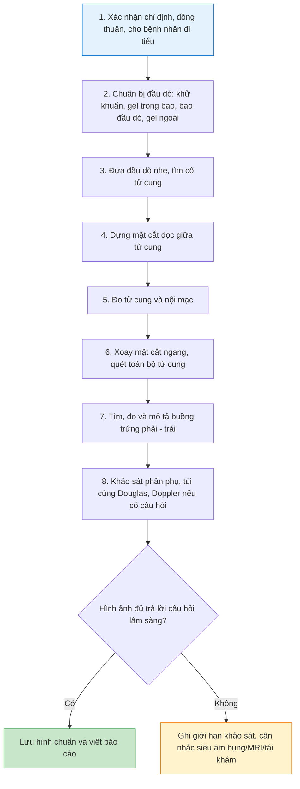

# Kỹ thuật siêu âm đầu dò âm đạo cơ bản: cầm đầu dò, định hướng hình ảnh và khảo sát tử cung - phần phụ
**Ngày:** 2026-07-02 | **Chuyên khoa:** Sản phụ khoa | **Đối tượng:** Bác sĩ sản phụ khoa, học viên siêu âm phụ khoa

> **Tier 0 / guideline nền:**
> - AIUM Practice Parameter for the Performance of Ultrasound of the Female Pelvis, 2024 revision (PMID: 39158217). [GUIDELINE VERIFIED] [FETCHED]
> - AIUM Official Statement: As Low As Reasonably Achievable (ALARA) principle.
> - IOTA terminology for adnexal tumors (PMID: 11169340). [FETCHED]
> - SRU consensus statement on asymptomatic ovarian and adnexal cysts imaged at US (PMID: 20505067). [GUIDELINE VERIFIED] [FETCHED]
> - ACR O-RADS US risk stratification and management system (PMID: 31687921). [GUIDELINE VERIFIED]

---

## 0. TỔNG QUAN - VÌ SAO TVS LÀ KỸ NĂNG NỀN TẢNG?

Siêu âm đầu dò âm đạo (transvaginal ultrasound, TVS) là kỹ thuật nền tảng trong phụ khoa vì đầu dò nằm gần tử cung, cổ tử cung, buồng trứng và phần phụ. Khoảng cách ngắn cho phép dùng tần số cao, độ phân giải tốt hơn siêu âm bụng trong nhiều tình huống phụ khoa.

Nhưng TVS không chỉ là đưa đầu dò vào âm đạo rồi nhìn hình. Một lần khám tốt gồm 4 lớp kỹ năng:

1. **An toàn, đồng thuận và tôn trọng bệnh nhân.**
2. **Cầm đầu dò đúng và điều khiển bằng góc, không bằng lực.**
3. **Biến hình ảnh 2 chiều trên màn hình thành định hướng 3 chiều trong vùng chậu.**
4. **Khảo sát theo checklist để không bỏ sót tử cung, buồng trứng, phần phụ và túi cùng Douglas.**

**Mục tiêu bài:**

- Chuẩn bị đúng bệnh nhân, đầu dò, bao đầu dò, gel và cài đặt máy cơ bản.
- Cầm đầu dò và thực hiện 4 thao tác chính: đẩy/rút, nghiêng, xoay, quét hình quạt.
- Lấy được mặt cắt dọc giữa tử cung và mặt cắt ngang tử cung.
- Đo đúng kích thước tử cung, bề dày nội mạc tử cung, kích thước buồng trứng và nang cơ bản.
- Tìm buồng trứng hai bên, đánh giá phần phụ và túi cùng Douglas.
- Nhận biết lỗi thường gặp của người mới và biết cách sửa.

---

## 1. CHỈ ĐỊNH, GIỚI HẠN VÀ ĐỒNG THUẬN

### 1.1. Khi nào nên dùng TVS?

TVS thường hữu ích trong các tình huống sau:

| Nhóm chỉ định | Mục tiêu khảo sát | Ví dụ thực hành |
|---|---|---|
| **Tử cung** | Tư thế, kích thước, cơ tử cung, nhân xơ, adenomyosis nghi ngờ | Rong kinh, đau bụng kinh, tử cung to |
| **Nội mạc tử cung** | Bề dày, hình thái, dịch lòng tử cung, polyp nghi ngờ | Ra máu tử cung bất thường, theo dõi nội mạc trong ART |
| **Buồng trứng** | Nang chức năng, nang hoàng thể, endometrioma, khối đặc, AFC | Đau hố chậu, hiếm muộn, theo dõi kích thích buồng trứng |
| **Phần phụ** | Khối cạnh tử cung, ứ dịch vòi trứng, thai ngoài tử cung nghi ngờ | Đau vùng chậu, beta-hCG dương tính, viêm phần phụ |
| **Túi cùng Douglas** | Dịch tự do, máu nghi ngờ, đau khi chạm đầu dò | Đau cấp, vỡ nang, thai ngoài tử cung vỡ nghi ngờ |
| **Thai sớm** | Túi thai, yolk sac, phôi, tim thai, vị trí thai | Trễ kinh, ra máu thai sớm, đau bụng thai sớm |

### 1.2. Khi nào cần cân nhắc hoặc đổi đường khảo sát?

TVS là thủ thuật xâm nhập tối thiểu, nên cần cân nhắc nếu:

- Bệnh nhân không đồng ý hoặc chưa hiểu rõ thủ thuật.
- Bệnh nhân chưa từng quan hệ tình dục và không muốn khám đường âm đạo.
- Đau nhiều, co thắt âm đạo, sang chấn sinh dục, viêm cấp rất đau.
- Ra máu nhiều kèm dấu hiệu không ổn định huyết động: ưu tiên xử trí cấp cứu trước.
- Trẻ vị thành niên hoặc tình huống nhạy cảm: cần quy trình đồng thuận, người giám hộ và người hỗ trợ phù hợp theo quy định cơ sở.

**Thay thế khi không làm TVS:** siêu âm bụng, siêu âm đường trực tràng (transrectal ultrasound), hoặc MRI tùy câu hỏi lâm sàng.

### 1.3. Đồng thuận và người hỗ trợ

Trước khi khám, cần nói rõ bằng ngôn ngữ đơn giản:

> "Tôi sẽ dùng đầu dò nhỏ có bọc bao sạch, đặt nhẹ vào âm đạo để quan sát tử cung và buồng trứng rõ hơn. Nếu chị đau hoặc muốn dừng, chị báo ngay, tôi sẽ dừng."

Thực hành tốt gồm:

- Hỏi đồng ý rõ ràng trước khi bắt đầu.
- Giải thích từng bước trước khi đưa đầu dò.
- Che phủ kín đáo, chỉ bộc lộ vùng cần thiết.
- Có người hỗ trợ hoặc chaperone theo quy định cơ sở và theo mong muốn của bệnh nhân.
- Không tiếp tục nếu bệnh nhân rút lại đồng ý.

---

## 2. CHUẨN BỊ BỆNH NHÂN, MÁY VÀ ĐẦU DÒ

### 2.1. Chuẩn bị bệnh nhân

Checklist trước khám:

1. Xác nhận họ tên, tuổi, lý do khám.
2. Hỏi ngày kinh cuối, tình trạng có thai hoặc nghi có thai.
3. Hỏi triệu chứng chính: đau, ra máu, sốt, khí hư, chậm kinh, vô sinh.
4. Hỏi tiền sử phẫu thuật vùng chậu, lạc nội mạc tử cung, thai ngoài tử cung, viêm phần phụ.
5. Cho bệnh nhân đi tiểu trước khám, trừ khi cần phối hợp siêu âm bụng với bàng quang căng.
6. Đặt tư thế sản khoa hoặc nằm ngửa, gối gập, hai chân dạng nhẹ.

### 2.2. Chuẩn bị đầu dò

Đầu dò âm đạo thường có tần số cao, trường nhìn gần, phù hợp cơ quan vùng chậu nông. Chuẩn bị đúng giúp hình rõ và giảm nguy cơ nhiễm khuẩn chéo.

Các bước tối thiểu:

1. Kiểm tra đầu dò không nứt, không bong, không hở dây.
2. Làm sạch và khử khuẩn theo quy trình cơ sở.
3. Cho một lớp gel vào trong bao đầu dò để loại bỏ khoảng khí giữa đầu dò và bao.
4. Bọc bao đầu dò kín, không rách, không có bọt khí lớn ở đầu.
5. Cho gel ngoài bao đầu dò để giảm ma sát khi đưa vào âm đạo.
6. Mang găng sạch.

**Lỗi hay gặp:** chỉ bôi gel ngoài bao mà không có gel trong bao. Khi đó sóng âm bị cản bởi lớp khí, hình nhiễu và mờ dù máy tốt.

### 2.3. Cài đặt máy ban đầu

| Thông số | Cài đặt gợi ý | Lý do |
|---|---|---|
| **Preset** | Gynecology hoặc pelvic TVS | Tối ưu tần số, gain, focus cho vùng chậu |
| **Depth** | Vừa đủ chứa tử cung và phần phụ, ưu tiên trường nhìn nông - vừa | Depth quá sâu làm cơ quan nhỏ, khó thấy chi tiết |
| **Gain** | Vừa phải, nội mạc và dịch không bị cháy sáng | Gain quá cao gây giả hồi âm trong dịch |
| **Focus** | Đặt tại vùng quan tâm | Tăng độ nét vùng cần đo |
| **Zoom** | Dùng khi đo nội mạc, nang nhỏ, AFC | Đo chính xác hơn |
| **Doppler** | Chỉ bật khi có câu hỏi cụ thể | Không dùng Doppler để "trang trí" hình |

Trong thai rất sớm, dùng nguyên tắc ALARA: năng lượng siêu âm thấp nhất hợp lý, thời gian Doppler ngắn và chỉ khi thật cần.

---

## 3. CẦM ĐẦU DÒ: 4 CHUYỂN ĐỘNG PHẢI THUỘC

### 3.1. Cách cầm đầu dò

Cầm đầu dò như cầm bút lớn hoặc cầm cán dao nhẹ. Cổ tay phải linh hoạt, khuỷu tay tựa ổn định, vai thả lỏng. Người mới thường cầm quá xa đầu dò hoặc siết quá chặt, làm tay run và dễ dùng lực.

Nguyên tắc:

- Tay cầm đầu dò tạo chuyển động nhỏ, chậm, có kiểm soát.
- Không tì mạnh vào cổ tử cung hoặc thành âm đạo.
- Mắt nhìn màn hình, nhưng vẫn phải chú ý phản ứng đau của bệnh nhân.
- Nếu mất hình, quay lại mốc giải phẫu thay vì xoay đầu dò hỗn loạn.

### 3.2. Bốn thao tác chính

| Thao tác | Mô tả | Dùng để làm gì? | Lỗi thường gặp |
|---|---|---|---|
| **Đẩy/rút** | Đưa đầu dò sâu hơn hoặc rút nông hơn | Tìm cổ tử cung, đáy tử cung, buồng trứng cao/thấp | Đẩy sâu khi chưa biết hướng gây đau |
| **Nghiêng trước/sau** | Đổi góc đầu dò trong mặt phẳng dọc | Tìm thân tử cung ngả trước/ngả sau | Dùng lực thay vì đổi góc |
| **Xoay phải/trái** | Xoay cán đầu dò quanh trục | Chuyển mặt cắt dọc sang ngang, tìm phần phụ | Xoay quá nhanh làm mất mốc |
| **Quét hình quạt** | Giữ điểm tựa, quét đầu dò qua phải/trái hoặc trước/sau | Khảo sát toàn bộ tử cung và phần phụ | Chỉ đứng yên một mặt cắt rồi kết luận |

**Câu cần nhớ:** TVS tốt là "tay nhẹ nhưng hình chắc". Nếu phải dùng lực nhiều để tìm hình, thường là sai hướng hoặc sai mặt cắt.

### 3.3. Đưa đầu dò vào âm đạo

Các bước an toàn:

1. Báo trước: "Tôi bắt đầu đặt đầu dò, chị thả lỏng, nếu đau báo tôi dừng."
2. Tách nhẹ môi âm hộ nếu cần, đưa đầu dò theo trục âm đạo, hướng hơi xuống sau lúc đầu.
3. Không đẩy thẳng lên trên xương mu.
4. Khi đã vào âm đạo, tìm cổ tử cung trước, không vội tìm buồng trứng.
5. Nếu bệnh nhân đau, dừng lại, rút nhẹ, đổi hướng, hỏi vị trí đau.

---

## 4. ĐỊNH HƯỚNG HÌNH ẢNH: TỪ MÀN HÌNH 2D SANG VÙNG CHẬU 3D

### 4.1. Mốc đầu tiên: cổ tử cung

Với người mới, mốc an toàn nhất là cổ tử cung. Cổ tử cung thường có:

- Cấu trúc chắc hơn mô âm đạo xung quanh.
- Kênh cổ tử cung là đường hồi âm giữa.
- Có thể thấy các nang Naboth nếu có.
- Nằm giữa đường vào âm đạo và thân tử cung.

Từ cổ tử cung, đi theo kênh cổ tử cung lên eo tử cung, thân tử cung và đáy tử cung. Cách này ít lạc hướng hơn so với cố tìm ngay thân tử cung.

### 4.2. Mặt cắt dọc giữa tử cung

Mặt cắt dọc giữa tử cung là mặt cắt nền tảng. Mặt cắt đạt chuẩn khi thấy:

- Cổ tử cung.
- Kênh cổ tử cung.
- Thân tử cung.
- Đáy tử cung.
- Nội mạc tử cung liên tục theo trục dài.

Nếu nội mạc bị mất đoạn hoặc tử cung không dài nhất, mặt cắt có thể đang lệch sang phải/trái hoặc chưa đi đúng đường giữa.

### 4.3. Mặt cắt ngang tử cung

Từ mặt cắt dọc giữa, xoay đầu dò khoảng 90 độ để vào mặt cắt ngang. Sau đó quét từ thấp lên cao:

1. Mức cổ tử cung.
2. Mức eo tử cung.
3. Mức thân tử cung.
4. Mức đáy tử cung.

Mặt cắt ngang giúp đánh giá bề ngang tử cung, hai sừng tử cung, khối cơ tử cung và là đường xuất phát để tìm hai buồng trứng.

### 4.4. Quy ước marker và trái - phải trên màn hình

Trước khi khám, phải biết **dấu marker trên đầu dò** tương ứng với phía nào của màn hình. Không có quy ước này, người mới rất dễ nhầm phải - trái, nhất là khi xoay từ mặt cắt dọc sang mặt cắt ngang.

Quy ước thực hành thường dùng:

| Mặt cắt | Marker đầu dò thường hướng về đâu? | Ý nghĩa trên màn hình |
|---|---|---|
| **Dọc giữa tử cung** | Hướng lên trước hoặc theo quy ước máy/cơ sở | Một bên màn hình là phía cổ tử cung, bên còn lại là đáy tử cung |
| **Ngang tử cung** | Sau khi xoay 90 độ từ mặt cắt dọc | Hai bên màn hình tương ứng hai bên phải - trái vùng chậu theo quy ước máy |

Vì mỗi hãng máy và cơ sở có thể cài đặt khác nhau, cách an toàn nhất là kiểm tra marker bằng phantom đơn giản, hoặc chạm nhẹ một bên đầu dò ngoài bao trước khi đặt để biết bên nào sáng trên màn hình.

**Nguyên tắc báo cáo:** nếu không chắc quy ước trái - phải, không được kết luận vị trí bên phải/bên trái của tổn thương. Phải xác định lại bằng mốc giải phẫu, marker và thao tác quét có kiểm soát.

### 4.5. Bài tập định hướng cho người mới

Khi mất nội mạc trên màn hình, đừng xoay liên tục. Hãy hỏi 3 câu:

1. Mình đang lệch khỏi đường giữa sang phải hay trái?
2. Mình đang quá trước hay quá sau so với thân tử cung?
3. Mình cần xoay đầu dò hay chỉ cần nghiêng/quét nhẹ?

Nếu không trả lời được, quay về cổ tử cung và dựng lại mặt cắt dọc giữa.

---

## 5. KHẢO SÁT TỬ CUNG TRÊN MẶT CẮT DỌC

### 5.1. Tìm tư thế tử cung

Tư thế tử cung gồm hai thành phần:

| Thành phần | Ý nghĩa | Cách nhìn trên TVS |
|---|---|---|
| **Ngả tử cung** | Hướng trục cổ tử cung - thân tử cung so với âm đạo | Ngả trước (anteverted), ngả sau (retroverted), trung gian |
| **Gập tử cung** | Góc giữa thân tử cung và cổ tử cung | Gập trước (anteflexed), gập sau (retroflexed) |

Người mới hay ghi nhầm ngả và gập. Trong thực hành, điều quan trọng nhất là biết thân tử cung đang hướng ra trước hay ra sau để chỉnh đầu dò đúng.

### 5.2. Đo tử cung

Trên mặt cắt dọc giữa:

- Đo chiều dài tử cung từ đáy tử cung đến cổ tử cung theo trục dài nhất.
- Đo đường kính trước - sau vuông góc với trục dài tại vùng thân tử cung.

Trên mặt cắt ngang:

- Đo bề ngang tử cung ở vùng rộng nhất.

Ghi kết quả dạng: `Dài x trước-sau x ngang`, đơn vị mm.

### 5.3. Đo nội mạc tử cung

Nguyên tắc đo:

1. Đo trên mặt cắt dọc giữa tốt nhất.
2. Đo lớp nội mạc kép, vuông góc với trục nội mạc.
3. Đặt caliper tại ranh giới nội mạc - cơ tử cung hai bên.
4. Không tính dịch lòng tử cung vào bề dày nội mạc.
5. Nếu có dịch lòng tử cung, đo riêng lớp trước và lớp sau rồi cộng nếu cần báo cáo.

**Bẫy:** mặt cắt lệch đường giữa có thể làm nội mạc mờ, méo hoặc giả mỏng. Gain quá cao có thể làm dịch lòng tử cung có hồi âm giả.

### 5.4. Quan sát cơ tử cung

Khi khảo sát cơ tử cung, mô tả tối thiểu:

- Đồng nhất hay không đồng nhất.
- Có nhân xơ không.
- Vị trí nhân xơ: dưới thanh mạc, trong cơ, dưới niêm mạc, cổ tử cung.
- Có dấu gợi ý adenomyosis không: cơ tử cung không đồng nhất, nang nhỏ trong cơ, bóng cản hình quạt, đường nối nội mạc - cơ tử cung không đều.

Bài cơ bản không cần chẩn đoán sâu adenomyosis, nhưng phải biết khi nào hình không bình thường để hẹn đánh giá chuyên sâu.

---

## 6. KHẢO SÁT TỬ CUNG TRÊN MẶT CẮT NGANG

### 6.1. Quy trình quét ngang

Từ mặt cắt dọc giữa:

1. Xoay đầu dò 90 độ.
2. Quét từ cổ tử cung lên thân tử cung.
3. Tiếp tục đến đáy tử cung.
4. Quét nhẹ sang phải và trái để đánh giá toàn bộ bề ngang.
5. Nếu thấy bất thường, quay lại mặt cắt dọc để xác định vị trí 3 chiều.

### 6.2. Những gì cần nhìn trên mặt cắt ngang

- Hình dạng tử cung tròn, bầu dục hay biến dạng.
- Độ đối xứng hai bên cơ tử cung.
- Nhân xơ làm lồi thanh mạc hoặc đẩy lệch nội mạc.
- Hai sừng tử cung, nhất là khi nghi dị dạng tử cung.
- Đường nội mạc ở các mức khác nhau.

**Nguyên tắc:** không kết luận tử cung bình thường nếu chỉ nhìn một mặt cắt dọc. Tử cung là cấu trúc 3D, phải quét qua ít nhất hai mặt phẳng.

---

## 7. KHẢO SÁT BUỒNG TRỨNG HAI BÊN

### 7.1. Cách tìm buồng trứng

Từ mặt cắt ngang tử cung, nghiêng/quét đầu dò sang bên phải hoặc bên trái. Buồng trứng thường nằm cạnh tử cung, gần bó mạch chậu. Nếu khó tìm:

1. Dùng tử cung làm mốc trung tâm.
2. Tìm bó mạch chậu bằng thang xám hoặc Doppler màu ngắn.
3. Quét vùng giữa tử cung và thành chậu.
4. Rút đầu dò nhẹ nếu buồng trứng nằm cao.
5. Phối hợp ấn bụng nhẹ từ ngoài vào để đưa buồng trứng gần đầu dò hơn.
6. Nếu vẫn không thấy, ghi "không quan sát rõ" và nêu lý do nếu có, không bịa kết quả.

### 7.2. Nhận diện buồng trứng

Buồng trứng thường có:

- Hình bầu dục hoặc hơi dẹt.
- Vỏ buồng trứng và mô đệm hồi âm trung bình.
- Các nang nhỏ ngoại vi hoặc rải rác.
- Di động tương đối khi ấn đầu dò hoặc ấn bụng.

Quai ruột có thể giả buồng trứng nhưng thường có nhu động, khí, bóng cản bẩn và không có cấu trúc nang noãn điển hình.

### 7.3. Đo buồng trứng và nang

Đo buồng trứng 3 chiều:

- Chiều dài.
- Chiều rộng.
- Chiều dày.

Nếu cần thể tích:

```text
Thể tích buồng trứng = dài x rộng x dày x 0,523
```

Đối với nang:

- Nang đơn giản: đo đường kính lớn nhất, hoặc 3 chiều nếu cần theo dõi.
- Nang noãn trong theo dõi ART: thường đo đường kính trung bình từ 2 đường kính vuông góc.
- Khối phức tạp: mô tả thành, vách, chồi, phần đặc, bóng cản, dịch, tưới máu.

### 7.4. AFC ở mức cơ bản

Số nang thứ cấp (antral follicle count, AFC) là số nang nhỏ quan sát được ở buồng trứng trong giai đoạn đầu chu kỳ. Khi đếm AFC:

- Dùng zoom và depth phù hợp.
- Quét toàn bộ buồng trứng, không chỉ một mặt cắt.
- Tránh đếm trùng khi quét qua lại.
- Ghi riêng buồng trứng phải và trái.

Bài này chỉ nhấn kỹ thuật. Diễn giải AFC trong dự trữ buồng trứng cần bài riêng về ART.

---

## 8. KHẢO SÁT PHẦN PHỤ VÀ TÚI CÙNG DOUGLAS

### 8.1. Phần phụ

Sau khi thấy buồng trứng, cần khảo sát vùng quanh buồng trứng và cạnh tử cung:

- Có khối tách biệt với buồng trứng không?
- Có cấu trúc dạng ống gợi ý ứ dịch vòi trứng không?
- Có đau khu trú khi chạm đầu dò không?
- Có dịch quanh buồng trứng không?
- Nếu beta-hCG dương tính, có khối cạnh tử cung nghi thai ngoài tử cung không?

### 8.2. Túi cùng Douglas

Túi cùng Douglas nằm phía sau tử cung. Cần ghi:

| Đặc điểm | Ý nghĩa thực hành |
|---|---|
| **Không dịch** | Bình thường trong nhiều trường hợp |
| **Dịch ít, trống âm** | Có thể sinh lý quanh rụng trứng |
| **Dịch nhiều** | Cần liên hệ triệu chứng, thai sớm, đau cấp |
| **Dịch có hồi âm/cục máu** | Nghĩ máu, mủ hoặc dịch phức tạp tùy bối cảnh |

**Cảnh báo:** đau vùng chậu cấp + beta-hCG dương tính + dịch túi cùng nhiều hoặc có hồi âm là tình huống không được xem nhẹ.

---

## 9. DOPPLER CƠ BẢN TRONG TVS

Doppler có ích nhưng không thay thế thang xám. Dùng Doppler khi có câu hỏi rõ:

- Cấu trúc này là mạch máu hay ống dịch?
- Khối phần phụ có tưới máu phần đặc không?
- Nang này có vòng mạch ngoại vi gợi ý hoàng thể không?
- Có dấu tưới máu bất thường trong khối cơ tử cung hoặc nội mạc không?

Nguyên tắc dùng Doppler:

1. Tối ưu thang xám trước.
2. Hộp màu nhỏ, đặt đúng vùng cần hỏi.
3. Điều chỉnh PRF thấp khi khảo sát dòng chảy chậm vùng chậu.
4. Không kết luận xoắn buồng trứng chỉ dựa vào Doppler còn tín hiệu; xoắn có thể còn dòng chảy do cấp máu kép.
5. Trong thai rất sớm, hạn chế Doppler nếu không có chỉ định rõ.

### 9.1. Tình huống phải báo ngay, không chỉ ghi nhận hình ảnh

TVS cơ bản không chỉ là mô tả cấu trúc. Một số hình ảnh cần liên hệ lâm sàng và báo bác sĩ phụ trách ngay:

| Tình huống | Vì sao nguy hiểm? | Hành động tối thiểu |
|---|---|---|
| **Đau vùng chậu cấp + beta-hCG dương tính + không thấy thai trong tử cung** | Có thể là thai ngoài tử cung chưa vỡ hoặc đang vỡ | Báo ngay, đánh giá huyết động, không kết luận trấn an |
| **Dịch túi cùng nhiều hoặc có hồi âm ở bệnh nhân đau cấp** | Có thể là máu, mủ hoặc dịch phức tạp | Mô tả lượng/dạng dịch, báo lâm sàng ngay |
| **Buồng trứng to, đau khi chạm đầu dò, nang ngoại vi, nghi xoắn** | Doppler còn tín hiệu không loại trừ xoắn | Báo nghi xoắn nếu hình thái và lâm sàng phù hợp |
| **Khối phần phụ phức tạp có phần đặc/chồi/vách dày** | Cần phân tầng nguy cơ theo IOTA/O-RADS, không gọi là nang đơn giản | Lưu đủ hình, mô tả thành phần, hẹn/giới thiệu đánh giá chuyên sâu |
| **Ra máu nhiều, huyết động không ổn định** | Siêu âm không được làm chậm hồi sức | Ưu tiên cấp cứu, siêu âm tại giường nếu phù hợp |

---

## 10. CHECKLIST KHÁM TVS 8 BƯỚC



### 10.1. Bộ hình tối thiểu nên lưu cho một ca TVS cơ bản

Một ca bình thường vẫn nên lưu đủ hình để người đọc sau hiểu cuộc khảo sát đã đi qua các mốc chính:

1. Mặt cắt dọc giữa tử cung, thấy cổ tử cung - thân - đáy - nội mạc.
2. Hình đo kích thước tử cung trên mặt cắt dọc.
3. Hình đo bề dày nội mạc tử cung trên mặt cắt dọc giữa.
4. Mặt cắt ngang tử cung ở ít nhất một mức thân/đáy tử cung.
5. Buồng trứng phải với đo 2-3 chiều hoặc nang nổi bật nếu có.
6. Buồng trứng trái với đo 2-3 chiều hoặc nang nổi bật nếu có.
7. Túi cùng Douglas.
8. Hình Doppler chỉ khi có câu hỏi cụ thể: phần đặc, mạch máu, nghi xoắn, hoàng thể, thai ngoài tử cung.

**Không cần lưu quá nhiều hình giống nhau.** Quan trọng là mỗi hình trả lời một câu hỏi: tử cung ở đâu, nội mạc thế nào, hai buồng trứng có thấy không, phần phụ và túi cùng có bất thường không.

### 10.2. Tự đánh giá chất lượng sau mỗi ca

Sau khi khám, tự hỏi 5 câu:

1. Tôi có chắc đã thấy cổ tử cung và dựng đúng mặt cắt dọc giữa không?
2. Nội mạc được đo ở mặt cắt tốt nhất chưa?
3. Tôi có quét ngang toàn bộ tử cung chưa, hay chỉ nhìn một lát rồi bỏ qua?
4. Hai buồng trứng có được tìm có hệ thống không? Nếu không thấy, đã ghi giới hạn chưa?
5. Kết luận có trả lời đúng câu hỏi lâm sàng ban đầu không?

---

## 11. MẪU BÁO CÁO CƠ BẢN

### 11.1. Mẫu bình thường

```text
Tử cung ngả trước, kích thước ... x ... x ... mm.
Cơ tử cung đồng nhất, không thấy khối khu trú rõ.
Nội mạc tử cung dày ... mm, đều, không thấy dịch lòng tử cung.
Buồng trứng phải kích thước ... x ... x ... mm, cấu trúc trong giới hạn, không thấy khối bất thường.
Buồng trứng trái kích thước ... x ... x ... mm, cấu trúc trong giới hạn, không thấy khối bất thường.
Hai phần phụ chưa ghi nhận khối bất thường rõ.
Túi cùng Douglas không có dịch tự do.
Kết luận: Hình ảnh siêu âm phụ khoa hiện tại chưa ghi nhận bất thường rõ.
```

### 11.2. Mẫu khi không quan sát rõ

```text
Khảo sát hạn chế do đau / hơi ruột / tư thế tử cung / bệnh nhân không dung nạp đầu dò.
Tử cung quan sát được một phần, ...
Buồng trứng phải không quan sát rõ.
Buồng trứng trái ...
Không thấy dịch tự do lượng nhiều trong túi cùng Douglas trên phần khảo sát được.
Đề nghị: phối hợp siêu âm bụng / tái khám / MRI nếu lâm sàng còn nghi ngờ.
```

**Nguyên tắc báo cáo:** không thấy không đồng nghĩa không có. Nếu hình ảnh kém, phải ghi giới hạn khảo sát.

---

## 12. SAI LẦM THƯỜNG GẶP

| # | Sai lầm | Hậu quả | Cách tránh |
|---|---|---|---|
| 1 | Đưa đầu dò nhanh, dùng lực nhiều | Đau, bệnh nhân mất tin tưởng, khó khám tiếp | Báo trước, đưa chậm, đổi góc thay vì đẩy mạnh |
| 2 | Không tìm cổ tử cung trước | Mất định hướng, xoay đầu dò hỗn loạn | Luôn dựng lại từ cổ tử cung và kênh cổ tử cung |
| 3 | Chỉ nhìn một mặt cắt dọc tử cung | Bỏ sót tổn thương lệch bên, nhân xơ, dị dạng | Luôn có mặt cắt dọc và ngang, quét toàn bộ |
| 4 | Đo nội mạc trên mặt cắt lệch | Nội mạc giả mỏng hoặc giả dày | Chỉ đo khi thấy đường nội mạc dài nhất và rõ nhất |
| 5 | Tính cả dịch lòng tử cung vào nội mạc | Báo cáo nội mạc dày giả | Nếu có dịch, đo hai lớp nội mạc riêng |
| 6 | Nhầm quai ruột với buồng trứng | Báo cáo sai buồng trứng hoặc bỏ sót khối | Tìm nang noãn, nhu động ruột, khí và mốc mạch chậu |
| 7 | Không khảo sát túi cùng Douglas | Bỏ sót dịch tự do trong đau cấp hoặc thai sớm | Luôn nhìn túi cùng cuối cuộc khám |
| 8 | Lạm dụng Doppler | Tốn thời gian, tăng năng lượng không cần thiết | Chỉ bật Doppler khi có câu hỏi cụ thể |
| 9 | Kết luận "không xoắn" vì còn Doppler | Bỏ sót xoắn buồng trứng | Chẩn đoán xoắn dựa lâm sàng + hình thái + Doppler, không chỉ một dấu |
| 10 | Không ghi giới hạn khảo sát | Tạo cảm giác âm tính giả | Ghi rõ khi không thấy buồng trứng hoặc hình ảnh hạn chế |

---

## 13. BÀI TẬP THỰC HÀNH CHO NGƯỜI MỚI

### 13.1. Bài tập 1: dựng mặt cắt dọc giữa

Mục tiêu đạt:

- Thấy cổ tử cung.
- Thấy thân tử cung.
- Thấy đáy tử cung.
- Thấy nội mạc liên tục.
- Đo được chiều dài tử cung và nội mạc.

Tự kiểm tra: nếu không thấy đáy tử cung và cổ tử cung cùng lúc, mặt cắt chưa đủ tốt để đo chiều dài.

### 13.2. Bài tập 2: chuyển dọc sang ngang

Mục tiêu đạt:

- Từ dọc giữa, xoay 90 độ không mất tử cung.
- Quét ngang từ cổ tử cung đến đáy.
- Mô tả bề ngang tử cung.

Tự kiểm tra: nếu xoay xong mất tử cung, có thể đầu dò đã di chuyển quá nhiều chứ không chỉ xoay.

### 13.3. Bài tập 3: tìm hai buồng trứng

Mục tiêu đạt:

- Tìm được buồng trứng phải và trái.
- Đo 3 chiều mỗi buồng trứng.
- Phân biệt buồng trứng với quai ruột.
- Ghi rõ nếu một bên không quan sát rõ.

### 13.4. Bài tập 4: báo cáo 60 giây

Sau mỗi ca bình thường, tập nói báo cáo miệng trong 60 giây:

1. Tử cung tư thế gì, kích thước bao nhiêu?
2. Nội mạc dày bao nhiêu, đều hay không?
3. Hai buồng trứng thấy không, có khối không?
4. Phần phụ và túi cùng Douglas có gì bất thường không?
5. Kết luận có trả lời được câu hỏi lâm sàng không?

---

## 14. ÁP DỤNG TẠI VIỆT NAM

- **Trang thiết bị:** TVS phổ biến ở phòng khám sản phụ khoa, bệnh viện tuyến huyện/tỉnh và trung tâm hỗ trợ sinh sản. Chất lượng hình phụ thuộc nhiều vào đầu dò, preset và kỹ năng người làm.
- **Kiểm soát nhiễm khuẩn:** cần chuẩn hóa quy trình khử khuẩn đầu dò, bao đầu dò và gel. Không dùng một bao đầu dò cho nhiều bệnh nhân.
- **Đồng thuận:** nên nói rõ đây là đầu dò đặt âm đạo, không chỉ nói chung là "siêu âm". Bệnh nhân có quyền từ chối.
- **Báo cáo:** nên ghi đủ tử cung, nội mạc, hai buồng trứng, phần phụ, túi cùng Douglas. Nếu không thấy một cấu trúc, phải ghi "không quan sát rõ" thay vì bỏ trống.
- **Đào tạo:** người mới nên học theo checklist thao tác trước khi học bệnh lý phức tạp như IOTA, O-RADS, DIE hoặc thai ngoài tử cung khó.

---

## 15. TIPS THỰC HÀNH

1. Bắt đầu từ cổ tử cung, không bắt đầu từ buồng trứng.
2. Nếu hình xấu, kiểm tra depth, gain, focus và bọt khí ở đầu bao trước khi nghĩ bệnh lý.
3. Mỗi chuyển động đầu dò nên nhỏ. TVS rất nhạy với góc tay.
4. Khi tử cung ngả sau, thường cần nghiêng đầu dò ra sau thay vì đẩy sâu.
5. Khi không thấy buồng trứng, rút đầu dò nhẹ và quét sang bên; đừng chỉ đẩy sâu.
6. Đo nội mạc chỉ khi thấy mặt cắt dọc giữa tốt nhất.
7. Luôn khảo sát túi cùng Douglas trong đau cấp, thai sớm hoặc sau rụng trứng.
8. Doppler còn tín hiệu không loại trừ xoắn buồng trứng.
9. Nếu bệnh nhân đau, dừng lại trước khi cố lấy thêm hình.
10. Báo cáo tốt phải có cả kết quả và giới hạn khảo sát.

---

## 16. TỔNG KẾT ĐIỂM CẦN NHỚ

1. TVS là kỹ thuật độ phân giải cao nhưng phụ thuộc rất nhiều vào tay người làm.
2. Đồng thuận, che phủ và giao tiếp là một phần của kỹ thuật, không phải thủ tục phụ.
3. Cầm đầu dò đúng nghĩa là điều khiển bằng góc nhỏ, không dùng lực.
4. Cổ tử cung là mốc định hướng đầu tiên và an toàn nhất cho người mới.
5. Mặt cắt dọc giữa tử cung phải thấy cổ tử cung, thân, đáy và nội mạc liên tục.
6. Đo nội mạc trên mặt cắt lệch là lỗi rất thường gặp.
7. Khảo sát tử cung phải có cả mặt cắt dọc và ngang.
8. Tìm buồng trứng từ mặt cắt ngang tử cung, dùng mạch chậu và ấn bụng khi cần.
9. Túi cùng Douglas phải được nhìn có chủ đích, đặc biệt trong đau cấp và thai sớm.
10. Khi hình ảnh hạn chế, ghi rõ hạn chế; không biến "không thấy" thành "không có".

---

## 17. TÀI LIỆU THAM KHẢO

1. **American Institute of Ultrasound in Medicine (2024)** "AIUM Practice Parameter for the Performance of Ultrasound of the Female Pelvis, 2024 Revision." *Journal of Ultrasound in Medicine.* PMID: **39158217**. DOI: 10.1002/jum.16556. [GUIDELINE VERIFIED] [FETCHED]
2. **Timmerman et al. (2000)** "Terms, definitions and measurements to describe the sonographic features of adnexal tumors: a consensus opinion from the International Ovarian Tumor Analysis (IOTA) Group." *Ultrasound in Obstetrics & Gynecology.* PMID: **11169340**. [FETCHED]
3. **Levine et al. (2010)** "Management of asymptomatic ovarian and other adnexal cysts imaged at US: Society of Radiologists in Ultrasound Consensus Conference Statement." *Radiology.* PMID: **20505067**. DOI: 10.1148/radiol.10100213. [GUIDELINE VERIFIED] [FETCHED]
4. **Andreotti et al. (2020)** "O-RADS US Risk Stratification and Management System: A Consensus Guideline from the ACR Ovarian-Adnexal Reporting and Data System Committee." *Radiology.* PMID: **31687921**. DOI: 10.1148/radiol.2019191150. [GUIDELINE VERIFIED]

---

**- Hết bài học ngày 2026-07-02 -**

**Bác sĩ:** Ngọc Hưng | **AI:** OpenCode cx/gpt-5.5-xhigh
