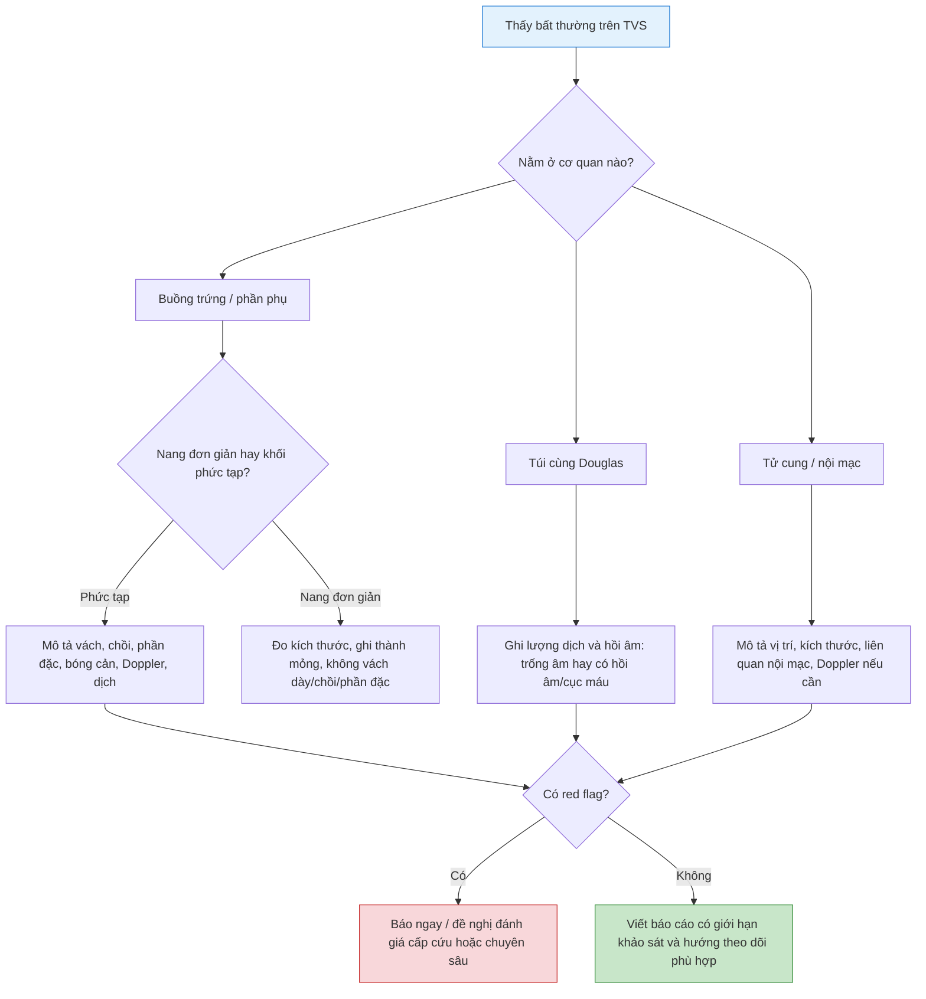

# Các hình ảnh bệnh lý thường gặp trên siêu âm đầu dò âm đạo: tử cung, nội mạc, buồng trứng, phần phụ và túi cùng Douglas
**Ngày:** 2026-07-02 | **Chuyên khoa:** Sản phụ khoa | **Đối tượng:** Bác sĩ sản phụ khoa, bác sĩ siêu âm, học viên siêu âm phụ khoa

> **Tier 0 / guideline nền:**
> - AIUM Practice Parameter for the Performance of Ultrasound of the Female Pelvis, 2024 revision (PMID: 39158217). [GUIDELINE VERIFIED] [FETCHED]
> - IOTA terminology for adnexal tumors (PMID: 11169340). [FETCHED]
> - SRU consensus statement on asymptomatic ovarian and adnexal cysts imaged at US (PMID: 20505067). [GUIDELINE VERIFIED] [FETCHED]
> - ACR O-RADS US risk stratification and management system (PMID: 31687921). [GUIDELINE VERIFIED] [FETCHED]

---

## 0. TỔNG QUAN - BÀI NÀY DÙNG ĐỂ LÀM GÌ?

Bài trước tập trung vào kỹ thuật TVS cơ bản: cầm đầu dò, định hướng hình ảnh, khảo sát tử cung - phần phụ và viết báo cáo bình thường. Bài này là bước kế tiếp: **gặp hình bất thường thì mô tả thế nào, nghĩ gì trước, và khi nào phải báo ngay**.

Trong thực hành phòng khám, người làm TVS thường không cần chẩn đoán mô bệnh học ngay. Việc quan trọng hơn là:

1. Nhận ra hình không bình thường.
2. Mô tả đủ đặc điểm để người sau đọc lại hiểu tổn thương.
3. Phân biệt nhóm lành tính thường gặp với nhóm cần đánh giá chuyên sâu.
4. Không bỏ sót tình huống cấp cứu như thai ngoài tử cung, xoắn buồng trứng, dịch máu ổ bụng hoặc nhiễm trùng phần phụ.

**Mục tiêu bài:**

- Biết cách mô tả một tổn thương trên TVS theo checklist cố định.
- Nhận diện các hình ảnh bệnh lý thường gặp của tử cung, nội mạc tử cung, buồng trứng, phần phụ và túi cùng Douglas.
- Viết được báo cáo ngắn gọn nhưng đủ ý cho các tình huống hay gặp.
- Biết dấu hiệu nào chỉ cần theo dõi, dấu hiệu nào cần hẹn đánh giá chuyên sâu, dấu hiệu nào phải báo ngay.
- Hiểu vai trò nhập môn của IOTA và O-RADS nhưng không biến bài này thành bài phân tầng nguy cơ nâng cao.

---

## 1. CÁCH MÔ TẢ MỘT TỔN THƯƠNG TRÊN TVS

### 1.1. Checklist mô tả 10 điểm

Khi thấy một bất thường, đừng vội gọi tên bệnh. Trước hết mô tả theo 10 điểm:

| Câu hỏi | Cần ghi gì? | Ví dụ |
|---|---|---|
| **1. Ở đâu?** | Tử cung, nội mạc, cổ tử cung, buồng trứng phải/trái, cạnh tử cung, túi cùng | Khối cạnh tử cung phải |
| **2. Kích thước?** | Đo ít nhất 2 chiều, tốt nhất 3 chiều nếu là khối | 38 x 32 x 30 mm |
| **3. Dạng gì?** | Nang, đặc, hỗn hợp, dạng ống, dạng dịch | Nang hỗn hợp |
| **4. Hồi âm?** | Trống âm, hồi âm thấp, hồi âm dày, không đồng nhất | Dịch hồi âm mịn dạng kính mờ |
| **5. Thành?** | Mỏng, dày, đều, không đều | Thành mỏng đều |
| **6. Vách?** | Không vách, vách mỏng, vách dày, nhiều vách | Có vách mỏng |
| **7. Chồi / phần đặc?** | Có hay không; nếu có, đo và xem Doppler | Chồi 8 mm có mạch |
| **8. Bóng cản?** | Có bóng cản sạch/bẩn hay không | Bóng cản sau gợi ý dermoid |
| **9. Doppler?** | Tưới máu thành, vách, chồi, phần đặc | Mạch trong phần đặc |
| **10. Dịch tự do?** | Không, ít, nhiều, trống âm hay có hồi âm | Dịch túi cùng có hồi âm |

**Nguyên tắc:** gọi tên bệnh chỉ là phần sau. Nếu mô tả thiếu, tên bệnh đúng cũng không giúp ích nhiều.

### 1.2. Ba mức kết luận thực hành

Sau khi mô tả, nên kết luận theo 3 mức:

| Mức | Ý nghĩa | Ví dụ |
|---|---|---|
| **Có vẻ lành tính, theo dõi được** | Hình điển hình, không red flag | Nang đơn giản nhỏ, nang hoàng thể điển hình |
| **Cần đánh giá chuyên sâu** | Hình không điển hình hoặc có yếu tố nguy cơ | Khối phần phụ phức tạp, phần đặc, chồi, vách dày |
| **Cần báo ngay / xử trí cấp cứu** | Có nguy cơ mất máu, xoắn, nhiễm trùng, thai ngoài tử cung | Đau cấp + beta-hCG dương + dịch túi cùng nhiều |

---

## 2. BỆNH LÝ TỬ CUNG

### 2.1. Nhân xơ tử cung

Nhân xơ tử cung thường là khối giảm âm hoặc hồi âm hỗn hợp trong cơ tử cung, có thể làm biến dạng bờ tử cung hoặc đẩy lệch nội mạc.

| Loại | Hình ảnh gợi ý | Điều cần ghi |
|---|---|---|
| **Dưới thanh mạc** | Khối lồi ra ngoài bờ tử cung | Vị trí, kích thước, có cuống không |
| **Trong cơ** | Khối nằm trong cơ tử cung | Có làm biến dạng nội mạc không |
| **Dưới niêm mạc** | Khối sát hoặc lồi vào lòng tử cung | Mức độ đẩy lệch/lồi vào lòng tử cung |
| **Thoái hóa** | Hồi âm không đồng nhất, có vùng nang hóa | Không gọi nhầm là khối phần phụ |

**Mẫu mô tả:**

```text
Cơ tử cung có nhân xơ vùng thành trước thân tử cung, kích thước ... x ... x ... mm, hồi âm giảm, bờ rõ, gây/không gây biến dạng đường nội mạc.
```

**Bẫy:** nhân xơ dưới thanh mạc có cuống có thể giống khối phần phụ. Cần chứng minh khối liên tục với cơ tử cung hoặc dùng Doppler tìm mạch nuôi từ tử cung nếu cần.

### 2.2. Adenomyosis

Adenomyosis không phải lúc nào cũng tạo một khối rõ. TVS thường gợi ý qua **kiểu thay đổi lan tỏa của cơ tử cung**.

Các dấu hiệu hay gặp:

- Tử cung to kiểu hình cầu.
- Cơ tử cung không đồng nhất.
- Nang nhỏ trong cơ tử cung.
- Bóng cản hình quạt.
- Đường nối nội mạc - cơ tử cung không đều.
- Thành trước và thành sau tử cung không đối xứng.

**Mẫu mô tả:**

```text
Cơ tử cung không đồng nhất, có các nang nhỏ trong cơ và bóng cản hình quạt, gợi ý adenomyosis. Đề nghị đối chiếu đau bụng kinh/rong kinh và đánh giá chuyên sâu nếu cần.
```

**Bẫy:** đừng chẩn đoán adenomyosis chỉ vì tử cung hơi to. Cần mô tả dấu hiệu hình ảnh cụ thể.

### 2.3. Dị dạng tử cung nghi ngờ

TVS 2D có thể gợi ý dị dạng khi thấy:

- Hai khoang nội mạc tách nhau.
- Đáy tử cung lõm bất thường.
- Hình tử cung không đối xứng trên mặt cắt ngang.
- Khó dựng một đường nội mạc liên tục ở mặt cắt dọc giữa.

**Thực hành:** nếu nghi dị dạng tử cung, không nên cố phân loại chắc chắn bằng TVS 2D thường quy. Ghi nghi ngờ và đề nghị siêu âm 3D hoặc MRI khi có chỉ định.

### 2.4. Sẹo mổ lấy thai và niche

Niche là khuyết sẹo vùng eo - thành trước tử cung sau mổ lấy thai, có thể thấy như vùng lõm hoặc túi dịch nhỏ tại sẹo.

Điều cần ghi:

- Vị trí sẹo ở đoạn dưới tử cung.
- Có tụ dịch tại niche không.
- Độ dày cơ tử cung còn lại nếu đo được.
- Liên hệ triệu chứng ra máu kéo dài sau sạch kinh.

---

## 3. BỆNH LÝ NỘI MẠC TỬ CUNG

### 3.1. Nội mạc dày hoặc không đều

Đánh giá nội mạc phải đặt trong bối cảnh: tuổi, ngày chu kỳ, đang dùng hormone, ra máu bất thường, sau mãn kinh hay chưa.

Mô tả tối thiểu:

- Bề dày nội mạc.
- Đều hay không đều.
- Có dịch lòng tử cung không.
- Có khối khu trú không.
- Có tăng sinh mạch khu trú trên Doppler không.

**Bẫy:** không lấy một con số nội mạc đơn độc để kết luận bệnh nếu không biết ngày chu kỳ và bối cảnh lâm sàng.

### 3.2. Polyp nội mạc tử cung

Polyp thường gợi ý khi thấy tổn thương khu trú trong lòng tử cung, làm nội mạc dày không đều hoặc có khối tăng âm/đồng âm với nội mạc.

Dấu hiệu hỗ trợ:

- Khối khu trú trong lòng tử cung.
- Bờ tương đối rõ.
- Có thể có mạch nuôi trung tâm trên Doppler.
- Có thể rõ hơn khi có dịch lòng tử cung hoặc khi làm sonohysterography.

**Mẫu mô tả:**

```text
Trong lòng tử cung có cấu trúc khu trú kích thước ... mm, hồi âm tương đương/tăng âm so với nội mạc, nghi polyp nội mạc. Có/không thấy mạch nuôi trung tâm trên Doppler.
```

### 3.3. Dịch lòng tử cung và máu đông

Dịch lòng tử cung có thể gặp trong nhiều bối cảnh: sau mãn kinh, hẹp cổ tử cung, viêm, sau thủ thuật, thai sớm, hoặc ra máu bất thường.

Khi thấy dịch, cần ghi:

- Dịch trống âm hay có hồi âm.
- Nội mạc hai bên dịch dày bao nhiêu.
- Có khối khu trú trong lòng tử cung không.
- Cổ tử cung có hẹp, khối hoặc dịch không.

Máu đông thường có hồi âm không đồng nhất, không có mạch bên trong trên Doppler. Tuy nhiên, không được dùng Doppler một mình để loại trừ tổn thương thật.

### 3.4. Sản phẩm thụ thai còn sót

Trong bối cảnh sau sẩy thai, sau hút thai hoặc sau sinh, cần nghĩ đến sản phẩm thụ thai còn sót khi thấy:

- Khối hồi âm hỗn hợp trong lòng tử cung.
- Nội mạc dày không đều.
- Có mạch trong khối trên Doppler.
- Ra máu kéo dài hoặc beta-hCG giảm chậm.

**Red flag:** ra máu nhiều hoặc dấu hiệu nhiễm trùng không phải là tình huống chỉ theo dõi siêu âm.

---

## 4. BỆNH LÝ BUỒNG TRỨNG

### 4.1. Nang đơn giản

Nang đơn giản có đặc điểm:

- Trống âm.
- Thành mỏng, đều.
- Không vách dày.
- Không chồi.
- Không phần đặc.
- Tăng âm sau.

**Mẫu mô tả:**

```text
Buồng trứng phải có nang đơn giản kích thước ... x ... mm, thành mỏng đều, dịch trống âm, không thấy vách dày/chồi/phần đặc.
```

**Thực hành:** quản lý nang đơn giản phụ thuộc tuổi, triệu chứng, kích thước và bối cảnh. Bài này chỉ nhấn kỹ thuật nhận diện; nếu cần quản lý chi tiết, dùng SRU/O-RADS.

### 4.2. Nang hoàng thể và nang xuất huyết

Nang hoàng thể thường gặp ở phụ nữ trong tuổi sinh sản. Hình có thể là nang thành dày, hồi âm hỗn hợp, có vòng mạch ngoại vi trên Doppler.

Nang xuất huyết có thể có:

- Hồi âm dạng lưới/fibrin.
- Cục máu đông bám thành nhưng không có mạch bên trong.
- Dịch hồi âm thay đổi theo thời gian.
- Có thể đau cấp nếu vỡ.

**Bẫy:** nang hoàng thể có vòng mạch mạnh có thể bị nhầm với thai ngoài tử cung nếu chỉ nhìn Doppler. Luôn đối chiếu beta-hCG, vị trí thai trong tử cung và khối cạnh tử cung.

### 4.3. Endometrioma

Endometrioma điển hình có:

- Nang hồi âm thấp đồng nhất.
- Dịch dạng kính mờ.
- Thành tương đối đều.
- Ít hoặc không có mạch trong lòng nang.
- Có thể hai bên hoặc kèm dính vùng chậu.

**Mẫu mô tả:**

```text
Buồng trứng trái có nang hồi âm thấp đồng nhất dạng kính mờ, kích thước ... x ... mm, không thấy chồi rõ, gợi ý endometrioma. Đề nghị đối chiếu đau bụng kinh/lạc nội mạc tử cung.
```

**Bẫy:** endometrioma không điển hình ở người lớn tuổi hoặc có chồi/phần đặc cần đánh giá chuyên sâu, không chỉ gọi là nang lạc nội mạc.

### 4.4. Dermoid / mature cystic teratoma

Dermoid có thể có hình rất đa dạng:

- Thành phần tăng âm do mỡ.
- Bóng cản bẩn.
- Nốt Rokitansky.
- Đường mức mỡ - dịch.
- Vùng hồi âm hỗn hợp.

**Mẫu mô tả:**

```text
Buồng trứng phải có khối dạng nang hỗn hợp, bên trong có thành phần tăng âm kèm bóng cản bẩn, gợi ý dermoid. Đề nghị đánh giá chuyên sâu/đối chiếu lâm sàng.
```

### 4.5. Hình ảnh buồng trứng đa nang

Hình ảnh buồng trứng đa nang (polycystic ovarian morphology, PCOM) không đồng nghĩa tự động với hội chứng buồng trứng đa nang (PCOS).

Trên TVS có thể thấy:

- Nhiều nang nhỏ ở ngoại vi hoặc rải rác.
- Mô đệm tăng tương đối.
- Thể tích buồng trứng tăng.

**Nguyên tắc:** không chẩn đoán PCOS chỉ từ siêu âm. Cần tiêu chuẩn lâm sàng, rối loạn phóng noãn và cường androgen tùy guideline.

### 4.6. Khối buồng trứng phức tạp

Khối buồng trứng cần thận trọng khi có:

- Phần đặc.
- Chồi nhú.
- Vách dày hoặc không đều.
- Thành không đều.
- Tưới máu trong phần đặc/chồi.
- Dịch ổ bụng hoặc dịch màng bụng.
- Hai bên, lớn nhanh, hoặc không giải thích được bằng nang chức năng.

**Không nên ghi:** "nang buồng trứng phức tạp" rồi dừng. Phải mô tả phức tạp ở điểm nào: vách, chồi, phần đặc, mạch hay dịch.

---

## 5. BỆNH LÝ PHẦN PHỤ VÀ VÒI TRỨNG

### 5.1. Hydrosalpinx

Hydrosalpinx là vòi trứng ứ dịch. Hình ảnh gợi ý:

- Cấu trúc dạng ống, ngoằn ngoèo cạnh tử cung.
- Dịch trống âm hoặc hồi âm thấp.
- Thành mỏng.
- Có thể có các nếp niêm mạc tạo dấu bánh răng/cogwheel trong một số trường hợp.
- Tách biệt với buồng trứng.

**Mẫu mô tả:**

```text
Cạnh tử cung trái có cấu trúc dạng ống chứa dịch, tách biệt với buồng trứng trái, gợi ý hydrosalpinx.
```

### 5.2. Pyosalpinx và tubo-ovarian abscess

Khi nhiễm trùng, dịch trong vòi trứng hoặc khối phần phụ thường phức tạp hơn:

- Thành dày.
- Dịch có hồi âm.
- Khối cạnh tử cung đau khi chạm đầu dò.
- Buồng trứng và vòi trứng khó phân biệt.
- Có thể kèm sốt, bạch cầu tăng, đau hạ vị.

**Red flag:** nghi áp xe phần phụ không phải tình huống chỉ hẹn theo dõi. Cần báo lâm sàng để đánh giá và điều trị.

### 5.3. Paraovarian cyst

Nang cạnh buồng trứng thường là nang đơn giản nằm gần buồng trứng nhưng tách biệt khỏi buồng trứng.

Cách nhận diện:

- Thấy buồng trứng riêng biệt với nang.
- Nang không di chuyển cùng buồng trứng khi ấn nhẹ.
- Thành mỏng, dịch trống âm nếu đơn giản.

**Bẫy:** nếu không chứng minh được buồng trứng riêng biệt, đừng vội gọi là paraovarian cyst.

### 5.4. Thai ngoài tử cung nghi ngờ

Trong bối cảnh beta-hCG dương tính, đau bụng hoặc ra máu, cần nghĩ thai ngoài tử cung khi:

- Không thấy thai trong tử cung khi lâm sàng đáng nghi.
- Có khối cạnh tử cung tách biệt với buồng trứng.
- Có vòng hồi âm cạnh tử cung.
- Có túi thai ngoài tử cung, yolk sac hoặc phôi nếu thấy.
- Có dịch túi cùng nhiều hoặc có hồi âm.

**Nguyên tắc:** không thấy khối ngoài tử cung không loại trừ thai ngoài tử cung. Nếu lâm sàng nghi, cần theo dõi beta-hCG, siêu âm lại và xử trí theo protocol.

---

## 6. TÚI CÙNG DOUGLAS VÀ DỊCH TỰ DO

### 6.1. Cách mô tả dịch

| Hình ảnh | Ý nghĩa thực hành |
|---|---|
| **Không dịch** | Bình thường trong nhiều tình huống |
| **Dịch ít, trống âm** | Có thể sinh lý quanh rụng trứng |
| **Dịch nhiều, trống âm** | Cần liên hệ đau, nang vỡ, thai sớm, viêm |
| **Dịch có hồi âm** | Nghĩ máu, mủ hoặc dịch phức tạp |
| **Cục máu đông trong túi cùng** | Red flag trong đau cấp hoặc beta-hCG dương |

### 6.2. Khi nào dịch túi cùng đáng lo?

Đáng lo khi có một trong các bối cảnh:

- Đau bụng cấp.
- Beta-hCG dương tính.
- Huyết động không ổn định.
- Dịch nhiều hoặc lan lên ổ bụng.
- Dịch có hồi âm hoặc cục máu.
- Khối phần phụ nghi vỡ hoặc xoắn.

**Câu cần nhớ:** dịch ít trống âm có thể sinh lý; dịch có hồi âm trong đau cấp thì không nên xem nhẹ.

---

## 7. DOPPLER TRONG ĐÁNH GIÁ BỆNH LÝ TVS

### 7.1. Khi nào nên bật Doppler?

Doppler nên dùng khi có câu hỏi cụ thể:

- Cấu trúc này là mạch máu hay ống dịch?
- Phần đặc/chồi có mạch không?
- Khối này có vòng mạch hoàng thể không?
- Có tăng sinh mạch khu trú trong nội mạc không?
- Có nghi xoắn buồng trứng không?

### 7.2. Khi nào Doppler dễ gây hiểu nhầm?

| Tình huống | Bẫy |
|---|---|
| **Nang hoàng thể** | Vòng mạch ngoại vi có thể giống ring of fire của thai ngoài tử cung |
| **Xoắn buồng trứng** | Còn dòng chảy không loại trừ xoắn |
| **Máu đông** | Không có mạch không chứng minh chắc là lành tính nếu hình không điển hình |
| **Thai rất sớm** | Không dùng Doppler kéo dài nếu không cần, tuân thủ ALARA |

---

## 8. RED FLAGS PHẢI BÁO NGAY

| Red flag | Hình ảnh / bối cảnh | Vì sao phải báo? |
|---|---|---|
| **Thai ngoài tử cung nghi ngờ** | beta-hCG dương, không thấy thai trong tử cung, khối cạnh tử cung, dịch túi cùng | Nguy cơ vỡ, mất máu |
| **Dịch túi cùng nhiều hoặc có hồi âm** | Đau cấp, dịch máu nghi ngờ | Có thể là máu trong ổ bụng |
| **Xoắn buồng trứng nghi ngờ** | Buồng trứng to, đau khi chạm, nang ngoại vi, phù mô đệm | Cần xử trí nhanh để bảo tồn buồng trứng |
| **Áp xe phần phụ nghi ngờ** | Khối phần phụ đau, thành dày, dịch hồi âm, sốt | Cần kháng sinh/can thiệp |
| **Khối phần phụ nghi ác tính** | Chồi, phần đặc có mạch, vách dày, dịch ổ bụng | Cần phân tầng nguy cơ và chuyển tuyến phù hợp |
| **Ra máu nhiều/huyết động không ổn định** | Siêu âm chỉ là hỗ trợ | Không được làm chậm hồi sức |

---

## 9. CHECKLIST ĐỌC HÌNH BỆNH LÝ TVS



---

## 10. MẪU BÁO CÁO THEO TÌNH HUỐNG

### 10.1. Nang đơn giản buồng trứng

```text
Buồng trứng phải có nang đơn giản kích thước ... x ... mm, thành mỏng đều, dịch trống âm, không thấy vách dày, chồi hay phần đặc. Không thấy dịch tự do lượng nhiều trong túi cùng Douglas.
Kết luận: Nang đơn giản buồng trứng phải. Đề nghị theo dõi theo tuổi, triệu chứng và kích thước nang.
```

### 10.2. Endometrioma nghi ngờ

```text
Buồng trứng trái có nang hồi âm thấp đồng nhất dạng kính mờ, kích thước ... x ... mm, không thấy chồi rõ, không thấy phần đặc tăng sinh mạch. Túi cùng Douglas ...
Kết luận: Hình ảnh gợi ý endometrioma buồng trứng trái. Đề nghị đối chiếu triệu chứng đau bụng kinh/lạc nội mạc tử cung và đánh giá chuyên sâu nếu cần.
```

### 10.3. Khối phần phụ phức tạp

```text
Cạnh tử cung phải/buồng trứng phải có khối kích thước ... x ... x ... mm, cấu trúc hỗn hợp, có vách dày/phần đặc/chồi kích thước ... mm, Doppler ghi nhận có/không tưới máu trong phần đặc. Có/không có dịch tự do.
Kết luận: Khối phần phụ phức tạp, không đủ tiêu chuẩn nang đơn giản. Đề nghị đánh giá chuyên sâu theo IOTA/O-RADS và xử trí theo lâm sàng.
```

### 10.4. Thai ngoài tử cung nghi ngờ

```text
Bệnh nhân beta-hCG dương tính. Trong buồng tử cung chưa thấy túi thai rõ. Cạnh tử cung phải/trái có khối ... mm tách biệt với buồng trứng, kèm dịch túi cùng Douglas lượng ... / có hồi âm.
Kết luận: Chưa loại trừ thai ngoài tử cung. Cần báo bác sĩ lâm sàng ngay, theo dõi huyết động, beta-hCG và xử trí theo protocol.
```

---

## 11. SAI LẦM THƯỜNG GẶP

| # | Sai lầm | Hậu quả | Cách tránh |
|---|---|---|---|
| 1 | Gọi tên bệnh trước khi mô tả | Báo cáo thiếu thông tin, khó theo dõi | Mô tả vị trí - kích thước - cấu trúc trước |
| 2 | Gọi mọi nang có hồi âm là endometrioma | Bỏ sót nang xuất huyết hoặc khối phức tạp | Tìm dạng kính mờ, thành, chồi, Doppler, theo dõi thời gian |
| 3 | Nhầm nang hoàng thể với thai ngoài tử cung | Gây báo động sai hoặc bỏ sót thai ngoài tử cung thật | Đối chiếu beta-hCG, thai trong tử cung, khối tách biệt buồng trứng |
| 4 | Kết luận không xoắn vì còn Doppler | Bỏ sót xoắn buồng trứng | Xoắn là chẩn đoán lâm sàng + hình thái + Doppler |
| 5 | Không khảo sát túi cùng Douglas | Bỏ sót dịch máu/dịch mủ | Luôn nhìn túi cùng cuối cuộc khám |
| 6 | Ghi "khối phần phụ" nhưng không nói thuộc buồng trứng hay tách biệt | Khó định hướng chẩn đoán | Cố chứng minh buồng trứng riêng biệt hoặc liên quan với khối |
| 7 | Không ghi giới hạn khảo sát | Tạo âm tính giả | Ghi rõ khi hơi ruột, đau, tư thế hoặc không thấy buồng trứng |
| 8 | Lạm dụng O-RADS khi mô tả cơ bản còn thiếu | Phân tầng sai | Mô tả chuẩn trước, phân tầng sau |

---

## 12. BÀI TẬP THỰC HÀNH ĐỌC HÌNH

### 12.1. Case 1: nang trống âm buồng trứng

Tự hỏi:

1. Nang có thật sự trống âm không?
2. Thành có mỏng đều không?
3. Có vách dày, chồi, phần đặc không?
4. Có dịch túi cùng không?
5. Báo cáo có đủ kích thước không?

### 12.2. Case 2: đau cấp + nang hỗn hợp

Tự hỏi:

1. Có hình lưới fibrin hoặc cục máu đông không?
2. Có dịch túi cùng không?
3. Beta-hCG có dương tính không?
4. Có đau khi chạm đầu dò không?
5. Có cần báo ngay không?

### 12.3. Case 3: khối phần phụ phức tạp

Tự hỏi:

1. Khối thuộc buồng trứng hay tách biệt buồng trứng?
2. Có phần đặc/chồi/vách dày không?
3. Phần đặc/chồi có mạch không?
4. Có dịch ổ bụng không?
5. Cần đánh giá chuyên sâu theo IOTA/O-RADS không?

---

## 13. ÁP DỤNG TẠI VIỆT NAM

- **Phòng khám sản phụ khoa:** thường gặp nang chức năng, endometrioma, u xơ, polyp nghi ngờ, hydrosalpinx và thai sớm chưa rõ vị trí.
- **Tuyến cơ sở:** điều quan trọng là nhận diện red flags và ghi giới hạn khảo sát, không cố phân tầng quá chi tiết khi hình ảnh chưa đủ.
- **Chuyển tuyến:** khối phần phụ phức tạp có phần đặc/chồi/vách dày hoặc dịch ổ bụng nên được đánh giá bởi người có kinh nghiệm IOTA/O-RADS.
- **Thai ngoài tử cung:** nếu beta-hCG dương tính, đau bụng, ra máu và TVS không thấy thai trong tử cung, cần quản lý theo protocol, không trấn an bằng một lần siêu âm âm tính.
- **Báo cáo:** nên dùng ngôn ngữ mô tả thay vì kết luận mơ hồ. Ví dụ "nang hồi âm thấp dạng kính mờ, không thấy chồi" tốt hơn "nang lạc nội mạc" nếu chưa đủ chắc.

---

## 14. TIPS THỰC HÀNH

1. Đừng gọi "nang buồng trứng" nếu chưa chứng minh tổn thương nằm trong buồng trứng.
2. Nang đơn giản phải thật sự đơn giản: trống âm, thành mỏng, không vách dày, không chồi, không phần đặc.
3. Nang xuất huyết thay đổi theo thời gian; nếu hình không điển hình, cần theo dõi hoặc đánh giá lại.
4. Endometrioma điển hình có hồi âm thấp đồng nhất dạng kính mờ, nhưng chồi hoặc phần đặc làm thay đổi mức độ lo ngại.
5. Dermoid hay có bóng cản bẩn và thành phần tăng âm, nhưng hình có thể đa dạng.
6. Hydrosalpinx là cấu trúc dạng ống, không phải nang tròn đơn độc.
7. Dịch túi cùng có hồi âm trong đau cấp là dấu hiệu phải chú ý.
8. Doppler giúp trả lời câu hỏi, không thay thế mô tả thang xám.
9. Còn dòng chảy không loại trừ xoắn buồng trứng.
10. Khi không chắc, ghi mô tả trung thực và đề nghị đánh giá chuyên sâu; đừng bịa chẩn đoán chắc chắn.

---

## 15. TỔNG KẾT ĐIỂM CẦN NHỚ

1. Đọc hình bệnh lý TVS bắt đầu bằng mô tả, không bắt đầu bằng tên bệnh.
2. Mọi tổn thương cần được mô tả vị trí, kích thước, cấu trúc, thành, vách, chồi, phần đặc, Doppler và dịch kèm theo.
3. Nang đơn giản có tiêu chuẩn hình ảnh rõ; nếu thiếu tiêu chuẩn, đừng gọi là đơn giản.
4. Endometrioma, nang xuất huyết và dermoid có hình điển hình nhưng vẫn cần cảnh giác khi có phần đặc, chồi hoặc mạch bất thường.
5. Khối phần phụ phức tạp cần mô tả chi tiết và cân nhắc IOTA/O-RADS.
6. Thai ngoài tử cung là chẩn đoán theo bối cảnh beta-hCG, triệu chứng và siêu âm; một lần không thấy khối không loại trừ bệnh.
7. Dịch túi cùng phải được nhìn có chủ đích, nhất là trong đau cấp và thai sớm.
8. Doppler còn tín hiệu không loại trừ xoắn buồng trứng.
9. Báo cáo tốt phải phân biệt được: theo dõi được, cần đánh giá chuyên sâu, hay phải báo ngay.
10. Nếu hình ảnh hạn chế, ghi rõ giới hạn khảo sát thay vì kết luận âm tính giả.

---

## 16. TÀI LIỆU THAM KHẢO

1. **American Institute of Ultrasound in Medicine (2024)** "AIUM Practice Parameter for the Performance of Ultrasound of the Female Pelvis, 2024 Revision." *Journal of Ultrasound in Medicine.* PMID: **39158217**. DOI: 10.1002/jum.16556. [GUIDELINE VERIFIED] [FETCHED]
2. **Timmerman et al. (2000)** "Terms, definitions and measurements to describe the sonographic features of adnexal tumors: a consensus opinion from the International Ovarian Tumor Analysis (IOTA) Group." *Ultrasound in Obstetrics & Gynecology.* PMID: **11169340**. [FETCHED]
3. **Levine et al. (2010)** "Management of asymptomatic ovarian and other adnexal cysts imaged at US: Society of Radiologists in Ultrasound Consensus Conference Statement." *Radiology.* PMID: **20505067**. DOI: 10.1148/radiol.10100213. [GUIDELINE VERIFIED] [FETCHED]
4. **Andreotti et al. (2020)** "O-RADS US Risk Stratification and Management System: A Consensus Guideline from the ACR Ovarian-Adnexal Reporting and Data System Committee." *Radiology.* PMID: **31687921**. DOI: 10.1148/radiol.2019191150. [GUIDELINE VERIFIED] [FETCHED]

---

**- Hết bài học ngày 2026-07-02 -**

**Bác sĩ:** Ngọc Hưng | **AI:** OpenCode cx/gpt-5.5-xhigh
