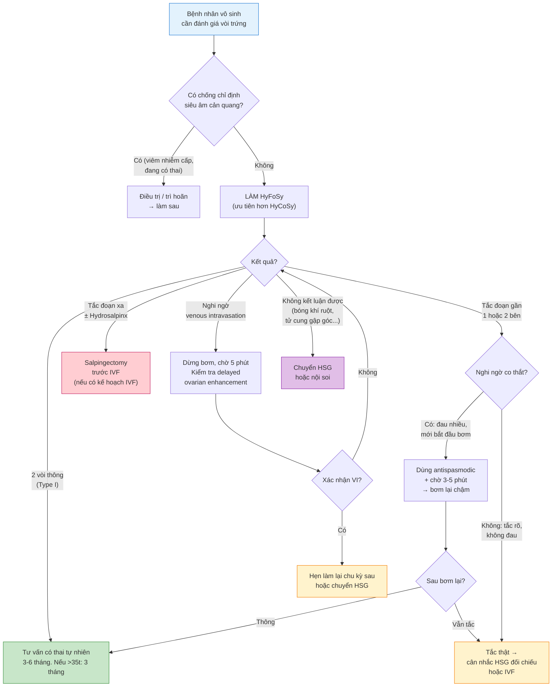

# BÀI HỌC: CÁC TÌNH HUỐNG LÂM SÀNG KHI ĐỌC KẾT QUẢ SIÊU ÂM HyCoSy & HyFoSy

**Ngày:** 2026-06-28 | **Chuyên khoa:** Siêu âm sản phụ khoa / Hỗ trợ sinh sản | **Đối tượng:** Bác sĩ sản phụ khoa, học viên sau đại học

> **Phạm vi:** Tổng quan kỹ thuật HyCoSy/HyFoSy + 8 tình huống lâm sàng thường gặp khi quan sát kết quả (bình thường, tắc đoạn gần, tắc đoạn xa/hydrosalpinx, trào ngược tĩnh mạch, dính quanh vòi, co thắt do đau, tắc 1 bên, hiệu ứng tubal flushing) + So sánh HyCoSy vs HyFoSy vs HSG + Sai lầm thường gặp + Áp dụng tại Việt Nam.
> **Citation:** Mọi PMID đã fetch abstract qua PubMed E-utilities. Evidence chính từ meta-analysis Xydias 2025, FOAM RCT 2024, Radiographics review 2021, dữ liệu Việt Nam từ BV Mỹ Đức (Le 2024).

---

## MỤC LỤC

0. TỔNG QUAN — VÌ SAO BÀI NÀY QUAN TRỌNG
1. NGUYÊN LÝ KỸ THUẬT HyCoSy & HyFoSy
2. 8 TÌNH HUỐNG LÂM SÀNG KHI QUAN SÁT KẾT QUẢ
3. SO SÁNH HyCoSy vs HyFoSy vs HSG
4. SAI LẦM THƯỜNG GẶP
5. LƯU ĐỒ QUYẾT ĐỊNH LÂM SÀNG
6. ÁP DỤNG TẠI VIỆT NAM
7. TIPS THỰC HÀNH (CLINICAL PEARLS)
8. TỔNG KẾT ĐIỂM CẦN NHỚ
9. TÀI LIỆU THAM KHẢO

---

## 0. TỔNG QUAN — VÌ SAO BÀI NÀY QUAN TRỌNG?

**Yếu tố vòi trứng (tubal factor)** chiếm **25-35%** các trường hợp vô sinh nữ, khiến đánh giá độ thông vòi trứng (tubal patency) trở thành một bước không thể thiếu trong infertility workup. Trong số các phương pháp hiện có, **HyCoSy** (Hysterosalpingo-Contrast Sonography — siêu âm cản quang tử cung — vòi trứng) và **HyFoSy** (Hysterosalpingo-Foam Sonography — siêu âm bọt cản âm tử cung — vòi trứng) nổi lên như những lựa chọn **không bức xạ, thực hiện tại phòng siêu âm**, và ngày càng thay thế HSG truyền thống.

**Tuy nhiên, đọc kết quả HyCoSy/HyFoSy không đơn giản là "thông" hay "tắc".** Người làm siêu âm phải đối mặt với nhiều tình huống gây nhiễu: co thắt đoạn gần giả tắc, trào ngược tĩnh mạch giả ống dẫn trứng, dính quanh vòi làm contrast không tràn tự do dù vòi thông... Mỗi tình huống sai sót có thể dẫn đến chẩn đoán sai → chỉ định IVF không cần thiết hoặc bỏ sót cơ hội có thai tự nhiên.

**Mục tiêu bài học (6 điểm):**
1. Nắm vững nguyên lý kỹ thuật HyCoSy và HyFoSy — sự khác biệt giữa hai phương pháp.
2. Nhận diện được 8 tình huống lâm sàng chính khi quan sát hình ảnh siêu âm.
3. Phân biệt được tắc thật vs co thắt đoạn gần (cornual spasm).
4. Nhận biết dấu hiệu trào ngược tĩnh mạch (venous intravasation) — tránh chẩn đoán nhầm.
5. Hiểu được giá trị tiên lượng của kết quả HyCoSy (type I/II/III) cho khả năng có thai tự nhiên.
6. Áp dụng được quy trình đọc kết quả tại cơ sở Việt Nam.

---

## 1. NGUYÊN LÝ KỸ THUẬT HyCoSy & HyFoSy

### 1.1. Định nghĩa

**HyCoSy (Hysterosalpingo-Contrast Sonography):** Kỹ thuật siêu âm qua đường âm đạo (transvaginal ultrasound) kết hợp bơm chất cản âm (contrast agent) qua catheter đặt trong buồng tử cung để đánh giá:
- Hình dạng buồng tử cung (uterine cavity contour)
- Độ thông của vòi trứng (tubal patency)
- Sự tràn của contrast vào khoang phúc mạc (peritoneal spill)

**HyFoSy (Hysterosalpingo-Foam Sonography):** Biến thể của HyCoSy, sử dụng **gel bọt** (ExEm® FOAM) thay cho dung dịch saline-air hoặc microbubble contrast (SonoVue). Bọt có độ cản âm cao hơn → quan sát rõ hơn trên siêu âm 2D, không cần 4D.

### 1.2. Chất cản âm — so sánh các loại

| Loại contrast | Thành phần | Đặc điểm | Hình ảnh siêu âm |
|---|---|---|---|
| **Saline-air** (HyCoSy cổ điển) | NaCl 0.9% + bọt khí lắc | Rẻ, sẵn có. Bọt khí không ổn định → tan nhanh. | Tăng âm không đồng nhất, dễ nhầm với nhu động ruột |
| **SonoVue** (microbubble) | Sulfur hexafluoride microbubbles | Ổn định hơn saline-air. Cần đầu dò contrast-specific (CEUS). | Tăng âm mạnh, đồng nhất, phân biệt rõ mạch máu |
| **Perfluoropropane albumin** | Perfluoropropane + human albumin microspheres | Mới, phase III Trung Quốc 2026 (Du 2026, PMID 41816086). An toàn, ít tác dụng phụ. | Tăng âm tốt, thời gian quan sát dài |
| **ExEm® FOAM** (HyFoSy) | Hydroxyethylcellulose + glycerol + nước cất | **Tiêu chuẩn cho HyFoSy.** Bọt ổn định ~5 phút. Không cần CEUS. | Tăng âm mạnh, đồng nhất, theo dõi được dòng chảy liên tục |

### 1.3. Quy trình kỹ thuật

**Chuẩn bị:**
- Thời điểm: Ngày 6-12 của chu kỳ kinh (sau sạch kinh, trước rụng trứng). KHÔNG làm khi đang có thai.
- Xét nghiệm sàng lọc: β-hCG âm tính, không viêm nhiễm âm đạo cấp.
- Thuốc: Có thể dùng NSAID (ibuprofen 400-600 mg) hoặc antispasmodic (hyoscine butylbromide 10-20 mg) 30 phút trước làm để giảm đau và co thắt.

**Các bước thực hiện:**
1. **Siêu âm nền (baseline scan):** Khảo sát tử cung, buồng trứng, túi cùng Douglas (dịch tự do, nang, dính). Đo niêm mạc tử cung.
2. **Đặt catheter:** Catheter bóng (balloon catheter 5-8 Fr) qua cổ tử cung vào buồng tử cung. Bơm bóng 1-2 mL giữ catheter.
3. **Bơm contrast chậm:** Bắt đầu với lượng nhỏ (2-3 mL), quan sát buồng tử cung — loại trừ polyp, dính buồng, vách ngăn, u xơ dưới niêm.
4. **Quan sát vòi trứng:** Tiếp tục bơm contrast, quan sát dòng chảy từ sừng tử cung (cornua) → đoạn kẽ (interstitial) → đoạn eo (isthmic) → đoạn bóng (ampullary) → tràn vào khoang phúc mạc (peritoneal spill).
5. **Ghi nhận:** Dùng 2D real-time + cine-loop để ghi lại. Nếu có 3D/4D → quét volume coronal để thấy toàn bộ vòi trứng trong một mặt phẳng.
6. **Sau thủ thuật:** Rút catheter, siêu âm lại túi cùng Douglas — có dịch tự do mới xuất hiện = bằng chứng gián tiếp của tràn contrast.

---

## 2. 8 TÌNH HUỐNG LÂM SÀNG KHI QUAN SÁT KẾT QUẢ

### Tình huống 1: BÌNH THƯỜNG — Hai vòi thông, contrast tràn tự do

**Hình ảnh siêu âm:**
- Contrast đi từ buồng tử cung → 2 sừng → thấy rõ 2 vòi trứng dài, ngoằn ngoèo, tăng âm sáng.
- Dòng contrast di chuyển liên tục, không bị cản trở ở bất kỳ đoạn nào.
- Contrast tràn tự do vào khoang phúc mạc → thấy "đám mây tăng âm" (echogenic cloud) lan tỏa quanh buồng trứng và túi cùng Douglas.
- Sau thủ thuật: xuất hiện dịch tự do mới trong túi cùng Douglas.

**Diễn giải:** Hai vòi trứng thông hoàn toàn. Tubal factor bị loại trừ → nguyên nhân vô sinh nằm ở yếu tố khác (phóng noãn, tinh trùng, phôi thai, endometriosis ẩn...).

**Tiên lượng:** Theo Huang 2025 (PMID 41327107), type I (2 vòi thông) có tỷ lệ có thai tự nhiên cao nhất sau HyCoSy: **55.3%** trong vòng 1 năm, tập trung vào 3 tháng đầu sau thủ thuật.

**Lưu ý quan trọng:**
- Phải phân biệt contrast tràn tự do với contrast trong mạch máu (venous intravasation — xem Tình huống 4).
- Phải chắc chắn thấy được cả 2 vòi — nếu chỉ thấy 1 bên, bên kia có thể tắc hoặc không quan sát được do bóng khí ruột, tử cung gập góc, hoặc u xơ che lấp.

---

### Tình huống 2: TẮC ĐOẠN GẦN (Proximal / Cornual Block) — Phân biệt co thắt vs tắc thật

**Hình ảnh siêu âm:**
- Contrast vào buồng tử cung, căng đầy, nhưng KHÔNG vào được vòi trứng đoạn kẽ → contrast dừng lại ở sừng tử cung (cornua).
- Không thấy dòng contrast trong vòi trứng.
- KHÔNG có tràn contrast vào khoang phúc mạc bên đó.

**Đây là tình huống KHÓ NHẤT trong HyCoSy** — vì tắc đoạn gần có thể là:
1. **Tắc thật** — do nút nhầy (mucus plug), viêm dính mạn tính (salpingitis isthmica nodosa), sẹo sau viêm nhiễm.
2. **Co thắt cơ trơn đoạn kẽ (cornual spasm)** — cơ trơn quanh lỗ vòi co thắt do catheter chạm vào đáy tử cung, bóng bơm quá căng, hoặc đau → contrast không thể đi qua dù vòi bình thường.

**Tỷ lệ false positive do co thắt:**
- Du 2026 (PMID 41816086): Trong 221 vòi trứng được đánh giá, tỷ lệ false positive của HyCoSy là **3.62% (8/221)** — nhóm này có tỷ lệ tiền sử chửa ngoài tử cung cao hơn và buồng trứng nằm sát tử cung hơn.
- Fu 2026 (PMID 41914543): Misdiagnosis 12/121 vòi chủ yếu do trào ngược tĩnh mạch, dính tiểu khung, tử cung sai tư thế, hoặc co thắt do đau.

**Cách phân biệt co thắt vs tắc thật:**
| Yếu tố phân biệt | Gợi ý co thắt (spasm) | Gợi ý tắc thật (true block) |
|---|---|---|
| **Khởi phát** | Xuất hiện ngay khi bắt đầu bơm | Tồn tại xuyên suốt, không thay đổi |
| **Đáp ứng với chờ đợi** | Sau 2-5 phút, contrast bắt đầu vào vòi | Không cải thiện sau chờ |
| **Đáp ứng với antispasmodic** | Cải thiện sau hyoscine butylbromide | Không đáp ứng |
| **Đau** | Đau tăng khi bơm nhanh | Đau âm ỉ, không thay đổi theo tốc độ bơm |
| **Dấu hiệu gián tiếp** | Có thể thấy bóng hơi nhỏ trong vòi | Không thấy bất kỳ dấu hiệu nào của vòi |

**Xử trí:**
1. **Đầu tiên: KHÔNG kết luận tắc ngay.** Giảm tốc độ bơm, giảm thể tích bóng catheter (nếu quá căng), chờ 2-3 phút.
2. Nếu nghi ngờ co thắt: tiêm tĩnh mạch chậm hyoscine butylbromide 20 mg (Buscopan®) hoặc dùng glucagon 0.5-1 mg IV nếu có sẵn.
3. Nếu vẫn tắc: cân nhắc lặp lại HyCoSy ở chu kỳ sau, hoặc chuyển HSG để đối chiếu.
4. **Luôn ghi chú "không loại trừ co thắt"** trong kết luận nếu lần đầu làm và thấy tắc đoạn gần đơn độc.

---

### Tình huống 3: TẮC ĐOẠN XA + Ứ DỊCH VÒI TRỨNG (Distal Occlusion + Hydrosalpinx)

**Hình ảnh siêu âm:**
- Vòi trứng giãn rộng ở đoạn xa, chứa dịch trống âm (hoặc tăng âm nhẹ nếu có máu/mủ).
- Contrast đi được qua đoạn gần và đoạn eo nhưng **dừng lại ở đoạn bóng** (ampulla) — không tràn vào khoang phúc mạc.
- Vòi trứng trông như "hình xúc xích" (sausage-shaped) hoặc "hình ống dài giãn" với thành mỏng.
- Trên 3D/4D coronal view: thấy rõ "vòi trứng hình chuỗi hạt" (cogwheel sign) hoặc "hình dấu thắt lưng" (waist sign) — đặc trưng của hydrosalpinx.

**Phân biệt hydrosalpinx với nang buồng trứng:**
| Đặc điểm | Hydrosalpinx | Nang buồng trứng |
|---|---|---|
| **Hình dạng** | Hình ống dài, ngoằn ngoèo, có vách ngăn không hoàn toàn (incomplete septations) | Hình cầu hoặc bầu dục, vách mỏng đều |
| **Vách ngăn** | Nếp gấp niêm mạc vòi (endosalpingeal folds) — không hoàn toàn, không chạm thành đối diện | Có thể có vách hoàn toàn hoặc không có |
| **Liên quan với tử cung** | Nối thông với sừng tử cung | Tách rời khỏi tử cung |
| **Nhu động** | Không có | Không có (trừ khi là nang sinh lý có vách co) |
| **Dấu hiệu "dấu thắt lưng"** | Có (waist sign — chỗ thắt giữa đoạn gần và đoạn xa giãn) | Không |

**Ý nghĩa lâm sàng:**
- Hydrosalpinx làm giảm tỷ lệ làm tổ trong IVF ~50% (do dịch viêm trong hydrosalpinx chảy ngược vào buồng tử cung → độc với phôi, cản trở làm tổ).
- **Cần salpingectomy hoặc tubal clipping trước khi làm IVF.**
- Nếu hydrosalpinx nhẹ, không triệu chứng, bệnh nhân không làm IVF → có thể theo dõi, nhưng cần tư vấn nguy cơ chửa ngoài tử cung và viêm nhiễm tái phát.

**Lưu ý kỹ thuật:** Hydrosalpinx có thể bị bỏ sót trên baseline scan nếu dịch chưa ứ đọng đủ nhiều. HyCoSy làm tăng độ nhạy phát hiện hydrosalpinx vì contrast làm căng vòi trứng → bộc lộ đoạn xa giãn rõ hơn.

---

### Tình huống 4: TRÀO NGƯỢC TĨNH MẠCH (Venous Intravasation) — Giả ống dẫn trứng

**Đây là bẫy chẩn đoán nguy hiểm nhất trong HyCoSy.** Trào ngược tĩnh mạch (venous intravasation — VI) xảy ra khi contrast đi vào hệ tĩnh mạch tử cung và dây chằng rộng thay vì vào vòi trứng. Hình ảnh tạo ra có thể **giả hoàn toàn ống dẫn trứng thông**.

**Cơ chế:**
- Áp lực bơm quá cao → niêm mạc tử cung bị tổn thương vi thể → contrast xâm nhập vào tĩnh mạch nội mạc tử cung → theo hệ tĩnh mạch tử cung → tĩnh mạch dây chằng rộng.
- Yếu tố nguy cơ: bơm nhanh, bóng catheter quá căng, niêm mạc mỏng (gần sạch kinh hoặc teo), tiền sử phẫu thuật tử cung, lạc nội mạc tử cung trong cơ (adenomyosis).

**Hình ảnh siêu âm của VI:**
- Xuất hiện các đường ống tăng âm **hai bên tử cung**, ngoằn ngoèo, giống vòi trứng — nhưng:
  - Các "ống" này **bắt nguồn từ thành tử cung** (myometrium), KHÔNG từ sừng tử cung.
  - Dòng chảy **ly tâm** (từ tử cung ra ngoài), tốc độ nhanh hơn dòng contrast trong vòi trứng thật.
  - **Không có tràn contrast vào khoang phúc mạc** — mặc dù thấy các "ống" ở hai bên.
  - **Tăng âm nhu mô buồng trứng muộn (delayed ovarian enhancement)** — contrast trong tĩnh mạch → tuần hoàn hệ thống → tưới máu buồng trứng, thấy rõ trên Doppler hoặc CEUS sau vài phút. Đây là dấu hiệu gián tiếp QUAN TRỌNG NHẤT của VI.

**Case report điển hình:** Tao 2026 (PMID 41790662) — Bệnh nhân nữ 32 tuổi vô sinh thứ phát, 4D-HyCoSy cho hình ảnh **3 cấu trúc giống vòi trứng** (1 bên phải, 2 bên trái) → nghi ngờ duplication malformation bẩm sinh hiếm gặp. Tuy nhiên, 2D real-time + cine-loop cho thấy contrast xuất phát từ mạch máu cơ tử cung, có delayed ovarian enhancement → chẩn đoán VI lan rộng. Hysteroscopy + chromopertubation xác nhận **tắc 2 vòi thật sự** (không phải thông).

**Cách nhận biết và xử trí VI:**
| Dấu hiệu | Venous Intravasation | Vòi trứng thật |
|---|---|---|
| **Vị trí xuất phát** | Từ cơ tử cung (nhiều điểm) | Từ 2 sừng tử cung (2 điểm) |
| **Hướng dòng chảy** | Ly tâm → tĩnh mạch dây chằng rộng → buồng trứng | Từ sừng → vòi → khoang phúc mạc |
| **Peritoneal spill** | KHÔNG có (KHÔNG thấy dịch tự do mới trong Douglas) | CÓ (dịch tự do xuất hiện sau thủ thuật) |
| **Delayed ovarian enhancement** | CÓ (contrast quay về tưới máu buồng trứng sau 30-90 giây) | KHÔNG có |
| **Phân bố** | Đối xứng, lan tỏa quanh tử cung | Hai bên riêng biệt, theo giải phẫu vòi trứng |

**Xử trí khi phát hiện VI:**
1. Dừng bơm ngay lập tức.
2. Giảm áp lực catheter (xả bớt bóng).
3. Chờ 3-5 phút cho contrast tan trong tĩnh mạch.
4. Bơm lại từ từ với áp lực thấp hơn.
5. Nếu VI tái diễn → **kết luận "không đánh giá được — nghi ngờ VI"** và hẹn làm lại chu kỳ sau, hoặc chuyển HSG.

**Tỷ lệ VI:** Tùy nghiên cứu, tỷ lệ VI trong HyCoSy khoảng 1-8%. Du 2026 (PMID 41816086) báo cáo VI là tác dụng phụ phổ biến, và nhóm false negative có tỷ lệ VI cao hơn có ý nghĩa (P=0.046).

---

### Tình huống 5: DÍNH QUANH VÒI (Peritubal Adhesions) — Contrast tràn nhưng khu trú

**Hình ảnh siêu âm:**
- Contrast vào được vòi trứng, đi qua đoạn xa và **có tràn ra ngoài** — nhưng thay vì lan tỏa tự do, contrast **tụ thành đám khu trú** (loculated spill) quanh buồng trứng hoặc thành chậu.
- Contrast không lan lên khoang bụng trên (subphrenic space).
- Có thể thấy buồng trứng bị "kẹt" vào thành tử cung hoặc thành chậu (ovarian adhesions).
- Trên 2D real-time: khi ấn đầu dò, buồng trứng không di động tự do (ovarian sliding sign âm tính).

**Diễn giải:**
- Vòi trứng **thông** (patent) — nhưng có dính quanh vòi/ buồng trứng (peritubal / periovarian adhesions) làm cản trở sự lan tỏa của contrast.
- Nguyên nhân phổ biến: viêm dính sau phẫu thuật tiểu khung, lạc nội mạc tử cung, viêm vòi trứng mạn tính, tiền sử viêm ruột thừa vỡ.

**Ý nghĩa lâm sàng:**
- Dính quanh vòi **làm giảm khả năng bắt noãn** của loa vòi trứng (fimbrial pick-up) → vô sinh dù vòi thông.
- Dính nặng có thể làm tăng nguy cơ chửa ngoài tử cung (phôi bị "kẹt" trong vòi do không di chuyển được vào buồng tử cung).
- Khác với tắc hoàn toàn: bệnh nhân vẫn có cơ hội có thai tự nhiên, nhưng thấp hơn nhóm thông hoàn toàn.

**Dấu hiệu gợi ý trên siêu âm nền (baseline scan):**
- Buồng trứng nằm sát tử cung, không di động khi ấn đầu dò.
- Túi cùng Douglas bị xóa (obliterated) — thường gặp trong endometriosis nặng.
- Dịch tự do khu trú thay vì lan tỏa.

---

### Tình huống 6: CO THẮT DO ĐAU (Pain-Induced Spasm) — False Positive Phổ Biến

**Tình huống lâm sàng:** Bệnh nhân đau nhiều trong lúc bơm contrast → hình ảnh siêu âm cho thấy tắc 2 bên đoạn gần → nhưng lặp lại với giảm đau tốt hoặc HSG lại cho kết quả thông hoàn toàn.

**Cơ chế:**
- Đau do căng buồng tử cung + kích thích cổ tử cung → phản xạ thần kinh tự động (autonomic reflex) → tăng trương lực cơ trơn đoạn kẽ vòi trứng (intramural portion).
- Histamine và prostaglandin giải phóng tại chỗ cũng góp phần gây co thắt.
- Bơm quá nhanh → tăng áp lực đột ngột trong buồng tử cung → phản xạ co thắt.

**Yếu tố nguy cơ:**
- Bệnh nhân lo lắng, chưa được tư vấn kỹ.
- Không dùng thuốc giảm đau / chống co thắt trước thủ thuật.
- Bóng catheter quá căng (>2 mL).
- Kỹ thuật bơm nhanh, áp lực cao.
- Hẹp cổ tử cung, tử cung gập góc nhiều.

**Xử trí và phòng ngừa:**
| Biện pháp | Chi tiết |
|---|---|
| **Tư vấn trước thủ thuật** | Giải thích quy trình, cảm giác sẽ gặp (đau bụng kinh nhẹ-vừa), thời gian làm ~10-15 phút |
| **NSAID trước thủ thuật** | Ibuprofen 400-600 mg uống 30-60 phút trước làm |
| **Chống co thắt** | Hyoscine butylbromide (Buscopan®) 10-20 mg uống hoặc 20 mg IV chậm |
| **Kỹ thuật bơm nhẹ nhàng** | Bắt đầu bơm 1-2 mL, chờ bệnh nhân quen cảm giác, sau đó bơm chậm 2-3 mL mỗi lần |
| **Bóng catheter vừa đủ** | Bơm bóng 1-1.5 mL (đủ giữ catheter), không quá 2 mL |
| **Nếu đau nhiều khi bơm** | Dừng lại 30-60 giây, giảm áp lực, bơm chậm hơn |

**Chú ý:** Đau trong HyCoSy/HyFoSy nhìn chung **ít hơn HSG**. Xydias 2025 (PMID 40981166) meta-analysis: HyFoSy có điểm đau thấp hơn HSG 2.4 điểm trên thang VAS 10 điểm (P < 0.001).

---

### Tình huống 7: TẮC 1 BÊN — Tiên lượng thai tự nhiên sau HyCoSy

**Hình ảnh siêu âm:** Một bên vòi thông hoàn toàn (contrast tràn tự do), bên còn lại tắc ở bất kỳ đoạn nào (gần hoặc xa).

**Tiên lượng (Huang 2025, PMID 41327107):**
- Type II (1 vòi thông, 1 vòi bệnh lý): tỷ lệ có thai tự nhiên trong 1 năm = **36.3%**.
- Type III (2 vòi bệnh lý): tỷ lệ có thai tự nhiên = **16.3%**.
- So sánh: Type I (2 vòi thông) = 55.3%, Type II = 36.3%, Type III = 16.3% (log-rank P < 0.001).

**Diễn giải lâm sàng:**
- Bệnh nhân type II (tắc 1 bên) **VẪN có cơ hội có thai tự nhiên khá tốt** (hơn 1/3 trong 1 năm) — nhờ vòi bên lành bắt noãn từ cả 2 buồng trứng (hiện tượng "transperitoneal ovum pickup").
- **Không nên chỉ định IVF ngay** nếu bệnh nhân trẻ (<35), thời gian vô sinh ngắn, không có yếu tố vô sinh nam đi kèm.
- Thời điểm có thai tập trung trong **3 tháng đầu sau HyCoSy** (hiệu ứng tubal flushing — xem Tình huống 8).

**Phân tích đa biến (Huang 2025, Cox regression):** Các yếu tố độc lập ảnh hưởng đến khả năng có thai tự nhiên sau HyCoSy (P < 0.05):
1. Độ thông vòi trứng (type I > type II > type III)
2. Tuổi (càng trẻ càng tốt)
3. Thời gian vô sinh (càng ngắn càng tốt)
4. Tổn thương buồng tử cung (có polyp, dính, u xơ dưới niêm → giảm tỷ lệ có thai)
5. Lạc nội mạc tử cung (giảm tỷ lệ có thai)

---

### Tình huống 8: HIỆU ỨNG "TUBAL FLUSHING" — Có thai tự nhiên sau thủ thuật

**Hiện tượng:** Một số bệnh nhân vô sinh không rõ nguyên nhân có thai tự nhiên ngay sau khi làm HyCoSy/HyFoSy — thậm chí trong cùng chu kỳ kinh.

**Cơ chế đề xuất:**
1. **Đẩy bật nút nhầy (mucus plug dislodgment):** Nút nhầy trong lòng vòi trứng — đủ để cản tinh trùng nhưng không gây tắc hoàn toàn trên siêu âm — được đẩy bật ra bởi áp lực bơm contrast → khôi phục độ thông.
2. **Tăng nhu động vòi trứng:** Áp lực cơ học kích thích cơ trơn vòi trứng → tăng tần suất và biên độ co bóp nhu động (peristalsis) → cải thiện vận chuyển noãn và tinh trùng.
3. **Tác dụng kháng viêm tại chỗ:** Dịch bơm vào làm "rửa" các chất trung gian viêm, debris tế bào trong lòng vòi trứng.
4. **Cải thiện môi trường nội mạc tử cung:** Kích thích cơ học buồng tử cung (endometrial scratching-like effect) có thể tăng biểu hiện gen liên quan đến làm tổ.

**Evidence:**
- Bisogni 2024 (PMID 38962290): Case report — bệnh nhân 34 tuổi vô sinh không rõ nguyên nhân 3.1 năm, có thai tự nhiên **trong cùng chu kỳ kinh làm 4D-HyCoSy**, không can thiệp gì thêm.
- Kamphuis 2024 / FOAM Study (PMID 39190881): Phân tích phụ từ RCT 1160 bệnh nhân — tỷ lệ thông 2 vòi trên HSG sau HyFoSy = 87% vs HSG đơn thuần 87% (risk difference 0.2%, không ý nghĩa). Điều này cho thấy HyFoSy không làm tăng tỷ lệ thông vòi so với HSG → hiệu ứng flushing có lẽ tương đương giữa 2 phương pháp.
- Huang 2025 (PMID 41327107): Trong 776 bệnh nhân theo dõi sau 4D-HyCoSy, **tần suất có thai cao nhất trong 3 tháng đầu**, sau đó giảm dần và đạt plateau sau 9 tháng → gợi ý hiệu ứng flushing là tạm thời.

**Tư vấn cho bệnh nhân:**
- Sau HyCoSy/HyFoSy: nên cố gắng có thai tự nhiên trong 3-6 tháng trước khi quyết định các can thiệp khác (IUI, IVF).
- Nếu sau 6-12 tháng không có thai (tùy tuổi và type HyCoSy) → chuyển ART.
- **Lưu ý:** Đây là hiệu ứng phụ có lợi, KHÔNG phải mục đích chính của thủ thuật. Không nên làm HyCoSy/HyFoSy chỉ với mục đích "flushing" để tăng khả năng có thai.

---

## 3. SO SÁNH HyCoSy vs HyFoSy vs HSG

### 3.1. Bảng so sánh tổng hợp

| Đặc điểm | HyCoSy (saline/SonoVue) | HyFoSy (ExEm® FOAM) | HSG (X-quang) | Nội soi chromopertubation (gold standard) |
|---|---|---|---|---|
| **Cơ chế** | Siêu âm + contrast lỏng/bọt | Siêu âm + gel bọt ổn định | X-quang + iod contrast | Nội soi + bơm xanh methylene |
| **Bức xạ** | Không | Không | Có (~1 mSv) | Không |
| **Thời gian** | 10-15 phút | 10-15 phút | 10-15 phút | 30-45 phút (phòng mổ) |
| **Độ nhạy** | ~69% (meta-analysis) | **~87%** (meta-analysis) | ~80-85% | 100% (reference) |
| **Độ đặc hiệu** | ~85% | **~95%** | ~80-90% | 100% (reference) |
| **Đau (VAS)** | Vừa | Ít-vừa | Vừa-nhiều | Không (gây mê) |
| **Chi phí** | Thấp | Trung bình | Trung bình | Cao |
| **Ưu điểm chính** | Không bức xạ, làm tại phòng siêu âm, khảo sát được cả buồng tử cung + buồng trứng + cơ tử cung | Như HyCoSy + độ chính xác cao hơn, ít đau hơn, không cần đầu dò đặc biệt | Phổ biến, hình ảnh tổng quan đẹp, chuẩn hóa, lưu trữ dễ | Chẩn đoán xác định + can thiệp điều trị cùng lúc |
| **Nhược điểm chính** | Độ nhạy thấp hơn HyFoSy, phụ thuộc kỹ năng người làm, khó quan sát nếu bóng khí ruột nhiều | Chi phí cao hơn HyCoSy, cần mua kit ExEm® | Bức xạ, dị ứng iod, không khảo sát được buồng trứng | Xâm lấn, cần gây mê, tai biến phẫu thuật |

### 3.2. Evidence so sánh

**Xydias 2025 (PMID 40981166) — Meta-analysis 9 nghiên cứu, 1354 bệnh nhân:**
- HyFoSy vs HyCoSy: Độ nhạy 87% vs 69% (P=0.074 — xu hướng nhưng chưa ý nghĩa thống kê)
- HyFoSy vs HyCoSy: Độ đặc hiệu **95% vs 85% (P < 0.001)** — HyFoSy vượt trội có ý nghĩa
- HyFoSy vs HSG: Cohen's k = 0.38 (fair-moderate agreement). Với HSG là reference, HyFoSy có Se 61%, Sp 87%.
- Đau: HyFoSy thấp hơn HSG 2.4 điểm VAS (P < 0.001).

**Luque-González 2026 (PMID 41791509) — Prospective observational, 117 bệnh nhân:**
- HyFoSy vs HSG: Đồng thuận hoàn toàn 85.4%, kappa = 0.575 (moderate agreement).
- Discordance 10.2%, không đánh giá được 4.3%.
- HyFoSy ít đau hơn HSG có ý nghĩa, ít biến chứng (chỉ có chảy máu nhẹ âm đạo và khó chịu do phản xạ phế vị).

**Le 2024 (PMID 39013260) — BV Mỹ Đức, VN, 447 bệnh nhân, 868 vòi trứng:**
- HyFoSy 2D vs nội soi chromopertubation: Se 75%, Sp 70%, PPV 76%, NPV 68%.
- 42.8% bệnh nhân báo cáo VAS = 0 (không đau).
- **Kết luận: HyFoSy là kỹ thuật dung nạp tốt, đáng tin cậy để đánh giá độ thông vòi trứng.**

---

## 4. SAI LẦM THƯỜNG GẶP

| # | Sai lầm | Hậu quả | Cách tránh |
|---|---|---|---|
| 1 | **Kết luận tắc 2 bên ngay lần đầu** mà không loại trừ co thắt | Bệnh nhân bị chẩn đoán quá mức → chỉ định IVF không cần thiết, tâm lý hoang mang | Chờ 2-5 phút, dùng antispasmodic nếu cần. Luôn ghi chú "không loại trừ co thắt" nếu chưa rõ |
| 2 | **Nhầm venous intravasation với vòi trứng thông** | Chẩn đoán thông giả → bỏ qua tubal factor → trì hoãn IVF | Luôn xác nhận nguồn gốc dòng contrast (từ sừng tử cung hay từ cơ tử cung). Kiểm tra peritoneal spill + delayed ovarian enhancement |
| 3 | **Bơm contrast quá nhanh, áp lực cao** | Tăng đau, tăng nguy cơ VI, tăng false positive do co thắt | Bơm chậm từng 2-3 mL, dừng khi bệnh nhân đau. Dùng syringe nhỏ (10 mL) thay vì 20 mL để kiểm soát lực bơm tốt hơn |
| 4 | **Không làm baseline scan trước khi bơm contrast** | Bỏ sót hydrosalpinx nhỏ, polyp buồng tử cung, u xơ dưới niêm, dính buồng trứng | Luôn làm baseline scan tỉ mỉ trước khi đặt catheter: tử cung mặt cắt dọc + ngang + coronal 3D, 2 buồng trứng, túi cùng Douglas |
| 5 | **Không ghi nhận cine-loop** | Không có bằng chứng để review lại, không đối chiếu được với người đọc sau | Luôn lưu cine-loop ít nhất 10-15 giây cho mỗi bên vòi trứng. Với 4D: lưu volume render |
| 6 | **Không kiểm tra vị trí catheter trước khi bơm** | Bơm contrast vào kênh cổ tử cung hoặc âm đạo → không vào được buồng tử cung → kết luận nhầm "tắc 2 bên" | Siêu âm kiểm tra bóng catheter nằm đúng vị trí trong buồng tử cung (không bị tụt ra kênh cổ tử cung) |

---

## 5. LƯU ĐỒ QUYẾT ĐỊNH LÂM SÀNG

---

## 6. ÁP DỤNG TẠI VIỆT NAM

**Tình hình hiện tại:**
- HyFoSy đã được triển khai tại **Bệnh viện Mỹ Đức, TP.HCM** (Le 2024, PMID 39013260 — nghiên cứu 447 bệnh nhân, xác nhận độ chính xác và độ dung nạp tốt).
- Một số bệnh viện sản nhi lớn (Từ Dũ, Phụ sản Trung ương, Phụ sản Hà Nội) cũng đã triển khai HyCoSy và/hoặc HyFoSy.
- Nhiều trung tâm IVF tư nhân đã tích hợp HyCoSy hoặc HyFoSy vào infertility workup.

**Khả năng tiếp cận:**
- **HyCoSy với saline-air:** Rẻ nhất, có thể làm ở bất kỳ cơ sở nào có máy siêu âm đầu dò âm đạo. Chi phí ~500.000-1.000.000 VND. Kỹ thuật đơn giản, không cần chứng chỉ đặc biệt.
- **HyFoSy với ExEm® FOAM:** Cần mua kit ExEm® (đắt hơn, ~2-3 triệu VND/kit). Chỉ có ở các trung tâm lớn.
- **HSG:** Phổ biến rộng rãi (mọi bệnh viện có máy X-quang), chi phí ~500.000-1.500.000 VND. Tuy nhiên, tâm lý "sợ bức xạ" khiến nhiều bệnh nhân từ chối.

**Khuyến cáo thực hành tại Việt Nam:**
1. **HyCoSy với saline-air nên là lựa chọn đầu tay** cho hầu hết cơ sở — rẻ, sẵn có, không bức xạ, kết hợp khảo sát được toàn bộ tiểu khung.
2. **Nếu có điều kiện, ưu tiên HyFoSy** — độ chính xác cao hơn, ít đau hơn.
3. **HSG dành cho các trường hợp:**
   - HyCoSy/HyFoSy không kết luận được (bóng khí ruột nhiều, tử cung gập góc nặng, VI tái diễn).
   - Cần khảo sát chi tiết giải phẫu vòi trứng trước phẫu thuật tạo hình vòi (tubal reconstructive surgery).
   - Cần hình ảnh tổng quan để hội chẩn.
4. **Đào tạo:** Cần chương trình đào tạo chuẩn cho bác sĩ siêu âm về đọc kết quả HyCoSy/HyFoSy — đặc biệt là nhận diện VI và phân biệt co thắt vs tắc thật (2 bẫy chẩn đoán phổ biến nhất).
5. **Tư vấn bệnh nhân:** Giải thích rõ đây là thủ thuật chẩn đoán, KHÔNG phải điều trị. Có thể hơi đau (như đau bụng kinh), nhưng thường ít đau hơn HSG.

---

## 7. TIPS THỰC HÀNH (CLINICAL PEARLS)

1. **Luôn làm baseline scan trước:** Khảo sát kỹ tử cung, buồng trứng, túi cùng Douglas. Nhiều hydrosalpinx nhỏ chỉ thấy trên baseline scan, khi chưa có contrast làm căng vòi trứng.

2. **Kiểm tra vị trí catheter trước mỗi lần bơm:** Bóng catheter phải nằm trong buồng tử cung. Nếu bóng tụt ra kênh cổ tử cung → contrast chảy ngược ra âm đạo → kết luận nhầm "tắc".

3. **Bơm chậm, từng ít một:** Dùng syringe 10 mL, bơm 2-3 mL mỗi lần, quan sát real-time. Dừng ngay khi bệnh nhân đau tăng.

4. **Cine-loop là cứu tinh:** Luôn lưu cine-loop 10-15 giây cho mỗi bên. Khi nghi ngờ (VI vs vòi thật), xem lại cine-loop từng khung hình → truy ngược nguồn gốc dòng contrast.

5. **Delayed ovarian enhancement = VI:** Nếu sau 30-90 giây thấy nhu mô buồng trứng tăng âm lan tỏa → contrast đã vào tuần hoàn tĩnh mạch → VI. Đây là dấu hiệu đặc hiệu nhất.

6. **Không bao giờ kết luận "tắc 2 bên" trong lần đầu tiên:** Luôn chừa khả năng co thắt, đặc biệt nếu bệnh nhân đau nhiều, trẻ, không có tiền sử viêm nhiễm tiểu khung.

7. **Dịch tự do mới trong Douglas = bằng chứng gián tiếp của thông vòi:** Nếu không thấy rõ contrast tràn nhưng có dịch tự do mới → ít nhất 1 bên thông.

8. **Vòi trứng có thể co bóp nhu động:** Đừng nhầm nhu động vòi với "dòng chảy bất thường" — vòi trứng khỏe mạnh có nhu động rõ trên real-time siêu âm.

9. **HyFoSy ưu tiên hơn HyCoSy nếu có sẵn:** Độ đặc hiệu 95% vs 85%, ít đau hơn, thời gian quan sát lâu hơn (bọt ổn định ~5 phút).

10. **Tư vấn kỳ vọng thực tế:** Sau HyCoSy/HyFoSy, type I có ~55% có thai trong 1 năm, tập trung 3 tháng đầu. Nếu không có thai sau 6 tháng → không nên chờ thêm, chuyển ART.

---

## 8. TỔNG KẾT ĐIỂM CẦN NHỚ

1. **HyCoSy và HyFoSy là phương pháp đánh giá vòi trứng không bức xạ** — đang dần thay thế HSG trong infertility workup, đặc biệt là HyFoSy với độ chính xác cao hơn (Se 87%, Sp 95% — Xydias 2025).

2. **Tắc đoạn gần có thể là co thắt, không phải tắc thật** — luôn loại trừ spasm trước khi kết luận. Dùng antispasmodic + chờ 2-5 phút + bơm lại chậm.

3. **Venous intravasation (VI) là bẫy chẩn đoán nguy hiểm nhất** — có thể giả hoàn toàn ống dẫn trứng. Dấu hiệu phân biệt: nguồn gốc dòng contrast (cơ tử cung vs sừng tử cung), KHÔNG có peritoneal spill, CÓ delayed ovarian enhancement.

4. **Hydrosalpinx cần salpingectomy trước IVF** — dịch viêm từ hydrosalpinx làm giảm 50% tỷ lệ làm tổ. HyCoSy làm tăng độ nhạy phát hiện hydrosalpinx.

5. **Dính quanh vòi (peritubal adhesions) làm giảm khả năng bắt noãn** — dù vòi thông. Dấu hiệu: contrast tràn nhưng khu trú, buồng trứng không di động.

6. **Phân loại type I/II/III sau HyCoSy giúp tiên lượng khả năng có thai tự nhiên** — type I: 55.3%, type II: 36.3%, type III: 16.3% trong 1 năm (Huang 2025).

7. **Hiệu ứng tubal flushing là có thật nhưng tạm thời** — tỷ lệ có thai cao nhất trong 3 tháng đầu sau thủ thuật. Tư vấn bệnh nhân cố gắng có thai tự nhiên trong 3-6 tháng trước khi chuyển ART.

8. **HyFoSy ưu tiên hơn HyCoSy** nếu có sẵn — độ đặc hiệu cao hơn (95% vs 85%, P<0.001), ít đau hơn. HyCoSy với saline-air là lựa chọn thay thế tốt khi không có ExEm® FOAM.

9. **Tại Việt Nam, HyFoSy đã được xác nhận tại BV Mỹ Đức** (Le 2024, n=447) — độ dung nạp tốt (42.8% không đau), độ chính xác chấp nhận được (Se 75%, Sp 70% so với nội soi).

10. **Luôn lưu cine-loop + ghi chú đầy đủ** — không có bằng chứng để review lại nếu chỉ dựa vào "hình ảnh tĩnh". Mô tả rõ: vị trí tắc, nghi ngờ co thắt hay VI, có peritoneal spill không, có dịch tự do mới trong Douglas không.

---

## 9. TÀI LIỆU THAM KHẢO

### Guideline / Review chính (Tier 0-1):
1. **Grigovich M et al. (2021)** "Evaluating Fallopian Tube Patency: What the Radiologist Needs to Know." *Radiographics.* PMID: **34597232**. [FETCHED] [DIRECTION ONLY] — Review toàn diện về các phương pháp đánh giá vòi trứng, bao gồm HyCoSy, HyFoSy, HSG, MR HSG. Mô tả hình ảnh bình thường và bất thường của vòi trứng, các bẫy chẩn đoán thường gặp.

### Meta-analysis & RCT (Tier 1-2):
2. **Xydias EM et al. (2025)** "Comparison of HyFoSy, HyCoSy and X-Ray Hysterosalpingography in the Assessment of Tubal Patency in Women with Infertility: A Systematic Review and Meta-Analysis." *Med Sci (Basel).* PMID: **40981166**. [FULL VERIFIED] — Meta-analysis 9 nghiên cứu, 1354 bệnh nhân. HyFoSy Se 87% vs HyCoSy Se 69% (P=0.074), Sp 95% vs 85% (P<0.001). HyFoSy đau ít hơn HSG 2.4 điểm VAS (P<0.001).

3. **Kamphuis D et al. (2024)** "The effect of prior hysterosalpingo-foam sonography or hysterosalpingography on tubal patency: a secondary analysis of a randomized controlled trial." *Hum Reprod.* PMID: **39190881**. [FETCHED] [DIRECTION ONLY] — FOAM Study RCT 1160 bệnh nhân. HyFoSy trước HSG hoặc HSG trước HyFoSy không ảnh hưởng đáng kể đến tỷ lệ thông vòi trứng quan sát được (risk difference 0.2%).

4. **Xydias EM et al. (2025)** [Trùng PMID 40981166 — đã cite ở trên].

### Nghiên cứu độ chính xác chẩn đoán (Tier 1-2):
5. **Du L et al. (2026)** "Efficacy and safety of perfluoropropane human albumin microspheres use in hysterosalpingo-contrast sonography for evaluating tubal patency: a prospective double-blind multicenter phase III study." *Quant Imaging Med Surg.* PMID: **41816086**. [FULL VERIFIED] — Phase III, 112 bệnh nhân, 221 vòi trứng. HyCoSy accuracy 88.24%. False positive 3.62% (liên quan tiền sử chửa ngoài, buồng trứng sát tử cung). False negative 8.14% (liên quan VI, P=0.046).

6. **Luque-González P et al. (2026)** "Comparison of hysterosalpingo-foam sonography vs. hysterosalpingography: a prospective observational study." *F S Sci.* PMID: **41791509**. [FULL VERIFIED] — 117 bệnh nhân. HyFoSy vs HSG concordance 85.4%, kappa=0.575. HyFoSy ít đau hơn HSG có ý nghĩa.

### Nghiên cứu lâm sàng — tình huống đặc biệt (Tier 2-3):
7. **Tao X et al. (2026)** "Prominent venous intravasation in hysterosalpingo-contrast sonography (HyCoSy): A case report." *Medicine (Baltimore).* PMID: **41790662**. [FETCHED] [DIRECTION ONLY] — Case report VI lan rộng giả duplication vòi trứng. Hình ảnh 3 cấu trúc giống vòi trứng → chẩn đoán xác định VI qua 2D real-time + delayed ovarian enhancement.

8. **Fu Q et al. (2026)** "Multimodal hysterosalpingo-contrast sonography in the assessment of fallopian tubal patency: A retrospective study." *Afr J Reprod Health.* PMID: **41914543**. [FULL VERIFIED] — 62 bệnh nhân, 121 vòi trứng. HyCoSy Se 98.8%, Sp 73.2%, PPV 87.8%, NPV 96.8%, AUC 0.86. Misdiagnosis 12/121 do VI, dính tiểu khung, tử cung sai tư thế, co thắt do đau.

9. **Huang H et al. (2025)** "The value of 4-dimensional hysterosalpingo-contrast sonography in predicting the possibility of spontaneous conception in infertile women." *BMC Pregnancy Childbirth.* PMID: **41327107**. [FULL VERIFIED] — 776 bệnh nhân. Type I (2 vòi thông): 55.3% có thai trong 1 năm; type II (1 thông 1 bệnh): 36.3%; type III (2 bệnh): 16.3% (P<0.001). Đỉnh có thai trong 3 tháng đầu, plateau sau 9 tháng.

10. **Bisogni F et al. (2024)** "Spontaneous Pregnancy after 4D-Hysterosalpingo-Sonography (HyCoSy) in the Same Menstrual Cycle: A Case Report and an Updating Review of the Current Literature regarding the Positive Impact of Tubal Flushing Effect on Fertility." *Case Rep Obstet Gynecol.* PMID: **38962290**. [FETCHED] [DIRECTION ONLY] — Case report có thai tự nhiên cùng chu kỳ sau 4D-HyCoSy. Review cơ chế tubal flushing.

### Nghiên cứu tại Việt Nam (Tier 1):
11. **Le MT et al. (2024)** "Diagnostic accuracy of hysterosalpingo-foam sonography for assessment of fallopian tube patency in infertile women." *Reprod Biomed Online.* PMID: **39013260**. [FULL VERIFIED] — BV Mỹ Đức, 447 bệnh nhân, 868 vòi trứng. HyFoSy 2D vs nội soi: Se 75%, Sp 70%, PPV 76%, NPV 68%. 42.8% không đau (VAS=0). Không có biến cố bất lợi.

---

**— Hết bài học ngày 2026-06-28 —**

**Bác sĩ:** Ngọc 🍅 🐈‍⬛ | **AI assistant:** MiniMax Mavis
