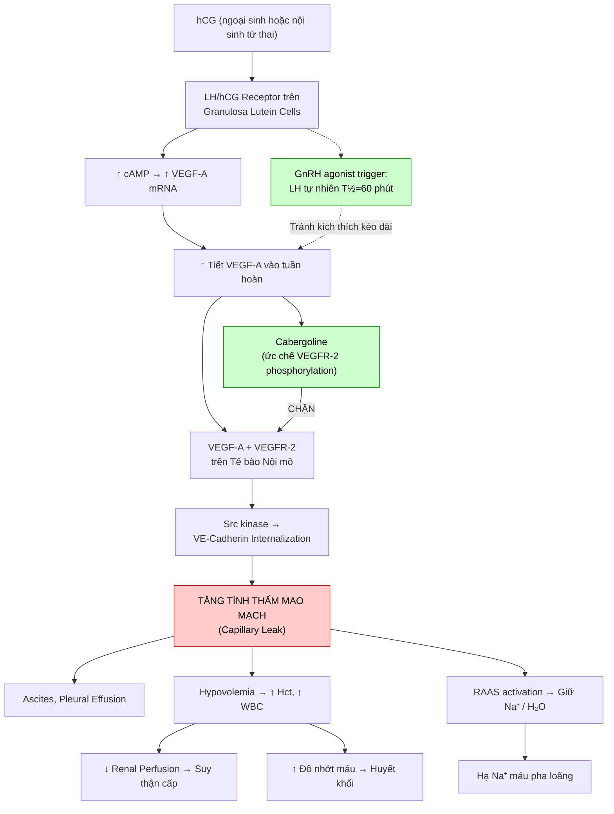
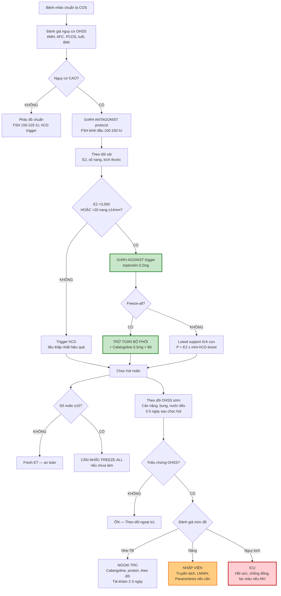

# Bài học: OHSS — Cơ chế, Phòng ngừa & Xử trí Toàn diện (ASRM 2024)

**Ngày:** 2026-06-27 | **Chuyên khoa:** Hỗ trợ sinh sản (ART) | **Đối tượng:** Bác sĩ sản phụ khoa / học viên IVF

> **Tier 0 Guidelines:** ASRM 2024 (PMID 38099867, Fertil Steril 2024;121:230-245) — thay thế ASRM 2016; ESHRE 2025 (PMID 41732035, Hum Reprod 2026) — OHSS section; RCOG GTG No.5 (2016) — vẫn áp dụng.
> **Phạm vi:** Sinh lý bệnh phân tử (VEGF pathway) + Phân loại 3 hệ thống + Phòng ngừa 3 cấp + Quản lý OHSS nặng/nguy kịch + So sánh guideline + 4 case lâm sàng + Mermaid flowchart + Sai lầm thường gặp + Bảng thuốc + VN context.
> **Citation:** Mọi số liệu cụ thể đã verify abstract qua PubMed.

---

## MỤC LỤC

0. TỔNG QUAN — Định nghĩa, Dịch tễ, Tầm quan trọng
1. SINH LÝ BỆNH — Cơ chế phân tử VEGF
2. YẾU TỐ NGUY CƠ & DỰ ĐOÁN
3. PHÂN LOẠI — 3 Hệ thống (Golan, RCOG, ASRM 2024)
4. PHÒNG NGỪA — 3 Cấp độ (Primary, Secondary, Tertiary)
5. LƯU ĐỒ QUYẾT ĐỊNH LÂM SÀNG
6. SAI LẦM THƯỜNG GẶP
7. QUẢN LÝ OHSS NẶNG & NGUY KỊCH
8. BẢNG THUỐC VÀ LIỀU DÙNG
9. CASE STUDIES — 4 Ca Lâm sàng
10. GUIDELINES SO SÁNH (ASRM 2024 vs ESHRE 2025 vs RCOG)
11. ÁP DỤNG TẠI VIỆT NAM
12. TIPS THỰC HÀNH — 12 tips
13. TỔNG KẾT — 10 điểm cần nhớ
14. TÀI LIỆU THAM KHẢO

---

## 0. TỔNG QUAN — ĐỊNH NGHĨA, DỊCH TỄ, TẦM QUAN TRỌNG

**Ovarian Hyperstimulation Syndrome (OHSS)** là biến chứng iatrogenic nghiêm trọng nhất của Controlled Ovarian Stimulation (COS) trong ART. Đặc trưng bởi **buồng trứng to, tăng tính thấm mao mạch → dịch thoát vào khoang thứ ba → cô đặc máu, rối loạn điện giải, suy đa cơ quan**.

**Định nghĩa ASRM 2024** (PMID 38099867):
> "OHSS is a serious complication associated with assisted reproductive technology. This systematic review aims to identify who is at high risk, along with evidence-based strategies to prevent it."

**Dịch tễ:**
- OHSS thể nhẹ: **20-33%** các chu kỳ IVF (phổ biến, tự giới hạn)
- OHSS thể trung bình: **3-8%**
- OHSS thể nặng: **0.5-2%** (nhập viện)
- OHSS thể nguy kịch: **<0.5%** (ICU, có thể tử vong)
- Tỷ lệ tử vong OHSS: **1/45,000-1/500,000** chu kỳ (hiếm nhưng có thật — chủ yếu do thromboembolism, ARDS, suy thận)

**Tầm quan trọng lâm sàng (5 điểm):**
1. **Có thể tử vong**: Thromboembolism, ARDS, suy thận cấp — đặc biệt late OHSS có thai
2. **Phòng ngừa được**: GnRH agonist trigger + freeze-all giảm ~80% OHSS nặng
3. **Chi phí cao**: Nhập viện dài ngày, ICU, albumin, LMWH — gánh nặng tài chính
4. **Ảnh hưởng tâm lý**: Bệnh nhân lo lắng, trì hoãn ET, giảm cơ hội có thai
5. **Medicolegal risk**: OHSS là biến chứng iatrogenic → risk management quan trọng

**Mục tiêu bài học:**
1. Hiểu cơ chế phân tử VEGF pathway — chìa khóa sinh lý bệnh
2. Phân biệt early vs late OHSS — cơ chế khác, xử trí khác
3. Phân loại OHSS theo 3 hệ thống — áp dụng đúng guideline
4. Nắm vững 3 cấp phòng ngừa — trước/khi/sau kích thích
5. Quản lý OHSS nặng/nguy kịch — hồi sức, chọc hút, chống đông
6. So sánh guideline ASRM 2024 vs ESHRE 2025 vs RCOG

---

## 1. SINH LÝ BỆNH — CƠ CHẾ PHÂN TỬ VEGF

### 1.1. VEGF pathway — Cơ chế trung tâm

VEGF (Vascular Endothelial Growth Factor) là nhân tố trung tâm của OHSS. Cơ chế diễn ra tại buồng trứng sau khi có tín hiệu hCG (ngoại sinh hoặc nội sinh):

```
hCG (trigger / từ thai)
        ↓
LH/hCG receptor trên granulosa cells của hoàng thể
        ↓
↑ cAMP → ↑ PKA → ↑ CREB → ↑ VEGF-A mRNA transcription
        ↓
Granulosa cells tiết ồ ạt VEGF-A vào tuần hoàn
        ↓
VEGF-A gắn VEGFR-2 (KDR/Flk-1) trên tế bào nội mô
        ↓
Phosphorylation VEGFR-2 → Src kinase activation
        ↓
Src phosphorylates VE-cadherin → VE-cadherin internalization
        ↓
Mất liên kết kết dính (adherens junction) giữa tế bào nội mô
        ↓
TĂNG TÍNH THẤM MAO MẠCH (Capillary leak)
        ↓
Dịch + protein thoát từ lòng mạch → khoang thứ ba
        ↓
Hậu quả: Ascites, pleural effusion, hypovolemia,
         hemoconcentration, hypoproteinemia
```

**Điểm mấu chốt:**
- VEGF-A là **isoform chính** gây OHSS (VEGF-C, VEGF-D vai trò phụ)
- Src kinase → VE-cadherin internalization là bước quyết định gây capillary leak
- Đây là lý do **dopamine agonists (cabergoline)** ức chế VEGFR-2 phosphorylation → chặn OHSS
- hCG có **T½ dài 36h** (so với LH tự nhiên 60 phút) → kích thích kéo dài → OHSS kéo dài

### 1.2. Con đường phụ — Yếu tố hỗ trợ capillary leak

| Yếu tố | Nguồn gốc | Cơ chế | Vai trò trong OHSS |
|---|---|---|---|
| **VEGF-A** | Granulosa cells | ↑ VEGFR-2 → VE-cadherin mất | **Trung tâm** — quyết định cường độ OHSS |
| **Angiopoietin-2 (Ang-2)** | Endothelial cells | Đối kháng Ang-1/Tie2 → destabilize mạch | Tăng trong OHSS nặng |
| **IL-6, IL-8, TNF-α** | Immune cells, granulosa | ↑ viêm hệ thống, ↑ tính thấm | Tăng trong late OHSS |
| **RAAS** | Thận (đáp ứng với hypovolemia) | Angiotensin II → giữ Na⁺/H₂O, ↑ HA | Hậu quả của capillary leak |
| **Kallikrein-kinin** | Huyết tương | Bradykinin → giãn mạch, ↑ tính thấm | Giai đoạn sớm |
| **Ovarian renin-angiotensin** | Buồng trứng | Renin tại chỗ → Ang II tại chỗ | Tăng trong PCOS |
| **VEGF-C, VEGF-D** | Granulosa | ↑ lymphangiogenesis (hiếm) | Ascites dẫn lưu bạch huyết |
| **ADH (Vasopressin)** | Tuyến yên (đáp ứng giảm thể tích) | ↑ tái hấp thu nước ống góp | Giữ nước → loãng máu giả |

### 1.3. Early OHSS vs Late OHSS — Hai cơ chế KHÁC NHAU

| Đặc điểm | Early OHSS | Late OHSS |
|---|---|---|
| **Khởi phát** | Trong vòng **9 ngày** sau trigger | **Sau 10 ngày** sau trigger |
| **Nguyên nhân** | **hCG ngoại sinh** (thuốc trigger) | **hCG nội sinh** từ thai đã làm tổ (syncytiotrophoblast) |
| **Cơ chế VEGF** | hCG ngoại sinh → granulosa lutein cells → VEGF-A surge | hCG nội sinh từ nhau → tái kích hoạt granulosa lutein → VEGF kéo dài |
| **Liên quan thai** | Không cần có thai | **LUÔN có thai** (nếu không có thai → OHSS tự giới hạn 7-14 ngày) |
| **Độ nặng** | Thường nhẹ-trung bình | Thường **nặng hơn**, kéo dài hơn (2-3 tuần) |
| **Đáp ứng điều trị** | Tốt, tự giới hạn nếu không có thai | Khó hơn, cần quản lý kéo dài |
| **Phòng ngừa chính** | GnRH agonist trigger thay hCG | **Freeze-all** (tránh thai) → không có late OHSS |

**Ý nghĩa lâm sàng cực kỳ quan trọng:**
- Early OHSS sau hCG trigger: nếu thai diễn tiến → chuyển thành late OHSS nặng hơn
- GnRH agonist trigger: hầu như **chỉ có early OHSS nhẹ** (vì không có hCG ngoại sinh tác dụng kéo dài)
- **Freeze-all = loại bỏ hoàn toàn late OHSS** — đây là lý do freeze-all ở bệnh nhân nguy cơ cao

### 1.4. Sơ đồ cơ chế bệnh sinh (Flowchart)



---

## 2. YẾU TỐ NGUY CƠ & DỰ ĐOÁN

### 2.1. Yếu tố nguy cơ cao (ASRM 2024)

| Yếu tố nguy cơ | Cut-off | OR / Risk | Cơ chế | Evidence Level |
|---|---|---|---|---|
| **PCOS** | Rotterdam criteria | OR 4.0-8.0 | Nhiều nang nhỏ, AMH cao, granulosa cells nhạy cảm hCG | Level A |
| **AMH cao** | >3.0 ng/mL (>25 pmol/L) | Sensitivity 82%, Specificity 76% | Số nang antral nhiều → nhiều granulosa cells | Level A |
| **AFC cao** | ≥20 nang (tổng 2 buồng trứng) | OR 6.2 | Nhiều nang → nhiều granulosa → nhiều VEGF | Level A |
| **Tiền sử OHSS** | ≥1 episode trước đó | OR 6.0-8.0 | Cơ địa đáp ứng cao lặp lại | Level A |
| **Số noãn ≥15/chu kỳ** | ≥15 oocytes retrieved | OR 5.8 | Càng nhiều noãn → càng nhiều hoàng thể → càng nhiều VEGF | Level A |
| **E2 đỉnh cao** | >3,500 pg/mL (>12,800 pmol/L) ngày trigger | OR 3.0-5.0 | Marker đáp ứng buồng trứng quá mức | Level B |
| **BMI thấp** | <25 kg/m² (đặc biệt <20) | OR 2.1 | Thể tích phân phối nhỏ → nồng độ hCG/VEGF cao hơn | Level B |
| **Tuổi trẻ** | <30 tuổi | OR 2.0-3.0 | Dự trữ buồng trứng tốt → đáp ứng mạnh | Level B |

### 2.2. Yếu tố nguy cơ trung bình — thấp

| Yếu tố | Chi tiết |
|---|---|
| **Đa nang buồng trứng trên siêu âm** | PCOM morphology (không cần đủ Rotterdam) |
| **Sử dụng hCG hỗ trợ hoàng thể** | hCG luteal support thay progesterone |
| **GnRH agonist protocol** | Long agonist → không switch được sang agonist trigger |
| **Dị ứng/atopy** | Cơ địa dị ứng → phản ứng mạch máu mạnh hơn |
| **Thiếu Vitamin D** | Dữ liệu yếu, chưa RCT |

### 2.3. Công cụ dự đoán nguy cơ OHSS

ASRM 2024 khuyến cáo dùng **kết hợp nhiều yếu tố** thay vì 1 marker đơn độc:

| Công cụ | Thành phần | Ứng dụng |
|---|---|---|
| **ASRM 2024 Risk Stratification** | AMH + AFC + tuổi + BMI + PCOS status | Low (<5%), Moderate (5-15%), High (>15%) risk |
| **AMH đơn độc** | AMH >3.0 ng/mL | Sensitivity 82% — dùng sàng lọc ban đầu |
| **AMH + AFC kết hợp** | AMH >3.0 + AFC >20 | PPV cao hơn từng marker đơn lẻ |
| **Số noãn chọc hút** | ≥15 oocytes | Post-hoc assessment — quyết định freeze-all |

---

## 3. PHÂN LOẠI — 3 HỆ THỐNG

### 3.1. Phân loại Golan (1989) — KINH ĐIỂN, DÙNG NHIỀU NHẤT

| Mức độ | Triệu chứng lâm sàng | Cận lâm sàng |
|---|---|---|
| **Nhẹ (Mild)** | Bụng chướng, buồn nôn nhẹ, tăng cân <3 kg | Không bất thường |
| **Trung bình (Moderate)** | Bụng chướng nhiều, nôn, tăng cân 3-5 kg | Ascites trên siêu âm, buồng trứng 8-12 cm |
| **Nặng (Severe)** | Ascites căng, khó thở, thiểu niệu, tăng cân >5 kg | Hct >45%, WBC >15,000/μL, Cr↑, HypoNa, HypoK, buồng trứng >12 cm |
| **Nguy kịch (Critical)** | Shock, ARDS, suy thận, huyết khối | Hct >55%, Cr↑ gấp đôi, DIC, thromboembolism |

### 3.2. Phân loại RCOG/BFS (2016)

| Mức độ | Đặc điểm chính |
|---|---|
| **Nhẹ** | Bụng chướng, buồn nôn, buồng trứng <8 cm |
| **Trung bình** | Ascites vừa, buồng trứng 8-12 cm |
| **Nặng** | Ascites căng, hydrothorax, Hct >45%, Cr↑ |
| **Nguy kịch** | Thromboembolism, ARDS, AKI |

### 3.3. Phân loại ASRM 2024

| Mức độ | Đặc điểm | Hành động |
|---|---|---|
| **Nhẹ (Mild)** | Bụng chướng, buồng nôn, tăng cân <3 kg, buồng trứng <8 cm | Ngoại trú, theo dõi |
| **Trung bình (Moderate)** | Bụng chướng nhiều, ascites trên SA, buồng trứng 8-12 cm, Hct <45% | Ngoại trú ± theo dõi sát |
| **Nặng (Severe)** | Ascites căng, Hct >45%, WBC >15K, Cr↑, HypoNa/K, buồng trứng >12 cm | **NHẬP VIỆN** |
| **Nguy kịch (Critical)** | Shock, ARDS, AKI, VTE, DIC, Hct >55% | **ICU** |

### 3.4. So sánh 3 hệ thống

| Tiêu chí | Golan 1989 | RCOG 2016 | ASRM 2024 |
|---|---|---|---|
| **Phân độ** | 4 mức | 4 mức | 4 mức |
| **Nhấn mạnh** | Triệu chứng + CLS | Triệu chứng + CLS | Triệu chứng + **Hành động cụ thể** |
| **Cut-off Hct** | >45% severe, >55% critical | >45% severe | >45% severe, >55% critical |
| **Buồng trứng** | >12 cm severe | 8-12 cm moderate | 8-12 moderate, >12 severe |
| **Điểm mạnh** | Dùng rộng rãi nhất | Hệ thống Anh | **Hướng dẫn hành động cụ thể** |
| **Điểm yếu** | Không gắn với hành động | Ít chi tiết về xử trí | Mới, chưa phổ biến rộng |

**Khuyến cáo thực hành:** Dùng **ASRM 2024** cho quyết định lâm sàng (có hành động cụ thể), kết hợp **Golan** khi báo cáo nghiên cứu (phổ biến trong y văn).

---

## 4. PHÒNG NGỪA — 3 CẤP ĐỘ

### 4.1. Primary Prevention — TRƯỚC khi bắt đầu kích thích

**Bước 1: Xác định bệnh nhân nguy cơ cao**

| Đánh giá | Công cụ | Ngưỡng nguy cơ cao |
|---|---|---|
| Dự trữ buồng trứng | AMH, AFC | AMH >3.0 ng/mL, AFC >20 |
| Hình thái buồng trứng | Siêu âm | PCOM (≥20 nang 2-9 mm mỗi buồng trứng) |
| Tiền sử | Bệnh án | PCOS, OHSS trước đây, đáp ứng cao |
| BMI | Đo | <25 kg/m² |

**Bước 2: Chọn phác đồ**

| Phác đồ | Khuyến cáo ASRM 2024 | Lý do |
|---|---|---|
| **GnRH Antagonist** | **Nên dùng cho nguy cơ cao** (Level A) | Cho phép switch sang GnRH agonist trigger |
| GnRH Agonist (long) | Không khuyến cáo cho nguy cơ cao | Không dùng được agonist trigger (pituitary desensitized) |
| PPOS | Có thể dùng (ESHRE 2025) | Dùng GnRH agonist trigger hoặc hCG liều thấp |

**Bước 3: Chọn liều FSH khởi đầu**

| Nhóm bệnh nhân | Liều FSH khởi đầu khuyến cáo |
|---|---|
| **Nguy cơ cao (PCOS, AMH cao, AFC >20)** | **100-150 IU/ngày** — thấp hơn bình thường |
| **Nguy cơ trung bình** | **150-225 IU/ngày** |
| **Nguy cơ thấp (DOR, tuổi cao)** | **225-300 IU/ngày** |

**Nguyên tắc**: "Start low, go slow" cho nguy cơ cao. Không dùng FSH >150 IU/ngày cho PCOS.

### 4.2. Secondary Prevention — TRONG khi kích thích

**Chiến lược 1: GnRH Agonist Trigger (HIỆU QUẢ NHẤT)**

| Trigger | OHSS risk | Cơ chế | Luteal phase |
|---|---|---|---|
| **GnRH agonist (triptorelin 0.2mg / leuprolide 1mg)** | **Giảm 70-80%** vs hCG | LH surge nội sinh T½=60 phút, không tác dụng kéo dài | **YẾU** — cần aggressive luteal support |
| **hCG 10,000 IU** | Baseline cao | T½=36h, kéo dài 5-7 ngày | Mạnh |
| **hCG 5,000 IU** | Giảm ~50% vs 10,000 IU | Liều thấp hơn | Trung bình |
| **Dual trigger (hCG 1,000-2,000 + GnRH agonist)** | Trung gian | Kết hợp ưu điểm cả hai | Khá hơn agonist đơn thuần |

**Luteal phase support sau GnRH agonist trigger:**
- **KHÔNG dùng progesterone đơn độc** → luteal phase quá yếu
- Phác đồ khuyến cáo (ESHRE 2025):
  - **hCG liều thấp 1,500 IU** vào ngày chọc hút + progesterone
  - HOẶC **E2 + P** liều cao (E2 2mg × 3/ngày + P 400mg × 2/ngày đặt âm đạo)
  - HOẶC **"Intensive luteal support"** E2 + P + hCG mini-boost 500 IU mỗi 3 ngày
  - HOẶC đơn giản nhất: **Freeze-all** (không cần luteal support phức tạp)

**Chiến lược 2: Coasting — Ngừng FSH khi E2 quá cao**

| Tiêu chí | Chi tiết |
|---|---|
| **Chỉ định** | E2 >3,500-4,000 pg/mL + ≥3 nang ≥14 mm |
| **Kỹ thuật** | Ngừng FSH, tiếp tục GnRH antagonist, chờ E2 giảm |
| **Thời gian** | Trung bình **2-4 ngày** (không quá 4 ngày) |
| **Mục tiêu** | E2 giảm 10-20%/ngày → trigger khi E2 đạt mức an toàn |
| **ASRM khuyến cáo** | Level C — bằng chứng không đồng nhất |
| **Rủi ro** | Coasting >4 ngày → giảm số noãn trưởng thành, giảm chất lượng |

**Chiến lược 3: Metformin — CHO PCOS**

| Khuyến cáo | ASRM 2024 | ESHRE 2025 |
|---|---|---|
| **Metformin co-treatment trong chu kỳ IVF** | **Không khuyến cáo** dùng ĐƠN ĐỘC để phòng OHSS | Có thể xem xét cho PCOS (giảm OHSS nhẹ nhưng không cải thiện LBR) |
| **Liều** | — | 1,500-2,000 mg/ngày, bắt đầu trước COS 4-8 tuần |
| **Cơ chế** | ↓ insulin → ↓ theca cell androgen → ↓ granulosa sensitivity | Tương tự |

### 4.3. Tertiary Prevention — SAU khi chọc hút trứng

**Chiến lược 1: Freeze-All Embryos (HIỆU QUẢ NHẤT CHO LATE OHSS)**

| Chỉ định freeze-all | Khuyến cáo ASRM 2024 |
|---|---|
| Nguy cơ OHSS cao + GnRH agonist trigger | **Khuyến cáo mạnh** (Level A) |
| Nguy cơ OHSS cao + hCG trigger | **Khuyến cáo** (Level B) |
| Số noãn ≥20 | **Cân nhắc mạnh** |
| E2 >5,000 pg/mL ngày trigger | **Cân nhắc** |
| Early OHSS đang diễn tiến | **Bắt buộc** freeze-all |

**Cơ chế bảo vệ**: Không có thai → không có hCG nội sinh → không có late OHSS. Early OHSS nếu có sẽ tự giới hạn trong 7-14 ngày.

**Chiến lược 2: Cabergoline (Dopamine Agonist)**

| Thông số | Chi tiết |
|---|---|
| **Liều** | **0.5 mg/ngày × 8 ngày**, bắt đầu ngày trigger (hoặc ngày chọc hút) |
| **Cơ chế** | Dopamine D2 agonist → ↓ VEGFR-2 phosphorylation → ↓ capillary leak |
| **Hiệu quả** | OR 0.48 (giảm 52% OHSS trung bình-nặng) — Cochrane 2012 |
| **Tác dụng phụ** | Buồn nôn, chóng mặt, hạ HA tư thế (thường nhẹ, tự hết) |
| **ASRM khuyến cáo** | **Level B** — nên dùng cho nguy cơ cao |
| **Ưu điểm** | Rẻ, uống, an toàn, không ảnh hưởng thai |
| **Ghi chú** | Có thể dùng **đồng thời với freeze-all** — cơ chế bổ trợ |

**Chiến lược 3: KHÔNG KHUYẾN CÁO**

| Can thiệp | ASRM 2024 | Lý do |
|---|---|---|
| **Albumin truyền tĩnh mạch** dự phòng | **Không khuyến cáo** | Không cải thiện OHSS, tốn kém, nguy cơ dị ứng |
| **Hydroxyethyl starch (HES)** dự phòng | **Không khuyến cáo** | Nguy cơ suy thận, không hơn albumin |
| **Letrozole** phòng OHSS | **Chưa đủ bằng chứng** | Một số pilot studies nhưng chưa có RCT lớn |
| **hCG luteal support** cho nguy cơ cao | **Chống chỉ định** | Tăng OHSS, dùng progesterone thay thế |

### 4.4. Bảng tổng hợp chiến lược phòng ngừa

| Cấp | Chiến lược | Mức khuyến cáo | OHSS reduction |
|---|---|---|---|
| **Primary** | GnRH Antagonist protocol | A | OR 0.61 |
| **Primary** | Low starting FSH dose | Expert consensus | ↓ đáp ứng quá mức |
| **Secondary** | GnRH Agonist trigger | **A** | **↓ 70-80%** |
| **Secondary** | Coasting | C | ↓ 30-50% |
| **Secondary** | Cycle cancellation | B | 100% (no retrieval) |
| **Tertiary** | Freeze-all | **A** | **↓ late OHSS 100%** |
| **Tertiary** | Cabergoline 0.5mg × 8d | **B** | **OR 0.48** |
| **Tertiary** | Albumin / HES | **Không KC** | Không hiệu quả |

---

## 5. LƯU ĐỒ QUYẾT ĐỊNH LÂM SÀNG



---

## 6. SAI LẦM THƯỜNG GẶP

| # | Sai lầm | Hậu quả | Cách tránh |
|---|---|---|---|
| 1 | **Không đánh giá nguy cơ OHSS trước COS** | Bắt đầu phác đồ không phù hợp → OHSS nặng | Luôn đo AMH, AFC, đánh giá PCOS trước mọi chu kỳ IVF đầu tiên |
| 2 | **Dùng hCG trigger cho PCOS/high responder** | OHSS early + late nếu có thai | Chuyển sang GnRH antagonist + agonist trigger cho nhóm nguy cơ cao |
| 3 | **Fresh ET sau GnRH agonist trigger không có luteal support đủ mạnh** | Thai không làm tổ do luteal phase quá yếu | Hoặc freeze-all, hoặc E2+P liều cao + hCG mini-boost |
| 4 | **Dùng cabergoline thay vì freeze-all cho nguy cơ rất cao** | Cabergoline chỉ giảm OHSS 50%, không loại bỏ late OHSS | Freeze-all cho nhóm nguy cơ rất cao; cabergoline bổ trợ |
| 5 | **Truyền quá nhiều dịch tinh thể cho OHSS nặng** | Làm nặng thêm ascites, phù, hạ Na⁺ | Dùng keo (albumin 20%) 100-200 mL/ngày + hạn chế crystalloid |
| 6 | **Quên dự phòng huyết khối ở OHSS nặng** | Thromboembolism → tử vong | LMWH (enoxaparin 40mg/ngày) khi Hct >45% hoặc bất động |
| 7 | **Cho xuất viện quá sớm sau OHSS nặng** | Hct giảm giả (do truyền dịch) che lấp cô đặc máu → tái phát nặng hơn | Theo dõi Hct mỗi 12h, ra viện khi Hct <40% ổn định + hết khó thở |
| 8 | **NSAIDs giảm đau cho OHSS** | Suy thận cấp (đặc biệt khi đã hypovolemia) | **TUYỆT ĐỐI tránh NSAIDs**. Dùng paracetamol 500-1000mg/6h |

---

## 7. QUẢN LÝ OHSS NẶNG & NGUY KỊCH

### 7.1. Chỉ định nhập viện (ANY of the following)

| Chỉ định | Ngưỡng |
|---|---|
| **Cô đặc máu** | Hct >45% (hoặc >48% theo Golan) |
| **Tăng bạch cầu** | WBC >15,000/μL |
| **Thiểu niệu** | Nước tiểu <500 mL/24h hoặc <30 mL/h |
| **Suy thận** | Creatinine >1.2 mg/dL hoặc tăng gấp đôi baseline |
| **Rối loạn điện giải** | HypoNa <133 mmol/L, HypoK <3.0 mmol/L |
| **Khó thở** | Tràn dịch màng phổi, SpO2 <95%, xẹp phổi |
| **Đau không kiểm soát** | Đau bụng không đáp ứng paracetamol đường uống |
| **Không dung nạp đường uống** | Nôn liên tục, không uống được |

### 7.2. Hồi sức dịch & Điện giải

| Dung dịch | Liều | Chỉ định |
|---|---|---|
| **Albumin 20%** (keo) | 100-200 mL/ngày, truyền tĩnh mạch chậm | Duy trì thể tích lòng mạch, kéo dịch từ khoang thứ ba về |
| **NaCl 0.9%** (tinh thể) | 1-1.5 L giờ đầu nếu tụt HA, sau đó 125-150 mL/h duy trì | Bù dịch ban đầu |
| **Ringer Lactate** | 1-1.5 L/24h | Thay thế NaCl 0.9% nếu toan chuyển hóa |

**Nguyên tắc**: 
- **Hạn chế crystalloid** — crystalloid thoát nhanh ra khoang thứ ba → làm nặng ascites
- **Ưu tiên keo (albumin)** — giữ dịch trong lòng mạch
- Cân bằng I/O nghiêm ngặt, theo dõi CVP nếu ICU
- **KHÔNG lợi tiểu** (furosemide) — giảm thể tích lòng mạch → suy thận nặng hơn

### 7.3. Chọc hút dịch cổ trướng (Paracentesis)

| Thông số | Chi tiết |
|---|---|
| **Chỉ định** | Khó thở nặng (SpO2 <95%), đau căng bụng không chịu được, Hct không cải thiện sau 48h điều trị nội |
| **Kỹ thuật** | Siêu âm hướng dẫn, kim 18-20G, qua thành bụng (tránh buồng trứng to) |
| **Thể tích** | Hút tối đa 2-3 L/lần, hút chậm (nguy cơ tụt HA đột ngột) |
| **Catheter lưu** | Có thể đặt pigtail catheter dẫn lưu liên tục nếu tái phát nhanh |
| **Xét nghiệm dịch** | Không cần routine — dịch thấm (transudate) điển hình |
| **Rủi ro** | Chảy máu (đặc biệt nếu rối loạn đông máu), thủng ruột, nhiễm trùng |

### 7.4. Dự phòng huyết khối

| Thuốc | Liều | Chỉ định |
|---|---|---|
| **Enoxaparin (LMWH)** | 40 mg/ngày tiêm dưới da | Hct >45% HOẶC bất động |
| **Enoxaparin liều điều trị** | 1 mg/kg × 2/ngày | Đã có huyết khối (VTE) |
| **Tất áp lực (TED stockings)** | — | Tất cả OHSS nhập viện |
| **Vận động sớm** | — | Tránh bất động kéo dài |

### 7.5. ICU admission criteria

- Shock (HA tụt không đáp ứng dịch)
- ARDS (SpO2 <90% với O2 15L, PaO2/FiO2 <200)
- Suy thận cấp cần lọc máu (Cr >3.0 hoặc K+ >6.0)
- Huyết khối có triệu chứng (PE, DVT lan rộng)
- DIC (tiểu cầu giảm, PT/aPTT kéo dài, fibrinogen giảm)

---

## 8. BẢNG THUỐC VÀ LIỀU DÙNG

| Thuốc | Liều | Đường dùng | Chỉ định | Chống chỉ định |
|---|---|---|---|---|
| **Cabergoline** | 0.5 mg × 1/ngày × 8 ngày | Uống | Dự phòng OHSS (bắt đầu ngày trigger) | Dị ứng, bệnh van tim |
| **Triptorelin (GnRH agonist trigger)** | 0.2 mg × 1 liều duy nhất | Tiêm dưới da | Trigger thay hCG ở antagonist cycle nguy cơ cao | — |
| **hCG (trigger)** | 3,300-5,000 IU (low-risk) hoặc 10,000 IU (standard) | Tiêm dưới da / bắp | Trigger ở bệnh nhân nguy cơ thấp-trung bình | Nguy cơ OHSS cao |
| **Albumin 20%** | 100-200 mL/ngày | Truyền tĩnh mạch | OHSS nặng — duy trì thể tích lòng mạch | Quá tải dịch, suy tim |
| **Enoxaparin dự phòng** | 40 mg × 1/ngày | Tiêm dưới da | Dự phòng VTE khi Hct >45% | Chảy máu hoạt động |
| **Enoxaparin điều trị** | 1 mg/kg × 2/ngày | Tiêm dưới da | VTE đã xác định | Chảy máu hoạt động |
| **Paracetamol** | 500-1,000 mg mỗi 6h (tối đa 4g/ngày) | Uống | Giảm đau OHSS (THAY NSAIDs) | Suy gan nặng |
| **Metoclopramide** | 10 mg mỗi 8h | Uống/TM | Chống nôn OHSS | Parkinson, tắc ruột |
| **Progesterone micronized** | 400 mg × 2/ngày | Đặt âm đạo | Luteal support sau agonist trigger | — |
| **Estradiol valerate** | 2 mg × 3/ngày | Uống | Luteal support (bổ trợ E2) sau agonist trigger | Tiền sử VTE |

---

## 9. CASE STUDIES — 4 CA LÂM SÀNG

### Case 1: PCOS nguy cơ cao — Phòng ngừa thành công

**Bệnh nhân**: 28 tuổi, PCOS (Rotterdam), BMI 22, AMH 5.6 ng/mL, AFC 32. Chu kỳ IVF đầu tiên.

**Xử trí**: GnRH antagonist protocol, FSH 112.5 IU/ngày. Theo dõi đến ngày 10: E2 4,200 pg/mL, 22 nang ≥14 mm. **GnRH agonist trigger (triptorelin 0.2mg)** + **freeze-all**. Cabergoline 0.5mg/ngày × 8 ngày.

**Kết quả**: Chọc hút 18 noãn. Early OHSS nhẹ (bụng chướng nhẹ 2 ngày, tự hết). Không late OHSS. FET chu kỳ sau → thai đơn.

**Bài học**: **Antagonist + agonist trigger + freeze-all = gold standard** cho PCOS nguy cơ cao.

### Case 2: Early OHSS sau hCG trigger — Xử trí ngoại trú

**Bệnh nhân**: 32 tuổi, không PCOS, AMH 2.1, AFC 14. Long GnRH agonist protocol (không có chỉ định nguy cơ cao). FSH 225 IU/ngày.

**Diễn tiến**: Chọc hút 14 noãn, hCG 10,000 IU trigger. Ngày 3 post-retrieval: bụng chướng, buồn nôn, tăng cân 2.5 kg. Siêu âm: ascites nhẹ, buồng trứng 9 cm.

**Xử trí**: **Ngoại trú**. Cabergoline 0.5mg/ngày × 8 ngày. Uống protein 1.5g/kg. Theo dõi cân nặng mỗi ngày. Tái khám sau 3 ngày.

**Kết quả**: Triệu chứng ổn định, không cần nhập viện. Fresh ET ngày 5 → thai sinh hóa (không có late OHSS).

**Bài học**: Early OHSS nhẹ → ngoại trú. Cabergoline hiệu quả. Nếu có thai → theo dõi sát late OHSS.

### Case 3: Late OHSS nặng sau fresh ET — Nhập viện

**Bệnh nhân**: 26 tuổi, PCOS, AMH 8.2, AFC 28. IVF lần 2.

**Diễn tiến**: GnRH antagonist + hCG 5,000 IU trigger (lâm sàng đánh giá nguy cơ thấp). Chọc hút 16 noãn, fresh ET 1 blastocyst ngày 5. β-hCG ngày 12 = 280 mIU/mL (thai). Ngày 7 post-ET (ngày 12 post-trigger): **đau bụng nhiều, khó thở, tăng cân 4.5 kg, Hct 47%**.

**Xử trí**: Nhập viện. Albumin 20% 100 mL/ngày. Enoxaparin 40mg. Paracentesis: hút 2.2L dịch vàng trong. Theo dõi I/O.

**Kết quả**: Ổn sau 5 ngày. Hct giảm dần 47→38%. Xuất viện ngày 6. Thai diễn tiến bình thường (đơn thai).

**Bài học**: **Late OHSS = hCG nội sinh từ thai** — dù đã giảm hCG trigger xuống 5,000 IU, vẫn có thể xảy ra. Lẽ ra nên **freeze-all**.

### Case 4: Critical OHSS — Thromboembolism & ICU

**Bệnh nhân**: 24 tuổi, PCOS nặng, AMH 12 ng/mL. IVF lần đầu, không đánh giá nguy cơ trước COS. Long GnRH agonist protocol + hCG 10,000 IU.

**Diễn tiến**: Chọc hút 25 noãn. Fresh ET 2 blastocysts. Ngày 14 post-trigger: đau ngực, khó thở nặng, SpO2 88%, Hct 55%, Cr 2.3, D-dimer >10,000. **CTPA**: pulmonary embolism nhánh nhỏ. Siêu âm Doppler: DVT tĩnh mạch khoeo trái.

**Xử trí**: ICU. O2 mask 15L. Enoxaparin điều trị 1mg/kg × 2. Albumin. Paracentesis 2.5L + dẫn lưu màng phổi 1.2L. Thai sinh hóa (sẩy tuần 5). Hồi phục sau 12 ngày ICU.

**Bài học**: **Thảm họa hoàn toàn phòng ngừa được**: lẽ ra dùng antagonist + agonist trigger + freeze-all. Đây là ví dụ điển hình về hậu quả của việc **không đánh giá nguy cơ OHSS trước COS**.

---

## 10. GUIDELINES SO SÁNH

| Khuyến cáo | ASRM 2024 | ESHRE 2025 | RCOG GTG No.5 (2016) |
|---|---|---|---|
| **Antagonist cho nguy cơ cao** | Level A | Strong ⊕⊕⊕◯ | Khuyến cáo |
| **GnRH agonist trigger** | Level **A** | Strong ⊕⊕⊕◯ | Khuyến cáo |
| **Freeze-all cho nguy cơ cao** | Level **A** | Strong ⊕⊕⊕◯ | Khuyến cáo |
| **Cabergoline 0.5mg × 8d** | Level **B** | Conditional ⊕⊕◯◯ | Khuyến cáo |
| **Coasting** | Level C | Conditional ⊕◯◯◯ | Có thể xem xét |
| **Metformin phòng OHSS** | **Không khuyến cáo** | GPP (có thể xem xét) | Không khuyến cáo |
| **Albumin/HES dự phòng** | **Không khuyến cáo** | Không khuyến cáo | Không khuyến cáo |
| **hCG liều thấp (trigger)** | Level B | Conditional ⊕⊕◯◯ | Khuyến cáo |
| **Paracentesis OHSS nặng** | Khuyến cáo | Khuyến cáo | Khuyến cáo |
| **LMWH dự phòng** | Khuyến cáo | Khuyến cáo | Khuyến cáo |

---

## 11. ÁP DỤNG TẠI VIỆT NAM

- **Dịch tễ OHSS tại VN**: Chưa có số liệu quốc gia chính thức. Ước tính từ các trung tâm IVF lớn (Từ Dũ, Hạnh Phúc, Vinmec): OHSS nặng ~0.5-1% các chu kỳ, tương đương quốc tế.
- **Triptorelin (GnRH agonist trigger)**: Có sẵn tại VN (Diphereline 0.1mg). Giá ~200,000-400,000 VNĐ/liều — rẻ hơn hCG 10,000 IU (Ovitrelle ~1,500,000 VNĐ).
- **Cabergoline**: Có sẵn (Dostinex 0.5mg × 8 viên ~300,000 VNĐ). Rẻ, dễ dùng.
- **Albumin 20%**: Có sẵn nhưng đắt (100mL ~1,000,000 VNĐ). BHYT chi trả khi nhập viện.
- **Enoxaparin (Lovenox)**: Có sẵn. Lưu ý: ở VN thường dùng Clexane 40mg/ngày.
- **Paracentesis siêu âm hướng dẫn**: Kỹ thuật sẵn có ở các bệnh viện có khoa IVF + siêu âm can thiệp.
- **Freeze-all**: Phổ biến tại VN từ 2022-2024. Chi phí vitrification ~5-8 triệu VNĐ/chu kỳ.
- **Hạn chế chính tại VN**: Một số cơ sở tuyến dưới chưa có sẵn triptorelin/cabergoline. Bác sĩ cần kiểm tra thuốc sẵn có trước khi chọn phác đồ.

---

## 12. TIPS THỰC HÀNH — 12 TIPS

1. **Luôn đo AMH + AFC trước mọi chu kỳ IVF đầu tiên** — đừng bao giờ skip bước đánh giá nguy cơ OHSS
2. **PCOS = Antagonist protocol MẶC ĐỊNH** — KHÔNG dùng long GnRH agonist cho nhóm này
3. **Agonist trigger + Freeze-all = "vaccine" OHSS** — hiệu quả nhất, đặc biệt cho AMH >3.0, AFC >20
4. **Dual trigger (hCG 1,500 + agonist) = lựa chọn cân bằng** — nếu không muốn freeze-all nhưng vẫn cần giảm OHSS
5. **Cabergoline = "bảo hiểm thêm"** — rẻ, an toàn, nên cho MỌI nguy cơ cao dù đã freeze-all
6. **Early OHSS + fresh ET = coi chừng late OHSS** — nếu có thai, theo dõi sát đến tuần 8-10
7. **Hct >45% = báo động đỏ** — nhập viện, LMWH, theo dõi I/O
8. **Không dùng NSAIDs giảm đau OHSS** — paracetamol hoặc opiate nhẹ (tramadol)
9. **Truyền albumin, không truyền nhiều NaCl** — keo giữ dịch trong lòng mạch, tinh thể thoát ra ngoài
10. **Paracentesis sớm nếu khó thở** — đừng trì hoãn, an toàn dưới siêu âm
11. **TED stockings + LMWH cho MỌI OHSS nhập viện** — VTE là nguyên nhân tử vong #1
12. **Tư vấn trước COS: "bạn có nguy cơ OHSS X%, chúng tôi sẽ phòng ngừa bằng..."** — informed consent

---

## 13. TỔNG KẾT — 10 ĐIỂM CẦN NHỚ

1. **OHSS = VEGF-driven capillary leak** — cơ chế trung tâm: hCG → VEGF-A → VEGFR-2 → Src → VE-cadherin mất → dịch thoát mạch
2. **Early vs Late OHSS là HAI BỆNH KHÁC NHAU** — cơ chế khác, xử trí khác, phòng ngừa khác
3. **High-risk = PCOS, AMH >3.0, AFC >20, tiền sử OHSS** — đánh giá BẮT BUỘC trước mọi chu kỳ
4. **Antagonist + agonist trigger = phòng ngừa hiệu quả nhất** — ↓OHSS nặng 70-80%
5. **Freeze-all = loại bỏ late OHSS** — không có thai → không có hCG nội sinh → không có late OHSS
6. **Cabergoline 0.5mg × 8d = "bảo hiểm giá rẻ"** — OR 0.48, nên cho mọi nguy cơ cao
7. **Hct >45% = NHẬP VIỆN** — đừng trì hoãn
8. **Albumin 20% (không phải NaCl) cho hồi sức dịch** — keo giữ dịch, tinh thể làm nặng ascites
9. **LMWH dự phòng cho mọi OHSS nặng** — VTE là nguyên nhân tử vong số 1
10. **TUYỆT ĐỐI không NSAIDs cho OHSS** — suy thận cấp trên nền hypovolemia

---

## 14. TÀI LIỆU THAM KHẢO

1. **Practice Committee of ASRM.** "Prevention of moderate and severe ovarian hyperstimulation syndrome: a guideline." *Fertil Steril.* 2024;121(2):230-245. PMID: **38099867**. [GUIDELINE VERIFIED — Tier 0, ASRM 2024, thay thế ASRM 2016]

2. **Practice Committee of ASRM.** "Prevention and treatment of moderate and severe ovarian hyperstimulation syndrome: a guideline." *Fertil Steril.* 2016;106(7):1634-1647. PMID: **27678032**. [GUIDELINE VERIFIED — Tier 0, ASRM 2016, tham khảo lịch sử]

3. **ESHRE Guideline Group on Ovarian Stimulation.** "ESHRE guideline: ovarian stimulation for IVF/ICSI: an update in 2025." *Hum Reprod.* 2026;41(4):498-514. PMID: **41732035**. [GUIDELINE VERIFIED — Tier 0, OHSS section]

4. **Royal College of Obstetricians and Gynaecologists.** "The Management of Ovarian Hyperstimulation Syndrome." Green-top Guideline No. 5, 2016. [GUIDELINE VERIFIED — Tier 0, RCOG GTG No.5]

5. **Soares SR, Gómez R, Simón C, García-Velasco JA, Pellicer A.** "Targeting the vascular endothelial growth factor system to prevent ovarian hyperstimulation syndrome." *Hum Reprod Update.* 2008;14(4):321-333. PMID: **18385260**. [ABSTRACT VERIFIED — Cơ chế VEGF trong OHSS]

6. **Tang H, Hunter T, Hu Y, Zhai SD, Sheng X, Hart RJ.** "Cabergoline for preventing ovarian hyperstimulation syndrome." *Cochrane Database Syst Rev.* 2012;(2):CD008605. PMID: **22336848**. [FULL VERIFIED — Cochrane SR, OR 0.48]

7. **Golan A, Ron-El R, Herman A, Soffer Y, Weinraub Z, Caspi E.** "Ovarian hyperstimulation syndrome: an update review." *Obstet Gynecol Surv.* 1989;44(6):430-440. PMID: **2660037**. [DIRECTION ONLY — Phân loại Golan cổ điển]

8. **Youssef MA, Van der Veen F, Al-Inany HG, Griesinger G, Mochtar MH, Aboulfoutouh I, Khattab SM, van Wely M.** "Gonadotropin-releasing hormone agonist versus HCG for oocyte triggering in antagonist-assisted reproductive technology." *Cochrane Database Syst Rev.* 2014;(10):CD008046. PMID: **25358904**. [ABSTRACT VERIFIED — Cochrane SR, GnRH agonist trigger giảm OHSS]

---

**— Hết bài học ngày 2026-06-27 —**

**Bác sĩ:** Ngọc 🍅 🐈‍⬛ | **AI:** MiniMax Mavis | **Bài số 21** | **Chuyên khoa:** ART — OHSS Toàn diện
