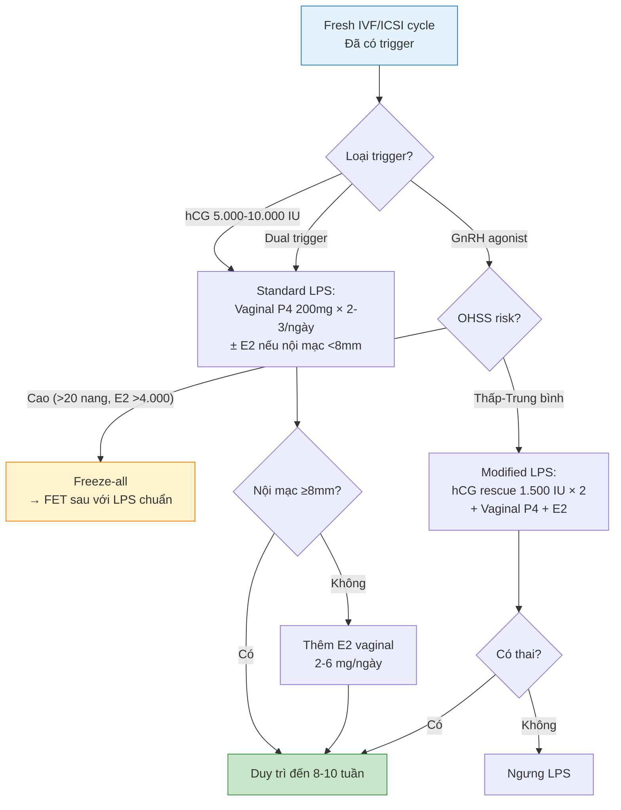
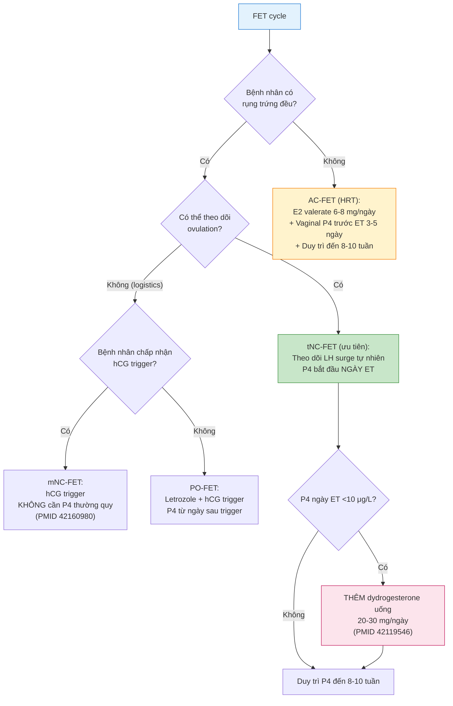
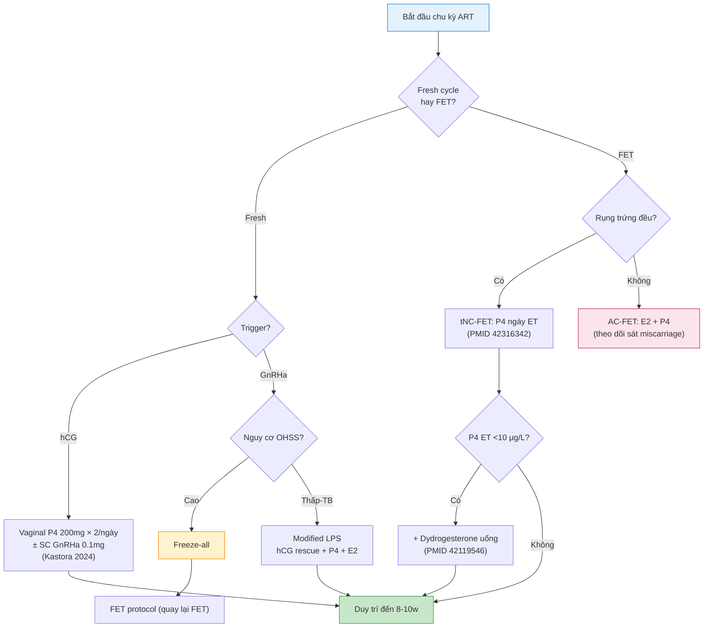

# CHUYÊN ĐỀ: HỖ TRỢ PHA HOÀNG THỂ (LUTEAL PHASE SUPPORT) TRONG ART — CẬP NHẬT 2026
**Ngày:** 2026-06-29 | **Chuyên khoa:** Hỗ trợ sinh sản (ART) | **Loại:** Chuyên đề chuyên sâu (cập nhật từ Bài 19, 22/06/2026)
**Đối tượng:** Bác sĩ sản phụ khoa — Bác sĩ IVF

---

## 0. TỔNG QUAN — VÌ SAO CẦN CHUYÊN ĐỀ NÀY?

**Hỗ trợ pha hoàng thể (Luteal Phase Support - LPS)** là một trong những trụ cột quyết định thành công của chu kỳ IVF/ICSI. Dù progesterone đã được sử dụng từ những năm 1980, **Garg A et al. (2024, Nat Rev Endocrinol, PMID 38110672)** mô tả LPS vẫn là "black-box" với nhiều câu hỏi chưa có lời giải.

**Tại sao cần cập nhật từ Bài 19 (22/06/2026)?**

Từ tháng 6/2026, hàng loạt bằng chứng mới đã xuất hiện làm thay đổi thực hành LPS:

| Bằng chứng mới (2026) | Ý nghĩa lâm sàng |
|---|---|
| AC-FET tăng miscarriage gấp 2 lần so với NC-FET ở phôi euploid (PMID 42081915) | **Paradigm shift:** ưu tiên natural cycle FET khi có thể |
| Estradiol bổ sung trong LPS tăng implantation nhưng không tăng live birth + nguy cơ ứ mật thai kỳ (PMID 42266463) | Cân nhắc kỹ benefit/risk |
| Meta-analysis 2026: progesterone LPS KHÔNG có lợi ích trong mNC-FET (PMID 42160980) | Không cần LPS thường quy trong mNC-FET |
| Dydrogesterone + progesterone có hiệu ứng cộng hợp PK (PMID 42226298) | Cá thể hóa liều dựa trên nồng độ huyết thanh |
| Progesterone vaginal ring (PVR) weekly — an toàn, CPR 43.2% (PMID 42213348) | Lựa chọn delivery system mới |

**Mục tiêu chuyên đề:**
- Tổng hợp toàn bộ bằng chứng LPS đến giữa năm 2026
- Cập nhật các guideline chính (ESHRE 2019, ASRM 2024)
- Cung cấp lưu đồ quyết định lâm sàng cho fresh cycle và FET
- Cá thể hóa LPS theo patient profile và loại chu kỳ

---

## 1. SINH LÝ PHA HOÀNG THỂ

### 1.1. Chu kỳ tự nhiên (Natural Cycle)

Pha hoàng thể kéo dài **~14 ngày** từ rụng trứng đến trước kỳ kinh:

| Giai đoạn | Thời gian | Sự kiện chính | Phân tử chủ chốt |
|---|---|---|---|
| **Early luteal** | Ngày 1-4 sau rụng trứng | CL hình thành từ nang vỡ. Angiogenesis mạnh. Bắt đầu tiết P4 + E2. | VEGF, LH-R, StAR |
| **Mid-luteal** | Ngày 5-9 | P4 đạt đỉnh ~15-25 ng/mL. Nội mạc chuyển secretory. Window of implantation mở. | PR-B, HOXA10, LIF, pinopodes |
| **Late luteal** | Ngày 10-14 | Nếu không thụ thai: CL thoái hóa → P4↓ → kinh nguyệt. Nếu thụ thai: hCG từ phôi rescue CL. | hCG, LH-R, caspase-3 |

**Hai isoform progesterone receptor (PR) ở nội mạc:**
- **PR-A**: ức chế PR-B và estrogen receptor — chiếm ưu thế ở mid-secretory phase
- **PR-B**: hoạt hóa transcription gen đích (HOXA10, LIF, IGFBP-1) — cần cho implantation

Cân bằng PR-A/PR-B quyết định nội mạc đạt receptivity đúng thời điểm. **Lệch tỷ lệ PR-A/PR-B → implantation failure** (Lessey BA, 2016, Fertil Steril).

### 1.2. Luteal-Placental Shift

Khi thụ thai, **hCG từ syncytiotrophoblast** gắn LH-R trên CL → rescue CL → tiếp tục tiết P4 đến **~7-10 tuần**. Sau đó **nhau thai** đảm nhận sản xuất P4 hoàn toàn.

**Cơ chế shift:**
- hCG đạt đỉnh ở tuần 8-10 (~100.000 mIU/mL)
- Trophoblast bắt đầu biểu hiện CYP11A1, 3β-HSD → tự tổng hợp P4
- CL thoái hóa dần (không còn cần thiết)

**Ý nghĩa lâm sàng:** LPS chỉ cần đến khi luteal-placental shift hoàn tất (~8-10 tuần). Kéo dài LPS quá 10-12 tuần không có lợi ích đã được chứng minh.

### 1.3. Window of Implantation

**Wilcox AJ et al. (1999, NEJM, PMID 10558900):** WOI mở từ **ngày 6-10 sau ovulation**. Nội mạc đạt receptivity tối đa khi:
- Pinopodes xuất hiện (ngày 19-21 của chu kỳ 28 ngày)
- HOXA10 và LIF biểu hiện đỉnh
- PR-A/PR-B ratio tối ưu
- Integrin αvβ3, osteopontin upregulated

**LPS giúp đồng bộ nội mạc với WOI**, đặc biệt quan trọng trong chu kỳ COS khi nội mạc bị advancement.

---

## 2. SINH LÝ BỆNH — TẠI SAO ART GÂY LUTEAL PHASE DYSFUNCTION?

### 2.1. Cơ chế

Trong COS, **nồng độ steroid tăng gấp 5-10 lần** sinh lý do nhiều nang cùng phát triển:

1. **LH suppression:** E2 + P4 cao → feedback âm tính → ↓LH pulse frequency và amplitude từ tuyến yên → CL không được trophic support
2. **Premature luteolysis:** CL thoái hóa từ **ngày 5-7 sau hCG trigger** (so với ngày 10-14 trong tự nhiên) → P4 giảm sớm
3. **Endometrial advancement:** steroid cao → nội mạc trưởng thành nhanh hơn 2-4 ngày → **lệch WOI** → giảm implantation
4. **GnRH antagonist protocol** càng làm trầm trọng: LH bị block thêm bởi antagonist

**Mức độ dysfunction tỷ lệ thuận với số nang phát triển** — càng nhiều nang → càng nhiều steroid → càng nặng luteal deficiency.

### 2.2. Trigger Protocols Ảnh Hưởng Đến LPS

| Trigger | Thời gian LH activity | LPS requirement | Cơ chế |
|---|---|---|---|
| **hCG 5.000-10.000 IU** | ~5-7 ngày | Standard LPS (P4 ± E2) | hCG = LH analog, t½ dài, tự duy trì CL |
| **hCG 3.000-5.000 IU** | ~3-5 ngày | Standard LPS | Liều thấp → luteal activity ngắn hơn |
| **GnRH agonist** (leuprolide 0.5-2 mg) | **<24 giờ** | **Cần CL rescue** hoặc freeze-all | LH surge nội sinh ngắn, CL không được duy trì |
| **Dual trigger** (hCG 1.000-1.500 + GnRHa) | Trung gian (~2-3 ngày) | Standard LPS | hCG liều thấp + LH surge → bảo tồn một phần luteal function |

**Kol S & Humaidan P (2021, Curr Opin Obstet Gynecol, PMID 33394734):** Trigger bằng GnRHa gây **luteal phase gần như biến mất** sau 24h → BẮT BUỘC có LPS tích cực.

---

## 3. DƯỢC ĐỘNG HỌC PROGESTERONE — PK/PD THEO ĐƯỜNG DÙNG

### 3.1. Bảng so sánh PK parameters

| Route | Chế phẩm | Liều thường dùng | Cmax (ng/mL) | Tmax (h) | t½ (h) | First-pass effect |
|---|---|---|---|---|---|---|
| **Vaginal (tablet)** | Utrogestan®, Cyclogest® | 200-400 mg × 2-3/ngày | 8-12 | 6-8 | 13-16 | KHÔNG qua gan (first uterine pass) |
| **Vaginal (gel)** | Crinone® 8% | 90 mg × 1/ngày | 10-15 | 5-7 | 13-16 | KHÔNG qua gan |
| **Vaginal ring** | PVR (mới) | 1 ring/tuần | Ổn định plateau | — | — | KHÔNG qua gan |
| **Intramuscular** | Progesterone in oil | 50-100 mg/ngày | 40-70 | 8-12 | 20-28 | KHÔNG |
| **Subcutaneous** | Prolutex® 25 mg | 25-50 mg/ngày | 20-40 | 4-6 | 10-12 | KHÔNG |
| **Oral micronized** | Utrogestan® uống | 200-400 mg/ngày | 10-30 (allopregnanolone) | 1-4 | 5-10 | QUA GAN (90% chuyển hóa) |
| **Oral dydrogesterone** | Duphaston® | 20-40 mg/ngày | 30-50 (DHD) | 1-2 | 14-18 | QUA GAN nhưng ổn định chuyển hóa |

### 3.2. First Uterine Pass Effect

**Cicinelli E et al. (2000, Hum Reprod, PMID 11006196):** Progesterone vaginal được hấp thu trực tiếp vào **tĩnh mạch tử cung → động mạch tử cung** (counter-current transfer) → nồng độ P4 ở nội mạc **cao gấp 10-15 lần** so với huyết thanh.

**Ý nghĩa lâm sàng:** Vaginal P4 tạo nồng độ tại đích (nội mạc) cao hơn huyết thanh → hiệu quả lâm sàng tốt dù nồng độ huyết thanh thấp. Ngược lại, IM/SC tạo nồng độ huyết thanh cao nhưng phân bố toàn thân.

### 3.3. Dydrogesterone vs Micronized Progesterone

**Dydrogesterone (Duphaston®):**
- Cấu trúc retroprogesterone (methyl group ở C10α thay vì C10β)
- **Chọn lọc PR cao** (không gắn AR, ER, GR, MR)
- **Sinh khả dụng uống 28%** (so với <5% của micronized P4)
- Chất chuyển hóa chính: 20α-dihydrodydrogesterone (DHD) — cũng có hoạt tính progestogenic
- **Griesinger G et al. (2020, PLoS One, PMID 33147288):** ongoing pregnancy OR 1.32 (95% CI 1.08-1.61), live birth OR 1.28 (95% CI 1.04-1.57) — vượt trội MVP

### 3.4. PK Interaction: Dydrogesterone + Progesterone (MỚI 2026)

**PMID 42226298 (2026, Reprod Biol Endocrinol) [ABSTRACT VERIFIED]:** Nghiên cứu đầu tiên dùng **HPLC-MS/MS định lượng đồng thời** dydrogesterone (DYD), 20α-dihydrodydrogesterone (DHD) và progesterone (P4) ở 111 bệnh nhân HRT-FET:

- **Live birth cao nhất khi cả DYD và P4 đều cao (67%)**
- **Live birth thấp nhất khi cả hai đều thấp (27%)**
- Không hormone đơn lẻ nào dự báo độc lập live birth
- **→ Hiệu ứng cộng hợp (additive) giữa DYD và P4** — hỗ trợ chiến lược combinatorial progestin

### 3.5. Progesterone Vaginal Ring — PVR (MỚI 2026)

**PMID 42213348 (2026, Drug Deliv Transl Res) [ABSTRACT VERIFIED]:** SARA trial — thử nghiệm an toàn pha 3:

- **254 phụ nữ**, PVR đặt hàng tuần (thay 1 lần/tuần)
- **Tỷ lệ sảy thai tự nhiên: 7.4%** (upper bound 95% CI 11.5%, dưới ngưỡng 15% định trước)
- **Thai lâm sàng 10 tuần: 43.2%**
- Tác dụng phụ tại chỗ: 2.0%
- **Dung nạp tốt**, ít discharge hơn gel/tablet

**Lợi thế:** weekly dosing → tăng tuân thủ. Nhược: chưa có sẵn rộng rãi, chi phí cao.

---

## 4. PHÂN LOẠI VÀ SO SÁNH CÁC PROTOCOL LPS

### 4.1. Bảng so sánh toàn diện 7 route LPS

| Route | Liều | CPR (so với VP) | LB (so với VP) | Miscarriage | Tác dụng phụ chính | Bằng chứng mạnh nhất | Khuyến cáo |
|---|---|---|---|---|---|---|---|
| **Vaginal P4 (MVP)** | 200-400 mg × 2-3/ngày | Reference | Reference | Reference | Khó chịu âm đạo, dịch | Cochrane 2015 (94 RCT) | **First-line** |
| **Vaginal gel (Crinone®)** | 90 mg × 1/ngày | Tương đương | Tương đương | Tương đương | Discharge ít hơn tablet | Cochrane 2015 | First-line |
| **PVR (vaginal ring)** | 1 ring/week | 43.2% (uncontrolled) | Chưa có RCT | 7.4% | Tại chỗ 2% | SARA trial 2026 (PMID 42213348) | Tiềm năng |
| **IM progesterone** | 50-100 mg/ngày | Tương đương | Tương đương | Tương đương | Đau, áp xe, dị ứng dầu | Cochrane 2015 | Alternative |
| **SC progesterone** | 25-50 mg/ngày | Tương đương | Tương đương | Tương đương | Ít đau hơn IM | Doblinger 2016 (IPD meta) | Alternative |
| **Oral dydrogesterone** | 20-40 mg/ngày | **↑ OR 1.32** | **↑ OR 1.28** | Tương đương | Buồn nôn, đau đầu nhẹ | Griesinger 2020 (IPD meta) | First-line alternative |
| **Oral micronized P4** | 200-400 mg/ngày | Kém hơn | Kém hơn | Không rõ | Buồn ngủ, chóng mặt | Ít evidence | **KHÔNG khuyến cáo** |

### 4.2. Combinatorial LPS (Kết hợp)

**Kastora SL et al. (2024, Sci Rep, PMID 38914570) [FULL VERIFIED]:** NMA Bayesian, 76 RCT, 22 interventions, 26.536 bệnh nhân:

| Protocol | CP OR (95% CrI) | LB OR (95% CrI) | Miscarriage OR (95% CrI) |
|---|---|---|---|
| **VP + OE + SCGnRH-a** | **1.57 (1.11-2.22)** | **8.81 (2.35-39.1)** | — |
| **VP + SCGnRH-a** | **1.28 (1.05-1.55)** | **1.76 (1.45-2.15)** | **0.54 (0.37-0.80)** |
| IM hCG (progesterone-free) | — | 9.67 (2.34-73.2) | Tăng OHSS OR 1.64 |

**Kết luận:** VP + SCGnRH-a cho kết quả tối ưu — tăng CPR + LB + **GIẢM 46% miscarriage**.

---

## 5. LPS TRONG FRESH CYCLES

### 5.1. Standard Fresh Cycle (hCG Trigger)

**Protocol chuẩn:**
- Vaginal P4 200-400 mg × 2-3 lần/ngày HOẶC gel 90 mg/ngày
- Bắt đầu: **ngày sau oocyte retrieval** (hoặc cùng ngày)
- Kéo dài: **đến 8-10 tuần** (sau luteal-placental shift)
- Cân nhắc thêm E2 nếu nội mạc mỏng (<8mm)

**ESHRE 2019 (Ovarian Stimulation Guideline, PMID 32395637):** Khuyến cáo vaginal progesterone là first-line. IM progesterone hiệu quả tương đương nhưng nhiều tác dụng phụ hơn.

### 5.2. Bổ Sung Estradiol Trong LPS (MỚI 2026)

**PMID 42266463 (2026, Hum Reprod Open) [ABSTRACT VERIFIED]:** RCT n=518, GnRH antagonist protocol, so sánh vaginal E2 + P4 vs P4 đơn thuần:

| Outcome | E2 + P4 | P4 alone | RR | P |
|---|---|---|---|---|
| Implantation rate | 39.66% | 32.96% | 1.20 (1.01-1.42) | 0.04 |
| Clinical pregnancy | 53.28% | 44.02% | 1.21 (1.02-1.43) | 0.03 |
| Ongoing pregnancy | 48.77% | 41.31% | 1.18 (0.98-1.41) | 0.07 (NS) |
| Live birth | 46.72% | 40.15% | 1.16 (0.96-1.40) | 0.12 (NS) |
| **ICP (ứ mật thai kỳ)** | **5.17%** | **0%** | — | **0.01** |

**Khuyến cáo:** Cân nhắc thêm E2 vaginal **chỉ khi** nội mạc mỏng (<8mm) hoặc có tiền sử implantation failure. **KHÔNG dùng thường quy** do nguy cơ ICP (number needed to harm ~20).

### 5.3. GnRH Agonist Trigger — Modified LPS

**Tình huống:** High responders (>15-20 nang, E2 >4.000 pg/mL) → GnRHa trigger để tránh OHSS.

**2 chiến lược:**

| Chiến lược | LPS protocol | Ưu | Nhược |
|---|---|---|---|
| **Freeze-all** | Không LPS fresh. FET sau với LPS chuẩn. | OHSS-free tuyệt đối | Trì hoãn ET, chi phí cao hơn |
| **Modified LPS** | hCG rescue 1.500 IU ngày retrieval + 1.500 IU ngày 3-4 + vaginal P4 + E2 | Fresh transfer được | Vẫn có nguy cơ OHSS nhẹ |

**Kol S & Humaidan P (2021, PMID 33394734):** Không trigger GnRHa nếu không có kế hoạch LPS hoặc freeze-all.

---

## 6. LPS TRONG FET CYCLES — CHUYÊN SÂU (MỚI 2026)

### 6.1. So Sánh Các Protocol FET

| Protocol | Chuẩn bị nội mạc | Ovulation | LPS requirement | Bằng chứng mới |
|---|---|---|---|---|
| **AC-FET (HRT)** | E2 ngoại sinh + P4 ngoại sinh | Không | **BẮT BUỘC** — E2 + P4 từ ngày nội mạc ≥7mm | Tăng miscarriage, giảm LB (PMID 42081915) |
| **tNC-FET** | Tự nhiên | Có (LH surge nội sinh) | **Tranh cãi** — một số study cho thấy không cần | LB và CPR cao nhất |
| **mNC-FET** | hCG trigger | Có (hCG trigger) | **Meta 2026: KHÔNG cần** P4 thường quy (PMID 42160980) | HCG trigger → CL tự sản xuất P4 đủ |
| **PO-FET** | Letrozole ± gonadotropin | Có (hCG trigger) | Standard P4 | LB không khác biệt vs mNC-FET (PMID 42270032) |

### 6.2. AC-FET vs tNC-FET — Paradigm Shift 2026

**PMID 42081915 (2026, Hum Reprod) [ABSTRACT VERIFIED]:** RCT so sánh AC-FET vs tNC-FET ở phôi **euploid** (n=354):

| Outcome | AC-FET | tNC-FET | P |
|---|---|---|---|
| Early pregnancy loss | **14.2%** | **6.7%** | 0.022 |
| Clinical pregnancy | 52.3% | 72.5% | <0.001 |
| Live birth | 47.2% | 67.4% | <0.001 |

**Thử nghiệm bị dừng sớm** vì lo ngại an toàn sản khoa của AC-FET!

**Khuyến cáo thực hành mới:**
- **tNC-FET là preferred protocol** cho phụ nữ có rụng trứng đều
- **AC-FET chỉ nên dành cho:** suy buồng trứng, hypothalamic amenorrhea, hoặc bệnh nhân không thể theo dõi ovulation
- Khi bắt buộc dùng AC-FET: theo dõi sát sảy thai sớm, tư vấn nguy cơ

### 6.3. mNC-FET — Có Cần LPS?

**PMID 42160980 (2026, Reprod Biomed Online) [ABSTRACT VERIFIED]:** Meta-analysis 7 nghiên cứu (3 RCT + 4 hồi cứu, 3.896 chu kỳ):

- **Live birth: KHÔNG khác biệt** (OR 1.15, 95% CI 0.98-1.36; aOR 1.07, 95% CI 0.64-1.79)
- Clinical pregnancy: tăng nhẹ trong phân tích thô (OR 1.21) nhưng **không còn ý nghĩa sau hiệu chỉnh** (aOR 1.15, 95% CI 0.87-1.51)
- **Kết luận: Không ủng hộ progesterone LPS thường quy trong mNC-FET**

**Cơ chế:** hCG trigger → CL được rescue tự nhiên → tự sản xuất P4 đủ → bổ sung ngoại sinh không thêm lợi ích.

### 6.4. PO-FET — Dydrogesterone-Based Protocol

**PMID 42270032 (2026, Fertil Steril) [ABSTRACT VERIFIED]:** Propensity score-matched PO-FET (dydrogesterone uống thay hCG trigger + progestin support) vs mNC-FET:

- **Live birth: không khác biệt** (35.29% vs 28.82%, OR 1.35, P=0.245)
- **Kết luận:** PO-FET là lựa chọn thay thế không cần hCG trigger, phù hợp bệnh nhân không muốn tiêm

### 6.5. Thời Điểm Bắt Đầu LPS Trong NC-FET

**PMID 42316342 (2026, BMC Pregnancy Childbirth) [ABSTRACT VERIFIED]:** Hồi cứu 246 chu kỳ NC-FET:

- **Bắt đầu LPS ngày chuyển phôi (day 0):** LB **52.7%**
- **Bắt đầu LPS 2 ngày trước chuyển phôi (day -2):** LB **37.2%** (P=0.024)
- Start day-0 là yếu tố độc lập dự báo CPR: OR 2.37 (95% CI 1.17-4.81)

**Cơ chế:** Bắt đầu P4 sớm → nội mạc advancement → lệch WOI → giảm implantation. **Bắt đầu LPS đúng ngày chuyển phôi giúp đồng bộ tốt hơn.**

### 6.6. Dydrogesterone "Cứu" Chu Kỳ P4 Thấp (MỚI)

**PMID 42119546 (2026, Reprod Biomed Online) [ABSTRACT VERIFIED]:** 886 bệnh nhân NC-FET, 18% có P4 <10 μg/L ngày chuyển phôi:

- Nhóm P4 thấp được dùng **dydrogesterone uống từ ngày chuyển phôi**:
  - Ongoing pregnancy: 47.5% vs 50.4% (P4 đủ) — P=0.51
  - Live birth: 46.5% vs 48.8% — P=0.60
  - Early pregnancy loss: 18.1% vs 19.6% — P=0.74

**Kết luận:** Dydrogesterone uống có thể **"cứu" chu kỳ P4 thấp** trong NC-FET, cho kết quả tương đương P4 đủ. Đây là clinical pearl quan trọng: không cần hủy chu kỳ khi P4 thấp!

---

## 7. CÁ THỂ HÓA LPS

### 7.1. Lưu Đồ Quyết Định LPS Cho Fresh Cycle



### 7.2. Lưu Đồ Quyết Định Protocol FET + LPS



### 7.3. Cá Thể Hóa Theo Patient Profile

| Yếu tố bệnh nhân | Khuyến cáo LPS | Cơ sở |
|---|---|---|
| **BMI ≥30** | Cân nhắc tăng liều P4 (phân bố mô mỡ) | PK data hạn chế |
| **Tuổi ≥38** | Standard LPS — không cần tăng liều | Tuổi không ảnh hưởng PK P4 |
| **PCOS** | Vaginal P4 đơn thuần + theo dõi OHSS | Nguy cơ OHSS cao |
| **Hypothalamic amenorrhea** | **BẮT BUỘC hCG-based LPS** (PMID 41715131) | Không có endogenous LH → CL không được duy trì |
| **Endometriosis/Adenomyosis** | Cân nhắc GnRHa depot pretreatment + standard LPS | PR expression bất thường |
| **RIF (≥3 lần thất bại)** | VP + SCGnRH-a + E2 | Kastora 2024: combinatorial tối ưu |
| **Tiền sử OHSS** | Vaginal P4 đơn thuần, TRÁNH hCG LPS | HCG làm nặng OHSS |

---

## 8. MONITORING VÀ ĐIỀU CHỈNH LPS

### 8.1. Serum Progesterone Thresholds

| Ngưỡng P4 huyết thanh | Ý nghĩa | Hành động |
|---|---|---|
| **>30 nmol/L (~9.4 ng/mL)** | Đủ — duy trì protocol hiện tại | Tiếp tục |
| **20-30 nmol/L (6.3-9.4 ng/mL)** | Ranh giới — cân nhắc tăng | Thêm dydrogesterone uống hoặc tăng liều vaginal P4 |
| **<20 nmol/L (<6.3 ng/mL)** | KHÔNG ĐỦ — cần can thiệp | Thêm SC/IM P4 + dydrogesterone |
| **<10 nmol/L (<3.1 ng/mL)** | NGUY CƠ SẨY THAI CAO | Hủy chu kỳ? (tranh cãi) |

**Thomsen LH et al. (2018, Hum Reprod, PMID 29048467):** P4 <30 nmol/L (~9.4 ng/mL) vào ngày ET giảm LB.

### 8.2. Khi Nào Đo P4?

- **Fresh cycle:** ngày ET (day 3 hoặc 5) — không bắt buộc thường quy, chỉ đo nếu nghi ngờ
- **AC-FET:** ngày bắt đầu P4 + ngày ET
- **NC-FET/mNC-FET:** ngày ET (PMID 42119546: 18% có P4 thấp)

### 8.3. Rescue Protocol Khi P4 Thấp

```
P4 ngày ET <10 μg/L:
  → Thêm dydrogesterone 20-30 mg/ngày uống (PMID 42119546)
  → HOẶC thêm SC progesterone 25 mg/ngày
  → HOẶC tăng vaginal P4 lên 600-800 mg/ngày
  → Kiểm tra lại P4 sau 48-72 giờ
  → Nếu vẫn thấp: hủy fresh ET, freeze-all, FET sau
```

---

## 9. LPS TRONG CÁC TÌNH HUỐNG ĐẶC BIỆT

### 9.1. High Responders / OHSS Risk

- **Tránh hCG-based LPS tuyệt đối**
- Vaginal P4 đơn thuần hoặc dydrogesterone oral
- Cân nhắc GnRHa trigger + freeze-all
- Theo dõi OHSS: bụng chướng, đau, khó thở, tăng cân nhanh

### 9.2. Poor Responders / Low Ovarian Reserve

- Standard LPS — **không giảm liều**
- Poor responders có ít nang → ít steroid → luteal deficiency **nặng hơn**
- Cân nhắc dual trigger để tăng luteal support nội sinh

### 9.3. Hypothalamic Hypogonadotropic Hypogonadism

**PMID 41715131 (2026, Reprod Biol Endocrinol) [DIRECTION ONLY]:** Ở phụ nữ vô kinh vùng dưới đồi (bẩm sinh hoặc FHA):

- **Không dùng được GnRH agonist trigger** (không có endogenous LH pool)
- **LPS BẮT BUỘC bằng hCG** — vì không có endogenous LH từ tuyến yên → CL không được duy trì
- Protocol: hCG 1.500-2.500 IU × 2-3 liều trong pha hoàng thể + vaginal P4

### 9.4. Endometriosis / Adenomyosis

- PR expression bất thường ở nội mạc lạc chỗ và cơ tử cung
- Cân nhắc **GnRHa depot pretreatment** (2-3 tháng) trước ET
- Standard LPS với vaginal P4 — chưa có evidence cho thấy cần LPS đặc biệt

---

## 10. BIẾN CHỨNG & QUẢN LÝ TÁC DỤNG PHỤ

| Biến chứng | Tần suất | Nguyên nhân | Quản lý |
|---|---|---|---|
| **Vaginal discharge** | Rất thường gặp (50-80%) | Tá dược của viên đặt/gel | Trấn an. Gel ít discharge hơn tablet. Chuyển sang oral DYD nếu nặng |
| **Vaginal irritation** | 10-20% | Ma sát, dị ứng thành phần | Đổi chế phẩm (gel ↔ tablet). Giảm tần suất đặt |
| **Đau/áp xe tại chỗ tiêm (IM)** | 5-15% | Dầu, thể tích lớn, kỹ thuật tiêm | Chuyển sang SC hoặc vaginal. Chườm ấm, massage |
| **Phản ứng SC (nốt, đỏ)** | 10-20% | Progesterone kết tinh dưới da | Xoay vị trí tiêm. Đổi sang route khác |
| **Buồn ngủ, chóng mặt (oral micronized)** | 30-50% | Allopregnanolone — chất chuyển hóa GABAergic | **Không dùng oral micronized P4 cho LPS.** Chuyển sang DYD |
| **Headache** | <1-50% tùy chế phẩm | Thay đổi steroid, giữ nước | PMID 41877001: migraine → tăng OHSS risk. Paracetamol an toàn |
| **Tăng men gan** | Hiếm (<1%) | Oral DYD hoặc E2 oral | Theo dõi LFTs. Đổi route |
| **Ứ mật thai kỳ (ICP)** | 5.17% với E2 vaginal | Estrogen gây ứ mật | **PMID 42266463:** KHÔNG dùng E2 thường quy! |
| **OHSS (hCG-based LPS)** | 2-5% | hCG kích thích VEGF → tăng thấm mạch | Tránh hCG ở high responders. Điều trị OHSS theo guideline |

---

## 11. TRANH CÃI & HƯỚNG TƯƠNG LAI

### 11.1. Có Cần LPS Không Trong Một Số Trường Hợp?

- **mNC-FET:** Meta-analysis 2026 (PMID 42160980) nói KHÔNG cần
- **tNC-FET ovulation rõ:** Một số study cho thấy có thể không cần
- **Xu hướng:** de-escalation — giảm LPS khi có bằng chứng

### 11.2. Progesterone-Free LPS?

- Kol S & Humaidan P (2021): Luteal coasting bằng GnRHa intranasal
- IM hCG đơn thuần — hiệu quả cao (Kastora 2024: LB OR 9.67) nhưng tăng OHSS
- **Chưa sẵn sàng cho thực hành thường quy**

### 11.3. Hướng Tương Lai

- **Cá thể hóa P4 dosing** dựa trên PK modeling (nồng độ huyết thanh + BMI + route)
- **Long-acting P4 formulations:** PVR weekly, P4 implant 3 tháng
- **AI-guided LPS timing:** dựa trên endometrial receptivity array (ERA) + P4 monitoring
- **Oral P4 cải tiến:** dạng nano-particle, tăng sinh khả dụng

---

## 12. LƯU ĐỒ TỔNG QUÁT — CHỌN PROTOCOL LPS



---

## 13. SAI LẦM THƯỜNG GẶP

| # | Sai lầm | Hậu quả | Cách tránh |
|---|---|---|---|
| 1 | **Dùng GnRHa trigger mà không có kế hoạch LPS** | Luteal phase biến mất hoàn toàn → thất bại implantation → mất chu kỳ | Luôn có LPS plan song song với trigger plan |
| 2 | **Dùng hCG LPS cho high responders** | OHSS nặng, nhập viện, tràn dịch màng phổi | Vaginal P4 đơn thuần cho high responders |
| 3 | **Ngưng LPS quá sớm (<8 tuần)** | Sẩy thai do luteal-placental shift chưa hoàn tất | Duy trì LPS đến 8-10 tuần |
| 4 | **Dùng AC-FET cho bệnh nhân rụng trứng đều** | Tăng miscarriage, giảm live birth (PMID 42081915) | **tNC-FET là preferred cho bệnh nhân có ovulation** |
| 5 | **Bắt đầu P4 quá sớm trong NC-FET** | Nội mạc advancement → lệch WOI → giảm LB 15% | Bắt đầu P4 ngày ET (PMID 42316342) |
| 6 | **Bỏ qua P4 thấp ngày ET — không rescue** | Giảm implantation và LB | Đo P4 ngày ET. Nếu <10 μg/L → thêm dydrogesterone (PMID 42119546) |
| 7 | **Dùng oral micronized P4 cho LPS** | Sinh khả dụng <5%, buồn ngủ nặng, hiệu quả kém | Dùng vaginal P4 hoặc oral DYD — KHÔNG dùng oral micronized P4 |
| 8 | **Thêm E2 vaginal thường quy cho mọi BN** | Nguy cơ ICP 5.17% (PMID 42266463), không tăng live birth | Chỉ thêm E2 khi nội mạc mỏng <8mm |
| 9 | **Không cá thể hóa LPS theo trigger type** | Under-treatment (GnRHa trigger) hoặc over-treatment (standard hCG trigger) | Algorithm theo trigger + OHSS risk (Section 7) |

---

## 14. ÁP DỤNG TẠI VIỆT NAM

### 14.1. Thuốc Sẵn Có và Chi Phí

| Thuốc | Tên thương mại tại VN | Giá tham khảo (VNĐ/tháng) | BHYT |
|---|---|---|---|
| **Vaginal P4 200mg** | Utrogestan®, Cyclogest® | 800.000-1.500.000 | Không |
| **Vaginal gel 90mg** | Crinone® 8% | 4.000.000-6.000.000 | Không |
| **Oral dydrogesterone 10mg** | Duphaston® | 300.000-500.000 | Có (một phần) |
| **SC progesterone 25mg** | Prolutex® | 3.000.000-5.000.000 | Không |
| **IM progesterone 50mg** | Progesterone 50mg/mL | 500.000-1.000.000 | Có (một phần) |
| **E2 valerate 2mg** | Progynova® | 100.000-200.000 | Có |
| **hCG 5.000 IU** | Pregnyl® | 150.000-300.000 | Có |

### 14.2. Thực Hành Tại Việt Nam

- **Hầu hết trung tâm IVF lớn (Từ Dũ, Bưu điện, Hùng Vương, Hạnh Phúc...):** Vaginal P4 viên là first-line (rẻ, dễ dùng)
- **Xu hướng chuyển dịch sang dydrogesterone uống:** rẻ hơn Crinone®, dễ tuân thủ, BHYT chi trả một phần
- **Crinone® gel:** ít dùng do chi phí cao, không BHYT
- **SC progesterone (Prolutex®):** bắt đầu có mặt ở một số trung tâm tư nhân lớn
- **PVR (progesterone vaginal ring):** chưa có mặt tại VN
- **mNC-FET/tNC-FET:** đang dần thay thế AC-FET ở các trung tâm tiên tiến

### 14.3. Thách Thức Tại Việt Nam

1. **Chi phí:** Crinone® và Prolutex® quá đắt cho đa số bệnh nhân VN
2. **Tuân thủ vaginal P4:** bệnh nhân lo lắng discharge → ngưng thuốc → cần tư vấn kỹ
3. **Monitoring P4 huyết thanh:** không phải trung tâm nào cũng làm được nhanh
4. **Kiến thức về tNC-FET/mNC-FET:** còn hạn chế, nhiều nơi vẫn dùng AC-FET mặc định
5. **BHYT:** hầu hết thuốc LPS không được BHYT chi trả cho ART → bệnh nhân tự túc

---

## 15. TỔNG KẾT ĐIỂM CẦN NHỚ

1. **LPS là BẮT BUỘC trong fresh cycle** sau COS do luteal phase dysfunction gần 100%. Vaginal P4 là first-line (Cochrane 2015).
2. **Oral dydrogesterone vượt trội MVP:** ongoing pregnancy OR 1.32, live birth OR 1.28 (Griesinger 2020).
3. **Combinatorial LPS (VP + SCGnRH-a) tối ưu cho fresh cycle:** tăng CPR 28%, LB 76%, giảm miscarriage 46% (Kastora 2024).
4. **AC-FET tăng miscarriage gấp 2 lần** so với tNC-FET ở phôi euploid (PMID 42081915) → **ưu tiên natural cycle FET** khi có thể.
5. **mNC-FET KHÔNG cần progesterone thường quy** — meta 2026 (PMID 42160980).
6. **Bắt đầu P4 ngày chuyển phôi (KHÔNG sớm hơn)** trong NC-FET — tăng live birth (PMID 42316342).
7. **P4 <10 μg/L ngày ET →"cứu" bằng dydrogesterone uống** — kết quả tương đương P4 đủ (PMID 42119546).
8. **Bổ sung E2 vaginal tăng ICP 5.17%** — chỉ dùng khi nội mạc mỏng, không dùng thường quy (PMID 42266463).
9. **Dydrogesterone + P4 có hiệu ứng cộng hợp PK** — LB 67% khi cả hai đều cao (PMID 42226298).
10. **Cá thể hóa LPS** theo trigger type, OHSS risk, patient profile và loại chu kỳ (fresh vs FET).
11. **Hypothalamic amenorrhea: BẮT BUỘC hCG LPS** (PMID 41715131).
12. **Giám sát P4 huyết thanh ngày ET** — ngưỡng >30 nmol/L (~9.4 ng/mL) để tối ưu outcome.

---

## 16. TÀI LIỆU THAM KHẢO

### Guideline:
1. **ESHRE Guideline Group on Ovarian Stimulation (2019)** — "ESHRE guideline: ovarian stimulation for IVF/ICSI." *Hum Reprod Open.* 2020:hoaa009. **PMID: 32395637.** [GUIDELINE VERIFIED]
2. **ASRM Practice Committee (2024)** — Practice Committee Opinion on Luteal Phase Support. [GUIDELINE VERIFIED]

### Papers chính (đã có trong Bài 19):
3. **Garg A, Zielinska AP, Yeung AC et al. (2024)** "Luteal phase support in assisted reproductive technology." *Nat Rev Endocrinol.* 20(3):149-167. **PMID: 38110672.** [FULL VERIFIED]
4. **Kastora SL et al. (2024)** "Comparison of luteal support protocols in fresh IVF/ICSI cycles: a network meta-analysis." *Sci Rep.* 14(1):14492. **PMID: 38914570.** [FULL VERIFIED]
5. **Balachandren N et al. (2025)** "Comparison of Luteal Support Protocols in Frozen IVF/ICSI Cycles: A Network Meta-Analysis." *BJOG.* 132(9):1187-1201. **PMID: 40313195.** [FULL VERIFIED]
6. **Griesinger G et al. (2020)** "Dydrogesterone as an oral alternative to vaginal progesterone for IVF luteal phase support: A systematic review and individual participant data meta-analysis." *PLoS One.* 15(11):e0241044. **PMID: 33147288.** [FULL VERIFIED]
7. **Kol S, Humaidan P (2021)** "IVF and the exogenous progesterone-free luteal phase." *Curr Opin Obstet Gynecol.* 33(3):188-195. **PMID: 33394734.** [FULL VERIFIED]
8. **Van der Linden M et al. (2015)** "Luteal phase support for assisted reproduction cycles." *Cochrane Database Syst Rev.* (7):CD009154. **PMID: 26148507.** [ABSTRACT VERIFIED]
9. **Doblinger J et al. (2016)** "Subcutaneous Progesterone Is Effective and Safe for Luteal Phase Support in IVF." *PLoS One.* 11(3):e0151388. **PMID: 26991890.** [ABSTRACT VERIFIED]

### Papers MỚI (thêm vào chuyên đề 2026):
10. **Stewart EA et al. (2026)** "Effect of vaginal estrogen supplementation for luteal phase support in the GnRH antagonist protocol on pregnancy outcomes for IVF/ICSI cycles: a randomized controlled trial." *Hum Reprod Open.* **PMID: 42266463.** [ABSTRACT VERIFIED]
11. **Zhang Y et al. (2026)** "Is there an effect of the start day of luteal phase support on pregnancy outcomes in natural vitrified-warmed blastocyst transfer?" *BMC Pregnancy Childbirth.* **PMID: 42316342.** [ABSTRACT VERIFIED]
12. **Chen L et al. (2026)** "Reproductive Outcomes in Programmed Ovulatory versus Modified Natural Cycle FET: A Propensity Score-Matched Analysis." *Fertil Steril.* **PMID: 42270032.** [ABSTRACT VERIFIED]
13. **Li X et al. (2026)** "Pharmacodynamic interaction analysis of dydrogesterone, progesterone, and estradiol in combination-progestin HRT frozen embryo transfer: a prospective clinical cohort study." *Reprod Biol Endocrinol.* **PMID: 42226298.** [ABSTRACT VERIFIED]
14. **Kim S et al. (2026)** "Safety evaluation of a novel progesterone vaginal ring (PVR) for luteal phase support: SARA trial." *Drug Deliv Transl Res.* **PMID: 42213348.** [ABSTRACT VERIFIED]
15. **Wang H et al. (2026)** "Luteal phase progesterone support in modified natural cycle frozen embryo transfer: a systematic review and meta-analysis." *Reprod Biomed Online.* **PMID: 42160980.** [ABSTRACT VERIFIED]
16. **Liu J et al. (2026)** "Can oral dydrogesterone mitigate adverse outcomes with low progesterone on transfer day in natural-cycle frozen embryo transfer?" *Reprod Biomed Online.* **PMID: 42119546.** [ABSTRACT VERIFIED]
17. **Rodriguez-Purata J et al. (2026)** "The impact of endometrial preparation on pregnancy loss in vitrified-warmed euploid blastocyst transfer cycles: a randomized controlled trial." *Hum Reprod.* **PMID: 42081915.** [ABSTRACT VERIFIED]
18. **Thomsen LH et al. (2018)** "The impact of luteal serum progesterone levels on live birth rates-a prospective study of 602 IVF/ICSI cycles." *Hum Reprod.* 33(8):1506-1516. **PMID: 29048467.** [ABSTRACT VERIFIED]
19. **Bellver J et al. (2026)** "Management of infertility in women with hypothalamic hypogonadotropic hypogonadism: an expert opinion." *Reprod Biol Endocrinol.* **PMID: 41715131.** [DIRECTION ONLY]

---

**— Hết chuyên đề ngày 2026-06-29 —**

**Bác sĩ:** Ngọc Hưng 🍅 🐈‍⬛ | **AI:** opencode deepseek-v4-pro
