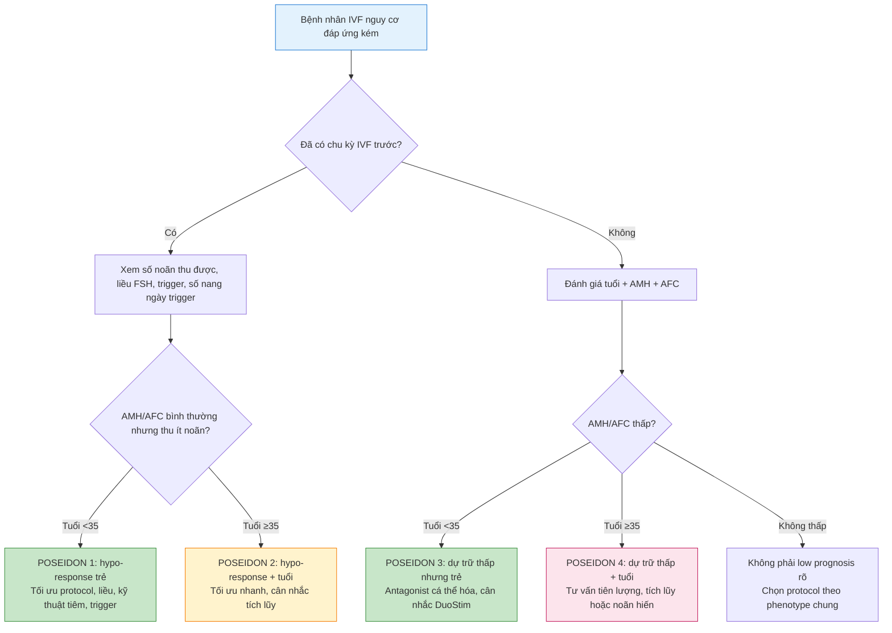

# BÀI HỌC Y KHOA: NGƯỜI ĐÁP ỨNG KÉM TRONG IVF — BOLOGNA, POSEIDON VÀ CHIẾN LƯỢC KÍCH THÍCH BUỒNG TRỨNG

**Ngày:** 2026-07-02 | **Chuyên khoa:** Hỗ trợ sinh sản (ART) | **Đối tượng:** Bác sĩ sản phụ khoa

> **Tier 0 guideline chính:** ESHRE guideline ovarian stimulation update 2025. PMID và journal ghi ở phần tài liệu tham khảo.  
> **Bài này không lặp lại bài tổng quan phác đồ kích trứng ngày 2026-06-25.** Trọng tâm là nhóm bệnh nhân đáp ứng kém/tiên lượng thấp: phân loại đúng, chọn chiến lược hợp lý, và tư vấn kỳ vọng thực tế.

---

## 0. TỔNG QUAN — VÌ SAO BÀI NÀY QUAN TRỌNG?

Người đáp ứng kém trong IVF là nhóm làm bác sĩ dễ rơi vào hai cực đoan: hoặc “tăng liều FSH tối đa” với kỳ vọng lấy thêm nhiều noãn, hoặc “tiên lượng xấu” quá sớm và bỏ qua cơ hội cá thể hóa. Cả hai đều không đủ chính xác.

Vấn đề cốt lõi không chỉ là **ít noãn**. Cần trả lời 4 câu hỏi:

1. Ít noãn vì dự trữ buồng trứng thấp thật sự, hay vì phác đồ chưa phù hợp?
2. Bệnh nhân còn trẻ hay đã lớn tuổi?
3. Số noãn cần đạt để có ít nhất một phôi có khả năng sinh sống là bao nhiêu?
4. Nên cố gắng một chu kỳ mạnh, tích lũy noãn/phôi, hay tư vấn chuyển hướng sớm?

**Mục tiêu bài học:**

- Phân biệt đáp ứng kém (poor ovarian response), đáp ứng thấp (low response), giảm dự trữ buồng trứng (diminished ovarian reserve) và tiên lượng thấp (low prognosis).
- Nắm tiêu chuẩn Bologna và hệ phân nhóm POSEIDON.
- Chọn chiến lược kích thích buồng trứng theo từng kiểu bệnh nhân.
- Hiểu cơ chế vì sao “liều FSH cao hơn” không phải lúc nào cũng hiệu quả.
- Tư vấn thực tế về số noãn, khả năng có phôi, tích lũy phôi/noãn và noãn hiến.

---

## 1. THUẬT NGỮ — ĐỪNG GỘP MỌI NGƯỜI VÀO MỘT NHÓM

| Thuật ngữ | Nghĩa thực hành | Điểm cần nhớ |
|---|---|---|
| **Đáp ứng kém (poor ovarian response)** | Thu được ít noãn sau kích thích buồng trứng | Là kết quả của một chu kỳ, không luôn đồng nghĩa giảm dự trữ |
| **Đáp ứng thấp (low response)** | Cách gọi mềm hơn, tránh gắn tiên lượng xấu quá sớm | ESHRE 2025 ưu tiên thuật ngữ này trong ovarian stimulation |
| **Giảm dự trữ buồng trứng (diminished ovarian reserve)** | AMH thấp, AFC thấp, hoặc tiền sử phẫu thuật/tuổi cao | Là đặc điểm nền trước điều trị |
| **Tiên lượng thấp (low prognosis)** | Khả năng có trẻ sinh sống thấp hơn kỳ vọng do số noãn và/hoặc tuổi | POSEIDON nhấn mạnh khái niệm này |
| **Đáp ứng dưới kỳ vọng (hypo-response)** | Dự trữ buồng trứng có vẻ bình thường nhưng số noãn thu được thấp | Hay gặp ở POSEIDON nhóm 1 và 2 |

**Điểm mấu chốt:** một phụ nữ 31 tuổi AFC 12 nhưng chu kỳ trước chỉ thu 3 noãn khác hoàn toàn một phụ nữ 41 tuổi AMH 0,3 ng/mL AFC 2. Nếu gọi cả hai là “poor responder” rồi dùng cùng một phác đồ, ta đã mất phần quan trọng nhất của cá thể hóa.

---

## 2. CƠ CHẾ SINH LÝ — VÌ SAO BUỒNG TRỨNG ĐÁP ỨNG KÉM?

### 2.1. Pool nang có thể tuyển mộ là giới hạn trần

FSH ngoại sinh không tạo ra nang mới. FSH chỉ cứu và kích thích những nang thứ cấp nhỏ đang ở giai đoạn có thể đáp ứng với FSH. Vì vậy, nếu AFC chỉ còn 2-3 nang, tăng FSH từ 300 IU lên 450 IU/ngày thường không thể biến 2 nang thành 10 nang.

```
Dự trữ buồng trứng thấp
        ↓
Pool nang có thể tuyển mộ ít
        ↓
FSH dù đủ cao vẫn chỉ tác động lên số nang hiện có
        ↓
Ít noãn → ít phôi → giảm cơ hội có phôi euploid/sinh sống
```

### 2.2. Tuổi quyết định chất lượng noãn và aneuploidy

Hai bệnh nhân cùng thu được 4 noãn có tiên lượng rất khác nhau nếu một người 30 tuổi và một người 41 tuổi. Ở tuổi cao, vấn đề không chỉ là số lượng noãn thấp mà còn là tỷ lệ bất thường nhiễm sắc thể tăng, giảm tiềm năng tạo phôi có khả năng làm tổ.

### 2.3. FSH threshold và hypo-response

Một số bệnh nhân có AMH/AFC bình thường nhưng đáp ứng thấp vì ngưỡng FSH cao hơn, liều khởi đầu chưa đủ, ức chế tuyến yên quá sâu, BMI cao, biến thể receptor FSH/LH, hoặc vấn đề tuân thủ thuốc. Đây là nhóm cần xem lại phác đồ thay vì kết luận ngay “buồng trứng cạn”.

### 2.4. LH floor và LH ceiling

LH quá thấp có thể làm giảm sản xuất androgen nền cho tế bào hạt thơm hóa thành estradiol; LH quá cao kéo dài có thể gây môi trường androgen bất lợi. Vì vậy thêm LH có thể được cân nhắc ở một số bệnh nhân lớn tuổi hoặc hypo-response, nhưng không phải điều trị thường quy cho mọi low responder. ESHRE 2025 về kích thích buồng trứng cho IVF/ICSI (ovarian stimulation for IVF/ICSI, guideline, low responder) xem nhiều can thiệp trong nhóm này là khuyến cáo có điều kiện hoặc bằng chứng thấp (PMID: 41732035) [FETCHED].

### 2.5. Ty thể và stress oxy hóa của noãn

Noãn là tế bào cần năng lượng rất cao. Lão hóa noãn liên quan giảm chức năng ty thể, tăng stress oxy hóa và rối loạn thoi phân bào. Đây là cơ sở sinh học khiến CoQ10, androgen, growth hormone được nghiên cứu. Tuy nhiên, cơ chế hợp lý không tự động biến thành khuyến cáo mạnh nếu dữ liệu sinh sống tích lũy chưa chắc chắn.

---

## 3. BOLOGNA CRITERIA — DỄ DÙNG NHƯNG QUÁ THÔ

### 3.1. Định nghĩa Bologna

Tiêu chuẩn Bologna của ESHRE được đề xuất để chuẩn hóa nghiên cứu về poor ovarian response (Ferraretti 2011, PMID: 21505041, Hum Reprod) [FETCHED]. Theo logic Bologna, bệnh nhân được xem là poor ovarian responder khi có ít nhất 2 trong 3 nhóm tiêu chí:

| Nhóm tiêu chí | Nội dung |
|---|---|
| Tuổi/risk factor | Tuổi mẹ cao hoặc yếu tố nguy cơ giảm dự trữ buồng trứng |
| Tiền sử đáp ứng kém | Chu kỳ trước thu được ít noãn với phác đồ kích thích chuẩn |
| Xét nghiệm dự trữ bất thường | AMH thấp hoặc AFC thấp |

### 3.2. Ưu điểm của Bologna

- Tạo ngôn ngữ chung cho nghiên cứu.
- Giúp tránh việc mỗi nghiên cứu định nghĩa poor responder một kiểu.
- Dễ nhớ và dễ áp dụng ở mức sàng lọc.

### 3.3. Nhược điểm của Bologna

| Nhược điểm | Hệ quả lâm sàng |
|---|---|
| Gộp nhiều phenotype khác nhau | Người trẻ AMH thấp và người lớn tuổi AMH thấp bị đặt chung nhóm |
| Không tập trung vào số noãn cần để có phôi euploid | Tư vấn tiên lượng chưa đủ cá thể hóa |
| Không tách hypo-response với dự trữ thấp thật sự | Dễ bỏ sót nhóm có thể cải thiện bằng chỉnh phác đồ |
| Phù hợp nghiên cứu hơn điều trị cá nhân | Không trả lời trực tiếp “chu kỳ tới làm gì?” |

**Kết luận thực hành:** Bologna hữu ích để nhận diện nhóm nguy cơ, nhưng không nên là công cụ duy nhất để chọn phác đồ.

---

## 4. POSEIDON — TỪ “POOR RESPONSE” SANG “LOW PROGNOSIS”

POSEIDON chuyển trọng tâm từ câu hỏi “bệnh nhân có poor responder không?” sang “bệnh nhân thuộc nhóm tiên lượng nào và cần chiến lược gì để tăng cơ hội có ít nhất một phôi có khả năng sinh sống?”. Các bài nền về POSEIDON nhấn mạnh phân tầng theo tuổi, dự trữ buồng trứng và đáp ứng kỳ trước (Alviggi 2016/2018, PMID: 29587861; PMID: 31139145) [FETCHED].

### 4.1. Bốn nhóm POSEIDON

| Nhóm | Tuổi | Dự trữ buồng trứng | Đáp ứng kỳ trước | Ý nghĩa |
|---|---|---|---|---|
| **Group 1** | <35 | AMH/AFC bình thường | Thu ít noãn bất ngờ | Hypo-response ở người trẻ, còn cơ hội tối ưu protocol |
| **Group 2** | ≥35 | AMH/AFC bình thường | Thu ít noãn bất ngờ | Vừa hypo-response vừa chịu tác động tuổi noãn |
| **Group 3** | <35 | AMH/AFC thấp | Chưa cần có chu kỳ trước | Ít noãn nhưng tuổi còn thuận lợi hơn |
| **Group 4** | ≥35 | AMH/AFC thấp | Chưa cần có chu kỳ trước | Nhóm khó nhất: ít noãn và chất lượng noãn giảm theo tuổi |

### 4.2. Vì sao POSEIDON thực dụng hơn Bologna?

| Câu hỏi | Bologna | POSEIDON |
|---|---|---|
| Có chuẩn hóa định nghĩa không? | Có | Có |
| Có tách tuổi trẻ và tuổi cao không? | Chưa đủ | Có |
| Có tách dự trữ thấp và hypo-response không? | Chưa đủ | Có |
| Có định hướng chiến lược cho chu kỳ sau không? | Hạn chế | Tốt hơn |
| Có phù hợp tư vấn số noãn mục tiêu không? | Hạn chế | Tốt hơn |

### 4.3. Cách dùng trong phòng khám

POSEIDON không thay thế lâm sàng. Nó là bản đồ. Bác sĩ vẫn phải xem: BMI, tiền sử phẫu thuật buồng trứng, endometriosis, loại thuốc đã dùng, số ngày kích thích, estradiol, progesterone, trigger, số nang ngày trigger và kỹ thuật chọc hút.

---

## 5. ĐÁNH GIÁ TRƯỚC KÍCH THÍCH

| Yếu tố | Cần hỏi/đo | Vì sao quan trọng |
|---|---|---|
| Tuổi | Tuổi thực tại thời điểm chọc hút | Quyết định nguy cơ aneuploidy |
| AMH | Dùng cùng đơn vị và cùng labo nếu theo dõi dọc | Ước lượng pool nang có thể tuyển mộ |
| AFC | Đếm nang 2-10 mm, tốt nhất đầu chu kỳ | Trực tiếp hơn AMH cho cycle hiện tại |
| Tiền sử IVF | Liều FSH, số ngày kích thích, E2, số nang, số noãn MII | Phân biệt hypo-response và dự trữ thấp |
| Phẫu thuật buồng trứng | Bóc endometrioma, đốt buồng trứng, u buồng trứng | Làm giảm mô vỏ và mạch máu buồng trứng |
| BMI | Cân nặng, BMI, kỹ thuật tiêm | BMI cao có thể cần chỉnh liều và kiểm tra kỹ thuật tiêm |
| Thuốc nền | OCP, GnRH agonist, androgen, DHEA, thuốc nội tiết | Có thể ảnh hưởng đáp ứng |
| Mong muốn bệnh nhân | Noãn tự thân, giới hạn chi phí, chấp nhận noãn hiến | Quyết định số chu kỳ và điểm dừng |

**Không nên chỉ nhìn AMH.** AMH thấp dự báo số noãn thấp, nhưng không một mình quyết định có nên làm IVF hay không.

---

## 6. CHIẾN LƯỢC STIMULATION THEO POSEIDON

### 6.1. Nguyên tắc chung

1. Mục tiêu là tối ưu **số noãn sử dụng được**, không chỉ tăng số nang trên siêu âm.
2. Liều gonadotropin phải đủ vượt FSH threshold, nhưng vượt quá trần sinh học sẽ chỉ tăng chi phí.
3. Nếu dự trữ rất thấp, cần nói sớm về khả năng hủy chu kỳ hoặc tích lũy noãn/phôi.
4. Nếu lớn tuổi, cần ưu tiên thời gian: không kéo dài nhiều tháng với adjuvant thiếu chắc chắn nếu làm mất cơ hội.

### 6.2. Bảng chiến lược theo nhóm

| Nhóm | Vấn đề chính | Chiến lược hợp lý | Tránh |
|---|---|---|---|
| **POSEIDON 1** | Trẻ, dự trữ bình thường nhưng đáp ứng thấp | Xem lại liều FSH, kỹ thuật tiêm, trigger, cân nhắc tăng liều hoặc thêm LH ở chu kỳ sau | Kết luận vội là giảm dự trữ nặng |
| **POSEIDON 2** | Dự trữ bình thường nhưng tuổi ≥35 | Tối ưu nhanh số noãn, cân nhắc liều đủ mạnh, cân nhắc tích lũy phôi nếu ít noãn | Trì hoãn nhiều tháng với bổ sung không chắc chắn |
| **POSEIDON 3** | Trẻ nhưng dự trữ thấp | Antagonist cá thể hóa, cân nhắc DuoStim/tích lũy nếu cần nhiều noãn | Tăng FSH quá cao với kỳ vọng phi thực tế |
| **POSEIDON 4** | Lớn tuổi và dự trữ thấp | Tư vấn tiên lượng sớm, cân nhắc modified natural cycle, DuoStim/tích lũy, hoặc noãn hiến | Hứa hẹn “chỉ cần đổi thuốc sẽ có nhiều trứng” |

### 6.3. Antagonist protocol

GnRH antagonist thường là lựa chọn thực dụng vì ngắn, ít ức chế sâu, linh hoạt, giảm nguy cơ OHSS và phù hợp freeze-all nếu cần. ESHRE 2025 cung cấp khuyến cáo cập nhật cho pituitary suppression và ovarian stimulation, với nhiều khuyến cáo có điều kiện do chất lượng bằng chứng chưa cao (PMID: 41732035) [FETCHED].

### 6.4. Long agonist và flare protocol

Long agonist có thể làm đồng bộ nang tốt, nhưng ở bệnh nhân dự trữ thấp có nguy cơ ức chế quá sâu. Flare/microdose flare từng được dùng với kỳ vọng tận dụng flare FSH/LH nội sinh, nhưng bằng chứng không đủ để xem là giải pháp chuẩn cho mọi poor responder. Nếu dùng, phải có lý do cụ thể và theo dõi sát.

### 6.5. Liều FSH

Liều FSH nên dựa vào tuổi, AMH, AFC, BMI và đáp ứng trước đó. Với dự trữ thấp thật sự, liều rất cao có thể không cải thiện số noãn tương xứng. Đây là điểm cần giải thích rõ với bệnh nhân để tránh hiểu nhầm “thuốc càng nhiều càng chắc có nhiều trứng”.

### 6.6. Thêm LH

Thêm recombinant LH có thể cân nhắc ở bệnh nhân lớn tuổi, đáp ứng dưới kỳ vọng, hoặc nghi ngờ LH quá thấp trong bối cảnh ức chế mạnh. Nhưng không nên biến LH add-on thành mặc định. Khi viết protocol cụ thể cho từng ca, phải dựa vào guideline/paper đã verify, không suy đoán liều và thời điểm.

### 6.7. Modified natural cycle và minimal stimulation

Với AFC cực thấp, modified natural cycle có thể là lựa chọn hợp lý vì mục tiêu thực tế là lấy 1 noãn tốt, giảm chi phí và giảm gánh nặng thuốc. ESHRE 2025 ghi nhận modified natural cycle như lựa chọn thực hành tốt cho very low reserve trong bối cảnh phù hợp (PMID: 41732035) [FETCHED].

### 6.8. DuoStim và tích lũy noãn/phôi

DuoStim dựa trên lý thuyết nhiều sóng nang trong một chu kỳ. Nó có thể hữu ích khi cần rút ngắn thời gian tích lũy noãn/phôi, đặc biệt ở bệnh nhân tiên lượng thấp hoặc cần bảo tồn sinh sản. Tuy nhiên, cần nói rõ: DuoStim không “tăng dự trữ buồng trứng”; nó tăng số lần tuyển mộ nang trong cùng khoảng thời gian.

---

## 7. ADJUVANTS — CƠ CHẾ HẤP DẪN, BẰNG CHỨNG PHẢI TỈNH TÁO

| Can thiệp | Cơ chế giả thuyết | Cách nhìn thực hành |
|---|---|---|
| **DHEA** | Tăng androgen nội buồng trứng, tăng nhạy FSH | Có nghiên cứu ủng hộ nhưng không nên hứa chắc tăng sinh sống |
| **Testosterone priming** | Tăng biểu hiện receptor FSH ở tế bào hạt | Có thể cân nhắc ở poor responder chọn lọc, cần tránh dùng như routine |
| **Growth hormone** | Tác động IGF-1, hỗ trợ steroidogenesis và folliculogenesis | Meta-analysis gần đây vẫn không đủ để xem là chuẩn thường quy (ví dụ PMID: 41136866; PMID: 39862359) [FETCHED] |
| **CoQ10** | Hỗ trợ chức năng ty thể, giảm stress oxy hóa | Hợp lý về cơ chế, nhưng endpoint quan trọng vẫn cần thận trọng |
| **Estrogen priming** | Đồng bộ nang đầu chu kỳ, tránh FSH rise sớm | Có thể hữu ích ở bệnh nhân lệch cohort nang |
| **OCP pretreatment** | Lên lịch chu kỳ, đồng bộ nang | Có thể ức chế quá mức ở dự trữ thấp nếu dùng không chọn lọc |

**Nguyên tắc:** adjuvant không được thay thế tư vấn tiên lượng. Nếu bệnh nhân POSEIDON group 4, điều quan trọng nhất là nói thật về xác suất, số chu kỳ dự kiến và điểm dừng hợp lý.

---

## 8. TƯ VẤN BỆNH NHÂN

### 8.1. Cách nói dễ hiểu

“Thuốc kích trứng không tạo thêm trứng mới. Thuốc giúp những nang đang có trong tháng này phát triển đồng loạt hơn. Nếu tháng này buồng trứng chỉ có vài nang có thể đáp ứng, mục tiêu thực tế là tối ưu từng noãn, không phải cam kết lấy được nhiều noãn.”

### 8.2. Những câu cần nói trước chu kỳ

- Có khả năng thu ít noãn hoặc không có noãn trưởng thành.
- Có thể phải hủy chu kỳ nếu không có nang đáp ứng.
- Có thể cần nhiều chu kỳ để tích lũy noãn/phôi.
- Ở tuổi cao, số noãn nhiều hơn chưa chắc đồng nghĩa có phôi bình thường nhiễm sắc thể.
- Noãn hiến không phải “thất bại điều trị”, mà là một lựa chọn sinh sản khi xác suất với noãn tự thân quá thấp.

---

## 9. CASE LÂM SÀNG

### Case 1 — POSEIDON group 1

Bệnh nhân 31 tuổi, AMH 2,1 ng/mL, AFC 12. Chu kỳ trước dùng antagonist, FSH 150 IU/ngày, thu 3 noãn.

**Phân tích:** dự trữ không thấp, tuổi thuận lợi, số noãn thấp là hypo-response. Cần xem lại liều khởi đầu, BMI, kỹ thuật tiêm, ngày bắt antagonist, số nang ngày trigger và trigger. Chu kỳ sau có thể tăng liều gonadotropin hợp lý và theo dõi sát hơn.

### Case 2 — POSEIDON group 2

Bệnh nhân 38 tuổi, AMH 1,8 ng/mL, AFC 11. Chu kỳ trước thu 4 noãn.

**Phân tích:** dự trữ nhìn có vẻ ổn nhưng tuổi làm giảm xác suất phôi euploid. Không nên trì hoãn lâu. Mục tiêu là tối ưu số noãn trong thời gian ngắn, cân nhắc tích lũy phôi/noãn nếu số noãn mỗi chu kỳ thấp.

### Case 3 — POSEIDON group 3

Bệnh nhân 32 tuổi, AMH 0,55 ng/mL, AFC 4, chưa IVF.

**Phân tích:** dự trữ thấp nhưng tuổi còn thuận lợi. Cần tư vấn số noãn kỳ vọng thấp, nhưng nếu có noãn/phôi thì chất lượng theo tuổi còn tương đối tốt hơn nhóm lớn tuổi. Có thể chọn antagonist cá thể hóa, cân nhắc tích lũy nếu cần.

### Case 4 — POSEIDON group 4

Bệnh nhân 41 tuổi, AMH 0,25 ng/mL, AFC 2, mong con bằng noãn tự thân.

**Phân tích:** đây là nhóm khó nhất. Cần tư vấn trước về xác suất thấp, khả năng hủy chu kỳ, khả năng cần nhiều chu kỳ và lựa chọn noãn hiến. Điều trị vẫn có thể thực hiện nếu bệnh nhân hiểu rõ giới hạn.

---

## 10. LƯU ĐỒ QUYẾT ĐỊNH LÂM SÀNG



---

## 11. SAI LẦM THƯỜNG GẶP

| # | Sai lầm | Hậu quả | Cách tránh |
|---|---|---|---|
| 1 | Gọi mọi bệnh nhân ít noãn là poor responder giống nhau | Mất cá thể hóa | Phân nhóm theo tuổi, AMH/AFC và đáp ứng trước |
| 2 | Chỉ nhìn AMH để quyết định điều trị | Tư vấn quá bi quan hoặc quá lạc quan | Kết hợp AFC, tuổi, tiền sử IVF và mục tiêu bệnh nhân |
| 3 | Tăng FSH rất cao cho mọi người | Tăng chi phí, chưa chắc tăng noãn | Hiểu giới hạn pool nang có thể tuyển mộ |
| 4 | Dùng adjuvant như cam kết thành công | Gây kỳ vọng sai | Nói rõ mức bằng chứng và endpoint chưa chắc chắn |
| 5 | Trì hoãn nhiều tháng ở bệnh nhân lớn tuổi để “bổ trứng” | Mất thời gian sinh học quan trọng | Ưu tiên thời gian, không kéo dài nếu lợi ích chưa chắc |
| 6 | Không kiểm tra lại trigger/kỹ thuật tiêm khi chu kỳ trước ít noãn | Bỏ sót lỗi có thể sửa | Audit toàn bộ chu kỳ trước |
| 7 | Không tư vấn noãn hiến khi tiên lượng rất thấp | Bệnh nhân mất thời gian và chi phí | Đưa noãn hiến như một lựa chọn, không ép buộc |

---

## 12. BẢNG THUỐC VÀ LIỀU DÙNG

Bài này không đưa protocol liều cố định vì liều gonadotropin phụ thuộc tuổi, AMH/AFC, BMI, đáp ứng chu kỳ trước, loại thuốc có sẵn và chính sách trung tâm. Mọi protocol cụ thể khi kê đơn phải dựa trên guideline/nhãn thuốc và quy trình đơn vị.

| Nhóm thuốc/can thiệp | Vai trò | Ghi chú thực hành |
|---|---|---|
| FSH tái tổ hợp hoặc hMG | Kích thích nang noãn | Cá thể hóa liều, không tăng vô hạn |
| GnRH antagonist | Ngăn LH surge | Thường thực dụng ở low responder |
| GnRH agonist | Downregulation hoặc trigger tùy bối cảnh | Cẩn thận ức chế quá sâu ở dự trữ thấp |
| Recombinant LH | Bổ sung hoạt tính LH | Chọn lọc, không routine |
| DHEA/testosterone/GH/CoQ10 | Adjuvant | Cần tư vấn mức bằng chứng hạn chế |

---

## 13. ÁP DỤNG TẠI VIỆT NAM

- **Tình hình thực hành:** bệnh nhân thường đến muộn, nhiều người đã từng mổ u buồng trứng/endometrioma hoặc đã làm IVF nhiều nơi.
- **Chi phí:** gonadotropin, growth hormone, PGT-A và nhiều chu kỳ tích lũy có thể tạo gánh nặng lớn. Tư vấn tài chính là một phần của điều trị.
- **Xét nghiệm:** AMH và siêu âm AFC tương đối sẵn có ở trung tâm ART lớn, nhưng khác biệt labo và người siêu âm có thể làm kết quả dao động.
- **Thuốc:** FSH tái tổ hợp, hMG, antagonist, agonist, progesterone, DHEA, CoQ10 thường có thể tiếp cận; growth hormone tùy trung tâm và chi phí.
- **Guideline Việt Nam:** nếu chưa có hướng dẫn quốc gia riêng cho POSEIDON, nên áp dụng guideline quốc tế và quy trình trung tâm, đồng thời ghi rõ mức bằng chứng.

---

## 14. TIPS THỰC HÀNH

1. Trước khi đổi phác đồ, hãy audit chu kỳ trước: liều, ngày bắt đầu, số ngày kích thích, E2, P4, số nang, trigger, số noãn MII.
2. AMH thấp dự báo ít noãn, không dự báo tuyệt đối có thai hay không.
3. AFC đầu chu kỳ đôi khi hữu ích hơn AMH cho quyết định cycle hiện tại.
4. Người trẻ AMH thấp vẫn có thể có phôi tốt nếu thu được noãn.
5. Người lớn tuổi AMH bình thường vẫn có thể tiên lượng thấp vì aneuploidy.
6. DuoStim giúp rút ngắn thời gian tích lũy, không làm tăng dự trữ buồng trứng.
7. Đừng dùng adjuvant nếu bệnh nhân hiểu nhầm đó là “thuốc hồi phục buồng trứng”.
8. Với POSEIDON group 4, tư vấn điểm dừng trước điều trị giúp tránh điều trị kéo dài không mục tiêu.
9. Noãn hiến nên được nói như một lựa chọn y khoa hợp lệ, không phải lời phán xét.
10. Mục tiêu thực tế là tối đa hóa cơ hội có trẻ sinh sống trên tổng thời gian và chi phí, không phải chỉ tối đa hóa số IU FSH.

---

## 15. TÀI LIỆU THAM KHẢO CHÍNH

1. ESHRE Guideline Group on Ovarian Stimulation. **ESHRE guideline: ovarian stimulation for IVF/ICSI: an update in 2025.** Hum Reprod. 2026. PMID: 41732035. [FETCHED]
2. Ferraretti AP et al. **ESHRE consensus on the definition of 'poor response' to ovarian stimulation for in vitro fertilization: the Bologna criteria.** Hum Reprod. 2011. PMID: 21505041. [FETCHED]
3. Alviggi C et al. **A new more detailed stratification of low responders to ovarian stimulation: from a poor ovarian response to a low prognosis concept.** Fertil Steril. 2016/2018. PMID: 29587861. [FETCHED]
4. Humaidan P et al. **The POSEIDON stratification of low prognosis patients in ART.** Front Endocrinol / related POSEIDON literature. PMID: 31139145. [FETCHED]
5. Recent growth hormone meta-analysis in poor ovarian response. PMID: 41136866. [FETCHED]
6. Recent growth hormone evidence synthesis in poor ovarian response. PMID: 39862359. [FETCHED]

---

## 16. TÓM TẮT MỘT PHÚT

Người đáp ứng kém không phải một nhóm đồng nhất. Bologna giúp chuẩn hóa định nghĩa, nhưng POSEIDON hữu ích hơn cho quyết định lâm sàng vì tách tuổi, dự trữ buồng trứng và đáp ứng kỳ trước. Chiến lược tốt không phải luôn là tăng liều FSH, mà là phân nhóm đúng, audit chu kỳ trước, chọn protocol vừa đủ, cân nhắc tích lũy noãn/phôi khi hợp lý và tư vấn kỳ vọng thật. Với nhóm lớn tuổi và dự trữ thấp, phần quan trọng nhất của điều trị là nói rõ xác suất, thời gian, chi phí và lựa chọn noãn hiến.
