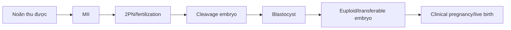
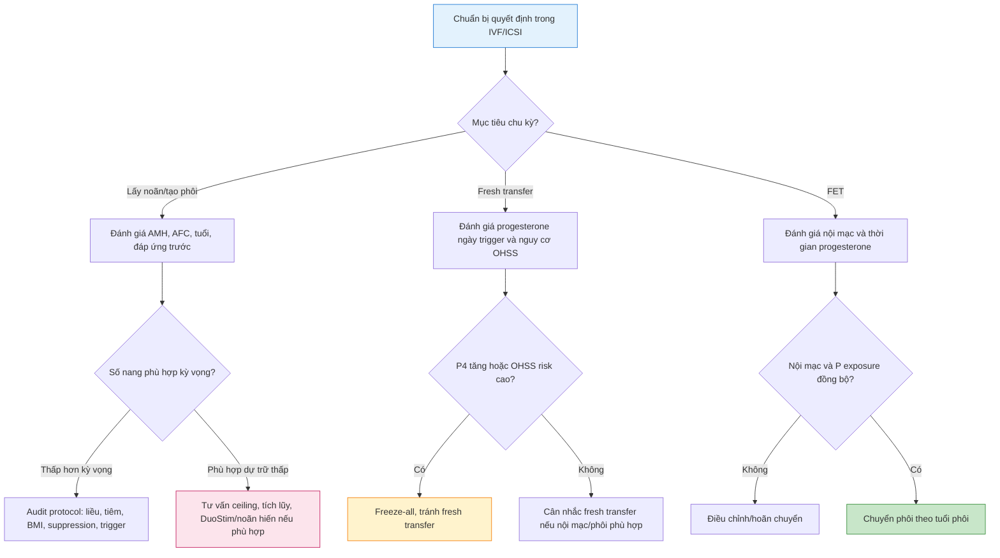

# BÀI HỌC Y KHOA: CÁC KHÁI NIỆM NỀN TRONG ART VÀ NGƯỠNG THỰC HÀNH

**Ngày:** 2026-07-03 | **Chuyên khoa:** Hỗ trợ sinh sản (ART) | **Đối tượng:** Bác sĩ sản phụ khoa

> Bài này là bản đồ tư duy lâm sàng cho IVF/ICSI: FSH threshold/ceiling, ovarian response, trigger, progesterone, nội mạc và phôi học. Mục tiêu không phải học thuộc một con số cố định, mà biết khi nào một ngưỡng có ý nghĩa và khi nào nó chỉ là tín hiệu cần đặt vào bối cảnh.

---

## 0. TỔNG QUAN - VÌ SAO BÀI NÀY QUAN TRỌNG?

Trong ART, rất nhiều quyết định bị đóng khung thành các câu hỏi có vẻ đơn giản: AMH bao nhiêu là thấp, nội mạc bao nhiêu là đủ, progesterone bao nhiêu thì hủy chuyển phôi tươi, trigger lúc nang bao nhiêu mm, FSH tăng đến đâu là còn có ích. Nếu trả lời bằng một con số cứng, bác sĩ sẽ dễ ra quyết định nhanh nhưng không chắc đúng.

Lý do là hầu hết ngưỡng trong IVF không phải ranh giới sinh học tuyệt đối. Chúng là **cutoff thực hành** được dùng để giảm rủi ro, chuẩn hóa quyết định và giao tiếp trong ê-kíp. Một cutoff chỉ có ý nghĩa khi biết nó áp dụng cho ai, dùng assay nào, protocol nào, mục tiêu là freeze-all hay fresh transfer, và endpoint là số noãn, MII, blastocyst, euploid embryo hay live birth.

**Mục tiêu bài học:**

- Hiểu `FSH threshold`, `FSH window` và `FSH ceiling` theo nghĩa sinh lý và thực hành.
- Phân biệt `ovarian reserve`, `ovarian response` và `oocyte competence`.
- Biết các ngưỡng thường dùng trong trigger, progesterone, nội mạc và phôi học.
- Tránh diễn giải cutoff như luật cứng cho mọi bệnh nhân.
- Có một checklist quyết định để dùng trong phòng khám và trước chọc hút/chuyển phôi.

---

## 1. NGUYÊN TẮC LỚN: CUTOFF LÀ CÔNG CỤ, KHÔNG PHẢI CHẨN ĐOÁN

### 1.1. Ba tầng của một ngưỡng

| Tầng | Ý nghĩa | Ví dụ |
|---|---|---|
| **Sinh lý** | Ngưỡng phản ánh cơ chế mô học/nội tiết | FSH cần vượt ngưỡng để nang vượt thoái triển |
| **Kỹ thuật** | Ngưỡng phụ thuộc assay, máy, labo, protocol | Progesterone ngày trigger có thể khác giữa immunoassay và LC-MS |
| **Quyết định** | Ngưỡng dùng để chọn hành động lâm sàng | Freeze-all khi progesterone tăng trong chu kỳ fresh transfer |

Sai lầm thường gặp là lấy ngưỡng quyết định của một trung tâm biến thành sự thật sinh học cho mọi bệnh nhân. Trong IVF, nên nói: “ngưỡng này làm tôi đổi cách quản lý”, không nên nói: “qua ngưỡng này chắc chắn thất bại”.

### 1.2. Bốn câu hỏi trước khi dùng cutoff

1. Cutoff này dự đoán endpoint nào: số noãn, phôi, thai lâm sàng hay trẻ sinh sống?
2. Cutoff này dùng trong protocol nào: antagonist, long agonist, freeze-all, FET hay fresh transfer?
3. Cutoff này phụ thuộc assay/labo không?
4. Nếu vượt cutoff, hành động thay đổi là gì?

Nếu không trả lời được câu 4, cutoff đó chưa giúp quyết định lâm sàng.

---

## 2. FSH THRESHOLD, WINDOW VÀ CEILING

### 2.1. FSH threshold

`FSH threshold` là mức FSH tối thiểu cần vượt qua để một cohort nang noãn tiếp tục phát triển thay vì thoái triển. Dưới ngưỡng này, nang không được “cứu”. Trên ngưỡng này, nang nhạy FSH có thể tiếp tục lớn lên.

Điểm thực hành: bệnh nhân khác nhau có threshold khác nhau. Người BMI cao, dự trữ thấp, lớn tuổi, tiền sử đáp ứng thấp hoặc có yếu tố receptor có thể cần liều gonadotropin cao hơn để vượt threshold.

### 2.2. FSH window

`FSH window` là khoảng thời gian FSH duy trì trên threshold. Trong chu kỳ tự nhiên, cửa sổ này hẹp nên chỉ một nang trội được chọn. Trong IVF, bác sĩ mở rộng cửa sổ FSH bằng gonadotropin ngoại sinh để nhiều nang cùng phát triển.

Nếu cửa sổ quá ngắn hoặc liều quá thấp, cohort nang phát triển không đồng đều. Nếu kích thích quá kéo dài hoặc quá mạnh, có thể tăng nguy cơ OHSS ở high responder và không nhất thiết cải thiện chất lượng noãn.

### 2.3. FSH ceiling

`FSH ceiling` là khái niệm thực hành: sau một mức kích thích nhất định, tăng thêm FSH không còn tăng số noãn tương xứng vì giới hạn thật sự là số nang có thể tuyển mộ. Nói cách khác, FSH không tạo nang mới; FSH chỉ giúp những nang đang có khả năng đáp ứng đi tiếp.

Ví dụ: AFC 3 nghĩa là cohort tuyển mộ tháng đó rất nhỏ. Tăng FSH từ mức vừa đủ lên rất cao có thể làm tăng chi phí và khó chịu, nhưng khó biến 3 nang thành 12 nang. Đây là lý do poor responder thật sự không nên được tư vấn rằng “tăng liều là chắc nhiều trứng hơn”.

### 2.4. Cách dùng trong kê đơn

| Tình huống | Ý nghĩa FSH | Hành động hợp lý |
|---|---|---|
| AMH/AFC bình thường nhưng chu kỳ trước ít noãn | Có thể chưa vượt threshold hoặc có hypo-response | Audit liều, BMI, kỹ thuật tiêm, antagonist timing, trigger |
| AFC rất thấp | Ceiling do pool nang thấp | Tư vấn kỳ vọng, tránh leo liều vô hạn, cân nhắc tích lũy/noãn hiến |
| High responder/PCOS | Threshold thấp, nhiều nang nhạy FSH | Dùng liều thấp hơn, antagonist, cân nhắc agonist trigger/freeze-all |
| Nang lệch cohort | Không chỉ là liều FSH | Cân nhắc priming/đồng bộ nang tùy ca |

---

## 3. OVARIAN RESERVE, RESPONSE VÀ COMPETENCE

### 3.1. Ba khái niệm dễ bị trộn lẫn

| Khái niệm | Đo bằng gì? | Nói lên điều gì? | Không nói lên điều gì? |
|---|---|---|---|
| **Ovarian reserve** | AMH, AFC, tuổi, tiền sử phẫu thuật | Pool nang có thể tuyển mộ | Không tự quyết định chất lượng từng noãn |
| **Ovarian response** | Số nang, E2, số noãn, MII | Buồng trứng đáp ứng với chu kỳ hiện tại | Không đồng nghĩa chắc có phôi tốt |
| **Oocyte competence** | Tuổi, MII, fertilization, blastulation, euploidy | Khả năng noãn tạo phôi sống | Khó đo trực tiếp trước chọc hút |

AMH/AFC tốt giúp dự đoán số noãn, nhưng tuổi mới là yếu tố rất mạnh cho aneuploidy. Vì vậy hai bệnh nhân cùng 8 noãn nhưng một người 30 tuổi và một người 41 tuổi không có cùng tiên lượng.

### 3.2. Ovarian response: thấp, bình thường, cao

Trong thực hành, số noãn thường được dùng để mô tả đáp ứng:

- `Low response`: thường khoảng 1-3 hoặc 1-4 noãn tùy định nghĩa nghiên cứu.
- `Suboptimal response`: khoảng 4-9 noãn trong nhiều khung phân tầng.
- `Normal response`: thường quanh 10-15 noãn.
- `High response`: thường >15 noãn, kèm tăng chú ý OHSS.

Các mốc này giúp giao tiếp và phân tầng nguy cơ, nhưng không thay thế tuổi, AMH/AFC, tiền sử đáp ứng, mục tiêu điều trị và chất lượng labo.

### 3.3. Khi nào cần audit protocol?

Cần audit nếu số noãn thấp hơn rõ so với AFC/AMH hoặc nếu chu kỳ trước có dấu hiệu bất thường. Checklist audit gồm:

- Liều FSH/LH, loại thuốc và ngày bắt đầu.
- Số ngày kích thích, tốc độ tăng nang và E2.
- Thời điểm bắt antagonist hoặc mức ức chế agonist.
- Kỹ thuật tiêm, tuân thủ thuốc, BMI.
- Số nang ngày trigger, kích thước nang, loại trigger.
- Số noãn, số MII, tỉ lệ thụ tinh, blastulation.

---

## 4. TRIGGER: ĐÚNG THỜI ĐIỂM, ĐÚNG LOẠI, ĐÚNG MỤC TIÊU

### 4.1. Trigger làm gì?

Trigger bắt chước đỉnh LH để hoàn tất trưởng thành noãn, giúp noãn chuyển sang metaphase II và chuẩn bị cho chọc hút. Trigger không sửa được chất lượng noãn nền, nhưng trigger sai thời điểm hoặc sai loại có thể làm giảm số MII, tăng noãn non hoặc tăng nguy cơ OHSS.

### 4.2. Kích thước nang ngày trigger

Trong thực hành, trigger thường được cân nhắc khi có đủ số nang trưởng thành, thường nhiều nang đạt khoảng 17-18 mm, đồng thời xem cohort nang 14-16 mm có khả năng đóng góp MII hay không. Không nên trigger chỉ vì một nang lớn; cũng không nên kéo dài quá mức chỉ để các nang nhỏ đuổi kịp nếu cohort chính đã quá chín.

### 4.3. hCG trigger, GnRH agonist trigger và dual trigger

| Loại trigger | Ưu điểm | Rủi ro/điểm yếu | Khi hay cân nhắc |
|---|---|---|---|
| **hCG trigger** | Hỗ trợ hoàng thể mạnh, quen dùng | Tăng nguy cơ OHSS ở high responder | Fresh transfer nguy cơ OHSS thấp |
| **GnRH agonist trigger** | Giảm mạnh nguy cơ OHSS trong antagonist cycle | Luteal phase yếu nếu fresh transfer không rescue đủ | High responder, PCOS, freeze-all |
| **Dual trigger** | Kết hợp LH/FSH surge nội sinh và hCG | Có thể tăng OHSS hơn agonist-only, bằng chứng tùy nhóm | Tiền sử MII thấp, empty follicle-like, chọn lọc |

### 4.4. High responder và OHSS

Với high responder, quyết định trigger phải gắn với chiến lược phòng OHSS. Antagonist protocol cho phép dùng GnRH agonist trigger, thường đi kèm freeze-all nếu nguy cơ cao. Đây là một ví dụ điển hình cho việc “ngưỡng” không chỉ để ghi nhận, mà để đổi hành động: đổi trigger, đổi luteal support, đổi kế hoạch chuyển phôi.

---

## 5. PROGESTERONE NGÀY TRIGGER VÀ QUYẾT ĐỊNH FRESH TRANSFER

### 5.1. Progesterone elevation nghĩa là gì?

Trong chu kỳ kích thích, progesterone có thể tăng trước trigger do nhiều nang hạt hoạt động mạnh. Vấn đề chính không phải progesterone làm hỏng phôi, mà là nó có thể làm nội mạc đi nhanh hơn phôi, gây lệch cửa sổ làm tổ trong fresh transfer.

### 5.2. Ngưỡng thường dùng

Nhiều trung tâm dùng các mốc quanh 1.5 ng/mL ngày trigger để cân nhắc giảm cơ hội fresh transfer, nhưng cutoff phụ thuộc assay, thời điểm lấy máu, protocol, số nang và chiến lược chuyển phôi. Với freeze-all, progesterone elevation ngày trigger ít đáng sợ hơn vì phôi sẽ gặp nội mạc ở chu kỳ khác.

### 5.3. Cách ra quyết định

| Bối cảnh | Progesterone tăng | Hướng xử trí |
|---|---|---|
| Planned freeze-all | Ít ảnh hưởng đến nội mạc chuyển phôi | Tiếp tục theo kế hoạch freeze-all |
| Fresh transfer cleavage/blastocyst | Có nguy cơ lệch nội mạc-phôi | Cân nhắc freeze-all tùy mức tăng và bệnh nhân |
| High responder | Thường đi cùng nhiều nang và OHSS risk | Freeze-all càng hợp lý nếu nguy cơ cao |
| PGT-A | Thường đã freeze-all | Progesterone ngày trigger chủ yếu là dữ liệu chu kỳ |

---

## 6. NỘI MẠC: ĐỘ DÀY, HÌNH THÁI VÀ CỬA SỔ LÀM TỔ

### 6.1. Endometrial thickness

Độ dày nội mạc là marker dễ đo, rẻ và hữu ích, nhưng không hoàn hảo. Nội mạc quá mỏng liên quan giảm khả năng có thai, nhưng không có một ngưỡng tuyệt đối dưới đó chắc chắn thất bại. Trong thực hành, mốc 7 mm thường được dùng như tín hiệu cần xem lại chuẩn bị nội mạc, còn 8 mm trở lên thường làm bác sĩ yên tâm hơn.

### 6.2. Endometrial pattern

Hình ảnh trilaminar trong pha estrogen thường được xem là thuận lợi, nhưng độ dày và hình thái phải được đọc cùng nội tiết, loại chu kỳ FET, tiền sử chuyển phôi và chất lượng phôi. Một nội mạc 7.5 mm trilaminar có thể tốt hơn một nội mạc dày nhưng không đồng bộ.

### 6.3. FET timing và progesterone exposure

Trong FET chu kỳ hormone replacement, thời gian tiếp xúc progesterone phải khớp tuổi phôi. Phôi ngày 5 thường cần khoảng 5 ngày progesterone trước chuyển, tùy quy ước trung tâm và thời điểm bắt đầu tính giờ. Sai thời gian progesterone là lỗi thực hành nghiêm trọng hơn một khác biệt nhỏ về độ dày nội mạc.

---

## 7. PHÔI HỌC: TỪ NOÃN ĐẾN BLASTOCYST

### 7.1. MII, fertilization và blastulation

Không phải mọi noãn đều là MII, không phải mọi MII đều thụ tinh, và không phải mọi hợp tử đều thành blastocyst. Vì vậy khi tư vấn, cần tránh nói “lấy được 8 trứng là có 8 phôi”. Funnel phôi học luôn hao hụt.

### 7.2. Morphology không phải genetics

Phôi đẹp hình thái có xác suất tốt hơn, nhưng không đảm bảo euploid. Phôi xấu hơn không đồng nghĩa chắc chắn bất thường. Ở tuổi mẹ cao, PGT-A có thể giúp chọn phôi euploid trong một số bối cảnh, nhưng không biến noãn chất lượng thấp thành phôi tốt.

### 7.3. Day 3 hay day 5?

Nuôi blastocyst giúp chọn lọc phôi có tiềm năng phát triển và thuận lợi cho PGT-A, nhưng ở bệnh nhân rất ít phôi, quyết định day 3 hay day 5 phải cá thể hóa theo labo, tiền sử và chiến lược trung tâm. Không nên biến “blastocyst cho mọi người” thành khẩu hiệu cứng.

---

## 8. LƯU ĐỒ QUYẾT ĐỊNH LÂM SÀNG

---

## 9. SAI LẦM THƯỜNG GẶP

| # | Sai lầm | Hậu quả | Cách tránh |
|---|---|---|---|
| 1 | Dùng một cutoff cho mọi labo | Quyết định sai do khác assay | Biết assay và quy ước trung tâm |
| 2 | Tăng FSH vô hạn ở AFC rất thấp | Tăng chi phí, kỳ vọng sai | Giải thích FSH ceiling |
| 3 | Chỉ nhìn AMH, bỏ qua tuổi | Tư vấn sai chất lượng noãn | Luôn tách số lượng và competence |
| 4 | Trigger theo một nang lớn nhất | Tăng noãn non hoặc lệch cohort | Nhìn toàn bộ cohort nang |
| 5 | Fresh transfer dù P4 tăng/high OHSS risk | Giảm đồng bộ nội mạc-phôi, tăng rủi ro | Cân nhắc freeze-all |
| 6 | Xem nội mạc 7 mm là thất bại tuyệt đối | Hủy chu kỳ không cần thiết | Dùng như tín hiệu, không là án tử |
| 7 | Nói số noãn bằng số phôi | Tư vấn quá lạc quan | Dùng funnel noãn-MII-2PN-blastocyst |
| 8 | Coi phôi đẹp là chắc euploid | Đánh giá sai nguy cơ tuổi mẹ | Phân biệt morphology và genetics |

---

## 10. TIPS THỰC HÀNH

1. Mọi cutoff phải đi kèm hành động: nếu vượt ngưỡng mà không đổi xử trí, đừng để nó chi phối quyết định.
2. `FSH ceiling` là câu giải thích tốt nhất khi bệnh nhân hỏi vì sao không tăng thuốc tối đa.
3. Khi đáp ứng thấp ngoài kỳ vọng, audit protocol trước khi kết luận dự trữ buồng trứng cạn.
4. Với high responder, trigger là quyết định phòng OHSS, không chỉ là bước cuối trước chọc hút.
5. Progesterone ngày trigger quan trọng nhất khi định fresh transfer; nếu freeze-all, ý nghĩa khác đi.
6. Nội mạc mỏng là tín hiệu giảm xác suất, không phải bằng chứng tuyệt đối rằng không thể có thai.
7. Trong FET, đồng bộ progesterone-phôi thường quan trọng hơn chênh lệch nhỏ độ dày nội mạc.
8. Phôi học là funnel hao hụt; tư vấn phải đi từ noãn đến MII, 2PN, blastocyst, euploid và live birth.
9. Đừng so sánh bệnh nhân bằng số noãn đơn thuần nếu tuổi khác nhau nhiều.
10. Ghi lại lý do vượt/không vượt cutoff trong hồ sơ để chu kỳ sau học được từ chu kỳ trước.

---

## 11. TỔNG KẾT ĐIỂM CẦN NHỚ

1. Cutoff trong ART là công cụ quyết định, không phải chân lý sinh học tuyệt đối.
2. `FSH threshold` là mức cần vượt để nang phát triển; `FSH window` là thời gian duy trì trên ngưỡng; `FSH ceiling` là điểm tăng liều thêm không còn lợi ích tương xứng.
3. Ovarian reserve dự đoán số lượng, tuổi dự đoán mạnh chất lượng noãn và aneuploidy.
4. Khi số noãn thấp hơn kỳ vọng, phải audit protocol trước khi đổi chẩn đoán.
5. Trigger phải dựa trên toàn bộ cohort nang, nguy cơ OHSS và kế hoạch fresh hay freeze-all.
6. Progesterone tăng ngày trigger chủ yếu gây vấn đề do lệch đồng bộ nội mạc-phôi trong fresh transfer.
7. Nội mạc cần được đánh giá bằng độ dày, hình thái, nội tiết và timing, không chỉ một số mm.
8. Trong FET, thời gian progesterone exposure phải khớp tuổi phôi.
9. Morphology phôi không thay thế genetics, đặc biệt khi tuổi mẹ cao.
10. Tư vấn IVF tốt là tư vấn xác suất và điểm nghẽn, không hứa hẹn bằng một con số cutoff.

---

## 12. TÀI LIỆU THAM KHẢO

1. **ESHRE Guideline Group on Ovarian Stimulation, Ata B et al. (2026)** "ESHRE guideline: ovarian stimulation for IVF/ICSI: an update in 2025." *Human Reproduction.* PMID: **41732035**. DOI: 10.1093/humrep/deag018. [GUIDELINE VERIFIED]
2. **Ovarian Stimulation TEGGO, Bosch E et al. (2020)** "ESHRE guideline: ovarian stimulation for IVF/ICSI." *Human Reproduction Open.* PMID: **32395637**. DOI: 10.1093/hropen/hoaa009. [GUIDELINE VERIFIED]
3. **Craciunas L et al. (2019)** "Conventional and modern markers of endometrial receptivity: a systematic review and meta-analysis." *Human Reproduction Update.* PMID: **30624659**. DOI: 10.1093/humupd/dmy044. [FETCHED]
4. **Kasius A et al. (2014)** "Endometrial thickness and pregnancy rates after IVF: a systematic review and meta-analysis." *Human Reproduction Update.* PMID: **24664156**. DOI: 10.1093/humupd/dmu011. [FETCHED]
5. **Gao G et al. (2020)** "Endometrial thickness and IVF cycle outcomes: a meta-analysis." *Reproductive BioMedicine Online.* PMID: **31786047**. DOI: 10.1016/j.rbmo.2019.09.005. [FETCHED]
6. **Glujovsky D et al. (2020)** "Endometrial preparation for women undergoing embryo transfer with frozen embryos or embryos derived from donor oocytes." *Cochrane Database of Systematic Reviews.* PMID: **33112418**. DOI: 10.1002/14651858.CD006359.pub3. [FETCHED]
7. **Corbett S et al. (2014)** "The prevention of ovarian hyperstimulation syndrome." *Journal of Obstetrics and Gynaecology Canada.* PMID: **25574681**. DOI: 10.1016/S1701-2163(15)30417-5. [FETCHED]
8. **Yanushpolsky EH (2015)** "Luteal phase support in in vitro fertilization." *Seminars in Reproductive Medicine.* PMID: **25734349**. DOI: 10.1055/s-0035-1545363. [FETCHED]
9. **Ben-Rafael Z et al. (1995)** "Pharmacokinetics of follicle-stimulating hormone: clinical significance." *Fertility and Sterility.* PMID: **7890049**. DOI: 10.1016/s0015-0282(16)57467-6. [FETCHED]
