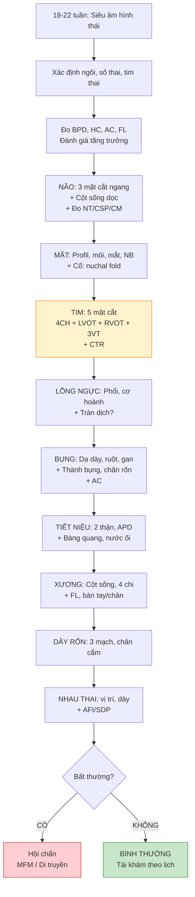

# Bài học: Siêu âm hình thái thai nhi — Khảo sát giải phẫu hệ thống từng cơ quan

**Ngày:** 2026-06-28 | **Chuyên khoa:** Siêu âm sản khoa | **Đối tượng:** Bác sĩ sản phụ khoa / học viên siêu âm

> **Tier 0 Guidelines:** ISUOG Practice Guidelines (2023) — Fetal cardiac screening ; ISUOG 2023 — Fetal biometry; ACOG PB #175 (2016, reaffirmed 2022) — Ultrasound in pregnancy; ISUOG 2022 — 11-14 week ultrasound (PMID 36594739)
> **Phạm vi:** Khảo sát giải phẫu từng hệ thống (CNS, mặt, tim, lồng ngực, bụng, tiết niệu, xương) từ quý 1 đến quý 3 + Mermaid flowchart + Bảng checklist + Sai lầm thường gặp + Chẩn đoán phân biệt + VN context.

---

## MỤC LỤC

0. TỔNG QUAN — Khi nào siêu âm hình thái, mục tiêu
1. QUÝ 1 (11-14w) — Khảo sát giải phẫu sớm
2. QUÝ 2 (18-22w) — Fetal anatomy survey TIÊU CHUẨN
3. HỆ THẦN KINH TRUNG ƯƠNG (CNS)
4. MẶT & CỔ
5. TIM THAI (Fetal Echocardiography)
6. LỒNG NGỰC (Thorax)
7. Ổ BỤNG & THÀNH BỤNG
8. HỆ TIẾT NIỆU (Urogenital)
9. HỆ XƯƠNG (Skeletal)
10. LƯU ĐỒ KHẢO SÁT GIẢI PHẪU THAI
11. BẢNG CHECKLIST SIÊU ÂM HÌNH THÁI
12. CÁC DỊ TẬT THƯỜNG GẶP & CHẨN ĐOÁN PHÂN BIỆT
13. SAI LẦM THƯỜNG GẶP
14. ÁP DỤNG TẠI VIỆT NAM
15. TIPS THỰC HÀNH
16. TỔNG KẾT
17. TÀI LIỆU THAM KHẢO

---

## 0. TỔNG QUAN — KHI NÀO SIÊU ÂM HÌNH THÁI, MỤC TIÊU

Siêu âm hình thái thai nhi (fetal anatomy scan) là **cuộc siêu âm quan trọng nhất trong thai kỳ** — mục tiêu phát hiện hoặc loại trừ dị tật bẩm sinh. Đây là cuộc khảo sát CÓ HỆ THỐNG, không phải "nhìn qua".

**Ba thời điểm siêu âm hình thái theo ISUOG:**

| Thời điểm | Tuần thai | Mục tiêu chính | Tên |
|---|---|---|---|
| **Quý 1** | 11-14 tuần | Khảo sát giải phẫu sớm, sàng lọc aneuploidy (NT, NB), phát hiện dị tật nặng | Early anatomy scan |
| **Quý 2** | **18-22 tuần** | **Fetal anatomy survey TIÊU CHUẨN** — tất cả cơ quan | Mid-trimester scan |
| **Quý 3** | 28-34 tuần | Đánh giá tăng trưởng, phát hiện dị tật muộn (não, tim, xương) | Third trimester scan |

**Tỷ lệ phát hiện dị tật (theo ACOG PB #175):**
- Siêu âm quý 2 phát hiện: **50-70%** dị tật cấu trúc lớn (wide range: 15-85% tùy cơ quan)
- **Cao nhất**: CNS (90-95%), thành bụng (80-90%), tiết niệu (80-90%), xương (70-80%)
- **Thấp nhất**: Tim (30-60%), mặt (30-50%), thực quản/hầu họng (10-20%)
- Siêu âm quý 1: phát hiện thêm **30-50%** dị tật nặng (đặc biệt CNS, tim, thành bụng) nếu làm systematic

---

## 1. QUÝ 1 (11-14w) — KHẢO SÁT GIẢI PHẪU SỚM

### 1.1. ISUOG 2022 checklist cho 11-14w

| Cấu trúc | Cần thấy gì | Bất thường nếu |
|---|---|---|
| **Đầu** | Hộp sọ ossified, falx cerebri, đám rối màng mạch (choroid plexus) lấp đầy não thất bên, đường giữa | Acrania, holoprosencephaly, encephalocele |
| **Mặt** | Profil, xương mũi (NB), ổ mắt | NB absent/hypoplastic, proboscis |
| **Cột sống** | Mặt cắt dọc: da lưng liên tục | Spina bifida (dấu hiệu gián tiếp: ITS↑, BS/BSOB ratio↓) |
| **Tim** | 4 buồng, nhịp đều | AVSD, hypoplastic left/right, arrhythmia |
| **Bụng** | Dạ dày bên trái, thành bụng nguyên vẹn, chân cắm dây rốn | Omphalocele, gastroschisis, absent stomach |
| **Tiết niệu** | Bàng quang (bladder) | Megacystis (≥7mm), absent bladder |
| **Chi** | 4 chi, 3 đoạn mỗi chi | Amelia, severe limb reduction |
| **Dây rốn** | 2 động mạch + 1 tĩnh mạch | SUA (single umbilical artery) |

### 1.2. Dị tật CÓ THỂ phát hiện ở quý 1

| Dị tật | Dấu hiệu quý 1 | Tỷ lệ phát hiện |
|---|---|---|
| **Acrania/Anencephaly** | Không có hộp sọ | >95% |
| **Holoprosencephaly** | Não thất duy nhất, không falx | >90% |
| **Spina bifida hở** | ITS >95th, BS/BSOB <5th, lemon/banana sign (có thể chưa rõ) | 50-80% |
| **AVSD** | 4 buồng tim bất thường | 30-50% |
| **Megacystis** | Bàng quang ≥7mm (≥15mm = severe) | >90% |
| **Omphalocele** | Khối ở chân rốn | >80% (phân biệt với thoát vị sinh lý <11w) |
| **Gastroschisis** | Ruột tự do trong ối | >80% |
| **Sirenomelia** | 1 chi dưới dính, SUA, renal agenesis | >90% |

**Lưu ý**: Thoát vị rốn sinh lý (physiologic gut herniation) xảy ra 8-11 tuần, ruột trở về ổ bụng trước 12 tuần. Đừng chẩn đoán omphalocele ở tuần 10!

---

## 2. QUÝ 2 (18-22w) — FETAL ANATOMY SURVEY TIÊU CHUẨN

### 2.1. Trình tự khảo sát hệ thống

**Nguyên tắc**: Khảo sát THEO TRÌNH TỰ cố định, không bỏ sót. Trình tự ISUOG khuyến cáo:

```
1. Xác định NGÔI, SỐ LƯỢNG THAI, TIM THAI
2. ĐO CRANIAL BIOMETRY: BPD, HC, OFD
3. NÃO: 3 mặt cắt ngang (transventricular, transthalamic, transcerebellar)
4. MẶT: Profil, môi trên, ổ mắt, NB
5. CỘT SỐNG: Dọc, ngang, da lưng
6. LỒNG NGỰC: 4 buồng tim, outflow tracts, phổi
7. BỤNG: Dạ dày, ruột, gan, thận, bàng quang, chân rốn
8. CHI: 4 chi, 3 đoạn, bàn tay/chân
9. DÂY RỐN: 3 mạch, chân cắm
10. NHAU THAI: Vị trí, độ dày, dây rốn cắm
11. NƯỚC ỐI: AFI hoặc SDP
```

### 2.2. Các mặt cắt não quan trọng (3 axial planes)

**Mặt cắt qua não thất bên (Transventricular):**
- Đo BPD, HC ở mặt cắt này
- Cavum septum pellucidum (CSP) phải thấy
- Não thất bên: atrium ≤10mm (ventriculomegaly nếu >10mm)
- Đám rối màng mạch (choroid plexus) lấp đầy atrium

**Mặt cắt qua đồi thị (Transthalamic):**
- Thalami đối xứng 2 bên
- Gyrus cingulate, sulcus parieto-occipital, calcarine fissure
- **Đo OFD** ở mặt cắt này

**Mặt cắt qua tiểu não (Transcerebellar):**
- Tiểu não (cerebellum): hình hạt đậu, đo TCD (transcerebellar diameter)
- Bể lớn (cisterna magna): 2-10mm
- Nếp gấp nuchal: <6mm (quý 2)
- **Hình ảnh "banana sign"** → gợi ý spina bifida (Chiari II)

---

## 3. HỆ THẦN KINH TRUNG ƯƠNG (CNS)

### 3.1. Checklist CNS quý 2

| Cấu trúc | Bình thường | Bất thường |
|---|---|---|
| **Hộp sọ** | Ossified, hình oval, liên tục | Acrania, encephalocele, lemon sign |
| **Falx cerebri** | Đường giữa rõ | Absent (holoprosencephaly), lệch (mass effect) |
| **CSP** | Thấy (17-37w) | Absent (agenesis corpus callosum, holoprosencephaly, septo-optic dysplasia) |
| **Não thất bên** | Atrium ≤10mm | Ventriculomegaly (>10mm), dangling choroid, colpocephaly |
| **Đồi thị** | Đối xứng, tách biệt | Fused (holoprosencephaly) |
| **Tiểu não** | 2 bán cầu, vermis | Dandy-Walker, Chiari II (banana sign), cerebellar hypoplasia |
| **Cisterna magna** | 2-10mm | Mega cisterna magna (>10mm), Dandy-Walker, Chiari II (obliterated) |
| **Cột sống** | Da lưng liên tục, 3 ossification centers | Spina bifida (hở hoặc kín), hemivertebra, kyphoscoliosis |

### 3.2. Các dị tật CNS chính

| Dị tật | Dấu hiệu siêu âm | Tiên lượng |
|---|---|---|
| **Anencephaly/Acrania** | Không có hộp sọ trên hốc mắt, mô não thoái hóa (area cerebrovasculosa) | **Lethal** |
| **Spina bifida hở** | Lemon sign, banana sign, ITS >95th, BS/BSOB <5th, VP shunt after birth | Thay đổi — từ nhẹ đến nặng |
| **Ventriculomegaly** | Atrium >10mm (nhẹ 10-12, vừa 12.1-15, nặng >15) | Phụ thuộc nguyên nhân + mức độ |
| **Holoprosencephaly** | Não thất duy nhất, không falx, fused thalami, proboscis | **Nặng — thường lethal** |
| **Agenesis corpus callosum** | Absent CSP, colpocephaly, "racing car" ventricles, ↑ khoảng cách não thất bên | Biến thiên — từ bình thường đến chậm phát triển |
| **Dandy-Walker complex** | ↑ cisterna magna, vermis hypoplasia/aplasia, ↑ góc não thất 4 | Biến thiên |
| **Encephalocele** | Khuyết xương sọ + thoát vị màng não/mô não | Tùy vị trí + kích thước |
| **Vein of Galen malformation** | Cấu trúc giãn dạng nang sau đồi thị, Doppler: arterialized flow | Có thể điều trị sau sinh |

---

## 4. MẶT & CỔ

### 4.1. Checklist mặt quý 2

| Cấu trúc | Mặt cắt | Bình thường | Bất thường |
|---|---|---|---|
| **Môi trên** | Coronal/axial | Liên tục | Cleft lip (hở môi) |
| **Vòm miệng** | Axial (khó, cần 3D nếu nghi ngờ) | Liên tục | Cleft palate (hở vòm) |
| **Profil** | Sagittal | Trán dốc nhẹ, NB hiện diện, cằm bình thường | Micrognathia/retrognathia, NB absent, frontal bossing |
| **Ổ mắt** | Axial | 2 mắt, khoảng cách bình thường | Hypotelorism/hypertelorism, anophthalmia, cataract |
| **Xương NB** | Sagittal | ≥2.5mm (quý 1), hiện diện quý 2 | Hypoplastic/absent (T21) |
| **NT (quý 1)** | Sagittal | <3.0mm (11-13+6w) | Tăng (aneuploidy, cardiac, Noonan) |
| **Nuchal fold (quý 2)** | Transcerebellar | <6mm | Tăng (T21) |

### 4.2. Các dị tật mặt chính

| Dị tật | Dấu hiệu | Hội chứng liên quan |
|---|---|---|
| **Cleft lip ± palate** | Gián đoạn môi trên ± vòm miệng | T13, T18, Van der Woude, đơn độc |
| **Micrognathia** | Cằm tụt ra sau | Pierre Robin sequence, T18, Treacher Collins |
| **NB hypoplastic/absent** | <2.5mm quý 1, không thấy quý 2 | **T21 (60-70%)**, T18 |
| **Cyclopia/Proboscis** | 1 mắt + vòi trên mắt | Holoprosencephaly, T13 |
| **Cystic hygroma** | Khối echo trống vách ngăn vùng cổ sau | Turner syndrome (45,X), Noonan, hydrops |
| **Goiter thai** | Tuyến giáp to vùng cổ trước | Mẹ Graves + thuốc kháng giáp qua nhau |

---

## 5. TIM THAI (FETAL ECHOCARDIOGRAPHY)

### 5.1. 5 mặt cắt tim cơ bản ISUOG 2023

| Mặt cắt | Cần thấy | Bất thường phát hiện |
|---|---|---|
| **1. Situs / Bụng trên** | Dạ dày + tim bên trái, ĐMC bên trái cột sống, IVC bên phải | Heterotaxy, situs inversus |
| **2. 4 buồng (4CH)** | 2 nhĩ, 2 thất, kích thước tương đương, crux cordis, van nhĩ-thất | AVSD, HLHS, HRHS, VSD lớn, Ebstein |
| **3. LVOT (Left ventricular outflow)** | ĐMC xuất phát từ thất trái, van ĐMC, liên tục vách liên thất-ĐMC | TOF, truncus arteriosus, aortic atresia |
| **4. RVOT (Right ventricular outflow)** | ĐMP xuất phát từ thất phải, bắt chéo ĐMC, van ĐMP | TGA, pulmonary atresia/stenosis |
| **5. 3 mạch khí quản (3VT)** | ĐMP, ĐMC, SVC xếp hàng ngang, kích thước ĐMP>ĐMC>SVC | CoA, IAA, TAPVR, right aortic arch |

### 5.2. Các thông số tim thai

| Thông số | Cách đo | Bình thường |
|---|---|---|
| **CTR (Cardiothoracic ratio)** | Tim / lồng ngực (axial, 4CH) | **<0.33** (tim chiếm <1/3 lồng ngực) |
| **Nhịp tim** | M-mode hoặc Doppler | 110-160 bpm (quý 2-3) |
| **Axis tim** | Góc giữa vách liên thất và đường giữa | **45° ± 20°** |
| **Van nhĩ-thất** | 2 van mở riêng biệt, không hở | — |

### 5.3. Các bất thường tim chính

| Dị tật | Mặt cắt phát hiện | Đặc điểm | Tỷ lệ |
|---|---|---|---|
| **AVSD** | 4CH | Mất crux cordis, 1 van AV chung, thường kèm T21 (50%) | Hay gặp nhất |
| **HLHS** | 4CH | Thất trái nhỏ hoặc không có, van 2 lá hẹp/tịt | 2-3% CHD |
| **TOF** | LVOT + 4CH | ĐMC cưỡi ngựa, VSD, hẹp ĐMP, dày thất phải | Phổ biến (5-7% CHD) |
| **TGA** | RVOT + 3VT | ĐMC trước ĐMP, 2 mạch song song (không bắt chéo) | 5% CHD |
| **VSD** | 4CH + Doppler màu | Lỗ thông vách liên thất | Rất phổ biến (20-30% CHD) |
| **CoA** | 3VT | Chênh kích thước thất, ĐMC nhỏ hơn ĐMP | 5-8% CHD |
| **Ebstein anomaly** | 4CH | Van 3 lá bám thấp, nhĩ phải lớn | Hiếm |
| **Arrhythmia** | M-mode/Doppler | Nhịp chậm (<110), nhanh (>160), block | — |

---

## 6. LỒNG NGỰC (THORAX)

### 6.1. Checklist lồng ngực

| Cấu trúc | Bình thường | Bất thường |
|---|---|---|
| **Phổi** | Echo đồng nhất, kích thước đối xứng | Pulmonary hypoplasia, CPAM, bronchopulmonary sequestration (BPS), CDH |
| **Cơ hoành** | Mặt cắt sagittal/coronal: đường echo mỏng | **CDH (Congenital Diaphragmatic Hernia)** — dạ dày/ruột trong lồng ngực |
| **Tim** | Vị trí, kích thước | Cardiomegaly (CTR >0.33), dextrocardia |
| **Tràn dịch** | Không có | Pleural effusion (hydrothorax), pericardial effusion |

### 6.2. Các bất thường lồng ngực chính

| Dị tật | Dấu hiệu siêu âm | Tiên lượng |
|---|---|---|
| **CDH (thoát vị hoành)** | Dạ dày + ruột trong lồng ngực, tim lệch phải, **o/e LHR** (lung-to-head ratio) đánh giá tiên lượng | o/e LHR >45% → survival >90% |
| **CPAM (Congenital Pulmonary Airway Malformation)** | Khối echo dày ± nang trong phổi, **có** blood supply từ ĐM phổi | Tùy type, thường phẫu thuật sau sinh |
| **BPS (Bronchopulmonary Sequestration)** | Khối echo dày hình tam giác đáy phổi trái, **có** blood supply từ **ĐMC** (nuôi từ hệ thống) | Có thể tự thoái triển |
| **Pulmonary hypoplasia** | Lồng ngực nhỏ, tim to (CTR tăng), o/e LHR thấp | Nặng → lethal |

---

## 7. Ổ BỤNG & THÀNH BỤNG

### 7.1. Checklist bụng

| Cấu trúc | Bình thường | Bất thường |
|---|---|---|
| **Dạ dày (stomach)** | Bên trái, có dịch | Absent (esophageal atresia), double bubble (duodenal atresia), giãn to (pyloric atresia) |
| **Ruột** | Echo bình thường | Echo dày (meconium peritonitis, CF, CMV, T21), giãn (atresia), ascites |
| **Gan** | Đồng nhất, TM rốn trong gan | Gan to, vôi hóa, u |
| **Túi mật** | Hình giọt nước bên phải, trước TM rốn | Không thấy (biliary atresia?), đôi |
| **Thành bụng trước** | Liên tục, chân rốn bình thường | Omphalocele, gastroschisis, limb-body wall complex, bladder/cloacal exstrophy |
| **AC (Abdominal Circumference)** | Theo tuổi thai | Nhỏ (FGR), to (macrosomia, GDM, đa ối) |

### 7.2. Bất thường thành bụng

| Dị tật | Vị trí | Màng bọc | Dây rốn | Chứa | Liên quan |
|---|---|---|---|---|---|
| **Omphalocele** | Chân rốn (midline) | **CÓ** (amnion + peritoneum) | Cắm vào túi | Ruột ± gan | T18, T13, Beckwith-Wiedemann, pentalogy of Cantrell |
| **Gastroschisis** | Cạnh rốn (thường phải) | **KHÔNG** | Cạnh khối | Ruột tự do | Đơn độc, ít liên quan aneuploidy |
| **Limb-body wall complex** | Rộng | Không | Rất ngắn hoặc không có | Ruột + tạng đặc | Lethal |
| **Bladder exstrophy** | Dưới rốn | — | — | Bàng quang lộ | Không thấy bàng quang, khối dưới rốn |
| **Cloacal exstrophy** | Dưới rốn | — | — | Ruột + bàng quang | OEIS complex |

### 7.3. Bất thường GI

| Dị tật | Dấu hiệu | Tuần phát hiện |
|---|---|---|
| **Esophageal atresia** | Absent/persistently small stomach + đa ối | Từ 20w |
| **Duodenal atresia** | **"Double bubble" sign** (dạ dày + tá tràng giãn) + đa ối | Từ 24w (thường muộn) |
| **Jejunoileal atresia** | Ruột giãn, đa ối | 24-32w |
| **Meconium peritonitis** | Vôi hóa ổ bụng, ascites, ruột giãn, pseudocyst | Biến thiên |
| **Echogenic bowel** | Ruột echo dày (≥xương) | CF, CMV, T21, chảy máu trong ối, IUGR |

---

## 8. HỆ TIẾT NIỆU (UROGENITAL)

### 8.1. Checklist tiết niệu

| Cấu trúc | Bình thường | Bất thường |
|---|---|---|
| **Thận** | 2 thận cạnh cột sống, KT bình thường, phân biệt tủy-vỏ | Renal agenesis (1 hoặc 2 bên), MCDK, ARPKD, ADPKD, ứ nước |
| **Bể thận** | APD (anteroposterior diameter) <5mm (quý 2), <7mm (quý 3) | Giãn bể thận (hydronephrosis) |
| **Bàng quang** | Thành mỏng, đầy-chu kỳ | Megacystis, PUV (keyhole sign), bladder exstrophy |
| **Nước ối (gián tiếp)** | Bình thường | Thiểu ối/anhydramnios (bất thường thận nặng) |
| **Cơ quan sinh dục** | Xác định giới tính (khi cần) | Ambiguous genitalia |

### 8.2. Phân loại giãn bể thận (UTD system — SFU thay thế)

| UTD Grade | APD (quý 2) | APD (quý 3) | Giãn đài | Nhu mô | Nguy cơ |
|---|---|---|---|---|---|
| **UTD P1 (low risk)** | <7mm | <10mm | Không | Bình thường | Thấp |
| **UTD P2 (intermediate)** | 7-10mm | 10-15mm | Có | Bình thường | Theo dõi |
| **UTD P3 (high risk)** | >10mm | >15mm | Có | Mỏng | Can thiệp |

### 8.3. Các bất thường tiết niệu chính

| Dị tật | Dấu hiệu | Tiên lượng |
|---|---|---|
| **Bilateral renal agenesis** | Anhydramnios từ <16w, không thấy thận + bàng quang | **Lethal** (Potter sequence, pulmonary hypoplasia) |
| **MCDK** | Nhiều nang không thông, không nhu mô, không phân biệt tủy-vỏ | 1 bên: tốt; 2 bên: lethal |
| **ARPKD** | Thận to tăng echo, mất phân biệt tủy-vỏ, thiểu ối | 30% tử vong sơ sinh |
| **PUV** | Bàng quang giãn dày thành + keyhole sign + thận ứ nước + thiểu ối (NAM) | Cần can thiệp sớm |
| **UPJ obstruction** | Giãn bể thận đơn độc, không giãn niệu quản | Thường tự khỏi, ít cần phẫu thuật |
| **UVJ obstruction** | Giãn bể thận + niệu quản | Có thể cần phẫu thuật |
| **Duplex kidney** | 2 hệ thống đài-bể, ± giãn 1 cực (thường cực trên, do ureterocele) | Biến thiên |

---

## 9. HỆ XƯƠNG (SKELETAL)

### 9.1. Checklist xương

| Cấu trúc | Cần thấy | Bất thường |
|---|---|---|
| **Hộp sọ** | Ossified, hình dạng bình thường | Cloverleaf skull, craniosynostosis, brachycephaly |
| **Cột sống** | 3 trung tâm cốt hóa, da lưng liên tục | Hemivertebra, scoliosis, spina bifida |
| **Lồng ngực** | Xương sườn, kích thước lồng ngực | Thanatophoric dysplasia (lồng ngực hẹp), rib fractures |
| **Chi trên** | Xương cánh tay, cẳng tay (2 xương), bàn tay | Amelia, phocomelia, radial ray, club hand |
| **Chi dưới** | Xương đùi, cẳng chân (2 xương), bàn chân | Talipes (club foot), sandal gap, rocker-bottom foot |
| **FL (Femur Length)** | Đo chuẩn (đầu gần→đầu xa) | Ngắn nặng → skeletal dysplasia |
| **Bàn tay/chân** | 5 ngón, mở ra | Polydactyly, syndactyly, clenched hand (T18) |
| **Khoáng hóa** | Xương echo dày | Hypomineralization (osteogenesis imperfecta, hypophosphatasia) |

### 9.2. Skeletal dysplasias thường gặp

| Loạn sản xương | Dấu hiệu siêu âm chính | Tiên lượng |
|---|---|---|
| **Thanatophoric dysplasia** | Lồng ngực CỰC HẸP, FL rất ngắn, đầu to (cloverleaf), dẹt đốt sống | **Lethal** |
| **Achondroplasia** | FL ngắn từ quý 3 (thường phát hiện muộn 26-28w), đầu to, trán dồ, gốc chân tay ngắn | Không lethal, trí tuệ bình thường |
| **Achondrogenesis** | FL cực ngắn, lồng ngực hẹp, giảm khoáng hóa, đầu to | **Lethal** |
| **Osteogenesis imperfecta type II** | FL ngắn, xương gãy/nhăn, xương sọ mỏng, giảm khoáng hóa | Lethal |
| **Campomelic dysplasia** | FL cong, lồng ngực hẹp, scapula hypoplastic, ambiguous genitalia | Lethal |
| **Ellis-van Creveld** | FL ngắn vừa, lồng ngực hẹp, polydactyly, **tim bất thường (AVSD)** | Có thể sống |

---

## 10. LƯU ĐỒ KHẢO SÁT GIẢI PHẪU THAI



---

## 11. BẢNG CHECKLIST SIÊU ÂM HÌNH THÁI (ISUOG-based)

| # | Hệ cơ quan | Cấu trúc cần khảo sát | ✓ |
|---|---|---|---|
| 1 | **Chung** | Ngôi, số thai, tim thai (+), cử động thai | ☐ |
| 2 | **Đo đạc** | BPD, HC, OFD, AC, FL (± HL, TCD) | ☐ |
| 3 | **CNS** | Hộp sọ, falx, CSP, não thất bên, đám rối màng mạch, đồi thị, tiểu não, cisterna magna, cột sống | ☐ |
| 4 | **Mặt** | Profil, môi trên, ổ mắt, xương mũi | ☐ |
| 5 | **Cổ** | Nuchal fold, không có khối (hygroma, goiter) | ☐ |
| 6 | **Tim** | 4 buồng, LVOT, RVOT, 3VT, axis, CTR, nhịp | ☐ |
| 7 | **Lồng ngực** | Phổi, cơ hoành, không tràn dịch | ☐ |
| 8 | **Bụng** | Dạ dày, ruột, thành bụng, chân rốn | ☐ |
| 9 | **Tiết niệu** | Thận (2), APD, bàng quang | ☐ |
| 10 | **Xương** | Cột sống, 4 chi, 3 đoạn, bàn tay/chân | ☐ |
| 11 | **Dây rốn** | 3 mạch, chân cắm bụng + nhau | ☐ |
| 12 | **Nhau thai** | Vị trí, độ dày, không tụ máu, không chorioangioma | ☐ |
| 13 | **Nước ối** | AFI hoặc SDP trong giới hạn bình thường | ☐ |
| 14 | **Phần phụ** | Cổ tử cung (CL nếu nguy cơ PTB), adnexa mẹ | ☐ |

---

## 12. CÁC DỊ TẬT THƯỜNG GẶP & CHẨN ĐOÁN PHÂN BIỆT

| Phát hiện | Nghĩ đến | Phân biệt với |
|---|---|---|
| **Não thất giãn (ventriculomegaly)** | Aqueductal stenosis, spina bifida, CMV, ACC, Dandy-Walker, Xuất huyết não | Đo não thất ĐÚNG (atrium, axial), tìm nguyên nhân |
| **Absent CSP** | Agenesis corpus callosum, holoprosencephaly, septo-optic dysplasia, hydranencephaly | Chỉ absent sau 18w (CSP hình thành 17w) |
| **Bất thường hố sau** | Dandy-Walker, mega cisterna magna, Blake's pouch cyst, Chiari II, cerebellar hypoplasia | Đo góc não thất 4, vermis, CM; xem kèm spina bifida? |
| **Absent stomach** | Esophageal atresia (TEF), không nuốt được, thiểu ối nặng | Lặp siêu âm sau 30-60 phút để xác nhận |
| **Double bubble** | Duodenal atresia (T21), annular pancreas | Đa ối + double bubble = duodenal atresia đến khi chứng minh ngược lại |
| **Echogenic bowel** | CF, CMV, T21, chảy máu trong ối, IUGR, nuốt máu | Sàng lọc CF, TORCH, NIPT; theo dõi tăng trưởng |
| **Giãn bể thận (hydronephrosis)** | UPJ obstruction, UVJ obstruction, PUV (nam), VUR, duplex kidney | Phân biệt sinh lý (APD <5mm T2, <7mm T3) vs bệnh lý |
| **Không thấy bàng quang** | Bilateral renal agenesis, PUV bàng quang căng, bladder exstrophy, đã tiểu | Lặp siêu âm sau 30-60 phút; kiểm tra thận + nước ối |
| **Omphalocele vs Gastroschisis** | Omphalocele: chân rốn, CÓ màng bọc, chứa ruột ± gan, T18/T13. Gastroschisis: cạnh rốn, KHÔNG màng, chỉ ruột, đơn độc | Dây rốn cắm vào/không vào khối? Có màng? |
| **CDH vs CPAM** | CDH: ruột/dạ dày trong ngực, tim lệch. CPAM: khối trong phổi, mạch nuôi từ ĐM phổi | Doppler màu xác định mạch nuôi |

---

## 13. SAI LẦM THƯỜNG GẶP

| # | Sai lầm | Hậu quả | Cách tránh |
|---|---|---|---|
| 1 | **Không systematic — "nhìn qua" thay vì checklist** | Bỏ sót dị tật | Luôn khảo sát theo checklist, KHÔNG bỏ bước |
| 2 | **Chẩn đoán omphalocele ở 10 tuần** | Chẩn đoán sai — thoát vị rốn sinh lý | Nhắc: gut herniation hồi phục trước 12 tuần |
| 3 | **Absent stomach: không lặp siêu âm** | Bỏ sót esophageal atresia, overdiagnosis | Lặp siêu âm sau 30-60 phút |
| 4 | **Quên khảo sát outflow tracts của tim** | Miss TGA, TOF — chỉ xem 4CH phát hiện 50% CHD, thêm outflow tracts → 70-80% | 5 mặt cắt tim BẮT BUỘC (4CH + LVOT + RVOT + 3VT) |
| 5 | **Không đo APD bể thận** | Bỏ sót hydronephrosis bệnh lý | Đo APD trong mặt cắt ngang thận |
| 6 | **Không xem bàn tay/chân** | Bỏ sót polydactyly, talipes, club hand | Bắt buộc mở bàn tay (không nắm chặt), xem bàn chân |
| 7 | **Không kiểm tra 3 mạch dây rốn** | Bỏ sót SUA (liên quan IUGR, dị tật tim/thận) | Luôn cắt ngang dây rốn, đếm 3 mạch |
| 8 | **Không siêu âm lại khi thai không ở vị trí thuận lợi** | Bỏ sót do artifact | Cho BN đi lại 15-20 phút, siêu âm lại hoặc hẹn tái khám |

---

## 14. ÁP DỤNG TẠI VIỆT NAM

- **Tiêu chuẩn siêu âm hình thái tại VN**: Theo ISUOG/ACOG — 18-22 tuần. Các BV lớn (Từ Dũ, Phụ sản TW, Hùng Vương) có máy siêu âm tốt (Voluson, Affiniti, Samsung WS80A).
- **3D/4D siêu âm**: Phổ biến tại VN, hữu ích bổ trợ (mặt, CNS, xương) nhưng KHÔNG thay thế 2D systematic.
- **Siêu âm tim thai**: Các trung tâm lớn (Từ Dũ, Vinmec, Hạnh Phúc) có BS tim thai chuyên sâu. Với nghi ngờ CHD → refer fetal echo.
- **NIPT**: Ngày càng phổ biến (giá 2-10 triệu VNĐ). Phát hiện T21/T18/T13 + sex chromosome anomalies. KHÔNG thay thế siêu âm hình thái.
- **Hạn chế tại VN**: Các cơ sở tuyến dưới thiếu máy siêu âm tốt, BS chưa được đào tạo systematic scan. Nhiều BS "siêu âm 4D" nhưng quên 2D checklist cơ bản.
- **MRI thai**: Có tại các BV lớn (Vinmec, Bạch Mai) — chỉ định khi siêu âm nghi ngờ CNS anomaly, CDH, neck mass.
- **Chọc ối**: Có sẵn tại hầu hết BV tỉnh. Karyotype/FISH/CMA tùy khả năng.

---

## 15. TIPS THỰC HÀNH — 12 TIPS

1. **Luôn bắt đầu với ngôi + số lượng thai + tim thai** — nền tảng cho mọi bước sau
2. **Khảo sát não ĐẦU TIÊN khi thai chưa xuống sâu tiểu khung** — càng muộn càng khó thấy
3. **3 mặt cắt não + cột sống liên tục đến túi cùng** — CNS là hệ thống phát hiện nhiều dị tật nhất
4. **5 mặt cắt tim tối thiểu — 4CH + outflow tracts** — tăng phát hiện CHD từ 50% lên 70-80%
5. **Doppler màu cho tim và dây rốn** — bắt buộc xác nhận 3 mạch dây rốn
6. **Absent stomach → lặp sau 30-60 phút** — đừng kết luận esophageal atresia ngay
7. **Đo APD bể thận trong mặt cắt ngang** — đừng đo chéo (overestimate)
8. **Bàn tay MỞ (không nắm chặt) — T18 đặc trưng clenched hand** 
9. **AC nhỏ <5th + Doppler bất thường = FGR** — không chỉ là "thai nhỏ"
10. **Omphalocele có màng, gastroschisis không màng** — phân biệt tiên lượng khác nhau hoàn toàn
11. **MRI thai cho CNS anomaly + CDH** — bổ sung thông tin siêu âm không thấy được
12. **Nếu thai nằm sấp/mông → cho BN đi lại 15-20 phút, siêu âm lại** — đừng cố chấp siêu âm qua xương

---

## 16. TỔNG KẾT — 10 ĐIỂM CẦN NHỚ

1. **Siêu âm hình thái quý 2 (18-22w) = cuộc siêu âm quan trọng nhất** — systematic, theo checklist
2. **Quý 1 (11-14w) phát hiện thêm 30-50% dị tật nặng** — CNS, tim, thành bụng
3. **3 mặt cắt não (transventricular, transthalamic, transcerebellar) + cột sống** — CNS survey cơ bản
4. **5 mặt cắt tim (4CH + LVOT + RVOT + 3VT)** — tăng phát hiện CHD 50%→80%
5. **Ventriculomegaly = atrium >10mm** — nhẹ (10-12), vừa (12.1-15), nặng (>15)
6. **Omphalocele (CÓ màng, chân rốn) vs Gastroschisis (KHÔNG màng, cạnh rốn)** — tiên lượng KHÁC NHAU
7. **Absent stomach + đa ối = esophageal atresia đến khi chứng minh ngược lại**
8. **UTD classification thay SFU cho hydronephrosis trước sinh** — APD quý 2 <7mm, quý 3 <10mm
9. **SUA (single umbilical artery) → tăng nguy cơ IUGR, dị tật tim/thận** — cần theo dõi sát
10. **3D/4D/MRI bổ trợ — không thay thế 2D systematic scan**

---

## 17. TÀI LIỆU THAM KHẢO

1. **ISUOG Practice Guidelines (Updated).** "Practice guidelines for performance of the routine mid-trimester fetal ultrasound scan." *Ultrasound Obstet Gynecol.* 2011. [GUIDELINE VERIFIED — Tier 0, ISUOG mid-trimester scan]

2. **ISUOG Practice Guidelines (Updated).** "Practice guidelines for fetal cardiac screening." *Ultrasound Obstet Gynecol.* 2023. PMID: **37267096**. [GUIDELINE VERIFIED — Tier 0, ISUOG fetal echo 2023]

3. **ISUOG Practice Guidelines (Updated).** "Practice guidelines: performance of 11-14-week ultrasound scan." *Ultrasound Obstet Gynecol.* 2022. PMID: **36594739**. [GUIDELINE VERIFIED — Tier 0, ISUOG first trimester]

4. **American College of Obstetricians and Gynecologists.** "Practice Bulletin No. 175: Ultrasound in Pregnancy." *Obstet Gynecol.* 2016 (reaffirmed 2022). [GUIDELINE VERIFIED — Tier 0, ACOG]

5. **ISUOG Practice Guidelines (Updated).** "Practice guidelines for fetal biometry." *Ultrasound Obstet Gynecol.* 2023. [GUIDELINE VERIFIED — Tier 0, ISUOG biometry 2023]

6. **Nguyen HT, et al.** "Prenatal Diagnosis of Congenital Heart Disease by Fetal Echocardiography." *J Am Coll Cardiol.* 2008;52(12):e1-e32. [DIRECTION ONLY — Classic review, fetal echo]

7. **Blaas HG, Eik-Nes SH.** "First-trimester detection of fetal anomalies." *Ultrasound Obstet Gynecol.* 2022. [DIRECTION ONLY — Review first trimester anatomy]

8. **Salomon LJ, et al.** "ISUOG Practice Guidelines: ultrasound assessment of fetal biometry and growth." *Ultrasound Obstet Gynecol.* 2023. [GUIDELINE VERIFIED — Tier 0, ISUOG biometry 2023]

9. **Paladini D, et al.** "Sonographic examination of the fetal central nervous system: guidelines for performing the 'basic examination' and the 'fetal neurosonogram'." *Ultrasound Obstet Gynecol.* 2007;29(1):109-116. [ABSTRACT VERIFIED — ISUOG CNS guideline]

10. **Blaas HG, Eik-Nes SH.** "First-trimester detection of fetal anomalies." *Ultrasound Obstet Gynecol.* 2022;60(1):7-20. [DIRECTION ONLY — Review first trimester anatomy — Review first trimester anatomy]

---

**— Hết bài học ngày 2026-06-28 —**

**Bác sĩ:** Ngọc 🍅 🐈‍⬛ | **AI:** MiniMax Mavis | **Bài số 23** | **Chuyên khoa:** Siêu âm sản khoa — Siêu âm hình thái thai nhi
