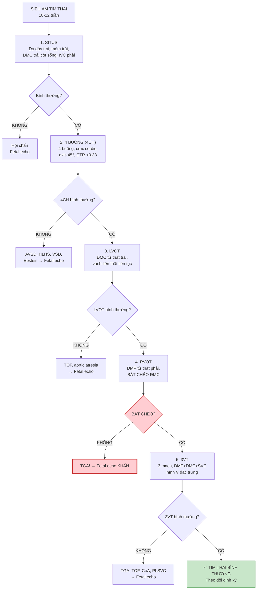

# Bài học: Các mặt cắt siêu âm tim thai — Giải phẫu & Đánh giá Hệ thống

**Ngày:** 2026-06-28 | **Chuyên khoa:** Siêu âm sản khoa / Tim thai | **Đối tượng:** Bác sĩ sản phụ khoa, BS siêu âm

> **Tier 0 Guideline:** ISUOG 2023 Fetal Cardiac Screening (PMID 37267096, Ultrasound Obstet Gynecol)
> **Phạm vi:** 5+3 mặt cắt tim thai tiêu chuẩn — giải phẫu từng mặt cắt, cấu trúc cần thấy, thông số bình thường, bất thường phát hiện, checklist đánh giá, sai lầm thường gặp.

---

## MỤC LỤC

0. TỔNG QUAN
1. MẶT CẮT BỤNG TRÊN (Situs/Abdomen) — Xác định vị trí cơ quan
2. MẶT CẮT 4 BUỒNG (4CH) — Mặt cắt nền tảng
3. MẶT CẮT LVOT (Left Ventricular Outflow Tract) — Đường ra thất trái
4. MẶT CẮT RVOT (Right Ventricular Outflow Tract) — Đường ra thất phải
5. MẶT CẮT 3 MẠCH KHÍ QUẢN (3VT/3VTV) — Mặt cắt trên trung thất
6. 3 MẶT CẮT BỔ SUNG (Bicaval, Aortic Arch, Ductal Arch)
7. BẢNG CHECKLIST ĐÁNH GIÁ TIM THAI
8. LƯU ĐỒ KHẢO SÁT TIM THAI HỆ THỐNG
9. CÁC BẤT THƯỜNG TIM PHÁT HIỆN THEO MẶT CẮT
10. SAI LẦM THƯỜNG GẶP
11. TIPS THỰC HÀNH
12. TỔNG KẾT
13. TÀI LIỆU THAM KHẢO

---

## 0. TỔNG QUAN

Siêu âm tim thai là **phần khó nhất** của siêu âm hình thái — nhưng cũng là phần **quan trọng nhất** vì dị tật tim bẩm sinh (CHD) là dị tật phổ biến nhất (8/1,000 trẻ sinh sống).

**ISUOG 2023 khuyến cáo TỐI THIỂU 5 mặt cắt tim thai:**
1. **Bụng trên (Situs)**
2. **4 buồng (4-Chamber View — 4CH)**
3. **LVOT — Đường ra thất trái**
4. **RVOT — Đường ra thất phải**  
5. **3 mạch khí quản (3-Vessel-Trachea View — 3VT)**

**Thêm 3 mặt cắt nếu nghi ngờ bất thường:**
6. **Bicaval view**
7. **Aortic arch (long axis)**
8. **Ductal arch (long axis)**

**Hiệu quả phát hiện CHD:**
- Chỉ 4 buồng: phát hiện **~50%** CHD
- 4 buồng + outflow tracts: **~70-80%**
- Thêm 3VT: **~85-90%**
- Full fetal echo (BS chuyên sâu): **>95%**

---

## 1. MẶT CẮT BỤNG TRÊN (SITUS) — Xác định vị trí

### 1.1. Cách lấy mặt cắt

- Mặt cắt **ngang (axial)** qua bụng trên của thai
- Thấy: dạ dày, ĐMC xuống, IVC, tĩnh mạch rốn (UV), xương sườn, cột sống
- Đây là mặt cắt nền tảng — xác định **situs** (vị trí cơ quan)

### 1.2. Giải phẫu bình thường — Situs solitus

```
                    TRƯỚC (anterior)
    PHẢI ┌────────────────────────────┐ TRÁI
          │                            │
          │     Dạ dày (stomach)       │ ← dạ dày bên TRÁI
          │     Gan (liver)            │
          │         UV                  │
          │  IVC ────┼──── ĐMC         │ ← IVC bên PHẢI, ĐMC bên TRÁI cột sống
          │                            │
          └────────────────────────────┘
                    SAU (posterior)
                     CỘT SỐNG
```

**Quy tắc nhớ**: ĐMC bên trái cột sống (AL = Aorta Left), IVC bên phải cột sống (IR = IVC Right), Dạ dày bên trái.

### 1.3. Checklist đánh giá

| # | Cấu trúc | Bình thường | Bất thường |
|---|---|---|---|
| 1 | **Dạ dày** | Bên trái, có dịch | Bên phải (situs inversus), absent |
| 2 | **ĐMC** | Bên trái cột sống, tròn, đập | Bên phải, giãn, không thấy |
| 3 | **IVC** | Bên phải cột sống, oval | Bên trái, giãn, absent (azygos continuation) |
| 4 | **Tĩnh mạch rốn** | Đi vào gan, rẽ nhánh T/P | Giãn, varix, absent ductus venosus |
| 5 | **Tim** | Mỏm tim bên TRÁI | Dextrocardia, mesocardia |
| 6 | **Xương sườn** | Đối xứng | Bất đối xứng (lồng ngực méo) |

### 1.4. Bất thường phát hiện

| Dấu hiệu | Bệnh lý |
|---|---|
| **Dạ dày + mỏm tim cùng bên PHẢI** | Situs inversus totalis |
| **Dạ dày bên trái + mỏm tim bên PHẢI** | Dextrocardia (situs ambiguous?) |
| **IVC absent, azygos vein cạnh ĐMC** | Heterotaxy (left isomerism/polysplenia) |
| **ĐMC + IVC cùng bên** | Heterotaxy (right isomerism/asplenia) |
| **ĐMC giãn** | Bất thường tim phức tạp |

---

## 2. MẶT CẮT 4 BUỒNG (4-CHAMBER VIEW — 4CH)

### 2.1. Cách lấy mặt cắt

- Mặt cắt **ngang (axial)** qua lồng ngực
- Cao hơn mặt cắt bụng, thấy 4 buồng tim với 1 xương sườn mỗi bên
- Đây là mặt cắt **quan trọng nhất** — nền tảng sàng lọc CHD

### 2.2. Giải phẫu bình thường

```
                    TRƯỚC (anterior)
    PHẢI ┌──────────────────────────────────────┐ TRÁI
          │                                      │
          │  ┌─────────────┐  ┌─────────────┐   │
          │  │  NHĨ PHẢI   │  │  NHĨ TRÁI   │   │
          │  │   (RA)      │  │   (LA)      │   │
          │  └──────┬──────┘  └──────┬──────┘   │
          │         │ FORAMEN OVALE │           │
          │    ┌────┴───────────────┴────┐      │
          │    │  THẤT PHẢI  THẤT TRÁI  │      │
          │    │    (RV)       (LV)     │      │
          │    │                        │      │
          │    └────────────────────────┘      │
          │         ↑ Mỏm tim bên TRÁI         │
          └──────────────────────────────────────┘
```

**Các cấu trúc then chốt trên 4CH:**

| # | Cấu trúc | Bình thường |
|---|---|---|
| 1 | **Số buồng** | 4 buồng rõ, 2 nhĩ + 2 thất |
| 2 | **Kích thước thất** | RV ≈ LV, chênh lệch ≤10% |
| 3 | **Kích thước nhĩ** | RA ≈ LA, valve foramen ovale mở vào LA |
| 4 | **Crux cordis** | Vách nhĩ-thất giao nhau tạo hình chữ thập (+) |
| 5 | **Van nhĩ-thất** | 2 van mở riêng biệt, van 3 lá bám thấp hơn 2 lá |
| 6 | **Vách liên thất** | Liên tục, không lỗ thông |
| 7 | **Moderator band** | Dải cơ trong RV (bình thường) |
| 8 | **Axis tim** | 45° ± 20° (góc giữa vách liên thất và đường giữa) |
| 9 | **CTR (Cardiothoracic Ratio)** | <0.33 (tim <1/3 lồng ngực) |
| 10 | **Nhịp tim** | 110-160 bpm, đều |
| 11 | **Tràn dịch** | Không pericardial effusion |

### 2.3. Cách đo axis tim

- Đường A: đường thẳng qua vách liên thất
- Đường B: đường thẳng giữa từ cột sống đến xương ức
- Góc giữa A và B: **45° ± 20°**

### 2.4. Bất thường phát hiện trên 4CH

| Phát hiện 4CH | Chẩn đoán |
|---|---|
| **Mất crux cordis, 1 van AV chung** | **AVSD** (Atrioventricular Septal Defect) — T21 50% |
| **Thất trái rất nhỏ/absent** | **HLHS** (Hypoplastic Left Heart Syndrome) |
| **Thất phải rất nhỏ/absent** | **HRHS** (Hypoplastic Right Heart) — pulmonary atresia |
| **VSD (lỗ thông vách liên thất)** | VSD đơn thuần hoặc kèm TOF |
| **Van 3 lá bám thấp sâu** | **Ebstein anomaly** (nhĩ hóa thất phải) |
| **Axis tim >65° hoặc <25°** | Bất thường tim phức tạp |
| **CTR >0.33** | Cardiomegaly — suy tim, thiếu máu, loạn nhịp |
| **Tràn dịch màng tim** | Hydrops, nhiễm trùng, bất thường tim |
| **Nhịp chậm <110 (block)** | AV block → mẹ anti-Ro/La (lupus) |
| **Nhịp nhanh >160** | SVT → hydrops |

---

## 3. MẶT CẮT LVOT — ĐƯỜNG RA THẤT TRÁI

### 3.1. Cách lấy mặt cắt

- Từ mặt cắt 4 buồng, **xoay nhẹ đầu dò về phía vai phải thai**
- Thấy: ĐMC xuất phát từ **thất trái**, van ĐMC, liên tục vách liên thất-thành ĐMC

### 3.2. Giải phẫu bình thường

```
  NHĨ TRÁI ────> THẤT TRÁI ────> VAN ĐMC ────> ĐMC LÊN
                                       ↑
                              VÁCH LIÊN THẤT LIÊN TỤC
                              VỚI THÀNH TRƯỚC ĐMC
```

**Cấu trúc cần thấy:**
| # | Cấu trúc | Bình thường |
|---|---|---|
| 1 | **ĐMC xuất phát từ thất trái** | Van ĐMC, thành trước ĐMC liên tục vách liên thất |
| 2 | **Van ĐMC** | Mở ra thì tâm thu, mỏng, 3 lá |
| 3 | **ĐMC lên** | Kích thước đồng nhất, không hẹp/giãn |
| 4 | **Vách liên thất** | Liên tục với thành trước ĐMC |
| 5 | **Dòng chảy** | Doppler màu: dòng chảy xuôi, không hở van |

### 3.3. Bất thường phát hiện trên LVOT

| Phát hiện LVOT | Chẩn đoán |
|---|---|
| **ĐMC cưỡi ngựa (overriding) + VSD** | **TOF** (Tetralogy of Fallot) |
| **Van ĐMC hẹp/tịt, thất trái nhỏ** | Aortic atresia (HLHS variant) |
| **Van ĐMC dày, hẹp, dòng chảy rối** | Aortic stenosis |
| **ĐMC nhỏ hơn ĐMP** | CoA, HLHS |
| **Doppler: hở van ĐMC** | Aortic regurgitation |
| **Van ĐMC 2 lá (bicuspid)** trên echo | Dễ bỏ sót, cần Doppler |

---

## 4. MẶT CẮT RVOT — ĐƯỜNG RA THẤT PHẢI

### 4.1. Cách lấy mặt cắt

- Từ mặt cắt LVOT, **xoay nhẹ đầu dò về phía vai TRÁI thai** (hoặc từ 4CH xoay về vai trái)
- Thấy: ĐMP xuất phát từ thất phải, van ĐMP, ĐMP chia thành nhánh P/T

### 4.2. Giải phẫu bình thường

```
  NHĨ PHẢI ────> THẤT PHẢI ────> VAN ĐMP ────> THÂN ĐMP
                                                    │
                                     ┌──────────────┼──────────────┐
                                     ↓                             ↓
                              ĐMP PHẢI                       ĐMP TRÁI
                                                        (đến ống động mạch
                                                        rồi ĐMC xuống)
```

**Hai điểm quan trọng nhất trên RVOT:**
1. **BẮT CHÉO (crossover)**: ĐMC và ĐMP bắt chéo nhau. ĐMC ra từ thất trái → vòng về sau. ĐMP ra từ thất phải → vòng về trước rồi chẻ nhánh.
2. **Kích thước**: ĐMP > ĐMC (ĐMP to hơn ĐMC 10-30%)

### 4.3. Bất thường phát hiện trên RVOT

| Phát hiện RVOT | Chẩn đoán |
|---|---|
| **ĐMC + ĐMP SONG SONG (không bắt chéo)** | **TGA** (Transposition of Great Arteries) |
| **Van ĐMP hẹp/tịt** | Pulmonary atresia |
| **ĐMP giãn, dòng chảy rối mạnh** | Pulmonary stenosis |
| **Doppler: dòng chảy NGƯỢC trong ĐMP (thì tâm trương)** | Pulmonary regurgitation (absent ductus arteriosus?) |
| **Chỉ 1 đại động mạch duy nhất** | Truncus arteriosus |
| **ĐMP + ĐMC từ thất phải** | Double outlet right ventricle (DORV) |

---

## 5. MẶT CẮT 3 MẠCH KHÍ QUẢN (3VT/3VTV) — Mặt cắt quyết định

### 5.1. Cách lấy mặt cắt

- Từ mặt cắt LVOT/RVOT, **xoay đầu dò cao lên trên trung thất**
- Mặt cắt **ngang** qua thượng trung thất
- Thấy: ĐMP, ĐMC, SVC xếp thành hàng ngang trước khí quản

### 5.2. Giải phẫu bình thường

```
                    TRƯỚC (anterior)
          ┌────────────────────────────────────┐
  PHẢI    │                                    │    TRÁI
          │   TUYẾN ỨC (thymus)                │
          │   ┌──────────────────────────┐     │
          │   │  SVC  │  ĐMC  │  ĐMP    │     │
          │   │ (nhỏ) │ (vừa) │ (TO)    │     │
          │   └──────────────────────────┘     │
          │         KHÍ QUẢN (trachea)          │
          │         THỰC QUẢN                  │
          └────────────────────────────────────┘
                    SAU (posterior)
                     CỘT SỐNG
```

### 5.3. Quy tắc đánh giá 3VT — "5S"

| Tiêu chí | Bình thường | Bất thường |
|---|---|---|
| **Số lượng (Số)** | 3 mạch (SVC, ĐMC, ĐMP) | 4 mạch (PLSVC), 2 mạch (TAPVR) |
| **Sắp xếp (Sắp)** | Hàng ngang: SVC-ĐMC-ĐMP (P→T) | ĐMC trước ĐMP (TGA), lộn xộn |
| **Kích thước (Size)** | ĐMP > ĐMC > SVC (giảm dần T→P) | ĐMC > ĐMP (TOF, CoA), ĐMP >> (absent PV) |
| **Hình dạng (Shape)** | Tròn (SVC, ĐMC), oval ngang (ĐMP) | Đồng dạng (TGA?) |
| **Vị trí (Site)** | Trước khí quản | Lệch, sau khí quản (vascular ring) |

### 5.4. Cấu trúc chi tiết 3VT

| Cấu trúc | Đặc điểm bình thường |
|---|---|
| **ĐMP (Pulmonary Artery)** | **To nhất**, bên TRÁI nhất, nối với ống động mạch (ductus arteriosus) → ĐMC xuống |
| **ĐMC (Aorta)** | **Vừa**, ở giữa, nối với eo ĐMC → ĐMC xuống |
| **SVC (Superior Vena Cava)** | **Nhỏ nhất**, bên PHẢI nhất, oval |
| **Tuyến ức (Thymus)** | Bao phủ trước 3 mạch, echo đồng nhất |
| **Khí quản (Trachea)** | Echo trống sau ĐMC, bên phải đường giữa nhẹ |
| **V đặc trưng** | ĐMP và ĐMC nối vào ĐMC xuống tạo hình chữ V: ĐMP-ống ĐM tạo nhánh TRÁI của V, eo ĐMC tạo nhánh PHẢI của V |

### 5.5. Bất thường phát hiện trên 3VT

| Phát hiện 3VT | Chẩn đoán |
|---|---|
| **4 mạch (thêm mạch bên trái)** | **PLSVC** (Persistent Left SVC) — thường lành tính, kèm CHD 5% |
| **Chỉ 2 mạch** | TAPVR (tĩnh mạch phổi đổ về sau tim, không vào nhĩ trái) |
| **ĐMC trước ĐMP (song song, không V)** | **TGA** |
| **ĐMC to > ĐMP** | **TOF** (ĐMC cưỡi ngựa + hẹp ĐMP → ĐMP nhỏ → ĐMC ưu thế) |
| **ĐMC nhỏ < ĐMP (chênh lớn)** | **CoA** (hẹp eo ĐMC), IAA (Interrupted Aortic Arch) |
| **ĐMP to quá mức, absent ductus** | Pulmonary atresia với MAPCAs |
| **Mạch máu vòng quanh khí quản** | **Vascular ring** (double aortic arch, right aortic arch + aberrant left subclavian) |
| **Thymus nhỏ/absent** | DiGeorge syndrome (22q11 deletion) — kèm CHD |

---

## 6. 3 MẶT CẮT BỔ SUNG (NÂNG CAO)

### 6.1. Bicaval View — Tĩnh mạch chủ đổ vào nhĩ phải

- Mặt cắt **dọc (sagittal)** lệch phải
- Thấy: IVC và SVC đổ vào nhĩ phải
- **Bình thường**: IVC nhận máu từ dưới, SVC nhận máu từ trên, đổ trực tiếp vào RA
- **Bất thường**: IVC gián đoạn (azygos continuation trong left isomerism)

### 6.2. Aortic Arch — Cung ĐMC

- Mặt cắt **dọc (sagittal)** qua cung ĐMC
- Thấy: ĐMC lên → cung ĐMC → eo ĐMC → ĐMC xuống. Hình "cái gậy hockey"
- **3 nhánh từ cung**: Brachiocephalic, Left Common Carotid, Left Subclavian
- **Bất thường**: CoA (eo hẹp, shelf sau eo), IAA (gián đoạn), right aortic arch

### 6.3. Ductal Arch — Cung ống động mạch

- Mặt cắt **dọc (sagittal)** qua ống động mạch
- Thấy: ĐMP → ống động mạch → ĐMC xuống. Hình "cái gậy hockey rộng hơn"
- **Bình thường**: Ống ĐM rộng, dòng chảy xuôi phải (P→T, phổi → ĐMC xuống)
- **Bất thường**: Ống ĐM hẹp, absent, reversed flow → gợi ý CHD nặng

---

## 7. BẢNG CHECKLIST ĐÁNH GIÁ TIM THAI

| # | Mặt cắt | Cấu trúc | ✓ |
|---|---|---|---|
| 1 | **Situs** | Dạ dày bên trái, mỏm tim bên trái | ☐ |
| 2 | **Situs** | ĐMC bên trái cột sống, IVC bên phải | ☐ |
| 3 | **4CH** | 4 buồng rõ, crux cordis (+) | ☐ |
| 4 | **4CH** | Kích thước RV≈LV (chênh ≤10%) | ☐ |
| 5 | **4CH** | 2 van AV mở riêng biệt, van 3 lá bám thấp hơn | ☐ |
| 6 | **4CH** | Vách liên thất liên tục | ☐ |
| 7 | **4CH** | Axis tim 45° ± 20° | ☐ |
| 8 | **4CH** | CTR <0.33 | ☐ |
| 9 | **4CH** | Nhịp 110-160 bpm, đều | ☐ |
| 10 | **4CH** | Foramen ovale mở vào LA | ☐ |
| 11 | **4CH** | Không tràn dịch màng tim | ☐ |
| 12 | **LVOT** | ĐMC từ thất trái, van ĐMC mỏng | ☐ |
| 13 | **LVOT** | Vách liên thất liên tục thành trước ĐMC | ☐ |
| 14 | **LVOT** | Dòng chảy xuôi, không hở | ☐ |
| 15 | **RVOT** | ĐMP từ thất phải | ☐ |
| 16 | **RVOT** | ĐMC+ĐMP BẮT CHÉO (crossover) | ☐ |
| 17 | **RVOT** | ĐMP > ĐMC về kích thước | ☐ |
| 18 | **3VT** | 3 mạch: SVC-ĐMC-ĐMP (P→T) | ☐ |
| 19 | **3VT** | Kích thước: ĐMP > ĐMC > SVC | ☐ |
| 20 | **3VT** | Hình V đặc trưng (ĐMP+ĐMC → ĐMC xuống) | ☐ |
| 21 | **3VT** | Tuyến ức hiện diện | ☐ |
| 22 | **Doppler** | Dòng chảy xuôi qua van AV, van bán nguyệt | ☐ |
| 23 | **Doppler** | Không hở van, không dòng bất thường | ☐ |

---

## 8. LƯU ĐỒ KHẢO SÁT TIM THAI



---

## 9. BẤT THƯỜNG TIM PHÁT HIỆN THEO MẶT CẮT

| CHD | Phát hiện ở mặt cắt nào? | Dấu hiệu đặc trưng |
|---|---|---|
| **AVSD** | 4CH | Mất crux cordis, 1 van AV chung |
| **HLHS** | 4CH + LVOT | Thất trái nhỏ, van 2 lá hẹp/tịt, ĐMC nhỏ |
| **VSD** | 4CH + Doppler | Lỗ thông vách liên thất |
| **Ebstein** | 4CH | Van 3 lá bám thấp, nhĩ phải lớn |
| **TOF** | LVOT + 3VT | ĐMC cưỡi ngựa + VSD + ĐMP nhỏ (3VT: ĐMC > ĐMP) |
| **TGA** | RVOT + 3VT | ĐMC+ĐMP song song (không bắt chéo), 3VT: ĐMC trước ĐMP |
| **Truncus arteriosus** | RVOT | 1 đại động mạch duy nhất từ 2 thất |
| **DORV** | RVOT | Cả ĐMC và ĐMP từ thất phải |
| **CoA** | 3VT + Aortic arch | 3VT: ĐMC nhỏ < ĐMP, chênh kích thước thất |
| **IAA** | 3VT | ĐMC nhỏ, eo ĐMC gián đoạn |
| **Vascular ring** | 3VT | Mạch máu vòng quanh khí quản |
| **PLSVC** | 3VT | 4 mạch (SVC thêm bên trái), thường lành tính |
| **TAPVR** | 3VT | Chỉ thấy 2 mạch, confluent sau tim |
| **Cardiomyopathy** | 4CH | CTR >0.33, giảm co bóp, tràn dịch |
| **AV block** | 4CH + M-mode | Nhịp chậm <110, block AV hoàn toàn |

---

## 10. SAI LẦM THƯỜNG GẶP

| # | Sai lầm | Hậu quả | Cách tránh |
|---|---|---|---|
| 1 | **CHỈ xem 4 buồng, bỏ qua outflow tracts + 3VT** | Miss 50% CHD (TGA, TOF, CoA...) | LUÔN khảo sát 5 mặt cắt tối thiểu |
| 2 | **Không phân biệt crossover vs parallel** | Miss TGA — CHD critical cần phẫu thuật sớm | Tìm BẮT CHÉO ĐMC+ĐMP. Nếu song song → TGA đến khi chứng minh ngược lại |
| 3 | **Nhầm SVC với bất thường / PLSVC** | Overdiagnosis | SVC bình thường bên phải, PLSVC là mạch THỨ 4 bên trái |
| 4 | **Không đo axis tim** | Bỏ sót CHD phức tạp (axis bất thường → gợi ý conotruncal anomaly) | Đo axis trên 4CH, bình thường 45°±20° |
| 5 | **Không dùng Doppler màu cho tim** | Miss VSD nhỏ, hở van, dòng chảy bất thường | Doppler màu BẮT BUỘC cho 4CH + outflow tracts |
| 6 | **Không đếm 3 mạch trên 3VT** | Miss PLSVC, TAPVR | Đếm: 1-2-3 mạch. Nếu 4 → PLSVC, nếu 2 → TAPVR |
| 7 | **Tim to (CTR>0.33) bỏ qua không tìm nguyên nhân** | Miss cardiomyopathy, thiếu máu thai | Nếu CTR tăng → đánh giá co bóp, Doppler MCA-PSV, tìm nguyên nhân |

---

## 11. TIPS THỰC HÀNH — 10 TIPS

1. **Trình tự cố định: Situs → 4CH → LVOT → RVOT → 3VT** — không skip bước nào
2. **ĐMC bên TRÁI cột sống = AL**, **IVC bên PHẢI cột sống = IR** — quy tắc nhớ đơn giản
3. **4CH: thấy crux cordis (+)** → loại trừ AVSD ngay
4. **4CH: axis 45° ± 20°** — nếu lệch nhiều → nghi ngờ conotruncal anomaly
5. **LVOT → RVOT: tìm BẮT CHÉO** — quan trọng nhất để loại trừ TGA
6. **3VT: đếm 3 mạch, kiểm tra kích thước ĐMP > ĐMC** — TOF/CoA nếu ĐMC > ĐMP
7. **Doppler màu cho mọi mặt cắt** — phát hiện VSD nhỏ, hở van, shunt
8. **Nếu thai nằm sấp → cho mẹ đi lại 15 phút, siêu âm lại** — đừng cố qua xương
9. **Dùng cine-loop quay chậm** — theo dõi van đóng mở, nhịp tim
10. **Nếu nghi ngờ CHD → refer NGAY fetal echo** — không trì hoãn, CHD critical cần sinh ở trung tâm có phẫu thuật tim

---

## 12. TỔNG KẾT — 10 ĐIỂM CẦN NHỚ

1. **5 mặt cắt tim thai TỐI THIỂU**: Situs, 4CH, LVOT, RVOT, 3VT
2. **4CH đơn thuần phát hiện ~50% CHD** — thêm outflow tracts + 3VT lên 85-90%
3. **TGA = KHÔNG bắt chéo (song song)** — luôn check crossover giữa LVOT và RVOT
4. **3VT: ĐMP > ĐMC > SVC (giảm dần trái→phải)** — bất kỳ đảo ngược nào đều bất thường
5. **AVSD = mất crux cordis trên 4CH** — T21 trong 50% trường hợp
6. **TOF = ĐMC cưỡi ngựa + VSD trên LVOT + ĐMP nhỏ trên 3VT**
7. **Axis tim 45° ± 20° trên 4CH** — lệch trục → nghi ngờ conotruncal anomaly
8. **CTR <0.33** — tim chiếm dưới 1/3 lồng ngực trên 4CH
9. **3VT: đếm 1-2-3 mạch** — 4 mạch = PLSVC, 2 mạch = TAPVR
10. **Doppler màu BẮT BUỘC** — phát hiện VSD, hở van, dòng chảy bất thường

---

## 13. TÀI LIỆU THAM KHẢO

1. **ISUOG Practice Guidelines (Updated).** "Practice guidelines for fetal cardiac screening." *Ultrasound Obstet Gynecol.* 2023;61(6):788-803. PMID: **37267096**. [GUIDELINE VERIFIED — Tier 0, ISUOG fetal echo 2023]

2. **Carvalho JS, Allan LD, Chaoui R, et al.** "ISUOG Practice Guidelines (updated): sonographic screening examination of the fetal heart." *Ultrasound Obstet Gynecol.* 2013;41(3):348-359. PMID: **23460196**. [ABSTRACT VERIFIED — Tier 1, classic ISUOG fetal heart]

3. **American College of Obstetricians and Gynecologists.** "Practice Bulletin No. 175: Ultrasound in Pregnancy." *Obstet Gynecol.* 2016 (reaffirmed 2022). [GUIDELINE VERIFIED — Tier 0, ACOG]

4. **Yagel S, Cohen SM, Achiron R.** "Examination of the fetal heart by five short-axis views: a proposed screening method for comprehensive cardiac evaluation." *Ultrasound Obstet Gynecol.* 2001;17(5):367-369. PMID: **11380958**. [DIRECTION ONLY — 5 axial views method]

5. **ISUOG Practice Guidelines (Updated).** "Practice guidelines: performance of 11-14-week ultrasound scan." *Ultrasound Obstet Gynecol.* 2022. PMID: **36594739**. [GUIDELINE VERIFIED — Tier 0, ISUOG first trimester]

---

**— Hết bài học ngày 2026-06-28 —**

**Bác sĩ:** Ngọc 🍅 🐈‍⬛ | **AI:** MiniMax Mavis | **Bài số 24** | **Chuyên khoa:** Siêu âm sản khoa — Các mặt cắt siêu âm tim thai
