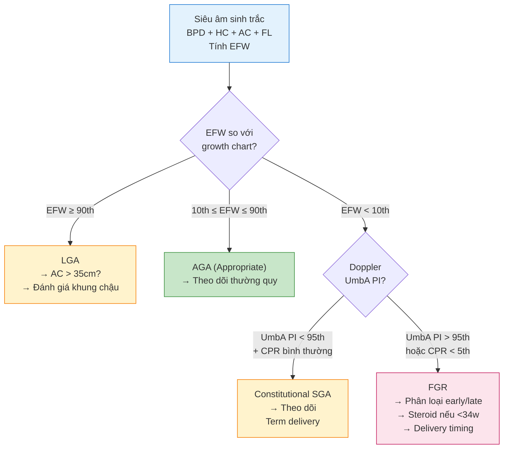

# Siêu âm Sinh trắc thai — Kỹ thuật đo, Công thức EFW & Biểu đồ tăng trưởng
**Ngày:** 2026-07-02 | **Chuyên khoa:** Siêu âm sản khoa | **Đối tượng:** Bác sĩ sản phụ khoa, BS siêu âm, học viên siêu âm

> **Tier 0 Guidelines:**
> - ISUOG 2019 — Practice Guidelines: ultrasound assessment of fetal biometry and growth (PMID 31169958).
> - ISUOG 2020 — Practice Guidelines: diagnosis and management of SGA fetus and FGR (PMID 32738107).
> - ACOG PB #175 (2016, reaffirmed 2022) — Ultrasound in Pregnancy.

---

## 0. TỔNG QUAN — VÌ SAO SINH TRẮC LÀ KỸ NĂNG NỀN TẢNG?

### 0.1. Tầm quan trọng

Sinh trắc thai (fetal biometry) là **phép đo cốt lõi** của mọi cuộc siêu âm sản khoa. Mọi quyết định lâm sàng — theo dõi thường quy, can thiệp, hay chấm dứt thai kỳ — đều dựa trên kết quả sinh trắc.

**"Bạn không thể quản lý cái bạn không đo được"** — câu nói này đặc biệt đúng trong sản khoa:
- Phát hiện sớm thai chậm tăng trưởng (Fetal Growth Restriction — FGR) giúp can thiệp kịp thời
- Phát hiện thai to (Large for Gestational Age — LGA) giúp dự phòng shoulder dystocia (kẹt vai)
- Đánh giá tốc độ tăng trưởng (growth velocity) giúp phân biệt FGR bệnh lý vs SGA constitution

**Mục tiêu bài:**
- Nắm vững kỹ thuật đo đúng 4 thông số cơ bản: BPD, HC, AC, FL
- Hiểu các công thức ước tính cân nặng (Estimated Fetal Weight — EFW)
- Phân biệt các biểu đồ tăng trưởng (growth charts) phổ biến
- Ứng dụng lâm sàng: SGA vs FGR vs LGA
- Nhận diện và tránh sai lầm kỹ thuật phổ biến

### 0.2. Tỷ lệ phát hiện bất thường tăng trưởng

| Nhóm | Tỷ lệ thai kỳ | Hậu quả nếu không phát hiện |
|---|---|---|
| **FGR (fetal growth restriction)** | 5-10% | Thai lưu, tử vong sơ sinh, biến chứng thần kinh |
| **SGA constitution** (nhỏ do di truyền) | 5-8% | Theo dõi không cần thiết nếu chẩn đoán nhầm thành FGR |
| **LGA (large for gestational age)** | 10-15% | Shoulder dystocia, mổ ngoài ý muốn, chấn thương sản khoa |
| **Macrosomia** (EFW ≥4000g) | 5-10% | Vai trò dự đoán hạn chế, nhưng cảnh báo lâm sàng |

---

## 1. CƠ CHẾ TĂNG TRƯỞNG THAI

### 1.1. Ba giai đoạn tăng trưởng

Tăng trưởng thai nhi diễn ra theo 3 giai đoạn liên tiếp, mỗi giai đoạn có đặc điểm tế bào khác nhau:

| Giai đoạn | Thời gian | Đặc điểm | Thông số siêu âm nhạy nhất |
|---|---|---|---|
| **Giai đoạn 1: Tăng sinh (hyperplasia)** | 0-16 tuần | Tăng số lượng tế bào. Tốc độ chậm | CRL (crown-rump length) |
| **Giai đoạn 2: Tăng sinh + Phì đại** | 16-32 tuần | Tăng số lượng + tăng kích thước tế bào | BPD, HC tăng nhanh |
| **Giai đoạn 3: Phì đại (hypertrophy)** | 32-40 tuần | Chủ yếu tăng kích thước tế bào, tích lũy glycogen và mỡ | **AC tăng nhanh nhất**, EFW tăng nhanh |

### 1.2. Yếu tố điều hòa tăng trưởng

- **Insulin và IGF-1 (Insulin-like Growth Factor 1)**: hormone tăng trưởng chính ở giai đoạn 3. Thai GDM có hyperinsulinemia → tăng AC và EFW (macrosomia)
- **Placental perfusion**: giảm tưới máu nhau → FGR (đặc biệt early-onset <32w)
- **Dinh dưỡng mẹ**: thiếu protein/calorie → FGR; thừa cân/obesity → LGA
- **Di truyền**: SGA constitution (cha mẹ nhỏ → thai nhỏ nhưng Doppler bình thường)

### 1.3. Cơ chế khác biệt HC vs AC trong FGR

**"Head sparing" (brain sparing)**: Khi FGR do giảm tưới máu nhau, thai ưu tiên tưới máu não (qua ductus venosus) → HC được bảo toàn tương đối, trong khi AC (phản ánh gan + mỡ dưới da) giảm ĐẦU TIÊN.

→ **AC là thông số nhạy nhất cho FGR sớm**, HC chỉ giảm khi FGR nặng/muộn.

---

## 2. KỸ THUẬT ĐO 4 THÔNG SỐ CƠ BẢN

### 2.1. BPD (Biparietal Diameter) & OFD (Occipitofrontal Diameter) → HC

**Mặt cắt chuẩn: Transthalamic (ngang đồi thị)**

- **Mốc giải phẫu**: Thalamus (đồi thị) hai bên, Cavum septum pellucidum (CSP), Falx cerebri
- **Caliper**: outer-to-inner (mép ngoài hộp sọ bên gần → mép trong hộp sọ bên xa)
- **Đo OFD**: cùng mặt cắt, từ mép ngoài trán → mép ngoài chẩm

**Tính HC từ BPD và OFD:**
```
HC = (BPD + OFD) × π/2
```

**Sai lầm phổ biến:**
| # | Sai lầm | Hậu quả | Cách tránh |
|---|---|---|---|
| 1 | Đo inner-to-inner | BPD nhỏ hơn thật → EFW underestimate | Luôn dùng outer-to-inner |
| 2 | Mặt cắt nghiêng (không đối xứng) | BPD/HC sai lệch >5% | Kiểm tra: Falx thẳng đứng, Thalamus đối xứng |
| 3 | Đo ở tư thế mặt (sagittal) | Đo sai hoàn toàn | Phải là axial (ngang) |
| 4 | Đầu thai bị chèn (dolichocephaly) | BPD giảm, OFD tăng → HC vẫn đúng nếu tính đúng | Dùng HC thay BPD khi đầu méo |

**Lưu ý quan trọng:** Khi đầu thai bị chèn ép (breech, song thai, oligohydramnios), BPD KHÔNG đáng tin → dùng **HC** thay thế.

### 2.2. AC (Abdominal Circumference)

**Mặt cắt chuẩn: ngang dạ dày + tĩnh mạch cửa + xoang cửa (portal sinus)**

- **Mốc giải phẫu**: Dạ dày (stomach bubble) thấy rõ, tĩnh mạch cửa chia nhánh trái-phải tại mức xoang cửa (portal sinus), cột sống (vertebral body) thấy cắt ngang
- **Caliper**: đo ellipse theo mép ngoài da (outer-to-outer)
- **Kiểm tra**: hình dạng bụng phải TRÒN (circular), không méo

**Sai lầm phổ biến:**
| # | Sai lầm | Hậu quả | Cách tránh |
|---|---|---|---|
| 1 | Đo ở mức thận (renal) thay vì portal sinus | AC lớn hơn thật → EFW overestimate | Tìm portal sinus + stomach bubble |
| 2 | Không thấy stomach bubble | Có thể đo sai mức | Di chuyển probe lên xuống tìm |
| 3 | Bụng méo (do chèn ép, tư thế) | AC không chính xác | Dùng 2 đường kính (D1 × D2) thay vì ellipse nếu méo rõ |
| 4 | Bao gồm cả dây rốn vào AC | AC lớn hơn thật → EFW overestimate | Kiểm tra vị trí chèn dây rốn |

**AC là thông số QUAN TRỌNG NHẤT** trong sinh trắc thai vì:
- Nhạy nhất cho FGR (giảm đầu tiên do "head sparing")
- Nhạy nhất cho LGA/macrosomia (tăng do tích mỡ + gan to)
- Phản ánh dinh dưỡng thai trực tiếp (gan là cơ quan chuyển hóa chính)

### 2.3. FL (Femur Length)

**Mặt cắt chuẩn: trục dài xương đùi (femur diaphysis)**

- **Mốc giải phẫu**: toàn bộ trục xương đùi, từ đầu gần (greater trochanter region) đến đầu xa (condyle region)
- **Caliper**: đo từ đầu gần đến đầu xa của phần xương (ossified diaphysis), KHÔNG bao gồm đầu sụn (cartilaginous epiphysis)
- **Yêu cầu**: trục xương phải thẳng, vuông góc với chùm tia siêu âm (perpendicular to beam), không bị nghiêng

**Sai lầm phổ biến:**
| # | Sai lầm | Hậu quả | Cách tránh |
|---|---|---|---|
| 1 | Đo xương mác (tibia) thay xương đùi | FL ngắn hơn thật → EFW underestimate | Xác định đúng xương đùi (dài nhất, gần bladder) |
| 2 | Bao gồm đầu sụn (epiphysis) | FL dài hơn thật | Chỉ đo phần xương đã cốt hóa |
| 3 | Xương nghiêng (không vuông góc beam) | FL ngắn hơn thật | Xoay probe cho xương thẳng nhất |
| 4 | Đo xương đùi xa (xa probe) | Khó thấy, dễ sai | Đo xương đùi gần probe trước |

### 2.4. Bảng tóm tắt kỹ thuật

| Thông số | Mặt cắt | Caliper | Sai số chấp nhận |
|---|---|---|---|
| **BPD** | Axial transthalamic | Outer-to-inner | ±2 mm |
| **HC** | Axial transthalamic | Tính từ BPD+OFD hoặc đo ellipse | ±5 mm |
| **AC** | Axial ngang portal sinus | Outer-to-outer ellipse | ±5 mm |
| **FL** | Trục dài xương đùi | Đầu gần → đầu xa (bone only) | ±2 mm |

---

## 3. ƯỚC TÍNH CÂN NẶNG (EFW — ESTIMATED FETAL WEIGHT)

### 3.1. Các công thức Hadlock

Theo Hadlock et al. 1985 (PMID: 3881966, Am J Obstet Gynecol), công thức ước tính cân nặng thai sử dụng head, body, và femur measurements cho độ chính xác cao nhất (1 SD = 7.5%). Các công thức Hadlock là **tiêu chuẩn** trong siêu âm sản khoa toàn cầu.

| Công thức | Biến số | Ghi chú |
|---|---|---|
| **Hadlock I** | BPD, HC, AC, FL | Phổ biến nhất, dùng khi đo đủ 4 thông số |
| **Hadlock II** | HC, AC, FL | Khi BPD không đáng tin (đầu méo) |
| **Hadlock III** | BPD, AC, FL | Khi HC không đo được |
| **Hadlock IV** | BPD, HC, AC | Khi FL không đo được (chi bất thường) |

**Sai số hệ thống (systematic error):**
- EFW **overestimate** thai nhỏ (small fetuses) — do regression to the mean
- EFW **underestimate** thai to (large fetuses)
- Sai số tổng thể: **±10-15%** ở term, có thể lên **±20%** ở preterm

### 3.2. Các công thức khác (lịch sử)

| Công thức | Tác giả | Năm | Biến số | Ghi chú |
|---|---|---|---|---|
| **Warsof** | Warsof et al. | 1977 | BPD, AC | Cũ, sai số lớn hơn Hadlock |
| **Shepard** | Shepard et al. | 1982 | BPD, AC | Tương đối chính xác cho thai nhỏ |

→ **Hadlock (HC, AC, FL)** là công thức được ISUOG 2019 khuyến cáo dùng thường quy.

### 3.3. EFW từ AC đơn lẻ — KHÔNG khuyến cáo

Dùng AC đơn lẻ để ước tính cân nặng:
- Sai số lớn hơn đáng kể so với công thức đa thông số
- Chỉ dùng khi KHÔNG thể đo các thông số khác
- Có thể dùng AC >35 cm ở term như screening macrosomia (nhưng không thay thế EFW)

---

## 4. BIỂU ĐỒ TĂNG TRƯỞNG (GROWTH CHARTS)

### 4.1. Prescriptive (Standard) vs Descriptive (Reference)

**Phân biệt then chốt:**

| Loại | Khái niệm | Ví dụ | Ưu điểm | Nhược điểm |
|---|---|---|---|---|
| **Prescriptive (Standard)** | Mô tả thai tăng trưởng TỐI ƯU trong điều kiện lý tưởng | INTERGROWTH-21st, WHO | Phát hiện sớm bất thường | Có thể over-diagnose SGA ở dân số nhỏ |
| **Descriptive (Reference)** | Mô tả thai tăng trưởng TRUNG BÌNH trong dân số chung | Hadlock 1991 | Phản ánh thực tế | Bỏ sót bất thường (vì "trung bình" bao gồm cả bệnh lý) |

### 4.2. Bảng so sánh các biểu đồ phổ biến

| Biểu đồ | Tác giả | Năm | Loại | Dân số | Ghi chú |
|---|---|---|---|---|---|
| **Hadlock** | Hadlock et al. | 1991 | Reference | Mỹ (n=392) | Phổ biến nhất, cài sẵn trong máy siêu âm |
| **INTERGROWTH-21st** | Papageorghiou et al. | 2014 | Standard | 8 quốc gia, prospective | Chuẩn quốc tế (Lancet 2014), nhưng có thể không phù hợp dân số châu Á nhỏ |
| **WHO Fetal Growth** | Kiserud et al. | 2017 | Standard | 10 quốc gia | Tương tự IG-21st, WHO endorsement |
| **FMF Customized** | Nicolaides et al. | 2018 | Customized | Điều chỉnh chủng tộc + cân nặng mẹ | Giảm over-diagnosis SGA constitution |
| **GROW** | Gardosi | 1992 | Customized | Điều chỉnh theo mẹ | Phổ biến ở UK, NICE khuyến cáo |

### 4.3. Chọn biểu đồ nào?

**Khuyến cáo ISUOG 2019 (PMID 31169958):** Không có biểu đồ "tốt nhất" tuyệt đối. Lựa chọn phụ thuộc vào:
- Dân số địa phương
- Mục tiêu sàng lọc (phát hiện FGR vs tránh over-referral)
- Nguồn lực theo dõi

**Tại Việt Nam:** Đa số trung tâm dùng **Hadlock** (cài sẵn trong máy siêu âm). INTERGROWTH-21st ít dùng hơn do chưa quen thuộc. FMF Customized cần app/web tính toán.

### 4.4. Nghiên cứu so sánh biểu đồ

Theo Verger C et al. 2020 (PMID: 31364195, Ultrasound Obstet Gynecol), so sánh 5 biểu đồ tăng trưởng trong dự đoán LGA ở dân số béo phì đa chủng tộc:
- Hadlock và GROW: độ nhạy ~66%, độ đặc hiệu ~83% cho LGA
- INTERGROWTH-21st, WHO, FMF: độ nhạy cao hơn (~85%) nhưng độ đặc hiệu thấp hơn (66-72%)
- Tất cả biểu đồ đều có giá trị dự đoán LGA đi kèm bệnh lý sơ sinh

→ **Hadlock có độ đặc hiệu cao hơn** (ít false positive), nhưng **IG-21st/WHO có độ nhạy cao hơn** (ít bỏ sót). Lựa chọn phụ thuộc ưu tiên lâm sàng.

---

## 5. SGA vs FGR — PHÂN BIỆT QUAN TRỌNG

### 5.1. Định nghĩa

| Thuật ngữ | Định nghĩa | Bản chất |
|---|---|---|
| **SGA (Small for Gestational Age)** | EFW hoặc BW < 10th percentile | Mô tả KÍCH THƯỚC — không nhất thiết bệnh lý |
| **FGR (Fetal Growth Restriction)** | Thai không đạt tiềm năng tăng trưởng | CHẨN ĐOÁN BỆNH LÝ — cần can thiệp |
| **Constitutional SGA** | SGA do di truyền (cha mẹ nhỏ) | KHÔNG bệnh lý — theo dõi thường quy |

### 5.2. Tiêu chuẩn Delphi (Gordijn 2016) cho FGR

Theo ISUOG 2020 (PMID 32738107), tiêu chuẩn chẩn đoán FGR:

**Early-onset FGR (<32 tuần):**
- AC hoặc EFW < 3rd percentile, HOẶC
- AC hoặc EFW < 10th percentile + **bất kỳ** dấu hiệu Doppler bất thường:
  - Umbilical artery PI > 95th percentile
  - Uterine artery PI > 95th percentile
  - Cerebroplacental ratio (CPR) < 5th percentile

**Late-onset FGR (≥32 tuần):**
- AC hoặc EFW < 3rd percentile, HOẶC
- AC hoặc EFW < 10th percentile + **bất kỳ** 2 trong các dấu hiệu:
  - Umbilical artery PI > 95th percentile
  - CPR < 5th percentile
  - ACGV (abdominal circumference growth velocity) < 10th percentile

### 5.3. Phân biệt Constitutional SGA vs FGR

| Đặc điểm | Constitutional SGA | FGR |
|---|---|---|
| **EFW percentile** | <10th nhưng ổn định | <10th và giảm dần |
| **Doppler UmbA** | Bình thường (PI <95th) | Có thể bất thường (PI >95th) |
| **Doppler MCA** | Bình thường | Brain sparing (PI giảm) |
| **CPR** | Bình thường | Giảm (<5th) |
| **Nước ối** | Bình thường | Có thể giảm (oligohydramnios) |
| **ACGV** | Bình thường (không giảm) | Giảm (<10th) |
| **Cân nặng/chiều cao cha mẹ** | Nhỏ | Bình thường |
| **Quản lý** | Theo dõi thường quy, term delivery | Can thiệp tùy giai đoạn |

**Quy tắc vàng:** Constitutional SGA có Doppler BÌNH THƯỜNG + growth velocity BÌNH THƯỜNG. Nếu Doppler bất thường → FGR cho đến khi chứng minh ngược lại.

---

## 6. LGA & MACROSOMIA

### 6.1. Định nghĩa

| Thuật ngữ | Định nghĩa |
|---|---|
| **LGA (Large for Gestational Age)** | EFW > 90th percentile |
| **Macrosomia** | EFW ≥ 4000g (bất kể tuổi thai), hoặc ≥ 4500g ở GDM |

### 6.2. Vai trò của AC

- **AC > 95th percentile** = chỉ số đơn lẻ tốt nhất dự đoán LGA
- **AC > 35 cm ở term** → cảnh báo macrosomia (cần đánh giá thêm)
- AC phản ánh gan to + tích mỡ dưới da → trực tiếp liên quan cân nặng

### 6.3. Nghiên cứu MACRODIA 2026

Theo Carbone et al. 2026 (PMID: 42036405, J Matern Fetal Neonatal Med), nghiên cứu MACRODIA trên 223 thai phụ có thai to:
- Tỷ lệ mổ lấy thai/giác hút ngoài kế hoạch cao hơn ở nhóm khởi phát sớm theo protocol (52.9%) so với quản lý kỳ vọng (12.0%)
- EFW/SPA (subpubic angle) ≥ 34.78 là ngưỡng tối ưu dự đoán can thiệp ngoài kế hoạch
- Gợi ý: cần kết hợp EFW với khung chậu mẹ (SPA) để đánh giá nguy cơ shoulder dystocia

---

## 7. GIAI ĐOẠN ĐÁNH GIÁ & TIMING

### 7.1. Quý 1 (8-14 tuần): Dating

- **CRL (Crown-Rump Length)** là tiêu chuẩn vàng cho xác định tuổi thai
- Đo 1 lần duy nhất ở 8-14 tuần → xác định EDD (Estimated Date of Delivery)
- Khi CRL > 84 mm → dùng HC thay CRL
- **KHÔNG thay đổi EDD** sau khi đã xác định ở Q1 — đây là quy tắc VÀNG

### 7.2. Quý 2 (18-22 tuần): Baseline

- Đo sinh trắc (BPD, HC, AC, FL) cùng anatomy scan
- Tạo baseline cho so sánh sau này
- EFW tại thời điểm này chủ yếu để xác nhận dating (không dùng cho screening FGR)

### 7.3. Quý 3 (28-40 tuần): Growth Velocity

- **Growth velocity (tốc độ tăng trưởng) QUAN TRỌNG HƠN single-point EFW**
- Cần ít nhất 2 lần siêu âm cách nhau ≥ 2 tuần để đánh giá ACGV
- ACGV < 10th percentile → cảnh báo FGR dù EFW vẫn bình thường

### 7.4. Timing scan tối ưu

Theo Ciobanu A et al. 2019 (PMID: 30883981, Ultrasound Obstet Gynecol), so sánh scan 32 tuần vs 36 tuần:
- Scan 36 tuần **vượt trội hơn** scan 32 tuần trong dự đoán SGA
- EFW < 10th percentile ở 36 tuần: phát hiện 70% BW < 10th, 84% BW < 3rd (trong vòng 2 tuần sau scan)
- Để phát hiện >85% SGA, cần nâng ngưỡng lên EFW < 40th percentile

→ **Khuyến cáo:** Nếu chỉ scan 1 lần ở Q3, chọn 35-37 tuần.

---

## 8. LƯU ĐỒ QUYẾT ĐỊNH LÂM SÀNG



---

## 9. SAI LẦM THƯỜNG GẶP

| # | Sai lầm | Hậu quả | Cách tránh |
|---|---|---|---|
| 1 | Đo sai mặt cắt AC (mức thận thay vì portal sinus) | AC lớn hơn thật → EFW overestimate → lo lắng không cần thiết | Luôn tìm stomach bubble + portal sinus |
| 2 | Thay đổi EDD ở Q2/Q3 | Tuổi thai sai → EFW percentile sai → chẩn đoán sai | EDD chỉ xác định 1 lần ở Q1 |
| 3 | Dùng single-point EFW thay vì growth velocity | Miss FGR nếu EFW vẫn trong giới hạn bình thường | Luôn so sánh ≥ 2 lần scan cách ≥ 2 tuần |
| 4 | Nhầm Constitutional SGA với FGR | Can thiệp không cần thiết (steroids, early delivery) | Kiểm tra Doppler + ACGV + cân nặng cha mẹ |
| 5 | Không đo HC (chỉ BPD) | Miss HC giảm trong FGR nặng | Luôn đo HC, đặc biệt khi đầu méo |
| 6 | Dùng EFW để kết luận macrosomia ở preterm | EFW sai số lớn ở preterm (±20%) | Kết hợp EFW + AC + lâm sàng |
| 7 | Đo FL xương mác thay xương đùi | FL ngắn hơn thật → EFW underestimate | Xác định xương đùi = xương dài nhất gần bladder |
| 8 | Quên đánh giá nước ối khi EFW bất thường | Miss oligohydramnios trong FGR | Luôn đo AFI/SDP kèm sinh trắc |
| 9 | Báo cáo "EFW bình thường" khi ACGV giảm | False reassurance | Luôn tính ACGV nếu có scan trước |
| 10 | Không ghi chú biểu đồ đã dùng | Không so sánh được giữa các lần scan | Ghi rõ: "Hadlock 1991 chart" hoặc "IG-21st" |

---

## 10. ỨNG DỤNG LÂM SÀNG

### 10.1. Tình huống 1: EFW < 10th ở 36 tuần

**Đánh giá:**
1. Kiểm tra Doppler: UmbA PI, MCA PI, CPR, Uterine artery PI
2. Kiểm tra ACGV (nếu có scan trước)
3. Kiểm tra nước ối (AFI/SDP)

**Xử trí:**
- Doppler bình thường + ACGV bình thường → Constitutional SGA → theo dõi 2 tuần/lần, chờ term delivery
- Doppler bất thường → FGR late-onset → theo dõi sát (1-2 lần/tuần), cân nhắc delivery tùy mức độ

### 10.2. Tình huống 2: AC > 95th ở 34 tuần

**Đánh giá:**
1. EFW percentile → LGA nếu >90th
2. Kiểm tra OGTT (nghi GDM)
3. Đánh giá khung chậu mẹ (SPA nếu có)

**Xử trí:**
- GDM có → kiểm soát đường huyết, đánh giá macrosomia ở 36-37w
- Không GDM → LGA constitution → theo dõi, tư vấn mode of delivery

### 10.3. Tình huống 3: EFW bình thường nhưng ACGV < 10th

**Đây là FGR masked (ẩn):**
- EFW vẫn trong giới hạn bình thường nhưng tốc độ tăng trưởng bụng giảm
- Cần đánh giá Doppler ngay
- Theo dõi sát 1-2 tuần/lần

Theo D'Alberti E et al. 2026 (PMID: 41796020, BJOG), nghiên cứu 45.179 thai kỳ tại Oxford cho thấy phần lớn kết cục bất lợi xảy ra ở thai có siêu âm "bình thường" — nhấn mạnh rằng FGR có thể bị bỏ sót nếu chỉ dựa vào single-point EFW.

---

## 11. ÁP DỤNG TẠI VIỆT NAM

### 11.1. Tình hình thực tế

- **Hadlock** là biểu đồ phổ biến nhất (cài sẵn trong máy siêu âm GE, Samsung, Mindray)
- **INTERGROWTH-21st** ít được sử dụng (cần phần mềm riêng)
- **AC** là thông số được chú trọng nhất trong thực hành hàng ngày
- Doppler UmbA có sẵn ở các BV tuyến tỉnh trở lên

### 11.2. Khác biệt thực hành

- **Chiều cao/cân nặng người Việt nhỏ hơn trung bình thế giới** → dùng Hadlock (reference) có thể phù hợp hơn INTERGROWTH-21st (standard) vì ít over-diagnose SGA constitution
- **OGTT 75g** đã phổ biến, giúp phát hiện GDM sớm → dự phòng macrosomia
- **Siêu âm Q3 thường quy** chưa được BHYT chi trả → cần chỉ định đúng

### 11.3. Hướng dẫn Bộ Y tế

Chưa có guideline riêng của Bộ Y tế về sinh trắc thai. Áp dụng guideline ISUOG 2019/2020 + ACOG PB #175.

---

## 12. TIPS THỰC HÀNH (CLINICAL PEARLS)

1. **AC là vua** — thông số quan trọng nhất trong sinh trắc thai, nhạy cho cả FGR và LGA.
2. **Growth velocity > single-point EFW** — luôn so sánh ≥ 2 lần scan.
3. **EDD chỉ xác định 1 lần ở Q1** — KHÔNG bao giờ thay đổi sau đó.
4. **EFW sai số ±15%** — đừng nói với bệnh nhân "thai nặng 3200g" mà nói "khoảng 2700-3700g".
5. **Doppler bình thường = SGA constitution** cho đến khi có bằng chứng ngược lại.
6. **ACGV < 10th = FGR** dù EFW vẫn bình thường — masked FGR.
7. **Scan 36w > 32w** cho screening SGA — nếu chỉ scan 1 lần.
8. **Đầu méo (dolichocephaly) → dùng HC, không dùng BPD** cho EFW.
9. **EFW overestimate thai nhỏ, underestimate thai to** — systematic bias cần biết.
10. **Ghi rõ biểu đồ đã dùng** (Hadlock, IG-21st, FMF) — tránh nhầm lẫn khi so sánh.

---

## 13. TỔNG KẾT ĐIỂM CẦN NHỚ

1. **4 thông số cơ bản: BPD, HC, AC, FL** — mỗi thông số có mặt cắt chuẩn và sai lầm riêng. AC là quan trọng nhất.
2. **Hadlock (HC, AC, FL)** là công thức EFW được khuyến cáo — sai số ±10-15%, overestimate thai nhỏ, underestimate thai to.
3. **Prescriptive vs Descriptive charts** — IG-21st/WHO là standard (phát hiện sớm), Hadlock là reference (phù hợp dân số). Không có "tốt nhất" tuyệt đối.
4. **SGA ≠ FGR** — SGA là mô tả kích thước, FGR là chẩn đoán bệnh lý. Phân biệt bằng Doppler + ACGV.
5. **Growth velocity quan trọng hơn single-point EFW** — masked FGR có EFW bình thường nhưng ACGV giảm.

---

## 14. THAM KHẢO

1. Salomon LJ et al. 2019 (PMID: 31169958) — ISUOG Practice Guidelines: ultrasound assessment of fetal biometry and growth. *Ultrasound Obstet Gynecol*. [ABSTRACT VERIFIED]
2. Lees CC et al. 2020 (PMID: 32738107) — ISUOG Practice Guidelines: diagnosis and management of SGA fetus and FGR. *Ultrasound Obstet Gynecol*. [DIRECTION ONLY]
3. Hadlock FP et al. 1985 (PMID: 3881966) — Estimation of fetal weight with the use of head, body, and femur measurements. *Am J Obstet Gynecol*. [ABSTRACT VERIFIED]
4. Papageorghiou AT et al. 2014 — International standards for fetal growth based on serial ultrasound measurements (INTERGROWTH-21st Project). *Lancet*. [DIRECTION ONLY — không cite PMID cho bài này cho đến khi verify đúng PMID]
5. Nicolaides KH et al. 2018 (PMID: 29696704) — Fetal Medicine Foundation fetal and neonatal population weight charts. *Ultrasound Obstet Gynecol*. [ABSTRACT VERIFIED]
6. Ciobanu A et al. 2019 (PMID: 30883981) — Routine ultrasound at 32 vs 36 weeks for SGA prediction. *Ultrasound Obstet Gynecol*. [ABSTRACT VERIFIED]
7. Verger C et al. 2020 (PMID: 31364195) — Performance of different fetal growth charts for LGA prediction. *Ultrasound Obstet Gynecol*. [ABSTRACT VERIFIED]
8. Carbone IF et al. 2026 (PMID: 42036405) — MACRODIA Trial: composite maternal & fetal ultrasound for LGA. *J Matern Fetal Neonatal Med*. [ABSTRACT VERIFIED]
9. D'Alberti E et al. 2026 (PMID: 41796020) — FGR at universal late third-trimester scan. *BJOG*. [ABSTRACT VERIFIED]
