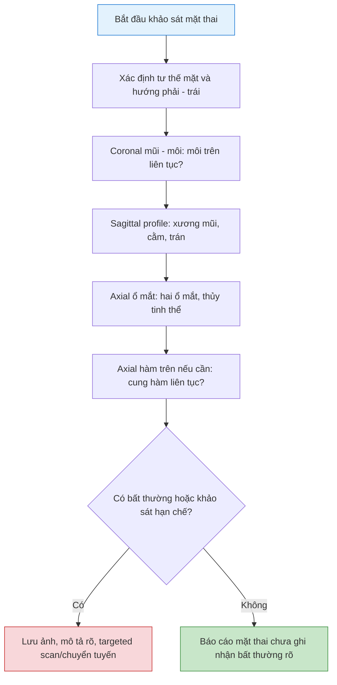

# Khảo sát mặt thai quý 2: mặt cắt mũi - môi, profile, ổ mắt, hàm trên và các bất thường thường gặp
**Ngày:** 2026-07-02 | **Chuyên khoa:** Siêu âm sản khoa | **Đối tượng:** Bác sĩ sản phụ khoa, bác sĩ siêu âm, học viên siêu âm thai

> **Tier 0 / guideline nền:**
> - ISUOG Practice Guidelines for performance of the routine mid-trimester fetal ultrasound scan (PMID: 20842655). [GUIDELINE VERIFIED] [FETCHED]
> - ISUOG Practice Guidelines: sonographic examination of the fetal central nervous system, Part 1 (PMID: 32870591). [GUIDELINE VERIFIED] [FETCHED]
> - ISUOG Practice Guidelines: sonographic examination of the fetal central nervous system, Part 2 (PMID: 33734522). [GUIDELINE VERIFIED] [FETCHED]

---

## 0. TỔNG QUAN - VÌ SAO MẶT THAI DỄ BỊ BỎ SÓT?

Khảo sát mặt thai trong siêu âm hình thái quý 2 thường bị làm nhanh vì người khám tập trung vào não, tim, sinh trắc và bánh nhau. Nhưng bất thường mặt có thể là dị tật đơn độc, cũng có thể là cửa ngõ gợi ý bất thường nhiễm sắc thể, hội chứng di truyền hoặc bất thường đường giữa.

Mục tiêu của bài này không phải làm atlas chuyên sâu về phẫu thuật hàm mặt, mà là giúp người làm scan hình thái trả lời được 4 câu hỏi thực hành:

1. Mặt cắt nào bắt buộc phải có?
2. Mỗi mặt cắt cần thấy landmark gì?
3. Hình nào là red flag cần targeted scan?
4. Báo cáo thế nào khi bình thường, hạn chế hoặc nghi bất thường?

**Mục tiêu bài:**

- Lấy được 4 nhóm mặt cắt chính: coronal mũi - môi, sagittal profile, axial ổ mắt, axial hàm trên.
- Nhận diện hở môi, nghi hở hàm, micrognathia, bất thường xương mũi, hypotelorism/hypertelorism và cataract.
- Biết bẫy thường gặp khi thai che mặt, mặt cắt xiên hoặc gain không phù hợp.
- Viết được mẫu báo cáo phần mặt trong ca bình thường và ca nghi bất thường.
- Biết khi nào phải chuyển targeted scan/chẩn đoán trước sinh.

---

## 1. NGUYÊN TẮC CHUNG KHI KHẢO SÁT MẶT

### 1.1. Không chỉ "thấy mặt"

Một hình 3D mặt đẹp không thay thế được khảo sát giải phẫu 2D chuẩn. Trong routine scan, cần chứng minh:

- Hai ổ mắt và thủy tinh thể hai bên.
- Profile giữa mặt: trán, sống mũi, xương mũi, môi, hàm dưới, cằm.
- Môi trên liên tục trên mặt cắt coronal mũi - môi.
- Cung hàm trên liên tục nếu khảo sát được.
- Không có bất thường đường giữa rõ như hypotelorism, hở môi giữa, absent CSP đi kèm.

**Câu cần nhớ:** môi trên liên tục giúp giảm nguy cơ bỏ sót hở môi, nhưng không loại trừ hở hàm ếch đơn thuần.

### 1.2. Khi hình không đạt

Nếu mặt thai bị tay che, úp vào thành tử cung hoặc tư thế không thuận lợi:

1. Không cố kết luận bình thường.
2. Cho mẹ đổi tư thế, nghiêng trái/phải, đi lại vài phút nếu cần.
3. Quay lại khảo sát mặt cuối buổi.
4. Nếu vẫn không thấy, ghi rõ cấu trúc chưa khảo sát được.

---

## 2. BỐN MẶT CẮT CHÍNH

| Mặt cắt | Cần thấy | Mục tiêu chính | Bẫy thường gặp |
|---|---|---|---|
| **Coronal mũi - môi** | Mũi, hai lỗ mũi, nhân trung, môi trên | Hở môi | Cắt quá trước/sau gây giả gián đoạn |
| **Sagittal profile** | Trán, xương mũi, môi, hàm dưới, cằm | Xương mũi, micrognathia, frontal bossing | Mặt gập/ngửa hoặc tay che cằm |
| **Axial ổ mắt** | Hai ổ mắt, thủy tinh thể | Hypotelorism, hypertelorism, cataract | Cắt xiên làm sai khoảng cách |
| **Axial hàm trên** | Cung hàm trên / alveolar ridge | Hở hàm/cung hàm | Khó thấy nếu mặt áp thành tử cung |

**Bộ ảnh tối thiểu nên lưu:** profile, coronal mũi - môi, axial ổ mắt. Nếu nghi hở hàm, lưu thêm axial hàm trên và hình quét qua cung hàm.

---

## 3. CORONAL MŨI - MÔI: MẶT CẮT TÌM HỞ MÔI

### 3.1. Mặt cắt đạt chuẩn

Mặt cắt coronal mũi - môi đạt chuẩn khi thấy mặt trước thai theo mặt phẳng gần coronal, gồm:

- Mũi.
- Hai lỗ mũi.
- Nhân trung.
- Môi trên liên tục.
- Hai má tương đối cân xứng.

### 3.2. Dấu hiệu nghi hở môi

| Dấu hiệu | Ý nghĩa |
|---|---|
| Gián đoạn môi trên một bên | Nghi hở môi một bên |
| Gián đoạn hai bên, tiền hàm nhô | Nghi hở môi - hàm hai bên |
| Hở vùng giữa mặt | Nghĩ bất thường đường giữa, cần kiểm tra não trước |
| Môi biến dạng nhưng không rõ khe | Quét lại nhiều lớp, kiểm tra hàm trên |

### 3.3. Bẫy

- Mặt cắt quá nông có thể chỉ lướt qua da mặt và tạo hình môi giả.
- Mặt cắt quá sâu có thể đi qua cung hàm, làm nhầm với gián đoạn môi.
- Bàn tay thai trước mặt có thể tạo bóng cản giống khe hở.
- Môi trên bình thường không loại trừ hở hàm ếch đơn thuần.

---

## 4. SAGITTAL PROFILE: XƯƠNG MŨI, TRÁN, CẰM

### 4.1. Mặt cắt đạt chuẩn

Mặt cắt profile cần đi qua đường giữa mặt, thấy liên tục:

- Trán.
- Sống mũi và xương mũi.
- Môi trên/môi dưới.
- Hàm dưới.
- Cằm.

### 4.2. Các dấu hiệu cần đánh giá

| Dấu hiệu | Bình thường | Gợi ý bất thường |
|---|---|---|
| **Trán** | Đường cong đều | Frontal bossing, bất thường xương sọ |
| **Xương mũi** | Thấy rõ trên profile | Absent/hypoplastic nasal bone, soft marker lệch bội |
| **Môi trên** | Không nhô bất thường | Protruding premaxilla trong hở môi - hàm hai bên |
| **Hàm dưới/cằm** | Không lẹm rõ | Micrognathia/retrognathia |
| **Cổ trước** | Không khối | Khối cổ, teratoma, lymphatic malformation hiếm |

Không đánh giá micrognathia khi mặt thai gập quá mức, ngửa quá mức hoặc bị tay che. Nếu profile không đạt, cần ghi "profile chưa khảo sát đầy đủ".

---

## 5. AXIAL Ổ MẮT VÀ HÀM TRÊN

### 5.1. Axial ổ mắt

Mặt cắt axial ổ mắt cần thấy hai ổ mắt ở cùng một mặt phẳng, có thủy tinh thể hai bên và khoảng cách ổ mắt tương đối cân xứng.

| Bất thường | Gợi ý |
|---|---|
| **Hypotelorism** | Hai ổ mắt gần, nghĩ bất thường đường giữa/holoprosencephaly |
| **Hypertelorism** | Hai ổ mắt xa, có thể liên quan facial cleft/hội chứng |
| **Cataract** | Thủy tinh thể hồi âm bất thường, cần đánh giá chuyên sâu |
| **Một ổ mắt bất thường** | Anophthalmia/microphthalmia, khối hốc mắt, cần targeted scan |

### 5.2. Axial hàm trên / alveolar ridge

Mặt cắt axial hàm trên đi qua cung răng trên. Bình thường cung hàm liên tục. Gián đoạn cung hàm, nhất là khi kèm gián đoạn môi trên, gợi ý hở hàm.

Hở hàm ếch đơn thuần khó phát hiện bằng routine 2D. Nếu nghi ngờ, cần targeted scan, có thể phối hợp 3D khi người làm có kinh nghiệm.

---

## 6. BẤT THƯỜNG THƯỜNG GẶP

| Bất thường | Hình ảnh gợi ý | Ý nghĩa thực hành |
|---|---|---|
| **Hở môi** | Gián đoạn môi trên trên coronal | Có thể isolated hoặc kèm hở hàm/bất thường NST |
| **Hở hàm/cung hàm** | Gián đoạn alveolar ridge | Cần targeted scan; hở hàm ếch đơn thuần dễ bỏ sót |
| **Micrognathia** | Cằm lẹm, hàm dưới nhỏ | T18, Pierre Robin sequence, skeletal dysplasia, hội chứng di truyền |
| **Absent/hypoplastic nasal bone** | Không thấy hoặc xương mũi ngắn | Soft marker lệch bội; cần đối chiếu screening |
| **Hypotelorism** | Hai ổ mắt gần | Holoprosencephaly, bất thường đường giữa |
| **Hypertelorism** | Hai ổ mắt xa | Facial cleft, hội chứng |
| **Cataract** | Thủy tinh thể hồi âm bất thường | Nhiễm trùng, chuyển hóa, di truyền; cần đánh giá chuyên sâu |

---

## 7. KHI NÀO CẦN TARGETED SCAN / CHUYỂN TUYẾN?

Cần chuyển trung tâm chẩn đoán trước sinh hoặc khảo sát targeted khi có:

- Nghi hở môi, hở hàm hoặc gián đoạn cung hàm.
- Micrognathia/retrognathia rõ.
- Absent nasal bone kèm marker khác, bất thường cấu trúc khác hoặc nguy cơ lệch bội cao.
- Hypotelorism/hypertelorism.
- Bất thường mặt kèm bất thường CNS, tim, chi, bàn tay, thành bụng hoặc tăng trưởng.
- Nghi khối vùng mặt/cổ.
- Không khảo sát được mặt sau nhiều lần trong thai kỳ nguy cơ cao.

**Nguyên tắc:** bất thường mặt hiếm khi nên đọc đơn độc. Khi thấy bất thường mặt, phải quay lại kiểm tra não giữa, tim, chi, bàn tay, thành bụng, nước ối và tăng trưởng.

---

## 8. CHECKLIST KHẢO SÁT MẶT THAI



---

## 9. MẪU BÁO CÁO

### 9.1. Mẫu bình thường

```text
Khảo sát mặt thai: thấy hai ổ mắt và thủy tinh thể hai bên. Profile thai không ghi nhận bất thường rõ, thấy xương mũi. Môi trên liên tục trên mặt cắt khảo sát được. Chưa ghi nhận dấu hiệu hở môi rõ.
```

### 9.2. Mẫu khảo sát hạn chế

```text
Khảo sát mặt thai hạn chế do tư thế thai/tay che mặt. Chưa đánh giá đầy đủ môi trên/cung hàm/profile. Đề nghị khảo sát lại khi điều kiện thuận lợi.
```

### 9.3. Mẫu nghi bất thường

```text
Mặt cắt coronal mũi - môi ghi nhận gián đoạn môi trên bên ... , nghi hở môi. Cần khảo sát targeted vùng mặt, cung hàm và tìm bất thường phối hợp; đề nghị chuyển trung tâm chẩn đoán trước sinh.
```

---

## 10. SAI LẦM THƯỜNG GẶP

| # | Sai lầm | Hậu quả | Cách tránh |
|---|---|---|---|
| 1 | Chỉ lưu ảnh 3D mặt đẹp | Không chứng minh đã khảo sát giải phẫu | Lưu đủ 2D coronal/profile/axial |
| 2 | Không ghi khi tay che mặt | Âm tính giả | Ghi khảo sát hạn chế và hẹn lại |
| 3 | Thấy môi trên liên tục rồi loại trừ hở hàm | Bỏ sót hở hàm ếch đơn thuần | Kiểm tra alveolar ridge nếu nghi ngờ |
| 4 | Đánh giá cằm khi mặt gập/ngửa quá mức | Overcall/undercall micrognathia | Chỉ đánh giá trên profile đạt chuẩn |
| 5 | Thấy bất thường mặt nhưng không kiểm tra cơ quan khác | Bỏ sót hội chứng/bất thường NST | Quay lại CNS, tim, chi, thành bụng, tăng trưởng |

---

## 11. TIPS THỰC HÀNH

1. Mặt thai nên khảo sát sau khi đã định hướng thai và trước khi thai đổi tư thế quá nhiều.
2. Nếu thai úp mặt vào thành tử cung, đừng cố kết luận; quay lại cuối buổi.
3. Coronal mũi - môi là mặt cắt chủ lực để tìm hở môi.
4. Profile tốt phải thấy cả xương mũi và cằm.
5. Axial ổ mắt bị xiên sẽ làm sai khoảng cách ổ mắt.
6. Hở hàm ếch đơn thuần khó hơn hở môi, nên không được trấn an quá mức.
7. Bất thường mặt giữa phải kéo theo kiểm tra não trước và đường giữa.
8. Micrognathia rõ cần tìm bàn tay, tim, xương dài và nước ối.
9. Ghi "khảo sát hạn chế" tốt hơn ghi bình thường khi chưa thấy đủ.
10. Nghi ngờ thì chuyển targeted scan, không tự tư vấn chắc chắn khi hình chưa đủ.

---

## 12. TỔNG KẾT

1. Khảo sát mặt thai cần tối thiểu 3 nhóm mặt cắt: coronal mũi - môi, sagittal profile và axial ổ mắt.
2. Coronal mũi - môi giúp sàng lọc hở môi, nhưng không loại trừ hở hàm ếch đơn thuần.
3. Profile giúp đánh giá xương mũi, trán và cằm.
4. Axial ổ mắt giúp nhận diện bất thường khoảng cách ổ mắt và thủy tinh thể.
5. Hở môi/hở hàm, micrognathia, hypotelorism/hypertelorism và cataract đều cần đánh giá chuyên sâu.
6. Bất thường mặt phải được đọc trong bối cảnh toàn thân thai, không đọc đơn độc.
7. Khi hình hạn chế, ghi rõ giới hạn và hẹn khảo sát lại.

---

## 13. TÀI LIỆU THAM KHẢO

1. **Salomon LJ, Alfirevic Z, Berghella V, et al. (2011)** "Practice guidelines for performance of the routine mid-trimester fetal ultrasound scan." *Ultrasound Obstet Gynecol.* PMID: **20842655**. [GUIDELINE VERIFIED] [FETCHED]
2. **Malinger G, Paladini D, Haratz KK, et al. (2020)** "ISUOG Practice Guidelines (updated): sonographic examination of the fetal central nervous system. Part 1." *Ultrasound Obstet Gynecol.* PMID: **32870591**. [GUIDELINE VERIFIED] [FETCHED]
3. **Paladini D, Malinger G, Birnbaum R, et al. (2021)** "ISUOG Practice Guidelines (updated): sonographic examination of the fetal central nervous system. Part 2." *Ultrasound Obstet Gynecol.* PMID: **33734522**. [GUIDELINE VERIFIED] [FETCHED]

---

**- Hết bài học ngày 2026-07-02 -**

**Bác sĩ:** Ngọc Hưng | **AI:** OpenCode cx/gpt-5.5-xhigh
