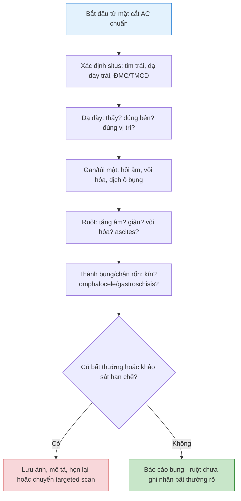

# Khảo sát bụng, ruột và thành bụng thai quý 2: situs, dạ dày, ruột tăng âm, ruột giãn, omphalocele và gastroschisis
**Ngày:** 2026-07-02 | **Chuyên khoa:** Siêu âm sản khoa | **Đối tượng:** Bác sĩ sản phụ khoa, bác sĩ siêu âm, học viên siêu âm thai

> **Tier 0 / guideline nền:**
> - ISUOG Practice Guidelines for performance of the routine mid-trimester fetal ultrasound scan (PMID: 20842655). [GUIDELINE VERIFIED] [FETCHED]
> - ISUOG Practice Guidelines: ultrasound assessment of fetal biometry and growth (PMID: 31169958). [GUIDELINE VERIFIED] [FETCHED]
> - ISUOG Practice Guidelines: fetal cardiac screening (PMID: 37267096). [GUIDELINE VERIFIED] [FETCHED]

---

## 0. TỔNG QUAN - VÌ SAO BỤNG THAI KHÔNG CHỈ LÀ ĐO AC?

Trong scan hình thái quý 2, bụng thai thường được nhìn qua mặt cắt AC. Nhưng nếu chỉ đo AC rồi đi tiếp, người khám có thể bỏ sót situs bất thường, không thấy dạ dày, ruột tăng âm, ruột giãn, thoát vị thành bụng, ascites hoặc các dấu hiệu gợi ý bất thường nhiễm trùng - lệch bội - tiêu hóa.

Một khảo sát bụng tốt phải trả lời 5 câu hỏi:

1. Situs bụng có đúng không?
2. Dạ dày có thấy, đúng bên, đúng vị trí không?
3. Gan, túi mật, dịch ổ bụng và vôi hóa có bất thường không?
4. Ruột có tăng âm, giãn hoặc có dấu tắc không?
5. Thành bụng và chân cắm dây rốn có kín không?

**Mục tiêu bài:**

- Biết cách khảo sát situs bụng và dạ dày trong quý 2.
- Nhận diện các tình huống: không thấy dạ dày, double bubble, dạ dày trong lồng ngực, ruột tăng âm, ruột giãn.
- Phân biệt omphalocele và gastroschisis.
- Biết dấu hiệu nào cần targeted scan/chuyển tuyến.
- Viết được mẫu báo cáo bụng - ruột - thành bụng.

---

## 1. QUY TRÌNH KHẢO SÁT BỤNG THAI

### 1.1. Trình tự thực hành

1. Xác định phải - trái thai.
2. Kiểm tra tim trái và dạ dày trái.
3. Tìm ĐMC và TMCD trên mặt cắt bụng.
4. Lấy mặt cắt AC chuẩn qua dạ dày và portal sinus.
5. Quét lên bụng trên: dạ dày, gan, túi mật, cơ hoành.
6. Quét xuống bụng giữa - dưới: ruột, thận, bàng quang.
7. Kiểm tra thành bụng trước và chân cắm dây rốn.
8. Tìm dịch ổ bụng, vôi hóa, khối, ruột giãn hoặc ruột tăng âm.

### 1.2. Bộ ảnh nên lưu

| Hình | Mục tiêu |
|---|---|
| **AC chuẩn** | Dạ dày, portal sinus, cột sống, bụng tròn |
| **Bụng trên** | Dạ dày trái, gan, túi mật nếu thấy |
| **Chân rốn/thành bụng** | Thành bụng kín, dây rốn cắm đúng |
| **Bụng dưới** | Bàng quang, ruột, liên quan với thận |
| **Hình bất thường** | Ruột tăng âm/giãn, vôi hóa, ascites, khối, thoát vị |

---

## 2. SITUS BỤNG VÀ DẠ DÀY

### 2.1. Situs bình thường

Situs bình thường khi:

- Tim và mỏm tim hướng trái.
- Dạ dày nằm bên trái bụng thai.
- ĐMC nằm bên trái cột sống.
- TMCD nằm trước/phải ĐMC.
- Gan chủ yếu ở bên phải.

Nếu dạ dày và tim không cùng bên trái, hoặc ĐMC/TMCD bất thường, cần nghĩ situs bất thường/heterotaxy và khảo sát tim chuyên sâu.

### 2.2. Không thấy dạ dày

Không thấy dạ dày trong một thời điểm chưa đủ để kết luận bất thường. Dạ dày có chu kỳ đầy - rỗng.

Khi không thấy dạ dày:

1. Xác định lại mặt cắt và phải - trái thai.
2. Chờ và khảo sát lại cuối buổi.
3. Kiểm tra nước ối.
4. Tìm dạ dày trong lồng ngực.
5. Tìm dấu kèm: ruột giãn, bất thường mặt/cổ, tim, CNS.

| Tình huống | Nghĩ đến |
|---|---|
| Không thấy dạ dày thoáng qua, không dấu kèm | Có thể sinh lý do chu kỳ đầy - rỗng |
| Không thấy dạ dày lặp lại + đa ối | Teo thực quản/rối loạn nuốt |
| Dạ dày trong ngực | Thoát vị hoành trái |
| Dạ dày sai bên + tim/situs bất thường | Situs inversus/heterotaxy |

---

## 3. DOUBLE BUBBLE VÀ TẮC ĐƯỜNG TIÊU HÓA TRÊN

Double bubble là hình hai túi dịch cạnh nhau ở bụng trên, thường tương ứng dạ dày và tá tràng giãn.

| Hình ảnh | Nghĩ nhiều đến | Cần tìm thêm |
|---|---|---|
| **Dạ dày + tá tràng giãn** | Tắc/tịt tá tràng | Đa ối, marker lệch bội, bất thường tim |
| **Dạ dày nhỏ/không thấy + đa ối** | Teo thực quản, rối loạn nuốt | Túi cùng thực quản, bất thường kèm |
| **Dạ dày trong lồng ngực** | Thoát vị hoành trái | Tim lệch, gan lên ngực, phổi nhỏ |

Double bubble có thể rõ hơn ở tuổi thai muộn hơn. Nếu hình chưa chắc ở 18-22 tuần, ghi nghi ngờ và hẹn khảo sát lại hoặc chuyển targeted scan theo bối cảnh.

---

## 4. GAN, TÚI MẬT, DỊCH VÀ VÔI HÓA Ổ BỤNG

| Cấu trúc | Bình thường | Bất thường cần mô tả |
|---|---|---|
| **Gan** | Hồi âm đồng nhất, bờ đều | Gan to, khối gan, vôi hóa |
| **Túi mật** | Túi dịch nhỏ dưới gan phải | Không thấy, to bất thường, vị trí bất thường |
| **Dịch ổ bụng** | Không hoặc rất ít | Ascites, hydrops, nhiễm trùng, thiếu máu, tắc ruột |
| **Vôi hóa bụng** | Không có | Nhiễm trùng, meconium peritonitis, xuất huyết, tổn thương gan/ruột |

Không thấy túi mật đơn độc trong một lần scan không đủ để kết luận bệnh lý nặng. Cần khảo sát lại và tìm bất thường kèm.

---

## 5. RUỘT TĂNG ÂM

### 5.1. Trước khi gọi là ruột tăng âm

Ruột tăng âm là khi hồi âm ruột tương đương hoặc gần bằng xương trên cùng cài đặt gain. Đây là dấu hiệu dễ bị overcall.

Trước khi kết luận:

- Giảm gain về mức chuẩn.
- So sánh ruột với xương chậu/cột sống.
- Kiểm tra có bóng cản không.
- Tìm bất thường kèm: FGR, dị tật, vôi hóa, đa/thiểu ối.

### 5.2. Nguyên nhân cần nghĩ

| Nhóm nguyên nhân | Gợi ý đi kèm |
|---|---|
| **Biến thể thoáng qua** | Isolated, không FGR, không marker khác |
| **Lệch bội** | Marker khác, nguy cơ screening cao |
| **Nhiễm trùng bào thai** | Vôi hóa, FGR, gan lách to, não bất thường |
| **Cystic fibrosis** | Ruột tăng âm/giãn, tiền sử gia đình hoặc dân số nguy cơ |
| **Nuốt máu trong ối** | Tiền sử ra máu |
| **FGR/tưới máu kém** | AC nhỏ, Doppler bất thường, bánh nhau bất thường |

**Nguyên tắc báo cáo:** phải ghi ruột tăng âm isolated hay có bất thường kèm.

---

## 6. RUỘT GIÃN VÀ TẮC RUỘT NGHI NGỜ

Ruột giãn thường rõ hơn khi thai lớn hơn. Ở 18-22 tuần, dấu có thể chưa đầy đủ.

Khi thấy quai ruột giãn, mô tả:

- Vị trí: bụng trên, giữa, dưới.
- Số lượng quai giãn.
- Đường kính quai ruột.
- Thành ruột dày hay mỏng.
- Có nhu động không.
- Có đa ối, ascites, vôi hóa hoặc meconium peritonitis không.

| Hình ảnh | Nghĩ đến |
|---|---|
| **Double bubble** | Tắc tá tràng |
| **Nhiều quai ruột non giãn** | Atresia ruột non, volvulus, meconium ileus |
| **Ruột giãn + vôi hóa/ascites** | Thủng ruột, meconium peritonitis |
| **Ruột giãn + đa ối** | Tắc nghẽn tiêu hóa có ý nghĩa |

Nếu ruột giãn nhẹ và isolated, cần theo dõi lại vì diễn tiến theo tuổi thai quan trọng hơn một hình đơn lẻ.

---

## 7. THÀNH BỤNG VÀ CHÂN CẮM DÂY RỐN

Mặt cắt qua chân rốn phải chứng minh thành bụng kín và dây rốn cắm đúng vào thành bụng.

| Cấu trúc | Bình thường | Bất thường |
|---|---|---|
| **Chân cắm dây rốn** | Vào giữa thành bụng, da che phủ liên tục | Omphalocele, gastroschisis, body stalk anomaly |
| **Thành bụng cạnh rốn** | Liên tục hai bên | Khuyết thành bụng cạnh rốn |
| **Bàng quang dưới rốn** | Túi dịch thành mỏng, chu kỳ đầy - rỗng | Không thấy, megacystis, cloacal/bladder exstrophy |

### 7.1. Omphalocele vs gastroschisis

| Tiêu chí | Omphalocele | Gastroschisis |
|---|---|---|
| **Vị trí** | Đường giữa, tại chân rốn | Thường cạnh phải rốn |
| **Màng bọc** | Có màng | Không màng |
| **Dây rốn** | Cắm vào khối thoát vị | Cắm bình thường cạnh khối |
| **Tạng thoát vị** | Ruột, có thể kèm gan | Thường ruột tự do trong ối |
| **Bất thường kèm** | Hay cần tìm bất thường NST/tim/hội chứng | Ít liên quan NST hơn, nhưng có nguy cơ biến chứng ruột |

### 7.2. Các khuyết thành bụng khác cần nghĩ

- Body stalk anomaly / limb-body wall complex: khuyết thành bụng lớn, dây rốn rất ngắn hoặc không rõ, cột sống/chi bất thường.
- Bladder exstrophy: không thấy bàng quang lặp lại, khối dưới rốn, dây rốn cắm thấp.
- Cloacal exstrophy: khối phức tạp vùng bụng dưới, bất thường tiết niệu - tiêu hóa - sinh dục.

---

## 8. KHI NÀO CẦN TARGETED SCAN / CHUYỂN TUYẾN?

Cần chuyển tuyến/chẩn đoán trước sinh khi có:

- Không thấy dạ dày lặp lại, nhất là kèm đa ối.
- Dạ dày trong lồng ngực hoặc nghi thoát vị hoành.
- Double bubble hoặc ruột giãn rõ.
- Ruột tăng âm thật sự kèm marker khác, FGR, vôi hóa, nước ối bất thường hoặc nguy cơ screening cao.
- Omphalocele, gastroschisis hoặc bất kỳ khuyết thành bụng nào.
- Ascites, vôi hóa ổ bụng nhiều, khối bụng, gan to hoặc nghi nhiễm trùng bào thai.
- Situs bất thường hoặc nghi heterotaxy.

---

## 9. CHECKLIST KHẢO SÁT BỤNG - RUỘT - THÀNH BỤNG



---

## 10. MẪU BÁO CÁO

### 10.1. Mẫu bình thường

```text
Ổ bụng thai: dạ dày thấy bên trái, chứa dịch. Gan hồi âm đồng nhất. Thành bụng trước liên tục, dây rốn cắm vào thành bụng bình thường. Ruột không tăng âm rõ, không thấy quai ruột giãn. Bàng quang thấy, thành mỏng.
```

### 10.2. Mẫu không thấy dạ dày

```text
Trong thời điểm khảo sát chưa thấy rõ bóng dạ dày thai. Chưa ghi nhận đa ối/thoát vị hoành rõ trên phần khảo sát được. Đề nghị khảo sát lại dạ dày sau thời gian chờ hoặc hẹn siêu âm lại nếu vẫn không thấy.
```

### 10.3. Mẫu ruột tăng âm

```text
Ruột thai tăng âm rõ so với mô xung quanh, mức độ gần tương đương xương trên cài đặt gain phù hợp. Chưa/có ghi nhận bất thường kèm: ... Đề nghị đối chiếu screening lệch bội, nhiễm trùng bào thai, tăng trưởng thai và theo dõi lại.
```

### 10.4. Mẫu nghi khuyết thành bụng

```text
Thành bụng trước vùng quanh rốn ghi nhận khuyết, có cấu trúc ruột/gan thoát vị ... Có/không có màng bọc. Vị trí dây rốn cắm ... Hình ảnh nghi omphalocele/gastroschisis. Đề nghị chuyển trung tâm chẩn đoán trước sinh để khảo sát targeted và tư vấn.
```

---

## 11. SAI LẦM THƯỜNG GẶP

| # | Sai lầm | Hậu quả | Cách tránh |
|---|---|---|---|
| 1 | Chỉ đo AC, không khảo sát bụng | Bỏ sót situs, dạ dày, ruột, thành bụng | Quét bụng trên - giữa - dưới |
| 2 | Không thấy dạ dày một lần đã kết luận teo thực quản | Overdiagnosis | Chờ, khảo sát lại, tìm đa ối/dấu kèm |
| 3 | Gọi ruột tăng âm khi gain quá cao | Báo động sai | Chuẩn hóa gain, so với xương |
| 4 | Nhầm omphalocele với gastroschisis | Tư vấn sai nguy cơ | Dựa vào vị trí, màng bọc, dây rốn cắm |
| 5 | Thấy bất thường bụng nhưng không kiểm tra tim/situs | Bỏ sót heterotaxy/CHD | Luôn kiểm tra tim, ĐMC/TMCD, dạ dày |
| 6 | Không ghi khảo sát hạn chế | Tạo âm tính giả | Ghi rõ cấu trúc chưa thấy |

---

## 12. TIPS THỰC HÀNH

1. AC chuẩn là điểm bắt đầu, không phải điểm kết thúc của khảo sát bụng.
2. Dạ dày phải được đọc cùng situs, không đọc đơn độc.
3. Không thấy dạ dày cần khảo sát lại sau chờ, không vội kết luận.
4. Ruột tăng âm phải được xác nhận sau khi giảm gain.
5. Ruột giãn có giá trị hơn khi có diễn tiến theo thời gian.
6. Vôi hóa bụng + ascites làm tăng nghi ngờ meconium peritonitis hoặc nhiễm trùng.
7. Omphalocele và gastroschisis khác nhau chủ yếu ở vị trí, màng bọc và dây rốn cắm.
8. Khuyết thành bụng cần tìm tim, CNS, chi và NST nguy cơ.
9. Situs bất thường luôn kéo theo khảo sát tim chuyên sâu.
10. Nếu hình hạn chế, ghi rõ và hẹn lại thay vì báo cáo bình thường.

---

## 13. TỔNG KẾT

1. Khảo sát bụng thai quý 2 không chỉ là đo AC.
2. Phải xác định situs: tim trái, dạ dày trái, ĐMC/TMCD đúng vị trí.
3. Không thấy dạ dày cần chờ và khảo sát lại, nhất là khi có đa ối.
4. Double bubble gợi ý tắc đường tiêu hóa trên, cần tìm bất thường kèm.
5. Ruột tăng âm cần xác nhận bằng gain chuẩn và đánh giá isolated hay không.
6. Ruột giãn cần mô tả vị trí, số quai, đường kính, thành ruột, nước ối, ascites và vôi hóa.
7. Omphalocele và gastroschisis phải phân biệt bằng vị trí, màng bọc và dây rốn cắm.
8. Bất thường bụng/thành bụng thường cần targeted scan và tìm bất thường phối hợp.

---

## 14. TÀI LIỆU THAM KHẢO

1. **Salomon LJ, Alfirevic Z, Berghella V, et al. (2011)** "Practice guidelines for performance of the routine mid-trimester fetal ultrasound scan." *Ultrasound Obstet Gynecol.* PMID: **20842655**. [GUIDELINE VERIFIED] [FETCHED]
2. **Salomon LJ, Alfirevic Z, Da Silva Costa F, et al. (2019)** "ISUOG Practice Guidelines: ultrasound assessment of fetal biometry and growth." *Ultrasound Obstet Gynecol.* PMID: **31169958**. [GUIDELINE VERIFIED] [FETCHED]
3. **Carvalho JS, Axt-Fliedner R, Chaoui R, et al. (2023)** "ISUOG Practice Guidelines (updated): fetal cardiac screening." *Ultrasound Obstet Gynecol.* PMID: **37267096**. [GUIDELINE VERIFIED] [FETCHED]

---

**- Hết bài học ngày 2026-07-02 -**

**Bác sĩ:** Ngọc Hưng | **AI:** OpenCode cx/gpt-5.5-xhigh
