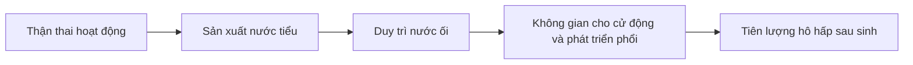
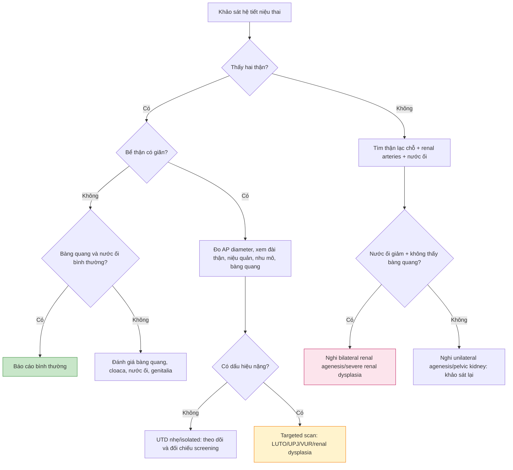

# BÀI HỌC Y KHOA: SIÊU ÂM HỆ TIẾT NIỆU - SINH DỤC THAI

**Ngày:** 2026-07-03 | **Chuyên khoa:** Siêu âm sản khoa | **Đối tượng:** Bác sĩ sản phụ khoa / bác sĩ siêu âm thai

> **Phạm vi:** thận, bể thận, niệu quản, bàng quang, nước ối, lower urinary tract obstruction và bất thường sinh dục ngoài cơ bản. Bài này không đi sâu phẫu thuật sau sinh; trọng tâm là cách đọc siêu âm, phân tầng nguy cơ, chuyển tuyến và tư vấn trước sinh.

---

## 0. TỔNG QUAN - VÌ SAO HỆ TIẾT NIỆU THAI QUAN TRỌNG?

Hệ tiết niệu là một trong những nhóm bất thường thai nhi thường gặp trên siêu âm hình thái. Khác với nhiều cơ quan khác, thận thai không chỉ là một cấu trúc cần nhìn thấy; nó còn quyết định **sản xuất nước tiểu thai**, từ đó ảnh hưởng **thể tích nước ối**, **phát triển phổi** và tiên lượng sống sau sinh.

Từ khoảng giữa thai kỳ, nước tiểu thai là nguồn chính của nước ối. Vì vậy, bất thường thận một bên thường vẫn có nước ối bình thường, còn bất thường hai bên nặng hoặc tắc nghẽn đường tiểu thấp có thể gây thiểu ối/anhydramnios và pulmonary hypoplasia.

**Mục tiêu bài học:**

- Khảo sát thận - bàng quang - nước ối theo một trình tự cố định.
- Phân biệt urinary tract dilation nhẹ với bất thường tiết niệu nặng.
- Nhận diện renal agenesis, ectopic kidney, MCDK, ARPKD, hydronephrosis, posterior urethral valves và megacystis.
- Biết khi nào bất thường sinh dục ngoài cần nghĩ đến DSD hoặc hội chứng.
- Viết được báo cáo siêu âm có định hướng xử trí.

---

## 1. PHÔI THAI HỌC VÀ SINH LÝ CẦN NHỚ

### 1.1. Trục thận - nước tiểu - nước ối - phổi

Khi thận hai bên không hoạt động hoặc đường thoát nước tiểu bị tắc nặng, nước ối giảm sớm. Thiểu ối kéo dài làm phổi không phát triển đủ, gây pulmonary hypoplasia. Đây là lý do tiên lượng của bilateral renal agenesis hoặc severe LUTO phụ thuộc mạnh vào nước ối và chức năng thận.

### 1.2. Một bên và hai bên khác nhau rất lớn

| Tình huống | Nước ối | Tiên lượng thường gặp |
|---|---|---|
| Bất thường thận một bên, thận còn lại bình thường | Thường bình thường | Thường tốt, cần theo dõi sau sinh |
| Bất thường thận hai bên | Có thể giảm nếu chức năng thận kém | Phụ thuộc chức năng thận và nước ối |
| Tắc nghẽn đường tiểu thấp | Có thể giảm tiến triển | Nguy cơ tổn thương thận hai bên và thiểu sản phổi |
| Bất thường bàng quang/cloaca | Biến thiên | Cần targeted scan và hội chẩn đa chuyên khoa |

---

## 2. KỸ THUẬT KHẢO SÁT HỆ TIẾT NIỆU

### 2.1. Trình tự thực hành

1. Xác định mặt cắt bụng chuẩn: dạ dày, gan, cột sống, ĐMC/TMCD.
2. Quét xuống hai hố thận: tìm hai thận ở hai bên cột sống.
3. Quét dọc mỗi bên: xác nhận hình bầu dục của thận và nhu mô.
4. Đo bể thận nếu có giãn: đo đường kính trước-sau trên mặt cắt ngang thận.
5. Tìm niệu quản nếu nghi giãn.
6. Tìm bàng quang: vị trí giữa tiểu khung, thành mỏng, chứa dịch.
7. Đánh giá nước ối cùng lúc.
8. Nếu không thấy thận/bàng quang: chờ khảo sát lại, dùng Doppler tìm renal arteries và tìm thận lạc chỗ.

### 2.2. Bộ ảnh nên lưu

| Ảnh | Cần thấy |
|---|---|
| Hai thận mặt cắt ngang | Hai thận hai bên cột sống, hình dạng và hồi âm |
| Thận phải/trái mặt cắt dọc | Chiều dài, nhu mô, nang nếu có |
| Bể thận nếu giãn | Đo AP diameter đúng trục |
| Bàng quang | Thành mỏng, vị trí giữa tiểu khung |
| Nước ối | SDP hoặc AFI theo tuổi thai/bối cảnh |
| Doppler nếu cần | Renal arteries, dây rốn, dòng quanh bàng quang |

### 2.3. Bẫy kỹ thuật

- Adrenal gland có thể giả giống thận khi không thấy thận thật.
- Một lần không thấy bàng quang chưa đủ kết luận absent bladder vì bàng quang có chu kỳ đầy - rỗng.
- Thận lạc chỗ vùng chậu có thể bị bỏ sót nếu chỉ nhìn hố thận.
- Gain quá cao có thể làm thận trông tăng âm giả.
- Giãn bể thận phải đo AP diameter, không đo đường chéo.

---

## 3. HÌNH ẢNH BÌNH THƯỜNG

| Cấu trúc | Bình thường | Cần ghi nhận |
|---|---|---|
| **Thận** | Hai thận hai bên cột sống, hình bầu dục, hồi âm hơi thấp hơn ruột | Có đủ hai thận, kích thước phù hợp, nhu mô đều |
| **Bể thận** | Có thể thấy ít dịch, không giãn quá ngưỡng | Đo AP diameter nếu nghi giãn |
| **Niệu quản** | Thường không thấy | Nếu thấy rõ thường nghĩ giãn niệu quản |
| **Bàng quang** | Túi dịch thành mỏng giữa tiểu khung, đầy-rỗng theo thời gian | Có thấy hay không, kích thước, thành dày hay mỏng |
| **Nước ối** | Phù hợp tuổi thai | Thiểu ối gợi ý bệnh hai bên/tắc nặng hoặc nguyên nhân nhau-màng ối |

---

## 4. URINARY TRACT DILATION - GIÃN ĐƯỜNG TIẾT NIỆU THAI

### 4.1. Vì sao phải gọi đúng?

`Urinary tract dilation (UTD)` là ngôn ngữ hiện đại hơn so với gọi chung “thận ứ nước”. Nó buộc bác sĩ mô tả không chỉ bể thận, mà cả đài thận, nhu mô, niệu quản, bàng quang và nước ối. Hệ thống UTD được cập nhật và làm rõ trong các review/consensus gần đây (Nguyen 2022, PMID: 34981177; Chow 2017, PMID: 28779200) [FETCHED].

### 4.2. Cách đo renal pelvic AP diameter

- Mặt cắt ngang qua rốn thận.
- Đo đường kính trước-sau lớn nhất của bể thận.
- Đặt caliper trong lòng dịch, không bao gồm nhu mô.
- Ghi tuổi thai vì ngưỡng thay đổi theo quý.

### 4.3. Ngưỡng thực hành thường dùng

| Tuổi thai | AP renal pelvis bình thường/thấp nguy cơ | Cần theo dõi hơn |
|---|---|---|
| Quý 2 | Dưới khoảng 4 mm thường xem là bình thường | Từ khoảng 4 mm trở lên cần mô tả và theo dõi theo bối cảnh |
| Quý 3 | Dưới khoảng 7 mm thường xem là bình thường | Từ khoảng 7 mm trở lên cần phân tầng sau sinh |

Các mốc này là cutoff thực hành, không phải ranh giới tuyệt đối. Luôn đọc cùng: một hay hai bên, có giãn đài thận không, nhu mô thận có mỏng/tăng âm không, có giãn niệu quản không, bàng quang có bất thường không, nước ối có giảm không.

### 4.4. Phân biệt nguyên nhân UTD

| Hình ảnh | Nghĩ nhiều đến | Gợi ý thêm |
|---|---|---|
| Giãn bể thận đơn thuần, nhu mô tốt | Pyelectasis nhẹ/isolated UTD | Thường tiên lượng tốt, theo dõi |
| Giãn bể thận + đài thận, không giãn niệu quản | UPJ obstruction | Một bên thường gặp hơn |
| Giãn bể thận + niệu quản | VUR, UVJ obstruction, megaureter | Theo dõi sau sinh |
| Bàng quang to, thành dày, keyhole sign, hai thận ứ nước | Posterior urethral valves/LUTO | Thai nam, nguy cơ thiểu ối |
| Nhu mô mỏng/tăng âm, nang vỏ thận | Tổn thương thận nặng | Tiên lượng phụ thuộc nước ối |

### 4.5. Isolated renal pelvic dilation và lệch bội

Renal pelvic dilation/pyelectasis có thể là soft marker quý 2. SMFM Consult Series #57 cập nhật cách xử trí isolated soft markers, trong đó có renal pelviectasis, nhấn mạnh phải phân biệt isolated với non-isolated và đối chiếu screening lệch bội đã có (PMID: 34171388) [GUIDELINE VERIFIED].

---

## 5. RENAL AGENESIS - KHÔNG CÓ THẬN

### 5.1. Unilateral renal agenesis

Không thấy một thận ở hố thận nhưng thận bên kia bình thường, bàng quang thấy, nước ối bình thường. Trước khi kết luận, phải tìm thận lạc chỗ vùng chậu và dùng Color Doppler tìm renal artery.

### 5.2. Bilateral renal agenesis

Dấu hiệu gợi ý:

- Không thấy hai thận ở hố thận.
- Không thấy bàng quang lặp lại.
- Thiểu ối/anhydramnios, nhất là sau 16 tuần.
- Không thấy renal arteries trên Doppler.
- Có thể có Potter sequence nếu thiểu ối kéo dài.

SMFM có bài cập nhật riêng về renal agenesis (PMID: 34507792) [FETCHED]. Điểm thực hành quan trọng nhất là không nhầm renal agenesis với thận lạc chỗ hoặc bàng quang rỗng tạm thời.

### 5.3. Chẩn đoán phân biệt khi không thấy thận

| Khả năng | Cách phân biệt |
|---|---|
| Thận lạc chỗ vùng chậu | Tìm cấu trúc thận thấp trong chậu, gần bàng quang |
| Thận móng ngựa | Hai cực dưới nối nhau trước cột sống |
| Adrenal giả thận | Không có renal artery, hình dạng khác thận |
| Thận loạn sản nhỏ | Có mô thận bất thường nhưng khó thấy |

---

## 6. THẬN LẠC CHỖ VÀ BẤT THƯỜNG HỢP NHẤT

### 6.1. Pelvic kidney

Pelvic kidney là thận nằm thấp trong chậu thay vì hố thận. Nếu chỉ quét hố thận, dễ kết luận nhầm là renal agenesis. SMFM có bài riêng về pelvic kidney (PMID: 34507798) [FETCHED].

Dấu hiệu:

- Hố thận trống một bên.
- Có cấu trúc giống thận trong chậu.
- Bàng quang thường thấy.
- Nước ối thường bình thường nếu thận còn lại hoạt động tốt.

### 6.2. Horseshoe kidney và crossed fused ectopia

Các bất thường hợp nhất có thể khó nhận diện trên screening. Nên nghi ngờ khi vị trí thận bất thường, trục thận lạ, hoặc hai thận có vẻ nối nhau qua đường giữa. Cần targeted scan nếu hình ảnh không rõ hoặc có bất thường kèm.

---

## 7. THẬN NANG VÀ THẬN LOẠN SẢN

### 7.1. Multicystic dysplastic kidney

`MCDK` thường là thận có nhiều nang kích thước khác nhau, không thông nhau, nhu mô chức năng kém. Một bên thường có nước ối bình thường nếu thận bên kia tốt. Hai bên có thể gây thiểu ối nặng.

### 7.2. ARPKD

`Autosomal recessive polycystic kidney disease` thường gợi ý bởi hai thận to, tăng âm, giảm/mất phân biệt vỏ-tủy và có thể thiểu ối nếu chức năng thận kém. Không phải lúc nào cũng thấy nang lớn riêng rẽ vì các nang có thể rất nhỏ.

### 7.3. Nang thận đơn độc

Một nang đơn độc cần phân biệt với nang buồng trứng, nang mạc treo, nang ống mật chủ hoặc tổn thương ổ bụng khác tùy vị trí. Theo dõi sự thay đổi kích thước và liên quan với thận/bàng quang.

### 7.4. Khi thận tăng âm hai bên

Thận tăng âm hai bên là dấu hiệu cần cẩn thận hơn nhiều so với pyelectasis nhẹ isolated. Phải tìm:

- Nước ối giảm hay không.
- Thận to hay nhỏ.
- Nang thận.
- Bất thường gan, CNS, mặt, chi, tim.
- Polydactyly, encephalocele, bất thường hố sau.

Nếu có renal cystic dysplasia + encephalocele + polydactyly, cần nghĩ Meckel syndrome (Salonen 1998, PMID: 9643292) [FETCHED].

---

## 8. MEGACYSTIS VÀ LOWER URINARY TRACT OBSTRUCTION

### 8.1. Megacystis là gì?

Megacystis là bàng quang lớn bất thường. Ở quý 1, bàng quang dài trên khoảng 7 mm thường được xem là megacystis. Ở quý 2-3, cần đánh giá kích thước, thành bàng quang, chu kỳ rỗng, thận, niệu quản và nước ối.

### 8.2. Posterior urethral valves

`Posterior urethral valves (PUV)` là nguyên nhân kinh điển của lower urinary tract obstruction ở thai nam. Review về LUTO/PUV nhấn mạnh hậu quả có thể gồm tổn thương thận hai bên, thiểu ối và biến chứng sau sinh (Flores-Torres 2023, PMID: 37422291; Schanstra 2024, PMID: 38280830) [FETCHED].

Dấu hiệu gợi ý:

- Bàng quang lớn, thành dày.
- Keyhole sign.
- Giãn niệu quản/hydroureter.
- Hydronephrosis hai bên.
- Thận tăng âm hoặc có nang vỏ thận.
- Thiểu ối nếu tắc nặng và chức năng thận giảm.

### 8.3. Không phải mọi bàng quang lớn đều là PUV

Chẩn đoán phân biệt gồm urethral atresia, prune belly syndrome, megacystis-microcolon-intestinal hypoperistalsis syndrome, cloacal anomaly và bất thường thần kinh. Vì vậy báo cáo nên ghi “nghi lower urinary tract obstruction” khi chưa đủ chắc, thay vì khẳng định PUV trong mọi trường hợp.

### 8.4. Fetal intervention

Can thiệp bào thai cho LUTO/severe hydronephrosis là lĩnh vực chọn lọc cao, cần hội chẩn fetal medicine, nhi tiết niệu và sơ sinh. Review về severe fetal hydronephrosis và renal anhydramnios cho thấy việc đánh giá chức năng thận, nước ối và khả năng sống sau sinh là trung tâm của quyết định (Safdar 2021, PMID: 33651757; Miller 2022, PMID: 36328603) [FETCHED]. Bài này không khuyến cáo tự chỉ định can thiệp ngoài trung tâm chuyên sâu.

---

## 9. KHÔNG THẤY BÀNG QUANG

### 9.1. Cách xử trí đầu tiên

Nếu không thấy bàng quang một lần, đừng kết luận ngay. Cần:

1. Khảo sát lại sau 20-30 phút.
2. Tìm hai thận.
3. Đánh giá nước ối.
4. Tìm khối vùng chậu hoặc thành bụng dưới.
5. Dùng Doppler nếu cần.

### 9.2. Nguyên nhân cần nghĩ

| Bối cảnh | Nghĩ đến |
|---|---|
| Không thấy bàng quang + không thấy hai thận + anhydramnios | Bilateral renal agenesis |
| Không thấy bàng quang + thận bất thường hai bên | Severe renal dysplasia |
| Không thấy bàng quang + khối dưới rốn/thành bụng dưới bất thường | Bladder exstrophy/OEIS |
| Khối nang vùng chậu, giới nữ, có thể hydronephrosis | Hydrocolpos/cloacal malformation |

---

## 10. BẤT THƯỜNG Ổ NHỚP VÀ NIỆU-SINH DỤC PHỨC TẠP

### 10.1. Khi nào nghĩ cloacal malformation?

Cloacal malformation nên được nghĩ khi có khối nang vùng chậu ở thai nữ, không thấy bàng quang bình thường, hydronephrosis hai bên, ascites, bất thường sinh dục ngoài hoặc bất thường hậu môn-trực tràng nghi ngờ. Đây là nhóm cần targeted scan và MRI thai nếu có điều kiện.

### 10.2. Bladder exstrophy và OEIS

Gợi ý bladder exstrophy:

- Không thấy bàng quang lặp lại nhưng nước ối có thể bình thường.
- Khối mô dưới chân rốn.
- Dây rốn cắm thấp.
- Genitalia bất thường.

OEIS complex nặng hơn, có thể kèm omphalocele, exstrophy, imperforate anus và spinal defects. Nếu nghi ngờ, phải quay lại khảo sát thành bụng, cột sống và chi dưới.

---

## 11. HỆ SINH DỤC NGOÀI THAI

### 11.1. Khi nào đánh giá?

Đánh giá sinh dục ngoài không phải lúc nào cũng là mục tiêu chính của anatomy scan, nhưng cần chú ý khi:

- NIPT/karyotype giới tính không khớp hình ảnh.
- Có ambiguous genitalia.
- Có bất thường thận - bàng quang - cloaca.
- Có bất thường tuyến thượng thận hoặc nghi CAH.
- Có nhiều dị tật gợi ý hội chứng.

### 11.2. Ambiguous genitalia / DSD

Ambiguous genitalia cần tiếp cận như một dấu hiệu của `disorders of sex development (DSD)`, không nên chỉ ghi “không rõ trai/gái”. Review về ambiguous genitalia nhấn mạnh cần đánh giá toàn diện, gồm hình ảnh, di truyền, nội tiết và tư vấn đa chuyên khoa (Stambough 2019, PMID: 31425174) [FETCHED].

Dấu hiệu có thể gặp:

- Micropenis.
- Hypospadias nặng.
- Bìu chẻ đôi.
- Clitoromegaly.
- Labioscrotal folds bất thường.
- Không khớp giữa phenotype và genetic sex.

### 11.3. U nang buồng trứng thai nữ

Fetal ovarian cyst thường là khối nang vùng chậu ở thai nữ, hay phát hiện quý 3. Phần lớn liên quan kích thích nội tiết mẹ - nhau - thai, nhưng cần theo dõi nguy cơ xoắn, xuất huyết hoặc nang phức tạp. Systematic review/meta-analysis về fetal ovarian cyst được công bố trên UOG (Bascietto 2017, PMID: 27325566) [FETCHED].

Phân biệt với:

- Hydrocolpos.
- Nang mạc treo.
- Nang niệu rốn.
- Bàng quang giãn.
- Nang ống mật chủ nếu ở bụng trên phải.

---

## 12. LIÊN HỆ HỘI CHỨNG VÀ DI TRUYỀN

| Pattern | Nghĩ đến |
|---|---|
| Thận nang/tăng âm hai bên + polydactyly + encephalocele | Meckel-Gruber / ciliopathy |
| Renal anomaly + vertebral + anal + cardiac + limb | VACTERL association |
| Ambiguous genitalia + adrenal bất thường | CAH/DSD |
| Pyelectasis isolated | Soft marker, xử trí theo screening lệch bội |
| Renal anomaly + tim/CNS/mặt/chi | Non-isolated, cần genetic counseling/CMA tùy bối cảnh |

Nguyên tắc: bất thường tiết niệu **isolated một bên** khác hoàn toàn bất thường **hai bên hoặc kèm dị tật ngoài tiết niệu**. Khi có bất thường kèm, cần chuyển từ tư duy “theo dõi thận” sang “đánh giá hội chứng”.

---

## 13. KHI NÀO CẦN TARGETED SCAN / CHUYỂN TUYẾN?

Chuyển fetal medicine hoặc trung tâm chẩn đoán trước sinh khi có một trong các tình huống:

- Bất thường thận hai bên.
- Thiểu ối/anhydramnios không giải thích được.
- Không thấy bàng quang lặp lại.
- Bàng quang lớn, thành dày, keyhole sign.
- Hydronephrosis nặng hoặc có giãn niệu quản hai bên.
- Thận tăng âm hai bên, nang thận hai bên.
- Nghi renal agenesis hai bên.
- Nghi cloacal malformation, bladder exstrophy hoặc OEIS.
- Ambiguous genitalia hoặc phenotype không khớp genetic sex.
- Bất thường tiết niệu kèm CNS, tim, mặt, chi, thành bụng hoặc FGR.

---

## 14. LƯU ĐỒ QUYẾT ĐỊNH

---

## 15. MẪU BÁO CÁO

### 15.1. Bình thường

Hai thận thai thấy ở vị trí bình thường hai bên cột sống, kích thước và hồi âm phù hợp tuổi thai. Không ghi nhận giãn bể thận rõ. Bàng quang thấy, thành mỏng. Nước ối trong giới hạn bình thường.

### 15.2. Pyelectasis nhẹ một bên

Thận phải/trái có giãn nhẹ bể thận, đường kính trước-sau khoảng ... mm ở tuổi thai ... tuần. Nhu mô thận bảo tồn, không thấy giãn niệu quản, bàng quang bình thường, nước ối bình thường. Chưa ghi nhận bất thường hình thái kèm trong phạm vi khảo sát. Đề nghị theo dõi lại theo tuổi thai và đối chiếu screening lệch bội.

### 15.3. Nghi LUTO/PUV

Bàng quang thai giãn lớn, thành dày, có/không hình ảnh keyhole. Hai thận có giãn đài-bể thận/hydroureter hai bên, nhu mô thận ... Nước ối ... Hình ảnh gợi ý lower urinary tract obstruction, cần chuyển trung tâm chẩn đoán trước sinh/fetal medicine để đánh giá chuyên sâu và tư vấn.

### 15.4. Nghi renal agenesis hai bên

Không thấy hai thận ở hố thận trên nhiều mặt cắt, chưa thấy bàng quang sau theo dõi lặp lại, nước ối giảm nặng/anhydramnios. Doppler chưa ghi nhận renal arteries hai bên. Hình ảnh nghi bilateral renal agenesis/severe bilateral renal anomaly. Đề nghị chuyển tuyến chuyên sâu để xác nhận và tư vấn tiên lượng.

### 15.5. Nghi u nang buồng trứng thai nữ

Vùng chậu thai ghi nhận cấu trúc nang kích thước ... mm, thành mỏng/dày, dịch trong/có echo bên trong. Bàng quang phân biệt riêng, hai thận ... Hình ảnh nghĩ nhiều đến fetal ovarian cyst nhưng cần theo dõi phân biệt với các nang vùng chậu khác.

---

## 16. SAI LẦM THƯỜNG GẶP

| # | Sai lầm | Hậu quả | Cách tránh |
|---|---|---|---|
| 1 | Kết luận renal agenesis khi chưa tìm pelvic kidney | Tư vấn sai tiên lượng | Quét vùng chậu và dùng Doppler renal arteries |
| 2 | Kết luận absent bladder sau một lần quét | Dương tính giả | Khảo sát lại sau 20-30 phút |
| 3 | Gọi pyelectasis nhẹ là dị tật nặng | Gây lo lắng quá mức | Phân biệt isolated vs non-isolated |
| 4 | Không đánh giá nước ối khi đọc thận | Bỏ sót tiên lượng xấu | Luôn đọc thận-bàng quang-nước ối cùng nhau |
| 5 | Thấy UTD nhưng không nhìn niệu quản/bàng quang | Không phân biệt UPJ, VUR, LUTO | Mô tả toàn bộ đường tiết niệu |
| 6 | Bỏ qua bất thường ngoài tiết niệu | Bỏ sót hội chứng | Tìm CNS, tim, mặt, chi, thành bụng |
| 7 | Ghi “không rõ giới tính” thay vì ambiguous genitalia | Mất định hướng DSD | Ghi mô tả hình ảnh và đề nghị đánh giá chuyên sâu |

---

## 17. TIPS THỰC HÀNH

1. Luôn đọc theo bộ ba: **thận - bàng quang - nước ối**.
2. Bất thường một bên với nước ối bình thường thường khác xa bất thường hai bên có thiểu ối.
3. Không thấy thận một bên: tìm pelvic kidney trước khi kết luận agenesis.
4. Không thấy bàng quang: chờ và quét lại, vì bàng quang có chu kỳ đầy - rỗng.
5. UTD nhẹ isolated thường là câu chuyện theo dõi, không phải chẩn đoán dị tật nặng ngay lập tức.
6. Bàng quang lớn + thành dày + keyhole + hydronephrosis hai bên là pattern cần chuyển tuyến.
7. Thận tăng âm hai bên đáng lo hơn giãn bể thận nhẹ.
8. Nước ối giảm sớm là dấu hiệu tiên lượng lớn trong bệnh thận hai bên/LUTO.
9. Ambiguous genitalia phải kéo theo câu hỏi về DSD, CAH và bất thường niệu-sinh dục phức tạp.
10. Mọi bất thường tiết niệu kèm bất thường tim/CNS/mặt/chi cần tư duy hội chứng.

---

## 18. TỔNG KẾT

1. Siêu âm hệ tiết niệu thai không chỉ là “thấy hai thận”; phải đánh giá thận, bàng quang và nước ối cùng nhau.
2. UTD là ngôn ngữ chuẩn hơn “thận ứ nước”, vì buộc mô tả toàn bộ đường tiết niệu.
3. Pyelectasis nhẹ isolated thường tiên lượng tốt hơn nhiều so với UTD kèm giãn niệu quản, nhu mô bất thường, bàng quang bất thường hoặc thiểu ối.
4. Bilateral renal agenesis và severe LUTO đáng lo vì gây anhydramnios và pulmonary hypoplasia.
5. Không thấy thận phải tìm thận lạc chỗ; không thấy bàng quang phải khảo sát lại.
6. MCDK một bên thường khác tiên lượng với thận nang/tăng âm hai bên.
7. PUV là nguyên nhân kinh điển của LUTO ở thai nam nhưng không phải mọi megacystis đều là PUV.
8. Bladder exstrophy/cloaca cần nghĩ khi không thấy bàng quang bình thường nhưng nước ối không nhất thiết giảm.
9. Ambiguous genitalia là dấu hiệu cần đánh giá DSD và hội chứng, không phải chỉ là “chưa xác định giới tính”.
10. Khi có bất thường tiết niệu non-isolated, cần targeted scan, tư vấn di truyền và hội chẩn đa chuyên khoa.

---

## 19. TÀI LIỆU THAM KHẢO

1. **Nguyen HT et al. (2022)** "2021 update on the urinary tract dilation (UTD) classification system: clarifications, review of the literature, and practical suggestions." *Pediatric Radiology.* PMID: **34981177**. DOI: 10.1007/s00247-021-05263-w. [FETCHED]
2. **Chow JS et al. (2017)** "Classification of pediatric urinary tract dilation: the new language." *Pediatric Radiology.* PMID: **28779200**. DOI: 10.1007/s00247-017-3883-0. [FETCHED]
3. **SMFM, Prabhu M et al. (2021)** "SMFM Consult Series #57: Evaluation and management of isolated soft ultrasound markers for aneuploidy in the second trimester." *American Journal of Obstetrics and Gynecology.* PMID: **34171388**. DOI: 10.1016/j.ajog.2021.06.079. [GUIDELINE VERIFIED]
4. **SMFM, Zuckerwise LC (2021)** "Renal pelvic dilation." *American Journal of Obstetrics and Gynecology.* PMID: **34507787**. DOI: 10.1016/j.ajog.2021.06.043. [FETCHED]
5. **SMFM, Jelin A (2021)** "Renal agenesis." *American Journal of Obstetrics and Gynecology.* PMID: **34507792**. DOI: 10.1016/j.ajog.2021.06.048. [FETCHED]
6. **SMFM, Chyu JK (2021)** "Pelvic kidney." *American Journal of Obstetrics and Gynecology.* PMID: **34507798**. DOI: 10.1016/j.ajog.2021.06.047. [FETCHED]
7. **Mileto A et al. (2018)** "Fetal Urinary Tract Anomalies: Review of Pathophysiology, Imaging, and Management." *AJR American Journal of Roentgenology.* PMID: **29446682**. DOI: 10.2214/AJR.17.18371. [FETCHED]
8. **Flores-Torres J et al. (2023)** "Lower Urinary Tract Obstruction in Newborns." *Advances in Pediatrics.* PMID: **37422291**. DOI: 10.1016/j.yapd.2023.03.001. [FETCHED]
9. **Schanstra JP et al. (2024)** "Fetal biomarkers for lower urinary tract obstruction secondary to posterior urethral valves." *Journal of Pediatric Urology.* PMID: **38280830**. DOI: 10.1016/j.jpurol.2024.01.011. [FETCHED]
10. **Safdar A et al. (2021)** "Evaluation and fetal intervention in severe fetal hydronephrosis." *Current Opinion in Pediatrics.* PMID: **33651757**. DOI: 10.1097/MOP.0000000000001001. [FETCHED]
11. **Miller JL et al. (2022)** "Fetal Therapy for Renal Anhydramnios." *Clinics in Perinatology.* PMID: **36328603**. DOI: 10.1016/j.clp.2022.08.001. [FETCHED]
12. **Stambough K et al. (2019)** "Evaluation of ambiguous genitalia." *Current Opinion in Obstetrics & Gynecology.* PMID: **31425174**. DOI: 10.1097/GCO.0000000000000565. [FETCHED]
13. **Bascietto F et al. (2017)** "Outcome of fetal ovarian cysts diagnosed on prenatal ultrasound examination: systematic review and meta-analysis." *Ultrasound in Obstetrics & Gynecology.* PMID: **27325566**. DOI: 10.1002/uog.16002. [FETCHED]
14. **Salonen R, Paavola P (1998)** "Meckel syndrome." *Journal of Medical Genetics.* PMID: **9643292**. DOI: 10.1136/jmg.35.6.497. [FETCHED]
