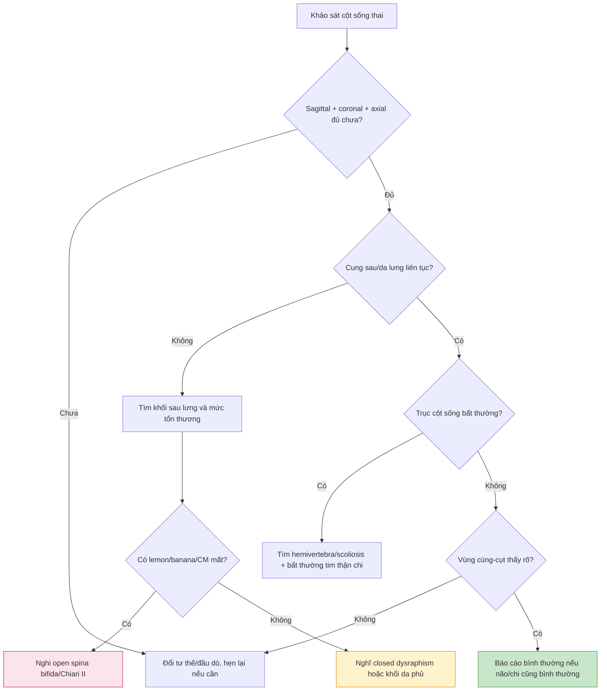

# BÀI HỌC Y KHOA: SIÊU ÂM CỘT SỐNG THAI VÀ DỊ TẬT ỐNG THẦN KINH

**Ngày:** 2026-07-03 | **Chuyên khoa:** Siêu âm sản khoa | **Đối tượng:** Bác sĩ sản phụ khoa / bác sĩ siêu âm thai

> **Phạm vi:** khảo sát cột sống thai, spina bifida, Chiari II, closed spinal dysraphism, sacral agenesis, hemivertebra/scoliosis và bẫy chẩn đoán. Bài này nối tiếp bài Fetal Neurosonography nhưng tập trung vào cột sống và dấu hiệu thần kinh gián tiếp.

---

## 0. TỔNG QUAN - VÌ SAO CỘT SỐNG DỄ BỊ BỎ SÓT?

Cột sống thai dài, cong, phụ thuộc tư thế và thường bị che bởi xương chậu, chi hoặc thành tử cung. Nếu chỉ quét một mặt cắt dọc đẹp rồi kết luận bình thường, bác sĩ có thể bỏ sót tổn thương khu trú, đặc biệt vùng thắt lưng - cùng hoặc closed spinal dysraphism.

Dị tật ống thần kinh là nhóm bệnh có ý nghĩa lớn vì ảnh hưởng vận động, tiết niệu, thần kinh và tư vấn thai kỳ. Open spina bifida thường có dấu hiệu trực tiếp ở cột sống và dấu hiệu gián tiếp ở não. Ngược lại, closed spinal dysraphism có thể không có lemon/banana sign nên khó phát hiện hơn.

**Mục tiêu bài học:**

- Biết khảo sát cột sống ở sagittal, coronal và axial planes.
- Nhận diện dấu hiệu trực tiếp và gián tiếp của open spina bifida.
- Phân biệt myelomeningocele, meningocele, closed dysraphism và sacrococcygeal teratoma.
- Nhận diện sacral agenesis/caudal regression, hemivertebra và scoliosis.
- Biết khi nào chuyển targeted neurosonography, fetal MRI, fetal medicine và tư vấn di truyền.

---

## 1. PHÔI THAI HỌC NGẮN GỌN

### 1.1. Primary và secondary neurulation

`Primary neurulation` tạo ống thần kinh phần não và phần lớn tủy sống. Khi quá trình đóng ống thần kinh thất bại, có thể gây acrania/anencephaly, encephalocele hoặc spina bifida tùy vị trí.

`Secondary neurulation` liên quan phần thấp nhất của tủy sống và vùng cùng-cụt. Bất thường vùng này có thể liên quan closed dysraphism, tethered cord hoặc bất thường caudal.

### 1.2. Folate và neural tube defects

Folate trước thụ thai và đầu thai kỳ làm giảm nguy cơ neural tube defects. ACOG Practice Bulletin về neural tube defects nhấn mạnh vai trò sàng lọc, chẩn đoán và dự phòng bằng folate (PMID: 29189693) [GUIDELINE VERIFIED]. Không nên chờ có thai mới bắt đầu tư vấn folate cho người có kế hoạch mang thai.

### 1.3. Vùng sọ và vùng cột sống liên quan nhau

Open spina bifida vùng cột sống có thể kéo não sau xuống do rò dịch não tủy, tạo Chiari II với banana sign và cisterna magna nhỏ/mất. Vì vậy, nhiều khi bác sĩ phát hiện spina bifida không phải từ cột sống trước, mà từ mặt cắt hố sau bất thường.

---

## 2. GIẢI PHẪU CỘT SỐNG THAI BÌNH THƯỜNG

### 2.1. Ba trung tâm cốt hóa

Trên mặt cắt axial, một đốt sống bình thường có:

- Thân đốt sống phía trước.
- Hai cung sau hai bên.
- Ba điểm cốt hóa tạo hình tam giác quanh ống sống.
- Da lưng phủ liên tục phía sau.

### 2.2. Đường cong cột sống

Trên sagittal, cột sống là một đường cong đều từ cổ đến cùng cụt. Cần thấy đường da lưng phủ liên tục và không có khối thoát vị sau lưng.

### 2.3. Vùng cùng-cụt

Vùng cùng-cụt hay bị bỏ sót vì nằm thấp, gần xương chậu và tư thế thai có thể che. Đây lại là vùng quan trọng cho sacral agenesis, caudal regression, closed dysraphism và sacrococcygeal teratoma.

---

## 3. KỸ THUẬT KHẢO SÁT CỘT SỐNG

### 3.1. Sagittal plane

| Cần thấy | Ý nghĩa |
|---|---|
| Đường cong cột sống đều | Loại trừ gù/vẹo lớn |
| Da lưng liên tục | Tìm open defect hoặc khối sau lưng |
| Vùng cổ - ngực - thắt lưng - cùng | Không bỏ sót tổn thương khu trú |
| Conus/ống sống nếu có điều kiện | Hữu ích khi nghi tethered cord/closed dysraphism |

### 3.2. Coronal plane

Coronal giúp thấy hai hàng cung sau song song và trục cột sống. Đây là mặt cắt quan trọng để tìm hemivertebra, scoliosis, kyphosis và bất đối xứng đốt sống.

### 3.3. Axial plane

Axial là mặt cắt không được bỏ qua. Ở mỗi đoạn nghi ngờ, cần thấy thân đốt phía trước và hai cung sau phía sau tạo tam giác kín. Nếu cung sau tách rộng, mất liên tục hoặc da phía sau hở, phải nghĩ spina bifida.

### 3.4. Bộ ảnh nên lưu

| Ảnh | Mục tiêu |
|---|---|
| Sagittal toàn cột sống | Đường cong và da lưng |
| Coronal toàn cột sống | Trục thẳng, hai hàng cốt hóa |
| Axial cổ/ngực/thắt lưng/cùng | 3 trung tâm cốt hóa và da phủ |
| Hố sau não | Banana sign, cisterna magna |
| Não thất bên | Ventriculomegaly |
| Chi dưới/bàn chân | Clubfoot, giảm vận động |

---

## 4. KHẢO SÁT QUÝ 1

### 4.1. Vì sao quý 1 có thể gợi ý open spina bifida?

Ở 11-13+6 tuần, tổn thương cột sống có thể chưa dễ thấy trực tiếp, nhưng thay đổi hố sau có thể đã xuất hiện. Các marker như intracranial translucency và BS/BSOB ratio được nghiên cứu để tăng phát hiện open spina bifida quý 1. Meta-analysis về BS/BSOB ratio cho first-trimester detection được công bố năm 2020 (PMID: 31875250) [FETCHED].

### 4.2. Giới hạn quý 1

Siêu âm quý 1 không loại trừ được mọi bất thường cột sống, đặc biệt closed dysraphism. Nếu nghi ngờ hoặc khảo sát không đủ, cần hẹn lại quý 2 và/hoặc targeted scan.

### 4.3. Dị tật nặng có thể thấy sớm

Routine ultrasound 11-13 tuần có thể phát hiện nhiều bất thường không do nhiễm sắc thể, đặc biệt dị tật nặng như acrania/exencephaly, abdominal wall defects và một số bất thường CNS/cột sống (Syngelaki 2019, PMID: 31408229) [FETCHED].

---

## 5. KHẢO SÁT QUÝ 2

### 5.1. Ba mặt cắt cột sống là tối thiểu

Ở anatomy scan 18-22 tuần, phải có sagittal, coronal và axial. ISUOG CNS screening guideline nhấn mạnh khảo sát não và cột sống trong screening, đồng thời chỉ định targeted neurosonography khi có bất thường hoặc nghi ngờ (Malinger 2020, PMID: 32870591) [GUIDELINE VERIFIED].

### 5.2. Cột sống không đọc tách khỏi não

Khi nghi tổn thương cột sống, phải quay lại não:

- Transventricular: não thất bên, ventriculomegaly.
- Transthalamic: đường giữa, CSP, đồi thị.
- Transcerebellar: cerebellum, banana sign, cisterna magna.

Targeted neurosonography có vai trò khi screening thấy bất thường CNS/cột sống hoặc có nguy cơ cao; ISUOG Part 2 mô tả cách thực hiện neurosonography chuyên sâu (Paladini 2021, PMID: 33734522) [GUIDELINE VERIFIED].

---

## 6. OPEN SPINA BIFIDA

### 6.1. Định nghĩa thực hành

Open spina bifida là tổn thương hở của cung sau đốt sống và mô thần kinh/màng não, thường không được da che phủ hoàn toàn. Dạng thường gặp nhất trong thực hành tiền sản là myelomeningocele. Review tổng quan về spina bifida của Copp và cộng sự là nguồn nền quan trọng (PMID: 27189655) [FETCHED].

### 6.2. Dấu hiệu trực tiếp

| Dấu hiệu | Ý nghĩa |
|---|---|
| Gián đoạn cung sau | Dấu hiệu cột sống trực tiếp |
| Cung sau mở rộng trên axial | Gợi ý defect ở mức đó |
| Khối sau lưng chứa dịch/mô | Meningocele hoặc myelomeningocele |
| Da lưng không liên tục | Gợi ý open lesion |
| Cột sống cong/gù tại mức tổn thương | Tổn thương lớn hoặc biến dạng kèm |

### 6.3. Dấu hiệu gián tiếp ở não

| Dấu hiệu | Cơ chế |
|---|---|
| Lemon sign | Hình dạng xương trán lõm, thường thấy ở quý 2 |
| Banana sign | Tiểu não bị kéo cong xuống dưới |
| Cisterna magna nhỏ/mất | Hố sau bị kéo xuống do Chiari II |
| Ventriculomegaly | Rối loạn lưu thông dịch não tủy |
| Head shape bất thường | Do áp lực và kéo cấu trúc nội sọ |

### 6.4. Myelomeningocele vs meningocele

| Đặc điểm | Myelomeningocele | Meningocele |
|---|---|---|
| Thành phần túi | Màng não + mô thần kinh/tủy | Chủ yếu màng não + dịch |
| Tổn thương thần kinh | Thường rõ hơn | Có thể ít hơn |
| Chiari II | Hay gặp trong open myelomeningocele | Ít hơn tùy dạng |
| Tiên lượng | Phụ thuộc mức tổn thương, não thất, chi dưới, tiết niệu | Biến thiên, thường nhẹ hơn nếu không có mô thần kinh |

---

## 7. CHIARI II MALFORMATION

Chiari II trong bối cảnh open spina bifida là hậu quả của mất dịch não tủy qua tổn thương cột sống, kéo hố sau xuống. Khi thấy banana sign hoặc cisterna magna bị xóa, phải chủ động tìm tổn thương cột sống, nhất là vùng thắt lưng-cùng.

**Điểm thực hành:** banana sign không phải bệnh riêng. Nó là dấu hiệu gợi ý open spina bifida/Chiari II. Nếu chỉ ghi “tiểu não hình banana” mà không khảo sát cột sống, báo cáo chưa hoàn chỉnh.

---

## 8. CLOSED SPINAL DYSRAPHISM

### 8.1. Vì sao khó?

Closed spinal dysraphism có thể được da che phủ, không có rò dịch não tủy lớn nên không tạo lemon/banana sign rõ. Vì vậy screening quý 2 có thể bỏ sót, đặc biệt nếu tổn thương thấp hoặc nhỏ.

### 8.2. Dấu hiệu gợi ý

- Khối vùng lưng/cùng có da phủ.
- Dày mô mềm vùng lưng.
- Đường da bất thường hoặc lõm da.
- Conus thấp/tethered cord nếu thấy được.
- Không có dấu hiệu hố sau điển hình của open spina bifida.

### 8.3. Vai trò fetal MRI

MRI thai hữu ích khi siêu âm nghi closed dysraphism, khối vùng lưng/cùng, tổn thương khó phân loại hoặc cần đánh giá thêm hệ thần kinh. Review **MRI of the fetal spine** ủng hộ vai trò MRI như công cụ bổ sung cho đánh giá cột sống thai, không thay thế screening siêu âm (Simon 2004, PMID: 15316691) [FETCHED].

---

## 9. SACRAL AGENESIS VÀ CAUDAL REGRESSION

### 9.1. Hình ảnh gợi ý

- Cột sống kết thúc đột ngột.
- Không thấy xương cùng hoặc vùng cùng-cụt ngắn bất thường.
- Chi dưới tư thế bất thường, giảm vận động.
- Clubfoot hoặc biến dạng chi dưới.
- Có thể kèm bất thường tiết niệu, tiêu hóa, hậu môn-trực tràng.

### 9.2. Liên quan đái tháo đường mẹ

Caudal regression có liên quan mạnh với đái tháo đường mẹ trước thai kỳ. Khi thấy thiếu xương cùng hoặc bất thường caudal, cần hỏi bệnh sử mẹ, kiểm tra thận-bàng quang, tim, chi dưới và hậu môn-trực tràng nếu có thể.

### 9.3. Phân biệt với sirenomelia

Sirenomelia thường nặng hơn, có bất thường chi dưới dính, bất thường mạch máu, tiết niệu nặng và tiên lượng rất xấu. Không nên dùng hai thuật ngữ thay thế nhau nếu chưa đủ hình ảnh.

---

## 10. HEMIVERTEBRA, SCOLIOSIS VÀ KYPHOSIS

### 10.1. Hemivertebra

Hemivertebra là một phần đốt sống phát triển không đầy đủ, tạo đốt sống hình chêm và làm lệch trục cột sống. Coronal plane rất hữu ích để nhận diện mất đối xứng hai hàng cốt hóa.

### 10.2. Khi thấy vẹo/gù cột sống

Không dừng ở cột sống. Cần tìm:

- Tim bẩm sinh.
- Bất thường thận/tiết niệu.
- Bất thường hậu môn-trực tràng.
- Bất thường chi.
- Bất thường thành bụng.

Pattern vertebral + anal + cardiac + tracheoesophageal + renal + limb gợi ý VACTERL association.

---

## 11. KHỐI VÙNG LƯNG - CÙNG CỤT

### 11.1. Phân biệt chính

| Chẩn đoán | Gợi ý siêu âm |
|---|---|
| Myelomeningocele | Khuyết cung sau + túi sau lưng + dấu hiệu Chiari II |
| Meningocele | Túi dịch sau lưng, ít mô đặc hơn |
| Closed dysraphism | Khối da phủ, hố sau có thể bình thường |
| Sacrococcygeal teratoma | Khối cùng cụt, đặc/nang hỗn hợp, có thể tăng sinh mạch |
| Hemangioma/lymphangioma | Khối mô mềm, Doppler tùy loại |

### 11.2. Vai trò Doppler

Nếu khối cùng cụt có phần đặc và tăng sinh mạch, phải nghĩ sacrococcygeal teratoma vì nguy cơ high-output cardiac failure/hydrops. Myelomeningocele thường không phải khối tăng sinh mạch kiểu u.

---

## 12. LIÊN HỆ CHI DƯỚI VÀ BÀN CHÂN

Clubfoot có thể isolated, nhưng cũng có thể là dấu hiệu của spina bifida, arthrogryposis, T18 hoặc bất thường thần kinh-cơ. Khi thấy clubfoot, đặc biệt hai bên hoặc kèm giảm vận động chi dưới, phải quay lại kiểm tra cột sống, hố sau não và cử động chi.

**Câu nhớ:** bàn chân khoèo không chỉ là bàn chân; trong anatomy scan, nó là lời nhắc kiểm tra lại não - cột sống - chi.

---

## 13. LIÊN HỆ DI TRUYỀN VÀ HỘI CHỨNG

| Pattern | Nghĩ đến |
|---|---|
| Open spina bifida isolated | NTD đa yếu tố, vẫn cần khảo sát toàn thân |
| Spinal defect + omphalocele + bladder exstrophy | OEIS complex |
| Vertebral anomaly + renal + cardiac + limb | VACTERL association |
| Sacral agenesis + mẹ đái tháo đường | Caudal regression |
| Encephalocele + thận nang + polydactyly | Meckel-Gruber/ciliopathy |

Nếu bất thường cột sống không isolated, cần tư vấn di truyền và cân nhắc karyotype/CMA tùy bối cảnh lâm sàng, screening và bất thường kèm.

---

## 14. FETAL SURGERY CHO MYELOMENINGOCELE

MOMS trial so sánh prenatal repair với postnatal repair cho myelomeningocele là nghiên cứu nền tảng (Adzick 2011, PMID: 21306277) [FETCHED]. Prenatal repair có thể giảm nhu cầu shunt và cải thiện một số kết cục thần kinh/vận động ở nhóm chọn lọc, nhưng đi kèm nguy cơ mẹ-thai như sinh non, vỡ ối và sẹo tử cung.

Review gần đây về fetal repair of neural tube defects nhấn mạnh đây là can thiệp trung tâm chuyên sâu, cần chọn lọc kỹ và tư vấn đa chuyên khoa (Lee 2022, PMID: 36328602) [FETCHED]. Không nên tư vấn fetal surgery như “điều trị chuẩn cho mọi spina bifida”.

---

## 15. KHI NÀO CHUYỂN TUYẾN?

Chuyển targeted neurosonography/fetal medicine khi có:

- Nghi khuyết cung sau hoặc khối sau lưng.
- Lemon sign, banana sign, cisterna magna nhỏ/mất.
- Ventriculomegaly kèm nghi Chiari II.
- Clubfoot hai bên hoặc giảm vận động chi dưới.
- Khối vùng lưng/cùng cụt.
- Không thấy xương cùng hoặc nghi caudal regression.
- Scoliosis/hemivertebra, đặc biệt nếu kèm tim/thận/chi.
- Nghi closed dysraphism cần fetal MRI.
- Bất thường cột sống kèm bất thường ngoài hệ thần kinh.

---

## 16. LƯU ĐỒ QUYẾT ĐỊNH

---

## 17. MẪU BÁO CÁO

### 17.1. Bình thường

Cột sống thai khảo sát trên các mặt cắt dọc, ngang và vành. Đường cong cột sống đều, các trung tâm cốt hóa hai bên đối xứng, da lưng liên tục. Không ghi nhận khối vùng lưng/cùng cụt. Hố sau não và não thất bên trong giới hạn khảo sát.

### 17.2. Nghi open spina bifida

Tại vùng ... ghi nhận gián đoạn cung sau đốt sống/khuyết da lưng, có khối dạng túi sau lưng kích thước ... Hố sau có hình ảnh ... (banana sign/cisterna magna nhỏ hoặc mất), não thất bên ... Hình ảnh nghi open spina bifida/myelomeningocele. Đề nghị chuyển targeted neurosonography/fetal medicine để đánh giá mức tổn thương, bất thường kèm và tư vấn.

### 17.3. Nghi closed dysraphism

Vùng ... ghi nhận khối/mô mềm sau lưng có da phủ, chưa thấy dấu hiệu Chiari II rõ trên hố sau. Hình ảnh gợi ý closed spinal dysraphism/khối vùng lưng cần phân biệt. Đề nghị targeted scan và cân nhắc fetal MRI.

### 17.4. Nghi hemivertebra/scoliosis

Cột sống thai có lệch trục vùng ..., nghi bất thường hình thành đốt sống/hemivertebra. Đề nghị khảo sát chuyên sâu tim, thận, chi và các bất thường kèm; tư vấn di truyền tùy bối cảnh.

### 17.5. Nghi sacral agenesis

Vùng cùng-cụt khó thấy/không thấy rõ cấu trúc xương cùng, cột sống kết thúc cao/bất thường. Chi dưới ... Thận-bàng quang ... Hình ảnh nghi sacral agenesis/caudal regression. Đề nghị chuyển tuyến chuyên sâu.

---

## 18. SAI LẦM THƯỜNG GẶP

| # | Sai lầm | Hậu quả | Cách tránh |
|---|---|---|---|
| 1 | Chỉ nhìn sagittal, bỏ axial | Bỏ sót khuyết cung sau khu trú | Luôn quét 3 planes |
| 2 | Không kiểm tra da lưng | Bỏ sót open lesion | Đánh giá da phủ liên tục |
| 3 | Thấy banana sign nhưng không tìm cột sống | Báo cáo thiếu chẩn đoán nguyên nhân | Quay lại toàn bộ cột sống |
| 4 | Thấy clubfoot nhưng không kiểm tra CNS/spine | Bỏ sót NTD | Kiểm tra não, hố sau, cột sống |
| 5 | Nhầm SCT với myelomeningocele | Tư vấn sai | Xem khuyết xương, thành phần khối, Doppler |
| 6 | Kết luận bình thường khi vùng cùng-cụt chưa thấy | Bỏ sót sacral agenesis/closed dysraphism | Ghi hạn chế và hẹn lại |
| 7 | Tư vấn fetal surgery cho mọi ca | Gây kỳ vọng sai | Chỉ nói là lựa chọn chọn lọc ở trung tâm chuyên sâu |

---

## 19. TIPS THỰC HÀNH

1. Cột sống bình thường phải được thấy ở sagittal, coronal và axial planes.
2. Axial plane là chìa khóa để thấy ba trung tâm cốt hóa và khuyết cung sau.
3. Open spina bifida thường để lại dấu vết ở hố sau: banana sign, cisterna magna nhỏ/mất.
4. Closed dysraphism có thể không có dấu hiệu não gián tiếp.
5. Khi thấy ventriculomegaly + hố sau bất thường, hãy tìm tổn thương cột sống.
6. Khi thấy clubfoot, hãy kiểm tra cột sống trước khi gọi isolated.
7. Khối cùng cụt tăng sinh mạch nghĩ đến SCT hơn là meningocele.
8. Hemivertebra nên kéo theo khảo sát tim, thận và chi.
9. Vùng cùng-cụt phải được ghi rõ nếu khảo sát hạn chế.
10. Fetal MRI là công cụ bổ sung khi siêu âm không phân loại được tổn thương.

---

## 20. TỔNG KẾT

1. Khảo sát cột sống thai cần ba mặt cắt: sagittal, coronal và axial.
2. Open spina bifida có dấu hiệu trực tiếp ở cột sống và dấu hiệu gián tiếp ở não.
3. Lemon sign, banana sign và cisterna magna nhỏ/mất là lời nhắc phải tìm tổn thương cột sống.
4. Myelomeningocele thường nặng hơn meningocele vì có mô thần kinh trong túi.
5. Closed spinal dysraphism khó hơn vì có thể không có Chiari II rõ.
6. Sacral agenesis/caudal regression cần đánh giá chi dưới, tiết niệu và tiền sử đái tháo đường mẹ.
7. Hemivertebra/scoliosis cần tìm bất thường tim-thận-chi và nghĩ VACTERL nếu có pattern.
8. Khối vùng cùng cụt phải phân biệt NTD với sacrococcygeal teratoma.
9. Prenatal repair myelomeningocele là lựa chọn chọn lọc, không phải mặc định cho mọi ca.
10. Báo cáo tốt phải nêu mức tổn thương, dấu hiệu não kèm, chi dưới, nước ối và khuyến nghị chuyển tuyến.

---

## 21. TÀI LIỆU THAM KHẢO

1. **Malinger G et al. (2020)** "ISUOG Practice Guidelines (updated): sonographic examination of the fetal central nervous system. Part 1: performance of screening examination and indications for targeted neurosonography." *Ultrasound in Obstetrics & Gynecology.* PMID: **32870591**. DOI: 10.1002/uog.22145. [GUIDELINE VERIFIED]
2. **Paladini D et al. (2021)** "ISUOG Practice Guidelines (updated): sonographic examination of the fetal central nervous system. Part 2: performance of targeted neurosonography." *Ultrasound in Obstetrics & Gynecology.* PMID: **33734522**. DOI: 10.1002/uog.23616. [GUIDELINE VERIFIED]
3. **Copp AJ et al. (2015)** "Spina bifida." *Nature Reviews Disease Primers.* PMID: **27189655**. DOI: 10.1038/nrdp.2015.7. [FETCHED]
4. **ACOG (2017)** "Practice Bulletin No. 187: Neural Tube Defects." *Obstetrics & Gynecology.* PMID: **29189693**. DOI: 10.1097/AOG.0000000000002412. [GUIDELINE VERIFIED]
5. **Adzick NS et al.; MOMS Investigators (2011)** "A randomized trial of prenatal versus postnatal repair of myelomeningocele." *New England Journal of Medicine.* PMID: **21306277**. DOI: 10.1056/NEJMoa1014379. [FETCHED]
6. **Bulas D (2010)** "Fetal evaluation of spine dysraphism." *Pediatric Radiology.* PMID: **20432022**. DOI: 10.1007/s00247-010-1583-0. [FETCHED]
7. **Sirico A et al. (2020)** "First trimester detection of fetal open spina bifida using BS/BSOB ratio." *Archives of Gynecology and Obstetrics.* PMID: **31875250**. DOI: 10.1007/s00404-019-05422-3. [FETCHED]
8. **Simon EM (2004)** "MRI of the fetal spine." *Pediatric Radiology.* PMID: **15316691**. DOI: 10.1007/s00247-004-1245-1. [FETCHED]
9. **Lee SY et al. (2022)** "Fetal Repair of Neural Tube Defects." *Clinics in Perinatology.* PMID: **36328602**. DOI: 10.1016/j.clp.2022.06.004. [FETCHED]
10. **Syngelaki A et al. (2019)** "Diagnosis of fetal non-chromosomal abnormalities on routine ultrasound examination at 11-13 weeks' gestation." *Ultrasound in Obstetrics & Gynecology.* PMID: **31408229**. DOI: 10.1002/uog.20844. [FETCHED]
11. **Trudell AS, Odibo AO (2014)** "Diagnosis of spina bifida on ultrasound: always termination?" *Best Practice & Research Clinical Obstetrics & Gynaecology.* PMID: **24373566**. DOI: 10.1016/j.bpobgyn.2013.10.006. [FETCHED]
