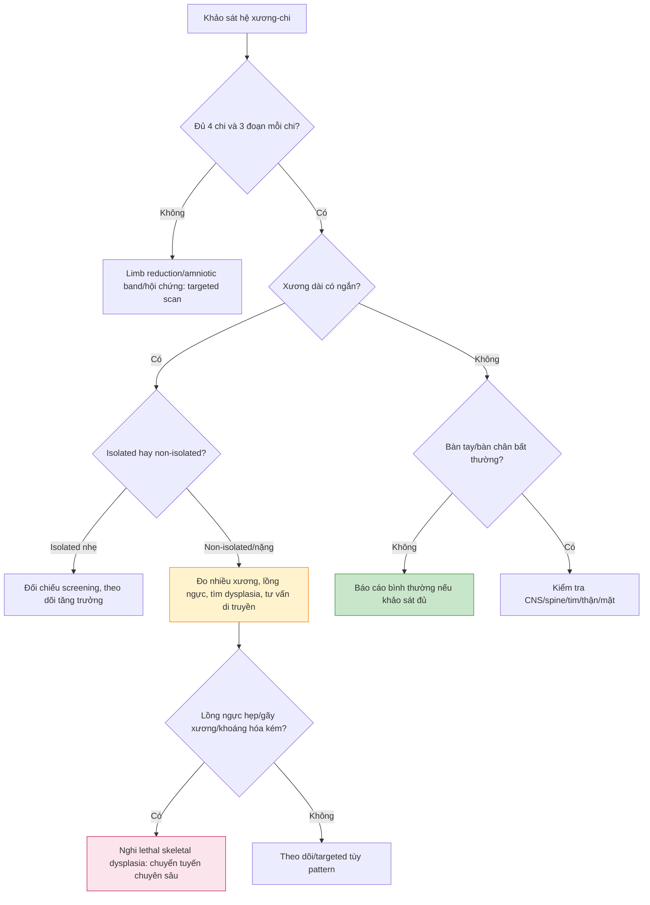

# BÀI HỌC Y KHOA: SIÊU ÂM HỆ XƯƠNG VÀ CHI THAI

**Ngày:** 2026-07-03 | **Chuyên khoa:** Siêu âm sản khoa | **Đối tượng:** Bác sĩ sản phụ khoa / bác sĩ siêu âm thai

> **Phạm vi:** khảo sát 4 chi, xương dài, bàn tay-bàn chân, dấu hiệu soft marker, limb reduction, amniotic band và skeletal dysplasia. Bài này không phải atlas tất cả loạn sản xương hiếm; mục tiêu là quy trình đọc hình thái thực hành và biết khi nào cần chuyển tuyến.

---

## 0. TỔNG QUAN - VÌ SAO KHÔNG ĐƯỢC CHỈ ĐO FL?

Trong anatomy scan, hệ xương-chi thường bị rút gọn thành “đo femur length”. Đây là sai lầm. Đo FL chỉ trả lời một phần rất nhỏ: xương đùi dài bao nhiêu. Nó không trả lời đủ các câu hỏi quan trọng hơn: có đủ 4 chi không, mỗi chi có đủ 3 đoạn không, xương có cong/gãy/giảm khoáng hóa không, bàn tay có mở không, bàn chân có cố định bất thường không, lồng ngực có hẹp không.

Bất thường hệ xương-chi có thể là soft marker nhẹ, dị tật cấu trúc isolated, hoặc biểu hiện của hội chứng/loạn sản xương nặng. Vì vậy cách đọc đúng là đọc theo pattern, không học thuộc tên bệnh trước.

**Mục tiêu bài học:**

- Khảo sát 4 chi và 3 đoạn mỗi chi theo trình tự cố định.
- Phân biệt short femur/humerus isolated với bất thường xương đáng lo.
- Nhận diện clubfoot, clenched hands, polydactyly, limb reduction và amniotic band.
- Biết dấu hiệu gợi ý lethal skeletal dysplasia.
- Viết báo cáo và quyết định khi nào cần targeted scan/genetic counseling.

---

## 1. PHÁT TRIỂN XƯƠNG VÀ CHI - CẦN NHỚ GÌ?

### 1.1. Limb buds và phân đoạn chi

Chi thai phát triển theo trục gần-xa. Về mặt thực hành, mỗi chi cần được xác nhận có 3 đoạn:

- Chi trên: cánh tay, cẳng tay, bàn tay.
- Chi dưới: đùi, cẳng chân, bàn chân.

Không chỉ ghi “thấy chi”. Phải thấy đủ đoạn chi nếu điều kiện cho phép.

### 1.2. Endochondral ossification

Phần lớn xương dài phát triển qua sụn rồi cốt hóa. Rối loạn sụn, collagen hoặc khoáng hóa có thể tạo pattern:

- Xương ngắn.
- Xương cong.
- Gãy xương.
- Giảm hồi âm/khoáng hóa kém.
- Lồng ngực hẹp.

Guideline về prenatal diagnosis of fetal skeletal dysplasias nhấn mạnh tiếp cận theo pattern hình ảnh, đặc biệt phân biệt lethal và non-lethal dysplasia để tư vấn và lập kế hoạch sau sinh (Krakow 2009, PMID: 19265753) [GUIDELINE VERIFIED].

---

## 2. KỸ THUẬT KHẢO SÁT HỆ XƯƠNG-CHI

### 2.1. Trình tự thực hành

1. Xác nhận 4 chi.
2. Với mỗi chi, xác nhận 3 đoạn.
3. Đo femur length và nếu nghi bất thường, đo thêm humerus, tibia/fibula, radius/ulna.
4. Đánh giá hình dạng xương: thẳng, cong, gãy, khoáng hóa.
5. Đánh giá bàn tay: mở hay nắm, số ngón nếu thấy được.
6. Đánh giá bàn chân: tư thế, góc với cẳng chân, cố định hay linh hoạt.
7. Đánh giá cử động chi.
8. Nếu xương ngắn rõ hoặc nghi dysplasia: đánh giá lồng ngực, đầu, mặt, cột sống, tim, thận và nước ối.

### 2.2. Bộ ảnh nên lưu

| Ảnh | Mục tiêu |
|---|---|
| Femur length | Sinh trắc cơ bản |
| Humerus | Soft marker/dysplasia nếu nghi |
| Cẳng tay/cẳng chân | Radius-ulna, tibia-fibula có đủ không |
| Bàn tay | Mở/nắm, ngón, polydactyly/syndactyly |
| Bàn chân | Clubfoot, rocker-bottom, tư thế cố định |
| Lồng ngực | Hẹp hay không khi nghi lethal dysplasia |
| Cột sống | Hemivertebra, scoliosis, NTD liên quan clubfoot |

---

## 3. CHECKLIST BÌNH THƯỜNG

| Thành phần | Bình thường | Ghi chú |
|---|---|---|
| 4 chi | Thấy đủ hai tay hai chân | Nếu tư thế che, ghi hạn chế |
| 3 đoạn mỗi chi | Cánh tay-cẳng tay-bàn tay; đùi-cẳng chân-bàn chân | Không chỉ ghi “có chi” |
| Xương dài | Thẳng, hồi âm tốt, không gãy | So với tuổi thai |
| Bàn tay | Có lúc mở, các ngón tách nếu thấy được | Nắm tay tạm thời có thể bình thường |
| Bàn chân | Tư thế linh hoạt, không cố định lệch | Phân biệt clubfoot thật và tư thế |
| Lồng ngực | Không hẹp rõ, tim không chiếm quá lớn do thorax nhỏ | Rất quan trọng trong dysplasia |
| Vận động | Cử động hai bên tương đối đối xứng | Giảm vận động gợi ý thần kinh-cơ/NTD |

---

## 4. SINH TRẮC XƯƠNG DÀI

### 4.1. Femur length

FL là chỉ số sinh trắc chuẩn, nhưng chỉ có giá trị khi đo đúng:

- Mặt cắt dọc thân xương đùi.
- Xương nằm ngang màn hình càng tốt.
- Đo phần cốt hóa, không bao gồm đầu sụn.
- Không đo khi xương bị cắt xiên.

### 4.2. Khi nào đo thêm xương khác?

Đo thêm humerus, tibia/fibula, radius/ulna khi:

- FL ngắn rõ hoặc lệch so với các chỉ số khác.
- Nghi skeletal dysplasia.
- Có clubfoot, limb reduction, bàn tay bất thường.
- Có lồng ngực hẹp hoặc đầu to tương đối.
- Có bất thường nhiều hệ cơ quan.

### 4.3. Disproportion

| Kiểu ngắn chi | Vùng ảnh hưởng | Gợi ý |
|---|---|---|
| Rhizomelia | Đoạn gần: humerus/femur | Achondroplasia/thanatophoric pattern |
| Mesomelia | Đoạn giữa: radius-ulna/tibia-fibula | Một số dysplasia hoặc limb deficiency |
| Acromelia | Bàn tay/bàn chân | Một số hội chứng xương hiếm |
| Toàn bộ chi | Nhiều đoạn ngắn | Dysplasia nặng, FGR hoặc hội chứng |

---

## 5. SHORT FEMUR VÀ SHORT HUMERUS

### 5.1. Đừng kết luận quá sớm

Short femur/humerus có nhiều nguyên nhân:

- Sai tuổi thai hoặc đo sai.
- Constitutional short stature.
- FGR/SGA.
- Soft marker lệch bội.
- Skeletal dysplasia.
- Hội chứng di truyền.

SMFM Consult Series #57 xem shortened humerus/femur là soft marker cần xử trí theo bối cảnh screening lệch bội và tình trạng isolated hay non-isolated (Prabhu 2021, PMID: 34171388) [GUIDELINE VERIFIED].

### 5.2. Isolated vs non-isolated

| Bối cảnh | Cách nghĩ |
|---|---|
| Short femur nhẹ, anatomy còn lại bình thường, screening âm tính | Thường theo dõi tăng trưởng và không vội quy chụp dysplasia |
| Short femur + AC nhỏ/Doppler bất thường | Nghĩ FGR/placental insufficiency |
| Short femur + humerus ngắn + xương cong/gãy | Nghĩ skeletal dysplasia |
| Short femur + tim/thận/mặt/chi bất thường | Nghĩ hội chứng/genetic condition |
| Short femur rất nặng hoặc tiến triển | Chuyển fetal medicine/genetic counseling |

### 5.3. Vai trò xét nghiệm di truyền

Ở thai có short long bones, đặc biệt non-isolated hoặc nghi skeletal dysplasia, xét nghiệm di truyền nâng cao có thể tăng khả năng tìm nguyên nhân sau karyotype/CMA. Nghiên cứu về exome sequencing trong thai có short long bones cho thấy nhóm này có căn nguyên di truyền đa dạng và cần phenotyping siêu âm kỹ (Huang 2023, PMID: 36923788) [FETCHED].

---

## 6. BOWING, FRACTURE VÀ MINERALIZATION

### 6.1. Xương cong

Xương cong có thể gặp trong campomelic dysplasia, thanatophoric dysplasia, osteogenesis imperfecta hoặc một số dysplasia khác. Cần phân biệt cong thật với mặt cắt xiên hoặc tư thế thai.

### 6.2. Gãy xương trong tử cung

Gãy nhiều xương hoặc xương biến dạng nhiều gợi ý bệnh xương nặng, đặc biệt osteogenesis imperfecta thể nặng. Cần tìm:

- Xương dài gãy/biến dạng nhiều nơi.
- Xương sọ khoáng hóa kém, dễ bị nén.
- Lồng ngực hẹp.
- Xương sườn bất thường.

### 6.3. Poor mineralization

Khoáng hóa kém làm xương giảm hồi âm, khó thấy rõ đường xương, xương sọ có thể bị nén bởi đầu dò. Đây là dấu hiệu đáng lo hơn short femur nhẹ isolated.

---

## 7. BÀN TAY THAI

### 7.1. Bàn tay mở hay nắm?

Thai có thể nắm tay tạm thời. Điều đáng lo là bàn tay nắm chặt kéo dài, đặc biệt nếu kèm overlapping fingers, cổ tay gập, giảm vận động hoặc bất thường hệ khác.

### 7.2. Clenched hands và overlapping fingers

Pattern bàn tay nắm chặt, ngón chồng lên nhau gợi ý trisomy 18 hoặc arthrogryposis/hội chứng thần kinh-cơ. Khi thấy dấu hiệu này, cần khảo sát tim, CNS, mặt, tăng trưởng và các soft markers khác.

### 7.3. Polydactyly và syndactyly

Polydactyly có thể isolated, nhưng nếu kèm thận nang, encephalocele, bất thường tim hoặc FGR, cần nghĩ ciliopathy/Meckel-Gruber, trisomy 13 hoặc hội chứng di truyền.

---

## 8. BÀN CHÂN THAI

### 8.1. Clubfoot/talipes

Clubfoot là tư thế bàn chân cố định lệch so với cẳng chân. Cần phân biệt với bàn chân áp tạm thời vào thành tử cung. Nếu nghi clubfoot, nên quan sát nhiều thời điểm và nhiều mặt cắt.

### 8.2. Isolated clubfoot không đồng nghĩa tiên lượng xấu

Systematic review/meta-analysis về isolated fetal talipes cho thấy chẩn đoán trước sinh cần follow-up vì một số ca sau đó phát hiện bất thường kèm hoặc chẩn đoán không còn isolated (Di Mascio 2019, PMID: 31034582) [FETCHED]. Điểm thực hành: gọi isolated chỉ sau khi anatomy scan chi tiết không thấy bất thường khác.

### 8.3. Khi thấy clubfoot phải kiểm tra gì?

- Cột sống và hố sau: spina bifida/Chiari II.
- Cử động chi dưới: thần kinh-cơ/arthrogryposis.
- Bàn tay: clenched hands.
- Tim, thận, mặt.
- Nước ối và tăng trưởng.

### 8.4. Rocker-bottom foot

Rocker-bottom foot/vertical talus khác clubfoot. Nó gợi ý mạnh hơn đến hội chứng hoặc lệch bội, đặc biệt khi kèm clenched hands, FGR hoặc dị tật tim.

---

## 9. LIMB REDUCTION VÀ AMNIOTIC BAND

### 9.1. Limb reduction

Limb reduction có thể là:

- Amelia: không có chi.
- Phocomelia: chi rất ngắn, bàn tay/chân gần thân.
- Radial ray defect: thiếu/bất thường bán kính, bàn tay lệch.
- Thiếu tibia/fibula/ulna.
- Bất thường một bên hoặc hai bên.

### 9.2. Amniotic band sequence

Amniotic band có thể gây vòng thắt, phù đoạn xa, dị tật không đối xứng hoặc cắt cụt chi. Bất thường thường không theo pattern di truyền đối xứng. Review/update về fetoscopic release cho amniotic band nhấn mạnh đây là tình trạng hiếm và can thiệp chỉ dành cho ca chọn lọc ở trung tâm chuyên sâu (Minella 2021, PMID: 32951245) [FETCHED].

### 9.3. Limb anomaly không chỉ là chuyện chỉnh hình

Nghiên cứu về spectrum of fetal limb anomalies cho thấy bất thường chi có thể isolated hoặc đi kèm VACTERL, OEIS, trisomy 18, Fanconi anemia và nhiều nguyên nhân khác; do đó cần đánh giá toàn thân và di truyền khi non-isolated (Thakur 2023, PMID: 36639848) [FETCHED].

---

## 10. SKELETAL DYSPLASIA - CÁCH TIẾP CẬN THEO PATTERN

### 10.1. Đọc theo 7 câu hỏi

1. Xương nào ngắn: femur/humerus hay tất cả xương dài?
2. Ngắn mức độ nhẹ hay rất nặng?
3. Ngắn đoạn gần, đoạn giữa hay toàn bộ?
4. Xương có cong/gãy không?
5. Khoáng hóa có giảm không?
6. Lồng ngực có hẹp không?
7. Có bất thường đầu, mặt, cột sống, tim, thận, bàn tay/bàn chân không?

### 10.2. Dấu hiệu gợi ý lethal skeletal dysplasia

| Dấu hiệu | Vì sao quan trọng |
|---|---|
| Lồng ngực hẹp | Tiên lượng xấu do pulmonary hypoplasia |
| Xương dài rất ngắn | Gợi ý dysplasia nặng |
| Gãy xương nhiều | Gợi ý OI type II hoặc bệnh khoáng hóa nặng |
| Poor mineralization | Gợi ý bệnh xương nặng |
| Xương sườn ngắn/lồng ngực nhỏ | Giảm phát triển phổi |
| Đầu to tương đối | Một số dysplasia như thanatophoric/achondroplasia spectrum |

### 10.3. Một số pattern bệnh cần nhớ

| Bệnh/pattern | Gợi ý siêu âm |
|---|---|
| Thanatophoric dysplasia | Xương dài rất ngắn, có thể cong, lồng ngực hẹp, đầu to |
| Osteogenesis imperfecta type II | Gãy nhiều xương, khoáng hóa kém, biến dạng xương |
| Achondrogenesis | Xương rất ngắn, khoáng hóa kém, phù/hydrops có thể gặp |
| Campomelic dysplasia | Bowing xương dài, đặc biệt xương chày/đùi, bất thường giới tính có thể kèm |
| Short-rib polydactyly | Xương sườn ngắn, lồng ngực hẹp, polydactyly |
| Jeune syndrome | Lồng ngực hẹp, chi ngắn mức độ thay đổi |
| Arthrogryposis | Khớp cố định, giảm vận động, bàn tay/chân bất thường |

---

## 11. SOFT MARKERS VÀ LỆCH BỘI

| Dấu hiệu | Liên quan cần nghĩ | Cách xử trí |
|---|---|---|
| Short femur/humerus | T21 marker, FGR, dysplasia | Đối chiếu screening và anatomy chi tiết |
| Clenched hands/overlapping fingers | T18, arthrogryposis | Tìm dị tật kèm, tư vấn di truyền |
| Polydactyly | T13, ciliopathy, Meckel-Gruber | Tìm thận/CNS/tim |
| Rocker-bottom foot | T18/hội chứng | Không gọi isolated khi chưa khảo sát toàn thân |
| Radial ray defect | T18, VACTERL, Fanconi/TAR spectrum | Khảo sát tim-thận-huyết học sau sinh/tư vấn di truyền |

Nguyên tắc: soft marker isolated sau screening âm tính khác hoàn toàn structural anomaly non-isolated. Đừng tư vấn quá mức khi chỉ có một marker nhẹ isolated, nhưng cũng đừng bỏ qua pattern nhiều dấu hiệu.

---

## 12. LIÊN HỆ CÁC CƠ QUAN KHÁC

Khi thấy bất thường xương-chi, phải quay lại khảo sát:

- **Cột sống:** spina bifida, hemivertebra, scoliosis.
- **Não/hố sau:** ventriculomegaly, Chiari II nếu clubfoot.
- **Mặt:** micrognathia, cleft, frontal bossing.
- **Tim:** CHD trong hội chứng.
- **Thận:** CAKUT, thận nang, Meckel-Gruber/ciliopathy.
- **Lồng ngực:** hẹp trong lethal skeletal dysplasia.
- **Nước ối:** đa ối nếu giảm nuốt/cử động, thiểu ối nếu thận kèm.

---

## 13. KHI NÀO CHUYỂN TUYẾN?

Chuyển fetal medicine/targeted scan/genetic counseling khi có:

- Xương dài rất ngắn hoặc ngắn tiến triển.
- Nhiều xương dài ngắn cùng lúc.
- Bowing, fracture, poor mineralization.
- Lồng ngực hẹp hoặc nghi pulmonary hypoplasia.
- Clubfoot hai bên hoặc clubfoot kèm CNS/spine/giảm vận động.
- Clenched hands cố định hoặc overlapping fingers.
- Polydactyly kèm thận/CNS/tim.
- Limb reduction, radial ray defect hoặc amniotic band nghi cắt cụt.
- Bất thường xương-chi kèm dị tật cơ quan khác.
- Nghi skeletal dysplasia hoặc hội chứng di truyền.

---

## 14. LƯU ĐỒ QUYẾT ĐỊNH

---

## 15. MẪU BÁO CÁO

### 15.1. Bình thường

Khảo sát hệ xương-chi thai: thấy đủ bốn chi, mỗi chi khảo sát được ba đoạn chính. Xương dài có hình dạng và khoáng hóa phù hợp, không thấy gãy/cong bất thường. Bàn tay/bàn chân khảo sát trong giới hạn điều kiện hiện tại, chưa ghi nhận bất thường tư thế cố định. Cử động chi thấy hai bên.

### 15.2. Short femur isolated

Chiều dài xương đùi thấp hơn kỳ vọng so với tuổi thai. Các sinh trắc khác ..., hình dạng xương và khoáng hóa bảo tồn, không thấy cong/gãy xương, lồng ngực không hẹp rõ, chưa ghi nhận bất thường hình thái kèm trong phạm vi khảo sát. Hình ảnh hiện tại gợi ý short femur isolated; đề nghị đối chiếu tuổi thai, screening lệch bội và theo dõi tăng trưởng.

### 15.3. Clubfoot

Bàn chân phải/trái/hai bên có tư thế lệch cố định so với cẳng chân, gợi ý talipes/clubfoot. Đề nghị khảo sát lại cột sống, hố sau não, vận động chi dưới và các bất thường kèm; nếu isolated sau khảo sát chi tiết, tư vấn theo dõi và đánh giá sau sinh.

### 15.4. Nghi skeletal dysplasia

Nhiều xương dài ngắn rõ so với tuổi thai, có/không cong/gãy xương, khoáng hóa ..., lồng ngực ... Hình ảnh nghi skeletal dysplasia. Đề nghị chuyển fetal medicine để đo hệ thống xương, đánh giá lồng ngực, tìm bất thường kèm và tư vấn di truyền.

### 15.5. Limb reduction/amniotic band

Chi ... ghi nhận thiếu đoạn .../vòng thắt .../phù đoạn xa ..., hình ảnh gợi ý limb reduction/amniotic band sequence. Đề nghị khảo sát toàn thân, Doppler nếu cần, và chuyển tuyến chuyên sâu.

---

## 16. SAI LẦM THƯỜNG GẶP

| # | Sai lầm | Hậu quả | Cách tránh |
|---|---|---|---|
| 1 | Chỉ đo FL rồi bỏ qua tay/chân | Bỏ sót limb anomaly | Luôn kiểm 4 chi, 3 đoạn |
| 2 | Gọi clubfoot khi bàn chân chỉ tì tạm thời | Dương tính giả | Quan sát nhiều mặt cắt/thời điểm |
| 3 | Short femur nhẹ isolated bị tư vấn quá mức | Gây lo lắng không cần thiết | Đối chiếu screening và anatomy |
| 4 | Nghi dysplasia nhưng không nhìn lồng ngực | Bỏ sót lethal pattern | Luôn đánh giá thorax |
| 5 | Không tìm fracture/mineralization | Bỏ sót OI/hypophosphatasia | Nhìn hồi âm xương và biến dạng |
| 6 | Thấy clubfoot nhưng không kiểm tra cột sống | Bỏ sót NTD | Quay lại spine/hố sau |
| 7 | Thấy polydactyly nhưng không kiểm tra thận/CNS | Bỏ sót ciliopathy | Khảo sát toàn thân |
| 8 | Gọi isolated quá sớm | Tư vấn sai | Isolated chỉ sau detailed scan đầy đủ |

---

## 17. TIPS THỰC HÀNH

1. “Có chi” chưa đủ; phải có 4 chi, 3 đoạn, bàn tay-bàn chân và vận động.
2. FL ngắn nhẹ isolated không đồng nghĩa skeletal dysplasia.
3. Dấu hiệu đáng lo là xương rất ngắn, nhiều xương ngắn, cong/gãy, khoáng hóa kém hoặc lồng ngực hẹp.
4. Lồng ngực quyết định tiên lượng trong nhiều lethal skeletal dysplasia vì nguy cơ pulmonary hypoplasia.
5. Clubfoot phải kéo theo kiểm tra cột sống và hố sau.
6. Bàn tay nắm chặt kéo dài không phải tư thế bình thường nếu lặp lại và kèm overlapping fingers.
7. Polydactyly + thận nang/CNS bất thường là pattern hội chứng cho đến khi chứng minh ngược lại.
8. Amniotic band thường không đối xứng và có thể tạo vòng thắt/cắt cụt.
9. Khi nghi dysplasia, đo nhiều xương và mô tả pattern thay vì chỉ ghi “xương ngắn”.
10. Báo cáo nên nêu isolated hay non-isolated, vì đây là điểm đổi xử trí.

---

## 18. TỔNG KẾT

1. Khảo sát hệ xương-chi không dừng ở femur length.
2. Anatomy scan phải xác nhận 4 chi, 3 đoạn mỗi chi, bàn tay-bàn chân và vận động.
3. Short femur/humerus là soft marker khi isolated, nhưng là dấu hiệu đáng lo khi non-isolated hoặc tiến triển.
4. Bowing, fracture và poor mineralization gợi ý bệnh xương nặng hơn short bone đơn thuần.
5. Lethal skeletal dysplasia thường liên quan lồng ngực hẹp và pulmonary hypoplasia.
6. Clubfoot cần phân biệt tư thế tạm thời với bất thường cố định, và phải kiểm tra cột sống.
7. Clenched hands/overlapping fingers gợi ý T18 hoặc arthrogryposis khi cố định/kèm dấu khác.
8. Polydactyly cần tìm thận, CNS và tim nếu không isolated.
9. Limb reduction có thể do di truyền, amniotic band hoặc vascular disruption; pattern đối xứng hay không đối xứng rất quan trọng.
10. Khi nghi skeletal dysplasia, cần chuyển tuyến để phenotyping, tư vấn di truyền và lập kế hoạch sinh/sau sinh.

---

## 19. TÀI LIỆU THAM KHẢO

1. **Krakow D et al. (2009)** "Guidelines for the prenatal diagnosis of fetal skeletal dysplasias." *Genetics in Medicine.* PMID: **19265753**. DOI: 10.1097/GIM.0b013e3181971ccb. [GUIDELINE VERIFIED]
2. **SMFM, Prabhu M et al. (2021)** "SMFM Consult Series #57: Evaluation and management of isolated soft ultrasound markers for aneuploidy in the second trimester." *American Journal of Obstetrics and Gynecology.* PMID: **34171388**. DOI: 10.1016/j.ajog.2021.06.079. [GUIDELINE VERIFIED]
3. **Di Mascio D et al. (2019)** "Outcome of isolated fetal talipes: A systematic review and meta-analysis." *Acta Obstetricia et Gynecologica Scandinavica.* PMID: **31034582**. DOI: 10.1111/aogs.13637. [FETCHED]
4. **Huang Y et al. (2023)** "Exome sequencing in fetuses with short long bones detected by ultrasonography: A retrospective cohort study." *Frontiers in Genetics.* PMID: **36923788**. DOI: 10.3389/fgene.2023.1032346. [FETCHED]
5. **Thakur S et al. (2023)** "Spectrum of fetal limb anomalies." *Journal of Clinical Ultrasound.* PMID: **36639848**. DOI: 10.1002/jcu.23273. [FETCHED]
6. **Minella C et al. (2021)** "Fetoscopic Release of Amniotic Band Syndrome: An Update." *Journal of Ultrasound in Medicine.* PMID: **32951245**. DOI: 10.1002/jum.15480. [FETCHED]
