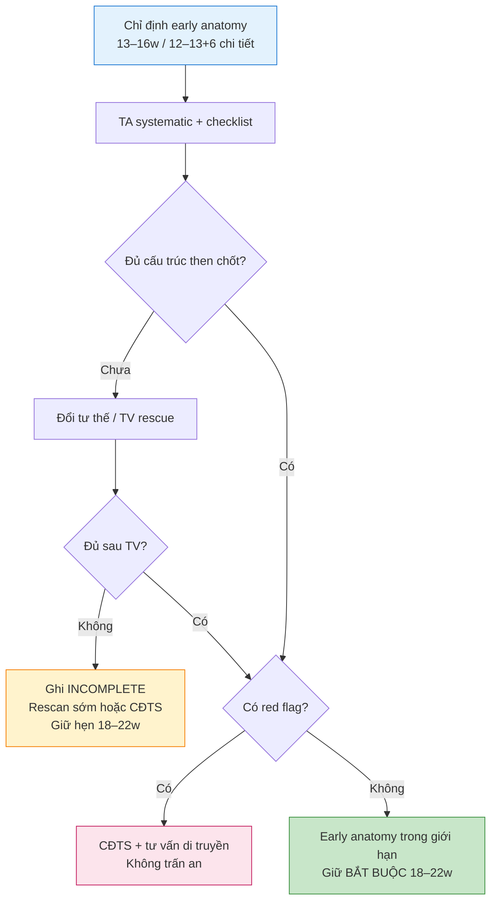

# Siêu âm giải phẫu sớm 13–16 tuần — Early Anomaly Scan (ECFAS)

**Ngày:** 2026-07-15 | **Chuyên khoa:** Siêu âm thai | **Đối tượng:** Bác sĩ sản phụ khoa, bác sĩ siêu âm hình thái thai

> **Tier 0 / guideline nền:**
> - ISUOG Practice Guidelines (updated): performance of 11–14-week ultrasound scan. 2023. PMID: 36594739. [GUIDELINE VERIFIED]
> - SOGC No. 352 — Technical Update: The Role of Early Comprehensive Fetal Anatomy Ultrasound Examination (ECFAS). 2017. PMID: 29197487. [GUIDELINE VERIFIED]
> - AIUM Practice Parameter for Detailed Diagnostic Obstetric Ultrasound Examinations Between 12w0d and 13w6d. 2021. PMID: 32852128. [GUIDELINE VERIFIED]
> - ISUOG Practice guidelines for performance of the routine mid-trimester fetal ultrasound scan. 2011. PMID: 20842655. [GUIDELINE VERIFIED]
>
> **Tier 1 / evidence chính:**
> - Karim JN et al. Systematic review of first-trimester ultrasound screening for detection of fetal structural anomalies. UOG 2017. PMID: 27546497. [FULL VERIFIED]

---

## 0. TỔNG QUAN — VÌ SAO BÀI NÀY QUAN TRỌNG?

Siêu âm **giải phẫu sớm 13–16 tuần (early anomaly scan / ECFAS)** không thay thế sàng lọc 11–14 tuần (A2) và **không thay thế** siêu âm hình thái chuẩn 18–22 tuần (B1). Đây là cuộc khảo sát **có chỉ định**, nhằm phát hiện sớm các dị tật lớn khi còn cửa sổ can thiệp/tư vấn sớm, hoặc khi hình thái giữa thai kỳ dự kiến khó kỹ thuật.

**Mục tiêu của bài:**
- Phân biệt rõ 3 cửa sổ: routine 11–14w, early comprehensive anatomy 13–16w, midtrimester 18–22w.
- Nắm checklist hệ thống sớm, đường TA + TV rescue, ALARA/Doppler và xử trí incomplete exam.
- Nhận diện red-flag dị tật lớn sớm; luôn giữ hẹn 18–22w dù early scan “bình thường”.

### 0.1. Ba cửa sổ — không gộp thành một

| Cửa sổ | Vai trò chính | Không phải |
|---|---|---|
| **11–14w routine** (A2) | Dating, viability, số thai/chorionicity, sàng lọc lệch bội (NT ± markers), một phần giải phẫu theo ISUOG | Không phải early comprehensive anatomy đầy đủ cho mọi thai |
| **13–16w early anomaly / ECFAS** (A3, bài này) | Khảo sát giải phẫu sớm **có chỉ định** (nguy cơ cao hoặc midtrimester dự kiến khó); ưu tiên 13–16w theo SOGC | Không thay 18–22w; không phải combined test toán học |
| **18–22w midtrimester anatomy** (B1) | Checklist hình thái chuẩn toàn diện ISUOG — cuộc khảo sát giải phẫu “xương sống” của thai kỳ | Không bị hủy vì early scan bình thường |

**Nguyên tắc cứng:** Early scan **bình thường** = chưa loại trừ mọi dị tật. Early scan **incomplete** = ghi nhận + hẹn rescan/chuyển tuyến, **không** trấn an “đã loại trừ”.

---

## 1. CHỈ ĐỊNH, THỜI ĐIỂM VÀ MỤC TIÊU

### 1.1. Ai cần early comprehensive anatomy?

Theo khung SOGC ECFAS (11–16w, nhấn 13–16w ở nhóm chọn lọc) và AIUM detailed late-first-trimester (12+0–13+6 khi có chỉ định):

| Nhóm | Ví dụ | Lý do |
|---|---|---|
| **Nguy cơ cao dị tật cấu trúc** | Tiền sử thai dị tật, bản thân/gia đình dị tật, đái tháo đường trước thai kỳ, phơi nhiễm teratogen, bất thường marker 11–14w | Lợi ích phát hiện sớm |
| **Midtrimester dự kiến khó kỹ thuật** | Béo phì nặng, sẹo bụng nhiều tầng, tử cung nhiều u xơ, ngôi/tư thế khó lặp lại | Cửa sổ sớm + TV có thể thấy rõ hơn trước khi thai to/che khuất |
| **Cần quyết định sớm** | Thai IVF/ART phức tạp, song thai, bệnh lý mẹ nặng | Tư vấn / can thiệp di truyền sớm hơn |

**Không chỉ định hàng loạt** cho mọi thai low-risk như thay thế 18–22w.

### 1.2. Mục tiêu thực hành

1. Phát hiện **dị tật lớn** có thể thấy sớm (xem mục 4).
2. Ghi nhận cấu trúc **đã thấy / chưa thấy / nghi**.
3. Lập **đường đi**: bình thường → vẫn 18–22w; incomplete → rescan/chuyển; bất thường → CĐTS + di truyền.
4. Không nhân bản toán risk aneuploidy của A2; không biến A3 thành khóa bệnh lý từng tạng của 18–22w.

---

## 2. KỸ THUẬT, THIẾT BỊ, AN TOÀN

### 2.1. Người làm và máy

| Yếu tố | Yêu cầu thực hành |
|---|---|
| **Operator** | BS/siêu âm viên có kinh nghiệm hình thái thai; biết khi nào phải TV rescue và khi nào chuyển tuyến |
| **Đầu dò** | Convex TA tần số phù hợp quý 1 muộn; **TV** sẵn sàng khi TA không đủ |
| **Lưu trữ** | Ảnh/clip checklist — không chỉ “mô tả miệng” |
| **Thời gian** | Đủ để systematic; không “nhìn lướt 5 phút” gọi là early anatomy |

### 2.2. Đường tiếp cận TA → TV rescue

```
1. Bắt đầu TA systematic theo checklist.
2. Nếu cấu trúc then chốt chưa thấy (sọ, midline não, thành bụng, bàng quang, 4CH, cột sống, chi):
   → đổi tư thế mẹ, bàng quang vừa phải, góc đầu dò.
3. Nếu vẫn incomplete và không chống chỉ định → TVS.
4. Sau TVS vẫn incomplete → GHI RÕ incomplete + hẹn rescan sớm / chuyển CĐTS.
5. Không ghi “giải phẫu sớm bình thường” khi chưa thấy đủ cấu trúc then chốt.
```

### 2.3. ALARA và Doppler

- Áp dụng **ALARA**: công suất thấp nhất đạt chẩn đoán, thời gian khảo sát hợp lý.
- Color/pulsed Doppler **chỉ khi cần** (tim, mạch rốn, nghi bất thường dòng chảy) — không “Doppler mọi cấu trúc cho đẹp”.
- Tránh kéo dài phổ Doppler không chỉ định trên thai sớm.

### 2.4. Documentation & incomplete exam

Mẫu ghi tối thiểu:

```text
Tuổi thai theo CRL/LMP: ... tuần ... ngày.
Early anatomy scan (TA ± TV): các cấu trúc đã khảo sát: ...
Cấu trúc chưa khảo sát được: ... (lý do: tư thế / BMI / sẹo / oligo / khác).
Kết luận: bình thường giới hạn kỹ thuật / incomplete / nghi bất thường ...
Kế hoạch: hẹn hình thái 18–22w BẮT BUỘC; rescan sớm ...; chuyển CĐTS ...
```

---

## 3. CHECKLIST GIẢI PHẪU SỚM (SYSTEMATIC)

Trình tự cố định — **không** “nhìn đâu thấy đó”. Tham chiếu kiến trúc checklist midtrimester (bài 08) nhưng **mức kỳ vọng** phù hợp 13–16w: nhiều chi tiết 18–22w **chưa** bắt buộc đầy đủ.

### 3.1. Tổng quan thai & phần phụ

| # | Mục | Bình thường / cần ghi | Cờ đỏ |
|---|---|---|---|
| 1 | Số thai, màng đệm/ối (nếu đa thai) | Xác định sớm, đối chiếu 11–14w | Sai chorionicity |
| 2 | Tim thai, hoạt động | Có, nhịp đều trong khoảng thai sống | Nhịp bất thường rõ → đánh giá thêm |
| 3 | CRL / biometry sớm | Phù hợp dating | Chênh lớn → review dating + cấu trúc |
| 4 | Bánh nhau, màng, nước ối định tính | Vị trí thô, ối hiện diện | Hydrops, ối bất thường nặng kèm dị tật |

### 3.2. Đầu – não – sọ

| # | Mục | Cần thấy | Red flag sớm |
|---|---|---|---|
| 5 | Hộp sọ ossified, hình oval | Vòm sọ liên tục | **Acrania / anencephaly sequence** |
| 6 | Midline falx | Có đường giữa | Mất falx → nghĩ **alobar HPE** |
| 7 | Não thất / plexus pattern thô | Không monoventricle | Monoventricle, thalami dính |
| 8 | Hố sau thô (khi được) | Không đòi chi tiết 18–22w | Khối lớn / hố sau “trống” bất thường |

### 3.3. Mặt – cổ

| # | Mục | Cần thấy | Red flag |
|---|---|---|---|
| 9 | Profile / trán | Có mặt cắt sagittal thô | Mass trán, profile “không đầu” (acrania) |
| 10 | Ổ mắt thô | Hai hốc | Cyclopia / hypotelorism nặng (HPE) |
| 11 | Cổ | Da liên tục | Cystic hygroma lớn, mass |

*Marker aneuploidy chuyên sâu (NB, TR, DV…): xem A4/A5 — không nhồi vào A3.*

### 3.4. Cột sống

| # | Mục | Cần thấy | Red flag |
|---|---|---|---|
| 12 | Trục sống dọc | Liên tục thô | Gián đoạn lớn, kyphoscoliosis nặng |
| 13 | Da che phủ (khi được) | Không mass hở lớn | **Encephalocele / open NTD lớn** |

### 3.5. Lồng ngực – cơ hoành – tim

| # | Mục | Cần thấy | Red flag |
|---|---|---|---|
| 14 | Lồng ngực / phổi thô | Tim trong ngực | **Ectopia cordis** |
| 15 | Cơ hoành thô | Dạ dày dưới cơ hoành khi thấy | Dạ dày trong ngực (CDH) nếu rõ |
| 16 | Situs + 4CH (khi feasible) | Tim trái, 4 buồng thô | Trục lệch nặng, 1 thất rõ, hydrops tim |
| 17 | Outflow (khi feasible) | Không ép buộc đủ như 18–22w | Nếu thấy bất thường outflow → ghi + fetal echo/CĐTS |

### 3.6. Bụng – thành bụng – tiết niệu

| # | Mục | Cần thấy | Red flag |
|---|---|---|---|
| 18 | Thành bụng / cord insertion | Bụng kín, cuống rốn vào đúng chỗ | **Omphalocele / gastroschisis / body-stalk** |
| 19 | Dạ dày | Túi dịch bên trái (khi thấy) | Absent lặp lại + bất thường khác |
| 20 | Bàng quang | Có (thai đã sản xuất nước tiểu) | Không thấy bàng quang lặp lại |
| 21 | Thận thô (khi được) | Không đòi đủ grading 18–22w | Khối bụng, thiếu thận hai bên gợi ý |

### 3.7. Chi – bàn tay/chân

| # | Mục | Cần thấy | Red flag |
|---|---|---|---|
| 22 | 4 chi, 3 đoạn thô | Có đủ chi | **Limb reduction / body-stalk / LBWC** |
| 23 | Bàn tay/chân thô | Hiện diện | Thiếu bàn, tư thế cố định bất thường rõ |

### 3.8. Bánh nhau – màng – dây rốn sớm

| # | Mục | Ghi | Ghi chú |
|---|---|---|---|
| 24 | Vị trí nhau thô | Trước/sau/đáy/thấp | Chưa kết luận previa vĩnh viễn |
| 25 | Cord insertion thô | Trung tâm / lệch / nghi màng | Chi tiết PAS/vasa → bài 43 ở quý 2 |
| 26 | Số mạch (khi Doppler chỉ định) | 3 mạch vs SUA gợi ý | SUA → scan kèm tạng, không kết luận isolated sớm vội |

---

## 4. DỊ TẬT LỚN CÓ THỂ PHÁT HIỆN SỚM (RED FLAGS)

Mục tiêu A3 là **nhận diện + đường đi**, không thay bài bệnh lý chuyên sâu từng hệ (CNS, tim, thành bụng…).

| Red flag | Dấu hiệu sớm gợi ý | Hành động |
|---|---|---|
| **Acrania → anencephaly sequence** | Không vòm sọ ossified, mô não “mở” | CĐTS + tư vấn di truyền/chấm dứt theo luật/y đức địa phương |
| **Alobar holoprosencephaly** | Mất falx, monoventricle, thalami dính ± hypotelorism | CĐTS + di truyền (T13 và hội chứng) |
| **Encephalocele / open NTD lớn** | Khối thoát vị sọ/cột sống, gián đoạn da xương | CĐTS; đừng trấn an bằng “NT bình thường” |
| **Body-stalk / limb–body-wall complex** | Thành bụng hở lớn, chi ngắn/thiếu, cuống ngắn, thai “dính” nhau | CĐTS; tiên lượng thường rất nặng |
| **Ectopia cordis / pentalogy of Cantrell** | Tim ngoài lồng ngực ± khuyết thành ngực-bụng | CĐTS / tim mạch nhi |
| **Omphalocele / gastroschisis** | Ruột ± gan ngoài ổ bụng; phân biệt màng & chỗ cắm rốn | CĐTS + di truyền (đặc biệt omphalocele) |
| **CHD nặng / phức tạp** | 4CH một thất, trục lệch nặng, hydrops, ectopia | Fetal echo + CĐTS; nhiều CHD nhẹ **không** loại trừ được sớm |

### 4.1. Hiệu năng phát hiện — chỉ số đã verify

Theo **Karim et al. 2017** (systematic review & meta-analysis, PMID 27546497) — siêu âm trước 14 tuần:

- Phát hiện **major abnormalities** ở quần thể low-risk/unselected: **46.10%** (95% CI 36.88–55.46%); 19 nghiên cứu, 115 731 thai. [FULL VERIFIED]
- Phát hiện **all abnormalities** low-risk/unselected: **32.35%** (95% CI 22.45–43.12%); 14 nghiên cứu, 97 976 thai. [FULL VERIFIED]
- Phát hiện **all abnormalities** high-risk: **61.18%** (95% CI 37.71–82.19%); 6 nghiên cứu, 2841 thai. [FULL VERIFIED]
- Dùng **standardized anatomical protocol/checklist** liên quan cải thiện độ nhạy (p < 0.0001). [ABSTRACT VERIFIED]

**Ý nghĩa lâm sàng:** Ngay cả early scan tốt cũng **bỏ sót** tỷ lệ lớn dị tật → **bắt buộc** giữ 18–22w. Không cite % “phát hiện 90% mọi dị tật ở 14w” khi chưa có nguồn verify.

---

## 5. EVIDENCE & GUIDELINES

### 5.1. ISUOG 2023 — 11–14w (PMID 36594739)

Guideline cập nhật về **performance of the 11–14-week ultrasound scan**: khung kỹ thuật và nội dung khảo sát quý 1 (bao gồm thành phần giải phẫu theo protocol). Dùng làm nền **routine 11–14w**, phân biệt với ECFAS chọn lọc. [GUIDELINE VERIFIED]

Registry hiện hành trong kho: `ISUOG 2022 - 11-14w Ultrasound` / PMID 36594739 (bản UOG 2023).

### 5.2. SOGC No. 352 — ECFAS (PMID 29197487)

Technical update về **early comprehensive fetal anatomy ultrasound** ở **11–16 tuần**, hướng tới:

- Thai **nguy cơ cao** dị tật, và/hoặc
- Thai mà mid-second trimester **TA dự kiến khó**.

Lợi ích kỳ vọng: phát hiện sớm dị tật lớn, mở cửa can thiệp/tư vấn sớm; kỹ thuật được coi là an toàn khi thực hành đúng. [GUIDELINE VERIFIED]

**Lưu ý phiên bản:** Trong quá trình soạn bài (2026-07-15) chỉ verify được bản abstract/PMID 29197487 (2017). Không trích checklist chi tiết từ full text 2023 nếu chưa có bản full verified; nếu hội có reaffirmation, chỉ ghi nhận **date-check**, không bịa nội dung mới.

### 5.3. AIUM 12+0–13+6 detailed diagnostic (PMID 32852128)

Practice parameter cho **detailed diagnostic** obstetric US trong cửa sổ 12w0d–13w6d — **chỉ định-driven**, không đồng nghĩa screening hàng loạt. [GUIDELINE VERIFIED]

### 5.4. ISUOG midtrimester comparator (PMID 20842655)

Routine mid-trimester anatomy scan là **chuẩn so sánh** và **cuộc hẹn không được hủy** sau early scan. Chi tiết checklist 18–22w: bài `08_Mid_Trimester_Anatomy_Scan`. [GUIDELINE VERIFIED]

### 5.5. Karim 2017 SR (PMID 27546497)

Xem mục 4.1 — nền tảng số liệu detection rate và vai trò protocol chuẩn. [FULL VERIFIED]

---

## 6. ỨNG DỤNG LÂM SÀNG

### 6.1. Case 14 tuần — incomplete

Thai 14w, BMI cao, TA không thấy rõ 4CH và thận. TV thấy sọ, midline, thành bụng kín, bàng quang, 4 chi; tim 4CH vẫn mờ.

**Xử trí đúng:** Ghi **incomplete early anatomy** (tim/thận chưa đủ). Hẹn rescan sớm hoặc chuyển CĐTS tùy nguy cơ. **Giữ** hẹn hình thái 18–22w. **Không** ghi “loại trừ dị tật”.

### 6.2. Case 15 tuần — red flag

Thai 15w, mất vòm sọ ossified, mô não tiếp xúc nước ối.

**Xử trí:** Nghi **acrania/anencephaly sequence**. Hội chẩn CĐTS, tư vấn di truyền theo quy trình cơ sở, hỗ trợ quyết định thai kỳ. Vẫn lập hồ sơ ảnh chuẩn.

### 6.3. Case early “bình thường” high-risk

Thai 13w6d, mẹ ĐTĐ type 1, early checklist đủ trong giới hạn kỹ thuật, không thấy dị tật lớn.

**Xử trí:** Trấn an **có điều kiện**: chưa thấy dị tật lớn hôm nay; **không** thay 18–22w; nhắc fetal echo/hình thái đầy đủ theo chỉ định bệnh nền.

### 6.4. Tư vấn & đường di truyền

| Kết quả early scan | Đường đi |
|---|---|
| Bình thường (đủ checklist) | Tư vấn giới hạn; **giữ 18–22w**; theo dõi theo nguy cơ nền |
| Incomplete | Rescan / TV / chuyển CĐTS; **không** “ổn rồi” |
| Nghi dị tật | CĐTS ± microarray/karyotype/WES theo chỉ định; phối hợp di truyền |
| Marker lệch bội đơn thuần | Không biến A3 thành A2/A5 — đối chiếu screening đã có |

---

## 7. LƯU ĐỒ QUYẾT ĐỊNH LÂM SÀNG



---

## 8. SAI LẦM THƯỜNG GẶP

| # | Sai lầm | Hậu quả | Cách tránh |
|---|---|---|---|
| 1 | Coi early scan = thay 18–22w | Bỏ sót dị tật biểu hiện/đủ thấy muộn | Luôn book midtrimester |
| 2 | Ghi “bình thường” khi incomplete | False reassurance | Checklist + mục chưa thấy |
| 3 | Không dùng TV khi TA thất bại | Mất cơ hội thấy dị tật lớn | Protocol TA→TV |
| 4 | Nhầm A3 với sàng lọc 11–14w (NT/risk) | Tư vấn sai mục tiêu | Tách A2 vs A3 |
| 5 | Không lưu ảnh checklist | Không hội chẩn/audit được | Lưu ảnh từng hệ |
| 6 | Cite % detection bịa | Sai evidence | Chỉ dùng số đã FULL VERIFIED |
| 7 | Doppler kéo dài không chỉ định | Phá ALARA | Doppler khi cần |
| 8 | Tự kết luận bệnh lý hiếm tại tuyến cơ sở | Chậm CĐTS | Red flag → chuyển |
| 9 | Quên tư vấn giới hạn trước scan | Kỳ vọng 100% | Nói rõ trước |
| 10 | Bỏ qua body-stalk/LBWC vì “hiếm” | Miss dị tật nặng | Luôn xem thành bụng + chi + cuống |

---

## 9. BẢNG THUỐC VÀ LIỀU DÙNG

Không áp dụng.

---

## 10. ÁP DỤNG TẠI VIỆT NAM

- **Tình hình dịch tễ:** Chưa có số liệu quốc gia project-local riêng cho “early anomaly scan 13–16w” trong kho bài học.
- **Hướng dẫn Bộ Y tế / VAGO:** **Chưa tìm thấy protocol chuyên biệt project-local** cho ECFAS 13–16w trong các file đã rà. Thực hành bám **ISUOG / SOGC / AIUM** quốc tế và quy trình CĐTS cơ sở.
- **Khác biệt thực hành:** Nhiều nơi gộp “siêu âm quý 1” thành một gói ngắn (dating + NT) — dễ **thiếu** checklist giải phẫu sớm khi có chỉ định. Cần tách chỉ định ECFAS, dành thời gian + TV, và **không hủy** mốc 18–22w (thường là mốc BHYT/thực hành chuẩn).
- **Chuyển tuyến:** BV chuyên sản / trung tâm CĐTS (ví dụ Từ Dũ, PSTW, ĐHYD tùy địa bàn) khi incomplete dai dẳng hoặc red flag.

---

## 11. TIPS THỰC HÀNH (CLINICAL PEARLS)

1. **Ba cửa sổ, ba mục tiêu** — đừng gộp 11–14 / 13–16 / 18–22 thành một câu “siêu âm hình thái”.
2. **Checklist trước memory** — detection tăng khi có protocol chuẩn (Karim 2017).
3. **TA trước, TV khi kẹt** — incomplete sau TV vẫn là incomplete, không phải “âm tính”.
4. **Acrania, alobar HPE, body-stalk, ectopia cordis, omphalocele lớn** là các “không được miss” sớm.
5. **4CH sớm hữu ích nhưng không đủ** — CHD nhẹ/outflow có thể lọt; giữ fetal echo khi chỉ định.
6. **High-risk được lợi hơn low-risk** về tỷ lệ phát hiện sớm — đúng chỉ định SOGC/AIUM.
7. **ALARA** — Doppler có chủ đích.
8. **Báo cáo cấu trúc chưa thấy** trung thực hơn câu “trong giới hạn bình thường” mơ hồ.
9. **Cross-ref A2/A4/A5** cho marker lệch bội; **B1/08** cho full anatomy; **43** cho nhau-rốn chi tiết quý 2.
10. **Câu chốt tư vấn:** “Hôm nay không thấy dị tật lớn trong phạm vi khảo sát; cuộc siêu âm 18–22 tuần vẫn bắt buộc.”

---

## 12. TỔNG KẾT ĐIỂM CẦN NHỚ

1. A3 = early comprehensive anatomy **có chỉ định**, chủ yếu 13–16w (SOGC) / detailed 12–13+6 (AIUM) — **không** thay A2 hay B1.
2. Mục tiêu: dị tật **lớn** sớm + documentation + đường đi; không phải combined test.
3. Luôn systematic checklist; protocol chuẩn cải thiện detection (Karim 2017).
4. Major anomaly detection ~**46%** low-risk pre-14w; all anomalies ~**32%** low-risk vs ~**61%** high-risk — số FULL VERIFIED từ PMID 27546497.
5. Incomplete → rescan/CĐTS, không reassurance.
6. Red flag → CĐTS + di truyền, không tự “theo dõi thêm vài tuần” mơ hồ nếu đã rõ nặng.
7. ALARA + TV rescue là một phần protocol, không phải tùy hứng.
8. Việt Nam: chưa có protocol project-local riêng — bám quốc tế, giữ mốc 18–22w.
9. Không nhân bản bài 11–14w risk math hay full midtrimester organ course.
10. Câu an toàn pháp lý-lâm sàng: **early normal ≠ all anomalies excluded**.

---

## 13. TÀI LIỆU THAM KHẢO

1. **International Society of Ultrasound in Obstetrics and Gynecology; Bilardo CM, Chaoui R, Hyett JA, et al.** "ISUOG Practice Guidelines (updated): performance of 11-14-week ultrasound scan." *Ultrasound Obstet Gynecol.* 2023;61(1):127-143. PMID: **36594739**. DOI: 10.1002/uog.26106. [GUIDELINE VERIFIED]

2. **Nevo O, Brown R, Glanc P, Lim K.** "No. 352-Technical Update: The Role of Early Comprehensive Fetal Anatomy Ultrasound Examination." *J Obstet Gynaecol Can.* 2017;39(12):1203-1211. PMID: **29197487**. DOI: 10.1016/j.jogc.2017.06.031. [GUIDELINE VERIFIED]

3. **American Institute of Ultrasound in Medicine.** "AIUM Practice Parameter for the Performance of Detailed Diagnostic Obstetric Ultrasound Examinations Between 12 Weeks 0 Days and 13 Weeks 6 Days." *J Ultrasound Med.* 2021;40(5):E1-E16. PMID: **32852128**. DOI: 10.1002/jum.15477. [GUIDELINE VERIFIED]

4. **Salomon LJ, Alfirevic Z, Berghella V, et al.** "Practice guidelines for performance of the routine mid-trimester fetal ultrasound scan." *Ultrasound Obstet Gynecol.* 2011;37(1):116-126. PMID: **20842655**. DOI: 10.1002/uog.8831. [GUIDELINE VERIFIED]

5. **Karim JN, Roberts NW, Salomon LJ, Papageorghiou AT.** "Systematic review of first-trimester ultrasound screening for detection of fetal structural anomalies and factors that affect screening performance." *Ultrasound Obstet Gynecol.* 2017;50(4):429-441. PMID: **27546497**. DOI: 10.1002/uog.17246. [FULL VERIFIED]

---

**— Hết bài học ngày 2026-07-15 —**

**Bác sĩ:** Ngọc Hưng 🍅 🐈‍⬛ | **AI:** grok-4.5-high
