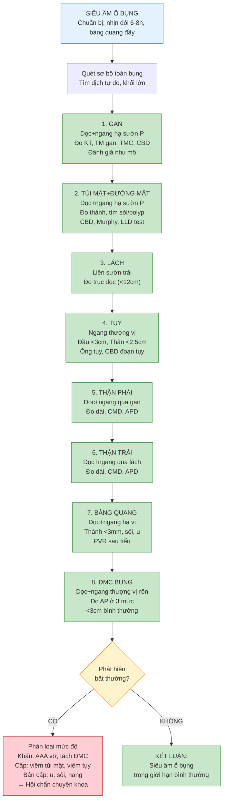

# BÀI HỌC Y KHOA: SIÊU ÂM Ổ BỤNG TỔNG QUÁT — GIẢI PHẪU, MẶT CẮT, BẤT THƯỜNG VÀ QUY TRÌNH THEO TỪNG TẠNG

**Ngày:** 2026-06-28 | **Chuyên khoa:** Siêu âm tổng quát | **Đối tượng:** Bác sĩ sản phụ khoa / học viên siêu âm

> **Tier 0 Guidelines:** AIUM 2022 — Performance of US of Abdomen/Retroperitoneum (JP 2021, PMID: 34792206); WFUMB Position Papers — Incidental Findings series (Liver, Gallbladder, Spleen)
> **Phạm vi:** 7 tạng cơ bản — Gan, Túi mật & Đường mật, Tụy, Lách, Thận, Bàng quang, Động mạch chủ bụng. Mỗi tạng: giải phẫu siêu âm + mặt cắt + dấu hiệu bất thường + quy trình.

---

## MỤC LỤC

0. TỔNG QUAN — Chỉ định, nguyên lý chung
1. CHUẨN BỊ BỆNH NHÂN & KỸ THUẬT CHUNG
2. GAN (LIVER) — Giải phẫu phân thùy, mặt cắt, bất thường
3. TÚI MẬT & ĐƯỜNG MẬT (GALLBLADDER & BILIARY TREE)
4. TỤY (PANCREAS)
5. LÁCH (SPLEEN)
6. THẬN (KIDNEYS)
7. BÀNG QUANG (URINARY BLADDER)
8. ĐỘNG MẠCH CHỦ BỤNG (ABDOMINAL AORTA)
9. BẢNG TỔNG HỢP BẤT THƯỜNG HAY GẶP
10. LƯU ĐỒ KHẢO SÁT Ổ BỤNG
11. SAI LẦM THƯỜNG GẶP
12. ÁP DỤNG TẠI VIỆT NAM
13. TIPS THỰC HÀNH
14. TỔNG KẾT ĐIỂM CẦN NHỚ
15. TÀI LIỆU THAM KHẢO

---

## 0. TỔNG QUAN — CHỈ ĐỊNH, NGUYÊN LÝ CHUNG

Siêu âm ổ bụng tổng quát là một trong những kỹ thuật chẩn đoán hình ảnh **được chỉ định nhiều nhất** trong thực hành lâm sàng — an toàn, không nhiễm xạ, giá thành thấp, và có thể thực hiện tại giường.

**Chỉ định chính:**
- Đau bụng cấp hoặc mạn tính (hạ sườn phải → nghi túi mật/gan; hố chậu phải → nghi ruột thừa; hạ sườn trái → nghi lách/tụy; hố thắt lưng → nghi thận)
- Vàng da, rối loạn men gan, nghi tắc mật
- Sốt chưa rõ nguyên nhân (tìm abscess, viêm thận, viêm túi mật)
- Tiểu máu, đau hố thắt lưng, nghi sỏi thận
- Sờ thấy khối ổ bụng
- Chấn thương bụng kín (FAST — Focused Assessment with Sonography in Trauma)
- Sàng lọc phình động mạch chủ bụng (AAA screening) ở nam >65 tuổi có tiền sử hút thuốc
- Theo dõi sau ghép tạng, sau phẫu thuật ổ bụng

**7 tạng khảo sát bắt buộc theo AIUM 2022:**
1. **Gan** — nhu mô, mạch máu (TMC, TM gan), đường mật trong gan, kích thước
2. **Túi mật & Đường mật** — thành, lòng, sỏi, polyp, đường mật chính
3. **Tụy** — đầu, thân, đuôi, ống tụy (nếu thấy)
4. **Lách** — kích thước, nhu mô, mạch máu rốn lách
5. **Thận (2 bên)** — kích thước, phân biệt tủy-vỏ, bể thận, niệu quản (nếu giãn)
6. **Bàng quang** — thành, lòng, thể tích tồn dư sau tiểu (PVR)
7. **Động mạch chủ bụng (ĐMC)** — kích thước, thành mạch, mảng xơ vữa, phình, tách

---

## 1. CHUẨN BỊ BỆNH NHÂN & KỸ THUẬT CHUNG

### 1.1. Chuẩn bị bệnh nhân

| Yêu cầu | Lý do |
|---|---|
| **Nhịn đói 6-8 giờ** | Giảm hơi dạ dày/ruột, túi mật không co bóp → khảo sát tốt hơn |
| **Bàng quang đầy** (uống 500-1000ml nước, nhịn tiểu 1-2h trước siêu âm) | Cửa sổ âm cho tiểu khung; bắt buộc nếu siêu âm bàng quang + tử cung/phần phụ |
| **Tháo bỏ trang sức, quần áo vùng bụng** | Giảm artifact |
| **Tư thế bệnh nhân**: Nằm ngửa (supine) là chính; có thể xoay nghiêng trái/phải hoặc nằm sấp nếu cần |

### 1.2. Thiết bị & Cài đặt

| Thông số | Giá trị khuyến cáo |
|---|---|
| **Đầu dò** | Convex (curvilinear) 2-5 MHz (C5-1 hoặc C5-2) — tần số thấp xuyên sâu, tần số cao cho cấu trúc nông |
| **Độ sâu (Depth)** | Điều chỉnh sao cho thấy được thành bụng sau (cột sống) và cơ hoành |
| **Gain tổng thể** | Đủ sáng để thấy rõ nhu mô gan/thận nhưng không quá sáng gây nhiễu |
| **TGC (Time Gain Compensation)** | Bù trừ suy giảm tín hiệu theo độ sâu — chỉnh để ảnh đồng đều từ nông đến sâu |
| **Tiêu điểm (Focal zone)** | Đặt ngang vùng quan tâm (vd: ngang mức túi mật khi khảo sát túi mật) |
| **Harmonic Imaging** | BẬT — cải thiện độ phân giải tương phản, giảm artifact thành bụng |
| **Doppler màu** | Dùng kiểm tra mạch máu (TMC, TM gan, ĐMC, mạch thận) — PRF thấp cho tĩnh mạch, cao hơn cho động mạch |

### 1.3. Trình tự khảo sát (hệ thống hóa)

```
1. Khảo sát sơ bộ toàn ổ bụng — tìm dịch tự do, khối lớn
2. GAN: hạ sườn phải + liên sườn → mặt cắt dọc, ngang, dưới sườn
3. TÚI MẬT + ĐƯỜNG MẬT: hạ sườn phải → dọc + ngang + tư thế nghiêng trái
4. LÁCH: hạ sườn trái → liên sườn + dọc
5. TỤY: thượng vị → ngang + dọc, ép bụng để đẩy hơi
6. THẬN PHẢI: hạ sườn phải/lưng → dọc + ngang
7. THẬN TRÁI: hạ sườn trái/lưng → dọc + ngang
8. BÀNG QUANG: hạ vị → dọc + ngang, đo PVR sau khi đi tiểu
9. ĐMC BỤNG: thượng vị → dọc + ngang, đo đường kính
10. TỔNG KẾT: ghi nhận bất thường, đo kích thước các tạng
```

---

## 2. GAN (LIVER)

### 2.1. Giải phẫu siêu âm

Gan là tạng đặc **lớn nhất** ổ bụng, nằm dưới cơ hoành phải, chia thành **8 hạ phân thùy theo Couinaud** dựa trên phân nhánh TMC và TM gan.

**Các cấu trúc giải phẫu siêu âm quan trọng:**

| Cấu trúc | Đặc điểm trên siêu âm | Vị trí |
|---|---|---|
| **Tĩnh mạch cửa (Portal Vein - TMC)** | Thành dày, echo dày (do mô liên kết bao quanh), dễ thấy | Chia gan thành thùy phải/trái, phân thùy trên/dưới |
| **Tĩnh mạch gan (Hepatic Veins)** | Thành mỏng, echo kém, hướng về IVC | Phân chia gan thành 3 vùng: phải, giữa, trái |
| **Dây chằng liềm (Falciform Ligament)** | Đường echo dày | Phân cách thùy trái và thùy phải |
| **Dây chằng tĩnh mạch (Ligamentum Venosum)** | Đường echo dày | Phân cách thùy đuôi và thùy trái |
| **Tĩnh mạch chủ dưới (IVC)** | Cấu trúc ống thành mỏng, thay đổi theo hô hấp | Phía sau gan, bên phải ĐMC |
| **Ống mật chủ (CBD - Common Bile Duct)** | Ống nhỏ thành mỏng, nằm trước TMC | Rốn gan, thường thấy ở mặt cắt dọc/ngang |

**Phân thùy Couinaud trên siêu âm (được chia bởi TM gan và TMC):**

| TM gan phải | Phân cách hạ phân thùy V-VIII (trước) và VI-VII (sau) |
|---|---|
| **TM gan giữa** | Phân cách gan phải (V, VIII) và gan trái (IV, III, II) |
| **TM gan trái** | Phân cách hạ phân thùy II (trên) và III (dưới) của gan trái |
| **HPT I (Thùy đuôi)** | Nằm trước IVC, sau dây chằng tĩnh mạch |

**Kích thước bình thường gan ở người lớn:**
- **Trục dọc (đường giữa đòn phải)**: ≤ **15 cm** (thường 13-15 cm)
- **Thùy trái**: ≤ 8 cm trục dọc
- **Bề mặt**: nhẵn, bờ sắc (bờ tù → gan to hoặc bệnh lý)
- **Nhu mô**: echo đồng nhất, hơi tăng echo hơn vỏ thận (bình thường có thể isoechoic hoặc hơi tăng echo nhẹ)
- **Góc gan**: sắc (bờ tù → xơ gan giai đoạn muộn)

### 2.2. Các mặt cắt cần làm

**Mặt cắt dọc (Sagittal/Longitudinal) — 3 vị trí chính:**

| Mặt cắt | Vị trí đầu dò | Cấu trúc thấy |
|---|---|---|
| **Dọc đường giữa đòn phải** | Dưới bờ sườn phải, hướng lên cơ hoành | Gan phải, TM gan phải/giữa, cơ hoành, túi mật (ở mặt cắt hơi chếch) |
| **Dọc thượng vị (giữa)** | Dưới mũi ức | Gan trái (HPT II, III), ĐMC, thân tạng (celiac trunk), ĐM mạc treo tràng trên (SMA) |
| **Dọc cạnh ức trái** | Cạnh mũi ức trái | Gan trái ngoài, dây chằng tĩnh mạch, dây chằng liềm |

**Mặt cắt ngang (Transverse/Axial):**

| Mặt cắt | Vị trí | Cấu trúc thấy |
|---|---|---|
| **Ngang thượng vị** | Dưới mũi ức | Gan trái, TMC, IVC, ĐMC, thân tạng |
| **Ngang hạ sườn phải** | Dưới bờ sườn phải | Gan phải, TMC, TM gan, ống mật chủ |
| **Ngang dưới sườn (Subcostal oblique)** | Đầu dò chếch lên cơ hoành | Toàn bộ gan phải + TM gan đổ vào IVC ("Playboy Bunny sign") |

**Mặt cắt liên sườn (Intercostal):**

Dùng khi bệnh nhân có nhiều hơi hoặc gan teo nhỏ (xơ gan). Đặt đầu dò giữa các xương sườn 9-11 đường nách trước/giữa, thấy được gan phải, TMC, TM gan, và túi mật.

### 2.3. Quy trình khảo sát gan

```
BƯỚC 1: Đặt BN nằm ngửa, tay phải giơ lên đầu (mở rộng khoang liên sườn)
    ↓
BƯỚC 2: Mặt cắt dọc đường giữa đòn phải → đo KT trục dọc gan phải (<15cm)
    ↓
BƯỚC 3: Mặt cắt ngang dưới sườn → đánh giá TM gan, TMC, CBD
    ↓
BƯỚC 4: Mặt cắt dọc thượng vị → đánh giá gan trái, KT thùy trái
    ↓
BƯỚC 5: Doppler màu TMC (hướng về gan = hepatopetal), TM gan
    ↓
BƯỚC 6: Quét toàn bộ nhu mô — tìm tổn thương khu trú (nang, u, abscess...)
    ↓
BƯỚC 7: Đánh giá bờ gan (sắc hay tù?), bề mặt (nhẵn hay lổn nhổn?)
    ↓
BƯỚC 8: Nếu cần → mặt cắt liên sườn (BN nhiều hơi, gan teo)
```

### 2.4. Các dấu hiệu bất thường hay gặp

**A. Gan nhiễm mỡ (Hepatic Steatosis):**

| Dấu hiệu | Mô tả |
|---|---|
| **Nhu mô tăng echo lan tỏa** ("bright liver") | Echo gan >> vỏ thận; không còn thấy rõ TMC và cơ hoành ở độ sâu |
| **Phân độ** | Nhẹ: tăng echo nhẹ, còn thấy cơ hoành. Vừa: mờ TMC trong gan. Nặng: mất hẳn TMC và cơ hoành phía sau |
| **Gan to** | Có thể đi kèm, bờ tù |
| **Phân bố khu trú** | Có thể ưu thế vùng quanh TMC hoặc quanh túi mật → phân biệt với khối |

**B. Xơ gan (Cirrhosis):**

| Dấu hiệu | Chi tiết |
|---|---|
| **Bề mặt gan lổn nhổn, nốt** | Đặc biệt rõ ở mặt cắt dọc — bề mặt không nhẵn |
| **Bờ gan tù** | Mất bờ sắc bình thường |
| **HPT I phì đại** | Thùy đuôi to bất thường — dấu hiệu đặc trưng của xơ gan |
| **Gan teo (giai đoạn muộn)** | KT trục dọc <12 cm, đặc biệt gan phải |
| **Tăng áp lực TMC** | TMC giãn (>13mm), lưu lượng chậm hoặc đảo chiều, bàng hệ, lách to, ascites |

**C. Nang gan (Hepatic Cyst):**

| Đặc điểm | Dấu hiệu |
|---|---|
| **Hình dạng** | Tròn/bầu dục, ranh giới rõ |
| **Echo** | **Trống âm hoàn toàn** (anechoic), không vách, không vôi hóa |
| **Tăng âm phía sau (Posterior acoustic enhancement)** | Dấu hiệu đặc trưng của nang đơn thuần |
| **Kích thước** | Thường <3 cm, có thể rất to |

**D. U máu gan (Hemangioma):**

| Đặc điểm | Dấu hiệu |
|---|---|
| **Lành tính phổ biến nhất** | Thường phát hiện tình cờ |
| **Echo** | **Tăng echo** (hyperechoic), đồng nhất, ranh giới rõ |
| **Kích thước** | Thường <3 cm |
| **Dấu hiệu đặc trưng** | Dấu hiệu tăng âm phía sau (không điển hình như nang) |

**E. Ung thư gan nguyên phát (HCC):**

| Dấu hiệu | Mô tả |
|---|---|
| **Khối khu trú** | Echo hỗn hợp (giảm/tăng echo), bờ không đều, có vỏ bao (capsule) |
| **Xâm lấn mạch máu** | **Xâm lấn TMC** (portal vein tumor thrombus) — dấu hiệu đặc trưng, phân biệt với huyết khối thường |
| **Nền xơ gan** | 80-90% HCC trên nền xơ gan |
| **Doppler** | Tăng sinh mạch (hypervascular), phổ động mạch trong khối |

**F. Di căn gan (Metastasis):**

| Dấu hiệu | Mô tả |
|---|---|
| **Đa ổ** | Nhiều khối kích thước khác nhau |
| **Echo thay đổi theo nguyên phát** | Giảm echo (phổ biến nhất), tăng echo (GI, HCC, NET), "target" hoặc "bull's eye" (dấu hiệu đặc trưng của di căn), vôi hóa (mucinous adenocarcinoma) |

---

## 3. TÚI MẬT & ĐƯỜNG MẬT (GALLBLADDER & BILIARY TREE)

### 3.1. Giải phẫu siêu âm

Túi mật nằm ở hố túi mật (gallbladder fossa), mặt dưới gan phải, giữa HPT IV và V. Là cấu trúc rỗng chứa dịch mật.

**Kích thước bình thường:**
- **Dài**: ≤ **10 cm**
- **Ngang**: ≤ **4 cm**
- **Thành**: ≤ **3 mm** (đo ở mặt trước, nơi thành vuông góc với chùm tia siêu âm)
- **Lòng**: trống âm, không có echo bên trong
- **Thể tích**: 35-50 ml khi đói

**Mốc giải phẫu quan trọng:**
- **TMC chính (Main Portal Vein)**: nằm ngay sau cổ túi mật và ống mật chủ
- **Ống mật chủ (CBD - Common Bile Duct)**: nằm trước TMC, đường kính ≤ **6 mm** (tăng 1mm mỗi thập kỷ sau 60 tuổi, có thể tới 7-8mm); sau cắt túi mật có thể giãn tới 8-10mm
- **Ống gan chung (CHD - Common Hepatic Duct)**: đoạn trước khi hợp lưu với ống túi mật
- **Túi mật** → cổ túi mật → ống túi mật → hợp với CHD → CBD → đổ vào tá tràng qua bóng Vater

### 3.2. Các mặt cắt cần làm

| Mặt cắt | Vị trí đầu dò | Cấu trúc thấy |
|---|---|---|
| **Dọc hạ sườn phải** | Dưới bờ sườn, chếch theo trục túi mật | Túi mật dọc — đo dài, thành trước, lòng |
| **Ngang hạ sườn phải** | Vuông góc với mặt cắt dọc | Túi mật ngang — đo ngang, đánh giá lòng |
| **Mặt cắt qua rốn gan** | Dọc chếch qua rốn gan | CBD + TMC ("dấu hiệu shotgun" hoặc "2 ống song song" — CBD nằm trước TMC) |
| **Tư thế nghiêng trái (LLD - Left Lateral Decubitus)** | BN nằm nghiêng trái, đầu dò dưới bờ sườn phải | Túi mật di chuyển, sỏi di động → phân biệt sỏi vs polyp |
| **Tư thế đứng** | BN đứng hoặc ngồi | Sỏi nhỏ di chuyển xuống đáy túi mật, dễ thấy hơn |

### 3.3. Quy trình khảo sát túi mật & đường mật

```
BƯỚC 1: BN nằm ngửa → mặt cắt dọc hạ sườn phải
    ↓
BƯỚC 2: Đo KT túi mật (dài <10cm, ngang <4cm), thành trước (<3mm)
    ↓
BƯỚC 3: Đánh giá lòng túi mật — sỏi? polyp? bùn?
    ↓
BƯỚC 4: Xoay BN nghiêng trái (LLD) → đánh giá di động của sỏi
    ↓
BƯỚC 5: Mặt cắt qua rốn gan → tìm CBD, đo đường kính (<6mm)
    ↓
BƯỚC 6: Khảo sát đường mật trong gan — bình thường KHÔNG thấy (nếu thấy = giãn)
    ↓
BƯỚC 7: Dấu hiệu Murphy siêu âm (dùng đầu dò ấn trực tiếp vào túi mật)
    ↓
BƯỚC 8: Đánh giá nhu mô gan quanh túi mật, tụ dịch quanh túi mật
```

### 3.4. Các dấu hiệu bất thường hay gặp

**A. Sỏi túi mật (Cholelithiasis):**

| Dấu hiệu | Mô tả |
|---|---|
| **Hình ảnh điển hình** | Cấu trúc tăng echo trong lòng túi mật + **bóng cản âm phía sau** (posterior acoustic shadowing) |
| **Di động** | Sỏi di chuyển khi BN thay đổi tư thế (LLD hoặc đứng) → **dấu hiệu quan trọng phân biệt với polyp** |
| **Sỏi bùn (Sludge)** | Echo thấp, không bóng cản, tạo mặt phẳng dịch-dịch, di chuyển chậm |
| **Sỏi kẹt cổ** | Sỏi ở cổ túi mật, không di động, có thể gây viêm túi mật cấp |

**B. Viêm túi mật cấp (Acute Cholecystitis):**

| Dấu hiệu | Chi tiết |
|---|---|
| **Sỏi kẹt cổ/cổ túi mật** | Dấu hiệu thường gặp nhất (90-95% các trường hợp) |
| **Dấu hiệu Murphy siêu âm DƯƠNG TÍNH** | Dùng đầu dò ấn trực tiếp vào túi mật → BN đau chói (quan trọng hơn dày thành) |
| **Thành túi mật dày** | >3 mm (có thể tới 5-10 mm), thường phù nề 2 lớp ("striated wall") |
| **Túi mật căng to** | Dài >10 cm, ngang >4 cm |
| **Dịch quanh túi mật (pericholecystic fluid)** | Dấu hiệu viêm lan ra tổ chức xung quanh |

**C. Polyp túi mật:**

| Đặc điểm | Mô tả |
|---|---|
| **Echo** | Tăng echo, dính vào thành |
| **KHÔNG di động** | Phân biệt với sỏi — polyp không di chuyển khi BN thay đổi tư thế |
| **KHÔNG có bóng cản** | Trừ khi vôi hóa |
| **Ngưỡng nguy cơ** | >10 mm → tăng nguy cơ ác tính → chỉ định cắt túi mật |
| **Tăng sinh Cholesterol (Cholesterolosis)** | Nhiều polyp nhỏ <5mm, echo dày — lành tính, phổ biến nhất |

**D. Giãn đường mật (Biliary Dilatation):**

| Mức độ | CBD | Đường mật trong gan |
|---|---|---|
| **Bình thường** | ≤6 mm | Không thấy |
| **Giãn nhẹ** | 7-10 mm | Có thể thấy nhẹ |
| **Giãn rõ** | >10 mm | Giãn rõ, "double channel sign" hoặc "parallel channel sign" |
| **Nguyên nhân** | Sỏi OMC, u bóng Vater, u đầu tụy, viêm tụy mạn, hẹp đường mật, cholangiocarcinoma | |

**E. Túi mật sứ (Porcelain Gallbladder):**

Thành túi mật vôi hóa — echo dày mạnh + bóng cản lan rộng. Nguy cơ cao ung thư túi mật → chỉ định cắt túi mật.

---

## 4. TỤY (PANCREAS)

### 4.1. Giải phẫu siêu âm

Tụy nằm sau phúc mạc, trước ĐMC và IVC, ngang mức L1-L2. Siêu âm tụy là **một trong những kỹ thuật khó nhất** do vị trí sâu và bị hơi dạ dày/đại tràng che khuất.

**Cấu trúc giải phẫu siêu âm:**

| Phần tụy | Vị trí & mốc mạch máu |
|---|---|
| **Đầu tụy (Head)** | Bên phải ĐMC, nằm trong khung tá tràng; phía trước IVC; **TM mạc treo tràng trên (SMV)** nằm bên phải đầu tụy |
| **Mỏm móc (Uncinate process)** | Sau SMV, trước ĐMC — thường khó thấy nhất |
| **Cổ tụy (Neck)** | Ngay trước chỗ hợp lưu SMV + TM lách → TMC |
| **Thân tụy (Body)** | Trước ĐMC và SMA; **TM lách** chạy dọc bờ sau thân tụy |
| **Đuôi tụy (Tail)** | Kéo dài về phía rốn lách, trước thận trái — khó thấy nhất do hơi đại tràng góc lách |

**Kích thước bình thường (người lớn):**

| Phần | Đường kính trước-sau (AP) bình thường |
|---|---|
| **Đầu tụy** | ≤ **3.0 cm** |
| **Thân tụy** | ≤ **2.5 cm** |
| **Đuôi tụy** | ≤ **2.0 cm** |

**Ống tụy chính (Duct of Wirsung)**: ≤ **2-3 mm** (bình thường không thấy hoặc rất mảnh)

**Nhu mô tụy bình thường:**
- Echo đồng nhất, hơi tăng echo hơn gan (do mô mỡ xen kẽ ở người lớn tuổi)
- Ở người trẻ: echo tương đương hoặc thấp hơn gan
- Bề mặt nhẵn, bờ rõ

### 4.2. Các mặt cắt cần làm

**Mặt cắt ngang thượng vị (Transverse Epigastric) — mặt cắt CHÍNH:**

Đặt đầu dò ngang thượng vị, ấn nhẹ để đẩy hơi dạ dày. Thấy được toàn bộ tụy từ đầu đến đuôi với các mốc mạch máu:
- ĐMC và IVC (mặt cắt tròn) ở giữa
- SMA (tròn, thành dày, echo dày) xuất phát từ ĐMC
- TM lách chạy dọc bờ sau thân/đuôi tụy
- SMV nằm bên phải SMA

**Mặt cắt dọc thượng vị:**

Đặt đầu dò dọc đường giữa, thấy thân tụy nằm trước ĐMC, dưới gan trái.

**Mặt cắt qua hạ sườn trái/lưng (cho đuôi tụy):**

Dùng lách làm cửa sổ âm — đặt đầu dò ở khoang liên sườn trái, thấy được đuôi tụy qua lách.

**Mẹo kỹ thuật:**
- Cho BN uống 300-500 ml nước → dạ dày đầy dịch làm cửa sổ âm tốt hơn
- Ấn từ từ, kiên nhẫn đẩy hơi
- BN hít sâu → gan và lách đẩy xuống làm cửa sổ âm
- Nếu vẫn không thấy → ghi nhận "tụy bị hơi che khuất, không đánh giá được" (đừng cố đoán!)

### 4.3. Quy trình khảo sát tụy

```
BƯỚC 1: BN nằm ngửa, uống nước nếu cần
    ↓
BƯỚC 2: Mặt cắt ngang thượng vị → xác định mốc mạch máu (ĐMC, IVC, SMA, SMV, TM lách)
    ↓
BƯỚC 3: Đo KT đầu tụy (<3cm), thân tụy (<2.5cm), đuôi tụy (<2cm)
    ↓
BƯỚC 4: Đánh giá echo nhu mô (đồng nhất? tăng/giảm echo?)
    ↓
BƯỚC 5: Tìm ống tụy chính (nếu giãn)
    ↓
BƯỚC 6: Khảo sát ống mật chủ đoạn trong tụy (intrapancreatic CBD)
    ↓
BƯỚC 7: Tìm tổn thương khu trú (nang, khối echo kém)
    ↓
BƯỚC 8: Nếu tụy bị che khuất → thử tư thế nghiêng phải, ngồi, hoặc dùng lách làm cửa sổ
    ↓
BƯỚC 9: GHI NHẬN nếu không đánh giá được phần nào của tụy
```

### 4.4. Các dấu hiệu bất thường hay gặp

**A. Viêm tụy cấp (Acute Pancreatitis):**

| Dấu hiệu | Mô tả |
|---|---|
| **Tụy TO lan tỏa hoặc khu trú** | Phù nề → tụy to, bờ không rõ, echo giảm |
| **Dịch quanh tụy** | Dịch echo trống quanh tụy, khoang cạnh thận trước (anterior pararenal space) |
| **Giãn ống tụy** | Nếu có sỏi/nguyên nhân tắc |
| **Hoại tử tụy** | Vùng echo hỗn hợp, không tưới máu trên Doppler |
| **Nang giả tụy (Pseudocyst)** | Xuất hiện sau 4-6 tuần — cấu trúc nang echo trống, có thể có vách, mảnh vụn bên trong |

**B. Viêm tụy mạn (Chronic Pancreatitis):**

| Dấu hiệu | Mô tả |
|---|---|
| **Vôi hóa tụy** | Các nốt echo dày + bóng cản (pathognomonic) |
| **Ống tụy giãn không đều** | Giãn (>3mm), ngoằn ngoèo, có thể có sỏi trong ống |
| **Teo tụy** | KT giảm, bờ không đều |
| **Nhu mô tăng echo** | Không đặc hiệu |

**C. Nang tụy (Pancreatic Cysts):**

| Loại | Đặc điểm |
|---|---|
| **Nang giả tụy (Pseudocyst)** | Hậu quả viêm tụy, thành dày, có mảnh vụn, thường ngoài tụy, KHÔNG có lớp biểu mô |
| **Nang tân sinh (Mucinous/Serous Cystadenoma)** | Có vách, nốt thành, liên quan ống tụy — nguy cơ ác tính |
| **IPMN (Intraductal Papillary Mucinous Neoplasm)** | Giãn ống tụy chính hoặc nhánh bên, có nốt trong lòng |

**D. Ung thư tụy (Pancreatic Adenocarcinoma):**

| Dấu hiệu | Mô tả |
|---|---|
| **Khối echo kém (hypoechoic)** | Đầu tụy (60-70%), ranh giới không rõ |
| **Giãn ống tụy + ống mật chủ** ("double duct sign") | Dấu hiệu đặc trưng → u đầu tụy |
| **Xâm lấn mạch máu** | Mất mặt phẳng mỡ giữa u và SMA/SMV/TMC |
| **Di căn gan, hạch ổ bụng** | |

---

## 5. LÁCH (SPLEEN)

### 5.1. Giải phẫu siêu âm

Lách nằm ở hạ sườn trái, dưới cơ hoành trái, phía trước thận trái. Là tạng đặc, echo đồng nhất, hơi giảm echo hơn gan.

**Kích thước bình thường (người lớn):**
- **Trục dọc (chiều dài)**: ≤ **12 cm** (có thể tới 13 cm ở người cao lớn)
- **Diện tích cắt dọc**: ≤ **45 cm²**
- **Bề dày**: ≤ **5 cm**
- **Bề mặt**: nhẵn, bờ tù (không sắc như gan)
- **Rốn lách (Splenic Hilum)**: TM lách + ĐM lách vào qua rốn lách

**Hình dạng:**
- Mặt cắt dọc: hình bầu dục, lồi về phía cơ hoành, bờ trong hơi lõm (rốn lách)
- Mặt cắt ngang: hình liềm, ôm lấy thận trái

### 5.2. Các mặt cắt cần làm

| Mặt cắt | Vị trí đầu dò | Cấu trúc thấy |
|---|---|---|
| **Dọc hạ sườn trái (Coronal/Sagittal)** | Khoang liên sườn 9-11 đường nách sau | Toàn bộ lách dọc — đo trục dọc + diện tích |
| **Ngang hạ sườn trái** | Vuông góc, qua khoang liên sườn | Lách ngang — đo bề dày |
| **Dọc qua lưng** | BN nằm nghiêng phải | Lách qua thận trái làm cửa sổ âm |
| **Qua hạ sườn trái (Subcostal)** | Đầu dò dưới bờ sườn trái, hướng lên trên | Lách khi to (splenomegaly) — thấy dưới bờ sườn |

**Lưu ý**: Lách bình thường KHÔNG thấy dưới bờ sườn. Nếu thấy dưới bờ sườn ở mặt cắt dọc khi BN nằm ngửa → lách to.

### 5.3. Quy trình khảo sát lách

```
BƯỚC 1: BN nằm ngửa hoặc nghiêng phải
    ↓
BƯỚC 2: Đầu dò ở khoang liên sườn 9-11 đường nách sau → mặt cắt dọc
    ↓
BƯỚC 3: Đo trục dọc lách (<12cm) — từ cực trên đến cực dưới
    ↓
BƯỚC 4: Mặt cắt ngang → đo bề dày (<5cm)
    ↓
BƯỚC 5: Đánh giá echo nhu mô (đồng nhất? thấp hơn gan)
    ↓
BƯỚC 6: Khảo sát rốn lách → mạch máu rốn lách, TM lách
    ↓
BƯỚC 7: Tìm lách phụ (splenunculus/accessory spleen) — nốt tròn echo tương tự lách, thường ở rốn lách, <2 cm
    ↓
BƯỚC 8: Mặt cắt dưới sườn trái — xác nhận lách KHÔNG vượt quá bờ sườn
```

### 5.4. Các dấu hiệu bất thường hay gặp

**A. Lách to (Splenomegaly):**

| Mức độ | Trục dọc |
|---|---|
| **Nhẹ** | 12-14 cm |
| **Vừa** | 14-18 cm |
| **Nặng** | >18 cm (thấy rõ dưới bờ sườn, có thể tới hố chậu) |

**Nguyên nhân thường gặp:**
- Xơ gan + tăng áp TMC (phổ biến nhất ở VN)
- Nhiễm trùng: sốt rét, EBV (mononucleosis), lao, HIV
- Bệnh lý huyết học: thalassemia, leukemia, lymphoma
- Bệnh tự miễn: lupus, Felty syndrome, sarcoidosis
- Suy tim sung huyết

**B. Nang lách (Splenic Cyst):**

| Đặc điểm | Mô tả |
|---|---|
| **Nang đơn thuần** | Echo trống, thành mỏng, không vách, tăng âm phía sau |
| **Nang sau chấn thương** | Có vách, mảnh vụn, vôi hóa — tiền sử chấn thương |
| **Nang ký sinh trùng (Hydatid cyst)** | Vách dày, nang con trong nang mẹ, vôi hóa — hiếm gặp ở VN, trừ vùng dịch tễ |

**C. Áp xe lách (Splenic Abscess):**

Echo hỗn hợp, có thể có dịch + khí (echo dày + bóng cản bẩn). Thường gặp ở BN suy giảm miễn dịch, viêm nội tâm mạc nhiễm trùng.

**D. Vỡ lách (Splenic Rupture — chấn thương):**

| Dấu hiệu | Mô tả |
|---|---|
| **Tụ máu dưới bao (Subcapsular hematoma)** | Vùng echo hỗn hợp dưới bao lách, hình liềm |
| **Rách nhu mô** | Đường echo hỗn hợp xuyên nhu mô |
| **Dịch tự do ổ bụng** | Máu trong ổ bụng → echo trống ± mảnh vụn |
| **Vỡ 2 thì** | BN ổn định ban đầu → vỡ sau vài giờ đến vài ngày |

**E. Lách phụ (Accessory Spleen):**

Nốt tròn nhỏ (<2 cm) echo tương tự lách, thường ở rốn lách. Phân biệt với hạch to: lách phụ echo đồng nhất giống lách, hạch thường echo kém hơn. KHÔNG phải bệnh lý — nhưng quan trọng ở BN chuẩn bị cắt lách (phải cắt cả lách phụ nếu cắt lách điều trị).

---

## 6. THẬN (KIDNEYS)

### 6.1. Giải phẫu siêu âm

Thận là cặp tạng sau phúc mạc, nằm 2 bên cột sống, ngang mức T12-L3. **Thận phải thấp hơn thận trái** (bị gan đẩy xuống).

**Các lớp giải phẫu từ ngoài vào trong:**

| Lớp | Đặc điểm siêu âm |
|---|---|
| **Bao thận (Renal Capsule)** | Đường echo dày, liên tục bao quanh thận |
| **Vỏ thận (Cortex)** | Echo đồng nhất, thấp hoặc tương đương gan/lách; bao gồm cả cột Bertin (cột vỏ thận xen giữa các tháp thận) |
| **Tủy thận (Medulla)** | Các tháp thận (renal pyramids) hình tam giác/nón, **echo kém hơn** vỏ (có thể bị nhầm là nang hoặc ứ nước!) |
| **Xoang thận (Renal Sinus)** | **Echo dày trung tâm** (do mỡ xoang thận + mạch máu + đài-bể thận) — mốc siêu âm quan trọng nhất |
| **Bể thận (Renal Pelvis)** | Có thể thấy 1 lớp dịch mỏng sinh lý trong xoang thận (APD <5 mm) |
| **Niệu quản** | Bình thường KHÔNG thấy trên siêu âm (trừ khi giãn) |

**Kích thước bình thường (người lớn):**
- **Chiều dài**: **9-13 cm** (thận trái thường dài hơn thận phải 0.5-1 cm)
- **Chênh lệch 2 thận**: ≤ **2 cm**
- **Bề dày nhu mô** (từ bao thận đến xoang thận): ≥ **1.5 cm**
- **Bề dày vỏ thận**: ≥ **1.0 cm**

**Phân biệt tủy-vỏ (Corticomedullary Differentiation - CMD):** Bình thường PHẢI thấy rõ ranh giới giữa vỏ (echo dày) và tủy (echo kém). Mất CMD → bệnh thận mạn.

### 6.2. Các mặt cắt cần làm

**Mỗi thận cần tối thiểu 2 mặt cắt:**

| Mặt cắt | Vị trí đầu dò | Cấu trúc thấy |
|---|---|---|
| **Dọc thận (Longitudinal)** | Hạ sườn/lưng, dọc theo trục dài của thận | Toàn bộ thận — đo chiều dài, đánh giá CMD, xoang thận, bể thận |
| **Ngang thận (Transverse)** | Vuông góc mặt cắt dọc, qua rốn thận | Mặt cắt ngang qua xoang thận, đo bề dày nhu mô, đánh giá APD bể thận |

**Vị trí đặt đầu dò cho từng thận:**

| Thận | Cửa sổ âm chính | Cửa sổ phụ |
|---|---|---|
| **Thận phải** | Hạ sườn phải (qua gan) — mặt cắt dọc và ngang | Lưng phải (BN nghiêng trái) nếu nhiều hơi |
| **Thận trái** | Hạ sườn trái (qua lách) — mặt cắt dọc và ngang | Lưng trái (BN nghiêng phải) nếu nhiều hơi |

### 6.3. Quy trình khảo sát thận

```
BƯỚC 1: BN nằm ngửa → khảo sát thận phải qua gan (cửa sổ âm)
    ↓
BƯỚC 2: Mặt cắt dọc thận phải → đo chiều dài (9-13cm), đánh giá CMD
    ↓
BƯỚC 3: Mặt cắt ngang thận phải → đo APD bể thận (bình thường <5mm T2, <7mm T3 ở thai nhi; ở người lớn: <10mm hoặc không thấy)
    ↓
BƯỚC 4: Lặp lại cho thận trái qua lách
    ↓
BƯỚC 5: Doppler màu mạch thận (nếu có chỉ định: tăng huyết áp, nghi hẹp ĐM thận)
    ↓
BƯỚC 6: Đánh giá niệu quản — chỉ thấy nếu giãn (tắc nghẽn)
    ↓
BƯỚC 7: Tìm tổn thương khu trú (nang, sỏi, u, sẹo)
    ↓
BƯỚC 8: Nếu thấy bất thường → quét dọc theo niệu quản tìm điểm tắc
```

### 6.4. Các dấu hiệu bất thường hay gặp

**A. Thận ứ nước (Hydronephrosis):**

| Độ | Dấu hiệu siêu âm |
|---|---|
| **Độ I** | Giãn bể thận nhẹ, đài thận chưa giãn |
| **Độ II** | Giãn bể thận + đài thận giãn, nhu mô bình thường |
| **Độ III** | Giãn rõ bể thận + đài thận, nhu mô mỏng nhẹ |
| **Độ IV** | Giãn rất to, nhu mô mỏng rõ, thận mất chức năng dần |

**Phân biệt ứ nước với nang cạnh bể thận (Parapelvic Cyst):**
- **Ứ nước**: các đài thận giãn THÔNG với bể thận (hình "nang thông nhau")
- **Parapelvic cyst**: nang KHÔNG thông với đài-bể thận, nằm trong xoang thận

**B. Sỏi thận (Nephrolithiasis):**

| Dấu hiệu | Mô tả |
|---|---|
| **Cấu trúc echo dày + bóng cản** | Trong đài-bể thận hoặc niệu quản |
| **Twinkling artifact (Doppler màu)** | Tín hiệu màu nhấp nháy phía sau sỏi — **giúp phát hiện sỏi nhỏ KHÔNG có bóng cản rõ** |
| **Sỏi san hô (Staghorn Calculus)** | Sỏi to lấp đầy đài-bể thận, echo dày mạnh hình san hô |

**C. Nang thận (Renal Cyst):**

| Đặc điểm | Nang đơn thuần (Bosniak I) | Nang phức tạp (Bosniak II-IV) |
|---|---|---|
| **Echo** | Trống âm hoàn toàn | Echo hỗn hợp, có vách, nốt |
| **Thành** | Mỏng, không thấy | Dày, có nốt |
| **Tăng âm phía sau** | Có | Có thể có hoặc không |
| **Vôi hóa** | Không | Có thể có |
| **Nguy cơ ác tính** | ~0% | Bosniak IIF: 5-10%; III: 50%; IV: >90% |

**D. U thận (Renal Tumor):**

| Loại | Đặc điểm siêu âm |
|---|---|
| **Renal Cell Carcinoma (RCC)** | Khối echo hỗn hợp (có thể tăng/giảm/đồng echo), ranh giới rõ hoặc xâm lấn, tăng sinh mạch trên Doppler. RCC dạng nang → phân biệt với nang phức tạp |
| **Angiomyolipoma (AML)** | **Tăng echo rất mạnh** (do mỡ), đồng nhất — lành tính, thường phát hiện tình cờ. >4 cm → nguy cơ chảy máu |
| **Transitional Cell Carcinoma (TCC)** | Khối echo kém trong xoang thận, gây giãn đài-bể thận |

**E. Bệnh thận mạn (CKD — Chronic Kidney Disease):**

| Dấu hiệu | Mô tả |
|---|---|
| **Thận teo** | Chiều dài <9 cm, bờ không đều |
| **Mất phân biệt tủy-vỏ** | Không còn thấy rõ ranh giới vỏ-tủy |
| **Nhu mô mỏng** | <1.5 cm |
| **Nang mắc phải** | Có thể có nang nhỏ ở BN chạy thận lâu năm |

**F. Thận đa nang (ADPKD — Autosomal Dominant Polycystic Kidney Disease):**

Hai thận to, vô số nang kích thước khác nhau, mất cấu trúc thận bình thường. Có thể kèm nang gan, nang tụy, phình mạch não.

---

## 7. BÀNG QUANG (URINARY BLADDER)

### 7.1. Giải phẫu siêu âm

Bàng quang là tạng rỗng chứa nước tiểu, nằm sau xương mu, trước tử cung (nữ) hoặc trực tràng (nam).

**Cấu trúc siêu âm khi đầy nước tiểu:**

| Cấu trúc | Đặc điểm |
|---|---|
| **Lòng bàng quang** | Echo trống (anechoic), đồng nhất |
| **Thành bàng quang** | Đường echo dày, ≤ **3 mm** (đo ở mặt trước, nơi thành vuông góc với chùm siêu âm; khi đầy vừa phải) |
| **Lỗ niệu quản (Ureteral Orifices)** | 2 lỗ nhỏ ở thành sau-bên, có thể thấy tia nước tiểu (ureteral jet) trên Doppler màu |
| **Túi thừa (Diverticulum)** | Túi thoát vị niêm mạc qua thành cơ — cấu trúc nang thông với lòng bàng quang |

### 7.2. Các mặt cắt cần làm

| Mặt cắt | Vị trí | Cấu trúc thấy |
|---|---|---|
| **Dọc hạ vị (Sagittal)** | Trên xương mu, hướng xuống | Bàng quang dọc — đo dài, thành trước-sau, đánh giá đáy, lỗ niệu đạo |
| **Ngang hạ vị (Transverse)** | Vuông góc | Bàng quang ngang — đo ngang, 2 lỗ niệu quản, thành bên |
| **Sau tiểu (Post-void)** | Siêu âm lại sau khi BN đi tiểu | Đo thể tích nước tiểu tồn dư (PVR) |

### 7.3. Quy trình khảo sát bàng quang

```
BƯỚC 1: BN nằm ngửa, bàng quang đầy vừa phải
    ↓
BƯỚC 2: Mặt cắt dọc hạ vị → đo trục dọc, đánh giá thành trước và sau
    ↓
BƯỚC 3: Mặt cắt ngang → đo trục ngang, đánh giá thành bên
    ↓
BƯỚC 4: Doppler màu → tìm tia niệu quản 2 bên (xác nhận không tắc)
    ↓
BƯỚC 5: Tìm bất thường: sỏi, u, túi thừa, thành dày
    ↓
BƯỚC 6: Đo PVR (Post-Void Residual) → BN đi tiểu, siêu âm ngay sau đó
    ↓
BƯỚC 7: Đo 3 kích thước (dài × ngang × cao) × 0.52 = thể tích tồn dư (ml)
```

### 7.4. Các dấu hiệu bất thường hay gặp

**A. Sỏi bàng quang (Bladder Calculus):**

Echo dày mạnh trong lòng + bóng cản, DI ĐỘNG khi BN thay đổi tư thế (phân biệt với sỏi kẹt niệu quản đoạn trong thành bàng quang — không di động).

**B. U bàng quang (Bladder Tumor — TCC):**

| Dấu hiệu | Mô tả |
|---|---|
| **Khối nhô vào lòng** | Echo hỗn hợp, dính vào thành, KHÔNG di động, KHÔNG bóng cản |
| **Doppler màu** | Có tín hiệu mạch trong khối (phân biệt với cục máu đông) |
| **Vị trí** | Thường ở thành sau-bên, quanh lỗ niệu quản |

**C. Thành bàng quang dày:**

| Nguyên nhân | Đặc điểm |
|---|---|
| **Tắc nghẽn đường ra** (BPH, hẹp niệu đạo) | Dày lan tỏa, thành trơn nhẵn, có thể có bè (trabeculation) và túi thừa |
| **Viêm bàng quang** | Dày thành + echo kém (phù nề) |
| **Bàng quang thần kinh** | Dày thành + bè + nhiều túi thừa |

**D. Nước tiểu tồn dư (PVR — Post-Void Residual):**

- **Bình thường**: < **50 ml** (có thể tới 100 ml ở người già)
- **Tăng**: >100 ml → gợi ý tắc nghẽn đường ra hoặc bàng quang thần kinh

---

## 8. ĐỘNG MẠCH CHỦ BỤNG (ABDOMINAL AORTA)

### 8.1. Giải phẫu siêu âm

ĐMC bụng chạy trước cột sống, hơi lệch trái đường giữa, từ cơ hoành (T12) đến chỗ chia đôi (L4) thành 2 ĐM chậu chung.

**Các nhánh chính (từ trên xuống dưới):**
1. **Thân tạng (Celiac Trunk)** — chia 3 nhánh: ĐM gan chung, ĐM lách, ĐM vị trái (hình "mòng biển" — seagull sign)
2. **ĐM mạc treo tràng trên (SMA)** — chạy song song ĐMC, bên trái có TM mạc treo tràng trên (SMV)
3. **ĐM thận (Renal Arteries)** — xuất phát ngay dưới SMA, chạy ra 2 bên
4. **ĐM mạc treo tràng dưới (IMA)** — nhỏ, thường khó thấy
5. **Chia đôi ĐM chậu chung** — ngang mức L4 (ngang rốn)

**Kích thước bình thường:**
- **ĐMC đoạn trên thận**: ≤ **2.5-3.0 cm** (đường kính trước-sau, đo từ bờ ngoài đến bờ ngoài)
- **ĐMC đoạn dưới thận**: ≤ **2.0 cm** (hơi nhỏ hơn)
- **Thành ĐMC**: ≤ **3 mm**
- **Lòng**: echo trống, dòng chảy xoáy nhẹ

### 8.2. Các mặt cắt cần làm

| Mặt cắt | Vị trí | Mục đích |
|---|---|---|
| **Dọc thượng vị — rốn (Sagittal)** | Dọc đường giữa, từ mũi ức đến rốn | Đo đường kính trước-sau ĐMC, thấy các nhánh chính, đánh giá thành, mảng xơ vữa |
| **Ngang thượng vị (Transverse)** | Vuông góc, nhiều mức (trên thận, ngang thận, dưới thận, chỗ chia đôi) | Đo đường kính ngang, đánh giá phình/tách |
| **Ngang trên rốn** | Chỗ chia đôi ĐM chậu chung | Kiểm tra phình ĐM chậu kèm theo |

### 8.3. Quy trình khảo sát ĐMC bụng

```
BƯỚC 1: BN nằm ngửa, đầu dò dọc thượng vị
    ↓
BƯỚC 2: Mặt cắt dọc — quét từ cơ hoành đến chỗ chia đôi (ngang rốn)
    ↓
BƯỚC 3: Đo đường kính TRƯỚC-SAU (AP) — từ bờ NGOÀI thành trước đến bờ NGOÀI thành sau
    ↓
BƯỚC 4: Đo ở 3 mức: đoạn TRÊN thận, đoạn DƯỚI thận, và ngay TRÊN chỗ chia đôi
    ↓
BƯỚC 5: Mặt cắt ngang ở từng mức → đo đường kính ngang
    ↓
BƯỚC 6: Đánh giá thành mạch: dày? vôi hóa? mảng xơ vữa? huyết khối thành?
    ↓
BƯỚC 7: Doppler màu → xác nhận dòng chảy, tìm hẹp, tách thành (flap)
    ↓
BƯỚC 8: Kiểm tra ĐM chậu chung 2 bên (có phình kèm theo không?)
```

### 8.4. Các dấu hiệu bất thường hay gặp

**A. Phình động mạch chủ bụng (AAA — Abdominal Aortic Aneurysm):**

| Dấu hiệu | Mô tả |
|---|---|
| **Đường kính** | ≥ **3.0 cm** (một số guideline dùng ngưỡng >2.5 cm cho đoạn dưới thận) |
| **Hình thoi (Fusiform)** | Phổ biến nhất — giãn lan tỏa đoạn dưới thận |
| **Hình túi (Saccular)** | Giãn khu trú 1 bên |
| **Huyết khối thành (Mural Thrombus)** | Echo hỗn hợp bám vào thành, lòng mạch còn lại hẹp |
| **Nguy cơ vỡ** | Nam: >5.5 cm → nguy cơ vỡ 10-20%/năm; Nữ: >5.0 cm |
| **Sàng lọc** | Khuyến cáo siêu âm 1 lần cho nam 65-75 tuổi có tiền sử hút thuốc (USPSTF) |

**B. Tách thành động mạch chủ (Aortic Dissection):**

| Dấu hiệu | Mô tả |
|---|---|
| **Flap nội mạc** | Dải echo mảnh di động trong lòng ĐMC, phân chia lòng thật và lòng giả |
| **Doppler màu** | Dòng chảy khác nhau giữa lồng thật (nhanh, sáng) và lồng giả (chậm, tối) |
| **Cấp cứu tối khẩn** | Nếu nghi ngờ → CT mạch máu khẩn |

**C. Xơ vữa động mạch chủ (Atherosclerosis):**

| Dấu hiệu | Mô tả |
|---|---|
| **Mảng xơ vữa** | Echo hỗn hợp dọc thành mạch |
| **Vôi hóa** | Echo dày + bóng cản dọc thành |
| **Thành dày, không đều** | |
| **Loét** | Ổ loét xuyên qua mảng xơ vữa → nguy cơ thuyên tắc |

---

## 9. BẢNG TỔNG HỢP BẤT THƯỜNG HAY GẶP THEO TỪNG TẠNG

| Tạng | Dấu hiệu siêu âm | Nghĩ đến | Hành động tiếp theo |
|---|---|---|---|
| **Gan** | Tăng echo lan tỏa, mờ mạch máu sâu | Gan nhiễm mạch | Đánh giá men gan, mỡ máu, siêu âm đàn hồi (FibroScan) |
| **Gan** | Bề mặt lổn nhổn, bờ tù, thùy đuôi to, lách to, ascites | Xơ gan | Công thức máu, chức năng gan, INR, FibroScan, tầm soát HCC bằng AFP + siêu âm 6 tháng/lần |
| **Gan** | Khối echo kém ± xâm lấn TMC, nền xơ gan | HCC | AFP, CT/MRI bụng có cản quang, sinh thiết nếu cần |
| **Gan** | Nhiều khối echo hỗn hợp, "target sign" | Di căn gan | Tìm nguyên phát, CT/MRI, sinh thiết |
| **Túi mật** | Echo dày + bóng cản, di động khi LLD | Sỏi túi mật | Không triệu chứng → theo dõi; có triệu chứng → phẫu thuật |
| **Túi mật** | Murphy (+), thành dày >3mm, dịch quanh túi mật, sỏi kẹt | Viêm túi mật cấp | Nhập viện, kháng sinh, phẫu thuật cấp cứu |
| **Túi mật** | Nốt echo dày dính thành, không di động | Polyp túi mật | <10mm → siêu âm theo dõi 6-12 tháng; >10mm → cắt túi mật |
| **Đường mật** | CBD >6mm (chưa cắt TM), giãn đường mật trong gan | Tắc mật | Tìm nguyên nhân (sỏi OMC, u đầu tụy, u bóng Vater), MRCP/ERCP |
| **Tụy** | To lan tỏa, echo kém, dịch quanh tụy | Viêm tụy cấp | Amylase/lipase máu, nhập viện, bù dịch, nhịn ăn |
| **Tụy** | Vôi hóa, ống tụy giãn ngoằn ngoèo, teo tụy | Viêm tụy mạn | Men tụy, chức năng tụy, kiểm soát đau, theo dõi biến chứng |
| **Tụy** | Khối echo kém đầu tụy + double duct sign | Ung thư tụy | CT/MRI, CA19-9, sinh thiết, hội chẩn ngoại khoa |
| **Lách** | Trục dọc >12cm | Lách to | Tìm nguyên nhân (xơ gan, nhiễm trùng, huyết học) |
| **Thận** | Echo dày + bóng cản trong đài-bể thận | Sỏi thận | Theo dõi nếu <5mm; tán sỏi/phẫu thuật nếu >10mm hoặc có biến chứng |
| **Thận** | Giãn đài-bể thận, niệu quản giãn | Thận ứ nước | Tìm mức độ tắc (CT, IVP), can thiệp nếu ứ nước độ III-IV |
| **Thận** | Cấu trúc trống âm, thành mỏng, tăng âm phía sau | Nang thận đơn thuần | Bosniak I → không cần theo dõi |
| **Thận** | Khối echo hỗn hợp, tăng sinh mạch | RCC | CT/MRI, hội chẩn tiết niệu |
| **Thận** | Khối tăng echo rất mạnh | AML (Angiomyolipoma) | <4cm → theo dõi; >4cm → nguy cơ chảy máu, cân nhắc can thiệp |
| **Bàng quang** | Echo dày + bóng cản, di động | Sỏi bàng quang | Soi bàng quang, tán sỏi |
| **Bàng quang** | Khối nhú vào lòng, không di động, có tín hiệu Doppler | U bàng quang (TCC) | Soi bàng quang + sinh thiết, CT |
| **Bàng quang** | PVR >100ml | Bí tiểu không hoàn toàn | Tìm nguyên nhân (BPH, hẹp niệu đạo, bàng quang thần kinh) |
| **ĐMC** | Đường kính ≥3cm, thường dưới ĐM thận | AAA | Siêu âm theo dõi mỗi 6-12 tháng; >5.5cm → phẫu thuật |
| **ĐMC** | Flap nội mạc + 2 lòng | Tách thành ĐMC | CẤP CỨU — CT mạch máu khẩn |

---

## 10. LƯU ĐỒ KHẢO SÁT Ổ BỤNG



---

## 11. SAI LẦM THƯỜNG GẶP

| # | Sai lầm | Hậu quả | Cách tránh |
|---|---|---|---|
| 1 | **Không nhịn đói → siêu âm ngay** | Túi mật co bóp không đánh giá được; hơi dạ dày/ruột che khuất tụy và ĐMC | Yêu cầu BN nhịn đói 6-8h, hẹn lịch siêu âm buổi sáng |
| 2 | **Chỉ đo đường kính trong (inner-to-inner) của ĐMC** | Đánh giá thấp kích thước thật, bỏ sót phình ĐMC | Đo **outer-to-outer** (bờ ngoài thành trước đến bờ ngoài thành sau) |
| 3 | **Nhầm tháp thận (renal pyramid) với nang hoặc ứ nước** | Chẩn đoán sai, gây lo lắng không cần thiết | Tháp thận echo kém nhưng XẾP THEO HÀNG, không thông với bể thận, KHÔNG tăng âm phía sau |
| 4 | **Không đổi tư thế BN khi khảo sát túi mật** | Sỏi nhỏ không di động → nhầm với polyp | Luôn cho BN nằm nghiêng trái (LLD) hoặc đứng → sỏi di động, polyp không |
| 5 | **Nhầm polyp túi mật với sỏi không bóng cản** | Quyết định sai (cắt/không cắt túi mật) | Phân biệt: sỏi DI ĐỘNG khi thay đổi tư thế; polyp KHÔNG di động và KHÔNG có bóng cản |
| 6 | **Không đo PVR (nước tiểu tồn dư)** | Bỏ sót bí tiểu không hoàn toàn, tắc nghẽn đường ra | Luôn đo PVR nếu có chỉ định siêu âm bàng quang |
| 7 | **Kết luận "tụy bình thường" khi không thấy rõ** | Bỏ sót bệnh lý tụy | Ghi rõ "tụy bị hơi che khuất, không đánh giá được phần nào" |
| 8 | **Không so sánh 2 thận với nhau** | Bỏ sót bất thường 1 bên | Luôn so sánh kích thước + CMD 2 thận; chênh lệch >2cm là bất thường |

---

## 12. ÁP DỤNG TẠI VIỆT NAM

- **Máy siêu âm**: Phần lớn bệnh viện Việt Nam (từ tuyến huyện) đã có máy siêu âm có đầu dò convex 2-5 MHz — đủ khả năng siêu âm ổ bụng tổng quát.
- **Đào tạo**: Một số bác sĩ thiếu kiến thức giải phẫu mặt cắt (cross-sectional anatomy) — dễ nhầm cấu trúc bình thường (tháp thận, cột Bertin, dây chằng liềm) với bệnh lý.
- **BHYT**: Siêu âm ổ bụng được BHYT chi trả — nên chỉ định rộng rãi và hợp lý.
- **Bối cảnh Việt Nam — các bệnh lý đặc thù:**
  - **Xơ gan do viêm gan B/C và rượu**: Rất phổ biến. Tỷ lệ nhiễm HBV ~8-10% dân số → luôn hỏi tiền sử viêm gan khi thấy gan bất thường.
  - **Sỏi mật, sỏi thận**: Tỷ lệ mắc cao, đặc biệt ở miền Trung (nước cứng, thói quen ăn uống).
  - **Áp xe gan amip**: Hay gặp ở VN so với phương Tây → khi thấy tổn thương dạng nang/áp xe trong gan, luôn nghĩ đến amip.
  - **Lách to do sốt rét, thalassemia**: Vẫn còn ở một số vùng.
  - **Ung thư gan (HCC)**: Một trong những ung thư phổ biến nhất ở VN, thường trên nền xơ gan do viêm gan B.
- **Siêu âm đàn hồi gan (FibroScan)**: Đã có ở hầu hết BV tỉnh trở lên — bổ sung cho siêu âm 2D trong đánh giá xơ gan.
- **CT/MRI**: Có sẵn ở BV tuyến tỉnh nhưng chi phí cao hơn → siêu âm vẫn là bước đầu không thể thiếu.

---

## 13. TIPS THỰC HÀNH — 10 TIPS

1. **Luôn bắt đầu với quét sơ bộ toàn ổ bụng** — tìm dịch tự do, khối lớn trước khi đi vào chi tiết từng tạng
2. **Thành túi mật ≤3mm — nhưng quan trọng hơn là Murphy siêu âm** — thành dày + Murphy (+) = viêm túi mật cấp; thành dày + Murphy (-) = cần tìm nguyên nhân khác
3. **CBD đo đường kính trong (inner-to-inner), ĐMC đo outer-to-outer** — đừng nhầm lẫn 2 cách đo này
4. **Tháp thận KHÔNG phải nang** — echo kém nhưng thành hình tam giác, xếp hàng, không tăng âm phía sau
5. **Sỏi túi mật DI ĐỘNG, polyp KHÔNG di động** — test LLD là bắt buộc
6. **Tụy là tạng khó nhất** — nếu không thấy, uống nước + kiên nhẫn ấn đẩy hơi. Đừng "đoán" kích thước tụy
7. **ĐMC phải quét HẾT từ cơ hoành đến chỗ chia đôi** — AAA thường ở đoạn dưới thận, sát chỗ chia đôi
8. **PVR = Dài × Ngang × Cao × 0.52** — đo sau tiểu, luôn ghi thể tích tồn dư nếu đánh giá bàng quang
9. **So sánh 2 thận với nhau** — chênh lệch >2cm là bất thường; mất CMD 1 bên là bệnh lý tại thận đó
10. **Ghi rõ phần nào KHÔNG đánh giá được** — "tụy bị hơi che khuất" tốt hơn nhiều so với "tụy bình thường" khi không thấy

---

## 14. TỔNG KẾT — 10 ĐIỂM CẦN NHỚ

1. **Chuẩn bị BN đúng**: nhịn đói 6-8h, bàng quang đầy → mới siêu âm được đầy đủ 7 tạng
2. **Gan**: trục dọc ≤15cm, bờ sắc, echo đồng nhất; tăng echo lan tỏa + mờ mạch máu sâu = gan nhiễm mỡ; bề mặt lổn nhổn + thùy đuôi to = xơ gan
3. **Túi mật**: thành ≤3mm, dài ≤10cm; Murphy siêu âm (+) quan trọng hơn dày thành; test LLD phân biệt sỏi (di động) vs polyp (không di động)
4. **Đường mật**: CBD ≤6mm bình thường; đường mật trong gan KHÔNG thấy; giãn cả trong và ngoài gan = tắc mật
5. **Tụy**: đầu ≤3cm, thân ≤2.5cm, đuôi ≤2cm; double duct sign = u đầu tụy; nếu không thấy → uống nước, ép bụng, hoặc ghi nhận "không đánh giá được"
6. **Lách**: trục dọc ≤12cm; nếu thấy dưới bờ sườn = lách to; nguyên nhân số 1 ở VN: xơ gan + tăng áp TMC
7. **Thận**: dài 9-13cm, phải thấy rõ CMD (phân biệt tủy-vỏ); tháp thận echo kém nhưng hình tam giác — KHÔNG phải nang; APD bể thận bình thường <10mm ở người lớn
8. **Bàng quang**: thành ≤3mm, PVR <50ml; khối trong lòng + không di động + có tín hiệu Doppler = u bàng quang
9. **ĐMC**: đường kính <3cm, đo outer-to-outer; ≥3cm = AAA; quét từ cơ hoành đến chỗ chia đôi; AAA thường ở đoạn dưới thận
10. **Nguyên tắc chung**: khảo sát THEO TRÌNH TỰ, ghi nhận phần nào không thấy được, so sánh 2 bên khi có cặp tạng (thận), và luôn cân nhắc bối cảnh lâm sàng Việt Nam (viêm gan B, xơ gan, HCC, sỏi, áp xe amip)

---

## 15. TÀI LIỆU THAM KHẢO

1. **AIUM (2022).** "The AIUM Practice Parameter for the Performance of an Ultrasound Examination of the Abdomen and/or Retroperitoneum." *Journal of Ultrasound in Medicine*, 41(4):E1-E8. PMID: **34792206**. DOI: 10.1002/jum.15874. [GUIDELINE VERIFIED — Tier 0, AIUM Abdominal US 2022]

2. **Trenker C, Görg C, Freeman S, et al. (2021).** "WFUMB Position Paper — Incidental Findings, How to Manage: Spleen." *Ultrasound in Medicine & Biology*, 47(8):2017-2032. PMID: **34052061**. DOI: 10.1016/j.ultrasmedbio.2021.03.032. [GUIDELINE VERIFIED — Tier 0, WFUMB Spleen 2021]

3. **Șirli R, Popescu A, Jenssen C, et al. (2024).** "WFUMB Review Paper. Incidental Findings in Otherwise Healthy Subjects, How to Manage: Liver." *Cancers (Basel)*, 16(16):2908. PMID: **39199678**. DOI: 10.3390/cancers16162908. [ABSTRACT VERIFIED — WFUMB Liver IF 2024, Cancers journal]

4. **Jenssen C, et al. (2022).** "WFUMB Position Paper — Incidental Findings, How to Manage: Gallbladder and Bile Ducts." *Ultrasound in Medicine & Biology*, 48(12):2373-2392. PMID: **36058799**. [ABSTRACT VERIFIED — WFUMB Gallbladder IF 2022]

5. **AIUM (2024).** "AIUM Practice Parameter for the Performance of Duplex Sonography of Native Renal Vessels." *Journal of Ultrasound in Medicine*, 43(3):E1-E7. PMID: **37812188**. DOI: 10.1002/jum.16353. [GUIDELINE VERIFIED — Tier 0, AIUM Renal Duplex 2024]

6. **EFSUMB Study Group (2016).** "EFSUMB Guidelines and Recommendations on the Clinical Use of Contrast Enhanced Ultrasound (CEUS)." *Ultraschall in der Medizin*, 37(2):E2-E33. [DIRECTION ONLY — EFSUMB CEUS general]

7. **Rumack CM, Wilson SR, Charboneau JW, et al.** *Diagnostic Ultrasound.* 5th Edition. Elsevier Mosby, 2018. [DIRECTION ONLY — Textbook standard reference]

8. **Middleton WD, Kurtz AB, Hertzberg BS.** *Ultrasound: The Requisites.* 3rd Edition. Mosby, 2015. [DIRECTION ONLY — Textbook]

9. **Chow KU, Luxembourg B, Seifried E, Bonig H. (2016).** "Spleen Size is Significantly Influenced by Body Height and Sex: Establishment of Normal Values for Spleen Size at US with a Cohort of 1200 Healthy Individuals." *Radiology*, 279(1):306-313. PMID: 26509293. [ABSTRACT VERIFIED — Normal spleen size reference]

10. **Mody RN, et al. Expert Panel on Urological Imaging. (2021).** "ACR Appropriateness Criteria — Adrenal Mass Evaluation: 2021 Update." *Journal of the American College of Radiology*, 18(11S):S251-S267. PMID: **34794587**. [GUIDELINE VERIFIED — Tier 0, ACR Adrenal 2021; dùng tham khảo mốc giải phẫu]

---

**— Hết bài học ngày 2026-06-28 —**

**Bác sĩ:** Ngọc Hưng 🍅 🐈‍⬛ | **AI:** opencode (deepseek-v4-pro) | **Bài số 24** | **Chuyên khoa:** Siêu âm tổng quát — Siêu âm ổ bụng người lớn
