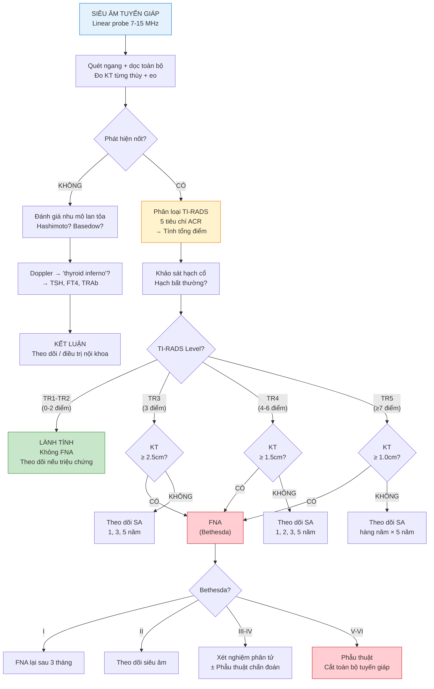

# BÀI HỌC Y KHOA: SIÊU ÂM TUYẾN GIÁP — GIẢI PHẪU, TI-RADS, BẤT THƯỜNG VÀ QUY TRÌNH KHẢO SÁT

**Ngày:** 2026-06-28 | **Chuyên khoa:** Siêu âm tổng quát | **Đối tượng:** Bác sĩ sản phụ khoa / học viên siêu âm

> **Tier 0 Guidelines:** EFSUMB 2026 — Guidelines on Multiparametric US Thyroid Nodule Evaluation Part I (PMID: 41330556); ESR Essentials 2026 — Thyroid Imaging Practice Recommendations (PMID: 41258456)
> **Phạm vi:** Giải phẫu siêu âm, mặt cắt, TI-RADS (ACR), bất thường hay gặp (nốt giáp, bướu giáp, Hashimoto, Basedow, ung thư), chỉ định FNA, Doppler.

---

## MỤC LỤC

0. TỔNG QUAN — Chỉ định, nguyên lý chung
1. CHUẨN BỊ BỆNH NHÂN & KỸ THUẬT CHUNG
2. GIẢI PHẪU SIÊU ÂM TUYẾN GIÁP
3. CÁC MẶT CẮT CẦN LÀM
4. QUY TRÌNH KHẢO SÁT
5. TI-RADS — PHÂN LOẠI NGUY CƠ ÁC TÍNH (ACR 2017)
6. CÁC DẤU HIỆU BẤT THƯỜNG HAY GẶP
7. DOPPLER TUYẾN GIÁP
8. CHỈ ĐỊNH FNA THEO ACR TI-RADS
9. LƯU ĐỒ QUYẾT ĐỊNH LÂM SÀNG
10. SAI LẦM THƯỜNG GẶP
11. ÁP DỤNG TẠI VIỆT NAM
12. TIPS THỰC HÀNH
13. TỔNG KẾT ĐIỂM CẦN NHỚ
14. TÀI LIỆU THAM KHẢO

---

## 0. TỔNG QUAN — CHỈ ĐỊNH, NGUYÊN LÝ CHUNG

Siêu âm tuyến giáp là phương tiện chẩn đoán hình ảnh **đầu tay và quan trọng nhất** để đánh giá bệnh lý tuyến giáp. Đây là kỹ thuật có độ phân giải cao, không nhiễm xạ, giá thành thấp và có thể thực hiện tại phòng khám.

**Chỉ định chính:**
- Sờ thấy khối/nốt vùng cổ trước
- Bất thường xét nghiệm chức năng tuyến giáp (TSH, FT3, FT4)
- Sàng lọc ở nhóm nguy cơ cao (tiền sử gia đình ung thư giáp, MEN2, xạ trị vùng cổ thời thơ ấu)
- Theo dõi sau phẫu thuật tuyến giáp hoặc sau điều trị I-131
- Triệu chứng chèn ép (nuốt vướng, khó thở, khàn tiếng)
- Bất thường phát hiện tình cờ trên CT/MRI/PET-CT

**Tần suất bệnh lý tuyến giáp:**
- Nốt giáp sờ thấy trên lâm sàng: **5% ở nữ, 1% ở nam**
- Nốt giáp phát hiện trên siêu âm: **19-68%** dân số (tăng theo tuổi, nữ > nam)
- Tỷ lệ ác tính trong nốt giáp: **7-15%**
- Ung thư giáp là ung thư nội tiết phổ biến nhất, tỷ lệ mắc tăng nhanh trên toàn cầu

---

## 1. CHUẨN BỊ BỆNH NHÂN & KỸ THUẬT CHUNG

### 1.1. Chuẩn bị bệnh nhân

| Yêu cầu | Lý do |
|---|---|
| **Tư thế**: nằm ngửa, kê gối dưới vai | Cổ ngửa tối đa, bộc lộ toàn bộ vùng cổ trước |
| **Cởi áo, tháo dây chuyền** | Tránh cản trở đầu dò |
| **Không cần nhịn đói đặc biệt** | Trừ khi kết hợp siêu âm bụng |
| **Giải thích bé nhẹ nhàng** | Trẻ em có thể sợ đầu dò đè vào cổ |

### 1.2. Thiết bị & Cài đặt

| Thông số | Giá trị khuyến cáo |
|---|---|
| **Đầu dò** | **Linear (phẳng) tần số cao 7-15 MHz** — BẮT BUỘC. Tần số cao cho độ phân giải tối ưu cấu trúc nông |
| **Độ sâu (Depth)** | 3-5 cm (tuyến giáp nằm nông, ngay dưới da) |
| **Gain** | Chỉnh sao cho nhu mô giáp bình thường có echo đồng nhất, không quá sáng |
| **Tiêu điểm (Focal zone)** | Đặt ở mức 1.5-3 cm (ngang mức tuyến giáp) |
| **Harmonic Imaging** | Có thể bật, nhưng lưu ý có thể làm nang echo kém trông giống nốt đặc |
| **Doppler màu** | PRF thấp (tuyến giáp là cơ quan rất giàu mạch máu) |
| **Elastography (nếu có)** | Strain hoặc Shear Wave — đánh giá độ cứng của nốt |

### 1.3. Cấu trúc báo cáo siêu âm tuyến giáp

Mỗi báo cáo siêu âm tuyến giáp cần mô tả:
1. Kích thước tuyến giáp (3 chiều: dài × ngang × dày cho từng thùy + eo)
2. Đặc điểm nhu mô: đồng nhất? không đồng nhất? echo gì?
3. Nốt: vị trí, kích thước, TI-RADS score, đặc điểm
4. Hạch cổ: bất thường?
5. Tổng kết + khuyến nghị (theo dõi / FNA / phẫu thuật)

---

## 2. GIẢI PHẪU SIÊU ÂM TUYẾN GIÁP

### 2.1. Vị trí & Hình dạng

Tuyến giáp nằm ở vùng cổ trước, ngang mức C5-T1, trước khí quản, hai bên thanh quản. Hình dạng giống **con bướm** với 2 thùy nối với nhau bằng eo tuyến.

### 2.2. Các cấu trúc giải phẫu trên siêu âm

| Cấu trúc | Vị trí | Đặc điểm siêu âm |
|---|---|---|
| **Thùy phải & Thùy trái** | Hai bên khí quản | Echo đồng nhất, hơi tăng echo hơn cơ ức đòn chũm; có các hạt echo rải rác (nang keo) |
| **Eo tuyến giáp** | Trước khí quản, ngang sụn nhẫn | Dải mô mỏng nối 2 thùy, dày ≤ **3 mm** |
| **Thùy tháp (Pyramidal lobe)** | Kéo dài từ eo lên trên | 30-50% dân số, phần còn lại của ống giáp lưỡi (thyroglossal duct) |
| **Khí quản (Trachea)** | Đường giữa, sau eo | Cấu trúc rỗng, vòng sụn hình móng ngựa, echo dày, bóng cản bẩn phía sau |
| **Thực quản (Esophagus)** | Sau thùy trái | Cấu trúc đa lớp "target sign" — lòng xẹp có thể có ít khí |
| **ĐM cảnh chung (CCA)** | Ngoài thùy giáp | Mạch đập, thành dày, không xẹp khi ấn |
| **TM cảnh trong (IJV)** | Ngoài CCA | Thành mỏng, xẹp khi ấn nhẹ, thay đổi theo hô hấp |
| **Cơ ức đòn chũm (SCM)** | Lớp nông nhất 2 bên | Dải cơ echo kém đồng nhất, bao quanh bởi cân |
| **Cơ ức giáp (Sternothyroid)** | Sát tuyến giáp | Dải cơ mỏng, echo kém, ngăn cách tuyến giáp và cơ ức đòn chũm |
| **Tuyến cận giáp (Parathyroid)** | Mặt sau thùy giáp | Bình thường KHÔNG THẤY (kích thước ~5×3×1 mm); khi thấy = u tuyến cận giáp |
| **Hạch cổ** | Dọc theo CCA/IJV | Bình thường hình bầu dục dẹt, rốn hạch echo dày, vỏ mỏng echo kém |

### 2.3. Kích thước bình thường (người lớn)

| Thành phần | Trục dọc (cm) | Trục ngang (cm) | Bề dày (cm) |
|---|---|---|---|
| **Thùy phải / trái** | 4-6 | 1.5-2.0 | 1.5-2.0 |
| **Eo tuyến giáp** | — | — | ≤ 0.3 |
| **Tổng thể tích tuyến** | Nữ: 6-18 ml; Nam: 8-20 ml (chiều dài × ngang × dày × 0.52 cho mỗi thùy, cộng lại) | | |

---

## 3. CÁC MẶT CẮT CẦN LÀM

### 3.1. Mặt cắt ngang (Transverse/Axial)

Đặt đầu dò **ngang** vùng cổ trước, quét từ trên xuống dưới.

| Mức | Cấu trúc thấy |
|---|---|
| **Trên eo (mức sụn giáp)** | Thùy phải, thùy trái, khí quản, thực quản, CCA, IJV |
| **Ngang eo** | Eo nối 2 thùy, khí quản phía sau |
| **Dưới eo (mức tuyến ức)** | Phần dưới 2 thùy, đôi khi thấy thùy tháp |

Mặt cắt ngang dùng để:
- Đo trục ngang và bề dày từng thùy
- Đánh giá mối liên quan nốt với khí quản, thực quản, bó mạch cảnh
- Khảo sát hạch cổ hai bên dọc theo CCA và IJV

### 3.2. Mặt cắt dọc (Sagittal/Longitudinal)

Đặt đầu dò **dọc** theo trục dài của từng thùy.

| Mặt cắt | Vị trí đầu dò | Cấu trúc thấy |
|---|---|---|
| **Dọc thùy phải** | Cạnh phải khí quản | Thùy phải toàn bộ chiều dài, CCA, IJV |
| **Dọc thùy trái** | Cạnh trái khí quản | Thùy trái toàn bộ chiều dài, thực quản (hình ống sau thùy trái) |
| **Dọc eo** | Đường giữa | Eo tuyến, khí quản phía sau |

Mặt cắt dọc dùng để:
- Đo chiều dài thùy
- Đánh giá giới hạn trên và dưới của nốt
- Đo kích thước nốt theo 2 chiều (dài × dày)

---

## 4. QUY TRÌNH KHẢO SÁT

```
BƯỚC 1: BN nằm ngửa, kê gối dưới vai, cổ ngửa tối đa
    ↓
BƯỚC 2: QUÉT NGANG toàn bộ tuyến giáp từ sụn giáp đến hõm ức
    ↓
BƯỚC 3: QUÉT DỌC thùy phải, thùy trái, eo — đo kích thước 3 chiều mỗi thùy
    ↓
BƯỚC 4: ĐÁNH GIÁ NHU MÔ: đồng nhất? echo (tăng/giảm/bình thường)? có dải xơ? có vi vôi hóa?
    ↓
BƯỚC 5: NẾU CÓ NỐT → đo 3 chiều + phân loại TI-RADS (5 tiêu chí ACR)
    ↓
BƯỚC 6: Doppler màu — đánh giá mạch máu nhu mô và trong nốt
    ↓
BƯỚC 7: KHẢO SÁT HẠCH CỔ 2 bên (vùng I-VI) — tìm hạch nghi ngờ
    ↓
BƯỚC 8: Nếu có chỉ định → đánh dấu vị trí sinh thiết FNA
    ↓
BƯỚC 9: KẾT LUẬN: TI-RADS score + khuyến cáo theo dõi/FNA
```

---

## 5. TI-RADS — PHÂN LOẠI NGUY CƠ ÁC TÍNH (ACR 2017)

**TI-RADS** (Thyroid Imaging Reporting and Data System) là hệ thống phân loại nguy cơ ác tính của nốt giáp do **American College of Radiology (ACR)** phát triển. Dựa trên 5 tiêu chí, mỗi tiêu chí được cho điểm.

### 5.1. Bảng điểm ACR TI-RADS (2017)

**1. Thành phần (Composition) — chọn 1:**

| Đặc điểm | Điểm |
|---|---|
| Nang hoặc gần như hoàn toàn là nang (Cystic/Almost completely cystic) | 0 |
| Dạng bọt biển (Spongiform) | 0 |
| Hỗn hợp nang-đặc (Mixed cystic and solid) | 1 |
| Đặc hoặc gần như hoàn toàn đặc (Solid/Almost completely solid) | 2 |

**2. Echo (Echogenicity) — chọn 1:**

| Đặc điểm | Điểm |
|---|---|
| Trống âm (Anechoic) | 0 |
| Tăng echo / đồng echo (Hyperechoic / Isoechoic) | 1 |
| Giảm echo (Hypoechoic) | 2 |
| Giảm echo rất mạnh (Very hypoechoic — thấp hơn cơ ức đòn chũm) | 3 |

**3. Hình dạng (Shape) — chọn 1:**

| Đặc điểm | Điểm |
|---|---|
| Rộng hơn cao (Wider-than-tall — trục ngang > trục dọc) | 0 |
| **Cao hơn rộng (Taller-than-wide — trục dọc > trục ngang)** | **3** |

**4. Bờ (Margin) — chọn 1:**

| Đặc điểm | Điểm |
|---|---|
| Bờ nhẵn (Smooth) | 0 |
| Bờ không rõ (Ill-defined) | 0 |
| Bờ thùy hoặc không đều (Lobulated/Irregular) | 2 |
| **Bờ xâm lấn ngoài tuyến giáp (Extra-thyroidal extension)** | **3** |

**5. Chấm echo dày (Echogenic Foci) — chọn TẤT CẢ những gì có:**

| Đặc điểm | Điểm |
|---|---|
| Không có hoặc đuôi sao chổi lớn (comet-tail artifact) | 0 |
| Vôi hóa lớn (Macrocalcifications) | 1 |
| Vôi hóa viền (Peripheral/rim calcifications) | 2 |
| **Chấm echo dày nhỏ (Punctate echogenic foci — microcalcifications)** | **3** |

### 5.2. Phân loại TI-RADS theo tổng điểm

| Tổng điểm | TI-RADS Level | Nguy cơ ác tính | Khuyến cáo |
|---|---|---|---|
| **0** | TR1 — Lành tính (Benign) | ≤ 2% | Không cần FNA |
| **2** | TR2 — Không nghi ngờ (Not Suspicious) | ≤ 2% | Không cần FNA |
| **3** | TR3 — Nghi ngờ nhẹ (Mildly Suspicious) | ≤ 5% | FNA nếu ≥ **2.5 cm**; theo dõi nếu ≥ **1.5 cm** |
| **4-6** | TR4 — Nghi ngờ vừa (Moderately Suspicious) | 5-20% | FNA nếu ≥ **1.5 cm**; theo dõi nếu ≥ **1.0 cm** |
| **≥ 7** | TR5 — Nghi ngờ cao (Highly Suspicious) | ≥ 20% | FNA nếu ≥ **1.0 cm**; theo dõi nếu ≥ **0.5 cm** |

### 5.3. Các đặc điểm lành tính điển hình

- **Nang đơn thuần**: trống âm, thành mỏng, không có thành phần đặc → TR1, không FNA
- **Dạng bọt biển (Spongiform)**: nốt echo đồng nhất, nhiều nang nhỏ như bọt biển → TR1
- **Nốt tăng echo đồng nhất, bờ nhẵn, rộng hơn cao, không chấm echo dày**: thường là lành tính

### 5.4. Các đặc điểm nghi ngờ ác tính (cần chú ý)

- **Cao hơn rộng (Taller-than-wide)** → TIỀN LƯỢNG ÁC TÍNH RẤT CAO (3 điểm)
- **Giảm echo rất mạnh** (very hypoechoic) → 3 điểm
- **Chấm echo dày nhỏ (microcalcifications)** → 3 điểm
- **Bờ xâm lấn ngoài tuyến** → 3 điểm

---

## 6. CÁC DẤU HIỆU BẤT THƯỜNG HAY GẶP

### 6.1. Nốt giáp lành tính (Benign Nodule)

| Đặc điểm | Mô tả |
|---|---|
| **Hình dạng** | Oval, rộng hơn cao |
| **Bờ** | Nhẵn, rõ |
| **Echo** | Đồng echo hoặc tăng echo |
| **Viền Halo** | Viền echo kém mỏng bao quanh (dấu hiệu lành tính) |
| **Thoái hóa nang** | Vùng echo trống trong nốt (do hoại tử/keo hóa lỏng) |
| **Đuôi sao chổi (Comet-tail artifact)** | Dấu hiệu đặc trưng của nốt keo (colloid nodule) — LÀNH TÍNH |

### 6.2. Bướu giáp đa nhân (Multinodular Goiter)

| Dấu hiệu | Mô tả |
|---|---|
| **Tuyến giáp to** | Thể tích tăng rõ, có thể chèn ép khí quản |
| **Nhiều nốt** | Kích thước, echo khác nhau; có thể nang, đặc, hoặc hỗn hợp |
| **Vôi hóa** | Vôi hóa thô, vôi hóa viền (hình "vỏ trứng") |
| **Nguy cơ ác tính** | Tương đương nốt đơn độc — MỖI NỐT phải được phân loại TI-RADS riêng |

### 6.3. Viêm giáp Hashimoto (Hashimoto's Thyroiditis)

Là bệnh tự miễn phổ biến nhất của tuyến giáp, gây suy giáp.

| Dấu hiệu siêu âm | Mô tả |
|---|---|
| **Nhu mô giảm echo lan tỏa** | Echo rất kém, "giả u" (pseudonodule) |
| **Dải xơ (Fibrous septa)** | Các dải echo dày chạy trong nhu mô |
| **Bề mặt không đều** | Viền bao tuyến không nhẵn |
| **Tăng sinh mạch lan tỏa** | Doppler thấy tăng tín hiệu mạch máu |
| **Giả u (Pseudonodule)** | Vùng echo kém khu trú dạng nốt, KHÔNG có viền rõ → dễ nhầm với nốt thật |
| **Vi vôi hóa** | Có thể có (tăng nguy cơ lymphoma giáp hoặc PTC trên nền Hashimoto) |

### 6.4. Bệnh Basedow (Graves' Disease)

Bệnh tự miễn gây cường giáp.

| Dấu hiệu siêu âm | Mô tả |
|---|---|
| **"Thyroid inferno"** | Tăng sinh mạch máu lan tỏa RẤT MẠNH trên Doppler màu — dấu hiệu gần như chẩn đoán |
| **Nhu mô giảm echo lan tỏa** | Không đồng nhất |
| **Tuyến giáp to** | Thường to lan tỏa, không có nốt khu trú |
| **Tăng vận tốc dòng chảy** | ĐM giáp trên và ĐM giáp dưới có PSV tăng cao |

### 6.5. Ung thư tuyến giáp (Thyroid Cancer)

**A. Ung thư tuyến giáp thể nhú (PTC — Papillary Thyroid Carcinoma):**

Chiếm **80-85%** ung thư giáp. Tiên lượng tốt.

| Dấu hiệu | Mô tả |
|---|---|
| **Giảm echo** | Rất giảm echo (very hypoechoic) |
| **Cao hơn rộng (Taller-than-wide)** | Dấu hiệu đặc trưng nhất trên mặt cắt ngang |
| **Bờ tua gai / không đều (Spiculated/Irregular)** | Xâm lấn vi thể |
| **Chấm echo dày nhỏ (Microcalcifications)** | Dấu hiệu RẤT gợi ý PTC |
| **Hạch di căn** | Hạch cổ tròn, mất rốn hạch, có vi vôi hóa, có thành phần nang |

**B. Ung thư thể nang (FTC — Follicular Thyroid Carcinoma):**

Chiếm ~10%. Khó phân biệt với u tuyến lành tính trên siêu âm.

| Dấu hiệu | Mô tả |
|---|---|
| **Nốt đặc, đồng echo hoặc tăng echo** | Thường không có đặc điểm ác tính rõ rệt |
| **Viền Halo dày, không đều** | Phân biệt với viền mỏng của u lành |
| **Xâm lấn mạch máu** | Chỉ thấy trên mô bệnh học (không thấy trên siêu âm) |

**C. Ung thư thể tủy (MTC — Medullary Thyroid Carcinoma):**

Chiếm ~5%. Liên quan MEN2. Sản xuất calcitonin.

| Dấu hiệu | Mô tả |
|---|---|
| **Nốt giảm echo, đặc** | Thường ở 1/3 trên thùy giáp |
| **Vôi hóa thô** | Phổ biến |
| **Hạch di căn sớm** | Tiên lượng xấu hơn PTC nếu di căn |

**D. Ung thư thể không biệt hóa (Anaplastic Thyroid Carcinoma):**

Rất hiếm (<2%), cực kỳ xâm lấn, tiên lượng rất xấu.

| Dấu hiệu | Mô tả |
|---|---|
| **Khối to xâm lấn** | Xâm lấn khí quản, thực quản, bó mạch cảnh |
| **Hoại tử, vôi hóa thô** | Echo hỗn hợp, bờ không rõ |
| **Hạch di căn rộng** | |

### 6.6. Hạch cổ — lành tính vs ác tính

| Đặc điểm | Lành tính | Ác tính / Di căn |
|---|---|---|
| **Hình dạng** | Bầu dục dẹt (tỷ lệ dài/ngang >2) | Tròn (tỷ lệ dài/ngang <2) |
| **Rốn hạch (Hilum)** | **CÓ** — echo dày ở trung tâm | **MẤT** rốn hạch |
| **Vỏ hạch** | Mỏng, đều | Dày, không đều |
| **Vôi hóa** | Không | **Có** (vi vôi hóa = đặc trưng di căn PTC) |
| **Thành phần nang** | Không | Có thể có (PTC di căn) |
| **Doppler** | Mạch máu rốn hạch | Mạch máu ngoại vi hoặc hỗn hợp |

---

## 7. DOPPLER TUYẾN GIÁP

Doppler màu và Doppler năng lượng (power Doppler) giúp đánh giá tình trạng mạch máu của tuyến giáp và các nốt.

### 7.1. Phân loại mạch máu trong nốt

| Pattern | Mô tả | Gợi ý |
|---|---|---|
| **Type I — Không mạch máu** | Không tín hiệu Doppler | Nang, nốt keo |
| **Type II — Mạch máu ngoại vi (Peripheral)** | Mạch máu viền quanh nốt | Lành tính (u tuyến, bướu keo) |
| **Type III — Mạch máu trung tâm (Central)** | Mạch máu chủ yếu trong nốt | Nghi ngờ ác tính (không đặc hiệu) |
| **Type IV — Mạch máu hỗn hợp (Mixed)** | Cả ngoại vi và trung tâm | Không đặc hiệu |

**Lưu ý**: Doppler KHÔNG phải là tiêu chí độc lập để phân biệt lành/ác. Nốt lành có thể tăng sinh mạch (u tuyến); nốt ác có thể ít mạch. Doppler bổ trợ, không thay thế TI-RADS.

### 7.2. Doppler trong bệnh lý lan tỏa

| Bệnh lý | Pattern Doppler đặc trưng |
|---|---|
| **Basedow (Graves)** | "Thyroid inferno" — tăng sinh mạch lan tỏa CỰC MẠNH; PSV ĐM giáp trên tăng cao |
| **Hashimoto (giai đoạn hoạt động)** | Tăng sinh mạch lan tỏa vừa phải |
| **Hashimoto (giai đoạn xơ teo)** | Giảm mạch máu (hypovascular) |
| **Viêm giáp bán cấp (de Quervain)** | Giảm mạch máu khu trú ở vùng viêm |

---

## 8. CHỈ ĐỊNH FNA THEO ACR TI-RADS

### 8.1. Bảng chỉ định FNA

| TI-RADS | Tổng điểm | Kích thước chỉ định FNA | Theo dõi (nếu không FNA) |
|---|---|---|---|
| **TR1** (Lành tính) | 0 | **Không FNA** | Không cần theo dõi |
| **TR2** (Không nghi ngờ) | 2 | **Không FNA** | Không cần theo dõi |
| **TR3** (Nghi ngờ nhẹ) | 3 | ≥ **2.5 cm** | Siêu âm theo dõi sau 1, 3, 5 năm nếu ≥ 1.5 cm |
| **TR4** (Nghi ngờ vừa) | 4-6 | ≥ **1.5 cm** | Siêu âm theo dõi sau 1, 2, 3, 5 năm nếu ≥ 1.0 cm |
| **TR5** (Nghi ngờ cao) | ≥ 7 | ≥ **1.0 cm** | Siêu âm theo dõi hàng năm trong 5 năm nếu ≥ 0.5 cm |

### 8.2. Khi nào không cần FNA dù TR cao?

- **Nốt < 1 cm** (dù TR5) — trừ khi có yếu tố nguy cơ cao (di căn hạch, xâm lấn ngoài tuyến, tiền sử gia đình)
- **Nang đơn thuần** (TR1) — kể cả khi kích thước lớn, trừ khi có triệu chứng chèn ép
- **Dạng bọt biển (Spongiform)** — lành tính, không cần FNA bất kể kích thước

### 8.3. Kết quả FNA — Phân loại Bethesda

| Bethesda | Chẩn đoán | Nguy cơ ác tính | Xử trí |
|---|---|---|---|
| **I** | Không đạt (Non-diagnostic) | 1-4% | FNA lại sau 3 tháng |
| **II** | Lành tính (Benign) | 0-3% | Theo dõi siêu âm |
| **III** | Tế bào không điển hình ý nghĩa không xác định (AUS/FLUS) | 5-15% | FNA lại ± xét nghiệm phân tử |
| **IV** | U tuyến thể nang / nghi ngờ u thể nang (FN/SFN) | 15-30% | Phẫu thuật chẩn đoán (cắt thùy) |
| **V** | Nghi ngờ ác tính (Suspicious for Malignancy) | 60-75% | Phẫu thuật (cắt toàn bộ tuyến giáp) |
| **VI** | Ác tính (Malignant) | 97-99% | Phẫu thuật (cắt toàn bộ tuyến giáp) |

---

## 9. LƯU ĐỒ QUYẾT ĐỊNH LÂM SÀNG



---

## 10. SAI LẦM THƯỜNG GẶP

| # | Sai lầm | Hậu quả | Cách tránh |
|---|---|---|---|
| 1 | **Dùng đầu dò convex (C5-2) thay vì linear** | Độ phân giải kém, bỏ sót vi vôi hóa và bờ tua gai | Luôn dùng **linear probe 7-15 MHz** cho tuyến giáp |
| 2 | **Không kê gối dưới vai** | Cổ không ngửa đủ, bỏ sót phần dưới thùy giáp và hạch trung thất trên | Kê gối dưới vai, cổ ngửa tối đa |
| 3 | **Chỉ phân loại TI-RADS 1 nốt lớn nhất** | Bỏ sót nốt nhỏ nhưng TR5 ở thùy còn lại | MỖI NỐT phải được phân loại TI-RADS riêng biệt |
| 4 | **Nhầm thực quản với nốt giáp** | Chẩn đoán sai, FNA không cần thiết | Thực quản có hình "target sign" đa lớp, nằm sau thùy TRÁI; cho BN nuốt → thực quản di động |
| 5 | **Không khảo sát hạch cổ** | Bỏ sót di căn hạch — thay đổi hoàn toàn kế hoạch điều trị | Luôn khảo sát hạch cổ 2 bên (Level I-VI) khi có nốt giáp |
| 6 | **FNA nốt nang đơn thuần** | Kết quả không đạt (Bethesda I), BN đau, tốn kém | Nang đơn thuần (TR1) → không FNA, trừ khi có triệu chứng chèn ép |
| 7 | **Không đo 3 chiều nốt** | Không đánh giá được "taller-than-wide" — bỏ sót dấu hiệu ác tính quan trọng | Đo dài × ngang × dày ở mặt cắt dọc và ngang |

---

## 11. ÁP DỤNG TẠI VIỆT NAM

- **Tình hình bệnh lý tuyến giáp tại VN**: Tỷ lệ bướu giáp cao (thiếu i-ốt trước đây); ung thư giáp tăng nhanh (đặc biệt PTC), là 1 trong 10 ung thư phổ biến nhất ở nữ.
- **Máy siêu âm**: Phần lớn BV tuyến huyện có máy siêu âm nhưng **không phải lúc nào cũng có linear probe**. Cần vận động trang bị đầu dò linear 7-12 MHz.
- **FNA**: Có sẵn ở BV tỉnh trở lên. Bethesda System được áp dụng rộng rãi. Xét nghiệm phân tử (BRAF V600E, TERT promoter) có ở các trung tâm lớn (K, Bạch Mai, ĐH Y Dược, Vinmec).
- **Điều trị**: Phẫu thuật tuyến giáp phổ biến (mổ mở và nội soi). I-131 có ở BV Ung Bướu, BV Chợ Rẫy, BV Bạch Mai.
- **Lưu ý tại VN**: Bướu giáp đa nhân lành tính phổ biến — tránh phẫu thuật quá mức. Phân biệt giả u (pseudonodule) trong Hashimoto với nốt thật sự.
- **Sàng lọc**: Chưa có chương trình sàng lọc quốc gia. Siêu âm tuyến giáp thường được làm khi BN đi khám sức khỏe tổng quát.

---

## 12. TIPS THỰC HÀNH — 10 TIPS

1. **Linear probe là BẮT BUỘC** — nếu không có linear probe, không nên làm siêu âm tuyến giáp vì sẽ bỏ sót tổn thương
2. **Kê gối dưới vai + cổ ngửa tối đa** — không ngửa cổ đủ = bỏ sót 1/3 dưới thùy giáp
3. **Mặt cắt ngang để đánh giá "taller-than-wide"** — đây là dấu hiệu quan trọng nhất (3 điểm TI-RADS)
4. **Đo 3 chiều MỖI nốt** — ghi rõ dài × ngang × dày; nếu taller-than-wide → nghi ngờ ác tính
5. **Đuôi sao chổi (comet-tail) = lành tính** — đặc trưng của nốt keo, đừng nhầm với microcalcifications
6. **Phân biệt thực quản với nốt giáp** — thực quản nằm sau thùy TRÁI, có target sign, di động khi nuốt
7. **Luôn khảo sát hạch cổ 2 bên** — hạch tròn, mất rốn hạch, vi vôi hóa, nang hóa = di căn PTC
8. **"Thyroid inferno" trên Doppler = Basedow** — gần như chẩn đoán xác định, không cần sinh thiết
9. **FNA nốt ≥ 1cm với TR5, ≥ 1.5cm với TR4, ≥ 2.5cm với TR3** — tuân thủ đúng ngưỡng ACR
10. **Kết quả Bethesda I (không đạt) → FNA lại sau 3 tháng** — đừng vội phẫu thuật nếu chưa có chẩn đoán tế bào học rõ ràng

---

## 13. TỔNG KẾT — 10 ĐIỂM CẦN NHỚ

1. **Siêu âm tuyến giáp là kỹ thuật đầu tay** — đánh giá nhu mô, nốt, hạch cổ, mạch máu
2. **Linear probe 7-15 MHz là bắt buộc** — không thay thế bằng convex probe
3. **ACR TI-RADS gồm 5 tiêu chí**: Thành phần (0-2đ) + Echo (0-3đ) + Hình dạng (0-3đ) + Bờ (0-3đ) + Chấm echo dày (0-3đ)
4. **Taller-than-wide (3 điểm) + Microcalcifications (3 điểm) + Very hypoechoic (3 điểm)** = bộ ba ác tính quan trọng nhất
5. **TR1-TR2 (0-2đ)**: không FNA; **TR3 (3đ)**: FNA ≥ 2.5cm; **TR4 (4-6đ)**: FNA ≥ 1.5cm; **TR5 (≥7đ)**: FNA ≥ 1.0cm
6. **Hashimoto**: nhu mô giảm echo lan tỏa + dải xơ; Basedow: "thyroid inferno" trên Doppler
7. **PTC (80-85% K giáp)**: giảm echo rất mạnh + taller-than-wide + microcalcifications + bờ tua gai
8. **Hạch di căn**: tròn, mất rốn hạch, vi vôi hóa, có thể có thành phần nang (đặc trưng PTC)
9. **Bethesda System**: I (không đạt) → FNA lại; II (lành) → theo dõi SA; III-IV → xét nghiệm phân tử ± phẫu thuật; V-VI → phẫu thuật
10. **Tại Việt Nam**: bướu giáp phổ biến, ung thư giáp tăng nhanh. Linear probe cần được trang bị. Tránh phẫu thuật quá mức nốt lành tính.

---

## 14. TÀI LIỆU THAM KHẢO

1. **Cantisani V, Radzina M, Dietrich CF, et al. (2026).** "EFSUMB Guidelines on Multiparametric Ultrasound Thyroid Nodule Evaluation: PART I." *Ultraschall in der Medizin*, 47(3):253-262. PMID: **41330556**. DOI: 10.1055/a-2761-1191. [GUIDELINE VERIFIED — Tier 0, EFSUMB 2026 — GOLD STANDARD]

2. **Vassallo E, Péporté A, McQueen A, et al. (2026).** "ESR Essentials: Thyroid Imaging — Practice Recommendations by the European Society of Head and Neck Radiology." *European Radiology*, 36(5):3788-3796. PMID: **41258456**. DOI: 10.1007/s00330-025-12101-2. [GUIDELINE VERIFIED — Tier 0, ESR 2026]

3. **Dietrich CF, Müller T, Bojunga J, et al. (2018).** "Statement and Recommendations on Interventional Ultrasound as a Thyroid Diagnostic and Treatment Procedure." *Ultrasound in Medicine & Biology*, 44(1):14-36. PMID: **29126752**. [GUIDELINE VERIFIED — Tier 1, WFUMB Thyroid Intervention 2018]

4. **Tessler FN, Middleton WD, Grant EG, et al. (2017).** "ACR Thyroid Imaging, Reporting and Data System (TI-RADS): White Paper of the ACR TI-RADS Committee." *Journal of the American College of Radiology*, 14(5):587-595. [GUIDELINE VERIFIED — Tier 0, ACR TI-RADS original white paper]

5. **Cibas ES, Ali SZ. (2017).** "The 2017 Bethesda System for Reporting Thyroid Cytopathology." *Thyroid*, 27(11):1341-1346. [GUIDELINE VERIFIED — Tier 0, Bethesda 2017]

---

**— Hết bài học ngày 2026-06-28 —**

**Bác sĩ:** Ngọc Hưng 🍅 🐈‍⬛ | **AI:** opencode (deepseek-v4-pro) | **Bài số 25** | **Chuyên khoa:** Siêu âm tổng quát — Siêu âm tuyến giáp
