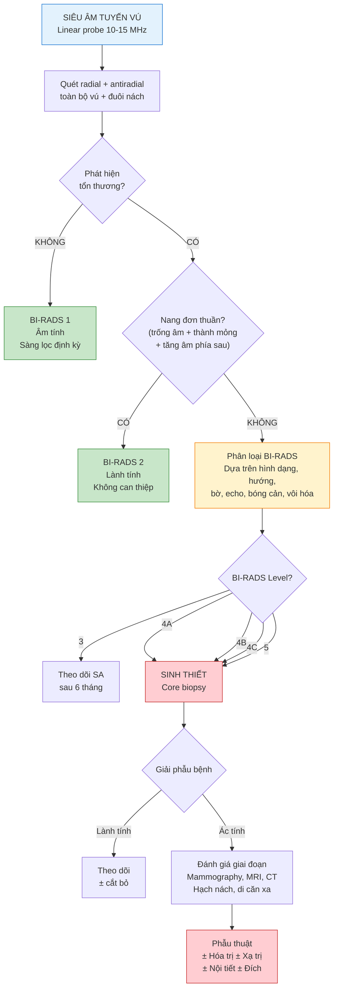

# BÀI HỌC Y KHOA: SIÊU ÂM TUYẾN VÚ — GIẢI PHẪU, BI-RADS, BẤT THƯỜNG VÀ QUY TRÌNH KHẢO SÁT

**Ngày:** 2026-06-28 | **Chuyên khoa:** Siêu âm tổng quát | **Đối tượng:** Bác sĩ sản phụ khoa / học viên siêu âm

> **Tier 0 Guidelines:** CAR 2026 — Practice Guidelines on Breast Ultrasound (PMID: 42198835); ACR BI-RADS 5th Edition; ACR Appropriateness Criteria 2024 — Supplemental Breast Cancer Screening (PMID: 40409891)
> **Phạm vi:** Giải phẫu siêu âm vú, mặt cắt radial/antiradial, BI-RADS classification, tổn thương lành tính (nang, fibroadenoma) và ác tính (IDC, DCIS), hạch nách, Doppler, sơ bộ elastography.

---

## MỤC LỤC

0. TỔNG QUAN — Chỉ định, nguyên lý chung
1. CHUẨN BỊ BỆNH NHÂN & KỸ THUẬT CHUNG
2. GIẢI PHẪU SIÊU ÂM TUYẾN VÚ
3. CÁC MẶT CẮT CẦN LÀM
4. QUY TRÌNH KHẢO SÁT
5. BI-RADS SIÊU ÂM — PHÂN LOẠI NGUY CƠ
6. CÁC TỔN THƯƠNG HAY GẶP (LÀNH TÍNH & ÁC TÍNH)
7. DOPPLER & ELASTOGRAPHY
8. KHẢO SÁT HẠCH NÁCH
9. LƯU ĐỒ QUYẾT ĐỊNH LÂM SÀNG
10. SAI LẦM THƯỜNG GẶP
11. ÁP DỤNG TẠI VIỆT NAM
12. TIPS THỰC HÀNH
13. TỔNG KẾT ĐIỂM CẦN NHỚ
14. TÀI LIỆU THAM KHẢO

---

## 0. TỔNG QUAN — CHỈ ĐỊNH, NGUYÊN LÝ CHUNG

Siêu âm tuyến vú là kỹ thuật chẩn đoán hình ảnh quan trọng, đặc biệt ở **phụ nữ trẻ < 30 tuổi có mô vú dày** (mammography có độ nhạy thấp). Đây là phương tiện bổ trợ không thể thiếu cho mammography và MRI vú.

**Chỉ định chính:**
- Khối sờ thấy ở vú hoặc nách (triệu chứng phổ biến nhất)
- Đau vú khu trú (mastalgia)
- Tiết dịch núm vú bất thường (đặc biệt dịch máu hoặc 1 bên)
- Da vú dày lên, đỏ, phù nề (nghĩ viêm vú, ung thư vú thể viêm)
- Mô vú dày trên mammography (ACR BI-RADS C hoặc D) — siêu âm bổ sung tầm soát
- **Bất thường trên mammography cần siêu âm để đặc điểm hóa** (BI-RADS 0)
- Hướng dẫn sinh thiết lõi (core biopsy) hoặc hút tế bào (FNA)
- Theo dõi sau điều trị bảo tồn / phẫu thuật vú
- Sàng lọc ở phụ nữ nguy cơ cao (BRCA1/2, tiền sử gia đình, tiền sử xạ trị thành ngực)
- Đánh giá túi ngực (breast implant) — vỡ, co bao

**Ưu điểm của siêu âm vú so với mammography:**
- Không nhiễm xạ — an toàn cho phụ nữ trẻ và thai kỳ
- Phân biệt nang đơn thuần vs khối đặc (không cần chọc hút)
- Đặc điểm hóa tổn thương ở mô vú dày (mammogram độ nhạy giảm còn ~30-50%)
- Đánh giá hạch nách tại chỗ
- Hướng dẫn can thiệp thời gian thực

**Nhược điểm:**
- Phụ thuộc người làm (operator-dependent)
- Không phát hiện được vi vôi hóa đơn độc không kèm khối (DCIS grade thấp)
- Không thay thế mammography trong sàng lọc đại trà

---

## 1. CHUẨN BỊ BỆNH NHÂN & KỸ THUẬT CHUNG

### 1.1. Chuẩn bị bệnh nhân

| Yêu cầu | Lý do |
|---|---|
| **Tư thế**: nằm ngửa, tay cùng bên giơ lên trên đầu | Bộc lộ toàn bộ vú và hố nách, mô vú trải phẳng tối đa |
| **Cởi áo hoàn toàn phần trên** | Tránh artifact do vải; có thể khảo sát đối bên nếu cần |
| **Gel ấm, đầy đủ** | Giảm khó chịu, tối ưu tiếp xúc đầu dò-da |
| **Hỏi tiền sử**: phẫu thuật vú? xạ trị? tiền sử gia đình K vú? | Giúp định hướng chẩn đoán |
| **Đối chiếu mammography** | Nếu có — xem vị trí, BI-RADS trên mammogram trước khi siêu âm |

### 1.2. Thiết bị & Cài đặt

| Thông số | Giá trị khuyến cáo |
|---|---|
| **Đầu dò** | **Linear (phẳng) tần số cao 10-15 MHz** — BẮT BUỘC. Tần số ≥ 10 MHz cho độ phân giải tối ưu |
| **Độ sâu (Depth)** | 3-5 cm (vú bình thường); có thể cần sâu hơn ở vú to hoặc implant |
| **Gain** | Chỉnh sao cho mỡ dưới da có echo vừa phải, không quá sáng |
| **Tiêu điểm (Focal zone)** | Đặt ngay dưới tổn thương (nếu có); hoặc ở mức nhu mô tuyến |
| **Harmonic Imaging** | Bật — cải thiện độ tương phản, giảm artifact |
| **Spatial Compounding (CrossBeam)** | Bật nếu có — giảm nhiễu hạt, cải thiện bờ tổn thương |
| **Doppler màu** | PRF thấp — đánh giá mạch máu trong tổn thương |
| **Elastography (nếu có)** | Strain hoặc Shear Wave — đánh giá độ cứng |

### 1.3. Cấu trúc báo cáo siêu âm vú

Mỗi báo cáo cần:
1. Vị trí tổn thương: bên (P/T), quadrant, vị trí theo mặt đồng hồ (clock-face), khoảng cách đến núm vú
2. Kích thước: tối đa ở mặt cắt radial và antiradial
3. Đặc điểm BI-RADS (hình dạng, hướng, bờ, echo, echo phía sau, vôi hóa, đặc điểm phụ)
4. Đánh giá hạch nách
5. BI-RADS category cuối cùng + khuyến cáo

---

## 2. GIẢI PHẪU SIÊU ÂM TUYẾN VÚ

### 2.1. Các lớp giải phẫu từ nông đến sâu

| Lớp | Đặc điểm siêu âm | Độ dày |
|---|---|---|
| **1. Da (Skin)** | Đường echo dày, liên tục, song song bề mặt đầu dò | 1-3 mm |
| **2. Lớp mỡ dưới da (Subcutaneous Fat / Premammary Fat)** | Echo kém, các thùy mỡ ngăn cách bởi vách liên kết | Thay đổi |
| **3. Mô tuyến vú (Glandular Tissue / Fibroglandular Tissue)** | Echo dày không đồng nhất, dạng thùy, hỗn hợp mô tuyến + mô đệm. **Đây là lớp dày nhất ở phụ nữ trẻ** | Dày nhất ở phụ nữ 20-40 tuổi |
| **4. Lớp mỡ sau tuyến vú (Retromammary Fat)** | Echo kém, tương tự lớp mỡ dưới da | Mỏng |
| **5. Cân ngực (Pectoral Fascia)** | Đường echo dày mảnh, nằm trên cơ ngực lớn | — |
| **6. Cơ ngực lớn (Pectoralis Major)** | Dải cơ echo kém đồng nhất, các bó cơ song song | — |
| **7. Xương sườn (Ribs)** | Echo dày, hình oval, bóng cản phía sau | — |
| **8. Màng phổi (Pleura)** | Đường echo dày, di động theo hô hấp (có thể thấy) | — |

### 2.2. Dây chằng Cooper (Cooper's Ligaments)

Dải mô liên kết chạy từ cân nông đến cân sâu, nâng đỡ mô vú. Trên siêu âm: đường echo dày mỏng, lượn sóng.

**Dấu hiệu quan trọng**: Khối ác tính có thể gây co kéo hoặc phá vỡ dây chằng Cooper → lõm da (skin dimpling), tụt núm vú (nipple retraction).

### 2.3. Phân vùng vú theo mặt đồng hồ

Vú được chia thành **4 quadrant** + vùng trung tâm + đuôi nách:

| Vị trí | Mô tả |
|---|---|
| **1 giờ — 3 giờ** | 1/4 trên trong (UOQ — Upper Outer Quadrant) — vị trí hay gặp ung thư nhất |
| **10 giờ — 12 giờ** | 1/4 trên ngoài (UIQ — Upper Inner Quadrant) |
| **4 giờ — 6 giờ** | 1/4 dưới ngoài (LOQ — Lower Outer Quadrant) |
| **7 giờ — 9 giờ** | 1/4 dưới trong (LIQ — Lower Inner Quadrant) |
| **Sau núm vú** | Vùng trung tâm (Retroareolar / Central) |
| **Đuôi nách (Axillary Tail / Tail of Spence)** | Kéo dài về phía hố nách |

**Ký hiệu vị trí**: "Vú trái, vị trí 2 giờ, cách núm vú 3 cm" → dùng mặt đồng hồ (clock-face) + khoảng cách đến núm vú.

---

## 3. CÁC MẶT CẮT CẦN LÀM

### 3.1. Mặt cắt Radial (dọc theo ống tuyến)

Đầu dò đặt theo hướng **từ núm vú ra ngoại vi** (giống nan hoa bánh xe).

- **Mục đích**: Đánh giá ống tuyến dọc theo trục giải phẫu (từ núm vú đến ngoại vi). Tổn thương nằm trong ống tuyến (intraductal papilloma, DCIS) thấy rõ hơn.
- **Cách làm**: Quét toàn bộ vú theo từng "múi" (segment) — giống như cắt bánh. Mỗi lần quét là 1 đường từ núm vú ra ngoại vi.

### 3.2. Mặt cắt Antiradial (vuông góc với ống tuyến)

Đầu dò đặt **vuông góc** với mặt cắt radial.

- **Mục đích**: Đo bề rộng của tổn thương, đánh giá bờ theo chiều vuông góc. Mặt cắt antiradial quan trọng để xác định tổn thương có bờ đều (lành tính) hay tua gai (ác tính).
- **Cách làm**: Quét theo từng vòng tròn đồng tâm từ núm vú ra ngoài.

### 3.3. Kỹ thuật quét hệ thống (Systematic Scanning)

Có 2 cách:

**Cách 1 — Quét theo quadrant (phổ biến nhất):**
```
1. Bắt đầu từ 12 giờ → quét radial từ núm vú ra ngoại vi
2. Lặp lại antiradial cùng quadrant
3. Tiếp tục theo chiều kim đồng hồ: 1h, 2h, 3h, ... 11h
4. Không quên vùng sau núm vú (retroareolar) và đuôi nách
   ↓
5. Khi phát hiện tổn thương → đo ở cả radial và antiradial
```

**Cách 2 — Quét lawn-mower (cắt cỏ):**
Không theo mặt đồng hồ mà quét từng hàng ngang hoặc dọc toàn bộ vú. Áp dụng khi sàng lọc nhanh.

### 3.4. Các mặt cắt bổ sung

| Mặt cắt | Khi nào dùng |
|---|---|
| **Nén nhẹ (Gentle compression)** | Phân biệt nang (xẹp khi nén) với khối đặc; đánh giá độ cứng; đẩy artifact |
| **So sánh đối bên** | Khi không chắc tổn thương có phải mô vú bình thường hay không |
| **Siêu âm hố nách** | Bắt buộc nếu nghi ngờ ác tính hoặc có hạch sờ thấy |

---

## 4. QUY TRÌNH KHẢO SÁT

```
BƯỚC 1: BN nằm ngửa, tay cùng bên giơ lên đầu
    ↓
BƯỚC 2: Xác định vùng cần khảo sát (BN chỉ điểm đau? sờ thấy khối?)
    ↓
BƯỚC 3: QUÉT TOÀN BỘ VÚ — radial + antiradial theo quadrant
    ↓
BƯỚC 4: Vùng sau núm vú (retroareolar) — dùng góc nghiêng đầu dò
    ↓
BƯỚC 5: Đuôi nách (axillary tail) — hướng đầu dò lên trên ra nách
    ↓
BƯỚC 6: NẾU CÓ TỔN THƯƠNG → đo 2 chiều (radial + antiradial)
    ↓
BƯỚC 7: Phân loại BI-RADS — 6 đặc điểm
    ↓
BƯỚC 8: Doppler màu — đánh giá mạch máu tổn thương
    ↓
BƯỚC 9: Elastography (nếu có) — đánh giá độ cứng
    ↓
BƯỚC 10: SIÊU ÂM HỐ NÁCH — hạch bất thường?
    ↓
BƯỚC 11: So sánh đối bên nếu cần
    ↓
BƯỚC 12: KẾT LUẬN: BI-RADS category + khuyến cáo
```

---

## 5. BI-RADS SIÊU ÂM — PHÂN LOẠI NGUY CƠ (ACR 5th Edition)

BI-RADS siêu âm dựa trên 6 nhóm đặc điểm. Mỗi nhóm chọn 1 mô tả phù hợp nhất.

### 5.1. Đặc điểm BI-RADS siêu âm

**1. Hình dạng (Shape):**

| Đặc điểm | Gợi ý |
|---|---|
| **Oval (Bầu dục)** — bao gồm cả "2-3 thùy nhẹ" (macrolobulated) | Lành tính |
| **Tròn (Round)** | Có thể lành hoặc ác |
| **Không đều (Irregular)** | **Nghi ngờ ác tính** |

**2. Hướng (Orientation):**

| Đặc điểm | Gợi ý |
|---|---|
| **Song song với da (Parallel)** — trục dài song song da | Lành tính |
| **Không song song (Not Parallel)** — trục dài vuông góc da, "taller-than-wide" | **Nghi ngờ ác tính** |

**3. Bờ (Margin):**

| Đặc điểm | Gợi ý |
|---|---|
| **Ranh giới rõ (Circumscribed)** — bờ nhẵn, rõ nét | Lành tính |
| **Không rõ (Not circumscribed)**: bờ không đều (indistinct), góc cạnh (angular), tua gai (spiculated), vi thùy (microlobulated) | **Nghi ngờ ác tính** |

**4. Echo (Echo Pattern):**

| Đặc điểm | Gợi ý |
|---|---|
| **Trống âm (Anechoic)** | Nang |
| **Tăng echo (Hyperechoic)** | Thường lành tính (mỡ, u mỡ) |
| **Nang phức tạp (Complex cystic and solid)** | Có thể lành hoặc ác |
| **Giảm echo (Hypoechoic)** | Có thể lành hoặc ác (RẤT THƯỜNG GẶP) |
| **Đồng echo (Isoechoic)** | Có thể lành hoặc ác |
| **Không đồng nhất (Heterogeneous)** | Nghi ngờ ác tính |

**5. Đặc điểm echo phía sau (Posterior Features):**

| Đặc điểm | Gợi ý |
|---|---|
| **Không thay đổi (No posterior features)** | Không đặc hiệu |
| **Tăng âm (Enhancement)** | Nang, fibroadenoma |
| **Bóng cản (Shadowing)** | **Nghi ngờ ác tính** (do xơ hóa mô đệm quanh u, desmoplasia) |
| **Kết hợp (Combined pattern)** | Nghi ngờ ác tính |

**6. Vôi hóa (Calcifications):**

| Đặc điểm | Gợi ý |
|---|---|
| **Không có** | — |
| **Vôi hóa trong khối (Calcifications in a mass)** | Có thể lành hoặc ác |
| **Vôi hóa ngoài khối (Calcifications outside a mass)** | Cần mammography để đặc điểm hóa |
| **Vôi hóa trong ống tuyến (Intraductal calcifications)** | **Nghi ngờ DCIS** |

**7. Đặc điểm phụ (Associated Features):**

| Đặc điểm | Gợi ý |
|---|---|
| Biến dạng cấu trúc (Architectural distortion) | Ác tính |
| Thay đổi ống tuyến (Duct changes) — ống tuyến giãn hoặc lấp đầy | Có thể DCIS, papilloma |
| Thay đổi da: dày da (skin thickening), co kéo da (skin retraction) | Ác tính |
| Phù nề (Edema) | Viêm, ác tính |
| Tăng sinh mạch (Vascularity) | Không đặc hiệu |
| Mất ranh giới (Elasticity assessment) — khối cứng | Nghi ngờ ác tính |

### 5.2. Bảng phân loại BI-RADS

| BI-RADS | Mô tả | Nguy cơ ác tính | Khuyến cáo |
|---|---|---|---|
| **0** | Chưa hoàn chỉnh (Incomplete) | — | Cần thêm hình ảnh (mammography, MRI) |
| **1** | Âm tính (Negative) | 0% | Sàng lọc định kỳ |
| **2** | Lành tính (Benign) — nang đơn thuần, fibroadenoma ổn định, hạch trong vú, implant intact | 0% | Sàng lọc định kỳ |
| **3** | Có thể lành tính (Probably Benign) | **≤ 2%** | Siêu âm theo dõi ngắn hạn (6 tháng) |
| **4A** | Nghi ngờ ác tính thấp | **2-10%** | Sinh thiết |
| **4B** | Nghi ngờ ác tính vừa | **10-50%** | Sinh thiết |
| **4C** | Nghi ngờ ác tính cao | **50-95%** | Sinh thiết |
| **5** | Rất nghi ngờ ác tính | **≥ 95%** | Sinh thiết |
| **6** | Đã xác nhận ác tính qua sinh thiết | 100% | Điều trị theo giai đoạn |

---

## 6. CÁC TỔN THƯƠNG HAY GẶP (LÀNH TÍNH & ÁC TÍNH)

### 6.1. A — TỔN THƯƠNG LÀNH TÍNH

**A1. Nang vú đơn thuần (Simple Cyst):**

TIÊU CHUẨN CHẨN ĐOÁN (3 tiêu chuẩn — cần CẢ 3):
1. Trống âm (anechoic)
2. Thành mỏng, không thấy
3. Tăng âm phía sau (posterior acoustic enhancement)

| Đặc điểm | Mô tả |
|---|---|
| **BI-RADS** | 2 (lành tính) |
| **Xử trí** | Không cần chọc hút, trừ khi có triệu chứng đau hoặc quá to |
| **Dịch tễ** | 25-30% phụ nữ dưới 50 tuổi |

**A2. Nang phức tạp (Complicated Cyst):**

Là nang có echo bên trong (mảnh vụn, xuất huyết, viêm), nhưng thành vẫn mỏng và còn tăng âm phía sau.

| Đặc điểm | Mô tả |
|---|---|
| **BI-RADS** | 3 (theo dõi) hoặc 2 (nếu điển hình) |
| **Xử trí** | Theo dõi hoặc chọc hút nếu có triệu chứng |

**A3. Fibroadenoma (U xơ tuyến — Bướu sợi tuyến):**

Khối u lành tính phổ biến nhất ở phụ nữ trẻ (15-35 tuổi).

| Đặc điểm | Mô tả |
|---|---|
| **Hình dạng** | **Oval**, thường có 2-3 thùy nhẹ (macrolobulated) |
| **Hướng** | **Song song với da** (rộng hơn cao) |
| **Bờ** | **Ranh giới rõ** (circumscribed) |
| **Echo** | Giảm echo đồng nhất (hypoechoic) |
| **Phía sau** | Tăng âm hoặc không thay đổi |
| **BI-RADS** | 3 (tuổi trẻ, điển hình) hoặc 2 (ổn định qua nhiều lần SA) |
| **Xử trí** | Theo dõi siêu âm 6-12 tháng hoặc sinh thiết nếu > 35T, tăng kích thước, hoặc đặc điểm không điển hình |

**A4. Nang dầu (Oil Cyst / Fat Necrosis):**

| Đặc điểm | Mô tả |
|---|---|
| **Nguyên nhân** | Sau chấn thương, phẫu thuật, xạ trị — hoại tử mỡ |
| **Hình ảnh** | Nang echo trống hoặc hỗn hợp, có thể có vôi hóa viền (egg-shell calcification), thành dày |
| **BI-RADS** | 2 nếu điển hình; 3 hoặc 4A nếu không điển hình |

**A5. Áp xe vú (Breast Abscess):**

| Đặc điểm | Mô tả |
|---|---|
| **Lâm sàng** | Sốt, đau, đỏ, sưng vú; hay gặp ở phụ nữ cho con bú (lactational mastitis) |
| **Hình ảnh** | Khối echo hỗn hợp, bờ không đều, có dịch echo kém bên trong (mủ), thành dày, tăng sinh mạch viền trên Doppler |
| **BI-RADS** | 2 hoặc 3 |
| **Xử trí** | Dẫn lưu (chọc hút hoặc rạch) + kháng sinh |

### 6.2. B — TỔN THƯƠNG ÁC TÍNH

**B1. Ung thư vú thể ống xâm lấn (IDC — Invasive Ductal Carcinoma):**

Chiếm **70-80%** ung thư vú xâm lấn.

| Đặc điểm siêu âm | Mô tả |
|---|---|
| **Hình dạng** | **KHÔNG ĐỀU (Irregular)** |
| **Hướng** | **Không song song da** — "taller-than-wide" |
| **Bờ** | **TUA GAI (Spiculated)** hoặc góc cạnh (angular), không rõ |
| **Echo** | **Giảm echo rõ** (markedly hypoechoic), không đồng nhất |
| **Phía sau** | **BÓNG CẢN (Posterior shadowing)** — dấu hiệu đặc trưng |
| **Vôi hóa** | Có thể có vi vôi hóa trong khối |
| **Mô xung quanh** | Biến dạng cấu trúc (architectural distortion), co kéo dây chằng Cooper |
| **Doppler** | Tăng sinh mạch trung tâm và ngoại vi, RI cao |
| **BI-RADS** | **4C hoặc 5** |

**B2. Ung thư vú thể tiểu thùy xâm lấn (ILC — Invasive Lobular Carcinoma):**

Chiếm ~10%. **KHÓ PHÁT HIỆN** trên cả mammography và siêu âm.

| Đặc điểm siêu âm | Mô tả |
|---|---|
| **Hình ảnh** | Có thể chỉ thấy **bóng cản khu trú không có khối rõ** (focal shadowing without mass) |
| **Bờ** | Biến dạng cấu trúc, mô vú không đối xứng |
| **Khối** | Nếu thấy khối: giảm echo, bờ tua gai |
| **BI-RADS** | 4 hoặc 5 (nhưng dễ âm tính giả) |

**B3. DCIS (Ductal Carcinoma In Situ):**

Ung thư tại chỗ, chưa xâm lấn qua màng đáy.

| Đặc điểm siêu âm | Mô tả |
|---|---|
| **Khối** | Có thể thấy giảm echo, bờ không đều, hình ống (tubular) hoặc phân nhánh |
| **Ống tuyến giãn** | Ống tuyến giãn chứa mô echo kém |
| **Vi vôi hóa** | Có thể thấy chấm echo dày trong ống tuyến giãn — phát hiện TỐT HƠN trên mammography |
| **Không có khối** | Nhiều trường hợp DCIS grade thấp KHÔNG thấy trên siêu âm (chỉ thấy vi vôi hóa trên mammogram) |
| **BI-RADS** | 4 (nếu thấy) |

### 6.3. BẢNG TỔNG HỢP: LÀNH vs ÁC TRÊN SIÊU ÂM

| Đặc điểm | Lành tính | Ác tính |
|---|---|---|
| **Hình dạng** | Oval, tròn | **Không đều** (Irregular) |
| **Hướng** | **Song song da** (Parallel) | **Không song song da** (Taller-than-wide) |
| **Bờ** | Ranh giới rõ (Circumscribed) | **Tua gai (Spiculated), góc cạnh, vi thùy** |
| **Echo** | Đồng echo, tăng echo | **Giảm echo rõ, không đồng nhất** |
| **Phía sau** | Tăng âm, không đổi | **Bóng cản (Shadowing)** |
| **Vôi hóa** | Vôi hóa thô, viền | Vi vôi hóa trong khối / ống tuyến |
| **Mô xung quanh** | Bình thường | Biến dạng cấu trúc, co kéo da, dày da, phù nề |
| **Đàn hồi (Elastography)** | Mềm, biến dạng khi nén | **Cứng**, không biến dạng |
| **Ví dụ** | Nang đơn thuần, Fibroadenoma | IDC, ILC, DCIS |

---

## 7. DOPPLER & ELASTOGRAPHY

### 7.1. Doppler màu

Doppler KHÔNG phải là tiêu chí độc lập trong BI-RADS 5th, nhưng cung cấp thông tin bổ trợ.

| Đặc điểm | Lành tính | Ác tính |
|---|---|---|
| **Mạch máu** | Ngoại vi, ít mạch máu | **Trung tâm + ngoại vi, tăng sinh mạch mạnh** |
| **RI (Resistive Index)** | < 0.7 | **> 0.7** (gợi ý, không chẩn đoán) |
| **Số mạch máu** | ít (< 2-3 mạch) | Nhiều mạch xuyên thấu (penetrating vessels) |

### 7.2. Elastography (Siêu âm đàn hồi)

Đánh giá **độ cứng** của mô. Mô ác tính (xơ hóa mô đệm — desmoplasia) cứng hơn mô lành.

**Strain Elastography — Thang điểm Tsukuba (1-5):**

| Điểm | Mô tả | Gợi ý |
|---|---|---|
| **1** | Toàn bộ tổn thương mềm (biến dạng đều) | Lành tính |
| **2** | Hầu hết mềm, có vài vùng cứng nhỏ | Lành tính |
| **3** | Cứng ở ngoại vi, mềm ở trung tâm | Không xác định |
| **4** | Toàn bộ tổn thương cứng | **Ác tính** |
| **5** | Cứng lan ra mô xung quanh | **Ác tính** |

**Shear Wave Elastography (SWE):**
- Đo vận tốc sóng biến dạng (m/s) hoặc độ cứng (kPa)
- **Emax > 80 kPa** (hoặc > 160 kPa tùy máy) → nghi ngờ ác tính
- **Emean** thấp, đồng nhất → lành tính

---

## 8. KHẢO SÁT HẠCH NÁCH

Khảo sát hạch nách là **BẮT BUỘC** khi:
- Phát hiện tổn thương BI-RADS 4 hoặc 5
- Có khối sờ thấy ở nách
- Ung thư vú đã xác nhận (đánh giá giai đoạn)

### 8.1. Hạch nách bình thường

| Đặc điểm | Mô tả |
|---|---|
| **Hình dạng** | Bầu dục dẹt (tỷ lệ dài/ngang > 2) |
| **Vỏ hạch** | Echo kém, mỏng, đều |
| **Rốn hạch (Hilum)** | **CÓ** — echo dày ở trung tâm (mô mỡ + mạch máu) |
| **Mạch máu** | Doppler thấy mạch máu đi vào qua rốn hạch |
| **Kích thước** | Trục ngắn thường ≤ 1 cm (có thể lớn hơn ở người béo phì) |

### 8.2. Hạch nách ác tính / Di căn

| Đặc điểm | Mô tả |
|---|---|
| **Hình dạng** | **Tròn** (tỷ lệ dài/ngang < 2) |
| **Vỏ hạch** | **Dày, không đều**, echo kém (xâm lấn vỏ) |
| **Rốn hạch** | **MẤT hoặc bị đẩy lệch** |
| **Vôi hóa** | Có thể có vi vôi hóa (di căn từ K vú) |
| **Mạch máu** | Mạch máu ngoại vi, xuyên vỏ (không qua rốn hạch) |

**Lưu ý**: Không phải mọi hạch tròn đều là di căn — hạch viêm phản ứng cũng có thể tròn. Kết hợp lâm sàng.

---

## 9. LƯU ĐỒ QUYẾT ĐỊNH LÂM SÀNG



---

## 10. SAI LẦM THƯỜNG GẶP

| # | Sai lầm | Hậu quả | Cách tránh |
|---|---|---|---|
| 1 | **Dùng đầu dò convex thay vì linear** | Độ phân giải kém, bỏ sót bờ tua gai và vi vôi hóa | Luôn dùng **linear probe ≥ 10 MHz** |
| 2 | **Không khảo sát đối bên** | Bỏ sót ung thư vú 2 bên (2-5% các trường hợp) | Luôn hỏi BN có muốn khảo sát cả 2 bên; khảo sát nếu nghi ngờ |
| 3 | **Nhầm mô mỡ vú bình thường với khối** | Bệnh nhân lo lắng, sinh thiết không cần thiết | Mô mỡ có echo kém nhưng hình thùy, có vách mỏng, không có bờ rõ như khối; so sánh đối bên |
| 4 | **Không khảo sát hạch nách khi có BI-RADS 4-5** | Bỏ sót di căn hạch, đánh giá sai giai đoạn | BẮT BUỘC siêu âm hạch nách khi nghi ngờ ác tính |
| 5 | **Kết luận BI-RADS 3 cho tổn thương không điển hình** | Bỏ sót ung thư giai đoạn sớm | BI-RADS 3 chỉ dành cho tổn thương CÓ THỂ lành tính với độ chắc chắn cao. Nếu không chắc → BI-RADS 4 |
| 6 | **Không đo tổn thương ở cả radial và antiradial** | Đo sai kích thước, bỏ sót "taller-than-wide" | Luôn đo ở 2 mặt cắt vuông góc |
| 7 | **Chỉ dựa vào elastography để phân loại BI-RADS** | Chẩn đoán sai (elastography bổ trợ, không thay thế BI-RADS 2D) | Elastography là công cụ BỔ TRỢ — BI-RADS dựa trên đặc điểm 2D là chính |

---

## 11. ÁP DỤNG TẠI VIỆT NAM

- **Dịch tễ ung thư vú tại VN**: Là ung thư **phổ biến nhất ở nữ giới Việt Nam** (theo GLOBOCAN 2022). Tỷ lệ mắc chuẩn hóa theo tuổi ~34/100,000. Xu hướng trẻ hóa (nhiều BN < 40 tuổi).
- **Sàng lọc**: Chưa có chương trình sàng lọc quốc gia toàn dân. Mammography có ở BV tuyến tỉnh trở lên nhưng chưa phổ cập.
- **Siêu âm vú tại VN**: Phổ biến hơn mammography (chi phí thấp, sẵn có, không nhiễm xạ). Linear probe có ở hầu hết BV tuyến huyện trở lên.
- **Core biopsy**: Có sẵn ở BV tuyến tỉnh. Sinh thiết lõi dưới hướng dẫn siêu âm là tiêu chuẩn vàng.
- **Điều trị**: Phẫu thuật (cắt rộng, cắt toàn bộ, cắt triệt căn cải biên) có ở hầu hết BV tỉnh. Hóa trị, xạ trị, nội tiết, điều trị đích (Herceptin) có ở BV tuyến TW và BV chuyên khoa ung bướu.
- **Lưu ý đặc thù VN**: Phụ nữ VN có mô vú dày (dense breast) phổ biến → mammography độ nhạy giảm → siêu âm vú CỰC KỲ QUAN TRỌNG. Nhiều BN trẻ (30-40T) phát hiện K vú qua siêu âm.
- **BI-RADS**: Được áp dụng rộng rãi ở Việt Nam. Nên ghi BI-RADS category trong mọi báo cáo siêu âm vú.

---

## 12. TIPS THỰC HÀNH — 10 TIPS

1. **Linear probe ≥ 10 MHz là BẮT BUỘC** — không thỏa hiệp với convex probe trong siêu âm vú
2. **BN nằm ngửa, tay giơ lên đầu** — mô vú trải phẳng, giảm bề dày, tăng độ phân giải
3. **Quét RADIAL + ANTIRADIAL** — radial theo ống tuyến, antiradial để đánh giá bờ vuông góc
4. **Mặt đồng hồ (clock-face) + khoảng cách đến núm vú** — mô tả chuẩn vị trí tổn thương
5. **Nang đơn thuần = 3 tiêu chuẩn** — trống âm + thành mỏng + tăng âm phía sau → BI-RADS 2, không chọc hút
6. **"Taller-than-wide" + bờ tua gai + bóng cản = bộ ba IDC** — nghi ngờ cao, sinh thiết ngay
7. **Siêu âm hố nách là BẮT BUỘC** khi BI-RADS ≥ 4 — đừng quên bước này
8. **Không phải mọi khối giảm echo đều ác tính** — fibroadenoma cũng giảm echo; phân biệt nhờ hình oval, bờ rõ, song song da
9. **Elastography bổ trợ, không thay thế** — độ cứng cao (Tsukuba 4-5) ủng hộ ác tính nhưng BI-RADS vẫn dựa trên 2D
10. **Nếu không chắc → BI-RADS 4 (sinh thiết)** — thà sinh thiết dư còn hơn bỏ sót ung thư

---

## 13. TỔNG KẾT — 10 ĐIỂM CẦN NHỚ

1. **Siêu âm vú là công cụ quan trọng** — đặc biệt ở phụ nữ trẻ, mô vú dày. Bổ trợ mammography, không thay thế hoàn toàn.
2. **Linear probe 10-15 MHz bắt buộc** — cho độ phân giải tối ưu cấu trúc nông của vú
3. **Hai mặt cắt chính**: Radial (dọc ống tuyến) và Antiradial (vuông góc ống tuyến)
4. **BI-RADS dựa trên 7 nhóm đặc điểm**: Hình dạng, hướng, bờ, echo, echo phía sau, vôi hóa, đặc điểm phụ
5. **Nang đơn thuần = BI-RADS 2** — không cần chọc hút (trừ khi triệu chứng)
6. **Fibroadenoma = oval, bờ rõ, song song da, giảm echo đồng nhất** — BI-RADS 3 ở người trẻ
7. **IDC = irregular, taller-than-wide, bờ tua gai, giảm echo rõ, bóng cản phía sau** — BI-RADS 4C/5
8. **BI-RADS 3** = theo dõi 6 tháng; **BI-RADS 4** = sinh thiết; **BI-RADS 5** = sinh thiết
9. **Hạch nách bất thường**: tròn, mất rốn hạch, dày vỏ không đều → nghi ngờ di căn
10. **Tại VN**: ung thư vú #1 ở nữ, mô vú dày phổ biến → siêu âm vú CỰC KỲ QUAN TRỌNG. Ghi BI-RADS trong mọi báo cáo.

---

## 14. TÀI LIỆU THAM KHẢO

1. **Fienberg S, Crivellaro PS, Fleming R, et al. (2026).** "CAR Practice Guidelines on Breast Imaging and Interventions: Breast Ultrasound." *Canadian Association of Radiologists Journal*, 2026 May 26. PMID: **42198835**. DOI: 10.1177/08465371261451256. [GUIDELINE VERIFIED — Tier 0, CAR Breast US 2026]

2. **Expert Panel on Breast Imaging, Paulis LV, Lewin AA, et al. (2025).** "ACR Appropriateness Criteria — Supplemental Breast Cancer Screening Based on Breast Density: 2024 Update." *Journal of the American College of Radiology*, 22(5S):S405-S423. PMID: **40409891**. DOI: 10.1016/j.jacr.2025.02.023. [GUIDELINE VERIFIED — Tier 0, ACR Breast Screening 2024]

3. **Retson TA, Phillips BC, Fazeli S, et al. (2026).** "Multimodality Evaluation of Regional Breast Lymph Nodes: Impact of Expected Changes in the Upcoming BI-RADS Sixth Edition." *Radiographics*, 46(5):e250188. PMID: **42060488**. DOI: 10.1148/rg.250188. [ABSTRACT VERIFIED — BI-RADS 6th edition lymph node]

4. **ACR BI-RADS Atlas 5th Edition (2013).** "Breast Imaging Reporting and Data System: Ultrasound." American College of Radiology. [GUIDELINE VERIFIED — Tier 0, ACR BI-RADS US]

5. **Mendelson EB, Böhm-Vélez M, Berg WA, et al. (2013).** "ACR BI-RADS — Ultrasound. In: ACR BI-RADS Atlas, Breast Imaging Reporting and Data System." American College of Radiology. [GUIDELINE VERIFIED — Tier 0, BI-RADS US lexicon]

6. **Berg WA, Cosgrove DO, Doré CJ, et al. (2012).** "Shear-wave Elastography Improves the Specificity of Breast US: The BE1 Multinational Study of 939 Masses." *Radiology*, 262(2):435-449. PMID: **22282182**. [ABSTRACT VERIFIED — Elastography BE1 trial]

7. **Barr RG, Nakashima K, Amy D, et al. (2015).** "WFUMB Guidelines and Recommendations for Clinical Use of Ultrasound Elastography: Part 2: Breast." *Ultrasound in Medicine & Biology*, 41(5):1148-1160. [GUIDELINE VERIFIED — Tier 1, WFUMB Breast Elastography 2015]

---

**— Hết bài học ngày 2026-06-28 —**

**Bác sĩ:** Ngọc Hưng 🍅 🐈‍⬛ | **AI:** opencode (deepseek-v4-pro) | **Bài số 26** | **Chuyên khoa:** Siêu âm tổng quát — Siêu âm tuyến vú
