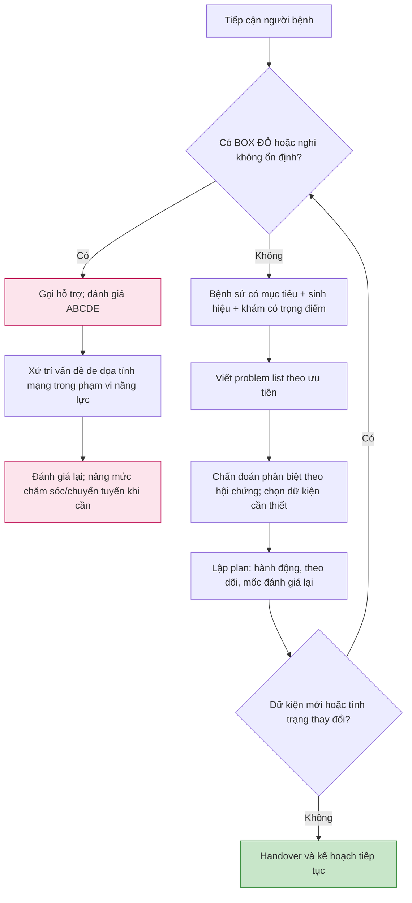

# Cách tiếp cận bệnh nhân Nội khoa người lớn

**Mã bài:** IM-01  
**Ngày:** 2026-07-22 | **Chuyên khoa:** Nội khoa người lớn  
**Đối tượng:** Người học bắt đầu từ nền tảng lâm sàng  
**Phạm vi:** Bài này dạy cách tổ chức một lần tiếp cận người bệnh; không thay thế hồi sức, kê đơn, hay protocol của từng bệnh.

---

## 0. Tổng quan — câu hỏi đầu tiên không phải là “bệnh gì?”

Khi gặp một người bệnh, người mới thường muốn gọi tên chẩn đoán ngay. Trình tự an toàn hơn là hỏi: **người bệnh có đang không ổn định không?** Nếu có, ưu tiên là nhận ra nguy cơ tức thì, gọi hỗ trợ và xử trí theo khả năng tại chỗ. Chẩn đoán nguyên nhân được hoàn thiện sau khi đã bảo vệ các chức năng sống còn.

Nếu người bệnh ổn định, ta thu thập dữ kiện có mục tiêu, biến dữ kiện thành **problem list** (danh sách vấn đề có ưu tiên), lập **chẩn đoán phân biệt** (differential diagnosis) và tạo kế hoạch có mốc đánh giá lại. Đây là một vòng lặp, không phải một lần hỏi bệnh rồi “đóng hồ sơ”.

**Mục tiêu học tập**

- Phân biệt nhánh người bệnh chưa ổn định với nhánh thường quy.
- Khai thác bệnh sử, khám và dữ liệu theo một câu hỏi lâm sàng.
- Viết problem list để biết việc nào cần làm trước.
- Tạo kế hoạch an toàn, có đánh giá lại và điểm chuyển tuyến.

### 0.1 Nền tảng tối thiểu cần dùng ngay

- **Triệu chứng (symptom):** điều người bệnh cảm nhận và kể lại, như đau hoặc khó thở.
- **Dấu hiệu (sign):** điều người khám quan sát, đo hoặc phát hiện khi khám.
- **Dữ kiện:** triệu chứng, dấu hiệu, sinh hiệu, hồ sơ cũ, xét nghiệm hoặc hình ảnh. Dữ kiện chưa tự là chẩn đoán.
- **Vấn đề (problem):** một bất thường hoặc nguy cơ cần được giải quyết, ví dụ “khó thở mới xuất hiện” thay vì vội ghi “viêm phổi”.
- **Assessment:** cách giải thích tạm thời các vấn đề dựa trên dữ kiện hiện có.
- **Plan:** việc làm tiếp theo, người chịu trách nhiệm, thứ tự ưu tiên, điều cần theo dõi và tiêu chí đánh giá lại/chuyển tuyến.

> 🚨 **BOX ĐỎ — dừng nhánh thường quy và gọi hỗ trợ:** người bệnh không đáp ứng, có dấu suy hô hấp rõ, nghi tắc nghẽn đường thở, giảm tưới máu/sốc, xuất huyết đang diễn tiến, thay đổi ý thức mới hoặc bất kỳ tình trạng nào bạn không thể theo dõi/xử trí an toàn tại nơi đang có. Bắt đầu đánh giá có hệ thống, huy động người và phương tiện phù hợp; không chờ hỏi đủ bệnh sử rồi mới hành động.

---

## 1. Định nghĩa — một dữ kiện chỉ có ý nghĩa khi trả lời câu hỏi

**Bệnh sử (history)** là câu chuyện có cấu trúc về vấn đề hiện tại, diễn tiến, bối cảnh, bệnh nền, thuốc, dị ứng, nguy cơ và mục tiêu của người bệnh. **Khám thực thể (physical examination)** là kiểm tra có mục tiêu để xác nhận hoặc bác bỏ những khả năng đang được cân nhắc. **Xét nghiệm/hình ảnh** chỉ hữu ích khi câu hỏi trước xét nghiệm rõ ràng: kết quả nào sẽ đổi quyết định nào?

Một **problem representation** là câu tóm tắt ngắn, trung tính: tuổi/bối cảnh phù hợp, thời gian, hội chứng chính, mức nặng và dữ kiện phân biệt quan trọng. Nó giúp tránh sao chép một danh sách dài mà không biết dữ kiện nào làm thay đổi hướng đi.

Ví dụ: thay vì ghi “đau ngực”, có thể ghi “người lớn có đau ngực mới khởi phát kèm khó thở, cần trước hết loại trừ hội chứng đe dọa tính mạng”. Câu này chưa kết luận bệnh; nó chỉ định ưu tiên và dữ kiện cần tìm.

---

## 2. Cơ chế — vì sao phải ưu tiên, cấu trúc hóa và đánh giá lại?

Cơ thể có các chức năng không thể chờ: đường thở, hô hấp, tuần hoàn và ý thức. Khi một chức năng có nguy cơ mất, thông tin chi tiết về tiền sử vẫn quan trọng nhưng không được trì hoãn hành động bảo vệ người bệnh. Hướng dẫn ABCDE yêu cầu nhận diện vấn đề đe dọa tính mạng, xử trí trước khi sang phần đánh giá tiếp theo, rồi xem can thiệp có tạo thay đổi hay không.

Sau khi an toàn ban đầu đã được bảo đảm, dữ kiện mới có giá trị để cập nhật các khả năng. Bệnh sử gợi giả thuyết; khám tìm dấu phù hợp hoặc dấu mâu thuẫn; xét nghiệm được chọn để trả lời điểm còn chưa rõ. Nếu bỏ qua bước biến dữ kiện thành problem list, người học dễ có nhiều thông tin nhưng không có thứ tự hành động.

**Đánh giá lại (reassessment)** là mắt xích bắt buộc vì tình trạng, kết quả xét nghiệm và đáp ứng với can thiệp đều có thể thay đổi assessment. Một kế hoạch tốt luôn nói rõ: cần theo dõi gì, khi nào xem lại và dấu hiệu nào buộc đổi mức chăm sóc.

> ⚠️ **Không suy luận quá mức:** ABCDE là khung ưu tiên hợp lý cho đánh giá ban đầu. Review hiện có ghi nhận nhiều công cụ và mức tuân thủ khác nhau; dữ liệu về outcome người bệnh còn hạn chế. Vì vậy bài này không tuyên bố ABCDE tự nó làm giảm tử vong. [ABSTRACT VERIFIED — PMID: 39345661]

---

## 3. Chẩn đoán và theo dõi — từ người bệnh đến kế hoạch

### 3.1 Bước một: quan sát và sàng lọc nguy cơ

Bắt đầu bằng nhìn tổng thể: người bệnh có vẻ rất mệt, không nói được câu đầy đủ, tím tái, vã mồ hôi, lú lẫn, đau dữ dội, chảy máu hoặc suy sụp không? Kiểm tra sinh hiệu và gọi hỗ trợ sớm khi có lo ngại. Nếu có BOX ĐỎ, dùng ABCDE thay vì tiếp tục hỏi bệnh theo biểu mẫu.

**ABCDE** là viết tắt của Airway, Breathing, Circulation, Disability, Exposure:

| Thành phần | Câu hỏi định hướng | Quyết định an toàn |
|---|---|---|
| A — đường thở | Có nói được, có tiếng thở bất thường hoặc nguy cơ tắc nghẽn? | Nghi tắc nghẽn là cấp cứu: gọi hỗ trợ và xử trí theo năng lực/hướng dẫn tại chỗ. |
| B — hô hấp | Có khó thở, tăng công thở, giảm oxy hay dấu suy hô hấp? | Hỗ trợ, theo dõi và chuyển cấp phù hợp; không chờ hoàn tất bệnh sử. |
| C — tuần hoàn | Có dấu giảm tưới máu, xuất huyết hoặc suy tuần hoàn? | Huy động hỗ trợ, theo dõi sát, tìm và xử trí nguyên nhân theo khả năng. |
| D — thần kinh | Ý thức thay đổi? Có nguyên nhân đảo ngược cần nghĩ đến? | Quay lại A-B-C, kiểm tra dữ kiện nền và gọi hỗ trợ sớm. |
| E — bộc lộ/khám toàn diện | Có dấu hiệu quan trọng bị che khuất? | Khám đủ để không bỏ sót, đồng thời bảo vệ riêng tư và tránh mất nhiệt. |

### 3.2 Bước hai: bệnh sử có mục tiêu

Khi người bệnh ổn định đủ để trao đổi, hãy bắt đầu bằng câu hỏi mở: “Điều gì làm anh/chị cần được giúp hôm nay?” Sau đó thu hẹp theo vấn đề:

1. Vấn đề bắt đầu khi nào, diễn tiến ra sao, điều gì làm nặng/giảm?
2. Có triệu chứng đi kèm hoặc dấu hiệu nguy hiểm nào?
3. Bệnh nền, lần tương tự, thuốc đang dùng, dị ứng và can thiệp gần đây là gì?
4. Bối cảnh nào đổi hướng: phơi nhiễm, đi lại, thai kỳ, rượu/chất, nghề nghiệp, người chăm sóc hoặc khả năng dùng thuốc?
5. Người bệnh ưu tiên điều gì và có rào cản giao tiếp/chăm sóc nào?

Đừng hỏi mọi câu theo cùng một thứ tự khi người bệnh mệt hoặc đau. Mục tiêu là có đủ dữ kiện để quyết định an toàn tiếp theo, không phải hoàn thành mẫu giấy.

### 3.3 Bước ba: khám có mục tiêu

Khám bắt đầu bằng toàn trạng và sinh hiệu, sau đó hướng đến vấn đề đang cần phân định. Mỗi thao tác nên trả lời một câu hỏi: “tôi tìm dấu này để đổi giả thuyết hay đổi mức chăm sóc nào?”

- Khám lại khi diễn tiến thay đổi hoặc khi dữ kiện không khớp với câu chuyện ban đầu.
- Dấu không có mặt cũng có giá trị nếu nó thực sự được kiểm tra đúng cách.
- Không để một dấu đơn lẻ ghi đè lên toàn bộ bối cảnh; chất lượng dữ kiện, xu hướng và nguy cơ nền đều quan trọng.

### 3.4 Bước bốn: problem list và chẩn đoán phân biệt

Viết từng vấn đề theo ngôn ngữ mô tả, rồi sắp xếp ưu tiên. Mỗi vấn đề có thể dùng khuôn sau:

- **Vấn đề:** điều bất thường/nguy cơ đang có.
- **Bằng chứng:** dữ kiện nào làm bạn tin đó là vấn đề.
- **Mức ưu tiên:** nguy hiểm ngay, cần giải quyết trong lượt này, hay cần theo dõi.
- **Khả năng cần loại trừ:** một nhóm nguyên nhân theo hội chứng, không phải danh sách vô tận.
- **Dữ kiện còn thiếu:** khám, hồ sơ, xét nghiệm hoặc ý kiến chuyên khoa nào có thể đổi quyết định.
- **Hành động và đánh giá lại:** làm gì ngay, theo dõi gì, khi nào đổi kế hoạch/chuyển tuyến.

**Để tránh đóng chẩn đoán quá sớm:** giữ câu tóm tắt trung tính, tìm dữ kiện không phù hợp với giả thuyết ưa thích, và quay lại problem list sau mỗi thông tin quan trọng. Đây là kỹ thuật khung thực hành; bài không tuyên bố hiệu quả định lượng.

### 3.5 Bước năm: kế hoạch, theo dõi và chuyển tuyến

Một kế hoạch tối thiểu phải phân biệt:

- Việc làm **ngay** để duy trì an toàn hoặc lấy dữ kiện quyết định.
- Việc làm **sau khi có kết quả** và kết quả nào sẽ thay đổi hướng.
- Người cần được thông báo/hội chẩn và lý do.
- Dấu hiệu buộc đánh giá lại sớm hoặc chuyển đến nơi có theo dõi, xét nghiệm, hồi sức hay chuyên khoa phù hợp.

**Plan B khi thiếu nguồn lực:** nếu không thể đo, theo dõi hoặc xử trí một nguy cơ quan trọng một cách an toàn, ghi rõ giới hạn, thực hiện hỗ trợ cơ bản trong phạm vi năng lực và tổ chức chuyển tuyến. Không “bù” thiếu nguồn lực bằng cách kết luận chắc chắn từ một dữ kiện mỏng.

---

## 4. Lưu đồ thực hành — một lần tiếp cận có thứ tự

**Cách dùng lưu đồ:** Nếu đang không chắc người bệnh ổn định hay không, hãy xử lý như nhánh cần đánh giá khẩn và gọi hỗ trợ. Khi người bệnh ổn định, không bỏ ABCDE mà dùng nó như một kiểm tra an toàn trước khi đi sâu vào bệnh sử/khám. Bất cứ thay đổi nào cũng đưa bạn quay lại đầu vòng lặp.

---

## 5. Case 1 — người bệnh có thể không ổn định

**Tình huống:** Một người lớn đến vì khó thở tăng nhanh, nói ngắt quãng và có vẻ kiệt sức. Bạn chưa biết bệnh nền hay thuốc đang dùng.

1. **Nhận diện cấp cứu:** đây là BOX ĐỎ; khó thở và khả năng diễn tiến nhanh quan trọng hơn một bệnh sử đầy đủ.
2. **Dữ kiện đổi quyết định:** khả năng nói, công thở, ý thức, dấu tưới máu và theo dõi sinh hiệu là các dữ kiện đầu tiên; đồng thời tìm dấu gợi vấn đề đường thở/hô hấp/tuần hoàn.
3. **Hành động ngay:** gọi hỗ trợ, đánh giá ABCDE, theo dõi và xử trí trong phạm vi năng lực của nơi chăm sóc. Điều trị vấn đề đe dọa tính mạng trước khi đi sang phần tiếp theo.
4. **Theo dõi/chuyển tuyến:** đánh giá lại sau can thiệp; nếu không thể duy trì theo dõi hay hỗ trợ cần thiết, chuyển đến cơ sở phù hợp.
5. **Vì sao không chọn phương án sai:** không tiếp tục hỏi đủ tiền sử hoặc chờ một xét nghiệm thường quy, vì hai việc đó có thể làm chậm hỗ trợ cho chức năng sống còn.

---

## 6. Case 2 — problem list ở người bệnh đang ổn định

**Tình huống:** Một người lớn tỉnh táo đến khám vì mệt mới xuất hiện. Sinh hiệu ban đầu không gợi cấp cứu, nhưng còn thiếu bệnh sử, khám và dữ liệu nền.

1. **Nhận diện mức ưu tiên:** chưa có BOX ĐỎ, nhưng “mệt” chưa phải chẩn đoán; cần sàng lọc diễn tiến và dấu hiệu nguy hiểm trước.
2. **Dữ kiện đổi quyết định:** thời gian khởi phát, mức ảnh hưởng chức năng, triệu chứng đi kèm, thuốc, bệnh nền, khám toàn trạng có mục tiêu và hồ sơ/xét nghiệm phù hợp.
3. **Hành động ngay:** viết problem list mô tả, ví dụ “mệt mới xuất hiện, nguyên nhân chưa rõ”; từ đó chọn các khả năng theo hội chứng và dữ kiện cần phân định.
4. **Theo dõi/chuyển tuyến:** ghi rõ khi nào xem lại và triệu chứng nào buộc quay lại sớm/chuyển cấp. Cập nhật assessment khi có dữ kiện mới.
5. **Vì sao không chọn phương án sai:** không gắn một nhãn bệnh chỉ dựa trên một triệu chứng, và không yêu cầu xét nghiệm hàng loạt khi chưa biết kết quả sẽ đổi quyết định nào.

---

## 7. Tóm tắt — bảy điểm cần mang theo

1. Câu hỏi đầu tiên là người bệnh có ổn định không, không phải bệnh tên gì.
2. BOX ĐỎ dẫn đến gọi hỗ trợ, ABCDE, xử trí nguy cơ tức thì và đánh giá lại.
3. Bệnh sử, khám và xét nghiệm phải phục vụ một câu hỏi lâm sàng cụ thể.
4. Dữ kiện không phải chẩn đoán; hãy biến chúng thành problem list có ưu tiên.
5. Differential là nhóm khả năng cần phân định, không phải một danh sách để phô diễn.
6. Plan phải nêu hành động, theo dõi, mốc đánh giá lại và tiêu chí chuyển tuyến.
7. Thiếu nguồn lực là lý do tổ chức hỗ trợ/chuyển tuyến, không phải lý do để đoán chắc.

## 8. Tips thực hành

- Viết assessment bằng ngôn ngữ trung tính khi dữ kiện còn thiếu.
- Hỏi: “Dữ kiện nào, nếu có, sẽ làm tôi đổi hành động?” trước khi yêu cầu một xét nghiệm.
- Luôn ghi mốc đánh giá lại; nếu không có mốc này, plan chưa hoàn chỉnh.
- Khi handover, nêu vấn đề ưu tiên, dữ kiện quan trọng, việc đã làm, điều còn chờ và điều có thể xấu đi.
- Nếu cảm giác “có gì đó không ổn” nhưng chưa gọi tên được, hãy nâng mức cảnh giác, kiểm tra lại A-B-C, xin hỗ trợ và đánh giá lại.

## 9. Tài liệu tham khảo

1. Resuscitation Council UK. *The ABCDE Approach*. Updated July 2024. https://www.resus.org.uk/library/abcde-approach [GUIDELINE VERIFIED]
2. Bruinink LJ, Linders M, de Boode WP, Fluit CRMG, Hogeveen M. *The ABCDE approach in critically ill patients: A scoping review of assessment tools, adherence and reported outcomes.* Resuscitation Plus. 2024. PMID: 39345661. [ABSTRACT VERIFIED]
3. Bickley LS. *Bates’ Guide to Physical Examination and History Taking*. 13th ed. Wolters Kluwer. [TEXTBOOK]
4. McGee S. *Evidence-Based Physical Diagnosis*. 5th ed. Elsevier. [TEXTBOOK]

**— Hết bài học ngày 2026-07-22 —**
