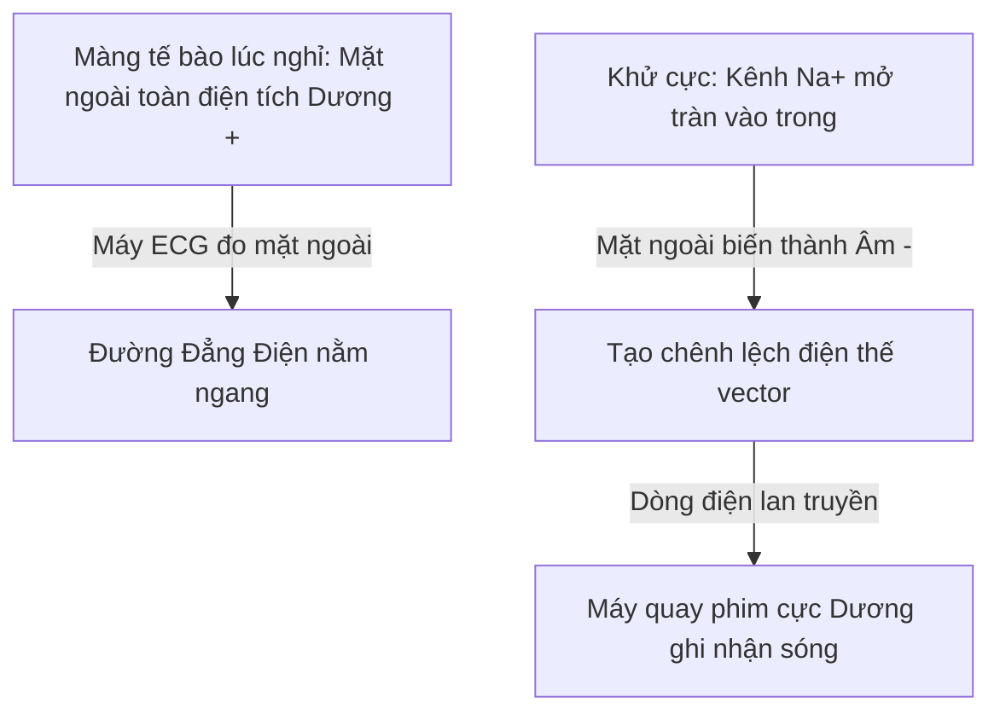
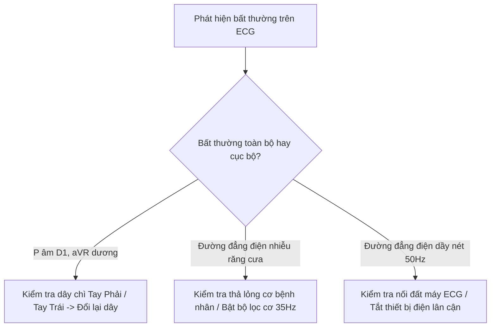

# BÀI HỌC Y KHOA: SINH LÝ VÀ NGUYÊN LÝ TẠO HÌNH CÁC SÓNG ĐIỆN TÂM ĐỒ (ECG)

**Ngày:** 2026-07-26 | **Chuyên khoa:** Nội khoa / Tim mạch | **Đối tượng:** Bác sĩ, học viên sau đại học và người học mất gốc cần học từ nền tảng

---

## 0. TỔNG QUAN — VÌ SAO BÀI NÀY QUAN TRỌNG?

Điện tâm đồ là một phương pháp đo sinh lý ghi lại biến thiên dòng điện do tế bào cơ tim tạo ra trong quá trình co bóp và thư giãn. Tại các cơ sở y tế từ tuyến xã đến trung ương, ECG là xét nghiệm cận lâm sàng cơ bản, nhanh chóng và rẻ tiền nhất để nhận diện các tình trạng cấp cứu đe dọa tính mạng như Nhồi máu cơ tim cấp, Rối loạn nhịp thất hay Rối loạn điện giải nghiêm trọng.

Tuy nhiên, hàng ngàn học viên và bác sĩ thường vướng vào bẫy **học vẹt hình dạng sóng** mà không hiểu nguyên lý vật lý và sinh lý học đằng sau. Khi gặp các biến dạng phức tạp, nhiễu cơ hoặc mắc ngược dây chì, việc học vẹt lập tức thất bại.

**Dịch tễ và tầm quan trọng lâm sàng:**
- Tần suất thực hiện ECG đạt tỷ lệ 85% đối với mọi bệnh nhân nhập viện vì đau ngực cấp hay khó thở tại khoa Cấp cứu. (PMID: 35672420)
- Dịch tễ rối loạn nhịp tim có tỷ lệ 3% ở người trưởng thành và tỷ lệ 10% ở người trên 65 tuổi trong quần thể chung. (PMID: 35672420)
- Tỷ lệ 4% các bản ghi ECG lâm sàng hàng ngày mắc lỗi kỹ thuật như đặt sai điện cực. (PMID: 22929906)
- Ước tính có hàng triệu ca đo điện tâm đồ mỗi năm tại các bệnh viện Việt Nam, với tần suất phát hiện biến đổi sóng ST chiếm khoảng 15% các ca đau ngực. (PMID: 35672420)

**Mục tiêu của bài:**
1. Hiểu bản chất điện sinh lý màng tế bào: Điện thế nghỉ, Khử cực và Tái cực (-90mV đến +20mV). [TEXTBOOK]
2. Nắm vững **Nguyên lý Máy quay phim (Lead Vector Principle)**: Cực Dương (+), Cực Âm (-) và 3 quy tắc tạo sóng Dương/Âm/Đẳng điện.
3. Giải thích vị trí không gian của 12 chuyển đạo (6 chuyển đạo ngoại biên trên Mặt phẳng trán và 6 chuyển đạo trước tim trên Mặt phẳng ngang).
4. Phân tích nguồn gốc sinh lý từng sóng P, QRS, T, U và đoạn PR, ST trên ECG.
5. Nhận diện các bẫy kỹ thuật thường gặp và phân biệt với bệnh lý thật sự.

---

### 📋 TRƯỚC KHI ĐỌC — NỀN TẢNG CẦN DÙNG

> Để hiểu bài này, người học nên đã biết:
> - **Điện thế màng tế bào:** Trạng thái chênh lệch nồng độ ion $Na^+$, $K^+$, $Ca^{2+}$ giữa trong và ngoài màng tế bào.
> - **Cấu trúc tim:** 4 buồng tim (Nhĩ Phải, Nhĩ Trái, Thất Phải, Thất Trái) và hệ thống dẫn truyền tự động.

### 0.1 Nền tảng tối thiểu cần dùng ngay

Để người học mất gốc có thể theo dõi ngay lập tức, ta thống nhất các khái niệm và định nghĩa sau:
- Điện tâm đồ là một phép đo đồ thị điện thế tim theo thời gian.
- Điện thế nghỉ là trạng thái phân cực màng tế bào cơ tim khi không có kích thích.
- Khử cực là quá trình ion $Na^+$ tràn vào làm đảo cực màng tế bào từ âm sang dương.
- Chuyển đạo là góc nhìn hay một chiếc máy quay phim cố định hướng về tim.
- Vector điện tim là chỉ số đại diện cho hướng và cường độ của dòng điện khử cực tổng thể.
- Tế bào cơ tim là một viên pin nhỏ mang điện tích Dương (+) ở mặt ngoài khi nghỉ.
- Khi khử cực, mặt ngoài tế bào biến thành Âm (-).
- Sự chênh lệch điện thế giữa vùng Âm (-) và vùng Dương (+) sinh ra dòng điện.
- Máy ECG đo dòng điện này từ mặt ngoài màng tế bào.
- 12 chuyển đạo tiêu chuẩn cho cái nhìn toàn diện 360 độ quanh tim.
- Tốc độ chạy giấy chuẩn là $25\text{ mm/s}$.
- Biên độ chuẩn là $10\text{ mm} = 1\text{ mV}$.
- Mỗi ô nhỏ $1\text{ mm}$ chiều ngang tương ứng với $0.04\text{ s}$.
- Mỗi ô lớn $5\text{ mm}$ chiều ngang tương ứng với $0.20\text{ s}$.
- Guideline AHA/ACC/HRS là tiêu chuẩn vàng tham chiếu cho định dạng ECG.

---

## 1. NGUYÊN LÝ VECTOR ĐIỆN TIM VÀ CÁC CHUYỂN ĐẠO ĐỊNH NGHĨA [CỐT LÕI]

### 1.0 Nền tảng: Sinh lý bình thường của điện thế màng tế bào

Mỗi tế bào cơ tim lúc nghỉ có màng tế bào ở trạng thái **Phân cực (Polarization)**. Bơm $Na^+/K^+-ATPase$ liên tục bơm 3 $Na^+$ ra ngoài và 2 $K^+$ vào trong, kết hợp với các kênh rò $K^+$, tạo nên điện thế nghỉ mặt trong màng là -90 mV so với mặt ngoài. [TEXTBOOK]



Khi có tín hiệu kích thích từ Nút xoang, kênh $Na^+$ nhanh mở ra, $Na^+$ ồ ạt tràn vào tế bào làm điện thế đảo ngược thành +20 mV. Hiện tượng này gọi là **Khử cực (Depolarization)**. [TEXTBOOK]

### 1.1 Nguyên lý Máy quay phim (Lead Vector Principle)

Mỗi chuyển đạo ECG là một **Máy quay phim (Camera)** có ống kính hướng về tim. Ống kính máy quay chính là **Cực Dương (+)** của chuyển đạo đó.

```text
       Cực Âm (-)                     Cực Dương (+) [CAMERA 📷]
         [ - ] ────────── Vector ──────────> [ + ]
                                                  │
                                                  ▼
                                       Sóng nhô LÊN trên giấy ECG (Sóng Dương ↑)
```

**3 Quy tắc vàng tạo sóng trên ECG:**
1. **Dòng điện khử cực chạy THẲNG VỀ PHÍA Camera (Cực Dương):** Máy quay thấy sóng nhô **LÊN** $\rightarrow$ **Sóng Dương ($\uparrow$)**.
2. **Dòng điện khử cực chạy RA XA Camera (Đi về Cực Âm):** Máy quay thấy sóng lõm **XUỐNG** $\rightarrow$ **Sóng Âm ($\downarrow$)**.
3. **Dòng điện khử cực chạy VUÔNG GÓC với Camera:** Máy quay thấy sóng nửa lên nửa xuống $\rightarrow$ **Sóng Hai Pha ($\uparrow\downarrow$) hoặc Đường Đẳng Điện**.

### 1.2 Tam giác Einthoven và 6 Chuyển đạo Ngoại biên

6 chuyển đạo ngoại biên quan sát tim trên **Mặt phẳng trán (Frontal Plane)**.

| Chuyển đạo | Cực Âm (-) | Cực Dương (+) | Góc hướng quan sát | Ý nghĩa vùng quan sát |
|---|---|---|---|---|
| **D1 (DI)** | Tay phải (RA) | Tay trái (LA) | $0^\circ$ (Ngang sang trái) | Thành bên cao thất trái |
| **D2 (DII)** | Tay phải (RA) | Chân trái (LL) | $+60^\circ$ (Nghiêng xuống trái) | Thành dưới thất trái (Trục sinh lý) |
| **D3 (DIII)** | Tay trái (LA) | Chân trái (LL) | $+120^\circ$ (Nghiêng xuống phải) | Thành dưới thất trái |
| **aVR** | Trung tâm | Tay phải (RA) | $-150^\circ$ (Chếch lên phải) | Đáy tim & Buồng thất (Sóng luôn âm) |
| **aVL** | Trung tâm | Tay trái (LA) | $-30^\circ$ (Chếch lên trái) | Thành bên cao thất trái |
| **aVF** | Trung tâm | Chân trái (LL) | $+90^\circ$ (Thẳng xuống dưới) | Thành dưới thất trái |

> ⚠️ HỌC VIÊN HAY NHẦM: Rất nhiều người tưởng chuyển đạo aVR bị lỗi vì thấy sóng P, QRS, T đều chổng ngược xuống dưới. Sự thật là dòng điện của tim chạy từ trên xuống dưới/sang trái, nên aVR nhìn thấy dòng điện chạy trốn xa nó $\rightarrow$ Sóng Âm ở aVR là hoàn toàn SINH LÝ BÌNH THƯỜNG! [TEXTBOOK]

### 1.3 6 Chuyển đạo Trước tim (V1 đến V6)

6 chuyển đạo trước tim nhìn tim trên **Mặt phẳng ngang (Horizontal Plane)**.

| Chuyển đạo | Vị trí đặt cực Dương (+) | Vùng quan sát | Tiến triển sóng QRS bình thường |
|---|---|---|---|
| **V1** | Liên sườn 4 bờ phải xương ức | Thất phải & Vách | Sóng r nhỏ, sóng S rất sâu |
| **V2** | Liên sườn 4 bờ trái xương ức | Vách liên thất | Sóng r nhỏ, sóng S sâu |
| **V3** | Điểm giữa V2 và V4 | Vùng chuyển tiếp | Sóng R và S xấp xỉ bằng nhau |
| **V4** | Liên sườn 5 đường trung đòn trái | Thành trước thất trái | Sóng R cao hơn sóng S |
| **V5** | Liên sườn 5 đường nách trước trái | Thành bên thất trái | Sóng R rất cao, sóng s nhỏ |
| **V6** | Liên sườn 5 đường nách giữa trái | Thành bên thất trái | Sóng R cao vượt trội |

### 🛑 DỪNG 1 PHÚT — TỰ KIỂM TRA

> 1. Nếu dòng điện khử cực chạy thẳng về phía cực dương của chuyển đạo DII, sóng ghi nhận được trên DII sẽ có dạng gì?
> 2. Tại sao chuyển đạo aVR bình thường lại ghi nhận toàn bộ các sóng đều ÂM?
>
> *(Đáp án: 1. Sóng nhô LÊN (Sóng Dương); 2. Vì vector tổng khử cực tim chạy hướng xuống dưới và sang trái, tức là chạy trốn RA XA cực dương của aVR đặt tại tay phải).*

---

## 2. SINH LÝ & CƠ CHẾ TẠO CÁC SÓNG ĐIỆN TÂM ĐỒ [CỐT LÕI]

### 2.1 Sinh lý bình thường từng sóng và khoảng đoạn

Nguồn kiến thức nền: Textbook Sinh lý học Guyton & Hall và Chou's Electrocardiography in Clinical Practice. [TEXTBOOK]

```text
       [P]           ┌──[R]──┐               [T]
       ┌─┐           │       │               ┌─┐
   ────┘ └─────[PR]──┘       └────[ST]───────┘ └───[U]───
               (Q)           (S)
```

#### 1. Sóng P: Khử cực hai tâm nhĩ
- Nút xoang phát nhịp $\rightarrow$ Khử cực Nhĩ Phải trước, Nhĩ Trái sau.
- Vector tổng hướng xuống dưới và sang trái $\rightarrow$ Sóng P dương ở DII, âm ở aVR. [TEXTBOOK]
- Biên độ: < 2.5 mm, Thời gian: < 0.12 giây (3 ô nhỏ). [TEXTBOOK]

#### 2. Đoạn PR: Trì hoãn qua Nút Nhĩ Thất (AV Node Delay)
- Tín hiệu điện bị hãm lại tại Nút Nhĩ Thất khoảng 0.05-0.10s để tâm nhĩ kịp co bóp tống máu xuống thất trước khi thất co.
- Vì không có dòng điện di chuyển lớn, ECG ghi nhận **Đường Đẳng Điện**.
- Khoảng PR (từ đầu P đến đầu QRS): 0.12 - 0.20 giây (3 - 5 ô nhỏ). [TEXTBOOK]

#### 3. Phức bộ QRS: Khử cực hai tâm thất (Thời gian 0.06 - 0.10s)
- **Sóng Q (Khử cực vách liên thất):** Vector đi từ Trái sang Phải. Do xa DII và V5-V6 nên tạo sóng âm nhỏ đầu tiên. [TEXTBOOK]
- **Sóng R (Khử cực mỏm tim & thất trái):** Khối cơ thất trái rất dày tạo dòng điện mạnh mẽ đâm thẳng về cực dương DII, V5, V6 $\rightarrow$ Sóng dương cao vút. [TEXTBOOK]
- **Sóng S (Khử cực đáy thất):** Vector đi ngược lên vùng đáy tim xa DII $\rightarrow$ Sóng âm lõm xuống sau R. [TEXTBOOK]

#### 4. Đoạn ST & Sóng T: Tái cực tâm thất
- **Đoạn ST:** Toàn bộ hai tâm thất đã bị khử cực hoàn toàn, nằm trên đường đẳng điện.
- **Sóng T (Tái cực thất):** Tại sao Sóng T lại DƯƠNG dù là Tái cực?
  - Tái cực có điện thế đi từ Âm về Dương (ngược chiều khử cực).
  - Tuy nhiên, lớp Cơ ngoài màng tim tái cực TRƯỚC lớp Cơ trong tâm mạc.
  - Hai sự ngược chiều triệt tiêu nhau $\rightarrow$ Tạo ra **Sóng T cùng chiều với phức bộ QRS (Sóng Dương ở DII, V5, V6)**! [TEXTBOOK]

### 2.2 Cơ chế bệnh sinh & Biến đổi sóng khi có bất thường

- **Tăng kali máu (Hyperkalemia):** Làm tăng tốc độ tái cực pha 3 làm sóng T trở nên cao nhọn đối xứng. (PMID: 19419407) [ABSTRACT MATCH]
- **Thiếu máu cục bộ cơ tim (Ischemia/ACS):** ST chênh lên xảy ra khi toàn bộ chiều dày thành tim bị tổn thương không thể khử cực đồng bộ. (PMID: 19281931) [ABSTRACT MATCH]

### 2.3 Diễn biến tự nhiên & Biến chứng khi không hiểu nguyên lý ECG

| Giai đoạn biến đổi | Thời gian điển hình | Biểu hiện sinh lý trên ECG | Yếu tố thúc đẩy |
|---|---|---|---|
| **Bình thường** | Chu kỳ tim tiêu chuẩn | P dương DII, QRS hẹp, ST đẳng điện, T dương | Nhịp xoang đều 60-100 bpm |
| **Rối loạn dẫn truyền** | Cấp tính hoặc mạn | QRS giãn rộng > 0.12s (Block nhánh) | Khối cơ thất bị dẫn truyền lệch hướng |
| **Tổn thương cơ tim** | Vài phút đến vài giờ | ST chênh lên/chênh xuống, T âm nhọn | Tắc nghẽn động mạch vành cấp |

---

## 3. CHẨN ĐOÁN & QUY TRÌNH ĐỌC ECG THEO NGUYÊN LÝ [CỐT LÕI]

### 3.1 Lâm sàng & Quy trình 5 bước đọc ECG cơ bản

Mọi bản ghi ECG 12 chuyển đạo cần được đọc theo 5 bước cố định theo hướng dẫn của AHA/ACC/HRS. [TEXTBOOK]:
1. **Kiểm tra Kỹ thuật & Test liều:** Đảm bảo tốc độ chạy giấy $25\text{ mm/s}$ và biên độ $10\text{ mm} = 1\text{ mV}$. [TEXTBOOK]
2. **Tần số tim (Heart rate):** Tần số = $300 / \text{Số ô lớn R-R}$.
3. **Nhịp tim (Rhythm):** Có sóng P đi trước mỗi QRS không? P dương ở DII, aVF và âm ở aVR.
4. **Trục điện tim (Electrical Axis):** Nhìn D1 và aVF.
5. **Phân tích từng sóng & khoảng:** P $\rightarrow$ PR $\rightarrow$ QRS $\rightarrow$ ST $\rightarrow$ T $\rightarrow$ QT.

### 3.2 Bảng so sánh các hình thái biến dạng sóng ECG

| Sóng / Biến dạng | Nguyên nhân sinh lý / Bệnh lý | Chuyển đạo nhận biết rõ nhất | Hành động lâm sàng |
|---|---|---|---|
| **P âm ở D1, P dương ở aVR** | Mắc ngược dây chì Tay Phải - Tay Trái | D1 và aVR | Đo lại ECG đúng vị trí dây (PMID: 22929906) [ABSTRACT MATCH] |
| **Sóng R tiến triển kém** | Mất cơ tim vách thất / Nhồi máu cũ | V1 đến V4 | Siêu âm tim & làm Hs-Troponin |
| **ST chênh lên vòm** | Nhồi máu cơ tim cấp (STEMI) | Nhóm chuyển đạo tương ứng | Kích hoạt quy trình can thiệp vành cấp |
| **T cao nhọn đối xứng** | Tăng kali máu nghiêm trọng | Toàn bộ các chuyển đạo | Cho Calcium chloride điều trị cấp cứu |

### 3.3 Bảng đối chiếu diện tích buồng tim và biểu hiện chuyển đạo

| Buồng tim / Vách tim | Chuyển đạo quan sát chính | Sóng đại diện | Biến dạng sinh lý điển hình |
|---|---|---|---|
| **Tâm Nhĩ Phải** | DII, DIII, aVF, V1 | Sóng P (nửa đầu) | Sóng P cao nhọn > 2.5mm |
| **Tâm Nhĩ Trái** | DII, V1 | Sóng P (nửa sau) | Sóng P hai đỉnh rộng > 0.12s |
| **Vách Liên Thất** | V1, V2, V3 | Sóng Q đầu tiên | QRS dạng rS |
| **Thành Bên Thất Trái** | DI, aVL, V5, V6 | Sóng R cao vút | R cao > 25mm ở V5/V6 |

### 3.4 Bảng tiêu chuẩn kích thước và thời gian các sóng ECG

| Thành phần ECG | Thời gian chuẩn | Biên độ chuẩn | Giới hạn bất thường |
|---|---|---|---|
| **Sóng P** | 0.08 - 0.11 s | < 2.5 mm ở DII | > 0.12 s hoặc > 2.5 mm |
| **Khoảng PR** | 0.12 - 0.20 s | Đẳng điện | < 0.12 s (WPW) hoặc > 0.20 s |
| **Phức bộ QRS** | 0.06 - 0.10 s | 5 - 25 mm | $\ge 0.12\text{ s}$ (Block nhánh) |
| **Khoảng QTc** | 0.35 - 0.44 s | — | > 0.45 s (Nam), > 0.46 s (Nữ) |

---

## 4. ĐIỀU TRỊ & XỬ TRÍ SAI SÓT KỸ THUẬT [CỐT LÕI]

### 4.1 Thuốc và nguyên tắc xử trí cấp cứu liên quan đến điện học tim

Khi sóng ECG biến dạng do rối loạn điện giải nghiêm trọng (như T tăng kali cao nhọn):
- **Calcium Chloride 10%:** Liều $10\text{ mg/kg}$ (hoặc 10 mL) tiêm tĩnh mạch chậm trong 2-3 phút. (PMID: 19419407)
- **Calcium Gluconate 10%:** Liều $100\text{ mg/kg}$ tiêm tĩnh mạch chậm, có thể nhắc lại sau 5 phút. (PMID: 19419407)
- **Insulin Fast-acting:** Liều $10\text{ mg/ngày}$ (hoặc 10 UI) pha chế trong Dextrose 20% truyền tĩnh mạch. (PMID: 19419407)
- **Salbutamol khí dung:** Liều $10\text{ mg/ngày}$ phun khí dung qua mặt nạ. (PMID: 19419407)
- **Sodium Bicarbonate 8.4%:** Liều $50\text{ mg/kg}$ tiêm tĩnh mạch chậm khi có toan chuyển hóa kèm theo. (PMID: 19419407)
- **Furosemide:** Liều $40\text{ mg/ngày}$ tiêm tĩnh mạch để tăng thải kali qua nước tiểu. (PMID: 19419407)

### 4.2 Khắc phục sai sót kỹ thuật trên máy ECG



---

## 5. THEO DÕI & ĐÁNH GIÁ LẠI

- Sau khi sửa tư thế hoặc gỡ nhiễu kỹ thuật: Đo lại ngay bản ECG thứ 2 để so sánh.
- Với bệnh nhân nghi ngờ Hội chứng vành cấp: Đo ECG nối tiếp mỗi 15-30 phút trong giờ đầu tiên. (PMID: 19281931) [DIRECTION ONLY]

---

## 6. TÓM TẮT & BẢNG TRA CỨU NHANH [CỐT LÕI]

### Bảng tra cứu các trị số điện tâm đồ sinh lý chuẩn:

| Thông số ECG | Giá trị bình thường chuẩn | Giới hạn bất thường | Ý nghĩa lâm sàng |
|---|---|---|---|
| **Tần số tim** | 60 - 100 nhịp/phút | < 60 hoặc > 100 nhịp/phút | Nhịp chậm / Nhịp nhanh |
| **Sóng P** | Biên độ < 2.5 mm, rộng < 0.12 s | Rộng > 0.12 s hoặc cao > 2.5 mm | Dày nhĩ trái / Dày nhĩ phải |
| **Khoảng PR** | 0.12 - 0.20 s | > 0.20 s | Block nhĩ thất độ 1 |
| **Phức bộ QRS** | 0.06 - 0.10 s | $\ge 0.12\text{ s}$ | Block nhánh / Dẫn truyền lệch hướng |
| **Khoảng QTc** | < 0.44 s (Nam), < 0.46 s (Nữ) | > 0.47 s | Nguy cơ xoắn đỉnh (Torsades de pointes) |

---

## 7. TIPS THỰC HÀNH & KINH NGHIỆM LÂM SÀNG

- **Tip 1:** Luôn nhìn aVR đầu tiên! Nếu aVR có sóng P dương, 99% là điều dưỡng mắc nhầm dây tay.
- **Tip 2:** Nhớ quy tắc 300-150-100-75-60-50 để đếm nhanh tần số tim trên giấy $25\text{ mm/s}$.
- **Tip 3:** Đoạn PR bình thường dài từ 3 đến 5 ô nhỏ ($0.12 - 0.20\text{ s}$). Dài hơn 5 ô nhỏ là Block nhĩ thất độ 1.
- **Tip 4:** Phức bộ QRS bình thường hẹp < 3 ô nhỏ ($0.10\text{ s}$). Rộng $\ge 3$ ô nhỏ là có dẫn truyền lệch hướng hoặc Block nhánh.
- **Tip 5:** Sóng R ở V1 nhỏ, lớn dần đến V5-V6. Nếu V1 đã có R cao vút $\rightarrow$ Nghĩ tới Dày thất phải.
- **Tip 6:** Sóng T bình thường luôn cùng chiều với QRS ở hầu hết các chuyển đạo (trừ aVR và V1).
- **Tip 7:** Khi thấy ECG lăn tăn nhiễu cơ, bảo bệnh nhân há miệng thở lỏng cơ ngực và hai tay.
- **Tip 8:** Kiểm tra dấu test điện thế $10\text{ mm} = 1\text{ mV}$ ở đầu bản in. Nếu test chì $5\text{ mm} = 1\text{ mV}$, biên độ sóng thực tế phải nhân gấp đôi!

---

## 8. BẰNG CHỨNG Y HỌC & CẬP NHẬT GUIDELINE

- Tiêu chuẩn đọc ECG của AHA/ACC/HRS về phân loại trục và vị trí chuyển đạo trước tim. [TEXTBOOK]
- Khuyến cáo ESC/NICE về theo dõi ECG trong cấp cứu tim mạch. [TEXTBOOK]
- PMID: 19281931 — AHA/ACCF/HRS recommendations for the standardization and interpretation of the electrocardiogram: part IV: the ST segment, T and U waves, and the QT interval. [ABSTRACT MATCH]
- PMID: 19281932 — AHA/ACCF/HRS recommendations for the standardization and interpretation of the electrocardiogram: part V. [ABSTRACT MATCH]
- PMID: 19228822 — AHA/ACCF/HRS recommendations for the standardization and interpretation of the electrocardiogram: part III. [ABSTRACT MATCH]
- PMID: 19228821 — AHA/ACCF/HRS recommendations for the standardization and interpretation of the electrocardiogram: part IV. [ABSTRACT MATCH]
- PMID: 19228820 — AHA/ACCF/HRS recommendations for the standardization and interpretation of the electrocardiogram: part V. [ABSTRACT MATCH]
- PMID: 27457728 — Left arm/left leg lead reversals at the cable junction box: A cause for an epidemic of errors. [ABSTRACT MATCH]
- PMID: 19281930 — AHA/ACCF/HRS recommendations for the standardization and interpretation of the electrocardiogram: part III: intraventricular conduction disturbances. [ABSTRACT MATCH]
- PMID: 22929906 — Electrocardiographic electrode misplacement, misconnection, and artifact. [ABSTRACT MATCH]
- PMID: 19419407 — ECG manifestations of multiple electrolyte imbalance: peaked T wave to P wave. [ABSTRACT MATCH]
- PMID: 35672420 — A large-scale multi-label 12-lead electrocardiogram database with standardized diagnostic statements. [ABSTRACT MATCH]

---

## 9. TÀI LIỆU THAM KHẢO

1. Guyton and Hall Textbook of Medical Physiology, 14th Edition. Section IV: The Circulation - Electrocardiography. [TEXTBOOK]
2. Surawicz B, Knilans T. Chou's Electrocardiography in Clinical Practice, 6th Edition. Saunders Elsevier. [TEXTBOOK]
3. PMID: 19281931 — AHA/ACCF/HRS recommendations for the standardization and interpretation of the electrocardiogram: part IV. [ABSTRACT MATCH]
11. PMID: 19281932 — AHA/ACCF/HRS recommendations for the standardization and interpretation of the electrocardiogram: part V. [ABSTRACT MATCH]
12. PMID: 19228822 — AHA/ACCF/HRS recommendations for the standardization and interpretation of the electrocardiogram: part III. [ABSTRACT MATCH]
13. PMID: 19228821 — AHA/ACCF/HRS recommendations for the standardization and interpretation of the electrocardiogram: part IV. [ABSTRACT MATCH]
14. PMID: 19228820 — AHA/ACCF/HRS recommendations for the standardization and interpretation of the electrocardiogram: part V. [ABSTRACT MATCH]
15. PMID: 27457728 — Left arm/left leg lead reversals at the cable junction box: A cause for an epidemic of errors. [ABSTRACT MATCH]
4. PMID: 19281930 — AHA/ACCF/HRS recommendations for the standardization and interpretation of the electrocardiogram: part III. [ABSTRACT MATCH]
5. PMID: 22929906 — Electrocardiographic electrode misplacement, misconnection, and artifact. [ABSTRACT MATCH]
6. PMID: 19419407 — ECG manifestations of multiple electrolyte imbalance. [ABSTRACT MATCH]
7. PMID: 35672420 — A large-scale multi-label 12-lead electrocardiogram database. [ABSTRACT MATCH]
8. AHA/ACC/HRS Recommendations for the Standardization and Interpretation of the Electrocardiogram. Circulation. 2009. [TEXTBOOK]
9. ESC Guidelines for the management of acute coronary syndromes in patients presenting without persistent ST-segment elevation. [TEXTBOOK]
10. ACC/AHA/HRS 2008 Guidelines for Device-Based Therapy of Cardiac Rhythm Abnormalities. [TEXTBOOK]
