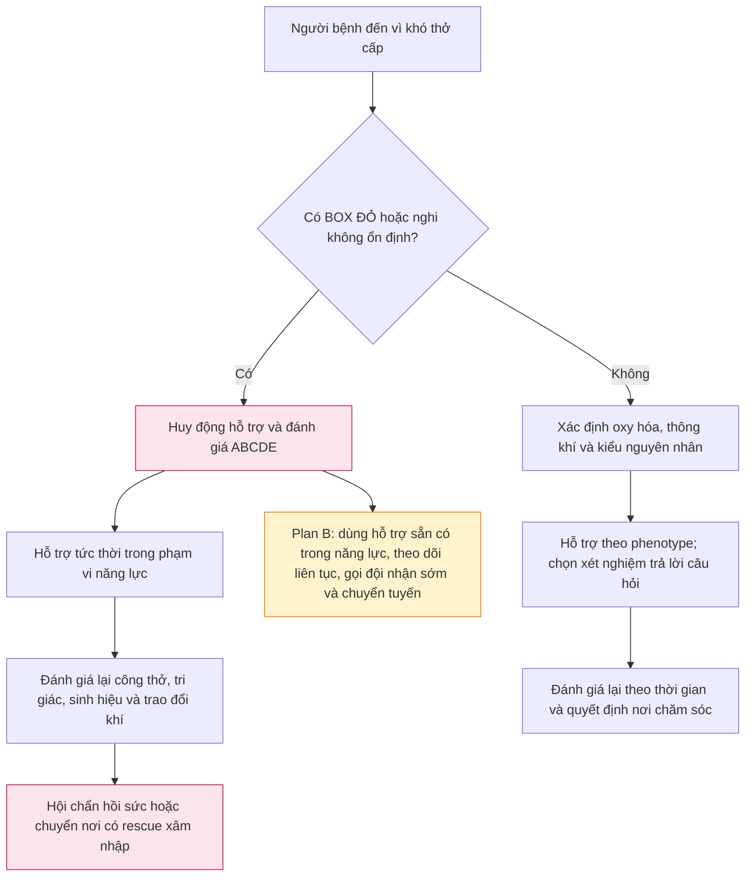
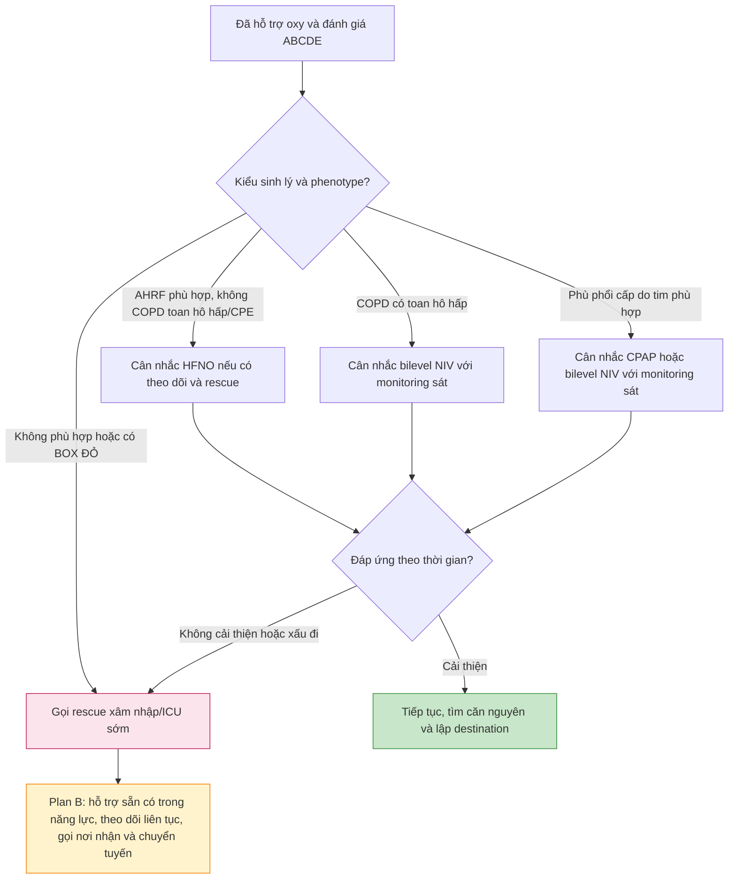

# IM-07 — Tiếp cận bệnh nhân khó thở cấp và suy hô hấp

**Ngày:** 2026-07-22 | **Chuyên khoa:** Nội khoa người lớn  
**Đối tượng:** Bác sĩ, học viên sau đại học và người học mất nền tảng  
**Phạm vi:** Nhận diện nguy kịch, hỗ trợ hô hấp theo sinh lý, đánh giá lại và chuyển đến nơi chăm sóc an toàn. Bài không thay thế protocol hoàn chỉnh của COPD, hen, viêm phổi, suy tim, thuyên tắc phổi, đặt nội khí quản hoặc thông khí xâm nhập.

---

## 0. Tổng quan — khó thở cấp là một vấn đề thời gian

Khó thở cấp là cảm giác thiếu không khí của người bệnh; nó có thể rất đáng sợ nhưng cường độ cảm giác không luôn phản ánh chính xác mức độ nặng của bệnh nền. **Respiratory distress** (dấu suy hô hấp quan sát được) là điều người khám thấy: tăng công thở, nói ngắt quãng, tím tái, vã mồ hôi, kiệt sức hoặc thay đổi tri giác. **Suy hô hấp cấp** là thất bại trao đổi khí, có thể là thất bại oxy hóa, thất bại thông khí, hoặc cả hai. Review về *acute dyspnea in the emergency department* nêu đây là một triệu chứng thường gặp, cần đánh giá chẩn đoán sớm, chiến lược monitoring và phân luồng đến care setting phù hợp; bài này không gán một tỷ lệ chung vì tần suất phụ thuộc quần thể. PMID: 37266791 [FULL VERIFIED]

Mục tiêu không phải gọi tên mọi bệnh ngay tại cửa phòng. Trình tự an toàn là: nhận ra không ổn định, bảo vệ đường thở và hô hấp trong phạm vi năng lực, xác định kiểu rối loạn sinh lý, tìm nguyên nhân nguy hiểm có thể đổi hành động, rồi chọn nơi theo dõi hoặc chuyển tuyến phù hợp.

**Mục tiêu học tập**

- Phân biệt triệu chứng khó thở, dấu suy hô hấp và suy hô hấp cấp.
- Dùng ABCDE để nhận diện nhánh cần hỗ trợ khẩn thay vì chờ hoàn tất bệnh sử.
- Phân biệt oxy hóa với thông khí và biết SpO₂, khí máu động mạch và khí máu tĩnh mạch trả lời câu hỏi nào.
- Chọn oxy thông thường, oxy dòng cao qua gọng mũi, hỗ trợ áp lực dương không xâm nhập hoặc gọi rescue xâm nhập theo phenotype và khả năng theo dõi.
- Bàn giao và chuyển tuyến theo diễn tiến, không kéo dài thử nghiệm không xâm nhập khi người bệnh xấu đi.

### 0.1 Nền tảng tối thiểu cần dùng ngay

- **Oxy hóa (oxygenation)** là đưa oxy từ phế nang vào máu. SpO₂ là độ bão hòa oxy ước lượng bằng máy đo đầu ngón; nó cho biết xu hướng oxy hóa, không cho biết trực tiếp lượng carbon dioxide hay độ toan máu.
- **Thông khí (ventilation)** là đưa không khí vào và ra khỏi phế nang để thải carbon dioxide. PaCO₂ là áp lực riêng phần carbon dioxide trong máu động mạch; pH mô tả máu đang toan hay kiềm.
- **FiO₂** là phần oxy trong khí người bệnh hít vào. Khi cần ghi bàn giao, nêu thiết bị và FiO₂ hoặc mức hỗ trợ đang dùng, không chỉ nói chung là “đang thở oxy”.
- **Khí máu động mạch (arterial blood gas, ABG)** giúp định lượng oxy hóa, PaCO₂ và pH khi câu hỏi là suy hô hấp phức tạp hoặc cần quyết định hỗ trợ thông khí. **Khí máu tĩnh mạch (venous blood gas, VBG)** có thể góp phần đánh giá toan–kiềm hoặc xu hướng CO₂ trong bối cảnh phù hợp, nhưng không đánh giá mức hypoxemia.
- **Oxy dòng cao qua gọng mũi (high-flow nasal oxygen, HFNO)** cung cấp khí được làm ấm và làm ẩm với FiO₂ kiểm soát được. **Áp lực dương liên tục (continuous positive airway pressure, CPAP)** duy trì áp lực dương; **thông khí không xâm nhập hai mức áp lực (bilevel noninvasive ventilation, NIV)** hỗ trợ cả công thở và thông khí. Chúng không thay thế khả năng theo dõi sát hoặc rescue xâm nhập.

> 🚨 **BOX ĐỎ — dừng nhánh thường quy:** Gọi hỗ trợ và đánh giá ABCDE ngay khi có khó nói thành câu, tím tái, vã mồ hôi, thở bụng nghịch thường, thay đổi tri giác, dấu tắc nghẽn đường thở, kiệt sức tiến triển, huyết động không ổn định, ngừng thở, hoặc khi nơi đang có không thể theo dõi/hỗ trợ an toàn. SFMU/SRLF khuyến cáo chủ động tìm các dấu hiệu nặng này và theo dõi liên tục người có tiêu chuẩn nặng. PMID: 41788490 [GUIDELINE VERIFIED]

Lưu đồ này bắt đầu bằng ổn định vì chẩn đoán chính xác nhưng muộn không bảo vệ được người bệnh. Plan B không phải là “thử NIV ở nơi không theo dõi”; đó là hỗ trợ cơ bản an toàn, gọi người có năng lực cao hơn và tổ chức chuyển tuyến sớm.

## 1. Định nghĩa — gọi đúng tầng vấn đề

### 1.1 Khó thở, respiratory distress và suy hô hấp cấp

Khó thở là **triệu chứng chủ quan**. Respiratory distress là **hội chứng quan sát được**: người bệnh đang huy động nhiều hơn để thở hoặc bắt đầu mất khả năng bù trừ. Suy hô hấp cấp là **thất bại sinh học của trao đổi khí**. Ba tầng này thường đi cùng nhau nhưng không đồng nghĩa.

SFMU/SRLF mô tả suy hô hấp cấp bằng thất bại oxy hóa, thất bại thông khí hoặc cả hai; assessment ban đầu phải kết hợp dấu hiệu nặng, monitoring, triage và tìm căn nguyên. PMID: 41788490 [GUIDELINE VERIFIED]

| Tầng vấn đề | Điều người học cần nhận ra | Câu hỏi tiếp theo |
|---|---|---|
| Khó thở | Người bệnh cảm thấy thiếu khí | Có red flag hay yếu tố nguy hiểm không? |
| Respiratory distress | Tăng công thở, nói ngắt quãng, kiệt sức hoặc tri giác thay đổi | Có cần hỗ trợ khẩn và monitoring liên tục không? |
| Suy hô hấp cấp | Oxy hóa, thông khí hoặc cả hai thất bại | Cần khí máu, hỗ trợ nào và nơi chăm sóc nào? |

### 1.2 ABCDE trong khó thở cấp

**A — đường thở:** hỏi người bệnh có nói được không, lắng nghe tiếng thở bất thường, quan sát dấu tắc nghẽn hoặc giảm khả năng tự bảo vệ đường thở. Nếu nghi tắc nghẽn, ưu tiên gọi hỗ trợ theo năng lực tại chỗ.

**B — hô hấp:** quan sát nhịp và công thở, SpO₂, màu da, khả năng nói, nghe phổi khi điều này không làm chậm hỗ trợ. Đừng để một SpO₂ “đẹp” làm bỏ qua người đang kiệt sức hoặc tăng CO₂.

**C — tuần hoàn:** tìm giảm tưới máu, đau ngực, rối loạn nhịp, dấu sốc hoặc phù phổi. Hô hấp và tuần hoàn có thể làm nặng nhau.

**D — thần kinh:** thay đổi tri giác có thể là dấu suy oxy, tăng CO₂, sốc, chuyển hóa hoặc ngộ độc. Quay lại A và B trước khi gọi đó là lo âu.

**E — bộc lộ có mục tiêu:** tìm ban, phù, dấu huyết khối, chấn thương, dấu nhiễm trùng hoặc đau ngực–lưng; đồng thời bảo vệ riêng tư và tránh mất nhiệt.

> 🛑 **Dừng một phút:** Một người bệnh nói được ít nhưng SpO₂ chưa giảm rõ có an toàn không? Không. Khả năng nói, công thở và tri giác là dữ kiện động; phải đánh giá lại thay vì dùng một chỉ số đơn lẻ.

## 2. Cơ chế — oxy hóa và thông khí hỏng theo các cách khác nhau

### 2.1 Thất bại oxy hóa

Oxy đi từ phế nang vào máu. Khi tỷ lệ thông khí/tưới máu không phù hợp, có shunt, tổn thương nhu mô, dịch phế nang hoặc xẹp phổi, oxy hóa có thể giảm. Mismatch thông khí/tưới máu thường đáp ứng với oxy bổ sung tốt hơn shunt thật; đây là lý do đáp ứng với hỗ trợ cũng là một dữ kiện cần đánh giá lại. [TEXTBOOK: NCBI Bookshelf, Respiratory Failure, NBK526127]

### 2.2 Thất bại thông khí

Thông khí phế nang không đủ khiến CO₂ tích lại. Cơ chế có thể là drive trung ương giảm, cơ hô hấp–thành ngực yếu, tải sức cản tăng, hoặc kiệt cơ hô hấp. Người học cần hiểu: SpO₂ có thể không báo động sớm khi vấn đề chính là CO₂ và toan hô hấp. [TEXTBOOK: NCBI Bookshelf, Respiratory Failure, NBK526127]

### 2.3 Suy hô hấp hỗn hợp

Suy hô hấp hỗn hợp có cả thiếu oxy và tăng CO₂. Đây không phải một nhãn để chờ; nó là lời nhắc phải nối phenotype, khí máu, công thở, khả năng bảo vệ đường thở và nơi rescue.

| Kiểu sinh lý | Dữ kiện gợi ý | Dữ kiện xác nhận hoặc làm rõ | Ý nghĩa an toàn |
|---|---|---|---|
| Oxy hóa thất bại | SpO₂ thấp, tăng công thở, bệnh nhu mô hoặc mạch phổi | Xu hướng SpO₂, ABG khi cần, hình ảnh/siêu âm theo câu hỏi | Chọn hỗ trợ oxy hóa và đánh giá đáp ứng sớm |
| Thông khí thất bại | Buồn ngủ, dấu mệt cơ hô hấp, nguy cơ COPD hoặc giảm drive | ABG để biết PaCO₂ và pH khi quyết định bị ảnh hưởng | Không chỉ nhìn SpO₂; cần năng lực rescue |
| Hỗn hợp | Dấu của cả hai kiểu | ABG và theo dõi động | Nâng cảnh giác, phối hợp hỗ trợ và destination |

### 2.4 Vì sao đánh giá theo thời gian quan trọng hơn “một lần đo”

Người bệnh có thể chuyển từ bù trừ sang mệt nhanh. Điều quan trọng là hướng thay đổi: nói tốt hơn hay kém hơn, công thở giảm hay tăng, tri giác cải thiện hay xấu đi, nhu cầu hỗ trợ đang giảm hay tăng. Một thử nghiệm hỗ trợ không xâm nhập chỉ hợp lý khi có monitoring sát và đường rescue xâm nhập nhanh nếu thất bại. Hướng dẫn ERS/ATS về *noninvasive ventilation for acute respiratory failure* giới hạn NIV theo phenotype, gồm COPD có toan hô hấp và phù phổi cấp do tim. PMID: 28860265 [GUIDELINE VERIFIED]

## 3. Chẩn đoán — thu thập dữ kiện làm thay đổi quyết định

### 3.1 Khám và monitoring có mục tiêu

Với người có tiêu chuẩn nặng, theo dõi huyết áp, mạch, nhịp thở, nhiệt độ, tri giác và SpO₂ liên tục hoặc đủ sát để nhận ra thay đổi. Nhịp thở cần được quan sát thực sự, không suy diễn từ máy. SFMU/SRLF xem monitoring và triage là một phần của đánh giá ban đầu, không phải công việc làm sau chẩn đoán. PMID: 41788490 [GUIDELINE VERIFIED]

### 3.2 SpO₂, VBG và ABG: dùng đúng câu hỏi

| Công cụ | Nó trả lời được gì | Nó không trả lời được gì | Khi kết quả đổi hành động |
|---|---|---|---|
| SpO₂ | Xu hướng bão hòa oxy, đáp ứng với hỗ trợ oxy | PaCO₂, pH, nguyên nhân và mức công thở | Khi cần chỉnh mục tiêu oxy, thấy đáp ứng kém hoặc diễn tiến xấu |
| VBG | Có thể góp phần đánh giá toan–kiềm/CO₂ theo bối cảnh | Mức hypoxemia | Khi cần thông tin chuyển hóa nhưng không thay thế đánh giá oxy hóa |
| ABG | Oxy hóa, PaCO₂ và pH | Không tự chẩn đoán căn nguyên | Khi nghi tăng CO₂/toan hô hấp, cần hỗ trợ thông khí hoặc quyết định nơi chăm sóc |

Không làm ABG thường quy chỉ vì người bệnh khó thở. Hãy làm khi câu hỏi là: người bệnh có tăng CO₂ hay toan hô hấp không; có cần hỗ trợ thông khí không; kết quả có đổi mức chăm sóc không. SFMU/SRLF nêu SpO₂ thường đủ để theo dõi oxy hóa, VBG không dùng để đánh giá hypoxemia, còn ABG có vai trò ở ca phức tạp hoặc khi quyết định bị ảnh hưởng. PMID: 41788490 [GUIDELINE VERIFIED]

### 3.3 Nhóm nguyên nhân nguy hiểm và test phân định đầu tiên

| Pattern nguy hiểm | Dữ kiện làm thay đổi xác suất | Test hoặc quan sát phân định đầu tiên | Không được làm |
|---|---|---|---|
| Tắc nghẽn đường thở | Không nói được, tiếng thở bất thường, phù vùng mặt/cổ | Đánh giá đường thở và gọi hỗ trợ | Chờ chụp hình thường quy trước khi bảo vệ đường thở |
| Tràn khí màng phổi áp lực | Khó thở đột ngột, đau ngực, mất ổn định | Nhận diện lâm sàng và kích hoạt xử trí cấp cứu/chuyển tuyến | Chờ hình ảnh thường quy khi nghi cao và người bệnh không ổn định |
| Phù phổi cấp do tim | Khó thở, sung huyết, dấu tim–phổi phù hợp | Siêu âm tim–phổi tích hợp hoặc xét nghiệm theo câu hỏi | Gọi một dấu đơn lẻ là chẩn đoán chắc chắn |
| Thuyên tắc phổi | Nguy cơ huyết khối, đau ngực, giảm oxy không giải thích rõ | Đánh giá xác suất trước test và pathway phù hợp | Dùng POCUS để loại trừ PE ở người không sốc |
| Toan chuyển hóa/ngộ độc | Thở nhanh, bệnh cảnh chuyển hóa hoặc phơi nhiễm | Đường huyết, khí máu và xét nghiệm theo nghi ngờ | Quy mọi tăng thông khí là bệnh phổi |

### 3.4 Siêu âm tại giường: trợ giúp, không thay thế lý luận

Siêu âm phổi–tim tích hợp có thể hỗ trợ định hướng nguyên nhân khó thở cấp nếu được thực hiện bởi người có năng lực và đặt trong bối cảnh lâm sàng. Nó không đủ để rule in hoặc rule out PE ở người bệnh không sốc. SFMU/SRLF nêu rõ giới hạn này. PMID: 41788490 [GUIDELINE VERIFIED]

Meta-analysis về *point-of-care lung ultrasonography versus chest radiography* ở người lớn có triệu chứng *acute decompensated heart failure* cho thấy siêu âm phổi có độ chính xác chẩn đoán cao hơn X-quang ngực trong bối cảnh nghiên cứu; kết quả không biến siêu âm thành “test duy nhất”. PMID: 35504747 [FULL VERIFIED]

> ⚠️ **Bẫy thường gặp:** “Có máy siêu âm” không đồng nghĩa với “đã có câu trả lời”. Hỏi trước: kết quả nào sẽ làm tôi đổi hỗ trợ, xét nghiệm, hội chẩn hay destination?

## 4. Điều trị và quản lý — hỗ trợ theo phenotype, không theo thói quen

### 4.1 Oxy là đơn thuốc có đích

Oxy cần một khoảng đích được kê đơn và một mốc đánh giá lại. Ở người có nguy cơ suy hô hấp tăng CO₂, dùng đích thấp hơn có kiểm soát thay vì mặc định oxy tối đa. Không đưa một khoảng số chung vào bài này vì nó phụ thuộc phenotype và nguồn trực tiếp đã khóa chỉ cho phép cách diễn đạt định tính ngoài bối cảnh NIV tăng CO₂. AARC và SFMU/SRLF đều đặt oxy trong quy trình mục tiêu–monitoring–reassessment. PMID: 34728574 [GUIDELINE VERIFIED]

### 4.2 Chọn hỗ trợ hô hấp theo câu hỏi sinh lý

| Hỗ trợ | Phenotype phù hợp trong bài này | Không dùng như mặc định khi | Dấu thất bại cần escalation |
|---|---|---|---|
| Oxy thông thường | Cần sửa oxy hóa, còn ổn định và đáp ứng | Có BOX ĐỎ hoặc nhu cầu hỗ trợ tăng nhanh | SpO₂, công thở, tri giác hoặc huyết động xấu đi |
| HFNO | AHRF giảm oxy theo phenotype, không phải COPD toan hô hấp hay phù phổi cấp do tim | Không có monitoring hoặc không có rescue xâm nhập | Không cải thiện, kiệt sức, xấu tri giác hoặc tăng nhu cầu hỗ trợ |
| CPAP/bilevel NIV | Phù phổi cấp do tim phù hợp; bilevel NIV trong COPD có toan hô hấp | Không bảo vệ được đường thở, không hợp tác, nhiều đờm, sốc hoặc không có rescue nhanh | Không cải thiện theo thời gian, công thở/khí máu/tri giác xấu hơn |
| Rescue xâm nhập | Thất bại hỗ trợ không xâm nhập hoặc nguy cơ mất đường thở | Không trì hoãn bằng một “trial” không được theo dõi | Gọi đội hồi sức và chuyển nơi có năng lực |

ERS/ATS khuyến cáo bilevel NIV trong COPD có suy hô hấp cấp hoặc cấp trên mạn kèm toan hô hấp; CPAP hoặc bilevel NIV có vai trò trong phù phổi cấp do tim. Các khuyến cáo này không phải lệnh dùng NIV cho mọi người khó thở. PMID: 28860265 [GUIDELINE VERIFIED]

ESICM khuyến cáo HFNO hơn oxy thông thường trong AHRF không do đợt cấp COPD hoặc phù phổi cấp do tim, nhưng không thể chọn HFNO hay CPAP/NIV một cách phổ quát cho AHRF không chọn lọc. Chọn lựa cần dựa phenotype, tolerance, expertise, monitoring và khả năng rescue. PMID: 37326646 [GUIDELINE VERIFIED]

### 4.3 Tại sao không kéo dài thử nghiệm thất bại

NIV hữu ích khi đúng phenotype nhưng có thể nguy hiểm nếu nó làm trễ rescue xâm nhập ở người đang xấu đi. Người học không cần một con số “đặt nội khí quản”; cần nhìn quỹ đạo lâm sàng: tri giác, bảo vệ đường thở, công thở, huyết động, khí máu, tiết đàm và khả năng rescue ngay tại nơi đang điều trị.

### 4.4 Bằng chứng dùng để hiểu giới hạn, không để bỏ qua phenotype

FLORALI là thử nghiệm *high-flow oxygen through nasal cannula in acute hypoxemic respiratory failure* không tăng CO₂; tỷ lệ đặt nội khí quản không khác biệt có ý nghĩa giữa HFNO, oxy chuẩn và NIV, trong khi tử vong thời điểm 90 ngày thấp hơn ở nhóm HFNO trong thử nghiệm này. Kết quả không được ngoại suy thành lợi ích tử vong cho mọi AHRF. PMID: 25981908 [FULL VERIFIED]

Một RCT về *noninvasive ventilation for acute exacerbations of chronic obstructive pulmonary disease* ở COPD được chọn lọc cho thấy NIV giảm nhu cầu đặt nội khí quản, biến chứng, thời gian nằm viện và tử vong nội viện so với điều trị chuẩn; điều này giải thích vì sao phenotype COPD có toan hô hấp được tách riêng. PMID: 7651472 [FULL VERIFIED]

Ở phù phổi cấp do tim, thử nghiệm *noninvasive ventilation in acute cardiogenic pulmonary edema* cho thấy NIV cải thiện khó thở và rối loạn khí máu sớm hơn oxy chuẩn nhưng không khác tử vong ngắn hạn; do đó quyết định phải dựa tổng hợp guideline và phenotype, không một trial đơn lẻ. PMID: 18614781 [FULL VERIFIED]

## 5. Theo dõi, đánh giá lại và chuyển tuyến

### 5.1 Vòng đánh giá lại có cấu trúc

| Sau một can thiệp | Kiểm tra lại | Nếu tốt hơn | Nếu xấu đi |
|---|---|---|---|
| Hỗ trợ oxy | SpO₂, công thở, khả năng nói, tri giác | Tiếp tục có mục tiêu và tìm căn nguyên | Tăng mức hỗ trợ/hội chẩn sớm |
| HFNO hoặc NIV | Tolerance, công thở, tri giác, huyết động, khí máu khi cần | Duy trì monitoring và định vị nơi chăm sóc | Dừng kéo dài trial, gọi rescue xâm nhập |
| Test chẩn đoán | Test có trả lời câu hỏi đã đặt ra không | Cập nhật chẩn đoán làm việc | Trở lại ABCDE và tìm nguyên nhân nguy hiểm khác |
| Chuẩn bị chuyển tuyến | Thiết bị, FiO₂/mức hỗ trợ, SpO₂, sinh hiệu, đáp ứng | Bàn giao có cấu trúc | Không rời nơi theo dõi khi chưa có kế hoạch an toàn |

SFMU/SRLF khuyến nghị cân nhắc nơi chăm sóc cao hơn ở người đang NIV, cần nhu cầu oxy cao kéo dài hoặc có suy cơ quan khác; thông khí xâm nhập cần ICU trực tiếp. PMID: 41788490 [GUIDELINE VERIFIED]

### 5.2 Bàn giao để người nhận có thể hành động

Dùng SBAR: **Situation** là lý do khẩn hiện tại; **Background** là bệnh nền và timeline; **Assessment** là kiểu suy hô hấp, dấu nặng, dữ kiện đã có; **Recommendation** là hỗ trợ đang dùng, đáp ứng, điều còn lo ngại và nhu cầu đội nhận. Nêu rõ thiết bị hỗ trợ, FiO₂ hoặc mức hỗ trợ, SpO₂, nhịp thở, công thở, ABG khi đã làm, chẩn đoán làm việc và điều kiện cần rescue.

### 5.3 Plan A và Plan B trong điều kiện thiếu nguồn lực

**Plan A:** nếu có đội hồi sức, monitoring liên tục, khí máu và rescue xâm nhập, chọn hỗ trợ theo phenotype và đánh giá lại theo quỹ đạo.

**Plan B:** nếu thiếu thiết bị, chuyên gia hoặc khả năng theo dõi, hỗ trợ cơ bản có sẵn trong phạm vi năng lực, theo dõi liên tục bằng những gì có thể làm an toàn, gọi nơi nhận sớm và chuyển tuyến. Không dùng một thử nghiệm NIV hoặc HFNO không được theo dõi như cách thay thế ICU.

## 6. Case lâm sàng

### Case 1 — COPD có nguy cơ suy hô hấp tăng CO₂

**Tình huống:** Người bệnh có COPD, khó thở tăng, mệt, nói ngắt quãng và bắt đầu buồn ngủ.

1. **Nhận diện nguy cơ:** đây là BOX ĐỎ vì có dấu kiệt sức và thay đổi tri giác; nguy cơ không chỉ là thiếu oxy mà còn thất bại thông khí.
2. **Dữ kiện đổi quyết định:** công thở, tri giác, SpO₂, sinh hiệu và ABG để xác định PaCO₂/pH nếu kết quả sẽ đổi hỗ trợ.
3. **Hành động ngay:** kê oxy theo mục tiêu có kiểm soát, gọi hỗ trợ, làm ABG khi phù hợp; chỉ cân nhắc bilevel NIV khi phenotype có toan hô hấp, có monitoring sát và rescue xâm nhập nhanh.
4. **Đánh giá lại/chuyển tuyến:** theo dõi xu hướng tri giác, công thở, khí máu và khả năng hợp tác; escalate nếu không cải thiện hoặc xấu đi.
5. **Vì sao phương án sai không an toàn:** không cho oxy tối đa mặc định, không dùng SpO₂ đơn độc để loại trừ tăng CO₂, và không kéo dài NIV tại nơi không có rescue.

### Case 2 — phù phổi cấp do tim

**Tình huống:** Người bệnh khó thở dữ dội, có dấu sung huyết và distress, nhưng còn tỉnh và hợp tác.

1. **Nhận diện nguy cơ:** respiratory distress cần ABCDE và theo dõi liên tục.
2. **Dữ kiện đổi quyết định:** huyết động, tri giác, dấu phù phổi, nguyên nhân tim–mạch đi kèm và khả năng bảo vệ đường thở.
3. **Hành động ngay:** hỗ trợ oxy theo đích; cân nhắc CPAP hoặc bilevel NIV khi phenotype phù hợp, có monitoring và rescue.
4. **Đánh giá lại/chuyển tuyến:** kiểm tra công thở, tolerance, huyết động và khí máu khi cần; người xấu đi cần ICU/rescue sớm.
5. **Vì sao phương án sai không an toàn:** không mặc định NIV cho shock, hội chứng vành cấp không ổn định hoặc người không bảo vệ được đường thở.

### Case 3 — viêm phổi giảm oxy đang HFNO

**Tình huống:** Người bệnh viêm phổi có AHRF, đang HFNO, lúc đầu nói dễ hơn nhưng sau đó tăng công thở và lơ mơ.

1. **Nhận diện nguy cơ:** deterioration lâm sàng quan trọng hơn một điểm số hoặc một lần SpO₂.
2. **Dữ kiện đổi quyết định:** quỹ đạo công thở, tri giác, huyết động, nhu cầu hỗ trợ và ABG khi cần.
3. **Hành động ngay:** gọi đội hồi sức/rescue; không chờ một ngưỡng máy móc mới escalation.
4. **Đánh giá lại/chuyển tuyến:** chuyển đến nơi có rescue xâm nhập và theo dõi liên tục.
5. **Vì sao phương án sai không an toàn:** ROX chỉ là công cụ hỗ trợ trong cohort viêm phổi điều trị HFNC, không cho phép trì hoãn escalation khi đang xấu đi. PMID: 27481760 [FULL VERIFIED]

### Case 4 — nghi tràn khí màng phổi áp lực

**Tình huống:** Người bệnh xuất hiện khó thở và đau ngực đột ngột, nhanh chóng mất ổn định.

1. **Nhận diện nguy cơ:** xem là cấp cứu đe dọa tính mạng cho đến khi được loại trừ an toàn.
2. **Dữ kiện đổi quyết định:** diễn tiến đột ngột, dấu suy hô hấp và huyết động; tìm dữ kiện lâm sàng có thể thu thập ngay.
3. **Hành động ngay:** huy động cấp cứu, xử trí và chuyển tuyến theo năng lực local; không chờ chẩn đoán hình ảnh thường quy nếu điều đó làm chậm hành động cứu mạng.
4. **Đánh giá lại/chuyển tuyến:** theo dõi liên tục trong khi tổ chức nơi có can thiệp dứt điểm.
5. **Vì sao phương án sai không an toàn:** chờ X-quang “để chắc” ở người không ổn định có thể trì hoãn xử trí khẩn.

### Case 5 — nghi PE hoặc bắt chước do toan chuyển hóa

**Tình huống:** Người bệnh thở nhanh, khó thở, đau ngực không điển hình; có thể có nguy cơ huyết khối nhưng cũng có bối cảnh chuyển hóa.

1. **Nhận diện nguy cơ:** ABCDE trước; thở nhanh có thể là đáp ứng bù, không mặc định là bệnh phổi.
2. **Dữ kiện đổi quyết định:** nguy cơ huyết khối, huyết động, SpO₂, dấu nhiễm trùng/chuyển hóa, khí máu và xét nghiệm có mục tiêu.
3. **Hành động ngay:** chọn pathway PE theo xác suất trước test khi phù hợp; đồng thời tìm nguyên nhân chuyển hóa hoặc ngộ độc nếu bối cảnh gợi ý.
4. **Đánh giá lại/chuyển tuyến:** nếu mất ổn định, escalating support và chuyển nơi đủ năng lực; POCUS không được dùng để loại trừ PE ở người không sốc.
5. **Vì sao phương án sai không an toàn:** gọi “lo âu” hoặc làm một panel xét nghiệm không câu hỏi có thể bỏ sót nguyên nhân nguy hiểm.

## 7. Tips thực hành
<!-- ## 7. TIPS -->

- Hỏi “người bệnh có đang kiệt sức không?” trước khi hỏi “bệnh gì?”.
- Khả năng nói, công thở và tri giác là dữ kiện lặp lại; ghi xu hướng của chúng.
- SpO₂ là monitor oxy hóa, không phải máy đo thông khí.
- ABG chỉ tốt khi nó trả lời một câu hỏi sẽ đổi hỗ trợ hoặc destination.
- Oxy là đơn thuốc có đích và mốc đánh giá lại, không phải phản xạ “càng nhiều càng tốt”.
- HFNO và NIV là lựa chọn theo phenotype; không phải bậc thang bắt buộc cho mọi khó thở.
- Một trial không xâm nhập chỉ an toàn khi có monitoring sát và rescue xâm nhập nhanh.
- Trong chuyển tuyến, nói rõ thiết bị, mức hỗ trợ, quỹ đạo và lý do lo ngại.
- Khi thiếu nguồn lực, chuyển sớm an toàn hơn cố kéo dài một hỗ trợ không theo dõi.
- POCUS bổ sung cho câu hỏi lâm sàng; nó không thay thế xác suất trước test và đánh giá lại.

## 8. Tóm tắt

1. Khó thở là triệu chứng; respiratory distress là dấu quan sát được; suy hô hấp là thất bại trao đổi khí.
2. BOX ĐỎ đưa người học về ABCDE, hỗ trợ tức thời và gọi giúp đỡ.
3. Luôn phân biệt oxy hóa với thông khí; SpO₂ không cho biết PaCO₂ hay pH.
4. Chọn ABG khi nó đổi quyết định về hỗ trợ thông khí hoặc nơi chăm sóc.
5. Oxy phải có đích và được đánh giá lại; nguy cơ tăng CO₂ cần mục tiêu có kiểm soát.
6. HFNO phù hợp cho một số AHRF; không dùng một trial để trì hoãn rescue khi xấu đi.
7. Bilevel NIV có vai trò rõ trong COPD có toan hô hấp; CPAP/bilevel NIV có vai trò trong phù phổi cấp do tim phù hợp.
8. Các thiết bị không thay thế monitoring, expertise và khả năng rescue xâm nhập.
9. Test chẩn đoán phải trả lời một câu hỏi có thể đổi hành động.
10. Destination và bàn giao là một phần của điều trị ban đầu, không phải việc cuối cùng.

## 9. Bằng chứng

### 9.1 Guideline nền cho triage và hỗ trợ

SFMU/SRLF 2026 là khung chính cho đánh giá severity, monitoring, khí máu chọn lọc, diagnostic strategy và disposition. AARC 2022 nhấn mạnh oxygen theo target và reassessment. ERS/ATS 2017 tách chỉ định NIV theo phenotype; ESICM 2023 giới hạn suy luận HFNO trong AHRF; BTS/ICS 2016 hướng đến suy hô hấp tăng CO₂. PMID: 41788490 [GUIDELINE VERIFIED]

### 9.2 HFNO và NIV: không chuyển kết quả nghiên cứu thành luật phổ quát

Network meta-analysis gồm 25 thử nghiệm ngẫu nhiên với 3.804 người tham gia AHRF; các kết quả so sánh mortality phụ thuộc loại giao diện và certainty, nên bài này dùng nó để nhấn mạnh heterogeneity chứ không tạo một thứ tự thiết bị cố định. PMID: 32496521 [FULL VERIFIED]

ROX được định nghĩa là `(SpO₂/FiO₂)/RR`. Trong cohort viêm phổi dùng HFNC, ngưỡng 4,88 tại thời điểm 12 giờ liên quan nguy cơ cần thông khí cơ học thấp hơn; công thức và ngưỡng chỉ có giá trị trong đúng bối cảnh đó, không được dùng để trì hoãn escalation khi deteriorate. PMID: 27481760 [FULL VERIFIED]

### 9.3 Chẩn đoán định hướng

Review khó thở cấp nhấn mạnh đánh giá sớm, lựa chọn monitoring và phân luồng nơi chăm sóc. SFMU/SRLF khuyến nghị chiến lược PE theo xác suất trước test, diễn giải BNP/NT-proBNP theo context và dùng siêu âm tim–phổi tích hợp như dữ kiện hỗ trợ. PMID: 37266791 [ABSTRACT VERIFIED]

## 10. Tài liệu tham khảo

1. Le Borgne P, Thille AW, Guenezan J, et al. *Guidelines for the Initial Assessment of Respiratory Distress in the Emergency Department.* Annals of Intensive Care. 2026. PMID: 41788490. [GUIDELINE VERIFIED]
2. Piraino T, Madden M, Roberts KJ, et al. *AARC Clinical Practice Guideline: Management of Adult Patients With Oxygen in the Acute Care Setting.* Respiratory Care. 2022. PMID: 34728574. [GUIDELINE VERIFIED]
3. Rochwerg B, Brochard L, Elliott MW, et al. *Official ERS/ATS clinical practice guidelines: noninvasive ventilation for acute respiratory failure.* European Respiratory Journal. 2017. PMID: 28860265. [GUIDELINE VERIFIED]
4. Grasselli G, Calfee CS, Camporota L, et al. *ESICM guidelines on acute respiratory distress syndrome: definition, phenotyping and respiratory support strategies.* Intensive Care Medicine. 2023. PMID: 37326646. [GUIDELINE VERIFIED]
5. Davidson AC, Banham S, Elliott M, et al. *BTS/ICS guideline for the ventilatory management of acute hypercapnic respiratory failure in adults.* Thorax. 2016. PMID: 26976648. [GUIDELINE VERIFIED]
6. Frat JP, Thille AW, Mercat A, et al. *High-flow oxygen through nasal cannula in acute hypoxemic respiratory failure.* New England Journal of Medicine. 2015. PMID: 25981908. [FULL VERIFIED]
7. Brochard L, Mancebo J, Wysocki M, et al. *Noninvasive ventilation for acute exacerbations of chronic obstructive pulmonary disease.* New England Journal of Medicine. 1995. PMID: 7651472. [FULL VERIFIED]
8. Gray A, Goodacre S, Newby DE, et al. *Noninvasive ventilation in acute cardiogenic pulmonary edema.* New England Journal of Medicine. 2008. PMID: 18614781. [FULL VERIFIED]
9. Ferreyro BL, Angriman F, Munshi L, et al. *Association of Noninvasive Oxygenation Strategies With All-Cause Mortality in Adults With Acute Hypoxemic Respiratory Failure.* JAMA. 2020. PMID: 32496521. [FULL VERIFIED]
10. Chiu L, Jairam MP, Chow R, et al. *Meta-Analysis of Point-of-Care Lung Ultrasonography Versus Chest Radiography in Adults With Symptoms of Acute Decompensated Heart Failure.* American Journal of Cardiology. 2022. PMID: 35504747. [FULL VERIFIED]
11. Roca O, Messika J, Caralt B, et al. *Predicting success of high-flow nasal cannula in pneumonia patients with hypoxemic respiratory failure: The utility of the ROX index.* Journal of Critical Care. 2016. PMID: 27481760. [FULL VERIFIED]
12. Santus P, Radovanovic D, Saad M, et al. *Acute dyspnea in the emergency department: a clinical review.* Internal and Emergency Medicine. 2023. PMID: 37266791. [ABSTRACT VERIFIED]
13. NCBI Bookshelf. *Respiratory Failure.* NBK526127. [TEXTBOOK VERIFIED]

**— Hết bài học ngày 2026-07-22 —**
