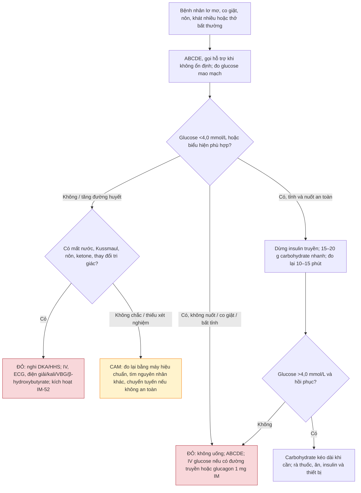
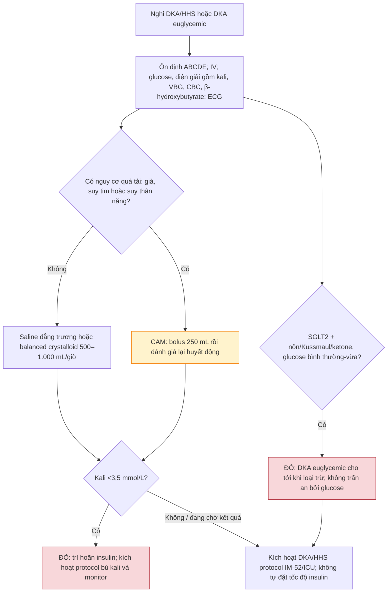

# BÀI HỌC Y KHOA: IM-14 — RỐI LOẠN ĐƯỜNG HUYẾT CẤP TRONG 15 PHÚT ĐẦU
**Ngày:** 2026-07-18 | **Chuyên khoa:** Nội khoa người lớn | **Đối tượng:** Bác sĩ và học viên cần một đường cứu nguy ban đầu an toàn

---

## 0. TỔNG QUAN — VÌ SAO BÀI NÀY QUAN TRỌNG?

Một người lơ mơ, co giật, nôn, thở nhanh hoặc tụt huyết áp có thể đang hạ đường huyết hoặc một cơn tăng đường huyết nặng. Trong 15 phút đầu, mục tiêu không phải là hoàn tất chẩn đoán ĐKA/HHS, mà là **giữ an toàn ABCDE, đo glucose tại giường, sửa ngay nhánh nguy hiểm và kích hoạt đúng protocol**.

**Mục tiêu của bài:**
- Dùng ABCDE và glucose mao mạch để phân luồng ngay cả khi chưa biết bệnh nền đầy đủ.
- Cấp cứu hạ đường huyết bằng nhánh uống khi nuốt an toàn hoặc nhánh tĩnh mạch/glucagon khi không nuốt an toàn.
- Nhận ra DKA/HHS, kể cả DKA đường huyết bình thường hoặc chỉ tăng vừa, rồi bàn giao sang IM-52/local ICU protocol.

### 📋 TRƯỚC KHI ĐỌC — NỀN TẢNG CẦN DÙNG

- **Glucose** là đường lưu hành trong máu. Đơn vị có thể là mg/dL hoặc mmol/L; quy đổi gần đúng: mmol/L × 18 = mg/dL.
- **Insulin** đưa glucose vào nhiều mô và kìm tạo ketone. **Glucagon** tăng glucose bằng huy động dự trữ ở gan.
- Bài IM-01–IM-06 chưa có; vì vậy ABCDE cần thiết được dạy ngay dưới đây, không phải điều kiện để học bài này.

### 0.1 Nền tảng tối thiểu cần dùng ngay

**ABCDE** là thứ tự tìm và sửa nguy cơ tử vong: gọi hỗ trợ ngay khi bệnh nhân không ổn định; **A** bảo vệ đường thở, đặt tư thế an toàn/hút dịch khi cần; **B** đánh giá thở và oxy hóa; **C** đo mạch, huyết áp, tưới máu và đặt đường truyền; **D** đánh giá tri giác, đồng tử, nhiệt độ và glucose mao mạch; **E** quan sát toàn thân, bơm insulin/thiết bị, thuốc và bữa ăn gần đây. Làm lại ABCDE sau mỗi can thiệp.

Não phụ thuộc glucose đang lưu hành. Khi glucose quá thấp, người bệnh có thể vã mồ hôi, run, lú lẫn, co giật hoặc hôn mê. Khi insulin thiếu nhiều, glucose và ketone tăng; glucose kéo nước và điện giải theo nước tiểu gây lợi niệu thẩm thấu, mất nước và giảm tưới máu. [TEXTBOOK: Guyton and Hall Textbook of Medical Physiology, 15e.]

---

## 1. ĐO GLUCOSE VÀ NHẬN DIỆN HẠ ĐƯỜNG HUYẾT [CỐT LÕI]

### 1.1 Glucose tại giường là bộ phân loại tức thời

Máy đo glucose mao mạch (đầu ngón tay) cho quyết định cấp cứu tức thời; CGM hữu ích nhận cảnh báo nhưng không thay thế đo xác nhận khi bệnh nhân có triệu chứng nặng hoặc trị số không hợp với biểu hiện. Kết quả bất ngờ cần đo lại bằng máy bệnh viện đã hiệu chuẩn hoặc xác nhận xét nghiệm, **nhưng không được trì hoãn cấp cứu một bệnh nhân có biểu hiện phù hợp**.

ADA phân loại: **mức 1** là glucose <70 mg/dL (<3,9 mmol/L) và ≥54 mg/dL (≥3,0 mmol/L); **mức 2** là <54 mg/dL (<3,0 mmol/L); **mức 3** là thay đổi trạng thái thể chất/tinh thần cần người khác hỗ trợ, bất kể glucose đo được. [ADA 2026 - Glycemic Goals, Hypoglycemia, and Hyperglycemic Crises. [GUIDELINE VERIFIED]]

### 1.2 Dấu hiệu thay đổi hành động

Triệu chứng cảnh báo sớm gồm đói, run, vã mồ hôi, hồi hộp và lo âu. Dấu thần kinh gồm lú lẫn, hành vi bất thường, nói khó, co giật hoặc hôn mê. Hỏi insulin, sulfonylurea, bữa ăn bỏ lỡ, vận động, rượu, bệnh gan/thận và bơm insulin; các dữ kiện này giúp tìm nguyên nhân sau khi cứu nguy.

### 🛑 DỪNG 1 PHÚT — TỰ KIỂM TRA
> 1. 52 mg/dL bằng khoảng bao nhiêu mmol/L? 2. Vì sao CGM bất ngờ thấp không phải lý do trì hoãn cứu người có co giật?
>
> *(Đáp án: khoảng 2,9 mmol/L; cần đo xác nhận song song, nhưng ABCDE và điều trị nhánh nguy hiểm diễn ra ngay.)*

---

## 2. CƠ CHẾ SINH LÝ / SINH BỆNH HỌC [CỐT LÕI]

### 2.1 Hạ đường huyết và khả năng nuốt

Carbohydrate hấp thu nhanh tăng glucose nhanh khi người bệnh tỉnh, hợp tác và bảo vệ được đường thở. Ngược lại, đồ ăn, nước hay gel uống có thể gây sặc ở người lơ mơ, co giật hoặc không nuốt được. Vì vậy **khả năng nuốt**, không chỉ con số glucose, quyết định đường dùng.

### 2.2 Tăng đường huyết nặng và ketone

DKA cần ba thành phần: đái tháo đường/tăng glucose, ketonemia và toan chuyển hóa. HHS là tăng glucose nặng, tăng thẩm thấu và mất nước nhưng không có ketonemia/toan nặng; hai hội chứng có thể chồng lấp. β-hydroxybutyrate máu là ketone chính trong DKA. Ketone niệu nitroprusside không đo β-hydroxybutyrate, có thể đánh giá thấp ketonemia sớm và đánh giá cao muộn. [ADA/EASD 2024 - Hyperglycemic Crises. [GUIDELINE VERIFIED]]

---

## 3. CHẨN ĐOÁN VÀ PHÂN LUỒNG BAN ĐẦU [CỐT LÕI]

> 🚨 **BOX ĐỎ — CẤP CỨU TRƯỚC KHI PHÂN BIỆT:** Không tỉnh, co giật, không bảo vệ được đường thở, sốc/hạ huyết áp, thở Kussmaul, nôn dai dẳng, đau bụng kèm ketone, thay đổi tri giác hoặc mất nước nặng → gọi cấp cứu, ABCDE, monitor/đường truyền và điều trị nhánh cấp cứu ngay. **Không cho bất cứ thức ăn, đồ uống hoặc gel đường uống** nếu không nuốt/bảo vệ đường thở an toàn. Thai kỳ là nhánh hội chẩn sản–cấp cứu; bài này không suy diễn liều người lớn cho trẻ em.

### 3.1 Khi nào nghĩ hạ đường huyết?

Trong bệnh viện, JBDS dùng ngưỡng glucose mao mạch <4,0 mmol/L để khởi động điều trị ở người lớn dùng insulin hoặc thuốc hạ glucose. Người tỉnh, định hướng, nuốt an toàn đi nhánh carbohydrate uống; người không nuốt an toàn đi nhánh không dùng đường miệng. [JBDS 01 2023 - Hospital Management of Hypoglycaemia in Adults. [GUIDELINE VERIFIED]]

### 3.2 Khi nào kích hoạt nghi DKA/HHS?

Gợi ý gồm khát/tiểu nhiều, mất nước, nhịp nhanh/hạ huyết áp, Kussmaul, nôn hoặc đau bụng, giảm tri giác, nhiễm trùng/thiếu máu cơ tim, bỏ insulin hoặc lỗi bơm. Người dùng SGLT2 inhibitor có nôn, mệt, Kussmaul hoặc ketone **không được trấn an bởi glucose bình thường hay chỉ tăng vừa**: cần nghĩ DKA euglycemic và kích hoạt protocol. [ADA/EASD 2024 - Hyperglycemic Crises. [GUIDELINE VERIFIED]]

### 3.3 Nếu glucose không giải thích được bệnh cảnh

Đo lại glucose nếu không tương xứng, nhưng mở rộng chẩn đoán song song: thiếu oxy, sepsis, đột quỵ, ngộ độc, rối loạn điện giải, co giật và nguyên nhân khác. Không gán mọi thay đổi tri giác cho glucose.

---

## 4. EVIDENCE & GUIDELINES [CỐT LÕI]

### 4.1 Hạ đường huyết

ADA 2026 định nghĩa các mức hạ đường huyết và nhấn mạnh carbohydrate hấp thu nhanh cho người còn tỉnh/nuốt được. JBDS 01 năm 2023 là protocol vận hành bệnh viện dùng trong bài: điều trị <4,0 mmol/L, đánh giá lại, chuyển nhánh tĩnh mạch hoặc glucagon khi không nuốt an toàn. [ADA 2026 - Glycemic Goals, Hypoglycemia, and Hyperglycemic Crises. [GUIDELINE VERIFIED]] [JBDS 01 2023 - Hospital Management of Hypoglycaemia in Adults. [GUIDELINE VERIFIED]]

### 4.2 DKA/HHS

Đồng thuận ADA/EASD/JBDS/AACE/DTS 2024 cung cấp nhận diện DKA/HHS, xét nghiệm ban đầu, dịch tinh thể khởi đầu và cảnh báo insulin khi kali thấp. Bài chỉ dạy giai đoạn nhận diện–ổn định–bàn giao; liều truyền insulin, bù kali, bicarbonate/phosphate, tốc độ chỉnh thẩm thấu và tiêu chí kết thúc thuộc IM-52/local ICU protocol. [ADA/EASD 2024 - Hyperglycemic Crises. [GUIDELINE VERIFIED]]

---

## 5. ĐIỀU TRỊ & QUẢN LÝ [CỐT LÕI]

### 5.1 Hạ đường huyết: tỉnh, định hướng, nuốt an toàn

**Mục tiêu:** đưa glucose lên trên 4,0 mmol/L mà không tạo nguy cơ sặc.

1. Dừng truyền insulin đang chạy; ABCDE và gọi hỗ trợ nếu diễn tiến xấu.
2. Cho 15–20 g carbohydrate tác dụng nhanh qua miệng.
3. Đo lại glucose sau 10–15 phút; nếu vẫn <4,0 mmol/L, lặp lại, tối đa ba chu kỳ điều trị.
4. Nếu vẫn <4,0 mmol/L sau 30–45 phút, gọi bác sĩ/cấp cứu và chuyển sang cứu hộ đường tiêm–truyền theo lệnh khẩn tại chỗ.
5. Khi >4,0 mmol/L và người bệnh hồi phục, cho carbohydrate kéo dài nếu bữa ăn không sắp tới; rà lại nguyên nhân, insulin/thuốc, ăn uống và thiết bị. [JBDS 01 2023 - Hospital Management of Hypoglycaemia in Adults. [GUIDELINE VERIFIED]]

### 5.2 Hạ đường huyết: không nuốt an toàn, co giật hoặc bất tỉnh

**Không cho uống.** Gọi hỗ trợ khẩn, ABCDE, dừng truyền insulin. Có đường truyền tĩnh mạch: cho **100 mL glucose 20%** hoặc **200 mL glucose 10%** trong 15 phút. Chưa có đường truyền: **glucagon 1 mg tiêm bắp** trong khi tiếp tục thiết lập đường truyền. Đo lại glucose mao mạch sau 10 phút; nếu vẫn <4,0 mmol/L, lặp lại cứu hộ đường tiêm–truyền theo lệnh cấp cứu tại cơ sở. Glucagon có thể kém hiệu quả khi phơi nhiễm sulfonylurea, suy dinh dưỡng/nhịn đói kéo dài, lạm dụng rượu hoặc bệnh gan mạn. [JBDS 01 2023 - Hospital Management of Hypoglycaemia in Adults. [GUIDELINE VERIFIED]]

### 5.3 Nghi DKA/HHS: bundle trong 15 phút đầu

Đo glucose tại giường; lấy điện giải gồm kali, khí máu tĩnh mạch, công thức máu và β-hydroxybutyrate máu mà không trì hoãn hồi sức. Đánh giá thể tích bằng sinh hiệu/khám, đặt monitor ECG hoặc làm ECG để phát hiện thay đổi liên quan kali/thiếu máu cơ tim, thiết lập đường truyền và tìm nhiễm trùng, ischemia, bỏ insulin/lỗi thiết bị.

Người lớn không suy tim/suy thận nặng: bắt đầu saline đẳng trương hoặc balanced crystalloid 500–1.000 mL/giờ trong khi kích hoạt DKA/HHS protocol. Người cao tuổi, suy tim hoặc bệnh thận giai đoạn cuối: dùng bolus nhỏ 250 mL và đánh giá huyết động thường xuyên. Nếu kali <3,5 mmol/L, **trì hoãn insulin và kích hoạt protocol bù kali**; không tự nghĩ ra liều insulin hoặc kali. [ADA/EASD 2024 - Hyperglycemic Crises. [GUIDELINE VERIFIED]]

---

## 6. LƯU ĐỒ QUYẾT ĐỊNH LÂM SÀNG [CỐT LÕI]

1. ABCDE và glucose mao mạch diễn ra trước khi gắn nhãn bệnh.
2. Nuốt an toàn mở nhánh carbohydrate uống; giảm tri giác đóng hoàn toàn đường uống.
3. Một glucose không giải thích được bệnh cảnh không kết thúc đánh giá: đo lại và tìm nguyên nhân nguy hiểm khác.
4. Dấu mất nước–Kussmaul–ketone chuyển ngay sang bundle DKA/HHS và IM-52.

1. β-hydroxybutyrate máu là Plan A; ketone niệu chỉ là Plan B khi chưa có xét nghiệm máu.
2. Dịch bắt đầu trong giai đoạn ổn định nhưng phải giảm thể tích bolus ở nguy cơ quá tải.
3. Kali thấp là điểm dừng an toàn trước insulin, không phải lời mời tự chọn liều bù.
4. Bàn giao IM-52/ICU gồm thời điểm, sinh hiệu, dịch đã dùng, glucose, ketone, VBG, điện giải/kali và yếu tố khởi phát.

---

## 7. SAI LẦM THƯỜNG GẶP — LÂM SÀNG [CỐT LÕI]

| # | Sai lầm | Hậu quả | Cách tránh |
|---|---|---|---|
| 1 | Cho nước, thức ăn hoặc gel cho người lơ mơ | Sặc và trì hoãn cứu hộ | Chỉ dùng đường uống khi tỉnh, định hướng, nuốt an toàn |
| 2 | Tin một CGM/máy đo không khớp bệnh cảnh | Bỏ sót sai số hoặc chẩn đoán khác | Đo lại/xác nhận song song, không trì hoãn ABCDE |
| 3 | Chờ đủ xét nghiệm mới khởi động DKA/HHS | Chậm hồi sức và protocol | Lấy mẫu, IV/ECG/dịch phù hợp và kích hoạt song song |
| 4 | Trấn an vì glucose 180 mg/dL ở người dùng SGLT2 | Bỏ sót DKA euglycemic | Dùng triệu chứng, ketone và VBG để kích hoạt protocol |
| 5 | Khởi insulin khi kali thấp | Tăng nguy cơ loạn nhịp nguy hiểm | Trì hoãn insulin, dùng protocol kali được giám sát |

---

## 8. BẢNG THUỐC VÀ LIỀU DÙNG [THAM KHẢO]

| Can thiệp | Liều/khối lượng | Đường dùng | Khi dùng | An toàn |
|---|---:|---|---|---|
| Carbohydrate nhanh | 15–20 g | Uống | Tỉnh, định hướng, nuốt an toàn | Đo lại 10–15 phút; không dùng khi nguy cơ sặc |
| Glucose 20% | 100 mL trong 15 phút | IV | Không nuốt an toàn, có IV | Đo lại sau 10 phút; theo lệnh khẩn địa phương |
| Glucose 10% | 200 mL trong 15 phút | IV | Không nuốt an toàn, có IV | Lựa chọn thay thế glucose 20% |
| Glucagon | 1 mg | IM | Chưa có IV | Có thể kém hiệu quả ở nhịn đói/rượu/bệnh gan/sulfonylurea |

Các con số trên chỉ áp dụng người lớn, nonpregnant, trong nhánh cấp cứu JBDS; local emergency order set là thẩm quyền vận hành cuối cùng. [JBDS 01 2023 - Hospital Management of Hypoglycaemia in Adults. [GUIDELINE VERIFIED]]

---

## 9. ÁP DỤNG TẠI VIỆT NAM [CỐT LÕI]

- **Plan A:** máy glucose bệnh viện hiệu chuẩn, β-hydroxybutyrate máu, VBG, điện giải/kali, ECG, IV glucose và đội DKA/HHS/ICU.
- **Plan B:** nếu chưa có β-hydroxybutyrate, dùng ketone niệu như xét nghiệm thay thế có giới hạn; vẫn lấy VBG/điện giải khi có thể, hồi sức ABCDE, liên hệ tuyến nhận và chuyển khẩn. Ketone niệu âm tính/yếu không loại trừ DKA sớm.
- **Không được thay thế:** thiếu máy/ketone máu không biến bệnh nhân Kussmaul–nôn–mất nước thành ca theo dõi; thiếu monitor không cho phép tự truyền insulin hoặc bù kali.

---

## 10. CASE LÂM SÀNG [NÂNG CAO]

### Case 1: Hạ đường huyết còn nuốt được
**Bệnh nhân:** Người lớn dùng insulin, tỉnh và nuốt tốt, glucose 52 mg/dL.

**Trả lời theo 5 bước:** (1) Đây là hạ đường huyết mức 2 và cần hành động. (2) Tỉnh–định hướng–nuốt tốt mở nhánh uống. (3) Dừng insulin truyền nếu có, cho 15–20 g carbohydrate nhanh. (4) Đo lại sau 10–15 phút; lặp tối đa ba chu kỳ và escalates khi còn thấp sau 30–45 phút. (5) Không cho liều insulin bù hay chỉ chờ bữa ăn.

### Case 2: Hôn mê do hạ đường huyết
**Bệnh nhân:** Người lớn bất tỉnh, glucose 38 mg/dL; chưa chắc có IV.

**Trả lời theo 5 bước:** (1) Không bảo vệ đường thở là BOX ĐỎ. (2) Tri giác và khả năng nuốt quyết định, không phải chỉ glucose. (3) Gọi giúp, ABCDE, không cho uống; IV glucose nếu có hoặc glucagon 1 mg IM khi chưa có IV. (4) Đo lại sau 10 phút và lặp cứu hộ theo order set nếu còn thấp. (5) Gel uống là lựa chọn sai vì nguy cơ sặc.

### Case 3: DKA euglycemic nghi ngờ
**Bệnh nhân:** Dùng SGLT2 inhibitor, nôn, glucose 180 mg/dL, Kussmaul và ketone.

**Trả lời theo 5 bước:** (1) Kussmaul/nôn/ketone là cấp cứu. (2) SGLT2 và ketone thay đổi xác suất, glucose 180 không loại trừ DKA. (3) ABCDE, IV, glucose, kali/điện giải, VBG, β-hydroxybutyrate và ECG. (4) Kích hoạt IM-52/ICU protocol, tìm yếu tố khởi phát. (5) Chẩn đoán “chỉ viêm dạ dày vì glucose chưa cao” là không an toàn.

### Case 4: HHS nguy cơ quá tải dịch
**Bệnh nhân:** Người cao tuổi suy tim, mất nước, nghi HHS; kali 3,2 mmol/L.

**Trả lời theo 5 bước:** (1) Mất nước và HHS nghi ngờ cần hồi sức có kiểm soát. (2) Tuổi, suy tim và kali 3,2 thay đổi nhánh. (3) Bolus tinh thể 250 mL rồi đánh giá lại; lấy điện giải/VBG/ketone, ECG; trì hoãn insulin. (4) Kích hoạt protocol kali và IM-52/ICU, monitor sát. (5) 500–1.000 mL/giờ hoặc tự đặt insulin là sai vì nguy cơ quá tải và kali thấp.

---

## 11. TIPS THỰC HÀNH (CLINICAL PEARLS) [THAM KHẢO]

1. Ghi rõ “nuốt an toàn/có nguy cơ sặc” trước khi chọn đường glucose.
2. Glucose mao mạch là discriminator đầu tiên, không phải chẩn đoán cuối cùng.
3. Dừng insulin truyền đang chạy khi hạ đường huyết.
4. Đo lại có lịch là một phần điều trị, không chỉ là giấy tờ.
5. Cơn hạ nặng hồi phục vẫn cần tìm thuốc, bữa ăn, bơm và nguyên nhân tái diễn.
6. Kussmaul là dấu hô hấp cần escalation, không chỉ là “thở nhanh”.
7. Ketone máu tốt hơn ketone niệu cho DKA sớm.
8. SGLT2 có thể che giấu DKA sau một glucose chưa quá cao.
9. Dịch là can thiệp ban đầu; thể tích phải cá thể hóa theo nguy cơ quá tải.
10. Khi chưa có protocol đầy đủ, bàn giao sớm an toàn hơn tự sáng tạo insulin/kali.

---

## 12. TỔNG KẾT — 10 ĐIỂM CẦN NHỚ [CỐT LÕI]

1. ABCDE, gọi hỗ trợ và glucose mao mạch là ba việc đầu tiên.
2. 1 mmol/L glucose xấp xỉ 18 mg/dL.
3. ADA: mức 1 <70 mg/dL, mức 2 <54 mg/dL, mức 3 cần trợ giúp bất kể trị số.
4. JBDS khởi điều trị hạ glucose mao mạch <4,0 mmol/L ở người dùng thuốc hạ glucose.
5. Chỉ người tỉnh, định hướng, nuốt an toàn mới nhận carbohydrate uống.
6. Không nuốt an toàn: không dùng đường miệng; dùng IV glucose hoặc glucagon IM theo nhánh cứu hộ.
7. Đo lại 10–15 phút sau rescue uống và 10 phút sau rescue không uống.
8. DKA/HHS được nhận diện và kích hoạt trong bài này, còn protocol đầy đủ thuộc IM-52.
9. DKA euglycemic có thể xảy ra khi dùng SGLT2, nên glucose không loại trừ nó.
10. Kali <3,5 mmol/L là điểm dừng insulin và kích hoạt protocol kali.

### 🛑 TỰ KIỂM TRA CUỐI BÀI
> 1. Một người 52 mg/dL, tỉnh và nuốt tốt đi nhánh nào? 2. Một người 38 mg/dL bất tỉnh có được uống gel không? 3. SGLT2 + Kussmaul + ketone với glucose 180 mg/dL kích hoạt bài nào tiếp?
>
> *(Đáp án: carbohydrate nhanh và đo lại; không, vì nguy cơ sặc; DKA euglycemic/IM-52 protocol.)*

---

## 13. TÀI LIỆU THAM KHẢO

1. **American Diabetes Association Professional Practice Committee for Diabetes (2026).** “6. Glycemic Goals, Hypoglycemia, and Hyperglycemic Crises: Standards of Care in Diabetes—2026.” *Diabetes Care.* PMID: **41358894**. DOI: 10.2337/dc26-S006. PMCID: PMC12690178. [GUIDELINE VERIFIED]
2. **Umpierrez GE et al. (2024).** “Hyperglycemic Crises in Adults With Diabetes: A Consensus Report.” *Diabetes Care.* PMID: **39052901**. DOI: 10.2337/dci24-0032. PMCID: PMC11272983. [GUIDELINE VERIFIED]
3. **Joint British Diabetes Societies for Inpatient Care (2023).** “The Hospital Management of Hypoglycaemia in Adults with Diabetes Mellitus,” JBDS 01. Official ABCD PDF: https://abcd.care/sites/default/files/site_uploads/JBDS_Guidelines_Archive/JBDS_01_Hypo_Guideline_2023.pdf. [GUIDELINE VERIFIED]
4. **Guyton and Hall Textbook of Medical Physiology, 15e.** Glucose homeostasis and counterregulatory hormones. [TEXTBOOK]

---

*Các nguồn guideline trên đã được đối chiếu với bản chính thức trước khi viết. Bài không đưa tỷ lệ kết cục thử nghiệm, tốc độ truyền insulin, liều bù kali, bicarbonate/phosphate hay tiêu chí giải quyết DKA/HHS; các chi tiết đó phải theo IM-52 và protocol cơ sở.*

**— Hết bài học ngày 2026-07-18 —**

**Bác sĩ:** Ngọc Hưng | **AI:** Terra
