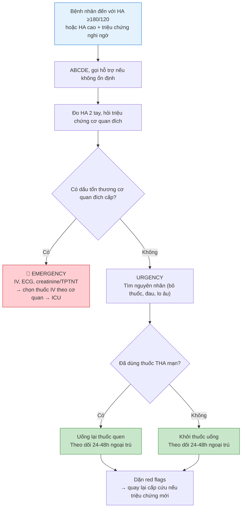
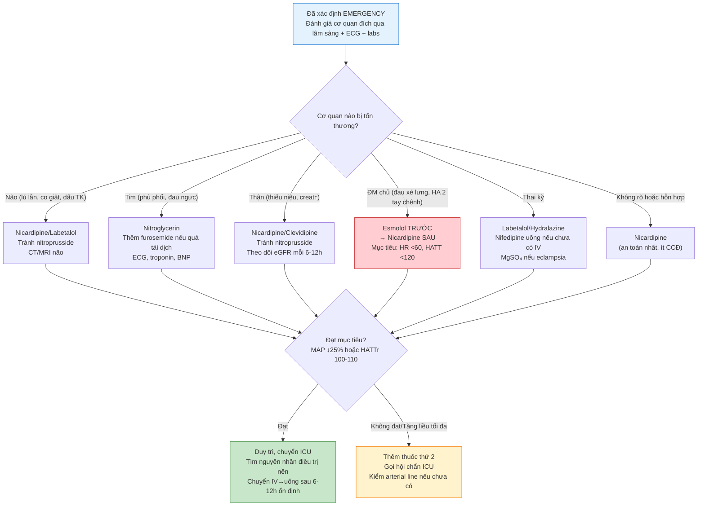

[PMID: 34673475. ABSTRACT VERIFIED] [PMID: 39210715. GUIDELINE VERIFIED] [PMID: 40815242. GUIDELINE VERIFIED] [PMID: 41206434. DIRECTION ONLY] [PMID: 41714952. ABSTRACT VERIFIED] [PMID: 42028502. ABSTRACT VERIFIED] [PMID: 42460730. ABSTRACT VERIFIED]

# BÀI HỌC Y KHOA: IM-15 — TĂNG HUYẾT ÁP CẤP CỨU VÀ TỔN THƯƠNG CƠ QUAN ĐÍCH
**Ngày:** 2026-07-19 | **Chuyên khoa:** Nội khoa người lớn | **Đối tượng:** Bác sĩ và học viên cần một đường tiếp cận an toàn trong 0–60 phút đầu

---

## 0. TỔNG QUAN — VÌ SAO BÀI NÀY QUAN TRỌNG?

Một người đến với huyết áp 210/130 mmHg. Bạn làm gì? Sai lầm phổ biến nhất là nhìn con số và hoảng sợ — nhưng chính **tổn thương cơ quan đích cấp**, không phải con số, mới quyết định đây là cấp cứu hay không.

Bài này dạy bạn phân biệt **tăng huyết áp cấp cứu (hypertensive emergency)** — có tổn thương cơ quan đích cấp đang tiến triển, phải hạ áp bằng đường tĩnh mạch trong phút–giờ — với **tăng huyết áp khẩn trương (hypertensive urgency)** — không có tổn thương cơ quan đích cấp, hạ áp từ từ bằng đường uống trong 24–48 giờ. Bài tập trung vào 0–60 phút đầu: nhận diện, phân biệt, chọn thuốc và an toàn.

**Mục tiêu của bài:**
- Phân biệt hypertensive emergency và urgency bằng dấu hiệu tổn thương cơ quan đích cấp, không phải bằng con số huyết áp
- Thực hiện ABCDE và đánh giá cơ quan đích trong 15 phút đầu
- Chọn thuốc hạ áp đường tĩnh mạch theo cơ quan bị tổn thương
- Đặt mục tiêu hạ áp an toàn (tốc độ, ngưỡng dừng) và theo dõi
- Biết khi nào chuyển ICU/tuyến trên

> **TIÊU CHUẨN BẮT BUỘC — DẠY TỪ GỐC, KHÔNG GIỚI HẠN ĐỘ DÀI:** Viết để một người học mất gốc vẫn theo được. Trước khi dùng một thuật ngữ, chữ viết tắt, chỉ số, cơ quan, cơ chế, thủ thuật hoặc quyết định điều trị lần đầu, phải giải thích bằng tiếng Việt đơn giản: **nó là gì → bình thường hoạt động ra sao → vì sao bất thường này quan trọng → nhận ra bằng cách nào → làm gì tiếp theo**. Sau lần giải thích đầu tiên, mới dùng viết tắt/thuật ngữ ngắn. Không dùng "rõ ràng", "thường quy", "theo protocol" hoặc danh sách bước trần nếu chưa giải thích lý do và ý nghĩa của hành động. Độ dài không có giới hạn tối đa: tiếp tục viết khi còn một mắt xích cần thiết để người học hiểu hoặc ra quyết định an toàn; ưu tiên chia nhỏ bằng tiêu đề, ví dụ và checkpoint thay vì cắt bỏ.

> **CÁCH GIẢI THÍCH BẮT BUỘC CHO MỖI QUY TRÌNH:** Mỗi xét nghiệm, thang điểm, thuốc, thủ thuật hoặc algorithm phải ghi theo thứ tự: **mục tiêu → khi nào dùng/không dùng → cần chuẩn bị/đầu vào gì → làm hoặc đọc kết quả như thế nào → kết quả thay đổi quyết định ra sao → bẫy/an toàn → khi nào chuyển tuyến**. Chi tiết liều, đường dùng, trình tự và thời điểm phải có nguồn xác minh; không lấp chỗ trống bằng suy đoán.

### 📋 TRƯỚC KHI ĐỌC — NỀN TẢNG CẦN DÙNG

> Để hiểu bài này, người học nên đã biết:
> - **Huyết áp** là gì — HATT (huyết áp tâm thu) là áp lực khi tim bóp, HATTr (huyết áp tâm trương) là áp lực khi tim thư giãn. Đơn vị mmHg. Nếu chưa rõ, xem ngay mục 0.1 bên dưới.
> - **Cơ quan đích** là các cơ quan bị huyết áp cao làm tổn thương: não, tim, thận, võng mạc, động mạch chủ.
> - **ABCDE** là trình tự đánh giá cấp cứu: Airway (đường thở) → Breathing (thở) → Circulation (tuần hoàn) → Disability (thần kinh) → Exposure (toàn thân).
> - **Tĩnh mạch (IV)** là đường đưa thuốc trực tiếp vào mạch máu; thuốc có tác dụng nhanh hơn nhiều so với đường uống.
>
> **Không được chặn việc học vì thiếu prerequisite.** Các bài IM-01 đến IM-06 chưa tồn tại; mục 0.1 dưới đây dạy đủ nền tảng để học bài này.

### 0.1 Nền tảng tối thiểu cần dùng ngay

**ABCDE áp dụng cho bệnh nhân tăng huyết áp cấp cứu:**

Khi bạn đối diện một bệnh nhân có huyết áp rất cao, ABCDE là việc đầu tiên — không phải đo lại huyết áp, không phải gọi hội chẩn, không phải mở guideline:

- **A (Airway — Đường thở):** Bệnh nhân có tự bảo vệ được đường thở không? Nếu lơ mơ, co giật, không nuốt được → đặt tư thế an toàn, gọi hỗ trợ đặt nội khí quản nếu cần.
- **B (Breathing — Hô hấp):** Có thở nhanh, khó thở, ran ẩm ở phổi (dấu hiệu phù phổi cấp)? Đo SpO₂, cho oxy nếu <94%.
- **C (Circulation — Tuần hoàn):** Đo huyết áp **cả hai tay** (chênh lệch >20 mmHg → nghi ngờ bóc tách động mạch chủ). Bắt mạch 4 chi. Đặt đường truyền tĩnh mạch (IV).
- **D (Disability — Thần kinh):** Đánh giá tri giác (GCS), đồng tử, dấu thần kinh khu trú (yếu liệt, méo miệng, nói khó). Đo glucose mao mạch (hạ đường huyết có thể giả dạng tổn thương thần kinh).
- **E (Exposure — Toàn thân):** Quan sát toàn thân tìm dấu hiệu: phù, xuất huyết dưới da, vết chích (ma túy), bụng báng, thai to. Đo nhiệt độ.

Làm lại ABCDE sau mỗi can thiệp lớn.

**Huyết áp và áp lực tưới máu:**

**HATT** (huyết áp tâm thu) là áp lực cao nhất trong động mạch khi tim bóp đẩy máu đi. **HATTr** (huyết áp tâm trương) là áp lực thấp nhất khi tim thư giãn giữa hai lần bóp. Đơn vị là **mmHg** (milimét thủy ngân).

**MAP** (Mean Arterial Pressure — huyết áp động mạch trung bình) là áp lực trung bình trong một chu kỳ tim, tính bằng công thức: **MAP = (HATT + 2 × HATTr) / 3**. MAP phản ánh áp lực tưới máu đến các cơ quan. Ví dụ: HA 180/120 mmHg → MAP = (180 + 240)/3 = 140 mmHg.

**Cơ chế tự điều hòa (autoregulation):** Não, thận và tim có khả năng giữ lưu lượng máu ổn định mặc dù huyết áp dao động, nhờ các tiểu động mạch co giãn. Khoảng autoregulation của não bình thường: MAP ~60–150 mmHg. Ở người tăng huyết áp mạn, đường cong này **dịch sang phải** — não đã "quen" với áp lực cao hơn, nên hạ áp quá nhanh về mức "bình thường" có thể gây thiếu máu não. Đây là lý do cốt lõi vì sao **không được hạ huyết áp quá nhanh** trong cấp cứu tăng huyết áp. [TEXTBOOK: Guyton and Hall Textbook of Medical Physiology, 15e.]

**Cơ quan đích là gì:** Là các cơ quan chịu tổn thương trực tiếp khi áp lực máu vượt quá khả năng tự bảo vệ của mạch máu:

- **Não:** Áp lực cao → phá vỡ hàng rào máu não → phù não, xuất huyết, bệnh não do tăng huyết áp, PRES (hội chứng não sau có hồi phục).
- **Tim:** Tăng hậu tải (sức cản khi tim bơm máu) → suy thất trái cấp, phù phổi cấp, thiếu máu cơ tim.
- **Thận:** Tổn thương tiểu động mạch thận → hoại tử fibrinoid, protein niệu, tiểu máu, suy thận cấp.
- **Động mạch chủ:** Áp lực thành mạch tăng → rách lớp nội mạc → bóc tách động mạch chủ (aortic dissection).
- **Võng mạc:** Xuất huyết, xuất tiết bông, phù gai thị → mờ mắt, mù nếu không xử trí.

[TEXTBOOK: Braunwald's Heart Disease, 12e.]

**Thuốc hạ áp đường tĩnh mạch:** Khi tổn thương cơ quan đang tiến triển, bạn cần hạ huyết áp **trong vài phút đến vài giờ**, không thể chờ thuốc uống (mất 30–60 phút mới hấp thu). Thuốc IV (intravenous — tĩnh mạch) được tiêm trực tiếp vào máu, có tác dụng gần như ngay lập tức. Có hai cách dùng IV: **IV bolus** (tiêm nhanh một liều) và **IV truyền liên tục** (dịch thuốc chảy vào tĩnh mạch qua bơm tiêm điện hoặc máy truyền dịch). IV truyền liên tục cho phép chỉnh liều từng phút và là lựa chọn ưu tiên trong hầu hết trường hợp cấp cứu.

---

## 1. PHÂN BIỆT CẤP CỨU VÀ KHẨN TRƯƠNG [CỐT LÕI]

### 1.1 Định nghĩa — không phải con số, mà là cơ quan đích

Trước đây người ta dùng thuật ngữ "cơn tăng huyết áp" (hypertensive crisis) cho mọi trường hợp huyết áp ≥180/120 mmHg. Cách phân loại này **nguy hiểm** vì nó đánh đồng hai tình huống xử trí hoàn toàn khác nhau.

Cách phân loại hiện đại (ESC 2024, AHA/ACC 2025) dựa trên **sự có mặt của tổn thương cơ quan đích cấp**:

| Phân loại | Định nghĩa | Xử trí |
|---|---|---|
| **Hypertensive emergency** (tăng huyết áp cấp cứu) | Huyết áp rất cao (thường ≥180/120 mmHg) **+** bằng chứng tổn thương cơ quan đích **cấp đang tiến triển** | Hạ áp bằng thuốc **IV** trong phút–giờ; nhập ICU |
| **Hypertensive urgency** (tăng huyết áp khẩn trương) | Huyết áp rất cao (thường ≥180/120 mmHg) **nhưng không** có tổn thương cơ quan đích cấp | Hạ áp **từ từ bằng thuốc uống** trong 24–48 giờ; không cần nhập viện |

[ESC 2024 — 2024 ESC Guidelines for the management of elevated blood pressure and hypertension. GUIDELINE VERIFIED]
[AHA/ACC 2025 — Guideline for the Prevention, Detection, Evaluation, and Management of High Blood Pressure in Adults. GUIDELINE VERIFIED]

### 1.2 Tại sao phân biệt này quan trọng — câu chuyện hai bệnh nhân

Cùng một con số huyết áp — nhưng hai số phận khác nhau:

- **Bệnh nhân A:** 62 tuổi, HA 210/130 mmHg, **đau ngực, khó thở, ran ẩm hai đáy phổi**. Đây là **emergency**: phù phổi cấp do tăng huyết áp. Cần nitroglycerin IV ngay; nếu cho thuốc uống và hẹn tái khám, bệnh nhân có thể tử vong trong vài giờ.

- **Bệnh nhân B:** 55 tuổi, HA 200/120 mmHg, **không triệu chứng**, đến khám vì thấy số cao khi đo tại nhà. Đây là **urgency**: không có tổn thương cơ quan đích cấp. Nếu truyền thuốc IV hạ áp nhanh, bạn có thể gây thiếu máu não hoặc nhồi máu cơ tim. Điều trị đúng: uống lại thuốc cũ (nếu bỏ liều) hoặc khởi đầu thuốc uống, theo dõi 24–48 giờ.

> ⚠️ HỌC VIÊN HAY NHẦM: Nhầm con số huyết áp với mức độ khẩn cấp — chính **tổn thương cơ quan đích** mới quyết định emergency hay urgency, không phải con số. Một người quen sống với HA 180/110 mmHg trong nhiều năm có thể không có tổn thương cấp. Ngược lại, một phụ nữ mang thai với HA 160/100 mmHg có thể đang trong cơn sản giật đe dọa tính mạng.

### 1.3 Bẫy chẩn đoán

1. **Không phải cứ ≥180/120 là emergency.** Người tăng huyết áp mạn lâu năm có thể "quen" với số này. Hỏi họ: "Chị có đau đầu không? Có mờ mắt không? Có đau ngực không? Có khó thở không?" Nếu tất cả đều không → khả năng cao là urgency.

2. **Có thể có emergency ở số thấp hơn.** Phụ nữ mang thai, trẻ em, hoặc tăng huyết áp cấp sau phẫu thuật có thể có tổn thương cơ quan đích ở ngưỡng HA thấp hơn nhiều. Preeclampsia có thể có emergency ở HA 160/100 mmHg. Luôn hỏi: "Có triệu chứng không?", không chỉ nhìn số.

3. **Đau và lo âu làm tăng HA.** Bệnh nhân đau nhiều hoặc hoảng sợ có HA 180/110 nhưng không có tổn thương cơ quan đích. Điều trị đau/lo âu trước, đo lại sau 30 phút. Nếu HA trở về <160/100 → không phải cấp cứu.

4. **Đo HA sai kỹ thuật.** Băng quấn quá nhỏ, tay không ngang tim, nói chuyện khi đo, vừa đi bộ vào phòng khám → tất cả đều làm tăng số đo giả. Đo lại đúng kỹ thuật trước khi quyết định.

### 🛑 DỪNG 1 PHÚT — TỰ KIỂM TRA

> 1. Phân biệt hypertensive emergency và urgency dựa trên yếu tố nào? 2. Một người HA 210/130 mmHg, tỉnh táo, không triệu chứng — đây là emergency hay urgency?
>
> *(Đáp án: dựa trên sự có mặt của tổn thương cơ quan đích cấp đang tiến triển — emergency có, urgency không; đây là urgency vì không có triệu chứng/tổn thương cơ quan đích cấp.)*

---

## 2. CƠ CHẾ SINH LÝ / SINH BỆNH HỌC [CỐT LÕI]

> **Nguồn kiến thức nền:** [TEXTBOOK: Guyton and Hall Textbook of Medical Physiology, 15e.] [TEXTBOOK: Braunwald's Heart Disease, 12e.] [REVIEW: PMID 41714952]

### 2.1 Tự điều hòa (autoregulation) bình thường

Các cơ quan quan trọng (não, thận, tim) có khả năng **tự điều hòa lưu lượng máu**: khi huyết áp dao động, các tiểu động mạch trong cơ quan sẽ co lại (khi HA tăng) hoặc giãn ra (khi HA giảm) để giữ lưu lượng máu ổn định.

Ở người bình thường, khoảng autoregulation của não là **MAP 60–150 mmHg**. Trong khoảng này, lưu lượng máu não gần như không đổi. Ở người **tăng huyết áp mạn**, khoảng autoregulation **dịch sang phải** (ví dụ MAP 80–180 mmHg). Điều này có nghĩa là:

- Họ chịu được HA cao hơn mà không bị tổn thương não do tăng áp lực.
- Nhưng họ cũng **không chịu được HA thấp**: nếu bạn hạ MAP xuống dưới 80 mmHg (mức mà người bình thường vẫn ổn), não của họ có thể bị thiếu máu.

Đây là cơ sở sinh lý cho nguyên tắc: **không hạ HA quá nhanh về mức "bình thường".**

### 2.2 Khi huyết áp vượt ngưỡng autoregulation

Khi MAP vượt quá giới hạn trên của autoregulation, áp lực thủy tĩnh trong lòng mạch thắng sức cản của thành mạch. Hậu quả là một chuỗi sự kiện:

**Bước 1 — Tổn thương nội mô:** Áp lực cơ học làm tổn thương lớp tế bào nội mô (lớp lót trong cùng của mạch máu). Hàng rào nội mô bị phá vỡ.

**Bước 2 — Thoát huyết tương và protein:** Huyết tương (phần lỏng của máu) và protein thoát qua thành mạch bị tổn thương vào mô xung quanh → **phù** (sưng do dịch).

**Bước 3 — Hoại tử fibrinoid:** Ở các tiểu động mạch nhỏ (đặc biệt ở thận), protein huyết tương (fibrin) lắng đọng trong thành mạch kèm theo tế bào chết → thành mạch dày lên, lòng mạch hẹp lại → **thiếu máu cục bộ.**

**Bước 4 — Xuất huyết:** Thành mạch quá yếu có thể vỡ → xuất huyết trong mô (não, võng mạc).

### 2.3 Cơ chế theo từng cơ quan

**Não — Bệnh não do tăng huyết áp và PRES:**

Khi huyết áp vượt ngưỡng autoregulation não, hàng rào máu não bị phá vỡ → dịch thoát vào mô não → **phù não vận mạch** (vasogenic edema). Điều này xảy ra chủ yếu ở vùng sau của não (thùy chẩm, thùy đỉnh sau) vì hệ giao cảm phân bố ít hơn ở đây, khiến mạch máu vùng sau ít được bảo vệ khỏi áp lực cao. Kết quả là **PRES** (Posterior Reversible Encephalopathy Syndrome — Hội chứng não sau có hồi phục), biểu hiện: đau đầu, rối loạn thị giác, lú lẫn, co giật. PRES có thể hồi phục hoàn toàn nếu hạ áp kịp thời, nhưng 40–44% bệnh nhân có di chứng thần kinh kéo dài và tỷ lệ tử vong 10–19%. [PMID: 41714952 — Mourid et al. 2026. ABSTRACT VERIFIED]

**Tim — Suy thất trái cấp và phù phổi:**

Huyết áp tăng đột ngột → **hậu tải** (afterload — sức cản mà tim phải thắng để bơm máu) tăng vọt. Thất trái không kịp thích nghi → máu ứ lại trong tâm thất và nhĩ trái → áp lực trong mao mạch phổi tăng → dịch thoát vào phế nang → **phù phổi cấp.** Đồng thời, nhu cầu oxy của cơ tim tăng (do phải bơm chống lại sức cản cao) trong khi thời gian tưới máu vành trong kỳ tâm trương giảm (do nhịp tim nhanh, thời gian tâm trương ngắn lại) → **thiếu máu cơ tim.**

**Thận — Suy thận cấp:**

Các tiểu động mạch thận bị tổn thương do áp lực cao → hoại tử fibrinoid → lòng mạch hẹp → giảm tưới máu cầu thận. Đồng thời, áp lực trong cầu thận tăng gây tổn thương màng lọc → **protein niệu, tiểu máu.** Nếu không kiểm soát, bệnh nhân có thể tiến triển thành suy thận cấp cần lọc máu. AKI xảy ra ở 20–30% bệnh nhân tăng huyết áp cấp cứu có suy tim kèm theo. [PMID: 42028502 — Elbadri et al. 2026. ABSTRACT VERIFIED]

**Động mạch chủ — Bóc tách:**

Áp lực trong lòng động mạch chủ tăng → **shear stress** (lực xé) lên thành mạch tăng → lớp nội mạc bị rách → máu chảy vào giữa các lớp của thành động mạch → **bóc tách lan rộng.** Huyết áp càng cao và nhịp tim càng nhanh, shear stress càng lớn, bóc tách càng lan xa. Đây là lý do β-blocker (làm chậm nhịp tim, giảm lực co bóp) được dùng **trước** thuốc giãn mạch trong bóc tách động mạch chủ: giảm shear stress trước, rồi mới hạ áp. [PMID: 41206434 — Sharma et al. 2026. DIRECTION ONLY]

**Võng mạc — Bệnh võng mạc do tăng huyết áp cấp:**

Soi đáy mắt thấy: xuất huyết hình ngọn lửa (vỡ mạch máu nhỏ), xuất tiết bông (thiếu máu cục bộ sợi thần kinh), phù gai thị (dấu hiệu tăng áp lực nội sọ). Đây là cửa sổ duy nhất nhìn trực tiếp được mạch máu nhỏ trong cơ thể.

---

## 3. CHẨN ĐOÁN VÀ ĐÁNH GIÁ BAN ĐẦU [CỐT LÕI]

> 🚨 **BOX ĐỎ — AN TOÀN:** Bất kỳ dấu hiệu nào sau đây → **dừng đánh giá ngoại trú, gọi cấp cứu, ABCDE và chuẩn bị đường truyền IV:**
> - Dấu thần kinh khu trú mới (yếu liệt, méo miệng, nói khó, mù đột ngột)
> - Đau ngực kiểu thiếu máu cơ tim hoặc khó thở/phù phổi
> - Đau lưng dữ dội kiểu xé (nghĩ bóc tách động mạch chủ)
> - Thay đổi tri giác (lú lẫn, lơ mơ, co giật)
> - Giảm thị lực cấp, nhìn mờ, hoặc mất thị trường đột ngột
> - Thiểu niệu hoặc vô niệu
> - Đau đầu dữ dội kiểu sét đánh (nghĩ xuất huyết dưới nhện)
> - Nôn vọt, nhịp tim chậm, tăng huyết áp (tam chứng Cushing — dấu hiệu tăng áp lực nội sọ)
> - Thai kỳ + HA cao + đau đầu/rối loạn thị giác/đau thượng vị

### 3.1 Lâm sàng 15 phút đầu

Đây là những việc phải làm **trong 15 phút đầu tiên** sau khi bệnh nhân đến. Không trì hoãn:

**Hỏi nhanh (5 phút):**
- Triệu chứng thần kinh: đau đầu, chóng mặt, yếu liệt, tê bì, nhìn mờ, co giật?
- Đau ngực/đau lưng/đau bụng? Kiểu đau: xé (dissection), đè ép (thiếu máu cơ tim), nóng rát?
- Khó thở? Có phải nằm không thở được, phải ngồi dậy? (orthopnea — dấu hiệu suy tim)
- Tiểu ít, nước tiểu sẫm màu?
- Thai kỳ? Tuần thứ mấy? Đau đầu, đau thượng vị, nhìn mờ? (preeclampsia)
- Tiền sử: tăng huyết áp mạn (đang dùng thuốc gì? bỏ thuốc không?), bệnh thận, đái tháo đường, thuốc/ma túy (cocaine, amphetamine)?

**Khám nhanh (10 phút):**
1. **HA hai tay** — đo lần lượt hoặc đồng thời nếu có 2 máy. Chênh lệch >20 mmHg HATT giữa hai tay → nghi ngờ bóc tách động mạch chủ, hẹp eo động mạch chủ hoặc bệnh mạch máu lớn.
2. **Mạch 4 chi** — mất/mạch yếu một bên → nghi ngờ bóc tách.
3. **Tim:** nghe tiếng tim (T3 gallop → suy tim), tiếng thổi (hở van động mạch chủ cấp trong bóc tách type A).
4. **Phổi:** ran ẩm, ran rít → phù phổi.
5. **Bụng:** khối đập theo nhịp tim, đau, bụng ngoại khoa.
6. **Thần kinh:** GCS, đồng tử, dấu thần kinh khu trú, dấu màng não.
7. **Đáy mắt:** xuất huyết, xuất tiết bông, phù gai thị.
8. **Phù** hai chi dưới, cổ trướng.

### 3.2 Cận lâm sàng cấp

**Lấy mẫu ngay, không chờ kết quả mới điều trị:**

| Xét nghiệm | Tìm cái gì? | Mất bao lâu? |
|---|---|---|
| ECG 12 chuyển đạo | Thiếu máu cơ tim cấp (ST chênh), dày thất trái, dấu hiệu bóc tách (tràn dịch màng tim, block nhánh mới) | 5 phút |
| Creatinine, eGFR, ure | Suy thận cấp/mạn làm thay đổi chọn thuốc (tránh nitroprusside nếu eGFR <30) | 30–60 phút |
| Điện giải đồ (Na⁺, K⁺) | Hạ kali (do cường aldosterone thứ phát), hạ natri | 30–60 phút |
| Troponin, BNP/NT-proBNP | Thiếu máu cơ tim, suy tim (BNP tăng) | 60 phút |
| TPTNT (tổng phân tích nước tiểu) | Protein niệu, tiểu máu, trụ hồng cầu → tổn thương thận cấp | 30 phút |
| CT/MRI não **không cản quang** | Xuất huyết não, PRES (MRI nhạy hơn CT cho PRES), phù não | 30–60 phút |
| X-quang ngực | Phù phổi, tràn dịch màng phổi, trung thất rộng (dấu hiệu gián tiếp của bóc tách) | 15 phút |

**Nguyên tắc quan trọng: KHÔNG trì hoãn điều trị để chờ kết quả.** Nếu bệnh nhân có dấu hiệu cấp cứu rõ ràng (phù phổi, đau ngực, lú lẫn), bắt đầu hạ áp IV ngay sau khi lấy mẫu xét nghiệm, không cần chờ kết quả.

### 3.3 Chẩn đoán phân biệt các hội chứng tổn thương cơ quan đích

| Cơ quan | Hội chứng | Dấu hiệu gợi ý | Xét nghiệm chính | Cấp cứu? |
|---|---|---|---|---|
| **Não** | Hypertensive encephalopathy / PRES | Đau đầu, rối loạn thị giác, lú lẫn, co giật | MRI não (phù vận mạch vùng sau) | ✅ CÓ |
| **Não** | Đột quỵ xuất huyết não | Dấu TK khu trú, đau đầu dữ dội, nôn vọt | CT não không cản quang | ✅ CÓ |
| **Tim** | Suy tim trái cấp / phù phổi | Khó thở, orthopnea, ran ẩm 2 đáy, SpO₂ giảm | X-quang ngực, BNP, siêu âm tim | ✅ CÓ |
| **Tim** | Hội chứng vành cấp | Đau ngực, ST chênh/mới, troponin tăng | ECG, troponin | ✅ CÓ |
| **Thận** | AKI (tổn thương thận cấp) | Thiểu niệu, creatinine tăng nhanh | Creatinine, TPTNT, siêu âm thận | ✅ CÓ |
| **ĐM chủ** | Bóc tách động mạch chủ | Đau lưng/ngực xé, HA 2 tay chênh, mất mạch 1 bên | CT mạch máu hoặc siêu âm tim qua thực quản | ✅ CÓ |
| **Thai kỳ** | Preeclampsia nặng / eclampsia | HA ≥160/110 + protein niệu + đau đầu/rối loạn thị giác/đau thượng vị/co giật | Protein niệu, AST, tiểu cầu, creatinine | ✅ CÓ |
| **Catecholamine** | Pheochromocytoma / MAOI crisis / cocaine | HA kịch phát, nhịp nhanh, đau đầu, vã mồ hôi, đánh trống ngực | Metanephrine niệu/huyết tương (không cấp) | ✅ CÓ |

> ⚠️ HỌC VIÊN HAY NHẦM: Nhầm hypertensive encephalopathy với đột quỵ — cả hai đều có HA cao và dấu thần kinh. Điểm khác: PRES thường có rối loạn thị giác và lú lẫn (không chỉ yếu liệt khu trú), MRI thấy phù vận mạch đối xứng vùng sau; không dùng thuốc tiêu huyết khối.

---

## 4. EVIDENCE & GUIDELINES [CỐT LÕI]

### 4.1 Nguồn vận hành tại Việt Nam

**VSH/VNHA 2024** là nguồn vận hành tại Việt Nam cho quản lý tăng huyết áp. Đồng thuận này bao gồm phân loại tăng huyết áp, đánh giá cơ quan đích, và đường xử trí cấp cứu. Bài này kế thừa toàn bộ phần guideline đã verified từ IM-20. [VSH/VNHA 2024 — Đồng Thuận Quản Lý Tăng Huyết Áp tại Việt Nam. GUIDELINE VERIFIED]

### 4.2 Nguồn quốc tế

**ESC 2024** (European Society of Cardiology, 2024): "2024 ESC Guidelines for the management of elevated blood pressure and hypertension." *Eur Heart J.* PMID: **39210715**. DOI: 10.1093/eurheartj/ehae178. 1415 citations tính đến 2026. Đây là guideline quốc tế chính cho bài này; phần hypertensive emergencies nằm trong guideline này. [ESC 2024 — Hypertension. GUIDELINE VERIFIED]

**AHA/ACC 2025** (American Heart Association/American College of Cardiology, 2025): "2025 AHA/ACC Guideline for the Prevention, Detection, Evaluation, and Management of High Blood Pressure in Adults." *J Am Coll Cardiol.* PMID: **40815242**. DOI: 10.1016/j.jacc.2025.05.007. Là nguồn so sánh, không thay thế ESC 2024 cho bài này. [AHA/ACC 2025 — Hypertension. GUIDELINE VERIFIED]

### 4.3 Bằng chứng nghiên cứu

**Elbadri et al.** — Tổng hợp 6 nghiên cứu (2020–2025) về xử trí cơn tăng huyết áp cấp. Các phát hiện chính:
- Truyền IV liên tục đạt tốc độ hạ áp nhanh nhất; IV bolus giảm thời gian nằm ICU.
- Tỷ lệ tử vong chung ở bệnh nhân ICU: 8%; cao hơn nếu có hội chứng vành cấp.
- AKI xảy ra ở 20–30% bệnh nhân tăng huyết áp cấp cứu kèm suy tim.
- Các yếu tố tiên lượng tốt hơn: phối hợp nhiều thuốc, đánh giá tổn thương cơ quan đích chính thức, và không có tổn thương cơ quan đích.
- Khuyến cáo **không** hạ áp sớm tích cực trong đột quỵ thiếu máu não cấp: không có bằng chứng lợi ích về tử vong, có thể gây hại. [PMID: 42028502. ABSTRACT VERIFIED]

**Posen et al.** — Nghiên cứu hồi cứu 402 bệnh nhân tại khoa Cấp cứu Mỹ:
- Tuân thủ guideline **<1%**: chỉ 30% được dùng IV trong giờ đầu; 64% đạt mục tiêu BP giờ thứ nhất; 44% đạt mục tiêu giờ thứ 6; 9% đạt BP duy trì 24 giờ.
- Hạ huyết áp xảy ra ở 67/402 bệnh nhân; tổn thương cơ quan đích liên quan đến thuốc ở 21/402 bệnh nhân.
- Yếu tố dự báo hạ huyết áp: điều trị trong giờ đầu tiên và dùng thuốc truyền liên tục.
- Kết luận: thực hành hiện tại kém tuân thủ guideline; có rủi ro từ điều trị khuyến cáo; kết quả ủng hộ nới lỏng các khuyến cáo dựa trên ý kiến chuyên gia. [PMID: 34673475. ABSTRACT VERIFIED]

**Ullah et al.** — Nhiều nghiên cứu so sánh lâm sàng. Kết quả:
- Không khác biệt có ý nghĩa giữa clevidipine và nicardipine về: thời gian đạt BP mục tiêu, thời gian nằm ICU/nằm viện, hạ huyết áp, nhịp nhanh, AKI, điều trị cứu hộ, hoặc tử vong nội viện.
- Phân tích dưới nhóm: clevidipine đạt BP mục tiêu nhanh hơn ở nhóm đột quỵ/chăm sóc thần kinh và nhóm tăng huyết áp cấp cứu nói chung.
- Clevidipine dùng thể tích dịch truyền thấp hơn đáng kể. [PMID: 42460730. ABSTRACT VERIFIED]

**Mourid et al.** — Tổng quan toàn diện về PRES:
- Co giật xảy ra ở 60–90% trường hợp, đặc biệt ở người trẻ.
- MRI là phương thức chẩn đoán chính: phù vận mạch vùng sau, mặc dù các kiểu không điển hình cũng thường gặp.
- Tỷ lệ tử vong 10–19%; 40–44% có di chứng thần kinh hoặc tổn thương hình ảnh tồn tại.
- Điều trị chủ yếu là hỗ trợ: kiểm soát huyết áp, ngưng/chỉnh thuốc gây bệnh, chống co giật ngắn hạn.
- Sinh lý bệnh: rối loạn chức năng nội mô, phá vỡ hàng rào máu não, và tổn thương qua trung gian miễn dịch. [PMID: 41714952. ABSTRACT VERIFIED]

**Sharma et al.** — Phân tích gộp về chọn thuốc hạ áp trong bóc tách động mạch chủ ngực:
- Tăng huyết áp làm tăng đáng kể nguy cơ bóc tách.
- β-blocker giảm biến cố tim mạch chính — hiệu quả nhất trong các nhóm thuốc.
- ARB/ACEi và CCB cũng cho thấy lợi ích nhưng kém hơn β-blocker.
- So sánh mạng lưới: β-blocker vượt trội nhất trong giảm biến cố. [PMID: 41206434. DIRECTION ONLY]

---

## 5. ĐIỀU TRỊ CẤP CỨU [CỐT LÕI]

### 5.1 Nguyên tắc chung

Điều trị tăng huyết áp cấp cứu là một **bài toán cân bằng**: hạ áp đủ để ngăn tổn thương cơ quan tiến triển, nhưng không hạ quá nhanh đến mức gây thiếu máu cơ quan (do mất autoregulation).

**Nguyên tắc vàng:**
1. **Emergency:** hạ MAP **25% trong giờ đầu**, hoặc HATTr xuống **100–110 mmHg** trong 2–6 giờ.
2. **Urgency:** hạ áp **từ từ bằng thuốc uống** trong 24–48 giờ.
3. **Không bao giờ hạ nhanh về mức "bình thường" (120/80)** trong giai đoạn cấp.
4. **Dùng đường tĩnh mạch (IV)** cho mọi emergency.
5. **Theo dõi HA mỗi 5–15 phút** trong giờ đầu; lý tưởng là arterial line (đo huyết áp xâm lấn qua catheter động mạch).
6. **Ngoại lệ duy nhất cho hạ áp nhanh:** bóc tách động mạch chủ type A/B — hạ HATT xuống **<120 mmHg** hoặc MAP **<80 mmHg** trong **20 phút**, với điều kiện β-blocker (esmolol/labetalol) được dùng TRƯỚC thuốc giãn mạch.
7. Bệnh nhân đột quỵ thiếu máu não cấp: **không hạ HA tích cực trừ khi:** HA ≥220/120 mmHg, hoặc có chỉ định tiêu huyết khối (cần HA <185/110 trước tiêu huyết khối). Hạ quá nhanh có thể mở rộng vùng nhồi máu. [ESC 2024. GUIDELINE VERIFIED]

> ⚠️ HỌC VIÊN HAY NHẦM: Dùng nifedipine ngậm dưới lưỡi (SL nifedipine) để hạ HA nhanh. Điều này đã **bị cấm** vì gây hạ áp không kiểm soát được, có thể dẫn đến thiếu máu não, nhồi máu cơ tim, và tử vong. SL nifedipine = **không bao giờ**.

### 5.2 Bảng chọn thuốc IV theo cơ quan tổn thương

| Cơ quan bị tổn thương | Thuốc lựa chọn đầu tay | Liều khởi đầu | Cơ chế | Thận trọng |
|---|---|---|---|---|
| **Não** (encephalopathy, PRES) | **Nicardipine** IV hoặc **Labetalol** IV | Nicardipine: 5 mg/giờ truyền, tăng 2,5 mg mỗi 5–15 phút, tối đa 15 mg/giờ. Labetalol: 10–20 mg IV bolus trong 2 phút, sau đó truyền 0,5–2 mg/phút | Nicardipine: CCB (chẹn kênh canxi), giãn mạch. Labetalol: β-blocker + α-blocker | **Tránh nitroprusside** (tăng ICP — áp lực nội sọ). Theo dõi tri giác mỗi 15 phút |
| **Tim** (phù phổi cấp, suy tim) | **Nitroglycerin** IV hoặc **Nitroprusside** IV | Nitroglycerin: 5–100 mcg/phút truyền. Nitroprusside: 0,25–10 mcg/kg/phút (bọc kín tránh ánh sáng) | Nitroglycerin: giãn TM > ĐM, giảm tiền tải. Nitroprusside: giãn TM + ĐM | Nitroprusside: **nguy cơ ngộ độc cyanide** nếu dùng >24–48h, suy thận (eGFR <30), hoặc liều >2 mcg/kg/phút. Theo dõi cyanide/thiocyanate nếu dùng dài |
| **Thận** (AKI) | **Nicardipine** IV hoặc **Clevidipine** IV | Nicardipine: 5 mg/giờ. Clevidipine: 1–2 mg/giờ, tăng gấp đôi mỗi 90 giây, tối đa 21 mg/giờ | Cả hai: CCB, giãn mạch | **Tránh nitroprusside** hoàn toàn (tích lũy thiocyanate). Theo dõi creatinine mỗi 6–12 giờ |
| **ĐM chủ** (bóc tách) | **Esmolol** IV **TRƯỚC**, sau đó **Nicardipine** hoặc **Nitroprusside** | Esmolol: 500 mcg/kg bolus trong 1 phút → truyền 50–300 mcg/kg/phút. Nicardipine: 5 mg/giờ | Esmolol: β-blocker chọn lọc tim, giảm nhịp tim + shear stress. Nicardipine: giãn mạch | **TUYỆT ĐỐI không giãn mạch trước β-blocker** — tăng shear stress → lan rộng bóc tách. Mục tiêu: nhịp tim <60/phút + HATT <120 mmHg trong 20 phút |
| **Thai kỳ** (preeclampsia) | **Labetalol** IV, **Hydralazine** IV, hoặc **Nifedipine uống*** | Labetalol: 10–20 mg IV bolus, lặp mỗi 10 phút nếu cần. Hydralazine: 5–10 mg IV mỗi 20 phút. Nifedipine: 10 mg PO mỗi 30 phút | Labetalol: β + α-blocker. Hydralazine: giãn mạch trực tiếp. Nifedipine: CCB | **Tránh ACEi/ARB** (gây thiểu ối, suy thận thai). **MgSO₄**: 4–6 g IV trong 20 phút, sau đó 1–2 g/giờ duy trì để dự phòng/điều trị eclampsia |
| **Catecholamine excess** (pheochromocytoma, MAOI crisis, cocaine) | **Phentolamine** IV | 5–15 mg IV bolus | α-blocker không chọn lọc | Chỉ dùng trong hoàn cảnh đặc biệt có tăng catecholamine. Sau khi ổn định → chuyển chuyên khoa nội tiết/độc chất |

> *Nifedipine uống trong preeclampsia chỉ dùng khi không có IV hoặc trong khi chờ IV. Đây là ngoại lệ có kiểm soát, khác với SL nifedipine bị cấm trong các tình huống khác.

**Giải thích cho người mới:** Mỗi thuốc trên tác động lên một "công tắc" khác nhau của hệ tim mạch. **Nicardipine và clevidipine** (chẹn kênh canxi) làm giãn cơ trơn trong thành động mạch — giống như mở rộng đường ống, áp lực giảm. **Labetalol** vừa chẹn β (làm chậm nhịp tim, giảm lực co bóp) vừa chẹn α (giãn mạch) — như vừa giảm tốc độ bơm vừa mở rộng đường ống. **Nitroglycerin** chủ yếu giãn tĩnh mạch (giảm máu về tim) — như giảm lượng nước vào máy bơm. **Esmolol** chỉ chẹn β ở tim — làm chậm nhịp và giảm lực co bóp, giảm sức xé lên thành động mạch. [ESC 2024. GUIDELINE VERIFIED] [PMID: 42460730. ABSTRACT VERIFIED] [PMID: 41206434. DIRECTION ONLY]

### 5.3 Thuốc uống cho hypertensive urgency

Hypertensive urgency **không cần IV**. Xử trí:

1. **Nếu bệnh nhân đã có thuốc THA mạn nhưng bỏ liều:** cho uống lại thuốc quen, theo dõi 1–2 giờ, hẹn tái khám 24–48 giờ.
2. **Nếu chưa từng dùng thuốc:** khởi đầu thuốc uống (captopril 12,5–25 mg, amlodipine 5 mg). Mục tiêu: hạ HA từ từ trong 24–48 giờ. KHÔNG cần đưa về mục tiêu trong ngày đầu.
3. **Tìm nguyên nhân gây tăng HA cấp:** bỏ thuốc? đau cấp? lo âu? ăn mặn? dùng NSAID, corticoid, thuốc tránh thai, rượu?
4. **Theo dõi ngoại trú** trong 24–48 giờ. Dặn bệnh nhân: nếu xuất hiện triệu chứng mới (đau đầu dữ dội, đau ngực, khó thở, yếu liệt, mờ mắt) → quay lại cấp cứu ngay.

> 🚨 **KHÔNG dùng nifedipine ngậm dưới lưỡi (SL nifedipine).** Đã bị các guideline quốc tế loại bỏ từ lâu vì hạ áp quá nhanh, không kiểm soát được → thiếu máu não, nhồi máu cơ tim, tử vong. [ESC 2024. GUIDELINE VERIFIED]

### 5.4 Theo dõi trong cấp cứu

**Trong giờ đầu (giai đoạn hạ áp tích cực):**
- HA mỗi **5–15 phút** (arterial line lý tưởng nếu có; nếu không, băng quấn tự động lặp lại)
- Tri giác (GCS hoặc AVPU) mỗi 15 phút
- Nhịp tim + SpO₂ liên tục
- ECG monitor liên tục (phát hiện loạn nhịp, thiếu máu cơ tim)
- Nước tiểu mỗi giờ (đặt sonde tiểu nếu cần)

**Sau khi ổn định (MAP đã giảm 25% hoặc HATTr 100–110):**
- HA mỗi **15–30 phút** → mỗi 1 giờ khi ổn định >4 giờ
- Creatinine, điện giải mỗi 6–12 giờ
- Chuyển từ IV sang uống khi: HA ổn định ≥6–12 giờ, tổn thương cơ quan đích đã dừng tiến triển, bệnh nhân dung nạp uống. Chồng thuốc: bắt đầu uống, giảm dần IV trong 6–12 giờ.

**Chỉ định ICU/HSTC:**
- Cần truyền IV liên tục (tất cả emergency)
- Cần arterial line
- Tổn thương cơ quan đích nặng: suy hô hấp cần NIV/intubation, AKI cần lọc máu, rối loạn tri giác, đột quỵ cấp, bóc tách động mạch chủ
- Preeclampsia nặng/eclampsia
- Hạ huyết áp hoặc nhịp chậm có triệu chứng do điều trị

[ESC 2024. GUIDELINE VERIFIED] [PMID: 42028502. ABSTRACT VERIFIED]

---

## 6. LƯU ĐỒ QUYẾT ĐỊNH LÂM SÀNG [CỐT LÕI]

### Flowchart 1: Phân luồng ban đầu

1. ABCDE và đo HA hai tay là hai việc đầu tiên, trước cả khi gắn nhãn chẩn đoán.
2. Dấu tổn thương cơ quan đích cấp là điểm phân nhánh quyết định. Mỗi dấu hiệu dưới đây đủ để gọi emergency: dấu thần kinh mới, đau ngực, khó thở/phù phổi, đau lưng xé, thay đổi tri giác, giảm thị lực cấp, co giật, thiểu niệu.
3. Nhánh urgency an toàn khi hỏi kỹ và khám toàn diện không thấy tổn thương cấp. Khi không chắc chắn → xử như emergency.

### Flowchart 2: Chọn thuốc IV theo cơ quan tổn thương

1. Hỏi cơ quan nào trước khi chọn thuốc. Mỗi cơ quan có một thuốc IV tối ưu khác nhau.
2. **Ngoại lệ chính:** bóc tách động mạch chủ — phải có β-blocker TRƯỚC giãn mạch để giảm shear stress.
3. Khi không rõ cơ quan nào (bệnh nhân có HA rất cao + triệu chứng mơ hồ), nicardipine là lựa chọn an toàn nhất vì ít chống chỉ định, dễ chỉnh liều.
4. Luôn có mục tiêu cụ thể: MAP giảm 25% hoặc HATTr 100–110 mmHg. Đây là "phanh" để không hạ quá tay.

---

## 7. SAI LẦM THƯỜNG GẶP — LÂM SÀNG [CỐT LÕI]

| # | Sai lầm | Hậu quả | Cách tránh |
|---|---|---|---|
| **1** | Hạ HA quá nhanh về "bình thường" (120/80) | Thiếu máu não, mù vỏ não, nhồi máu cơ tim, suy thận | Giảm MAP 25% giờ đầu, HATTr 100–110. Không dùng SL nifedipine. Theo dõi HA mỗi 5–15 phút |
| **2** | Điều trị hypertensive urgency bằng IV | Hạ áp quá nhanh không cần thiết → tổn thương do điều trị | Urgency → uống, emergency → IV. Phân biệt dựa vào cơ quan đích, không phải con số |
| **3** | Dùng giãn mạch trước β-blocker trong bóc tách động mạch chủ | Tăng shear stress → bóc tách lan rộng → tử vong | Esmolol/labetalol TRƯỚC. Khi nhịp tim <60/phút → mới thêm nicardipine/nitroprusside |
| **4** | Dùng nitroprusside kéo dài (>24–48 giờ) hoặc ở bệnh nhân suy thận | Ngộ độc cyanide/thiocyanate → toan chuyển hóa, rối loạn tri giác, tử vong | Tránh >24 giờ; tránh hoàn toàn nếu eGFR <30. Ưu tiên nicardipine |
| **5** | Không đo HA 2 tay | Bỏ sót bóc tách động mạch chủ | Luôn đo 2 tay ở lần khám đầu. Chênh >20 mmHg HATT → nghi dissection |
| **6** | Cho bệnh nhân emergency về nhà với thuốc uống | Tử vong hoặc tổn thương cơ quan vĩnh viễn trong vài giờ | Emergency = nhập viện ICU. Không có ngoại lệ |

[ESC 2024. GUIDELINE VERIFIED] [PMID: 34673475. ABSTRACT VERIFIED]

---

## 8. BẢNG THUỐC VÀ LIỀU DÙNG [THAM KHẢO]

| Thuốc | Liều khởi đầu | Liều duy trì | Onset | Duration | Cơ chế | Chỉ định chính | Chống chỉ định / Thận trọng |
|---|---|---|---|---|---|---|---|
| **Nicardipine** | 5 mg/giờ IV truyền | 2,5–15 mg/giờ (tăng 2,5 mg mỗi 5–15 phút) | 5–15 phút | 30–60 phút | CCB (chẹn kênh canxi dihydropyridine), giãn ĐM | Phần lớn emergency (não, thận, không rõ cơ quan) | Suy gan nặng, hẹp ĐM chủ nặng. Có thể gây nhịp nhanh phản xạ |
| **Clevidipine** | 1–2 mg/giờ IV truyền | 1–21 mg/giờ (tăng gấp đôi mỗi 90 giây) | 2–4 phút | 5–15 phút | CCB siêu ngắn, giãn ĐM | Giống nicardipine; ưu thế ở BN cần hạn chế dịch hoặc chỉnh nhanh | Dị ứng đậu nành/trứng (nhũ tương lipid). Giống nicardipine về CCĐ |
| **Labetalol** | 10–20 mg IV bolus trong 2 phút | 0,5–2 mg/phút IV truyền; hoặc bolus lặp 20–80 mg mỗi 10 phút | 2–5 phút (bolus) | 2–6 giờ | β-blocker không chọn lọc + α-blocker | Não (encephalopathy/PRES, stroke), preeclampsia | Hen/COPD nặng, block tim >độ 1, suy tim mất bù. CCĐ tương đối, có thể dùng trong cấp cứu nếu lợi ích > nguy cơ |
| **Esmolol** | 500 mcg/kg IV bolus trong 1 phút | 50–300 mcg/kg/phút truyền; lặp bolus trước mỗi lần tăng liều | 1–2 phút | 10–20 phút | β-blocker chọn lọc tim (β₁) | Bóc tách ĐM chủ (dùng TRƯỚC giãn mạch) | Giống labetalol. Thời gian bán hủy rất ngắn (9 phút) → an toàn nếu tác dụng phụ |
| **Nitroglycerin** | 5–10 mcg/phút IV truyền | 5–100 mcg/phút (tăng 5–10 mcg mỗi 3–5 phút) | 1–2 phút | 3–5 phút | Giãn TM > ĐM, giảm tiền tải | Phù phổi cấp do THA, hội chứng vành cấp | Hạ HA nặng, nhồi máu thất phải, tăng áp lực nội sọ. Dung nạp thuốc sau 24–48 giờ |
| **Nitroprusside** | 0,25 mcg/kg/phút IV truyền | 0,25–10 mcg/kg/phút (tăng mỗi 3–5 phút) | <1 phút | 1–2 phút | Giãn TM + ĐM (giải phóng NO) | Phù phổi cấp kháng nitroglycerin, bóc tách ĐM chủ (sau esmolol) | **Ngộ độc cyanide** nếu >2 mcg/kg/phút, >24–48h, hoặc eGFR <30. Bọc kín tránh ánh sáng. Theo dõi cyanide/thiocyanate nếu dùng >24h |
| **Hydralazine** | 5–10 mg IV bolus chậm | Lặp 5–10 mg mỗi 20–30 phút, tối đa 20 mg/liều | 10–20 phút | 3–8 giờ | Giãn ĐM trực tiếp (cơ chế chưa rõ hoàn toàn) | Preeclampsia (lựa chọn thay thế cho labetalol) | Lupus do thuốc khi dùng kéo dài. Nhịp nhanh phản xạ, giữ natri. Không phải lựa chọn đầu tay ngoài thai kỳ |
| **Phentolamine** | 5–15 mg IV bolus | Lặp nếu cần | 2–5 phút | 10–30 phút | α-blocker không chọn lọc | Cơn pheochromocytoma, MAOI crisis, cocaine | Hạ HA nặng, nhịp nhanh, loạn nhịp. Chỉ dùng khi xác định hoặc nghi ngờ cao catecholamine excess |

**Giải thích cho người mới:** Mỗi thuốc trên tác động vào một vị trí khác nhau trên hệ thống điều hòa huyết áp. Khi chọn thuốc, bạn đang trả lời câu hỏi: "Tôi muốn giãn động mạch (CCB, hydralazine), giãn tĩnh mạch (nitroglycerin), làm chậm nhịp tim (β-blocker), hay kết hợp?" Chọn sai cơ chế có thể làm bệnh nặng thêm (ví dụ: giãn mạch đơn thuần trong bóc tách làm tăng shear stress). [ESC 2024. GUIDELINE VERIFIED] [PMID: 42460730. ABSTRACT VERIFIED]

---

## 9. ÁP DỤNG TẠI VIỆT NAM [CỐT LÕI]

### 9.1 Dịch tễ

Tăng huyết áp là bệnh không lây phổ biến nhất tại Việt Nam, với tỷ lệ hiện mắc khoảng **25% người trưởng thành** (tương đương khoảng 17–20 triệu người). Trong số các ca tăng huyết áp, hypertensive emergency chiếm khoảng **1–2%** — nhưng đây là những ca có nguy cơ tử vong và tàn phế cao nhất. Chưa có số liệu quốc gia riêng cho hypertensive emergency tại Việt Nam; các số liệu trên dựa vào ước lượng từ y văn quốc tế. [VSH/VNHA 2024. GUIDELINE VERIFIED]

### 9.2 Thuốc sẵn có — Plan A và Plan B

**Plan A (bệnh viện tuyến tỉnh có ICU):**
- Nicardipine IV (phổ biến nhất, sẵn có ở hầu hết bệnh viện tỉnh)
- Nitroglycerin IV (có ở hầu hết bệnh viện)
- Labetalol IV (có thể không có ở một số cơ sở; thay bằng nicardipine hoặc uống nifedipine cho preeclampsia)
- Furosemide IV (luôn sẵn có)
- MgSO₄ 15% (cho sản khoa — luôn có ở bệnh viện có khoa Sản)

**Plan B (bệnh viện tuyến huyện hoặc thiếu thuốc IV):**
- **Nếu không có nicardipine IV:** labetalol uống 200 mg, hoặc captopril 25 mg ngậm dưới lưỡi (chỉ khi thực sự không có IV và bệnh nhân có nguy cơ tử vong). Chú ý: SL captopril cũng có nguy cơ hạ áp nhưng ít hơn SL nifedipine. **Phải chuyển viện cấp cứu ngay** sau khi cho liều đầu.
- **Nếu không có bất kỳ thuốc IV nào:** KHÔNG có nghĩa là dùng thuốc uống cho emergency thật sự. Điều này đồng nghĩa với **chuyển tuyến khẩn cấp**. Liên hệ bệnh viện tuyến trên qua điện thoại, bàn giao SBAR (Situation–Background–Assessment–Recommendation), và vận chuyển với monitor + IV sẵn sàng.

### 9.3 Guideline và chuyển tuyến

**VSH/VNHA 2024** là nguồn vận hành chính thức cho quản lý tăng huyết áp tại Việt Nam. Chưa có guideline riêng của Bộ Y tế cho hypertensive emergency; các guideline quốc tế (ESC 2024, AHA/ACC 2025) được áp dụng tham chiếu.

**Bàn giao SBAR khi chuyển tuyến:**
- **S**ituation: "Bệnh nhân [tuổi, giới], hypertensive emergency, tổn thương cơ quan [não/tim/thận/ĐM chủ], HA hiện tại [số], MAP [số]."
- **B**ackground: "Tiền sử THA [có/không], thuốc đang dùng, bệnh nền, thai kỳ [tuần thứ mấy]."
- **A**ssessment: "Đã dùng thuốc [tên, liều, thời gian], đáp ứng [HA giảm còn.../không đáp ứng], creatinine [số], ECG [kết quả chính]."
- **R**ecommendation: "Cần [ICU/tiếp tục hạ áp/phẫu thuật bóc tách/chuyển Sản]."

**Không được thay thế:** Thiếu monitor/ICU không có nghĩa là dùng thuốc uống cho emergency thật sự; thiếu arterial line không có nghĩa là không cần đo HA thường xuyên (dùng băng quấn tự động lặp lại mỗi 5 phút). Thiếu nicardipine có thể tạm dùng labetalol/nitroglycerin, nhưng thiếu tất cả thuốc IV → chuyển tuyến, không thử nghiệm thuốc uống.

---

## 10. CASE LÂM SÀNG [NÂNG CAO]

### Case 1: Phù phổi cấp do tăng huyết áp

**Bệnh nhân:** Nam 62 tuổi, HA 210/130 mmHg, khó thở nhiều phải ngồi dậy thở, ran ẩm hai đáy phổi, SpO₂ 88% với khí trời. Tiền sử: THA 10 năm, bỏ thuốc 2 tuần nay.

**Trả lời theo 5 bước:**
1. **(Nhận diện cấp cứu):** Đây là EMERGENCY — phù phổi cấp do tăng huyết áp (tổn thương tim cấp). ABCDE ngay: oxy mask 10–15 L/phút, đo SpO₂, đặt IV.
2. **(Dữ kiện quyết định):** Khó thở + ran ẩm hai đáy + SpO₂ 88% + HA rất cao = suy thất trái cấp do tăng hậu tải. Tiền sử bỏ thuốc giải thích cơn cấp.
3. **(Hành động ngay):** Nitroglycerin IV 10 mcg/phút, tăng dần mỗi 3–5 phút đến khi HA giảm hoặc hết khó thở. Furosemide 40–80 mg IV bolus. ECG, troponin, BNP, X-quang ngực.
4. **(Theo dõi):** HA mỗi 5 phút, SpO₂ liên tục, nước tiểu. Chuyển ICU. Sau khi ổn định → khởi lại thuốc THA uống, dặn không tự ý bỏ thuốc.
5. **(Lựa chọn sai):** SL nifedipine → hạ áp không kiểm soát → thiếu máu cơ tim/não. Thuốc uống đơn thuần → quá chậm, bệnh nhân có thể ngừng thở.

### Case 2: Bóc tách động mạch chủ

**Bệnh nhân:** Nam 45 tuổi, HA tay phải 210/110 mmHg, tay trái 160/90 mmHg, đau lưng dữ dội kiểu xé từ sau ra trước ngực. Mạch đùi trái yếu hơn phải. Tiền sử: THA không điều trị.

**Trả lời theo 5 bước:**
1. **(Nhận diện cấp cứu):** EMERGENCY — bóc tách động mạch chủ nghi ngờ type B (dựa vào đau lưng + chênh HA 2 tay + mất mạch 1 bên). Đây là tình huống có thể tử vong trong vài giờ.
2. **(Dữ kiện quyết định):** Chênh HA 2 tay 50 mmHg, mất mạch đùi trái, đau kiểu xé = xác suất dissection rất cao.
3. **(Hành động ngay):** **Esmolol IV TRƯỚC** (500 mcg/kg bolus, sau đó 100–300 mcg/kg/phút, mục tiêu HR <60/phút). **Sau đó** nicardipine IV để hạ HATT xuống <120 mmHg. **Không được** nicardipine trước esmolol. CT mạch máu khẩn. Gọi phẫu thuật viên tim mạch.
4. **(Theo dõi):** ICU, arterial line, HA mỗi 5 phút, HR liên tục, nước tiểu. Chuyển trung tâm phẫu thuật tim mạch nếu cần can thiệp.
5. **(Lựa chọn sai):** Nicardipine/nitroprusside đơn thuần (không có β-blocker) → tăng shear stress → lan rộng bóc tách → tử vong. Đo HA một tay → bỏ sót chênh lệch.

### Case 3: Hypertensive encephalopathy / PRES

**Bệnh nhân:** Nữ 55 tuổi, HA 190/120 mmHg, lú lẫn, nhìn mờ ("nhìn thấy đốm sáng"), co giật toàn thân 5 phút trước khi đến viện. Tiền sử: THA 5 năm, bệnh thận mạn giai đoạn 3. MRI não: phù vận mạch vùng chẩm hai bên.

**Trả lời theo 5 bước:**
1. **(Nhận diện cấp cứu):** EMERGENCY — PRES/hypertensive encephalopathy (rối loạn thị giác + co giật + MRI điển hình).
2. **(Dữ kiện quyết định):** Co giật + rối loạn thị giác + MRI phù vận mạch vùng sau = PRES. Bệnh thận mạn → tránh nitroprusside.
3. **(Hành động ngay):** Nicardipine IV 5 mg/giờ (hoặc labetalol IV 10–20 mg bolus). Mục tiêu: MAP giảm 25% trong giờ đầu. Chống co giật: benzodiazepine (midazolam 2–5 mg IV hoặc lorazepam 2 mg IV) nếu đang co giật hoặc nguy cơ tái phát. **Tránh nitroprusside** (tăng ICP).
4. **(Theo dõi):** ICU, HA mỗi 5–10 phút, tri giác mỗi 15 phút, MRI kiểm tra sau 24–48 giờ. Creatinine mỗi 6 giờ (đã có CKD).
5. **(Lựa chọn sai):** Hạ HA quá nhanh về <140/90 → thiếu máu não thêm. Chẩn đoán nhầm thành đột quỵ và cho thuốc tiêu huyết khối → không có tắc mạch, có thể gây xuất huyết.

### Case 4: Preeclampsia nặng

**Bệnh nhân:** Nữ 35 tuổi, thai 32 tuần, HA 185/115 mmHg, đau đầu nhiều, protein niệu +++ (3 g/L), tăng phản xạ, đau thượng vị. Thai tim 150 lần/phút.

**Trả lời theo 5 bước:**
1. **(Nhận diện cấp cứu):** EMERGENCY — preeclampsia nặng có dấu hiệu sắp eclampsia (đau đầu, tăng phản xạ, đau thượng vị).
2. **(Dữ kiện quyết định):** HA ≥160/110 + protein niệu + triệu chứng thần kinh = preeclampsia nặng. Nguy cơ co giật (eclampsia) rất cao.
3. **(Hành động ngay):** Labetalol IV 10–20 mg bolus, lặp mỗi 10 phút đến khi HA <160/105. Hydralazine 5–10 mg IV nếu không có labetalol. **MgSO₄ 4–6 g IV trong 20 phút, sau đó 1–2 g/giờ** để dự phòng co giật. Hội chẩn Sản khoa cấp cứu. Theo dõi phản xạ, nhịp thở, nước tiểu mỗi giờ (MgSO₄ gây ức chế hô hấp nếu quá liều).
4. **(Theo dõi):** Chuyển khoa Sản/ICU. HA mỗi 5–10 phút. Theo dõi dấu hiệu ngộ độc MgSO₄: mất phản xạ gân xương → ngưng MgSO₄, calcium gluconate 1 g IV.
5. **(Lựa chọn sai):** Dùng ACEi/ARB → thiểu ối, suy thận thai. Không cho MgSO₄ → co giật sản giật → tử vong mẹ và thai.

---

## 11. TIPS THỰC HÀNH (CLINICAL PEARLS) [THAM KHẢO]

1. **Đo HA hai tay luôn luôn** — bỏ qua bước này là bỏ sót dissection.
2. **Hỏi "có triệu chứng gì không?" trước khi nhìn số HA** — chính triệu chứng, không phải con số, quyết định emergency.
3. **MAP là chỉ số theo dõi chính** — (HATT + 2×HATTr)/3. Mục tiêu giảm 25% trong giờ đầu.
4. **Arterial line nếu có thể** — đo HA liên tục, chính xác hơn băng quấn, đặc biệt khi dùng IV truyền.
5. **β-blocker trước giãn mạch trong bóc tách** — đây là nguyên tắc không thương lượng.
6. **SL nifedipine = cấm tuyệt đối** — ghi nhớ điều này như ghi nhớ "không adrenaline IV bolus".
7. **Nitroprusside = timer 24 giờ** — sau đó nguy cơ cyanide tăng vọt.
8. **Không chờ xét nghiệm để điều trị** — lấy mẫu, bắt đầu IV, xem kết quả sau.
9. **Emergency là bệnh của ICU** — không điều trị ngoại trú, không cho về với thuốc uống.
10. **Hội chẩn sớm, chuyển tuyến sớm** — nếu không có thuốc IV hoặc ICU, chuyển ngay, đừng thử nghiệm thuốc uống.

---

## 12. TỔNG KẾT — 10 ĐIỂM CẦN NHỚ [CỐT LÕI]

1. Hypertensive emergency = HA cao **+** tổn thương cơ quan đích cấp đang tiến triển. Urgency = HA cao **không** tổn thương cơ quan đích. Phân biệt dựa vào triệu chứng, không phải con số.
2. ABCDE trước tất cả — đảm bảo đường thở, thở, tuần hoàn, thần kinh trước khi quyết định điều trị HA.
3. Autoregulation não dịch phải ở người THA mạn → hạ HA quá nhanh gây thiếu máu não.
4. Mục tiêu hạ áp: MAP giảm **25% trong giờ đầu**, hoặc HATTr **100–110 mmHg** trong 2–6 giờ. Ngoại lệ: bóc tách ĐM chủ cần HATT <120 mmHg trong 20 phút.
5. **Nicardipine IV** là thuốc an toàn nhất, linh hoạt nhất cho phần lớn emergency không rõ cơ quan đích.
6. **Esmolol/labetalol TRƯỚC, giãn mạch SAU** trong bóc tách động mạch chủ.
7. **Nitroglycerin IV** là lựa chọn đầu tay cho phù phổi cấp do tăng huyết áp.
8. **Labetalol + MgSO₄** cho preeclampsia/eclampsia; tránh ACEi/ARB.
9. **SL nifedipine bị cấm** — hạ áp không kiểm soát → thiếu máu cơ quan.
10. Emergency = ICU. Nếu không có ICU hoặc thuốc IV → **chuyển tuyến khẩn cấp**, không thử nghiệm thuốc uống.

### 🛑 TỰ KIỂM TRA CUỐI BÀI

> 1. Bệnh nhân 60 tuổi, HA 210/130, đau lưng xé, HA tay phải 210, tay trái 160. Bạn cho thuốc gì trước? 2. Bệnh nhân 55 tuổi, HA 200/120, hoàn toàn không triệu chứng — đây là emergency hay urgency? Xử trí thế nào? 3. Vì sao không được hạ HA nhanh về 120/80 ở bệnh nhân THA mạn có emergency?
>
> *(Đáp án: 1. Esmolol IV trước, sau đó nicardipine — nghi ngờ bóc tách ĐM chủ. 2. Urgency — không có tổn thương cơ quan đích cấp; uống lại thuốc cũ hoặc khởi thuốc uống, theo dõi 24–48 giờ ngoại trú. 3. Vì autoregulation não đã dịch phải ở người THA mạn — hạ về "bình thường" sẽ gây thiếu máu não.)*

---

## 13. TÀI LIỆU THAM KHẢO

1. **European Society of Cardiology (2024).** "2024 ESC Guidelines for the management of elevated blood pressure and hypertension." *Eur Heart J.* PMID: **39210715**. DOI: 10.1093/eurheartj/ehae178. [GUIDELINE VERIFIED]

2. **American Heart Association/American College of Cardiology (2025).** "2025 AHA/ACC Guideline for the Prevention, Detection, Evaluation, and Management of High Blood Pressure in Adults." *J Am Coll Cardiol.* PMID: **40815242**. DOI: 10.1016/j.jacc.2025.05.007. [GUIDELINE VERIFIED]

3. **Phân hội Tăng huyết áp VSH/VNHA (2024).** "Đồng Thuận Quan Điểm Của Một Số Chuyên Gia Của Phân Hội Tăng Huyết Áp VSH/VNHA 2024 Về Chiến Lược Thực Hành Lâm Sàng Quản Lý Tăng Huyết Áp tại Việt Nam." [GUIDELINE VERIFIED]

4. **Elbadri A, MohamedSalih E, Mohammedallayla ID, et al. (2026).** "Management Strategies for Hypertensive Crises: A Systematic Review of Evidence-Based Approaches." *Cureus.* 18(3):e105671. PMID: **42028502**. DOI: 10.7759/cureus.105671. PMC13100458. [ABSTRACT VERIFIED]

5. **Posen A, Benken S, Kaluzna SD, et al. (2022).** "Poor guideline adherence in a real-world evaluation of hypertensive emergency management." *Am J Emerg Med.* 51:46–52. PMID: **34673475**. DOI: 10.1016/j.ajem.2021.09.073. [ABSTRACT VERIFIED]

6. **Ullah T, Khan H, Khan A, et al. (2026).** "Comparative Efficacy and Safety of Clevidipine Versus Nicardipine in Hypertensive Emergencies: A Systematic Review and Meta-Analysis." *Clin Cardiol.* 49(7):e70419. PMID: **42460730**. DOI: 10.1002/clc.70419. [ABSTRACT VERIFIED]

7. **Mourid MR, Oweidat M, Abady E, et al. (2026).** "Posterior reversible encephalopathy syndrome (PRES): A narrative review of pathophysiology, clinical insights, and advances in management." *Int J Emerg Med.* 19(1):48. PMID: **41714952**. DOI: 10.1186/s12245-026-01138-9. PMC12922249. [ABSTRACT VERIFIED]

8. **Sharma S, Seth J, Rabkin SW (2026).** "Hypertension in Thoracic Aortic Dissection: A Meta-Analysis-Based Consideration in the Choice of Antihypertensive Agents." *Am J Hypertens.* 39(2):312–322. PMID: **41206434**. DOI: 10.1093/ajh/hpaf132. [DIRECTION ONLY]

9. **Braunwald's Heart Disease, 12e.** Hypertension and target-organ damage foundations. [TEXTBOOK]

10. **Guyton and Hall Textbook of Medical Physiology, 15e.** Blood-pressure regulation and autoregulation. [TEXTBOOK]

---

**— Hết bài học ngày 2026-07-19 —**

**Bác sĩ:** Ngọc Hưng | **AI:** DeepSeek