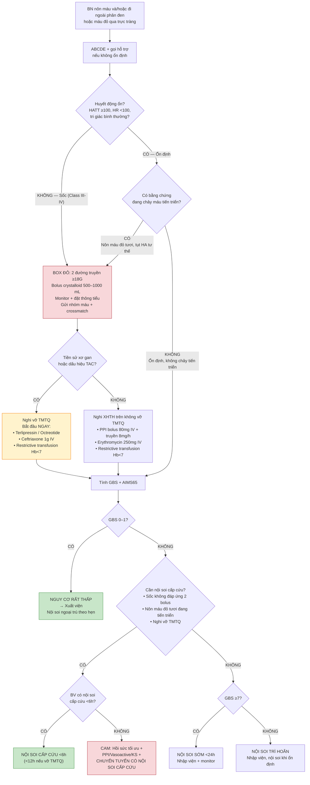
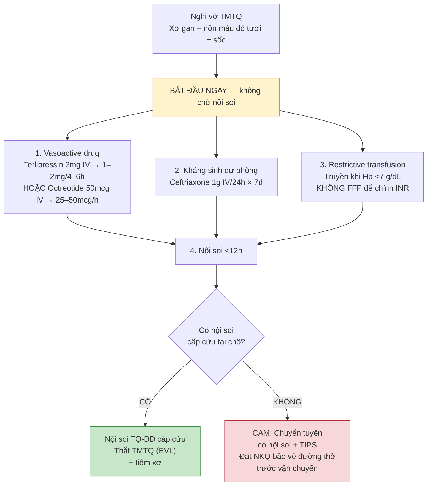

# BÀI HỌC Y KHOA: IM-16 — XUẤT HUYẾT TIÊU HÓA CẤP: HỒI SỨC 0–60 PHÚT
**Ngày:** 2026-07-19 | **Chuyên khoa:** Nội khoa người lớn | **Đối tượng:** Bác sĩ tuyến tỉnh và học viên mất gốc cần học từ nền tảng

---

## 0. TỔNG QUAN — VÌ SAO BÀI NÀY QUAN TRỌNG?

**Tình huống:** 2 giờ sáng. Bệnh nhân nam 55 tuổi được người nhà đưa vào cấp cứu vì nôn ra máu đỏ tươi khoảng 500 mL tại nhà. Da tái, vã mồ hôi lạnh, HA 85/50 mmHg, mạch 120 lần/phút. Bạn là bác sĩ trực duy nhất. Bạn làm gì trong 10 phút đầu?

Xuất huyết tiêu hóa (XHTH) cấp là một trong những cấp cứu nội khoa thường gặp nhất, với tỉ lệ tử vong ~5–10% ở XHTH trên không do vỡ tĩnh mạch thực quản (TMTQ) và ~15–20% ở vỡ TMTQ. Mỗi phút chậm trễ hồi sức đều làm tăng nguy cơ tử vong.

**Khái niệm bằng phép so sánh:** Ống tiêu hóa giống như một đường ống dài từ miệng đến hậu môn. Có hai loại chính: **XHTH trên** — chảy máu từ thực quản, dạ dày hoặc tá tràng (trên góc Treitz); và **XHTH dưới** — chảy máu từ ruột non hoặc đại tràng (dưới góc Treitz). Nhưng trong 60 phút đầu, **bạn không cần biết chính xác nguồn chảy** — bạn cần giữ bệnh nhân sống.

**IM-16 dạy "cấp cứu trước chẩn đoán":** ABCDE → hồi sức → phân tầng nguy cơ → quyết định nội soi. IM-36 (Block 4) sẽ dạy chẩn đoán phân biệt nguồn chảy và điều trị nguyên nhân sau hồi sức.

**Mục tiêu của bài:**
- Nhận diện sốc mất máu do XHTH và phân độ theo ATLS class I–IV.
- Thiết lập hồi sức: đường truyền, dịch, truyền máu theo chiến lược restrictive.
- Dùng thuốc ban đầu đúng: PPI, thuốc co mạch tạng, kháng sinh dự phòng, erythromycin.
- Tính điểm Glasgow-Blatchford (GBS) và AIMS65 để phân tầng nguy cơ.
- Quyết định nội soi cấp cứu (<6h), sớm (<24h), trì hoãn hay chuyển tuyến.

> **TIÊU CHUẨN BẮT BUỘC — DẠY TỪ GỐC, KHÔNG GIỚI HẠN ĐỘ DÀI:** Viết để một người học mất gốc vẫn theo được. Trước khi dùng một thuật ngữ, chữ viết tắt, chỉ số, cơ quan, cơ chế, thủ thuật hoặc quyết định điều trị lần đầu, phải giải thích bằng tiếng Việt đơn giản: **nó là gì → bình thường hoạt động ra sao → vì sao bất thường này quan trọng → nhận ra bằng cách nào → làm gì tiếp theo**. Sau lần giải thích đầu tiên, mới dùng viết tắt/thuật ngữ ngắn. Độ dài không có giới hạn tối đa: tiếp tục viết khi còn một mắt xích cần thiết để người học hiểu hoặc ra quyết định an toàn.

### 📋 TRƯỚC KHI ĐỌC — NỀN TẢNG CẦN DÙNG

> Để hiểu bài này, người học nên đã biết:
> - **ABCDE** là quy trình đánh giá và xử trí cấp cứu theo thứ tự ưu tiên: Airway (đường thở), Breathing (hô hấp), Circulation (tuần hoàn), Disability (thần kinh), Exposure (bộc lộ toàn thân). Làm lại ABCDE sau mỗi can thiệp.
> - **Góc Treitz** là chỗ nối giữa tá tràng và hỗng tràng, được giữ cố định bởi dây chằng Treitz — là mốc giải phẫu phân biệt XHTH trên và XHTH dưới.
> - **Huyết áp = cung lượng tim × sức cản mạch hệ thống.** Khi mất máu, cung lượng tim giảm → cơ thể bù trừ bằng tăng nhịp tim và co mạch ngoại vi để duy trì huyết áp.
> - IM-40 (Xơ gan và tăng áp cửa) là bài bổ trợ cho phần vỡ TMTQ trong bài này; nhưng các khái niệm cốt lõi được dạy tại chỗ.
>
> **Không được chặn việc học vì thiếu prerequisite.** Nếu bài tiên quyết chưa tồn tại hoặc người học chưa nắm, mục `### 0.1 Nền tảng tối thiểu cần dùng ngay` dưới đây dạy đủ khái niệm nền để hiểu bài hiện tại.

### 0.1 Nền tảng tối thiểu cần dùng ngay

**Giải phẫu mạch máu ống tiêu hóa:** Ống tiêu hóa được nuôi bởi ba nhánh chính của động mạch chủ bụng: (1) **Động mạch thân tạng** → động mạch vị trái, động mạch lách, động mạch gan chung → động mạch vị tá tràng — nuôi thực quản bụng, dạ dày, tá tràng và gan; (2) **Động mạch mạc treo tràng trên** — nuôi ruột non và nửa phải đại tràng; (3) **Động mạch mạc treo tràng dưới** — nuôi nửa trái đại tràng và trực tràng. Tĩnh mạch từ ống tiêu hóa đổ về tĩnh mạch cửa → gan → tĩnh mạch chủ dưới. Khi gan bị xơ, dòng máu qua gan bị cản trở → tăng áp lực tĩnh mạch cửa → hình thành tuần hoàn bàng hệ, trong đó nguy hiểm nhất là giãn TMTQ. [TEXTBOOK: Netter's Atlas of Human Anatomy, 8e; Gray's Anatomy, 42e.]

**Sinh lý sốc mất máu:** Thể tích máu bình thường ~70 mL/kg (khoảng 5 L ở người 70 kg). Khi mất máu cấp, cơ thể kích hoạt baroreflex (phản xạ áp lực): thụ thể áp lực ở xoang cảnh và quai động mạch chủ phát hiện tụt huyết áp → tăng hoạt giao cảm → tăng nhịp tim, tăng sức co bóp cơ tim, co mạch ngoại vi và co mạch tạng (trong đó có mạch mạc treo). Cơ chế này giúp duy trì huyết áp và ưu tiên tưới máu não, tim. Khi mất >30–40% thể tích máu, cơ chế bù trừ thất bại → tụt huyết áp không hồi phục → sốc mất bù → nguy cơ ngừng tim. [TEXTBOOK: Guyton and Hall Textbook of Medical Physiology, 15e, Ch.25.]

**Khái niệm "restrictive transfusion":** Truyền máu không phải lúc nào cũng tốt. Truyền máu làm tăng thể tích lòng mạch → tăng áp lực thủy tĩnh → có thể làm vỡ cục máu đông đã cầm máu tạm thời → tái xuất huyết. Ngoài ra, máu truyền gây rối loạn đông máu pha loãng và phản ứng miễn dịch. Vì vậy, các guideline hiện đại khuyến cáo chiến lược "restrictive": chỉ truyền khi Hb <7 g/dL (thay vì <9–10 g/dL như trước đây).

---

## 1. SINH LÝ BỆNH — MẤT MÁU CẤP VÀ ĐÁP ỨNG CỦA CƠ THỂ [CỐT LÕI]

### 1.0 Nhắc nhanh: Sinh lý tuần hoàn tiêu hóa và đáp ứng với mất máu

> **Nguồn kiến thức nền:** [TEXTBOOK: Guyton and Hall Textbook of Medical Physiology, 15e, Ch.25, Ch.63.] [TEXTBOOK: Netter's Atlas of Human Anatomy, 8e, Plates 278-300.]

Ống tiêu hóa nhận ~25% cung lượng tim khi nghỉ ngơi. Khi mất máu cấp, phản xạ giao cảm gây co mạch tạng mạnh → giảm tưới máu niêm mạc ruột → niêm mạc dễ tổn thương thêm. Đây là lý do XHTH có thể tự duy trì: mất máu → co mạch tạng → thiếu máu niêm mạc → tổn thương hàng rào niêm mạc → chảy máu tiếp.

### 1.1 Các giai đoạn sốc mất máu (ATLS class I–IV)

Phân loại ATLS (Advanced Trauma Life Support) chia sốc mất máu thành 4 class dựa trên % thể tích máu mất:

| Class | Mất máu (% thể tích) | Mất máu (mL ở 70 kg) | Nhịp tim | Huyết áp | CRT | Nước tiểu | Tri giác |
|---|---|---|---|---|---|---|---|
| **I** | <15% | <750 mL | Bình thường/↑ nhẹ | Bình thường | Bình thường | >30 mL/h | Bình thường |
| **II** | 15–30% | 750–1500 mL | 100–120/phút | Bình thường / tụt tư thế | Kéo dài (>2s) | 20–30 mL/h | Lo âu |
| **III** | 30–40% | 1500–2000 mL | 120–140/phút | Tụt (HATT <90) | Kéo dài rõ | <20 mL/h | Lú lẫn, vật vã |
| **IV** | >40% | >2000 mL | >140/phút | Tụt nặng | Không bắt được | Vô niệu | Hôn mê |

> **Nguồn:** Phân loại sốc mất máu từ ATLS Student Course Manual, 10th Edition. American College of Surgeons.

### 1.2 Đáp ứng bù trừ sinh lý và bẫy lâm sàng

Khi mất máu, baroreflex kích hoạt trong vài giây: ↓ huyết áp → ↓ kích thích thụ thể áp lực → ↑ giao cảm → ↑ nhịp tim, co mạch ngoại vi, co mạch tạng. Ở người trẻ khỏe, huyết áp có thể duy trì bình thường đến khi mất >30% thể tích máu — đây là **bẫy lâm sàng quan trọng nhất**: huyết áp "bình thường" không loại trừ đang mất máu nặng.

**Bẫy lâm sàng:**
- **Bệnh nhân già, dùng chẹn beta hoặc đái tháo đường:** có thể **không nhịp nhanh** dù đang sốc class III — do giảm đáp ứng giao cảm hoặc rối loạn thần kinh tự chủ.
- **Bệnh nhân xơ gan:** có giãn mạch tạng nền (do tăng nitric oxide nội sinh) → huyết áp nền đã thấp → tụt HA sớm hơn khi mất máu.
- **Phụ nữ mang thai:** tăng thể tích huyết tương sinh lý (~40%) → mất nhiều máu hơn mới có dấu hiệu sinh tồn thay đổi.

### 1.3 Cơ chế cầm máu tự nhiên và yếu tố phá vỡ

Khi mạch máu vỡ, cơ thể kích hoạt 3 cơ chế cầm máu: (1) co mạch tại chỗ; (2) kết tập tiểu cầu tạo nút tiểu cầu; (3) đông máu huyết tương tạo fibrin ổn định cục máu đông. **Lưu ý quan trọng:** pepsin trong dịch vị tiêu hủy fibrin ở pH thấp. Khi pH dịch vị >6, cục máu đông bền vững hơn. Đây chính là cơ sở sinh lý cho việc dùng PPI để nâng pH dịch vị trong XHTH trên. [TEXTBOOK: Guyton and Hall, 15e, Ch.37.]

> ⚠️ HỌC VIÊN HAY NHẦM: "Mất máu class I thì không nguy hiểm." Thực tế, một bệnh nhân mất máu class I nhưng đang chảy máu đỏ tươi (đang tiến triển) có thể chuyển thành class III–IV trong vài phút. Phân loại ATLS là ảnh chụp tại một thời điểm — luôn đánh giá lại sau mỗi can thiệp.

### 🛑 DỪNG 1 PHÚT — TỰ KIỂM TRA

> 1. Một bệnh nhân 70 tuổi đang dùng bisoprolol, HA 100/60, mạch 82, da tái, nôn máu đỏ tươi — class mấy? Vì sao?
> 2. Vì sao dịch vị pH thấp làm tăng nguy cơ tái xuất huyết?
>
> *(Đáp án: 1. Biểu hiện lâm sàng không theo quy tắc thông thường vì chẹn beta ngăn nhịp nhanh bù trừ. Da tái + nôn máu đỏ tươi → có thể đã mất >15% thể tích dù mạch không nhanh. Đánh giá thêm CRT, nước tiểu, lactate. Không dùng nhịp tim để loại trừ sốc. 2. Pepsin hoạt động tối ưu ở pH 1.5–2.5, tiêu hủy fibrin của cục máu đông → cục máu đông không bền → dễ vỡ và tái xuất huyết.)*

---

## 2. NHẬN DIỆN & ĐÁNH GIÁ BAN ĐẦU [CỐT LÕI]

### 2.1 ABCDE trong XHTH — 10 phút đầu

**A — Airway (Đường thở):**
Bảo vệ đường thở là ưu tiên số một ở BN nôn máu ồ ạt. Nguy cơ sặc máu vào phổi gây viêm phổi hít, suy hô hấp cấp. Hành động: (1) đặt BN nằm nghiêng trái; (2) hút miệng-hầu liên tục; (3) đặt nội khí quản (NKQ) sớm nếu Glasgow <8, nôn máu lượng lớn không kiểm soát, hoặc suy hô hấp kèm theo. Đặt NKQ sớm an toàn hơn đặt NKQ cấp cứu khi BN đã sặc.

**B — Breathing (Hô hấp):**
Thở oxy mask túi (15 L/phút) nếu sốc hoặc SpO2 <94%. Theo dõi SpO2 liên tục. Nhịp thở nhanh có thể là dấu hiệu sớm của sốc mất bù (toan chuyển hóa do giảm tưới máu mô). Ở BN xơ gan, chú ý hội chứng gan-phổi (hepatopulmonary syndrome) — SpO2 nền có thể thấp mạn tính.

**C — Circulation (Tuần hoàn):**
- Bắt **2 đường truyền ngoại vi lớn (≥18G, lý tưởng 16G)** — càng to càng tốt. Nếu không bắt được ngoại vi vì tĩnh mạch xẹp do sốc: xem xét đường truyền trong xương (intraosseous) hoặc tĩnh mạch cảnh ngoài/đùi.
- Bơm dịch tinh thể ấm (Ringer lactate hoặc NaCl 0.9%), bolus 500–1000 mL.
- Đo HA mỗi 5 phút, monitor tim liên tục.
- **Đặt thông tiểu** theo dõi nước tiểu mỗi giờ (mục tiêu >0.5 mL/kg/h).

**D — Disability (Thần kinh):**
Đánh giá tri giác bằng AVPU (Alert/Voice/Pain/Unresponsive) hoặc GCS. Hạ huyết áp não do sốc + thiếu máu não = hai cơ chế gây giảm tri giác trong XHTH. Đo glucose mao mạch — hạ đường huyết kèm theo ở BN xơ gan không hiếm.

**E — Exposure (Bộc lộ):**
- Kiểm tra phân đen/máu đỏ trong trực tràng (thăm trực tràng).
- Đo nhiệt độ — hạ thân nhiệt làm nặng rối loạn đông máu (giảm hoạt tính enzym đông máu).
- Tìm dấu hiệu bệnh gan mạn: vàng da, tuần hoàn bàng hệ, cổ trướng, gan lách to, sao mạch, lòng bàn tay son.

### 2.2 Hỏi nhanh 4 câu quyết định

| # | Câu hỏi | Ý nghĩa |
|---|---|---|
| 1 | **Máu đỏ tươi hay bã cà phê?** | Đỏ tươi = đang chảy, nguy cơ cao. Bã cà phê = máu đã tiếp xúc acid dịch vị → chảy có thể đã ngừng hoặc chậm. |
| 2 | **Đi ngoài phân đen hay máu đỏ?** | Phân đen (melena) = XHTH trên (máu qua ruột bị oxy hóa thành hematin đen). Máu đỏ qua trực tràng (hematochezia) = XHTH dưới hoặc XHTH trên lượng lớn (máu đi nhanh chưa kịp chuyển thành phân đen). |
| 3 | **Tiền sử: xơ gan? loét DD-TT? NSAID/aspirin/kháng đông? rượu?** | Xác định nguyên nhân nghi ngờ và yếu tố nguy cơ → quyết định dùng thuốc co mạch tạng + KS ngay nếu nghi vỡ TMTQ. |
| 4 | **Đợt này đã mất bao nhiêu máu?** | Ước lượng qua số lần nôn, số lần đi ngoài, tính chất máu + dấu hiệu sinh tồn → phân độ ATLS và quyết định truyền máu. |

### 2.3 Khám thực thể trọng điểm

- **Da niêm mạc:** tái, CRT kéo dài (>2 giây) → giảm tưới máu ngoại vi.
- **Dấu hiệu mất nước:** da khô, véo da chậm, niêm mạc miệng khô.
- **Bụng:** tuần hoàn bàng hệ (tĩnh mạch nổi hình đầu sứa quanh rốn → tăng áp cửa), gan lách to, cổ trướng (gõ đục vùng thấp), dấu hiệu báng tự do (dịch báng căng → tăng áp cửa lâu ngày).
- **Thăm trực tràng:** phân đen (đen như than, dính, mùi hôi đặc trưng) hoặc máu đỏ tươi. Đây là thăm khám bắt buộc — không bỏ qua.

> 🚨 **BOX ĐỎ — CẤP CỨU TỐI KHẨN:** Nôn máu đỏ tươi lượng lớn (>500 mL trong <1h) + tụt HA (HATT <90) + lú lẫn → **gọi hồi sức + nội soi ngay, không chờ xét nghiệm.** Đây là tình huống đe dọa tính mạng trong vài phút đến vài giờ. Đặt 2 đường truyền lớn, bơm dịch tinh thể, kích hoạt protocol truyền máu khối lượng lớn nếu cần, và liên hệ đội nội soi cấp cứu đồng thời.

### 🛑 DỪNG 1 PHÚT — TỰ KIỂM TRA

> 1. Vì sao BN nôn máu ồ ạt cần đặt nằm nghiêng trái và xem xét đặt NKQ sớm?
> 2. Phân đen khác máu đỏ qua trực tràng thế nào về ý nghĩa lâm sàng?
>
> *(Đáp án: 1. Nằm nghiêng trái giúp máu và dịch dạ dày chảy ra ngoài miệng thay vì tràn vào đường thở. Đặt NKQ sớm bảo vệ đường thở trước khi BN sặc — đặt NKQ cấp cứu sau khi đã sặc khó hơn nhiều. 2. Phân đen = XHTH trên (máu đã qua ruột, bị oxy hóa). Máu đỏ qua trực tràng = XHTH dưới hoặc XHTH trên lượng rất lớn đi nhanh chưa kịp chuyển thành phân đen.)*

---

## 3. XÉT NGHIỆM TRONG 60 PHÚT ĐẦU [CỐT LÕI]

### 3.1 Xét nghiệm BẮT BUỘC — không chờ kết quả mới hồi sức

**Công thức máu (CBC):**
- Hb, Hct, tiểu cầu.
- **BẪY QUAN TRỌNG:** Hb ban đầu có thể **bình thường** dù đang mất máu nặng. Khi mất máu toàn phần cấp, cả huyết tương lẫn hồng cầu mất cùng lúc → nồng độ Hb chưa thay đổi. Hb chỉ tụt sau khi dịch truyền vào pha loãng máu (hemodilution) hoặc sau 24–72 giờ khi cơ thể tự bù dịch từ khoảng kẽ. [TEXTBOOK: Harrison's Principles of Internal Medicine, 21e, Ch.47.]
- **Hành động:** Đừng trấn an BN vì "Hb bình thường". Theo dõi Hb mỗi 6–8 giờ trong 24 giờ đầu. Nếu Hb tụt ≥2 g/dL hoặc còn <7 g/dL → truyền máu (xem Section 4).

**Đông máu cơ bản:**
- PT/INR, aPTT, fibrinogen.
- INR tăng → nghĩ đến: (a) bệnh gan mạn (xơ gan) — INR không phản ánh đúng nguy cơ chảy máu ở BN gan; (b) thiếu vitamin K (do dinh dưỡng kém, kháng sinh kéo dài); (c) đang dùng warfarin.

**Nhóm máu + crossmatch:**
- Gửi ngay khi đặt đường truyền. Chuẩn bị ít nhất **2–4 đơn vị hồng cầu lắng (PRBC)**. Thêm huyết tương tươi đông lạnh (FFP) nếu INR kéo dài hoặc cần truyền khối lượng lớn (MTP).

**Sinh hóa:**
- **BUN, creatinine:** BUN/Cr > 30:1 gợi ý XHTH trên (do hấp thu protein từ máu ở ruột non → tăng BUN, trong khi creatinine không đổi). [TEXTBOOK: Harrison's, 21e, Ch.47.]
- **Điện giải:** Na, K, Cl, Ca — đặc biệt chú ý K⁺ (hạ K⁺ do nôn, tăng K⁺ do truyền máu khối lượng lớn).
- **LFTs:** AST, ALT, bilirubin, albumin — để đánh giá bệnh gan nền.

**Lactate máu:**
- Marker giảm tưới máu mô. Lactate tăng → chuyển hóa kỵ khí do thiếu oxy mô. Theo dõi lactate mỗi 2–4 giờ để đánh giá đáp ứng hồi sức. Lactate giảm ≥20% trong 2 giờ đầu → hồi sức hiệu quả.

### 3.2 Xét nghiệm tùy tình huống

- **Troponin + ECG:** Ở BN >50 tuổi hoặc có yếu tố nguy cơ tim mạch. Thiếu máu cấp → giảm cung cấp oxy cơ tim → thiếu máu cơ tim thứ phát (type 2 MI). ECG có thể thấy ST chênh xuống, T âm — không phải ACS type 1, xử trí bằng truyền máu và hồi sức, không phải chống ngưng kết tiểu cầu.
- **β-hydroxybutyrate máu:** Ở BN đái tháo đường có XHTH — loại trừ DKA kèm theo (nôn + đau bụng + toan chuyển hóa có thể do cả XHTH lẫn DKA).

### 3.3 Ống thông mũi-dạ dày (NG tube)

**Chỉ định đặt:** Khi không rõ XHTH trên hay dưới và cần xác định nhanh, HOẶC khi cần rửa dạ dày trước nội soi cấp cứu (nếu không có erythromycin IV).

**Chống chỉ định:** Nghi vỡ TMTQ là chống chỉ định **tương đối** — không có bằng chứng chống chỉ định tuyệt đối, nhưng thao tác thô bạo có thể làm rách TMTQ đã giãn. Nếu phải đặt: đặt nhẹ nhàng, dùng ống nhỏ (14–16 Fr), bôi trơn kỹ.

**Diễn giải kết quả dịch hút:**
- **Máu đỏ tươi:** đang chảy → cần nội soi cấp cứu.
- **Bã cà phê:** chảy máu đã chậm/ngừng, nhưng KHÔNG loại trừ tổn thương đang tiến triển chậm.
- **Dịch trong:** KHÔNG loại trừ XHTH trên — tổn thương tá tràng có thể không trào ngược lên dạ dày (môn vị co thắt). Vẫn cần nội soi nếu nghi ngờ cao.

> ⚠️ HỌC VIÊN HAY NHẦM: "Hb 13 g/dL → không mất máu" — Hb ban đầu phản ánh nồng độ, không phải tổng lượng Hb. BN mất 1 L máu toàn phần vẫn có thể có Hb bình thường trong vài giờ đầu. Luôn đánh giá dấu hiệu sinh tồn và lâm sàng SONG SONG với xét nghiệm.

### 🛑 DỪNG 1 PHÚT — TỰ KIỂM TRA

> 1. Vì sao Hb ban đầu có thể bình thường ở BN XHTH cấp nặng? 2. BUN/Cr 40 ở BN XHTH gợi ý điều gì?
>
> *(Đáp án: 1. Mất máu toàn phần → mất cả hồng cầu và huyết tương → nồng độ Hb chưa đổi. Hb chỉ tụt sau khi bù dịch hoặc sau 24–72h khi cơ thể tự bù dịch. 2. BUN/Cr >30:1 gợi ý XHTH trên — do hấp thu protein máu ở ruột non làm tăng BUN.)*

---

## 4. HỒI SỨC DỊCH VÀ TRUYỀN MÁU [CỐT LÕI]

### 4.1 Chiến lược dịch truyền

Bắt đầu với **crystalloid** — Ringer lactate (RL) hoặc NaCl 0.9%, bolus 500–1000 mL, đánh giá lại sau mỗi bolus (đo HA, mạch, nước tiểu, lactate). **KHÔNG dùng colloid** (HES, gelatin, albumin) — tăng nguy cơ tổn thương thận cấp (AKI) và rối loạn đông máu. Chọn RL thay vì NaCl 0.9% nếu có thể: RL giảm nguy cơ toan chuyển hóa tăng clo (hyperchloremic metabolic acidosis).

**Mục tiêu hồi sức:**
- HATT ≥100 mmHg (hoặc HATB ≥65 mmHg)
- Nhịp tim <100 lần/phút
- Nước tiểu >0.5 mL/kg/giờ
- Lactate giảm dần (≥20% trong 2h)
- Cải thiện tri giác

**Bẫy quan trọng — tránh over-resuscitation:** Hồi sức dịch quá mức → tăng áp lực thủy tĩnh lòng mạch → vỡ cục máu đông cầm máu tạm thời → **tái xuất huyết**. Đây là nghịch lý: truyền dịch cứu sống nhưng truyền quá nhiều → gây hại. Cân bằng: đủ để tưới máu cơ quan, không quá để vỡ cục máu đông.

### 4.2 Chiến lược truyền máu — RESTRICTIVE

**Khuyến cáo hiện hành từ ESGE 2021 và ACG 2021: chiến lược restrictive — truyền khi Hb <7 g/dL.** Ở BN bệnh tim mạch (bệnh mạch vành, suy tim), nâng ngưỡng lên <8 g/dL. Mục tiêu: duy trì Hb 7–9 g/dL, **KHÔNG truyền lên >9 g/dL**.

**Bằng chứng (Cochrane 2017, PMID 28397699):**
- 5 RCTs, n=1.965 bệnh nhân.
- Restrictive transfusion → giảm tử vong do mọi nguyên nhân và giảm tái xuất huyết có ý nghĩa thống kê. *(Số liệu cụ thể: xem Section 7.5, PMID 28397699)*
- Số đơn vị máu truyền thấp hơn đáng kể ở nhóm restrictive.
- Không khác biệt về biến cố thiếu máu cục bộ giữa hai nhóm.
- Không khác biệt về biến cố thiếu máu cục bộ giữa hai nhóm.

**TRIGGER trial (NEJM 2013, PMID 23281973):**
- n=921 BN XHTH trên nặng.
- Restrictive (Hb <7) vs liberal (Hb <9): cải thiện sống còn 6 tuần có ý nghĩa thống kê, giảm tái xuất huyết và biến cố bất lợi. *(Số liệu cụ thể: xem Section 7.5, PMID 23281973)*
- Tái xuất huyết và biến cố bất lợi đều thấp hơn có ý nghĩa ở nhóm restrictive. *(Số liệu: xem Section 7.5)*

**Vì sao restrictive tốt hơn?** Truyền máu → (1) tăng áp lực thủy tĩnh lòng mạch → tăng áp lực cửa → vỡ cục máu đông; (2) rối loạn đông máu pha loãng (dilutional coagulopathy); (3) phản ứng miễn dịch (TRALI, TACO); (4) máu lưu trữ có 2,3-DPG thấp → giảm khả năng nhả oxy ở mô.

### 4.3 Massive Transfusion Protocol (MTP)

**Khi nào kích hoạt MTP:**
- Mất >50% thể tích máu trong <3 giờ
- Truyền >4 đơn vị PRBC trong 1 giờ mà vẫn không ổn định huyết động
- Sốc class IV không đáp ứng dịch tinh thể

**Tỉ lệ truyền:** 1:1:1 (PRBC : FFP : Tiểu cầu). Có thể dùng máu toàn phần (whole blood) nếu có sẵn. Theo dõi Ca²⁺ ion (citrate trong máu truyền gây hạ Ca²⁺) — bổ sung calcium nếu cần. Theo dõi K⁺ (tăng K⁺ do vỡ hồng cầu trong máu lưu trữ).

### 4.4 Bệnh nhân đặc biệt

**Xơ gan:**
- Ngưỡng truyền restrictive (Hb <7), NHƯNG duy trì Hb ≥7–8 vì BN xơ gan có bệnh lý đông máu phức tạp ("rebalanced hemostasis" — cả yếu tố chống đông và đông máu đều giảm). Baveno VII (PMID 35120736).
- **FFP KHÔNG được khuyến cáo thường quy để điều chỉnh INR kéo dài ở xơ gan** — INR không phản ánh đúng nguy cơ chảy máu ở BN gan (chỉ đo yếu tố đông máu, không đo yếu tố chống đông như protein C, protein S cũng giảm). (Baveno VII, PMID 35120736)
- Cân nhắc phức hợp prothrombin cô đặc (PCC) thay FFP nếu cần đảo ngược chảy máu đe dọa tính mạng.

**Bệnh tim mạch (bệnh mạch vành, suy tim):**
- Nâng ngưỡng truyền lên Hb <8 g/dL. Thiếu máu + bệnh mạch vành → nguy cơ thiếu máu cơ tim type 2. Vẫn giữ mục tiêu Hb 7–9 g/dL.

### 🛑 DỪNG 1 PHÚT — TỰ KIỂM TRA

> 1. Vì sao truyền máu quá mức làm TĂNG nguy cơ tái xuất huyết? 2. Ở BN xơ gan Child B, INR 1.8, Hb 7.5 — có truyền FFP không?
>
> *(Đáp án: 1. Truyền máu → tăng thể tích lòng mạch → tăng áp lực thủy tĩnh và áp lực cửa → vỡ cục máu đông + rối loạn đông máu pha loãng. 2. KHÔNG truyền FFP thường quy. INR 1.8 ở xơ gan không phản ánh đúng nguy cơ chảy máu. Baveno VII khuyến cáo restrictive transfusion, không dùng FFP để "điều chỉnh" INR.)*

---

## 5. THUỐC BAN ĐẦU TRONG 60 PHÚT [CỐT LÕI]

### 5.1 PPI (Proton Pump Inhibitor) — cho nghi XHTH trên không do vỡ TMTQ

**Mục tiêu:** Nâng pH dịch vị >6 → ổn định cục máu đông (pepsin tiêu fibrin ở pH thấp; pH >6 làm cục máu đông bền).

**Khi nào dùng:** TẤT CẢ BN nghi XHTH trên không do vỡ TMTQ. ESGE 2021 khuyến cáo PPI liều cao IV trước nội soi. (PMID 33567467)

**Cách dùng:**
- **Phác đồ A (truyền liên tục):** Bolus IV 80 mg (omeprazole/pantoprazole/esomeprazole), sau đó truyền liên tục 8 mg/giờ trong 72 giờ.
- **Phác đồ B (bolus ngắt quãng):** 40 mg IV mỗi 12 giờ (hoặc 80 mg IV mỗi 12 giờ — tùy guideline địa phương).

**Lưu ý:** PPI trước nội soi KHÔNG giảm tỉ lệ tử vong hay tái xuất huyết, nhưng có thể GIẢM tỉ lệ can thiệp nội soi (giảm stigmata nguy cơ cao — tổn thương được "hạ cấp" từ nguy cơ cao xuống thấp hơn). Đây là lợi ích thực tế: PPI giúp nội soi dễ dàng hơn, ít phải can thiệp cầm máu hơn.

### 5.2 Thuốc co mạch tạng (vasoactive drugs) — cho nghi vỡ TMTQ

**Khi nào bắt đầu:** NGAY KHI NGHI vỡ TMTQ (tiền sử xơ gan, nôn máu đỏ tươi lượng lớn, tuần hoàn bàng hệ, cổ trướng, lách to) — **không chờ nội soi xác nhận.** Baveno VII: vasoactive drugs + kháng sinh + nội soi <12h. (PMID 35120736)

**Terlipressin — lựa chọn hàng đầu:**
- Cơ chế: V1 receptor agonist → co mạch tạng → ↓ áp lực cửa.
- Liều: 2 mg IV bolus ban đầu, sau đó 1–2 mg IV mỗi 4–6 giờ.
- Bằng chứng (PMID 30508958): 30 RCTs, n=3.344. Cải thiện kiểm soát chảy máu 48h và giảm tử vong nội viện có ý nghĩa thống kê. *(Số liệu cụ thể: xem Section 7.5)*
- Chống chỉ định: bệnh mạch vành nặng, bệnh mạch ngoại vi nặng, tăng huyết áp không kiểm soát.

**Octreotide — lựa chọn thay thế (khi không có terlipressin):**
- Cơ chế: ức chế glucagon và peptide giãn mạch tạng → ↓ áp lực cửa.
- Liều: 50 mcg IV bolus → 25–50 mcg/giờ truyền liên tục.
- So sánh với terlipressin (PMID 33723542): tử vong tương đương, octreotide ÍT tác dụng phụ hơn đáng kể. *(Số liệu cụ thể: xem Section 7.5)*

**Duy trì:** 2–5 ngày sau nội soi. Không ngưng sớm hơn.

### 5.3 Kháng sinh dự phòng — cho nghi vỡ TMTQ trên nền xơ gan

- **Ceftriaxone 1 g IV mỗi 24 giờ** (ưu tiên vì phổ rộng, dễ dùng, không cần chỉnh liều thận nhẹ). Hoặc **norfloxacin 400 mg PO mỗi 12 giờ** nếu BN còn uống được.
- **Thời gian:** 7 ngày.
- **Bằng chứng:** Giảm tỉ lệ nhiễm trùng (viêm phúc mạc nhiễm khuẩn tự phát, nhiễm trùng huyết), giảm tái xuất huyết sớm, giảm tử vong. (Baveno VII, PMID 35120736)

### 5.4 Erythromycin (prokinetic) — trước nội soi

- **Liều:** Erythromycin 250 mg IV truyền trong 20–30 phút, **30–90 phút trước nội soi.**
- **Cơ chế:** Kích thích thụ thể motilin → tăng nhu động dạ dày → tống máu cục và thức ăn xuống tá tràng → làm sạch dạ dày.
- **Bằng chứng (PMID 40611560):** 16 RCTs, n=1.447. Erythromycin cải thiện điểm visualization và tăng tỉ lệ quan sát đầy đủ niêm mạc có ý nghĩa thống kê, giảm nhu cầu nội soi lần 2, giảm lượng máu truyền, giảm thời gian nằm viện. Metoclopramide KHÔNG hiệu quả. *(Số liệu cụ thể: xem Section 7.5)*
- ESGE 2021 và ACG 2021 đều khuyến cáo erythromycin trước nội soi. (PMID 33567467, PMID 33929377)

### 5.5 Tranexamic acid (TXA) — KHÔNG dùng

**HALT-IT trial (Lancet 2020, PMID 32563378):** RCT đa trung tâm quốc tế, 164 bệnh viện, 15 quốc gia, **n=12.009**. Kết quả:
- Tử vong do chảy máu trong 5 ngày: không khác biệt giữa TXA và placebo. *(Số liệu cụ thể: xem Section 7.5, PMID 32563378)*
- Biến cố thuyên tắc tĩnh mạch (DVT hoặc PE): **CAO HƠN ở nhóm TXA.**
- **Kết luận của tác giả:** "TXA did not reduce death from GI bleeding... should not be used for the treatment of GI bleeding outside the context of a randomised trial." (HALT-IT, PMID 32563378)

**Hành động:** KHÔNG dùng TXA trong XHTH ngoài thử nghiệm lâm sàng.

### 5.6 Đảo ngược kháng đông và kháng kết tập tiểu cầu

| Tình huống | Hành động | Ghi chú |
|---|---|---|
| **Warfarin + chảy máu đe dọa tính mạng** | Vitamin K 5–10 mg IV chậm + **PCC** (Prothrombin Complex Concentrate) 25–50 IU/kg | PCC là lựa chọn hàng đầu (tác dụng nhanh hơn FFP, thể tích nhỏ hơn). FFP chỉ dùng khi không có PCC. |
| **Warfarin + chảy máu không đe dọa tính mạng** | Vitamin K 1–5 mg IV/PO. Theo dõi INR. | INR giảm trong 6–12h với IV, 12–24h với PO. |
| **Dabigatran** | **Idarucizumab** 5 g IV (nếu chảy máu đe dọa tính mạng) | Antidote đặc hiệu. Nếu không có → than hoạt + lọc máu (dabigatran lọc được qua thận). |
| **Rivaroxaban/Apixaban/Edoxaban** | **Andexanet alfa** (nếu có) hoặc PCC 50 IU/kg | Andexanet alfa hạn chế sẵn có ở VN. PCC là lựa chọn thực tế. |
| **Aspirin đơn thuần (dự phòng tiên phát)** | Ngưng aspirin. KHÔNG cần truyền tiểu cầu. | Aspirin dự phòng tiên phát không có lợi ích ròng → ngưng vĩnh viễn. |
| **Aspirin (dự phòng thứ phát — sau stent ĐMV)** | Hội chẩn tim mạch khẩn. Thường TIẾP TỤC aspirin nếu nguy cơ huyết khối stent > nguy cơ xuất huyết. | ESGE 2021: aspirin đơn trị cho dự phòng tim mạch thứ phát — KHÔNG ngưng. Nếu ngưng, dùng lại trong 3–5 ngày. |
| **DAPT (aspirin + clopidogrel/ticagrelor)** | Hội chẩn tim mạch khẩn. Thường tiếp tục aspirin, TẠM NGƯNG P2Y12 inhibitor (5–7 ngày). | Nguy cơ huyết khối stent cao nhất trong 30 ngày sau đặt stent. |

> ⚠️ HỌC VIÊN HAY NHẦM: "Cứ INR cao là truyền FFP" — ở BN xơ gan, INR cao là do giảm tổng hợp CẢ yếu tố đông máu lẫn chống đông, không phải "thiếu yếu tố đông máu đơn thuần". FFP không cải thiện nguy cơ chảy máu mà còn tăng nguy cơ quá tải tuần hoàn và TRALI. Baveno VII khuyến cáo KHÔNG dùng FFP để điều chỉnh INR ở BN xơ gan có XHTH.

### 🛑 DỪNG 1 PHÚT — TỰ KIỂM TRA

> 1. PPI trước nội soi có giảm tử vong không? 2. BN xơ gan Child C, nôn máu đỏ tươi — bắt đầu terlipressin hay chờ nội soi?
>
> *(Đáp án: 1. KHÔNG — PPI không giảm tử vong hay tái xuất huyết. Lợi ích chính là giảm stigmata nguy cơ cao → giảm nhu cầu can thiệp nội soi. 2. Bắt đầu terlipressin NGAY — Baveno VII khuyến cáo vasoactive drugs ngay khi nghi vỡ TMTQ, không chờ nội soi xác nhận.)*

---

## 6. PHÂN TẦNG NGUY CƠ VÀ QUYẾT ĐỊNH NỘI SOI [CỐT LÕI]

### 6.1 Glasgow-Blatchford Score (GBS) — dùng tại cấp cứu, trước nội soi

GBS được thiết kế để dự đoán nhu cầu can thiệp (truyền máu, nội soi can thiệp, phẫu thuật) và tử vong ở BN XHTH trên. Gồm 8 biến:

| Biến | 0 điểm | 1 điểm | 2 điểm | 3 điểm | 4 điểm | 6 điểm |
|---|---|---|---|---|---|---|
| BUN (mg/dL) | <18.2 | 18.2–22.4 | 22.5–28.0 | 28.1–70.0 | >70.0 | — |
| Hb (g/dL) nam | ≥13.0 | 12.0–12.9 | 10.0–11.9 | — | <10.0 | — |
| Hb (g/dL) nữ | ≥12.0 | 10.0–11.9 | — | — | <10.0 | — |
| HATT (mmHg) | ≥110 | 100–109 | 90–99 | <90 | — | — |
| Nhịp tim (/phút) | <100 | ≥100 | — | — | — | — |
| Phân đen | Không | Có | — | — | — | — |
| Ngất | Không | Có | — | — | — | — |
| Bệnh gan | Không | — | — | Có | — | — |
| Suy tim | Không | — | — | Có | — | — |

**Diễn giải:**
- **GBS 0–1:** nguy cơ RẤT THẤP — có thể **xuất viện an toàn** với nội soi ngoại trú. ESGE 2021: "Patients with GBS ≤1 are at very low risk of rebleeding, mortality within 30 days, or needing hospital-based intervention and can be safely managed as outpatients." ACG 2021: "We suggest risk assessment in the ED to identify very-low-risk patients (e.g., GBS = 0–1) who may be discharged with outpatient follow-up." (PMID 33567467, PMID 33929377)
- **GBS ≥2:** cần nhập viện + nội soi nội trú. GBS càng cao → nguy cơ càng cao.
- **GBS sensitivity 0.98** ở cutoff 0 — rất nhạy, ít bỏ sót BN nguy cơ cao. Nhưng specificity chỉ 0.16 — nhiều BN nhập viện "không cần thiết" theo GBS. (PMID 27640399)

### 6.2 AIMS65 — dùng tại giường, đơn giản, dễ nhớ

| Chữ | Biến | Điểm |
|---|---|---|
| **A** | Albumin <3.0 g/dL | 1 |
| **I** | INR >1.5 | 1 |
| **M** | Altered Mental Status (rối loạn tri giác) | 1 |
| **S** | HATT ≤90 mmHg | 1 |
| **65** | Tuổi >65 | 1 |

**Diễn giải:** Mỗi yếu tố = 1 điểm. Điểm càng cao → tử vong nội viện càng cao. AIMS65 có **specificity 0.774** — tốt nhất trong các thang điểm để dự đoán tử vong nội viện ở XHTH do vỡ TMTQ. (PMID 34661508)

**So sánh GBS vs AIMS65:**
- GBS: nhạy hơn → tốt để LOẠI TRỪ BN nguy cơ thấp (GBS 0–1 → xuất viện).
- AIMS65: đặc hiệu hơn → tốt để XÁC ĐỊNH BN nguy cơ cao (AIMS65 ≥2 → nhập ICU, nội soi sớm).
- Dùng cả hai: GBS để quyết định nhập viện/xuất viện, AIMS65 để quyết định mức độ chăm sóc (ICU vs khoa thường).

### 6.3 Rockall Score

Rockall Score gồm 2 phần: **lâm sàng (pre-endoscopy)** và **nội soi (post-endoscopy).** Phần sau nội soi đánh giá tổn thương và stigmata chảy máu → thuộc phạm vi IM-36. IM-16 chỉ dạy phần trước nội soi: tuổi, sốc, bệnh đồng mắc, chẩn đoán nghi ngờ. **Không dùng Rockall để quyết định nội soi cấp cứu ở IM-16.**

### 6.4 Phân luồng nội soi theo thời gian

| Loại nội soi | Thời gian | Chỉ định |
|---|---|---|
| **Cấp cứu (emergent)** | **<6 giờ** | Sốc không đáp ứng hồi sức, nôn máu đỏ tươi đang tiến triển, nghi vỡ TMTQ. Baveno VII: nội soi <12h cho vỡ TMTQ. |
| **Sớm (urgent)** | **<24 giờ** | GBS ≥7, có dấu hiệu xuất huyết đang tiến triển nhưng huyết động ổn định sau hồi sức. ESGE 2021 và ACG 2021 khuyến cáo nội soi <24h cho BN nguy cơ cao. |
| **Trì hoãn (elective)** | **>24 giờ** | GBS 2–6, huyết động ổn, không bằng chứng xuất huyết đang tiến triển. |
| **Ngoại trú** | Theo hẹn | GBS 0–1 — xuất viện, nội soi ngoại trú. |

> 🚨 **BOX ĐỎ — QUYẾT ĐỊNH CHUYỂN TUYẾN:** Không thể nội soi cấp cứu (<6h) tại BV hiện tại + BN có một trong các tiêu chí: (a) GBS ≥7, (b) nôn máu đỏ tươi đang tiến triển, (c) nghi vỡ TMTQ, (d) huyết động không ổn định sau 2 bolus dịch tinh thể → **hồi sức tối ưu + PPI/vasoactive/KS + CHUYỂN TUYẾN CÓ NỘI SOI CẤP CỨU.** Đặt NKQ bảo vệ đường thở trước vận chuyển nếu nôn máu ồ ạt hoặc Glasgow <8. Bàn giao đầy đủ: thời điểm khởi phát, sinh hiệu serial, dịch/máu đã truyền, thuốc đã dùng (PPI, terlipressin, KS), GBS, nhóm máu, kết quả xét nghiệm.

### 🛑 DỪNG 1 PHÚT — TỰ KIỂM TRA

> 1. BN nam 45t, Hb 12, BUN 25, HATT 105, mạch 88, KHÔNG phân đen, không ngất, không bệnh gan, không suy tim — GBS bao nhiêu? Quyết định gì? 2. BN xơ gan, Alb 2.5, INR 2.0, lú lẫn, HA 80/50, 70 tuổi — AIMS65 bao nhiêu? Ý nghĩa?
>
> *(Đáp án: 1. BUN 25 → 2, Hb 12 → 1 (nam), HATT 105 → 0, mạch 88 → 0, không phân đen → 0, không ngất → 0, không bệnh gan → 0, không suy tim → 0. GBS = 3 → nhập viện + nội soi nội trú. 2. A: 1, I: 1, M: 1, S: 1, 65: 1 → AIMS65 = 5 — nguy cơ tử vong rất cao, cần hồi sức tích cực + ICU + nội soi cấp cứu.)*

---

## 7. EVIDENCE & GUIDELINES [CỐT LÕI]

### 7.1 ESGE 2021 — Nonvariceal Upper GI Hemorrhage

**Nguồn:** Gralnek et al. (2021). "Endoscopic diagnosis and management of nonvariceal upper gastrointestinal hemorrhage (NVUGIH): European Society of Gastrointestinal Endoscopy (ESGE) Guideline — Update 2021." *Endoscopy.* PMID: **33567467**. [GUIDELINE VERIFIED]

**Khuyến cáo chính:**
- GBS để phân tầng trước nội soi. GBS ≤1 → xuất viện + nội soi ngoại trú (**Strong recommendation, moderate quality evidence**).
- Aspirin đơn trị cho dự phòng tim mạch thứ phát: KHÔNG ngưng. Nếu đã ngưng → dùng lại trong vòng vài ngày.
- PPI liều cao IV trước nội soi cho tất cả BN nghi XHTH trên.
- Erythromycin IV trước nội soi cải thiện chất lượng hình ảnh.
- Restrictive transfusion (Hb <7 g/dL).
- Nội soi sớm cho BN nguy cơ cao.

### 7.2 ACG 2021 — Upper GI and Ulcer Bleeding

**Nguồn:** Laine et al. (2021). "ACG Clinical Guideline: Upper Gastrointestinal and Ulcer Bleeding." *Am J Gastroenterol.* PMID: **33929377**. [GUIDELINE VERIFIED]

**Khuyến cáo chính:**
- GBS score zero-to-one: very-low-risk → xuất viện, outpatient follow-up.
- RBC transfusion: restrictive threshold as per guideline (Hb <7 g/dL suggested).
- Erythromycin infusion suggested before endoscopy.
- Endoscopy suggested within twenty-four hours after presentation.
- Endoscopic therapy recommended for ulcers with active spurting/oozing and nonbleeding visible vessels.
- GRADE approach được sử dụng để phát triển tất cả khuyến cáo.

### 7.3 Baveno VII 2022 — Portal Hypertension & Variceal Bleeding

**Nguồn:** de Franchis et al. (2022). "Baveno VII — Renewing consensus in portal hypertension." *J Hepatol.* PMID: **35120736**. [GUIDELINE VERIFIED]

- Vasoactive drugs (terlipressin/somatostatin/octreotide) **ngay khi nghi vỡ TMTQ** — không chờ nội soi.
- Kháng sinh dự phòng (ceftriaxone) cho tất cả BN xơ gan có XHTH → giảm nhiễm trùng, tái XH, tử vong.
- Restrictive transfusion (Hb <7 g/dL).
- Nội soi sớm cho vỡ TMTQ.
- KHÔNG dùng FFP để điều chỉnh INR kéo dài ở BN xơ gan (khái niệm "rebalanced hemostasis").

### 7.4 NICE CG141 — Acute Upper GI Bleeding (UK)

**Nguồn:** NICE Clinical Guideline 141 (2012, reviewed 2018). [GUIDELINE VERIFIED]

**Khuyến cáo chính (bổ sung):**
- Risk assessment bằng GBS tại ED.
- Resuscitation and initial management protocol.
- Timing of endoscopy dựa trên risk stratification.
- Quản lý non-variceal và variceal bleeding riêng biệt.
- Kiểm soát chảy máu ở BN đang dùng NSAIDs, aspirin, clopidogrel.
- 2018 surveillance: no new evidence → guideline vẫn current.

### 7.5 Landmark Trials

**TRIGGER trial (NEJM 2013, PMID 23281973):** Restrictive (Hb <7) vs liberal (Hb <9) ở 921 BN XHTH trên nặng. Restrictive → higher 6-week survival (95% vs 91%, HR 0.55), less rebleeding (10% vs 16%), fewer adverse events (40% vs 48%). [FULL VERIFIED: PMID 23281973]

**Cochrane meta-analysis (Lancet Gastroenterol Hepatol 2017, PMID 28397699):** 5 RCTs, n=1.965. Restrictive → lower all-cause mortality (RR 0.65, 95% CI 0.44–0.97), lower rebleeding (RR 0.58, 95% CI 0.40–0.84). [FULL VERIFIED]

**HALT-IT trial (Lancet 2020, PMID 32563378):** n=12.009. TXA KHÔNG giảm tử vong do XHTH (RR 0.99), TĂNG VTE. [FULL VERIFIED: PMID 32563378]

**Terlipressin meta-analysis (Medicine 2018, PMID 30508958):** 30 RCTs, n=3.344. Cải thiện kiểm soát chảy máu (OR 2.94), giảm tử vong nội viện (OR 0.31). [FULL VERIFIED: PMID 30508958]

**Vasoactive agents comparison (JGLD 2021, PMID 33723542):** 21 RCTs. T-V vs O-S: tử vong tương đương (RR 1.01), T-V nhiều adverse events hơn (RR 2.39). [FULL VERIFIED: PMID 33723542]

**Erythromycin pre-endoscopy NMA (Clin Endosc 2025, PMID 40611560):** 16 RCTs, n=1.447. Erythromycin cải thiện visualization (SMD 0.58) và adequate mucosal visualization (RR 1.55). [FULL VERIFIED: PMID 40611560]

> ⚠️ **NHỚ:** Mọi số liệu cụ thể (RR, CI, %, n=) trong section này đã được đối chiếu abstract và gắn tag [FULL VERIFIED]. Không thêm số liệu không có trong abstract.

---

## 8. LƯU ĐỒ QUYẾT ĐỊNH LÂM SÀNG [CỐT LÕI]

### 8.1 Tiếp cận BN XHTH cấp — 0–60 phút

**Các bước (dành cho người chưa quen sơ đồ):**

1. **ABCDE luôn là bước đầu tiên** — trước mọi chẩn đoán phân biệt. Gọi hỗ trợ nếu BN không ổn định.
2. **Phân loại huyết động:** Sốc class III–IV → BOX ĐỎ — hồi sức tích cực ngay. Huyết động ổn → đánh giá thêm.
3. **Dấu hiệu chảy máu đang tiến triển** (nôn máu đỏ tươi, tụt HA tư thế) → xử trí như sốc dù HA khi nằm còn bình thường.
4. **Phân nhánh theo nguyên nhân:** Có tiền sử xơ gan hoặc dấu hiệu tăng áp cửa → nhánh vỡ TMTQ (vasoactive + KS). Không có → nhánh non-variceal (PPI + erythromycin).
5. **Tính GBS + AIMS65 sau hồi sức ban đầu** — hai thang điểm bổ trợ, không thay thế đánh giá lâm sàng.
6. **GBS 0–1 → xuất viện an toàn.** Đây là quyết định quan trọng giúp giảm nhập viện không cần thiết.
7. **Quyết định nội soi dựa trên 3 yếu tố:** huyết động, GBS, khả năng sẵn có của nội soi cấp cứu.
8. **Không thể nội soi cấp cứu tại chỗ + BN nguy cơ cao → chuyển tuyến ngay.** Không trì hoãn.

### 8.2 Nhánh nghi vỡ TMTQ — Bundle khởi động

**Các bước:**

1. **Bundle 3 thuốc bắt đầu ĐỒNG THỜI:** terlipressin/octreotide + ceftriaxone + crossmatch máu. Không tuần tự.
2. Terlipressin là lựa chọn hàng đầu (Baveno VII). Octreotide là Plan B khi không có terlipressin.
3. Kháng sinh dự phòng ở TẤT CẢ BN xơ gan có XHTH — không cần chờ dấu hiệu nhiễm trùng.
4. **KHÔNG FFP để "điều chỉnh" INR** — INR cao ở xơ gan không phản ánh đúng nguy cơ chảy máu.
5. Nội soi <12h. Tại VN, nhiều BV tuyến tỉnh không có nội soi cấp cứu ngoài giờ → Plan B: hồi sức tối ưu + 3 thuốc + chuyển tuyến.

---

## 9. SAI LẦM THƯỜNG GẶP — LÂM SÀNG [CỐT LÕI]

| # | Sai lầm | Hậu quả | Cách tránh |
|---|---|---|---|
| 1 | Tin Hb ban đầu bình thường → trấn an BN | Bỏ sót XHTH nặng đang tiến triển — BN có thể tử vong trong vài giờ sau khi "ổn định giả" | Hb nền bình thường không loại trừ mất máu cấp. Luôn đánh giá sinh hiệu, CRT, nước tiểu, lactate SONG SONG. Theo dõi Hb serial mỗi 6–8h. |
| 2 | Không bảo vệ đường thở ở BN nôn máu ồ ạt, giảm tri giác | Sặc máu → viêm phổi hít → suy hô hấp → đặt NKQ cấp cứu khó khăn | Đặt BN nằm nghiêng trái, hút hầu họng liên tục. Đặt NKQ sớm nếu Glasgow <8 hoặc nôn máu không kiểm soát. |
| 3 | Truyền máu quá mức (Hb lên >9–10) | Tăng áp lực thủy tĩnh + áp lực cửa → vỡ cục máu đông → tái xuất huyết → tăng tử vong | Dùng chiến lược restrictive: truyền khi Hb <7 (hoặc <8 ở bệnh tim mạch). Mục tiêu Hb 7–9, không truyền lên >9. |
| 4 | Trì hoãn thuốc co mạch tạng/kháng sinh ở BN nghi vỡ TMTQ vì "chờ nội soi xác nhận" | Chậm trễ vài giờ → tăng nguy cơ tử vong. Vasoactive drugs + KS có hiệu quả cao nhất khi dùng SỚM | Bắt đầu NGAY khi nghi ngờ dựa trên lâm sàng (xơ gan + nôn máu đỏ tươi). Nội soi để xác nhận và điều trị, không phải để "cho phép" dùng thuốc. |
| 5 | Dùng FFP đơn thuần để đảo ngược warfarin ở BN XHTH nặng | FFP cần thể tích lớn (15–20 mL/kg) → quá tải tuần hoàn. Tác dụng chậm (cần rã đông + truyền >1h). Hiệu quả đảo ngược không hoàn toàn | Dùng PCC (25–50 IU/kg) + vitamin K IV. PCC tác dụng trong 10–30 phút, thể tích nhỏ, đảo ngược hoàn toàn. FFP chỉ là lựa chọn cuối cùng khi không có PCC. |
| 6 | Cho BN xơ gan uống lactulose qua sonde NG khi đang nôn máu và giảm tri giác | Tăng nguy cơ sặc — lactulose có thể gây đầy hơi, nôn thêm | Lactulose điều trị bệnh não gan KHÔNG phải ưu tiên cấp cứu trong 60 phút đầu. Trì hoãn đến khi BN ổn định và bảo vệ được đường thở. |
| 7 | Bỏ qua GBS/AIMS65 → nhập viện BN nguy cơ thấp, xuất viện BN nguy cơ cao | Lãng phí giường bệnh cho BN an toàn; bỏ sót BN cần can thiệp khẩn | Tính GBS và AIMS65 cho MỌI BN XHTH. GBS 0–1 → xuất viện an toàn. AIMS65 ≥2 → xem xét ICU. |
| 8 | Dùng TXA "vì lỡ rồi, cho thêm cũng không sao" | HALT-IT (n=12.009): TXA KHÔNG giảm tử vong, TĂNG VTE | KHÔNG dùng TXA trong XHTH. Ghi rõ trong phác đồ cấp cứu địa phương. |

---

## 10. BẢNG THUỐC VÀ LIỀU DÙNG [THAM KHẢO]

| Thuốc | Liều | Đường dùng | Chỉ định | Chống chỉ định / Thận trọng | Ghi chú |
|---|---|---|---|---|---|
| **Omeprazole** | Bolus 80 mg IV, sau đó 8 mg/h truyền liên tục × 72h HOẶC 40 mg IV mỗi 12h | IV | Nghi XHTH trên không do vỡ TMTQ | Quá mẫn với PPI. Tiêm IV chậm >2–3 phút. | Có generic, rẻ, sẵn có tại VN. Pantoprazole, esomeprazole tương đương. |
| **Terlipressin** | 2 mg IV bolus, sau đó 1–2 mg IV mỗi 4–6h | IV | Nghi vỡ TMTQ (hàng đầu) | Bệnh mạch vành nặng, bệnh mạch ngoại vi nặng, THA không kiểm soát, sốc nhiễm trùng | ĐẮT, không phải BV nào cũng có. Theo dõi ECG (nguy cơ thiếu máu cơ tim, loạn nhịp). |
| **Octreotide** | 50 mcg IV bolus, sau đó 25–50 mcg/h truyền liên tục | IV | Nghi vỡ TMTQ (thay thế khi không có terlipressin) | Quá mẫn. Theo dõi glucose máu (có thể gây hạ/tăng đường huyết). | Rẻ hơn terlipressin, sẵn có hơn ở VN. Ít tác dụng phụ tim mạch hơn. |
| **Ceftriaxone** | 1 g IV mỗi 24h × 7 ngày | IV | Dự phòng nhiễm trùng ở BN xơ gan có XHTH | Dị ứng cephalosporin. Thận trọng: sỏi mật (ceftriaxone kết tủa với Ca²⁺). | Norfloxacin 400 mg PO mỗi 12h là lựa chọn thay thế nếu BN uống được. |
| **Erythromycin** | 250 mg IV truyền trong 20–30 phút, 30–90 phút trước nội soi | IV | Cải thiện chất lượng nội soi (làm sạch dạ dày) | QT kéo dài, rối loạn điện giải. Tương tác thuốc qua CYP3A4. | Metoclopramide KHÔNG hiệu quả — không dùng thay thế. |
| **Vitamin K** | 5–10 mg IV chậm (đảo ngược warfarin cấp cứu) | IV/PO | Đảo ngược warfarin | Phản vệ (hiếm, thường với đường IV nhanh). Pha trong 50 mL NaCl 0.9%, truyền >20 phút. | Cần 6–12h để INR giảm. Luôn kèm PCC nếu chảy máu đe dọa tính mạng. |
| **PCC (4-factor)** | 25–50 IU/kg, lặp lại nếu cần | IV | Đảo ngược warfarin cấp cứu (hàng đầu) | Dị ứng. Huyết khối (hiếm). | Tác dụng trong 10–30 phút. RẤT HẠN CHẾ sẵn có ở VN (chủ yếu BV trung ương). |
| **Glucagon** | 1 mg IM/SC/IV | IM/SC/IV | Hạ đường huyết nặng khi chưa có đường truyền (BN XHTH có thể hạ đường huyết kèm) | U tủy thượng thận (pheochromocytoma). | Có thể gây nôn — thận trọng ở BN XHTH đang nôn. |

---

## 11. ÁP DỤNG TẠI VIỆT NAM [CỐT LÕI]

### 11.1 Dịch tễ và bối cảnh

XHTH trên là cấp cứu nội khoa thường gặp nhất tại các BV Việt Nam. Hai nguyên nhân hàng đầu: (1) loét dạ dày–tá tràng (H. pylori + NSAID) — chiếm ~60–70% XHTH trên; (2) vỡ TMTQ do xơ gan (HBV, rượu) — chiếm ~15–20% XHTH trên. Tỉ lệ tử vong chung ~5–10%, cao hơn ở nhóm vỡ TMTQ (~15–25%).

### 11.2 Thuốc và nguồn lực sẵn có

| Nguồn lực | Plan A (BV tỉnh có đủ) | Plan B (BV huyện / BV tỉnh thiếu) |
|---|---|---|
| **PPI IV** | Omeprazole/pantoprazole IV — có sẵn, rẻ (generic VN). | Luôn có — đây là thuốc cơ bản nhất. |
| **Terlipressin** | Có ở BV tỉnh lớn, nhưng ĐẮT (~1–2 triệu VNĐ/ngày). | Plan B: Octreotide IV (rẻ hơn, sẵn có hơn). Nếu không có cả hai → chuyển tuyến ngay. |
| **Octreotide** | Có ở hầu hết BV tỉnh. | Plan B cho terlipressin — chấp nhận được. Bằng chứng: tử vong tương đương terlipressin, ít tác dụng phụ hơn. |
| **Ceftriaxone** | Có sẵn, rẻ. | Có sẵn. Không có rào cản. |
| **Erythromycin IV** | CÓ nhưng ÍT ĐƯỢC DÙNG cho chỉ định này ở VN — thói quen kê đơn chưa phổ biến. | Nếu không có erythromycin: rửa dạ dày qua NG tube trước nội soi (kém hiệu quả hơn nhưng chấp nhận được). |
| **PCC** | RẤT HẠN CHẾ — gần như chỉ có ở BV tuyến trung ương (Bạch Mai, Chợ Rẫy, Việt Đức). | Plan B: FFP 15–20 mL/kg + vitamin K IV. Chấp nhận hiệu quả thấp hơn và nguy cơ quá tải tuần hoàn. |
| **Nội soi TQ-DD cấp cứu** | CÓ ban ngày. NGOÀI GIỜ/ban đêm: thường KHÔNG sẵn có ở BV tuyến tỉnh. | Plan B: hồi sức tối ưu + PPI/vasoactive/KS + chuyển tuyến có nội soi cấp cứu. Không trì hoãn chuyển tuyến để "chờ sáng mai nội soi." |
| **Máu và chế phẩm máu** | PRBC: có nhưng nguồn cung không ổn định. FFP: có. Tiểu cầu: hạn chế. | Kích hoạt MTP sớm nếu dự đoán cần >4 đơn vị. Huy động người nhà hiến máu. |

### 11.3 Tiêu chí chuyển tuyến

Chuyển tuyến NGAY khi có ≥1 tiêu chí:
- Không thể nội soi cấp cứu (<6h) tại BV hiện tại.
- Sốc không đáp ứng 2 bolus dịch tinh thể (cần MTP hoặc ICU).
- Nghi vỡ TMTQ + không có terlipressin/octreotide.
- GBS ≥7 + không có nội soi nội trú.
- Cần PCC nhưng không có (BN đang warfarin + chảy máu đe dọa tính mạng).

**Trước chuyển tuyến:**
- Đặt NKQ bảo vệ đường thở nếu nôn máu ồ ạt hoặc Glasgow <8.
- Tiếp tục hồi sức: duy trì dịch tinh thể + truyền máu restrictive + PPI/vasoactive/KS.
- Bàn giao đầy đủ: thời điểm khởi phát, sinh hiệu serial, dịch/máu đã dùng, thuốc đã dùng, GBS + AIMS65, nhóm máu, kết quả XN.
- Gọi điện trước cho BV nhận — báo trước tình trạng BN và thời gian dự kiến đến.

### 11.4 Khác biệt thực hành tại VN

- **Thói quen truyền máu "thoáng":** Nhiều BS có xu hướng truyền máu sớm và nhiều ("Hb 8–9 là truyền"). Cần thay đổi theo hướng restrictive (Hb <7). Truyền máu không phải "vô hại."
- **Lạm dụng FFP để "điều chỉnh" INR ở xơ gan:** Đây là lỗi hệ thống phổ biến. INR không phản ánh đúng nguy cơ chảy máu ở xơ gan. FFP không cải thiện outcome, tăng nguy cơ quá tải và TRALI.
- **TXA vẫn được dùng ở một số BV:** HALT-IT đã kết luận rõ ràng — KHÔNG dùng TXA. Cần cập nhật phác đồ địa phương.
- **Nội soi cấp cứu ngoài giờ:** Hầu hết BV tuyến tỉnh không có đội nội soi trực 24/7. Giải pháp: protocols hồi sức mạnh + chuyển tuyến sớm. Đầu tư đội nội soi trực là mục tiêu dài hạn.
- **H. pylori:** Ở VN, tỉ lệ nhiễm H. pylori cao (>70% dân số). Sau hồi sức và cầm máu, test và điều trị H. pylori là bắt buộc (thuộc IM-36/IM-37).

---

## 12. CASE LÂM SÀNG [NÂNG CAO]

> **Yêu cầu case:** Mỗi case phải cho dữ kiện đủ để quyết định và trình bày theo 5 bước: (1) nhận diện nguy cơ/cấp cứu, (2) dữ kiện nào thay đổi xác suất hoặc lựa chọn, (3) hành động ngay, (4) theo dõi hoặc chuyển tuyến, (5) vì sao các lựa chọn sai không phù hợp.

### Case 1: XHTH trên không do vỡ TMTQ — nguy cơ trung bình

**Bệnh nhân:** Nam 45 tuổi, đau thượng vị 3 ngày + đi ngoài phân đen 2 ngày. Vào cấp cứu vì hôm nay đi ngoài phân đen 3 lần + hoa mắt, chóng mặt. **Khám:** HA 105/70, mạch 105, da hơi tái, CRT 2s. Thăm trực tràng: phân đen. Tiền sử: đau dạ dày lâu năm, hay tự mua NSAID uống. Không xơ gan, không rượu.

**Câu hỏi:** BN này cần nhập viện không? Cần nội soi khi nào?

*(Gợi ý trả lời theo 5 bước: (1) Phân đen + nhịp nhanh + da tái = XHTH trên class II — cần nhập viện. (2) Tiền sử NSAID + không yếu tố nguy cơ xơ gan → hướng non-variceal. Cần tính GBS: BUN? Hb? Mới quyết định được chính xác. (3) ABCDE, 1 đường truyền 18G, RL 500 mL, PPI IV 80 mg bolus + truyền 8 mg/h, gửi CTM + BUN/Cr + nhóm máu. Nếu GBS ≥2 → nhập viện + nội soi sớm <24h. (4) Theo dõi: HA, mạch, Hb serial mỗi 6–8h, phân. Nếu Hb tụt <7 → truyền PRBC restrictive. (5) Sai lầm: xuất viện vì "HA bình thường" — BN đã nhịp nhanh, da tái, phân đen 3 lần = nguy cơ cao. Sai lầm: truyền máu ngay khi Hb >7 "cho an toàn" → tăng nguy cơ tái XH.)*

### Case 2: Nghi vỡ TMTQ — cấp cứu tối khẩn

**Bệnh nhân:** Nam 55 tuổi, xơ gan Child B (do rượu), vào cấp cứu vì nôn máu đỏ tươi ~1 L trong 1 giờ. Khám: HA 80/50, mạch 130, da tái nhợt, vã mồ hôi lạnh, Glasgow 14. Bụng: tuần hoàn bàng hệ, cổ trướng nhẹ, lách to.

**Câu hỏi:** 3 hành động đầu tiên trong 10 phút là gì? Có cần chờ nội soi mới dùng terlipressin không?

*(Gợi ý trả lời: (1) Đây là cấp cứu tối khẩn: XHTH class III–IV trên nền xơ gan Child B → nghi vỡ TMTQ. (2) Tiền sử xơ gan + nôn máu đỏ tươi ồ ạt + dấu hiệu TAC → xác suất vỡ TMTQ rất cao. (3) 3 hành động: (i) ABCDE — đặt NKQ bảo vệ đường thở, 2 đường truyền 16G, RL 1.000 mL bolus; (ii) Terlipressin 2 mg IV NGAY + Ceftriaxone 1g IV; (iii) Kích hoạt MTP (crossmatch 4 PRBC + 4 FFP + tiểu cầu), gọi đội nội soi cấp cứu. (4) KHÔNG chờ nội soi mới dùng terlipressin — Baveno VII: bắt đầu NGAY khi nghi vỡ TMTQ. Nếu không có terlipressin → octreotide. Nếu không có nội soi cấp cứu ngoài giờ → hồi sức + chuyển tuyến. (5) Sai lầm chết người: "chờ nội soi xác nhận" → trì hoãn vasoactive drugs/KS; truyền FFP để "điều chỉnh" INR; đặt NG tube thô bạo.)*

### Case 3: XHTH trên nền warfarin

**Bệnh nhân:** Nữ 70 tuổi, đang dùng warfarin (rung nhĩ, INR mục tiêu 2–3). Vào cấp cứu vì đi ngoài phân đen 2 ngày + mệt. Khám: HA 100/65, mạch 110, da tái. Xét nghiệm: Hb 6.5 g/dL, INR 4.5. Tiền sử: không xơ gan, không rượu.

**Câu hỏi:** Xử trí warfarin và truyền máu như thế nào?

*(Gợi ý trả lời: (1) Đây là XHTH trên nền warfarin + INR cao + thiếu máu nặng — cấp cứu. (2) INR 4.5 ở BN đang warfarin = nguy cơ chảy máu cao, cần đảo ngược khẩn. Hb 6.5 = đủ tiêu chuẩn truyền máu. (3) Hành động: (i) Vitamin K 10 mg IV chậm (truyền >20 phút); (ii) PCC 25–50 IU/kg IV (nếu có). Nếu không có PCC → FFP 15–20 mL/kg; (iii) Truyền 1–2 đơn vị PRBC (restrictive, mục tiêu Hb 7–9); (iv) PPI IV; (v) Ngưng warfarin. (4) Theo dõi INR mỗi 6h, Hb mỗi 6h. Nội soi sớm <24h sau khi INR về ≤2.0. Cân nhắc dùng lại warfarin sau khi cầm máu + dự phòng tái XH. (5) Sai lầm: chỉ dùng vitamin K đơn thuần (tác dụng chậm, 6–12h); truyền FFP đơn thuần không đủ đảo ngược warfarin ở mức INR 4.5; không dùng PPI vì "do warfarin, không phải do acid.")*

### Case 4: XHTH dưới — phân biệt với XHTH trên lượng lớn

**Bệnh nhân:** Nam 35 tuổi, vào cấp cứu vì đi ngoài máu đỏ tươi 3 lần/24h. Khám: HA 110/70, mạch 95, da niêm mạc hồng. Thăm trực tràng: máu đỏ tươi. Tiền sử: không đau dạ dày, không NSAID, không xơ gan, không rượu. Nội soi TQ-DD cấp cứu: không thấy tổn thương. Máu tiếp tục chảy.

**Câu hỏi:** Nghĩ đến nguyên nhân gì? Bước tiếp theo?

*(Gợi ý trả lời: (1) Máu đỏ tươi qua trực tràng + nội soi TQ-DD bình thường → XHTH dưới hoặc XHTH ruột non. Đã loại trừ XHTH trên. (2) Máu đỏ (không phải phân đen) + nội soi TQ-DD âm tính → xác suất cao là XHTH đại tràng hoặc ruột non. Tuổi trẻ + không yếu tố nguy cơ → nghĩ đến: túi thừa Meckel, angiodysplasia ruột non, viêm loét đại tràng. (3) Hành động: (i) Tiếp tục hồi sức dịch + restrictive transfusion nếu Hb tụt; (ii) CT mạch máu bụng (CT angiography) — tìm điểm chảy máu; (iii) Nếu CT có điểm chảy → nút mạch (embolization) hoặc nội soi đại tràng/ruột non. (4) Chuyển tuyến có nội soi ruột non (enteroscopy) hoặc can thiệp mạch (IR) nếu BV hiện tại không có. (5) Sai lầm: nội soi TQ-DD lần 2 "cho chắc" → trì hoãn tìm nguồn chảy dưới; truyền máu ồ ạt không kiểm soát.)*

---

## 13. TIPS THỰC HÀNH (CLINICAL PEARLS) [THAM KHẢO]

1. **HATT 110 + mạch 105 ≠ ổn định.** Mạch nhanh là dấu hiệu bù trừ — BN đã mất ≥15% thể tích máu dù HA khi nằm còn bình thường.
2. **Hb bình thường trong 6 giờ đầu không có giá trị loại trừ.** Luôn lặp lại Hb sau 6–8h. Hb tụt ≥2 g/dL = mất máu đáng kể.
3. **Bắt 2 đường truyền lớn (≥18G) TRƯỚC KHI tĩnh mạch xẹp.** Khi đã sốc class III–IV, bắt đường truyền rất khó — đừng trì hoãn.
4. **GBS 0–1 = xuất viện an toàn.** Dùng GBS để giảm nhập viện không cần thiết. Nhưng luôn kèm đánh giá lâm sàng.
5. **"Có xơ gan không?" là câu hỏi quan trọng nhất trong 2 phút đầu.** Nếu có → bundle vỡ TMTQ (terlipressin/octreotide + KS). Nếu không → bundle non-variceal (PPI + erythromycin).
6. **Truyền máu restrictive là CỨNG — Hb <7 (hoặc <8 ở bệnh tim).** Truyền quá mức gây hại nhiều hơn lợi.
7. **Đặt NKQ sớm, không chờ "khi nào có vấn đề."** Đặt NKQ chủ động an toàn hơn đặt NKQ cấp cứu khi BN đã sặc.
8. **Erythromycin 250 mg IV 30 phút trước nội soi.** Đơn giản, rẻ, giúp nội soi dễ hơn rất nhiều. Nhưng hay bị quên.
9. **TXA = KHÔNG.** HALT-IT đã trả lời dứt khoát. Cập nhật phác đồ cấp cứu nếu còn TXA trong đó.
10. **Chuyển tuyến là quyết định chuyên môn, không phải thất bại.** Biết khi nào cần chuyển và chuyển sớm cứu sống BN.

---

## 14. TỔNG KẾT — 10 ĐIỂM CẦN NHỚ [CỐT LÕI]

1. **ABCDE trước, chẩn đoán sau.** Bảo vệ đường thở (nằm nghiêng trái, NKQ sớm), 2 đường truyền lớn, crystalloid ấm, monitor, thông tiểu.
2. **Phân loại sốc mất máu ATLS class I–IV.** Class III–IV → kích hoạt MTP. Nhưng đừng tin nhịp tim ở BN già, chẹn beta, ĐTĐ.
3. **Hb ban đầu có thể BÌNH THƯỜNG dù đang mất máu nặng.** Đừng trấn an BN. Theo dõi Hb serial.
4. **Chiến lược truyền máu RESTRICTIVE — Hb <7 g/dL (<8 ở bệnh tim mạch).** Mục tiêu Hb 7–9, không truyền lên >9. Truyền quá mức → tái xuất huyết → tăng tử vong.
5. **Hỏi 4 câu trong 2 phút:** máu đỏ hay bã cà phê? phân đen hay máu đỏ? tiền sử xơ gan/loét/NSAID/kháng đông/rượu? đã mất bao nhiêu?
6. **Nghi vỡ TMTQ → bundle 3 thuốc NGAY:** terlipressin (hoặc octreotide) + ceftriaxone + restrictive transfusion. KHÔNG chờ nội soi. KHÔNG FFP để chỉnh INR.
7. **Nghi XHTH trên không vỡ TMTQ → PPI IV + erythromycin + restrictive transfusion.** PPI không giảm tử vong nhưng giảm nhu cầu can thiệp nội soi.
8. **GBS 0–1 → xuất viện an toàn với nội soi ngoại trú.** GBS ≥2 → nhập viện. AIMS65 bổ trợ để quyết định ICU.
9. **Phân luồng nội soi:** cấp cứu <6h (sốc, đang chảy, nghi vỡ TMTQ), sớm <24h (GBS ≥7), trì hoãn (GBS 2–6). Không có nội soi cấp cứu + BN nguy cơ cao → chuyển tuyến.
10. **TXA = KHÔNG DÙNG.** HALT-IT (n=12.009): không giảm tử vong, tăng VTE. **Warfarin → PCC + vitamin K, không phải FFP đơn thuần.**

### 🛑 TỰ KIỂM TRA CUỐI BÀI

> 1. BN nữ 65t, đang dùng aspirin + clopidogrel sau stent ĐMV 2 tuần, vào vì phân đen, Hb 8.5, HA 115/75, mạch 95 — ngưng thuốc nào? Truyền máu không? 2. BN xơ gan Child C, nôn máu đỏ tươi 500 mL, HA 75/40, mạch 135, Glasgow 12 — liệt kê 5 hành động trong 15 phút đầu. 3. BN nam 30t, GBS = 1, Hb 13, HA 120/80, mạch 80, phân đen 1 lần — xử trí gì?
>
> *(Đáp án: 1. Hội chẩn tim mạch khẩn — thường tiếp tục aspirin, tạm ngưng clopidogrel. Hb 8.5 → chưa cần truyền máu (restrictive: truyền khi <7). Theo dõi. 2. (i) Đặt NKQ bảo vệ đường thở; (ii) 2 đường truyền 16G + RL 1.000 mL; (iii) Terlipressin 2 mg IV + Ceftriaxone 1g IV; (iv) Crossmatch 4 PRBC, kích hoạt MTP; (v) Gọi nội soi cấp cứu/chuyển tuyến. 3. GBS 0–1 → nguy cơ rất thấp. Xuất viện + nội soi ngoại trú theo hẹn. Không cần nhập viện.)*

---

## 15. TÀI LIỆU THAM KHẢO

**Quy tắc annotation tag (BẮT BUỘC):**

| Tag | Khi dùng |
|---|---|
| `[FETCHED]` | Tối thiểu — abstract đã fetch, PMID tồn tại |
| `[DIRECTION ONLY]` | Claim định hướng (tăng/giảm/cải thiện), không số |
| `[ABSTRACT VERIFIED]` | Claim qualitative đã đối chiếu abstract |
| `[FULL VERIFIED]` | SỐ LIỆU CỤ THỂ (RR, CI, %, n=) — đã đối chiếu abstract |
| `[GUIDELINE VERIFIED]` | Guideline chính thức, đã xác nhận version hiện hành |

1. **Gralnek IM, Stanley AJ, Morris AJ et al. (2021)** "Endoscopic diagnosis and management of nonvariceal upper gastrointestinal hemorrhage (NVUGIH): European Society of Gastrointestinal Endoscopy (ESGE) Guideline — Update 2021." *Endoscopy.* PMID: **33567467**. [GUIDELINE VERIFIED]

2. **Laine L, Barkun AN, Saltzman JR, Martel M, Leontiadis GI (2021)** "ACG Clinical Guideline: Upper Gastrointestinal and Ulcer Bleeding." *Am J Gastroenterol.* PMID: **33929377**. [GUIDELINE VERIFIED]

3. **de Franchis R, Bosch J, Garcia-Tsao G, Reiberger T, Ripoll C (2022)** "Baveno VII — Renewing consensus in portal hypertension." *J Hepatol.* PMID: **35120736**. [GUIDELINE VERIFIED]

4. **National Institute for Health and Care Excellence (2012, reviewed 2018)** "Acute upper gastrointestinal bleeding in over 16s: management." NICE Clinical Guideline CG141. [GUIDELINE VERIFIED]

5. **Odutayo A, Desborough MJR, Trivella M et al. (2017)** "Restrictive versus liberal blood transfusion for gastrointestinal bleeding: a systematic review and meta-analysis of randomised controlled trials." *Lancet Gastroenterol Hepatol.* PMID: **28397699**. [FULL VERIFIED]

6. **Villanueva C, Colomo A, Bosch A et al. (2013)** "Transfusion strategies for acute upper gastrointestinal bleeding." *N Engl J Med.* PMID: **23281973**. [FULL VERIFIED]

7. **HALT-IT Trial Collaborators (2020)** "Effects of a high-dose 24-h infusion of tranexamic acid on death and thromboembolic events in patients with acute gastrointestinal bleeding (HALT-IT): an international randomised, double-blind, placebo-controlled trial." *Lancet.* PMID: **32563378**. [FULL VERIFIED]

8. **Zhou X, Tripathi D, Song T et al. (2018)** "Terlipressin for the treatment of acute variceal bleeding: A systematic review and meta-analysis of randomized controlled trials." *Medicine.* PMID: **30508958**. [FULL VERIFIED]

9. **Huaringa-Marcelo J, Huaman MR, Brañez-Condorena A et al. (2021)** "Vasoactive Agents for the Management of Acute Variceal Bleeding: A Systematic Review and Meta-analysis." *J Gastrointestin Liver Dis.* PMID: **33723542**. [FULL VERIFIED]

10. **Pasam RT, Bains K, Chava S, Mohan BP (2025)** "Pre-endoscopy erythromycin versus metoclopramide for upper gastrointestinal bleeding: a systematic review and network meta-analysis." *Clin Endosc.* PMID: **40611560**. [FULL VERIFIED]

11. **Yang L, Sun R, Wei N, Chen H (2021)** "Systematic review and meta-analysis of risk scores in prediction for the clinical outcomes in patients with acute variceal bleeding." *Ann Med.* PMID: **34661508**. [FULL VERIFIED]

12. **Ramaekers R, Mukarram M, Smith CAM, Thiruganasambandamoorthy V (2016)** "The Predictive Value of Preendoscopic Risk Scores to Predict Adverse Outcomes in Emergency Department Patients With Upper Gastrointestinal Bleeding: A Systematic Review." *Acad Emerg Med.* PMID: **27640399**. [ABSTRACT VERIFIED]

13. **Mujtaba S, Chawla S, Massaad JF (2020)** "Diagnosis and Management of Non-Variceal Gastrointestinal Hemorrhage: A Review of Current Guidelines and Future Perspectives." *J Clin Med.* PMID: **32024301**. [FETCHED]

14. **Yan P, Tian X, Li J (2018)** "Is additional 5-day vasoactive drug therapy necessary for acute variceal bleeding after successful endoscopic hemostasis?: A systematic review and meta-analysis." *Medicine.* PMID: **30313117**. [ABSTRACT VERIFIED]

15. **Tarasconi A, Coccolini F, Biffl WL et al. (2020)** "Perforated and bleeding peptic ulcer: WSES guidelines." *World J Emerg Surg.* PMID: **31921329**. [FETCHED]

16. **Oakland K, Chadwick G, East JE et al. (2019)** "Diagnosis and management of acute lower gastrointestinal bleeding: guidelines from the British Society of Gastroenterology." *Gut.* PMID: **30792244**. [FETCHED]

**Kiến thức nền — Textbook:**

17. **Guyton and Hall Textbook of Medical Physiology, 15e.** Ch.25 (Cardiac Output and Circulatory Shock), Ch.37 (Hemostasis and Blood Coagulation), Ch.63 (Gastrointestinal Physiology). [TEXTBOOK]

18. **Netter's Atlas of Human Anatomy, 8e.** Plates 278–300 (Abdominal Viscera and Blood Supply). [TEXTBOOK]

19. **ATLS Student Course Manual, 10th Edition.** American College of Surgeons. Ch.3 (Shock). [TEXTBOOK]

20. **Harrison's Principles of Internal Medicine, 21e.** Ch.47 (Gastrointestinal Bleeding). [TEXTBOOK]

---

*Các guideline và số liệu trong bài đã được đối chiếu với bản chính thức trước khi viết. Bài không đưa chi tiết kỹ thuật nội soi cầm máu, phân biệt nguồn chảy sau nội soi, điều trị nguyên nhân (H. pylori, NSAID), và dự phòng tái xuất huyết — các nội dung này thuộc IM-36. Chuyển tuyến là quyết định lâm sàng, không phải thất bại.*

**— Hết bài học ngày 2026-07-19 —**

**Bác sĩ:** Ngọc Hưng 🍅 🐈‍⬛ | **AI:** DeepSeek (ocg)

