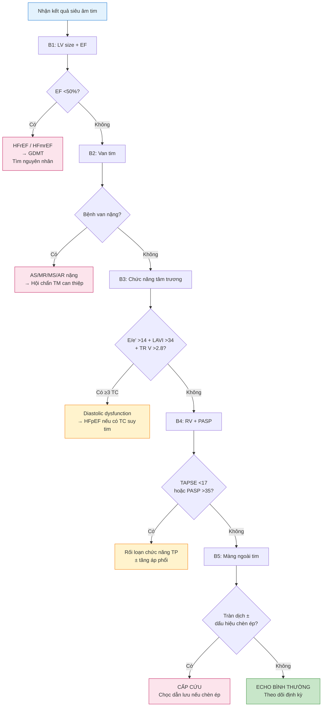

# BÀI HỌC Y KHOA: SIÊU ÂM TIM NỘI KHOA — CHỈ SỐ & ĐỌC KẾT QUẢ
****Mã bài học:** IM-19 | Ngày:** 2026-07-16 | **Chuyên khoa:** Nội khoa — Tim mạch | **Đối tượng:** Bác sĩ Nội khoa, học viên sau đại học

---

## 0. TỔNG QUAN — VÌ SAO BÀI NÀY QUAN TRỌNG?

Bác sĩ Nội khoa tuyến tỉnh **không cần biết cách cầm đầu dò siêu âm tim**. Nhưng mỗi ngày, bạn nhận được những tờ kết quả siêu âm tim từ tuyến trên hoặc từ kỹ thuật viên — trên đó là hàng chục con số: EF, E/A, E/e', TAPSE, PASP, PHT... Nếu không hiểu những con số này nghĩa là gì, bạn đang bỏ lỡ thông tin quan trọng nhất để ra quyết định lâm sàng.

Bài này dạy bạn **đọc hiểu một tờ kết quả siêu âm tim qua thành ngực (TTE) từ trên xuống dưới**: mỗi chỉ số nghĩa là gì, giá trị bình thường bao nhiêu, bất thường khi nào, và — quan trọng nhất — nó ảnh hưởng đến quyết định điều trị ra sao.

**Mục tiêu của bài:**
- Đọc hiểu tất cả chỉ số trên 1 tờ kết quả TTE chuẩn
- Biết giá trị bình thường của kích thước các buồng tim (ASE 2015)
- Phân độ được chức năng tâm thu, tâm trương, mức độ bệnh van tim
- Nhận diện 5 pattern bệnh lý thường gặp trên echo
- Sử dụng POCUS cơ bản tại giường để trả lời 3 câu hỏi cấp cứu: IVC? EF? Tràn dịch màng tim?
- Biết khi nào cần hội chẩn chuyên khoa Tim mạch / Siêu âm tim

---

### 📋 TRƯỚC KHI ĐỌC — BẠN CẦN NẮM CHẮC

> Để hiểu bài này, bạn nên đã biết:
> - **Giải phẫu tim**: 4 buồng (NT, NTT, TT, TTP), 4 van (2 lá, ĐMC, 3 lá, ĐMP), vách liên nhĩ, vách liên thất, màng ngoài tim
> - **Sinh lý huyết động cơ bản**: chu chuyển tim (đổ đầy → co bóp → tống máu), tiền tải (preload), hậu tải (afterload), cung lượng tim (CO = SV × HR)
> - **Khái niệm phân suất tống máu (EF)**: EF = SV / EDV, bình thường ≥55%
>
> Nếu chưa vững: xem lại giải phẫu tim và sinh lý huyết động trong giáo trình Nội khoa. Bài này tự cung cấp background cần thiết trong Section 1.

---

### 0.1 Nền tảng tối thiểu cần dùng ngay

Siêu âm tim (echocardiography, echo) dùng sóng âm để tạo hình buồng tim, van và chuyển động máu. Một **số đo hình ảnh** không phải là chẩn đoán độc lập: chất lượng ảnh, nhịp tim, kích thước cơ thể, triệu chứng và khám quyết định ý nghĩa. Trong **tâm trương**, thất đổ đầy; trong **tâm thu**, thất co bóp và tống máu. EF là tỷ lệ máu được tống ra, không đồng nghĩa toàn bộ chức năng tim. Report thiếu chỉ số chủ chốt hoặc một POCUS bất thường phải dẫn tới làm lại/hội chẩn, không được suy diễn là bình thường.

> **Nguồn:** ASE/EACVI Chamber Quantification 2015, DOI 10.1016/j.echo.2014.10.003. [GUIDELINE VERIFIED]

## 1. NỀN TẢNG: SIÊU ÂM TIM HOẠT ĐỘNG NHƯ THẾ NÀO? [CỐT LÕI]

### 1.1. Các mode siêu âm cơ bản

Một máy siêu âm tim có 4 mode chính — mỗi mode trả lời một câu hỏi khác nhau:

| Mode | Viết tắt | Câu hỏi trả lời | Ứng dụng chính |
|---|---|---|---|
| **2D** (2-dimensional) | 2D | "Cấu trúc trông thế nào?" | Kích thước buồng tim, vận động thành, van tim |
| **M-mode** (motion mode) | M-mode | "Cấu trúc di chuyển ra sao theo thời gian?" | Kích thước chính xác (LVEDD, LVESD), EF |
| **Doppler** (liên tục & xung) | CW, PW | "Máu chảy nhanh thế nào? Hướng nào?" | Chênh áp qua van, hở van, PASP |
| **TDI** (Tissue Doppler) | TDI | "Cơ tim di chuyển nhanh thế nào?" | Vận tốc vòng van (e', S'), chức năng tâm trương |

### 1.2. Các mặt cắt chuẩn — "Cửa sổ nhìn vào tim"

Người làm siêu âm đặt đầu dò ở các vị trí khác nhau trên ngực để có các "mặt cắt" chuẩn. Mỗi mặt cắt cho thấy những cấu trúc nhất định. Khi đọc kết quả, bạn không cần biết cách đặt đầu dò — nhưng cần biết mỗi mặt cắt thấy gì:

| Mặt cắt | Vị trí đầu dò | Thấy gì? |
|---|---|---|
| **PLAX** (Parasternal Long Axis) | Khoang liên sườn 3-4 cạnh ức trái | Vách liên thất, thất trái, van 2 lá, van ĐMC, nhĩ trái, gốc ĐMC |
| **PSAX** (Parasternal Short Axis) | Xoay 90° từ PLAX | Mặt cắt ngang thất trái (hình tròn), van 2 lá (hình miệng cá), cơ nhú |
| **A4C** (Apical 4-Chamber) | Mỏm tim | 4 buồng: NT, TT, NTT, TTP. Van 2 lá, van 3 lá. Vách liên nhĩ, vách liên thất. |
| **A2C** (Apical 2-Chamber) | Xoay từ A4C | NT + TT (không thấy buồng phải). Thành dưới, thành trước. |
| **A3C** (Apical 3-Chamber / Long Axis) | Xoay tiếp từ A2C | NT, TT, đường ra thất trái (LVOT), van ĐMC |
| **Subcostal** | Dưới mũi ức | Vách liên nhĩ (tốt nhất cho ASD), IVC, màng ngoài tim |
| **Suprasternal** | Hõm trên ức | Quai ĐMC, eo ĐMC (coarctation?) |

> ⚠️ **Mẹo nhớ:** Mặt cắt A4C là "mặt cắt vàng" — cho thấy cả 4 buồng, 2 van nhĩ-thất, và là nơi đo hầu hết Doppler. Khi nhận được report, hầu hết measurements đến từ A4C + PLAX.

### 🛑 DỪNG 1 PHÚT

> Echo report ghi: "A4C: LVEDV 120mL, LVESV 50mL, EF 58%." Bạn tính EF từ những số nào? Công thức?
>
> *(Đáp án: EF = (LVEDV - LVESV) / LVEDV × 100 = (120-50)/120 = 58%. Đây là Simpson's biplane method — đo EDV và ESV từ 2 mặt cắt A4C + A2C.)*

---

## 2. KÍCH THƯỚC BUỒNG TIM — GIÁ TRỊ BÌNH THƯỜNG [CỐT LÕI]

> **Nguồn:** [GUIDELINE VERIFIED: ASE/EACVI 2015 — Lang RM et al. JASE 2015;28:1-39]

Đây là bảng quan trọng nhất trong bài. **In ra và dán ở bàn làm việc.** Mọi kết quả echo đều có phần "Chamber Measurements" — bạn cần biết ngưỡng bình thường để phát hiện bất thường.

### 2.1. Thất trái (Left Ventricle — LV)

| Chỉ số | Nam | Nữ | Bất thường khi |
|---|---|---|---|
| **LVEDD** (đường kính cuối tâm trương) | 42-59 mm | 39-53 mm | >Nam/Nữ |
| **LVESD** (đường kính cuối tâm thu) | 25-40 mm | 22-35 mm | >Nam/Nữ |
| **IVSd** (vách liên thất cuối tâm trương) | 6-10 mm | 6-9 mm | >10 (phì đại) |
| **LVPWd** (thành sau cuối tâm trương) | 6-10 mm | 6-9 mm | >10 (phì đại) |
| **LVEDV** (thể tích cuối tâm trương) | 62-150 mL | 46-106 mL | >Nam/Nữ |
| **LVESV** (thể tích cuối tâm thu) | 21-61 mL | 14-42 mL | >Nam/Nữ |
| **LV mass index** | 49-115 g/m² | 43-95 g/m² | >115/95 (phì đại) |
| **RWT** (relative wall thickness) | 0.24-0.42 | 0.22-0.42 | >0.42 (concentric remodeling) |

### 2.2. Nhĩ trái (Left Atrium — LA)

| Chỉ số | Nam & Nữ | Ghi chú |
|---|---|---|
| **LA diameter** (PLAX) | 30-40 mm | Đo 1 chiều — nhanh nhưng kém chính xác |
| **LA volume index (LAVI)** | **≤34 mL/m²** | Quan trọng nhất! Đo bằng Simpson's biplane từ A4C + A2C |

**LAVI là yếu tố tiên lượng độc lập:** LAVI >34 mL/m² → tăng nguy cơ rung nhĩ, suy tim, đột quỵ, tử vong.

### 2.3. Thất phải (Right Ventricle — RV)

| Chỉ số | Bình thường | Ghi chú |
|---|---|---|
| **RV basal diameter** (A4C) | 25-41 mm | Đo ở đáy thất phải |
| **RV mid diameter** | 19-35 mm | Đo ở giữa thất phải |
| **RV longitudinal dimension** | 54-78 mm | Từ vòng van 3 lá đến mỏm |
| **RVOT PLAX** (đường ra thất phải) | 18-30 mm | Đo ở PLAX |
| **RVOT proximal** (PSAX) | 21-35 mm | Đo ở PSAX |
| **RV wall thickness** | 1-5 mm | >5 mm → phì đại (gợi ý tăng áp phổi mạn) |

### 2.4. Nhĩ phải (Right Atrium — RA) & ĐMC gốc

| Chỉ số | Bình thường |
|---|---|
| **RA area** (A4C) | ≤18 cm² |
| **RA volume index** | ≤30 mL/m² (nam), ≤27 mL/m² (nữ) |
| **Aortic root** (PLAX) | 20-37 mm (tùy tuổi, giới, BSA) |
| **Aortic annulus** | 18-26 mm |
| **Sinuses of Valsalva** | 25-38 mm |
| **Ascending aorta** | 22-36 mm |

> ⚠️ HỌC VIÊN HAY NHẦM: LVEDD bình thường không có nghĩa là LV bình thường. Một thất trái dày (↑IVSd, ↑LVPWd) có thể có LVEDD bình thường nhưng LVEDV nhỏ (concentric hypertrophy). Luôn nhìn cả kích thước buồng + độ dày thành!

---

## 3. CHỨC NĂNG TÂM THU THẤT TRÁI [CỐT LÕI]

### 3.1. EF (Ejection Fraction) — "Con số quyền lực nhất"

**EF = (EDV - ESV) / EDV × 100%**

| Phân loại | EF | Ý nghĩa lâm sàng |
|---|---|---|
| **Bình thường** | ≥55% (nam), ≥54% (nữ) | |
| **Giảm nhẹ** | 50-54% | Borderline |
| **Giảm trung bình** | 40-49% | HFmrEF (trước đây gọi là mid-range) |
| **Giảm nặng** | <40% | HFrEF — chỉ định điều trị nền (ACEi/ARB/ARNI, BB, MRA, SGLT2i) |
| **Rất nặng** | <30% | Cân nhắc ICD, CRT nếu QRS ≥130ms |

**Phương pháp đo EF:**
- **Simpson's biplane** (2D): CHUẨN — đo EDV và ESV từ A4C + A2C, tính EF. Chính xác nhất, nhưng phụ thuộc chất lượng hình ảnh.
- **Visual estimate (eyeballing):** Người làm echo nhìn và ước lượng. Nhanh, nhưng KHÔNG chính xác bằng Simpson's. Khi report ghi "EF 55-60% (visual)" — hiểu rằng con số này là ước lượng.
- **M-mode (Teichholz):** Đo từ PLAX, dùng công thức Teichholz. NHANH nhưng KÉM CHÍNH XÁC nếu có rối loạn vận động vùng (sau NMCT). Không nên dùng đơn độc.

### 3.2. Các chỉ số bổ sung đánh giá chức năng tâm thu

| Chỉ số | Bình thường | Ý nghĩa |
|---|---|---|
| **FS (Fractional Shortening)** | 25-43% | FS = (LVEDD-LVESD)/LVEDD. Đo từ M-mode PLAX. Đơn giản, nhưng giả định LV co bóp đối xứng (không đúng sau NMCT!). |
| **MAPSE** (Mitral Annular Plane Systolic Excursion) | ≥10 mm | M-mode qua vòng van 2 lá bên (lateral). Đơn giản, tương quan tốt với EF. |
| **GLS** (Global Longitudinal Strain) | ≤-18% (tức là -20% là BT) | Biến dạng cơ tim theo chiều dọc. Phát hiện rối loạn chức năng tâm thu SỚM khi EF còn bình thường (vd: hóa trị, bệnh cơ tim). |

> ⚠️ HỌC VIÊN HAY NHẦM: "EF 55% là bình thường nên tim tốt." **SAI.** Có thể có HFpEF (suy tim EF bảo tồn) — tim không giãn, bóp tốt, nhưng KHÔNG giãn ra đủ để đổ đầy (rối loạn tâm trương). → Luôn kiểm tra chức năng tâm trương (Section 5).

### 🛑 DỪNG 1 PHÚT

> Report echo: LVEDV 180mL, LVESV 120mL. EF = ? Phân loại? Nghĩ đến bệnh gì?
>
> *(Đáp án: EF = (180-120)/180 = 33% → HFrEF nặng. LVEDV 180mL > bình thường → giãn thất trái → pattern DCM (dilated cardiomyopathy). Cần tìm nguyên nhân (thiếu máu cục bộ? van tim? rượu?). Chỉ định GDMT: ACEi/ARB/ARNI + BB + MRA + SGLT2i.)*

---

## 4. CHỨC NĂNG THẤT PHẢI [CỐT LÕI]

Thất phải thường bị bỏ quên khi đọc echo — nhưng nó quyết định tiên lượng trong suy tim, tăng áp phổi, và NMCT thất phải.

| Chỉ số | Bình thường | Bất thường |
|---|---|---|
| **TAPSE** (Tricuspid Annular Plane Systolic Excursion) | **≥17 mm** | <17 → rối loạn chức năng TP |
| **S' (TDI vòng van 3 lá)** | **≥9.5 cm/s** | <9.5 → rối loạn chức năng TP |
| **FAC** (Fractional Area Change) | **≥35%** | <35 → rối loạn chức năng TP |
| **RV size (basal diameter)** | 25-41 mm | >41 → giãn TP |
| **RVSP / PASP** | ≤35 mmHg | >35 → tăng áp phổi (xem Section 7) |

**TAPSE là chỉ số đơn giản nhất để đánh giá thất phải** — chỉ cần M-mode qua vòng van 3 lá bên (lateral), đo khoảng cách di chuyển tâm thu. TAPSE <17 mm là dấu hiệu rối loạn chức năng thất phải, tiên lượng xấu trong suy tim và tăng áp phổi.

> ⚠️ **Đừng bỏ qua thất phải:** EF thất trái bình thường + TAPSE thấp + giãn TP → nghĩ đến TĂNG ÁP PHỔI hoặc NMCT thất phải.

---

## 5. CHỨC NĂNG TÂM TRƯƠNG — "NỬA KIA CỦA CHU CHUYỂN TIM" [CỐT LÕI]

> **Nguồn:** [GUIDELINE VERIFIED: ASE/EACVI 2016 — Nagueh SF et al. JASE 2016;29:277-314. Cập nhật: ASE 2025 Diastolic Function Guideline.]

Suy tim với EF bảo tồn (HFpEF) chiếm ≥50% các trường hợp suy tim — và nguyên nhân chính là rối loạn chức năng tâm trương. Bạn **không thể bỏ qua phần này** nếu EF bình thường.

### 5.1. 4 chỉ số chính đánh giá chức năng tâm trương

| Chỉ số | Bình thường | Bất thường | Ý nghĩa |
|---|---|---|---|
| **E/A ratio** (dòng chảy van 2 lá) | 1-2 (E > A) | E/A <0.8: impaired relaxation (grade I). E/A >2: restrictive filling (grade III) | E = đổ đầy sớm (hút của TT), A = đổ đầy muộn (co bóp NT) |
| **E/e' ratio** (E chia cho e' trung bình) | **<8** (bình thường) | **>14**: tăng áp lực đổ đầy thất trái (↑LV filling pressure) | e' = vận tốc giãn sớm vòng van 2 lá (TDI). E/e' LÀ CHỈ SỐ QUAN TRỌNG NHẤT |
| **TR velocity** (dòng hở van 3 lá) | **≤2.8 m/s** | >2.8 m/s → tăng áp lực nhĩ trái ± tăng áp phổi | Phản ánh áp lực tâm thu thất phải / ĐMP |
| **LAVI** (LA volume index) | **≤34 mL/m²** | >34: tăng áp lực đổ đầy mạn tính | Nhĩ trái giãn → áp lực đổ đầy tăng LÂU DÀI |

### 5.2. Thuật toán phân độ rối loạn chức năng tâm trương (ASE 2016/2025)

```
Bước 1: EF có giảm không?
  ├─ EF <50% + có bệnh tim thực thể → xem xét tăng áp lực đổ đầy
  └─ EF ≥50%: đánh giá 4 tiêu chí

Bước 2: 4 tiêu chí (với EF ≥50%):
  1. E/e' trung bình >14
  2. TR velocity >2.8 m/s
  3. LAVI >34 mL/m²
  4. e' (septal) <7 cm/s HOẶC e' (lateral) <10 cm/s

  → Nếu <2 tiêu chí dương tính: chức năng tâm trương BÌNH THƯỜNG
  → Nếu ≥3 tiêu chí dương tính: TĂNG ÁP LỰC ĐỔ ĐẦY → diastolic dysfunction
  → Nếu đúng 2 tiêu chí: không xác định → xem xét lâm sàng
```

**Phân độ diastolic dysfunction:**

| Grade | E/A | E/e' | Cơ chế |
|---|---|---|---|
| **Grade I** (Impaired relaxation) | <0.8 | BT hoặc ↑ nhẹ | Giai đoạn sớm — giãn chậm nhưng áp lực đổ đầy chưa tăng |
| **Grade II** (Pseudonormal) | 1-2 | >14 | Áp lực đổ đầy tăng vừa. Dễ bị BỎ SÓT vì E/A trông "bình thường"! |
| **Grade III** (Restrictive) | >2 | >14 | Áp lực đổ đầy tăng nặng. Tiên lượng xấu. |

> ⚠️ HỌC VIÊN HAY NHẦM: "E/A bình thường (1-2) = chức năng tâm trương bình thường." **SAI.** Grade II (pseudonormal) có E/A 1-2 nhưng E/e' tăng và LAVI tăng. **Luôn kiểm tra E/e' và LAVI** — đừng chỉ nhìn E/A!

---

## 6. BỆNH VAN TIM — ĐỊNH LƯỢNG MỨC ĐỘ [CỐT LÕI]

> **Nguồn:** [GUIDELINE VERIFIED: ASE 2017 Native Valvular Regurgitation; ESC/EACTS 2021 Valvular Heart Disease]

### 6.1. Hở van 2 lá (Mitral Regurgitation — MR)

| Chỉ số | Nhẹ | Trung bình | Nặng |
|---|---|---|---|
| **EROA** (Effective Regurgitant Orifice Area) | <0.20 cm² | 0.20-0.39 cm² | **≥0.40 cm²** |
| **RF** (Regurgitant Fraction) | <30% | 30-49% | **≥50%** |
| **RVol** (Regurgitant Volume) | <30 mL | 30-59 mL | **≥60 mL** |
| **VC** (Vena Contracta) | <3 mm | 3-6.9 mm | **≥7 mm** |
| **PISA** (Proximal Isovelocity Surface Area) | Nhỏ | Trung bình | Lớn |

**Cơ năng vs thực thể:** MR cơ năng (functional) = van bình thường nhưng vòng van giãn do giãn thất trái. MR thực thể (organic) = tổn thương lá van/dây chằng (sa van, thoái hóa, viêm nội tâm mạc).

### 6.2. Hẹp van 2 lá (Mitral Stenosis — MS)

| Chỉ số | Nhẹ | Trung bình | Nặng |
|---|---|---|---|
| **MVA** (Mitral Valve Area) | >1.5 cm² | 1.0-1.5 cm² | **<1.0 cm²** (rất nặng) |
| **PHT** (Pressure Half-Time) | <130 ms | 130-220 ms | **≥220 ms** |
| **Mean gradient** | <5 mmHg | 5-10 mmHg | **>10 mmHg** |

**Cách nhớ:** MVA <1.0 cm² = hẹp nặng (lỗ van nhỏ hơn đầu ngón tay út). PHT ≥220 ms = nặng (máu mất >220 ms để giảm một nửa chênh áp).

### 6.3. Hẹp van ĐMC (Aortic Stenosis — AS)

| Chỉ số | Nhẹ | Trung bình | Nặng |
|---|---|---|---|
| **AVA** (Aortic Valve Area) | >1.5 cm² | 1.0-1.5 cm² | **<1.0 cm²** |
| **AVA index** | >0.85 cm²/m² | 0.60-0.85 | **<0.60 cm²/m²** |
| **Mean gradient (MG)** | <20 mmHg | 20-40 mmHg | **≥40 mmHg** |
| **Peak velocity** | <3.0 m/s | 3.0-4.0 m/s | **≥4.0 m/s** |

**Paradoxical low-flow low-gradient AS:** AVA <1.0 + MG <40 + EF ≥50% + SV index ≤35 mL/m² — đây là AS NẶNG dù gradient thấp (do dòng chảy thấp)! Cần stress echo hoặc CT calcium score.

### 6.4. Hở van ĐMC (Aortic Regurgitation — AR)

| Chỉ số | Nhẹ | Trung bình | Nặng |
|---|---|---|---|
| **EROA** | <0.10 cm² | 0.10-0.29 cm² | **≥0.30 cm²** |
| **RF** | <30% | 30-49% | **≥50%** |
| **VC** | <3 mm | 3-6 mm | **>6 mm** |
| **PHT** (AR) | >500 ms | 200-500 ms | **<200 ms** (áp lực ĐMC và TT cân bằng nhanh) |

### 6.5. Hở van 3 lá (Tricuspid Regurgitation — TR)

| Chỉ số | Nhẹ | Nặng |
|---|---|---|
| **VC** | <7 mm | **≥7 mm** |
| **EROA** | <0.40 cm² | **≥0.40 cm²** |
| **TR velocity** | <2.8 m/s | **>2.8 m/s → ↑PASP** (xem Section 7) |

> ⚠️ HỌC VIÊN HAY NHẦM: Hở van 3 lá thường là THỨ PHÁT do giãn thất phải và tăng áp phổi, không phải bệnh van nguyên phát. Điều trị TR nặng = điều trị nguyên nhân (suy tim trái, tăng áp phổi), không phải mổ van 3 lá trước!

---

## 7. ÁP LỰC ĐỘNG MẠCH PHỔI [CỐT LÕI]

**Cách tính PASP (Pulmonary Artery Systolic Pressure):**

$$PASP = 4 \times (\text{TR peak velocity})^2 + \text{RAP}$$

- **TR peak velocity**: đo bằng CW Doppler qua van 3 lá
- **RAP (Right Atrial Pressure)**: ước tính từ IVC
  - IVC ≤2.1 cm + collapses >50% → RAP = 3 mmHg
  - IVC >2.1 cm + collapses <50% → RAP = 15 mmHg
  - Các trường hợp trung gian → RAP = 8 mmHg

| PASP | Phân loại |
|---|---|
| ≤35 mmHg | Bình thường |
| 36-50 mmHg | Tăng nhẹ |
| 51-70 mmHg | Tăng trung bình |
| >70 mmHg | Tăng nặng |

**Dấu hiệu gián tiếp của tăng áp phổi trên echo:**
- Giãn thất phải (RV basal >41 mm)
- Dẹt vách liên thất thì tâm thu (septal flattening, D-shape LV)
- TAPSE giảm (<17 mm)
- PA acceleration time (PAAT) rút ngắn (<105 ms)
- TR velocity >2.8 m/s là dấu hiệu khởi đầu

---

## 8. MÀNG NGOÀI TIM [CỐT LÕI]

### 8.1. Tràn dịch màng tim (Pericardial Effusion)

| Lượng dịch | Khoảng trống echo-free (cuối tâm trương) |
|---|---|
| **Nhẹ** | <10 mm |
| **Trung bình** | 10-20 mm |
| **Nặng** | >20 mm |
| **Rất nặng** | >25 mm + dấu hiệu chèn ép |

### 8.2. Dấu hiệu chèn ép tim (Cardiac Tamponade) — CẤP CỨU

**4 dấu hiệu chính cần nhớ:**
1. **RA collapse cuối tâm trương / đầu tâm thu** — dấu hiệu sớm và nhạy nhất
2. **RV collapse đầu tâm trương** — xuất hiện khi chèn ép nặng hơn
3. **Respiratory variation >25% mitral inflow** (E wave thay đổi theo hô hấp) — Doppler xác nhận
4. **IVC giãn + không xẹp** (plethoric IVC — >2.1 cm + <50% collapse)

> ⚠️ **Tamponade là chẩn đoán LÂM SÀNG** (Beck's triad: tụt HA, TM cổ nổi, tiếng tim mờ) — echo chỉ hỗ trợ. Nếu lâm sàng nghi ngờ + echo có dấu hiệu → CHỌC DẪN LƯU CẤP CỨU, không chờ đợi.

---

### 🛑 DỪNG 1 PHÚT

> Report echo: EF 65%, E/A = 2.5, E/e' = 18, LAVI = 42 mL/m², TR velocity = 3.2 m/s. IVC 2.3 cm, collapses <50%. RAP ước tính? PASP? Chẩn đoán rối loạn tâm trương grade mấy? Có tăng áp phổi không?
>
> *(Đáp án: RAP = 15 mmHg (IVC >2.1 + collapse <50%). PASP = 4×3.2² + 15 = 56 mmHg → tăng trung bình. E/A >2 + E/e' >14 + LAVI >34 → diastolic dysfunction grade III (restrictive). Có tăng áp phổi thứ phát. Đây là pattern HFpEF điển hình — EF bảo tồn nhưng áp lực đổ đầy tăng nặng.)*

---

## 9. PATTERN BỆNH LÝ THƯỜNG GẶP [NÂNG CAO]

### 9.1. DCM (Dilated Cardiomyopathy)

| Dấu hiệu echo |
|---|
| LVEDD tăng (≥60mm), LV giãn to |
| EF giảm (<40%) |
| Vận động thành giảm lan tỏa (global hypokinesis) |
| Có thể có MR cơ năng (vòng van 2 lá giãn) |
| Có thể có huyết khối trong thất trái (máu ứ đọng) |

### 9.2. HCM (Hypertrophic Cardiomyopathy)

| Dấu hiệu echo |
|---|
| IVSd ≥15 mm (dày vách liên thất KHÔNG ĐỐI XỨNG — asymmetric septal hypertrophy) |
| LVEDD nhỏ hoặc bình thường |
| EF bình thường hoặc tăng (hyperdynamic) |
| SAM (Systolic Anterior Motion) của van 2 lá → tắc nghẽn LVOT |
| LVOT gradient >30 mmHg (lúc nghỉ) hoặc >50 mmHg (Valsalva) |

### 9.3. AS nặng (Severe Aortic Stenosis)

| Dấu hiệu echo |
|---|
| Van ĐMC vôi hóa, hạn chế mở |
| AVA <1.0 cm² |
| MG ≥40 mmHg, Peak velocity ≥4.0 m/s |
| LV phì đại đồng tâm (concentric hypertrophy) — IVSd, LVPWd tăng |
| Có thể EF giảm (giai đoạn muộn) |

### 9.4. MR cơ năng (Functional MR)

| Dấu hiệu echo |
|---|
| EF giảm, LV giãn (thường sau NMCT hoặc DCM) |
| Vòng van 2 lá giãn, lá van KHÔNG dày, KHÔNG sa |
| EROA ≥0.20 cm² (vừa), ≥0.40 cm² (nặng) |
| MR dòng hở hướng về phía sau nếu lá sau bị hạn chế (MR type IIIb Carpentier) |

### 9.5. HFpEF (Heart Failure with Preserved EF)

| Dấu hiệu echo |
|---|
| EF ≥50% |
| E/e' trung bình >14 |
| LAVI >34 mL/m² |
| TR velocity >2.8 m/s |
| LV phì đại đồng tâm hoặc remodeling đồng tâm |
| GLS có thể giảm dù EF bình thường |

---

### BOX ĐỎ — khi phải rời nhánh thường quy

> **Tràn dịch kèm tụt huyết áp/dấu giảm tưới máu, nghi chèn ép tim, van cấp nặng, sốc hoặc giảm EF mới nặng, nghi bóc tách động mạch chủ → nguy cơ cấp cứu tim mạch → đánh giá lâm sàng khẩn, monitor và gọi/chuyển tim mạch–hồi sức.** Không chỉ “đọc report”, chờ hẹn thường quy hoặc tự quyết định chọc dẫn lưu từ một hình ảnh.

## 10. CÁCH ĐỌC 1 TỜ KẾT QUẢ SIÊU ÂM TIM [CỐT LÕI]

Khi nhận được 1 tờ kết quả echo, đọc theo thứ tự sau — từ trên xuống dưới, không bỏ sót mục nào:

### Hệ thống đọc echo report (7 bước)

```
BƯỚC 1: PATIENT INFO — Tên, tuổi, giới, BSA, ngày làm, chỉ định
  → Kiểm tra đúng bệnh nhân. BSA dùng để index các thể tích.
  → Chỉ định echo là gì? (khó thở? tiếng thổi? suy tim? tầm soát?)

BƯỚC 2: LV SIZE + SYSTOLIC FUNCTION
  ├─ LVEDD / LVESD (M-mode hoặc 2D)
  ├─ IVSd / LVPWd (độ dày thành)
  ├─ LVEDV / LVESV (Simpson's)
  ├─ EF (%) — giảm hay bảo tồn?
  ├─ RWT (relative wall thickness) — concentric remodeling?
  └─ Vận động thành: bình thường hay có rối loạn vùng?

BƯỚC 3: LA + RA SIZE
  ├─ LA diameter (PLAX) và LAVI (A4C+A2C)
  └─ RA area (A4C)

BƯỚC 4: VALVES (theo thứ tự: 2 lá → ĐMC → 3 lá → ĐMP)
  ├─ Van 2 lá: cấu trúc? Hở? (EROA, VC, RF). Hẹp? (MVA, PHT, MG).
  ├─ Van ĐMC: cấu trúc (vôi hóa? 2 lá bẩm sinh?)? Hẹp? (AVA, MG, peak V). Hở? (EROA, VC, PHT).
  ├─ Van 3 lá: hở? (VC, TR velocity → quan trọng cho PASP!)
  └─ Van ĐMP: hở? hẹp? (hiếm)

BƯỚC 5: DIASTOLIC FUNCTION
  ├─ E/A, E/e' (septal + lateral), e' velocity
  ├─ TR velocity → PASP
  ├─ LAVI
  └─ Phân độ (Grade I / II / III hoặc bình thường)

BƯỚC 6: RV + RA
  ├─ RV size (basal diameter)
  ├─ TAPSE, S'
  ├─ PASP (từ TR velocity + RAP)
  └─ Có dấu hiệu tăng áp phổi?

BƯỚC 7: PERICARDIUM + OTHER
  ├─ Có tràn dịch? Lượng? Có dấu hiệu chèn ép?
  ├─ IVC size + collapsibility
  ├─ Các phát hiện khác: huyết khối? mass? ASD/PFO? (bubble study?)
  └─ KẾT LUẬN của người đọc echo
```

---

## 11. POCUS CƠ BẢN CHO NỘI KHOA [NÂNG CAO]

POCUS (Point-of-Care Ultrasound) không thay thế echo chuyên khoa. Nhưng trong cấp cứu, nó trả lời 3 câu hỏi sống còn trong <2 phút:

### 3 câu hỏi POCUS:

| Câu hỏi | Cách làm | Dấu hiệu |
|---|---|---|
| **1. IVC — BN cần dịch hay lợi tiểu?** | Subcostal, M-mode đo IVC cách nhĩ phải 2cm | IVC nhỏ (<1cm) + xẹp >50% → cần DỊCH. IVC to (>2.1cm) + xẹp <50% → quá tải dịch → LỢI TIỂU. |
| **2. EF — Tim bóp tốt không?** | A4C hoặc PLAX, visual estimate | "Eyeballing": EF >50%? 30-50%? <30%? KHÔNG cần Simpson's — chỉ cần ước lượng trong cấp cứu. |
| **3. Pericardial effusion — Có tràn dịch màng tim không?** | Subcostal hoặc A4C | Echo-free space quanh tim. Có RA/RV collapse? → NGHI NGỜ CHÈN ÉP → cấp cứu! |

### Giới hạn của POCUS (khi nào cần echo chuyên khoa):
- Cần đánh giá van tim (hở/hẹp nặng?)
- Cần đánh giá tâm trương
- Cần Simpson's biplane EF chính xác
- Nghi ngờ viêm nội tâm mạc (vegetation?)
- Nghi ngờ bệnh tim bẩm sinh (ASD, VSD, PDA)
- Nghi ngờ huyết khối trong buồng tim

> ⚠️ **POCUS là công cụ SÀNG LỌC, không phải CHẨN ĐOÁN.** Nếu POCUS bất thường → echo chuyên khoa để xác nhận.

---

## 12. FLOWCHART [CỐT LÕI]


### Diễn giải lưu đồ từng bước

1. Trước khi đọc tuần tự, đối chiếu chỉ định và triệu chứng. Sốc, tamponade hoặc van cấp nặng đi BOX ĐỎ; report không thay thế đánh giá và hồi sức.
2. EF/khối lượng thất là điểm bắt đầu, nhưng EF giảm cần ghép với hình ảnh thành, van và lâm sàng để xác định nguyên nhân; EF bảo tồn không loại trừ suy tim.
3. Van nặng hoặc nhiều chỉ số tâm trương/RV bất thường dẫn đến report đầy đủ và hội chẩn. Thiếu chỉ số chủ chốt, chất lượng ảnh kém hoặc POCUS không chắc là nhánh **làm lại/chuyển echo chuyên khoa**, không được gọi là bình thường.
4. Tràn dịch với dấu chèn ép dẫn đến đường cấp cứu lâm sàng; chỉ có tràn dịch mà chưa có suy tuần hoàn vẫn cần bối cảnh, theo dõi và chuyên khoa phù hợp.


---

## 13. SAI LẦM THƯỜNG GẶP [CỐT LÕI]

| # | Sai lầm | Hậu quả | Cách tránh |
|---|---|---|---|
| 1 | **Chỉ nhìn EF, bỏ qua tâm trương** | Bỏ sót HFpEF — ≥50% suy tim! | Luôn kiểm tra E/e', LAVI, TR velocity |
| 2 | **Nhầm pseudonormal (Grade II) là bình thường vì E/A 1-2** | Bỏ sót tăng áp lực đổ đầy | Luôn kiểm tra E/e' và LAVI, không chỉ E/A |
| 3 | **Không kiểm tra TAPSE và RV** | Bỏ sót rối loạn chức năng TP, tiên lượng xấu | Mỗi lần đọc echo: nhìn RV size + TAPSE |
| 4 | **Dùng M-mode EF (Teichholz) cho BN sau NMCT** | EF sai do rối loạn vận động vùng | Sau NMCT: dùng Simpson's biplane hoặc visual estimate |
| 5 | **Bỏ qua paradoxical low-flow low-gradient AS** | Bỏ sót AS nặng cần can thiệp | AVA <1.0 + MG <40 + EF ≥50% + SVi ≤35 → NGHI NGỜ → stress echo |
| 6 | **Không kiểm tra IVC** | Bỏ sót tình trạng dịch (thiếu dịch / quá tải) | Luôn xem IVC size + collapsibility trong phần kết quả |
| 7 | **Nhìn TR velocity cao → kết luận tăng áp phổi nguyên phát** | Bỏ sót nguyên nhân: bệnh tim trái (MR, MS, HFpEF) là #1 | Tăng áp phổi thường là THỨ PHÁT → tìm nguyên nhân tim trái trước |

---

## 14. BẢNG GIÁ TRỊ BÌNH THƯỜNG — THAM KHẢO NHANH [THAM KHẢO]

### Kích thước buồng tim (ASE 2015)

| Chỉ số | Nam | Nữ |
|---|---|---|
| LVEDD | 42-59 mm | 39-53 mm |
| IVSd / LVPWd | 6-10 mm | 6-9 mm |
| LA diameter | 30-40 mm | 30-40 mm |
| LAVI | ≤34 mL/m² | ≤34 mL/m² |
| RV basal | 25-41 mm | 25-41 mm |
| RA area | ≤18 cm² | ≤18 cm² |
| Aortic root | 20-37 mm | 20-37 mm |

### Chức năng tim

| Chỉ số | Bình thường | Bất thường |
|---|---|---|
| EF | ≥55% (nam), ≥54% (nữ) | <50% |
| FS | 25-43% | <25% |
| TAPSE | ≥17 mm | <17 |
| S' (TDI-RV) | ≥9.5 cm/s | <9.5 |
| E/e' trung bình | <8 | >14 |
| E/A | 1-2 (người <60t) | <0.8 hoặc >2 |
| TR velocity | ≤2.8 m/s | >2.8 |
| PASP | ≤35 mmHg | >35 |
| IVC diameter | ≤2.1 cm | >2.1 |
| GLS | ≤-18% | >-18% (ít âm hơn) |

### Van tim — ngưỡng nặng

| Van | Chỉ số | Ngưỡng nặng |
|---|---|---|
| Hở 2 lá (MR) | EROA | ≥0.40 cm² |
| | RVol | ≥60 mL |
| | VC | ≥7 mm |
| | RF | ≥50% |
| Hẹp 2 lá (MS) | MVA | <1.0 cm² |
| | PHT | ≥220 ms |
| | MG | >10 mmHg |
| Hẹp ĐMC (AS) | AVA | <1.0 cm² |
| | MG | ≥40 mmHg |
| | Peak V | ≥4.0 m/s |
| Hở ĐMC (AR) | EROA | ≥0.30 cm² |
| | VC | >6 mm |
| | PHT | <200 ms |
| Hở 3 lá (TR) | VC | ≥7 mm |
| | EROA | ≥0.40 cm² |

---

## 15. ÁP DỤNG TẠI VIỆT NAM [CỐT LÕI]

### Plan A — nguồn lực đầy đủ

- Dùng report echo hoàn chỉnh có chỉ định, chất lượng ảnh, kích thước buồng tim, EF, van, tâm trương, thất phải, màng tim và kết luận của người thực hiện; liên hệ tim mạch khi phát hiện thay đổi có thể làm đổi điều trị.

### Plan B — tuyến hạn chế nguồn lực

- **Làm ngay được:** đối chiếu report với triệu chứng, huyết động và ECG; xác định những số đo/ảnh bị thiếu; dùng POCUS chỉ để trả lời câu hỏi cấp cứu đã được đào tạo.
- **Không được suy diễn/thay thế:** thiếu E/e', LAVI, TAPSE, dữ liệu van hoặc ảnh kém không phải report bình thường; POCUS không thay echo chuyên khoa hay đánh giá van/tâm trương toàn diện.
- **Chuyển/làm lại:** report không đầy đủ nhưng người bệnh có triệu chứng; EF giảm mới, van nặng, tăng áp phổi nghi ngờ, tràn dịch có dấu giảm tưới máu, hoặc nghi tamponade/bóc tách/sốc cần đánh giá tim mạch–cấp cứu.

> **Nguồn:** ASE/EACVI Chamber Quantification 2015, DOI 10.1016/j.echo.2014.10.003; ASE/EACVI Diastolic Function 2016, DOI 10.1016/j.echo.2016.01.011. [GUIDELINE VERIFIED]
## 16. CASE LÂM SÀNG [NÂNG CAO]
> **Cách đọc đáp án cho từng case:** (1) **Nhận diện cấp cứu/nguy cơ**; (2) **Dữ kiện quyết định**; (3) **Hành động ngay**; (4) **Theo dõi hoặc chuyển tuyến**; (5) **Vì sao không chọn phương án khác**. Một report/POCUS không hoàn chỉnh phải dẫn đến làm lại hoặc hội chẩn, không tự suy diễn.


### Case 1: HFrEF mới chẩn đoán
**Bệnh nhân:** Nam 55 tuổi, khó thở khi gắng sức 3 tháng, phù 2 chân. Siêu âm tim: LVEDD 65 mm, LVESD 52 mm, IVSd 9 mm, LVEDV 220 mL, LVESV 155 mL, EF 30%, TAPSE 14 mm, E/A 2.2, E/e' 18, MR EROA 0.30 cm² (vừa).
**Câu hỏi:** (1) EF và phân loại suy tim? (2) MR là cơ năng hay thực thể? (3) Cần điều trị gì?
*(Gợi ý: EF 30% → HFrEF nặng. LV giãn → DCM. MR EROA 0.30 là vừa, van bình thường + LV giãn → MR CƠ NĂNG. E/e' 18 → tăng áp lực đổ đầy. Điều trị: ACEi/ARNI + BB + MRA + SGLT2i + lợi tiểu. MR cơ năng sẽ cải thiện khi điều trị suy tim. TAPSE 14 <17 → rối loạn chức năng TP thứ phát.)*

### Case 2: Hẹp ĐMC nặng
**Bệnh nhân:** Nữ 72 tuổi, ngất khi gắng sức, đau ngực. Echo: AVA 0.7 cm², MG 52 mmHg, Peak V 4.6 m/s, LVEF 60%, IVSd 14 mm, LVPWd 13 mm.
**Câu hỏi:** (1) Phân độ AS? (2) Có phù hợp với triệu chứng không? (3) Điều trị?
*(Gợi ý: AVA <1.0 + MG ≥40 + Peak V ≥4.0 → AS NẶNG, CÓ TRIỆU CHỨNG. LV phì đại đồng tâm (concentric hypertrophy). Điều trị: THAY VAN ĐMC (TAVI hoặc phẫu thuật) — đây là chỉ định class I. Nội khoa đơn thuần không đủ.)*

### Case 3: Chèn ép tim
**Bệnh nhân:** Nữ 48 tuổi, K vú đang hóa trị, khó thở cấp, tụt HA (90/60), TM cổ nổi. Echo: tràn dịch màng tim 28 mm chu vi, RA collapse cuối tâm trương, RV collapse đầu tâm trương, IVC 2.5 cm không xẹp, respiratory variation mitral inflow 35%.
**Câu hỏi:** (1) Có chèn ép tim không? (2) Dấu hiệu echo nào quan trọng nhất? (3) Xử trí?
*(Gợi ý: CÓ — tràn dịch nặng (>25mm) + RA collapse + respiratory variation >25% → đủ tiêu chuẩn chẩn đoán. Xử trí: CHỌC DẪN LƯU MÀNG TIM CẤP CỨU. Không trì hoãn chờ echo kiểm tra lại. IVC 2.5cm không xẹp + lâm sàng tụt HA + TM cổ nổi → Beck's triad.)*

### Case 4: HFpEF
**Bệnh nhân:** Nữ 68 tuổi, THA lâu năm, khó thở khi gắng sức, phù chân. Echo: EF 62%, IVSd 12 mm, LVPWd 12 mm, LVEDD 44 mm (BT), LAVI 40 mL/m², E/A 0.7, E/e' trung bình 16, TR V 3.0 m/s, PASP 48 mmHg.
**Câu hỏi:** (1) Tại sao EF 62% nhưng vẫn suy tim? (2) Phân độ diastolic dysfunction? (3) Điều trị?
*(Gợi ý: EF bảo tồn + LV phì đại đồng tâm (concentric hypertrophy) + E/e'>14 + LAVI>34 + TR V>2.8 → diastolic dysfunction Grade II (E/A <0.8 là impaired relaxation, nhưng E/e' cao → pseudonormal progression). Đây là HFpEF điển hình do THA lâu năm. Điều trị: kiểm soát HA triệt để, lợi tiểu cho triệu chứng sung huyết, SGLT2i (EMPEROR-Preserved, DELIVER). Không dùng thuốc cho HFrEF.)*

### Case 5: Hở 2 lá cơ năng sau NMCT
**Bệnh nhân:** Nam 60 tuổi, NMCT thành dưới cách 1 năm. Echo: LVEDD 62 mm, EF 35%, vô động thành dưới và thành sau, MR EROA 0.38 cm², VC 6 mm, LAVI 45 mL/m², E/e' 17.
**Câu hỏi:** (1) MR cơ năng hay thực thể? (2) Tại sao có MR? (3) Điều trị MR?
*(Gợi ý: MR CƠ NĂNG type IIIb Carpentier — hạn chế vận động lá sau do rối loạn vận động thành dưới sau NMCT + giãn vòng van. MR vừa-nặng (EROA 0.38, gần ngưỡng nặng 0.40). Điều trị: TỐI ƯU GDMT suy tim (ARNI + BB + MRA + SGLT2i) → tái cấu trúc ngược. Nếu MR vẫn nặng sau GDMT và có triệu chứng → xem xét can thiệp (MitraClip hoặc phẫu thuật.)*

---

## 17. TỔNG KẾT — 10 ĐIỂM CẦN NHỚ [CỐT LÕI]

1. **Đọc echo theo hệ thống 7 bước:** LV size/EF → LA/RA → valves → diastolic → RV → pericardium → kết luận. Không nhảy cóc, không bỏ mục.
2. **EF là con số quan trọng nhất nhưng không phải duy nhất.** EF ≥50% + triệu chứng suy tim → kiểm tra diastolic function!
3. **E/e' >14 là dấu ấn của tăng áp lực đổ đầy thất trái.** Đừng chỉ nhìn E/A — pseudonormal E/A 1-2 có thể là Grade II.
4. **LAVI >34 mL/m² là dấu hiệu tăng áp lực đổ đầy MẠN TÍNH** — nhĩ trái giãn không hồi phục hoàn toàn.
5. **AS nặng: AVA <1.0 cm² + MG ≥40 mmHg + Peak V ≥4.0 m/s.** Có triệu chứng → thay van, không trì hoãn.
6. **MR cơ năng ≠ MR thực thể.** MR cơ năng điều trị bằng GDMT suy tim trước, MR thực thể cần can thiệp van.
7. **TAPSE <17 mm là rối loạn chức năng thất phải** — tiên lượng xấu, đừng bỏ qua.
8. **TR velocity → PASP = 4×(TR V)² + RAP.** RAP từ IVC. PASP >35 = tăng áp phổi. Luôn tìm nguyên nhân tim trái trước khi kết luận tăng áp phổi nguyên phát.
9. **Chèn ép tim là chẩn đoán LÂM SÀNG** — echo hỗ trợ với RA collapse + respiratory variation >25%. Không chờ đợi: chọc dẫn lưu ngay.
10. **POCUS 3 câu hỏi cấp cứu:** IVC (cần dịch hay lợi tiểu?), EF (tim bóp tốt không?), pericardium (có tràn dịch không?). POCUS là sàng lọc — bất thường → echo chuyên khoa.

---

### 🛑 TỰ KIỂM TRA CUỐI BÀI

> 1. Bạn nhận được echo report: EF 58%, E/A 2.4, E/e' 16, LAVI 38, TR V 3.0. BN có khó thở khi gắng sức. Chẩn đoán? Giải thích vì sao EF bình thường nhưng vẫn bệnh?
> 2. Echo ghi: AVA 0.8 cm², MG 28 mmHg, Peak V 3.2 m/s, EF 60%, SV index 30 mL/m². Đây là AS nặng không? Cần làm thêm gì?
> 3. IVC 2.4 cm, collapses <50%. RAP ước tính? Nếu TR V = 3.5 m/s, PASP = ? Có tăng áp phổi không?
>
> *(Đáp án: 1. HFpEF — EF bảo tồn nhưng E/e'>14, LAVI>34, TR V>2.8 → diastolic dysfunction Grade II-III với tăng áp lực đổ đầy. 2. AVA <1.0 là nặng về mặt giải phẫu, nhưng MG<40, Peak V<4.0 → low-flow low-gradient AS. SV index 30 ≤35 → paradoxical low-flow low-gradient. Cần stress echo hoặc CT calcium score để xác nhận mức độ nặng. 3. RAP = 15 mmHg. PASP = 4×3.5² + 15 = 64 mmHg → tăng áp phổi trung bình-nặng.)*

---

## 18. TÀI LIỆU THAM KHẢO


1. Lang RM, Badano LP, Mor-Avi V, et al. Recommendations for Cardiac Chamber Quantification by Echocardiography in Adults. *J Am Soc Echocardiogr.* 2015;28:1–39. DOI: 10.1016/j.echo.2014.10.003. URL: https://www.asecho.org/guideline/chamber-quantification/ (truy cập 2026-07-18). [GUIDELINE VERIFIED]
2. Nagueh SF, Smiseth OA, Appleton CP, et al. Recommendations for the Evaluation of Left Ventricular Diastolic Function by Echocardiography. *J Am Soc Echocardiogr.* 2016;29:277–314. DOI: 10.1016/j.echo.2016.01.011. URL: https://www.asecho.org/guideline/diastolic-function/ (truy cập 2026-07-18). [GUIDELINE VERIFIED]
3. Zoghbi WA, Adams D, Bonow RO, et al. Recommendations for Noninvasive Evaluation of Native Valvular Regurgitation. *J Am Soc Echocardiogr.* 2017;30:303–371. DOI: 10.1016/j.echo.2017.01.007. URL: https://www.asecho.org/guideline/native-valvular-regurgitation/ (truy cập 2026-07-18). [GUIDELINE VERIFIED]
4. Mitchell C, Rahko PS, Blauwet LA, et al. Guidelines for Performing a Comprehensive Transthoracic Echocardiographic Examination in Adults. *J Am Soc Echocardiogr.* 2019;32:1–64. DOI: 10.1016/j.echo.2018.06.004. [GUIDELINE VERIFIED]
5. ESC/EACTS. 2021 Guidelines for the Management of Valvular Heart Disease. URL: https://www.escardio.org/guidelines/clinical-practice-guidelines/valvular-heart-disease/ (truy cập 2026-07-18). [GUIDELINE VERIFIED]
6. ASE. Cardiac point-of-care ultrasound nomenclature and practice guidance. URL: https://www.asecho.org/ (truy cập 2026-07-18). [GUIDELINE VERIFIED]

**— Hết bài học ngày 2026-07-16 —**

**Bác sĩ:** Ngọc Hưng 🍅 🐈‍⬛ | **AI:** DeepSeek V4 Pro