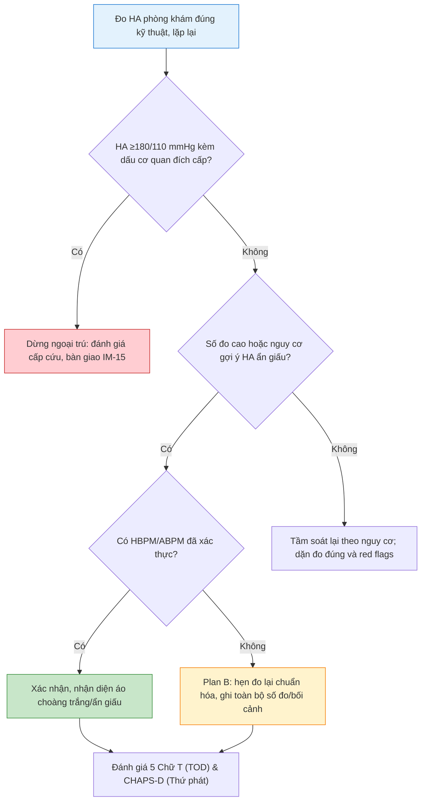
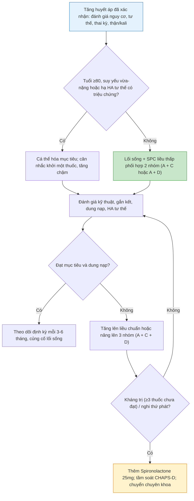

# BÀI HỌC Y KHOA: IM-20 — TĂNG HUYẾT ÁP
**Ngày:** 2026-07-18 (Cập nhật: 2026-08-26) | **Chuyên khoa:** Nội khoa người lớn | **Đối tượng:** Bác sĩ, học viên và sinh viên Y khoa cần đường tiếp cận lâm sàng vững chắc từ sinh lý bệnh đến thực hành kê đơn an toàn

---

## 0. TỔNG QUAN — VÌ SAO BÀI NÀY QUAN TRỌNG?

Tăng huyết áp là áp lực máu trong động mạch tăng kéo dài. Nó thường không gây triệu chứng, nhưng có thể làm tổn thương não, tim, thận và mạch máu. Sai lầm nguy hiểm là gắn nhãn bệnh mạn từ một lần đo sai; sai lầm còn nguy hiểm hơn là bỏ qua người có huyết áp rất cao kèm tổn thương cơ quan cấp.

**Mục tiêu của bài:**
- Đo, xác nhận và phân loại huyết áp theo đường thực hành VSH/VNHA 2024.
- Dừng nhánh ngoại trú khi có khả năng tăng huyết áp cấp cứu và chuyển sang **IM-15**.
- Nắm vững sinh lý bệnh học huyết áp để kết nối trực tiếp với cơ chế 4 nhóm thuốc kinh điển (A-B-C-D).
- Đánh giá toàn diện Tổn thương cơ quan đích (Mnemonic "5 Chữ T") và Tăng huyết áp thứ phát (Mnemonic "CHAPS-D").
- Khởi trị, phối hợp thuốc liều thấp và theo dõi an toàn.

### 📋 TRƯỚC KHI ĐỌC — NỀN TẢNG CẦN DÙNG

- Bài này không thay thế triage, ABCDE hay xử trí tăng huyết áp cấp cứu. Người bệnh không ổn định cần đánh giá cấp cứu trước; xem **IM-15**.
- Kê đơn cần được cá thể hóa sau khi kiểm tra thuốc đang dùng, dị ứng, thai kỳ/khả năng mang thai, chức năng thận và điện giải.

### 0.1 Nền tảng tối thiểu cần dùng ngay

**Huyết áp tâm thu (HATT)** là áp lực cao nhất khi thất trái bóp đẩy máu; **huyết áp tâm trương (HATTr)** là áp lực thấp hơn khi tim thư giãn. Đơn vị là **mmHg**. Huyết áp không chỉ là một con số: nó thay đổi theo tư thế, đau, lo âu, cà phê, vận động, kỹ thuật đo và thời điểm trong ngày.

**Cơ quan đích** là cơ quan bị huyết áp cao làm hại: tim, não, thận, võng mạc và động mạch. **Tổn thương cơ quan đích cấp** nghĩa là chức năng/cấu trúc đang bị tổn hại trong hiện tại; đây là lý do một số người có huyết áp cao phải đi cấp cứu thay vì chờ đo lại.

**HBPM** là tự đo huyết áp tại nhà bằng máy đã được xác thực. **ABPM** là máy đo huyết áp lưu động trong 24 giờ. Hai phương pháp giúp nhận ra số đo tại phòng khám có phản ánh huyết áp thường ngày hay không. [TEXTBOOK: Braunwald's Heart Disease, 12e.]

---

## 1. ĐO HUYẾT ÁP ĐÚNG VÀ XÁC NHẬN CHẨN ĐOÁN [CỐT LÕI]

### 1.1 Mục tiêu và cách đo tại phòng khám

Mục tiêu là tạo số đo có thể dùng cho quyết định, không phải tìm số cao nhất. Cho người bệnh ngồi yên trong môi trường yên tĩnh ít nhất 5 phút; không hút thuốc, dùng caffeine hoặc vận động mạnh trong ít nhất 30 phút. Lưng tựa ghế, bàn chân đặt sàn không bắt chéo, tay thả lỏng và được đỡ ngang mức tim; không nói chuyện khi đo.

Chọn băng quấn vừa cánh tay. Đo 3 lần cách nhau 1–2 phút; nếu hai lần đầu chênh nhiều, đo thêm. Ghi trung bình hai lần cuối. Lần khám đầu đo cả hai tay và dùng bên cao hơn để phân loại khi có chênh lệch. Đo ngồi rồi đo lại sau đứng để nhận ra hạ huyết áp tư thế, đặc biệt ở người cao tuổi, đái tháo đường hoặc có chóng mặt khi đứng.

> ⚠️ HỌC VIÊN HAY NHẦM: Một máy tự động không thay thế kỹ thuật. Băng quá nhỏ, tay không ngang tim hoặc nói chuyện khi đo có thể tạo quyết định sai.

### 1.2 Bài tập lâm sàng: Kịch bản Role-Play "5 Phút Tĩnh Lặng"

Để thấy rõ sự sai lệch huyết áp 10–20 mmHg do yếu tố cảm xúc và tư thế đo, học viên thực hiện bài tập đóng vai:
- **Bước 1 (Đo vội):** Người đóng vai bệnh nhân vừa đi bộ nhanh/leo cầu thang vào phòng → Đo ngay khi vừa ngồi xuống, vừa đo vừa nói chuyện → Ghi nhận HA1 (thường tăng vọt 145/90 mmHg).
- **Bước 2 (Chuẩn 5 phút tĩnh lặng):** Ngồi tựa lưng, chân chạm sàn không bắt chéo, tay đỡ ngang mức tim, im lặng tuyệt đối trong đúng 5 phút.
- **Bước 3 (Đo chuẩn hóa):** Đo lại lần 2 và lần 3 (cách nhau 1–2 phút), lấy trung bình 2 lần cuối → Ghi nhận HA2 (thường hạ về mức sinh lý 120/75 mmHg).
- *Bài học rút ra:* Thiếu 5 phút nghỉ ngơi và đo sai kỹ thuật có thể biến một người khỏe mạnh thành bệnh nhân bị kê đơn suốt đời.

### 1.3 Khi nào cần HBPM hoặc ABPM?

Dùng HBPM/ABPM khi cần xác nhận chẩn đoán, nghi tăng huyết áp áo choàng trắng, nghi tăng huyết áp ẩn giấu, huyết áp phòng khám dao động, đánh giá đáp ứng điều trị hoặc phân biệt tăng huyết áp kháng trị thật. HBPM phù hợp cho theo dõi dài hạn nếu người bệnh có thể học kỹ thuật; ABPM hữu ích khi cần thông tin huyết áp ban đêm hoặc HBPM không đáng tin cậy.

**Plan B khi không có HBPM/ABPM:** lặp lại đo phòng khám chuẩn hóa vào lần khám khác; ghi rõ tư thế, băng quấn, thời gian nghỉ, các số đo và triệu chứng. Không suy diễn rằng một lần đo cao đồng nghĩa bệnh mạn; chuyển sớm nếu có dấu hiệu cấp cứu.

### 🛑 DỪNG 1 PHÚT — TỰ KIỂM TRA
> 1. Vì sao phải nghỉ yên trước đo? 2. Plan B an toàn khi không có HBPM/ABPM là gì?
>
> *(Đáp án: giảm ảnh hưởng nhất thời lên số đo; lặp lại đo chuẩn hóa ở lần khám khác, đồng thời không bỏ sót red flags.)*

---

## 2. CƠ CHẾ SINH LÝ BỆNH & CẦU NỐI VỚI THUỐC ĐIỀU TRỊ [CỐT LÕI]

Huyết áp động mạch chịu sự chi phối trực tiếp của phương trình huyết động học:
$$\text{Huyết áp (BP)} = \text{Cung lượng tim (CO)} \times \text{Sức cản mạch máu ngoại biên (TPR)}$$

Trong đó Cung lượng tim phụ thuộc vào Thể tích nhát bóp và Tần số tim; Sức cản ngoại biên phụ thuộc vào trương lực cơ trơn tiểu động mạch và độ xơ cứng thành mạch.

```
                      SƠ ĐỒ CƠ CHẾ BỆNH SINH ──► THUỐC ĐIỀU TRỊ
 
   [ 1. HỆ RAAS HOẠT HÓA ] ──────────────────► [ NHÓM A: ACEi / ARB ]
   (Tăng Angiotensin II gây co mạch mạnh         (Ức chế tổng hợp hoặc chẹn thụ thể AT1,
    + Tăng tiết Aldosterone giữ muối nước)        giãn mạch, bảo vệ thận và giảm tái cấu trúc)
 
   [ 2. QUÁ TẢI CALCI CƠ TRƠN MẠCH ] ────────► [ NHÓM C: CCB (Chẹn kênh Calci) ]
   (Dòng Ca2+ vào tế bào làm co thắt tiểu       (Chẹn kênh L-type làm giãn cơ trơn mạch máu,
    động mạch, tăng sức cản ngoại biên)           hạ sức cản ngoại vi mạnh mẽ)
 
   [ 3. Ứ TRỆ NATRI & DỊCH TUẦN HOÀN ] ──────► [ NHÓM D: LỢI TIỂU THIAZIDE-LIKE ]
   (Tăng thể tích nội mạch, tăng cung lượng      (Ức chế đồng vận Na+/Cl- ở ống lượn xa,
    tim và tăng nhạy cảm thành mạch)              thải muối nước, hạ thể tích tuần hoàn)
 
   [ 4. CƯỜNG GIAO CẢM / CHỈ ĐỊNH ĐẶC BIỆT ] ─► [ NHÓM B: CHẸN BETA (Beta-blockers) ]
   (Nhịp tim nhanh, tăng sức co bóp cơ tim,      (Chỉ định khi có: Bệnh mạch vành, Sau NMCT,
    bệnh tim thiếu máu cục bộ, suy tim)           Suy tim EF giảm, hoặc thai kỳ)
```

[TEXTBOOK: Guyton and Hall Textbook of Medical Physiology, 15e.]

---

## 3. CHẨN ĐOÁN VÀ PHÂN LOẠI NGUY CƠ [CỐT LÕI]

> 🚨 **BOX ĐỎ — AN TOÀN TRƯỚC KHI CHẨN ĐOÁN THƯỜNG QUY:** Huyết áp **≥180/110 mmHg** kèm dấu hiệu/triệu chứng tổn thương cơ quan đích cấp — yếu liệt hay rối loạn ngôn ngữ mới, thay đổi tri giác, đau ngực dữ dội, khó thở/phù phổi cấp, giảm thị lực cấp, dấu bóc tách động mạch chủ, suy thận cấp tiến triển, thai kỳ có triệu chứng nặng — phải dừng nhánh xác nhận ngoại trú. Đánh giá cấp cứu và bàn giao **IM-15**/đơn vị cấp cứu; không hạ áp theo bài ngoại trú này. [VSH/VNHA 2024 - Đồng Thuận Quản Lý Tăng Huyết Áp tại Việt Nam. GUIDELINE VERIFIED]

### 3.1 Ngưỡng thực hành VSH/VNHA 2024

| Phương pháp | Ngưỡng chẩn đoán tăng huyết áp |
|---|---:|
| Phòng khám | ≥140/90 mmHg |
| Tự đo tại nhà (HBPM) | ≥135/85 mmHg |
| ABPM 24 giờ | ≥130/80 mmHg |

Bảng là ngưỡng vận hành của VSH/VNHA 2024. Một lần đo phòng khám cao nhưng không có red flags cần được xác nhận bằng HBPM/ABPM hoặc lần khám chuẩn hóa khác trước khi gắn nhãn tăng huyết áp mạn. [VSH/VNHA 2024 - Đồng Thuận Quản Lý Tăng Huyết Áp tại Việt Nam. GUIDELINE VERIFIED]

- **Tăng huyết áp áo choàng trắng:** phòng khám ≥140/90 mmHg nhưng HBPM <135/85 mmHg hoặc ABPM 24 giờ <130/80 mmHg.
- **Tăng huyết áp ẩn giấu:** phòng khám <140/90 mmHg nhưng HBPM ≥135/85 mmHg hoặc ABPM 24 giờ ≥130/80 mmHg.

Áo choàng trắng không phải “bình thường hoàn toàn”: vẫn cần đánh giá nguy cơ, lối sống và theo dõi. Tăng huyết áp ẩn giấu không được loại trừ chỉ vì số đo tại phòng khám bình thường.

### 3.2 Tầm soát Tổn thương cơ quan đích (Mnemonic "5 Chữ T")

Khi khám và đánh giá bệnh nhân tăng huyết áp, áp dụng quy tắc **5 Chữ T** để phân biệt tổn thương cơ quan đích mạn tính (HMOD) vs tổn thương cấp tính:

```
                  BẢN ĐỒ KHÁM & TẦM SOÁT "5 CHỮ T" TRONG TĂNG HUYẾT ÁP
 
 ┌───────────────┬───────────────────────────────────┬────────────────────────────────────┐
 │ CƠ QUAN (5 T) │ 1. TỔN THƯƠNG MẠN TÍNH (HMOD)     │ 2. TỔN THƯƠNG CẤP TÍNH (CẤP CỨU)   │
 ├───────────────┼───────────────────────────────────┼────────────────────────────────────┤
 │ 1. TIM        │ • Dày thất trái (ECG: Sokolow-Lyon│ • Phù phổi cấp do suy tim trái cấp │
 │               │   > 35 mm; Siêu âm: LVMI tăng)    │ • Hội chứng vành cấp (Đau thắt     │
 │               │ • Rối loạn chức năng tâm trương   │   ngực, Men tim hs-Troponin tăng)  │
 ├───────────────┼───────────────────────────────────┼────────────────────────────────────┤
 │ 2. THẬN       │ • Albumin niệu vi thể (UACR       │ • Suy thận cấp tiến triển nhanh    │
 │               │   30 - 300 mg/g)                  │   (Thiểu niệu, Creatinine tăng vọt)│
 │               │ • Giảm eGFR mạn tính              │                                    │
 ├───────────────┼───────────────────────────────────┼────────────────────────────────────┤
 │ 3. THẦN KINH  │ • Tiền sử cơn thiếu máu não       │ • Đột quỵ nhồi máu não cấp         │
 │    (NÃO)      │   thoáng qua (TIA)                │ • Xuất huyết não / Dưới nhện       │
 │               │ • Sa sút trí tuệ mạch máu         │ • Bệnh não tăng HA (Hôn mê, co giật)│
 ├───────────────┼───────────────────────────────────┼────────────────────────────────────┤
 │ 4. THỊ GIÁC   │ • Bệnh võng mạc tăng HA Độ I - II │ • Xuất huyết võng mạc dạng ngọn lửa│
 │    (MẮT)      │   (Bắt chéo động - tĩnh mạch)     │ • Xuất tiết bông, Phù gai thị (Độ IV)│
 ├───────────────┼───────────────────────────────────┼────────────────────────────────────┤
 │ 5. THÀNH MẠCH │ • Xơ vữa mạch cảnh (Plaque)       │ • Bóc tách động mạch chủ ngực/bụng │
 │    (MẠCH MÁU) │ • Vận tốc sóng mạch (PWV > 10 m/s)│   (Đau xé rách lan sau lưng, HA    │
 │               │ • Chỉ số cổ chân - cánh tay ABI<0.9│   lệch 2 tay > 20 mmHg)            │
 └───────────────┴───────────────────────────────────┴────────────────────────────────────┘
```

### 3.3 Tầm soát Tăng huyết áp thứ phát (Mnemonic "CHAPS-D")

Nghi ngờ tăng huyết áp thứ phát khi: Người trẻ (< 30 tuổi), tăng huyết áp độ 3 (≥ 180/110 mmHg), khởi phát đột ngột, kháng trị với 3 thuốc, hoặc tổn thương cơ quan đích nặng không tương xứng.

```
              MNEMONIC "CHAPS-D" TẦM SOÁT TĂNG HUYẾT ÁP THỨ PHÁT
 
 ┌───────────┬─────────────────────────────────────┬────────────────────────────────────┐
 │ KÝ TỰ     │ NGUYÊN NHÂN THỨ PHÁT                │ DẤU HIỆU LÂM SÀNG & TEST ĐÍCH      │
 ├───────────┼─────────────────────────────────────┼────────────────────────────────────┤
 │ **C**     │ **Coarctation of Aorta**            │ • Mạch bẹn/đùi yếu hoặc mất.       │
 │           │ (Hẹp eo động mạch chủ)              │ • HA tay cao hơn HA chân > 20 mmHg.│
 │           │                                     │ • Test: CT/MRI mạch máu hoặc Echo. │
 ├───────────┼─────────────────────────────────────┼────────────────────────────────────┤
 │ **H**     │ **Hyperaldosteronism**              │ • Tăng HA kháng trị + Hạ K+ máu.   │
 │           │ (Cường Aldosterone tiên phát / Conn)│ • Test: Tỷ số Aldosterone/Renin    │
 │           │                                     │   huyết tương (ARR) tăng cao.      │
 ├───────────┼─────────────────────────────────────┼────────────────────────────────────┤
 │ **A**     │ **Apnea, Obstructive Sleep**        │ • Béo phì, ngáy to, buồn ngủ ngày. │
 │           │ (Ngưng thở khi ngủ tắc nghẽn - OSA) │ • Test: Đa ký giấc ngủ (Polysomno).│
 ├───────────┼─────────────────────────────────────┼────────────────────────────────────┤
 │ **P**     │ **Pheochromocytoma**                │ • Cơn kịch phát Tam chứng:         │
 │           │ (U tủy thượng thận)                 │   Đau đầu + Vã mồ hôi + Hồi hộp tim│
 │           │                                     │ • Test: Metanephrine tự do huyết   │
 │           │                                     │   tương hoặc phân đoạn nước tiểu.  │
 ├───────────┼─────────────────────────────────────┼────────────────────────────────────┤
 │ **S**     │ **Stenosis of Renal Artery**        │ • Tiếng thổi tâm thu ở vùng bụng.  │
 │           │ (Hẹp động mạch thận)                │ • Creatinine tăng > 30% sau dùng   │
 │           │                                     │   ACEi/ARB. Test: Doppler ĐM thận. │
 ├───────────┼─────────────────────────────────────┼────────────────────────────────────┤
 │ **D**     │ **Drugs & Substances**              │ • Thuốc NSAIDs, Corticoid kéo dài. │
 │           │ (Thuốc và hóa chất dùng kèm)        │ • Thuốc tránh thai phối hợp estrogen│
 │           │                                     │ • Thuốc nhỏ mũi co mạch, Cam thảo. │
 └───────────┴─────────────────────────────────────┴────────────────────────────────────┘
```

---

## 4. EVIDENCE & GUIDELINES [CỐT LÕI]

### 4.1 Nguồn vận hành tại Việt Nam

**VSH/VNHA 2024** là nguồn vận hành của bài này: ngưỡng chẩn đoán, xác nhận ngoài phòng khám, phân tầng, khởi trị, đích điều trị và đường tăng huyết áp thứ phát. [VSH/VNHA 2024 - Đồng Thuận Quản Lý Tăng Huyết Áp tại Việt Nam. GUIDELINE VERIFIED]

### 4.2 Nguồn so sánh, không trộn ngưỡng

ESC 2024 và AHA/ACC 2025 là nguồn so sánh quốc tế đã được đăng ký trong evidence ledger. Khi các hướng dẫn dùng khái niệm/đích khác nhau, bài này không trung bình hóa hay thay thế ngưỡng VSH/VNHA; mọi quyết định vận hành bên dưới vẫn thuộc VSH/VNHA 2024. [ESC 2024 - Hypertension. REGISTRY] [AHA/ACC 2025 - Hypertension. REGISTRY]

---

## 5. ĐIỀU TRỊ & QUẢN LÝ [CỐT LÕI]

### 5.1 Lối sống cho mọi mức nguy cơ

Can thiệp lối sống là điều trị nền cho mọi người: giảm muối (< 5g muối ăn/ngày tương đương < 2g Natri); ưu tiên chế độ ăn DASH / Địa Trung Hải giàu rau củ quả, hạn chế đồ uống ngọt; kiểm soát cân nặng (BMI 20–25 kg/m2, vòng eo < 90 cm ở nam, < 80 cm ở nữ); tập thể dục nhịp điệu ≥ 150 phút/tuần; cai thuốc lá tuyệt đối; tránh hoặc giảm tối đa rượu bia.

### 5.2 Ai dùng thuốc và mục tiêu nào?

Người **đã xác nhận tăng huyết áp** cần dùng thuốc sớm cùng lối sống. Người có **tiền tăng huyết áp nguy cơ cao** bắt đầu bằng lối sống; VSH/VNHA đặt điều kiện đánh giá lại sau 3 tháng và khởi thuốc nếu huyết áp vẫn **≥130/80 mmHg**. [VSH/VNHA 2024 - Đồng Thuận Quản Lý Tăng Huyết Áp tại Việt Nam. GUIDELINE VERIFIED]

Với đa số người được điều trị và dung nạp tốt, mục tiêu HATT là **120–129 mmHg**, HATTr **<80 mmHg**. Nếu không dung nạp, hạ đến mức thấp nhất người bệnh dung nạp được. Bệnh nhân có hạ huyết áp tư thế có triệu chứng, tuổi **≥80**, suy yếu vừa–nặng hoặc tiên lượng sống hạn chế cần mục tiêu cá thể hóa (< 140/90 mmHg). [VSH/VNHA 2024 - Đồng Thuận Quản Lý Tăng Huyết Áp tại Việt Nam. GUIDELINE VERIFIED]

### 5.3 Bảng bỏ túi "A-B-C-D" 4 nhóm thuốc hạ áp kinh điển

| Nhóm | Thuốc đại diện & Liều khởi đầu | Cơ chế cốt lõi | Tác dụng phụ kinh điển & Cạm bẫy | Chống chỉ định bắt buộc |
| :--- | :--- | :--- | :--- | :--- |
| **A** *(ACEi / ARB)* | • **Enalapril** 5–10 mg/ngày<br>• **Perindopril** 5 mg/ngày<br>• **Losartan** 50 mg/ngày<br>• **Telmisartan** 40 mg/ngày | Ức chế RAAS, giãn tiểu động mạch đi cầu thận → Bảo vệ thận, giảm đạm niệu | • **Ho khan** (10–15% với ACEi do ứ Bradykinin → đổi sang ARB).<br>• **Tăng Kali máu**, tụt HA liều đầu.<br>• Phù mạch (Angioedema - hiếm nhưng nguy hiểm). | ❌ **Phụ nữ có thai** *(gây quái thai/suy thận thai)*.<br>❌ **Hẹp động mạch thận 2 bên**.<br>❌ Tiền sử phù mạch.<br>❌ K+ > 5.0 mmol/L. |
| **B** *(Beta-blocker)* | • **Bisoprolol** 2.5–5 mg/ngày<br>• **Metoprolol Succinate** 25–50 mg/ngày<br>• **Nebivolol** 5 mg/ngày | Chẹn thụ thể β1 giao cảm → Giảm nhịp tim, giảm sức co bóp và giảm tiết renin | • **Nhịp tim chậm**, mệt mỏi, lạnh đầu chi.<br>• Che lấp dấu hiệu hạ đường huyết (trừ vã mồ hôi).<br>• Tăng co thắt phế quản. | ❌ **Hen phế quản nặng**.<br>❌ **Block nhĩ thất độ 2–3**.<br>❌ Nhịp chậm xoang < 50 bpm.<br>❌ Sốc tim / Suy tim mất bù cấp.<br>*(Lưu ý: Labetalol là thuốc hàng 1 an toàn trong thai kỳ).* |
| **C** *(CCB - Chẹn Canxi)* | • **Amlodipine** 5 mg/ngày<br>• **Felodipine** 5 mg/ngày<br>• **Lercanidipine** 10 mg/ngày | Chẹn dòng Ca2+ vào tế bào cơ trơn tiểu động mạch → Giãn mạch ngoại vi | • **Phù mắt cá chân** *(do giãn tiểu động mạch trước mao mạch, không đáp ứng với thuốc lợi tiểu)*.<br>• Đỏ bừng mặt, nhức đầu, nhịp nhanh phản xạ. | ❌ **Suy tim EF giảm nặng** *(với nhóm Non-DHP Verapamil/Diltiazem)*.<br>❌ Hẹp van động mạch chủ khít. |
| **D** *(Diuretics - Lợi tiểu)* | • **Indapamide** 1.25–1.5 mg/ngày<br>• **Chlorthalidone** 12.5–25 mg/ngày<br>• **HCTZ** 12.5–25 mg/ngày | Ức chế tái hấp thu Na+/Cl- ở ống lượn xa → Giảm thể tích dịch nội mạch | • **Hạ Kali máu**, chuột rút, mệt lả.<br>• **Tăng Acid Uric máu** *(khởi phát cơn Gout cấp)*.<br>• Rối loạn lipid máu, tăng đường huyết nhẹ. | ❌ **Bệnh Gout đang tiến triển**.<br>❌ Thận trọng khi K+ máu ban đầu thấp (cần bù K+ trước/kèm).<br>❌ Suy thận nặng (eGFR < 30 mL/phút → HCTZ mất tác dụng, cần chuyển Lợi tiểu quai Furosemide). |

> 📌 **Quy tắc phối hợp vàng:** Phối hợp **A + C** (Perindopril + Amlodipine) hoặc **A + D** (Perindopril + Indapamide) ngay từ viên phối hợp liều cố định (Single-pill combination - SPC) giúp tăng tuân thủ và triệt tiêu tác dụng phụ lẫn nhau *(A làm giảm phù chân của C; A giữ Kali bù lại việc D làm mất Kali)*.

### 5.4 Theo dõi, tăng bậc và tăng huyết áp kháng trị

Sau khởi thuốc, tái khám sau 2–4 tuần để đánh giá đáp ứng, kỹ thuật đo, tác dụng ngoại ý và gắn kết điều trị. Khi đạt mục tiêu, theo dõi định kỳ mỗi 3–6 tháng.

**Tăng huyết áp kháng trị thật:** Huyết áp chưa kiểm soát (< 140/90 mmHg) dù đã phối hợp **3 nhóm thuốc hạ áp ở liều tối đa dung nạp (gồm A + C + D)** và đã xác nhận bằng ABPM/HBPM để loại trừ hiệu ứng áo choàng trắng, loại trừ bất tuân thủ và nguyên nhân thứ phát.
- *Bước tiếp theo:* Thêm thuốc kháng thụ thể Mineralocorticoid (**Spironolactone 25–50 mg/ngày**) hoặc Eplerenone nếu K+ < 4.5 mmol/L và eGFR > 45 mL/phút.

---

## 6. LƯU ĐỒ QUYẾT ĐỊNH LÂM SÀNG [CỐT LÕI]



1. Bắt đầu bằng kỹ thuật vì một số đo kém chất lượng không trả lời câu hỏi chẩn đoán.
2. Nhánh đỏ đứng trước: huyết áp rất cao **kèm** dấu cơ quan đích cấp đi IM-15/cấp cứu, không chờ HBPM.
3. Không có red flags, xác nhận bằng HBPM/ABPM khi được; đây là lúc nhận ra áo choàng trắng hoặc tăng huyết áp ẩn giấu.
4. Plan B không biến sự thiếu thiết bị thành chẩn đoán vội: lặp đo chuẩn hóa và ghi bối cảnh.



---

## 7. SAI LẦM THƯỜNG GẶP — LÂM SÀNG [CỐT LÕI]

| # | Sai lầm | Hậu quả | Cách tránh |
|---|---|---|---|
| 1 | Gắn nhãn tăng huyết áp từ một số đo cao | Điều trị không cần thiết hoặc bỏ sót áo choàng trắng | Thực hiện "5 phút tĩnh lặng", đo lại chuẩn hóa và xác nhận ngoài phòng khám |
| 2 | Chờ HBPM ở người có red flags | Trì hoãn cấp cứu | Huyết áp rất cao kèm tổn thương cấp đi IM-15 ngay |
| 3 | Chỉ nhìn số đo, không đo tư thế | Té ngã/hạ áp có triệu chứng ở người già | Đo tư thế đứng sau 1 và 3 phút |
| 4 | Tăng thuốc trước khi kiểm tra gắn kết/kỹ thuật | Tụt huyết áp quá mức, tác dụng phụ | Rà soát kỹ thuật đo, thói quen uống thuốc, thuốc giảm đau NSAIDs dùng kèm |
| 5 | Phối hợp cùng lúc 2 thuốc ức chế RAAS (ACEi + ARB) | Suy thận cấp, tăng Kali máu nguy hiểm | Chỉ chọn 1 trong 2: ACEi HOẶC ARB kết hợp CCB/Thiazide |

---

## 8. BẢNG THUỐC VÀ LIỀU DÙNG [THAM KHẢO]

Chi tiết khoảng liều thông dụng đã được hệ thống hóa tại **Mục 5.3 (Bảng A-B-C-D)**. Kê đơn thực tế cần cá thể hóa theo chức năng thận (eGFR), điện giải đồ (K+), bệnh tim mạch đi kèm và các thuốc đang sử dụng của người bệnh.

---

## 9. ÁP DỤNG TẠI VIỆT NAM [CỐT LÕI]

VSH/VNHA 2024 là bối cảnh lâm sàng Việt Nam của bài. Bài không tuyên bố mọi nơi có ABPM, xét nghiệm chuyên sâu, thuốc cụ thể, BHYT, chi phí hay thời gian chuyển tuyến.

- **Plan A:** máy HBPM/ABPM đã xác thực, xét nghiệm nền, kê đơn theo guideline (ưu tiên viên phối hợp SPC A+C hoặc A+D) và theo dõi chức năng thận/điện giải.
- **Plan B:** ghi chuỗi đo phòng khám chuẩn hóa, tư vấn lối sống, thực hiện xét nghiệm nền tiếp cận được, bố trí khám/chuyển tuyến; red flags vẫn đi cấp cứu.

---

## 10. CASE LÂM SÀNG [NÂNG CAO]

### Case 1: Huyết áp rất cao kèm yếu nửa người mới
**Bệnh nhân:** 58 tuổi, huyết áp 185/115 mmHg, méo miệng và yếu tay trái khởi phát mới.
**Trả lời 5 bước:** (1) BOX ĐỎ: số đo rất cao kèm dấu thần kinh khu trú cấp. (2) Dấu thần kinh mới thay đổi quyết định sống còn. (3) Dừng xác nhận ngoại trú, đánh giá cấp cứu và bàn giao IM-15/đường đột quỵ. (4) Chuyển viện cấp cứu. (5) Hẹn HBPM hoặc cho thuốc hạ áp nhanh ngoại trú là sai vì làm tụt tưới máu não vùng tranh tối tranh sáng.

### Case 2: Một lần 148/94 mmHg, không red flags
**Bệnh nhân:** 46 tuổi, không triệu chứng, lần khám đầu vừa đến có huyết áp 148/94 mmHg.
**Trả lời 5 bước:** (1) Không dấu cấp cứu. (2) Đo vội có nguy cơ sai kỹ thuật; chưa xác nhận bệnh mạn. (3) Thực hiện 5 phút tĩnh lặng đo lại, sau đó hướng dẫn HBPM/ABPM hoặc hẹn đo lại chuẩn hóa. (4) Đánh giá lối sống, yếu tố nguy cơ. (5) Kê đơn thuốc uống suốt đời ngay là sai lầm.

### Case 3: Tăng huyết áp đã xác nhận vs Người rất cao tuổi
**Bệnh nhân:** Người 1: 52 tuổi, THA độ 1 đã xác nhận; Người 2: 83 tuổi, THA kèm chóng mặt khi đứng.
**Trả lời 5 bước:** (1) Không có dấu cấp cứu. (2) Tuổi và hạ áp tư thế là dữ kiện quyết định. (3) Người 1: Lối sống + viên phối hợp liều thấp (A+C); Người 2: Mục tiêu cá thể hóa (<140 mmHg), khởi 1 thuốc liều thấp, tăng chậm. (4) Đo HA tư thế đứng định kỳ. (5) Áp cùng một phác đồ cứng nhắc cho cả hai là sai.

### Case 4: Huyết áp không kiểm soát dù dùng 3 thuốc
**Bệnh nhân:** 61 tuổi, đang dùng Perindopril + Amlodipine + Indapamide nhưng HA vẫn 155/95 mmHg, có đau khớp tự mua thuốc giảm đau uống.
**Trả lời 5 bước:** (1) Không gọi kháng trị thật ngay. (2) Thuốc giảm đau NSAIDs là thủ phạm đối kháng tác dụng hạ áp và giữ muối nước. (3) Dừng NSAIDs, rà soát gắn kết điều trị, đo HBPM. (4) Nếu sau khi dừng NSAIDs và tối ưu liều mà HA vẫn cao: Tầm soát CHAPS-D (đặc biệt Cường Aldosterone) và cân nhắc thêm Spironolactone 25 mg. (5) Thêm thuốc mù quáng mà không hỏi tiền sử dùng thuốc giảm đau là sai.

---

## 11. TIPS THỰC HÀNH (CLINICAL PEARLS) [THAM KHẢO]

1. Ghi cách đo cùng số đo; số không có bối cảnh khó dùng.
2. Số cao một lần không bằng chẩn đoán mạn; hãy nhớ bài học "5 phút tĩnh lặng".
3. Huyết áp rất cao kèm triệu chứng cơ quan đích cấp là nhánh cấp cứu IM-15.
4. Đo huyết áp tư thế khi người bệnh chóng mặt, ngã hoặc thuộc nhóm nguy cơ cao tuổi/ĐTĐ.
5. Luôn dùng quy tắc **5 Chữ T** để không bỏ sót tổn thương cơ quan đích.
6. Khi gặp ca THA người trẻ hoặc kháng trị, nhớ ngay từ khóa **CHAPS-D**.
7. Phối hợp A + C hoặc A + D liều thấp hiệu quả hơn và ít tác dụng phụ hơn tăng gấp đôi liều 1 thuốc.
8. ƯCMC và CTTA không bao giờ được dùng chung với nhau.
9. Labetalol, Methyldopa, Nifedipine uống là các lựa chọn an toàn cho phụ nữ có thai (chống chỉ định tuyệt đối nhóm A).
10. Mục tiêu là huyết áp thấp nhất dung nạp được, bảo vệ cơ quan đích lâu dài.

---

## 12. TỔNG KẾT — 10 ĐIỂM CẦN NHỚ [CỐT LÕI]

1. Tăng huyết áp cần số đo đúng và thường cần xác nhận ngoài một lần khám.
2. Ngưỡng vận hành VSH/VNHA: phòng khám ≥140/90, HBPM ≥135/85, ABPM 24 giờ ≥130/80 mmHg.
3. Huyết áp ≥180/110 mmHg kèm tổn thương cơ quan đích cấp đi IM-15/cấp cứu.
4. Áo choàng trắng có phòng khám cao nhưng ngoài phòng khám thấp; tăng huyết áp ẩn giấu là ngược lại.
5. Mnemonic **5 Chữ T**: Tim, Thận, Thần kinh, Thị giác, Thành mạch.
6. Mnemonic **CHAPS-D**: Coarctation, Hyperaldosteronism, Apnea, Pheo, Stenosis, Drugs.
7. Lối sống là nền tảng; đa số khởi trị bằng viên phối hợp 2 nhóm liều thấp (A+C hoặc A+D).
8. Nhóm B (Chẹn Beta) dành cho chỉ định chuyên biệt (mạch vành, suy tim EF giảm, nhịp nhanh, thai kỳ).
9. Đích điều trị chung là HATT 120–129 mmHg và HATTr <80 mmHg nếu dung nạp tốt.
10. Kiểm tra gắn kết, kỹ thuật đo và thuốc dùng kèm (NSAIDs) trước khi kết luận kháng trị.

---

## 13. TÀI LIỆU THAM KHẢO

1. **Phân hội Tăng huyết áp VSH/VNHA (2024).** “Đồng Thuận Quan Điểm Của Một Số Chuyên Gia Của Phân Hội Tăng Huyết Áp VSH/VNHA 2024 Về Chiến Lược Thực Hành Lâm Sàng Quản Lý Tăng Huyết Áp tại Việt Nam.” Nguồn vận hành tại Việt Nam; truy cập qua Phác đồ 53, 2025. [GUIDELINE VERIFIED]
2. **European Society of Cardiology (2024).** “2024 ESC Guidelines for the management of elevated blood pressure and hypertension.” *European Heart Journal.* Registry identifier 39210715. [REGISTRY]
3. **American Heart Association/American College of Cardiology (2025).** “Guideline for the Prevention, Detection, Evaluation and Management of High Blood Pressure in Adults.” *Circulation.* Registry identifier 40811516. [REGISTRY]
4. **Braunwald's Heart Disease, 12e.** Hypertension and cardiovascular-risk foundations. [TEXTBOOK]
5. **Guyton and Hall Textbook of Medical Physiology, 15e.** Blood-pressure physiology. [TEXTBOOK]

---

**— Hết bài học cập nhật ngày 2026-08-26 —**
