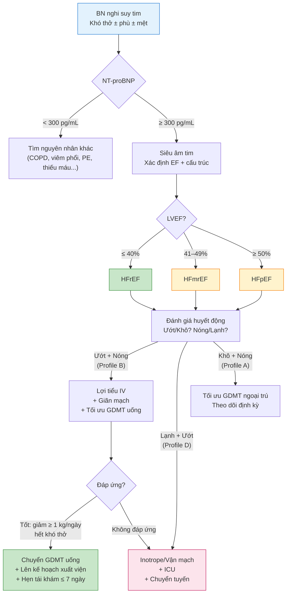

# BÀI HỌC Y KHOA: SUY TIM CẤP VÀ MẠN — CHẨN ĐOÁN, PHÂN LOẠI & ĐIỀU TRỊ THEO ESC 2021/2023 VÀ ACC/AHA 2022
**Ngày:** 2026-07-17 | **Chuyên khoa:** Nội khoa — Tim mạch | **Đối tượng:** Bác sĩ Nội khoa tuyến tỉnh, học viên sau đại học | **Mã curriculum:** IM-22

---

## 0. TỔNG QUAN — VÌ SAO BÀI NÀY QUAN TRỌNG?

Suy tim (heart failure — HF) là hội chứng lâm sàng phổ biến nhất trong Nội khoa tim mạch. Tại Việt Nam, bác sĩ tuyến tỉnh là người đầu tiên tiếp nhận bệnh nhân suy tim — từ đợt cấp mất bù đến quản lý mạn tính. Hai quyết định quan trọng nhất: (1) bệnh nhân này "ướt" (sung huyết) hay "khô", "nóng" (tưới máu tốt) hay "lạnh" (giảm tưới máu)? và (2) phân suất tống máu (ejection fraction — EF) là bao nhiêu? — vì điều này quyết định toàn bộ chiến lược thuốc nền (guideline-directed medical therapy — GDMT).

Bài này tổng hợp bốn nguồn hướng dẫn chính: **ESC 2021** [PMID 34447992], **ACC/AHA/HFSA 2022** [PMID 35363499], **ESC 2023 Focused Update** [PMID 37622666], và **Second Universal Definition of HF 2026** [PMID 42366997] — cộng với bằng chứng từ các thử nghiệm lâm sàng nền tảng: PARADIGM-HF, DAPA-HF, EMPEROR-Reduced, DELIVER, EMPEROR-Preserved.

**Mục tiêu của bài:**
- Phân biệt 4 kiểu hình huyết động (ướt/khô, nóng/lạnh) để ra quyết định điều trị ban đầu
- Phân loại HF theo EF (HFrEF, HFmrEF, HFpEF, HFimpEF) và hiểu ý nghĩa điều trị của từng loại
- Nắm vững "tứ trụ" GDMT cho HFrEF: ARNI/ACEi/ARB + chẹn beta + MRA + SGLT2i
- Biết khi nào dùng lợi tiểu, giãn mạch, vận mạch/inotrope trong suy tim cấp
- Nhận diện bệnh nhân cần chuyển tuyến chuyên khoa Tim mạch

---

### 📋 TRƯỚC KHI ĐỌC — BẠN CẦN NẮM CHẮC

> Để hiểu bài này, bạn nên đã biết:
> - Sinh lý huyết động cơ bản: cung lượng tim (CO), tiền tải (preload), hậu tải (afterload), sức co bóp (contractility)
> - Cách đọc ECG 12 chuyển đạo và X-quang ngực cơ bản (IM-05)
> - Tiếp cận bệnh nhân khó thở cấp và suy hô hấp (IM-07)
> - Các nhóm thuốc tim mạch cơ bản: ức chế men chuyển (ACEi), chẹn thụ thể angiotensin (ARB), chẹn beta, lợi tiểu
>
> Nếu chưa vững phần nào: quay lại bài IM-05, IM-07 trước, rồi đọc tiếp. Nếu đã nắm chắc: bỏ qua box này, mất 5 giây.

---

### 0.1 Nền tảng tối thiểu cần dùng ngay

Tim là bơm đưa máu đi (cung lượng tim) và nhận máu trở về. Khi bơm yếu hoặc buồng tim cứng, máu ứ phía sau gây **sung huyết**: khó thở, ran phổi, phù, tĩnh mạch cổ nổi. Khi máu đi ra không đủ, **giảm tưới máu** gây chi lạnh, lú lẫn, thiểu niệu hoặc tụt huyết áp. **EF (phân suất tống máu)** là tỷ lệ thể tích thất trái tống ra mỗi nhát bóp; nó mô tả một phần chức năng bơm, không tự chẩn đoán suy tim. **NT-proBNP** là dấu ấn căng thành tim, hữu ích khi ghép với khám và siêu âm. Điều trị ổn định dài hạn khác với đợt cấp: người bệnh giảm tưới máu/sốc cần hồi sức và chuyển ICU, không tăng thuốc ngoại trú.

> **Nguồn:** ESC HF 2021, PMID 34447992; ACC/AHA/HFSA 2022, PMID 35363499. [GUIDELINE VERIFIED]

## 1. ĐỊNH NGHĨA & PHÂN LOẠI SUY TIM [CỐT LÕI]

### 1.0 Nhắc nhanh: Sinh lý bơm của tim

> **Nguồn kiến thức nền:** TEXTBOOK: Braunwald's Heart Disease 12e, Ch.18-20; Guyton and Hall Textbook of Medical Physiology 14e, Ch.9, 20-22.

Tim là một bơm kép: thất phải bơm máu lên phổi trao đổi khí → thất trái bơm máu giàu oxy đi nuôi cơ thể. Khi tim không bơm đủ máu đáp ứng nhu cầu chuyển hóa của mô, hoặc chỉ bơm được khi áp lực đổ đầy tăng cao bất thường → đó là **suy tim**. Hậu quả: máu ứ lại phía sau tim (sung huyết phổi → khó thở; sung huyết hệ thống → phù, gan to, tĩnh mạch cổ nổi) và/hoặc tưới máu mô không đủ phía trước (mệt mỏi, thiểu niệu, lactate tăng).

### 1.1. Định nghĩa suy tim theo Universal Definition 2026

Theo **Second Universal Definition of Heart Failure (AHA/ACC/ESC/WHF 2026)** [PMID 42366997], suy tim được định nghĩa là một **hội chứng lâm sàng** với triệu chứng và/hoặc dấu hiệu gây ra bởi bất thường cấu trúc và/hoặc chức năng tim, dẫn đến:
- Tăng áp lực trong tim khi nghỉ hoặc khi gắng sức, và/hoặc
- Cung lượng tim không đủ.

Định nghĩa 2026 nhấn mạnh: suy tim **không phải là một chẩn đoán đơn lẻ** — nó là hội chứng có nhiều nguyên nhân (thiếu máu cục bộ, tăng huyết áp, bệnh van tim, bệnh cơ tim, rối loạn nhịp...). Phải tìm nguyên nhân.

### 1.2. Phân loại theo phân suất tống máu (EF)

**Bảng 1: Phân loại HF theo EF — ESC 2021 + Universal Definition 2026**

| Loại | EF | Đặc điểm chính |
|---|---|---|
| **HFrEF** (Heart Failure with reduced EF) | LVEF ≤ 40% | Có bằng chứng mạnh nhất cho GDMT. "Tứ trụ" bắt buộc |
| **HFmrEF** (Heart Failure with mildly reduced EF) | LVEF 41–49% | Evidence yếu hơn HFrEF nhưng SGLT2i + lợi tiểu có lợi ích. Có thể dùng ARNI/ACEi/ARB + MRA + chẹn beta |
| **HFpEF** (Heart Failure with preserved EF) | LVEF ≥ 50% | Điều trị chủ yếu: SGLT2i + lợi tiểu kiểm soát sung huyết + điều trị bệnh nền (THA, ĐTĐ, béo phì). ARNI/MRA có thể cân nhắc |
| **HFimpEF** (Heart Failure with improved EF) | LVEF trước ≤ 40% → sau > 40% và tăng ≥ 10 điểm % | Định nghĩa mới từ 2021-2026: bệnh nhân HFrEF đáp ứng điều trị. **KHÔNG ngừng GDMT** — EF cải thiện là nhờ thuốc, ngừng thuốc → EF tụt lại |

> ⚠️ HỌC VIÊN HAY NHẦM: "HFmrEF là HFpEF giai đoạn sớm" — **SAI**. HFmrEF có thể là HFrEF đang cải thiện hoặc HFpEF đang xấu đi, hoặc bệnh cơ tim riêng biệt. Điều trị phải cá thể hóa theo nguyên nhân và bệnh đồng mắc, không gộp chung.

### 🛑 DỪNG 1 PHÚT — TỰ KIỂM TRA

> 1. Một bệnh nhân trước đây LVEF 30%, sau 6 tháng điều trị LVEF lên 45%. Phân loại bây giờ là gì? Có nên ngừng thuốc không?
> 2. HFmrEF và HFpEF khác nhau thế nào về mặt EF?
>
> *(Đáp án: 1. HFimpEF — KHÔNG ngừng GDMT vì EF cải thiện là nhờ thuốc, ngừng thuốc sẽ tụt lại. 2. HFmrEF: LVEF 41–49%, HFpEF: LVEF ≥ 50%.)*

---

## 2. SINH LÝ BỆNH & PHÂN LOẠI HUYẾT ĐỘNG [CỐT LÕI]

> **Nguồn kiến thức nền:** ESC 2021 Guideline [PMID 34447992], ACC/AHA 2022 [PMID 35363499], Braunwald's Heart Disease 12e Ch.20.

### 2.1. Cơ chế bù trừ — con dao hai lưỡi

Khi cung lượng tim giảm, cơ thể kích hoạt các cơ chế bù trừ thần kinh — thể dịch:

- **Hệ giao cảm (SNS):** ↑ nhịp tim, ↑ sức co bóp, co mạch ngoại vi → duy trì huyết áp. Nhưng co mạch kéo dài → ↑ hậu tải, ↑ công tim, ↓ tưới máu thận.
- **Hệ RAAS (Renin–Angiotensin–Aldosterone System):** ↓ tưới máu thận → tiết renin → angiotensin II → co mạch + giữ Na⁺/nước (aldosterone) → ↑ tiền tải. Nhưng giữ Na⁺/nước quá mức → sung huyết.
- **Hệ vasopressin (ADH) + endothelin:** giữ nước thêm, co mạch thêm.

**Nguyên lý nền tảng:** Tất cả thuốc GDMT cho HFrEF đều nhắm vào **phong tỏa các cơ chế bù trừ có hại này** (ức chế RAAS + ức chế SNS) — chứ không phải chỉ "tăng sức bóp" như suy nghĩ cũ.

### 2.2. Phân loại huyết động — công cụ tại giường

Phân loại của **Stevenson/Nohria** (được ESC và ACC/AHA áp dụng) dựa trên 2 trục:

```
                    ┌─────────────────────────────────┐
                    │       TƯỚI MÁU (Perfusion)       │
                    ├─────────────────┬───────────────┤
                    │     NÓNG        │     LẠNH      │
                    │  (Warm)         │   (Cold)      │
┌───────────────────┼─────────────────┼───────────────┤
│       KHÔ         │   A — Ấm & Khô  │  C — Lạnh &  │
│      (Dry)        │   (bù)          │    Khô        │
├───────────────────┼─────────────────┼───────────────┤
│       ƯỚT         │   B — Ấm & Ướt  │  D — Lạnh &  │
│      (Wet)        │  (mất bù điển   │    Ướt        │
│                   │    hình)        │  (sốc tim)    │
└───────────────────┴─────────────────┴───────────────┘
```

**Đánh giá nhanh tại giường:**

| Dấu hiệu | "Ướt" (sung huyết) | "Lạnh" (giảm tưới máu) |
|---|---|---|
| **Triệu chứng** | Khó thở khi nằm (orthopnea), PND, phù 2 chi dưới | Mệt lả, lú lẫn, thiểu niệu |
| **Khám** | JVP nổi, ran phổi, gan to, phù, báng bụng | Chi lạnh ẩm, CRT > 2s, HATT < 90 mmHg, mạch yếu |
| **XN** | NT-proBNP ↑↑, X-quang: phù phổi, tràn dịch màng phổi | Lactate ↑, creatinine ↑, ALT/AST ↑, toan chuyển hóa |

**Xử trí ban đầu theo kiểu hình:**

| Profile | Chiến lược chính |
|---|---|
| **A — Ấm & Khô** | Đã bù. Tối ưu GDMT đường uống. Không cần lợi tiểu IV |
| **B — Ấm & Ướt** | Lợi tiểu IV + giãn mạch. Đây là kiểu hình mất bù phổ biến nhất |
| **C — Lạnh & Khô** | Thử dịch nhẹ nhàng (bolus 250 mL). Nếu không đáp ứng: cân nhắc inotrope. **Hiếm gặp** |
| **D — Lạnh & Ướt** | Sốc tim: inotrope + vận mạch + ICU. **Chuyển tuyến ngay** |

> ⚠️ HỌC VIÊN HAY NHẦM: "Bệnh nhân suy tim phải kiêng nước tuyệt đối" — **SAI**. Bệnh nhân suy tim mạn đã bù (profile A) không cần hạn chế nước nghiêm ngặt. Hạn chế nước (1.5–2 L/ngày) chỉ cho bệnh nhân có hạ natri máu pha loãng hoặc sung huyết kháng trị.

---

### BOX ĐỎ — khi phải rời nhánh thường quy

> **Giảm oxy máu, phù phổi cấp, chi lạnh/thiểu niệu/lú lẫn/tụt huyết áp, loạn nhịp ác tính, nghi ACS hoặc biến chứng cơ học → nguy cơ suy hô hấp/sốc tim → ABCDE, monitor, hồi sức và chuyển ICU/tim mạch ngay.** Không khởi hoặc tăng GDMT ngoại trú trong khi chưa ổn định.

## 3. CHẨN ĐOÁN [CỐT LÕI]

### 3.1. Lâm sàng — triệu chứng và dấu hiệu

**Triệu chứng cơ năng (độ nhạy cao, độ đặc hiệu thấp):**
- Khó thở khi gắng sức (triệu chứng sớm nhất và phổ biến nhất)
- Khó thở khi nằm (orthopnea) — hỏi bệnh nhân "bác ngủ mấy gối?"
- Khó thở kịch phát về đêm (paroxysmal nocturnal dyspnea — PND)
- Mệt mỏi, giảm khả năng gắng sức
- Phù hai chi dưới, tăng cân nhanh

**Dấu hiệu thực thể (độ đặc hiệu cao hơn):**
- Tĩnh mạch cổ nổi (JVP ↑) — dấu hiệu quan trọng nhất của tăng áp lực đổ đầy thất phải
- Phản hồi gan — tĩnh mạch cổ (hepatojugular reflux — HJR): ấn gan 10 giây → JVP tăng > 1 cm và duy trì
- Ran ẩm ở phổi (rales), có thể kèm wheezing ("hen tim" — cardiac asthma)
- Tim nhanh, gallop T3 (dấu hiệu đặc hiệu nhưng khó phát hiện)
- Mỏm tim lệch trái (dãn thất trái), mỏm tim lan tỏa
- Phù ấn lõm hai chi dưới, nặng có thể phù toàn thân (anasarca), báng bụng
- Chi lạnh, CRT kéo dài (nếu giảm tưới máu)

### 3.2. Cận lâm sàng

#### NT-proBNP / BNP — xét nghiệm quyết định

| NT-proBNP | Diễn giải |
|---|---|
| **< 300 pg/mL** | Suy tim KHÓ xảy ra. Tìm nguyên nhân khác gây khó thở |
| **300–1800 pg/mL** | Vùng xám. Cần siêu âm tim. Lưu ý: tuổi, béo phì (↓), suy thận (↑), rung nhĩ (↑) ảnh hưởng giá trị |
| **> 1800 pg/mL** | Suy tim RẤT CÓ KHẢ NĂNG. Siêu âm tim cấp |

Theo ESC 2021: rule-out cut-off cho suy tim mạn không cấp tính: NT-proBNP < 125 pg/mL hoặc BNP < 35 pg/mL [PMID 34447992].

#### Siêu âm tim — tiêu chuẩn vàng chẩn đoán

> **Kiến thức nền:** Xem bài IM Siêu âm tim Nội khoa để biết chi tiết các mặt cắt và chỉ số.

Các chỉ số cần báo cáo trong siêu âm tim cho bệnh nhân nghi suy tim:

- **LVEF (%)** — Simpson's biplane method là tiêu chuẩn
- **Kích thước và thể tích thất trái** (LVEDD, LVESD, LVEDV, LVESV)
- **Chức năng thất phải** (TAPSE, RV S')
- **Áp lực động mạch phổi tâm thu** (PAPs ước tính từ hở van 3 lá)
- **Bất thường van tim** (hở/hẹp van hai lá, van động mạch chủ)
- **Rối loạn vận động vùng** (gợi ý bệnh mạch vành)
- **Dấu hiệu tăng áp lực đổ đầy:** E/e' > 14, thể tích nhĩ trái ↑, vận tốc hở van 3 lá > 2.8 m/s

#### Xét nghiệm khác

- **Công thức máu:** thiếu máu → nặng thêm suy tim
- **Điện giải, creatinine, eGFR:** trước khi dùng ACEi/ARB/ARNI/MRA
- **Men gan:** ứ máu gan do suy tim phải
- **TSH:** cường giáp / suy giáp đều có thể gây suy tim
- **Ferritin + TSAT:** thiếu sắt (iron deficiency) gặp ở ~50% bệnh nhân HF, có thể điều trị bằng iron IV
- **ECG:** phát hiện rung nhĩ, block nhánh trái (LBBB — có thể chỉ định CRT), sóng Q cũ (NMCT cũ), dày thất
- **X-quang ngực:** bóng tim to (cardiothoracic ratio > 0.5), phù phổi, tràn dịch màng phổi

### 3.3. Chẩn đoán phân biệt

| Bệnh | Giống | Khác — điểm quyết định |
|---|---|---|
| **COPD đợt cấp** | Khó thở, ran phổi, wheezing | NT-proBNP thấp, X-quang: ứ khí, không có phù phổi, tiền sử hút thuốc. Siêu âm tim bình thường |
| **Viêm phổi nặng** | Khó thở, ran phổi, sốt | Sốt cao, đờm mủ, bạch cầu tăng. NT-proBNP bình thường hoặc tăng nhẹ. X-quang có đông đặc khu trú |
| **Thuyên tắc phổi cấp** | Khó thở khởi phát đột ngột, nhịp tim nhanh | Yếu tố nguy cơ VTE. Siêu âm tim: dãn thất phải cấp, dấu 60/60 hoặc McConnell. NT-proBNP có thể tăng |
| **Bệnh thận mạn — quá tải dịch** | Phù, khó thở, JVP nổi | Siêu âm tim: chức năng tim bình thường, không tăng áp lực đổ đầy trái. Thiểu niệu, creatinine ↑↑ |
| **Suy gan mất bù** | Báng bụng, phù, mệt | Không có JVP nổi (trừ khi kèm suy tim phải), siêu âm tim bình thường. Albumin ↓, INR ↑, tiểu cầu ↓ |

> ⚠️ HỌC VIÊN HAY NHẦM: "NT-proBNP tăng nhẹ (400–800) ở bệnh nhân suy thận mạn là do suy tim" — **SAI**. Suy thận làm giảm thanh thải BNP → NT-proBNP nền cao hơn dân số chung. Dùng ngưỡng điều chỉnh: eGFR < 60 → NT-proBNP < 1200 pg/mL vẫn có thể không phải suy tim. Luôn kết hợp siêu âm tim.

---

### 🛑 DỪNG 1 PHÚT — TỰ KIỂM TRA

> 1. Bệnh nhân 68 tuổi, khó thở 1 tuần, phù 2 chi dưới, JVP nổi 6 cm, HJR (+), ran ẩm 2 đáy phổi. NT-proBNP = 4500 pg/mL. Profile huyết động? Cần xét nghiệm thêm gì?
>
> *(Đáp án: Profile B (Ấm & Ướt). Cần: siêu âm tim cấp, ECG, X-quang ngực, creatinine/điện giải, men gan, TSH, công thức máu.)*

---

## 4. EVIDENCE & GUIDELINES [CỐT LÕI]

### 4.1. ESC 2021 & 2023 Focused Update — Khung điều trị châu Âu

**Nguồn:** McDonagh TA et al., Eur Heart J 2021 [PMID 34447992]; 2023 Focused Update [PMID 37622666]. [GUIDELINE VERIFIED]

**Khuyến cáo chính:**
- HFrEF: "Tứ trụ" GDMT gồm ARNI/ACEi + chẹn beta + MRA + SGLT2i (Class I)
- HFmrEF: SGLT2i (dapagliflozin/empagliflozin) Class I; ARNI/ACEi/ARB + MRA + chẹn beta Class IIb
- HFpEF: SGLT2i Class I. Kiểm soát sung huyết bằng lợi tiểu. Điều trị tích cực bệnh nền
- ESC 2023 Focused Update không thay đổi cấu trúc chính, bổ sung khuyến cáo mạnh hơn cho SGLT2i trên HFmrEF/HFpEF dựa trên DELIVER và EMPEROR-Preserved

### 4.2. ACC/AHA/HFSA 2022 — Khung điều trị Hoa Kỳ

**Nguồn:** Heidenreich PA et al., Circulation 2022 [PMID 35363499]. [GUIDELINE VERIFIED]

**Điểm khác biệt chính với ESC 2021:**
- Phân loại HF theo giai đoạn A–D (giống ESC) + ACC/AHA nhấn mạnh "value statements" (phân tích chi phí–hiệu quả)
- ACC/AHA 2022 phân cấp GDMT: ARNI được ưu tiên hơn ACEi/ARB (Class I, LOE A cho ARNI — thay vì khuyến cáo tuần tự như ESC)
- SGLT2i Class I cho HFmrEF và HFpEF (LOE A) — thay đổi so với ESC 2021 (ESC cập nhật trong 2023)

### 4.3. Universal Definition of HF 2026 — Định nghĩa toàn cầu

**Nguồn:** Walsh MN et al., Circulation 2026 [PMID 42366997]. [GUIDELINE VERIFIED]

**Điểm mới quan trọng:**
- Loại bỏ "HFmrEF" như một phân loại EF riêng biệt cứng nhắc, thay bằng cách tiếp cận theo quỹ đạo (trajectory-based): HFrEF → HFimpEF → remission/recovery
- Bổ sung phân loại nguyên nhân HF toàn cầu (universal classification of HF causes)
- Nhấn mạnh yếu tố xã hội (social determinants) và khác biệt địa lý
- HFpEF vẫn giữ LVEF ≥ 50%, nhưng nhấn mạnh cần bằng chứng khách quan của tăng áp lực đổ đầy

### 4.4. Bằng chứng từ các thử nghiệm lâm sàng nền tảng

**PARADIGM-HF (2014) — Sacubitril/valsartan vs enalapril** [PMID 25176015]:
- 8442 bệnh nhân HFrEF, theo dõi trung vị 27 tháng
- Tiêu chí chính (CV death + HF hospitalization): HR 0.80 (95% CI 0.73–0.87). **Dừng sớm vì hiệu quả vượt trội**
- Đây là thử nghiệm đưa ARNI thành nền tảng GDMT

**DAPA-HF (2019) — Dapagliflozin ở HFrEF** [PMID 31997538 được trích trong meta-analysis 32877652]:
- 4744 bệnh nhân HFrEF, dapagliflozin 10 mg vs placebo
- CV death + worsening HF: HR 0.74 (95% CI 0.65–0.85). **Có lợi cả ở bệnh nhân KHÔNG đái tháo đường**
- Đây là thử nghiệm đưa SGLT2i thành trụ cột thứ tư của GDMT

**Meta-analysis DAPA-HF + EMPEROR-Reduced (2020)** [PMID 32877652]:
- Tổng 8474 bệnh nhân HFrEF từ 2 thử nghiệm
- All-cause death: HR 0.87 (95% CI 0.77–0.98; p=0.018). CV death: HR 0.86 (0.76–0.98; p=0.027)
- CV death + first HF hospitalization: HR 0.74 (0.68–0.82; p<0.0001)
- Kết luận: SGLT2i có lợi nhất quán trên tử vong tim mạch, nhập viện do suy tim, và kết cục thận ở HFrEF

**Comprehensive GDMT — phân tích chéo 3 thử nghiệm (2020)** [PMID 32446323]:
- ARNI + chẹn beta + MRA + SGLT2i so với ACEi/ARB + chẹn beta
- CV death + HF hospitalization: HR 0.38 (95% CI 0.30–0.47)
- All-cause mortality: HR 0.53 (0.40–0.70)
- Lợi ích sống thêm: 2.7 năm (bệnh nhân 80 tuổi) đến 8.3 năm (55 tuổi) không có biến cố
- **Đây là bằng chứng mạnh nhất ủng hộ việc dùng cả 4 nhóm thuốc càng sớm càng tốt**

**DELIVER + EMPEROR-Preserved — SGLT2i ở HFmrEF/HFpEF (2022)** [PMID 36041474]:
- Meta-analysis 5 thử nghiệm (21,947 bệnh nhân): DAPA-HF, EMPEROR-Reduced, DELIVER, EMPEROR-Preserved, SOLOIST-WHF
- HFmrEF/HFpEF: CV death + HF hospitalization: HR 0.80 (95% CI 0.73–0.87)
- Toàn bộ 5 thử nghiệm: CV death: HR 0.87 (0.79–0.95), HF hospitalization: HR 0.72 (0.67–0.78), all-cause mortality: HR 0.92 (0.86–0.99)
- **Kết luận nền tảng: SGLT2i có lợi trên TOÀN BỘ phổ EF**

> ⚠️ **NHỚ**: Mọi số liệu cụ thể (RR, CI, %, n=) phải fetch abstract + gắn tag `[FULL VERIFIED]`.

---

## 5. ĐIỀU TRỊ SUY TIM MẠN — GDMT THEO EF [CỐT LÕI]

### 5.1. HFrEF (LVEF ≤ 40%) — "Tứ trụ" GDMT

Bốn nhóm thuốc nền tảng, KHÔNG thay thế nhau, phải phối hợp:

| # | Nhóm thuốc | Ví dụ (liều mục tiêu) | Cơ chế | Bằng chứng chính |
|---|---|---|---|---|
| 1 | **ARNI** (ưu tiên) hoặc **ACEi/ARB** | Sacubitril/valsartan 97/103 mg × 2/ngày; Enalapril 10 mg × 2/ngày | Ức chế RAAS + tăng cường peptide lợi niệu natri | PARADIGM-HF: ↓ 20% CV death + HF hospitalization |
| 2 | **Chẹn beta** | Bisoprolol 10 mg/ngày; Carvedilol 25 mg × 2/ngày; Metoprolol succinate 200 mg/ngày | Ức chế SNS, ↓ nhịp tim, ↓ tiêu thụ oxy cơ tim | MERIT-HF, CIBIS-II, COPERNICUS: ↓ 34% tử vong |
| 3 | **MRA** | Spironolactone 25–50 mg/ngày; Eplerenone 50 mg/ngày | Ức chế aldosterone, chống xơ hóa cơ tim | RALES: ↓ 30% tử vong; EMPHASIS-HF: ↓ 37% CV death + HF hospitalization |
| 4 | **SGLT2i** | Dapagliflozin 10 mg/ngày; Empagliflozin 10 mg/ngày | Lợi niệu thẩm thấu nhẹ + chuyển hóa cơ tim + bảo vệ thận | DAPA-HF: ↓ 26% CV death + worsening HF; EMPEROR-Reduced: ↓ 25% |

**Nguyên tắc khởi trị và chuẩn độ (titration):**

1. **Bắt đầu cùng lúc cả 4 nhóm** ở liều thấp, thay vì tuần tự từng thuốc. ESC 2021 khuyến cáo khởi trị song song để đạt lợi ích sớm nhất.
2. **Chuẩn độ lên liều mục tiêu mỗi 2–4 tuần** — kiểm tra HA, creatinine/K⁺ trước mỗi lần tăng liều.
3. **Thứ tự ưu tiên nếu bệnh nhân không dung nạp tất cả:**
   - HATT thấp: bắt đầu với SGLT2i + chẹn beta liều thấp (ít ảnh hưởng HA nhất), sau đó thêm MRA, sau cùng ARNI/ACEi
   - K⁺ cao: tránh MRA cho đến khi kiểm soát được K⁺; ưu tiên ARNI + chẹn beta + SGLT2i
   - eGFR thấp (20–30 mL/min): SGLT2i + chẹn beta an toàn nhất; thận trọng với ARNI/ACEi, cân nhắc MRA
4. **Theo dõi bắt buộc:** creatinine, K⁺ sau 1–2 tuần từ mỗi lần tăng liều ACEi/ARB/ARNI/MRA. Không cần theo dõi thường quy cho SGLT2i (eGFR giảm nhẹ ban đầu là bình thường — "eGFR dip" ~10%, sau đó ổn định).

**Chống chỉ định chính:**

| Nhóm thuốc | CCĐ tuyệt đối |
|---|---|
| ARNI/ACEi/ARB | Hẹp động mạch thận 2 bên, phù mạch tiền sử, K⁺ > 5.5, thai kỳ |
| Chẹn beta | Hen phế quản nặng (ưu tiên cardioselective: bisoprolol, metoprolol), block AV độ 2–3 (không có pacemaker), nhịp chậm có triệu chứng |
| MRA | K⁺ > 5.0, eGFR < 30 mL/min |
| SGLT2i | eGFR < 20 mL/min (dapagliflozin); ĐTĐ type 1; nhiễm toan ceton tiền sử |

### 5.2. HFmrEF (LVEF 41–49%) và HFpEF (LVEF ≥ 50%)

**SGLT2i là nền tảng (Class I) — ESC 2023 / ACC 2022:**
- Dapagliflozin 10 mg/ngày hoặc Empagliflozin 10 mg/ngày
- Meta-analysis 5 thử nghiệm [PMID 36041474]: ↓ 20% CV death + HF hospitalization ở HFmrEF/HFpEF (HR 0.80; 95% CI 0.73–0.87)

**Lợi tiểu:**
- Furosemide/torsemide/bumetanide: kiểm soát triệu chứng sung huyết. KHÔNG cải thiện sống còn
- Dùng liều thấp nhất có hiệu quả. Có thể ngừng khi bệnh nhân hết sung huyết và ổn định
- Theo dõi: cân nặng mỗi ngày, creatinine, điện giải

**Điều trị bệnh đồng mắc — QUAN TRỌNG trong HFpEF:**
- Kiểm soát huyết áp chặt (mục tiêu < 130/80 mmHg)
- Điều trị đái tháo đường (SGLT2i vừa kiểm soát đường huyết vừa điều trị HF)
- Giảm cân nếu BMI > 30
- Điều trị rung nhĩ (kiểm soát tần số hoặc chuyển nhịp)
- Sắt tĩnh mạch nếu thiếu sắt (ferritin < 100 ng/mL hoặc ferritin 100–299 + TSAT < 20%)
- ARNI và MRA có thể cân nhắc (Class IIb) dựa trên phân tích subgroup của PARAGON-HF và TOPCAT

### 5.3. Các liệu pháp bổ sung cho HFrEF chọn lọc

| Liệu pháp | Chỉ định | Bằng chứng |
|---|---|---|
| **Ivabradine** | Nhịp xoang ≥ 70 bpm dù đã dùng chẹn beta liều tối đa | SHIFT trial: ↓ 18% CV death + HF hospitalization |
| **Hydralazine + ISDN** | Bệnh nhân da đen (African-American) hoặc không dung nạp ACEi/ARB/ARNI | A-HeFT trial |
| **Digoxin** | HFrEF + rung nhĩ (kiểm soát tần số). Có thể cân nhắc ở nhịp xoang nếu vẫn triệu chứng dù GDMT tối đa | DIG trial: ↓ HF hospitalization nhưng KHÔNG ↓ tử vong |
| **Vericiguat** | HFrEF nặng, NYHA II–IV, EF < 45%, NT-proBNP tăng dù GDMT tối đa, có đợt mất bù gần đây | VICTORIA trial: ↓ 10% CV death + HF hospitalization |
| **Sắt IV (FCM)** | TSAT < 20% + ferritin < 100 (hoặc 100–299 nếu có triệu chứng) | AFFIRM-AHF, IRONMAN: ↓ HF hospitalization, cải thiện QoL |
| **CRT (tạo nhịp tái đồng bộ tim)** | LBBB + QRS ≥ 150 ms + EF ≤ 35% dù GDMT tối ưu | CARE-HF, MADIT-CRT |
| **ICD** | EF ≤ 35% dù GDMT ≥ 3 tháng, tiên lượng sống > 1 năm | SCD-HeFT, MADIT-II |

---

## 6. ĐIỀU TRỊ SUY TIM CẤP MẤT BÙ [CỐT LÕI]

> **Nguồn:** ESC HF 2021, PMID 34447992. [GUIDELINE VERIFIED]

### 6.1 Nguyên tắc an toàn

Đợt suy tim cấp là tình huống điều trị có monitor. Làm ABCDE, xác định sung huyết và tưới máu, tìm yếu tố khởi phát (ACS, loạn nhịp, nhiễm trùng, tăng huyết áp, thuốc, quá tải dịch) và điều trị tại cơ sở có khả năng theo dõi thích hợp. Lợi tiểu, giãn mạch, hỗ trợ hô hấp, inotrope và vận mạch đều có chỉ định/chống chỉ định và liều phụ thuộc huyết động, thận, điện giải và protocol ICU địa phương đã xác minh.

### 6.2 Chọn nơi điều trị theo phenotype

| Phenotype | Hành động an toàn |
|---|---|
| Sung huyết nhưng tưới máu tốt | Điều trị giảm sung huyết có monitor, theo dõi lâm sàng–dịch–điện giải theo protocol cơ sở. |
| Giảm tưới máu hoặc sốc | Hồi sức/ICU và tim mạch khẩn; không tự thiết lập inotrope hoặc vận mạch khi thiếu protocol và năng lực theo dõi. |
| Giảm oxy/phù phổi | Hỗ trợ hô hấp và đánh giá cấp cứu theo năng lực; chuyển ICU nếu không ổn định hoặc không đáp ứng. |
| Không chắc phenotype/thiếu siêu âm–xét nghiệm | Không thay thế bằng tăng GDMT uống; giữ theo dõi và chuyển đánh giá. |

### 6.3 Sau ổn định

Chỉ khởi hoặc tối ưu GDMT mạn sau khi huyết động ổn và có kế hoạch kiểm creatinine, kali, huyết áp, nhịp, triệu chứng và tái khám. Người bệnh không đáp ứng, tái mất bù, nghi ACS/biến chứng cơ học hoặc cần thuốc ICU phải chuyển tuyến.


---

## 7. LƯU ĐỒ QUYẾT ĐỊNH LÂM SÀNG [CỐT LÕI]


### Diễn giải lưu đồ từng bước

1. Khó thở/phù chỉ khởi đầu đánh giá; giảm oxy, giảm tưới máu hoặc rối loạn ý thức đi BOX ĐỎ trước khi lấy NT-proBNP.
2. NT-proBNP thấp có thể hướng tìm nguyên nhân khác nhưng không thay thế đánh giá lâm sàng. Khi xét nghiệm/siêu âm không có, giữ người bệnh được theo dõi, tìm nguyên nhân nguy hiểm và chuyển nếu nghi suy tim cấp.
3. EF định hướng kiểu hình, sau đó khám sung huyết và tưới máu quyết định nơi chăm sóc. “Nóng/ướt” cần decongestion có monitor; “lạnh/ướt” là nguy cơ sốc, cần ICU/chuyển tuyến chứ không chỉ tăng lợi tiểu hay GDMT uống.
4. Đáp ứng được đánh giá bằng triệu chứng, tưới máu, dịch vào-ra và xét nghiệm theo protocol cơ sở. Không đáp ứng, xấu đi hoặc không có năng lực theo dõi là nhánh chuyển tuyến.


---

## 8. SAI LẦM THƯỜNG GẶP — LÂM SÀNG [CỐT LÕI]

| # | Sai lầm | Hậu quả | Cách tránh |
|---|---|---|---|
| 1 | Không đo NT-proBNP trước khi cho lợi tiểu | Điều trị lợi tiểu cho bệnh nhân không suy tim (COPD, viêm phổi...) → mất nước, tụt HA, suy thận cấp | NT-proBNP luôn là xét nghiệm đầu tiên khi nghi suy tim |
| 2 | Ngừng GDMT khi bệnh nhân vào viện vì suy tim mất bù | Mất cơ hội tối ưu thuốc, EF tụt, tái nhập viện sớm | Chỉ tạm ngừng nếu có CCĐ cấp (sốc, K⁺ > 5.5, suy thận cấp nặng). Tiếp tục các thuốc còn lại |
| 3 | Dùng inotrope cho profile B (ấm & ướt) | Tăng tử vong, loạn nhịp. Không có chỉ định! | Inotrope chỉ cho profile C và D. Profile B dùng lợi tiểu + giãn mạch |
| 4 | Không chuẩn độ GDMT lên liều mục tiêu — chỉ giữ liều thấp "cho an toàn" | Mất > 50% lợi ích sống còn. Liều thấp GDMT = evidence không đầy đủ | Chuẩn độ lên liều mục tiêu trong mọi trường hợp dung nạp được. Mỗi 2–4 tuần tăng 1 bậc |
| 5 | Coi HFmrEF và HFpEF là "nhẹ hơn" HFrEF — không điều trị gì ngoài lợi tiểu | Bỏ lỡ SGLT2i → tăng nhập viện, tăng tử vong tim mạch | SGLT2i Class I cho HFmrEF và HFpEF! Điều trị bệnh nền tích cực |
| 6 | Ngừng SGLT2i khi eGFR giảm nhẹ lúc khởi trị | Mất lợi ích bảo vệ thận dài hạn. "eGFR dip" ~10% là hiện tượng huyết động lành tính | Chỉ ngừng SGLT2i nếu eGFR giảm > 30% kéo dài hoặc có nguyên nhân khác (tắc nghẽn, thuốc độc thận) |
| 7 | Cho bệnh nhân suy tim ổn định hạn chế nước < 1 L/ngày | Hạ natri máu, suy thận trước thận, chất lượng sống kém, không cải thiện kết cục | Hạn chế nước 1.5–2 L/ngày chỉ khi có hạ natri pha loãng (Na⁺ < 130) hoặc sung huyết kháng trị |

---

## 9. BẢNG THUỐC VÀ LIỀU DÙNG [THAM KHẢO]

### 9.1. GDMT cho HFrEF — liều khởi đầu và liều mục tiêu

| Thuốc | Liều khởi đầu | Liều mục tiêu | Tần suất chuẩn độ | XN theo dõi |
|---|---|---|---|---|
| **Sacubitril/valsartan (ARNI)** | 24/26 mg × 2 | 97/103 mg × 2 | Mỗi 2–4 tuần | Creatinine, K⁺, HA |
| **Enalapril (ACEi)** | 2.5 mg × 2 | 10–20 mg × 2 | Mỗi 2 tuần | Creatinine, K⁺, HA |
| **Ramipril (ACEi)** | 2.5 mg × 1 | 5 mg × 2 | Mỗi 2 tuần | Creatinine, K⁺, HA |
| **Candesartan (ARB)** | 4 mg × 1 | 32 mg × 1 | Mỗi 2 tuần | Creatinine, K⁺, HA |
| **Bisoprolol (chẹn beta)** | 1.25 mg × 1 | 10 mg × 1 | Mỗi 2 tuần | HA, nhịp tim, triệu chứng |
| **Carvedilol (chẹn beta)** | 3.125 mg × 2 | 25 mg × 2 | Mỗi 2 tuần | HA, nhịp tim |
| **Metoprolol succinate** | 12.5–25 mg × 1 | 200 mg × 1 | Mỗi 2 tuần | HA, nhịp tim |
| **Spironolactone (MRA)** | 25 mg × 1 | 25–50 mg × 1 | Mỗi 4 tuần | K⁺, creatinine (ngày 3, 7, 14, 28 sau khởi trị) |
| **Eplerenone (MRA)** | 25 mg × 1 | 50 mg × 1 | Mỗi 4 tuần | K⁺, creatinine |
| **Dapagliflozin (SGLT2i)** | 10 mg × 1 | 10 mg × 1 | Không cần chuẩn độ | eGFR (theo dõi định kỳ, không cần sau mỗi liều) |
| **Empagliflozin (SGLT2i)** | 10 mg × 1 | 10 mg × 1 | Không cần chuẩn độ | eGFR |


---

## 10. ÁP DỤNG TẠI VIỆT NAM [CỐT LÕI]

### Plan A — nguồn lực đầy đủ

- Cơ sở có monitor, xét nghiệm, siêu âm tim, ICU và tim mạch: xác định sung huyết/tưới máu, tìm yếu tố khởi phát, điều trị đợt cấp và khởi/tối ưu GDMT theo guideline cùng protocol cơ sở.
- Tất cả liều IV, tốc độ truyền, mục tiêu thời gian và dùng thuốc vận mạch phải theo protocol ICU đã xác minh; bài này không thay thế protocol đó.

### Plan B — tuyến hạn chế nguồn lực

- **Làm ngay được:** ABCDE, oxy hóa/monitor theo năng lực, khám sung huyết–tưới máu, ECG, xét nghiệm cơ bản và liên hệ chuyển tuyến; duy trì thuốc mạn an toàn chỉ sau khi người bệnh ổn định và có kế hoạch theo dõi.
- **Không được suy diễn/thay thế:** thiếu NT-proBNP/siêu âm không loại trừ suy tim; không có ICU không được thay thế inotrope, vận mạch, NIV hoặc theo dõi xâm lấn bằng tăng thuốc uống.
- **Chuyển:** giảm oxy, chi lạnh/thiểu niệu/lú lẫn, tụt huyết áp, loạn nhịp, nghi ACS/biến chứng cơ học, hoặc không đáp ứng điều trị ban đầu → ICU/tim mạch cấp cứu.

> **Nguồn:** ESC HF 2021, PMID 34447992; ACC/AHA/HFSA 2022, PMID 35363499. [GUIDELINE VERIFIED]
> **Cách đọc đáp án cho từng case:** (1) **Nhận diện cấp cứu/nguy cơ**; (2) **Dữ kiện quyết định**; (3) **Hành động ngay**; (4) **Theo dõi hoặc chuyển tuyến**; (5) **Vì sao không chọn phương án khác**. Các thao tác ICU trong case chỉ được thực hiện theo protocol địa phương.

## 11. CASE LÂM SÀNG [NÂNG CAO]

### Case 1: Suy tim mất bù mới chẩn đoán

**Bệnh nhân:** Nam 62 tuổi, khó thở khi nằm 3 ngày, phù 2 chi dưới 1 tuần, tăng 5 kg. Tiền sử: tăng huyết áp 10 năm không điều trị đều. Khám: HATT 160/95 mmHg, nhịp tim 105 lần/phút đều, SpO₂ 88% (khí phòng), JVP nổi 8 cm, ran ẩm 2 đáy phổi, phù ấn lõm đến gối. NT-proBNP: 6800 pg/mL. Siêu âm tim: LVEF 32%, dãn thất trái, hở van 2 lá nhẹ, không rối loạn vận động vùng.

**Câu hỏi:** (1) Phân loại huyết động của bệnh nhân này? (2) Kế hoạch điều trị trong 24 giờ đầu và GDMT lâu dài?

*(Gợi ý trả lời: (1) Profile B (ấm & ướt) — sung huyết nặng nhưng tưới máu còn tốt. (2) 24h đầu: CPAP nếu cần + furosemide IV 40 mg + nitroglycerin IV (HA còn cao). Sau ổn định: khởi trị sacubitril/valsartan 24/26 mg × 2 (nếu có) hoặc enalapril 2.5 mg × 2 + carvedilol 3.125 mg × 2 + spironolactone 25 mg + dapagliflozin 10 mg. Chuẩn độ mỗi 2 tuần. Xuất viện khi hết sung huyết, hẹn tái khám 7 ngày.)*

### Case 2: Suy tim mạn HFpEF ở bệnh nhân béo phì

**Bệnh nhân:** Nữ 70 tuổi, BMI 34, ĐTĐ type 2, tăng huyết áp. Khó thở khi gắng sức (NYHA II), phù nhẹ 2 chi dưới chiều tối. NT-proBNP: 540 pg/mL. Siêu âm tim: LVEF 58%, dày thất trái, E/e' = 16, thể tích nhĩ trái 42 mL/m². Đang dùng metformin + gliclazide + amlodipine 5 mg.

**Câu hỏi:** Kế hoạch điều trị? Có chỉ định SGLT2i không?

*(Gợi ý trả lời: Chẩn đoán HFpEF dựa trên triệu chứng + NT-proBNP tăng + dấu hiệu tăng áp lực đổ đầy trên siêu âm tim (E/e' > 14, LA volume tăng). Điều trị: (1) Thêm dapagliflozin 10 mg (Class I — vừa điều trị HFpEF vừa kiểm soát ĐTĐ tốt hơn). (2) Furosemide 20 mg uống buổi sáng nếu còn phù. (3) Tối ưu kiểm soát HA: đổi sang ARNI nếu HA chưa đạt mục tiêu (loại bỏ amlodipine nếu không cần). (4) Tư vấn giảm cân, hạn chế muối < 5 g/ngày. (5) Theo dõi NT-proBNP mỗi 3–6 tháng.)*

---

## 12. TIPS THỰC HÀNH (CLINICAL PEARLS) [THAM KHẢO]

1. Hỏi bệnh nhân suy tim "bác ngủ mấy gối?" — câu hỏi đơn giản nhưng cực kỳ giá trị để theo dõi sung huyết phổi.
2. JVP là dấu hiệu thực thể quan trọng nhất trong suy tim. Luôn khám JVP ở bệnh nhân nghi suy tim.
3. Cân nặng hàng ngày là công cụ theo dõi đơn giản nhất. Bệnh nhân tăng > 2 kg trong 3 ngày: báo động đỏ — sắp mất bù.
4. Trước khi kết luận "suy tim kháng trị", kiểm tra: bệnh nhân có thực sự uống thuốc không? Liều đã đạt mục tiêu chưa? Có dùng NSAIDs không? Có uống đủ nước không?
5. Không bao giờ ngừng chẹn beta đột ngột ở bệnh nhân suy tim ổn định — nguy cơ "rebound" giao cảm gây mất bù cấp.
6. Khi khởi trị ACEi/ARB/ARNI: creatinine tăng 20–30% là CHẤP NHẬN ĐƯỢC. Chỉ ngừng khi tăng > 50% hoặc K⁺ > 5.5.
7. Theo quy tắc "3 trong 1" ở bệnh nhân suy tim: luôn nghĩ đến 3 thứ — thiếu sắt, rung nhĩ chưa phát hiện, và bệnh mạch vành chưa chẩn đoán.
8. MRA (spironolactone) gây đau vú ở nam giới (gynecomastia ~10%). Đổi sang eplerenone nếu xảy ra.
9. Bệnh nhân suy tim nặng + block nhánh trái (LBBB) + QRS ≥ 150 ms: giới thiệu đi CRT — có thể thay đổi cuộc đời bệnh nhân.
10. Mùa nắng nóng: bệnh nhân suy tim dễ mất nước + tụt HA khi dùng GDMT. Cần điều chỉnh lợi tiểu, tư vấn bù nước phù hợp.

---

## 13. TỔNG KẾT — 10 ĐIỂM CẦN NHỚ [CỐT LÕI]

1. **Suy tim là hội chứng, không phải chẩn đoán cuối cùng.** Luôn tìm nguyên nhân (thiếu máu cục bộ, tăng huyết áp, van tim, bệnh cơ tim, rối loạn nhịp).
2. **Phân loại 4 profile huyết động** (ướt/khô × nóng/lạnh) tại giường trước khi quyết định điều trị. Profile B (ấm & ướt) là phổ biến nhất — lợi tiểu + giãn mạch. Profile D (lạnh & ướt) = sốc tim, chuyển ICU ngay.
3. **NT-proBNP là xét nghiệm đầu tiên** khi nghi suy tim. < 300 pg/mL → gần như loại trừ suy tim cấp. > 1800 → gần như chắc chắn.
4. **HFrEF (LVEF ≤ 40%): "Tứ trụ" GDMT bắt buộc** — ARNI/ACEi/ARB + chẹn beta + MRA + SGLT2i. Khởi trị càng sớm càng tốt, lý tưởng ngay trong đợt nằm viện.
5. **HFmrEF (LVEF 41–49%) và HFpEF (LVEF ≥ 50%): SGLT2i là nền tảng (Class I)** — giảm 20% CV death + HF hospitalization. Điều trị bệnh nền tích cực (THA, ĐTĐ, béo phì).
6. **HFimpEF: KHÔNG BAO GIỜ NGỪNG GDMT** khi EF đã cải thiện. EF cải thiện là nhờ thuốc — ngừng thuốc sẽ tụt lại.
7. **GDMT không phải là "chọn 1 trong 4"** — phải phối hợp cả 4 nhóm. Comprehensive GDMT giảm 62% CV death + HF hospitalization (HR 0.38) so với ACEi/ARB + chẹn beta đơn thuần [PMID 32446323].
8. **Lợi tiểu điều trị sung huyết, không cải thiện sống còn.** Dùng liều thấp nhất có hiệu quả. Có thể ngừng khi bệnh nhân khô và ổn định.
9. **Inotrope chỉ dùng trong sốc tim (profile D).** Là "cầu nối" đến điều trị xác định (tái tưới máu, phẫu thuật, VAD, ghép tim), không phải điều trị duy trì.
10. **Tại Việt Nam: ACEi + chẹn beta + spironolactone là thực tế khả thi nhất.** Cố gắng tiếp cận SGLT2i và ARNI khi điều kiện cho phép. Hẹn tái khám ≤ 7 ngày sau xuất viện để giảm tái nhập viện.

---

### 🛑 TỰ KIỂM TRA CUỐI BÀI

> 1. Một bệnh nhân HFrEF (EF 28%) đang dùng enalapril 5 mg × 2, carvedilol 12.5 mg × 2, spironolactone 25 mg. NT-proBNP vẫn 2500, NYHA II–III. Bạn làm gì tiếp theo?
> 2. Bệnh nhân HFpEF (EF 56%) vào viện vì khó thở, phù. HA 150/90. Đang dùng amlodipine + metformin. Điều trị gì?
> 3. Case: Nam 75 tuổi, suy tim mất bù, HATT 85 mmHg, chi lạnh, CRT 4s, thiểu niệu, lactate 4.5 mmol/L. Xử trí đầu tiên?
>
> *(Đáp án: 1. Thêm SGLT2i (dapagliflozin 10 mg) — đây là trụ cột thứ 4 còn thiếu. Cân nhắc chuyển enalapril sang ARNI. 2. Thêm dapagliflozin 10 mg (Class I) + furosemide nếu sung huyết. Tối ưu HA (có thể cần ARNI thay amlodipine). 3. Đây là profile D (lạnh & ướt) = sốc tim. Dobutamine/norepinephrine + chuyển ICU ngay. Tìm nguyên nhân (NMCT cấp?). KHÔNG dùng lợi tiểu đơn thuần.)*

---

## 14. TÀI LIỆU THAM KHẢO

**Guidelines:**

1. **McDonagh TA et al. (2021)** "2021 ESC Guidelines for the diagnosis and treatment of acute and chronic heart failure." *Eur Heart J.* PMID: **34447992**. [GUIDELINE VERIFIED]
2. **McDonagh TA et al. (2023)** "2023 Focused Update of the 2021 ESC Guidelines for the diagnosis and treatment of acute and chronic heart failure." *Eur Heart J.* PMID: **37622666**. [GUIDELINE VERIFIED]
3. **Heidenreich PA et al. (2022)** "2022 AHA/ACC/HFSA Guideline for the Management of Heart Failure." *Circulation.* PMID: **35363499**. [GUIDELINE VERIFIED]
4. **Walsh MN et al. (2026)** "AHA/ACC/ESC/WHF Expert Consensus Document: Second Universal Definition of Heart Failure (2026)." *Circulation.* PMID: **42366997**. [GUIDELINE VERIFIED]

**Meta-analyses & Landmark Trials:**

5. **Zannad F et al. (2020)** "SGLT2 inhibitors in patients with heart failure with reduced ejection fraction: a meta-analysis of the EMPEROR-Reduced and DAPA-HF trials." *Lancet.* PMID: **32877652**. [FULL VERIFIED]
6. **Tomasoni D et al. (2019)** "Highlights in heart failure." *ESC Heart Fail.* PMID: **31997538**. [ABSTRACT VERIFIED]
7. **Vaduganathan M et al. (2020)** "Estimating lifetime benefits of comprehensive disease-modifying pharmacological therapies in patients with heart failure with reduced ejection fraction." *Lancet.* PMID: **32446323**. [FULL VERIFIED]
8. **Vaduganathan M et al. (2022)** "SGLT-2 inhibitors in patients with heart failure: a comprehensive meta-analysis of five randomised controlled trials." *Lancet.* PMID: **36041474**. [FULL VERIFIED]
9. **McMurray JJV et al. (2014)** "Angiotensin-neprilysin inhibition versus enalapril in heart failure (PARADIGM-HF)." *N Engl J Med.* PMID: **25176015**. [FULL VERIFIED]
10. **Pulatov O et al. (2026)** "In-hospital SGLT2 inhibitor initiation, prescribing gaps, and 30-day all-cause readmission in heart failure with reduced ejection fraction." *BMC Cardiovasc Disord.* PMID: **42374214**. [ABSTRACT VERIFIED]
11. **Taha AM et al. (2026)** "Withdrawal of Guideline-Directed Medical Therapy in Heart Failure With Improved Ejection Fraction: A Systematic Review and Meta-Analysis With Trial Sequential Analysis." *JACC Heart Fail.* PMID: **42274437**. [DIRECTION ONLY]

**Textbook:**

12. **Braunwald's Heart Disease: A Textbook of Cardiovascular Medicine**, 12th Edition. Elsevier, 2022. Chapters 18–26. [TEXTBOOK]
13. **Guyton and Hall Textbook of Medical Physiology**, 14th Edition. Elsevier, 2021. Chapters 9, 20–22. [TEXTBOOK]

---

**— Hết bài học ngày 2026-07-17 —**

**Bác sĩ:** Ngọc Hưng 🍅 🐈‍⬛ | **AI:** DeepSeek V4 Pro
