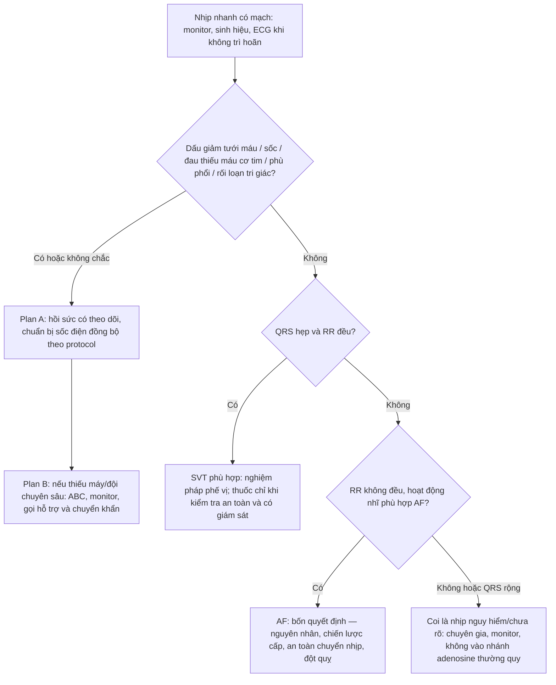
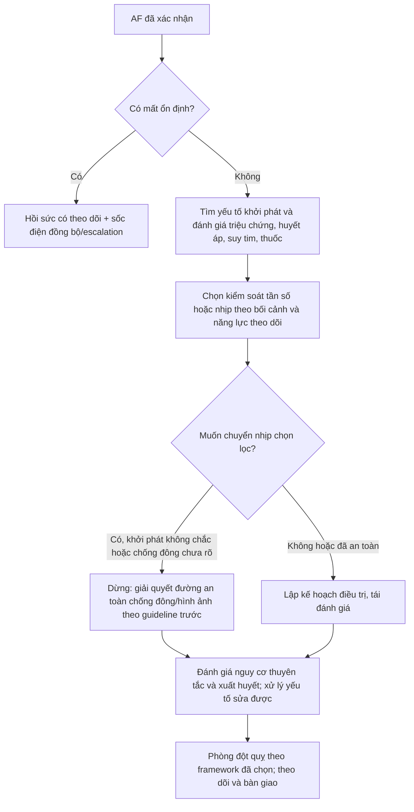

# BÀI HỌC Y KHOA: IM-23 — RUNG NHĨ VÀ NHỊP NHANH TRÊN THẤT
**Ngày:** 2026-07-18 | **Chuyên khoa:** Nội khoa người lớn | **Đối tượng:** Bác sĩ, học viên sau đại học và người học cần xây lại nền tảng ECG

---

## 0. TỔNG QUAN — VÌ SAO BÀI NÀY QUAN TRỌNG?

Một bệnh nhân “tim đập nhanh” có thể chỉ cần theo dõi, nhưng cũng có thể đang giảm tưới máu não, phù phổi cấp hoặc thiếu máu cơ tim. Bài này không bắt đầu bằng tên loạn nhịp; bài bắt đầu bằng câu hỏi an toàn hơn: **bệnh nhân có còn chịu được nhịp này không?** Sau đó mới dùng ECG để tách rung nhĩ (atrial fibrillation, AF) khỏi nhịp nhanh trên thất đều không phải AF (supraventricular tachycardia, SVT).

**Mục tiêu của bài:**
- Nhận diện dấu hiệu không ổn định và kích hoạt đường hồi sức/chuyển tuyến trước khi phân loại chi tiết.
- Đọc ECG theo một trình tự lặp lại được: tần số, đều/không đều, hoạt động nhĩ, độ rộng QRS và đánh giá lại ổn định.
- Ra bốn quyết định riêng trong AF: nguyên nhân, chiến lược cấp, an toàn chuyển nhịp, phòng đột quỵ.
- Xử trí ban đầu SVT đều-QRS hẹp ổn định và biết lúc không được thử nhánh này.

### 📋 TRƯỚC KHI ĐỌC — NỀN TẢNG CẦN DÙNG

- Không cần biết điện sinh lý chuyên sâu. Phần 0.1 giải thích đủ để đọc P, PR, QRS và RR.
- Bệnh nhân ngừng tuần hoàn không thuộc bài này: kích hoạt CPR/AED và học theo **IM-18**.
- Bài không thay thế theo dõi monitor, quy trình gây mê/sốc điện của cơ sở, hay hội chẩn tim mạch–điện sinh lý.

### 0.1 Nền tảng tối thiểu cần dùng ngay
Tim có “người phát nhịp” là **nút xoang**, tạo xung làm hai nhĩ co trước. Xung đi qua **nút nhĩ–thất (AV)**, rồi qua bó His và mạng Purkinje để hai thất co. Trên ECG, **sóng P** gợi hoạt động nhĩ; **PR** là thời gian dẫn truyền từ nhĩ xuống thất; **QRS** là hoạt hóa thất; khoảng **RR** là khoảng giữa hai nhát bóp thất. Nhĩ và thất có thể không còn đi cùng nhau: AF là ví dụ nhĩ hoạt động hỗn loạn nhưng thất vẫn được nút AV “lọc” một phần. [TEXTBOOK: Marriott's Practical Electrocardiography, 13e.]

Khi AF làm nhĩ mất co bóp có tổ chức, máu có thể ứ ở tiểu nhĩ trái; đó là một cơ chế tạo huyết khối và thuyên tắc. Vì vậy một nhịp nhanh AF không chỉ là vấn đề “hạ mạch”: còn có quyết định phòng đột quỵ tách biệt. [2024 ESC AF — official guideline page; PMID: 39210723. [GUIDELINE VERIFIED]]

---

## 1. NHẬN DIỆN NHỊP NHANH BẰNG ECG [CỐT LÕI]

### 1.0 Nhắc nhanh: dùng một trình tự cố định

Đừng nhìn ECG và đoán ngay nhãn. Hãy làm năm bước: (1) xem bệnh nhân và sinh hiệu, (2) ước tính tần số thất, (3) RR đều hay không đều, (4) tìm P/hoạt động nhĩ, (5) QRS hẹp hay rộng. Cuối cùng hỏi lại: dữ kiện mới có làm bệnh nhân không ổn định không?

### 1.1 Ba mẫu cần phân biệt

- **AF:** RR không đều rõ; không có P đều đặn theo một khuôn mẫu; cần đặt trong toàn bộ bối cảnh lâm sàng và ECG.
- **SVT đều-QRS hẹp:** thất nhanh và đều; P có thể khó thấy hoặc nằm gần QRS. Đây là nhóm có thể đi vào nhánh nghiệm pháp phế vị nếu bệnh nhân ổn định và chẩn đoán phù hợp.
- **Nhịp nhanh QRS rộng hoặc không đều:** không được mặc định là SVT. Coi là nhịp có nguy cơ cho đến khi có đánh giá chuyên môn/monitor; không đi vào nhánh adenosine thường quy. [2019 ESC SVT — official guideline page; PMID: 31504425. [GUIDELINE VERIFIED]]

### 1.2 Những điều ECG không tự trả lời
SVT đều, QRS hẹp, ổn định có thể bắt đầu bằng nghiệm pháp phế vị; nhịp rộng/không đều hoặc chưa rõ chẩn đoán không phải nhánh adenosine thường quy. [2019 ESC SVT — official guideline page; PMID: 31504425. [GUIDELINE VERIFIED]]
ECG nói về điện học, không tự nói người bệnh có sốc, đau thiếu máu cơ tim, suy tim hay huyết khối hay không. Luôn ghép ECG với huyết áp, tri giác, triệu chứng, bệnh nền, thuốc đang dùng, điện giải và yếu tố khởi phát như nhiễm trùng, thiếu oxy hoặc thiếu máu.

> ⚠️ HỌC VIÊN HAY NHẦM: “QRS hẹp” không đồng nghĩa “an toàn”; một AF QRS hẹp vẫn có thể gây tụt huyết áp hoặc phù phổi.

### 🛑 DỪNG 1 PHÚT — TỰ KIỂM TRA
> 1. RR không đều trả lời câu hỏi nào? 2. QRS rộng có được tự động gọi là SVT không?
>
> *(Đáp án: RR nói về tính đều đặn của đáp ứng thất; không, cần coi là nhịp nguy hiểm cho đến khi làm rõ.)*

---

## 2. CƠ CHẾ SINH LÝ / SINH BỆNH HỌC [CỐT LÕI]

### 2.1 Bình thường: vì sao nút AV quan trọng?

Nút AV là “cổng kiểm soát” sinh lý: nó không cho mọi xung nhĩ đi xuống thất ngay lập tức. Nhờ đó thất được đổ đầy trước khi co. Nhịp quá nhanh rút ngắn thời gian đổ đầy và có thể giảm cung lượng tim, nhất là khi thất đã cứng hoặc yếu. [TEXTBOOK: Braunwald's Heart Disease, 12e, electrophysiology chapters.]

### 2.2 Khi có AF hoặc SVT

Trong AF, hoạt động nhĩ không tổ chức tạo đáp ứng thất thay đổi; triệu chứng có thể đến từ nhịp nhanh, mất đồng bộ nhĩ–thất, hoặc bệnh khởi phát. Trong SVT, một vòng vào lại hoặc ổ phát xung trên thất có thể làm thất chạy nhanh nhưng vẫn đều. Cơ chế gợi hướng xử trí, nhưng tại giường bệnh ưu tiên vẫn là tưới máu và ECG thật.

---

## 3. CHẨN ĐOÁN VÀ PHÂN TẦNG NGUY CƠ [CỐT LÕI]

> 🚨 **BOX ĐỎ — AN TOÀN TRƯỚC KHI PHÂN LOẠI THƯỜNG QUY:** Hạ huyết áp/sốc, đau ngực thiếu máu cơ tim đang diễn tiến, phù phổi cấp hoặc suy tim cấp, thay đổi tri giác, dấu giảm tưới máu, hay bất kỳ nghi ngờ mất ổn định nào → gọi đội cấp cứu, đặt monitor/đường truyền, hỗ trợ ABC theo nhu cầu và chuẩn bị **sốc điện đồng bộ hoặc chuyển khẩn** theo năng lực. Không chờ hoàn tất phân loại ngoại trú, không chỉ cho thuốc kiểm soát tần số, và không để thiếu máy sốc làm trì hoãn chuyển tuyến. [AHA Adult Tachyarrhythmia With a Pulse Algorithm 2025 — official source, accessed 2026-07-18. GUIDELINE VERIFIED]

### 3.1 Sau BOX ĐỎ: xác nhận và tìm yếu tố đảo ngược

Ở bệnh nhân ổn định, ghi ECG 12 chuyển đạo nếu không làm chậm điều trị. Rà lại thời điểm khởi phát, sốt/nhiễm trùng, thiếu oxy, đau, thiếu máu, điện giải, cường giáp khi phù hợp, rượu/chất kích thích, và toàn bộ thuốc. Mục tiêu không phải xét nghiệm “đủ bộ”, mà là tìm dữ kiện thay đổi xử trí hôm nay.

### 3.2 Chẩn đoán phân biệt thực dụng

| Mẫu | Dữ kiện quyết định | Hành động an toàn |
|---|---|---|
| AF | RR không đều, hoạt động nhĩ không tổ chức | Tách ổn định, nguyên nhân, chiến lược cấp và phòng đột quỵ. |
| SVT đều-QRS hẹp | Nhịp nhanh đều, QRS hẹp, ổn định | Nghiệm pháp phế vị có hướng dẫn; thuốc chỉ trong môi trường theo dõi và đúng nhánh. |
| Rộng/không đều/chưa rõ | ECG không phù hợp nhánh SVT đơn giản | Monitor, chuyên gia/cấp cứu; không thử AV-nodal blockade kinh nghiệm. |

> ⚠️ HỌC VIÊN HAY NHẦM: Không dùng đáp ứng với thuốc như một “test chẩn đoán” khi nhịp rộng, không đều hoặc bệnh nhân xấu đi.

---

## 4. EVIDENCE & GUIDELINES [CỐT LÕI]

### 4.1 AF: dùng khung AF-CARE, không trộn score

ESC 2024 đặt AF-CARE làm khung: đồng bệnh lý/yếu tố nguy cơ; tránh đột quỵ/thuyên tắc; giảm triệu chứng bằng kiểm soát tần số hay nhịp; và đánh giá lại theo thời gian. [2024 ESC AF — official guideline page; PMID: 39210723. [GUIDELINE VERIFIED]]

Guideline ACC/AHA/ACCP/HRS 2023 về chẩn đoán và quản lý AF cũng hướng dẫn đánh giá nguy cơ, chống đông, chiến lược tần số/nhịp và lựa chọn thủ thuật. Khi cơ sở dùng hệ chấm điểm khác, hãy ghi rõ **hệ nào đang dùng** và theo guideline/protocol địa phương; không ghép thành một quy tắc tự tạo. [ACC/AHA/ACCP/HRS 2023 official guideline. [GUIDELINE VERIFIED]]

### 4.2 SVT không phải AF

ESC 2019 dành riêng cho SVT không phải AF, bao gồm thuốc và triệt đốt. Ở tuyến ban đầu, trọng tâm là xác nhận nhánh an toàn, cắt cơn có theo dõi khi phù hợp, và tạo đường chuyển điện sinh lý cho tái phát; không dạy kỹ thuật triệt đốt. [ESC SVT 2019; PMID: 31504425. [GUIDELINE VERIFIED]]

---

## 5. ĐIỀU TRỊ & QUẢN LÝ [CỐT LÕI]

### 5.1 AF là bốn quyết định, không phải một đơn thuốc

1. **Xác nhận và tìm yếu tố khởi phát.** Điều trị thiếu oxy, nhiễm trùng, rối loạn điện giải hay thiếu máu khi hiện diện; đồng thời đánh giá bệnh tim nền.
2. **Ổn định và chọn kiểm soát tần số hay nhịp.** Nếu không ổn định, đường cấp cứu/sốc điện đồng bộ có ưu tiên. Nếu ổn định, quyết định phải cá thể hóa theo triệu chứng, chức năng thất, huyết áp, suy tim, bệnh phổi, thuốc đang dùng và năng lực theo dõi.
3. **Đảm bảo an toàn trước chuyển nhịp chọn lọc.** Thời điểm khởi phát rõ hay không rõ và tình trạng chống đông/hình ảnh tìm huyết khối quyết định đường đi. AF khởi phát không chắc **dừng trước** chuyển nhịp chọn lọc cho tới khi đạt đường an toàn do guideline quy định.
4. **Phòng đột quỵ riêng với nguy cơ chảy máu.** Đánh giá nguy cơ huyết khối theo framework được chọn, đánh giá chống chỉ định tuyệt đối và các yếu tố xuất huyết có thể sửa. Điểm xuất huyết không phải nút “tự động không chống đông”; nó là lời nhắc sửa nguy cơ, theo dõi và ra quyết định chung. [ESC 2024; ACC/AHA/ACCP/HRS 2023. GUIDELINE VERIFIED]

### 5.2 SVT đều-QRS hẹp ổn định

**Mục tiêu** là làm chậm/cắt cơn an toàn trong khi vẫn quan sát diễn biến. Bắt đầu bằng nghiệm pháp phế vị được hướng dẫn; chuẩn bị monitor, ECG và khả năng xử trí xấu đi. Thuốc cắt cơn chỉ là lựa chọn sau khi xác nhận nhịp đều-QRS hẹp, đánh giá chống chỉ định và có giám sát phù hợp. Tái phát hoặc gánh triệu chứng cao cần kế hoạch theo dõi và chuyển tim mạch–điện sinh lý để bàn điều trị lâu dài. [ESC SVT 2019. GUIDELINE VERIFIED]

### 5.3 Theo dõi và bàn giao

Ghi rõ: nhịp ECG, sinh hiệu trước/sau can thiệp, triệu chứng, thời điểm khởi phát ước tính, thuốc đã dùng, tình trạng chống đông, bệnh nền, xét nghiệm then chốt và lý do chuyển tuyến. Một “AF đã ổn mạch” vẫn cần kế hoạch đột quỵ và tái đánh giá.

---

## 6. LƯU ĐỒ QUYẾT ĐỊNH LÂM SÀNG [CỐT LÕI]

1. Điểm vào luôn là bệnh nhân có mạch và monitor, không phải tên nhịp.
2. Bất ổn định hoặc không chắc ổn định kết thúc ở hồi sức/sốc điện đồng bộ hay chuyển khẩn; không có nhánh phòng khám.
3. Chỉ nhịp đều-QRS hẹp ổn định mới đi tới nghiệm pháp phế vị.
4. AF đi tới một hệ quyết định riêng; mọi nhịp rộng/không đều chưa rõ giữ ở nhánh nguy hiểm.

1. Không ổn định là đường cấp cứu, không chờ “đủ chống đông”.
2. Ổn định cho phép đánh giá nguyên nhân và chọn tần số/nhịp có chủ đích.
3. AF thời điểm không chắc không được chuyển nhịp chọn lọc chỉ vì muốn “làm ECG đẹp”.
4. Phòng đột quỵ và nguy cơ xuất huyết là quyết định song hành, sau đó tái đánh giá.

---

## 7. SAI LẦM THƯỜNG GẶP — LÂM SÀNG [CỐT LÕI]

1. **Gọi tên AF trước khi đo huyết áp và nhìn phổi/tri giác.** Hậu quả: chậm hồi sức. Cách tránh: BOX ĐỎ luôn đứng trước phân loại.
2. **Cho mọi nhịp nhanh thuốc cùng một cách.** Hậu quả: làm nặng nhịp rộng/chưa rõ. Cách tránh: kiểm tra đều–QRS–ổn định.
3. **Chuyển nhịp AF thời điểm không chắc mà không dừng ở nút an toàn.** Hậu quả: bỏ qua nguy cơ huyết khối. Cách tránh: xác nhận thời điểm và đường chống đông/hình ảnh theo guideline.
4. **Dùng điểm xuất huyết để đóng hẳn câu chuyện chống đông.** Hậu quả: bỏ lỡ phòng đột quỵ. Cách tránh: sửa yếu tố nguy cơ, đánh giá chống chỉ định và quyết định chung.
5. **Cho xuất viện sau khi nhịp chậm lại mà không bàn giao kế hoạch đột quỵ/tái phát.** Hậu quả: điều trị chỉ nhắm triệu chứng. Cách tránh: ghi kế hoạch theo dõi và chuyển chuyên khoa.

---

## 8. BẢNG THUỐC VÀ LIỀU DÙNG [THAM KHẢO]

Bài này **không liệt kê liều hay năng lượng** cho kiểm soát tần số, chuyển nhịp hoặc thuốc cắt SVT vì các chi tiết đó phụ thuộc protocol cơ sở, bệnh đồng mắc và nguồn gốc cần xác minh tại giường. Trước khi dùng thuốc, xác nhận nhịp, ổn định, huyết áp, chức năng thất, tương tác và khả năng monitor; nếu không bảo đảm, chọn chuyển tuyến có theo dõi.

---

## 9. ÁP DỤNG TẠI VIỆT NAM [CỐT LÕI]

Không giả định một thuốc, máy sốc điện, siêu âm tim qua thực quản hay điện sinh lý luôn sẵn có ở mọi nơi.

- **Plan A — đủ nguồn lực:** monitor liên tục, ECG 12 chuyển đạo, thuốc và điện chuyển nhịp theo protocol đã phê duyệt, hội chẩn tim mạch.
- **Plan B — thiếu nguồn lực:** ABC theo nhu cầu, đường truyền, oxy khi giảm oxy, theo dõi sinh hiệu/ECG sẵn có, gọi tuyến nhận và chuyển khẩn khi có BOX ĐỎ, nhịp rộng/chưa rõ, AF cần quyết định chuyển nhịp an toàn hoặc cần chiến lược chống đông phức tạp.
- **Không được thay thế:** không dùng thuốc thử để “xác định” nhịp nguy hiểm; không dùng thiếu nguồn lực làm lý do chờ ngoại trú ở bệnh nhân bất ổn.

---

## 10. CASE LÂM SÀNG [NÂNG CAO]

### Case 1: AF nhanh kèm tụt huyết áp
**Bệnh nhân:** 68 tuổi, hồi hộp, huyết áp tụt, lơ mơ; ECG RR không đều nhanh, QRS hẹp.

**Trả lời theo 5 bước:** (1) Đây là nguy cơ giảm tưới máu, không phải ca kiểm soát tần số ngoại trú. (2) Huyết áp, tri giác và RR không đều thay đổi quyết định. (3) Gọi cấp cứu, ABC/monitor/đường truyền và chuẩn bị sốc điện đồng bộ theo protocol. (4) Chuyển/hội chẩn khẩn nếu không có năng lực sốc điện an toàn; ghi thời điểm, thuốc và ECG. (5) Chờ xét nghiệm tuyến giáp, chỉ cho thuốc hạ mạch, hoặc chỉ kê chống đông là chậm và không xử lý mất ổn định.

### Case 2: AF ổn định, khởi phát không chắc
**Bệnh nhân:** 61 tuổi, phát hiện AF khi khám; không biết bắt đầu từ khi nào, huyết động ổn.

**Trả lời theo 5 bước:** (1) Không có BOX ĐỎ hiện tại. (2) Thời điểm không chắc và tình trạng chống đông là dữ kiện then chốt. (3) Đánh giá nguyên nhân và chiến lược kiểm soát triệu chứng; dừng trước chuyển nhịp chọn lọc cho đến khi theo đường an toàn do guideline quy định. (4) Lập kế hoạch đánh giá nguy cơ đột quỵ/xuất huyết, theo dõi và tim mạch. (5) Sốc điện chỉ để khôi phục nhịp ngay là sớm; điểm xuất huyết không tự động loại chống đông.

### Case 3: SVT đều-QRS hẹp tái phát
**Bệnh nhân:** 29 tuổi, hồi hộp đều, tỉnh táo, huyết động ổn, ECG nhịp đều QRS hẹp; đã có cơn tương tự.

**Trả lời theo 5 bước:** (1) Không red flag hiện tại nhưng vẫn phải monitor. (2) Tính đều, QRS hẹp và ổn định mở nhánh SVT phù hợp. (3) Hướng dẫn nghiệm pháp phế vị; thuốc chỉ sau kiểm tra an toàn và khả năng theo dõi. (4) Ghi ECG, hẹn/chuyển tim mạch–điện sinh lý vì tái phát. (5) Không cần dạy triệt đốt; cũng không được áp dụng nhánh này nếu ECG sau đó rộng/không đều.

### Case 4: AF và nguy cơ thuyên tắc–xuất huyết cạnh tranh
**Bệnh nhân:** 76 tuổi AF, có tiền sử té ngã và dùng nhiều thuốc; ổn định, gia đình lo chống đông.

**Trả lời theo 5 bước:** (1) Không có mất ổn định nhưng nguy cơ quyết định dài hạn. (2) Xem nguy cơ thuyên tắc, chống chỉ định tuyệt đối, thuốc tương tác, huyết áp và nguyên nhân té ngã. (3) Không quyết định chỉ bằng một điểm; sửa nguy cơ xuất huyết có thể sửa và thảo luận lợi ích–nguy cơ theo framework hiện hành. (4) Theo dõi sát, bàn giao kế hoạch và hội chẩn nếu phức tạp. (5) “Có nguy cơ chảy máu nên không bao giờ chống đông” là sai; “cứ cho thuốc mà không rà tương tác” cũng sai.

---

## 11. TIPS THỰC HÀNH (CLINICAL PEARLS) [THAM KHẢO]

1. Viết “ổn định vì…” thay vì chỉ viết “ổn định”.
2. Nhịp nhanh rộng hay không đều cần khiêm tốn chẩn đoán và ngưỡng escalatation thấp.
3. Tách mục tiêu làm bệnh nhân dễ thở hơn khỏi mục tiêu phòng đột quỵ dài hạn.
4. Câu hỏi “khởi phát lúc nào?” có thể thay đổi nhánh chuyển nhịp.
5. Luôn ghi thuốc đã dùng trước khi chuyển tuyến.
6. Không dùng đáp ứng với thuốc như một giấy phép bỏ qua ECG.
7. Khi monitor không có, tăng mức độ chuyển tuyến chứ không giảm mức độ cảnh giác.
8. Tái phát SVT cần đường theo dõi, không chỉ một lần cắt cơn.
9. AF không đều không đồng nghĩa mọi nhịp không đều đều là AF.
10. Đánh giá lại sau mỗi can thiệp.

---

## 12. TỔNG KẾT — 10 ĐIỂM CẦN NHỚ [CỐT LÕI]

1. Nhịp nhanh có mạch bắt đầu bằng ổn định, không bắt đầu bằng nhãn ECG.
2. Hạ huyết áp, thiếu máu cơ tim, phù phổi, thay đổi tri giác hoặc nghi ngờ giảm tưới máu đi đường cấp cứu.
3. Đọc ECG theo: tần số → RR → hoạt động nhĩ → QRS → đánh giá lại ổn định.
4. AF là nhịp không đều; luôn tìm nguyên nhân và bệnh kèm.
5. AF cần bốn quyết định riêng: nguyên nhân, chiến lược cấp, an toàn chuyển nhịp, phòng đột quỵ.
6. AF khởi phát không chắc phải dừng trước chuyển nhịp chọn lọc cho tới khi đạt đường an toàn.
7. Nguy cơ xuất huyết là cơ hội sửa nguy cơ, không tự động là lý do bỏ phòng đột quỵ.
8. SVT đều-QRS hẹp ổn định mới là nhánh nghiệm pháp phế vị/thuốc có theo dõi.
9. QRS rộng, nhịp không đều hoặc chẩn đoán không chắc không phải nhánh adenosine thường quy.
10. Plan B tốt vẫn làm ABC, monitor, gọi hỗ trợ và chuyển đúng lúc.

### 🛑 TỰ KIỂM TRA CUỐI BÀI
> 1. AF không rõ thời điểm có được chuyển nhịp chọn lọc ngay không? 2. Nhịp nhanh rộng chưa rõ đi vào nhánh nào? 3. AF kèm tụt huyết áp ưu tiên gì?
>
> *(Đáp án: Không, phải giải quyết đường an toàn; nhánh nhịp nguy hiểm/chuyên gia; hồi sức có theo dõi và sốc điện đồng bộ/escalation.)*

---

## 13. TÀI LIỆU THAM KHẢO

1. **Van Gelder IC et al. (2024).** “2024 ESC Guidelines for the management of atrial fibrillation developed in collaboration with EACTS.” *European Heart Journal.* PMID: **39210723**. [GUIDELINE VERIFIED]
2. **Joglar JA et al. (2023).** “2023 ACC/AHA/ACCP/HRS Guideline for the Diagnosis and Management of Atrial Fibrillation.” *Circulation.* PMID: **38033089**. [GUIDELINE VERIFIED]
3. **Brugada J et al. (2020).** “2019 ESC Guidelines for the management of patients with supraventricular tachycardia.” *European Heart Journal.* PMID: **31504425**. [GUIDELINE VERIFIED]
4. **American Heart Association (2025).** “Adult Tachyarrhythmia With a Pulse Algorithm.” Official algorithm resource, accessed 2026-07-18. [GUIDELINE VERIFIED]
5. **Braunwald's Heart Disease, 12e.** Cardiac electrophysiology chapters. [TEXTBOOK]
6. **Marriott's Practical Electrocardiography, 13e.** ECG foundations. [TEXTBOOK]

---

**— Hết bài học ngày 2026-07-18 —**

**Bác sĩ:** Ngọc Hưng | **AI:** Terra
