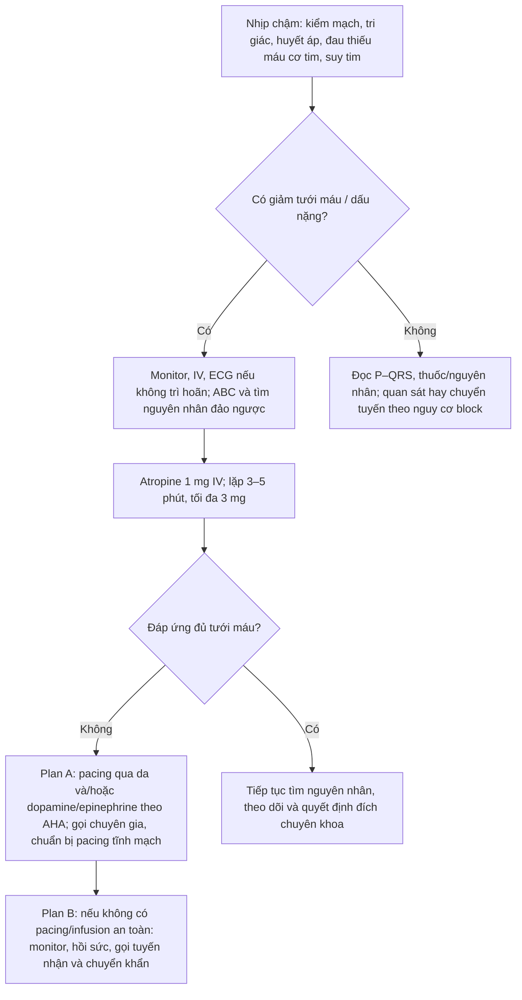
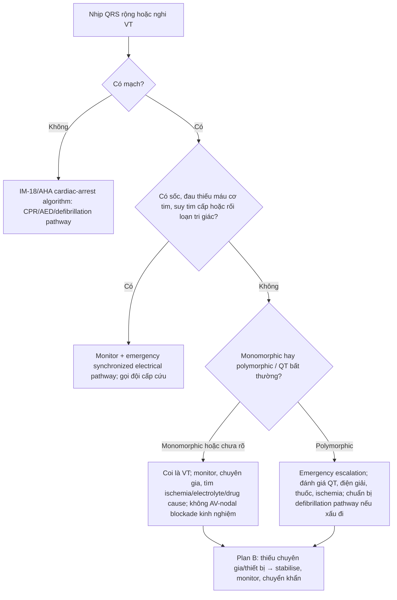

# BÀI HỌC Y KHOA: IM-24 — NHỊP CHẬM, BLOCK NHĨ THẤT VÀ LOẠN NHỊP THẤT
**Ngày:** 2026-07-18 | **Chuyên khoa:** Nội khoa người lớn | **Đối tượng:** Bác sĩ và học viên cần một đường xử trí ECG an toàn

---

## 0. TỔNG QUAN — VÌ SAO BÀI NÀY QUAN TRỌNG?

Nhịp chậm không luôn vô hại, và nhịp rộng không luôn “chỉ là ngoại tâm thu”. Câu hỏi đầu tiên không phải là nhịp bao nhiêu lần mỗi phút, mà là: **nhịp này có đang làm giảm tưới máu cơ quan không?** Bài dùng quan hệ P–QRS, mạch và ổn định để chọn quan sát, pacing/hỗ trợ vận mạch, sốc điện hay chuyển khẩn.

**Mục tiêu của bài:**
- Nhận diện nhịp chậm/loạn nhịp thất đe dọa tưới máu trước khi gọi tên ECG.
- Đọc block AV theo P–QRS, PR, QRS và nhịp thoát.
- Đi theo thuật toán AHA 2025 cho nhịp chậm có triệu chứng; dùng đúng liều đã xác minh.
- Xử trí nhịp rộng có mạch như VT tiềm tàng khi chưa chắc chắn và bàn giao pulseless VT/VF sang IM-18.

### 📋 TRƯỚC KHI ĐỌC — NỀN TẢNG CẦN DÙNG

- Bài này không thay thế CPR/AED. Bệnh nhân **không mạch** đi ngay tới IM-18 và thuật toán ngừng tuần hoàn AHA.
- “Có mạch” không đồng nghĩa đủ tưới máu; phải nhìn huyết áp, tri giác, đau thiếu máu cơ tim, suy tim và da lạnh/thiểu niệu.

### 0.1 Nền tảng tối thiểu cần dùng ngay

Nút xoang tạo xung nhĩ. Nút AV, bó His và mạng Purkinje mang xung xuống thất. Sóng **P** là hoạt động nhĩ; khoảng **PR** gợi thời gian dẫn truyền nhĩ–thất; **QRS** là hoạt hóa thất. Nếu P xuất hiện mà không có QRS theo sau, có thể có block dẫn truyền. Nếu QRS rộng và chậm, nguồn nhịp thoát có thể nằm thấp hơn hệ dẫn truyền bình thường. [TEXTBOOK: Marriott's Practical Electrocardiography, 13e.]

Cung lượng tim phụ thuộc nhịp, thể tích nhát bóp và sự phối hợp co bóp. Nhịp quá chậm có thể làm giảm cung lượng; nhịp thất quá nhanh có thể làm thất chưa kịp đổ đầy. Vì vậy cùng một tần số có thể được dung nạp ở người này nhưng gây sốc ở người khác. [TEXTBOOK: Guyton and Hall Textbook of Medical Physiology, 15e.]

---

## 1. ĐỌC NHỊP CHẬM VÀ BLOCK BẰNG P–QRS [CỐT LÕI]

### 1.0 Trình tự đọc

1. Bệnh nhân có mạch và có dấu giảm tưới máu không? 2. P có đều không? 3. Mỗi P có QRS đi sau không? 4. PR cố định, kéo dài dần hay thay đổi? 5. QRS hẹp hay rộng, có nhịp thoát không? 6. So với ECG cũ/bối cảnh thuốc–điện giải thế nào?

### 1.1 Nhận diện thực hành

- **Nhịp xoang chậm:** P đi trước mỗi QRS, quan hệ 1:1; vấn đề là triệu chứng và nguyên nhân, không chỉ tên nhịp.
- **Block AV độ một:** mọi P dẫn truyền nhưng PR kéo dài; tự nó không trả lời câu hỏi tưới máu.
- **Mobitz I:** PR kéo dài dần trước một P không dẫn truyền; vẫn phải đánh giá triệu chứng và bối cảnh.
- **Mobitz II:** một số P không dẫn truyền mà PR của các nhịp dẫn truyền không kéo dài dần; cần ngưỡng cảnh giác/chuyển tuyến cao.
- **Block cao độ:** nhiều P không dẫn truyền liên tiếp.
- **Block AV hoàn toàn:** nhĩ và thất hoạt động độc lập; nhịp thoát có thể có nhưng không bảo đảm an toàn.

[2021 ESC Pacing; PMID: 34455430. [GUIDELINE VERIFIED]]

> ⚠️ HỌC VIÊN HAY NHẦM: Một nhịp thoát “có vẻ đều” trong block hoàn toàn không loại trừ nguy cơ tiến triển hoặc giảm tưới máu; hãy nhìn triệu chứng, huyết áp, QRS, nguyên nhân và khả năng pacing.

### 🛑 DỪNG 1 PHÚT — TỰ KIỂM TRA
> 1. Block AV hoàn toàn nghĩa là gì về P và QRS? 2. Vì sao không dùng tần số đơn độc để cho xuất viện?
>
> *(Đáp án: nhĩ–thất phân ly; vì tưới máu, nguyên nhân và nguy cơ tiến triển mới quyết định.)*

---

## 2. CƠ CHẾ SINH LÝ / SINH BỆNH HỌC [CỐT LÕI]

### 2.1 Khi dẫn truyền hỏng

Block có thể xuất hiện do bệnh hệ dẫn truyền, thiếu máu cơ tim, thuốc làm chậm nút AV, rối loạn điện giải, thiếu oxy hoặc độc chất. Cùng ECG, bối cảnh khác nhau dẫn tới hành động khác nhau: một thay đổi mới kèm ngất cần escalatation khác với một PR dài ổn định, không triệu chứng. [TEXTBOOK: Braunwald's Heart Disease, 12e.]

### 2.2 Khi thất phát nhịp nhanh

VT là hoạt động nhanh xuất phát từ thất. Nhịp rộng chưa rõ căn nguyên phải được coi là VT cho đến khi chứng minh khác, bởi thử thuốc chẹn nút AV ở nhịp nguy hiểm có thể gây hại. Polymorphic VT cần nghĩ tới QT, điện giải, thuốc, thiếu máu cơ tim và tình trạng chuyển nhanh sang vô mạch. [2022 ESC VA; PMID: 36017572. [GUIDELINE VERIFIED]]

---

## 3. CHẨN ĐOÁN VÀ PHÂN TẦNG NGUY CƠ [CỐT LÕI]

> 🚨 **BOX ĐỎ — AN TOÀN TRƯỚC KHI TAXONOMY ECG:** Sốc/hạ huyết áp, đau thiếu máu cơ tim, suy tim cấp, thay đổi tri giác, nhịp nhanh QRS rộng kéo dài, polymorphic VT, hoặc bất kỳ **pulselessness** nào → không đi theo nhánh chẩn đoán thường quy. Có mạch nhưng bất ổn: monitor, ABC theo nhu cầu, gọi cấp cứu và chuẩn bị can thiệp điện/pacing theo algorithm. Không mạch: kích hoạt **IM-18/AHA cardiac-arrest algorithm**, không lặp toàn bộ đường ngừng tuần hoàn trong bài này. [AHA Algorithms 2025. [GUIDELINE VERIFIED]]

### 3.1 Đánh giá song song, không tuần tự làm chậm điều trị

Ở nhịp chậm có triệu chứng: hỗ trợ đường thở/oxy **khi cần**, monitor, đường truyền, ECG 12 chuyển đạo nếu không làm chậm điều trị, và tìm nguyên nhân đảo ngược. Ở nhịp rộng: xác nhận mạch, đánh giá ổn định, so ECG cũ nếu có, kiểm điện giải/thuốc/thiếu máu cơ tim khi điều đó không trì hoãn hồi sức. [AHA Adult Bradycardia Algorithm 2025. [GUIDELINE VERIFIED]]

---

## 4. EVIDENCE & GUIDELINES [CỐT LÕI]

### 4.1 Nhịp chậm có triệu chứng

AHA Adult Bradycardia With a Pulse Algorithm 2025 dùng một chuỗi: đánh giá ABC, monitor/IV/ECG khi không trì hoãn, tìm nguyên nhân, atropine; nếu không hiệu quả, pacing qua da và/hoặc truyền vận mạch, đồng thời cân nhắc pacing tĩnh mạch và hội chẩn. [AHA 2025 Adult Bradycardia Algorithm. [GUIDELINE VERIFIED]]

### 4.2 Pacing và loạn nhịp thất

ESC 2021 là nền cho quyết định pacing chuyên khoa lâu dài; ESC 2022 là nền cho đánh giá VT/VF và nguy cơ đột tử. Bài này chỉ dạy nhận diện, ổn định ban đầu và đích chuyển tuyến, không dạy cấy máy tạo nhịp, ICD hay triệt đốt. [ESC Pacing 2021; PMID: 34455430. [GUIDELINE VERIFIED]] [ESC VA 2022; PMID: 36017572. [GUIDELINE VERIFIED]]

---

## 5. ĐIỀU TRỊ & QUẢN LÝ [CỐT LÕI]

### 5.1 Chuỗi nhịp chậm có triệu chứng

**Mục tiêu:** phục hồi tưới máu trong khi sửa nguyên nhân, không chỉ tăng con số mạch.

1. Đặt monitor, IV, ECG khi không trì hoãn; hỗ trợ airway/oxy khi có chỉ định; tìm thiếu oxy, thiếu máu cơ tim, điện giải, thuốc/độc chất và nguyên nhân khác.
2. **Atropine:** 1 mg IV bolus; có thể lặp mỗi 3–5 phút; tổng tối đa 3 mg. [AHA Adult Bradycardia Algorithm 2025. [GUIDELINE VERIFIED]]
3. Nếu atropine không hiệu quả: **pacing qua da** và/hoặc dopamine 5–20 microgram/kg/phút hoặc epinephrine 2–10 microgram/phút; đồng thời gọi chuyên gia và cân nhắc pacing tĩnh mạch. [AHA Adult Bradycardia Algorithm 2025. [GUIDELINE VERIFIED]]
4. Theo dõi đáp ứng tưới máu, không chỉ nhịp; bàn giao rõ ECG, thuốc, thời điểm, nguyên nhân nghi ngờ và mức độ phụ thuộc pacing.

### 5.2 Nhịp rộng/VT theo mạch và ổn định

- **Có mạch, bất ổn:** đường cấp cứu và sốc điện đồng bộ theo algorithm/protocol; không trì hoãn để phân loại tinh vi.
- **Có mạch, ổn định, monomorphic rộng:** coi VT tiềm tàng, monitor, gọi chuyên gia, đánh giá nguyên nhân và dùng điều trị theo protocol được giám sát; không thử AV-nodal blockade chỉ để “xem có phải SVT không”.
- **Polymorphic VT:** emergency escalation; đánh giá QT, điện giải, thuốc và thiếu máu cơ tim. Không ghi năng lượng sốc khi không có protocol nguồn đã xác minh tại cơ sở.
- **VF/pulseless VT:** IM-18/AHA cardiac-arrest algorithm ngay.

[AHA Algorithms 2025; ESC VA 2022. [GUIDELINE VERIFIED]]

---

## 6. LƯU ĐỒ QUYẾT ĐỊNH LÂM SÀNG [CỐT LÕI]

1. Mạch và tưới máu đứng trước loại block.
2. ECG 12 chuyển đạo hữu ích nhưng không được làm chậm atropine/pacing khi bệnh nhân xấu.
3. Không đáp ứng atropine kết thúc ở pacing/hỗ trợ vận mạch và expert transfer, không phải quan sát.
4. Plan B vẫn có hồi sức, theo dõi và ngưỡng chuyển khẩn rõ ràng.

1. Không mạch rời bài ngay sang IM-18, tránh trì hoãn CPR/khử rung.
2. Có mạch nhưng bất ổn là nhánh cấp cứu điện đồng bộ/escalation.
3. Nhịp rộng ổn định vẫn được coi là VT tiềm tàng; “đều” không mở nhánh chẹn nút AV.
4. Polymorphic VT có nguy cơ xấu nhanh nên cần đích hồi sức/cấp cứu.

---

## 7. SAI LẦM THƯỜNG GẶP — LÂM SÀNG [CỐT LÕI]

1. **Chỉ nhìn tần số chậm.** Hậu quả: bỏ qua giảm tưới máu. Cách tránh: đánh giá huyết áp, tri giác, đau, suy tim và dấu shock.
2. **Chờ ECG/laboratory hoàn chỉnh trước atropine/pacing.** Hậu quả: trì hoãn hồi sức. Cách tránh: làm song song.
3. **Quan sát Mobitz II/high-grade/complete block chỉ vì còn nhịp thoát.** Hậu quả: bỏ lỡ tiến triển. Cách tránh: monitor, nguyên nhân, khả năng pacing và chuyển chuyên khoa sớm.
4. **Thử AV-nodal blocker ở nhịp rộng chưa rõ.** Hậu quả: có thể gây hại nếu là VT. Cách tránh: coi VT cho tới khi làm rõ.
5. **Dạy full cardiac arrest trong mọi bài VT.** Hậu quả: loãng đường CPR. Cách tránh: pulseless VF/VT chuyển rõ sang IM-18.

---

## 8. BẢNG THUỐC VÀ LIỀU DÙNG [THAM KHẢO]

- **Atropine:** 1 mg IV bolus; lặp mỗi 3–5 phút; tổng tối đa 3 mg. Chỉ là nhánh cho nhịp chậm có triệu chứng trong algorithm AHA, không thay thế pacing/chuyển tuyến khi không đáp ứng. [AHA Adult Bradycardia Algorithm 2025. [GUIDELINE VERIFIED]]
- **Dopamine:** 5–20 microgram/kg/phút trong nhánh sau atropine không hiệu quả, với monitor và expert support. [AHA Adult Bradycardia Algorithm 2025. [GUIDELINE VERIFIED]]
- **Epinephrine:** 2–10 microgram/phút trong nhánh sau atropine không hiệu quả, với monitor và expert support. [AHA Adult Bradycardia Algorithm 2025. [GUIDELINE VERIFIED]]

Không đưa năng lượng sốc/khử rung hay liều thuốc chống loạn nhịp VT khi không có protocol nguồn đã được xác minh tại cơ sở.

---

## 9. ÁP DỤNG TẠI VIỆT NAM [CỐT LÕI]

Không giả định mọi cơ sở có pacing qua da, bơm tiêm điện, thuốc vận mạch, điện cực hoặc chuyên gia điện sinh lý.

- **Plan A:** monitor liên tục, ECG 12 chuyển đạo, atropine/infusion/pacing qua da theo AHA và đội hồi sức/tim mạch.
- **Plan B:** ABC theo nhu cầu, monitor/đường truyền, atropine đúng algorithm nếu có, gọi tuyến nhận; chuyển khẩn khi giảm tưới máu, block cao độ/hoàn toàn, atropine không đáp ứng, nhịp rộng kéo dài, polymorphic VT hoặc thiếu năng lực xử trí điện.
- **Không được thay thế:** không biến “không có máy pacing” thành “chờ theo dõi”; không dùng thuốc chẹn nút AV để thử ở nhịp rộng không rõ.

---

## 10. CASE LÂM SÀNG [NÂNG CAO]

### Case 1: High-grade AV block có triệu chứng
**Bệnh nhân:** 72 tuổi chóng mặt, tụt huyết áp; nhiều P không theo QRS, monitor có block cao độ.

**Trả lời theo 5 bước:** (1) Có giảm tưới máu nên là ca cấp cứu. (2) Huyết áp, triệu chứng và P không dẫn truyền thay đổi quyết định. (3) Monitor/IV/ABC, tìm nguyên nhân đảo ngược, atropine theo AHA và chuẩn bị pacing/hỗ trợ vận mạch nếu không đáp ứng. (4) Gọi chuyên gia, chuyển khẩn và chuẩn bị pacing tĩnh mạch. (5) Chỉ quan sát vì “vẫn còn QRS” hoặc chờ đủ xét nghiệm là không an toàn.

### Case 2: Complete heart block, nhịp thoát có vẻ đủ
**Bệnh nhân:** 64 tuổi block AV hoàn toàn, nhịp thoát đều nhưng mệt, đau ngực mới xuất hiện.

**Trả lời theo 5 bước:** (1) Đau thiếu máu cơ tim là BOX ĐỎ. (2) AV dissociation, triệu chứng và bối cảnh ischemia quan trọng hơn một con số nhịp. (3) Monitor/cấp cứu, đánh giá và điều trị nguyên nhân theo đường thiếu máu cơ tim song hành; sẵn sàng pacing. (4) Chuyển tim mạch/can thiệp khẩn theo năng lực. (5) Hẹn ngoại trú vì nhịp thoát đều là sai.

### Case 3: Nhịp rộng đều có mạch
**Bệnh nhân:** 58 tuổi bệnh tim cấu trúc, hồi hộp; mạch còn, huyết động ổn, nhịp đều QRS rộng.

**Trả lời theo 5 bước:** (1) Chưa shock nhưng vẫn là nhịp nguy hiểm. (2) QRS rộng và bệnh cấu trúc hướng về VT tiềm tàng. (3) Monitor, hội chẩn, tìm ischemia/điện giải/thuốc và điều trị theo protocol giám sát. (4) Chuyển nơi có năng lực nếu không có chuyên gia/thiết bị. (5) Thử AV-nodal blocker chỉ vì nhịp đều là không phù hợp.

### Case 4: Polymorphic VT xấu đi
**Bệnh nhân:** 46 tuổi dùng thuốc kéo dài QT, ngất từng cơn; monitor polymorphic VT rồi mất mạch.

**Trả lời theo 5 bước:** (1) Khi mất mạch, chuyển cardiac arrest pathway. (2) QT/thuốc và polymorphic morphology là dữ kiện then chốt. (3) Kích hoạt IM-18/AHA cardiac-arrest algorithm ngay; song hành sửa nguyên nhân khi không làm chậm hồi sức. (4) Đích là hồi sức nâng cao/ICU–tim mạch. (5) Không chờ ECG 12 chuyển đạo hoặc chỉ kê điều chỉnh thuốc ngoại trú.

---

## 11. TIPS THỰC HÀNH (CLINICAL PEARLS) [THAM KHẢO]

1. Viết “tưới máu đủ/không đủ vì…” trong hồ sơ.
2. P–QRS là cách dễ nhất để bắt đầu đọc block.
3. ECG 12 chuyển đạo không được trì hoãn pacing/hỗ trợ vận mạch khi bệnh nhân xấu.
4. Tìm thuốc làm chậm nhịp và rối loạn điện giải sớm.
5. Nhịp thoát không phải giấy chứng nhận an toàn.
6. Wide-complex = VT tiềm tàng khi chưa chắc.
7. “Không mạch” là từ khóa handoff sang IM-18.
8. Sau atropine, đánh giá tưới máu chứ không chỉ đếm mạch.
9. Pacing qua da là cầu nối cấp cứu, không phải quyết định điều trị lâu dài cuối cùng.
10. Bàn giao phải nêu thuốc, thời điểm, ECG, đáp ứng và nguyên nhân nghi ngờ.

---

## 12. TỔNG KẾT — 10 ĐIỂM CẦN NHỚ [CỐT LÕI]

1. Nhịp chậm nguy hiểm khi làm giảm tưới máu, không chỉ khi có một tần số nào đó.
2. Đọc block bằng P–QRS, PR, QRS, nhịp thoát và bối cảnh.
3. Mobitz II, block cao độ và block hoàn toàn cần ngưỡng monitor/chuyển chuyên khoa cao.
4. BOX ĐỎ gồm sốc, ischemia, suy tim, rối loạn tri giác, VT kéo dài/polymorphic và vô mạch.
5. Pulseless VF/VT rời bài này sang IM-18/AHA cardiac-arrest algorithm.
6. Nhịp chậm có triệu chứng: ABC theo nhu cầu, monitor/IV/ECG không trì hoãn, nguyên nhân đảo ngược.
7. Atropine AHA 2025: 1 mg IV; 3–5 phút; tối đa 3 mg.
8. Không đáp ứng atropine: pacing qua da và/hoặc dopamine/epinephrine, expert help và chuẩn bị pacing tĩnh mạch.
9. Nhịp rộng chưa rõ phải coi là VT; không AV-nodal blockade kinh nghiệm.
10. Plan B vẫn là hồi sức, monitor và chuyển khẩn đúng ngưỡng.

### 🛑 TỰ KIỂM TRA CUỐI BÀI
> 1. High-grade AV block có triệu chứng, atropine không đáp ứng đi tới đâu? 2. Nhịp rộng đều chưa rõ dùng cách nghĩ nào? 3. VF mất mạch thuộc bài nào?
>
> *(Đáp án: pacing/hỗ trợ vận mạch cùng expert transfer; VT tiềm tàng; IM-18/AHA cardiac-arrest algorithm.)*

---

## 13. TÀI LIỆU THAM KHẢO

1. **Glikson M et al. (2021).** “2021 ESC Guidelines on cardiac pacing and cardiac resynchronization therapy.” *European Heart Journal.* PMID: **34455430**. [GUIDELINE VERIFIED]
2. **Zeppenfeld K et al. (2022).** “2022 ESC Guidelines for the management of patients with ventricular arrhythmias and prevention of sudden cardiac death.” *European Heart Journal.* PMID: **36017572**. [GUIDELINE VERIFIED]
3. **American Heart Association (2025).** “Adult Bradycardia With a Pulse Algorithm” and “Adult Tachyarrhythmia With a Pulse Algorithm.” Official algorithm resource, accessed 2026-07-18. [GUIDELINE VERIFIED]
4. **Braunwald's Heart Disease, 12e.** Cardiac electrophysiology chapters. [TEXTBOOK]
5. **Marriott's Practical Electrocardiography, 13e.** ECG foundations. [TEXTBOOK]
6. **Guyton and Hall Textbook of Medical Physiology, 15e.** Cardiac output and rhythm physiology. [TEXTBOOK]

---

**— Hết bài học ngày 2026-07-18 —**

**Bác sĩ:** Ngọc Hưng | **AI:** Terra
