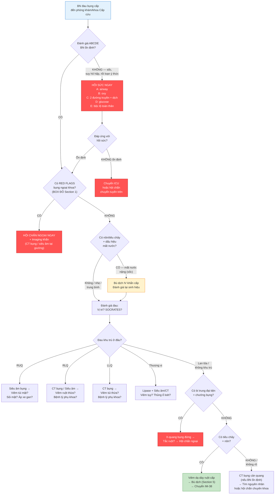

# BÀI HỌC Y KHOA: TIẾP CẬN ĐAU BỤNG CẤP VÀ NÔN/TIÊU CHẢY
****Mã bài học:** IM-35 | Ngày:** 2026-07-20 | **Chuyên khoa:** Nội khoa — Tiêu hóa | **Đối tượng:** Bác sĩ, học viên sau đại học và người học mất gốc cần học từ nền tảng

---

## 0. TỔNG QUAN — VÌ SAO BÀI NÀY QUAN TRỌNG?

Đau bụng cấp chiếm khoảng 5–10% tổng số lượt khám tại khoa Cấp cứu. Phổ bệnh trải dài từ những tình trạng tự giới hạn vô hại (như viêm dạ dày ruột do virus) cho đến những cấp cứu đe dọa tính mạng trong vòng vài giờ (như thủng tạng rỗng, vỡ phình động mạch chủ bụng, hay nhồi máu mạc treo). 

Sai lầm lớn nhất và nguy hiểm nhất trong tiếp cận đau bụng cấp là: **bỏ sót một bụng ngoại khoa vì bác sĩ quá tập trung vào việc tìm chẩn đoán Nội khoa**. Hậu quả: bệnh nhân (BN) được điều trị nội khoa trong khi tổn thương trong ổ bụng đang tiến triển → thủng tạng, viêm phúc mạc, sốc nhiễm trùng, tử vong.

Bài này dạy cách **phân luồng an toàn** ngay từ phút đầu tiên: trước khi nghĩ đến chẩn đoán cụ thể, phải trả lời được câu hỏi "đây có phải bụng ngoại khoa không?" và "BN đang ổn định hay chưa?".

**Mục tiêu của bài:**
- Nhận diện các dấu hiệu red flags của bụng ngoại khoa và cấp cứu ổ bụng
- Thực hiện phân luồng an toàn: bụng ngoại khoa (hội chẩn ngoại ngay) hay Nội khoa (đánh giá tiếp)
- Khai thác bệnh sử và khám bụng có hệ thống để định hướng chẩn đoán
- Chọn cận lâm sàng phù hợp: xét nghiệm máu, hình ảnh học theo vị trí đau
- Đánh giá mức độ mất nước ở BN nôn và tiêu chảy, chỉ định bù dịch đúng
- Biết khi nào cần chuyển tuyến khi nguồn lực không đủ để loại trừ bụng ngoại khoa

**Phạm vi của bài (scope):** Bài này tập trung vào **tư duy tiếp cận và phân luồng ban đầu**. Bài KHÔNG dạy chuyên sâu từng bệnh lý cụ thể — đó là nội dung của các bài sau (viêm tụy cấp → IM-42, xuất huyết tiêu hóa → IM-16 và IM-36, viêm ruột thừa/viêm túi mật/viêm túi thừa → các bài riêng trong Block 4).

---

> **TIÊU CHUẨN BẮT BUỘC — DẠY TỪ GỐC, KHÔNG GIỚI HẠN ĐỘ DÀI:** Viết để một người học mất gốc vẫn theo được. Trước khi dùng một thuật ngữ, chữ viết tắt, chỉ số, cơ quan, cơ chế, thủ thuật hoặc quyết định điều trị lần đầu, phải giải thích bằng tiếng Việt đơn giản: **nó là gì → bình thường hoạt động ra sao → vì sao bất thường này quan trọng → nhận ra bằng cách nào → làm gì tiếp theo**. Sau lần giải thích đầu tiên, mới dùng viết tắt/thuật ngữ ngắn. Không dùng "rõ ràng", "thường quy", "theo protocol" hoặc danh sách bước trần nếu chưa giải thích lý do và ý nghĩa của hành động.

> **CÁCH GIẢI THÍCH BẮT BUỘC CHO MỖI QUY TRÌNH:** Mỗi xét nghiệm, thang điểm, thuốc, thủ thuật hoặc algorithm phải ghi theo thứ tự: **mục tiêu → khi nào dùng/không dùng → cần chuẩn bị/đầu vào gì → làm hoặc đọc kết quả như thế nào → kết quả thay đổi quyết định ra sao → bẫy/an toàn → khi nào chuyển tuyến**.

### 📋 TRƯỚC KHI ĐỌC — NỀN TẢNG CẦN DÙNG

> Để hiểu bài này, người học nên đã biết:
> - **Sinh hiệu (vital signs):** mạch, huyết áp, nhịp thở, nhiệt độ, SpO2 — cách đo, giá trị bình thường ở người lớn, và ý nghĩa khi bất thường
> - **Khám bụng cơ bản:** bốn thì nhìn – nghe – gõ – sờ; phân biệt được bụng mềm và bụng cứng; biết vị trí các cơ quan trong ổ bụng
> - **Giải phẫu phân vùng ổ bụng:** bốn vùng (trên phải, trên trái, dưới phải, dưới trái) hoặc chín vùng — mỗi vùng liên quan đến cơ quan nào
> - **Bài học tiên quyết:** IM-01 đến IM-06 (nền tảng tư duy và an toàn lâm sàng) — các bài này chưa hoàn thành
>
> **Không được chặn việc học vì thiếu prerequisite.** Vì các bài tiên quyết chưa tồn tại, mục `0.1` dưới đây sẽ dạy đủ khái niệm nền tối thiểu để hiểu và áp dụng bài này ngay.

---

### 0.1 Nền tảng tối thiểu cần dùng ngay

Trước khi đi vào tiếp cận đau bụng cấp, bạn cần nắm ba khái niệm cốt lõi:

#### A. ABCDE — đánh giá ban đầu trong 30 giây

Đây là quy trình đánh giá BN cấp cứu theo thứ tự ưu tiên sống còn — nếu bước trước bất thường, phải xử trí ngay trước khi sang bước sau:

| Chữ | Ý nghĩa | Câu hỏi đánh giá nhanh |
|---|---|---|
| **A** — Airway (Đường thở) | Đường thở có thông không? | BN có nói được không? Có tiếng thở rít (stridor) không? |
| **B** — Breathing (Hô hấp) | BN có thở đủ không? | Đếm nhịp thở trong 15 giây × 4. SpO2 bao nhiêu? Có co kéo cơ hô hấp phụ không? |
| **C** — Circulation (Tuần hoàn) | Tim có bơm đủ máu không? | Mạch nhanh/yếu? HA tụt? Đổ đầy mao mạch (CRT — capillary refill time: đè trắng móng tay rồi thả, đếm giây đến khi hồng trở lại — bình thường ≤2 giây)? Chi lạnh? Vân tím? |
| **D** — Disability (Thần kinh) | Tri giác có ổn không? | AVPU (Alert/Voice/Pain/Unresponsive). Đường huyết mao mạch. |
| **E** — Exposure (Bộc lộ) | Còn tổn thương gì không thấy? | Cởi quần áo đủ để khám toàn thân (giữ ấm). Dấu hiệu chấn thương, xuất huyết dưới da, ban. |

**Nguyên tắc sống còn:** Nếu C bất thường (HA tụt, mạch nhanh, chi lạnh) → BN đang trong tình trạng sốc. Phải xử trí sốc song song với tìm nguyên nhân đau bụng — không được trì hoãn hồi sức để chờ kết quả xét nghiệm hay hình ảnh.

#### B. Sinh hiệu bắt buộc — đo và lặp lại

Mọi BN đau bụng cấp đến khám phải được đo **đủ 5 chỉ số**:
- **Mạch** (bình thường 60–100 lần/phút khi nghỉ). Mạch >100: nhịp nhanh — có thể do đau, sốt, mất nước, hoặc sốc. Mạch >120 + HA tụt: cao khả năng sốc.
- **Huyết áp** (bình thường ~120/80 mmHg). HA tâm thu <90 mmHg hoặc tụt >40 mmHg so với HA nền: tụt huyết áp có ý nghĩa.
- **Nhịp thở** (bình thường 12–20/phút). Thở nhanh >20: có thể do đau, nhiễm toan chuyển hóa, hoặc suy hô hấp.
- **Nhiệt độ** (bình thường 36.5–37.5°C). Sốt >38°C gợi ý nhiễm trùng. Không sốt KHÔNG loại trừ nhiễm trùng nặng (đặc biệt ở người già, suy giảm miễn dịch, đang dùng steroids).
- **SpO2** (độ bão hòa oxy mao mạch, bình thường ≥95% ở khí phòng). <92%: cần oxy bổ sung ngay và tìm nguyên nhân.

**Nguyên tắc quan trọng:** Sinh hiệu không phải đo một lần rồi thôi. Phải **lặp lại** để đánh giá xu hướng: BN đang ổn định lên hay xấu đi?

#### C. Giải phẫu phân vùng ổ bụng — cơ sở của chẩn đoán định khu

Ổ bụng được chia thành bốn vùng (dùng phổ biến nhất trong lâm sàng) hoặc chín vùng (chi tiết hơn). Mỗi vùng liên quan đến các cơ quan khác nhau, giúp định hướng nguyên nhân:

**Bốn vùng (giao điểm: rốn):**

| Vùng | Tên tiếng Anh | Cơ quan chính |
|---|---|---|
| Trên phải | RUQ — Right Upper Quadrant | Gan, túi mật, đường mật, tá tràng, đầu tụy, thận phải, đại tràng góc gan, phổi phải (đáy) |
| Trên trái | LUQ — Left Upper Quadrant | Dạ dày, lách, đuôi tụy, thận trái, đại tràng góc lách, phổi trái (đáy) |
| Dưới phải | RLQ — Right Lower Quadrant | Ruột thừa, manh tràng, hồi tràng cuối, buồng trứng phải + vòi trứng phải (nữ), niệu quản phải |
| Dưới trái | LLQ — Left Lower Quadrant | Đại tràng sigma, đại tràng xuống, buồng trứng trái + vòi trứng trái (nữ), niệu quản trái |

Vùng thượng vị (epigastric — trên rốn, giữa) và quanh rốn (periumbilical) là giao điểm của nhiều tạng: dạ dày, tá tràng, tụy, đại tràng ngang, động mạch chủ bụng.

**Nguyên tắc lâm sàng:** Vị trí đau là "manh mối số 1" để khoanh vùng chẩn đoán. Nhưng phải nhớ: **đau visceral (đau tạng) giai đoạn sớm thường mơ hồ, ở đường giữa**, và chỉ khu trú rõ khi quá trình viêm đã lan tới phúc mạc thành (parietal peritoneum). Ví dụ: viêm ruột thừa giai đoạn sớm đau quanh rốn → vài giờ sau mới khu trú xuống hố chậu phải (RLQ).

> **Nguồn kiến thức nền:** [TEXTBOOK: Gray's Anatomy for Students, 5e, Ch.4 — Abdomen]; [TEXTBOOK: Harrison's Principles of Internal Medicine, 21e, Ch.40 — Abdominal Pain]; [TEXTBOOK: Schwartz's Principles of Surgery, 11e, Ch.27 — Abdominal Wall and Acute Abdomen].

---

## 1. PHÂN TẦNG AN TOÀN ĐẦU TIÊN — BỤNG NGOẠI KHOA HAY NỘI KHOA? [CỐT LÕI]

Trước khi bạn nghĩ đến bất kỳ chẩn đoán cụ thể nào, bạn phải trả lời được câu hỏi sống còn: **BN này có cần phẫu thuật cấp cứu không?**

### 1.0 Nhắc nhanh: Cơ chế đau bụng

Đau bụng có ba loại cơ chế, và hiểu chúng giúp bạn đọc được "ngôn ngữ" của ổ bụng:

**Đau visceral (đau tạng):** Phát sinh từ chính các cơ quan nội tạng khi chúng bị căng giãn, co thắt, hoặc thiếu máu. Các thụ thể đau trong thành tạng nhạy cảm với **sức căng** (distension) và **thiếu oxy** (ischemia), nhưng không nhạy cảm với cắt hoặc đốt. Đau visceral thường **mơ hồ, khó khu trú, cảm giác như quặn hoặc đầy trướng**, thường nằm ở đường giữa vì phân bố thần kinh hai bên đối xứng.

**Đau parietal (đau phúc mạc thành):** Khi quá trình viêm từ tạng lan ra phúc mạc thành (lớp lót mặt trong thành bụng), các thụ thể đau ở đây nhạy cảm với **viêm, kéo giãn, và chất hóa học**. Đau parietal **khu trú rõ, sắc nhọn, tăng khi cử động (ho, lắc giường, đi lại)** — BN thường nằm yên, gối co.

**Đau referred (đau quy chiếu):** Đau cảm nhận ở vị trí khác xa cơ quan tổn thương, do hội tụ các đường dẫn truyền thần kinh về cùng một đoạn tủy sống. Ví dụ kinh điển: viêm túi mật có thể gây đau lan lên vai phải (do kích thích cơ hoành, thần kinh hoành C3–C5); sỏi niệu quản gây đau lan xuống bìu/môi lớn.

> **Nguồn kiến thức nền:** [TEXTBOOK: Harrison's Principles of Internal Medicine, 21e, Ch.40]; [TEXTBOOK: Sleisenger and Fordtran's GI and Liver Disease, 11e, Ch.5].

---

> 🚨 **BOX ĐỎ — RED FLAGS: DẤU HIỆU BỤNG NGOẠI KHOA — DỪNG LẠI VÀ HỘI CHẨN NGOẠI NGAY**

Trước khi tiếp tục đánh giá thường quy, hãy dừng lại và kiểm tra các dấu hiệu sau. Nếu có **bất kỳ một dấu hiệu nào**, không được trì hoãn: **hội chẩn ngoại khoa ngay lập tức**.

| # | Dấu hiệu | Nguy cơ đang bỏ sót | Hành động ngay |
|---|---|---|---|
| 1 | **Dấu hiệu phúc mạc dương tính:** bụng cứng như gỗ (rigidity), gồng cứng không chủ ý (guarding), hoặc đau dội (rebound tenderness — ấn sâu vào bụng rồi thả tay đột ngột gây đau) | Thủng tạng rỗng, viêm phúc mạc toàn thể đang tiến triển | Đặt 2 đường truyền lớn, bù dịch, kháng sinh IV ngay, chụp X-quang bụng đứng tìm liềm hơi dưới hoành, hội chẩn ngoại khẩn |
| 2 | **Bí trung đại tiện tuyệt đối + chướng bụng:** BN không đánh hơi (không xì hơi) và không đi tiêu, bụng chướng to, gõ vang | Tắc ruột cơ học, xoắn ruột, thoát vị nghẹt | Đặt sonde dạ dày hút dịch, bù dịch, chụp X-quang bụng đứng, hội chẩn ngoại |
| 3 | **Sốc + đau bụng:** HA tụt, mạch nhanh, chi lạnh, vân tím KÈM đau bụng | Vỡ phình động mạch chủ bụng (AAA — abdominal aortic aneurysm), vỡ tạng đặc (lách, gan), thủng tạng rỗng gây sốc nhiễm trùng, thai ngoài tử cung vỡ | Hồi sức sốc (dịch tinh thể, máu nếu mất máu cấp), siêu âm FAST tại giường, hội chẩn ngoại/phẫu thuật mạch máu khẩn |
| 4 | **Đau khởi phát đột ngột dữ dội ngay từ giây đầu tiên** ("thunderclap abdomen" — đau như sét đánh vào bụng) | Thủng tạng rỗng, xoắn tạng (xoắn ruột, xoắn buồng trứng), nhồi máu mạc treo cấp, vỡ phình ĐMC | Chụp CT bụng cản quang ngay nếu BN ổn định; siêu âm tại giường nếu BN không ổn định; hội chẩn ngoại khẩn |
| 5 | **Đau bụng + thai kỳ** (đặc biệt nếu trễ kinh, test thai dương tính, HA tụt) | Thai ngoài tử cung vỡ — cấp cứu sản khoa đe dọa tử vong trong vài giờ | Đặt 2 đường truyền lớn, bù dịch, nhóm máu + crossmatch, siêu âm/hội chẩn sản khoa cấp cứu ngay |
| 6 | **Đau bụng ở BN >60 tuổi**: người cao tuổi thường có triệu chứng nghèo nàn, không sốt, WBC có thể không tăng, nhưng bệnh lý nặng vẫn tiến triển | Viêm túi thừa thủng, nhồi máu mạc treo, tắc ruột do u, thủng ổ loét NSAID | Ngưỡng chụp CT thấp hơn. Đừng yên tâm vì "khám bụng mềm" — ở người già, thành bụng nhão, mất trương lực, dễ bỏ sót dấu hiệu phúc mạc |
| 7 | **Đau bụng ở BN suy giảm miễn dịch** (HIV/AIDS giai đoạn muộn, đang hóa trị, ghép tạng, dùng steroids dài hạn, xơ gan) | Nhiễm trùng cơ hội, viêm phúc mạc nguyên phát (SBP — spontaneous bacterial peritonitis), thủng đại tràng do CMV, viêm ruột thừa nhưng không có dấu hiệu điển hình | Hội chẩn ngoại + truyền nhiễm. Ngưỡng chụp CT và cấy máu thấp hơn nhiều (IDSA 2024 cIAI guidelines khuyến cáo cấy máu ở nhóm này — PMID: 38963817) |

---

### 1.1 Thuật toán phân luồng 30 giây

Khi BN đau bụng cấp bước vào (hoặc bạn tiếp nhận tại giường), đây là trình tự câu hỏi:

```
1. ABCDE ổn định không?
   ├── KHÔNG → Hồi sức ngay (A: airway, B: thở oxy, C: dịch truyền/máu, D: glucose, E: bộc lộ)
   └── CÓ → Tiếp tục ↓

2. Có RED FLAGS bụng ngoại khoa không? (BOX ĐỎ ở trên)
   ├── CÓ → HỘI CHẨN NGOẠI NGAY + imaging khẩn (CT hoặc siêu âm tại giường)
   └── KHÔNG → Tiếp tục ↓

3. Có dấu hiệu mất nước nặng (nôn/tiêu chảy) không?
   ├── CÓ → Bù dịch IV ngay, đánh giá mức độ mất nước (xem Section 5)
   └── KHÔNG → Tiếp tục ↓

4. Đánh giá đau: Vị trí đau ở đâu? → Định hướng DDx theo vị trí (xem Section 2)
   → Chọn cận lâm sàng phù hợp (xem Section 3)
   → Điều trị giảm đau an toàn (xem Section 4)
```

> ⚠️ HỌC VIÊN HAY NHẦM: "Khám bụng mềm = an toàn". Sai! Bụng mềm chỉ có nghĩa là không có dấu hiệu phúc mạc *tại thời điểm khám*. Tắc ruột non giai đoạn sớm, nhồi máu mạc treo giai đoạn đầu, viêm ruột thừa sớm chưa lan ra phúc mạc thành — tất cả đều có thể có bụng mềm nhưng vẫn là bụng ngoại khoa. Luôn đánh giá toàn cảnh (sinh hiệu, bệnh sử, yếu tố nguy cơ), không chỉ dựa vào một lần sờ bụng.

### 🛑 DỪNG 1 PHÚT — TỰ KIỂM TRA

> 1. BN nam 55 tuổi, đau bụng dữ dội đột ngột vùng thượng vị lan ra sau lưng, HA 85/50, mạch 120. Bụng mềm, không có guarding. BN này cần phẫu thuật cấp cứu không?
> 2. BN nữ 32 tuổi, đau bụng hạ vị, trễ kinh 7 tuần, test thai (+), HA 90/60. Bước đầu tiên của bạn là gì?
>
> *(Đáp án: 1. Có thể — cần loại trừ vỡ phình ĐMC hoặc viêm tụy hoại tử. Dù bụng mềm, tình trạng sốc + đau bụng dữ dội là red flag. CT bụng cản quang khẩn + hội chẩn ngoại. 2. Thai ngoài tử cung vỡ cho đến khi chứng minh ngược lại. Đặt 2 đường truyền, bù dịch, nhóm máu, hội chẩn sản khoa cấp cứu ngay. Không trì hoãn để chờ siêu âm nếu BN đang sốc.)*

---

## 2. TIẾP CẬN CÓ HỆ THỐNG — SAU KHI ĐÃ LOẠI TRỪ RED FLAGS [CỐT LÕI]

Sau khi bạn đã xác nhận BN **không có red flags bụng ngoại khoa và ổn định về mặt huyết động**, lúc này bạn mới có thời gian để khai thác bệnh sử và khám bụng một cách có hệ thống. Nhưng luôn nhớ: **đánh giá này có thể bị gián đoạn bất cứ lúc nào nếu BN xấu đi**.

> **Nguồn:** Cartwright SL, Knudson MP. Evaluation of Acute Abdominal Pain in Adults. *Am Fam Physician*. 2008. PMID: 18441863. [ABSTRACT VERIFIED]

### 2.1 Bệnh sử — SOCRATES

Một bệnh sử tốt là "một nửa chẩn đoán". Hệ thống SOCRATES giúp bạn không bỏ sót khía cạnh nào của cơn đau:

| Chữ | Ý nghĩa | Ví dụ câu hỏi |
|---|---|---|
| **S**ite | Vị trí: đau ở đâu? BN chỉ 1 ngón tay hay cả bàn tay? | "Bác chỉ cho tôi xem chỗ đau nhất." |
| **O**nset | Khởi phát: đau bắt đầu khi nào? Đột ngột (giây) hay từ từ (giờ/ngày)? | "Bác đang làm gì khi cơn đau xuất hiện? Có nhớ chính xác giờ không?" |
| **C**haracter | Tính chất: đau kiểu gì? Quặn (colicky), rát bỏng (burning), dao đâm (stabbing), âm ỉ (dull ache), xé rách (tearing)? | "Bác thử mô tả kiểu đau — giống như dao đâm, hay như quặn từng cơn, hay nặng và âm ỉ?" |
| **R**adiation | Lan đi đâu? | "Đau có lan đi đâu không? Ra sau lưng, lên vai, xuống bìu?" |
| **A**ssociated symptoms | Triệu chứng kèm theo: nôn, tiêu chảy, táo bón, sốt, vàng da, tiểu buốt? | "Từ lúc đau, bác có nôn không? Đi tiêu lần cuối cùng là khi nào? Có sốt không?" |
| **T**iming | Diễn tiến theo thời gian: liên tục hay từng cơn? Nặng lên hay giảm đi? | "Đau có lúc nào hết hẳn không, hay đau liên tục? So với lúc mới bắt đầu, bây giờ nặng hơn hay đỡ hơn?" |
| **E**xacerbating/relieving factors | Yếu tố tăng/giảm đau: ăn vào, vận động, đại tiện, thuốc giảm đau? | "Có tư thế nào làm đỡ đau không? Bác đã uống thuốc gì chưa?" |
| **S**everity | Mức độ: đau được bao nhiêu trên thang 0–10? | "Nếu 0 là không đau, 10 là đau nhất từng trải qua, bây giờ bác đau mức mấy?" |

**Những chi tiết "vàng" trong bệnh sử:**
- Đau khởi phát đột ngột tối đa ngay từ giây đầu → thủng tạng, xoắn, hoặc sỏi niệu quản
- Đau quặn từng cơn (colicky), giữa các cơn hết đau → tắc nghẽn cơ quan rỗng (ruột, niệu quản, đường mật)
- Đau liên tục, tăng dần → viêm (appendicitis, viêm túi mật, viêm túi thừa)
- Đau lan ra sau lưng → viêm tụy, thủng ổ loét mặt sau dạ dày, phình ĐMC
- Đau lan lên vai phải → kích thích cơ hoành (viêm túi mật, áp xe dưới hoành, thủng tạng)
- Đau lan xuống bìu/môi lớn → sỏi niệu quản
- Nôn xảy ra TRƯỚC đau → gợi ý nguyên nhân Nội khoa (viêm dạ dày ruột)
- Nôn xảy ra SAU đau → gợi ý nguyên nhân Ngoại khoa (tắc ruột, viêm ruột thừa, viêm tụy)

### 2.2 Chẩn đoán phân biệt theo vị trí đau

Dựa vào vị trí đau chính, bạn khoanh vùng các bệnh lý khả dĩ (Cartwright, 2008 — PMID: 18441863):

#### Đau hạ sườn phải / thượng vị phải (RUQ pain)

| Bệnh lý | Dấu hiệu gợi ý | Xét nghiệm/Imaging đầu tay |
|---|---|---|
| Viêm túi mật cấp (acute cholecystitis) | Đau RUQ sau ăn (đặc biệt bữa ăn nhiều mỡ), sốt, Murphy (+): ấn vào điểm túi mật (bờ dưới gan, đường giữa đòn phải) khi BN hít vào → BN ngừng thở vì đau | Siêu âm bụng (dấu hiệu: thành túi mật dày >4mm, dịch quanh túi mật, sỏi kẹt cổ) |
| Sỏi đường mật (choledocholithiasis) / Viêm đường mật (cholangitis) | Đau RUQ + vàng da + sốt. Tam chứng Charcot: đau + sốt + vàng da. Ngũ chứng Reynolds: thêm HA tụt + rối loạn tri giác = viêm đường mật nhiễm trùng huyết | Siêu âm → MRCP hoặc ERCP |
| Áp xe gan (liver abscess) | Sốt cao, đau âm ỉ vùng gan, gan to, rung gan (+) | Siêu âm hoặc CT bụng |
| Viêm gan cấp (acute hepatitis) | Mệt mỏi, chán ăn, buồn nôn, vàng da, ALT/AST tăng cao | ALT, AST, bilirubin, HBsAg, anti-HCV |

#### Đau thượng vị (Epigastric pain)

| Bệnh lý | Dấu hiệu gợi ý | Xét nghiệm/Imaging đầu tay |
|---|---|---|
| Viêm tụy cấp (acute pancreatitis) | Đau thượng vị dữ dội lan ra sau lưng, nôn nhiều, BN thường ngồi cúi người ra trước cho đỡ đau. Yếu tố nguy cơ: sỏi mật, rượu | Lipase máu (tăng >3× ULN). Siêu âm/CT bụng |
| Loét dạ dày–tá tràng thủng (perforated PUD) | Đau thượng vị đột ngột như dao đâm, sau đó lan khắp bụng. Bụng cứng như gỗ | X-quang bụng đứng: liềm hơi dưới hoành. CT bụng nếu X-quang âm tính |
| Viêm dạ dày cấp (acute gastritis) | Đau rát thượng vị liên quan đến ăn uống (NSAID, rượu, thức ăn cay) | Thường lâm sàng. Nội soi nếu báo động (sụt cân, thiếu máu, nôn máu) |

#### Đau hố chậu phải (RLQ pain)

| Bệnh lý | Dấu hiệu gợi ý | Xét nghiệm/Imaging đầu tay |
|---|---|---|
| Viêm ruột thừa cấp (acute appendicitis) | Đau khởi đầu quanh rốn → di chuyển xuống RLQ trong 6–24h. Sốt nhẹ, chán ăn, buồn nôn. Dấu McBurney (+): ấn đau ở điểm 1/3 ngoài đường nối rốn–gai chậu trước trên phải | CT bụng cản quang (IV) hoặc siêu âm nếu trẻ em/phụ nữ mang thai |
| Bệnh lý buồng trứng (xoắn, nang vỡ, viêm) | Đau RLQ ở phụ nữ, có thể liên quan đến chu kỳ kinh | β-hCG (loại thai ngoài tử cung), siêu âm phụ khoa |
| Thai ngoài tử cung (ectopic pregnancy) | Trễ kinh, ra máu âm đạo bất thường, đau RLQ/LLQ, HA tụt nếu vỡ | β-hCG định lượng + siêu âm đầu dò âm đạo. Nếu BN không ổn định → phẫu thuật cấp cứu |

#### Đau hố chậu trái (LLQ pain)

| Bệnh lý | Dấu hiệu gợi ý | Xét nghiệm/Imaging đầu tay |
|---|---|---|
| Viêm túi thừa cấp (acute diverticulitis) | Đau LLQ, sốt, táo bón/tiêu chảy, BN thường >50 tuổi | CT bụng cản quang (IV + uống) |
| Bệnh lý buồng trứng (nữ) | Tương tự RLQ | β-hCG + siêu âm phụ khoa |
| Ung thư đại tràng sigma gây tắc/thủng | BN lớn tuổi, thay đổi thói quen đi tiêu, sụt cân, thiếu máu thiếu sắt | CT bụng + nội soi đại tràng sau giai đoạn cấp |

#### Đau lan tỏa / không khu trú (Diffuse pain)

| Bệnh lý | Dấu hiệu gợi ý | Xét nghiệm/Imaging đầu tay |
|---|---|---|
| Tắc ruột non (SBO — small bowel obstruction) | Đau quặn từng cơn, nôn, bí trung đại tiện. Tiền sử phẫu thuật bụng (dây dính) | X-quang bụng đứng: mức nước–hơi (air-fluid levels), quai ruột giãn. CT bụng |
| Viêm dạ dày ruột cấp (acute gastroenteritis) | Tiêu chảy, nôn, sốt nhẹ, đau quặn quanh rốn, bụng mềm. Yếu tố dịch tễ: ăn thức ăn nghi ngờ, người xung quanh cùng bị | Thường lâm sàng. Cấy phân nếu có red flags (Section 6) |
| Thiếu máu mạc treo cấp (acute mesenteric ischemia) | Đau dữ dội không tương xứng với khám bụng (pain out of proportion), BN >60 tuổi, rung nhĩ, suy tim, xơ vữa mạch | CT bụng mạch máu (CTA). Lactate máu có thể tăng nhưng không đặc hiệu |
| Phình động mạch chủ bụng vỡ (ruptured AAA) | Đau bụng + đau lưng dữ dội, HA tụt, khối đập theo nhịp mạch ở bụng. BN >60 tuổi, nam, hút thuốc lá | Siêu âm tại giường (FAST). CT mạch máu nếu BN ổn định |

### 2.3 Khám bụng có hệ thống

Khám bụng đi theo trình tự — **nhưng luôn bắt đầu từ vị trí xa nơi đau nhất**, để BN không gồng cứng từ đầu:

1. **Nhìn (Inspection):** Sẹo mổ cũ? Bụng chướng? Khối phồng vùng bẹn (thoát vị nghẹt)? Dấu hiệu Cullen (bầm tím quanh rốn — viêm tụy hoại tử xuất huyết) hoặc Grey-Turner (bầm tím mạng sườn — viêm tụy hoại tử)?

2. **Nghe (Auscultation):** Nhu động ruột (bowel sounds): tăng (viêm dạ dày ruột, tắc ruột sớm), giảm hoặc mất (tắc ruột muộn, liệt ruột do viêm phúc mạc). Nghe ít nhất 2 phút ở một vị trí trước khi kết luận "mất nhu động ruột".

3. **Gõ (Percussion):** Gõ vang toàn bụng → gợi ý tắc ruột (hơi). Gõ đục vùng thấp khi BN nằm nghiêng → dịch tự do ổ bụng (cổ trướng). Gõ đau khu trú → viêm phúc mạc tại chỗ.

4. **Sờ (Palpation):** Bắt đầu từ vị trí xa nơi đau nhất, sờ nhẹ trước rồi sâu dần. Quan sát nét mặt BN, không hỏi "có đau không?" (BN sẽ tự động gồng). Hỏi "bác thấy chỗ nào đau nhất?". Kiểm tra:
   - **Guarding:** gồng cứng thành bụng không chủ ý khi chạm vào → viêm phúc mạc
   - **Rigidity:** cứng như gỗ, không thể ấn lún → viêm phúc mạc toàn thể, thủng tạng
   - **Rebound tenderness:** ấn sâu từ từ rồi bỏ tay đột ngột → đau khi bỏ tay là dương tính → dấu hiệu viêm phúc mạc

5. **Khám bẹn (bắt buộc!):** Nhìn và sờ lỗ bẹn hai bên, yêu cầu BN ho hoặc rặn → tìm thoát vị nghẹt (incarcerated hernia). Đây là một trong những nguyên nhân tắc ruột bị bỏ sót nhiều nhất.

6. **Thăm trực tràng (khi có chỉ định):** Phân trong bóng trực tràng? Máu? Khối u? Túi cùng Douglas đầy đau (gợi ý viêm phúc mạc hoặc áp xe vùng chậu)?

> ⚠️ HỌC VIÊN HAY NHẦM: "Không sờ thấy bụng cứng = không có bụng ngoại khoa". Đây là sai lầm chết người. Ở BN béo phì, thành bụng dày → khó phát hiện guarding. Ở người già, cơ bụng nhão → dấu hiệu phúc mạc bị che lấp. Ở BN đang dùng thuốc giảm đau/steroids → phản ứng viêm bị ức chế. Luôn đánh giá LÂM SÀNG TOÀN CẢNH, đừng chỉ dựa vào một lần sờ bụng.

### 🛑 DỪNG 1 PHÚT — TỰ KIỂM TRA

> 1. BN nam 45 tuổi, đau bụng quanh rốn 8 tiếng, bây giờ đau tập trung ở hố chậu phải. Sốt 38°C. Bạn chọn imaging gì?
> 2. BN nữ 70 tuổi, đau LLQ 3 ngày, sốt 38.5°C, táo bón. Test thai (-). Chẩn đoán nghĩ đến đầu tiên là gì? Chọn imaging gì?
>
> *(Đáp án: 1. Viêm ruột thừa cấp là chẩn đoán hàng đầu. CT bụng cản quang IV là imaging lựa chọn cho RLQ pain ở người lớn (Cartwright, 2015 — PMID: 25884745). 2. Viêm túi thừa đại tràng sigma là chẩn đoán hàng đầu. CT bụng cản quang (IV + uống) là imaging lựa chọn cho LLQ pain (Cartwright, 2015).)*

---

## 3. CẬN LÂM SÀNG THÔNG MINH [CỐT LÕI]

Cận lâm sàng trong đau bụng cấp phải phục vụ câu hỏi lâm sàng — không phải là "order tất cả để an toàn".

> **Nguồn:** Cartwright SL, Knudson MP. Diagnostic Imaging of Acute Abdominal Pain in Adults. *Am Fam Physician*. 2015. PMID: 25884745. [ABSTRACT VERIFIED]; Bonomo RA et al. 2024 IDSA cIAI. *Clin Infect Dis*. 2024. PMID: 38965057. [GUIDELINE VERIFIED]

### 3.1 Xét nghiệm máu — ý nghĩa và giới hạn

Mỗi xét nghiệm phải có lý do. Đây không phải là "bộ xét nghiệm thường quy" — mỗi chỉ số phải trả lời một câu hỏi cụ thể:

| Xét nghiệm | Câu hỏi trả lời | Khi nào cần? | Bẫy / Giới hạn |
|---|---|---|---|
| **CTM (CBC)** | Có thiếu máu (mất máu)? Có nhiễm trùng (WBC tăng)? | Hầu hết BN đau bụng cấp | WBC bình thường KHÔNG loại trừ nhiễm trùng nặng. Người già, suy giảm miễn dịch, đang dùng steroids có thể WBC bình thường dù nhiễm trùng nặng. |
| **CRP** | Có viêm không? | Kèm CTM, hỗ trợ chẩn đoán viêm | CRP tăng sau 6–12h khởi phát viêm — nếu BN đau mới 2h, CRP có thể chưa tăng. CRP rất cao (>150) gợi ý nhiễm trùng nặng hoặc viêm tụy hoại tử. |
| **Urea, Creatinin** | Chức năng thận có ổn không? Mất nước nặng không? | Nôn/tiêu chảy (mất nước), BN lớn tuổi, chuẩn bị chụp CT cản quang | Creatinin bình thường không loại trừ mất nước đáng kể (thận còn bù). Tỉ lệ urea/creatinin >20:1 gợi ý mất nước. |
| **Điện giải đồ** | Rối loạn điện giải do nôn/tiêu chảy? (hạ K+, hạ Na+) | Nôn nhiều, tiêu chảy nhiều | Cần bù điện giải trước khi bù dịch đơn thuần. |
| **Glucose** | Hạ đường huyết (gây đau bụng, nôn)? Tăng đường huyết (DKA gây đau bụng)? | Mọi BN đau bụng cấp (là một phần của ABCDE — D) | Hạ đường huyết có thể gây đau bụng, nôn, và rối loạn tri giác. Đừng bỏ sót. |
| **Lipase** | Nghi ngờ viêm tụy cấp? | Đau thượng vị lan ra sau lưng, nôn nhiều, yếu tố nguy cơ (sỏi mật, rượu) | Lipase tăng >3 lần giới hạn trên bình thường (ULN) là tiêu chuẩn chẩn đoán. Lipase đặc hiệu hơn amylase. |
| **AST, ALT, Bilirubin, ALP** | Bệnh lý gan mật? | Đau RUQ, vàng da, sốt, nước tiểu sẫm màu | ALT tăng ưu thế → viêm gan. ALP + bilirubin tăng ưu thế → tắc mật. |
| **Lactate** | Thiếu máu mô? Thiếu máu mạc treo? Sepsis? | Sốc, đau bụng dữ dội không tương xứng với khám, BN >60 tuổi | Lactate tăng trong thiếu máu mô NHƯNG có thể bình thường trong thiếu máu mạc treo giai đoạn sớm. Lactate bình thường KHÔNG LOẠI TRỪ thiếu máu mạc treo. |
| **β-hCG** | Có thai không? (đặc biệt thai ngoài tử cung) | **BẮT BUỘC ở mọi phụ nữ tuổi sinh đẻ bị đau bụng**, bất kể BN nói "không thể có thai" | Thai ngoài tử cung là chẩn đoán không được bỏ sót — là nguyên nhân tử vong hàng đầu trong 3 tháng đầu thai kỳ. Luôn làm test thai. |

### 3.2 Hình ảnh học — chọn đúng loại, đúng chỉ định

Không phải cứ đau bụng là chụp CT. Chọn imaging theo vị trí đau và câu hỏi lâm sàng (Cartwright, 2015 — PMID: 25884745; ACR Appropriateness Criteria):

#### Siêu âm bụng (Ultrasound — US)

- **Là gì:** Dùng sóng âm thanh tần số cao tạo hình ảnh cơ quan trong ổ bụng. Không bức xạ, an toàn trong thai kỳ.
- **Khi nào dùng:**
  - **Đau RUQ:** Siêu âm là imaging đầu tay. Đánh giá túi mật (sỏi, dấu hiệu viêm: thành dày >4mm, dịch quanh túi mật, Murphy siêu âm dương tính), đường mật (giãn >6mm), gan, thận phải.
  - **Phụ nữ mang thai:** Luôn chọn siêu âm trước, tránh CT vì bức xạ.
  - **Trẻ em:** Ưu tiên siêu âm trong nghi ngờ viêm ruột thừa, lồng ruột.
  - **Nghi ngờ bệnh lý phụ khoa:** Siêu âm đầu dò âm đạo là imaging lựa chọn.
- **Bẫy:** Siêu âm phụ thuộc người làm (operator-dependent). Ruột thừa bình thường hoặc nằm sau manh tràng có thể không thấy được. Nếu siêu âm không kết luận được và nghi ngờ lâm sàng cao → chụp CT.

#### CT bụng (Computed Tomography)

- **Là gì:** Dùng tia X với nhiều lát cắt ngang, tái tạo hình ảnh chi tiết cấu trúc ổ bụng. Có thể dùng thuốc cản quang đường tĩnh mạch (IV contrast) và/hoặc đường uống (oral contrast).
- **Khi nào dùng:**
  - **Đau RLQ/LLQ:** CT với cản quang IV là imaging lựa chọn (nghi ngờ viêm ruột thừa, viêm túi thừa).
  - **Đau lan tỏa + nghi ngờ tắc ruột:** CT với cản quang IV (oral contrast thường không cần vì dịch trong ruột đã là "cản quang tự nhiên").
  - **Đau bụng + sốc:** CT là imaging lựa chọn nếu BN ổn định để chụp.
  - **Sau chấn thương bụng:** CT với cản quang IV.
  - **Nghi ngờ thủng tạng (X-quang âm tính):** CT có độ nhạy cao hơn X-quang trong phát hiện khí tự do ổ bụng.
- **Bẫy:**
  - Cản quang IV chống chỉ định nếu suy thận (eGFR <30) hoặc dị ứng cản quang nặng.
  - BN không ổn định KHÔNG được đưa đi chụp CT — làm siêu âm tại giường (FAST) hoặc phẫu thuật thám sát.
  - CT bụng thường quy không phát hiện được sỏi niệu quản nhỏ không cản quang → cần CT không cản quang (CT KUB) hoặc siêu âm.

#### X-quang bụng đứng

- **Là gì:** Phim chụp X-quang bụng ở tư thế đứng, cho thấy phân bố hơi và mức nước–hơi trong ruột.
- **Khi nào dùng:**
  - **Nghi ngờ thủng tạng:** tìm liềm hơi dưới hoành (free air under diaphragm).
  - **Nghi ngờ tắc ruột:** tìm mức nước–hơi (air-fluid levels), quai ruột giãn (>3cm với ruột non, >6cm với đại tràng), dấu hiệu "chuỗi hạt" (string of beads) trong tắc ruột non.
- **Bẫy:**
  - X-quang bụng đứng âm tính KHÔNG loại trừ thủng tạng (độ nhạy chỉ ~50–70%). Nếu nghi ngờ cao → CT.
  - X-quang bụng đứng KHÔNG thay thế được CT trong đau bụng cấp không rõ nguyên nhân.

### 3.3 Cấy máu — khi nào thực sự cần?

Theo IDSA 2024 cIAI guidelines (PMID: 38963817 — [GUIDELINE VERIFIED]), chỉ định cấy máu trong nhiễm trùng ổ bụng không phải là thường quy cho mọi BN:

- **Chỉ định cấy máu:** BN có dấu hiệu sepsis hoặc septic shock; BN suy giảm miễn dịch; BN nhiễm trùng ổ bụng phức tạp mức độ nặng; BN cần phẫu thuật cấp cứu.
- **Có thể không cần cấy máu:** Nhiễm trùng ổ bụng mức độ nhẹ–trung bình ở BN ổn định, không suy giảm miễn dịch (ví dụ: viêm ruột thừa chưa vỡ, viêm túi mật chưa biến chứng).

> ⚠️ **Quy tắc vàng:** Cấy máu phải được lấy **trước khi dùng kháng sinh**, nhưng **không được trì hoãn kháng sinh** nếu việc lấy máu khó khăn (VD: BN shock, ven xẹp). Trong sốc nhiễm trùng, mỗi giờ trì hoãn kháng sinh làm tăng tử vong ~8%.

### 🛑 DỪNG 1 PHÚT — TỰ KIỂM TRA

> 1. BN nữ 25 tuổi, đau RLQ, nghi viêm ruột thừa. Có thai 8 tuần. Bạn chọn imaging gì?
> 2. BN nam 70 tuổi, đau LLQ + sốt 39°C. Bạn nghi ngờ viêm túi thừa. Cần cấy máu không? Tại sao?
>
> *(Đáp án: 1. Siêu âm bụng (và siêu âm phụ khoa nếu cần). Tránh CT vì thai kỳ. Nếu siêu âm không kết luận được, MRI có thể là lựa chọn thay thế. 2. Cần cấy máu: BN >60 tuổi, sốt cao, nghi ngờ nhiễm trùng ổ bụng phức tạp — thỏa tiêu chí cấy máu theo IDSA 2024 cIAI.)*

---

## 5. HỒI SỨC MẤT NƯỚC BAN ĐẦU (STABILIZATION HANDOFF) [CỐT LÕI]

Khi bệnh nhân đau bụng cấp có kèm nôn nhiều hoặc tiêu chảy, nguy cơ lớn nhất là **sốc giảm thể tích**. Tại bước triage cấp cứu, nhiệm vụ của bạn là nhận diện sốc và bắt đầu bù dịch ngay lập tức, trước khi tìm nguyên nhân cụ thể.

Đánh giá nhanh tại giường dựa trên sinh hiệu và khám lâm sàng:

- **Mất nước nặng (Sốc giảm thể tích):** Mạch nhanh nhỏ (>120 l/p), huyết áp tụt (HA tâm thu <90 mmHg), chi lạnh, CRT >2 giây, lú lẫn/kích thích, vô niệu.
- **Mất nước nhẹ–trung bình:** Khát nước, niêm mạc miệng khô, mắt trũng, tiểu ít, sinh hiệu có thể bình thường hoặc mạch nhanh nhẹ.

### 5.2 Xử trí ban đầu tại Cấp cứu

- **Nếu có sốc/mất nước nặng:** Bắt buộc dùng đường tĩnh mạch (IV). Lập 2 đường truyền lớn, bù dịch tinh thể đẳng trương (Lactated Ringer hoặc Normal Saline) ngay lập tức. Đánh giá lại sinh hiệu liên tục.
- **Nếu mất nước nhẹ–trung bình và dung nạp đường uống:** Ưu tiên bù dịch bằng đường uống (ORS).
- **Nếu nôn nhiều không uống được:** Bù dịch tĩnh mạch hoặc dùng thuốc chống nôn để tạo điều kiện uống ORS.

> ➡️ **ĐIỀU HƯỚNG:** Sau khi bệnh nhân đã thoát sốc và sinh hiệu ổn định, việc đánh giá lại mức độ mất nước chi tiết, chọn phác đồ bù dịch duy trì theo bệnh lý, và điều trị triệu chứng tiêu chảy phải chuyển sang bài **[IM-38 — Tiêu chảy cấp/mạn và viêm đại tràng](../IM-38_Tieu_chay_va_viem_dai_trang/IM-38_Tieu_chay_va_viem_dai_trang_2026-07-20.md)**. IM-35 chỉ chịu trách nhiệm hồi sức cấp cứu ban đầu.
## 6. RANH GIỚI ĐIỀU TRỊ: TIÊU CHẢY VÀ KHÁNG SINH [CỐT LÕI]

Tại bước tiếp cận đau bụng cấp, **không chỉ định xét nghiệm phân hoặc kháng sinh kinh nghiệm thường quy cho bệnh nhân tiêu chảy**.

- Hầu hết tiêu chảy cấp là do virus và tự giới hạn.
- Việc lạm dụng kháng sinh làm tăng nguy cơ nhiễm *Clostridioides difficile* (CDI) và hội chứng ure huyết tán huyết (HUS) nếu nhiễm STEC.
- Việc chỉ định xét nghiệm phân tràn lan gây lãng phí và khó diễn giải kết quả.

> ➡️ **ĐIỀU HƯỚNG:** Để quyết định khi nào cần cấy phân, khi nào làm PCR đa mồi, cách nhận diện và xử trí CDI, nguyên tắc tránh kháng sinh trong STEC, và các ngoại lệ cần kháng sinh kinh nghiệm, hãy chuyển sang bài **[IM-38 — Tiêu chảy cấp/mạn và viêm đại tràng](../IM-38_Tieu_chay_va_viem_dai_trang/IM-38_Tieu_chay_va_viem_dai_trang_2026-07-20.md)**.
## 7. LƯU ĐỒ QUYẾT ĐỊNH LÂM SÀNG [CỐT LÕI]



**Hướng dẫn sử dụng flowchart:**
1. **Bắt đầu từ trên cùng** — ABCDE luôn là bước đầu tiên. Không được bỏ qua.
2. **Red flags (hộp đỏ):** Nếu có bất kỳ red flag nào → dừng đánh giá thường quy, chuyển sang nhánh cấp cứu. Đây là bước quan trọng nhất của flowchart.
3. **Mất nước:** Nếu BN nôn/tiêu chảy → đánh giá và bù dịch trước khi tiếp tục tìm nguyên nhân đau bụng. Bù dịch không trì hoãn chẩn đoán — làm song song.
4. **Vị trí đau → chọn imaging:** Đây là quyết định dựa trên Cartwright (2015). Siêu âm cho RUQ, CT cho RLQ/LLQ.
5. **Nhánh "không rõ":** Nếu đau lan tỏa, không có dấu hiệu tắc ruột, không có yếu tố tiêu chảy → CT bụng cản quang là imaging lựa chọn để không bỏ sót bệnh lý khu trú.
6. **Nhánh thiếu nguồn lực (Plan B):** Nếu không có CT, dựa vào lâm sàng + siêu âm + X-quang bụng đứng. Nếu không loại trừ được bụng ngoại khoa sau khi đã làm hết các xét nghiệm sẵn có → **chuyển tuyến**.

---

## 8. SAI LẦM THƯỜNG GẶP — LÂM SÀNG [CỐT LÕI]

| # | Sai lầm | Hậu quả | Cách tránh |
|---|---|---|---|
| 1 | **Không kiểm tra sinh hiệu và ABCDE** trước khi bắt đầu hỏi bệnh sử chi tiết | BN đang sốc nhưng bác sĩ mải khai thác bệnh sử 10 phút → trì hoãn hồi sức | Luôn bắt đầu bằng ABCDE và đo sinh hiệu. Nếu bất thường → hồi sức trước, hỏi bệnh sử sau. |
| 2 | **Không làm β-hCG** ở phụ nữ tuổi sinh đẻ bị đau bụng | Bỏ sót thai ngoài tử cung — nguyên nhân tử vong hàng đầu trong 3 tháng đầu thai kỳ | β-hCG là **xét nghiệm bắt buộc**, không phải "tùy chọn", cho mọi phụ nữ tuổi sinh đẻ đau bụng. |
| 3 | **Cho rằng WBC/CRP bình thường = không có bệnh nặng** | Bỏ sót thủng tạng ở BN dùng steroids, viêm ruột thừa ở người già, thiếu máu mạc treo giai đoạn sớm | WBC và CRP là công cụ hỗ trợ, không phải "máy dò bệnh nặng". Luôn dựa vào lâm sàng để quyết định. |
| 4 | **Không khám bẹn** khi BN đau bụng + nôn + bí tiêu | Bỏ sót thoát vị nghẹt — nguyên nhân tắc ruột có thể sửa được bằng phẫu thuật đơn giản | Khám bẹn là một phần bắt buộc của khám bụng. Nhìn + sờ lỗ bẹn hai bên, yêu cầu BN ho. |
| 6 | **Không giảm đau vì sợ "che lấp chẩn đoán"** | BN đau đớn không cần thiết, không hợp tác khám, có thể che lấp dấu hiệu thực thể vì gồng cứng toàn thân do đau | Bằng chứng meta-analysis 2025 (PMID: 40967062): giảm đau không làm thay đổi độ chính xác chẩn đoán. Khám bụng trước, sau đó cho thuốc giảm đau bậc thang. |
| 7 | **Đánh giá thấp mức độ mất nước** → bù dịch không đủ | Thiểu niệu → suy thận trước thận → hoại tử ống thận cấp. Sốc giảm thể tích không được nhận diện | Đánh giá sinh hiệu và tưới máu mô. Nếu có sốc/tụt HA → bù dịch tĩnh mạch khẩn cấp. |
| 8 | **Cho kháng sinh/xét nghiệm phân thường quy trong mọi ca tiêu chảy** | Tăng kháng thuốc, tiêu chảy do C. difficile, lãng phí | Đa số tiêu chảy cấp ở người lớn khỏe mạnh tự giới hạn. Bù dịch là chính tại cấp cứu. Chuyển IM-38 để quyết định xét nghiệm/kháng sinh. |
## 9. ÁP DỤNG TẠI VIỆT NAM [CỐT LÕI]

- **Tình hình dịch tễ tại Việt Nam:** Tiêu chảy nhiễm trùng là bệnh phổ biến, đặc biệt vào mùa hè và mùa mưa lũ. Các tác nhân thường gặp: virus (rotavirus, norovirus), vi khuẩn (*Salmonella*, *Shigella*, *Campylobacter*, *Vibrio cholerae*, ETEC), ký sinh trùng (*Entamoeba histolytica*, *Giardia lamblia*). Viêm ruột thừa cấp là bệnh lý ngoại khoa bụng thường gặp nhất ở người trẻ tuổi.

- **Thuốc/XN sẵn có:** 
  - ORS (Oresol) có sẵn rộng rãi, giá rẻ, không cần kê đơn.
  - Siêu âm: sẵn có ở hầu hết bệnh viện tuyến huyện trở lên. Đây là lợi thế lớn.
  - CT: có thể không có 24/7 ở tuyến huyện, hoặc có máy nhưng thiếu kỹ thuật viên đọc phim ngoài giờ.
  - X-quang bụng đứng: gần như luôn sẵn có.
  - Kháng sinh: cephalosporin thế hệ 3 (cefotaxime, ceftriaxone) và metronidazole là kháng sinh thực tế cho nhiễm trùng ổ bụng.

- **Hướng dẫn của Bộ Y tế:** Có hướng dẫn chẩn đoán và xử trí tiêu chảy nhiễm trùng cấp của Bộ Y tế. Chưa có guideline quốc gia riêng về tiếp cận đau bụng cấp không phân biệt — áp dụng guideline quốc tế (IDSA, ACG, ACR Appropriateness Criteria).

- **Khác biệt thực hành tại Việt Nam:**
  - **Plan A (có CT và siêu âm 24/7):** Làm theo flowchart Section 7. Siêu âm cho RUQ, CT cho RLQ/LLQ, X-quang bụng đứng cho nghi ngờ thủng/tắc ruột.
  - **Plan B (chỉ có siêu âm và X-quang, CT không sẵn):** 
    - Dựa vào lâm sàng (SOCRATES + khám bụng cẩn thận) và siêu âm để định hướng.
    - Siêu âm bụng tổng quát có thể phát hiện: sỏi túi mật, thành túi mật dày, dịch quanh túi mật, giãn đường mật, dịch tự do ổ bụng, quai ruột giãn, ruột thừa viêm (nếu thấy được), bệnh lý phụ khoa.
    - X-quang bụng đứng: tìm liềm hơi (thủng tạng), mức nước–hơi (tắc ruột).
    - **Nếu sau khi làm hết xét nghiệm sẵn có mà vẫn không loại trừ được bụng ngoại khoa → CHUYỂN TUYẾN.** Không trì hoãn chuyển tuyến để "theo dõi thêm" nếu BN có dấu hiệu xấu đi.
    - **Điều vẫn làm được ngay:** bù dịch, giảm đau, kháng sinh IV nếu nghi ngờ nhiễm trùng, đặt sonde dạ dày nếu nôn nhiều hoặc tắc ruột.
    - **Điều KHÔNG được suy diễn/thay thế:** không dùng siêu âm để loại trừ viêm ruột thừa nếu không thấy ruột thừa trên siêu âm. Không dùng X-quang bụng đứng âm tính để loại trừ thủng tạng nếu nghi ngờ lâm sàng cao.

---

## 10. CASE LÂM SÀNG [NÂNG CAO]

> **Yêu cầu case:** Mỗi case phải cho dữ kiện đủ để quyết định và trình bày theo 5 bước: (1) nhận diện nguy cơ/cấp cứu, (2) dữ kiện nào thay đổi xác suất hoặc lựa chọn, (3) hành động ngay, (4) theo dõi hoặc chuyển tuyến, (5) vì sao các lựa chọn sai không phù hợp.

### Case 1: Đau bụng phải — bụng ngoại khoa kinh điển

**Bệnh nhân:** Nam 25 tuổi, đau bụng quanh rốn khởi phát 8 giờ trước. Đau âm ỉ lúc đầu, sau tăng dần và di chuyển xuống hố chậu phải. Buồn nôn, chán ăn. Không nôn, không tiêu chảy, không sốt khi đến khám. Sinh hiệu: mạch 95, HA 120/80, nhiệt độ 37.8°C, SpO2 98%. Bụng: ấn đau hố chậu phải (điểm McBurney), bụng mềm, không guarding rõ. Bạch cầu 12.500/μL, CRP 45 mg/L.

**Câu hỏi:** Đây có phải bụng ngoại khoa không? Bạn làm gì tiếp theo?

*(Gợi ý trả lời:*
1. *Nhận diện nguy cơ: Đau di chuyển từ quanh rốn → HCP, điểm McBurney (+), bạch cầu tăng, CRP tăng — lâm sàng điển hình của viêm ruột thừa cấp.*
2. *Dữ kiện quyết định: Bụng mềm, không guarding, sinh hiệu ổn định → chưa có dấu hiệu thủng/viêm phúc mạc. Nhưng viêm ruột thừa là BỆNH LÝ NGOẠI KHOA — cần hội chẩn ngoại.*
3. *Hành động ngay: CT bụng cản quang IV (imaging lựa chọn cho RLQ pain — Cartwright 2015). Giảm đau (paracetamol IV). Hội chẩn ngoại. Đặt đường truyền, nhịn ăn uống (NPO) chuẩn bị phẫu thuật.*
4. *Theo dõi: Nếu CT xác nhận viêm ruột thừa chưa vỡ → phẫu thuật cắt ruột thừa (nội soi). Nếu CT âm tính → nhập viện theo dõi, khám lại sau 6–12h.*
5. *Vì sao các lựa chọn sai không phù hợp:*
   - *"Cho kháng sinh và theo dõi tại nhà": Sai — đây là bụng ngoại khoa, cần hội chẩn ngoại. Một số nghiên cứu cho thấy kháng sinh có thể điều trị viêm ruột thừa chưa biến chứng (Cochrane 2024, PMID: 38682788), nhưng đây là quyết định của BÁC SĨ NGOẠI KHOA sau khi đã chẩn đoán xác định bằng CT — không phải quyết định tại phòng khám Nội.*
   - *"Chỉ siêu âm, không cần CT": Siêu âm có thể thấy ruột thừa viêm nhưng nếu không thấy → không loại trừ được. CT là imaging lựa chọn cho RLQ ở người lớn (Cartwright 2015).)*

### Case 2: Tiêu chảy — bù dịch trước, xét nghiệm chọn lọc

**Bệnh nhân:** Nữ 28 tuổi, tiêu chảy 12 lần/ngày × 2 ngày, phân nước, không máu, kèm nôn 5 lần/ngày. Không sốt. Ăn hải sản ở quán vỉa hè trước đó 1 ngày. Sinh hiệu: mạch 110, HA 100/65 (tư thế nằm), HA đứng 90/60, nhiệt độ 37.2°C. Niêm mạc miệng khô, véo da chậm trở lại (3 giây), nước tiểu ít, màu vàng đậm. Bụng mềm, không đau khu trú.

**Câu hỏi:** Bệnh nhân này có dấu hiệu mất nước không? Bước xử trí đầu tiên tại cấp cứu là gì?

*(Gợi ý trả lời:*
1. *Nhận diện nguy cơ: Bệnh nhân có dấu hiệu mất nước (tụt HA tư thế đứng, mạch 110, véo da chậm, thiểu niệu). Bụng mềm, không red flags bụng ngoại khoa → viêm dạ dày ruột cấp.*
2. *Hành động ngay: Bù dịch tĩnh mạch (IV) do bệnh nhân có tụt HA tư thế và nôn nhiều, đánh giá đáp ứng và duy trì.*
3. *Theo dõi và chuyển hướng: Mạch, HA, nước tiểu định kỳ. Đánh giá đáp ứng với bù dịch. Sau khi huyết động ổn định, chuyển sang phác đồ IM-38 để quyết định các xét nghiệm phân và điều trị tiếp theo.*
4. *Vì sao các lựa chọn sai không phù hợp:*
   - *"Cho uống ORS đơn thuần và cho về": Sai — BN có tụt HA tư thế. Cần truyền dịch IV ban đầu, theo dõi sát.*
   - *"Cho kháng sinh ngay": Sai — không có chỉ định thường quy tại bước cấp cứu ban đầu. Chuyển IM-38 để đánh giá.*
### Case 3: Đau bụng dữ dội — "pain out of proportion"

**Bệnh nhân:** Nam 72 tuổi, đau bụng dữ dội khắp bụng khởi phát 4 giờ trước. Đau liên tục, không giảm. Tiền sử: tăng huyết áp, rung nhĩ (không dùng kháng đông vì BN tự ý bỏ thuốc). Sinh hiệu: mạch 115 (không đều), HA 150/90, nhiệt độ 37.0°C. Khám bụng: bụng mềm, ấn đau nhẹ lan tỏa, không guarding, không rebound. Bạch cầu 15.000/μL, CRP 80 mg/L, lactate 3.5 mmol/L.

**Câu hỏi:** Bạn nghĩ đến chẩn đoán gì? Tại sao khám bụng "mềm" nhưng đây vẫn có thể là bụng ngoại khoa?

*(Gợi ý trả lời:*
1. *Nhận diện nguy cơ: BN lớn tuổi, rung nhĩ không kháng đông, đau bụng dữ dội lan tỏa không tương xứng với khám bụng (bụng mềm nhưng BN đau rất nhiều), lactate tăng. Hình ảnh kinh điển của THIẾU MÁU MẠC TREO CẤP (acute mesenteric ischemia) do thuyên tắc động mạch mạc treo tràng trên từ cục máu đông trong nhĩ trái.*
3. *Hành động ngay: HỘI CHẨN NGOẠI KHẨN. Chẩn đoán hình ảnh và xử trí theo protocol cấp cứu ngoại khoa. Hồi sức tích cực.*
4. *Theo dõi: Đây là cấp cứu tối khẩn, không được trì hoãn.*
5. *Vì sao các lựa chọn sai không phù hợp:*
   - *"Bụng mềm, chắc chỉ là viêm dạ dày ruột": Sai — "pain out of proportion" là red flag kinh điển.*
   - *"Chờ thêm xét nghiệm": Sai — đây là bệnh lý khẩn cấp, trì hoãn có thể gây hậu quả nghiêm trọng.)*

---

## 11. TIPS THỰC HÀNH (CLINICAL PEARLS) [THAM KHẢO]

1. **"Đau bụng + tụt HA = cấp cứu cho đến khi chứng minh ngược lại."** Đừng mất thời gian phân vân. Đặt 2 đường truyền, bù dịch, gọi hội chẩn.
2. **"Thai ngoài tử cung vỡ là kẻ giết người thầm lặng."** Luôn làm test thai cho mọi phụ nữ tuổi sinh đẻ đau bụng. Đừng bao giờ tin BN khi họ nói "không thể có thai".
3. **"Siêu âm thấy gì thì biết cái đó, không thấy gì không có nghĩa là không có gì."** Siêu âm phụ thuộc người làm và có giới hạn. Nếu nghi ngờ lâm sàng cao và siêu âm âm tính → CT.
4. **"Người già không sốt, không tăng WBC — nhưng vẫn có thể thủng tạng."** Ở BN >65 tuổi, hạ thấp ngưỡng chụp CT và hội chẩn ngoại.
5. **"Nôn TRƯỚC đau = Nội khoa. Đau TRƯỚC nôn = Ngoại khoa."** Đây là quy tắc đơn giản nhưng hữu ích. Viêm dạ dày ruột: nôn là triệu chứng đầu tiên. Tắc ruột, viêm ruột thừa: đau xuất hiện trước, nôn là hậu quả.
6. **"Đánh giá mất nước là ưu tiên số 1 ở bệnh nhân tiêu chảy/nôn."** Đừng vội tìm nguyên nhân nếu huyết áp bệnh nhân đang tụt.
7. **"Khám bẹn — 30 giây có thể cứu một mạng người."** Thoát vị nghẹt là nguyên nhân tắc ruột phổ biến nhưng dễ bị bỏ sót. Luôn khám bẹn.
8. **"Bàn giao đầy đủ: 'Nếu BN xấu đi, gọi ai?'"** Khi chuyển BN từ cấp cứu lên khoa hoặc chuyển viện, phải ghi rõ: ngưỡng sinh hiệu cần báo động, số điện thoại bác sĩ trực, tiêu chí kích hoạt hội chẩn ngoại lại.
## 12. TỔNG KẾT — 10 ĐIỂM CẦN NHỚ [CỐT LÕI]

1. **ABCDE trước, hỏi bệnh sử sau.** BN không ổn định → hồi sức ngay, không trì hoãn.
2. **Bụng ngoại khoa có 7 red flags:** dấu hiệu phúc mạc (+), bí trung đại tiện + chướng bụng, sốc + đau, đau đột ngột dữ dội, đau + thai kỳ, đau ở BN >60 tuổi, đau ở BN suy giảm miễn dịch. Có 1 trong 7 → hội chẩn ngoại ngay.
3. **Vị trí đau định hướng chẩn đoán và imaging:** RUQ → siêu âm; RLQ/LLQ → CT; thượng vị → lipase + CT; lan tỏa → CT hoặc X-quang bụng đứng.
4. **Giảm đau an toàn và nhân đạo:** Meta-analysis 2025 (47 studies, n=8.347) chứng minh giảm đau không che lấp chẩn đoán. Khám bụng trước, sau đó giảm đau bậc thang.
5. **β-hCG là xét nghiệm BẮT BUỘC** cho mọi phụ nữ tuổi sinh đẻ bị đau bụng, bất kể BN nói gì. Thai ngoài tử cung vỡ giết BN trong vài giờ.
6. **Mất nước chia 2 nhóm chính tại cấp cứu:** Nặng (sốc giảm thể tích) → bù dịch IV khẩn cấp; Nhẹ–trung bình → ưu tiên ORS nếu uống được.
7. **Đánh giá mất nước là ưu tiên số 1 ở bệnh nhân tiêu chảy/nôn.** Đừng vội tìm nguyên nhân nếu huyết áp bệnh nhân đang tụt.
8. **Không kháng sinh/xét nghiệm phân thường quy cho tiêu chảy cấp:** Đa số là virus và tự giới hạn. Bù dịch là chính. Chuyển IM-38 để quyết định các bước tiếp theo.
9. **Plan B khi thiếu CT:** Siêu âm + X-quang bụng đứng + lâm sàng. Nếu không loại trừ được bụng ngoại khoa → CHUYỂN TUYẾN. Không trì hoãn.

---

### 🛑 TỰ KIỂM TRA CUỐI BÀI

> 1. BN nữ 30 tuổi, đau bụng hạ vị đột ngột dữ dội, HA 80/50, mạch 130, test thai (+). Bạn làm gì trong 5 phút đầu tiên?
> 2. BN nam 65 tuổi, đau bụng âm ỉ 2 ngày, không sốt, WBC 9.000, CRP 10. Đau tăng lên hố chậu trái. CT được không? Nếu CT không có, Plan B là gì?
>
> *(Đáp án: 1. Thai ngoài tử cung vỡ → đặt 2 đường truyền, bù dịch (bolus 1–2L), nhóm máu + crossmatch, hội chẩn sản khoa cấp cứu ngay. 2. Nghi ngờ viêm túi thừa — có chỉ định CT. Nếu không có CT: siêu âm tìm dấu hiệu viêm túi thừa (thành đại tràng dày, mỡ quanh đại tràng tăng âm) + theo dõi lâm sàng sát. Nếu không loại trừ được áp xe hoặc thủng → chuyển tuyến.)*

---

## 13. TÀI LIỆU THAM KHẢO

**Quy tắc annotation tag (BẮT BUỘC):**

| Tag | Khi dùng |
|---|---|
| `[FETCHED]` | Tối thiểu — abstract đã fetch, PMID tồn tại |
| `[DIRECTION ONLY]` | Claim định hướng (tăng/giảm/cải thiện), không số |
| `[ABSTRACT VERIFIED]` | Claim qualitative đã đối chiếu abstract |
| `[FULL VERIFIED]` | SỐ LIỆU CỤ THỂ (RR, CI, %, n=) — đã đối chiếu full text |
| `[GUIDELINE VERIFIED]` | Guideline chính thức, đã xác nhận version hiện hành |

**References:**

1. **Cartwright SL, Knudson MP. (2008)** "Evaluation of Acute Abdominal Pain in Adults." *Am Fam Physician.* PMID: **18441863**. [ABSTRACT VERIFIED]
2. **Cartwright SL, Knudson MP. (2015)** "Diagnostic Imaging of Acute Abdominal Pain in Adults." *Am Fam Physician.* PMID: **25884745**. [ABSTRACT VERIFIED]
3. **Shane AL, Mody RK, Crump JA et al. (2017)** "2017 Infectious Diseases Society of America Clinical Practice Guidelines for the Diagnosis and Management of Infectious Diarrhea." *Clin Infect Dis.* PMID: **29194529**. [GUIDELINE VERIFIED]
4. **Riddle MS, DuPont HL, Connor BA. (2016)** "ACG Clinical Guideline: Diagnosis, Treatment, and Prevention of Acute Diarrheal Infections in Adults." *Am J Gastroenterol.* PMID: **27068718**. [GUIDELINE VERIFIED]
5. **Bonomo RA, Chow AW, Edwards MS et al. (2024)** "2024 Clinical Practice Guideline Update by the Infectious Diseases Society of America on Complicated Intra-abdominal Infections: Risk Assessment, Diagnostic Imaging, and Microbiological Evaluation in Adults, Children, and Pregnant People." *Clin Infect Dis.* PMID: **38965057**. [GUIDELINE VERIFIED]
6. **Bonomo RA, Humphries R, Abrahamian FM et al. (2024)** "2024 Clinical Practice Guideline Update by the IDSA on Complicated Intra-abdominal Infections: Utility of Blood Cultures." *Clin Infect Dis.* PMID: **38963817**. [GUIDELINE VERIFIED]
7. **Bonomo RA, Edwards MS, Abrahamian FM et al. (2024)** "2024 Clinical Practice Guideline Update by the IDSA on Complicated Intraabdominal Infections: Diagnostic Imaging of Suspected Acute Cholecystitis and Acute Cholangitis." *Clin Infect Dis.* PMID: **38963820**. [GUIDELINE VERIFIED]
8. **Kanani F, Messer N, Khalil M et al. (2025)** "Effectiveness of Standardized Pain Management Protocols for Acute Abdominal Pain in Emergency Departments: A Systematic Review and Meta-Analysis." *J Emerg Med.* PMID: **40967062**. [ABSTRACT VERIFIED]
9. **Doleman B, Fonnes S, Lund JN et al. (2024)** "Appendectomy versus Antibiotic Treatment for Acute Appendicitis." *Cochrane Database Syst Rev.* PMID: **38682788**. [ABSTRACT VERIFIED]

**Nguồn kiến thức nền (textbook):**
- Gray's Anatomy for Students, 5th Edition, Chapter 4 — Abdomen
- Harrison's Principles of Internal Medicine, 21st Edition, Chapter 40 — Abdominal Pain; Chapter 190 — Acute Infectious Diarrheal Diseases
- Sleisenger and Fordtran's Gastrointestinal and Liver Disease, 11th Edition, Chapter 5 — Intestinal Fluid and Electrolyte Movement
- Schwartz's Principles of Surgery, 11th Edition, Chapter 27 — Abdominal Wall and Acute Abdomen
- WHO Pocket Book of Hospital Care for Adults, 2nd Edition — Fluid Resuscitation

---
**— Hết bài học ngày 2026-07-20 —**

**Bác sĩ:** Ngọc Hưng 🍅 🐈‍⬛ | **AI:** DeepSeek (ocg)