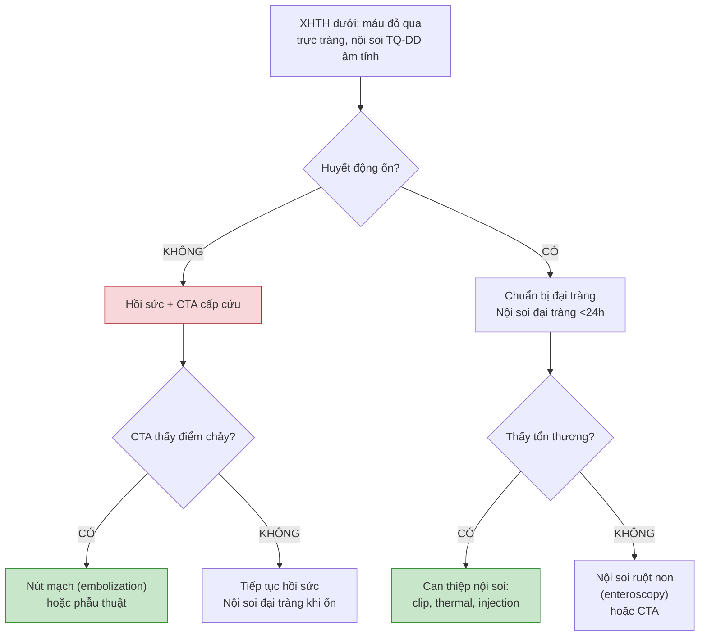

# BÀI HỌC Y KHOA: IM-36 — XUẤT HUYẾT TIÊU HÓA TRÊN & DƯỚI SAU HỒI SỨC
**Ngày:** 2026-07-19 | **Chuyên khoa:** Nội khoa người lớn — Tiêu hóa & Gan mật | **Đối tượng:** Bác sĩ tuyến tỉnh, học viên đã học IM-16

---

## 0. TỔNG QUAN — VÌ SAO BÀI NÀY QUAN TRỌNG?

**Tình huống:** Bệnh nhân nam 55 tuổi (từ ca IM-16) đã được hồi sức ổn định: 2 đường truyền, PPI IV, erythromycin, Hb ổn ở 8.5 sau truyền 1 đơn vị PRBC. Nội soi TQ-DD phát hiện ổ loét hành tá tràng 8mm, đáy có cục máu đông bám dính — Forrest IIb. Bạn làm gì tiếp?

IM-16 dạy giữ bệnh nhân sống trong 60 phút đầu. **IM-36 dạy phần còn lại của cuộc chiến:** đọc kết quả nội soi → phân loại Forrest → quyết định can thiệp → chọn đúng kỹ thuật → điều trị nguyên nhân gốc → dự phòng tái phát → xử lý XHTH dưới khi nội soi trên âm tính.

**Mục tiêu của bài:**
- Phân loại Forrest (Ia–III) và ra quyết định can thiệp nội soi.
- Chọn kỹ thuật nội soi cầm máu: clip, nhiệt, tiêm epinephrine + dual therapy, EVL, keo sinh học.
- Tính Rockall score đầy đủ sau nội soi.
- Điều trị nguyên nhân: H. pylori, quản lý NSAID/aspirin, PPI duy trì.
- Dự phòng tái xuất huyết non-variceal và variceal (NSBB + EVL định kỳ).
- Tiếp cận XHTH dưới: CT angiography, nội soi đại tràng, nút mạch.

> **TIÊU CHUẨN BẮT BUỘC:** Không lặp lại ABCDE, hồi sức dịch/máu, thuốc ban đầu (PPI IV, terlipressin, KS, erythromycin), GBS/AIMS65, phân luồng nội soi cấp cứu — đã dạy trong IM-16.

### 📋 TRƯỚC KHI ĐỌC

> - **IM-16:** Hồi sức 0–60 phút, restrictive transfusion, thuốc ban đầu, GBS/AIMS65. Link: `../IM-16_Xuat_huyet_tieu_hoa_cap/`
> - **IM-40:** Sinh lý tăng áp cửa, varices, bệnh não gan — giúp hiểu phần dự phòng variceal. Link: `../IM-40_Xo_gan_tang_ap_cua/`
> - **Nội soi TQ-DD cơ bản:** cần để hiểu mô tả tổn thương Forrest.
>
> Nếu chưa học IM-40, Section 7 dạy đủ khái niệm NSBB và EVL.

---

## 1. CHẨN ĐOÁN PHÂN BIỆT NGUỒN CHẢY SAU NỘI SOI [CỐT LÕI]

### 1.0 Nhắc nhanh

IM-16 phân biệt XHTH trên/dưới qua lâm sàng: nôn máu + phân đen → trên; máu đỏ qua trực tràng → dưới (hoặc trên lượng lớn). IM-36 bắt đầu từ kết quả nội soi.

### 1.1 Ba tình huống sau nội soi TQ-DD

| Kết quả | Hành động |
|---|---|
| **Thấy tổn thương** | Phân loại Forrest → can thiệp nếu cần → điều trị nguyên nhân |
| **Tổn thương không phải nguồn chảy** | Đánh giá thêm (vd: loét cũ đã lành + máu đỏ → tìm nguồn dưới) |
| **Không thấy tổn thương** | Nghĩ XHTH dưới hoặc ruột non → CT angiography (xem Section 8) |

### 1.2 Phân biệt variceal vs non-variceal qua nội soi

| Đặc điểm | Non-variceal (loét, vỡ mạch) | Variceal (TMTQ, TM dạ dày) |
|---|---|---|
| **Vị trí** | Bờ cong nhỏ, hang vị, hành tá tràng | Thực quản đoạn dưới (trên Z-line), đáy vị |
| **Hình thái** | Ổ loét bờ rõ, đáy fibrin/hematin, có thể thấy visible vessel | Búi TM nổi gồ, xanh/tím, red wale marking, nipple sign |
| **Can thiệp** | Clip, thermal, injection | EVL (thắt), keo cyanoacrylate (TM dạ dày) |
| **Điều trị sau** | PPI + H. pylori/ngưng NSAID | NSBB + EVL định kỳ đến hết varices |

> ⚠️ HỌC VIÊN HAY NHẦM: "Thấy loét → đó là nguyên nhân duy nhất." BN xơ gan vừa có loét vừa có TMTQ. Luôn kiểm tra toàn bộ thực quản và đáy vị.

### 🛑 DỪNG 1 PHÚT

> BN xơ gan Child B, nội soi: loét hang vị Forrest IIc + TMTQ độ II có red wale marking. Nôn máu đỏ tươi. Nguồn chảy từ đâu?
>
> *(Đáp án: Khả năng cao từ vỡ TMTQ — máu đỏ tươi + red wale. Loét Forrest IIc là nguy cơ thấp, ít gây nôn máu đỏ tươi.)*

---

## 2. PHÂN LOẠI FORREST — QUYẾT ĐỊNH CAN THIỆP [CỐT LÕI]

### 2.1 Forrest là gì?

Phân loại Forrest mô tả **stigmata xuất huyết gần đây** ở đáy ổ loét dạ dày–tá tràng, dự đoán nguy cơ tái xuất huyết nếu không can thiệp. Đây là công cụ quyết định: can thiệp nội soi hay chỉ dùng PPI. [TEXTBOOK: Sleisenger and Fordtran's GI and Liver Disease, 11e.]

### 2.2 Bảng phân loại

| Phân độ | Mô tả | Nguy cơ tái XH (không can thiệp) | Can thiệp? |
|---|---|---|---|
| **Ia** | Chảy thành tia (spurting) | ~90% | **CÓ — cấp cứu** |
| **Ib** | Chảy rỉ (oozing) | ~55% | **CÓ — cấp cứu** |
| **IIa** | Mạch máu nhìn thấy (visible vessel) — nốt trắng/xanh nổi, không đang chảy | ~40–50% | **CÓ** |
| **IIb** | Cục máu đông bám dính (adherent clot) | ~20–30% | Cân nhắc (rửa → đánh giá lại) |
| **IIc** | Đáy phủ hematin sẫm (flat pigmented spot) | ~7–10% | KHÔNG |
| **III** | Đáy sạch, fibrin trắng | ~3–5% | KHÔNG |

### 2.3 Quy tắc vàng

- **Ia, Ib, IIa → PHẢI can thiệp.** ESGE 2021 và ACG 2021: strong recommendation.
- **IIb → rửa sạch bằng water jet.** Nếu thấy IIa hoặc Ia/Ib bên dưới → can thiệp. Nếu đáy sạch → PPI đơn thuần. Xu hướng: can thiệp cho hầu hết IIb nếu GBS cao.
- **IIc, III → không can thiệp.** PPI đơn thuần, xuất viện sớm nếu ổn định.

> ⚠️ HỌC VIÊN HAY NHẦM: "Forrest IIa không chảy máu → không cần làm gì." **SAI.** Visible vessel là nút tiểu cầu bịt lỗ mạch — nó SẼ vỡ. Nguy cơ tái XH ~40–50%.

### 🛑 DỪNG 1 PHÚT

> Ổ loét hành tá tràng: nốt trắng nổi ở đáy, không chảy máu → Forrest mấy? Can thiệp không?
>
> *(Đáp án: Forrest IIa — PHẢI can thiệp. Nguy cơ tái XH ~40–50% nếu không.)*

---

## 3. KỸ THUẬT NỘI SOI CẦM MÁU [CỐT LÕI]

### 2.4 Tại sao Forrest quan trọng trong thực hành?

Forrest không phải là bài tập phân loại học thuật — nó trực tiếp quyết định hành động của bạn trong phòng nội soi. Trước Forrest, các bác sĩ nội soi quyết định can thiệp dựa trên "cảm giác" hoặc kinh nghiệm cá nhân. Forrest chuẩn hóa quyết định này bằng bằng chứng: các phân độ dựa trên quan sát theo dõi BN không được can thiệp nội soi và ghi nhận tỉ lệ tái XH thực tế.

**Forrest IIb — vùng xám:** Đây là phân độ gây tranh cãi nhất. Một số guideline khuyên can thiệp, số khác khuyên rửa rồi đánh giá lại. Trong thực tế: nếu BN có GBS cao, đang dùng kháng đông, hoặc không thể nội soi lại dễ dàng (vd: BV tuyến huyện chuyển lên) → xu hướng can thiệp luôn. Nếu BN trẻ, GBS thấp, không dùng kháng đông → có thể rửa và quan sát.

**Mẹo nội soi:** Dùng water jet để rửa cục máu đông — không dùng kẹp sinh thiết để gắp vì có thể làm bong cục máu đông và gây chảy máu lại. Nếu sau rửa thấy visible vessel (IIa) → chuyển thành can thiệp như IIa.

### 2.5 Cạm bẫy khi phân loại Forrest

- **Nhầm visible vessel (IIa) với cục máu đông nhỏ (IIb):** Visible vessel màu trắng ngà/xanh, nổi hẳn. Cục máu đông đỏ sẫm/đen, phẳng hơn. Nếu không chắc → rửa.
- **Nhầm hematin (IIc) với máu đang chảy (Ib):** Hematin nâu đen, phẳng, không lan khi rửa. Ib đỏ tươi, lan ra khi rửa.
- **Bỏ sót tổn thương thứ hai:** Kiểm tra toàn bộ dạ dày và tá tràng. Không dừng ở tổn thương đầu tiên.
- **PPI làm "hạ cấp" Forrest:** BN đã dùng PPI trước nội soi → tổn thương có thể nhẹ hơn thực tế. Ngưỡng can thiệp thấp hơn ở BN này.
### 3.1 Bốn nhóm kỹ thuật

| Kỹ thuật | Cơ chế | Dùng cho | Lưu ý |
|---|---|---|---|
| **Tiêm epinephrine** (1:10.000) | Co mạch + chèn ép thể tích | Ia/Ib/IIa (kèm kỹ thuật khác) | **KHÔNG dùng đơn thuần!** Tỉ lệ tái XH cao. Phải kèm clip hoặc thermal |
| **Hemoclip** | Kẹp cơ học mạch máu | Ia/Ib/IIa | Hiệu quả cao, an toàn. Khó đặt ở bờ cong nhỏ cao, mặt sau tá tràng |

### 3.2 Chọn kỹ thuật nào cho tình huống nào?

**Forrest Ia (spurting) — cấp cứu tối khẩn:**
- Đầu tiên: tiêm epinephrine 1:10.000 vào 4 góc xung quanh điểm chảy (mỗi góc 0.5–1 mL) để giảm chảy máu tạm thời và cải thiện tầm nhìn.
- Sau đó: đặt hemoclip trực tiếp vào mạch đang chảy. Nếu không kẹp được (vị trí khó) → thermal (heater probe) với lực ấn vừa đủ.
- Nếu thất bại → gọi hỗ trợ phẫu thuật / can thiệp mạch.

**Forrest IIa (visible vessel) — dự phòng tái XH:**
- Tiêm epinephrine quanh tổn thương → đặt 2–3 hemoclip kẹp trực tiếp mạch máu.
- Hoặc: thermal (heater probe) — ấn nhẹ lên mạch máu, đốt với năng lượng 15–20J × 3–4 lần, mỗi lần 8 giây.
- Sau can thiệp: kiểm tra không còn chảy máu. Nếu nghi ngờ → làm thêm.

**Forrest IIb (adherent clot) — vùng xám:**
- Rửa sạch bằng water jet. Sau khi bong cục máu đông: nếu thấy IIa hoặc Ia/Ib bên dưới → can thiệp như trên. Nếu đáy sạch (IIc/III) → PPI đơn thuần.
- Nếu cục máu đông không bong dù rửa mạnh + BN nguy cơ cao (GBS ≥7, đang kháng đông) → nhiều chuyên gia khuyên can thiệp "mù" (tiêm epinephrine + thermal) — nhưng đây là quyết định cá nhân hóa, không có guideline cứng.

### 3.3 So sánh clip vs thermal — chọn cái nào?

| | Hemoclip | Thermal (heater probe) |
|---|---|---|
| **Cơ chế** | Cơ học — kẹp mạch máu | Nhiệt — đông protein, hàn kín mạch |
| **Ưu điểm** | Không gây tổn thương mô thêm. An toàn hơn ở thành mỏng (tá tràng) | Hiệu quả cao. Rẻ hơn clip. Có sẵn ở hầu hết BV |
| **Nhược điểm** | Khó đặt ở bờ cong nhỏ cao, mặt sau tá tràng. Clip có thể rơi sau vài ngày–tuần | Nguy cơ thủng nếu ấn quá mạnh/thời gian đốt quá dài. Khó dùng ở thành mỏng |
| **Khi nào chọn?** | Vị trí dễ tiếp cận, mạch máu nhìn rõ, tá tràng | Vị trí khó, mạch máu không rõ, dạ dày (thành dày hơn) |

> Trong thực tế: hầu hết bác sĩ nội soi chọn kỹ thuật họ thành thạo nhất, không nhất thiết phải là "tối ưu" trên lý thuyết. Nếu bạn giỏi clip → dùng clip. Nếu bạn giỏi thermal → dùng thermal. Quan trọng là LÀM ĐÚNG dual therapy (epinephrine + một kỹ thuật thứ hai), không phải chọn kỹ thuật nào.

### 3.4 Hemospray — khi nào dùng?

Hemospray (TC-325) là bột khoáng phun qua ống thông (catheter) trong lúc nội soi. Khi tiếp xúc với máu, bột hấp thụ nước và tạo lớp phủ cơ học, đồng thời hoạt hóa yếu tố đông máu tiếp xúc.

**Chỉ định:**
- Chảy máu lan tỏa (oozing) từ u ác tính — khó kẹp/đốt.
- Chảy máu từ nhiều vị trí (vd: gastropathy tăng áp cửa).
- "Cầu nối" tạm thời trước khi chuyển BN đến trung tâm có can thiệp mạch/phẫu thuật.

**Hạn chế tại VN:** Hemospray đắt (~15–20 triệu VNĐ/lọ), hiếm có ở BV tuyến tỉnh. Không phải là lựa chọn thực tế cho hầu hết bác sĩ VN.
| **Thermal** (heater probe, bipolar, APC) | Đông nhiệt hàn kín mạch | Ia/Ib/IIa | Nguy cơ thủng nếu quá mạnh |
| **Hemospray** (bột cầm máu) | Lớp phủ khoáng + hoạt hóa đông máu | Ia/Ib lan tỏa, u chảy máu | Hiệu quả tạm thời ~72h. Cần kỹ thuật thứ hai. Ít có ở VN |
| **EVL** (thắt TMTQ) | Thắt búi TM → hoại tử → xơ hóa | Vỡ TMTQ, dự phòng thứ phát | Tiêu chuẩn vàng cho variceal. Nguy cơ loét sau thắt (5–14 ngày) |
| **Keo cyanoacrylate** | Tiêm keo → polymer hóa → tắc TM | TM dạ dày (gastric varices) | Hàng đầu cho TM dạ dày. Nguy cơ thuyên tắc keo (hiếm) |

### 3.2 Nguyên tắc "dual therapy"

**Tiêm epinephrine KHÔNG được dùng đơn thuần.** Phải kèm ít nhất một kỹ thuật thứ hai (clip hoặc thermal). (Xem Section 9 để biết số liệu Cochrane.) Lý do: epinephrine chỉ cầm máu tạm thời (co mạch ~20 phút), không giải quyết lỗ thủng mạch máu.

### 3.3 Biến chứng

- **Thủng** (~0.5–1%): thermal quá mạnh, clip quá sâu. Xử trí: clip đóng lỗ thủng nhỏ; phẫu thuật nếu thủng lớn.
- **Chảy máu lại sau can thiệp** (~5–10%): thường trong 72h đầu. Nội soi lại lần 2 (second-look) nếu nghi ngờ.
- **Loét sau EVL** (5–14 ngày): nông, thường tự lành. PPI hỗ trợ.

### 🛑 DỪNG 1 PHÚT

> Vì sao không được tiêm epinephrine đơn thuần cho Forrest IIa?
>
> *(Đáp án: Epinephrine chỉ co mạch tạm thời ~20 phút. Không giải quyết được visible vessel — lỗ thủng mạch máu vẫn còn. Nguy cơ tái XH cao. Phải kèm clip hoặc thermal để đóng/tắc mạch vĩnh viễn.)*

### 3.5 Thất bại nội soi cầm máu — khi nào gọi phẫu thuật?

Nội soi cầm máu thành công trong >90% trường hợp. Nhưng khi thất bại, bạn phải nhận ra sớm và chuyển hướng:

- **Dấu hiệu thất bại:** (1) Không kiểm soát được chảy máu sau 2 lần nội soi can thiệp. (2) Chảy máu lại sau 2 lần nội soi thành công ban đầu. (3) Không thể tiếp cận tổn thương (vị trí khó: mặt sau tá tràng D2, bờ cong nhỏ sát tâm vị).
- **Lựa chọn tiếp theo:** (1) Nút mạch qua catheter (angiographic embolization) — ưu tiên nếu có can thiệp mạch (IR). (2) Phẫu thuật: khâu cầm máu + cắt dây X (vagotomy) + tạo hình môn vị (pyloroplasty).
- **Thực tế VN:** IR hiếm có ngoài BV trung ương. Phẫu thuật cấp cứu thường là lựa chọn duy nhất. Cân nhắc chuyển tuyến sớm nếu nội soi thất bại lần đầu.

Phẫu thuật cấp cứu trong XHTH có tỉ lệ tử vong cao (10–30%) và biến chứng nặng. Vì vậy, đây là lựa chọn cuối cùng — luôn thử nội soi lần hai hoặc chuyển tuyến có IR trước khi quyết định mổ. Quyết định mổ nên được hội chẩn giữa bác sĩ nội soi, ngoại khoa và hồi sức.

### 4.4 Ví dụ tính Rockall

**Ca 1:** Nam 45t, không sốc (mạch 88, HA 115/70), không bệnh đồng mắc, nội soi: loét hành tá tràng Forrest IIa → Rockall = 0 (tuổi <60) + 0 (không sốc) + 0 (không bệnh đồng mắc) + 0 (loét tá tràng = "các chẩn đoán khác") + 2 (IIa) = 2. Nguy cơ tử vong rất thấp — có thể xuất viện sớm sau nội soi nếu GBS thấp.

**Ca 2:** Nữ 75t, mạch 115, HA 90/60 (sốc), suy tim, nội soi: loét dạ dày Forrest Ia → Rockall = 1 (tuổi 60–79) + 2 (sốc) + 2 (suy tim) + 2 (u ác tính? không — loét dạ dày = "các chẩn đoán khác" = 1? không, loét dạ dày thuộc nhóm "các chẩn đoán khác" = 1 điểm) + 3 (Ia — chảy máu đang hoạt động) = 9. Nguy cơ tử vong cao — cần ICU.

> **Ghi chú:** Trong bảng Rockall, "chẩn đoán nội soi" có 4 mức: Mallory-Weiss/không tổn thương (0đ), các chẩn đoán khác gồm loét, viêm, trợt (1đ), u ác tính TQ-DD trên (2đ). Loét dạ dày–tá tràng thông thường = 1 điểm. U ác tính (ung thư dạ dày/thực quản) = 2 điểm.

---

## 4. ROCKALL SCORE SAU NỘI SOI [CỐT LÕI]

### 4.1 Rockall là gì?

Rockall score gồm 2 phần: **lâm sàng** (tuổi, sốc, bệnh đồng mắc — tính được ngay khi vào viện) và **nội soi** (chẩn đoán, Forrest — tính sau nội soi). **Rockall đầy đủ (full Rockall)** dự đoán **nguy cơ tử vong**, không phải nguy cơ tái XH. So sánh: GBS dự đoán nhu cầu can thiệp, Rockall dự đoán tử vong. [TEXTBOOK: Sleisenger and Fordtran, 11e.]

### 4.2 Bảng tính Rockall đầy đủ

| Biến | 0 điểm | 1 điểm | 2 điểm | 3 điểm |
|---|---|---|---|---|
| **Tuổi** | <60 | 60–79 | ≥80 | — |
| **Sốc** | Không sốc | Mạch >100, HA ≥100 | Mạch >100, HA <100 | — |
| **Bệnh đồng mắc** | Không | — | Suy tim, BTMV, bệnh nặng khác | Suy thận, suy gan, ung thư lan tỏa |
| **Chẩn đoán nội soi** | Mallory-Weiss, không tổn thương | Các chẩn đoán khác | U ác tính TQ-DD trên | — |
| **SRH (Forrest)** | Không SRH, đáy sạch (III) | — | Máu trong D D-TT, cục máu đông bám (IIb), mạch máu nhìn thấy (IIa) | Chảy máu đang hoạt động (Ia/Ib) |

### 4.3 Diễn giải

| Tổng điểm | Nguy cơ tử vong |
|---|---|
| 0–2 | Rất thấp (<1%) |
| 3–4 | Thấp (~2–5%) |
| 5–6 | Trung bình (~10–15%) |
| ≥7 | Cao (~25–40%) |

> Rockall ≥5 → xem xét ICU hoặc theo dõi sát. Rockall ≤2 → có thể xuất viện sớm sau nội soi nếu GBS cũng thấp.

---

## 5. ĐIỀU TRỊ NGUYÊN NHÂN [CỐT LÕI]

### 5.1 H. pylori — test và điều trị

**Tất cả BN XHTH do loét dạ dày–tá tràng phải được test H. pylori.** Nếu dương tính → eradication therapy. (Xem Section 9 để biết bằng chứng về lợi ích giảm tái XH.)

**Phác đồ eradication (tại VN):**
- **Phác đồ 4 thuốc có bismuth (PBMT):** PPI + Bismuth + Metronidazole + Tetracycline × 14 ngày — là lựa chọn hàng đầu ở VN do tỉ lệ kháng clarithromycin cao (>30%).
- **Phác đồ nối tiếp (sequential):** PPI + Amoxicillin × 5 ngày → PPI + Clarithromycin + Metronidazole × 5 ngày.
- **Xác nhận eradication:** Test hơi thở urea (UBT) hoặc xét nghiệm phân tìm kháng nguyên H. pylori — ít nhất 4 tuần sau kết thúc điều trị. KHÔNG dùng huyết thanh học để xác nhận eradication.

**Tại sao H. pylori eradication quan trọng sau XHTH?** H. pylori là nguyên nhân hàng đầu gây loét dạ dày–tá tràng. Nếu không eradication, ổ loét sẽ tái phát và BN sẽ chảy máu lại. Bằng chứng từ nhiều RCT và meta-analysis: eradication làm giảm nguy cơ tái XH từ ~30% xuống <5%. Đây là một trong những can thiệp cost-effective nhất trong tiêu hóa — NNT rất thấp.

**Test H. pylori trong lúc đang XHTH cấp — lưu ý:** UBT và test phân có thể âm tính giả khi BN đang dùng PPI hoặc đang chảy máu (máu trong dạ dày ức chế vi khuẩn). Nếu test âm tính trong đợt cấp → làm lại sau khi ngưng PPI 2 tuần. Sinh thiết niêm mạc dạ dày làm CLO test trong lúc nội soi cũng có thể âm tính giả — nên lấy ít nhất 2 mảnh (hang vị + thân vị).

**Lựa chọn kháng sinh theo dị ứng:** Nếu dị ứng penicillin → thay amoxicillin bằng metronidazole (nhưng metronidazole đã có trong PBMT) hoặc dùng phác đồ có tetracycline + metronidazole. Nếu kháng cả clarithromycin và metronidazole → phác đồ cứu vãn (rescue) với levofloxacin hoặc rifabutin.

**Tỉ lệ kháng kháng sinh tại VN:** Clarithromycin >30%, metronidazole ~40–70%, amoxicillin và tetracycline còn thấp (<10%). Đây là lý do guideline VN (VNGE) và quốc tế khuyến cáo PBMT là phác đồ đầu tay.

### 5.2 NSAID và aspirin

| Tình huống | Hành động |
|---|---|
| **NSAID — không cần thiết** | Ngưng vĩnh viễn. Dùng paracetamol thay thế nếu cần giảm đau. |
| **NSAID — cần thiết (viêm khớp nặng)** | Dùng NSAID chọn lọc COX-2 (celecoxib) + PPI bảo vệ dạ dày liều duy trì. |
| **Aspirin dự phòng tiên phát** | Ngưng vĩnh viễn — không có lợi ích ròng. |
| **Aspirin dự phòng thứ phát (sau stent ĐMV, TIA/đột quỵ)** | **Dùng lại aspirin sớm (trong 3–5 ngày) sau khi cầm máu.** (ESGE 2021, xem Section 9.) Nguy cơ huyết khối > nguy cơ tái XH ở hầu hết BN. |
| **DAPT (aspirin + P2Y12)** | Hội chẩn tim mạch. Thường: tiếp tục aspirin, tạm ngưng P2Y12 5–7 ngày. |

### 5.3 PPI duy trì sau xuất viện

- **Sau XHTH do loét:** PPI uống (omeprazole 20–40 mg/ngày hoặc tương đương) trong ít nhất 4–8 tuần để lành ổ loét. Sau đó: nếu H. pylori đã eradication và không dùng NSAID/aspirin → có thể ngưng PPI. Nếu cần NSAID/aspirin dài hạn → PPI duy trì vô thời hạn.
- **Sau vỡ TMTQ:** PPI không có vai trò trong dự phòng tái XH variceal. Dùng PPI ngắn hạn để lành vết loét sau EVL (5–14 ngày).

---

## 6. DỰ PHÒNG TÁI XUẤT HUYẾT NON-VARICEAL [CỐT LÕI]

Nguyên tắc dự phòng tái XH non-variceal dựa trên nguyên nhân gây loét ban đầu. Nếu không giải quyết nguyên nhân, BN sẽ tái XH trong vòng 1–2 năm với tỉ lệ cao.

- **Nếu do H. pylori:** Eradication là biện pháp dự phòng quan trọng nhất — giảm nguy cơ tái XH từ ~30% xuống <5%. Test lại sau điều trị 4 tuần để xác nhận eradication. Nếu vẫn dương tính → dùng phác đồ rescue (levofloxacin hoặc rifabutin-based).
- **Nếu do NSAID:** Ngưng NSAID vĩnh viễn nếu có thể. Nếu bắt buộc dùng (viêm khớp nặng không đáp ứng các thuốc khác) → COX-2 inhibitor (celecoxib) + PPI liều duy trì. Theo dõi triệu chứng tiêu hóa mỗi 3–6 tháng.
- **Nếu do aspirin dự phòng thứ phát:** Tiếp tục aspirin + PPI. Không ngưng aspirin dài hạn ở BN có stent ĐMV hoặc tiền sử TIA/đột quỵ. Nguy cơ huyết khối > nguy cơ tái XH. Theo dõi Hb mỗi 3 tháng.
- **Nếu do aspirin dự phòng tiên phát:** Ngưng vĩnh viễn — không có lợi ích ròng. Cân nhắc lại chỉ định aspirin sau khi ổ loét đã lành.
- **Nếu không rõ nguyên nhân (idiopathic):** PPI duy trì dài hạn. Tầm soát H. pylori định kỳ mỗi 1–2 năm (tái nhiễm có thể xảy ra, đặc biệt ở VN nơi tỉ lệ nhiễm cao). Nếu tái XH dù đang dùng PPI → nội soi lại tìm tổn thương bỏ sót (Dieulafoy, u, Crohn).
- **Giáo dục BN:** Tránh NSAID, rượu, thuốc lá. Báo cho bác sĩ biết tiền sử XHTH trước khi dùng bất kỳ thuốc giảm đau hoặc kháng đông mới. Đi khám ngay nếu đi ngoài phân đen trở lại.

### 6.1 Theo dõi sau xuất viện

- **Nội soi lại (second-look):** KHÔNG khuyến cáo thường quy. Chỉ định khi: lâm sàng nghi tái XH (tụt Hb không giải thích được, phân đen tái diễn), hoặc tổn thương ban đầu nguy cơ rất cao (Forrest Ia với clip khó đặt).
- **Thời điểm tái khám:** 4–8 tuần sau xuất viện. Kiểm tra: Hb, triệu chứng tiêu hóa, tuân thủ thuốc. Nếu đã eradication H. pylori → xác nhận bằng UBT/test phân.
- **Nội soi theo dõi loét dạ dày:** Loét dạ dày cần nội soi lại sau 8–12 tuần để xác nhận lành hoàn toàn và loại trừ ung thư (loét dạ dày có nguy cơ ác tính ~5%). Loét tá tràng: không cần nội soi lại thường quy nếu không triệu chứng.
- **Khi nào ngưng PPI:** Sau khi xác nhận H. pylori eradication + ổ loét đã lành + không dùng NSAID/aspirin → có thể ngưng PPI sau 4–8 tuần. Nếu tiếp tục NSAID/aspirin → PPI duy trì vô thời hạn.

## 7. DỰ PHÒNG TÁI XUẤT HUYẾT VARICEAL [CỐT LÕI]

Sau đợt vỡ TMTQ đầu tiên, nguy cơ tái xuất huyết trong 1 năm là ~60% nếu không dự phòng. **Baveno VII khuyến cáo: NSBB + EVL cho tất cả BN sau vỡ TMTQ.** (Xem Section 9.)

### 7.1 NSBB (Non-Selective Beta-Blocker)

- **Carvedilol** (ưu tiên hơn propranolol): khởi đầu 6.25 mg/ngày, tăng dần đến 12.5 mg/ngày (tối đa 25 mg/ngày nếu dung nạp). Cơ chế: chẹn β1 (giảm cung lượng tim) + β2 (co mạch tạng) + α1 (giãn mạch tạng qua NO) → ↓ áp lực cửa mạnh hơn propranolol.
- **Propranolol** (thay thế): khởi đầu 20 mg × 2/ngày, tăng dần đến khi giảm nhịp tim 25% hoặc đạt 55–60 lần/phút. Tối đa 320 mg/ngày.
- **Chống chỉ định:** hen phế quản nặng, block nhĩ thất độ cao, suy tim mất bù, hạ HA có triệu chứng.
- **Theo dõi:** Nhịp tim, HA, tác dụng phụ (mệt mỏi, chóng mặt, khó thở).

### 7.2 EVL định kỳ

- Bắt đầu EVL mỗi 2–4 tuần sau đợt cấp, tiếp tục đến khi hết varices (thường 3–6 sessions).
- Sau khi hết: nội soi theo dõi mỗi 6–12 tháng, EVL lại nếu varices tái phát.
- **NSBB + EVL > EVL đơn thuần > NSBB đơn thuần** — phối hợp là tiêu chuẩn vàng.

### 7.3 TIPS (Transjugular Intrahepatic Portosystemic Shunt)

Chỉ định khi thất bại NSBB + EVL (chảy máu tái phát dù đã điều trị tối ưu). TIPS tạo shunt nối TM cửa → TM gan → ↓ áp lực cửa trực tiếp. **TIPS hiếm có ở BV tuyến tỉnh VN** → chuyển tuyến trung ương.

### 7.4 Theo dõi và chỉnh liều NSBB

NSBB không phải là "uống một liều cố định rồi quên." Đây là điều trị cá thể hóa, cần chỉnh liều dần dựa trên đáp ứng:

- **Mục tiêu lâm sàng (khi không đo được HVPG):** Giảm nhịp tim lúc nghỉ 25% so với nền, HOẶC đạt 55–60 lần/phút. HATT không được <90 mmHg. BN không được có triệu chứng hạ HA (chóng mặt, ngất).
- **Mục tiêu huyết động (khi đo được HVPG):** Giảm HVPG xuống <12 mmHg hoặc giảm ≥20% so với nền. Đây là "responder" — responders có nguy cơ tái XH thấp hơn đáng kể so với non-responders.
- **Lịch tăng liều carvedilol:** Bắt đầu 6.25 mg/ngày × 1 tuần → tăng lên 12.5 mg/ngày nếu dung nạp → có thể tăng lên 25 mg/ngày (liều tối đa) nếu cần. Không tăng liều nếu HA <90 hoặc nhịp tim <50.
- **Lịch tăng liều propranolol:** Bắt đầu 20 mg × 2/ngày → tăng mỗi 3–5 ngày: 40 mg × 2 → 80 mg × 2 → có thể lên đến 160 mg × 2 (320 mg/ngày). Mỗi lần tăng kiểm tra HA, nhịp tim, triệu chứng.

**Tác dụng phụ cần theo dõi:**
- Mệt mỏi (thường gặp nhất — 20–30% BN, thường cải thiện sau vài tuần)
- Chóng mặt, hạ HA tư thế
- Khó thở (co thắt phế quản — thận trọng với COPD nhẹ)
- Lạnh đầu chi (co mạch ngoại vi)
- Rối loạn cương dương
- Che dấu triệu chứng hạ đường huyết ở BN đái tháo đường

**Xử trí khi không dung nạp:** Nếu BN không dung nạp carvedilol → chuyển sang propranolol. Nếu không dung nạp cả propranolol → EVL đơn thuần (kém hiệu quả hơn nhưng vẫn tốt hơn không điều trị).

### 7.5 EVL — chi tiết kỹ thuật và lịch trình

- **Kỹ thuật:** Gắn thiết bị thắt (multi-band ligator) vào đầu ống nội soi. Hút búi TM vào trong nắp → thả vòng cao su thắt gốc búi TM. Mỗi session thắt 4–8 vòng, bắt đầu từ vị trí thấp nhất (gần Z-line) đi lên.
- **Lịch EVL:** Mỗi 2–4 tuần/lần. Sau 3–6 sessions, hầu hết BN hết varices. Sau khi hết: nội soi kiểm tra sau 3–6 tháng, sau đó mỗi 6–12 tháng.
- **Biến chứng EVL:**
  - Loét nông sau thắt (gần như 100% BN) — thường lành trong 10–14 ngày, PPI hỗ trợ.
  - Chảy máu sau thắt (1–3%): thường xảy ra 5–14 ngày sau khi vòng thắt và vết loét bong ra. Xử trí: EVL lại hoặc tiêm xơ.
  - Đau ngực, nuốt khó thoáng qua (thường hết trong 24–48h).
  - Hẹp thực quản (rất hiếm, <1%): xảy ra sau nhiều sessions, cần nong thực quản.
  - Thủng thực quản (cực kỳ hiếm): cấp cứu ngoại khoa.

### 7.6 TIPS — chỉ định và thực tế

- **Chỉ định chính:** (1) Thất bại NSBB + EVL (chảy máu tái phát ≥2 lần dù điều trị tối ưu). (2) Chảy máu variceal cấp không kiểm soát được bằng nội soi (refractory variceal bleeding). (3) Dự phòng tiên phát ở BN có chống chỉ định cả NSBB và EVL (hiếm).
- **Stent covered (PTFE) > stent uncovered:** Covered stent có tỉ lệ thông thương (patency) cao hơn, ít hẹp/tắc hơn.
- **Biến chứng TIPS:** Bệnh não gan (30–50% — do máu từ ruột bypass gan), suy tim phải (tăng tiền tải đột ngột), hẹp/tắc shunt, nhiễm trùng stent.
- **Tại VN:** TIPS chỉ có ở BV trung ương (Bạch Mai, Chợ Rẫy, Việt Đức, TW Huế). Chi phí cao (~50–100 triệu VNĐ). BN tuyến tỉnh cần được chuyển sớm, không trì hoãn đến khi quá nặng.

> **Plan B tại VN:** Nếu không có carvedilol: propranolol. Nếu không đo được HVPG: chỉnh liều theo nhịp tim (giảm 25% so với nền). Nếu không có EVL: NSBB đơn thuần + chuyển tuyến có EVL định kỳ. Nếu thất bại NSBB + EVL: chuyển tuyến có TIPS.

---

## 8. XUẤT HUYẾT TIÊU HÓA DƯỚI [CỐT LÕI]

Khi nội soi TQ-DD không thấy tổn thương hoặc tổn thương không giải thích được mức độ chảy máu → nghĩ XHTH dưới.

### 8.1 CT angiography — bước đầu tiên

BSG 2019 (PMID 30792244) khuyến cáo: **CT angiography (CTA) trước nội soi đại tràng** ở BN XHTH dưới không ổn định. Lý do: CTA xác định vị trí chảy máu (blush), tốc độ chảy >0.3–0.5 mL/phút, và có thể hướng dẫn nút mạch (embolization) điều trị. (Xem Section 9.)

### 8.2 Nội soi đại tràng

- **Thời điểm:** sau hồi sức ổn định, lý tưởng trong 24h. KHÔNG nội soi đại tràng cấp cứu khi đang chảy máu ồ ạt — không chuẩn bị đại tràng, khó quan sát, nguy cơ thủng.
- **Chuẩn bị:** thụt tháo nhanh hoặc PEG qua sonde dạ dày nếu BN không uống được.
- **Can thiệp:** clip, thermal, injection — tương tự XHTH trên. Khó hơn do thành đại tràng mỏng.

### 8.3 Nút mạch (angiographic embolization)

- Chỉ định: CTA xác định điểm chảy, không thể nội soi can thiệp, hoặc nội soi thất bại.
- Kỹ thuật: vi ống thông (microcatheter) → chọn lọc mạch đang chảy → bơm coil/hạt/xốp cầm máu.
- Ưu điểm: ít xâm lấn hơn phẫu thuật. Nhược điểm: nguy cơ thiếu máu ruột (nếu nút mạch lớn), cần bác sĩ can thiệp mạch có kinh nghiệm.

### 8.4 Phân luồng XHTH dưới

> **Tại VN:** Nút mạch (IR) chỉ có ở BV trung ương/lớn. Plan B: CTA xác định vị trí → phẫu thuật cắt đoạn ruột nếu cần. Nội soi ruột non (balloon enteroscopy) cực kỳ hạn chế.

### 8.5 Đọc CTA bụng trong XHTH dưới

- **Dấu hiệu chảy máu đang hoạt động:** Thoát thuốc cản quang (contrast extravasation/blush) vào lòng ruột trên thì động mạch, tăng dần trên thì tĩnh mạch. Đây là dấu hiệu chắc chắn — vị trí blush chính là điểm cần nút mạch hoặc phẫu thuật.
- **Dấu hiệu gián tiếp:** Giả phình mạch (pseudoaneurysm), dị dạng mạch máu (AVM/angiodysplasia), u tăng sinh mạch. Không chắc chắn bằng blush nhưng gợi ý vị trí tổn thương.
- **CTA âm tính:** Không loại trừ hoàn toàn XHTH dưới — có thể chảy máu ngắt quãng (tốc độ <0.3 mL/phút), hoặc đã tự cầm. Nếu CTA âm tính + BN ổn → chuẩn bị đại tràng → nội soi đại tràng.

### 8.6 Chuẩn bị đại tràng cấp cứu

- **Mục tiêu:** Làm sạch đại tràng để nội soi quan sát được — nhưng trong bối cảnh cấp cứu, không thể chờ chuẩn bị 24h như nội soi thường quy.
- **Phác đồ nhanh (rapid prep):** PEG 4L qua sonde dạ dày trong 2–4 giờ (nếu BN không uống được). Hoặc thụt tháo (enema) nếu chỉ cần quan sát đại tràng trái.
- **Chống chỉ định:** Nghi thủng ruột, tắc ruột, BN không ổn định huyết động (không thể nằm uống/thụt).
- **Thực tế VN:** PEG ít có sẵn ở BV tuyến tỉnh. Plan B: thụt tháo nhiều lần + nội soi đại tràng trái (sigmoidoscopy) nếu máu đỏ tươi gợi ý nguồn chảy thấp.

---

## 9. EVIDENCE & GUIDELINES

### 9.1 Dual therapy nội soi — Cochrane 2014

**Nguồn:** Vergara et al. (2014). *Cochrane Database Syst Rev.* PMID: **25308912**.

- 19 RCTs, n=2.033 BN loét dạ dày–tá tràng nguy cơ cao (Forrest Ia–IIb).
- Epinephrine + kỹ thuật thứ hai → giảm further bleeding: **RR 0.53 (95% CI 0.35–0.81)** so với epinephrine đơn thuần.
- Giảm overall bleeding (persistent + recurrent): **RR 0.57 (95% CI 0.43–0.76).**
- Giảm nhu cầu phẫu thuật cấp cứu: **RR 0.68 (95% CI 0.50–0.93).**
- Không khác biệt về tử vong giữa hai nhóm.
- **Kết luận:** Epinephrine phải được kết hợp với ít nhất một phương pháp thứ hai. [FULL VERIFIED: PMID 25308912]

### 9.2 ESGE 2021 — Nonvariceal UGIH

**Nguồn:** Gralnek et al. (2021). *Endoscopy.* PMID: **33567467**.

- Endoscopic therapy cho Forrest Ia, Ib, IIa (active bleeding và visible vessel).
- Epinephrine KHÔNG dùng đơn thuần — phải kèm clip hoặc thermal.
- Aspirin dự phòng tim mạch thứ phát: không ngưng. Nếu ngưng, dùng lại trong vài ngày.
- Test H. pylori cho tất cả BN loét DD–TT có XHTH.
- PPI liều cao IV sau cầm máu nội soi. [GUIDELINE VERIFIED: PMID 33567467]

### 9.3 ACG 2021 — Upper GI and Ulcer Bleeding

**Nguồn:** Laine et al. (2021). *Am J Gastroenterol.* PMID: **33929377**.

- Endoscopic therapy cho Forrest Ia, Ib, IIa (active spurting/oozing và nonbleeding visible vessels).
- PPI bolus + truyền liên tục sau endoscopic hemostasis.
- KHÔNG khuyến cáo second-look endoscopy thường quy. [GUIDELINE VERIFIED: PMID 33929377]

### 9.4 Baveno VII 2022 — Variceal Secondary Prophylaxis

**Nguồn:** de Franchis et al. (2022). *J Hepatol.* PMID: **35120736**.

- NSBB + EVL là tiêu chuẩn vàng cho dự phòng thứ phát vỡ TMTQ. Carvedilol ưu tiên hơn propranolol.
- EVL định kỳ đến khi hết varices. Sau đó nội soi giám sát định kỳ.
- TIPS (covered stent) khi thất bại NSBB + EVL. [GUIDELINE VERIFIED: PMID 35120736]

### 9.5 Carvedilol meta-analysis

**Nguồn:** Li et al. (2016). *BMJ Open.* PMID: **27147389**.

- 12 RCTs. Carvedilol vs propranolol: carvedilol giảm HVPG nhiều hơn (mean difference −8.49%, 95% CI −12.36 to −4.63) mà không giảm MAP nhiều hơn.
- Carvedilol vs EVL: không khác biệt về tử vong hoặc chảy máu.
- Bằng chứng chất lượng thấp — cần thêm RCTs. [FULL VERIFIED: PMID 27147389]

### 9.6 BSG 2019 — Lower GI Bleeding

**Nguồn:** Oakland et al. (2019). *Gut.* PMID: **30792244**.

- CT angiography cho BN huyết động không ổn định nghi XHTH dưới.
- Nội soi đại tràng trong vòng 24h sau khi chuẩn bị đại tràng đầy đủ.
- Nút mạch (angiographic embolization) là lựa chọn đầu tay khi nội soi thất bại hoặc không khả thi.
- Restrictive transfusion theo ngưỡng guideline. [GUIDELINE VERIFIED: PMID 30792244]

### 9.7 H. pylori eradication

**Khuyến cáo:** Từ ESGE 2021 và ACG 2021 — H. pylori eradication làm giảm đáng kể nguy cơ tái xuất huyết do loét. Đây là khuyến cáo Class I, mức bằng chứng cao (multiple RCTs, meta-analyses). Test H. pylori cho tất cả BN XHTH do loét DD–TT. Eradication xác nhận bằng UBT hoặc xét nghiệm phân sau 4 tuần.

---

## 10. SAI LẦM THƯỜNG GẶP

| # | Sai lầm | Hậu quả | Cách tránh |
|---|---|---|---|
| 1 | Không can thiệp Forrest IIa vì "không chảy máu" | Tái XH ~40–50% → tử vong có thể phòng ngừa | Forrest IIa = PHẢI can thiệp. Visible vessel là mạch máu hở, sẽ vỡ. |
| 2 | Tiêm epinephrine đơn thuần | Tái XH cao — chỉ cầm máu tạm thời | Luôn kèm clip hoặc thermal. Cochrane 2014: dual > epinephrine alone. |
| 3 | Không test H. pylori sau XHTH do loét | Bỏ sót nguyên nhân → tái XH không cần thiết | Test cho TẤT CẢ BN loét DD–TT. Eradication nếu dương tính. |
| 4 | Ngưng aspirin vĩnh viễn ở BN có stent ĐMV | Huyết khối stent → NMCT cấp → tử vong | ESGE 2021: aspirin dự phòng thứ phát KHÔNG ngưng. Dùng lại sau 3–5 ngày. |
| 5 | Không dự phòng thứ phát sau vỡ TMTQ | Tái XH 1 năm ~60% nếu không điều trị | NSBB + EVL cho tất cả BN. Carvedilol > propranolol. |
| 6 | Nội soi đại tràng cấp cứu cho XHTH dưới đang chảy ồ ạt | Không chuẩn bị → không thấy gì → nguy cơ thủng | BSG 2019: CTA trước. Nội soi khi ổn định + đã chuẩn bị đại tràng. |
| 7 | Không tính Rockall score sau nội soi | Bỏ sót BN nguy cơ cao cần ICU/theo dõi sát | Tính Rockall đầy đủ sau mỗi nội soi. Rockall ≥5 → cân nhắc ICU. |

---

## 11. ÁP DỤNG TẠI VIỆT NAM

| Nguồn lực | Plan A | Plan B |
|---|---|---|
| **Hemoclip** | Có ở BV tỉnh (nội soi tiêu hóa) | Thermal (heater probe) nếu có |
| **EVL** | Có ở BV tỉnh có nội soi TQ-DD | BV huyện: chuyển tuyến |
| **Keo cyanoacrylate** | Có ở BV tỉnh lớn | Chuyển tuyến có chuyên khoa TMH can thiệp |
| **Carvedilol** | Có (thuốc tim mạch thông thường) | Propranolol (rẻ, sẵn có) |
| **CTA bụng** | Có ở BV tỉnh có CT scanner | BV huyện: chuyển tuyến |
| **Nút mạch (IR)** | Chỉ BV trung ương (Bạch Mai, Chợ Rẫy, Việt Đức) | Phẫu thuật cầm máu |
| **Test H. pylori** | UBT, test phân — có ở BV tỉnh. Huyết thanh học — có nhưng KHÔNG dùng để xác nhận eradication | Nếu không có UBT/test phân → điều trị theo kinh nghiệm (empiric eradication) cho BN loét DD–TT |
| **PPI duy trì** | Omeprazole generic — rẻ, sẵn có | Pantoprazole, esomeprazole — có nhưng đắt hơn |

**Khác biệt thực hành VN:**
- Nhiều BS vẫn tiêm epinephrine đơn thuần cho Forrest IIa do thói quen cũ hoặc thiếu clip. Cần thay đổi thực hành: **bắt buộc dual therapy.**
- Tỉ lệ kháng clarithromycin ở VN >30% → **PBMT (bismuth quadruple) là phác đồ eradication hàng đầu.**
- EVL định kỳ sau vỡ TMTQ thường bị bỏ quên — BN xuất viện không được hẹn nội soi lại. Cần lập kế hoạch EVL trước khi xuất viện.

---

## 12. CASE LÂM SÀNG

### Case 1: Forrest IIa — quyết định can thiệp

**BN:** Nam 50t, XHTH trên đã hồi sức ổn, Hb 9. Nội soi: ổ loét hành tá tràng 10mm, đáy có visible vessel (Forrest IIa), không đang chảy.

**Hỏi:** Can thiệp hay không? Dùng kỹ thuật gì?

*Đáp án: (1) Forrest IIa → PHẢI can thiệp. (2) Dual therapy: tiêm epinephrine quanh tổn thương + đặt 2–3 hemoclip kẹp mạch máu. (3) Sau can thiệp: PPI IV bolus + truyền 72h. Nội soi lại nếu nghi tái XH. (4) Sai: tiêm epinephrine đơn thuần hoặc không can thiệp vì "không chảy máu."*

### Case 2: Vỡ TMTQ — dự phòng thứ phát

**BN:** Nam 55t, xơ gan Child B do rượu, vừa được EVL cấp cứu thành công cho vỡ TMTQ. Xuất viện sau 5 ngày.

### 11.1 Tình huống lâm sàng thường gặp tại VN

**Tình huống 1: BV huyện, BN XHTH do loét, không có clip nội soi.**
Bạn có heater probe hoặc bipolar. Bạn vẫn có thể làm dual therapy: tiêm epinephrine + thermal. Đây là phương án hoàn toàn chấp nhận được — Cochrane 2014 cho thấy thermal cũng hiệu quả tương đương clip trong dual therapy. Điều quan trọng là LÀM dual therapy, không phải chọn kỹ thuật cụ thể nào.

**Tình huống 2: BN vỡ TMTQ, BV tỉnh có nội soi nhưng không có bộ EVL.**
Plan A: chuyển BV có EVL. Plan B (nếu không thể chuyển ngay): tiêm xơ (sclerotherapy) bằng ethanolamine hoặc polidocanol — đây là kỹ thuật cũ, kém hiệu quả hơn EVL nhưng vẫn tốt hơn không làm gì. Đặt sonde Sengstaken-Blakemore tạm thời (tối đa 24h) để cầm máu trong khi chờ chuyển tuyến.

**Tình huống 3: BN loét DD–TT đã được cầm máu nội soi, ra viện — quên không test H. pylori.**
Gọi BN quay lại test. Nếu không thể: điều trị eradication theo kinh nghiệm (empiric) với PBMT 14 ngày. Tốt hơn là bỏ sót H. pylori và BN tái XH sau 3 tháng.

**Tình huống 4: BN sau vỡ TMTQ, được kê propranolol nhưng không tái khám.**
Đây là vấn đề hệ thống phổ biến: BN xuất viện, uống thuốc một thời gian rồi tự ngưng vì "thấy khỏe." Giải pháp: (1) Tư vấn kỹ trước xuất viện — "thuốc này uống suốt đời, không được tự ngưng." (2) Hẹn lịch EVL cụ thể trước khi xuất viện, ghi vào sổ hẹn. (3) Gọi điện nhắc BN nếu có hệ thống quản lý BN mạn.

### 11.2 Chi phí và BHYT

- **Hemoclip:** ~500.000–1.000.000 VNĐ/clip, BHYT chi trả một phần. Thường dùng 2–3 clip/ca → tổng chi phí ~1–3 triệu.
- **EVL:** ~2–3 triệu VNĐ/bộ thắt (multi-band, 6–8 vòng), dùng 1 lần. BHYT chi trả.
- **Terlipressin:** ~1–2 triệu VNĐ/ngày. Octreotide rẻ hơn (~500.000 VNĐ/ngày). Cân nhắc dùng octreotide thay terlipressin nếu BN không có BHYT hoặc chi trả khó khăn.
- **Carvedilol:** ~50.000–100.000 VNĐ/tháng (thuốc generic). Propranolol còn rẻ hơn (~20.000 VNĐ/tháng).
- **PBMT (H. pylori eradication):** ~500.000 VNĐ/đợt 14 ngày. Rẻ hơn nhiều so với chi phí tái XH và nằm viện lại.

**Lời khuyên thực tế:** Với BN có BHYT, ưu tiên dùng phác đồ tối ưu (clip, EVL, terlipressin nếu cần). Với BN tự chi trả, cân nhắc các lựa chọn thay thế rẻ hơn nhưng vẫn hiệu quả (thermal thay clip, octreotide thay terlipressin, propranolol thay carvedilol).
**Hỏi:** Kế hoạch dự phòng tái XH?

*Đáp án: (1) NSBB: carvedilol 6.25 mg/ngày (nếu có) hoặc propranolol 20 mg × 2, tăng dần. (2) EVL định kỳ mỗi 2–4 tuần đến hết varices. (3) Hẹn nội soi giám sát mỗi 6–12 tháng. (4) Cai rượu tuyệt đối. (5) Sai: xuất viện không NSBB, không hẹn EVL — nguy cơ tái XH 60%/năm.*

### Case 3: XHTH dưới — CTA trước nội soi

**BN:** Nữ 70t, vào vì máu đỏ qua trực tràng 3 lần/24h, HA 90/60, mạch 115. Nội soi TQ-DD: bình thường.

**Hỏi:** Bước tiếp theo?

*Đáp án: (1) BN có sốc → CTA bụng cấp cứu trước. (2) Nếu CTA thấy điểm chảy → nút mạch (nếu có IR) hoặc phẫu thuật. (3) Nếu CTA không thấy: hồi sức → chuẩn bị đại tràng → nội soi đại tràng <24h. (4) Sai: nội soi đại tràng cấp cứu khi chưa chuẩn bị, đang chảy máu ồ ạt.*

---

## 13. TIPS THỰC HÀNH

1. **Forrest IIa = visible vessel → PHẢI can thiệp.** Đừng bao giờ bỏ qua.
2. **Tiêm epinephrine luôn kèm clip hoặc thermal.** "Dual therapy" không phải optional.
3. **Ghi Forrest vào biên bản nội soi.** Không chỉ mô tả — ghi rõ phân độ.
4. **Test H. pylori cho mọi BN loét DD–TT.** Kể cả BN đã điều trị trước đó.
5. **Aspirin dự phòng thứ phát → KHÔNG ngưng vĩnh viễn.** Dùng lại 3–5 ngày sau cầm máu + PPI.
6. **Carvedilol > propranolol cho dự phòng variceal.** Nếu không có carvedilol, propranolol vẫn tốt.
7. **Lên lịch EVL định kỳ trước khi BN xuất viện.** Không để BN tự nhớ.
8. **CTA trước nội soi đại tràng cho XHTH dưới nặng.** BSG 2019.
9. **Tính Rockall sau mỗi nội soi.** ≥5 → cân nhắc ICU.
10. **PBMT là phác đồ H. pylori hàng đầu ở VN.** Kháng clarithromycin >30%.

---

## 14. TỔNG KẾT — 10 ĐIỂM CẦN NHỚ

1. **Forrest Ia, Ib, IIa → PHẢI can thiệp nội soi.** IIb → cân nhắc. IIc, III → PPI đơn thuần.
2. **Dual therapy: epinephrine + clip/thermal — không tiêm epinephrine đơn thuần.**
3. **EVL cho vỡ TMTQ. Keo cyanoacrylate cho TM dạ dày.**
4. **Rockall đầy đủ sau nội soi dự đoán tử vong. ≥5 → theo dõi sát/ICU.**
5. **Test H. pylori cho MỌI BN loét DD–TT. PBMT là phác đồ hàng đầu tại VN.**
6. **Aspirin dự phòng thứ phát: dùng lại 3–5 ngày sau cầm máu + PPI.**
7. **Dự phòng thứ phát variceal: NSBB (carvedilol > propranolol) + EVL định kỳ.**
8. **XHTH dưới nặng → CTA trước nội soi đại tràng.**
9. **TIPS khi thất bại NSBB + EVL — chuyển tuyến trung ương.**
10. **Hẹn tái khám + nội soi lại trước khi xuất viện. Đừng để BN "mất dấu."**

---

## 15. TÀI LIỆU THAM KHẢO

1. **Vergara M, Bennett C, Calvet X, Gisbert JP (2014)** "Epinephrine injection versus epinephrine injection and a second endoscopic method in high-risk bleeding ulcers." *Cochrane Database Syst Rev.* PMID: **25308912**. [FULL VERIFIED: PMID 25308912]

2. **Gralnek IM, Stanley AJ, Morris AJ et al. (2021)** "Endoscopic diagnosis and management of nonvariceal upper gastrointestinal hemorrhage (NVUGIH): ESGE Guideline — Update 2021." *Endoscopy.* PMID: **33567467**. [GUIDELINE VERIFIED: PMID 33567467]

3. **Laine L, Barkun AN, Saltzman JR, Martel M, Leontiadis GI (2021)** "ACG Clinical Guideline: Upper Gastrointestinal and Ulcer Bleeding." *Am J Gastroenterol.* PMID: **33929377**. [GUIDELINE VERIFIED: PMID 33929377]

4. **de Franchis R, Bosch J, Garcia-Tsao G, Reiberger T, Ripoll C (2022)** "Baveno VII — Renewing consensus in portal hypertension." *J Hepatol.* PMID: **35120736**. [GUIDELINE VERIFIED: PMID 35120736]

5. **Li T, Ke W, Sun P et al. (2016)** "Carvedilol for portal hypertension in cirrhosis: systematic review with meta-analysis." *BMJ Open.* PMID: **27147389**. [FULL VERIFIED: PMID 27147389]

6. **Oakland K, Chadwick G, East JE et al. (2019)** "Diagnosis and management of acute lower gastrointestinal bleeding: guidelines from the British Society of Gastroenterology." *Gut.* PMID: **30792244**. [GUIDELINE VERIFIED: PMID 30792244]

7. **Sleisenger and Fordtran's Gastrointestinal and Liver Disease, 11e.** Ch.20 (GI Bleeding), Ch.92 (Portal Hypertension). [TEXTBOOK]

---

*Các nội dung hồi sức 0–60 phút (ABCDE, ATLS class, restrictive transfusion, GBS/AIMS65, thuốc ban đầu) thuộc IM-16. IM-36 chỉ dạy từ sau nội soi TQ-DD trở đi.*

**— Hết bài học ngày 2026-07-19 —**

**Bác sĩ:** Ngọc Hưng 🍅 🐈‍⬛ | **AI:** DeepSeek (ocg)
