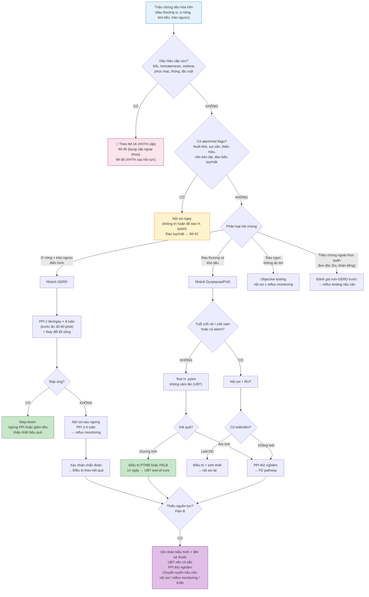

# BÀI HỌC Y KHOA: BỆNH LOÉT DẠ DÀY–TÁ TRÀNG, GERD VÀ KHÓ TIÊU
****Mã bài học:** IM-37 | Ngày:** 2026-07-20 | **Chuyên khoa:** Nội khoa — Tiêu hóa | **Đối tượng:** Bác sĩ, học viên sau đại học và người học mất gốc cần học từ nền tảng

---

## 0. TỔNG QUAN — VÌ SAO BÀI NÀY QUAN TRỌNG?

Ba hội chứng thường gặp nhất ở phòng khám tiêu hóa — **khó tiêu, loét dạ dày–tá tràng (PUD) và bệnh trào ngược dạ dày–thực quản (GERD)** — cùng chia sẻ cơ chế acid và *Helicobacter pylori*, nhưng đường đi chẩn đoán và điều trị khác biệt hoàn toàn. Tại Việt Nam, H. pylori infection có tỉ lệ nhiễm trong cộng đồng ở mức prevalence rất cao, với tần suất kháng clarithromycin và metronidazole đáng báo động (VNAGE 2022, PMID: 36714104) [FULL VERIFIED]. Trên toàn cầu, WHO xếp *H. pylori* kháng clarithromycin là ưu tiên cao cho nghiên cứu kháng sinh (PMID: 29990487) [ABSTRACT VERIFIED]. Sai lầm thường đến từ việc kê PPI trước khi phân tầng hội chứng, dùng clarithromycin theo thói quen, bỏ sót ung thư dạ dày ở người trẻ tuổi, hoặc quy mọi triệu chứng ngoài thực quản cho GERD mà không tìm nguyên nhân khác.

**Mục tiêu của bài:**
- Phân biệt ba hội chứng: khó tiêu, PUD và GERD — và phân luồng an toàn trước khi làm xét nghiệm thường quy.
- Áp dụng đường đi test-and-treat *H. pylori* theo hướng dẫn của Hội Tiêu hóa Việt Nam (VNAGE 2022), với ngưỡng nội soi tại Việt Nam.
- Chọn phác đồ tiệt trừ *H. pylori* dựa trên tỉ lệ kháng thuốc tại chỗ: không clarithromycin, ưu tiên PTMB.
- Xử trí GERD từ PPI thử nghiệm 8 tuần đến nhận diện và xử trí trào ngược kháng trị.
- Quản lý nguy cơ loét do thuốc (NSAID, aspirin, kháng đông) bằng PPI dự phòng và diệt *H. pylori*.

> **HỘP PHẠM VI — RANH GIỚI VỚI CÁC BÀI KHÁC**
>
> - Nếu người bệnh có **sốc, hematemesis, melena hoặc dấu hiệu XHTH cấp**: quay về [IM-16 — Xuất huyết tiêu hóa cấp](../IM-16_Xuat_huyet_tieu_hoa_cap/IM-16_Xuat_huyet_tieu_hoa_cap_2026-07-19.md) để hồi sức, sau đó [IM-36 — XHTH sau hồi sức](../IM-36_Xuat_huyet_tieu_hoa_sau_hoi_suc/IM-36_Xuat_huyet_tieu_hoa_sau_hoi_suc_2026-07-19.md) để nội soi cầm máu và quản lý sau chảy máu.
> - Nếu người bệnh có **dấu hiệu phúc mạc, thủng tạng, tắc ruột hoặc bụng ngoại khoa**: quay về [IM-35 — Tiếp cận đau bụng cấp](../IM-35_Tiep_can_dau_bung_cap/IM-35_Tiep_can_dau_bung_cap_2026-07-20.md). Không trì hoãn để test *H. pylori*.
> - Nếu đau thượng vị cấp có **kiểu tụy/mật**: tham khảo [IM-42 — Viêm tụy cấp, bệnh túi mật & đường mật](../IM-42_Viem_tuy_cap_benh_tui_mat_duong_mat/IM-42_Viem_tuy_cap_benh_tui_mat_duong_mat_2026-07-19.md).
> - Nếu có **tiêu chảy hoặc viêm đại tràng**: [IM-38 — Tiêu chảy & viêm đại tràng](../IM-38_Tieu_chay_va_viem_dai_trang/IM-38_Tieu_chay_va_viem_dai_trang_2026-07-20.md).
> - Nếu có **xơ gan/tăng áp cửa**: [IM-40 — Xơ gan & tăng áp cửa](../IM-40_Xo_gan_tang_ap_cua/IM-40_Xo_gan_tang_ap_cua_2026-07-19.md).
> - **IM-37 sở hữu:** đánh giá triệu chứng tiêu hóa trên ổn định, xét nghiệm và điều trị *H. pylori*, quản lý PUD/GERD/khó tiêu ngoại trú, và dự phòng loét do NSAID. Không lặp lại hồi sức cấp cứu, nội soi cầm máu, đường đi giãn tĩnh mạch thực quản hoặc thuốc sinh học duy trì IBD.

### 📋 TRƯỚC KHI ĐỌC — NỀN TẢNG CẦN DÙNG

> Người học nên biết:
> - **Dạ dày** có ba vùng: tâm vị, thân vị (tiết acid và pepsinogen) và hang vị (tiết gastrin). Niêm mạc được bảo vệ bởi lớp nhầy, bicarbonate, prostaglandin và dòng máu. Khi hàng rào này bị phá vỡ, acid và pepsin gây tổn thương. [TEXTBOOK: Harrison's 21e, Ch. 314]
> - ***H. pylori*** là trực khuẩn Gram âm hình xoắn, tiết urease để sống trong môi trường acid. Nhiễm mạn tính dẫn đến viêm dạ dày → teo niêm mạc → dị sản ruột → loạn sản → ung thư (chuỗi Correa).
> - **Cơ thắt thực quản dưới (LES)**: van giữa thực quản và dạ dày. Khi LES giãn bất thường hoặc yếu, dịch dạ dày trào lên thực quản gây GERD.
> - **PPI (proton pump inhibitor)** gắn vào bơm proton của tế bào thành dạ dày — chỉ tác dụng khi bơm đang hoạt động → **phải uống 30–60 phút trước bữa ăn**.
> - Bài tiên quyết: IM-01 đến IM-06 (nền tảng nội khoa).

### 0.1 Nền tảng tối thiểu cần dùng ngay

**Acid dạ dày** do tế bào thành tiết ra qua bơm H⁺/K⁺-ATPase. Prostaglandin (từ COX-1) bảo vệ niêm mạc bằng cách tăng tiết nhầy, bicarbonate và dòng máu. **NSAID ức chế COX-1** → giảm prostaglandin → mất hàng rào bảo vệ → loét. **Aspirin** vừa ức chế COX-1 toàn thân vừa gây tổn thương tại chỗ do tính acid yếu. [TEXTBOOK: Goodman & Gilman's 14e, Ch. 42]

**Urease** là enzyme của *H. pylori* chuyển urea thành NH₃ và CO₂, trung hòa acid quanh vi khuẩn. Đây là cơ sở của **urea breath test (UBT)**: bệnh nhân uống urea đánh dấu ¹³C, nếu có *H. pylori* → urea bị phân hủy → ¹³CO₂ xuất hiện trong hơi thở. [TEXTBOOK: Harrison's 21e, Ch. 159]

---

## 1. ĐỊNH NGHĨA — BA HỘI CHỨNG, MỘT ĐƯỜNG TIÊU HÓA TRÊN [CỐT LÕI]

### 1.1 Khó tiêu (Dyspepsia) là gì?

**Khó tiêu** là cảm giác khó chịu hoặc đau vùng thượng vị — trên rốn, dưới mũi ức. Đây là một **triệu chứng**, không phải chẩn đoán. Rome IV phân biệt:
- **Khó tiêu chưa điều tra (uninvestigated dyspepsia):** triệu chứng mới, chưa làm nội soi.
- **Khó tiêu chức năng (functional dyspepsia — FD):** đã nội soi không tìm thấy tổn thương giải thích được triệu chứng. (PMID: 30338390) [ABSTRACT VERIFIED]

Theo ACG/CAG 2017: bệnh nhân **≥60 tuổi** có khó tiêu nên được nội soi đường tiêu hóa trên để loại trừ bệnh lý thực thể (khuyến cáo có điều kiện). Bệnh nhân **<60 tuổi không có triệu chứng báo động** được khuyến cáo test-and-treat *H. pylori* không xâm lấn. (PMID: 28631728) [ABSTRACT VERIFIED]

### 1.2 Loét dạ dày–tá tràng (Peptic Ulcer Disease — PUD)

**Loét** là ổ khuyết niêm mạc ăn sâu qua lớp cơ niêm (muscularis mucosae), phân biệt với trợt (erosion) là tổn thương nông hơn. Hai nguyên nhân chính:
- *H. pylori*: gây viêm mạn → phá vỡ hàng rào bảo vệ → acid và pepsin tạo ổ loét.
- **NSAID/aspirin**: ức chế COX-1 → giảm prostaglandin → mất bảo vệ niêm mạc.

Các nguyên nhân ít gặp hơn: hội chứng Zollinger-Ellison (gastrinoma), Crohn, lao, CMV ở người suy giảm miễn dịch.

### 1.3 Bệnh trào ngược dạ dày–thực quản (GERD)

ACG 2022 định nghĩa **GERD** là tình trạng trào ngược dịch dạ dày vào thực quản gây triệu chứng và/hoặc biến chứng. (PMID: 34807007) [FULL VERIFIED]

- **Triệu chứng điển hình:** ợ nóng (heartburn — cảm giác nóng rát sau xương ức lan lên cổ) và trào ngược (regurgitation — dịch dạ dày trào lên miệng, vị chua/đắng).
- **Triệu chứng ngoài thực quản:** ho mạn, khàn tiếng, đau ngực không do tim, hen — nhưng các triệu chứng này có độ nhạy và độ đặc hiệu thấp cho GERD.
- GERD được xác nhận khách quan bằng: viêm thực quản trợt trên nội soi (LA grade B trở lên) hoặc bất thường phơi nhiễm acid trên reflux monitoring.

> ⚠️ **HỌC VIÊN HAY NHẦM:** "Ợ nóng = GERD = cần PPI." Ợ nóng còn do co thắt thực quản, FD, bệnh tim thiếu máu cục bộ. Đau thượng vị/nóng rát phải hỏi thêm về bệnh sử tim mạch và làm ECG nếu nghi ngờ.

### 🛑 DỪNG 1 PHÚT — TỰ KIỂM TRA

> 1. Phân biệt khó tiêu chưa điều tra và khó tiêu chức năng?
> 2. Hai nguyên nhân chính gây loét dạ dày–tá tràng là gì?
>
> *(Đáp án: 1. Chưa điều tra = chưa nội soi; chức năng = đã nội soi không có tổn thương giải thích được. 2. H. pylori và NSAID/aspirin.)*

---

## 2. CƠ CHẾ BỆNH SINH [CỐT LÕI]

### 2.1 H. pylori: từ nhiễm trùng đến ung thư

*H. pylori* sống dưới lớp nhầy dạ dày, tiết **urease** → NH₃ trung hòa acid tại chỗ. Nhiễm trùng gây viêm dạ dày mạn tính ở tất cả người nhiễm. Ở một số người, viêm mạn tiến triển qua **chuỗi Correa**: viêm dạ dày mạn → viêm teo → dị sản ruột → loạn sản → ung thư biểu mô tuyến dạ dày. Kyoto global consensus 2015 xác định *H. pylori* gastritis là **bệnh nhiễm trùng**, ngay cả khi không có triệu chứng. (PMID: 26187502) [ABSTRACT VERIFIED]

### 2.2 Cơ chế loét: mất cân bằng tấn công–bảo vệ

Bình thường, niêm mạc dạ dày được bảo vệ bởi **hàng rào prostaglandin**: lớp nhầy, bicarbonate, dòng máu niêm mạc và khả năng tái tạo tế bào. Loét xảy ra khi:

| Yếu tố tấn công ↑ | Yếu tố bảo vệ ↓ |
|---|---|
| Acid và pepsin | NSAID/aspirin → ↓ prostaglandin |
| *H. pylori* (độc tố CagA, VacA) | Thiếu máu niêm mạc (sốc, stress) |
| NSAID/aspirin (tại chỗ + toàn thân) | |

### 2.3 Cơ chế GERD: hàng rào chống trào ngược bị phá vỡ

**Hàng rào chống trào ngược** gồm: cơ thắt thực quản dưới (LES) và trụ hoành. Ba cơ chế chính:
1. **TLESR (transient LES relaxation):** giãn LES thoáng qua không do nuốt — cơ chế chính ở GERD nhẹ.
2. **LES yếu hoặc thoát vị hoành:** mất hàng rào cơ học → trào ngược nặng hơn.
3. **Giảm thanh thải thực quản và chậm làm rỗng dạ dày:** kéo dài thời gian niêm mạc tiếp xúc với acid.

Dịch trào ngược (acid, pepsin, muối mật) gây tổn thương niêm mạc thực quản, giải phóng cytokine → viêm thực quản. Ở một số bệnh nhân, triệu chứng còn do **tăng nhạy cảm thực quản** (esophageal hypersensitivity) dù lượng acid trào ngược không nhiều.

### 2.4 Cơ chế tác dụng của PPI

PPI là tiền thuốc (prodrug), được hấp thu ở ruột non, vào máu đến tế bào thành dạ dày. Tại đây, trong môi trường acid của ống tiết (canaliculus), PPI được hoạt hóa và **gắn không hồi phục vào H⁺/K⁺-ATPase** (bơm proton). Vì PPI chỉ gắn vào bơm **đang hoạt động**, hiệu quả tối đa khi dùng **30–60 phút trước bữa ăn** — thời điểm bơm proton được kích thích bởi gastrin và histamin sau ăn. (PMID: 34807007) [FULL VERIFIED]

---

## 3. CHẨN ĐOÁN — AN TOÀN TRƯỚC, TEST SAU [CỐT LÕI]

> 🚨 **BOX ĐỎ — DỪNG NHÁNH NGOẠI TRÚ, KHÔNG TRÌ HOÃN ĐỂ TEST H. PYLORI**
>
> Trước khi làm bất kỳ test không cấp cứu nào, loại trừ các tình huống đe dọa tính mạng:
>
> | Dấu hiệu | Nguy cơ đang bỏ sót | Hành động ngay | Nơi đến |
> |---|---|---|---|
> | Sốc, hematemesis, melena | XHTH cấp cần hồi sức | ABCDE, truyền dịch, theo dõi sát → chuyển IM-16 | Cấp cứu → IM-16/IM-36 |
> | Đau bụng đột ngột dữ dội, phản ứng phúc mạc | Thủng tạng rỗng | Khám bụng, X-quang bụng đứng, hội chẩn ngoại → chuyển IM-35 | Cấp cứu/Ngoại khoa |
> | Nuốt khó tiến triển + sụt cân + thiếu máu | Ung thư thực quản/dạ dày | Nội soi ngay (không trì hoãn) | Tiêu hóa/Cấp cứu |
> | Nôn kéo dài, bí trung đại tiện | Tắc đường ra dạ dày / tắc ruột | Khám bụng, chẩn đoán hình ảnh → chuyển IM-35 | Cấp cứu/Ngoại khoa |
> | Đau thượng vị cấp lan sau lưng, amylase/lipase tăng | Viêm tụy cấp | Đánh giá theo IM-42 | Cấp cứu/Tiêu hóa |
> | Nôn ra máu đỏ tươi hoặc máu đen | XHTH trên đang tiến triển | Theo IM-16 | Cấp cứu |

### 3.1 Khó tiêu chưa điều tra: ngưỡng nội soi tại Việt Nam

**Đây là điểm khác biệt quan trọng giữa hướng dẫn quốc tế và Việt Nam.**

| Hướng dẫn | Ngưỡng tuổi nội soi | Ghi chú |
|---|---|---|
| **VNAGE 2022 (Việt Nam)** | Nữ ≥35t hoặc Nam ≥40t hoặc có triệu chứng báo động (PMID: 36714104) [FULL VERIFIED] | Dựa trên dữ liệu 472.744 bệnh nhân Việt Nam; 138/145 ung thư dạ dày ở người <40t |
| **ACG/CAG 2017 (Bắc Mỹ)** | ≥60t (khuyến cáo có điều kiện) (PMID: 28631728) [ABSTRACT VERIFIED] | Áp dụng ở nước có tỉ lệ ung thư dạ dày thấp |

> **Quy tắc tại Việt Nam:** Bệnh nhân khó tiêu chưa điều tra, nếu **nữ ≥35 tuổi hoặc nam ≥40 tuổi, hoặc có bất kỳ triệu chứng báo động nào → nội soi đường tiêu hóa trên + RUT (rapid urease test).** Dưới ngưỡng tuổi và không có alarm: xét nghiệm *H. pylori* không xâm lấn. Không áp dụng ngưỡng ≥60 của ACG/CAG tại Việt Nam.

### 3.2 Xét nghiệm H. pylori: chọn test, chuẩn bị, diễn giải

**Nguyên tắc đầu tiên:** chỉ xét nghiệm *H. pylori* khi có ý định điều trị tiệt trừ. (PMID: 36714104) [FULL VERIFIED]

| Xét nghiệm | Loại | Độ chính xác | Khi dùng | Ghi chú |
|---|---|---|---|---|
| **UBT (urea breath test)** | Không xâm lấn | Sn 96%, Sp 93% (PMID: 36714104) [FULL VERIFIED] | Lựa chọn đầu tay không xâm lấn; test-of-cure sau điều trị | Cần ngừng kháng sinh/bismuth ≥4 tuần, PPI ≥2 tuần |
| **RUT (rapid urease test)** | Sinh thiết qua nội soi | Nhanh, rẻ, chấp nhận được | Test được chọn khi đã nội soi (PMID: 36714104) [FULL VERIFIED] | Mẫu sinh thiết hang vị; XHTH cấp gây âm tính giả |
| **Mô bệnh học** | Sinh thiết qua nội soi | Tiêu chuẩn cao | Khi cần đánh giá thêm (teo, dị sản, loạn sản) | Có thể âm tính giả trong XHTH cấp |
| **Huyết thanh học (IgG)** | Không xâm lấn | Không phân biệt nhiễm cũ/mới | **KHÔNG dùng** để chẩn đoán nhiễm đang hoạt động hoặc test-of-cure (PMID: 36714104) [FULL VERIFIED] | IgG tồn tại nhiều tháng sau tiệt trừ |
| **Xét nghiệm kháng nguyên phân** | Không xâm lấn | Dữ liệu VN hạn chế (Sn 85.7%, Sp 71.4%) | Khi UBT không có sẵn | Độ chính xác thấp hơn UBT |

**Chuẩn bị trước xét nghiệm (BẮT BUỘC):**
- Ngừng **kháng sinh và bismuth ≥4 tuần**
- Ngừng **PPI ≥2 tuần**
- (PMID: 36714104) [FULL VERIFIED]

> ⚠️ **Bẫy lâm sàng:** Bệnh nhân đang dùng PPI hoặc vừa dùng kháng sinh (dù vì lý do khác) → UBT và RUT âm tính giả. Luôn hỏi: "Chị/anh có đang dùng thuốc dạ dày hoặc kháng sinh gì không?"

**Trong XHTH cấp:** RUT và mô bệnh học có thể **âm tính giả**. Nếu âm tính, phải xác nhận lại bằng test có độ tin cậy cao (UBT) sau khi ổn định. (PMID: 36714104) [FULL VERIFIED] Không dùng huyết thanh học: IgG dương tính không chứng minh nhiễm đang hoạt động.

### 3.3 Chẩn đoán GERD

| Tình huống lâm sàng | Hành động | Mức khuyến cáo |
|---|---|---|
| Ợ nóng + trào ngược điển hình, không alarm | PPI thử nghiệm 8 tuần, 1 lần/ngày trước bữa ăn (PMID: 34807007) [FULL VERIFIED] | Mạnh, chứng cứ trung bình |
| Đáp ứng với PPI thử nghiệm | Cố gắng ngừng PPI hoặc giảm xuống liều thấp nhất hiệu quả (PMID: 34807007) [FULL VERIFIED] | Có điều kiện |
| Không đáp ứng hoặc tái phát sau ngừng PPI | Nội soi chẩn đoán sau ngừng PPI 2–4 tuần (PMID: 34807007) [FULL VERIFIED] | Mạnh |
| Nuốt khó, sụt cân, XHTH hoặc nhiều yếu tố nguy cơ Barrett | Nội soi là xét nghiệm đầu tiên (PMID: 34807007) [FULL VERIFIED] | Mạnh |
| Đau ngực không kèm ợ nóng, đã loại trừ bệnh tim | Xét nghiệm khách quan GERD: nội soi và/hoặc reflux monitoring (PMID: 34807007) [FULL VERIFIED] | Có điều kiện |
| Nghi GERD chưa rõ, nội soi không có bằng chứng | Reflux monitoring off therapy (PMID: 34807007) [FULL VERIFIED] | Mạnh |
| Triệu chứng ngoài thực quản đơn độc (ho, khàn tiếng) | Đánh giá non-GERD trước; reflux testing trước PPI (PMID: 34807007) [FULL VERIFIED] | Mạnh |

> ⚠️ **HỌC VIÊN HAY NHẦM:** "Không đáp ứng PPI = GERD nặng." Phần lớn bệnh nhân không đáp ứng PPI thực ra không bị GERD. Cần nội soi và reflux monitoring để xác nhận, không tự động tăng liều hoặc đổi PPI vô hạn. (PMID: 38173155) [ABSTRACT VERIFIED]

### 🛑 DỪNG 1 PHÚT — TỰ KIỂM TRA

> 1. Nữ 33 tuổi, đau thượng vị 3 tháng, không alarm. Làm gì?
> 2. Nam 55 tuổi, đau thượng vị, không alarm. Xét nghiệm gì trước?
> 3. Ba điều phải hỏi trước khi gửi UBT?
>
> *(Đáp án: 1. UBT (dưới ngưỡng 35t nữ). 2. Nội soi + RUT (nam ≥40t, ngưỡng VNAGE). 3. Đã dùng PPI chưa? Đã dùng kháng sinh gì 4 tuần qua? Có đang chảy máu tiêu hóa không?)*

---

## 4. ĐIỀU TRỊ — TỪ TIỆT TRỪ H. PYLORI ĐẾN KIỂM SOÁT GERD [CỐT LÕI]

### 4.1 H. pylori: đường đi Việt Nam (VNAGE 2022 — AUTHORITATIVE)

#### Nguyên tắc chung

- Một phác đồ được coi là hiệu quả khi tỉ lệ tiệt trừ **≥80% (intention-to-treat)**. (PMID: 36714104) [FULL VERIFIED]
- Thời gian tối ưu cho mọi phác đồ: **14 ngày**. (PMID: 36714104) [FULL VERIFIED]
- **Tư vấn tuân thủ là yếu tố quyết định:** không tuân thủ làm giảm tỉ lệ tiệt trừ >25%. Dành thời gian giải thích tác dụng phụ có thể gặp. (PMID: 36714104) [FULL VERIFIED]
- Không hút thuốc, không uống rượu trong thời gian điều trị.

#### Tình hình kháng thuốc tại Việt Nam

| Kháng sinh | Tỉ lệ kháng nguyên phát | Hệ quả lâm sàng |
|---|---|---|
| Clarithromycin | **34.1%** | Không dùng theo kinh nghiệm |
| Metronidazole | **69.4%** | Kháng cao nhưng khắc phục được bằng liều ≥1500 mg/ngày + bismuth |
| Amoxicillin | Đang tăng | Còn hiệu quả trong đa số trường hợp |
| Levofloxacin | Đang tăng | Cần thận trọng; PALB là lựa chọn thay thế |
| Tetracycline | **Thấp và ổn định** | Trụ cột của phác đồ đầu tay |

(PMID: 36714104) [FULL VERIFIED]

#### Chọn phác đồ tiệt trừ

| Bậc | Phác đồ | Thành phần (14 ngày) | Ghi chú |
|---|---|---|---|
| **Đầu tay — Lựa chọn 1** | **PTMB** | PPI liều chuẩn ×2/ngày + Tetracycline 500mg ×4/ngày + Metronidazole 500mg ×3/ngày + Bismuth (subcitrate 240mg hoặc subsalicylate 524mg) ×2–4/ngày (PMID: 36714104) [FULL VERIFIED] | Đầu tay theo VNAGE 2022; dùng được cho dị ứng penicillin |
| **Đầu tay — Lựa chọn 2** | **PALB** | PPI liều chuẩn ×2/ngày + Amoxicillin 1000mg ×2/ngày + Levofloxacin 500mg ×2/ngày + Bismuth (như trên) (PMID: 36714104) [FULL VERIFIED] | Khi PTMB không có sẵn; không dùng nếu dị ứng penicillin |
| **Bậc hai** | PTMB hoặc PALB | Phác đồ chưa dùng ở bậc một (PMID: 36714104) [FULL VERIFIED] | PTMB nếu chưa dùng; PALB nếu đã dùng PTMB |
| **Cứu vãn (sau 2 lần thất bại)** | Theo kháng sinh đồ | PTMB nếu chưa dùng; nếu đã dùng → kháng sinh đồ (PMID: 36714104) [FULL VERIFIED] | Không dùng rifabutin (lao kháng thuốc tại VN) |

> **Metronidazole ≥1500 mg/ngày** khi dùng trong phác đồ bốn thuốc chứa bismuth để vượt qua kháng thuốc. (PMID: 36714104) [FULL VERIFIED]
>
> **PPI thế hệ mới (esomeprazole, rabeprazole)** cho tỉ lệ tiệt trừ tốt hơn PPI thế hệ đầu (omeprazole, lansoprazole, pantoprazole) do không bị ảnh hưởng bởi CYP-2C19. (PMID: 36714104) [FULL VERIFIED]

#### ❌ KHÔNG dùng:
- **Clarithromycin** dưới bất kỳ hình thức nào mà không có kháng sinh đồ chứng minh nhạy cảm. Tỉ lệ kháng 34.1% → tỉ lệ thất bại >30%. (PMID: 36714104) [FULL VERIFIED]
- **Rifabutin**: Việt Nam có tình hình lao kháng thuốc phức tạp, không nên dùng rifabutin cho tiệt trừ *H. pylori*. (PMID: 36714104) [FULL VERIFIED]
- **Huyết thanh học** để chẩn đoán hoặc test-of-cure. (PMID: 36714104) [FULL VERIFIED]

### 4.2 GERD: từ PPI thử nghiệm đến kháng trị

#### 4.2.1 GERD điển hình chưa có alarm

Bắt đầu với **PPI 1 lần/ngày, trước bữa ăn 30–60 phút, trong 8 tuần**. (PMID: 34807007) [FULL VERIFIED]

**Thay đổi lối sống (luôn kèm theo, không thay thế PPI):**
- **Giảm cân** nếu BMI ≥25: khuyến cáo mạnh, mức chứng cứ trung bình. (PMID: 34807007) [FULL VERIFIED]
- Tránh ăn trong **2–3 giờ trước khi đi ngủ**. (PMID: 34807007) [FULL VERIFIED]
- Nâng cao đầu giường nếu triệu chứng về đêm.
- Tránh thuốc lá, rượu và "thực phẩm kích hoạt" (cà phê, chocolate, đồ cay, chua, béo).

#### 4.2.2 Sau thử nghiệm 8 tuần

| Kết quả | Hành động |
|---|---|
| **Đáp ứng** | Ngừng PPI hoặc giảm xuống liều thấp nhất có hiệu quả (on-demand hoặc intermittent) (PMID: 34807007) [FULL VERIFIED] |
| **Không đáp ứng hoặc tái phát sau ngừng** | Nội soi sau ngừng PPI 2–4 tuần; nếu nội soi bình thường → reflux monitoring off PPI (PMID: 34807007) [FULL VERIFIED] |

#### 4.2.3 Duy trì và biến chứng

- **LA grade C hoặc D:** PPI duy trì vô thời hạn hoặc cân nhắc phẫu thuật chống trào ngược. (PMID: 34807007) [FULL VERIFIED]
- **LA grade A hoặc B:** có thể thử ngừng PPI hoặc giảm liều.
- **NERD (non-erosive reflux disease):** PPI on-demand hoặc intermittent.

#### 4.2.4 GERD không đáp ứng — "Tối ưu hóa trước, xét nghiệm sau"

Tối ưu hóa PPI là bước đầu tiên: (PMID: 34807007) [FULL VERIFIED]
1. Xác nhận bệnh nhân **có uống PPI không** (tuân thủ).
2. Xác nhận uống **đúng cách**: 30–60 phút trước bữa ăn, **không phải trước khi ngủ**.
3. Nếu đã dùng 1 lần/ngày: tăng lên **2 lần/ngày** (trước bữa sáng và bữa tối).

**Không** thêm thường quy các thuốc khác (H2RA, prokinetic, baclofen) khi chưa có bằng chứng khách quan. (PMID: 34807007) [FULL VERIFIED]

Sau tối ưu hóa, nếu vẫn không đáp ứng:
- **Nội soi** (off PPI nếu có thể) + sinh thiết thực quản (loại trừ EoE).
- **Reflux monitoring** (pH hoặc impedance-pH): off PPI nếu chưa có chẩn đoán GERD; on PPI nếu đã có bằng chứng GERD. (PMID: 34807007; PMID: 38173155)

Phân biệt quan trọng: **triệu chứng kháng trị** (refractory symptoms — triệu chứng vẫn còn dù reflux đã được kiểm soát) ≠ **GERD kháng trị** (refractory GERD — reflux thực sự vẫn còn bất thường trên pH monitoring). (PMID: 38173155) [ABSTRACT VERIFIED]

#### 4.2.5 Triệu chứng ngoài thực quản

- **KHÔNG quy ho, khàn tiếng, hen, đau ngực cho GERD** nếu chưa đánh giá các nguyên nhân khác (TMH, Dị ứng, Hô hấp, Tim mạch). (PMID: 34807007) [FULL VERIFIED]
- Nếu **chỉ có triệu chứng ngoài thực quản** (không ợ nóng, không trào ngược): reflux testing **trước** khi dùng PPI. (PMID: 34807007) [FULL VERIFIED]
- Nếu **có cả triệu chứng điển hình và ngoài thực quản**: thử PPI 2 lần/ngày trong 8–12 tuần. (PMID: 34807007) [FULL VERIFIED]

### 4.3 Loét do thuốc: dự phòng thay vì chờ biến chứng

#### 4.3.1 Yếu tố nguy cơ loét do NSAID

| Yếu tố nguy cơ |
|---|
| Tuổi cao |
| Tiền sử loét dạ dày–tá tràng |
| NSAID liều cao hoặc phối hợp nhiều NSAID |
| Dùng kèm aspirin, antiplatelet, kháng đông hoặc steroid |

(PMID: 33191311) [FULL VERIFIED]

#### 4.3.2 Chiến lược dự phòng

| Tình huống | Chiến lược | Bằng chứng |
|---|---|---|
| **Bắt đầu NSAID dài hạn** | Test và diệt *H. pylori* trước nếu nhiễm | Giảm nguy cơ loét (RR 0.54), hiệu quả hơn ở người chưa từng dùng NSAID (RR 0.27) (PMID: 33191311) [FULL VERIFIED] |
| **Nguy cơ loét cao, dùng NSAID dài hạn** | PPI liều thấp dự phòng | Giảm nguy cơ loét đáng kể (PMID: 33191311) [FULL VERIFIED] |
| **Nguy cơ loét cao + nguy cơ tim mạch thấp** | Cân nhắc COX-2 inhibitor thay cho NSAID không chọn lọc | |
| **Nguy cơ loét cao + nguy cơ tim mạch cao** | NSAID không chọn lọc + PPI | Tránh COX-2 inhibitor |
| **Aspirin dài hạn + tiền sử loét** | PPI + aspirin | Giảm loét tái phát đáng kể (PMID: 33191311) [FULL VERIFIED] |
| **Warfarin nguy cơ cao** | PPI dự phòng | Giảm nguy cơ xuất huyết tiêu hóa trên (PMID: 33191311) [FULL VERIFIED] |

**Cochrane 2025** xác nhận: PPI giảm incident ulcer ở người dùng NSAID. (PMID: 40337979) [ABSTRACT VERIFIED]

> ⚠️ **KHÔNG tự ý ngừng aspirin hoặc kháng đông** ở bệnh nhân có chỉ định dự phòng tim mạch thứ phát. Phối hợp với bác sĩ kê đơn gốc (Tim mạch, Thần kinh) để quyết định.

### 4.4 Khó tiêu chức năng — khi nội soi bình thường

Khi đã loại trừ nguyên nhân thực thể (nội soi bình thường, *H. pylori* âm tính hoặc đã tiệt trừ), chẩn đoán **khó tiêu chức năng (FD)**. Chiến lược điều trị theo hướng dẫn hiện hành bao gồm: kiểm tra và điều trị *H. pylori* (nếu chưa làm), thử nghiệm PPI, và cân nhắc các liệu pháp khác (prokinetic, thuốc điều hòa thần kinh) cho FD kháng trị, tùy theo nguồn lực địa phương (PMID: 30338390) [ABSTRACT VERIFIED].

**Plan B tại Việt Nam khi nội soi không có sẵn:** ghi nhận kiểu hình (EPS — epigastric pain syndrome hay PDS — postprandial distress syndrome) và tiền sử thuốc; UBT nếu có; PPI thử nghiệm; theo dõi alarm; chuyển tuyến nếu không đáp ứng hoặc xuất hiện alarm.

---

## 5. THEO DÕI — KIỂM TRA LẠI LÀ MỘT PHẦN CỦA ĐIỀU TRỊ [CỐT LÕI]

### 5.1 Test-of-cure sau tiệt trừ H. pylori

- **Tất cả** bệnh nhân sau điều trị tiệt trừ phải được xác nhận kết quả.
- **UBT là test được chọn** để xác nhận tiệt trừ (test-of-cure). (PMID: 36714104) [FULL VERIFIED]
- Nếu đã nội soi để đánh giá loét dạ dày hoặc tổn thương tiền ung thư → nội soi lại: xác nhận lành ổ loét + sinh thiết loại trừ ác tính.

### 5.2 Theo dõi GERD

- Đánh giá đáp ứng sau 8 tuần PPI → quyết định step-down hay nội soi.
- Barrett thực quản: theo dõi nội soi định kỳ theo hướng dẫn (tần suất phụ thuộc độ dài đoạn Barrett và mức độ loạn sản).
- LA grade C/D: duy trì PPI vô thời hạn.

### 5.3 Theo dõi khi dùng NSAID/aspirin dài hạn

- Đánh giá lại **định kỳ** chỉ định NSAID/aspirin — có thể ngừng hoặc giảm liều không?
- Theo dõi triệu chứng thiếu máu, đau thượng vị mới xuất hiện.
- Theo dõi tác dụng phụ của PPI dài hạn (theo từng cá nhân; bằng chứng về tác hại của PPI dài hạn chưa được xác lập vững chắc).

### 🛑 DỪNG 1 PHÚT — TỰ KIỂM TRA

> 1. Sau PTMB 14 ngày, làm gì để biết đã tiệt trừ H. pylori?
> 2. Khi nào cần nội soi lại sau điều trị loét dạ dày?
>
> *(Đáp án: 1. UBT để xác nhận tiệt trừ. 2. Loét dạ dày cần nội soi lại + sinh thiết để xác nhận lành và loại trừ ác tính.)*

---

### 5.4 Lưu đồ quyết định lâm sàng

**Diễn giải lưu đồ bằng các bước đánh số:**

1. **Đánh giá cấp cứu đầu tiên:** Trước mọi test không khẩn, kiểm tra xem bệnh nhân có dấu hiệu sốc, XHTH, phúc mạc, thủng hoặc tắc ruột không. Nếu CÓ → chuyển ngay đến IM-16/IM-35/IM-36. Không trì hoãn.

2. **Tầm soát alarm/red flags:** Nuốt khó tiến triển, sụt cân không giải thích được, thiếu máu, nôn kéo dài → **nội soi ngay**. Đau thượng vị cấp lan ra sau lưng → nghĩ đến tụy cấp, theo IM-42.

3. **Phân loại hội chứng:** Hỏi kỹ triệu chứng chính để phân vào một trong bốn nhánh.

4. **Nhánh GERD:** Ợ nóng + trào ngược điển hình, không alarm → PPI thử nghiệm 8 tuần. Đáp ứng → step-down. Không đáp ứng → nội soi sau ngừng PPI 2–4 tuần, nếu âm tính → reflux monitoring off PPI.

5. **Nhánh Dyspepsia/PUD:** Áp dụng **ngưỡng nội soi Việt Nam** (nữ ≥35t / nam ≥40t hoặc có alarm). Trên ngưỡng → nội soi + RUT. Dưới ngưỡng → UBT. Dương tính → PTMB hoặc PALB 14 ngày → test-of-cure. Âm tính → PPI thử nghiệm → FD pathway.

6. **Nhánh đau ngực không do tim:** Sau khi tim mạch đã loại trừ → objective testing (nội soi ± reflux monitoring).

7. **Nhánh ngoài thực quản đơn độc:** KHÔNG mặc định là GERD. Đánh giá TMH, Dị ứng, Hô hấp trước. Nếu cần → reflux testing (không phải PPI thử nghiệm).

8. **Plan B (thiếu nguồn lực):** Ghi nhận đầy đủ kiểu hình + tiền sử thuốc. UBT nếu có sẵn. PPI thử nghiệm. Chuyển tuyến khi: cần nội soi mà không có, cần reflux monitoring, cần kháng sinh đồ, hoặc không đáp ứng điều trị.

---

## 6. TÓM TẮT [CỐT LÕI]

1. **BOX ĐỎ trước tất cả:** loại trừ sốc, XHTH, thủng tạng, tắc ruột và đau kiểu tụy/mật trước khi làm bất kỳ test không cấp cứu nào.

2. **Ngưỡng nội soi Việt Nam (VNAGE 2022):** nữ ≥35t hoặc nam ≥40t hoặc có alarm → nội soi + RUT. Ngưỡng ≥60t của ACG/CAG không áp dụng tại Việt Nam (PMID: 36714104) [FULL VERIFIED].

3. **UBT là test không xâm lấn đầu tay cho H. pylori** (Sn 96%, Sp 93%), nhưng phải ngừng PPI ≥2 tuần và kháng sinh ≥4 tuần. Huyết thanh học KHÔNG được dùng (PMID: 36714104) [FULL VERIFIED].

4. **Phác đồ tiệt trừ H. pylori tại Việt Nam: PTMB 14 ngày** (PPI + Tetracycline 500mg ×4 + Metronidazole 500mg ×3 + Bismuth). PALB là lựa chọn thay thế. **Tuyệt đối không dùng clarithromycin** khi không có kháng sinh đồ (PMID: 36714104) [FULL VERIFIED].

5. **GERD điển hình không alarm:** PPI thử nghiệm 8 tuần, 1 lần/ngày trước bữa ăn 30–60 phút + thay đổi lối sống. Nếu đáp ứng → step-down; nếu không → nội soi sau ngừng PPI 2–4 tuần (PMID: 34807007) [FULL VERIFIED].

6. **"GERD kháng trị" thường không phải GERD:** tối ưu hóa PPI trước, sau đó mới reflux monitoring. Phân biệt triệu chứng kháng trị với GERD kháng trị thực sự (PMID: 38173155) [ABSTRACT VERIFIED].

7. **Triệu chứng ngoài thực quản đơn độc → đánh giá nguyên nhân khác trước, reflux testing trước PPI** (PMID: 34807007) [FULL VERIFIED].

8. **Bắt đầu NSAID dài hạn → test H. pylori trước, diệt nếu dương tính** (RR giảm loét = 0.54). Bệnh nhân nguy cơ loét cao → PPI liều thấp dự phòng. Aspirin + tiền sử loét → PPI bắt buộc (HR 0.17) (PMID: 33191311) [FULL VERIFIED].

9. **Luôn làm test-of-cure** sau điều trị tiệt trừ H. pylori. UBT là test được chọn. Ghi lịch hẹn ngay trên đơn thuốc (PMID: 36714104) [FULL VERIFIED].

10. **Mọi loét dạ dày phải được nội soi lại + sinh thiết** để xác nhận lành và loại trừ ác tính. Loét tá tràng không cần nội soi lại thường quy.

---

### 🛑 TỰ KIỂM TRA CUỐI BÀI

> 1. Nữ 36 tuổi, đau thượng vị 2 tháng, không alarm. Test H. pylori bằng gì — UBT hay nội soi?
> 2. GERD không đáp ứng PPI 8 tuần: kể ba bước xử trí tiếp theo.
> 3. Nam 60 tuổi, thoái hóa khớp, chuẩn bị dùng ibuprofen dài hạn, tiền sử loét tá tràng đã lành. Hai biện pháp dự phòng loét?
> 4. Bệnh nhân nữ 28t, ho khan 6 tháng, TMH chẩn đoán "nghi LPR", không ợ nóng. Kê PPI ngay hay không?
>
> *(Đáp án: 1. Nữ 36t ≥35t → ngưỡng nội soi VN → nội soi + RUT. 2. (a) Xác nhận tuân thủ + uống PPI trước ăn; (b) tăng lên 2 lần/ngày; (c) nội soi sau ngừng PPI 2–4 tuần → reflux monitoring nếu bình thường. 3. Test và diệt H. pylori trước khi bắt đầu NSAID; PPI liều thấp dự phòng. 4. KHÔNG kê PPI ngay — đánh giá non-GERD trước, reflux testing nếu cần.)*

---

### 6.1 Sai lầm thường gặp

| # | Sai lầm | Hậu quả | Cách tránh |
|---|---|---|---|
| 1 | Kê PPI trước khi phân tầng hội chứng và hỏi alarm | Che lấp triệu chứng ác tính; âm tính giả H. pylori; trì hoãn nội soi cần thiết | Phân loại hội chứng + hỏi alarm trước; PPI là công cụ chẩn đoán, không phải thuốc "an toàn cho mọi đau bụng" |
| 2 | Dùng clarithromycin theo thói quen trong phác đồ tiệt trừ H. pylori | Tỉ lệ kháng 34.1% tại VN → thất bại điều trị (PMID: 36714104) [FULL VERIFIED] | Luôn dùng PTMB hoặc PALB; clarithromycin chỉ khi có kháng sinh đồ chứng minh nhạy cảm |
| 3 | Không ngừng PPI 2 tuần trước khi test H. pylori (UBT/RUT) | Âm tính giả → bỏ sót nhiễm → tiếp tục triệu chứng, nguy cơ ung thư | Ghi rõ trong phiếu hẹn: "Ngừng PPI 2 tuần, ngừng kháng sinh 4 tuần trước test" |
| 4 | Gán nhãn GERD cho mọi ợ nóng mà không loại trừ bệnh tim | Bỏ sót hội chứng mạch vành cấp | Hỏi: đau có liên quan gắng sức? Có yếu tố nguy cơ tim mạch? ECG nếu nghi ngờ |
| 5 | Quy ho mạn, khàn tiếng hoặc hen cho GERD mà không đánh giá nguyên nhân khác | Điều trị PPI kéo dài vô ích; bỏ sót bệnh lý TMH, Dị ứng, Hô hấp (PMID: 34807007) [FULL VERIFIED] | Đánh giá chuyên khoa TMH/Dị ứng/Hô hấp trước; reflux testing, không PPI thử nghiệm mù |
| 6 | Không làm test-of-cure sau điều trị tiệt trừ H. pylori | Không biết thất bại điều trị → tiếp tục nguy cơ loét tái phát và ung thư | UBT sau điều trị là bắt buộc; ghi lịch hẹn ngay khi kê đơn (PMID: 36714104) [FULL VERIFIED] |
| 7 | Kê NSAID dài hạn cho bệnh nhân nguy cơ loét cao mà không dùng PPI dự phòng | Loét biến chứng (chảy máu, thủng) có thể phòng ngừa được | Đánh giá nguy cơ loét trước khi kê NSAID; PPI dự phòng nếu nguy cơ cao (PMID: 33191311) [FULL VERIFIED] |
| 8 | Không nội soi lại loét dạ dày để loại trừ ác tính | Bỏ sót ung thư dạ dày (loét ác tính có thể lành về mặt nội soi) | Mọi loét dạ dày: nội soi lại + sinh thiết sau 8–12 tuần điều trị; loét tá tràng không cần nội soi lại thường quy |

---

### 6.2 Case lâm sàng

> **Yêu cầu case:** Mỗi case trình bày theo 5 bước: (1) nhận diện nguy cơ/cấp cứu, (2) dữ kiện nào thay đổi xác suất hoặc lựa chọn, (3) hành động ngay, (4) theo dõi hoặc chuyển tuyến, (5) vì sao các lựa chọn sai không phù hợp.

#### Case 1: Khó tiêu chưa điều tra — người trẻ, không alarm

**Bệnh nhân:** Nữ 32 tuổi, đau thượng vị âm ỉ 4 tháng, liên quan bữa ăn, không ợ nóng, không sụt cân, không thiếu máu. Chưa từng nội soi. Đã tự mua antacid không hết.

**(1) Nhận diện nguy cơ:** Bệnh nhân không có dấu hiệu báo động (không sụt cân, không nuốt khó, không thiếu máu, không nôn). Tuổi 32 nữ — dưới ngưỡng nội soi VNAGE (≥35t nữ). → Đây là khó tiêu chưa điều tra, nguy cơ thấp.

**(2) Dữ kiện thay đổi quyết định:** Triệu chứng kéo dài 4 tháng không đáp ứng antacid → cần xác định nguyên nhân. Tuổi dưới ngưỡng nội soi Việt Nam + không alarm → đường đi không xâm lấn.

**(3) Hành động ngay:** UBT sau khi xác nhận không dùng PPI và kháng sinh theo quy tắc chuẩn bị xét nghiệm. Nếu UBT (+): PTMB 14 ngày, tư vấn tuân thủ + giải thích tác dụng phụ. Nếu UBT (−): PPI thử nghiệm, theo dõi alarm.

**(4) Theo dõi:** UBT test-of-cure sau điều trị. Nếu triệu chứng không cải thiện hoặc xuất hiện alarm → nội soi.

**(5) Lựa chọn sai:** (a) Nội soi ngay cho bệnh nhân 32t không alarm — vượt ngưỡng, lãng phí nguồn lực. (b) Kê PPI mà không test H. pylori trước — bỏ lỡ cơ hội tiệt trừ, nguy cơ teo niêm mạc và ung thư về lâu dài.

#### Case 2: Nguy cơ loét do NSAID

**Bệnh nhân:** Nam 58 tuổi, thoái hóa khớp gối, đang dùng NSAID dài hạn. Bắt đầu đau thượng vị, không alarm, không thiếu máu. Tiền sử: không loét dạ dày.

**(1) Nhận diện nguy cơ:** Bệnh nhân có yếu tố nguy cơ loét do NSAID: tuổi cao, đang dùng NSAID dài hạn (PMID: 33191311) [FULL VERIFIED]. Chưa có biến chứng (không chảy máu, không thủng).

**(2) Dữ kiện thay đổi quyết định:** Đau thượng vị mới xuất hiện khi đang dùng NSAID. Tuổi 58 — trên ngưỡng nội soi VNAGE (≥40t nam). Cần phân biệt loét do NSAID với loét do H. pylori hoặc phối hợp cả hai.

**(3) Hành động ngay:** Nội soi + RUT (trên ngưỡng VNAGE). Nếu có loét → sinh thiết (nếu loét dạ dày). Nếu H. pylori (+): tiệt trừ. Thêm PPI dự phòng. Đánh giá lại chỉ định NSAID với bác sĩ kê đơn gốc: có thể giảm liều hoặc đổi sang COX-2 inhibitor nếu nguy cơ tim mạch thấp.

**(4) Theo dõi:** Nếu loét dạ dày → nội soi lại sau 8–12 tuần + sinh thiết. Nếu H. pylori (+) → UBT test-of-cure. Đánh giá định kỳ chỉ định NSAID.

**(5) Lựa chọn sai:** (a) Kê PPI đơn thuần mà không nội soi, không test H. pylori — bỏ sót loét ác tính và nhiễm H. pylori. (b) Tiếp tục NSAID không PPI dự phòng ở bệnh nhân có triệu chứng — nguy cơ loét biến chứng. (c) Ngừng NSAID đột ngột không phối hợp với bác sĩ kê đơn gốc ở bệnh nhân cần giảm đau mạn.

#### Case 3: GERD điển hình — đáp ứng và không đáp ứng

**Bệnh nhân:** Nam 40 tuổi, ợ nóng và trào ngược điển hình 6 tháng, nặng hơn sau ăn no và khi nằm. Không nuốt khó, không sụt cân. BMI 28.

**(1) Nhận diện nguy cơ:** Triệu chứng GERD điển hình (ợ nóng + trào ngược), không có alarm (không nuốt khó, không sụt cân, không thiếu máu). → Ứng viên cho PPI thử nghiệm (PMID: 34807007) [FULL VERIFIED].

**(2) Dữ kiện thay đổi quyết định:** BMI 28 → thừa cân, là yếu tố thúc đẩy GERD có thể can thiệp. Triệu chứng nặng hơn khi nằm → gợi ý trào ngược tư thế. Đáp ứng với PPI sau 8 tuần sẽ quyết định bước tiếp theo.

**(3) Hành động ngay:** (a) PPI 1 lần/ngày, trước bữa ăn 30–60 phút, trong 8 tuần. (b) Thay đổi lối sống: giảm cân, tránh ăn trước ngủ 2–3 giờ, nâng cao đầu giường, tránh thực phẩm kích hoạt (cà phê, chocolate, đồ cay, chua, béo).

**(4) Theo dõi và phân nhánh:** Sau 8 tuần: Nếu đáp ứng → step-down (ngừng PPI hoặc giảm liều thấp nhất hiệu quả). Nếu không đáp ứng → xác nhận tuân thủ và cách uống; tối ưu hóa PPI (tăng lên 2 lần/ngày); nếu vẫn không đáp ứng → nội soi sau ngừng PPI 2–4 tuần → reflux monitoring nếu nội soi bình thường.

**(5) Lựa chọn sai:** (a) Nội soi ngay cho GERD điển hình không alarm — không cần thiết, PPI thử nghiệm vừa chẩn đoán vừa điều trị. (b) Kê PPI uống trước khi ngủ thay vì trước bữa ăn — kém hiệu quả. (c) Tăng liều PPI hoặc đổi thuốc liên tục mà không xác nhận tuân thủ và cách uống — lãng phí, trì hoãn chẩn đoán đúng.

#### Case 4: ALARM — nuốt khó và sụt cân

**Bệnh nhân:** Nam 50 tuổi, đau thượng vị 3 tháng, sụt 5 kg, cảm giác thức ăn "dính" sau xương ức. Da xanh nhẹ.

**(1) Nhận diện nguy cơ:** Đây là bệnh cảnh ALARM — nuốt khó tiến triển + sụt cân không giải thích được + nghi thiếu máu. Cần loại trừ ung thư thực quản hoặc dạ dày. Đây KHÔNG phải là khó tiêu thông thường.

**(2) Dữ kiện thay đổi quyết định:** Nuốt khó gợi ý tổn thương thực quản (u, hẹp). Sụt 5 kg/3 tháng là dấu hiệu báo động toàn thân. Da xanh gợi ý thiếu máu — có thể do chảy máu rỉ rả từ tổn thương đường tiêu hóa trên.

**(3) Hành động ngay:** Nội soi đường tiêu hóa trên ngay, không trì hoãn. KHÔNG kê PPI thử nghiệm và hẹn khám lại. KHÔNG test H. pylori ngoại trú trước khi nội soi. (PMID: 34807007) [FULL VERIFIED — nội soi là xét nghiệm đầu tiên cho nuốt khó và alarm]

**(4) Theo dõi:** Kết quả nội soi + sinh thiết quyết định hướng xử trí tiếp: nếu ung thư → chuyển ung bướu/ngoại khoa; nếu loét lành tính → điều trị + nội soi lại; nếu viêm thực quản tăng bạch cầu ái toan (EoE) → điều trị đặc hiệu.

**(5) Lựa chọn sai:** (a) Kê PPI 8 tuần và hẹn khám lại — trì hoãn chẩn đoán ung thư có thể gây hậu quả nghiêm trọng. (b) Gửi UBT thay vì nội soi — không giải quyết được vấn đề nuốt khó và không loại trừ ác tính. (c) Cho rằng "mới 50 tuổi, chưa đến tuổi ung thư" — ung thư dạ dày có thể gặp ở mọi lứa tuổi, đặc biệt ở Việt Nam nơi tỉ lệ mắc cao.
## 7. TIPS THỰC HÀNH [THAM KHẢO]

1. **Tư vấn tuân thủ trước, không phải sau:** "Trong 14 ngày tới, anh/chị sẽ uống 4 loại thuốc. Có thể hơi mệt, miệng đắng, phân sậm màu (bismuth). Đừng bỏ cuộc — nếu bỏ dở, vi khuẩn sẽ kháng thuốc mạnh hơn."

2. **Hỏi một câu trước mọi test H. pylori:** "Anh/chị có đang uống thuốc dạ dày hay kháng sinh gì không?" Một đợt amoxicillin điều trị viêm họng cũng đủ gây UBT âm tính giả.

3. **Ghi lịch test-of-cure ngay trên đơn thuốc:** "Hẹn UBT: ngày …/…/… (sau khi hết thuốc …, nhớ ngừng PPI 2 tuần trước test)." — nếu không ghi, cả bác sĩ và bệnh nhân đều quên.

4. **Cảnh báo tương tác rượu–metronidazole:** "Trong 14 ngày uống thuốc và 3 ngày sau khi hết thuốc: tuyệt đối không uống rượu bia. Nếu uống vào sẽ buồn nôn dữ dội, nôn, đau đầu, mặt đỏ bừng."

5. **"Alarm" là danh sách kiểm tra tối thiểu:** Với mọi bệnh nhân đau thượng vị: sụt cân? nuốt khó? nôn? thiếu máu? tiền sử gia đình ung thư dạ dày? Nếu ≥1 dấu hiệu → hạ ngưỡng nội soi.

6. **PPI trước ăn, không phải trước ngủ:** "Uống 1 viên trước bữa sáng 30 phút, 1 viên trước bữa tối 30 phút. Nếu ngày uống 1 viên: uống trước bữa sáng." Đây là lỗi phổ biến nhất — kê đúng nhưng bệnh nhân uống sai.

7. **Người ≥40 tuổi dùng NSAID/aspirin dài hạn → tự động đánh giá nguy cơ loét:** Hỏi tiền sử loét, test H. pylori, và kê PPI dự phòng nếu cần. Đừng đợi đến khi đau hoặc chảy máu.

8. **"GERD không đáp ứng" → kiểm tra lại chẩn đoán, không phải tăng thuốc:** Phần lớn trường hợp "kháng trị" thực ra không phải GERD, hoặc bệnh nhân uống PPI sai cách. Xác nhận tuân thủ và cách uống trước khi đổi thuốc.

---

## 8. BẰNG CHỨNG & GUIDELINES [CỐT LÕI]

### 8.1 Hướng dẫn lõi theo câu hỏi lâm sàng

| Câu hỏi lâm sàng | Hướng dẫn nguồn | Điều bài này lấy từ nguồn |
|---|---|---|
| Chẩn đoán và điều trị H. pylori tại Việt Nam | VNAGE 2022 (PMID: 36714104) [GUIDELINE VERIFIED] | Ngưỡng nội soi ≥35F/≥40M; UBT/RUT; PTMB/PALB 14 ngày; không clarithromycin |
| Điều trị H. pylori — Bắc Mỹ | ACG 2024 (PMID: 39626064) [GUIDELINE VERIFIED] | BQT ưu tiên; GRADE 11 PICO + 6 key concepts |
| Phân tầng khó tiêu | ACG/CAG 2017 (PMID: 28631728) [GUIDELINE VERIFIED] | Ngưỡng ≥60 tuổi (so sánh quốc tế, không áp dụng tại VN); test-and-treat |
| Chẩn đoán và điều trị GERD | ACG 2022 (PMID: 34807007) [GUIDELINE VERIFIED] | PPI trial 8 tuần; nội soi; reflux monitoring; ngoài thực quản; kháng trị |
| Dự phòng loét do thuốc | Korean 2020 (PMID: 33191311) [GUIDELINE VERIFIED] | NSAID/aspirin/anticoagulant; PPI dự phòng; H. pylori eradication |
| PPI cho NSAID — Cochrane | Cochrane 2025 (PMID: 40337979) [META-ANALYSIS] | RR 0.29 (95% CI 0.23–0.36) cho incident ulcer; 12 RCTs, n=8.760 |
| GERD kháng trị | Davis & Gyawali 2024 (PMID: 38173155) [REVIEW] | Phân biệt unproven vs proven GERD; Lyon consensus |
| Kháng thuốc H. pylori toàn cầu | Savoldi et al. 2018 (PMID: 29990487) [META-ANALYSIS] | WHO high priority; tỉ lệ kháng ≥15% ở hầu hết khu vực |
| Kyoto consensus | Sugano et al. 2015 (PMID: 26187502) [CONSENSUS] | H. pylori gastritis là bệnh nhiễm trùng |
| Khó tiêu chức năng | Tomita et al. 2018 (PMID: 30338390) [REVIEW] | Rome IV; PPI, prokinetic, TCA |

### 8.2 Giới hạn bằng chứng của bài

- Bài này không dạy phẫu thuật chống trào ngược, nội soi can thiệp GERD, hoặc thuốc sinh học duy trì IBD.
- Phác đồ tiệt trừ H. pylori cứu vãn sau hai lần thất bại cần kháng sinh đồ — bài không cung cấp phác đồ kinh nghiệm cho tình huống này.
- Liều PPI cụ thể cho GERD duy trì được cá nhân hóa — bài đưa nguyên tắc "liều thấp nhất có hiệu quả".
- Dữ liệu về fecal antigen test tại Việt Nam còn hạn chế.
- Bài không thay thế hướng dẫn của Tim mạch/Thần kinh về chỉ định và ngừng thuốc kháng tiểu cầu/kháng đông.
## 9. TÀI LIỆU THAM KHẢO

1. **Chey WD et al. (2024)** "ACG Clinical Guideline: Treatment of Helicobacter pylori Infection." *Am J Gastroenterol.* PMID: **39626064**. [GUIDELINE VERIFIED]

2. **Quach DT et al. (2022)** "Vietnam Association of Gastroenterology (VNAGE) consensus on the management of Helicobacter pylori infection." *Front Med (Lausanne).* PMID: **36714104**. [FULL VERIFIED]

3. **Katz PO et al. (2022)** "ACG Clinical Guideline for the Diagnosis and Management of Gastroesophageal Reflux Disease." *Am J Gastroenterol.* PMID: **34807007**. [FULL VERIFIED]

4. **Moayyedi P et al. (2017)** "ACG and CAG Clinical Guideline: Management of Dyspepsia." *Am J Gastroenterol.* PMID: **28631728**. [ABSTRACT VERIFIED]

5. **Joo MK et al. (2020)** "Clinical Guidelines for Drug-Related Peptic Ulcer, 2020 Revised Edition." *Gut Liver.* PMID: **33191311**. [FULL VERIFIED]

6. **Laine L et al. (2021)** "ACG Clinical Guideline: Upper Gastrointestinal and Ulcer Bleeding." *Am J Gastroenterol.* PMID: **33929377**. [GUIDELINE VERIFIED]

7. **Garegnani L et al. (2025)** "Proton pump inhibitors for the prevention of non-steroidal anti-inflammatory drug-induced ulcers and dyspepsia." *Cochrane Database Syst Rev.* PMID: **40337979**. [ABSTRACT VERIFIED]

8. **Davis TA, Gyawali CP (2024)** "Refractory Gastroesophageal Reflux Disease: Diagnosis and Management." *J Neurogastroenterol Motil.* PMID: **38173155**. [ABSTRACT VERIFIED]

9. **Savoldi A et al. (2018)** "Prevalence of Antibiotic Resistance in Helicobacter pylori: A Systematic Review and Meta-analysis in World Health Organization Regions." *Gastroenterology.* PMID: **29990487**. [ABSTRACT VERIFIED]

10. **Sugano K et al. (2015)** "Kyoto global consensus report on Helicobacter pylori gastritis." *Gut.* PMID: **26187502**. [ABSTRACT VERIFIED]

11. **Tomita T et al. (2018)** "New Approaches to Diagnosis and Treatment of Functional Dyspepsia." *Curr Gastroenterol Rep.* PMID: **30338390**. [ABSTRACT VERIFIED]

---

**— Hết bài học ngày 2026-07-20 —**

**Bác sĩ:** Ngọc Hưng 🍅 🐈‍⬛ | **AI:** 9router/ocg/deepseek-v4-pro