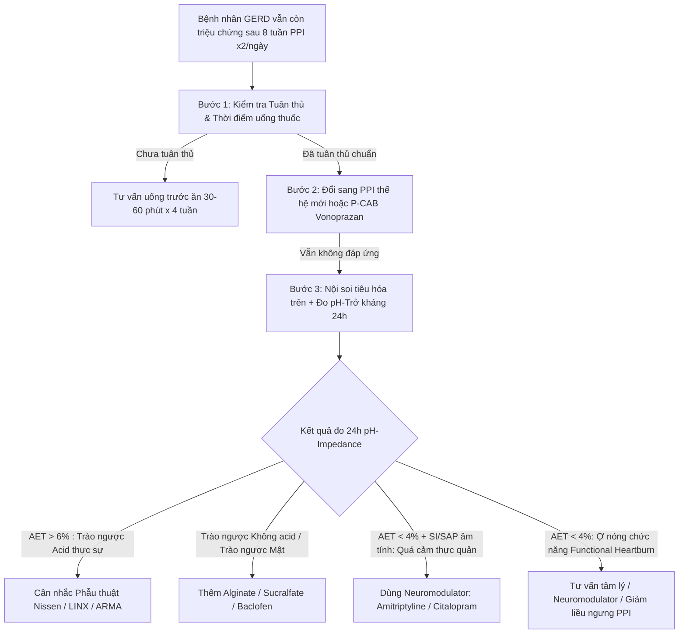

# PART 5: ĐIỀU TRỊ TRÀO NGƯỢC DẠ DÀY – THỰC QUẢN (GERD) CHUYÊN SÂU
**Bài học:** Bệnh Loét Dạ Dày–Tá Tràng (PUD), GERD và Khó Tiêu (IM-37)  
**Chuyên khoa:** Nội khoa — Tiêu hóa  
**Đối tượng:** Bác sĩ tuyến tỉnh, bác sĩ tổng quát, học viên sau đại học và người học cần xây dựng lại nền tảng lâm sàng vững chắc.

---

## 1. MỤC TIÊU ĐIỀU TRỊ & NGUYÊN TẮC TIẾP CẬN TỔNG THỂ

Điều trị Bệnh trào ngược dạ dày – thực quản (GERD) hướng tới 3 mục tiêu cốt lõi:
1. **Kểm soát triệu chứng:** Chống ợ nóng (heartburn) và ợ chua (regurgitation), cải thiện chất lượng cuộc sống.
2. **Lành tổn thương niêm mạc thực quản:** Chữa lành viêm thực quản trào ngược (Erosive Esophagitis — EE) theo phân độ Los Angeles (LA A/B/C/D).
3. **Dự phòng biến chứng & tái phát:** Ngăn ngừa hẹp thực quản, thực quản Barrett (Barrett's Esophagus) và adenocarcinoma thực quản. (PMID: 34807007) [GUIDELINE VERIFIED]

```text
┌─────────────────────────────────────────────────────────────────────────────┐
│                 CHIẾN LƯỢC ĐIỀU TRỊ GERD THEO PHÂN THỂ LÂM SÀNG             │
├─────────────────────────────────────────────────────────────────────────────┤
│ 1. Trào ngược có tổn thương niêm mạc (EE - Erosive Esophagitis):            │
│    👉 LA Grade A/B: PPI liều chuẩn x 8 tuần (Step-down).                    │
│    👉 LA Grade C/D: PPI liều kép / P-CAB (Vonoprazan) x 8-12 tuần (Duy trì). │
│                                                                             │
│ 2. Trào ngược không tổn thương niêm mạc (NERD - Non-Erosive Reflux):       │
│    👉 PPI/P-CAB liều thấp nhất có hiệu quả HOẶC dùng khi cần (On-demand).  │
│                                                                             │
│ 3. Trào ngược kháng trị (Refractory GERD):                                  │
│    👉 Đánh giá tuân thủ -> Tối ưu liều PPI (x2/ngày trước ăn) -> Đo pH-impedance.│
└─────────────────────────────────────────────────────────────────────────────┘
```

---

## 2. THAY ĐỔI LỐI SỐNG (LIFESTYLE MODIFICATIONS) — NỀN TẢNG KHÔNG DÙNG THUỐC

Thay đổi lối sống là chỉ định **bắt buộc cho 100% bệnh nhân GERD**, hỗ trợ giảm tần suất và cường độ trào ngược. (PMID: 34807007) [GUIDELINE VERIFIED]

### 2.1 Các biện pháp có bằng chứng lâm sàng mạnh (Strong Evidence):
- **Giảm cân ở người thừa cân/béo phì (BMI >23 kg/m²):** Giảm mỡ bụng làm giảm áp lực ổ bụng tác động lên cơ thắt thực quản dưới (LES).
- **Nâng cao đầu giường (15–20 cm) hoặc dùng gối nêm (Wedge pillow):** Dùng trọng lực để giảm trào ngược về đêm. (Không kê thêm nhiều gối vì làm gấp bụng).
- **Tránh ăn trong vòng 3 giờ trước khi nằm/đi ngủ:** Đảm bảo dạ dày đã tống xuất hết thức ăn.
- **Tránh tư thế cúi gập người hoặc mặc quần áo quá bó sát bụng** sau khi ăn.

### 2.2 Các biện pháp điều chỉnh chế độ ăn (Dietary Adjustments):
- Hạn chế các thực phẩm làm giảm áp lực cơ thắt thực quản dưới (LES): **Cà phê, socola, rượu bia, bạc hà, thức ăn nhiều chất béo**.
- Hạn chế thực phẩm kích thích niêm mạc hoặc làm chậm tống xuất dạ dày: **Đồ chua cay, nước có ga, cà chua**.
- Cai thuốc lá hoàn toàn (Nicotine làm giãn LES và giảm tiết nước bọt kiềm tính).

---

## 3. DƯỢC LÝ ĐIỀU TRỊ GERD: CÁC NHÓM THUỐC CỐT LÕI

### 3.1 Nhóm ức chế Bơm Proton (PPI — Proton Pump Inhibitors)
PPI là **lựa chọn hàng đầu (Gold Standard)** trong điều trị lành viêm thực quản và kiểm soát triệu chứng. (PMID: 34807007) [GUIDELINE VERIFIED]

#### 🔹 Bảng so sánh & Liều dùng các PPI phổ biến:

| Thuốc PPI | Liều chuẩn 1 lần/ngày | Liều kép (Double dose) | Thời điểm uống chuẩn |
|---|---|---|---|
| **Esomeprazole** | 40 mg | 40 mg x 2 lần/ngày | Trước ăn sáng/tối 30–60 phút |
| **Rabeprazole** | 20 mg | 20 mg x 2 lần/ngày | Trước ăn sáng/tối 30–60 phút |
| **Omeprazole** | 20 mg | 20 mg x 2 lần/ngày | Trước ăn sáng/tối 30–60 phút |
| **Pantoprazole** | 40 mg | 40 mg x 40 mg x 2 lần/ngày | Trước ăn sáng/tối 30–60 phút |
| **Dexlansoprazole**| 30–60 mg | 60 mg x 1 lần/ngày | **Bất kỳ lúc nào** (Công nghệ phóng thích kéo dài 2 pha) |

> ⚠️ **QUY TẮC THỜI ĐIỂM UỐNG PPI:** Hầu hết PPI (trừ Dexlansoprazole) phải uống **trước bữa ăn 30–60 phút** để khi thuốc đạt nồng độ đỉnh trong máu cũng là lúc các bơm proton $H^+/K^+-ATPase$ trên tế bào thành dạ dày được kích hoạt mạnh nhất bởi thức ăn. Uống sai thời điểm (uống sau ăn hoặc xa bữa ăn) làm giảm hiệu quả ức chế acid tới 50%.

### 3.2 Nhóm ức chế Acid Cạnh tranh Potassium (P-CAB — Potassium-Competitive Acid Blockers)
**Vonoprazan (Takecab / Voquezna)** đại diện cho bước tiến mới trong điều trị GERD: (PMID: 36228734) [FULL VERIFIED]

- **Cơ chế:** Gắn thuận nghịch và cạnh tranh trực tiếp với ion $K^+$ trên bơm $H^+/K^+-ATPase$, không cần tế bào thành kích hoạt.
- **Ưu điểm vượt trội so với PPI:**
  1. Khởi phát tác dụng cực nhanh (đạt hiệu quả ức chế acid tối đa ngay từ liều đầu tiên).
  2. Bán thải dài, giữ pH dạ dày $>4.0$ suốt 24h (kể cả ban đêm).
  3. **Không phụ thuộc bữa ăn** (uống lúc đói hay no đều được).
  4. Không bị chuyển hóa qua CYP2C19 (không bị ảnh hưởng bởi kiểu gen chuyển hóa nhanh/chậm).
- **Liều dùng GERD:** Vonoprazan **20 mg/ngày** x 8 tuần (tấn công), sau đó **10 mg/ngày** (duy trì).

### 3.3 Nhóm Alginate & Antacid (Thuốc trung hòa & Tạo màng ngăn)
- **Alginate (Gaviscon / Gaviscon Dual Action):** Tiếp xúc với acid dạ dày tạo thành lớp gel Alginic acid nổi lên trên bề mặt dịch vị như một "bè chắn" (Rafting agent), ngăn dịch trào ngược lên thực quản.
- **Vai trò lâm sàng:** Cắt triệu chứng trào ngược tức thì ($<15$ phút), cực kỳ hiệu quả cho **Trào ngược ban đêm** hoặc **Cơn trào ngược bùng phát (Breakthrough heartburn)** khi đang dùng PPI. (PMID: 38493017) [META-ANALYSIS VERIFIED]
- **Antacid (Hydroxyd nhôm, Hydroxyd magnesi):** Trung hòa acid tức thì nhưng thời gian tác dụng ngắn (30–60 phút), chỉ dùng cắt cơn đau cấp.

### 3.4 Nhóm Thúc đẩy Động lực Dạ dày (Prokinetics)
- **Thuốc:** Itopride (50mg x 3 lần/ngày trước ăn), Mosapride (5mg x 3 lần/ngày), Domperidone.
- **Cơ chế:** Tăng lực co bóp cơ thắt thực quản dưới (LES), tăng tần số sóng nhu động thực quản và gia tăng tốc độ tống xuất dạ dày.
- **Chỉ định:** Phối hợp với PPI ở bệnh nhân GERD có kèm **chậm tống xuất dạ dày, đầy bụng, chậm tiêu sau ăn**. (PMID: 34807007) [GUIDELINE VERIFIED]

---

## 4. PHÁC ĐỒ ĐIỀU TRỊ THEO PHÂN ĐỘ VIÊM THỰC QUẢN (LOS ANGELES GRADE A/B/C/D)

Nội soi tiêu hóa trên phân độ viêm thực quản trào ngược theo Los Angeles (LA Classification):

```text
┌─────────────────────────────────────────────────────────────────────────────┐
│                 PHÁC ĐỒ NỘI KHOA CHUẨN THEO PHÂN ĐỘ NỘI SOI LA               │
├─────────────────────────────────────────────────────────────────────────────┤
│ 🔹 LA Grade A & B (Tổn thương nhẹ / vừa):                                  │
│    - Điều trị tấn công: PPI liều chuẩn 1 lần/ngày x 8 tuần.                │
│    - Đánh giá sau 8 tuần: Nếu hết triệu chứng -> Ngưng thuốc hoặc On-demand.│
│                                                                             │
│ 🔹 LA Grade C & D (Tổn thương nặng / Loét diện rộng):                      │
│    - Điều trị tấn công: PPI liều kép (hoặc Vonoprazan 20mg) x 8-12 tuần.    │
│    - Bắt buộc điều trị duy trì (Maintenance): PPI liều thấp/chuẩn liên tục. │
│    - Bắt buộc nội soi kiểm tra lại sau 8-12 tuần để đánh giá lành loét      │
│      và loại trừ Thực quản Barrett / Ung thư ẩn nấp dưới ổ viêm.           │
└─────────────────────────────────────────────────────────────────────────────┘
```

---

## 5. TIẾP CẬN TRÀO NGƯỢC KHÁNG TRỊ (REFRACTORY GERD)

**Trào ngược kháng trị** được định nghĩa là bệnh nhân vẫn còn triệu chứng trào ngược gây phiền thoái dù đã dùng PPI liều chuẩn x 2 lần/ngày kéo dài ít nhất 8 tuần. (PMID: 35123084, PMID: 37734911) [GUIDELINE VERIFIED]

### 5.1 Quy trình 4 bước chẩn đoán & xử trí trào ngược kháng trị:



### 5.2 Phân biệt các thể lâm sàng qua Đo pH-Trở kháng 24h (24h pH-Impedance Monitoring — Lyon Consensus 2.0):
*(AET = Acid Exposure Time — Thời gian niêm mạc thực quản xúc acid pH < 4.0)* (PMID: 37734911) [GUIDELINE VERIFIED]

1. **Trào ngược Acid thực sự (True Refractory Acid GERD):** $AET > 6\%$. Bệnh nhân thực sự bị trào ngược acid quá mức dù đã dùng PPI. $\rightarrow$ Chỉ định đổi sang P-CAB hoặc cân nhắc phẫu thuật.
2. **Quá cảm thực quản với Trào ngược (Reflux Hypersensitivity):** $AET < 4\%$ (bình thường), nhưng chỉ số liên kết triệu chứng (SI/SAP) dương tính với các đợt trào ngược sinh lý (trào ngược acid nhẹ hoặc trào ngược không acid). $\rightarrow$ Bệnh nhân bị tăng nhạy cảm đau thần kinh thực quản $\rightarrow$ Điều trị bằng **Thuốc điều hòa thần kinh (Neuromodulators: Amitriptyline 10–25mg/đêm hoặc SSRI)**.
3. **Ợ nóng chức năng (Functional Heartburn):** $AET < 4\%$ và chỉ số liên kết triệu chứng SI/SAP âm tính. Triệu chứng ợ nóng hoàn toàn không liên quan đến trào ngược. $\rightarrow$ Ngưng PPI (tránh tác dụng phụ kéo dài), điều trị theo hướng rối loạn tương tác ruột - não (Brain-Gut Interaction).

---

## 6. ĐƠN THUỐC MẪU & TÌNH HUỐNG LÂM SÀNG PART 5

### 📝 Đơn thuốc mẫu 1: GERD trào ngược có viêm thực quản LA Grade B (Ngoại trú)
- **Esomeprazole 40mg:** 1 viên x 1 lần/ngày (uống trước ăn sáng 30 phút) x 8 tuần.
- **Gaviscon Dual Action (Hỗn dịch):** 1 gói (10ml) x 3 lần/ngày (uống sau ăn 1 giờ và 1 gói trước khi đi ngủ) x 2–4 tuần (khi có cơn ợ nóng/ợ chua).
- **Itopride 50mg:** 1 viên x 3 lần/ngày (uống trước ăn 15–30 phút) x 4 tuần (nếu có đầy bụng, chậm tống xuất dạ dày).

---

### ✍️ LỜI GIẢI CHI TIẾT CA LÂM SÀNG PART 5

#### ❓ Tình huống Ca lâm sàng 5:
> Bệnh nhân nam 42 tuổi, nhân viên văn phòng, BMI 26.5 kg/m². Bệnh nhân có tiền sử ợ nóng, ợ chua 6 tháng nay, đã dùng Omeprazole 20mg/ngày mua tại nhà thuốc uống trập trùng nhưng không đỡ. Nội soi tiêu hóa trên ghi nhận: Viêm thực quản trào ngược **Los Angeles Grade C**, không có ổ loét dạ dày, test *H. pylori* (RUT) âm tính.
> 
> **Câu hỏi:**
> 1. Đánh giá sai lầm trong quá trình tự điều trị trước đó của bệnh nhân?
> 2. Lập chiến lược điều trị tấn công và duy trì chuẩn phác đồ cho bệnh nhân này?
> 3. Hướng xử trí nếu sau 8 tuần điều trị chuẩn bệnh nhân vẫn còn triệu chứng ợ nóng?

---

#### ✍️ LỜI GIẢI CHI TIẾT CA LÂM SÀNG 5:

##### 1. Đánh giá sai lầm điều trị trước đó:
- **Liều lượng và thời gian không đủ:** Bệnh nhân dùng Omeprazole 20mg/ngày trập trùng (không liên tục) hoàn toàn không đủ sức dập tắt trào ngược ở mức độ tổn thương LA Grade C.
- **Không kiểm soát thời điểm uống:** Tự mua thuốc uống không được hướng dẫn uống trước ăn sáng 30-60 phút.
- **Chưa thay đổi lối sống:** BMI 26.5 kg/m² (thừa cân độ 1) làm tăng áp lực ổ bụng đè lên LES.

##### 2. Chiến lược điều trị chuẩn theo Phân độ LA Grade C (PMID: 34807007):
- **Giai đoạn Tấn công (8–12 tuần):**
  - Đổi sang PPI mạnh liều kép: **Esomeprazole 40mg x 2 lần/ngày** (trước ăn sáng 30' và trước ăn tối 30') HOẶC dùng **P-CAB Vonoprazan 20mg x 1 lần/ngày** x 8–12 tuần. (PMID: 36228734)
  - Kèm **Gaviscon Dual Action** 1 gói x 4 lần/ngày (sau 3 bữa ăn và trước ngủ) trong 4 tuần đầu để dập bớt cơn trào ngược ban đêm.
  - Ép giảm cân (mục tiêu giảm 3-5kg), nâng đầu giường 15cm, không ăn sau 19h.
- **Giai đoạn Duy trì (Maintenance Therapy):**
  - Do tổn thương là **LA Grade C**, bệnh nhân có nguy cơ tái phát $>80\%$ nếu ngưng PPI hoàn toàn.
  - Sau 8-12 tuần tấn công, hạ liều xuống PPI liều chuẩn 1 lần/ngày (Esomeprazole 20-40mg/ngày hoặc Vonoprazan 10mg/ngày) **điều trị duy trì kéo dài**.
  - **Bắt buộc hẹn Nội soi kiểm tra lại sau 8-12 tuần** để xác nhận niêm mạc đã lành và rà soát thực quản Barrett.

##### 3. Hướng xử trí nếu thất bại sau 8 tuần điều trị chuẩn:
- Kiểm tra gắt gao lại nhật ký uống thuốc (đúng trước ăn 30-60' không).
- Đổi sang P-CAB Vonoprazan 20mg/ngày (nếu chưa dùng).
- Cho chỉ định **Đo pH-Trở kháng thực quản 24h (24h pH-impedance monitoring)** để phân biệt Trào ngược acid thực sự kháng trị vs Trào ngược không acid vs Quá cảm thực quản để phối hợp thêm Baclofen hoặc Neuromodulators (Amitriptyline 10-25mg/đêm). (PMID: 37734911)

---
*Hết Part 5. File đã được hoàn thiện nội dung & đáp án ca lâm sàng trực tiếp bên dưới.*
