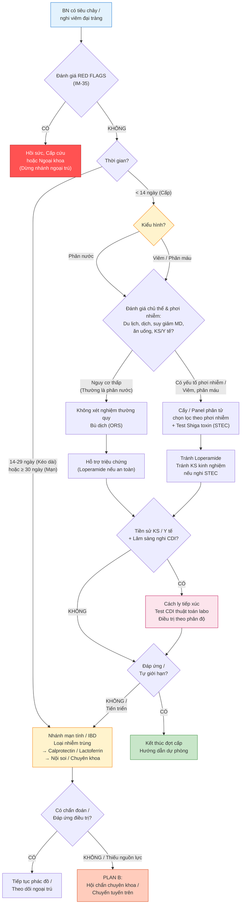

# BÀI HỌC Y KHOA: TIÊU CHẢY CẤP/MẠN VÀ VIÊM ĐẠI TRÀNG
****Mã bài học:** IM-38 | Ngày:** 2026-07-20 | **Chuyên khoa:** Nội khoa — Tiêu hóa | **Đối tượng:** Bác sĩ, học viên sau đại học và người học mất gốc cần học từ nền tảng

---

## 0. TỔNG QUAN — VÌ SAO BÀI NÀY QUAN TRỌNG?

Tiêu chảy là một **triệu chứng**, không phải một chẩn đoán duy nhất. Cùng một biểu hiện “đi ngoài phân lỏng” có thể là bệnh tự giới hạn chỉ cần bù dịch, nhiễm trùng cần xét nghiệm định hướng, nhiễm *Clostridioides difficile* (CDI) cần cách ly và điều trị đặc hiệu, hoặc viêm đại tràng cần nội soi và chuyên khoa Tiêu hóa. Sai lầm thường đến từ việc kê kháng sinh trước khi xác định kiểu hình, diễn giải một xét nghiệm phân dương tính tách rời lâm sàng, hoặc trì hoãn hồi sức để chờ kết quả.

**Mục tiêu của bài:**
- Nhận diện người bệnh cần hồi sức, nhập viện hoặc hội chẩn khẩn trước khi làm xét nghiệm thường quy.
- Phân loại tiêu chảy theo thời gian và kiểu hình để chọn đúng xét nghiệm phân.
- Bù dịch, giảm triệu chứng và sử dụng kháng sinh theo nguyên tắc stewardship.
- Nhận diện, xét nghiệm, phân độ và xử trí ban đầu CDI.
- Tiếp cận tiêu chảy kéo dài/mạn và chuyển tuyến an toàn khi nghi viêm đại tràng viêm hoặc bệnh ruột viêm (IBD).

> **HỘP PHẠM VI — RANH GIỚI VỚI IM-35**
>
> - Nếu người bệnh có **ABCDE không ổn định, sốc, dấu hiệu phúc mạc, tắc ruột hoặc một bụng ngoại khoa**, hãy quay ngay về [IM-35 — Tiếp cận đau bụng cấp và nôn/tiêu chảy](../IM-35_Tiep_can_dau_bung_cap/IM-35_Tiep_can_dau_bung_cap_2026-07-20.md) để hồi sức và phân luồng ngoại khoa. Không chờ xét nghiệm phân.
> - **IM-38 là bài nguồn cho đường đi theo bệnh:** đánh giá lại đáp ứng bù dịch, chọn và diễn giải xét nghiệm phân, stewardship kháng sinh, CDI, tiêu chảy kéo dài/mạn và nghi viêm đại tràng/IBD.
> - Bài này **không lặp lại toàn bộ tiếp cận đau bụng cấp** của IM-35 và không hướng dẫn lựa chọn thuốc sinh học duy trì IBD.

### 📋 TRƯỚC KHI ĐỌC — NỀN TẢNG CẦN DÙNG

> Người học nên biết:
> - **ABCDE** là thứ tự đánh giá đường thở, hô hấp, tuần hoàn, thần kinh và bộc lộ. Bất thường đe dọa tính mạng phải được xử trí ngay tại bước phát hiện.
> - **Đại tràng** là đoạn cuối của ống tiêu hóa. Khi niêm mạc ruột bị viêm hoặc bị tổn thương, phân có thể lẫn máu và dịch viêm.
> - **Xét nghiệm phân** chỉ có giá trị khi mẫu phù hợp, chỉ định phù hợp và kết quả thực sự làm thay đổi quyết định.
> - Bài tiên quyết: [IM-35 — Tiếp cận đau bụng cấp](../IM-35_Tiep_can_dau_bung_cap/IM-35_Tiep_can_dau_bung_cap_2026-07-20.md).

### 0.1 Nền tảng tối thiểu cần dùng ngay

**Tiêu chảy phân nước** xảy ra khi lượng nước được tiết vào lòng ruột tăng hoặc chất không được hấp thu giữ nước trong lòng ruột. Hai cơ chế này lần lượt được gọi là **tăng tiết** và **thẩm thấu**; không nhất thiết có phá hủy niêm mạc đại thể. **Tiêu chảy viêm/phân máu** xảy ra khi niêm mạc bị xâm nhập hoặc tổn thương, làm thoát dịch viêm và máu vào lòng ruột. [TEXTBOOK: Harrison's Principles of Internal Medicine, Ch. 43]

**Calprotectin phân** là một protein từ bạch cầu đa nhân trung tính, bền trong phân. Khi bạch cầu tập trung tại ruột đang viêm, calprotectin phân tăng; vì vậy nó là **dấu chỉ viêm**, không phải tên của một bệnh và không tự nó chẩn đoán IBD. [REVIEW: PMID 31351880]

---

## 1. ĐỊNH NGHĨA VÀ PHÂN LOẠI — HAI TRỤC QUYẾT ĐỊNH [CỐT LÕI]

### 1.1 Tiêu chảy là gì?

Tiêu chảy được định nghĩa là **từ 3 lần đi ngoài phân lỏng/nước trong 24 giờ, hoặc nhiều hơn mức bình thường của chính người bệnh** (PMID: 29194529) [FULL VERIFIED]. Đếm số lần chỉ là điểm bắt đầu; bác sĩ còn phải hỏi tính chất phân, thời gian, lượng ăn uống, tình trạng mất nước và dấu hiệu báo động.

### 1.2 Trục thứ nhất: thời gian

| Nhãn thời gian | Định nghĩa đã xác minh | Ý nghĩa quyết định |
|---|---|---|
| **Cấp** | Dưới 14 ngày (PMID: 29194529) [FULL VERIFIED] | Ưu tiên an toàn, bù dịch, kiểu hình và phơi nhiễm nhiễm trùng |
| **Kéo dài** (*persistent*) | 14–29 ngày (PMID: 29194529) [FULL VERIFIED] | Không tiếp tục xử trí như một đợt cấp đơn giản; đánh giá lại tác nhân và nguyên nhân hữu cơ |
| **Mạn** (*chronic*) | Từ 30 ngày, tương đương trên 4 tuần trong hướng dẫn tiêu chảy mạn (PMID: 29194529; PMID: 31302098) [FULL VERIFIED] | Chuyển sang đường đi phân nước, phân mỡ/kém hấp thu hoặc viêm; không mặc định là nhiễm trùng cấp |

### 1.3 Trục thứ hai: kiểu hình phân

| Kiểu hình | Cách nhận ra ở giường bệnh | Vì sao quan trọng | Hành động tiếp theo |
|---|---|---|---|
| **Phân nước** | Phân lỏng/nước, không có máu đại thể | Phù hợp cơ chế tăng tiết hoặc thẩm thấu; nhiều trường hợp ưu tiên bù dịch | Xem mức độ mất nước, thời gian, yếu tố chủ thể và phơi nhiễm trước khi chọn xét nghiệm |
| **Viêm/phân máu** | Máu đại thể, có thể kèm nhầy, sốt, đau quặn, mót rặn; lỵ thường là lượng phân ít (PMID: 29194529) [FULL VERIFIED] | Gợi ý tổn thương niêm mạc; nguy cơ không phù hợp với thuốc làm giảm nhu động và cần nghĩ đến *Escherichia coli* sinh độc tố Shiga (STEC) | Đánh giá cấp cứu, lấy mẫu phân phù hợp, tránh quyết định kháng sinh tự động |
| **Phân mỡ/kém hấp thu** | Bệnh sử khiến bác sĩ nghi chất dinh dưỡng không được hấp thu đầy đủ | Hướng sang nhóm nguyên nhân kém hấp thu thay vì lặp kháng sinh | Đánh giá hữu cơ và chuyển chuyên khoa khi chưa xác định được nguyên nhân |

**Ba lớp phải ghi trong hồ sơ:**
1. **Thời gian:** cấp, kéo dài hay mạn.
2. **Kiểu hình:** nước, viêm/phân máu hay mỡ/kém hấp thu.
3. **Bối cảnh:** chủ thể nguy cơ và phơi nhiễm nào làm thay đổi xét nghiệm hoặc nơi điều trị.

> ⚠️ **HỌC VIÊN HAY NHẦM:** “Phân nước = không nặng” và “phân máu = chắc chắn phải dùng kháng sinh”. Cả hai đều sai về tư duy. Mức độ nặng được quyết định trước hết bởi sinh lý người bệnh và dấu hiệu báo động; kháng sinh cần quyết định theo tác nhân/nguy cơ, không theo màu phân đơn độc.

### 🛑 DỪNG 1 PHÚT — TỰ KIỂM TRA

> 1. Một người bệnh đi phân lỏng đã 16 ngày thuộc nhóm nào?
> 2. Hai trục phân loại phải ghi ngay sau đánh giá an toàn là gì?
>
> *(Đáp án: 1. Tiêu chảy kéo dài. 2. Thời gian và kiểu hình phân; sau đó bổ sung bối cảnh chủ thể/phơi nhiễm.)*

---

## 2. BOX ĐỎ — AN TOÀN TRƯỚC CHẨN ĐOÁN THƯỜNG QUY [CỐT LÕI]

> 🚨 **BOX ĐỎ — DỪNG NHÁNH NGOẠI TRÚ, KHÔNG CHỜ KẾT QUẢ PHÂN**
>
> | Dấu hiệu | Nguy cơ đang bị đe dọa/bỏ sót | Hành động ngay | Nơi đến |
> |---|---|---|---|
> | Sinh hiệu không ổn định, dấu giảm tưới máu hoặc thay đổi tri giác | Sốc hay suy cơ quan | ABCDE, thiết lập hồi sức và theo dõi liên tục; đi theo IM-35 | Cấp cứu/ICU tùy đáp ứng |
> | Mất nước nặng, không thể uống, dung dịch bù nước và điện giải đường uống (ORS) thất bại hoặc nghi liệt ruột | Giảm thể tích tuần hoàn; đường uống không còn an toàn/hiệu quả | Dùng dịch tinh thể đẳng trương đường tĩnh mạch và đánh giá lại | Cấp cứu/nội trú |
> | Nhiễm độc toàn thân hoặc nghi nhiễm trùng huyết | Nhiễm trùng nặng cần xử trí song song | Hồi sức; lấy mẫu phù hợp nếu không làm chậm xử trí; hội chẩn | Cấp cứu/ICU/Truyền nhiễm |
> | Cứng bụng, phản ứng phúc mạc, bí trung đại tiện hoặc dấu tắc ruột | Thủng, viêm phúc mạc hoặc tắc ruột | Dừng đường đi tiêu chảy thường quy; xử trí theo IM-35 | Ngoại khoa/Cấp cứu |
> | Viêm đại tràng chảy máu nặng, đau hoặc chướng bụng tiến triển | Viêm đại tràng nặng hoặc biến chứng | Nhập viện, đánh giá khẩn; không dùng thuốc cầm tiêu chảy | Tiêu hóa/Cấp cứu; Ngoại khoa khi cần |
> | Tụt huyết áp/sốc, liệt ruột hoặc nghi phình đại tràng nhiễm độc trong bối cảnh CDI | CDI tối cấp | Điều trị CDI tối cấp ngay và hội chẩn khẩn | ICU, Tiêu hóa/Truyền nhiễm và Ngoại khoa |
> | Suy giảm miễn dịch, người cao tuổi/yếu frail hoặc bệnh nền khiến dự trữ sinh lý thấp | Biểu hiện có thể không điển hình nhưng nguy cơ diễn tiến nặng | Hạ ngưỡng nhập viện, xét nghiệm và hội chẩn; đánh giá lặp lại | Cấp cứu/nội trú/chuyên khoa |

ORS thẩm thấu thấp là lựa chọn đầu tay khi mất nước nhẹ–vừa. Lactated Ringer hoặc Normal Saline đường tĩnh mạch được dùng khi mất nước nặng, sốc, thay đổi tri giác, thất bại ORS hoặc liệt ruột (PMID: 29194529) [FULL VERIFIED]. Đây là **cầu nối hồi sức**, không thay thế tìm nguyên nhân và đánh giá lại.

**Cách đánh giá lại sau bù dịch:** quan sát xu hướng sinh hiệu, tri giác, khả năng uống, lượng nước tiểu, số lần đi ngoài và khám bụng. Nếu tưới máu không cải thiện, triệu chứng tiến triển hoặc xuất hiện dấu ngoại khoa, chuyển nhánh cấp cứu thay vì tiếp tục bù dịch ngoại trú.

---

## 3. TIÊU CHẢY CẤP — XÉT NGHIỆM, BÙ DỊCH VÀ STEWARDSHIP [CỐT LÕI]

### 3.1 Bệnh sử nào thực sự thay đổi quyết định?

Không hỏi “ăn gì lạ không?” rồi dừng. Hãy ghi có hệ thống:

- **Thức ăn/nước uống:** nguồn chung, người ăn cùng có bệnh, nước không bảo đảm.
- **Du lịch:** nơi đến và thời điểm so với khởi phát.
- **Tiếp xúc:** người cùng nhà, cơ sở tập thể, chùm ca hay ổ dịch.
- **Thuốc:** kháng sinh gần đây, thuốc có thể gây tiêu chảy, thuốc nhuận tràng.
- **Chăm sóc y tế:** nhập viện/cơ sở chăm sóc; dữ kiện này mở nhánh CDI.
- **Chủ thể:** suy giảm miễn dịch, tuổi cao/yếu frail hoặc bệnh nền nguy cơ.
- **Phơi nhiễm tình dục:** hỏi riêng tư, không phán xét, vì có thể thay đổi vị trí lấy mẫu và xét nghiệm.
- **Kiểu hình:** phân nước hay máu/nhầy; sốt, đau quặn, mót rặn; khả năng uống và dấu mất nước.

Một phơi nhiễm chỉ có giá trị khi nó dẫn đến một hành động: chọn mẫu, chọn test, cảnh báo kiểm soát nhiễm khuẩn hoặc thay đổi ngưỡng chuyển tuyến.

### 3.2 Chọn xét nghiệm phân: “Kết quả này sẽ thay đổi điều gì?”

| Xét nghiệm | Mục tiêu | Khi dùng/không dùng | Đầu vào và cách đọc | Kết quả thay đổi quyết định | Bẫy/an toàn/chuyển tuyến |
|---|---|---|---|---|---|
| **Cấy phân** | Phát hiện tác nhân có thể nuôi cấy và giữ được chủng để đánh giá thêm | Cân nhắc khi kiểu hình viêm/phân máu, bệnh nặng, chủ thể nguy cơ, phơi nhiễm/ổ dịch hoặc khi kết quả sẽ đổi điều trị; không gửi tràn lan nếu kết quả không làm đổi xử trí | Mẫu phân phù hợp, ghi rõ bối cảnh cho phòng xét nghiệm; đọc tên tác nhân cùng lâm sàng | Điều trị hướng đích hoặc ngừng/thu hẹp điều trị không còn phù hợp; hỗ trợ điều tra ổ dịch | Âm tính không tự động loại hết nhiễm trùng; chuyển tuyến nếu lâm sàng xấu dù chưa có kết quả |
| **Panel phân tử/PCR đa tác nhân** | Phản ứng chuỗi polymerase (PCR) khuếch đại vật liệu di truyền để tìm nhiều tác nhân | Hữu ích khi cần câu trả lời nhanh ở ca nặng/phức tạp hoặc theo năng lực địa phương; không dùng như “gói xét nghiệm cho mọi người” | Mẫu phân; xem từng đích dương tính và bối cảnh | Có thể định hướng test xác nhận, kiểm soát nhiễm khuẩn và điều trị hướng đích | Phát hiện phân tử không đồng nghĩa tác nhân đang gây bệnh; không tự động kê thuốc cho mọi kết quả dương |
| **Shiga toxin/STEC** | Nhận diện *Shiga toxin-producing Escherichia coli* — STEC | Đặt vào đường đi tiêu chảy máu/viêm khi lâm sàng và phơi nhiễm làm phải nghĩ đến STEC; không khởi kháng sinh mù trước khi cân nhắc nhánh này | Mẫu phân trước kháng sinh khi khả thi; phối hợp phương pháp labo sẵn có | Nếu nghi/khẳng định STEC, tránh kháng sinh và theo dõi hội chứng tán huyết–tăng ure máu (HUS), một biến chứng có thể tổn thương máu và thận; hội chẩn khi diễn tiến nặng | Thuốc giảm nhu động và kháng sinh không được dùng như phản xạ trong nhánh này |
| **Xét nghiệm ký sinh trùng chọn lọc** | Tìm tác nhân phù hợp với thời gian và phơi nhiễm | Cân nhắc trong tiêu chảy kéo dài/mạn hoặc phơi nhiễm đặc hiệu; với tiêu chảy mạn phân nước, xét nghiệm *Giardia* bằng kháng nguyên hoặc PCR là lựa chọn được khuyến cáo | Mẫu phân đúng yêu cầu xét nghiệm | Dương tính phù hợp lâm sàng mở đường điều trị hướng đích; âm tính chuyển sang nhóm nguyên nhân khác | Không biến một test không đặc hiệu thành bằng chứng chẩn đoán; chuyển tuyến nếu nguy cơ cao/không đáp ứng |

**Quy tắc diễn giải panel phân tử:**
1. Hỏi xem biểu hiện của người bệnh có phù hợp với đích dương tính không.
2. Xem có đồng nhiễm hoặc phát hiện không giải thích được bệnh cảnh không.
3. Chỉ thay đổi điều trị khi kết quả và lâm sàng cùng chỉ về một hành động có lợi.
4. Nếu không chắc, trao đổi với Vi sinh/Truyền nhiễm; không “điều trị hết danh sách”.

### 3.3 Bù dịch và giảm triệu chứng

**Mục tiêu:** khôi phục thể tích và khả năng uống, không chỉ làm giảm số lần đi ngoài.

- **ORS thẩm thấu thấp:** dung dịch bù nước và điện giải đường uống, phù hợp mất nước nhẹ–vừa; tiếp tục đánh giá khả năng dung nạp và xu hướng lâm sàng.
- **Dịch tinh thể đẳng trương đường tĩnh mạch (IV):** Lactated Ringer hoặc Normal Saline khi mất nước nặng, sốc, thay đổi tri giác, ORS thất bại hoặc liệt ruột (PMID: 29194529) [FULL VERIFIED].
- **Đánh giá lại:** nếu người bệnh uống tốt hơn, tưới máu và tri giác cải thiện, tiếp tục đường uống và theo dõi. Nếu không cải thiện hoặc bụng chướng/đau tăng, dừng nhánh ngoại trú.
- **Thuốc giảm nhu động:** không dùng khi sốt hoặc tiêu chảy viêm/phân máu; giảm số lần đi ngoài không đáng để che diễn tiến của viêm đại tràng hay giữ độc tố/tác nhân trong ruột.

### 3.4 Kháng sinh: stewardship là một quy trình, không phải khẩu hiệu

**Stewardship kháng sinh** là dùng kháng sinh chỉ khi lợi ích dự kiến vượt nguy cơ, chọn theo nguồn bệnh và dữ liệu vi sinh, sau đó đánh giá lại để ngừng hoặc thu hẹp.

1. **Không kê theo phản xạ** cho mọi tiêu chảy cấp.
2. Trước khi cân nhắc kháng sinh, xác định red flags, kiểu hình, chủ thể, phơi nhiễm và khả năng STEC.
3. **Tránh kháng sinh khi nghi STEC/HUS**; lấy xét nghiệm định hướng và theo dõi sát.
4. Khi một ngoại lệ lâm sàng khiến phải cân nhắc điều trị kinh nghiệm, lấy mẫu trước nếu khả thi và không trì hoãn xử trí sống còn; dùng hướng dẫn kháng sinh địa phương hoặc hội chẩn Truyền nhiễm. Bài này không cung cấp liều kinh nghiệm cộng đồng chưa được xác minh.
5. Khi có kết quả, **điều trị hướng đích, thu hẹp hoặc ngừng** thay vì cộng thêm thuốc.

> ⚠️ **HỌC VIÊN HAY NHẦM:** PCR dương tính là bằng chứng “có vật liệu di truyền”, không tự nó chứng minh tác nhân đó là nguyên nhân và càng không phải đơn thuốc tự động.

### 🛑 DỪNG 1 PHÚT — TỰ KIỂM TRA

> 1. Người bệnh tiêu chảy máu nhưng ổn định: hai điều cần làm trước khi kê kháng sinh là gì?
> 2. Khi nào ORS không còn là đường bù dịch phù hợp?
>
> *(Đáp án: 1. Đánh giá red flags/kiểu hình–phơi nhiễm và cân nhắc lấy mẫu tìm STEC/tác nhân ruột trước kháng sinh. 2. Mất nước nặng, sốc, thay đổi tri giác, thất bại ORS hoặc liệt ruột cần dịch tinh thể đẳng trương IV.)*

---

## 4. *CLOSTRIDIOIDES DIFFICILE* — TỪ CHỌN NGƯỜI TEST ĐẾN XỬ TRÍ [CỐT LÕI]

### 4.1 CDI là gì?

*Clostridioides difficile* là vi khuẩn có khả năng sinh độc tố. **CDI không được chẩn đoán chỉ bằng một xét nghiệm dương tính**: cần hội chứng tiêu chảy cùng xét nghiệm phân dương tính với độc tố hoặc phát hiện chủng sinh độc tố; một đường chẩn đoán khác là viêm đại tràng giả mạc trên nội soi/mô bệnh học (PMID: 29462280) [FULL VERIFIED].

Dữ kiện mở nhánh CDI là tiêu chảy mới khởi phát trong bối cảnh dùng kháng sinh hoặc chăm sóc y tế. Khi nghi ngờ, thực hiện biện pháp cách ly tiếp xúc ngay theo quy trình cơ sở, không chờ xét nghiệm mới bắt đầu kiểm soát nhiễm khuẩn.

### 4.2 Ai nên được test và mẫu nào phù hợp?

**Mục tiêu:** phân biệt CDI có triệu chứng với phát hiện vi khuẩn ở người không có hội chứng phù hợp.

- Test khi có **từ 3 lần phân không thành khuôn trong 24 giờ, mới khởi phát và không giải thích được** (PMID: 29462280) [FULL VERIFIED].
- **Không test thường quy nếu người bệnh đã dùng thuốc nhuận tràng trong 48 giờ trước đó**; trước tiên đánh giá thuốc có giải thích được tiêu chảy không (PMID: 29462280) [FULL VERIFIED].
- Gửi **phân lỏng/mềm không giữ hình dạng vật chứa**. Phòng xét nghiệm nên từ chối phân khuôn (PMID: 29462280) [FULL VERIFIED].
- Kết quả dương tính chỉ được gọi là CDI khi phù hợp hội chứng; không dùng xét nghiệm như một phép “tầm soát mang khuẩn” trong bệnh cảnh không phù hợp.

### 4.3 Thuật toán labo và cách diễn giải

- **GDH** là xét nghiệm tìm một kháng nguyên của *C. difficile*: nhạy cho sự hiện diện của vi khuẩn nhưng không tự chứng minh độc tố đang gây bệnh.
- **Toxin assay** tìm độc tố trong phân: nối gần hơn với cơ chế gây bệnh nhưng phải đọc trong thuật toán labo.
- **NAAT/PCR:** xét nghiệm khuếch đại acid nucleic (NAAT), thường bằng PCR, tìm gene liên quan chủng sinh độc tố; rất nhạy cho vật liệu di truyền nhưng dương tính có thể không đồng nghĩa bệnh đang hoạt động nếu chọn người test không đúng.

Nếu cơ sở **không có tiêu chuẩn nộp mẫu nghiêm ngặt**, dùng thuật toán nhiều bước như **GDH + toxin** hoặc **NAAT + toxin** thay vì NAAT đơn độc (PMID: 29462280) [FULL VERIFIED]. Khi các bước không đồng thuận, không tự suy diễn; đối chiếu hội chứng và trao đổi với Vi sinh/Truyền nhiễm.

### 4.4 Phân độ để quyết định nơi điều trị

| Mức độ | Tiêu chí đã xác minh | Hành động |
|---|---|---|
| **Không nặng** | Số lượng bạch cầu (WBC) ≤15.000 tế bào/µL **và** creatinine huyết thanh <1,5 mg/dL (PMID: 29462280) [FULL VERIFIED] | Điều trị đợt đầu theo hướng dẫn hiện hành; theo dõi diễn tiến và khả năng uống |
| **Nặng** | WBC ≥15.000 tế bào/µL **hoặc** creatinine >1,5 mg/dL (PMID: 29462280) [FULL VERIFIED] | Đánh giá nội trú/chuyên khoa; theo dõi biến chứng và đáp ứng chặt hơn |
| **Tối cấp** | Tụt huyết áp/sốc, liệt ruột hoặc phình đại tràng nhiễm độc (PMID: 29462280) [FULL VERIFIED] | Cấp cứu; điều trị ngay; ICU và hội chẩn Tiêu hóa/Truyền nhiễm/Ngoại khoa |

> **Bẫy ngưỡng:** Các tiêu chí trên giúp phân độ CDI, không thay thế đánh giá toàn trạng. Một người bệnh xấu đi phải được nâng mức chăm sóc dù chưa kịp có đủ xét nghiệm.

### 4.5 Đợt đầu, tái phát và tối cấp

**Đợt đầu:** fidaxomicin **200 mg uống, 2 lần/ngày trong 10 ngày** được ưu tiên hơn vancomycin **125 mg uống, 4 lần/ngày trong 10 ngày** (PMID: 34164674) [FULL VERIFIED]. Trước khi kê, xác nhận đây là CDI có triệu chứng, mức độ bệnh và khả năng dùng đường uống; đồng thời xem lại thuốc kháng sinh đang dùng và loại bỏ chỉ định không còn cần thiết theo stewardship.

**Tái phát:** trước hết phải xác nhận triệu chứng phù hợp trở lại và không diễn giải một kết quả phân tử dương tính tách khỏi lâm sàng. Lựa chọn phác đồ tái phát phụ thuộc số đợt, thuốc đã dùng và nguồn lực; dùng hướng dẫn CDI hiện hành/hội chẩn Truyền nhiễm hoặc Tiêu hóa. Không tự động lặp lại phác đồ đợt đầu và không suy diễn liều ngoài bảng claim đã xác minh.

**Tối cấp:** vancomycin **500 mg uống hoặc qua sonde dạ dày, 4 lần/ngày**. Nếu có liệt ruột, thêm vancomycin **500 mg trong 100 mL Normal Saline thụt, mỗi 6 giờ** và metronidazole **500 mg IV mỗi 8 giờ** (PMID: 34164674; PMID: 29462280) [FULL VERIFIED]. Đây là nhánh hồi sức–chuyên khoa khẩn, không phải phác đồ ngoại trú.

**Theo dõi:** xu hướng sinh hiệu, tri giác, khả năng uống, số lần phân, đau/chướng bụng, lượng nước tiểu, WBC và creatinine. Nếu xuất hiện tụt huyết áp, liệt ruột hoặc nghi phình đại tràng nhiễm độc, chuyển ngay sang nhánh tối cấp và hội chẩn Ngoại khoa.

### 🛑 DỪNG 1 PHÚT — TỰ KIỂM TRA

> 1. Vì sao không gửi phân khuôn để test CDI?
> 2. Khi nào NAAT đơn độc đặc biệt dễ gây chẩn đoán quá mức?
> 3. Ba dấu hiệu định nghĩa CDI tối cấp là gì?
>
> *(Đáp án: 1. Không phải mẫu phù hợp với hội chứng tiêu chảy cần test. 2. Khi cơ sở không có tiêu chuẩn nộp mẫu nghiêm ngặt hoặc chọn người test không đúng. 3. Tụt huyết áp/sốc, liệt ruột hoặc phình đại tràng nhiễm độc.)*

---

## 5. TIÊU CHẢY KÉO DÀI/MẠN — ĐỪNG KÉO DÀI TƯ DUY CỦA BỆNH CẤP [CỐT LÕI]

### 5.1 Bắt đầu lại từ kiểu hình

Khi tiêu chảy đã kéo dài hoặc mạn, việc lặp lại kháng sinh kinh nghiệm làm mờ chẩn đoán. Hãy xác nhận thời gian, rà soát thuốc/phơi nhiễm và chia thành:

- **Phân nước:** mở đường xét nghiệm chọn lọc cho viêm ruột, *Giardia*, bệnh coeliac và tiêu chảy acid mật.
- **Phân mỡ/kém hấp thu:** đánh giá nguyên nhân hữu cơ/kém hấp thu và chuyển chuyên khoa nếu chưa có năng lực xét nghiệm.
- **Phân viêm/máu:** loại nhiễm trùng, xét nghiệm chỉ dấu viêm phân và chuyển sớm sang đường nội soi/hình ảnh khi cần.

Chỉ cân nhắc nhãn **tiêu chảy chức năng hoặc hội chứng ruột kích thích ưu thế tiêu chảy (IBS-D)** sau khi dấu hiệu báo động và nguyên nhân hữu cơ phù hợp đã được đánh giá. “Xét nghiệm ban đầu âm tính” không đồng nghĩa “chắc chắn chức năng”.

### 5.2 Calprotectin/lactoferrin: sàng lọc viêm, không xác nhận IBD

**Mục tiêu:** nhận diện người bệnh tiêu chảy mạn phân nước có khả năng viêm ruột để ưu tiên đánh giá tiếp.

- AGA khuyến cáo **calprotectin phân hoặc lactoferrin phân** để sàng lọc IBD trong tiêu chảy mạn phân nước (PMID: 31302098) [FULL VERIFIED].
- Ngưỡng calprotectin phân **50 μg/g** tối ưu độ nhạy; ngưỡng lactoferrin phân **4,0–7,25 μg/g** (PMID: 31302098) [FULL VERIFIED].
- **Kết quả tăng:** chứng minh có tín hiệu viêm, không phân biệt đơn độc IBD với nhiễm trùng; cần đối chiếu xét nghiệm tác nhân và chuyển nội soi/hình ảnh khi phù hợp.
- **Kết quả thấp:** làm giảm nghi ngờ viêm nhưng không được dùng để bỏ qua red flags hoặc diễn tiến xấu.
- AGA khuyến cáo **không dùng tốc độ lắng hồng cầu (ESR) hoặc C-reactive protein (CRP) thường quy để sàng lọc IBD** trong nhóm tiêu chảy mạn phân nước vì độ nhạy thấp (PMID: 31302098) [FULL VERIFIED]. ESR/CRP không thay thế chỉ dấu viêm trong phân ở quyết định này.

### 5.3 Các xét nghiệm chọn lọc khác trong tiêu chảy mạn phân nước

| Xét nghiệm | Mục tiêu | Đầu vào/cách đọc | Quyết định sau kết quả | Bẫy/chuyển tuyến |
|---|---|---|---|---|
| **Giardia: kháng nguyên hoặc PCR** | Tìm *Giardia* có thể điều trị hướng đích | Mẫu phân theo yêu cầu labo; dương tính phải phù hợp bệnh cảnh | Điều trị hướng đích theo hướng dẫn địa phương; âm tính thì tiếp tục đánh giá nhóm khác | Không thay bằng một test phân không đặc hiệu; ca nguy cơ cao/không đáp ứng cần chuyên khoa |
| **IgA tTG + tổng IgA** | Kháng thể IgA kháng transglutaminase mô (IgA tTG) dùng để sàng lọc bệnh coeliac; tổng IgA giúp biết xét nghiệm IgA tTG có thể diễn giải được không | Mẫu máu; đọc hai kết quả cùng nhau | Kết quả gợi ý mở đường xác nhận/chuyên khoa, không phải lý do tự điều trị mù | Không đọc IgA tTG tách khỏi tổng IgA |
| **Xét nghiệm tiêu chảy acid mật** | Tìm cơ chế acid mật gây phân nước khi xét nghiệm có sẵn | Dùng phương pháp đã được xác nhận tại cơ sở | Kết quả định hướng xử trí theo chuyên khoa | Nếu không có, ghi rõ giới hạn; không thay bằng xét nghiệm không phù hợp |

AGA khuyến cáo xét nghiệm *Giardia*, coeliac bằng **IgA tTG + tổng IgA**, và đánh giá tiêu chảy acid mật nếu có sẵn (PMID: 31302098) [FULL VERIFIED].

> ⚠️ **HỌC VIÊN HAY NHẦM:** “Calprotectin cao = IBD” là sai. Calprotectin trả lời “có viêm ruột đáng quan tâm không?”, còn chẩn đoán IBD cần tổng hợp lâm sàng, loại nhiễm trùng, nội soi/hình ảnh và mô bệnh học.

---

## 6. VIÊM ĐẠI TRÀNG VÀ TRIAGE IBD [CỐT LÕI]

### 6.1 Vì sao phải phân biệt nhiễm trùng với IBD?

**IBD (inflammatory bowel disease — bệnh ruột viêm)** gồm các bệnh viêm ruột mạn, nổi bật là viêm loét đại tràng (UC) và bệnh Crohn. Triệu chứng IBD hoạt động có thể chồng lấp với viêm đại tràng nhiễm trùng. Vì vậy, đợt hoạt động cần xét nghiệm tác nhân ruột, CDI và chỉ dấu viêm như calprotectin; khi chưa chắc, xác nhận bằng nội soi/hình ảnh (PMID: 40701562) [FULL VERIFIED].

Không có một xét nghiệm máu hoặc phân nào chẩn đoán xác định Crohn đơn độc. Chẩn đoán dựa trên lâm sàng cùng nội soi, hình ảnh và mô bệnh học; Crohn có thể cho thấy viêm xuyên thành, không đối xứng, khu trú (PMID: 40701562) [FULL VERIFIED].

### 6.2 Bảng phân biệt theo “dữ kiện → test → hành động”

| Nhóm bệnh cần phân biệt | Dữ kiện làm tăng ưu tiên | Test/đánh giá làm thay đổi quyết định | Hành động an toàn |
|---|---|---|---|
| **Viêm đại tràng nhiễm trùng** | Khởi phát và phơi nhiễm phù hợp; kiểu hình viêm/phân máu | Xét nghiệm tác nhân ruột hướng theo chủ thể/phơi nhiễm; cân nhắc STEC; test CDI nếu đủ hội chứng | Bù dịch, kiểm soát nhiễm khuẩn, điều trị hướng đích; không gắn nhãn IBD trước khi loại nhiễm trùng phù hợp |
| **Viêm loét đại tràng (UC)** | Bệnh cảnh viêm đại tràng kéo dài/tái diễn sau khi đã đánh giá nhiễm trùng | Calprotectin hỗ trợ triage; nội soi và mô bệnh học để xác nhận; test tác nhân ruột/CDI trong đợt hoạt động | Chuyển Tiêu hóa; bài này không chọn thuốc sinh học duy trì |
| **Bệnh Crohn** | Hội chứng viêm ruột mạn, có thể cần đánh giá ngoài bề mặt niêm mạc | Kết hợp lâm sàng, nội soi, hình ảnh và mô bệnh học; không dùng một test đơn lẻ | Chuyển Tiêu hóa để xác nhận và phân tầng; xử trí cấp cứu nếu có red flags |
| **Viêm đại tràng thiếu máu cục bộ** | Bệnh cảnh khiến bác sĩ nghi tổn thương do giảm tưới máu đại tràng | Đánh giá cấp cứu và phương tiện hình ảnh/nội soi do chuyên khoa quyết định | Không xử trí như tiêu chảy chức năng; chuyển Cấp cứu/Tiêu hóa, hội chẩn Ngoại khoa khi có dấu đe dọa |
| **Viêm đại tràng liên quan thuốc** | Quan hệ thời gian với thuốc; kháng sinh/chăm sóc y tế mở nhánh CDI | Rà soát thuốc và test CDI nếu đúng tiêu chuẩn; loại các nguyên nhân phù hợp khác | Ngừng thuốc không còn chỉ định khi an toàn và theo người kê; không quy mọi tiêu chảy sau kháng sinh là CDI nếu không đủ hội chứng |

### 6.3 Khi nào cần nội soi, hình ảnh hoặc chuyển chuyên khoa?

**Mục tiêu của nội soi:** nhìn trực tiếp niêm mạc và lấy mô bệnh học để phân biệt các nguyên nhân viêm. **Mục tiêu của hình ảnh:** đánh giá tổn thương không thể kết luận từ mẫu phân hoặc bề mặt niêm mạc, đặc biệt khi nghi Crohn hay biến chứng. Chỉ định được ưu tiên khi:

- Có red flags hoặc viêm đại tràng chảy máu nặng: **nhập viện/cấp cứu**, không xếp lịch ngoại trú chờ đợi.
- Kiểu hình viêm kéo dài/mạn, calprotectin/lactoferrin tăng hoặc triệu chứng không giải thích được sau đánh giá nhiễm trùng: **chuyển Tiêu hóa** để quyết định nội soi/hình ảnh.
- Không đáp ứng với xử trí nhiễm trùng hướng đích hoặc chẩn đoán còn không chắc: **đánh giá lại toàn bộ giả thuyết**, không cộng thêm kháng sinh mù.
- Nguồn lực không đủ để loại trừ biến chứng hay nguyên nhân nguy cơ cao: **chuyển tuyến**.

**Bridge care an toàn trong lúc chờ chuyên khoa:** bù dịch, theo dõi red flags, thực hiện xét nghiệm nhiễm trùng phù hợp, kiểm soát nhiễm khuẩn nếu nghi CDI và tránh thuốc cầm tiêu chảy trong bệnh cảnh viêm/sốt. Không khởi phác đồ duy trì IBD dựa trên calprotectin đơn độc.

### 🛑 DỪNG 1 PHÚT — TỰ KIỂM TRA

> 1. Một calprotectin tăng trả lời được và không trả lời được điều gì?
> 2. Trước khi gọi một đợt tiêu chảy máu kéo dài là IBD hoạt động, cần loại nhóm nguyên nhân nào?
>
> *(Đáp án: 1. Nó cho thấy tín hiệu viêm ruột và giúp triage, nhưng không chẩn đoán xác định IBD hay phân biệt đơn độc với nhiễm trùng. 2. Cần đánh giá tác nhân ruột và CDI phù hợp với bệnh cảnh.)*

---

## 7. EVIDENCE & GUIDELINES — HỢP ĐỒNG BẰNG CHỨNG [CỐT LÕI]

### 7.1 Hướng dẫn lõi theo câu hỏi lâm sàng

| Câu hỏi | Hướng dẫn nguồn | Điều bài này lấy từ nguồn |
|---|---|---|
| Định nghĩa, phân loại, bù dịch và tiêu chảy nhiễm trùng | IDSA 2017 Infectious Diarrhea; ACG 2016 Acute Diarrhea [GUIDELINE VERIFIED] | Mốc thời gian, kiểu hình, ORS/IV, xét nghiệm hướng theo phơi nhiễm và stewardship |
| Chẩn đoán, phân độ và kiểm soát CDI | IDSA/SHEA 2017 CDI [GUIDELINE VERIFIED] | Chọn người test, mẫu phân, thuật toán nhiều bước, không nặng/nặng/tối cấp |
| Điều trị CDI hiện hành | IDSA/SHEA 2021 Focused Update [GUIDELINE VERIFIED] | Điều trị đợt đầu và phác đồ tối cấp đã xác minh |
| Tiêu chảy mạn phân nước | AGA 2019 [GUIDELINE VERIFIED] | Calprotectin/lactoferrin, không dùng ESR/CRP để sàng lọc, *Giardia*, coeliac, acid mật |
| Nghi IBD | ACG 2025 Crohn và ACG 2025 UC [GUIDELINE VERIFIED] | Loại nhiễm trùng, phối hợp lâm sàng–nội soi–hình ảnh–mô bệnh học, triage chuyên khoa |

### 7.2 Giới hạn bằng chứng của bài

- Không đưa liều kháng sinh kinh nghiệm cho tiêu chảy cộng đồng vì chưa có hợp đồng bằng chứng đủ và lựa chọn phụ thuộc dữ liệu địa phương.
- Không đưa phác đồ sinh học duy trì IBD vì nằm ngoài phạm vi nhận diện–triage.
- Không dùng ngưỡng, khoảng thời gian hay liều thuốc ngoài các số đã được xác minh trong Research Brief.
- Khi hướng dẫn địa phương và nguồn lực khác nhau, ghi rõ giới hạn và dùng Plan B an toàn thay vì thay bằng một xét nghiệm không phù hợp.

---

## 8. ĐIỀU TRỊ, QUẢN LÝ VÀ BẢNG THUỐC ĐÃ XÁC MINH [CỐT LÕI]

### 8.1 Nguyên tắc chung

1. **An toàn trước:** hồi sức và chuyển đúng nơi trước xét nghiệm thường quy.
2. **Bù dịch trước đơn thuốc:** ORS khi nhẹ–vừa; dịch tinh thể IV trong các tình huống đã nêu.
3. **Lấy mẫu có mục tiêu:** chỉ gửi test nếu kết quả thay đổi điều trị, kiểm soát nhiễm khuẩn hoặc chuyển tuyến.
4. **Kháng sinh có điểm dừng:** điều trị hướng đích, thu hẹp/ngừng khi dữ liệu không ủng hộ.
5. **CDI là hội chứng + test:** không điều trị một NAAT dương đơn độc ở bệnh cảnh không phù hợp.
6. **IBD cần xác nhận đa phương thức:** bridge care an toàn, không điều trị duy trì mù.

### 8.2 Bảng thuốc và liều dùng đã được xác minh

| Tình huống | Thuốc | Liều/đường dùng | Vai trò và theo dõi | Ngưỡng dừng/chuyển tuyến |
|---|---|---|---|---|
| CDI đợt đầu | **Fidaxomicin** | 200 mg uống, 2 lần/ngày, 10 ngày (PMID: 34164674) [FULL VERIFIED] | Lựa chọn ưu tiên; xác nhận hội chứng CDI, theo dõi đáp ứng và bụng chướng/đau tiến triển | Nếu xuất hiện dấu tối cấp, chuyển nhánh ICU/chuyên khoa |
| CDI đợt đầu | **Vancomycin** | 125 mg uống, 4 lần/ngày, 10 ngày (PMID: 34164674) [FULL VERIFIED] | Lựa chọn thay thế được so sánh trong hướng dẫn; không dùng bảng này cho tiêu chảy cộng đồng không phải CDI | Đánh giá lại nếu không đáp ứng hoặc nghi tái phát/tối cấp |
| CDI tối cấp | **Vancomycin** | 500 mg uống hoặc qua sonde dạ dày, 4 lần/ngày (PMID: 34164674; PMID: 29462280) [FULL VERIFIED] | Điều trị trong nhánh hồi sức khẩn; theo dõi huyết động, liệt ruột, chướng bụng | ICU và hội chẩn Tiêu hóa/Truyền nhiễm/Ngoại khoa ngay |
| CDI tối cấp có liệt ruột | **Vancomycin thụt + metronidazole IV** | Vancomycin 500 mg trong 100 mL Normal Saline thụt mỗi 6 giờ **và** metronidazole 500 mg IV mỗi 8 giờ (PMID: 34164674; PMID: 29462280) [FULL VERIFIED] | Bổ sung vì đường đưa thuốc và bệnh cảnh liệt ruột làm nhánh thông thường không đủ an toàn | Không quản lý ngoại trú; hội chẩn khẩn |

**Giải thích cho người mới:** các thuốc trong bảng nhằm điều trị CDI đã được chẩn đoán trong bối cảnh phù hợp. Chúng không phải “kháng sinh tiêu chảy” dùng chung. Trước khi dùng, phải kiểm tra chẩn đoán, mức độ, khả năng dùng đường uống và bệnh cảnh liệt ruột. Theo dõi không chỉ số lần phân mà cả sinh hiệu, tri giác, lượng nước tiểu, WBC, creatinine và khám bụng; một bụng chướng tăng hoặc huyết động xấu là tín hiệu chuyển tuyến, không phải lý do chỉ đổi thuốc tại giường.

### 8.3 Theo dõi và đánh giá lại

| Nhánh | Dữ kiện theo dõi | Khi nào đổi hành động |
|---|---|---|
| Bù dịch | Sinh hiệu, tri giác, uống, nước tiểu, số lần phân | Không cải thiện hoặc xuất hiện red flags → IV/nhập viện/chuyển tuyến |
| Tiêu chảy cấp | Kiểu hình, sốt, máu, đau, kết quả mẫu hướng đích | Kết quả xác định → điều trị hướng đích/thu hẹp; xấu đi → đánh giá cấp cứu |
| CDI | Sinh hiệu, bụng, phân, WBC, creatinine | Tiêu chí tối cấp → ICU và hội chẩn khẩn; triệu chứng tái diễn → nhánh tái phát/chuyên khoa |
| Tiêu chảy mạn/IBD | Diễn tiến, chỉ dấu viêm phân, kết quả nhiễm trùng, khả năng hoàn tất nội soi/hình ảnh | Viêm tồn tại hoặc không chắc → Tiêu hóa; thiếu nguồn lực/nguy cơ cao → chuyển tuyến |

---

## 9. LƯU ĐỒ QUYẾT ĐỊNH LÂM SÀNG [CỐT LÕI]

**Diễn giải bằng lời:**
1. **Bắt đầu bằng an toàn:** kiểm tra red flags theo IM-35. Có red flag thì hồi sức và chuyển nơi phù hợp; nhánh xét nghiệm ngoại trú dừng tại đây.
2. **Xác định thời gian:** cấp, kéo dài hay mạn, vì cùng một xét nghiệm không phù hợp cho mọi khoảng thời gian.
3. **Xác định kiểu hình:** phân nước hay viêm/phân máu (nhánh mỡ/kém hấp thu được đánh giá ở phần tiêu chảy mạn tính). Nếu không chắc, xem trực tiếp mô tả/mẫu phù hợp, rà thuốc và hỏi lại bệnh sử thay vì đoán.
4. **Chọn test theo chủ thể/phơi nhiễm:** cấy, PCR, STEC hoặc ký sinh trùng chọn lọc phải gắn với quyết định sau kết quả.
5. **Bù dịch và stewardship:** giảm triệu chứng có điều kiện; tránh thuốc giảm nhu động trong sốt/phân máu và tránh kháng sinh khi nghi STEC.
6. **Mở nhánh CDI:** khi có bối cảnh kháng sinh/chăm sóc y tế và đủ hội chứng, cách ly, gửi mẫu phân lỏng phù hợp, dùng thuật toán labo và phân độ.
7. **Chuyển sang nhánh mạn/IBD:** nếu bệnh kéo dài hoặc vẫn chưa giải thích được, dùng các xét nghiệm chọn lọc, loại nhiễm trùng rồi quyết định nội soi/hình ảnh/chuyên khoa.
8. **Không chắc/thiếu nguồn lực:** không dùng xét nghiệm không đặc hiệu như bằng chứng. Thực hiện Plan B và chuyển tuyến ca nguy cơ cao hoặc không đáp ứng.

---

## 10. ÁP DỤNG TẠI VIỆT NAM — PLAN A/PLAN B [CỐT LÕI]

- **Tình hình dịch tễ:** bài này không đưa số liệu quốc gia vì Research Brief không xác minh số liệu dịch tễ Việt Nam.
- **Tính sẵn có:** panel phân tử, calprotectin/lactoferrin, xét nghiệm acid mật, nội soi và chuyên khoa có thể khác nhau giữa tuyến và cơ sở. Phải ghi rõ xét nghiệm thực sự có thể làm và thời gian nhận kết quả.
- **Hướng dẫn:** khi không có hướng dẫn địa phương riêng đã được xác minh cho tình huống, dùng các guideline quốc tế trong tài liệu tham khảo cùng kháng sinh đồ/quy trình bệnh viện; không tự tạo liều.

### Plan A — đủ nguồn lực

1. Phân loại thời gian, kiểu hình, chủ thể và phơi nhiễm.
2. Gửi cấy/panel phân tử/STEC hoặc ký sinh trùng **theo chỉ định**, không theo gói cố định.
3. Với nghi CDI: cách ly tiếp xúc, chọn đúng người bệnh và mẫu, dùng thuật toán labo địa phương, phân độ và điều trị theo mức độ.
4. Với tiêu chảy mạn phân nước: calprotectin hoặc lactoferrin; *Giardia*; IgA tTG + tổng IgA; xét nghiệm acid mật nếu có.
5. Với nghi IBD: loại nhiễm trùng, chuyển Tiêu hóa để nội soi/hình ảnh và mô bệnh học.

### Plan B — thiếu nguồn lực hoặc không chắc

1. **Vẫn làm được ngay:** đánh giá red flags, bù dịch, mô tả rõ thời gian–kiểu hình–phơi nhiễm, rà thuốc, kiểm soát nhiễm khuẩn khi nghi CDI.
2. Gửi **xét nghiệm phân tốt nhất đã được xác nhận** và phù hợp nhất trước kháng sinh khi khả thi; ghi rõ xét nghiệm nào không có.
3. **Không được suy diễn:** một soi phân không đặc hiệu không chứng minh tác nhân; ESR/CRP không thay calprotectin/lactoferrin để sàng lọc IBD trong tiêu chảy mạn phân nước; đáp ứng tạm thời với thuốc không xác nhận IBD.
4. Không điều trị mù IBD và không kê kháng sinh chỉ vì không có xét nghiệm.
5. Chuyển tuyến khi có red flags, chủ thể nguy cơ cao, nghi CDI nặng/tối cấp, viêm đại tràng chảy máu, không đáp ứng hoặc không thể hoàn tất xét nghiệm/nội soi cần thiết.

---

## 11. CASE LÂM SÀNG — RA QUYẾT ĐỊNH THEO 5 BƯỚC [NÂNG CAO]

### Case 1: Tiêu chảy cấp phân nước đơn thuần

**Bệnh nhân:** Người lớn, tiêu chảy phân nước mới khởi phát, không máu, không sốt, không đau bụng tăng, sinh hiệu ổn, tỉnh và uống được; không dùng kháng sinh, không chăm sóc y tế gần đây, không có phơi nhiễm đặc biệt.

**Câu hỏi:** Có cần panel phân và kháng sinh ngay không? Xử trí đầu tiên là gì?

1. **Nguy cơ/cấp cứu:** chưa có red flag; vẫn phải ghi sinh hiệu và đánh giá khả năng uống.
2. **Dữ kiện đổi quyết định:** kiểu hình nước, cấp, chủ thể ổn và không có phơi nhiễm định hướng làm xác suất cần xét nghiệm rộng thấp hơn.
3. **Hành động ngay:** ORS thẩm thấu thấp, hướng dẫn theo dõi; không gửi panel hay kê kháng sinh theo phản xạ.
4. **Theo dõi/chuyển tuyến:** đánh giá lại nếu không uống được, tưới máu xấu, xuất hiện máu/sốt/đau bụng tiến triển hoặc kéo dài.
5. **Vì sao lựa chọn hấp dẫn lại sai:** “kê cho chắc” làm mất stewardship; panel rộng có thể phát hiện một đích không giải thích bệnh và dẫn đến điều trị thừa.

### Case 2: Tiêu chảy máu — phải nghĩ đến STEC trước kháng sinh

**Bệnh nhân:** Người lớn, tiêu chảy cấp có máu và đau quặn, huyết động hiện ổn, chưa dùng kháng sinh; bệnh sử có phơi nhiễm thức ăn/nước cần làm rõ.

**Câu hỏi:** Bước xét nghiệm và nguyên tắc thuốc nào quan trọng nhất?

1. **Nguy cơ/cấp cứu:** kiểm tra mất nước, nhiễm độc, đau/chướng bụng và dấu phúc mạc; nếu có thì vào IM-35/Cấp cứu.
2. **Dữ kiện đổi quyết định:** máu đại thể và đau quặn mở nhánh viêm, yêu cầu cân nhắc STEC cùng tác nhân ruột.
3. **Hành động ngay:** bù dịch; lấy mẫu thích hợp cho Shiga toxin/STEC và xét nghiệm tác nhân hướng theo phơi nhiễm trước kháng sinh khi khả thi.
4. **Theo dõi/chuyển tuyến:** theo dõi diễn tiến và HUS; chuyển tuyến/chuyên khoa nếu xấu đi hoặc xuất hiện red flags.
5. **Vì sao lựa chọn hấp dẫn lại sai:** kháng sinh hoặc thuốc cầm tiêu chảy ngay chỉ vì có máu có thể không an toàn trong nhánh nghi STEC; cần làm rõ tác nhân và tránh phản xạ điều trị.

### Case 3: Tiêu chảy sau kháng sinh/chăm sóc y tế — nhánh CDI

**Bệnh nhân:** Người lớn mới xuất hiện từ 3 lần phân không thành khuôn trong 24 giờ sau bối cảnh dùng kháng sinh/chăm sóc y tế; không dùng thuốc nhuận tràng trong 48 giờ, mẫu phân lỏng, không có dấu tối cấp.

**Câu hỏi:** Chọn mẫu, thuật toán test và điều trị đợt đầu như thế nào?

1. **Nguy cơ/cấp cứu:** tìm tụt huyết áp/sốc, liệt ruột, chướng bụng nghi phình đại tràng nhiễm độc; nếu có, xử trí tối cấp ngay.
2. **Dữ kiện đổi quyết định:** đủ hội chứng để test, không có giải thích do nhuận tràng, mẫu phù hợp và bối cảnh mở nhánh CDI.
3. **Hành động ngay:** cách ly tiếp xúc; gửi mẫu theo thuật toán nhiều bước nếu không có tiêu chuẩn nộp mẫu nghiêm ngặt; phân độ bằng lâm sàng, WBC và creatinine. Khi xác nhận đợt đầu, fidaxomicin 200 mg uống 2 lần/ngày 10 ngày được ưu tiên hơn vancomycin 125 mg uống 4 lần/ngày 10 ngày (PMID: 34164674) [FULL VERIFIED].
4. **Theo dõi/chuyển tuyến:** theo dõi huyết động, bụng, phân, WBC và creatinine; tiêu chí nặng cần tăng mức chăm sóc, tiêu chí tối cấp cần ICU/chuyên khoa/Ngoại khoa.
5. **Vì sao lựa chọn hấp dẫn lại sai:** chỉ làm NAAT rồi điều trị mọi dương tính có thể nhầm phát hiện vi khuẩn với CDI có triệu chứng; test phân khuôn hoặc sau nhuận tràng cũng làm sai quần thể test.

### Case 4: Tiêu chảy mạn kiểu viêm — loại nhiễm trùng trước triage IBD

**Bệnh nhân:** Người lớn tiêu chảy trên 4 tuần, hiện có kiểu hình viêm/phân máu, không ổn định chẩn đoán sau xử trí ban đầu; chưa có nội soi.

**Câu hỏi:** Calprotectin có đủ chẩn đoán IBD không? Cần làm gì trước và sau xét nghiệm?

1. **Nguy cơ/cấp cứu:** tìm viêm đại tràng chảy máu nặng, độc tính toàn thân, đau/chướng bụng tiến triển và mất nước; nhập viện nếu có.
2. **Dữ kiện đổi quyết định:** thời gian mạn + kiểu hình viêm làm cần loại tác nhân ruột/CDI và ưu tiên đánh giá IBD hơn nhãn chức năng.
3. **Hành động ngay:** gửi xét nghiệm nhiễm trùng phù hợp, dùng calprotectin/lactoferrin để triage; chuyển Tiêu hóa để quyết định nội soi, hình ảnh và mô bệnh học.
4. **Theo dõi/chuyển tuyến:** không chờ ngoại trú nếu red flags xuất hiện; nếu nguồn lực không đủ hoặc bệnh không giải thích được, chuyển tuyến.
5. **Vì sao lựa chọn hấp dẫn lại sai:** calprotectin cao chỉ chứng minh tín hiệu viêm, không xác định IBD và không loại nhiễm trùng; khởi điều trị duy trì IBD mù có thể che hoặc làm nặng nguyên nhân nhiễm trùng.

---

## 12. SAI LẦM THƯỜNG GẶP, CHECKPOINT VÀ 10 ĐIỂM NHỚ [CỐT LÕI]

### 12.1 Sai lầm lâm sàng

| # | Sai lầm | Hậu quả | Cách tránh |
|---|---|---|---|
| 1 | Chờ kết quả phân khi người bệnh sốc hoặc có bụng ngoại khoa | Trì hoãn hồi sức/phẫu thuật | Dừng nhánh thường quy, ABCDE và theo IM-35 |
| 2 | Gọi mọi phân lỏng là cùng một bệnh | Chọn sai xét nghiệm và điều trị | Ghi thời gian + kiểu hình + chủ thể/phơi nhiễm |
| 3 | Gửi panel phân cho mọi tiêu chảy cấp | Kết quả không giải thích được, điều trị thừa | Trước mỗi test, ghi kết quả sẽ đổi hành động nào |
| 4 | Điều trị mọi PCR dương tính | Nhầm phát hiện phân tử với bệnh đang hoạt động | Đối chiếu hội chứng, mẫu và phơi nhiễm; hỏi Vi sinh/Truyền nhiễm khi bất đồng |
| 5 | Kê kháng sinh theo phản xạ cho tiêu chảy cấp | Mất stewardship, che chẩn đoán | Lấy mẫu hướng đích khi cần; đánh giá lại để điều trị hướng đích/thu hẹp/ngừng |
| 6 | Dùng kháng sinh khi nghi STEC | Có thể gây hại trong nhánh STEC/HUS | Cân nhắc Shiga toxin/STEC trước kháng sinh và hội chẩn khi nặng |
| 7 | Dùng thuốc giảm nhu động khi sốt hoặc phân máu | Che diễn tiến/không an toàn trong viêm đại tràng | Tránh thuốc; bù dịch và đánh giá nguyên nhân |
| 8 | Test CDI trên phân khuôn | Chọn sai mẫu, tăng chẩn đoán quá mức | Chỉ gửi phân không thành khuôn phù hợp hội chứng |
| 9 | Bỏ qua thuốc nhuận tràng trước test CDI | Gán tiêu chảy do thuốc thành CDI | Không test thường quy nếu dùng nhuận tràng trong 48 giờ trước |
| 10 | Dùng NAAT CDI đơn độc khi không kiểm soát việc nộp mẫu | Nhầm mang vi khuẩn với nhiễm bệnh | Dùng GDH + toxin hoặc NAAT + toxin trong thuật toán nhiều bước |
| 11 | Lặp phác đồ đợt đầu cho mọi CDI tái phát | Không cá thể hóa theo lịch sử đợt/thuốc | Xác nhận tái phát và dùng guideline hiện hành/chuyên khoa |
| 12 | Dùng ESR/CRP để loại IBD trong tiêu chảy mạn phân nước | Bỏ sót viêm ruột | Dùng calprotectin hoặc lactoferrin phân theo AGA |
| 13 | Gọi calprotectin tăng là IBD xác định | Bỏ qua nhiễm trùng và nguyên nhân viêm khác | Loại nhiễm trùng; xác nhận bằng nội soi/hình ảnh/mô bệnh học |
| 14 | Plan B dùng test không đặc hiệu như bằng chứng | Yên tâm giả hoặc điều trị mù | Ghi giới hạn, làm hỗ trợ/bù dịch, chuyển ca nguy cơ cao/không đáp ứng |

### 12.2 Tips thực hành

1. Viết câu đầu hồ sơ: “cấp/kéo dài/mạn + nước/viêm/mỡ + red flag có/không”.
2. Hỏi “kết quả này sẽ làm tôi bắt đầu, ngừng hay đổi điều trị gì?” trước khi gửi test.
3. Xem trực tiếp tính chất mẫu nếu quyết định CDI phụ thuộc “phân không thành khuôn”.
4. Đừng để một PCR dương lấn át bệnh cảnh không phù hợp.
5. Phân máu là tín hiệu dừng thuốc giảm nhu động và cân nhắc STEC.
6. Bù dịch là điều trị có mục tiêu; phải đánh giá lại, không chỉ ghi “đã truyền”.
7. Trong CDI, mức độ bệnh quyết định nơi chăm sóc; dấu tối cấp là cuộc hội chẩn khẩn.
8. Calprotectin là biển chỉ đường đến đánh giá viêm, không phải đích chẩn đoán.
9. Trong tiêu chảy mạn, một danh sách xét nghiệm ngắn có lý do tốt hơn một panel dài không hành động.
10. Thiếu nguồn lực không đồng nghĩa được phép điều trị mù; Plan B phải có ngưỡng chuyển tuyến.

### 12.3 TỔNG KẾT — 10 ĐIỂM CẦN NHỚ

1. Tiêu chảy là từ 3 lần phân lỏng/nước trong 24 giờ hoặc nhiều hơn bình thường của người bệnh.
2. Luôn phân loại theo **thời gian + kiểu hình + bối cảnh** sau khi đã kiểm tra red flags.
3. Sốc, mất nước nặng, dấu phúc mạc/tắc ruột, viêm đại tràng nặng hoặc nghi phình đại tràng nhiễm độc làm dừng nhánh ngoại trú.
4. ORS thẩm thấu thấp là đầu tay cho mất nước nhẹ–vừa; các tình huống nặng/không dung nạp cần dịch tinh thể IV và đánh giá lại.
5. Xét nghiệm phân chỉ đáng làm khi mẫu phù hợp và kết quả thay đổi điều trị, kiểm soát nhiễm khuẩn hoặc chuyển tuyến.
6. Tránh kháng sinh khi nghi STEC và tránh thuốc giảm nhu động trong sốt/phân máu.
7. CDI cần **hội chứng + test phù hợp**; không test phân khuôn và không đọc NAAT dương tách khỏi lâm sàng.
8. CDI tối cấp là tụt huyết áp/sốc, liệt ruột hoặc phình đại tràng nhiễm độc; cần điều trị và hội chẩn khẩn.
9. Trong tiêu chảy mạn phân nước, dùng calprotectin/lactoferrin, *Giardia*, coeliac và acid mật có chọn lọc; không dùng ESR/CRP thường quy để sàng lọc IBD.
10. IBD không có một test máu/phân chẩn đoán đơn độc; cần loại nhiễm trùng và kết hợp lâm sàng, nội soi, hình ảnh, mô bệnh học.

### 🛑 TỰ KIỂM TRA CUỐI BÀI

> 1. Người bệnh tiêu chảy sau kháng sinh nhưng vừa dùng nhuận tràng và chỉ có phân khuôn: bạn làm gì trước khi test CDI?
> 2. Người bệnh tiêu chảy máu, PCR panel trả nhiều đích dương: quy trình diễn giải an toàn là gì?
> 3. Người bệnh tiêu chảy phân nước trên 4 tuần, không red flag: nhóm xét nghiệm ưu tiên nào và test nào không nên dùng thường quy để sàng lọc IBD?
> 4. Người bệnh nghi CDI trở nên tụt huyết áp và liệt ruột: nhánh điều trị và nơi chuyển là gì?
>
> *(Đáp án: 1. Rà lại nguyên nhân do nhuận tràng và không gửi mẫu phân khuôn; chỉ test khi đủ hội chứng và mẫu phù hợp. 2. Đối chiếu từng đích với kiểu hình, phơi nhiễm và mẫu; không điều trị tất cả; cân nhắc STEC và xin hỗ trợ Vi sinh/Truyền nhiễm. 3. Calprotectin hoặc lactoferrin phân, Giardia, IgA tTG + tổng IgA và acid mật nếu có; không dùng ESR/CRP thường quy để sàng lọc. 4. CDI tối cấp: hồi sức, vancomycin uống/sonde; nếu liệt ruột thêm vancomycin thụt và metronidazole IV theo liều đã xác minh; ICU cùng Tiêu hóa/Truyền nhiễm/Ngoại khoa.)*

### 12.4 Liên kết học tiếp

- [IM-35 — Tiếp cận đau bụng cấp và nôn/tiêu chảy](../IM-35_Tiep_can_dau_bung_cap/IM-35_Tiep_can_dau_bung_cap_2026-07-20.md): ABCDE, sốc, red flags bụng ngoại khoa và ổn định ban đầu.
- [IM-16 — Xuất huyết tiêu hóa cấp](../IM-16_Xuat_huyet_tieu_hoa_cap/IM-16_Xuat_huyet_tieu_hoa_cap_2026-07-19.md): phân luồng xuất huyết tiêu hóa.
- [IM-36 — Xuất huyết tiêu hóa sau hồi sức](../IM-36_Xuat_huyet_tieu_hoa_sau_hoi_suc/IM-36_Xuat_huyet_tieu_hoa_sau_hoi_suc_2026-07-19.md): đánh giá và xử trí sau ổn định.
- [IM-40 — Xơ gan và tăng áp cửa](../IM-40_Xo_gan_tang_ap_cua/IM-40_Xo_gan_tang_ap_cua_2026-07-19.md): biến chứng xơ gan có thể thay đổi nguy cơ và nơi chăm sóc.
- [IM-42 — Viêm tụy cấp, bệnh túi mật và đường mật](../IM-42_Viem_tuy_cap_benh_tui_mat_duong_mat/IM-42_Viem_tuy_cap_benh_tui_mat_duong_mat_2026-07-19.md): các chẩn đoán bụng cấp/gan mật khác.

---

## 13. TÀI LIỆU THAM KHẢO

1. **Shane AL, Mody RK, Crump JA et al. (2017)** “2017 Infectious Diseases Society of America Clinical Practice Guidelines for the Diagnosis and Management of Infectious Diarrhea.” *Clinical Infectious Diseases.* PMID: **29194529**. [GUIDELINE VERIFIED]
2. **Riddle MS, DuPont HL, Connor BA. (2016)** “ACG Clinical Guideline: Diagnosis, Treatment, and Prevention of Acute Diarrheal Infections in Adults.” *American Journal of Gastroenterology.* PMID: **27068718**. [GUIDELINE VERIFIED]
3. **Johnson S, Lavergne V, Skinner AM et al. (2021)** “Clinical Practice Guideline by the Infectious Diseases Society of America and Society for Healthcare Epidemiology of America: 2021 Focused Update Guidelines on Management of *Clostridioides difficile* Infection in Adults.” *Clinical Infectious Diseases.* PMID: **34164674**. [GUIDELINE VERIFIED]
4. **McDonald LC, Gerding DN, Johnson S et al. (2018)** “Clinical Practice Guidelines for *Clostridium difficile* Infection in Adults and Children: 2017 Update by the IDSA and SHEA.” *Clinical Infectious Diseases.* PMID: **29462280**. [GUIDELINE VERIFIED]
5. **Smalley W, Falck-Ytter C, Carrasco-Labra A et al. (2019)** “AGA Clinical Practice Guidelines on the Laboratory Evaluation of Functional Diarrhea and Diarrhea-Predominant Irritable Bowel Syndrome in Adults.” *Gastroenterology.* PMID: **31302098**. [GUIDELINE VERIFIED]
6. **American College of Gastroenterology. (2025)** “ACG Clinical Guideline: Management of Crohn's Disease in Adults.” *American Journal of Gastroenterology.* PMID: **40701562**. [GUIDELINE VERIFIED]
7. **American College of Gastroenterology. (2025)** “ACG Clinical Guideline Update: Ulcerative Colitis in Adults.” *American Journal of Gastroenterology.* PMID: **40701556**. [GUIDELINE VERIFIED]
8. **Carrasco-Labra A et al. (2019)** “AGA Technical Review on the Evaluation of Functional Diarrhea and Diarrhea-Predominant Irritable Bowel Syndrome in Adults.” *Gastroenterology.* PMID: **31351880**. [ABSTRACT VERIFIED]
9. **Harrison's Principles of Internal Medicine.** Chương 43 — nền tảng cơ chế tiêu chảy. [TEXTBOOK]

---

**— Hết bài học ngày 2026-07-20 —**

**Bác sĩ:** Ngọc Hưng | **AI:** 9router/cx/gpt-5.6-sol