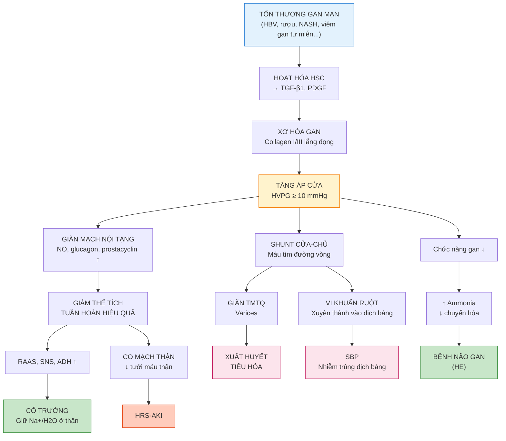
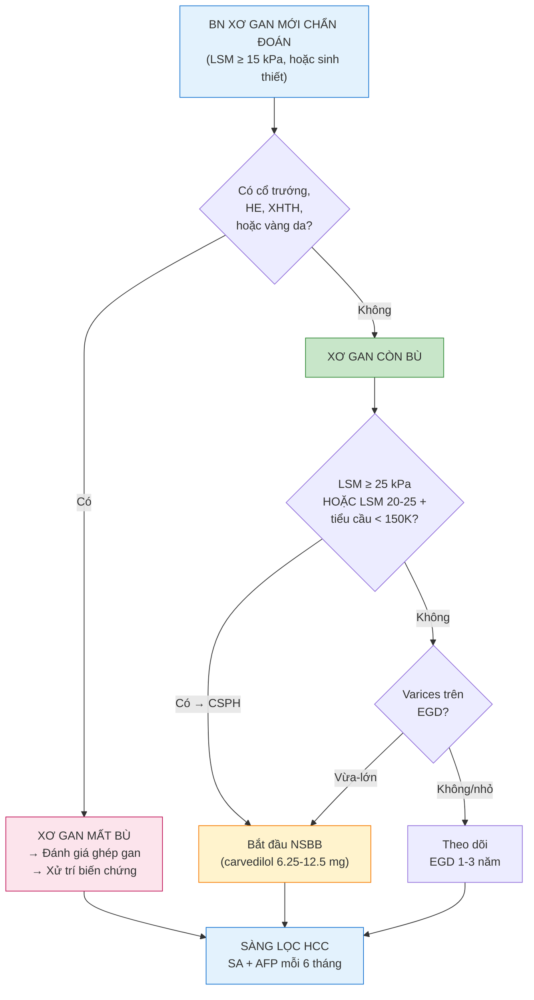
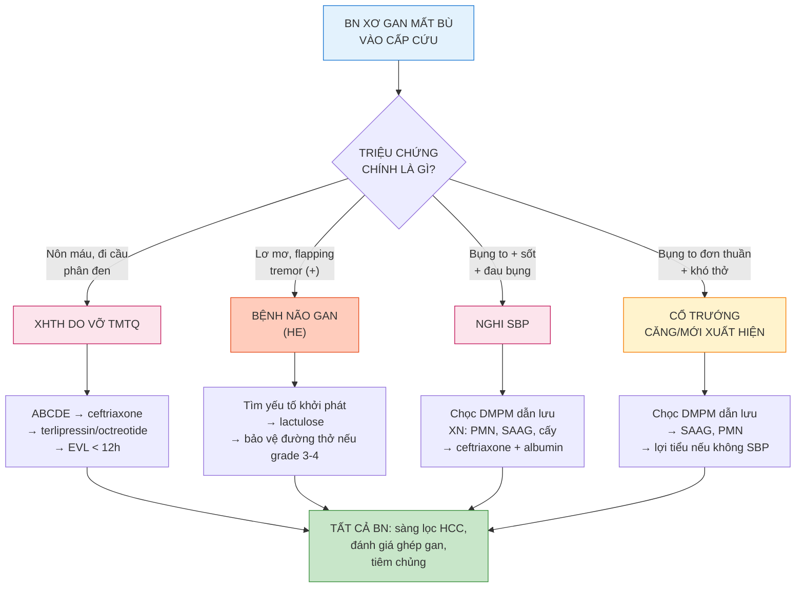

# BÀI HỌC Y KHOA: XƠ GAN VÀ TĂNG ÁP CỬA — CỔ TRƯỚNG, BỆNH NÃO GAN, XUẤT HUYẾT DO GIÃN TĨNH MẠCH THỰC QUẢN, VÀ NHIỄM TRÙNG DỊCH BÁNG
**Ngày:** 2026-07-19 | **Chuyên khoa:** Nội khoa — Tiêu hóa và Gan mật | **Đối tượng:** Bác sĩ Nội khoa tuyến tỉnh, học viên sau đại học và người học mất gốc cần học từ nền tảng | **Mã curriculum:** IM-40 | **Cấp độ:** L3 — Cầm tay chỉ việc

---

## 0. TỔNG QUAN — VÌ SAO BÀI NÀY QUAN TRỌNG?

### Mở đầu bằng một tình huống thực tế

10 giờ tối. Bệnh nhân nam 52 tuổi, tiền sử viêm gan B mạn, được người nhà đưa vào cấp cứu vì **bụng to dần 2 tuần nay, 2 ngày gần đây sốt 38.5°C, lơ mơ, run tay**. Khám thấy bụng căng bóng, shifting dullness (+), flapping tremor (+), sao mạch ở ngực. Bạn là **bác sĩ trực duy nhất**. Không có bác sĩ chuyên khoa tiêu hóa. Phòng nội soi gần nhất đã đóng cửa. Bạn làm gì trong 30 phút đầu?

Câu trả lời cho tình huống này — và hàng trăm tình huống tương tự mỗi tháng tại các bệnh viện tuyến tỉnh Việt Nam — là nội dung của bài học này. Xơ gan là **bệnh lý gan mạn tính phổ biến nhất tại Việt Nam**, đứng sau viêm gan B mạn và rượu. Một khi xơ gan tiến triển đến giai đoạn **mất bù** — nghĩa là xuất hiện cổ trướng, bệnh não gan, xuất huyết tiêu hóa, hoặc nhiễm trùng dịch báng — tỉ lệ sống 5 năm giảm từ 80% xuống còn 30%. Nhưng đồng thời, xơ gan mất bù cũng là giai đoạn mà **xử trí đúng trong 60 phút đầu có thể cứu sống bệnh nhân và kéo dài thời gian chờ ghép gan**.

### "Xơ gan" và "tăng áp cửa" là gì — giải thích bằng phép so sánh

Hãy tưởng tượng **gan như một nhà máy lọc máu khổng lồ** của cơ thể. Mỗi phút, khoảng 1.5 lít máu chảy qua gan — 75% từ tĩnh mạch cửa (máu từ ruột, lách, tụy, chứa chất dinh dưỡng và độc tố cần được xử lý), 25% từ động mạch gan (máu giàu oxy nuôi gan). Nhà máy này có 3 chức năng:

1. **Lọc và khử độc:** Ammonia (NH₃ — chất độc sinh ra từ vi khuẩn phân hủy protein trong ruột) → gan chuyển thành urea → thận thải ra ngoài. Đây là lý do gan hỏng → ammonia tích tụ → não bị nhiễm độc → **bệnh não gan (Hepatic Encephalopathy — HE)**.
2. **Tổng hợp protein:** Albumin (giữ nước trong lòng mạch), yếu tố đông máu (cầm máu). Gan hỏng → albumin giảm → nước thoát ra ngoài mạch máu → **cổ trướng (ascites)** + phù.
3. **Sản xuất mật:** Tiêu hóa mỡ, thải bilirubin. Gan hỏng → bilirubin tăng → vàng da.

Bây giờ, hãy tưởng tượng nhà máy này bị **xơ hóa** — nghĩa là mô sẹo (scar tissue) dần thay thế mô gan khỏe mạnh. Những dải xơ này như **"cặn vôi trong ống nước"**, làm tắc nghẽn dòng máu chảy qua gan. Khi dòng máu từ tĩnh mạch cửa không thể chảy qua gan một cách bình thường, **áp lực trong hệ thống cửa tăng vọt** — đây là **tăng áp cửa (Portal Hypertension)**.

Hậu quả của tăng áp cửa giống như nước trong đường ống bị tắc: nó **tìm đường khác để thoát ra**. Máu từ hệ cửa tìm cách đi vòng qua gan đến tim theo 3 con đường chính:

- **Chảy ra ổ bụng** → dịch thấm qua bề mặt gan và phúc mạc → **cổ trướng (ascites)**
- **Chảy vào tĩnh mạch thực quản** qua các nhánh nối cửa-chủ (portosystemic collaterals) → tĩnh mạch thực quản giãn to, thành mỏng → **giãn tĩnh mạch thực quản (TMTQ)**, dễ **vỡ gây xuất huyết tiêu hóa (XHTH)**
- **Vi khuẩn từ ruột** theo dòng máu tắc nghẽn, xuyên qua thành ruột vào dịch báng → **nhiễm trùng dịch báng (Spontaneous Bacterial Peritonitis — SBP)**

Đây chính là **4 biến chứng chính của xơ gan mất bù**: cổ trướng, HE, XHTH do vỡ giãn TMTQ, và SBP. Toàn bộ bài học này xoay quanh việc nhận diện và xử trí 4 biến chứng này.

### Hai câu hỏi quyết định trong 10 phút đầu

Khi bệnh nhân xơ gan mất bù bước vào phòng cấp cứu, bạn chỉ cần trả lời **2 câu hỏi**:

1. **Bệnh nhân đang ở tình trạng cấp cứu đe dọa tính mạng không?** → Đánh giá ABCDE. Nếu CÓ dấu hiệu XHTH đang diễn tiến (nôn máu, đi cầu phân đen, tụt HA), suy hô hấp (HE grade 3-4), hoặc sốc nhiễm trùng (SBP + tụt HA) → hành động NGAY, không chờ xét nghiệm.
2. **Biến chứng nào đang chiếm ưu thế?** → Triệu chứng chính: bụng to + đau + sốt = SBP; lơ mơ + flapping tremor = HE; nôn máu + đi cầu phân đen = XHTH do vỡ TMTQ; bụng to đơn thuần = cổ trướng mất bù.

### Mục tiêu của bài

Sau bài này, bạn sẽ:
- Hiểu được cơ chế từ xơ gan → tăng áp cửa → 4 biến chứng chính, giải thích được cho bệnh nhân bằng tiếng Việt đơn giản
- Chẩn đoán và xử trí được cổ trướng: khi nào chọc dịch báng, SAAG là gì, dùng lợi tiểu ra sao
- Nhận diện và điều trị SBP: tiêu chuẩn PMN, kháng sinh nào, albumin liều bao nhiêu
- Phân độ và xử trí HE: West Haven grade, lactulose, rifaximin
- Xử trí cấp cứu XHTH do vỡ giãn TMTQ: ABCDE → kháng sinh → terlipressin → nội soi
- Nhận diện HRS-AKI và biết khi nào cần chuyển tuyến
- Áp dụng được các chiến lược điều trị trong điều kiện thực tế tại bệnh viện tuyến tỉnh Việt Nam

---

### 📋 TRƯỚC KHI ĐỌC — BẠN CẦN NẮM CHẮC

> Để hiểu bài này, bạn nên đã biết:
> - **ABCDE và hồi sức cấp cứu cơ bản:** đánh giá đường thở, hô hấp, tuần hoàn (IM-01 — chưa có, sẽ nhắc trong bài)
> - **Sinh lý gan cơ bản:** chức năng gan, tuần hoàn cửa (IM-04 — chưa có, sẽ giải thích từ đầu trong Section 1)
> - **Thuốc cơ bản:** lợi tiểu, kháng sinh, chẹn beta (IM-06 — chưa có, sẽ giải thích khi dùng)
>
> **Nếu bạn CHƯA BIẾT GÌ về những thứ trên: KHÔNG SAO.** Bài này được viết cho người mất gốc. Mọi khái niệm đều được giải thích từ con số 0, với phép so sánh dễ hiểu. Bạn chỉ cần đọc tuần tự từ đầu — không cần kiến thức nền.

---

### 0.1 Nền tảng tối thiểu cần dùng ngay

**ABCDE** là thứ tự kiểm tra nguy hiểm trước chẩn đoán: đường thở (A), hô hấp (B), tuần hoàn (C), ý thức/đường huyết (D), và bộc lộ khám toàn thân (E). Bệnh nhân xơ gan mất bù nôn máu, tụt HA, lơ mơ, vã mồ hôi, SpO₂ giảm → đây là **cấp cứu tối khẩn** — không chờ kết quả xét nghiệm hay siêu âm. Bảo đảm đường thở (đặt nội khí quản nếu HE grade 3-4), thở oxy, thiết lập 2 đường truyền tĩnh mạch ngoại vi lớn, monitor sinh hiệu liên tục.

**Gan** là tạng nội tạng lớn nhất cơ thể (~1.2–1.5 kg), nằm ở hạ sườn phải, nhận máu từ 2 nguồn: **tĩnh mạch cửa** (75% lưu lượng, máu từ ruột-lách-tụy) và **động mạch gan** (25%, máu giàu oxy). Máu chảy qua các **xoang gan (sinusoid)** — những kênh máu nhỏ lót bởi tế bào nội mô có lỗ thủng (fenestrated) và được bao quanh bởi tế bào gan (hepatocyte). Sau khi được lọc, máu đổ vào tĩnh mạch trung tâm tiểu thùy → tĩnh mạch gan → tĩnh mạch chủ dưới → tim.

**Tế bào sao gan (Hepatic Stellate Cell — HSC)** là tế bào nằm trong khoảng Disse (khoảng giữa tế bào gan và nội mô xoang). Bình thường, HSC dự trữ vitamin A và ở trạng thái nghỉ. Khi gan bị tổn thương (viêm gan virus, rượu, NASH...), HSC được **hoạt hóa** → biến thành nguyên bào sợi cơ (myofibroblast) → sản xuất collagen type I và III → **lắng đọng mô xơ** trong khoảng Disse → mất lỗ thủng nội mô (sinusoidal capillarization) → cản trở trao đổi chất giữa máu và tế bào gan → tăng áp lực cửa.

> **Nguồn:** TEXTBOOK: Sleisenger and Fordtran's Gastrointestinal and Liver Disease 11e, Ch.71–72; Guyton and Hall 14e, Ch.71; REVIEW: PMID 32260126.

**Các thang điểm quan trọng:**
- **Child-Pugh (Child-Turcotte-Pugh):** 5 tham số (bilirubin, albumin, INR, ascites, HE), mỗi tham số 1-3 điểm → Class A (5-6 điểm, còn bù), B (7-9 điểm, mất bù trung bình), C (10-15 điểm, mất bù nặng).
- **MELD-Na (Model for End-Stage Liver Disease):** bilirubin, creatinine, INR, Na. Dùng để ưu tiên ghép gan. Điểm càng cao → nguy cơ tử vong 3 tháng càng cao. MELD ≥ 15 thường là ngưỡng cân nhắc đưa vào danh sách ghép.
- **HVPG (Hepatic Venous Pressure Gradient):** áp lực tĩnh mạch gan đè (WHVP) trừ áp lực tĩnh mạch gan tự do (FHVP). HVPG bình thường 1-5 mmHg. HVPG ≥ 10 mmHg = **tăng áp cửa có ý nghĩa lâm sàng (CSPH)** — ngưỡng bắt đầu xuất hiện varices và nguy cơ mất bù.

---

## 1. SINH LÝ BỆNH — TỪ TỔN THƯƠNG GAN ĐẾN TĂNG ÁP CỬA VÀ 4 BIẾN CHỨNG [CỐT LÕI]

> **Nguồn kiến thức nền:** TEXTBOOK: Sleisenger and Fordtran 11e, Ch.71–72, 93; REVIEW: PMID 32260126; Baveno VII: PMID 35120736.

### 1.0 Nhắc nhanh: Giải phẫu gan và tuần hoàn cửa cho người mới bắt đầu

Muốn hiểu tại sao gan xơ gây ra tăng áp cửa, bạn cần biết máu chảy qua gan như thế nào khi bình thường.

**Đơn vị cấu trúc cơ bản của gan là tiểu thùy gan (hepatic lobule)** — hình lục giác, với **tĩnh mạch trung tâm** ở giữa và **khoảng cửa (portal triad)** ở các góc. Mỗi khoảng cửa chứa 3 cấu trúc: một nhánh **tĩnh mạch cửa**, một nhánh **động mạch gan**, và một **ống mật**.

Máu chảy từ khoảng cửa (ngoại vi) qua các xoang gan (nơi tiếp xúc với tế bào gan) về tĩnh mạch trung tâm. Đây là dòng chảy **áp lực thấp, lưu lượng cao** — gan nhận ~25% cung lượng tim nhưng chỉ tiêu thụ ~20% oxy cơ thể.

**Tĩnh mạch cửa (Portal Vein)** được tạo thành từ hợp lưu của:
- **Tĩnh mạch mạc treo tràng trên (SMV):** dẫn máu từ ruột non và đại tràng phải
- **Tĩnh mạch lách (Splenic Vein):** dẫn máu từ lách, kèm theo tĩnh mạch mạc treo tràng dưới (IMV) đổ vào

**Áp lực cửa bình thường** là 5–10 mmHg. Khi vượt quá 10 mmHg, các shunt cửa-chủ (portosystemic collaterals) bắt đầu mở ra — máu tìm đường vòng qua gan. Khi vượt quá 12 mmHg, nguy cơ vỡ giãn TMTQ tăng cao.

### 1.1 Cơ chế xơ hóa gan — "Nhà máy lọc máu bị sẹo hóa"

Xơ hóa gan là hậu quả của **tổn thương gan mạn tính kéo dài**, bất kể nguyên nhân (viêm gan B/C, rượu, NASH, viêm gan tự miễn, ứ mật...). Đây là một quá trình "lành vết thương không hoàn hảo" (wound healing gone wrong) — giống như da bị đứt tay để lại sẹo, nhưng ở gan, quá trình này không dừng lại.

**Các bước của xơ hóa gan:**

**Bước 1 — Tổn thương tế bào gan:** Virus, rượu, mỡ, độc tố... gây chết tế bào gan theo cơ chế hoại tử (necrosis) hoặc chết theo chương trình (apoptosis). Tế bào gan chết giải phóng các chất gây viêm (DAMPs — Damage-Associated Molecular Patterns).

**Bước 2 — Hoạt hóa tế bào Kupffer:** Tế bào Kupffer (đại thực bào thường trú của gan) phát hiện DAMPs → sản xuất **TGF-β1 (Transforming Growth Factor beta-1)** — cytokine gây xơ hóa mạnh nhất. TGF-β1 là "tín hiệu SOS" kêu gọi tế bào sao gan (HSC) hoạt hóa.

**Bước 3 — Hoạt hóa HSC:** Đây là bước TRUNG TÂM của xơ hóa gan. HSC bình thường ở trạng thái nghỉ (quiescent), dự trữ vitamin A trong các giọt mỡ. Dưới tác động của TGF-β1, PDGF (Platelet-Derived Growth Factor), và các cytokine khác, HSC **mất giọt mỡ vitamin A** và **chuyển dạng thành nguyên bào sợi cơ (myofibroblast)**. Myofibroblast là "cỗ máy sản xuất collagen" — nó tiết ra collagen type I và III, fibronectin, laminin... tạo thành mô sẹo.

**Bước 4 — Lắng đọng mô xơ và tái cấu trúc:** Collagen lắng đọng trong khoảng Disse (giữa tế bào gan và nội mô xoang) → xoang gan mất lỗ thủng (sinusoidal capillarization) → **tăng sức cản dòng máu qua gan** → tăng áp cửa. Đồng thời, mô xơ tạo cầu nối giữa khoảng cửa và tĩnh mạch trung tâm (bridging fibrosis) → phá vỡ kiến trúc tiểu thùy gan. Giai đoạn cuối cùng là **xơ gan (cirrhosis)** — gan bị chia cắt thành các nốt tân tạo (regenerative nodules) bao quanh bởi dải xơ dày.

### 1.2 Tăng áp cửa — Cơ chế kép

Tăng áp cửa trong xơ gan không chỉ là vấn đề cơ học đơn thuần. Nó có 2 thành phần:

**1. Tăng sức cản trong gan (Intrahepatic Resistance):**
- **Thành phần cấu trúc (cố định, ~70%):** mô xơ, nốt tân tạo chèn ép xoang gan và tĩnh mạch → cản trở cơ học dòng máu.
- **Thành phần động (có thể đảo ngược, ~30%):** HSC hoạt hóa cũng **co bóp** như tế bào cơ trơn (do tăng đáp ứng với vasoconstrictors như endothelin-1 + giảm sản xuất NO nội sinh của nội mô xoang). Đây là cơ sở cho điều trị bằng thuốc giãn mạch (như carvedilol, propranolol).

**2. Tăng lưu lượng máu nội tạng (Splanchnic Hyperemia):**
- Tăng áp cửa → cơ thể sản xuất các chất **giãn mạch nội tạng (splanchnic vasodilators)** như NO, glucagon, prostacyclin → động mạch nội tạng giãn → tăng lưu lượng máu đổ về tĩnh mạch cửa → **càng làm tăng áp cửa thêm** (vòng xoắn bệnh lý).
- Giãn mạch nội tạng → **giảm thể tích tuần hoàn hiệu quả (effective hypovolemia)** — một khái niệm CỐT LÕI để hiểu mọi biến chứng tiếp theo.

**Effective hypovolemia** là gì? Mặc dù cơ thể bệnh nhân xơ gan có tổng lượng nước và natri TĂNG (phù, cổ trướng), nhưng thể tích máu trong lòng động mạch lại GIẢM (vì máu bị "mắc kẹt" trong hệ mạch nội tạng giãn). Cơ thể "cảm nhận" đang thiếu máu → kích hoạt các hệ thống bù trừ:

- **Hệ Renin-Angiotensin-Aldosterone (RAAS):** ↑ renin → ↑ angiotensin II → ↑ aldosterone → giữ natri và nước ở thận
- **Hệ giao cảm (SNS):** ↑ catecholamines → co mạch thận, tăng nhịp tim
- **ADH (vasopressin):** ↑ giữ nước tự do ở ống góp thận

Hậu quả: giữ natri và nước → cổ trướng nặng thêm + hạ natri máu pha loãng. Co mạch thận → giảm tưới máu thận → nguy cơ **HRS-AKI (Hepatorenal Syndrome — Acute Kidney Injury)**.

### 1.3 Hậu quả của tăng áp cửa — Sơ đồ tổng thể

> **Hướng dẫn đọc sơ đồ:** Mỗi hộp màu xanh lá là một trong 4 biến chứng MẤT BÙ chính. Hộp vàng (tăng áp cửa) là trung tâm — mọi đường dẫn từ nó. Hộp đỏ (XHTH, SBP) là cấp cứu. Hộp cam (HRS-AKI) là biến chứng nặng của suy thận chức năng. Đường đứt nét = cơ chế gián tiếp.

> ⚠️ **HỌC VIÊN HAY NHẦM #1:** "Xơ gan còn bù (compensated cirrhosis) = bệnh nhẹ, chưa cần lo." **SAI!** Xơ gan còn bù là giai đoạn gan vẫn hoạt động đủ để không gây triệu chứng, nhưng tăng áp cửa đã ÂM THẦM tiến triển. Theo Baveno VII [PMID 35120736], CSPH (HVPG ≥ 10 mmHg) ở BN còn bù làm tăng nguy cơ mất bù. **Đây là thời điểm vàng để can thiệp dự phòng.** NSBB (non-selective beta-blockers — carvedilol, propranolol) làm giảm áp cửa và dự phòng mất bù.

---

### 🛑 DỪNG 1 PHÚT — TỰ KIỂM TRA

> 1. Tại sao bệnh nhân xơ gan lại có phù và cổ trướng trong khi tổng lượng nước cơ thể tăng, nhưng thể tích tuần hoàn hiệu quả lại giảm?
> 2. Tế bào nào là "cỗ máy sản xuất collagen" trong xơ hóa gan? Nó bị hoạt hóa bởi cytokine nào là chính?
> 3. Áp lực cửa bình thường là bao nhiêu? Ngưỡng CSPH là bao nhiêu?
>
> *(Đáp án: 1. Do giãn mạch nội tạng → máu "mắc kẹt" trong hệ nội tạng → thể tích tuần hoàn hiệu quả giảm → RAAS/SNS/ADH hoạt hóa → giữ Na+/H2O → cổ trướng. 2. HSC (Hepatic Stellate Cell) → myofibroblast; TGF-β1 là cytokine chính. 3. Bình thường 5-10 mmHg; CSPH ≥ 10 mmHg.)*

---

## 2. CỔ TRƯỚNG (ASCITES) [CỐT LÕI]

> **Nguồn:** AASLD Ascites/SBP/HRS 2021 (Biggins SW); AGA Ascites 2025 (Orman ES); JAMA Review 2023 (Tapper EB, Parikh ND); Update CGH 2023 (Abraldes JG).

Cổ trướng là **biến chứng mất bù phổ biến nhất** của xơ gan, thường là dấu hiệu mất bù đầu tiên. Khoảng 5–10% BN xơ gan còn bù phát triển cổ trướng mỗi năm. Một khi cổ trướng xuất hiện, tỉ lệ sống 5 năm giảm từ ~80% xuống ~30%.

### 2.1 Cơ chế — Vì sao nước lại chảy vào ổ bụng?

Cơ chế cổ trướng trong xơ gan là tổng hòa của 3 yếu tố, nhớ bằng công thức: **"Tăng áp cửa + Giảm albumin + Giữ Na+/H2O"**

1. **Tăng áp lực thủy tĩnh trong xoang gan:** HVPG tăng → áp lực đẩy nước từ lòng xoang gan ra khoảng kẽ và ổ bụng tăng. Đây là điều kiện TIÊN QUYẾT — không có tăng áp cửa thì không có cổ trướng do xơ gan. SAAG ≥ 1.1 g/dL xác nhận cơ chế này (xem 2.3).

2. **Giảm áp lực keo (oncotic pressure):** Gan xơ giảm tổng hợp albumin → albumin huyết tương giảm → áp lực giữ nước trong lòng mạch giảm → nước dễ thoát ra ngoài. Tuy nhiên, giảm albumin ĐƠN ĐỘC hiếm khi gây cổ trướng nếu không có tăng áp cửa.

3. **Giữ natri và nước tại thận:** Như đã giải thích ở 1.2, giãn mạch nội tạng → effective hypovolemia → RAAS/SNS/ADH hoạt hóa → thận giữ Na+ và H2O. Điều này giải thích tại sao hạn chế muối và lợi tiểu là nền tảng điều trị cổ trướng.

### 2.2 Chẩn đoán — Lâm sàng và cận lâm sàng

**Lâm sàng:**

Cổ trướng được phát hiện lâm sàng qua 3 mức độ:
- **Grade 1 (nhẹ):** chỉ phát hiện qua siêu âm (dịch ít, < 1-2 L). Khám lâm sàng bình thường.
- **Grade 2 (vừa):** bụng căng to vừa, **shifting dullness dương tính** (gõ đục thay đổi theo tư thế). Đây là dấu hiệu thực thể có giá trị nhất.
- **Grade 3 (nặng/căng):** bụng căng bóng, **fluid wave dương tính** (cảm giác sóng vỗ khi vỗ vào một bên bụng), khó thở do cơ hoành bị đẩy lên.

**Kỹ thuật khám shifting dullness:** BN nằm ngửa → gõ từ rốn ra 2 bên hông. Vùng đục (dịch) ở thấp nhất, vùng trong (hơi ruột) ở cao. BN nghiêng sang trái → đợi 30 giây → gõ lại. Vùng đục trước đó ở hông phải giờ thành trong (dịch chảy xuống hông trái) → shifting dullness (+).

**Cận lâm sàng:**

**Siêu âm bụng** là công cụ phát hiện cổ trướng nhạy nhất — phát hiện được ≥ 100 mL dịch. SA còn giúp đánh giá: kích thước gan, bề mặt gan (nốt trong xơ gan), kích thước lách, đường kính tĩnh mạch cửa, huyết khối tĩnh mạch cửa, HCC.

> 🚨 **BOX ĐỎ — AN TOÀN TRƯỚC KHI ĐIỀU TRỊ CỔ TRƯỚNG THƯỜNG QUY:**
>
> Chọc dịch báng chẩn đoán (diagnostic paracentesis) là BẮT BUỘC với mọi BN xơ gan có cổ trướng mới xuất hiện hoặc cổ trướng cũ nhập viện. Hỏi ngay: **có sốt/đau bụng/rối loạn ý thức/XHTH đồng thời không?** Nếu có → SBP hoặc HE hoặc XHTH — đây là cấp cứu, xử trí theo nhánh tương ứng trước khi điều trị lợi tiểu.
>
> **Chống chỉ định chọc dịch báng:** rối loạn đông máu nặng không điều chỉnh được (INR > 2.0, tiểu cầu < 20K), nhưng KHÔNG CÓ chống chỉ định tuyệt đối — lợi ích chẩn đoán SBP vượt trội nguy cơ chảy máu trong hầu hết trường hợp. **KHÔNG cần truyền tiểu cầu hay FFP dự phòng trước chọc.** Vị trí chọc: 1/4 dưới trái hoặc phải, cách rốn 3 cm, tránh sẹo mổ cũ và mạch máu thành bụng.

### 2.3 Xét nghiệm dịch báng — SAAG và các chỉ số

**SAAG (Serum-Ascites Albumin Gradient)** = Albumin huyết thanh — Albumin dịch báng. Đây là xét nghiệm QUAN TRỌNG NHẤT để xác định cơ chế cổ trướng.

- **SAAG ≥ 1.1 g/dL (11 g/L) → cổ trướng do TĂNG ÁP CỬA** (dịch thấm). Bao gồm: xơ gan, suy tim ứ huyết, Budd-Chiari, tắc tĩnh mạch cửa.
- **SAAG < 1.1 g/dL → cổ trướng KHÔNG do tăng áp cửa** (dịch tiết). Bao gồm: lao màng bụng, carcinomatosis phúc mạc, viêm tụy, hội chứng thận hư.

SAAG ≥ 1.1 có độ chính xác ~97% trong chẩn đoán cổ trướng do tăng áp cửa.

**Các xét nghiệm khác trên dịch báng:**

| Xét nghiệm | Giá trị bình thường | Bất thường → nghĩ đến |
|---|---|---|
| **Cell count + differential** | < 250 PMN/mm³ | **SBP**: PMN ≥ 250/mm³ (xem Section 3) |
| **Cấy (blood culture bottles)** | Vô trùng | SBP (cấy dương ở ~40-60% ca) |
| **Albumin** | — | Dùng để tính SAAG |
| **Protein toàn phần** | < 2.5 g/dL (dịch thấm) | > 2.5 g/dL → dịch tiết (lao, ung thư) |
| **Glucose** | = glucose máu | Giảm → SBP, lao, carcinomatosis |
| **LDH** | < 225 U/L | Tăng → SBP thứ phát (thủng tạng), ung thư |
| **Amylase** | < 50 U/L | Tăng → viêm tụy cấp, thủng tụy |
| **Tế bào học** | Âm tính | Carcinomatosis phúc mạc |
| **ADA, PCR lao** | — | Lao màng bụng |

### 2.4 Điều trị — Hạn chế muối, lợi tiểu, theo dõi

**Nguyên tắc điều trị cổ trướng không biến chứng (grade 2):**

**Bậc 1 — Hạn chế natri:** ≤ 2 g muối/ngày (tương đương 5 g NaCl, hay 88 mmol Na+). Đây là nền tảng. Nếu BN tuân thủ nghiêm ngặt, ~10-15% trường hợp cổ trướng tự hết. Thực tế tại Việt Nam: nước mắm, bột canh, mì chính là nguồn natri chính — cần tư vấn cụ thể cho BN và người nhà.

**Bậc 2 — Lợi tiểu:** Khi hạn chế muối đơn thuần không đủ, thêm lợi tiểu. Nguyên tắc: **spironolactone (kháng aldosterone) + furosemide (lợi tiểu quai)** với tỉ lệ 100 mg : 40 mg.

- **Spironolactone:** khởi đầu 100 mg/ngày, tăng dần mỗi 3-5 ngày đến tối đa 400 mg/ngày. Cơ chế: chặn thụ thể aldosterone ở ống góp → giảm tái hấp thu Na+, giữ K+. Tác dụng chậm (2-4 ngày mới thấy hiệu quả).
- **Furosemide:** khởi đầu 40 mg/ngày, tăng dần đến tối đa 160 mg/ngày. Cơ chế: ức chế bơm Na-K-2Cl ở nhánh lên quai Henle → tăng thải Na+, K+, H2O. Tác dụng nhanh (30-60 phút).

**Tại sao phải dùng phối hợp?** Spironolactone đơn độc thường không đủ vì còn các cơ chế giữ Na+ khác (tái hấp thu ở ống lượn gần và quai Henle). Furosemide bổ sung tác dụng tại quai Henle. Tỉ lệ 100:40 giúp duy trì cân bằng K+ — spironolactone giữ K+, furosemide thải K+.

**Mục tiêu điều trị:** giảm cân 0.5 kg/ngày (nếu không có phù ngoại biên) hoặc 1 kg/ngày (nếu có phù ngoại biên). Giảm nhanh hơn → nguy cơ HRS-AKI, hạ Na+ máu, hạ K+ máu.

**Theo dõi:**
- Cân nặng mỗi ngày
- Điện giải đồ mỗi 3-5 ngày (Na+, K+, creatinine)
- Nếu creatinine tăng > 0.3 mg/dL hoặc > 1.5 lần baseline → nghi HRS-AKI → tạm dừng lợi tiểu, đánh giá ngay
- Dấu hiệu quá liều: hạ HA tư thế, chuột rút, yếu cơ (hạ K+), lú lẫn (hạ Na+)

| Thuốc | Cơ chế | Liều khởi đầu | Tối đa | Tác dụng phụ cần theo dõi |
|---|---|---|---|---|
| **Spironolactone** | Kháng aldosterone (ống góp) | 100 mg PO | 400 mg/ngày | Tăng K+, đau ngực nam (gynecomastia) |
| **Furosemide** | Ức chế Na-K-2Cl (quai Henle) | 40 mg PO | 160 mg/ngày | Hạ K+, hạ Na+, hạ HA, suy thận |
| **Amiloride** (thay thế spironolactone) | Chẹn kênh Na+ biểu mô (ống góp) | 10 mg PO | 20 mg/ngày | Tăng K+ (dùng nếu gynecomastia do spironolactone) |

### 2.5 Cổ trướng kháng trị — LVP, TIPS, ghép gan

Cổ trướng kháng trị (refractory ascites) được định nghĩa là:
- Cổ trướng không đáp ứng với liều tối đa lợi tiểu (spironolactone 400 mg + furosemide 160 mg)
- Hoặc cổ trướng tái phát sớm sau chọc tháo (LVP)
- Hoặc không dung nạp lợi tiểu do tác dụng phụ (suy thận, hạ Na+, tăng K+)

**LVP (Large-Volume Paracentesis — chọc tháo dịch báng thể tích lớn):**
- Chọc tháo > 5L dịch báng.
- **Phải truyền albumin 6-8g cho mỗi L dịch báng tháo ra** để dự phòng **Post-Paracentesis Circulatory Dysfunction (PCCD)** — biến chứng giãn mạch nội tạng nặng thêm sau LVP do thay đổi huyết động đột ngột. Theo meta-analysis PMID 36697778, truyền albumin sau LVP làm giảm tỉ lệ PCCD và hạ natri máu.
- LVP + albumin là phương pháp tạm thời, KHÔNG điều trị nguyên nhân.

**Ghép gan:** điều trị triệt để duy nhất cho xơ gan mất bù. Chỉ định khi MELD-Na ≥ 15 hoặc có biến chứng mất bù không kiểm soát được.

**TIPS (Transjugular Intrahepatic Portosystemic Shunt):**
- Đặt stent nối giữa TM cửa và TM gan qua đường TM cảnh trong → tạo shunt giảm áp cửa.
- Chỉ định: cổ trướng kháng trị + chức năng gan còn bảo tồn (Child-Pugh < 12, MELD < 18).
- Theo meta-analysis PMID 37141993: TIPS giảm nguy cơ further decompensation (HR 0.44; 95% CI 0.37-0.54) và cải thiện survival.

- Biến chứng của TIPS: HE (tỉ lệ 20-50%), suy tim (tăng tiền gánh đột ngột), hẹp/tắc stent.

> ⚠️ **HỌC VIÊN HAY NHẦM #2:** "Lợi tiểu không đáp ứng thì tăng liều, không có giới hạn." **SAI!** Spironolactone > 400 mg + furosemide > 160 mg mà không đáp ứng → ngừng tăng liều, chuyển LVP. Tiếp tục tăng liều chỉ làm tăng tác dụng phụ (suy thận, rối loạn điện giải) mà không cải thiện cổ trướng. Mục tiêu là cân bằng giữa giảm cổ trướng và bảo vệ chức năng thận.

---

### 🛑 DỪNG 1 PHÚT — TỰ KIỂM TRA

> 1. BN xơ gan Child-Pugh B, cổ trướng grade 2. SAAG = 1.4 g/dL, protein dịch báng = 1.8 g/dL, PMN = 120/mm³. Chẩn đoán? Điều trị?
> 2. Tại sao spironolactone + furosemide phối hợp theo tỉ lệ 100:40?
> 3. LVP > 5L, cần truyền albumin bao nhiêu? Tại sao?
>
> *(Đáp án: 1. Cổ trướng do tăng áp cửa (SAAG ≥ 1.1), không SBP (PMN < 250). Điều trị: hạn chế muối + spironolactone 100 mg + furosemide 40 mg. 2. Spironolactone giữ K+, furosemide thải K+ — tỉ lệ 100:40 giúp duy trì cân bằng K+. Spironolactone tác dụng chậm hơn nên cần liều cao hơn. 3. Albumin 6-8g/L dịch tháo để dự phòng PCCD.)*

---

## 3. NHIỄM TRÙNG DỊCH BÁNG (SBP) [CỐT LÕI]

> **Nguồn:** AASLD Ascites/SBP/HRS 2021 (Biggins SW); AGA HRS-AKI 2022 (Flamm SL); Meta-review albumin (Zheng X, 2023).

SBP là nhiễm trùng dịch báng **tiên phát** (không có ổ nhiễm trùng trong ổ bụng) ở BN xơ gan có cổ trướng. Phân biệt với **viêm phúc mạc thứ phát** (thủng tạng rỗng, áp-xe trong ổ bụng). SBP là **cấp cứu nội khoa** — tỉ lệ tử vong nếu không điều trị lên đến 30-50%.

### 3.1 Cơ chế — Vi khuẩn từ ruột xuyên vào dịch báng

1. **Tăng sinh vi khuẩn ruột non (Small Intestinal Bacterial Overgrowth — SIBO):** Ứ trệ nhu động ruột và giảm miễn dịch tại chỗ trong xơ gan → vi khuẩn ruột non tăng sinh quá mức.
2. **Tăng tính thấm thành ruột:** Xơ gan → phù nề thành ruột, tổn thương hàng rào niêm mạc → vi khuẩn dễ xuyên qua.
3. **Giảm miễn dịch:** Gan xơ → giảm chức năng lưới nội mô (tế bào Kupffer) → vi khuẩn không được thanh lọc khỏi máu cửa. Dịch báng lại là môi trường lý tưởng cho vi khuẩn phát triển vì nồng độ opsonin (bổ thể, IgG) thấp.

**Tác nhân gây bệnh thường gặp:**
- **E. coli** (~40-50%) — vi khuẩn gram âm đường ruột phổ biến nhất
- **Klebsiella pneumoniae** (~10-15%)
- **Streptococcus pneumoniae** và các Streptococcus spp. (~10-15%)
- **Enterococcus** (~5-10%)
- **Staphylococcus aureus** (hiếm, < 5%)

### 3.2 Chẩn đoán

**Lâm sàng — tam chứng: SỐT + ĐAU BỤNG + BỤNG TRƯỚNG CĂNG TĂNG.** Nhưng lưu ý: ~30% BN SBP không có triệu chứng hoặc triệu chứng rất kín đáo. Các dấu hiệu gợi ý khác: HE khởi phát hoặc nặng lên, suy thận tiến triển, XHTH, tụt HA không rõ nguyên nhân.

**Tiêu chuẩn vàng:** **PMN (Polymorphonuclear neutrophils) trong dịch báng ≥ 250 tế bào/mm³.** Đây là chỉ định bắt đầu kháng sinh NGAY LẬP TỨC, không cần chờ kết quả cấy.

- PMN ≥ 250/mm³ → **SBP** → kháng sinh ngay
- Cấy dịch báng (+) + PMN < 250 → **bacterascites** → theo dõi, nếu có triệu chứng → điều trị như SBP
- PMN < 250 + cấy (-) → loại trừ SBP

**Kỹ thuật cấy dịch báng tối ưu:** cấy ngay tại giường vào chai cấy máu (blood culture bottles — cả hiếu khí và kỵ khí) thay vì gửi ống nghiệm thường. Phương pháp này tăng tỉ lệ cấy dương từ ~40% lên ~80%.

### 3.3 Điều trị

**Kháng sinh kinh nghiệm — ceftriaxone hoặc cefotaxime:**
- **Ceftriaxone:** 1-2 g/ngày IV (ưu tiên tại Việt Nam vì tiện dụng, 1 lần/ngày)
- **Cefotaxime:** 2 g mỗi 8 giờ IV (nếu dùng ceftriaxone ở BN vàng da nặng, tranh cãi về nguy cơ sỏi mật)
- Hoặc **piperacillin-tazobactam** nếu nghi ngờ vi khuẩn đa kháng
- Thời gian: **5-7 ngày** (ngừng khi PMN giảm > 50% so với ban đầu và BN ổn định lâm sàng)

**Albumin — chìa khóa giảm tử vong:**
- **Albumin 1.5 g/kg trong 6 giờ đầu (ngày 1), sau đó 1 g/kg vào ngày 3.**
- Cơ chế: albumin không chỉ bù thể tích tuần hoàn mà còn **gắn và trung hòa các chất trung gian gây viêm**, giảm rối loạn chức năng nội mô, dự phòng HRS-AKI.
- Theo meta-review PMID 36697778, albumin trong SBP giúp giảm tỉ lệ HRS và cải thiện tử vong.
- **Albumin 20% 100 mL chứa 20 g albumin.** Ví dụ: BN 50 kg → 1.5 g × 50 = 75 g → 375 mL albumin 20% (≈ 4 chai).

### 3.4 Dự phòng

**Chỉ định dự phòng SBP (primary prophylaxis):**
- **XHTH do vỡ giãn TMTQ** → ceftriaxone 1g/ngày IV × 7 ngày (giảm tỉ lệ nhiễm trùng và tử vong)
- **BN xơ gan có protein dịch báng < 1.5 g/dL KÈM THEO**:
 - Child-Pugh ≥ 9 + bilirubin ≥ 3 → norfloxacin 400 mg/ngày PO
 - Hoặc suy thận (creatinine ≥ 1.2, BUN ≥ 25)
 - Hoặc hạ Na+ máu (Na+ ≤ 130)

**Dự phòng thứ phát (sau đợt SBP đầu tiên):** norfloxacin 400 mg/ngày PO hoặc TMP-SMX 800/160 mg/ngày PO, kéo dài. Lưu ý: ở các nước có tỉ lệ kháng fluoroquinolone cao, cân nhắc luân phiên kháng sinh.

> ⚠️ **HỌC VIÊN HAY NHẦM #3:** "SBP chỉ xảy ra khi BN sốt và đau bụng." **SAI!** ~30% SBP không có triệu chứng. **Bất kỳ BN xơ gan nào nhập viện đều phải chọc dịch báng chẩn đoán** — kể cả khi vào viện vì lý do khác (XHTH, HE). Bỏ sót SBP = bỏ sót cơ hội cứu sống BN.

---

### 🛑 DỪNG 1 PHÚT — TỰ KIỂM TRA

> 1. BN xơ gan cổ trướng, sốt 38.5°C, đau bụng lan tỏa. Chọc dịch báng: PMN = 350/mm³. Bạn làm gì?
> 2. Tại sao phải dùng albumin trong SBP? Liều bao nhiêu?
> 3. BN xơ gan Child-Pugh C (11 điểm), protein dịch báng 1.2 g/dL. Có cần dự phòng SBP không? Dùng thuốc gì?
>
> *(Đáp án: 1. Chẩn đoán SBP (PMN ≥ 250). Ceftriaxone 2g/ngày IV + albumin 1.5g/kg ngày 1, 1g/kg ngày 3. Cấy dịch báng vào chai cấy máu. 2. Albumin bù thể tích + gắn và trung hòa các chất trung gian gây viêm, dự phòng HRS. Liều: 1.5g/kg ngày 1 + 1g/kg ngày 3. 3. CÓ. Protein dịch báng < 1.5 + Child-Pugh ≥ 9 + bilirubin ≥ 3 → norfloxacin 400 mg/ngày PO.)*

---

## 4. BỆNH NÃO GAN (HEPATIC ENCEPHALOPATHY — HE) [CỐT LÕI]

> **Nguồn:** AASLD/EASL HE Guideline 2014 (Vilstrup H); JAMA Review 2023 (Tapper EB, Parikh ND); Update CGH 2023 (Abraldes JG).

HE là hội chứng rối loạn chức năng não do suy gan, biểu hiện từ **rối loạn nhận thức nhẹ đến hôn mê**. Đây là biến chứng ảnh hưởng nặng nề nhất đến chất lượng sống của BN và gia đình. HE cũng là dấu hiệu tiên lượng xấu — tỉ lệ sống 1 năm sau đợt HE đầu tiên chỉ ~40%.

### 4.1 Cơ chế — "Ammonia đầu độc não như thế nào?"

Cơ chế HE dựa trên 3 yếu tố chính:

**1. Ammonia — chất độc thần kinh trung ương:**

Ammonia (NH₃) sinh ra từ vi khuẩn ruột phân hủy protein (từ thức ăn, máu trong lòng ruột sau XHTH) và từ glutaminase ở ruột non. Bình thường, ammonia được gan chuyển thành **urea** qua chu trình urea (urea cycle) → thận thải ra ngoài. Trong xơ gan:
- Gan không chuyển hóa được ammonia (do giảm tế bào gan chức năng + shunt cửa-chủ đưa máu giàu ammonia vòng qua gan)
- Ammonia vào tuần hoàn hệ thống → vượt hàng rào máu não → vào **tế bào hình sao (astrocyte)** trong não

Trong astrocyte, ammonia + glutamate → glutamine (nhờ enzyme glutamine synthetase). Glutamine là chất có hoạt tính thẩm thấu (osmolyte) → kéo nước vào astrocyte → **phù tế bào hình sao (cytotoxic edema)** → rối loạn dẫn truyền thần kinh.

**2. Viêm hệ thống (systemic inflammation):**

Nhiễm trùng (SBP, nhiễm trùng tiểu, viêm phổi), XHTH, và chính bản thân xơ gan → giải phóng cytokine viêm (TNF-α, IL-6, IL-1β) → tăng tính thấm hàng rào máu não → ammonia dễ xâm nhập não hơn. **Đây là lý do nhiễm trùng là yếu tố khởi phát HE hàng đầu.**

**3. Chất dẫn truyền thần kinh giả (false neurotransmitters) và hệ GABA:**

Shunt cửa-chủ → các amino acid thơm (phenylalanine, tyrosine) từ ruột không được gan chuyển hóa → vào não → tạo thành **chất dẫn truyền thần kinh giả** (octopamine, phenylethanolamine) → ức chế dẫn truyền dopaminergic và noradrenergic. Đồng thời, tăng hoạt tính hệ GABA-ergic (do các chất giống benzodiazepine nội sinh) → ức chế thần kinh toàn thể.

### 4.2 Phân độ West Haven

| Grade | Đặc điểm lâm sàng | Dấu hiệu thần kinh |
|---|---|---|
| **Grade 0 (MHE)** | Không triệu chứng lâm sàng | Bất thường trên test tâm thần kinh (psychometric tests: NCT-A, DST, PHES) |
| **Grade 1** | Ngủ gà nhẹ, giảm chú ý, thay đổi nhân cách, rối loạn nhịp ngủ-thức | **Flapping tremor có thể có (+)**, rối loạn phối hợp nhẹ |
| **Grade 2** | Ngủ lịm (lethargy), mất định hướng thời gian, hành vi không phù hợp, nói lắp | **Flapping tremor rõ (+)**, tăng phản xạ, Babinski (+) |
| **Grade 3** | Lơ mơ (stupor), đáp ứng với kích thích đau, mất định hướng không gian, lú lẫn nặng | **Flapping tremor thường (+)**, tăng trương lực cơ, clonus |
| **Grade 4** | **Hôn mê (coma)** — không đáp ứng với lời nói, có thể đáp ứng với đau hoặc không | Flapping tremor thường biến mất, mất phản xạ |

**Flapping tremor (asterixis):** BN duỗi thẳng 2 tay, ngửa bàn tay, xòe ngón. Flapping tremor (+) = bàn tay "vỗ cánh" đột ngột, không nhịp nhàng, tần số thấp. Đây là dấu hiệu của rối loạn chức năng lưới (reticular formation) — KHÔNG đặc hiệu cho HE (cũng gặp trong uremia, suy hô hấp mạn).

### 4.3 Yếu tố khởi phát — TÌM VÀ SỬA!

> **Nguyên tắc vàng:** Mỗi BN HE đều phải có yếu tố khởi phát. Nếu bạn không tìm thấy → bạn chưa tìm đủ kỹ. Điều trị yếu tố khởi phát quan trọng KHÔNG KÉM điều trị HE.

| Yếu tố khởi phát | Cơ chế | Xử trí |
|---|---|---|
| **Nhiễm trùng** (#1!) | SBP, UTI, viêm phổi → cytokine → ↑ tính thấm BBB | Chọc dịch báng, cấy máu, CXR, UA → kháng sinh |
| **XHTH** | Máu trong lòng ruột = protein → vi khuẩn phân hủy → ↑↑ ammonia | Nội soi cấp cứu, truyền máu, thụt tháo |
| **Táo bón** | Ứ đọng phân → tăng thời gian vi khuẩn phân hủy protein → ↑ ammonia hấp thu | Lactulose/thụt tháo |
| **Rối loạn điện giải** | Hạ Na+, hạ K+, kiềm chuyển hóa → NH₄⁺ → NH₃ (dạng thấm qua BBB) | Điều chỉnh điện giải |
| **Thuốc an thần/gây ngủ** | BZD, opioid → ức chế GABA-ergic và opioidergic | **CHỐNG CHỈ ĐỊNH TUYỆT ĐỐI** BZD ở BN xơ gan! |
| **TIPS/shunt cửa-chủ** | Shunt → máu giàu ammonia vòng qua gan | Cân nhắc giảm đường kính stent |
| **Suy thận tiến triển** | ↓ thải urea → ↑ ammonia | Điều trị HRS-AKI |

### 4.4 Điều trị

**Bậc 1 — Lactulose (disaccharide không hấp thu):**

- **Cơ chế:** Lactulose → đại tràng, vi khuẩn phân hủy thành acid lactic và acid acetic → **giảm pH lòng đại tràng** (từ ~7 xuống ~5). pH acid: NH₃ + H⁺ → NH₄⁺ (ammonium, không hấp thu qua niêm mạc ruột) → thải ra ngoài theo phân. Đồng thời, lactulose gây **nhuận tràng thẩm thấu** → tống vi khuẩn và ammonia ra ngoài.
- **Liều:** 15-30 mL PO, 2-4 lần/ngày. Điều chỉnh liều để đạt **3-4 lần đi tiêu mềm/ngày** — đây là mục tiêu điều trị, không phải liều cố định.
- **HE grade 3-4 (không uống được):** lactulose 300 mL pha 700 mL nước → thụt giữ (retention enema) mỗi 8 giờ.
- **Tác dụng phụ:** tiêu chảy quá mức (giảm liều), đầy hơi, buồn nôn. Không dùng nếu nghi tắc ruột.

**Bậc 2 — Rifaximin (kháng sinh không hấp thu tại ruột):**

- **Cơ chế:** Rifaximin ức chế RNA polymerase của vi khuẩn → diệt vi khuẩn sản xuất ammonia tại ruột. Không hấp thu vào tuần hoàn hệ thống → ít tác dụng phụ toàn thân.
- **Liều:** 550 mg PO, 2 lần/ngày. Kết hợp với lactulose (không thay thế).
- **Chỉ định:** HE tái phát (≥ 2 đợt trong 6 tháng) khi đã dùng lactulose tối ưu. Có thể cân nhắc ngay từ đợt đầu nếu HE grade 3-4.
- **Hạn chế tại VN:** Rifaximin đắt, không phải BV nào cũng có. Plan B: neomycin (1-2g/ngày PO, nhưng độc thận/độc tai khi dùng kéo dài) hoặc metronidazole (250 mg × 3/ngày, nhưng độc thần kinh ngoại biên khi dùng dài hạn).

**Bậc 3 — Điều trị hỗ trợ:**
- Bảo vệ đường thở (đặt NKQ nếu HE grade 3-4) — HE là chỉ định nội khí quản để bảo vệ đường thở, không phải vì suy hô hấp
- Dinh dưỡng: đảm bảo 35-40 kcal/kg/ngày, protein 1.2-1.5 g/kg/ngày qua sonde dạ dày sau 24-48 giờ. **KHÔNG hạn chế protein kéo dài** — điều này làm nặng thêm sarcopenia và suy gan
- Điều trị yếu tố khởi phát (xem bảng 4.3)

**Đáp ứng điều trị:** cải thiện lâm sàng thường thấy sau 24-48 giờ. Nếu không cải thiện sau 72 giờ → tìm yếu tố khởi phát còn sót (nhiễm trùng ẩn!) hoặc chẩn đoán phân biệt khác (tụ máu dưới màng cứng mạn, hạ đường huyết, ngộ độc thuốc, hội chứng cai rượu).

### 4.5 Tiên lượng và dự phòng thứ phát

- Sau đợt HE đầu, tỉ lệ tái phát 1 năm ~40%.
- Dự phòng thứ phát: **lactulose duy trì** để đạt 2-3 lần đi tiêu mềm/ngày + **rifaximin 550 mg BID** nếu tái phát khi đang dùng lactulose.
- HE là chỉ định cân nhắc ghép gan.

> ⚠️ **HỌC VIÊN HAY NHẦM #4:** "Bệnh nhân xơ gan lơ mơ → cho diazepam/seduxen cho ngủ." **TUYỆT ĐỐI KHÔNG!** BZD làm nặng HE, có thể đẩy BN vào hôn mê. Nhóm thuốc này là chống chỉ định ở BN xơ gan. Nếu BN kích động, ưu tiên lactulose + điều chỉnh yếu tố khởi phát. Nếu bắt buộc phải an thần, chọn haloperidol hoặc dexmedetomidine (không phải BZD).

---

### 🛑 DỪNG 1 PHÚT — TỰ KIỂM TRA

> 1. BN xơ gan Child-Pugh C, 2 ngày nay táo bón, nay lơ mơ, flapping tremor (+). Đây là HE grade mấy? Yếu tố khởi phát là gì?
> 2. Lactulose điều trị HE theo cơ chế nào? Mục tiêu điều trị là gì?
> 3. Tại sao KHÔNG hạn chế protein kéo dài ở BN HE?
>
> *(Đáp án: 1. HE grade 3 (lơ mơ, flapping tremor). Yếu tố khởi phát: táo bón. Cần tìm thêm: SBP, nhiễm trùng, rối loạn điện giải. 2. Lactulose → acid hóa lòng đại tràng → NH₃ → NH₄⁺ (không hấp thu) + nhuận tràng thẩm thấu. Mục tiêu: 3-4 lần đi tiêu mềm/ngày. 3. Vì hạn chế protein kéo dài làm nặng sarcopenia và suy gan, trong khi protein cần để tái tạo tế bào gan và duy trì khối cơ.)*

---

## 5. GIÃN TĨNH MẠCH THỰC QUẢN VÀ XUẤT HUYẾT DO TĂNG ÁP CỬA [CỐT LÕI]

> **Nguồn:** Baveno VII (de Franchis R, 2022); AASLD Portal HTN/Varices 2024 (Kaplan DE); Cochrane NMA (Plaz Torres MC, 2021); Carvedilol Cochrane (Zacharias AP, 2018); TIPS Meta-analysis (Larrue H, 2023); Update CGH (Abraldes JG, 2023).

Xuất huyết tiêu hóa do vỡ giãn TMTQ là **biến chứng nguy hiểm nhất của tăng áp cửa**, với tỉ lệ tử vong mỗi đợt chảy máu cấp lên đến **15-20%**. Đây là cấp cứu tối khẩn — mỗi giờ chậm trễ làm tăng nguy cơ tử vong. Đồng thời, đây cũng là biến chứng có nhiều công cụ dự phòng và điều trị nhất — nếu làm đúng, bạn có thể cứu được BN.

### 5.1 Cơ chế — Vì sao TMTQ giãn và vỡ?

Khi HVPG vượt quá **10 mmHg (CSPH)**, các shunt cửa-chủ bắt đầu mở ra. Một trong những shunt quan trọng nhất nằm ở **1/3 dưới thực quản** — nơi tĩnh mạch vành vị trái (left gastric vein, một nhánh của hệ cửa) nối với tĩnh mạch đơn (azygos vein, thuộc hệ chủ). Đây là vùng "chịu áp lực" cao nhất.

Máu từ hệ cửa chảy ngược vào tĩnh mạch vành vị trái → tĩnh mạch dưới niêm mạc thực quản giãn to → thành tĩnh mạch mỏng dần, chỉ còn lớp niêm mạc thực quản che phủ. Khi áp lực trong lòng varices vượt quá **sức căng thành mạch** (theo định luật Laplace: Tension = Pressure × Radius / Wall thickness), varices **VỠ**. Các yếu tố làm tăng nguy cơ vỡ:
- Kích thước varices (lớn → radius ↑ → tension ↑)
- HVPG > 12 mmHg (áp lực ↑)
- Red color signs (red wale markings, cherry red spots) — dấu hiệu thành mạch cực mỏng trên nội soi
- Child-Pugh class C (rối loạn đông máu nặng hơn)

### 5.2 Sàng lọc và phân độ

**Tất cả BN xơ gan mới chẩn đoán phải được nội soi thực quản-dạ dày (EGD) để sàng lọc varices.**

| Phân độ varices | Kích thước | Nguy cơ chảy máu/năm | Hành động |
|---|---|---|---|
| **Không varices** | — | < 5% | Theo dõi, EGD lại sau 2-3 năm (hoặc 1 năm nếu còn bù) |
| **Varices nhỏ (Grade I)** | < 5 mm, xẹp khi bơm hơi | ~5% | NSBB nếu CSPH hoặc red signs (+); EGD lại 1-2 năm |
| **Varices vừa-lớn (Grade II-III)** | > 5 mm, không xẹp khi bơm hơi | ~15% | NSBB HOẶC EVL dự phòng tiên phát |

### 5.3 Dự phòng tiên phát (Primary Prophylaxis) — Ngăn chảy máu lần đầu

**Nguyên tắc:** varices vừa-lớn hoặc varices nhỏ có red signs → cần dự phòng. Hai lựa chọn:

**1. NSBB (Non-Selective Beta-Blockers — carvedilol hoặc propranolol):**
- **Cơ chế:** Chẹn β1 (tim) → giảm cung lượng tim. Chẹn β2 (mạch nội tạng) → gây co mạch nội tạng (do α1 không bị đối kháng) → giảm lưu lượng máu cửa. Carvedilol THÊM tác dụng chẹn α1 → giãn mạch nội tạng mạnh hơn → giảm áp cửa hiệu quả hơn propranolol.
- **Carvedilol:** khởi đầu 6.25 mg/ngày, tăng dần đến 12.5 mg/ngày. Ưu điểm: mạnh hơn propranolol trong giảm HVPG (theo Cochrane PMID 30372514, carvedilol làm giảm HVPG nhiều hơn propranolol/nadolol, nhưng bằng chứng lâm sàng về cải thiện tử vong còn chưa chắc chắn).
- **Propranolol:** khởi đầu 20 mg × 2/ngày, tăng dần đến khi nhịp tim giảm 25% hoặc đạt 55-60 lần/phút, tối đa 320 mg/ngày. **Không dùng propranolol nếu BN có block AV, suy tim mất bù, COPD nặng, hen phế quản.**
- **Theo dõi đáp ứng:** nhịp tim nghỉ giảm 25% = đáp ứng lâm sàng. HVPG giảm > 20% hoặc xuống < 12 mmHg = đáp ứng huyết động (nếu đo được HVPG).
- Theo meta-analysis PMID 31176013: BN đáp ứng với NSBB (HVPG giảm > 20% hoặc < 12 mmHg) có odds giảm biến cố (VH, ascites, HE) với OR 0.35 (95% CI 0.22-0.56) và odds giảm tử vong/ghép gan với OR 0.50 (95% CI 0.32-0.78).

**Tóm tắt hiệu quả NSBB:** đáp ứng huyết động với NSBB làm giảm đáng kể odds biến cố mất bù và odds tử vong/ghép gan (xem số liệu cụ thể phía trên).

**2. EVL (Endoscopic Variceal Ligation — thắt TMTQ qua nội soi):**
- Bằng các vòng cao su thắt gốc varices → varices hoại tử và rụng sau 1-2 tuần.
- Mỗi 2-4 tuần/lần cho đến khi varices hết hoàn toàn.
- EVL và NSBB có hiệu quả tương đương trong dự phòng tiên phát. **Tại VN, nếu có nội soi, EVL là lựa chọn tốt. Nếu không có, NSBB là Plan B an toàn — carvedilol 12.5 mg/ngày.**

### 5.4 XHTH cấp do vỡ giãn TMTQ — Cấp cứu tối khẩn

> 🚨 **BOX ĐỎ — VARICEAL BLEEDING LÀ CẤP CỨU TỐI KHẨN:**
>
> BN nôn máu đỏ tươi hoặc đi cầu phân đen, tụt HA, da tái lạnh → **đây là cấp cứu tính mạng.** Hành động theo ABCDE:
> 1. **A+B:** Đặt nội khí quản nếu BN lơ mơ, nôn máu nhiều, hoặc suy hô hấp. Mục đích: bảo vệ đường thở khỏi trào ngược máu vào phổi.
> 2. **C:** Thiết lập 2 đường truyền ngoại vi lớn (≥ 18G). **Hồi sức dịch THẬN TRỌNG:** NaCl 0.9% hoặc Ringer Lactate, mục tiêu HATT ~90-100 mmHg, không truyền quá nhiều vì làm tăng áp cửa → chảy máu nặng thêm. **Truyền hồng cầu lắng: target Hb 7-9 g/dL** (không truyền lên > 9 vì tăng nguy cơ tái chảy máu).
> 3. **Kiểm soát đông máu:** Tiểu cầu < 50K → truyền tiểu cầu. INR > 1.5 (hoặc > 2.0 tùy guideline) → cân nhắc FFP hoặc PCC. Không dùng rFVIIa thường quy.
>
> **Kế tiếp, 3 mũi điều trị đồng thời — KHÔNG CHỜ NỘI SOI:**
> - **Kháng sinh dự phòng:** ceftriaxone 1g IV mỗi 24h × 7 ngày (dự phòng SBP, giảm tử vong)
> - **Thuốc co mạch nội tạng (vasoactive drugs):** terlipressin hoặc octreotide, BẮT ĐẦU TRƯỚC NỘI SOI
> - **Nội soi cấp cứu:** EVL trong vòng 12 giờ

**Vasoactive drugs — chi tiết:**

| Thuốc | Cơ chế | Liều | Sẵn có tại VN |
|---|---|---|---|
| **Terlipressin** (ưu tiên) | Vasopressin analog → co mạch nội tạng V1 → ↓ lưu lượng cửa | 2 mg IV bolus, sau đó 1-2 mg mỗi 4-6h IV × 2-5 ngày | Có, nhưng đắt, không phải BV nào cũng có |
| **Octreotide** | Somatostatin analog → ức chế giải phóng glucagon → gián tiếp ↓ lưu lượng cửa | 50 μg IV bolus, sau đó 50 μg/h truyền liên tục × 2-5 ngày | Có, rẻ hơn terlipressin |
| **Somatostatin** | Hormone tự nhiên, cơ chế tương tự octreotide | 250 μg IV bolus, sau đó 250 μg/h truyền liên tục × 2-5 ngày | Ít sẵn có hơn |

**Nội soi cấp cứu (EVL):** Mục tiêu: thắt varices đang chảy máu hoặc có dấu hiệu nguy cơ cao (stigmata of recent hemorrhage). Thời gian: trong vòng **12 giờ**, lý tưởng nhất là càng sớm càng tốt sau khi hồi sức ổn định.

**Pre-emptive TIPS (TIPS sớm trong 72 giờ):** Chỉ định cho BN **nguy cơ cao thất bại điều trị chuẩn** — được định nghĩa là Child-Pugh 10-13, hoặc Child-Pugh 8-9 + đang chảy máu khi nội soi. Theo PMID 36972759, pre-emptive TIPS cải thiện tử vong ở nhóm này.

**Bóng chèn (Sengstaken-Blakemore tube):** Chỉ dùng khi chảy máu ồ ạt không kiểm soát được, như cầu nối tạm thời đến TIPS hoặc nội soi. **Tối đa 24 giờ.** Biến chứng: hoại tử thực quản, trào ngược máu vào phổi, tắc đường thở.

### 5.5 Dự phòng thứ phát — Ngăn tái chảy máu

Sau đợt XHTH đầu, nguy cơ tái chảy máu trong 1 năm nếu không dự phòng là **60-70%**. Dự phòng thứ phát là BẮT BUỘC:

- **EVL mỗi 2-4 tuần** cho đến khi hết varices, sau đó EGD kiểm tra mỗi 3-6 tháng
- **NSBB (carvedilol/propranolol)** phối hợp với EVL — hiệu quả hơn từng phương pháp đơn độc
- Theo Cochrane NMA PMID 33784794: TIPS làm giảm mạnh tái chảy máu có triệu chứng so với VBL, nhưng tăng nguy cơ HE. NSBB + EVL là lựa chọn cân bằng nhất về hiệu quả và an toàn.

### 5.6 TIPS — Chỉ định và biến chứng

| Chỉ định | Chống chỉ định | Biến chứng |
|---|---|---|
| Cổ trướng kháng trị | Suy tim (EF < 55%) | **HE** (20-50%) |
| XHTH tái phát dù EVL + NSBB tối ưu | Tăng áp phổi nặng | Suy tim (tăng tiền gánh) |
| Pre-emptive TIPS (Child C 10-13) | Suy gan nặng (Child > 13, MELD > 18) | Hẹp/tắc stent (5-10% với stent bọc PTFE) |

> ⚠️ **HỌC VIÊN HAY NHẦM #5:** "Terlipressin/octreotide chỉ cần sau khi nội soi xác nhận variceal bleeding." **SAI!** Vasoactive drugs phải bắt đầu NGAY KHI NGHI NGỜ variceal bleeding — trước cả nội soi. Các nghiên cứu cho thấy dùng sớm (trước EGD) làm tăng tỉ lệ nội soi thấy đã cầm máu và giảm nhu cầu truyền máu.

---

### 🛑 DỪNG 1 PHÚT — TỰ KIỂM TRA

> 1. BN xơ gan Child-Pugh B (9 điểm), nôn máu đỏ tươi ~300 mL, HA 90/60, mạch 110. Liệt kê 5 việc cần làm trong 30 phút đầu.
> 2. Sau đợt XHTH đầu, dự phòng thứ phát gồm những gì? Tại sao phải phối hợp EVL + NSBB?
> 3. Khi nào chỉ định pre-emptive TIPS?
>
> *(Đáp án: 1. (1) Bảo vệ đường thở nếu lơ mơ/nôn nhiều; (2) 2 đường truyền lớn, hồi sức dịch thận trọng target HATT ~90-100; (3) Ceftriaxone 1g IV; (4) Terlipressin 2mg IV hoặc octreotide 50μg IV + truyền 50μg/h; (5) Đặt sonde dạ dày rửa máu + liên hệ nội soi cấp cứu trong 12h. 2. EVL mỗi 2-4 tuần + NSBB (carvedilol/propranolol). Phối hợp hiệu quả hơn đơn độc — EVL diệt varices, NSBB giảm áp cửa. 3. Child-Pugh 10-13, hoặc Child-Pugh 8-9 + đang chảy máu khi nội soi.)*

---

## 6. EVIDENCE & GUIDELINES — BẰNG CHỨNG VÀ HƯỚNG DẪN [CỐT LÕI]

### 6.1 Baveno VII (2022) — Renewing Consensus in Portal Hypertension

**Nguồn:** de Franchis R et al., J Hepatol 2022. PMID: 35120736.

Baveno VII là hội nghị đồng thuận toàn cầu về tăng áp cửa, tổ chức tháng 10/2021 với chủ đề "Personalized Care for Portal Hypertension." Các điểm chính:

- **cACLD (compensated Advanced Chronic Liver Disease):** định nghĩa từ Baveno VI, dùng để mô tả BN xơ gan còn bù và tiền xơ gan có nguy cơ cao. Tiêu chuẩn: LSM (Liver Stiffness Measurement) ≥ 15 kPa trên FibroScan → gợi ý cACLD; ≥ 25 kPa → gợi ý CSPH.
- **CSPH (Clinically Significant Portal Hypertension):** HVPG ≥ 10 mmHg. BN CSPH có nguy cơ mất bù và cần điều trị dự phòng.
- **Non-invasive tests (NITs) cho CSPH:** LSM ≥ 25 kPa đơn độc, hoặc LSM 20-25 kPa + tiểu cầu < 150K, hoặc LSM 15-20 kPa + tiểu cầu < 110K → CSPH.
- **Cá thể hóa điều trị:** chọn NSBB dựa trên nguy cơ, đánh giá đáp ứng huyết động, cân nhắc carvedilol ưu tiên.

### 6.2 AASLD Practice Guidance: Portal Hypertension and Varices (2024)

**Nguồn:** Kaplan DE et al., Hepatology 2024. PMID: 37870298.

Hướng dẫn mới nhất của AASLD về quản lý tăng áp cửa và varices. Điểm mới nổi bật:

- **Vai trò mở rộng của NILDA (Non-Invasive Liver Disease Assessment):** FibroScan, MRE, và các chỉ số sinh hóa có thể thay thế một phần HVPG trong đánh giá CSPH.
- **Carvedilol là NSBB ưu tiên** do hiệu quả giảm áp cửa mạnh hơn và dung nạp tốt.
- **Sàng lọc varices cá thể hóa:** BN còn bù LSM < 20 kPa + tiểu cầu > 150K → có thể trì hoãn EGD vì nguy cơ varices cần điều trị < 5%.

### 6.3 AASLD Practice Guidance: Ascites, SBP, and HRS (2021)

**Nguồn:** Biggins SW et al., Hepatology 2021. PMID: 33942342.

Hướng dẫn toàn diện về cổ trướng, SBP và HRS. Các khuyến cáo chính:

- Chọc dịch báng chẩn đoán cho mọi BN xơ gan nhập viện có cổ trướng
- SAAG ≥ 1.1 g/dL = tăng áp cửa
- Điều trị cổ trướng: hạn chế Na+ + spironolactone/furosemide
- SBP: ceftriaxone/cefotaxime + albumin 1.5g/kg day 1 + 1g/kg day 3
- HRS-AKI: terlipressin + albumin

### 6.4 AASLD/EASL Practice Guideline: Hepatic Encephalopathy (2014)

**Nguồn:** Vilstrup H et al., Hepatology 2014. PMID: 25042402.

Guideline chung AASLD-EASL, đưa ra phân độ West Haven và khuyến cáo điều trị:

- Lactulose là điều trị đầu tay cho HE overt (grade 2-4)
- Rifaximin 550 mg BID bổ sung cho dự phòng thứ phát
- Không hạn chế protein kéo dài

### 6.5 Landmark Trials

#### 6.5.1 ANSWER Trial — Albumin dài hạn trong xơ gan mất bù

**Caraceni P et al., Lancet 2018 — PMID 29861076:** [FULL VERIFIED]
- RCT đa trung tâm, n=431 BN xơ gan mất bù có cổ trướng
- SMT + albumin (40g × 2/tuần × 2 tuần, sau đó 40g/tuần) vs SMT đơn thuần
- **Kết quả chính:** 18-month survival 77% vs 66% (p=0.028); mortality HR 0.62 (95% CI 0.40-0.95) — giảm 38% nguy cơ tử vong
- Ý nghĩa: albumin dài hạn có thể là disease-modifying treatment trong xơ gan mất bù

#### 6.5.2 CONFIRM Trial — Terlipressin trong HRS-1

**Wong F et al., NEJM 2021 — PMID 33657294:** [FULL VERIFIED]
- RCT phase 3, n=300 BN HRS-1
- Terlipressin + albumin vs placebo + albumin
- **Kết quả chính:** verified HRS reversal 32% vs 17% (P=0.006); HRS reversal without RRT day 30: 34% vs 17% (P=0.001)
- Lưu ý: terlipressin gây serious adverse events (respiratory failure) — cần theo dõi sát

---

## 7. ĐIỀU TRỊ & QUẢN LÝ TỔNG HỢP [CỐT LÕI]

### 7.1 Nguyên tắc chung

Bốn nguyên tắc điều trị xơ gan mất bù:

1. **Điều trị nguyên nhân nền:** Kháng virus HBV, ngừng rượu, kiểm soát hội chứng chuyển hóa... Điều trị nguyên nhân có thể làm **thoái triển xơ hóa** (regression of fibrosis) trong một số trường hợp — đặc biệt HBV và rượu.
2. **Kiểm soát biến chứng mất bù:** Ascites, HE, variceal bleeding, SBP, HRS-AKI — mỗi biến chứng có phác đồ riêng.
3. **Dự phòng biến chứng:** NSBB dự phòng variceal bleeding, kháng sinh dự phòng SBP, sàng lọc HCC, tiêm chủng.
4. **Đánh giá ghép gan:** Mọi BN xơ gan mất bù nên được đánh giá ghép gan. MELD-Na ≥ 15 là ngưỡng cân nhắc đưa vào danh sách.

### 7.2 Phác đồ tổng hợp: Bảng 4 biến chứng

| Biến chứng | Điều trị bậc 1 | Điều trị bậc 2 | Theo dõi |
|---|---|---|---|
| **Cổ trướng grade 2** | Hạn chế Na+ < 2g/ngày + spironolactone 100 mg + furosemide 40 mg | Tăng liều lợi tiểu đến 400/160 mg | Cân nặng mỗi ngày, ĐGĐ mỗi 3-5 ngày, creatinine |
| **Cổ trướng kháng trị** | LVP + albumin 6-8g/L | TIPS (nếu Child < 12, MELD < 18) | Đánh giá ghép gan |
| **SBP** | Ceftriaxone 2g/ngày IV × 5-7 ngày + albumin 1.5/1.0 g/kg | Piperacillin-tazobactam (nếu đa kháng) | PMN dịch báng sau 48h, sinh hiệu |
| **HE grade 2-3** | Lactulose (mục tiêu 3-4 lần đi tiêu/ngày) | Rifaximin 550 mg BID | Yếu tố khởi phát, ý thức |
| **HE grade 3-4** | Lactulose thụt + bảo vệ đường thở | Rifaximin qua sonde | ICU, monitor sát |
| **Dự phòng variceal bleeding** | Carvedilol 6.25-12.5 mg/ngày HOẶC EVL | EVL nếu NSBB chống chỉ định | Nhịp tim (giảm 25%), EGD định kỳ |
| **XHTH cấp do vỡ TMTQ** | ABCDE + ceftriaxone + terlipressin/octreotide + EVL < 12h | Pre-emptive TIPS (Child 10-13) | Hb mỗi 8h, tái chảy máu |
| **Dự phòng thứ phát XHTH** | EVL mỗi 2-4 tuần + NSBB | TIPS | EGD kiểm tra định kỳ |
| **HRS-AKI** | Terlipressin + albumin + ngừng lợi tiểu | TIPS, RRT, ghép gan | Creatinine mỗi 12-24h, nước tiểu |

### 7.3 HRS-AKI — Chẩn đoán và điều trị

**HRS-AKI (Hepatorenal Syndrome — Acute Kidney Injury)** là suy thận chức năng (KHÔNG có tổn thương cấu trúc thận) xảy ra ở BN xơ gan mất bù có cổ trướng. Cơ chế: co mạch thận nghiêm trọng do effective hypovolemia + vasoconstrictors nội sinh.

**Chẩn đoán — ICA 2015 criteria (PMID 25631669):**
- Xơ gan + cổ trướng
- Creatinine tăng ≥ 0.3 mg/dL (26.5 μmol/L) trong 48 giờ, HOẶC ≥ 1.5 lần baseline trong 7 ngày
- **Không cải thiện sau ngừng lợi tiểu + truyền albumin 1g/kg/ngày × 2 ngày**
- Không có sốc, không dùng thuốc độc thận, không có bệnh thận cấu trúc (protein niệu < 500 mg/ngày, microhematuria < 50 RBC/HPF, siêu âm thận bình thường)

**Điều trị:**
- **Terlipressin:** 1-2 mg IV mỗi 4-6h + albumin 20-40g/ngày. Theo CONFIRM PMID 33657294, terlipressin đảo ngược HRS ở 32-39% BN (so với 17-18% placebo).
- **Octreotide + midodrine:** Plan B nếu không có terlipressin. Octreotide 100-200 μg SC × 3/ngày + midodrine 7.5-12.5 mg PO × 3/ngày (điều chỉnh để tăng HATT ≥ 15 mmHg).
- **Ghép gan:** Điều trị triệt để. **HRS không phải chống chỉ định ghép gan** — ngược lại, BN HRS được ưu tiên.

### 7.4 HCC Screening

- Siêu âm bụng + AFP mỗi 6 tháng cho mọi BN xơ gan (bất kể nguyên nhân).
- Nếu phát hiện nốt trên SA: CT/MRI bụng có cản quang 3 pha.
- Chẩn đoán HCC: theo AASLD/EASL criteria (arterial hyperenhancement + washout).

### 7.5 Tiêm chủng

- **HAV, HBV** (nếu chưa có miễn dịch)
- **Cúm hàng năm**
- **Pneumococcal** (PPSV23 + PCV13)
- **COVID-19**
- **Zoster** (tái tổ hợp, không dùng vaccine sống!)

---

## 8. LƯU ĐỒ QUYẾT ĐỊNH LÂM SÀNG [CỐT LÕI]

### 8.1 Lưu đồ 1: Tiếp cận BN xơ gan mới chẩn đoán

### 8.2 Lưu đồ 2: BN xơ gan mất bù vào cấp cứu

> **Hướng dẫn sử dụng flowchart:** Flowchart 1 dùng cho BN xơ gan ổn định, chưa có dấu hiệu mất bù cấp tính. Flowchart 2 dùng khi BN VÀO CẤP CỨU với triệu chứng cấp tính. Cả 2 flowchart đều kết thúc bằng sàng lọc HCC và đánh giá ghép gan — vì đây là nền tảng quản lý dài hạn.

---

## 9. SAI LẦM THƯỜNG GẶP — LÂM SÀNG [CỐT LÕI]

| # | Sai lầm | Hậu quả | Cách tránh |
|---|---|---|---|
| 1 | **Không chọc dịch báng** ở BN xơ gan nhập viện vì "cổ trướng đã biết" hoặc "không sốt" | **Bỏ sót SBP** — tỉ lệ tử vong SBP không điều trị 30-50% | Chọc DMPM chẩn đoán cho MỌI BN xơ gan nhập viện có cổ trướng. PMN < 250 mới loại trừ SBP |
| 2 | **Dùng lợi tiểu quá nhanh, quá liều** — giảm > 1 kg/ngày (nếu không phù) | **HRS-AKI:** co mạch thận do giảm thể tích quá nhanh → suy thận cấp chức năng | Mục tiêu giảm 0.5 kg/ngày (không phù) hoặc 1 kg/ngày (có phù). Theo dõi creatinine mỗi 3-5 ngày |
| 3 | **Quên kháng sinh dự phòng** trong XHTH do vỡ TMTQ | **SBP, nhiễm trùng huyết:** tỉ lệ nhiễm trùng trong XHTH lên đến 50% nếu không dự phòng | Ceftriaxone 1g IV mỗi 24h, BẮT ĐẦU NGAY KHI CHẨN ĐOÁN XHTH, trước cả nội soi |
| 4 | **Dùng benzodiazepine (seduxen, diazepam...)** cho BN xơ gan kích động hoặc mất ngủ | **HE nặng lên, hôn mê:** BZD tác động lên thụ thể GABA — cùng hệ thống đã bị ức chế trong HE. Một liều diazepam có thể đẩy BN từ grade 1-2 lên grade 3-4 | TUYỆT ĐỐI CHỐNG CHỈ ĐỊNH BZD Ở BN XƠ GAN. Nếu cần an thần → haloperidol hoặc dexmedetomidine. Mất ngủ → lactulose + trazodone |
| 5 | **Không tầm soát HCC định kỳ** vì "BN ổn định, không triệu chứng" | **HCC phát hiện muộn:** khi đã có triệu chứng (đau HSP, sụt cân, gan to), HCC thường đã > 5 cm hoặc xâm lấn mạch máu → không còn chỉ định điều trị triệt để | SA bụng + AFP mỗi 6 tháng cho MỌI BN xơ gan. Ghi vào sổ hẹn, gọi điện nhắc BN. HCC < 3 cm phát hiện qua sàng lọc có thể điều trị triệt để (đốt sóng cao tần, phẫu thuật) |

---

## 10. BẢNG THUỐC VÀ LIỀU DÙNG [THAM KHẢO]

| Thuốc | Liều | Đường dùng | Chỉ định | Chống chỉ định | Ghi chú |
|---|---|---|---|---|---|
| **Spironolactone** | 100-400 mg/ngày | PO | Cổ trướng grade 2-3 | K+ > 5.5, suy thận cấp (creatinine ↑) | Kháng aldosterone. Tác dụng chậm 2-4 ngày. TD phụ: tăng K+, gynecomastia |
| **Furosemide** | 40-160 mg/ngày | PO/IV | Cổ trướng grade 2-3 | Hạ K+, hạ Na+ nặng, suy thận cấp | Lợi tiểu quai. Phối hợp spironolactone tỉ lệ 40:100. TD phụ: hạ K+, hạ Na+, suy thận |
| **Lactulose** | 15-30 mL × 2-4/ngày | PO | HE grade 2-4 | Tắc ruột, thủng ruột | Điều chỉnh để 3-4 lần đi tiêu mềm/ngày. HE nặng: 300 mL pha 700 mL nước thụt |
| **Rifaximin** | 550 mg × 2/ngày | PO | HE tái phát; HE grade 3-4 | Tắc ruột | Kháng sinh không hấp thu. Đắt, ít sẵn có tại VN |
| **Carvedilol** | 6.25-12.5 mg/ngày | PO | Dự phòng variceal bleeding (tiên phát + thứ phát) | Block AV, suy tim mất bù, COPD nặng, hen | NSBB + α1 blocker. Hiệu quả hạ áp cửa mạnh hơn propranolol |
| **Propranolol** | 20-160 mg × 2/ngày | PO | Dự phòng variceal bleeding | Như trên | Điều chỉnh đến khi nhịp tim giảm 25% hoặc 55-60 lần/phút |
| **Terlipressin** | 2 mg bolus → 1-2 mg mỗi 4-6h | IV | XHTH do vỡ TMTQ; HRS-AKI | Bệnh mạch vành, bệnh mạch não, thiếu máu chi | Theo dõi: thiếu máu cơ tim, thiếu máu chi, suy hô hấp. Đắt, không phải BV nào cũng có |
| **Octreotide** | 50 μg bolus → 50 μg/h | IV | XHTH do vỡ TMTQ (Plan B nếu không có terlipressin) | Quá mẫn | Rẻ hơn terlipressin. TD phụ: tăng đường huyết, sỏi mật (dùng kéo dài) |
| **Ceftriaxone** | 1-2 g/ngày | IV | SBP; dự phòng SBP trong XHTH | Dị ứng cephalosporin | Cephalosporin thế hệ 3. Tiện 1 lần/ngày. Tránh ở BN vàng da nặng (nguy cơ sỏi mật) |
| **Albumin 20%** | Xem ghi chú | IV | SBP: 1.5g/kg D1 + 1g/kg D3; LVP > 5L: 6-8g/L dịch tháo; HRS-AKI: 20-40g/ngày | Quá tải dịch, suy tim mất bù | 1 chai 100 mL albumin 20% = 20g albumin. Hạn chế sẵn có tại VN |

---

## 11. ÁP DỤNG TẠI VIỆT NAM [CỐT LÕI]

- **Tình hình dịch tễ tại Việt Nam:** Viêm gan B mạn là nguyên nhân hàng đầu gây xơ gan tại VN (ước tính ~60-70% các ca xơ gan). Rượu đứng thứ hai (~20-25%). Viêm gan C chiếm ~5-10%. NASH (gan nhiễm mỡ không do rượu) đang gia tăng và sẽ là nguyên nhân quan trọng trong tương lai.
- **Thuốc sẵn có:** Spironolactone, furosemide, propranolol, lactulose, ceftriaxone là các thuốc CƠ BẢN sẵn có ở hầu hết bệnh viện tuyến tỉnh. Albumin 20% có nhưng hạn chế (thường chỉ có ở BV tỉnh lớn, giá cao). Terlipressin có ở một số BV tỉnh nhưng đắt (~3-5 triệu/ngày), không phải BV nào cũng có. Rifaximin 550 mg hầu như KHÔNG có ở tuyến tỉnh (chỉ có ở BV trung ương, giá rất cao). Carvedilol 6.25 mg có thể không có sẵn viên liều thấp → dùng propranolol thay thế.
- **Nội soi TMTQ:** BV tuyến tỉnh thường CÓ nội soi tiêu hóa chẩn đoán, nhưng EVL có thể limited (thiếu bộ dụng cụ thắt, thiếu bác sĩ được đào tạo). **Plan B:** NSBB tối ưu (carvedilol hoặc propranolol đủ liều) + chuyển tuyến sớm đến BV có EVL.
- **Hướng dẫn của Bộ Y tế:** Hiện chưa có guideline quốc gia riêng cho xơ gan mất bù. Áp dụng guideline quốc tế (Baveno VII, AASLD, EASL) — nhưng điều chỉnh theo thực tế nguồn lực địa phương.
- **Khác biệt thực hành tại Việt Nam:**
 - **BHYT:** albumin 20% và terlipressin thường không được BHYT chi trả đầy đủ → BN phải tự mua. Cần giải thích rõ lợi ích sống còn để gia đình quyết định.
 - **TIPS:** CHỈ có ở BV tuyến trung ương (BV Chợ Rẫy, BV Bạch Mai, BV Đại học Y Dược TP.HCM...). Vai trò của bác sĩ tuyến tỉnh là **biết chỉ định để chuyển đúng thời điểm** — trước khi BN quá nặng không còn cơ hội can thiệp.
 - **Ghép gan:** Chưa phổ biến, chi phí rất cao. Vai trò bác sĩ tuyến tỉnh: tối ưu hóa điều trị nội, giữ BN sống và ổn định để có thời gian chuyển lên trung tâm ghép gan.

> **Plan A / Plan B:**
>
> | Tình huống | Plan A (đủ nguồn lực) | Plan B (thiếu nguồn lực) | Ngưỡng chuyển tuyến |
> |---|---|---|---|
> | **Dự phòng variceal bleeding** | Carvedilol 12.5 mg/ngày hoặc EVL | Propranolol (điều chỉnh theo nhịp tim) | Không có EVL, NSBB không dung nạp → chuyển BV có EVL |
> | **XHTH cấp do vỡ TMTQ** | Terlipressin + EVL < 12h | Octreotide + bóng chèn tạm thời → chuyển tuyến ngay | KHÔNG có EVL → chuyển tuyến sau khi hồi sức + vasoactive drugs |
> | **SBP** | Ceftriaxone 2g/ngày + albumin | Ceftriaxone (albumin tự mua nếu BHYT không chi trả) | Không đáp ứng sau 48h → loại trừ thủng tạng, chuyển tuyến |
> | **HE grade 3-4** | Lactulose + rifaximin + ICU | Lactulose (thụt + PO) + chuyển tuyến nếu không cải thiện 48h | Không cải thiện 72h hoặc cần đặt NKQ kéo dài |
> | **HRS-AKI** | Terlipressin + albumin | Octreotide + midodrine + albumin (nếu có) → chuyển tuyến sớm | Creatinine tăng gấp đôi dù đã ngừng lợi tiểu + bù dịch |
> | **Cổ trướng kháng trị** | TIPS (BV trung ương) | LVP định kỳ + albumin → chuyển tuyến đánh giá TIPS/ghép gan | MELD ≥ 15, Child ≥ 10, hoặc LVP cần > 2 lần/tháng |

---

## 12. CASE LÂM SÀNG [NÂNG CAO]

### Case 1: SBP ở BN xơ gan Child-Pugh B

**Bệnh nhân:** Nam 55 tuổi, xơ gan Child-Pugh B (9 điểm) do viêm gan B mạn. Vào viện vì bụng to dần 1 tuần, 2 ngày nay sốt 38.5°C, đau bụng lan tỏa, lơ mơ nhẹ. Khám: bụng căng, shifting dullness (+), flapping tremor nhẹ (+). HA 100/60, mạch 100 lần/phút, SpO₂ 96%.

**Câu hỏi:** Bạn chẩn đoán và xử trí như thế nào? Liệt kê các bước cụ thể.

*(Gợi ý trả lời: Chẩn đoán: SBP trên nền xơ gan mất bù, kèm HE grade 1-2. Các bước: (1) Chọc DMPM dẫn lưu ngay → gửi PMN, SAAG, cấy vào chai cấy máu. (2) Nếu PMN ≥ 250 → ceftriaxone 2g IV + albumin 1.5g/kg trong 6h. (3) Lactulose 30 mL × 3/ngày cho HE. (4) Tìm yếu tố khởi phát HE (nhiễm trùng = SBP chính là yếu tố khởi phát). (5) Theo dõi creatinine mỗi 24h, PMN dịch báng sau 48h. (6) Đánh giá ghép gan (MELD-Na).)*

### Case 2: XHTH do vỡ giãn TMTQ — cấp cứu tối khẩn

**Bệnh nhân:** Nam 48 tuổi, xơ gan Child-Pugh C (12 điểm) do rượu. Vào cấp cứu vì nôn ra máu đỏ tươi ~500 mL, đi cầu phân đen. HA 85/55, mạch 115 lần/phút, da tái lạnh, vã mồ hôi. Bụng căng, lách to. BN tỉnh nhưng lo lắng.

**Câu hỏi:** Bạn xử trí cấp cứu thế nào trong 30 phút đầu? BN này có cần pre-emptive TIPS không?

*(Gợi ý trả lời: ABCDE ngay: (1) Đặt NKQ nếu nôn máu tiếp tục hoặc lơ mơ. (2) 2 đường truyền 18G, hồi sức dịch thận trọng, đặt sonde dạ dày rửa máu. (3) Ceftriaxone 1g IV ngay. (4) Terlipressin 2mg IV bolus, sau đó 1mg mỗi 4h (hoặc octreotide 50μg + 50μg/h nếu không có terlipressin). (5) Truyền hồng cầu lắng target Hb 7-9 g/dL. (6) Liên hệ nội soi cấp cứu EVL trong 12h. (7) CÓ chỉ định pre-emptive TIPS vì Child-Pugh 12 (trong khoảng 10-13) → chuyển BV trung ương sau khi ổn định. Child-Pugh C + variceal bleeding là chỉ định pre-emptive TIPS.)*

### Case 3: HE grade 3 — yếu tố khởi phát ẩn

**Bệnh nhân:** Nữ 62 tuổi, xơ gan Child-Pugh C (11 điểm), đang nằm viện điều trị cổ trướng. Ngày thứ 5, BN lơ mơ dần, không trả lời câu hỏi, chỉ đáp ứng với lay gọi mạnh. Flapping tremor rõ (+). Không sốt. Bụng vẫn căng. Đang dùng spironolactone 200 mg + furosemide 80 mg/ngày.

**Câu hỏi:** Đây là HE grade mấy? Yếu tố khởi phát nào cần tìm? Xử trí thế nào?

*(Gợi ý trả lời: HE grade 3 (lơ mơ, chỉ đáp ứng kích thích). Yếu tố khởi phát cần tìm: (1) SBP (chọc DMPM lại ngay — PMN có thể tăng dù không sốt!), (2) Rối loạn điện giải (hạ Na+ do lợi tiểu — kiểm tra Na+, K+), (3) Táo bón, (4) XHTH ẩn (sonde dạ dày, thăm trực tràng). Xử trí: (1) Đặt NKQ bảo vệ đường thở, (2) Lactulose 300 mL thụt giữ + PO nếu tỉnh lại, (3) Tạm dừng lợi tiểu, (4) Điều chỉnh điện giải, (5) Nếu PMN ≥ 250 → điều trị SBP như Case 1.)*

### Case 4: HRS-AKI — suy thận tiến triển

**Bệnh nhân:** Nam 58 tuổi, xơ gan Child-Pugh C (13 điểm), cổ trướng căng kháng trị. Đang dùng spironolactone 400 mg + furosemide 160 mg/ngày. Creatinine tuần trước 1.0 mg/dL, nay 2.3 mg/dL. Lượng nước tiểu 24h = 400 mL. HA 95/65, Na+ 128 mmol/L. Không dùng thuốc độc thận, không sốc.

**Câu hỏi:** Có phải HRS-AKI không? Bạn xử trí thế nào?

*(Gợi ý trả lời: CÓ — đủ ICA criteria: creatinine tăng > 1.5 lần baseline trong 7 ngày + xơ gan + cổ trướng. Cần xác nhận: ngừng lợi tiểu + truyền albumin 1g/kg/ngày × 2 ngày, nếu creatinine không về baseline → HRS-AKI. Xử trí: (1) NGỪNG LỢI TIỂU NGAY, (2) Albumin 20-40g/ngày IV, (3) Terlipressin 1-2 mg IV mỗi 4-6h (nếu có; nếu không → octreotide + midodrine), (4) Theo dõi creatinine mỗi 12h, nước tiểu mỗi giờ, (5) Chuyển BV trung ương đánh giá ghép gan khẩn — MELD-Na với creatinine 2.3 + Na 128 + bilirubin sẽ rất cao, BN có thể được ưu tiên ghép.)*

---

## 13. TIPS THỰC HÀNH (CLINICAL PEARLS) [THAM KHẢO]

1. **Shifting dullness > siêu âm trong cấp cứu.** Khi BN xơ gan vào cấp cứu, gõ bụng tìm shifting dullness mất 30 giây — nếu (+) là đã có cổ trướng đáng kể. Đừng chờ siêu âm mới bắt đầu nghĩ đến chọc DMPM.
2. **Chọc DMPM là "sinh thiết lỏng" — đừng sợ.** Với BN xơ gan, chọc DMPM an toàn hơn bạn nghĩ. Dùng kim 22G, vị trí 1/4 dưới trái, cách rốn 3 cm. Không cần FFP/tiểu cầu dự phòng nếu INR < 2.0 và tiểu cầu > 20K. Lợi ích chẩn đoán SBP vượt xa nguy cơ chảy máu.
3. **SAAG làm ngay lần đầu, không cần làm lại.** SAAG ≥ 1.1 xác nhận cơ chế tăng áp cửa. Một khi đã xác định, những lần chọc sau chỉ cần PMN + cấy (trừ khi nghi ngờ chẩn đoán khác: lao, ung thư).
4. **Lactulose: mục tiêu là số lần đi tiêu, không phải liều cố định.** BN khác nhau cần liều khác nhau. Hỏi BN mỗi ngày: "Hôm nay đi tiêu mấy lần? Phân lỏng hay đặc?" Điều chỉnh để đạt 3-4 lần/ngày phân mềm. Nếu tiêu chảy > 5 lần → giảm liều.
5. **Không dùng BZD ở BN xơ gan — coi như dị ứng.** Ghi vào bệnh án: "DỊ ỨNG BENZODIAZEPINE — CHỐNG CHỈ ĐỊNH TUYỆT ĐỐI." Một liều seduxen có thể giết BN xơ gan của bạn. Nếu BN kích động: haloperidol 0.5-2 mg. Nếu mất ngủ: trazodone 25-50 mg.
6. **Đếm PMN, đừng đếm WBC.** Trong SBP, tiêu chuẩn là PMN ≥ 250/mm³ (không phải WBC). WBC có thể tăng do nhiều nguyên nhân khác (lymphocytes, macrophages). PMN = bạch cầu đa nhân trung tính — đặc hiệu cho nhiễm trùng.
7. **Terlipressin bắt đầu TRƯỚC nội soi trong XHTH.** Đừng chờ nội soi xác nhận variceal bleeding mới dùng. Nếu BN xơ gan nôn máu, terlipressin/octreotide bắt đầu ngay khi nghi ngờ. Điều này làm tăng tỉ lệ nội soi thấy varices đã cầm máu.
8. **Creatinine tăng nhẹ ở BN xơ gan = KHẨN CẤP.** Creatinine từ 0.8 lên 1.1 mg/dL có thể là dấu hiệu sớm của HRS-AKI. Ngừng lợi tiểu, kiểm tra nước tiểu, bù dịch thận trọng, và gọi chuyên khoa tiêu hóa/truyền nhiễm ngay.
9. **Sàng lọc HCC: SA + AFP mỗi 6 tháng — không đàm phán.** Đây là can thiệp cứu sống BN xơ gan hiệu quả nhất về chi phí. Dù BN ổn định bao lâu, đừng bỏ lịch sàng lọc. Ghi lịch hẹn cho BN trước khi ra viện.
10. **Nếu BN không uống được rượu → hỏi thêm lần nữa.** BN Việt Nam thường giấu uống rượu. Hỏi nhẹ nhàng: "Anh/chị có uống chút gì không, kể cả rượu thuốc, rượu ngâm?" Nếu nghi ngờ, dùng công cụ AUDIT-C. Ngừng rượu ở BN xơ gan do rượu có thể làm thoái triển xơ hóa và cải thiện Child-Pugh score.

---

## 14. TỔNG KẾT — 10 ĐIỂM CẦN NHỚ [CỐT LÕI]

1. **Xơ gan = sẹo hóa gan → tăng áp cửa.** Tăng áp cửa (HVPG ≥ 10 mmHg) là trung tâm sinh lý bệnh của mọi biến chứng mất bù. Điều trị nhằm giảm áp cửa (NSBB, TIPS) và kiểm soát hậu quả của nó.
2. **4 biến chứng mất bù = 4 cấp cứu nội khoa:** Cổ trướng, SBP, HE, XHTH do vỡ TMTQ. Mỗi biến chứng có phác đồ riêng — nhưng BN thường có ≥ 2 biến chứng cùng lúc. Luôn tìm biến chứng thứ hai.
3. **Chọc dịch màng phúc mạc cho MỌI BN xơ gan nhập viện.** PMN ≥ 250 = SBP = kháng sinh ngay. SAAG ≥ 1.1 = tăng áp cửa. Không chọc = bỏ sót SBP = BN có thể chết.
4. **Cổ trướng: hạn chế muối + spironolactone/furosemide 100:40.** Mục tiêu giảm 0.5 kg/ngày. Giảm nhanh hơn → HRS. Kháng trị → LVP + albumin → TIPS → ghép gan.
5. **SBP: ceftriaxone + albumin (1.5g/kg D1 + 1g/kg D3).** Albumin không chỉ bù dịch mà còn chống viêm, dự phòng HRS. Kháng sinh 5-7 ngày, theo dõi PMN sau 48h.
6. **HE: lactulose → mục tiêu 3-4 lần đi tiêu/ngày.** Tìm yếu tố khởi phát (nhiễm trùng #1!). TUYỆT ĐỐI KHÔNG benzodiazepine. HE grade 3-4 → bảo vệ đường thở + lactulose thụt.
7. **Dự phòng variceal bleeding: carvedilol hoặc EVL.** Carvedilol 12.5 mg/ngày hoặc propranolol điều chỉnh theo nhịp tim. EVL mỗi 2-4 tuần nếu có sẵn.
8. **XHTH cấp: ABCDE → ceftriaxone → terlipressin/octreotide → EVL < 12h.** Hồi sức dịch THẬN TRỌNG (target Hb 7-9). Child-Pugh 10-13 → pre-emptive TIPS.
9. **HRS-AKI: creatinine tăng → ngừng lợi tiểu → albumin → terlipressin.** Chẩn đoán theo ICA 2015: creatinine tăng ≥ 0.3 trong 48h hoặc ≥ 1.5 lần baseline, không đáp ứng bù dịch.
10. **Đừng quên nền tảng: điều trị nguyên nhân + sàng lọc HCC mỗi 6 tháng + tiêm chủng + đánh giá ghép gan.** Đây là những can thiệp kéo dài sự sống — đừng chỉ tập trung vào biến chứng cấp rồi quên.

---

### 🛑 TỰ KIỂM TRA CUỐI BÀI

> 1. BN xơ gan Child-Pugh B, vào viện vì bụng to + sốt + lơ mơ. Bạn chọc DMPM: PMN = 350, SAAG = 1.6. Bạn chẩn đoán gì? Xử trí ra sao?
> 2. BN xơ gan Child-Pugh C, nôn máu đỏ tươi, HA 85/50, mạch 120. Liệt kê 5 việc làm trong 15 phút đầu — theo đúng thứ tự.
> 3. BN xơ gan đang điều trị cổ trướng, creatinine tăng từ 0.9 lên 1.4 mg/dL trong 3 ngày. Nguyên nhân? Bạn làm gì?
>
> *(Đáp án: 1. SBP (PMN ≥ 250) + HE (có thể do SBP là yếu tố khởi phát) trên nền cổ trướng do tăng áp cửa (SAAG ≥ 1.1). Xử trí: ceftriaxone 2g IV + albumin 1.5g/kg D1, 1g/kg D3 + lactulose + chọc DMPM cấy vào chai cấy máu. 2. (1) Đặt NKQ nếu lơ mơ/nôn nhiều; (2) 2 đường truyền lớn, hồi sức dịch thận trọng; (3) Ceftriaxone 1g IV; (4) Terlipressin 2mg IV bolus hoặc octreotide 50μg + truyền; (5) Liên hệ nội soi cấp cứu. 3. Nghi HRS-AKI do lợi tiểu quá mức (hoặc SBP). Xử trí: ngừng lợi tiểu ngay, kiểm tra nước tiểu + ĐGĐ, truyền albumin 1g/kg/ngày, theo dõi creatinine mỗi 12h. Nếu creatinine không về baseline sau 48h → chẩn đoán HRS-AKI → terlipressin + chuyển tuyến đánh giá ghép gan.)*

---

## 15. TÀI LIỆU THAM KHẢO

1. **de Franchis R et al. (2022)** "Baveno VII — Renewing consensus in portal hypertension." *J Hepatol.* PMID: **35120736**. [GUIDELINE VERIFIED]
2. **Kaplan DE et al. (2024)** "AASLD Practice Guidance on risk stratification and management of portal hypertension and varices in cirrhosis." *Hepatology.* PMID: **37870298**. [GUIDELINE VERIFIED]
3. **Tapper EB, Parikh ND (2023)** "Diagnosis and Management of Cirrhosis and Its Complications: A Review." *JAMA.* PMID: **37159031**. [ABSTRACT VERIFIED]
4. **Biggins SW et al. (2021)** "Diagnosis, Evaluation, and Management of Ascites, Spontaneous Bacterial Peritonitis and Hepatorenal Syndrome: 2021 Practice Guidance by AASLD." *Hepatology.* PMID: **33942342**. [GUIDELINE VERIFIED]
5. **Flamm SL et al. (2022)** "AGA Clinical Practice Update on the Evaluation and Management of Acute Kidney Injury in Patients With Cirrhosis." *Clin Gastroenterol Hepatol.* PMID: **36075500**. [GUIDELINE VERIFIED]
6. **Orman ES et al. (2025)** "AGA Clinical Practice Update on the Management of Ascites, Volume Overload, and Hyponatremia in Cirrhosis." *Gastroenterology.* PMID: **41114681**. [GUIDELINE VERIFIED]
7. **Caraceni P et al. (2018)** "Long-term albumin administration in decompensated cirrhosis (ANSWER): an open-label randomised trial." *Lancet.* PMID: **29861076**. [FULL VERIFIED]
8. **Wong F et al. (2021)** "Terlipressin plus Albumin for the Treatment of Type 1 Hepatorenal Syndrome." *N Engl J Med.* PMID: **33657294**. [FULL VERIFIED]
9. **Abraldes JG et al. (2023)** "Update in the Treatment of the Complications of Cirrhosis." *Clin Gastroenterol Hepatol.* PMID: **36972759**. [ABSTRACT VERIFIED]
10. **Turco L et al. (2020)** "Lowering Portal Pressure Improves Outcomes of Patients With Cirrhosis, With or Without Ascites: A Meta-Analysis." *Clin Gastroenterol Hepatol.* PMID: **31176013**. [FULL VERIFIED]
11. **Larrue H et al. (2023)** "TIPS prevents further decompensation and improves survival in patients with cirrhosis and portal hypertension in an individual patient data meta-analysis." *J Hepatol.* PMID: **37141993**. [FULL VERIFIED]
12. **Zacharias AP et al. (2018)** "Carvedilol versus traditional, non-selective beta-blockers for adults with cirrhosis and gastroesophageal varices." *Cochrane Database Syst Rev.* PMID: **30372514**. [ABSTRACT VERIFIED]
13. **Plaz Torres MC et al. (2021)** "Secondary prevention of variceal bleeding in adults with previous oesophageal variceal bleeding due to decompensated liver cirrhosis: a network meta-analysis." *Cochrane Database Syst Rev.* PMID: **33784794**. [ABSTRACT VERIFIED]
14. **Vilstrup H et al. (2014)** "Hepatic encephalopathy in chronic liver disease: 2014 Practice Guideline by AASLD and EASL." *Hepatology.* PMID: **25042402**. [GUIDELINE VERIFIED]
15. **Angeli P et al. (2015)** "Diagnosis and management of acute kidney injury in patients with cirrhosis: revised consensus recommendations of the International Club of Ascites." *Gut.* PMID: **25631669**. [GUIDELINE VERIFIED]
16. **Caraceni P et al. (2022)** "Long-term albumin treatment in patients with cirrhosis and ascites." *J Hepatol.* PMID: **35589252**. [ABSTRACT VERIFIED]
17. **Zheng X et al. (2023)** "Human Albumin Infusion for the Management of Liver Cirrhosis and Its Complications: An Overview of Major Findings from Meta-analyses." *Adv Ther.* PMID: **36697778**. [ABSTRACT VERIFIED]
18. **Mandorfer M et al. (2023)** "Austrian consensus on the diagnosis and management of portal hypertension in advanced chronic liver disease (Billroth IV)." *Wien Klin Wochenschr.* PMID: **37358642**. [ABSTRACT VERIFIED]
19. **Roehlen N et al. (2020)** "Liver Fibrosis: Mechanistic Concepts and Therapeutic Perspectives." *Cells.* PMID: **32260126**. [ABSTRACT VERIFIED]

---

**— Hết bài học ngày 2026-07-19 —**

**Bác sĩ:** Ngọc Hưng 🍅 🐈‍⬛ | **AI:** DeepSeek V4 Pro | **Cấp độ:** L3 — Cầm tay chỉ việc