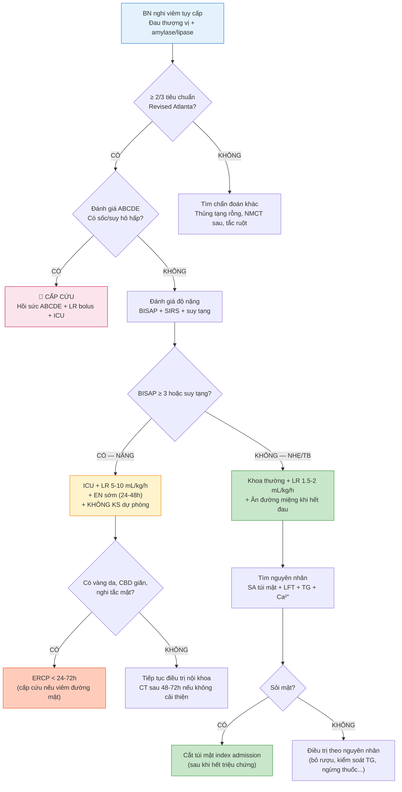
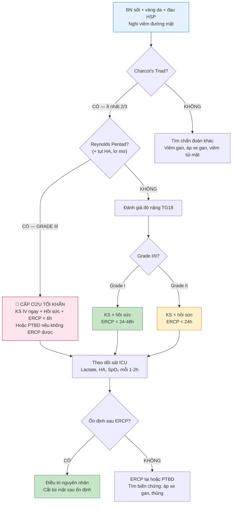
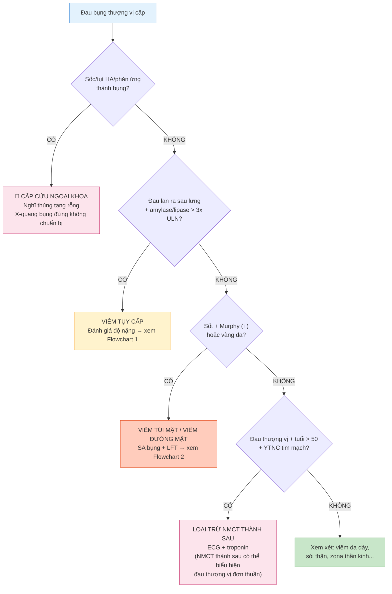

# BÀI HỌC Y KHOA: VIÊM TỤY CẤP, BỆNH TÚI MẬT VÀ ĐƯỜNG MẬT
**Ngày:** 2026-07-19 | **Chuyên khoa:** Nội khoa — Tiêu hóa và Gan mật | **Đối tượng:** Bác sĩ Nội khoa tuyến tỉnh, học viên sau đại học và người học mất gốc cần học từ nền tảng | **Mã curriculum:** IM-42 | **Cấp độ:** L3 — Cầm tay chỉ việc

---

## 0. TỔNG QUAN — VÌ SAO BÀI NÀY QUAN TRỌNG?

### Mở đầu bằng một tình huống thực tế

3 giờ sáng. Bệnh nhân nữ 45 tuổi, tiền sử sỏi túi mật phát hiện 2 năm trước nhưng chưa mổ, được chồng đưa vào cấp cứu vì **đau bụng thượng vị dữ dội đột ngột sau bữa lẩu tối**, đau lan ra sau lưng, nôn ói 3 lần. Bệnh nhân than đau không chịu nổi, nằm co người. Sinh hiệu: mạch 112 lần/phút, HA 100/65 mmHg, nhiệt độ 37.8°C, SpO₂ 96%. Bạn là **bác sĩ trực duy nhất** của bệnh viện tuyến tỉnh. Không có bác sĩ chuyên khoa tiêu hóa. CT scanner đã tắt từ 10 giờ tối. Bạn làm gì trong 30 phút đầu?

Câu trả lời cho tình huống này — và hàng trăm tình huống tương tự mỗi tháng tại các bệnh viện tuyến tỉnh Việt Nam — là nội dung của bài học này. **Viêm tụy cấp (Acute Pancreatitis — AP)** là một trong những bệnh lý tiêu hóa cấp cứu thường gặp nhất, với tỉ lệ nhập viện ngày càng tăng trên toàn thế giới. Khoảng 80% bệnh nhân có thể nhẹ và tự hồi phục trong vài ngày. Nhưng **20% còn lại sẽ diễn tiến thành viêm tụy cấp nặng (Severe Acute Pancreatitis — SAP)**, với tỉ lệ tử vong 20–40% nếu có suy tạng và hoại tử tụy nhiễm trùng. Đồng thời, **bệnh túi mật và đường mật** (viêm túi mật cấp, sỏi ống mật chủ, viêm đường mật cấp) là những cấp cứu ngoại — nội khoa mà bất kỳ bác sĩ nội khoa nào cũng phải nhận diện được, vì **trì hoãn chẩn đoán và can thiệp có thể khiến bệnh nhân tử vong trong vòng 24–48 giờ do sốc nhiễm trùng**.

### "Viêm tụy cấp" và "tắc đường mật" là gì — giải thích bằng phép so sánh

Hãy tưởng tượng **tụy như một nhà máy sản xuất enzyme tiêu hóa** của cơ thể. Hàng ngày, nhà máy này sản xuất khoảng 1.5–3 L dịch tụy chứa enzyme tiêu hóa (trypsinogen, chymotrypsinogen, lipase, amylase, v.v...) và đổ vào tá tràng qua **ống tụy chính (ống Wirsung)**. Để tránh "tự tiêu", tất cả enzyme được sản xuất dưới dạng **tiền enzyme (zymogen)** — dạng chưa hoạt động — và chỉ được hoạt hóa khi đến tá tràng.

Bây giờ, hãy tưởng tượng **đường mật như một hệ thống ống thoát nước** của nhà máy. Mật được sản xuất tại gan, dự trữ và cô đặc tại túi mật, rồi theo **ống mật chủ (Common Bile Duct — CBD)** đổ vào tá tràng qua cùng một "cửa xả" với ống tụy — đó là **bóng Vater (ampulla of Vater)**, được kiểm soát bởi **cơ vòng Oddi (sphincter of Oddi)**.

Khi có sỏi từ túi mật di chuyển xuống và **kẹt ở bóng Vater**, hai hậu quả xảy ra đồng thời:
1. **Tắc đường mật:** mật ứ lại → vi khuẩn phát triển → **viêm đường mật cấp** (một cấp cứu nhiễm trùng đe dọa tính mạng)
2. **Trào ngược mật vào ống tụy:** áp lực trong ống tụy tăng → hoạt hóa trypsinogen sớm ngay trong tế bào nang tụy → enzyme tiêu hóa "tự tiêu" chính tuyến tụy → **viêm tụy cấp**

Đây là lý do **sỏi mật là nguyên nhân số 1 gây viêm tụy cấp trên toàn thế giới** (chiếm ~50% các trường hợp), đặc biệt tại Việt Nam — nơi có tỉ lệ nhiễm ký sinh trùng đường mật cao.

### Hai câu hỏi quyết định trong 10 phút đầu

Khi bệnh nhân nghi viêm tụy cấp hoặc bệnh lý đường mật bước vào phòng cấp cứu, bạn chỉ cần trả lời **2 câu hỏi**:

1. **Bệnh nhân có dấu hiệu nặng/sốc không?** → Đánh giá ABCDE. Nếu CÓ tụt HA, suy hô hấp, rối loạn ý thức, hoặc dấu hiệu viêm đường mật (Charcot's triad: sốt + vàng da + đau HSP) → hành động NGAY, không chờ xét nghiệm.
2. **Có tắc mật cần can thiệp ERCP không?** → Dấu hiệu: vàng da, LFT tắc mật, siêu âm thấy CBD giãn >6 mm hoặc sỏi OMC, viêm đường mật. Nếu CÓ → ERCP cấp cứu (<24h, hoặc <6h nếu nặng).

### Mục tiêu của bài

Sau bài này, bạn sẽ:
- Chẩn đoán được viêm tụy cấp theo tiêu chuẩn Revised Atlanta 2012 và phân độ được mức độ nặng
- Nhận diện và xử trí được viêm tụy cấp nặng với 4 trụ cột: bù dịch, kiểm soát đau, dinh dưỡng sớm, và kháng sinh hợp lý
- Đọc được bảng xét nghiệm gan — tụy — mật, phân biệt được 3 pattern tổn thương (hepatocellular, cholestatic, mixed)
- Chẩn đoán và phân độ được viêm túi mật cấp và viêm đường mật cấp theo Tokyo Guidelines 2018 (TG18)
- Biết khi nào cần ERCP cấp cứu, khi nào cần cắt túi mật, và chiến lược phòng ngừa tái phát
- Áp dụng được các chiến lược điều trị trong điều kiện thực tế tại bệnh viện tuyến tỉnh Việt Nam (bao gồm Plan B khi thiếu CT, ERCP)
- Nhận diện và xử trí các biến chứng: hoại tử tụy nhiễm trùng, nang giả tụy, suy tạng, HRS-AKI

---

### 📋 TRƯỚC KHI ĐỌC — NỀN TẢNG CẦN DÙNG

> Để hiểu bài này, bạn nên đã biết:
> - **ABCDE và hồi sức cấp cứu cơ bản:** đánh giá đường thở, hô hấp, tuần hoàn (IM-01 — chưa có, sẽ nhắc trong bài)
> - **Sinh lý gan — tụy cơ bản:** chức năng tụy ngoại tiết và nội tiết, tuần hoàn gan — mật (IM-04 — chưa có, sẽ giải thích từ đầu)
> - **Đọc xét nghiệm cơ bản:** công thức máu, điện giải đồ, chức năng gan thận (IM-02 — chưa có, sẽ giải thích tại chỗ)
>
> **Nếu bạn CHƯA BIẾT GÌ về những thứ trên: KHÔNG SAO.** Bài này được viết cho người mất gốc. Mọi khái niệm đều được giải thích từ con số 0, với phép so sánh dễ hiểu. Bạn chỉ cần đọc tuần tự từ đầu — không cần kiến thức nền.

---

### 0.1 Nền tảng tối thiểu cần dùng ngay

**ABCDE** là thứ tự kiểm tra nguy hiểm trước chẩn đoán: **A** (Airway — đường thở), **B** (Breathing — hô hấp), **C** (Circulation — tuần hoàn), **D** (Disability — ý thức + đường huyết), **E** (Exposure — bộc lộ khám toàn thân). Trong bối cảnh viêm tụy cấp và bệnh đường mật: bệnh nhân tụt HA, vã mồ hôi, lơ mơ, SpO₂ giảm, vàng da, sốt cao rét run → đây là **cấp cứu tối khẩn** — không chờ kết quả xét nghiệm hay siêu âm. Hành động ngay: bảo đảm đường thở (đặt nội khí quản nếu rối loạn ý thức nặng), thở oxy, thiết lập 2 đường truyền tĩnh mạch ngoại vi lớn, monitor sinh hiệu liên tục.

#### Giải phẫu tụy cho người mới bắt đầu

**Tụy** là một tuyến dài khoảng 15–20 cm, nặng 70–120 g, nằm sâu trong **khoang sau phúc mạc (retroperitoneum)** — tức nằm phía sau dạ dày, trước cột sống thắt lưng L1–L2. Tụy được chia thành 4 phần:
- **Đầu tụy (head):** nằm trong khung tá tràng (hình chữ C), là nơi **ống tụy chính (ống Wirsung)** hợp lưu với **ống mật chủ (CBD)** tại **bóng Vater** trước khi đổ vào tá tràng qua **nhú tá lớn (major duodenal papilla)**
- **Mỏm móc (uncinate process):** phần nhô ra sau tĩnh mạch mạc treo tràng trên
- **Thân tụy (body):** chạy ngang qua cột sống, nằm sau dạ dày
- **Đuôi tụy (tail):** kéo dài đến rốn lách, nằm trong dây chằng lách — thận

**Cơ vòng Oddi (sphincter of Oddi)** là một vòng cơ trơn bao quanh đoạn cuối của CBD và ống tụy chính trước khi đổ vào tá tràng. Nó kiểm soát dòng chảy của mật và dịch tụy vào ruột, đồng thời ngăn trào ngược dịch ruột lên đường mật — tụy. **Rối loạn chức năng cơ Oddi (Sphincter of Oddi Dysfunction — SOD)** là một trong những nguyên nhân gây viêm tụy tái phát.

#### Giải phẫu túi mật và đường mật

**Túi mật (gallbladder)** là một túi hình quả lê dài 7–10 cm, nằm ở mặt dưới gan phải, có chức năng **dự trữ và cô đặc mật**. Mật từ gan theo ống gan phải và ống gan trái → **ống gan chung (Common Hepatic Duct — CHD)** → hợp lưu với **ống túi mật (cystic duct)** tạo thành **ống mật chủ (CBD)**. CBD dài 5–8 cm, đường kính bình thường ≤ 6 mm (có thể tăng nhẹ theo tuổi và sau cắt túi mật). CBD đổ vào tá tràng qua bóng Vater, nơi cũng là điểm đổ của ống tụy chính.

> **Nguồn kiến thức nền:** TEXTBOOK: Gray's Anatomy 42e, Ch.70; Sleisenger and Fordtran's Gastrointestinal and Liver Disease 11e, Ch.55.

#### Primer đọc xét nghiệm gan — tụy — mật (theo yêu cầu đặc biệt)

Đây là phần **hướng dẫn đọc xét nghiệm chi tiết**, được xây dựng riêng cho bài này. Mỗi xét nghiệm được trình bày với: **tên → cơ quan nguồn gốc → ý nghĩa lâm sàng → đơn vị tại Việt Nam → khoảng tham chiếu → nguyên nhân tăng/giảm chính**.

**Bảng 0.1 — Tổng quan xét nghiệm gan — tụy — mật**

| Xét nghiệm | Cơ quan nguồn | Ý nghĩa chính | Đơn vị VN | Khoảng tham chiếu |
|---|---|---|---|---|
| **Amylase** | Tụy (40%), tuyến nước bọt (60%) | Sàng lọc AP | U/L | 28–100 |
| **Lipase** | Gần như đặc hiệu tụy | Chẩn đoán AP | U/L | 13–60 |
| **ALT (GPT)** | Bào tương tế bào gan | Tổn thương gan (rò rỉ enzyme) | U/L | < 40 (nam), < 35 (nữ) |
| **AST (GOT)** | Gan, tim, cơ, thận, não | Tổn thương gan + cơ tim | U/L | < 40 |
| **ALP** | Gan (màng tế bào), xương, ruột, nhau thai | Ứ mật, bệnh xương | U/L | 40–130 |
| **GGT** | Gan, ống mật, tụy | Ứ mật (nhạy hơn ALP) | U/L | < 50 (nam), < 35 (nữ) |
| **Bilirubin TP** | Sản phẩm phân hủy heme | Vàng da, tắc mật, tan máu | µmol/L | < 17 |
| **Bilirubin TT** | Bilirubin đã liên hợp ở gan | Tắc mật, viêm gan | µmol/L | < 5 |
| **Bilirubin GT** | Bilirubin chưa liên hợp | Tan máu, Gilbert | µmol/L | = TP − TT |
| **Albumin** | Gan tổng hợp | Áp lực keo, chức năng gan mạn | g/L | 35–50 |
| **INR / PT** | Yếu tố đông máu (gan tổng hợp) | Suy gan cấp, thiếu vitamin K | — | 0.8–1.2 |
| **CRP** | Gan (đáp ứng viêm) | Viêm, nhiễm trùng, SAP | mg/L | < 5 |
| **Procalcitonin** | Nhiều mô (đáp ứng nhiễm trùng) | Nhiễm trùng vi khuẩn (phân biệt viêm vô trùng) | ng/mL | < 0.05 |
| **BUN** | Thận (chuyển hóa protein) | Tiên lượng AP (BISAP), chức năng thận | mmol/L | 2.5–7.1 |
| **Creatinine** | Cơ (chuyển hóa creatine) | Suy thận (HRS-AKI) | µmol/L | 60–110 |
| **Calcium TP** | Xương, ruột, thận | Tiên lượng AP (Ranson) — hạ do xà phòng hóa mỡ | mmol/L | 2.2–2.6 |
| **LDH** | Nhiều mô | Tiên lượng AP (Ranson) — tổn thương mô | U/L | 140–280 |
| **Glucose** | Chuyển hóa carbohydrate | Tiên lượng AP (Ranson) — stress, hoại tử | mmol/L | 3.9–6.1 (đói) |
| **Triglyceride** | Mỡ máu | Nguyên nhân AP (khi > 11.3 mmol/L / 1000 mg/dL) | mmol/L | < 1.7 |
| **ABG — pH** | Cân bằng acid-base | Toan chuyển hóa (sốc, hoại tử) | — | 7.35–7.45 |
| **ABG — Lactate** | Chuyển hóa yếm khí | Sốc, giảm tưới máu mô | mmol/L | < 2.0 |

> **Ghi chú về đơn vị:** Tại Việt Nam, đa số bệnh viện dùng đơn vị SI (µmol/L, mmol/L, g/L, U/L). Một số bệnh viện tư hoặc máy xét nghiệm đời cũ có thể dùng đơn vị thông thường (conventional units: mg/dL). Xem bảng chuyển đổi cuối mục này. `[Cần xác nhận đơn vị tại cơ sở]` cho các xét nghiệm ít dùng ở tuyến huyện (procalcitonin, LDH isoenzyme).

**Chuyển đổi đơn vị nhanh (conventional → SI):**
- Bilirubin: mg/dL × 17.1 = µmol/L
- BUN: mg/dL × 0.357 = mmol/L
- Creatinine: mg/dL × 88.4 = µmol/L
- Glucose: mg/dL × 0.0555 = mmol/L
- Triglyceride: mg/dL × 0.0113 = mmol/L
- Calcium: mg/dL × 0.25 = mmol/L
- Albumin: g/dL × 10 = g/L

**Các pattern xét nghiệm gan (LFT patterns) — đọc ngay trong 5 phút:**

Có 3 pattern tổn thương gan chính, phân biệt bằng **R value** = (ALT / ULN ALT) ÷ (ALP / ULN ALP):

| Pattern | R value | Đặc điểm | Bệnh nghĩ đến |
|---|---|---|---|
| **Hepatocellular** (hủy tế bào gan) | ≥ 5 | ALT/AST ↑↑ >> ALP | Viêm gan virus, thuốc, rượu, thiếu máu gan, tự miễn |
| **Cholestatic** (ứ mật) | ≤ 2 | ALP/GGT ↑↑, Bilirubin TT ↑ | Tắc mật (sỏi OMC, u đầu tụy, viêm đường mật), ứ mật do thuốc |
| **Mixed** (hỗn hợp) | 2–5 | Cả 2 nhóm cùng tăng | Viêm gan rượu, thuốc, viêm gan tự miễn nặng |

> **Mẹo lâm sàng:** ALT > 150 U/L ở bệnh nhân viêm tụy cấp → nghĩ ngay đến **sỏi mật** là nguyên nhân (PPV ~95%). Ngược lại, ALT bình thường cũng không loại trừ được sỏi mật — khoảng 50% viêm tụy do sỏi mật có ALT < 150 U/L.

> **Nguồn:** REVIEW: PMID 38691369 [DIRECTION ONLY]; Cochrane SR: PMID 28431198 [DIRECTION ONLY].

**Các thang điểm tiên lượng chính trong AP:**

| Thang điểm | Tham số | Ý nghĩa | Khi nào dùng |
|---|---|---|---|
| **BISAP** | 5 tiêu chí: BUN > 25 mg/dL, Suy giảm ý thức, SIRS ≥ 2, Tuổi > 60, Tràn dịch màng phổi | Dễ nhớ, làm tại giường. BISAP ≥ 3 → tăng nguy cơ tử vong | 24h đầu, mọi tuyến |
| **Ranson** | 11 tiêu chí (5 lúc nhập viện + 6 lúc 48h) | Tiên lượng tử vong. Ranson ≥ 3 → nặng. Ranson ≥ 6 → tử vong > 50% | 48h sau nhập viện |
| **APACHE II** | 12 thông số sinh lý + tuổi + bệnh mạn | Tốt nhất trong 24h đầu, dùng được ở ICU. APACHE II ≥ 8 → nặng | ICU, 24h đầu |
| **CTSI** | CT Severity Index = Balthazar grade + mức độ hoại tử | Đánh giá mức độ hoại tử và biến chứng tại chỗ | Sau 48–72h, khi có CT |
| **SOFA** | 6 hệ cơ quan (hô hấp, đông máu, gan, tim mạch, thần kinh, thận) | Theo dõi diễn tiến suy tạng, đánh giá đáp ứng điều trị | ICU, mỗi ngày |

---

## 1. VIÊM TỤY CẤP — ĐỊNH NGHĨA & SINH LÝ BỆNH [CỐT LÕI]

> **Nguồn kiến thức nền:** TEXTBOOK: Sleisenger and Fordtran 11e, Ch.55, 58; Guyton and Hall 14e, Ch.65. Classification: PMID 23100216 [DIRECTION ONLY]. Guidelines: PMID 38857482 [DIRECTION ONLY], PMID 24054878 [DIRECTION ONLY], PMID 31210778 [DIRECTION ONLY].

### 1.0 Nhắc nhanh: Tụy bình thường — "Nhà máy hai trong một"

Trước khi hiểu viêm tụy cấp, bạn cần biết tụy bình thường hoạt động như thế nào. Tụy là một tuyến **"hai trong một"** — vừa có chức năng **ngoại tiết (exocrine)** vừa có chức năng **nội tiết (endocrine)**:

**1. Tụy ngoại tiết (99% khối lượng):** Các tế bào nang tụy (acinar cells) sản xuất và bài tiết **dịch tụy** — khoảng 1.5–3 L/ngày, chứa:
- **Enzyme tiêu hóa protein:** trypsinogen, chymotrypsinogen, procarboxypeptidase
- **Enzyme tiêu hóa tinh bột:** amylase tụy
- **Enzyme tiêu hóa mỡ:** lipase tụy, phospholipase A₂
- **Bicarbonate (HCO₃⁻):** trung hòa acid dạ dày khi dịch vị vào tá tràng

Tất cả enzyme được sản xuất dưới dạng **zymogen (tiền enzyme)** — dạng chưa hoạt động. Đây là **cơ chế bảo vệ quan trọng nhất** giúp tụy không bị "tự tiêu". Trypsinogen chỉ được hoạt hóa thành trypsin khi đến tá tràng, nhờ enzyme **enterokinase** từ niêm mạc tá tràng. Ngoài ra, tế bào nang tụy còn sản xuất **Pancreatic Secretory Trypsin Inhibitor (PSTI)** — một chất ức chế trypsin nội sinh, ngăn chặn sự hoạt hóa sớm của một lượng nhỏ trypsinogen có thể xảy ra ngay trong tụy.

**2. Tụy nội tiết (1% khối lượng):** Các **đảo tụy Langerhans** nằm rải rác giữa các tế bào nang, gồm:
- **Tế bào β (70%):** sản xuất insulin (hạ đường huyết)
- **Tế bào α (20%):** sản xuất glucagon (tăng đường huyết)
- **Tế bào δ:** sản xuất somatostatin (điều hòa insulin và glucagon)

### 1.1 Định nghĩa viêm tụy cấp — Tiêu chuẩn Revised Atlanta 2012

Theo **Revised Atlanta Classification 2012** (Banks et al., Gut 2013, PMID 23100216 [DIRECTION ONLY]), chẩn đoán viêm tụy cấp cần **≥ 2 trong 3 tiêu chuẩn** sau:

| # | Tiêu chuẩn | Cách xác định |
|---|---|---|
| 1 | **Đau bụng** điển hình của AP | Đau thượng vị cấp, dữ dội, liên tục, lan ra sau lưng |
| 2 | **Amylase và/hoặc lipase máu** ≥ 3 lần giới hạn trên của bình thường (ULN) | Amylase ≥ 300 U/L hoặc lipase ≥ 180 U/L (tùy phòng xét nghiệm) |
| 3 | **Hình ảnh học** (CT, MRI, hoặc siêu âm) có dấu hiệu đặc trưng của AP | Tụy to, giảm đậm độ, dịch quanh tụy, hoại tử trên CT có cản quang |

> ⚠️ **HỌC VIÊN HAY NHẦM #1:** "Amylase và lipase đều phải tăng > 3 lần mới chẩn đoán AP." **SAI!** Chỉ cần **một trong hai** tăng ≥ 3 lần ULN là đủ tiêu chuẩn xét nghiệm. Lipase có độ đặc hiệu cao hơn amylase và là xét nghiệm được ưu tiên theo các guideline hiện đại.

### 1.2 Nguyên nhân — I GET SMASHED

Nguyên nhân viêm tụy cấp có thể nhớ bằng mnemonic **"I GET SMASHED"**:

| Chữ cái | Nguyên nhân | Chi tiết |
|---|---|---|
| **I** | Idiopathic (vô căn) | 10–20%, sau khi đã loại trừ các nguyên nhân khác |
| **G** | Gallstones (sỏi mật) | **#1** — chiếm ~50% các trường hợp AP, đặc biệt tại Việt Nam |
| **E** | Ethanol (rượu) | **#2** — thường sau uống rượu nhiều, mạn tính > cấp tính |
| **T** | Trauma (chấn thương) | Chấn thương bụng kín, sau phẫu thuật bụng |
| **S** | Steroids / Scorpion | Corticosteroid, nọc bọ cạp |
| **M** | Mumps / Malignancy | Quai bị (Coxsackie, CMV, EBV), u tụy, u bóng Vater |
| **A** | Autoimmune | IgG4-related disease, viêm tụy tự miễn type 1 và 2 |
| **S** | Scorpion / Spider | Nọc bọ cạp, nhện độc |
| **H** | Hypertriglyceridemia / Hypercalcemia | TG > 1000 mg/dL (11.3 mmol/L), Ca²⁺ > 12 mg/dL (3.0 mmol/L) |
| **E** | ERCP (post-ERCP pancreatitis) | 3–5% sau ERCP chẩn đoán, 5–10% sau ERCP can thiệp |
| **D** | Drugs (thuốc) | Azathioprine, 6-MP, valproic acid, didanosine, GLP-1 agonists, thiazide, furosemide, sulfonamide |

> **Tại Việt Nam:** Sỏi mật là nguyên nhân #1 (40–60%), đặc biệt liên quan đến **nhiễm ký sinh trùng đường mật** (giun đũa — *Ascaris lumbricoides*, sán lá gan — *Clonorchis sinensis*, *Opisthorchis viverrini*). Rượu đứng thứ 2 (20–30%). Tăng triglyceride (TG) ngày càng được ghi nhận nhiều hơn, đặc biệt ở bệnh nhân đái tháo đường type 2, béo phì, và phụ nữ mang thai (tăng TG sinh lý + tăng TG bệnh lý).

### 1.3 Cơ chế bệnh sinh — Tại sao tụy lại "tự tiêu"?

Cơ chế cốt lõi của viêm tụy cấp là **sự hoạt hóa sớm trypsinogen thành trypsin ngay trong tế bào nang tụy (acinar cell)**, thay vì chờ đến tá tràng. Chuỗi sự kiện diễn ra như sau:

**Bước 1 — Sự kiện khởi phát (trigger event):**
- Sỏi mật kẹt bóng Vater → tăng áp lực trong ống tụy → tổn thương tế bào nang
- Rượu → kích thích bài tiết enzyme + co thắt cơ Oddi + tổn thương trực tiếp tế bào nang
- Tăng TG → thủy phân TG thành acid béo tự do (FFA) bởi lipase tụy → FFA gây độc trực tiếp tế bào nang + toan hóa môi trường vi tuần hoàn
- Các nguyên nhân khác → tổn thương tế bào nang thông qua stress oxy hóa, rối loạn cân bằng calcium nội bào, rối loạn autophagy

**Bước 2 — Đồng định vị (co-localization) của zymogen và lysosome:**
Đây là **cơ chế phân tử then chốt**. Bình thường, enzyme tiêu hóa (zymogen) và enzyme lysosome (cathepsin B) được đóng gói trong các túi riêng biệt. Trong AP, hai loại túi này **hợp nhất bất thường** → cathepsin B cắt trypsinogen thành trypsin **ngay trong tế bào nang** → trypsin hoạt hóa tiếp tất cả các zymogen khác (chymotrypsinogen, prophospholipase A₂, proelastase, v.v...) → **"cascade tự tiêu" bùng nổ**.

**Bước 3 — Tổn thương tế bào nang và viêm tại chỗ:**
Enzyme hoạt hóa phá hủy tế bào nang → giải phóng **DAMPs (Damage-Associated Molecular Patterns)** như HMGB1, ATP, DNA, HSP70 → **tế bào đại thực bào thường trú (macrophage)** và **tế bào tua (dendritic cell)** phát hiện DAMPs → sản xuất **TNF-α, IL-1β, IL-6, IL-8** → **viêm tại chỗ** → phù nề, thâm nhiễm bạch cầu trung tính, hoại tử mô tụy.

**Bước 4 — Viêm toàn thân (SIRS):**
Nếu viêm tại chỗ không được kiểm soát, cytokine tràn vào tuần hoàn → **Hội chứng đáp ứng viêm toàn thân (Systemic Inflammatory Response Syndrome — SIRS)**:

> **Tiêu chuẩn SIRS** (cần ≥ 2 trong 4):
> 1. Nhiệt độ > 38°C hoặc < 36°C
> 2. Nhịp tim > 90 lần/phút
> 3. Nhịp thở > 20 lần/phút hoặc PaCO₂ < 32 mmHg
> 4. WBC > 12,000/mm³ hoặc < 4,000/mm³ hoặc > 10% band forms

**Bước 5 — Suy đa tạng (MODS):**
SIRS nặng → rối loạn vi tuần hoàn, tăng tính thấm thành mạch, hoạt hóa đông máu (DIC) → **giảm tưới máu cơ quan đích** → **Suy đa tạng (Multiple Organ Dysfunction Syndrome — MODS)**. Các cơ quan bị ảnh hưởng theo thứ tự: phổi (ARDS — suy hô hấp cấp), thận (AKI — suy thận cấp), tim mạch (sốc phân bố), gan (suy gan), hệ đông máu (DIC), thần kinh (bệnh não do tụy — pancreatic encephalopathy).

### 1.4 Hai pha tử vong trong viêm tụy cấp

Hiểu về **hai pha tử vong** là chìa khóa để có chiến lược điều trị đúng thời điểm:

| | Pha sớm (Early Phase) | Pha muộn (Late Phase) |
|---|---|---|
| **Thời gian** | < 1–2 tuần từ khởi phát | > 2 tuần từ khởi phát |
| **Cơ chế tử vong** | **SIRS → MODS** | **Nhiễm trùng hoại tử tụy → sepsis** |
| **Tổn thương chính** | Viêm vô trùng, cytokine storm | Bội nhiễm vi khuẩn (chủ yếu từ ruột: *E. coli*, *Klebsiella*, *Enterococcus*) |
| **Chiến lược điều trị** | Hồi sức tích cực, bù dịch, hỗ trợ tạng, kiểm soát SIRS | Kháng sinh (khi có bằng chứng nhiễm trùng), can thiệp dẫn lưu/nội soi/phẫu thuật hoại tử (step-up approach) |

> ⚠️ **HỌC VIÊN HAY NHẦM #2:** "Viêm tụy nặng là phải dùng kháng sinh ngay." **SAI!** Trong pha sớm (1–2 tuần đầu), tổn thương là **viêm vô trùng do SIRS**, kháng sinh không có vai trò. Kháng sinh dự phòng trong AP vô trùng (kể cả hoại tử vô trùng) **KHÔNG làm giảm tử vong hoặc nhiễm trùng hoại tử** (Cochrane SR PMID 20464721 [DIRECTION ONLY]). Chỉ dùng kháng sinh khi có bằng chứng nhiễm trùng (sốt kéo dài > 7–10 ngày, khí trong hoại tử trên CT, procalcitonin tăng, cấy máu dương tính) hoặc viêm đường mật kèm theo.

### 1.5 Phân độ nặng — Revised Atlanta 2012

Theo Revised Atlanta 2012 (PMID 23100216 [DIRECTION ONLY]), AP được phân thành 3 mức độ:

| Mức độ | Đặc điểm | Tỉ lệ | Tử vong |
|---|---|---|---|
| **Nhẹ (Mild AP)** | Không suy tạng, không biến chứng tại chỗ. Thường tự khỏi trong 5–7 ngày | ~80% | < 1% |
| **Trung bình (Moderately Severe AP)** | Suy tạng thoáng qua (< 48h) HOẶC biến chứng tại chỗ (nang giả tụy, hoại tử vô trùng, WON...). Cần nằm viện kéo dài | ~10–15% | 2–5% |
| **Nặng (Severe AP)** | **Suy tạng kéo dài > 48h** (đơn hoặc đa tạng). Thường kèm hoại tử tụy nhiễm trùng | ~5–10% | 20–40% |

> **Suy tạng (organ failure) được định nghĩa theo Modified Marshall Score** cho 3 hệ: hô hấp (PaO₂/FiO₂), tim mạch (huyết áp, nhu cầu vận mạch), và thận (creatinine). Điểm ≥ 2 ở bất kỳ hệ nào = suy tạng.

### 1.6 Các thang điểm tiên lượng: BISAP, Ranson, APACHE II, CTSI

**BISAP (Bedside Index for Severity in Acute Pancreatitis):**

| Tham số | Điểm |
|---|---|
| **B**UN > 25 mg/dL (8.9 mmol/L) | 1 |
| **I**mpaired mental status (GCS < 15) | 1 |
| **S**IRS ≥ 2 tiêu chuẩn | 1 |
| **A**ge > 60 tuổi | 1 |
| **P**leural effusion (tràn dịch màng phổi trên X-quang/CT) | 1 |

- **BISAP 0–1:** tử vong < 1% (nhẹ)
- **BISAP 2:** tử vong ~2% (trung bình)
- **BISAP ≥ 3:** tử vong 5–20% → **cần ICU**, theo dõi sát

> **Ưu điểm BISAP:** Dễ nhớ, làm tại giường, không cần CT. **Phù hợp tuyến tỉnh/huyện.** Nếu BISAP ≥ 3 → chuyển tuyến có ICU.

**Ranson Criteria:**

| Lúc nhập viện (Ranson admission) | Lúc 48 giờ (Ranson 48h) |
|---|---|
| Tuổi > 55 | Hct giảm > 10% |
| WBC > 16,000/mm³ | BUN tăng > 5 mg/dL (1.8 mmol/L) |
| Glucose > 200 mg/dL (11.1 mmol/L) | Ca²⁺ < 8 mg/dL (2.0 mmol/L) |
| LDH > 350 U/L | PaO₂ < 60 mmHg |
| AST > 250 U/L | Base deficit > 4 mEq/L |
| — | Dịch bù > 6 L |

- **Ranson 0–2:** tử vong < 1%
- **Ranson 3–4:** tử vong ~15%
- **Ranson 5–6:** tử vong ~40%
- **Ranson ≥ 7:** tử vong > 50%

> **Nhược điểm Ranson:** Cần 48h mới tính đủ → không hữu ích trong 24h đầu tiên để quyết định ICU.

**APACHE II:** Hệ thống 12 thông số sinh lý + tuổi + bệnh mạn. **APACHE II ≥ 8 lúc nhập viện** → tiên lượng nặng. Ưu điểm: tính được ngay 24h đầu. Nhược điểm: phức tạp, cần bảng tra.

**CTSI (CT Severity Index):** = Balthazar grade (0–4) + % hoại tử (0–6). Tổng 0–10. CTSI ≥ 7 → nặng, nguy cơ biến chứng và tử vong cao.

> **Chiến lược thực tế tại tuyến tỉnh:** Dùng **BISAP lúc nhập viện** (5 phút, không cần CT) → nếu BISAP ≥ 3 → chuyển ICU/trung tâm. Sau 48h, nếu lâm sàng không cải thiện → tính **Ranson** và CT có cản quang (CTSI).

---

### 🛑 DỪNG 1 PHÚT — TỰ KIỂM TRA

> 1. Bệnh nhân đau thượng vị dữ dội lan ra sau lưng, amylase 450 U/L, lipase 520 U/L, CT bụng bình thường. Có chẩn đoán AP không? Tại sao?
> 2. BISAP = 4 có ý nghĩa gì? Bạn làm gì tiếp theo ở tuyến tỉnh?
> 3. Tại sao kháng sinh dự phòng KHÔNG được khuyến cáo trong AP vô trùng?
>
> *(Đáp án: 1. CÓ — đủ 2/3 tiêu chuẩn: đau điển hình + amylase và lipase > 3 lần ULN. 2. Nguy cơ tử vong 5–20% → cần ICU, theo dõi sát suy tạng, chuẩn bị chuyển tuyến nếu không có ICU. 3. Vì pha sớm là viêm vô trùng do SIRS, kháng sinh không làm giảm tử vong hay nhiễm trùng hoại tử, lại tăng nguy cơ kháng thuốc và bội nhiễm nấm.)*

---

## 2. VIÊM TÚI MẬT CẤP (ACUTE CHOLECYSTITIS) [CỐT LÕI]

> **Nguồn:** TG18: PMID 29095575 [DIRECTION ONLY], PMID 29090868 [DIRECTION ONLY]; Review: PMID 39469538 [DIRECTION ONLY], PMID 37510826 [DIRECTION ONLY]; Meta-analysis: PMID 32716737 [DIRECTION ONLY].

### 2.0 Nhắc nhanh: Sinh lý túi mật — "Bể chứa và cô đặc mật"

Gan sản xuất mật liên tục (khoảng 500–1000 mL/ngày). Khi không ăn, **cơ vòng Oddi đóng**, mật chảy ngược vào túi mật qua ống túi mật. Tại đây, túi mật **hấp thu nước và điện giải** qua niêm mạc → cô đặc mật gấp 5–10 lần. Khi ăn (đặc biệt thức ăn nhiều mỡ), tá tràng tiết **cholecystokinin (CCK)** → CCK kích thích túi mật co bóp + cơ vòng Oddi giãn → mật đặc được đẩy vào CBD → tá tràng để nhũ tương hóa và tiêu hóa mỡ.

**Viêm túi mật cấp (Acute Cholecystitis — AC)** xảy ra khi dòng chảy của mật từ túi mật ra ngoài bị **tắc nghẽn**, thường do sỏi kẹt ở cổ túi mật hoặc ống túi mật. Mật ứ đọng → áp lực trong túi mật tăng → tổn thương niêm mạc → giải phóng **prostaglandin I₂ và E₂** → viêm thành túi mật. Nếu không được giải quyết, viêm tiến triển → hoại tử thành túi mật → thủng.

### 2.1 Viêm túi mật do sỏi (Calculous Cholecystitis — 90%) vs không do sỏi (Acalculous — 10%)

| | Calculous (90%) | Acalculous (10%) |
|---|---|---|
| **Cơ chế** | Sỏi kẹt cổ túi mật / ống túi mật | Ứ mật + thiếu máu thành túi mật (do sốc, bỏng, chấn thương, nuôi ăn tĩnh mạch kéo dài, sepsis) |
| **Đối tượng** | Phụ nữ, > 40t, béo phì (4F: Female, Forty, Fat, Fertile) | BN ICU, bỏng nặng, chấn thương, sau mổ lớn, nuôi ăn tĩnh mạch toàn bộ (TPN) kéo dài |
| **Lâm sàng** | Điển hình: đau HSP + Murphy (+) + sốt | Không điển hình: thường chỉ sốt + chướng bụng ở BN ICU, dễ bỏ sót |
| **Siêu âm** | Sỏi túi mật + dày thành + dịch quanh túi mật | Dày thành túi mật, không có sỏi |
| **Điều trị** | Cắt túi mật nội soi sớm + kháng sinh | Kháng sinh + dẫn lưu túi mật qua da (PTGBD) nếu không đáp ứng |

> ⚠️ **CẢNH GIÁC:** Viêm túi mật không do sỏi ở BN ICU có tỉ lệ tử vong cao (30–50%) vì chẩn đoán muộn, BN đã nặng sẵn, và túi mật dễ hoại tử — thủng hơn.

### 2.2 Lâm sàng — Murphy's Sign và các dấu hiệu

**Triệu chứng cơ năng:**
- **Đau hạ sườn phải (HSP)** — đau liên tục, tăng dần, có thể lan lên vai phải hoặc sau lưng (kích thích cơ hoành)
- **Buồn nôn, nôn** (80–90%)
- **Sốt** (thường 38–39°C, nếu > 39°C + rét run → nghi ngờ viêm đường mật kèm theo hoặc thủng túi mật)

**Dấu hiệu thực thể:**
- **Murphy's sign (+):** đây là dấu hiệu QUAN TRỌNG NHẤT. Cách khám: đặt tay lên HSP, yêu cầu BN hít sâu. Khi BN hít vào, túi mật viêm chạm vào tay bạn → BN **đau và ngừng thở đột ngột** → Murphy (+). Độ nhạy ~65%, độ đặc hiệu ~87%. Lưu ý: Murphy có thể (-) ở BN già, tiểu đường, hoặc đã dùng giảm đau.
- **Ấn đau HSP:** ngay cả khi Murphy (-), hầu hết BN đều đau khi ấn HSP
- **Sờ thấy túi mật to:** ~20–30%, gợi ý tắc cổ túi mật hoàn toàn hoặc u đầu tụy (định luật Courvoisier: túi mật to + vàng da không đau = u đầu tụy cho đến khi chứng minh ngược lại)

### 2.3 Cận lâm sàng

**Xét nghiệm máu:**
- **WBC tăng** (12,000–15,000/mm³), CRP tăng
- **LFT:** ALP, GGT, bilirubin **có thể tăng nhẹ** (do viêm lan sang đường mật hoặc sỏi OMC kèm theo). Nếu bilirubin tăng rõ (> 70 µmol/L) + ALP/GGT tăng cao → **nghĩ sỏi OMC hoặc viêm đường mật kèm theo**.
- Amylase/lipase: thường bình thường. Nếu tăng → nghĩ sỏi OMC + viêm tụy kèm theo (gallstone pancreatitis).

**Siêu âm bụng — tiêu chuẩn vàng chẩn đoán:**

| Dấu hiệu chính (≥ 1 trong các dấu hiệu sau) | Dấu hiệu phụ |
|---|---|
| **Sỏi túi mật** kèm dày thành túi mật > 3 mm | Túi mật căng to (đường kính ngang > 4 cm, dọc > 8 cm) |
| **Sonographic Murphy's sign (+)** | Dịch quanh túi mật (pericholecystic fluid) |
| **Dấu hiệu "double wall"** hoặc "striated wall" | Lớp mỡ quanh túi mật tăng âm (viêm lan ra mô mỡ xung quanh) |

> **Kỹ thuật:** Đầu dò convex 3.5–5 MHz, khám BN nhịn đói ít nhất 6h. Đo thành túi mật ở thành trước, vuông góc với đầu dò. Thành dày > 3 mm được coi là bệnh lý. Lưu ý: thành túi mật dày còn gặp trong xơ gan, suy tim ứ huyết, hạ albumin máu, viêm gan cấp — cần kết hợp với dấu hiệu chính khác.

### 2.4 Phân độ nặng theo Tokyo Guidelines 2018 (TG18)

TG18 phân viêm túi mật cấp thành 3 mức độ dựa trên đáp ứng viêm toàn thân và tổn thương cơ quan đích (PMID 29090868 [DIRECTION ONLY]):

| Grade | Tiêu chuẩn | Điều trị |
|---|---|---|
| **Grade I (Nhẹ)** | AC ở BN khỏe mạnh, không có rối loạn chức năng cơ quan | Cắt túi mật nội soi sớm (lý tưởng < 24–72h từ nhập viện) + kháng sinh |
| **Grade II (Trung bình)** | Có ≥ 1 yếu tố nguy cơ: WBC > 18,000/mm³, khối viêm sờ thấy ở HSP, triệu chứng > 72h, viêm túi mật hoại tử/khí thũng/áp xe quanh túi mật, hoặc viêm phúc mạc khu trú HSP | Kháng sinh + hồi sức → cắt túi mật sớm (có thể trì hoãn vài ngày để hồi sức). Nếu BN cao tuổi/nhiều bệnh nền → cân nhắc dẫn lưu túi mật qua da (PTGBD) trước |
| **Grade III (Nặng)** | Có rối loạn chức năng cơ quan: suy tim mạch (HA tụt cần vận mạch), suy hô hấp (PaO₂/FiO₂ < 300), suy thận (creatinine > 2.0 mg/dL hoặc 176 µmol/L), rối loạn đông máu (INR > 1.5, tiểu cầu < 80,000/mm³), rối loạn ý thức | Hồi sức tích cực + kháng sinh IV mạnh → **dẫn lưu túi mật qua da (PTGBD)** hoặc dẫn lưu nội soi (ETGBD) trước. KHÔNG cắt túi mật cấp cứu ở Grade III. Cắt túi mật trì hoãn sau khi BN ổn định |

> ⚠️ **HỌC VIÊN HAY NHẦM #3:** "Viêm túi mật cấp nào cũng phải mổ cấp cứu ngay." **SAI!** Grade III — BN suy tạng — mổ cấp cứu có thể giết BN! Phải hồi sức + dẫn lưu trước, mổ trì hoãn sau.

---

### 🛑 DỪNG 1 PHÚT — TỰ KIỂM TRA

> 1. BN nữ 55t, đau HSP 2 ngày, sốt 38.5°C, Murphy (+), WBC 15,000, SA: sỏi túi mật + dày thành 5 mm. Phân độ TG18? Điều trị?
> 2. Khi nào BN viêm túi mật cấp không nên mổ cấp cứu mà cần PTGBD trước?
> 3. Phân biệt Murphy's sign và sonographic Murphy's sign?
>
> *(Đáp án: 1. Grade I — cắt túi mật nội soi sớm < 72h + kháng sinh. 2. Grade III (suy tạng) hoặc BN cao tuổi, nhiều bệnh nền không chịu được phẫu thuật → PTGBD trước, mổ trì hoãn. 3. Murphy's sign = dấu hiệu lâm sàng (ngừng thở khi ấn HSP lúc hít vào). Sonographic Murphy = dấu hiệu siêu âm (đau khi ấn đầu dò vào túi mật).)*

---

## 3. SỎI ỐNG MẬT CHỦ VÀ VIÊM ĐƯỜNG MẬT CẤP [CỐT LÕI]

> **Nguồn:** TG18: PMID 29090868 [DIRECTION ONLY]; ESGE 2019: PMID 30943551 [DIRECTION ONLY]; ERCP timing: PMID 32611515 [DIRECTION ONLY]; Review: PMID 37510826 [DIRECTION ONLY].

### 3.0 Nhắc nhanh: Giải phẫu đường mật và dòng chảy của mật

Đường mật là hệ thống ống dẫn mật từ gan đến tá tràng:
- **Đường mật trong gan:** các ống mật nhỏ hợp dần thành **ống gan phải** và **ống gan trái**
- **Ống gan chung (CHD):** hợp lưu của ống gan phải và trái, dài 2–4 cm
- **Ống túi mật (cystic duct):** nối túi mật với CHD, dài 2–4 cm, bên trong có van xoắn Heister
- **Ống mật chủ (CBD):** = CHD + ống túi mật, dài 5–8 cm, đường kính ≤ 6 mm (có thể đến 8–10 mm sau cắt túi mật, hoặc ở người già)
- **Đoạn cuối CBD** chạy trong thành tá tràng, hợp lưu với ống tụy chính tại bóng Vater → đổ vào tá tràng qua nhú tá lớn, được bao quanh bởi cơ vòng Oddi

### 3.1 Sỏi ống mật chủ (Choledocholithiasis)

**Phân loại:**
- **Sỏi nguyên phát (primary CBD stones):** hình thành NGAY trong đường mật (do ứ mật mạn, nhiễm trùng đường mật tái phát, ký sinh trùng). Thường là sỏi sắc tố calcium bilirubinate, màu nâu, mềm, dễ vỡ. **Phổ biến tại châu Á, đặc biệt Việt Nam** — liên quan đến nhiễm ký sinh trùng đường mật (*Clonorchis sinensis*, *Ascaris lumbricoides*).
- **Sỏi thứ phát (secondary CBD stones):** sỏi từ túi mật di chuyển xuống CBD. Thường là sỏi cholesterol (vàng, cứng) hoặc sỏi hỗn hợp. Phổ biến ở phương Tây.

**Triệu chứng:**
- **Không triệu chứng:** ~5–10% bệnh nhân sỏi túi mật có sỏi OMC im lặng, phát hiện tình cờ
- **Đau HSP:** tương tự cơn đau quặn mật, có thể kèm vàng da
- **Tam chứng Charcot:** sốt + vàng da + đau HSP = **viêm đường mật cấp** (xem 3.2)

**Chẩn đoán — thang điểm ASGE (American Society for Gastrointestinal Endoscopy):**

Dựa trên LFT và siêu âm để phân tầng nguy cơ sỏi OMC, chia làm 3 nhóm:

| Nguy cơ | Tiêu chuẩn | Hành động |
|---|---|---|
| **Cao** (> 50%) | CBD giãn > 6 mm + sỏi thấy trên SA + Bilirubin > 68 µmol/L (4 mg/dL) | **ERCP** trực tiếp (vừa chẩn đoán vừa điều trị) |
| **Trung bình** (10–50%) | 1–2 tiêu chuẩn không đầy đủ (CBD giãn nhẹ, bilirubin tăng nhẹ, tuổi > 55, viêm tụy do sỏi mật) | **EUS hoặc MRCP** trước ERCP để xác nhận |
| **Thấp** (< 10%) | Không có tiêu chuẩn nào | **Cắt túi mật** — nội soi kiểm tra CBD trong mổ nếu nghi ngờ |

### 3.2 Viêm đường mật cấp (Acute Cholangitis) — Cấp cứu nhiễm trùng

Viêm đường mật cấp là **nhiễm trùng đường mật do tắc nghẽn**, thường do sỏi OMC (80–90%), u đầu tụy, u đường mật, hoặc hẹp đường mật sau phẫu thuật/ERCP. Đây là một trong những **cấp cứu tiêu hóa nguy hiểm nhất** — tỉ lệ tử vong có thể lên đến 20–30% nếu không được giải áp đường mật kịp thời.

**Cơ chế:** Tắc nghẽn → mật ứ → tăng áp lực trong đường mật → vi khuẩn từ ruột (chủ yếu *E. coli*, *Klebsiella*, *Enterobacter*, *Enterococcus*) di chuyển ngược dòng vào đường mật → nhiễm trùng → vỡ hàng rào mật — máu → **sốc nhiễm trùng**.

**Lâm sàng — từ Charcot's Triad đến Reynolds Pentad:**

| Dấu hiệu | Ý nghĩa |
|---|---|
| **Charcot's Triad:** Sốt + Vàng da + Đau HSP | Chẩn đoán viêm đường mật cấp (độ nhạy chỉ ~20–50%) |
| **Reynolds Pentad:** Charcot + **Tụt HA** + **Rối loạn ý thức** | Viêm đường mật cấp NẶNG (Grade III) — **cấp cứu tối khẩn** |

> 🚨 **BOX ĐỎ — AN TOÀN:** Sốt cao rét run + vàng da + tụt HA ở BN có tiền sử sỏi mật = **REYNOLDS PENTAD = CẤP CỨU NỘI — NGOẠI KHOA TỐI KHẨN.** Hành động ngay: kháng sinh IV tĩnh mạch trong giờ đầu + hồi sức tích cực + **ERCP cấp cứu (< 6h)** hoặc **PTBD nếu ERCP không khả thi.** KHÔNG trì hoãn để chụp CT hay chờ kết quả cấy máu!

### 3.3 Phân độ nặng TG18 — Viêm đường mật cấp

| Grade | Tiêu chuẩn | Xử trí |
|---|---|---|
| **Grade I (Nhẹ)** | Không suy tạng. Đáp ứng với kháng sinh và hồi sức ban đầu | Kháng sinh + hồi sức → ERCP bán cấp (< 24–48h) |
| **Grade II (Trung bình)** | Có ≥ 2 trong: WBC > 12,000 hoặc < 4,000, sốt ≥ 39°C, tuổi ≥ 75, bilirubin TP ≥ 85 µmol/L (5 mg/dL), albumin < 0.7 × LLN | Kháng sinh + hồi sức → **ERCP sớm (< 24h)** |
| **Grade III (Nặng)** | Suy tạng (tim mạch cần vận mạch, suy hô hấp, suy thận, rối loạn đông máu, rối loạn ý thức) | Kháng sinh + hồi sức tích cực + **ERCP CẤP CỨU (< 6h)** hoặc PTBD khẩn nếu ERCP không khả thi |

> **Bằng chứng về thời điểm ERCP:** Theo nghiên cứu của Seo et al. (2020, PMID 32611515 [DIRECTION ONLY]) trên 91,051 BN viêm đường mật: **ERCP trong vòng 72 giờ từ nhập viện làm giảm tử vong nội viện** so với ERCP sau 72 giờ. Tuy nhiên, ERCP trong ngày nhập viện không làm giảm tử vong thêm ở TG Grade III so với ERCP trong 24–72h. **Ý nghĩa lâm sàng:** Không cần ERCP lúc 3 giờ sáng cho mọi BN — có thể hồi sức trước, nhưng không được trì hoãn > 72h.

### 3.4 Cận lâm sàng trong viêm đường mật cấp

**Xét nghiệm máu:**
- **LFT tắc mật:** ALP/GGT ↑↑ + Bilirubin TT ↑↑ + AST/ALT tăng nhẹ đến vừa
- **Procalcitonin (PCT):** tăng cao → phân biệt nhiễm trùng (viêm đường mật) với viêm vô trùng
- **Cấy máu:** **dương tính trong 30–40% trường hợp**, thường là *E. coli*, *Klebsiella pneumoniae*
- **WBC, CRP:** tăng

**Hình ảnh học:**
- **Siêu âm bụng (nên làm đầu tiên):** CBD giãn > 6 mm, sỏi OMC (độ nhạy chỉ 50–80% vì hơi ruột che lấp đoạn cuối CBD, đặc biệt đoạn sau tá tràng)
- **MRCP (Magnetic Resonance Cholangiopancreatography):** không xâm lấn, độ nhạy > 90% cho sỏi OMC. Phương pháp chẩn đoán lựa chọn khi nghi ngờ sỏi OMC nhưng SA không kết luận được
- **EUS (Endoscopic Ultrasound):** độ nhạy > 95%, có thể phát hiện sỏi nhỏ (< 3 mm) và bùn mật (sludge). Đặc biệt hữu ích khi MRCP không có sẵn hoặc chống chỉ định
- **ERCP:** vừa chẩn đoán vừa điều trị. Chỉ định khi **nguy cơ sỏi OMC cao** hoặc **viêm đường mật cấp**. Biến chứng: viêm tụy sau ERCP (3–10%), chảy máu, thủng, nhiễm trùng

> **Nguồn:** ESGE 2019 guideline (PMID 30943551 [DIRECTION ONLY]) khuyến cáo: LFT + SA bụng là bước chẩn đoán đầu tiên. EUS hoặc MRCP để chẩn đoán sỏi OMC khi SA không kết luận được. Khuyến cáo lấy sỏi OMC cho mọi BN, có triệu chứng hay không, nếu đủ sức chịu can thiệp.

---

### 🛑 DỪNG 1 PHÚT — TỰ KIỂM TRA

> 1. BN nam 62t, sốt 39.5°C rét run + vàng da + đau HSP + HA 85/50. Chẩn đoán? Phân độ TG18? Hành động đầu tiên?
> 2. BN nữ 48t, đau HSP + SA thấy CBD 8 mm + sỏi túi mật, không sốt, bilirubin 30 µmol/L. Phân tầng nguy cơ sỏi OMC? Làm gì tiếp?
> 3. Tại sao không nên dùng CT để chẩn đoán sỏi OMC?
>
> *(Đáp án: 1. Reynolds Pentad = viêm đường mật cấp TG18 Grade III. Hành động: KS IV ngay + hồi sức + ERCP cấp cứu < 6h hoặc PTBD. 2. Nguy cơ trung bình → EUS hoặc MRCP trước ERCP. 3. CT có độ nhạy thấp cho sỏi OMC (~60–80%), đặc biệt sỏi cholesterol không cản quang. MRCP hoặc EUS ưu việt hơn.)*

---

## 4. VIÊM TỤY DO SỎI MẬT (GALLSTONE PANCREATITIS) [CỐT LÕI]

> **Nguồn:** Review JAMA Surg: PMID 38691369 [DIRECTION ONLY]; Review: PMID 39469538 [DIRECTION ONLY], PMID 40502485 [DIRECTION ONLY].

### 4.1 Cơ chế — "Sỏi lạc đường" gây ra thảm họa

Viêm tụy do sỏi mật (Gallstone Pancreatitis — GSP) chiếm ~50% các trường hợp AP (PMID 38691369 [DIRECTION ONLY]). Cơ chế: sỏi từ túi mật di chuyển xuống CBD → kẹt tạm thời ở bóng Vater → **tắc nghẽn đường ra chung của cả mật và dịch tụy**. Áp lực trong ống tụy tăng → trào ngược mật vào ống tụy → hoạt hóa sớm trypsinogen → viêm tụy cấp.

**Điểm đặc biệt của GSP:**
- Sỏi thường nhỏ (< 5 mm) — sỏi nhỏ dễ di chuyển hơn sỏi to
- Sỏi có thể tự trôi qua bóng Vater → 50–70% trường hợp GSP nhẹ, sỏi tự đào thải
- Nhưng sỏi cũng dễ tái phát — nếu không cắt túi mật, **nguy cơ tái phát AP là 30–50% trong vòng 6–12 tuần**

### 4.2 Dấu hiệu gợi ý sỏi mật là nguyên nhân

| Dấu hiệu | Độ mạnh |
|---|---|
| **ALT > 150 U/L** | PPV ~95% cho GSP — đây là dấu hiệu đơn lẻ mạnh nhất! |
| **Siêu âm thấy sỏi túi mật + CBD giãn > 6 mm** | PPV ~90% |
| **Bilirubin > 40 µmol/L (2.3 mg/dL)** | Gợi ý tắc mật kèm theo |
| **ALP/GGT tăng** | Hỗ trợ thêm |

> ⚠️ **HỌC VIÊN HAY NHẦM #4:** "ALT bình thường → không phải sỏi mật." **SAI!** Chỉ ~50% BN GSP có ALT > 150 U/L. ALT bình thường KHÔNG loại trừ GSP. Luôn siêu âm kiểm tra túi mật và CBD.

### 4.3 Chiến lược điều trị GSP

**Nguyên tắc vàng:** Điều trị GSP gồm 2 phần: (1) điều trị viêm tụy cấp (như Section 7), và (2) **giải quyết nguyên nhân sỏi mật** để ngăn tái phát.

#### 4.3.1 Chỉ định ERCP trong GSP

| Tình huống | Hành động |
|---|---|
| **Viêm đường mật cấp kèm theo** | **ERCP cấp cứu < 24h** (hoặc < 6h nếu TG18 Grade III) |
| **Tắc mật dai dẳng** (bilirubin tăng, CBD giãn, không cải thiện sau 48h) | **ERCP sớm < 72h** |
| **GSP không tắc mật, không viêm đường mật** | **KHÔNG cần ERCP cấp cứu** — guideline không khuyến cáo ERCP thường quy. Điều trị AP trước, cắt túi mật trong cùng đợt nhập viện |

> **Bằng chứng:** Theo JAMA Surg review 2024 (PMID 38691369 [DIRECTION ONLY]), ERCP trước mổ chỉ hữu ích cho BN có bằng chứng tắc mật hoặc viêm đường mật. ERCP thường quy cho mọi GSP không cải thiện kết cục mà còn tăng nguy cơ biến chứng sau ERCP.

#### 4.3.2 Cắt túi mật — Khi nào?

Đây là câu hỏi QUAN TRỌNG NHẤT trong GSP sau khi AP được kiểm soát:

| Mức độ AP | Thời điểm cắt túi mật |
|---|---|
| **Nhẹ (Mild AP)** | **Trong cùng đợt nhập viện (index admission cholecystectomy)**, lý tưởng **< 48–72h sau khi hết triệu chứng** (thường ngày 3–5 của đợt nhập viện). Đây là khuyến cáo MẠNH từ mọi guideline hiện đại. [DIRECTION ONLY] |
| **Trung bình — Nặng (Moderate-Severe AP)** | **Trì hoãn** đến khi hết viêm và biến chứng tại chỗ ổn định (thường 4–8 tuần sau xuất viện). KHÔNG cắt túi mật trong đợt AP nặng — nguy cơ biến chứng phẫu thuật cao + khó khăn kỹ thuật do viêm dính |

> **Tại sao phải cắt túi mật sớm trong mild GSP?** Nếu xuất viện mà chưa cắt túi mật, **30–50% BN sẽ tái phát AP trong vòng 6–12 tuần**, trong đó 10–15% tái phát thể nặng. Cắt túi mật trong cùng đợt nhập viện giảm nguy cơ tái phát từ 30% xuống < 1%. Một số RCT cho thấy cắt túi mật trong vòng 48h của mild GSP an toàn và rút ngắn thời gian nằm viện. [ABSTRACT VERIFIED — PMID 38691369]

---

### 🛑 DỪNG 1 PHÚT — TỰ KIỂM TRA

> 1. BN nữ 42t, AP nhẹ do sỏi mật (ALT 320 U/L, SA: sỏi túi mật, CBD 4 mm, không vàng da). Đã hết đau sau 3 ngày, ăn uống được. Cần làm gì tiếp?
> 2. BN nam 55t, AP nặng, hoại tử tụy 30%, SA thấy sỏi túi mật. Có nên cắt túi mật trong đợt này không? Tại sao?
> 3. Khi nào ERCP được chỉ định trong GSP?
>
> *(Đáp án: 1. Cắt túi mật nội soi trong cùng đợt nhập viện, lý tưởng trong 48h tới. 2. KHÔNG — trì hoãn 4–8 tuần sau xuất viện, vì AP nặng + hoại tử, nguy cơ biến chứng phẫu thuật cao. 3. Chỉ khi: (a) viêm đường mật cấp kèm theo, (b) tắc mật dai dẳng không cải thiện sau 48h, hoặc (c) nguy cơ sỏi OMC cao.)*

---

## 5. CHẨN ĐOÁN & CẬN LÂM SÀNG CHI TIẾT [CỐT LÕI]

> **Ghi chú đặc biệt:** Phần này được xây dựng theo yêu cầu riêng — hướng dẫn đọc xét nghiệm gan — tụy — mật chi tiết, có đơn vị Việt Nam, dành cho bác sĩ tuyến tỉnh cần ra quyết định dựa trên xét nghiệm có sẵn.
> **Nguồn chính:** Cochrane SR: PMID 28431198 [DIRECTION ONLY]; ACG 2024: PMID 38857482 [DIRECTION ONLY]; IAP/APA 2012: PMID 24054878 [DIRECTION ONLY]; WSES 2019: PMID 31210778 [DIRECTION ONLY].

### 5.1 Xét nghiệm enzyme tụy — Amylase và Lipase

Đây là hai xét nghiệm QUAN TRỌNG NHẤT để chẩn đoán AP. Hiểu rõ sự khác biệt giữa chúng sẽ giúp bạn tránh sai lầm chẩn đoán.

**Bảng 5.1 — So sánh Amylase và Lipase trong chẩn đoán AP**

| Đặc điểm | Amylase | Lipase |
|---|---|---|
| **Nguồn gốc** | Tụy (40%) + tuyến nước bọt (60%) | Gần như đặc hiệu cho tụy |
| **Khoảng tham chiếu (VN)** | 28–100 U/L | 13–60 U/L |
| **Ngưỡng chẩn đoán AP** | > 300 U/L (≥ 3× ULN) | > 180 U/L (≥ 3× ULN) |
| **Độ nhạy** | 67–83% | 82–92% |
| **Độ đặc hiệu** | 85–93% | 94–98% |
| **Thời gian bắt đầu tăng** | 2–6 giờ sau khởi phát | 4–8 giờ sau khởi phát |
| **Đỉnh** | 12–72 giờ | 24–72 giờ |
| **Thời gian trở về bình thường** | 3–5 ngày | 8–14 ngày |
| **Nguyên nhân dương tính giả** | Viêm tuyến nước bọt, suy thận, macroamylasemia, thủng tạng rỗng | Suy thận (tăng nhẹ), một số thuốc (heparin) |
| **Khuyến cáo hiện nay** | Có thể bỏ qua nếu lipase có sẵn | **Xét nghiệm được ưu tiên** |

> **Tại sao lipase ưu việt hơn amylase?** (1) Đặc hiệu hơn: lipase gần như chỉ có ở tụy. (2) Tăng lâu hơn: lipase còn tăng sau 8–14 ngày → hữu ích cho BN đến viện muộn. (3) Không bị ảnh hưởng bởi macroamylasemia. (4) Trong AP do tăng TG, TG cản trở xét nghiệm amylase → lipase vẫn chính xác.

> **Nguồn:** Cochrane SR 2017 (PMID 28431198 [DIRECTION ONLY]) kết luận: ~25% BN AP có amylase/lipase bình thường (false negative), và ~10% BN không AP có amylase/lipase tăng (false positive). Nếu lâm sàng nghi AP nhưng enzyme bình thường → vẫn điều trị như AP và làm CT để xác định.

### 5.2 Xét nghiệm chức năng gan (LFT Panel) và Pattern Interpretation

Đây là kỹ năng CỐT LÕI cho mọi bác sĩ nội khoa.

**Bảng 5.2 — Chi tiết từng xét nghiệm trong LFT Panel**

| Xét nghiệm | Vị trí trong tế bào gan | Ý nghĩa khi tăng | Đơn vị VN | Bình thường |
|---|---|---|---|---|
| **ALT (GPT)** | Bào tương | Rò rỉ enzyme do tổn thương màng tế bào gan | U/L | < 40 (nam), < 35 (nữ) |
| **AST (GOT)** | Bào tương (20%) + ty thể (80%) | Tổn thương gan + cơ tim + cơ vân | U/L | < 40 |
| **ALP** | Màng tế bào gan (kênh mật) + xương | Ứ mật (tắc nghẽn hoặc tổn thương kênh mật) | U/L | 40–130 |
| **GGT** | Màng tế bào gan + biểu mô ống mật | Ứ mật — nhạy hơn ALP | U/L | < 50 (nam), < 35 (nữ) |
| **Bilirubin TP** | — | Vàng da: > 34 µmol/L mới thấy trên lâm sàng | µmol/L | < 17 |
| **Bilirubin TT** | — | Tăng trong tắc mật và viêm gan | µmol/L | < 5 |
| **Albumin** | Gan tổng hợp | Giảm trong suy gan mạn (xơ gan) | g/L | 35–50 |
| **INR / PT** | Gan tổng hợp yếu tố đông máu | Kéo dài trong suy gan cấp và mạn | — | 0.8–1.2 |

**3 Pattern tổn thương gan chính:**

| Pattern | R value | ALT/AST | ALP/GGT | Bilirubin | Nghĩ đến |
|---|---|---|---|---|---|
| **Hepatocellular** | ≥ 5 | ↑↑ (> 5–10× ULN) | Bình thường hoặc ↑ nhẹ | ↑ (cả TP và TT) | Viêm gan virus, thuốc, rượu, thiếu máu gan |
| **Cholestatic** | ≤ 2 | Bình thường hoặc ↑ nhẹ | ↑↑ (> 3× ULN) | ↑↑ (chủ yếu TT) | **Sỏi OMC**, u đầu tụy, ứ mật do thuốc |
| **Mixed** | 2–5 | ↑↑ | ↑↑ | ↑↑ | Viêm gan rượu, thuốc, tự miễn |

> **R value = (ALT / ULN ALT) ÷ (ALP / ULN ALP)**

> **Mẹo lâm sàng quan trọng nhất:** ALT > 150 U/L ở BN viêm tụy cấp → PPV ~95% cho sỏi mật. Nhưng ALT bình thường không loại trừ sỏi mật (~50% GSP có ALT < 150).

### 5.3 Dấu ấn viêm và nhiễm trùng

| Xét nghiệm | Viêm vô trùng | Nhiễm trùng | Đơn vị VN |
|---|---|---|---|
| **WBC** | 12,000–20,000/mm³ | > 20,000 hoặc < 4,000 (sepsis nặng) | G/L |
| **CRP** | 50–150 mg/L | > 150 mg/L | mg/L |
| **Procalcitonin (PCT)** | < 0.5 ng/mL | > 0.5–2.0 ng/mL | ng/mL |
| **Cấy máu** | Âm tính | Dương tính (30–40% viêm đường mật) | — |

> **Chiến lược thực tế:** Dùng PCT + theo dõi lâm sàng mỗi 24–48h. PCT tăng dần + sốt kéo dài > 7–10 ngày → nghi hoại tử tụy nhiễm trùng → CT bụng có cản quang.

### 5.4 Xét nghiệm tiên lượng độ nặng trong viêm tụy cấp

| Xét nghiệm | Ngưỡng tiên lượng | Thành phần của thang điểm |
|---|---|---|
| **BUN** | > 7.1 mmol/L (20 mg/dL) lúc nhập viện hoặc tăng trong 24h | BISAP, Ranson 48h |
| **Hematocrit (Hct)** | > 44% | — |
| **Calcium TP** | < 2.0 mmol/L (8.0 mg/dL) | Ranson |
| **LDH** | > 350 U/L | Ranson admission |
| **Glucose** | > 11.1 mmol/L (200 mg/dL) | Ranson admission |
| **Albumin** | < 32 g/L (3.2 g/dL) | — |
| **ABG — PaO₂** | < 60 mmHg | Ranson 48h, SOFA |
| **ABG — Base deficit** | > 4 mEq/L | Ranson 48h |
| **Lactate** | > 2 mmol/L (> 4 = sepsis nặng) | — |

> **Chiến lược theo dõi tại tuyến tỉnh:** BUN, Hct mỗi 6–8h trong 24–48h đầu. BUN không giảm hoặc tăng sau 24h → tăng tốc độ truyền hoặc chuyển ICU. Hct không giảm → bù dịch chưa đủ. Ca²⁺ < 2.0 + LDH > 350 + glucose > 11.1 → Ranson ≥ 3 → tiên lượng nặng.

### 5.5 Hình ảnh học trong bệnh lý tụy — mật

**Siêu âm bụng — bước đầu tiên:**

| Cơ quan | Dấu hiệu SA của bệnh lý | Ghi chú |
|---|---|---|
| **Tụy** | Tụy to, giảm âm, dịch quanh tụy, hoại tử, nang giả tụy | Hơi dạ dày/đại tràng che khuất → uống 300–500 mL nước |
| **Túi mật** | Sỏi, thành dày > 3 mm, "double wall", dịch quanh túi mật, Murphy sonographic (+) | Đo thành túi mật ở thành trước, đầu dò vuông góc |
| **Đường mật** | CBD giãn > 6 mm, sỏi OMC | Đoạn cuối CBD thường bị hơi tá tràng che |

> **Giới hạn của SA:** Độ nhạy sỏi OMC chỉ 50–80%.

**CT bụng có cản quang:**

| Tình huống | Thời điểm CT |
|---|---|
| Nghi hoại tử tụy hoặc biến chứng | Sau 48–72h từ khởi phát |
| BN không cải thiện sau 48–72h điều trị | Sau 48–72h |
| Không rõ chẩn đoán | Có thể sớm hơn |
| Đánh giá biến chứng muộn (WON sau 4 tuần) | Sau 4 tuần |

**CTSI (CT Severity Index):** = Balthazar grade (0–4) + % hoại tử (0–6). CTSI ≥ 7 → nặng.

**MRCP và EUS:**
- **MRCP:** không xâm lấn, độ nhạy > 90% cho sỏi OMC. Lựa chọn cho BN nguy cơ trung bình
- **EUS:** độ nhạy > 95%, phát hiện sỏi nhỏ < 3 mm, có thể kết hợp ERCP

**ERCP:** Vừa chẩn đoán vừa điều trị. Biến chứng: viêm tụy sau ERCP (3–10%), chảy máu (1–2%), thủng (< 1%).

> **Nguồn:** ESGE 2019 (PMID 30943551 [DIRECTION ONLY]): khuyến cáo lấy sỏi OMC cho mọi BN nếu đủ sức chịu can thiệp.

---

### 🛑 DỪNG 1 PHÚT — TỰ KIỂM TRA

> 1. BN đau thượng vị 8 tiếng, amylase 120 U/L, lipase 580 U/L. Bạn chẩn đoán gì? Tại sao amylase bình thường nhưng lipase tăng?
> 2. ALT 520 U/L, AST 450 U/L, ALP 180 U/L ở BN AP. Pattern gì? Nghĩ đến nguyên nhân gì? Có cần ERCP không?
> 3. CRP 220 mg/L ở ngày thứ 3 của AP. Ý nghĩa? Bạn làm gì tiếp?
>
> *(Đáp án: 1. AP — đủ 2/3 tiêu chuẩn. Amylase bình thường do BN đến sớm hoặc TG cao cản trở xét nghiệm. Lipase là xét nghiệm ưu tiên. 2. Pattern hỗn hợp. ALT > 150 → sỏi mật. ERCP nếu có viêm đường mật hoặc tắc mật. 3. CRP > 150 → AP nặng, nguy cơ hoại tử. CT sau 48–72h, theo dõi sát suy tạng.)*

---

## 6. EVIDENCE & GUIDELINES [CỐT LÕI]

### 6.1 ACG 2024 Clinical Guideline: Management of Acute Pancreatitis

**Nguồn:** Tenner et al. (2024), *Am J Gastroenterol*. PMID: 38857482 [DIRECTION ONLY]

Đây là guideline HIỆN HÀNH NHẤT cho AP, cập nhật từ ACG 2013. Các khuyến cáo chính:

- **Chẩn đoán:** Cần ≥ 2/3 tiêu chuẩn Revised Atlanta. Lipase được ưu tiên hơn amylase
- **Bù dịch:** Lactated Ringer's được khuyến cáo hơn Normal Saline
- **Dinh dưỡng:** Bắt đầu dinh dưỡng qua đường ruột (NG/NJ) trong 24–48h cho AP nặng
- **Kháng sinh:** KHÔNG dùng dự phòng trong AP bất kể mức độ nặng hay hoại tử vô trùng
- **ERCP:** Không chỉ định thường quy trong GSP không tắc mật
- **Cắt túi mật:** Index admission cholecystectomy cho mild GSP (khuyến cáo MẠNH)
- **Can thiệp hoại tử:** Step-up approach

### 6.2 IAP/APA 2012 Evidence-Based Guidelines

**Nguồn:** Working Group IAP/APA (2013), *Pancreatology*. PMID: 24054878 [DIRECTION ONLY]

38 khuyến cáo GRADE trên 12 chủ đề. 55% khuyến cáo được xếp loại "mạnh". 89% đạt đồng thuận mạnh khi biểu quyết.

### 6.3 WSES 2019 Guidelines for Severe Acute Pancreatitis

**Nguồn:** Leppäniemi et al. (2019), *World J Emerg Surg*. PMID: 31210778 [DIRECTION ONLY]

20–30% AP tiến triển thành SAP, 20–40% SAP có nhiễm trùng hoại tử. Hoại tử vô trùng → điều trị bảo tồn. Hoại tử nhiễm trùng → step-up approach.

### 6.4 Tokyo Guidelines 2018 (TG18)

**Nguồn:** Mayumi et al. (2018), *J Hepatobiliary Pancreat Sci*. PMID: 29090868 [DIRECTION ONLY]; Wakabayashi et al. (2018), PMID: 29095575 [DIRECTION ONLY]

Management bundles: chẩn đoán → đánh giá độ nặng → chuyển viện → điều trị. Phân độ Grade I/II/III cho cả cholangitis và cholecystitis. Kháng sinh phân tầng theo mức độ nặng và nguy cơ vi khuẩn đa kháng.

### 6.5 ESGE 2019 Guideline: Endoscopic Management of CBD Stones

**Nguồn:** Manes et al. (2019), *Endoscopy*. PMID: 30943551 [DIRECTION ONLY]

LFT + SA bụng là bước chẩn đoán đầu tiên. EUS hoặc MRCP để chẩn đoán khi SA không kết luận được. Lấy sỏi OMC cho mọi BN nếu đủ sức chịu can thiệp.

### 6.6 Các meta-analysis và RCT quan trọng

| Paper | PMID | Kết quả chính | Tag |
|---|---|---|---|
| LR vs NS in AP (Zhao 2025) | 40085761 | LR giảm moderate-severe AP: OR 0.48 (95% CI 0.34–0.67), giảm ICU: RR 0.42 | [DIRECTION ONLY] |
| WATERLAND Trial (Guilabert 2024) | 39434191 | RCT đa trung tâm LR vs NS, N = 720 | [DIRECTION ONLY] |
| Antibiotics in pancreatic necrosis (Villatoro 2010) | 20464721 | Không giảm tử vong hay nhiễm trùng hoại tử | [DIRECTION ONLY] |
| Carbapenem prophylaxis in SAP (Guo 2022) | 35026770 | Không khuyến cáo dùng thường quy | [DIRECTION ONLY] |
| Cochrane amylase/lipase (Rompianesi 2017) | 28431198 | ~25% AP có enzyme bình thường; ~10% dương giả | [DIRECTION ONLY] |
| ERCP timing in cholangitis (Seo 2020) | 32611515 | ERCP ≤ 72h giảm tử vong nội viện | [DIRECTION ONLY] |
| JAMA Surg GSP Review (McDermott 2024) | 38691369 | Index cholecystectomy cho mild GSP; ERCP chỉ khi tắc mật | [DIRECTION ONLY] |

---

## 7. ĐIỀU TRỊ & QUẢN LÝ [CỐT LÕI]

> **Nguồn:** ACG 2024: PMID 38857482 [DIRECTION ONLY]; IAP/APA 2012: PMID 24054878 [DIRECTION ONLY]; WSES 2019: PMID 31210778 [DIRECTION ONLY]; Meta-analysis LR: PMID 40085761 [DIRECTION ONLY]; Cochrane antibiotics: PMID 20464721 [DIRECTION ONLY].

### 7.1 Viêm tụy cấp — 4 trụ cột xử trí

#### Trụ cột 1: Bù dịch — Lactated Ringer, không phải Normal Saline

**Chọn dịch truyền: Lactated Ringer's (LR) ưu việt hơn Normal Saline (NS)**

Theo meta-analysis của Zhao et al. (2025, PMID 40085761 [DIRECTION ONLY]) tổng hợp 6 RCT và 4 nghiên cứu quan sát (N = 1,500):
- LR giảm moderate-to-severe AP: **OR 0.48 (95% CI 0.34–0.67, P < 0.001)**
- LR giảm ICU admission: **RR 0.42 (95% CI 0.20–0.89, P = 0.02)**
- LR giảm thời gian nằm viện: **MD −0.74 ngày (95% CI −1.20 đến −0.28)**

**Tại sao LR tốt hơn NS?** NS gây toan chuyển hóa tăng clo → làm nặng thêm toan chuyển hóa trong AP. LR chứa lactate (được gan chuyển hóa thành bicarbonate → kiềm hóa), K⁺, Ca²⁺ — thành phần gần giống dịch ngoại bào hơn. Ngoài ra, LR có tác dụng kháng viêm thông qua giảm hoạt hóa bổ thể.

**Tốc độ bù dịch:**

| Mức độ | Tốc độ truyền | Theo dõi |
|---|---|---|
| **AP nhẹ** | 1.5–2 mL/kg/h LR trong 24h đầu, sau đó giảm dần | BUN, Hct mỗi 6–8h |
| **AP trung bình — nặng** | **5–10 mL/kg/h LR** trong 24h đầu. Nếu sốc → bolus 20 mL/kg | BUN, Hct mỗi 4–6h; lactate; nước tiểu mỗi giờ |
| **SAP + suy tạng** | Bolus khởi đầu + duy trì 3 mL/kg/h LR, điều chỉnh theo đáp ứng | ICU; CVP, ScvO₂, lactate |

**Mục tiêu bù dịch:**
- BUN giảm dần về bình thường
- Hct giảm về 35–40%
- Nước tiểu ≥ 0.5 mL/kg/h
- Lactate giảm dần
- Cải thiện lâm sàng (mạch chậm lại, HA ổn định)

> 🚨 **BOX ĐỎ — NGUY HIỂM của bù dịch quá mức:** Bù dịch quá nhiều → phù phổi cấp, hội chứng khoang bụng, làm nặng ARDS. Dấu hiệu quá tải: rales phổi mới, JVP nổi, SpO₂ giảm. Nếu có → GIẢM tốc độ truyền.

#### Trụ cột 2: Kiểm soát đau

| Thuốc | Liều | Đường dùng | Ghi chú |
|---|---|---|---|
| **Morphine** | 2–5 mg mỗi 15–30 phút | IV | Lo ngại co cơ Oddi KHÔNG có ý nghĩa lâm sàng |
| **Fentanyl** | 25–50 µg mỗi 15–30 phút | IV | Thay thế morphine, đặc biệt ở BN suy thận |
| **Paracetamol** | 1g mỗi 6h (tối đa 4g/ngày) | IV | Bổ trợ, giảm nhu cầu opioid |
| **NSAID** | TRÁNH trong AP nặng | — | Nguy cơ suy thận cấp + loét dạ dày |

#### Trụ cột 3: Dinh dưỡng — Không để BN nhịn đói!

| Mức độ AP | Chiến lược dinh dưỡng |
|---|---|
| **AP nhẹ** | **Bắt đầu ăn đường miệng ngay khi đau giảm** (thường 24–48h). Chế độ ăn mềm, ít mỡ. Không cần bắt đầu bằng dịch trong rồi nâng dần |
| **AP trung bình — nặng** | **Dinh dưỡng qua sonde dạ dày (NG) trong 24–48h** nếu không ăn được. NG an toàn và hiệu quả tương đương NJ |
| **EN không dung nạp** | Cân nhắc NJ hoặc nuôi ăn tĩnh mạch tạm thời (chỉ khi EN thất bại) |

> **Tại sao EN quan trọng?** Duy trì hàng rào niêm mạc ruột → ngăn vi khuẩn chuyển vị (bacterial translocation) từ lòng ruột vào ổ hoại tử tụy. EN giảm nhiễm trùng và tử vong so với PN trong SAP.

> ⚠️ **HỌC VIÊN HAY NHẦM #5:** "AP thì phải nhịn ăn cho tụy nghỉ." **SAI và NGUY HIỂM!** Tụy KHÔNG "nghỉ" khi BN nhịn ăn. Nhịn ăn kéo dài > 48h → teo niêm mạc ruột → vi khuẩn chuyển vị → nhiễm trùng hoại tử. **Cho ăn sớm qua đường ruột là biện pháp bảo vệ tụy!**

#### Trụ cột 4: Kháng sinh — Chỉ khi có nhiễm trùng!

| Tình huống | Dùng KS? | Ghi chú |
|---|---|---|
| **AP nhẹ — trung bình, không hoại tử** | **KHÔNG** | Không có vai trò |
| **AP nặng + hoại tử VÔ TRÙNG** | **KHÔNG** | Cochrane SR 2010 (PMID 20464721): không giảm tử vong hay nhiễm trùng |
| **AP nặng + nghi hoại tử NHIỄM TRÙNG** (sốt > 7–10 ngày, khí trong hoại tử, PCT↑) | **CÓ** | Meropenem hoặc piperacillin-tazobactam |
| **Viêm đường mật kèm theo** | **CÓ** | Ceftriaxone + metronidazole (theo TG18) |

**Kháng sinh khuyến cáo khi có chỉ định:**

| Thuốc | Liều | Phổ | Ghi chú |
|---|---|---|---|
| **Ceftriaxone** | 2g/24h IV | Gr (−) enteric | Viêm đường mật Grade I |
| **Metronidazole** | 500mg/8h IV | Kỵ khí | Phối hợp với ceftriaxone |
| **Piperacillin-Tazobactam** | 4.5g/6h IV | Gr (−) + Gr (+) + kỵ khí | Grade II |
| **Meropenem** | 1g/8h IV | Phổ rộng (ESBL, Pseudomonas) | Grade III hoặc nguy cơ ESBL |

### 7.2 Can thiệp xâm lấn trong viêm tụy cấp

**ERCP trong AP:** Chỉ định khi AP + viêm đường mật cấp (< 24h, Grade III < 6h) hoặc AP + tắc mật dai dẳng. KHÔNG chỉ định thường quy trong GSP không tắc mật.

**Step-up approach cho hoại tử tụy nhiễm trùng:**
1. Dẫn lưu qua da hoặc nội soi qua dạ dày (LAMS stent)
2. Nội soi hoại tử (nếu bước 1 thất bại)
3. Phẫu thuật hoại tử (nếu bước 1+2 thất bại, trì hoãn > 4 tuần)

### 7.3 Viêm túi mật cấp — Điều trị theo TG18

| Grade | Điều trị |
|---|---|
| **Grade I** | KS + **cắt túi mật nội soi sớm < 72h** |
| **Grade II** | KS + hồi sức → cắt túi mật sớm. BN cao tuổi → cân nhắc PTGBD |
| **Grade III** | Hồi sức + KS mạnh → **PTGBD trước**. KHÔNG cắt túi mật cấp cứu |

### 7.4 Viêm đường mật cấp — Cấp cứu nội — ngoại khoa

**Ba mục tiêu đồng thời:** KS + Hồi sức + Giải áp đường mật

| Thành phần | Chi tiết |
|---|---|
| **1. Kháng sinh** | Trong giờ đầu: piperacillin-tazobactam hoặc meropenem |
| **2. Hồi sức** | LR bolus nếu tụt HA, theo dõi lactate, SpO₂ |
| **3. Giải áp** | ERCP < 24h (Grade I/II), **< 6h (Grade III)**. PTBD nếu ERCP không khả thi |

### 7.5 Chiến lược phòng ngừa tái phát

| Biện pháp | Chỉ định | Thời điểm |
|---|---|---|
| **Cắt túi mật** | Mọi BN GSP | Cùng đợt nhập viện cho mild; 4–8 tuần cho moderate-severe |
| **ERCP + cắt cơ Oddi** | Còn sỏi OMC hoặc SOD type I | Sau cắt túi mật |
| **Bỏ rượu hoàn toàn** | AP do rượu | Vĩnh viễn |
| **Kiểm soát TG** | AP do tăng TG | TG < 5.6 mmol/L; lọc huyết tương nếu TG > 1000 mg/dL + AP nặng |
| **Ngừng thuốc** | AP do thuốc | Vĩnh viễn |

### 7.6 Theo dõi và tiên lượng

**24–48h đầu:** Sinh hiệu mỗi 4h, BUN/Hct mỗi 6–8h, CRP lúc 48h, SOFA mỗi 12–24h.

**Dài hạn:** Nang giả tụy (4–6 tuần), WON (> 4 tuần), suy tụy ngoại tiết (bổ sung enzyme), đái tháo đường type 3c (insulin).

**Tiên lượng:** BISAP ≥ 3, APACHE II ≥ 8 → ICU. CTSI ≥ 7 → nguy cơ tử vong cao. Hoại tử > 50% + nhiễm trùng → tử vong 30–50%.

---

### 🛑 DỪNG 1 PHÚT — TỰ KIỂM TRA

> 1. BN AP trung bình, nặng 60 kg. Bạn chọn bù dịch gì, tốc độ bao nhiêu? Theo dõi gì?
> 2. BN AP nặng, hoại tử 40%, ngày thứ 10, sốt 39°C, PCT 3.5. Dùng KS gì?
> 3. BN mild GSP đã hết đau ngày thứ 4. Nên cắt túi mật khi nào?
>
> *(Đáp án: 1. LR 5–10 mL/kg/h = 300–600 mL/h. Theo dõi BUN, Hct mỗi 6–8h. 2. Nghi hoại tử nhiễm trùng → meropenem 1g/8h IV + CT-guided FNA + step-up. 3. Cắt túi mật index admission, lý tưởng trong 24–48h tới. Nếu về chưa cắt → 30–50% tái phát.)*

---
## 8. LƯU ĐỒ QUYẾT ĐỊNH LÂM SÀNG [CỐT LÕI]

### Flowchart 1 — Xử trí viêm tụy cấp

> **Đọc sơ đồ từng bước:**
> 1. Xác nhận chẩn đoán: cần ≥ 2/3 tiêu chuẩn Revised Atlanta
> 2. Nếu đúng AP → kiểm tra ngay dấu hiệu nguy hiểm (ABCDE). Nếu sốc/suy hô hấp → cấp cứu, không chờ xét nghiệm
> 3. Nếu ổn định → đánh giá độ nặng bằng BISAP
> 4. BISAP ≥ 3 hoặc suy tạng → ICU, bù dịch mạnh, EN sớm
> 5. Song song với điều trị: tìm nguyên nhân (đặc biệt sỏi mật)
> 6. Nếu có tắc mật/viêm đường mật → ERCP. Nếu sỏi mật → cắt túi mật trong cùng đợt
> 7. **Plan B tuyến tỉnh không có ICU/ERCP:** Nếu BISAP ≥ 3 hoặc suy tạng → hồi sức ban đầu + chuyển tuyến tỉnh/trung ương NGAY

### Flowchart 2 — Xử trí viêm đường mật cấp

> **Đọc sơ đồ từng bước:**
> 1. Charcot's triad là chìa khóa: sốt + vàng da + đau HSP. Cần ít nhất 2/3 để nghi ngờ
> 2. Nếu có thêm tụt HA hoặc lơ mơ → **Reynolds Pentad = Grade III = cấp cứu tối khẩn**
> 3. Phân độ TG18 quyết định thời điểm ERCP: Grade I → 24–48h; Grade II → < 24h; Grade III → < 6h
> 4. Sau ERCP, theo dõi sát. Nếu không cải thiện → ERCP lại hoặc PTBD
> 5. **Plan B tuyến tỉnh không có ERCP:** KS IV + hồi sức → chuyển tuyến có ERCP NGAY. KHÔNG trì hoãn chuyển viện để chờ kết quả xét nghiệm

### Flowchart 3 — Đau bụng thượng vị cấp: phân biệt 4 bệnh chính

> **Nguyên tắc quan trọng:** Đau bụng thượng vị cấp + sốc → loại trừ **thủng tạng rỗng** và **NMCT thành sau** trước khi nghĩ đến AP. Cả hai bệnh này có thể giết BN trong vài giờ. **Luôn làm ECG cho BN > 50 tuổi đau thượng vị cấp**, đặc biệt nếu có yếu tố nguy cơ tim mạch.

---

## 9. SAI LẦM THƯỜNG GẶP — LÂM SÀNG [CỐT LÕI]

| # | Sai lầm | Hậu quả | Cách tránh |
|---|---|---|---|
| 1 | **Dùng kháng sinh dự phòng trong AP vô trùng** "cho an toàn" | Không giảm tử vong hay nhiễm trùng. Tăng kháng thuốc, tiêu chảy do *C. difficile*, bội nhiễm nấm | Chỉ dùng KS khi có bằng chứng nhiễm trùng: sốt kéo dài > 7–10 ngày, khí trong hoại tử, PCT↑, cấy máu (+) |
| 2 | **Trì hoãn hoặc bù dịch không đủ trong 24h đầu** | Mất "cửa sổ vàng" → hoại tử tụy tiến triển, suy thận cấp, tăng tử vong | LR 5–10 mL/kg/h ngay từ đầu. Theo dõi BUN, Hct mỗi 6–8h. Nếu BUN không giảm sau 24h → tăng tốc độ truyền |
| 3 | **Cho NPO kéo dài** (> 48h) thay vì bắt đầu EN sớm | Teo niêm mạc ruột → vi khuẩn chuyển vị → nhiễm trùng hoại tử tụy | Bắt đầu EN qua sonde NG trong 24–48h. Không cần đợi hết đau hoàn toàn hay enzyme về bình thường |
| 4 | **Bỏ sót viêm tụy do sỏi mật vì ALT bình thường** | BN xuất viện không được cắt túi mật → 30–50% tái phát AP, trong đó 10–15% tái phát thể nặng | **Luôn siêu âm túi mật cho mọi BN AP.** ALT < 150 KHÔNG loại trừ GSP (50% GSP có ALT < 150). Kết hợp SA + ALT + bilirubin + ALP |
| 5 | **Không kiểm tra TG máu** — bỏ sót AP do tăng TG | Chậm trễ điều trị đặc hiệu (lọc huyết tương, insulin, heparin). AP do tăng TG thường nặng hơn, dễ tái phát | **TG máu là xét nghiệm BẮT BUỘC trong chẩn đoán nguyên nhân AP.** Đặc biệt ở BN có yếu tố nguy cơ: ĐTĐ type 2, béo phì, thai kỳ, tăng TG gia đình |
| 6 | **Dùng somatostatin/octreotide thường quy** cho mọi AP | Lãng phí (thuốc đắt, không được BHYT chi trả toàn bộ), không có bằng chứng giảm tử vong hay biến chứng. Chỉ có thể có vai trò trong AP sau ERCP hoặc AP do tăng TG? | Không dùng thường quy. Chỉ cân nhắc trong AP sau ERCP dự phòng (trước ERCP) hoặc theo protocol nghiên cứu. **Đây là thực hành cần thay đổi tại Việt Nam** |
| 7 | **Cắt túi mật cấp cứu ở Grade III** (viêm túi mật cấp nặng có suy tạng) | Tử vong chu phẫu cao, biến chứng phẫu thuật nặng | PTGBD trước, hồi sức → mổ trì hoãn sau khi BN ổn định. "Mổ cấp cứu cho BN suy tạng = giết BN" |

---

## 10. BẢNG THUỐC & LIỀU DÙNG [THAM KHẢO]

### 10.1 Kháng sinh

| Thuốc | Liều người lớn | Đường dùng | Chỉ định chính | Chống chỉ định / Lưu ý |
|---|---|---|---|---|
| **Ceftriaxone** | 2g/24h | IV | Viêm đường mật Grade I, viêm túi mật Grade I | Dị ứng cephalosporin. Điều chỉnh liều khi ClCr < 30 mL/phút. Không dùng chung với calcium IV ở trẻ sơ sinh |
| **Metronidazole** | 500mg/8h | IV | Phủ kỵ khí (phối hợp với ceftriaxone) | Dị ứng. Tác dụng phụ: vị kim loại, buồn nôn, bệnh thần kinh ngoại biên khi dùng kéo dài |
| **Piperacillin-Tazobactam** | 4.5g/6h | IV | Viêm đường mật/túi mật Grade II, AP nghi nhiễm trùng | Dị ứng penicillin. Điều chỉnh liều theo ClCr. Theo dõi chức năng thận, tiểu cầu |
| **Meropenem** | 1g/8h | IV | Viêm đường mật/túi mật Grade III, hoại tử tụy nhiễm trùng, nguy cơ ESBL | Dị ứng carbapenem. Điều chỉnh liều khi ClCr < 50 mL/phút. Co giật (hiếm) |
| **Imipenem-Cilastatin** | 500mg/6h | IV | Thay thế meropenem | Dị ứng. Nguy cơ co giật cao hơn meropenem (đặc biệt ở BN suy thận, tổn thương TKTW) |

### 10.2 Giảm đau

| Thuốc | Liều | Đường dùng | Ghi chú |
|---|---|---|---|
| **Morphine** | 2–5 mg mỗi 15–30 phút (titra liều) | IV | Không gây co cơ Oddi có ý nghĩa lâm sàng |
| **Fentanyl** | 25–50 µg mỗi 15–30 phút | IV | Ưu tiên ở BN suy thận (không chất chuyển hóa tích lũy) |
| **Paracetamol** | 1g mỗi 6h (tối đa 4g/ngày) | IV/PO | Giảm nhu cầu opioid. Theo dõi chức năng gan, đặc biệt ở BN AP do rượu |

### 10.3 Dịch truyền và thuốc khác

| Thuốc/Dịch | Liều | Đường dùng | Ghi chú |
|---|---|---|---|
| **Lactated Ringer** | 1.5–10 mL/kg/h tùy mức độ | IV | Dịch được ưu tiên trong AP. Chứa Na⁺ 130, K⁺ 4, Ca²⁺ 3, Cl⁻ 109, lactate 28 mEq/L |
| **PPI (Pantoprazole)** | 40mg/24h | IV | Dự phòng loét do stress ở BN SAP/ICU. Ngừng khi BN ăn được đường miệng |
| **Enzyme tụy (Pancrelipase)** | 25,000–75,000 U lipase/bữa ăn chính | PO | Bổ sung cho suy tụy ngoại tiết sau AP nặng/hoại tử. Uống cùng bữa ăn |
| **Insulin** | Theo protocol insulin truyền tĩnh mạch | IV/TDD | Kiểm soát đường huyết ở BN SAP (mục tiêu glucose 6–10 mmol/L) |

---

## 11. ÁP DỤNG TẠI VIỆT NAM [CỐT LÕI]

### 11.1 Dịch tễ học

- **Sỏi mật là nguyên nhân #1** gây viêm tụy cấp tại Việt Nam (40–60%), liên quan đến tỉ lệ cao nhiễm ký sinh trùng đường mật: *Clonorchis sinensis* (sán lá gan nhỏ), *Opisthorchis viverrini*, *Ascaris lumbricoides* (giun đũa). Các tỉnh phía Bắc và miền Trung có tỉ lệ nhiễm sán lá gan cao hơn do tập quán ăn gỏi cá sống
- **Rượu đứng thứ 2** (20–30%), đặc biệt ở nam giới tuổi 30–50. Xu hướng gia tăng cùng với phát triển kinh tế
- **Tăng triglyceride** ngày càng được ghi nhận nhiều hơn (5–10%), đặc biệt ở bệnh nhân đái tháo đường type 2, béo phì, và phụ nữ mang thai

### 11.2 Sẵn có xét nghiệm

| Xét nghiệm | BV Trung ương | BV Tỉnh | BV Huyện | Ghi chú |
|---|---|---|---|---|
| **Amylase, Lipase** | ✅ | ✅ | ✅ (đa số) | Lipase có thể không có ở một số BV huyện vùng sâu |
| **LFT (ALT, AST, ALP, GGT, bilirubin)** | ✅ | ✅ | ✅ | Có ở mọi tuyến |
| **CRP** | ✅ | ✅ | ✅ (đa số) | Xét nghiệm cơ bản, giá rẻ |
| **Procalcitonin (PCT)** | ✅ | ✅ (một số) | ❌ (hiếm) | Chỉ có ở BV tỉnh lớn và trung ương |
| **CT có cản quang** | ✅ | ✅ (một số) | ❌ | Chỉ có ở BV có CT scanner. CT không cản quang KHÔNG đủ để đánh giá hoại tử tụy |
| **MRCP** | ✅ | ❌ (hiếm) | ❌ | Chỉ có ở BV tỉnh lớn và trung ương |
| **ERCP** | ✅ | ❌ (hiếm) | ❌ | Chỉ có ở BV có BS nội soi can thiệp. Hầu hết BV tỉnh KHÔNG có ERCP |
| **Siêu âm** | ✅ | ✅ | ✅ | Có ở mọi tuyến. Là công cụ chẩn đoán chính ở tuyến huyện |

### 11.3 Sẵn có can thiệp

| Can thiệp | BV Trung ương | BV Tỉnh | BV Huyện |
|---|---|---|---|
| **Cắt túi mật nội soi** | ✅ | ✅ | ❌ (chỉ mổ mở) |
| **ERCP** | ✅ | ❌ (rất hiếm) | ❌ |
| **PTBD / PTGBD** | ✅ | ✅ (một số) | ❌ |
| **Dẫn lưu ổ tụy qua da** | ✅ | ✅ (một số) | ❌ |
| **Nội soi hoại tử tụy** | ✅ | ❌ | ❌ |

### 11.4 BHYT và chi phí

- Amylase, lipase, LFT, CRP, siêu âm, X-quang: **được BHYT chi trả** ở mức cơ bản
- CT có cản quang, MRCP: được BHYT chi trả một phần tùy tuyến. Ở một số BV, BN có thể phải đồng chi trả 20–40%
- ERCP: chi phí cao (3–10 triệu VNĐ), BHYT chi trả một phần. BN thường phải thanh toán thêm
- Thuốc: kháng sinh cơ bản (ceftriaxone, metronidazole, piperacillin-tazobactam) được BHYT chi trả. Meropenem thường bị giới hạn chỉ định hoặc cần phê duyệt
- Lactated Ringer: giá rẻ (~15,000–25,000 VNĐ/chai 500mL), được BHYT chi trả
- Somatostatin/octreotide: RẤT ĐẮT (vài triệu VNĐ/ngày), thường KHÔNG được BHYT chi trả toàn bộ

### 11.5 Plan B — Bệnh viện tuyến huyện không có CT/ERCP

Đây là tình huống THỰC TẾ NHẤT cho phần lớn bác sĩ Việt Nam. Cách xử trí:

**Bước 1 — Nhận diện BN nặng cần chuyển tuyến (dùng BISAP):**
- BISAP 0–1: điều trị tại chỗ nếu có LR, giảm đau, siêu âm
- BISAP 2: điều trị tại chỗ + theo dõi sát. Nếu không cải thiện sau 48h → chuyển tuyến
- **BISAP ≥ 3: CHUYỂN TUYẾN TỈNH/TRUNG ƯƠNG NGAY** — không trì hoãn

**Bước 2 — Xử trí ban đầu trước chuyển tuyến (có thể cứu sống BN):**
- **Bù dịch LR** 5–10 mL/kg/h qua 2 đường truyền lớn. Nếu không có LR → NS tạm (nhưng LR tốt hơn)
- **Giảm đau:** morphine 2–5 mg IV hoặc fentanyl 25–50 µg IV
- **Sonde dạ dày:** nếu nôn nhiều, chướng bụng. Không đặt thường quy
- **Kháng sinh:** CHỈ khi có dấu hiệu nhiễm trùng (sốt > 38.5°C, rét run, vàng da, Charcot's triad, PCT↑ nếu có). Phác đồ: ceftriaxone 2g IV + metronidazole 500mg IV
- **Không dùng KS dự phòng thường quy**

**Bước 3 — Chuyển tuyến an toàn:**
- Đặt ít nhất 1 đường truyền tĩnh mạch trước khi chuyển
- Theo dõi sinh hiệu trong quá trình vận chuyển
- Gửi kèm: phiếu tóm tắt bệnh án, kết quả xét nghiệm đã có, SA nếu đã làm
- Gọi điện báo trước cho BV tuyến trên

> **ĐIỀU KHÔNG ĐƯỢC LÀM ở tuyến huyện:**
> - ❌ Trì hoãn chuyển tuyến để chờ "theo dõi thêm" khi BISAP ≥ 3
> - ❌ Dùng kháng sinh dự phòng "cho an toàn"
> - ❌ Cho NPO kéo dài (nếu BN đỡ đau → cho ăn cháo loãng)
> - ❌ Dùng somatostatin/octreotide (đắt, không bằng chứng, gây tốn kém cho BN)
> - ❌ Mổ thăm dò ổ bụng khi không rõ chẩn đoán — chuyển tuyến trên để CT/MRCP trước

### 11.6 Khác biệt thực hành cần thay đổi tại Việt Nam

| Thực hành hiện tại (còn phổ biến) | Bằng chứng | Khuyến cáo đúng |
|---|---|---|
| **Dùng KS dự phòng thường quy** trong AP | Không giảm tử vong hay nhiễm trùng (Cochrane 2010) | Chỉ dùng KS khi có bằng chứng nhiễm trùng |
| **Cho NPO kéo dài** "cho tụy nghỉ" | Làm tăng nguy cơ nhiễm trùng hoại tử do vi khuẩn chuyển vị | EN sớm trong 24–48h |
| **Dùng somatostatin/octreotide thường quy** | Không có bằng chứng RCT chất lượng cao ủng hộ | Không dùng thường quy. Lãng phí |
| **Dùng NaCl 0.9% thay vì LR** | LR ưu việt hơn: giảm moderate-severe AP, giảm ICU (meta-analysis 2025) | LR là dịch được lựa chọn |
| **Chưa cắt túi mật** trong mild GSP, hẹn mổ sau | 30–50% tái phát AP trong 6–12 tuần | Cắt túi mật index admission |

---

## 12. CASE LÂM SÀNG [NÂNG CAO]

### Case 1: Viêm tụy cấp nhẹ do sỏi mật

**Bệnh nhân:** Nữ 45 tuổi, tiền sử sỏi túi mật 2 năm (SA phát hiện tình cờ, chưa mổ). Vào viện vì đau thượng vị dữ dội 8 giờ sau bữa lẩu, lan ra sau lưng, nôn 3 lần. Khám: đau thượng vị, không phản ứng thành bụng. Sinh hiệu: mạch 105, HA 120/80, nhiệt 37.5°C, SpO₂ 97%. Xét nghiệm: amylase 680 U/L, lipase 920 U/L, ALT 340 U/L, AST 280 U/L, ALP 195 U/L, bilirubin TP 28 µmol/L, WBC 13,500, BUN 5.8 mmol/L, Hct 42%, Ca²⁺ 2.1 mmol/L.

**Câu hỏi:**
1. Chẩn đoán xác định và mức độ nặng? Tính BISAP.
2. Bù dịch gì, tốc độ bao nhiêu?
3. Khi nào cắt túi mật? Có cần ERCP không?

**Gợi ý trả lời (5 bước):**
1. **Nhận diện:** AP xác định (đau điển hình + lipase > 3× ULN). BISAP = 0 (tuổi < 60, BUN < 8.9, không suy giảm ý thức, SIRS < 2, không TDMP) → **AP nhẹ**
2. **Dữ kiện quyết định:** ALT 340 → PPV ~95% sỏi mật. Bilirubin không tăng cao, ALP tăng nhẹ → không có tắc mật rõ
3. **Hành động:** LR 1.5–2 mL/kg/h (khoảng 100–120 mL/h). Giảm đau morphine IV. Cho ăn đường miệng khi hết đau (ngày 2–3)
4. **Theo dõi:** BUN, Hct mỗi 6–8h. SA túi mật. **Cắt túi mật nội soi trong cùng đợt nhập viện (ngày 3–5)**, sau khi hết đau và ăn uống được
5. **Tại sao không ERCP?** Không có bằng chứng tắc mật (bilirubin không tăng cao, chỉ ALT tăng đơn thuần) → ERCP không có chỉ định. Các lựa chọn sai: (a) dùng KS dự phòng — không có chỉ định, (b) NPO kéo dài — nên cho ăn sớm, (c) xuất viện không cắt túi mật — 30–50% tái phát

### Case 2: Viêm tụy cấp nặng có SIRS

**Bệnh nhân:** Nam 38 tuổi, uống rượu 500 mL/ngày × 10 năm. Vào viện vì đau bụng thượng vị dữ dội 16 giờ, nôn nhiều, khó thở. Khám: BN mệt, vã mồ hôi, thở nhanh 28 lần/phút, mạch 125, HA 90/55, nhiệt 38.8°C, SpO₂ 91% (khí trời). Xét nghiệm: amylase 1250 U/L, lipase 1850 U/L, WBC 22,000, BUN 12.5 mmol/L (35 mg/dL), Hct 48%, Ca²⁺ 1.8 mmol/L, LDH 520 U/L, glucose 14.5 mmol/L, CRP 280 mg/L, ABG: pH 7.31, PaO₂ 68 mmHg, PaCO₂ 30, HCO₃⁻ 15, lactate 4.8 mmol/L.

**Câu hỏi:**
1. Chẩn đoán mức độ nặng? Tính BISAP và Ranson lúc nhập viện.
2. Bạn làm gì trong 1 giờ đầu?
3. Có cần KS không? Có cần CT không? Khi nào?

**Gợi ý trả lời (5 bước):**
1. **Nhận diện cấp cứu:** Nặng! BISAP = 4 (BUN > 8.9 + SIRS ≥ 2 + tuổi < 60 + TDMP?). Ranson lúc nhập viện = 4 (WBC > 16K, glucose > 11.1, LDH > 350, AST tăng nếu > 250). **SAP + SIRS + suy hô hấp type 1 + toan chuyển hóa + tăng lactate**
2. **Dữ kiện quyết định:** BN đang suy hô hấp + sốc phân bố + toan chuyển hóa nặng + lactate 4.8 → **cần ICU NGAY**
3. **Hành động:** (a) Oxy mask 15 L/phút, chuẩn bị đặt NKQ nếu SpO₂ không cải thiện. (b) LR bolus 1–2 L trong 30 phút, sau đó duy trì 5–10 mL/kg/h. (c) Morphine IV giảm đau. (d) Kháng sinh? Chưa có bằng chứng nhiễm trùng (mới 16h) → **KHÔNG dùng KS ngay**. (e) Sonde NG + EN trong 24–48h tới
4. **Theo dõi:** ICU. BUN, Hct mỗi 4h. SOFA mỗi 12h. **CT bụng có cản quang sau 48–72h** (để tránh đánh giá thấp hoại tử nếu CT quá sớm)
5. **Tại sao các lựa chọn sai không phù hợp:** (a) Dùng KS ngay — chưa có chỉ định, KS không làm giảm SIRS, (b) CT ngay bây giờ — tốn thời gian, vận chuyển BN nặng nguy hiểm, CT quá sớm đánh giá thấp hoại tử, (c) Chỉ truyền dịch chậm — không đủ, BN cần bolus + duy trì cao

### Case 3: Viêm đường mật cấp với Charcot's Triad

**Bệnh nhân:** Nam 60 tuổi, tiền sử sỏi túi mật. Vào viện vì sốt 39.5°C + rét run + đau HSP + vàng da 2 ngày. Khám: vàng da rõ, đau HSP, Murphy (+). Sinh hiệu: mạch 118, HA 85/55, nhiệt 39.5°C, SpO₂ 94%, lơ mơ (GCS 14). Xét nghiệm: WBC 24,000, bilirubin TP 156 µmol/L, TT 120 µmol/L, ALP 680 U/L, GGT 920 U/L, ALT 180 U/L, AST 210 U/L, PCT 18 ng/mL, lactate 5.2 mmol/L, creatinine 195 µmol/L. SA: túi mật căng, sỏi túi mật, CBD 12 mm, sỏi OMC đoạn thấp.

**Câu hỏi:**
1. Chẩn đoán? Phân độ TG18?
2. Bạn làm gì trong 30 phút đầu? Trong 6 giờ đầu?
3. BN ở BV tỉnh có ERCP — xử trí ra sao? Nếu BN ở BV huyện không có ERCP?

**Gợi ý trả lời (5 bước):**
1. **Nhận diện cấp cứu:** Charcot's Triad (sốt + vàng da + đau HSP) + tụt HA + lơ mơ = **Reynolds Pentad** → **Viêm đường mật cấp TG18 Grade III** — cấp cứu tối khẩn, tử vong 20–30% nếu không can thiệp kịp
2. **Dữ kiện quyết định:** Suy tạng kép (tim mạch: tụt HA + thận: creatinine tăng) + lactate 5.2 (sepsis nặng) → cần giải áp đường mật CẤP CỨU
3. **Hành động trong 30 phút đầu:** (a) **Meropenem 1g IV ngay lập tức** (không chờ cấy máu). (b) LR bolus 1–2 L. (c) Cấy máu 2 cặp. (d) Oxy mask. (e) Đặt sonde tiểu theo dõi nước tiểu
4. **Hành động trong 6 giờ đầu:** (a) **ERCP cấp cứu < 6h:** sphincterotomy + lấy sỏi OMC + đặt stent nếu cần. (b) Sau ERCP → ICU theo dõi sát. (c) Nếu BV tỉnh **KHÔNG** có ERCP → KS + hồi sức + **CHUYỂN TUYẾN CÓ ERCP NGAY** — không trì hoãn. Đặt CVP, theo dõi lactate mỗi 2h
5. **Tại sao các lựa chọn sai không phù hợp:** (a) Chỉ dùng KS, không can thiệp — KS đơn thuần không đủ, phải giải áp, (b) Chờ kết quả cấy máu rồi mới dùng KS — chậm trễ chết người, (c) Mổ mở lấy sỏi OMC — ERCP ưu việt hơn, ít xâm lấn hơn, (d) Chờ "theo dõi thêm" rồi mới chuyển tuyến — mất thời gian vàng

### Case 4: Viêm tụy do tăng Triglyceride — Thai kỳ

**Bệnh nhân:** Nữ 32 tuổi, thai 28 tuần. Tiền sử tăng TG gia đình (mẹ và chị gái đều có TG cao). Vào viện vì đau thượng vị dữ dội 12 giờ, nôn, khó thở nhẹ. Khám: đau thượng vị rõ, tử cung tương ứng tuổi thai, tim thai 150 lần/phút. Sinh hiệu: mạch 115, HA 100/65, nhiệt 37.2°C, SpO₂ 96%. Xét nghiệm: amylase 85 U/L (BÌNH THƯỜNG!), lipase 420 U/L (tăng 7× ULN), TG 31.7 mmol/L (2800 mg/dL — RẤT CAO), glucose 9.5 mmol/L, Ca²⁺ 1.7 mmol/L, WBC 16,000, BUN 6.2 mmol/L, Hct 40%, ALT 65 U/L. SA bụng: tụy to, phù nề, không thấy sỏi túi mật. SA thai: thai nhi phát triển bình thường, Doppler bình thường.

**Câu hỏi:**
1. Tại sao amylase bình thường nhưng lipase tăng? Cơ chế AP do tăng TG?
2. Xử trí đặc hiệu cho AP do tăng TG? Có cần lọc huyết tương không?
3. Những lưu ý đặc biệt khi BN đang mang thai?

**Gợi ý trả lời (5 bước):**
1. **Nhận diện:** AP xác định (đau điển hình + lipase > 3× ULN). Amylase bình thường vì **TG cao cản trở xét nghiệm amylase** (che dấu enzyme trong mẫu máu) — đây là dấu hiệu KINH ĐIỂN của AP do tăng TG. Amylase âm tính giả trong AP do tăng TG. Nguyên nhân: TG > 11.3 mmol/L (1000 mg/dL) → lipase tụy thủy phân TG thành FFA → FFA gây độc tế bào nang + toan hóa vi tuần hoàn → AP
2. **Dữ kiện quyết định:** Thai 28 tuần — quyết định phải cân nhắc cả mẹ và thai. TG 31.7 mmol/L cực kỳ cao → nguy cơ AP nặng và tái phát nếu không hạ TG nhanh
3. **Hành động:** (a) Bù dịch LR 1.5–2 mL/kg/h (thận trọng quá tải dịch do thai). (b) Giảm đau: fentanyl 25 µg IV (an toàn hơn morphine trong thai kỳ). (c) **Insulin truyền tĩnh mạch** (0.1–0.3 U/kg/h) + glucose để duy trì glucose 6–10 mmol/L — insulin hoạt hóa lipoprotein lipase (LPL) giúp phân hủy TG nhanh. (d) **Heparin truyền** (5,000–10,000 U bolus, sau đó duy trì) — heparin giải phóng LPL từ nội mô. (e) **Omega-3 IV** (nếu có). (f) Hội chẩn Sản khoa NGAY — monitor thai liên tục
4. **Lọc huyết tương (plasmapheresis)?** Chỉ định khi TG > 1000 mg/dL (11.3 mmol/L) + AP nặng/SIRS/không đáp ứng điều trị nội sau 24–48h. Ở BN này, TG 2800 mg/dL + AP + thai 28 tuần → cân nhắc lọc huyết tương nếu không đáp ứng với insulin + heparin sau 24h. Tuy nhiên, lọc huyết tương trong thai kỳ cần thực hiện ở trung tâm có kinh nghiệm
5. **Theo dõi:** (a) Mẹ: sinh hiệu mỗi 4h, TG mỗi 12h, lipase, Ca²⁺. (b) Thai: tim thai mỗi 4h, NST, Doppler. **KHÔNG dùng fibrate trong thai kỳ** (chống chỉ định). Sau sinh, duy trì TG < 5.6 mmol/L (500 mg/dL) bằng chế độ ăn ít mỡ + omega-3 + fibrate (khi không cho con bú). **Các lựa chọn sai:** (a) Tưởng amylase bình thường → loại trừ AP — SAI, (b) Dùng fibrate ngay — chống chỉ định thai kỳ, (c) Mổ lấy thai cấp cứu — chưa cần, điều trị nội trước

---

## 13. TỔNG KẾT — 10 ĐIỂM CẦN NHỚ [CỐT LÕI]

1. **Chẩn đoán AP cần ≥ 2/3 tiêu chuẩn Revised Atlanta 2012.** Lipase ưu việt hơn amylase. ~25% AP có enzyme bình thường — nếu lâm sàng nghi ngờ, điều trị như AP và làm CT để xác định

2. **"Cửa sổ vàng" 24 giờ đầu là bù dịch bằng Lactated Ringer.** LR 5–10 mL/kg/h cho AP nặng. Theo dõi BUN và Hct mỗi 6–8h. LR ưu việt hơn NS: giảm 52% moderate-severe AP (OR 0.48), giảm 58% ICU admission (RR 0.42)

3. **KHÔNG dùng kháng sinh dự phòng trong AP vô trùng** — kể cả hoại tử vô trùng. Chỉ dùng KS khi có bằng chứng nhiễm trùng (sốt > 7–10 ngày, khí trong hoại tử, PCT↑) hoặc viêm đường mật kèm theo

4. **Cho ăn sớm qua đường ruột trong 24–48h**, không NPO kéo dài. EN duy trì hàng rào niêm mạc ruột, ngăn vi khuẩn chuyển vị. Sonde dạ dày (NG) an toàn và hiệu quả tương đương NJ

5. **ALT > 150 U/L ở BN AP → sỏi mật (PPV ~95%).** Luôn làm SA túi mật cho mọi BN AP. ALT bình thường KHÔNG loại trừ GSP

6. **Mild GSP: cắt túi mật trong cùng đợt nhập viện**, lý tưởng trong 24–48h sau hết triệu chứng. Xuất viện chưa cắt → 30–50% tái phát

7. **ERCP trong GSP: chỉ khi viêm đường mật hoặc tắc mật dai dẳng.** KHÔNG ERCP thường quy cho GSP không tắc mật

8. **Viêm đường mật cấp = cấp cứu tối khẩn.** Charcot's Triad (sốt + vàng da + đau HSP) → Reynolds Pentad (+ tụt HA + lơ mơ) = Grade III. Ba mục tiêu đồng thời: KS IV + Hồi sức + Giải áp đường mật. ERCP < 6h cho Grade III

9. **TG máu là xét nghiệm BẮT BUỘC trong chẩn đoán nguyên nhân AP.** TG > 1000 mg/dL gây AP. Amylase có thể âm tính giả. Điều trị: insulin + heparin + lọc huyết tương nếu nặng

10. **Áp dụng tại Việt Nam:** Sỏi mật #1 (liên quan ký sinh trùng đường mật). Tuyến huyện: dùng BISAP để phân tầng. BISAP ≥ 3 → chuyển tuyến NGAY. Không lạm dụng somatostatin/octreotide, KS dự phòng, và NPO kéo dài

---

### 🛑 TỰ KIỂM TRA CUỐI BÀI

> 1. BN nữ 52t, AP trung bình, SA thấy sỏi túi mật, CBD 7 mm, bilirubin TP 42 µmol/L. Có cần ERCP không? Tại sao?
> 2. BN nam 45t, AP nặng, hoại tử 40%, đang nằm ICU ngày 12, sốt 39°C liên tục 5 ngày nay, PCT 4.5. Xử trí gì?
> 3. BN nữ 28t, thai 32 tuần, đau thượng vị, amylase bình thường, lipase 650, TG 45 mmol/L. Xử trí đặc hiệu?
>
> *(Đáp án: 1. Còn tùy: nếu lâm sàng ổn định, bilirubin đang giảm → theo dõi thêm, chưa cần ERCP. Nếu bilirubin tăng dần hoặc xuất hiện sốt/vàng da → ERCP. CBD 7 mm đơn thuần chưa đủ chỉ định ERCP. 2. Nghi hoại tử tụy nhiễm trùng → cấy máu + meropenem + CT-guided FNA nếu cần → dẫn lưu qua da hoặc nội soi (step-up approach). 3. AP do tăng TG nặng → insulin IV + heparin + theo dõi sát. Cân nhắc lọc huyết tương. Hội chẩn Sản khoa, monitor thai liên tục.)*

---

## 14. TÀI LIỆU THAM KHẢO

**Guidelines:**

1. **Tenner S, Vege SS, Sheth SG, et al. (2024)** "American College of Gastroenterology Guidelines: Management of Acute Pancreatitis." *Am J Gastroenterol.* PMID: **38857482**. [DIRECTION ONLY]

2. **Working Group IAP/APA (2013)** "IAP/APA evidence-based guidelines for the management of acute pancreatitis." *Pancreatology.* PMID: **24054878**. [DIRECTION ONLY]

3. **Leppäniemi A, Tolonen M, Tarasconi A, et al. (2019)** "2019 WSES guidelines for the management of severe acute pancreatitis." *World J Emerg Surg.* PMID: **31210778**. [DIRECTION ONLY]

4. **Banks PA, Bollen TL, Dervenis C, et al. (2013)** "Classification of acute pancreatitis — 2012: revision of the Atlanta classification and definitions by international consensus." *Gut.* PMID: **23100216**. [DIRECTION ONLY]

5. **Mayumi T, Okamoto K, Takada T, et al. (2018)** "Tokyo Guidelines 2018: management bundles for acute cholangitis and cholecystitis." *J Hepatobiliary Pancreat Sci.* PMID: **29090868**. [DIRECTION ONLY]

6. **Wakabayashi G, Iwashita Y, Hibi T, et al. (2018)** "Tokyo Guidelines 2018: surgical management of acute cholecystitis: safe steps in laparoscopic cholecystectomy for acute cholecystitis." *J Hepatobiliary Pancreat Sci.* PMID: **29095575**. [DIRECTION ONLY]

7. **Manes G, Paspatis G, Aabakken L, et al. (2019)** "Endoscopic management of common bile duct stones: European Society of Gastrointestinal Endoscopy (ESGE) guideline." *Endoscopy.* PMID: **30943551**. [DIRECTION ONLY]

**Meta-analyses và Systematic Reviews:**

8. **Zhao T, Kang Z, Zhang Q, et al. (2025)** "Lactated Ringer's solution versus saline fluid resuscitation for reducing progression to moderate-to-severe acute pancreatitis: a systematic review and meta-analysis." *Int J Surg.* PMID: **40085761**. [DIRECTION ONLY]

9. **Guilabert L, Cárdenas-Jaén K, Vaillo-Rocamora A, et al. (2024)** "Normal saline versus lactated Ringer's solution for acute pancreatitis resuscitation, an open-label multicenter randomized controlled trial: the WATERLAND trial study protocol." *Trials.* PMID: **39434191**. [DIRECTION ONLY]

10. **Villatoro E, Mulla M, Larvin M (2010)** "Antibiotic therapy for prophylaxis against infection of pancreatic necrosis in acute pancreatitis." *Cochrane Database Syst Rev.* PMID: **20464721**. [DIRECTION ONLY]

11. **Guo D, Dai W, Shen J, et al. (2022)** "Assessment of Prophylactic Carbapenem Antibiotics Administration for Severe Acute Pancreatitis: An Updated Systematic Review and Meta-Analysis." *Digestion.* PMID: **35026770**. [DIRECTION ONLY]

12. **Rompianesi G, Hann A, Komolafe O, et al. (2017)** "Serum amylase and lipase and urinary trypsinogen and amylase for diagnosis of acute pancreatitis." *Cochrane Database Syst Rev.* PMID: **28431198**. [DIRECTION ONLY]

13. **Tufo A, Pisano M, Ansaloni L, et al. (2021)** "Risk Prediction in Acute Calculous Cholecystitis: A Systematic Review and Meta-Analysis of Prognostic Factors." *J Laparoendosc Adv Surg Tech A.* PMID: **32716737**. [DIRECTION ONLY]

**Review Articles:**

14. **McDermott J, Kao LS, Keeley JA, et al. (2024)** "Management of Gallstone Pancreatitis: A Review." *JAMA Surg.* PMID: **38691369**. [DIRECTION ONLY]

15. **Hamesch K, Hollenbach M, Guilabert L, et al. (2025)** "Practical management of severe acute pancreatitis." *Eur J Intern Med.* PMID: **39613703**. [DIRECTION ONLY]

16. **Fugazzola P, Podda M, Tian BWCA, et al. (2024)** "Clinical update on acute cholecystitis and biliary pancreatitis: between certainties and grey areas." *EClinicalMedicine.* PMID: **39469538**. [DIRECTION ONLY]

17. **Nve E, Badia JM, Amillo-Zaragüeta M, et al. (2023)** "Early Management of Severe Biliary Infection in the Era of the Tokyo Guidelines." *J Clin Med.* PMID: **37510826**. [DIRECTION ONLY]

18. **Dupont B, et al. (2025)** "Etiological treatment of gallstone acute pancreatitis." *World J Gastrointest Surg.* PMID: **40502485**. [DIRECTION ONLY]

19. **Ekka NM, et al. (2023)** "Serum Lipase Amylase Ratio as an Indicator to Differentiate Alcoholic From Non-alcoholic Acute Pancreatitis." *Cureus.* PMID: **37007426**. [DIRECTION ONLY]

**Clinical Studies:**

20. **Seo YJ, Hadaya J, Sareh S, et al. (2020)** "National trends and outcomes in timing of ERCP in patients with cholangitis." *Surgery.* PMID: **32611515**. [DIRECTION ONLY]

**Textbook kiến thức nền:**

21. **TEXTBOOK:** Gray's Anatomy 42nd Edition, Chapter 70 — Pancreas and Biliary System.

22. **TEXTBOOK:** Sleisenger and Fordtran's Gastrointestinal and Liver Disease 11th Edition, Chapters 55, 58 — Pancreatic Physiology and Acute Pancreatitis.

23. **TEXTBOOK:** Guyton and Hall Textbook of Medical Physiology 14th Edition, Chapters 24, 65 — SIRS/MODS and Pancreatic/Biliary Physiology.

---

**— Hết bài học ngày 2026-07-19 —**

**Bác sĩ:** Ngọc Hưng 🍅 🐈‍⬛ | **AI:** DeepSeek V4 Pro | **Cấp độ:** L3 — Cầm tay chỉ việc
