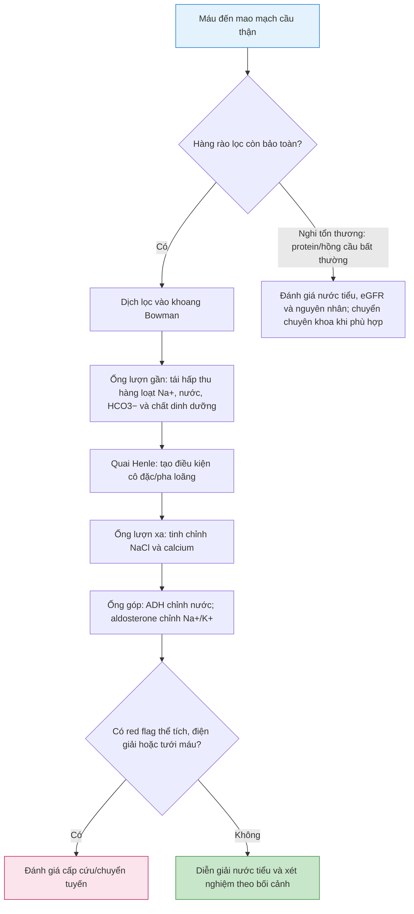

# Sinh lý Nephron: từ dịch lọc đến nước tiểu

**Mã bài:** Sinh_ly_nephron  
**Ngày:** 2026-07-22 | **Chuyên khoa:** Nội thận – Tiết niệu  
**Đối tượng:** Sinh viên y khoa, bác sĩ mới thực hành và người học cần củng cố nền tảng  
**Đường học tiếp theo:** [Thuốc lợi tiểu](../Thuoc_loi_tieu/Thuoc_loi_tieu_2026-07-22_RELEASE_v2.md) · [IM-44 Bệnh thận mạn](../IM-44_Benh_than_man/IM-44_Benh_than_man_2026-07-17.md)

**Revision phát hành:** RELEASE v2  
**Research brief khóa nguồn:** [Sinh_ly_nephron_2026-07-22_RELEASE_v2_RESEARCH_BRIEF.md](Sinh_ly_nephron_2026-07-22_RELEASE_v2_RESEARCH_BRIEF.md)  
**Phạm vi review:** artifact này chỉ dùng các PMID có trong research brief RELEASE v2; liều, ngưỡng và protocol bệnh-specific vẫn thuộc bài liên kết hoặc protocol cơ sở.

---

## 0. Tổng quan — vì sao phải học nephron?

**Nephron** là đơn vị làm việc của thận. Máu đi qua một bộ lọc nhỏ ở đầu nephron, sau đó dịch lọc đi qua những đoạn ống khác nhau. Mỗi đoạn giữ lại hoặc đưa thêm những chất khác nhau; nhờ vậy cơ thể vừa thải chất không cần, vừa giữ nước, natri, kali và acid–base trong giới hạn phù hợp.

Điều này quan trọng vì cùng một biểu hiện như “tiểu ít”, “phù” hoặc “kali bất thường” có thể xuất phát từ vấn đề ở lọc cầu thận, ở một đoạn ống thận, ở hormone điều hòa hoặc ở tưới máu thận. Không xác định được mắt xích này rất dễ dẫn đến diễn giải sai xét nghiệm hoặc chọn thuốc không an toàn.

**Mục tiêu của bài:**
1. Vẽ được dòng đi của dịch lọc từ cầu thận đến nước tiểu cuối cùng.
2. Giải thích đoạn nào quyết định nước, natri, kali, bicarbonate, calcium và magnesium.
3. Liên kết hormone ADH và aldosterone với nước tiểu, thể tích tuần hoàn và điện giải.
4. Đọc có cấu trúc các dấu hiệu thể tích, nước tiểu và xét nghiệm thận cơ bản; nhận ra lúc phải đánh giá cấp cứu/chuyển tuyến.

**Phạm vi bằng chứng:** đây là bài sinh lý nền, không nhằm báo cáo tỷ lệ, prevalence hoặc incidence bệnh; các con số dịch tễ không được suy diễn từ cơ chế nephron.

### 0.1 Nền tảng tối thiểu cần dùng ngay

- **Lọc (filtration):** nước và chất tan nhỏ rời mao mạch cầu thận vào khoang Bowman. Tế bào máu và phần lớn protein không nên đi qua hàng rào lọc.
- **Tái hấp thu (reabsorption):** chất từ lòng ống quay về máu. Đây là cách thận giữ nước và điện giải cần thiết.
- **Bài tiết (secretion):** chất từ máu/ tế bào ống đi thêm vào lòng ống. Đây là một phần cách thận điều chỉnh kali, hydrogen ion và một số thuốc.
- **Nước tiểu cuối cùng** là kết quả của cả ba quá trình; lượng nước tiểu không tự nó cho biết thận đang khỏe hay đang “đáp ứng tốt”. Luôn diễn giải cùng huyết áp, dấu tưới máu, lượng dịch vào-ra, điện giải và creatinine/eGFR.

> 🚨 **BOX ĐỎ — dừng đường học thường quy và đánh giá khẩn:** khó thở/giảm oxy kèm quá tải dịch; sốc hoặc dấu giảm tưới máu; vô niệu mới xuất hiện; lú lẫn; tăng kali có triệu chứng hoặc nghi thay đổi ECG; creatinine xấu đi nhanh; hoặc nghi tắc nghẽn niệu. Đây không phải tình huống để tự suy luận từ một mẫu nước tiểu hoặc tự chỉnh thuốc. Đánh giá tại nơi có theo dõi, xét nghiệm và khả năng chuyển chuyên khoa/cấp cứu.

---

## 1. ĐỊNH NGHĨA — bản đồ nephron, một dòng chảy nhiều nhiệm vụ

**Cách đọc sơ đồ:**
1. Cầu thận quyết định cái gì được đi vào dịch lọc.
2. Ống lượn gần (PCT) lấy lại phần lớn dịch và chất tan hữu ích ngay từ đầu.
3. Quai Henle thiết lập điều kiện để thận có thể tạo nước tiểu cô đặc khi cơ thể cần giữ nước hoặc nước tiểu pha loãng khi cần thải nước tự do.
4. Ống lượn xa (DCT) và ống góp là nơi tinh chỉnh cuối cùng. Vì phần natri còn lại ít hơn nhưng được kiểm soát chặt, các hormone và thuốc tác động ở đây có thể làm kali hoặc nước thay đổi đáng kể.
5. Trước khi diễn giải “đoạn nào có vấn đề”, luôn sàng lọc red flags. Khi thiếu xét nghiệm hoặc không chắc về tưới máu, Plan B an toàn là theo dõi, lấy được xét nghiệm nền và chuyển đánh giá; không suy đoán bằng một chỉ số đơn độc.

---

## 2. CƠ CHẾ — cầu thận và ống lượn gần: lọc rồi lấy lại phần cần thiết

### 2.1 Cầu thận lọc gì, giữ gì?

Cầu thận là một búi mao mạch nằm trong bao Bowman. Hàng rào lọc có ba thành phần phối hợp: lớp nội mô có cửa sổ, màng đáy cầu thận và khe lọc giữa các podocyte. Hàng rào này cho nước và chất tan nhỏ đi qua nhưng hạn chế tế bào máu và protein lớn.

**Vì sao quan trọng?** Protein niệu hoặc hồng cầu niệu không tự động xác định một bệnh, nhưng là dấu hiệu cần đặt câu hỏi: hàng rào lọc có tổn thương không, có viêm cầu thận không, hay nguồn chảy máu nằm trên đường niệu? Điều này quyết định có cần lặp lại mẫu đúng cách, tìm trụ niệu, kiểm eGFR/albumin niệu hoặc chuyển chuyên khoa hay không.

Tốc độ lọc cầu thận chịu ảnh hưởng bởi tưới máu, trương lực tiểu động mạch vào/ra và áp lực trong khoang Bowman. Thận có cơ chế tự điều hòa tại chỗ: cơ chế cơ học ở tiểu động mạch vào và phản hồi cầu–ống qua macula densa. Mục đích là giảm dao động GFR khi huyết áp thay đổi trong một phạm vi sinh lý, không phải bảo vệ tuyệt đối trong sốc, mất nước nặng, nhiễm trùng nặng hoặc tắc nghẽn.

> ⚠️ **Học viên hay nhầm:** “Creatinine bình thường” không tự loại trừ tổn thương thận sớm hoặc tổn thương cấp. Creatinine cần được so với nền, xu hướng, khối cơ và lượng nước tiểu; eGFR là chỉ số ước tính, không phải số đo trực tiếp cho mọi tình huống.

### 2.2 PCT: đoạn tái hấp thu hàng loạt

Dịch lọc vừa rời cầu thận còn chứa nước, natri, bicarbonate, glucose và nhiều chất tan có ích. PCT lấy lại phần lớn lượng này theo kiểu gần như đẳng trương: nước thường đi theo natri.

- Ở bờ lòng ống, **NHE3** trao đổi natri đi vào tế bào với hydrogen đi ra lòng ống.
- **SGLT2** cùng vận chuyển natri với glucose. Vì thế glucose niệu có thể xuất hiện khi tải glucose vượt khả năng tái hấp thu hoặc khi cơ chế SGLT2 bị ức chế.
- Hydrogen được tiết ra hỗ trợ tái hấp thu bicarbonate qua hệ carbonic anhydrase. Điều này nối PCT với cân bằng acid–base.
- Ở bờ đáy, Na+/K+-ATPase giữ nồng độ natri nội bào thấp để các cơ chế ở bờ lòng ống tiếp tục hoạt động.

| Thành phần PCT | Hướng vận chuyển cần nhớ | Ý nghĩa học tập |
|---|---|---|
| NHE3 | Na+ vào tế bào, H+ vào lòng ống | Nối tái hấp thu Na+ với xử lý bicarbonate. |
| SGLT2 | Na+ và glucose cùng vào tế bào | Giải thích vì sao tải glucose hoặc ức chế SGLT2 làm đổi glucose niệu. |
| Na+/K+-ATPase | Na+ ra bờ đáy-bên, K+ vào tế bào | Duy trì “động lực” cho các chất vận chuyển ở bờ lòng. |

**Cân bằng cầu–ống** nghĩa là PCT có xu hướng lấy lại tỷ lệ tương đối ổn định của dịch lọc khi GFR thay đổi vừa phải. Nhờ đó các đoạn phía sau không bị quá tải đột ngột.

### 🛑 DỪNG 1 PHÚT — tự kiểm tra

> 1. Vì sao có protein niệu cần được diễn giải cùng bối cảnh thay vì gắn ngay một chẩn đoán?  
> 2. Nếu PCT giảm tái hấp thu bicarbonate, xu hướng acid–base nào có thể xuất hiện?  
>
> *(Đáp án: 1. Protein niệu có nhiều nguồn và cần đánh giá hàng rào lọc, mẫu bệnh phẩm, eGFR/albumin niệu cùng lâm sàng. 2. Mất bicarbonate niệu có thể góp phần gây toan chuyển hóa.)*

---

## 3. CƠ CHẾ — quai Henle và tủy thận: tạo điều kiện để điều hòa nước

### 3.1 Hai nhánh có tính thấm trái ngược

**Nhánh xuống mảnh** thấm nước tốt. Khi dịch đi xuống vùng tủy ưu trương, nước rời lòng ống để cân bằng với mô kẽ; dịch trong ống trở nên cô đặc hơn.

**Nhánh lên dày (TAL)** thì ngược lại: gần như không thấm nước nhưng tái hấp thu NaCl qua kênh đồng vận **NKCC2**. Kali quay lại lòng ống qua ROMK giúp NKCC2 tiếp tục hoạt động và tạo điện thế lòng ống thuận lợi cho tái hấp thu calcium và magnesium qua đường gian bào. Ellison (2019) mô tả NKCC2 ở TAL là mục tiêu của lợi tiểu quai.
| Đoạn quai Henle | Nước | NaCl | Hệ quả cho dịch ống |
|---|---|---|---|
| Nhánh xuống mảnh | Dễ rời lòng ống | Không phải chức năng chính của đoạn này | Dịch ống cô đặc hơn khi đi xuống tủy. |
| TAL | Không đi theo NaCl | Tái hấp thu qua NKCC2 | Dịch ống loãng hơn; mô kẽ tủy nhận NaCl. |

### 3.2 Nhân nồng độ ngược dòng và trao đổi ngược dòng

TAL chuyển NaCl ra mô kẽ nhưng không cho nước theo cùng. Cơ chế lặp lại dọc quai Henle tạo dần một gradient thẩm thấu từ vỏ vào tủy. **Vasa recta** là hệ mạch đi song song, trao đổi nước và chất tan theo cách hạn chế “rửa trôi” gradient đó.

Gradient này không tự tạo ra nước tiểu cô đặc. Nó là điều kiện cần; điều kiện còn lại là ống góp phải thấm nước dưới tác động ADH. Khi ADH thấp, ống góp ít thấm nước hơn và thận có thể thải nước tiểu pha loãng hơn.

### 3.3 Cầu nối sang thuốc lợi tiểu

TAL là đoạn tái hấp thu NaCl lớn và là nơi thuốc lợi tiểu quai tác động. Vì TAL đồng thời góp phần giữ gradient tủy, ức chế đoạn này vừa tăng thải natri vừa giảm khả năng cô đặc nước tiểu. Bài [Thuốc lợi tiểu](../Thuoc_loi_tieu/Thuoc_loi_tieu_2026-07-22_RELEASE_v2.md) sẽ dùng chính bản đồ này để giải thích hiệu quả, điện giải và an toàn; không cần học thuộc thuốc trước khi hiểu cơ chế.

---

## 4. CƠ CHẾ — DCT và ống góp: tinh chỉnh bằng hormone

### 4.1 DCT: natri–chloride và calcium

DCT tái hấp thu NaCl qua **NCC**. Đoạn này ít thấm nước, vì vậy tiếp tục góp phần làm dịch lòng ống loãng. DCT cũng tham gia tái hấp thu calcium qua các cơ chế phụ thuộc điện hóa và hormone, trong đó có PTH. Ellison (2019) mô tả NCC là mục tiêu của thiazide/thiazide-like.

### 4.2 Ống góp: lựa chọn cuối cùng cho natri, kali và nước

Ở **tế bào chính**, ENaC cho natri từ lòng ống đi vào tế bào. Aldosterone tăng hoạt động của hệ này và của các cơ chế đưa kali ra lòng ống; hệ quả là xu hướng giữ natri nhưng tăng bài tiết kali. Đây là lý do thay đổi aldosterone, bệnh thận và thuốc tác động ở ống góp có thể nhanh chóng làm kali trở thành vấn đề an toàn.

**ADH (vasopressin)** gắn thụ thể V2 ở bờ đáy tế bào chính, làm AQP2 xuất hiện ở bờ lòng ống. Khi gradient tủy còn hiệu quả, nước có thể quay về máu. ADH được điều hòa bởi osmolality và tín hiệu thể tích/tưới máu; vì vậy người giảm thể tích vẫn có thể giữ nước dù natri máu thấp.

Ở **tế bào kẽ**, một nhóm chuyên tiết hydrogen và tái hấp thu bicarbonate; nhóm kia có thể bài tiết bicarbonate. Đây là phần tinh chỉnh cuối của cân bằng acid–base.
| Tế bào/cơ chế | Điều chỉnh chính | Hệ quả cần liên hệ |
|---|---|---|
| Tế bào chính + ENaC | Aldosterone tăng tái hấp thu Na+ | Có thể tăng xu hướng bài tiết K+. |
| Tế bào chính + AQP2 | ADH làm ống góp thấm nước hơn | Nước được tái hấp thu khi gradient tủy còn hiệu quả. |
| Tế bào kẽ | Bài tiết H+ hoặc bicarbonate tùy nhóm tế bào | Tinh chỉnh acid–base cuối nephron. |

### 4.3 Tích hợp kali và acid–base

Khi nhiều natri đến ống góp và ENaC hoạt động mạnh, lòng ống có xu hướng âm hơn. Điều này thuận lợi cho bài tiết kali và hydrogen. Ngược lại, giảm hoạt động ENaC hoặc giảm tác dụng aldosterone có thể làm giảm bài tiết kali/hydrogen. Trong thực hành, không được suy luận acid–base hoặc kali từ một cơ chế đơn độc: hãy kiểm điện giải, bicarbonate, chức năng thận, thuốc phối hợp và tình trạng thể tích.

---

## 5. CHẨN ĐOÁN VÀ THEO DÕI — ghép cơ chế với nước tiểu, thể tích và xét nghiệm

### 5.1 Một khung đọc an toàn

1. **Bắt đầu bằng người bệnh, không phải xét nghiệm:** có khó thở, giảm oxy, phù, khát, chóng mặt tư thế, giảm tưới máu, lú lẫn hay vô niệu không?
2. **Xác nhận dữ liệu:** mẫu nước tiểu lấy đúng cách chưa; creatinine có giá trị nền/xu hướng không; người bệnh có vừa nhận dịch, dùng thuốc, có tiêu chảy/nôn hoặc tắc nghẽn nghi ngờ không?
3. **Đặt nước tiểu vào bối cảnh hormone:** nước tiểu cô đặc gợi giữ nước nhưng không tự nói nguyên nhân; nước tiểu pha loãng có thể phản ánh ADH thấp hoặc giảm khả năng cô đặc, nhưng phải so với lượng nước uống và serum osmolality khi cần.
4. **Đặt điện giải vào đoạn nephron:** kali, bicarbonate, magnesium và calcium giúp kiểm tra giả thuyết, không thay thế đánh giá lâm sàng.
5. **Quyết định nơi chăm sóc:** bất thường nhanh, nguy hiểm hoặc không giải thích được cần năng lực xét nghiệm lặp lại, ECG/hồi sức hoặc chuyên khoa.

### 5.2 Plan A và Plan B

- **Plan A — đủ nguồn lực:** đánh giá thể tích và tưới máu; đo điện giải, bicarbonate, creatinine/eGFR; làm nước tiểu có mục tiêu; kiểm ECG khi có nguy cơ rối loạn kali; liên kết IM-44 nếu nghi CKD.
- **Plan B — thiếu nguồn lực:** đo dấu sinh tồn và lượng vào-ra/cân nặng theo chuỗi, rà thuốc và red flags; không kết luận đoạn nephron từ một test; chuyển tuyến để có điện giải/creatinine hoặc siêu âm khi bất thường kéo dài hay nặng lên.

### 5.3 Liên kết với bài bệnh

- [IM-44 Bệnh thận mạn](../IM-44_Benh_than_man/IM-44_Benh_than_man_2026-07-17.md) giữ vai trò thuật toán CKD và an toàn thuốc trong CKD.
- [Thuốc lợi tiểu](../Thuoc_loi_tieu/Thuoc_loi_tieu_2026-07-22_RELEASE_v2.md) giữ vai trò chọn nhóm thuốc theo đoạn nephron và theo dõi an toàn.
- Bài này chỉ cung cấp ngôn ngữ sinh lý chung; không thay thế các thuật toán suy tim, tăng huyết áp, xơ gan cổ trướng hoặc CKD.

---

## 6. ĐIỀU TRỊ VÀ QUẢN LÝ — giới hạn an toàn của bài sinh lý

### Case 1 — mất nước do tiêu chảy

**Bệnh nhân:** người bệnh tiêu chảy, khát, chóng mặt khi đứng và tiểu ít.  
**Câu hỏi:** thận sẽ ưu tiên giữ nước và natri ở đâu; hành động nào an toàn?

1. **Nhận diện nguy cơ:** hỏi giảm tưới máu, lú lẫn, tụt huyết áp, vô niệu và triệu chứng nặng. Có bất kỳ dấu hiệu nào thì đánh giá cấp cứu.
2. **Dữ kiện đổi quyết định:** giảm thể tích làm tăng tín hiệu giữ natri ở PCT/ống góp và tăng ADH; nước tiểu có thể cô đặc. Tuy nhiên, điều này không chứng minh nguyên nhân nếu chưa khám và làm xét nghiệm.
3. **Hành động ngay:** đánh giá dấu sinh tồn, mức mất dịch và khả năng uống/bù dịch; không tự dùng thuốc lợi tiểu để “làm thận hoạt động”.
4. **Theo dõi/chuyển tuyến:** theo lượng nước tiểu, tưới máu và điện giải/creatinine khi có chỉ định. Tiểu rất ít, dấu sốc, rối loạn ý thức hoặc không bù được cần chuyển viện.
5. **Vì sao không chọn phương án sai:** chỉ nhìn natri máu hoặc nước tiểu mà bỏ thể tích tuần hoàn có thể dẫn đến bù dịch/điều trị sai hướng.

### Case 2 — mô phỏng một tải natri đi qua các đoạn ống

**Bệnh nhân:** không có red flag; mục tiêu là giải thích vì sao cùng một lượng natri lọc qua lại có thể được giữ hoặc thải khác nhau.

1. **Bước 1:** PCT lấy lại phần lớn natri và nước; nếu cơ chế này giảm, natri nhiều hơn đi xuống các đoạn sau.
2. **Bước 2:** TAL lấy lại NaCl không kèm nước, góp phần tạo gradient tủy. Nếu TAL bị ức chế, natri và nước đi tiếp nhiều hơn, đồng thời khả năng cô đặc giảm.
3. **Bước 3:** DCT và ống góp còn có thể tái hấp thu một phần natri. Aldosterone và ENaC quyết định phần tinh chỉnh này, kèm thay đổi bài tiết kali.
4. **Bước 4:** ADH quyết định lượng nước quay về ở ống góp. Cùng một tải natri, ADH cao có thể tạo nước tiểu ít/cô đặc hơn; ADH thấp tạo nước tiểu loãng hơn nếu gradient tủy còn.
5. **Bước 5:** kết luận là phải liên kết đoạn tác động với điện giải và thể tích, không suy luận thuốc hoặc bệnh cụ thể chỉ từ một mắt xích.

---

## 7. TIPS THỰC HÀNH — sinh lý an toàn

### Mẹo nhớ

1. **PCT = lấy lại hàng loạt.**
2. **TAL = muối ra, nước không theo; nền cho gradient tủy.**
3. **DCT = tinh chỉnh NaCl và calcium.**
4. **Ống góp = “nút chỉnh cuối”: aldosterone cho Na+/K+, ADH cho nước.**
5. **Nước tiểu cô đặc không tự đồng nghĩa với mất nước; nó phải được đọc cùng thể tích và hormone.**
6. **Kali bất thường luôn buộc rà thuốc, thận, acid–base và nguy cơ ECG.**
7. **Vô niệu, sốc, giảm oxy, lú lẫn hay rối loạn điện giải nặng luôn thắng nhánh thường quy.**
8. **Học sinh lý để dự đoán và kiểm tra, không để tự kê đơn.**

## 8. TÓM TẮT — 8 điểm cần nhớ

1. Nephron biến dịch lọc thành nước tiểu bằng lọc, tái hấp thu và bài tiết.
2. Cầu thận lọc; PCT lấy lại phần lớn dịch và chất tan hữu ích.
3. TAL và vasa recta tạo/bảo tồn gradient tủy; ADH dùng gradient này để giữ nước.
4. DCT dùng NCC, còn ống góp dùng ENaC để tinh chỉnh natri.
5. Aldosterone gắn natri với bài tiết kali; tế bào kẽ liên quan acid–base.
6. Protein/hồng cầu niệu, creatinine/eGFR và nước tiểu chỉ có ý nghĩa khi đặt vào bối cảnh.
7. Bài thuốc lợi tiểu dùng bản đồ nephron này, nhưng các thuật toán bệnh-specific nằm ở bài liên kết.
8. Red flags về tưới máu, thể tích, điện giải hoặc vô niệu phải được đánh giá khẩn.

### 🛑 Tự kiểm tra cuối bài

> 1. Vì sao thuốc tác động tại TAL có thể đồng thời làm tăng thải natri và giảm khả năng cô đặc nước tiểu?  
> 2. Một người giảm thể tích có nước tiểu cô đặc: ADH đang có vai trò gì?  
> 3. Trước khi kết luận kali bất thường do một đoạn nephron, cần kiểm các nhóm dữ kiện nào?  
>
> *(Đáp án: 1. TAL tái hấp thu NaCl không kèm nước và góp phần tạo gradient tủy. 2. ADH tăng tính thấm nước ở ống góp để giữ nước. 3. Lâm sàng/tưới máu, thuốc, creatinine/eGFR, điện giải-bicarbonate và khi cần ECG.)*

---

## 9. BẰNG CHỨNG — cập nhật nguồn và ứng dụng

### 9.1 Nguồn theo từng mắt xích sinh lý

| Mắt xích | Nguồn đã dùng | Vai trò trong bài |
|---|---|---|
| Vận chuyển Na+ và nước theo đoạn | Greger (2000) | Nền cho PCT, TAL, DCT và ống góp. |
| NHE3, NKCC2 và NCC | Knepper & Brooks (2001) | Định vị các chất vận chuyển trong bản đồ nephron. |
| Điều hòa distal Na+/K+ | Pearce et al. (2022) | Nền cho ENaC, NCC, MR và homeostasis K+. |
| Acid–base PCT | Skelton et al. (2010) | Nền cho tái hấp thu bicarbonate và bài tiết H+. |
| Angiotensin II và vận chuyển ống thận | Burns & Li (2003) | Nền cho điều hòa tái hấp thu natri khi thể tích bị đe dọa. |

### 9.2 Cách dùng guideline đúng phạm vi

| Câu hỏi lâm sàng | Vai trò của KDIGO 2024 |
|---|---|
| Đánh giá thận | KDIGO đặt eGFR và albumin niệu vào khung nguy cơ, không dùng một kết quả đơn lẻ để tự chẩn đoán. |
| Theo dõi | KDIGO nhấn mạnh theo dõi theo nguy cơ và xu hướng, không thay thế đánh giá tưới máu cấp. |
| Điện giải | KDIGO giúp xác định khi bất thường điện giải ở CKD cần xử trí/hội chẩn, không tạo công thức tự điều trị. |
| Thuốc | KDIGO hỗ trợ medication stewardship ở CKD; phải rà thuốc và chức năng thận. |
| Chuyển tuyến | KDIGO dùng phân tầng nguy cơ để hướng dẫn thời điểm cần chuyên khoa. |

### 9.3 Điều trị: chuyển giao, không kê đơn

| Nếu câu hỏi là… | Đường học đúng |
|---|---|
| Nên dùng nhóm lợi tiểu nào và theo dõi gì? | [Thuốc lợi tiểu](../Thuoc_loi_tieu/Thuoc_loi_tieu_2026-07-22_RELEASE_v2.md). |
| CKD được chẩn đoán/phân tầng thế nào? | [IM-44 Bệnh thận mạn](../IM-44_Benh_than_man/IM-44_Benh_than_man_2026-07-17.md). |
| Có vô niệu, giảm oxy, sốc hoặc rối loạn điện giải nặng? | Đánh giá cấp cứu/chuyển tuyến, không dùng bài sinh lý để kê đơn. |

### 9.4 Giới hạn bằng chứng

Các review nền được chọn vì trực tiếp mô tả vận chuyển theo đoạn nephron hoặc acid–base. Chúng chỉ hỗ trợ cơ chế trong bài; không được dùng để suy ra liều, chỉ định điều trị hoặc ngưỡng can thiệp. KDIGO 2024 là nguồn guideline đã đọc trực tiếp để định khung đánh giá CKD và an toàn, còn quản lý bệnh-specific vẫn thuộc các bài liên kết.

## 10. Tài liệu tham khảo

1. Hall JE, Hall ME. *Guyton and Hall Textbook of Medical Physiology*. 14th ed. Elsevier. [TEXTBOOK: Guyton and Hall 14e]
2. Greger R. *Physiology of renal sodium transport*. *American Journal of the Medical Sciences*. PMID: 10653444. [ABSTRACT VERIFIED]
3. Knepper MA, Brooks HL. *Regulation of the sodium transporters NHE3, NKCC2 and NCC in the kidney*. *Current Opinion in Nephrology and Hypertension*. PMID: 11496061. [ABSTRACT VERIFIED]
4. Pearce D, Manis AD, Nesterov V, Korbmacher C. *Regulation of distal tubule sodium transport: mechanisms and roles in homeostasis and pathophysiology*. *Pflügers Archiv*. PMID: 35895103. [ABSTRACT VERIFIED]
5. Skelton LA, Boron WF, Zhou Y. *Acid-base transport by the renal proximal tubule*. *Journal of Nephrology*. PMID: 21170887. [ABSTRACT VERIFIED]
6. Burns KD, Li N. *The role of angiotensin II-stimulated renal tubular transport in hypertension*. *Current Hypertension Reports*. PMID: 12642017. [ABSTRACT VERIFIED]
7. Wang X, Armando I, Upadhyay K, Pascua A, Jose PA. *The regulation of proximal tubular salt transport in hypertension: an update*. *Current Opinion in Nephrology and Hypertension*. PMID: 19654544. [FETCHED]
8. Féraille E, Doucet A. *Sodium-potassium-adenosinetriphosphatase-dependent sodium transport in the kidney: hormonal control*. *Physiological Reviews*. PMID: 11152761. [FETCHED]
9. Boron WF. *Acid-base transport by the renal proximal tubule*. *Journal of the American Society of Nephrology*. PMID: 16914536. [FETCHED]
10. Ellison DH. *Clinical Pharmacology in Diuretic Use*. *Clinical Journal of the American Society of Nephrology*. PMID: 30936153. [ABSTRACT VERIFIED]
11. KDIGO CKD Work Group. *KDIGO 2024 Clinical Practice Guideline for the Evaluation and Management of Chronic Kidney Disease*. *Kidney International*. PMID: 38490803. [GUIDELINE VERIFIED]

**— Hết bài học ngày 2026-07-22 —**
