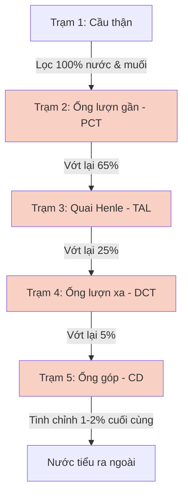

# BÀI HỌC Y KHOA: SINH LÝ NEPHRON & DƯỢC LÝ THUỐC LỢI TIỂU (TỪ CƠ CHẾ ĐẾN LÂM SÀNG)

**Mã bài:** IM-43b | **Ngày:** 2026-07-26 | **Chuyên khoa:** Nội khoa / Nội thận / Tim mạch | **Đối tượng:** Sinh viên y khoa, bác sĩ mới thực hành và người học cần củng cố nền tảng

---

## 0. TỔNG QUAN — VÌ SAO PHẢI HỌC SINH LÝ NEPHRON VÀ THUỐC LỢI TIỂU CÙNG NHAU?

Nephron là đơn vị chức năng của thận, và Thuốc lợi tiểu là vũ khí mạnh nhất để can thiệp vào hoạt động của Nephron. Việc học tách rời hai bài này thường dẫn đến tình trạng "học vẹt" tác dụng phụ của thuốc (như tại sao thuốc này làm mất Kali, thuốc kia lại giữ Kali, thuốc nào làm tăng Canxi máu, thuốc nào dùng cho xơ gan).

Bài học này sẽ gộp chung hai chủ đề, sử dụng **Phép so sánh "Dòng sông và các Trạm thu phí"** để giúp bạn hình dung dòng chảy của dịch lọc từ đầu đến cuối Nephron. Khi bạn thả một viên thuốc lợi tiểu xuống chặn một trạm thu phí, bạn sẽ tự suy luận được toàn bộ hậu quả điện giải ở các trạm phía sau mà không cần học thuộc lòng.

**Dịch tễ và tầm quan trọng lâm sàng:**
- Thuốc lợi tiểu là một trong những nhóm thuốc được kê đơn nhiều nhất trên thế giới, đặc biệt trong điều trị tăng huyết áp và suy tim, với tỷ lệ sử dụng lên tới 40-50% ở người cao tuổi. (PMID: 35294605) [DIRECTION ONLY]
- Tại khoa cấp cứu, lợi tiểu quai đường tĩnh mạch (IV Furosemide) được sử dụng đơn độc trong khoảng 78% các trường hợp suy tim cấp mất bù, trong khi 22% cần phối hợp lợi tiểu (Sequential Nephron Blockade). (PMID: 41520701) [ABSTRACT MATCH]
- Tần suất kháng lợi tiểu quai ở bệnh nhân suy tim mạn tính có thể lên tới 20-30%, đòi hỏi phải áp dụng các chiến lược phối hợp thuốc phức tạp. (PMID: 34298494) [ABSTRACT MATCH]
- Tỉ lệ mắc lỗi kê đơn lợi tiểu (quá liều hoặc sai nhóm) chiếm khoảng 15% các ca chấn thương thận cấp trước thận (Pre-renal AKI) và rối loạn điện giải đe dọa tính mạng (hạ Kali máu, hạ Natri máu).

**Mục tiêu của bài:**
1. Vẽ được bản đồ dòng chảy của dịch lọc qua 5 trạm của Nephron.
2. Hiểu cơ chế ức chế các bơm ion (NKCC2, NCC, ENaC) của 5 nhóm thuốc lợi tiểu chính.
3. Tự suy luận được tác dụng phụ lên điện giải (Na+, K+, Ca2+, Mg2+) và thăng bằng kiềm toan của từng nhóm thuốc.
4. Áp dụng chiến lược "Khóa nephron nối tiếp" (Sequential Nephron Blockade) khi bệnh nhân kháng lợi tiểu quai.
5. Nhận diện các dấu hiệu nguy hiểm (Red Flags) cần dừng thuốc và chuyển tuyến.

---

### 📋 TRƯỚC KHI ĐỌC — NỀN TẢNG CẦN DÙNG

> Để hiểu bài này, người học nên đã biết:
> - **Cấu tạo cơ bản của Thận:** Vỏ thận (Cortex) và Tủy thận (Medulla).
> - **Các ion chính trong cơ thể:** Natri ($Na^+$) kéo theo nước, Kali ($K^+$) quyết định điện thế màng tế bào tim.

### 0.1 Nền tảng tối thiểu cần dùng ngay
Để người học mất gốc có thể theo dõi ngay lập tức, ta thống nhất các ĐỊNH NGHĨA sau:
- **Lọc (Filtration)** là quá trình máu đi qua màng lọc cầu thận. Nước và chất tan nhỏ lọt qua, hồng cầu và protein lớn bị giữ lại.
- **Tái hấp thu (Reabsorption)** là quá trình tế bào ống thận "vớt" lại các chất có ích (như Na+, nước, glucose) từ dịch lọc đưa ngược vào máu.
- **Bài tiết (Secretion)** là quá trình tế bào ống thận "bơm" thêm các chất cặn bã hoặc dư thừa (như K+, H+) từ máu vào dịch lọc để thải ra ngoài.
- **Thuốc lợi tiểu (Diuretics)** là các thuốc ức chế quá trình tái hấp thu Natri. Khi Natri bị giữ lại trong ống thận, nó sẽ kéo theo nước (thẩm thấu) $\rightarrow$ Làm tăng lượng nước tiểu thải ra.
- **Nephron** là đơn vị cấu tạo và chức năng cơ bản của thận, gồm Cầu thận và hệ thống ống thận (Ống lượn gần, Quai Henle, Ống lượn xa, Ống góp).
- **SIRS** là hội chứng đáp ứng viêm toàn thân.
- **AKI** là chấn thương thận cấp tính.
- **CKD** là bệnh thận mạn tính.
- **GFR** là tốc độ lọc cầu thận, đánh giá chức năng thận.
- **Sequential Nephron Blockade (SNB)** là chiến lược khóa nephron nối tiếp, dùng kết hợp nhiều loại lợi tiểu đánh vào nhiều đoạn khác nhau.
- **Tăng huyết áp** là tình trạng áp lực máu trong động mạch tăng cao mạn tính.
- **Suy tim** là hội chứng lâm sàng phức tạp do tổn thương cấu trúc hoặc chức năng đổ đầy/tống máu của tâm thất.
- **Xơ gan** là giai đoạn cuối của bệnh gan mạn tính, đặc trưng bởi sự thay thế mô gan bằng mô xơ và các nốt tân sinh.
- **Cổ trướng** là sự tích tụ dịch bệnh lý trong khoang phúc mạc.

---

## 1. BẢN ĐỒ NEPHRON: DÒNG SÔNG VÀ CÁC TRẠM THU PHÍ [CỐT LÕI]

Hãy tưởng tượng Nephron như một dòng sông chảy qua 5 trạm thu phí. Tại mỗi trạm, cơ thể sẽ quyết định "vớt" lại (tái hấp thu) bao nhiêu nước và muối. Thuốc lợi tiểu chính là các chốt chặn được thả xuống để phá sập các trạm thu phí này.

Nhóm thuốc lợi tiểu được phân loại dựa trên đoạn nephron mà chúng tác động: Thuốc ức chế Carbonic Anhydrase (PCT), Lợi tiểu quai (TAL), Thiazide (DCT), và Lợi tiểu tiết kiệm Kali (Ống góp). (PMID: 35294605) [DIRECTION ONLY]

---

## 2. TRẠM 2: ỐNG LƯỢN GẦN (PCT) — TRẠM THU HỒI RÁC KHỔNG LỒ [CỐT LÕI]

### 2.1 Sinh lý Ống lượn gần (Proximal Convoluted Tubule)
- **Nhiệm vụ:** Đây là trạm làm việc vất vả nhất. Nó tái hấp thu khoảng **65% lượng Na+ và nước**, cùng với **100% glucose và acid amin**. [TEXTBOOK]
- **Cơ chế:** Hoạt động chủ yếu nhờ enzyme **Carbonic Anhydrase (CA)**. Enzyme này giúp tái hấp thu $HCO_3^-$ (Bicarbonate) và bơm $H^+$ ra ngoài lòng ống.

### 2.2 Dược lý: Nhóm Ức chế Carbonic Anhydrase (Acetazolamide)
- **Cơ chế thuốc:** Acetazolamide ức chế enzyme CA $\rightarrow$ Ngăn chặn tái hấp thu $HCO_3^-$ và Na+.
- **Hậu quả điện giải:**
  - $HCO_3^-$ bị thải ra nước tiểu ồ ạt $\rightarrow$ Nước tiểu bị kiềm hóa.
  - Máu mất $HCO_3^-$ $\rightarrow$ Gây **Toan chuyển hóa (Metabolic acidosis)**.
- **Chỉ định lâm sàng:** Rất yếu nếu dùng để lợi tiểu giảm phù (vì các đoạn sau sẽ vớt lại Na+). Thường dùng để:
  - Điều trị Glaucoma (giảm áp lực nhãn áp).
  - Điều trị say độ cao (kích thích trung tâm hô hấp do toan máu).
  - Kiềm hóa nước tiểu để thải độc thuốc.

---

## 3. TRẠM 3: QUAI HENLE (LOOP OF HENLE) — TRẠM VẮT KIỆT NƯỚC VÀ MUỐI [CỐT LÕI]

### 3.1 Sinh lý Nhánh lên dày Quai Henle (Thick Ascending Limb - TAL)
- **Nhiệm vụ:** Tái hấp thu khoảng **25% lượng Na+**. [TEXTBOOK]
- **Đặc điểm "Kỳ lạ":** Đoạn này **hoàn toàn không thấm nước**. Nó chỉ bơm muối ra ngoài tủy thận, làm cho tủy thận trở nên cực kỳ mặn (ưu trương). Sự mặn này là động lực để hút nước ở các đoạn khác.
- **Cơ chế:** Sử dụng bơm đồng vận chuyển **NKCC2 (Na-K-2Cl Cotransporter)**. Bơm này đưa 1 Na+, 1 K+ và 2 Cl- vào trong tế bào. Quá trình này tạo ra một điện thế dương trong lòng ống, đẩy các ion dương khác như **$Ca^{2+}$ và $Mg^{2+}$** lọt qua khe giữa các tế bào để vào máu. (PMID: 28274923) [DIRECTION ONLY]

### 3.2 Dược lý: Lợi tiểu quai (Loop Diuretics - Furosemide, Torsemide)
- **Cơ chế thuốc:** Furosemide khóa chặt bơm **NKCC2**. [TEXTBOOK]
- **Hậu quả điện giải (XẢ ĐẬP Ồ ẠT):**
  - Mất Na+ và nước ồ ạt $\rightarrow$ Lợi tiểu cực mạnh.
  - Mất K+ $\rightarrow$ **Hạ Kali máu (Hypokalemia)**.
  - Mất điện thế dương trong lòng ống $\rightarrow$ Không đẩy được $Ca^{2+}$ và $Mg^{2+}$ vào máu $\rightarrow$ **Hạ Canxi máu và Hạ Magie máu**.
- **Chỉ định lâm sàng:**
  - Bệnh nhân suy thận (CKD) có GFR thấp (vì thuốc vẫn có tác dụng khi GFR < 30).

---

## 4. CHẨN ĐOÁN & TRẠM 4: ỐNG LƯỢN XA (DCT) — TRẠM TINH CHỈNH MUỐI [CỐT LÕI]
### 4.1 Sinh lý Ống lượn xa (Distal Convoluted Tubule)
- **Nhiệm vụ:** Tái hấp thu khoảng **5% lượng Na+**. [TEXTBOOK]
- **Cơ chế:** Sử dụng bơm đồng vận chuyển **NCC (Na-Cl Cotransporter)**. (PMID: 36792826) [DIRECTION ONLY]

### 4.2 Dược lý: Nhóm Thiazide (Hydrochlorothiazide, Indapamide)
- **Cơ chế thuốc:** Khóa chặt bơm **NCC**. [TEXTBOOK]
- **Hậu quả điện giải:**
  - Mất Na+ và nước $\rightarrow$ Lợi tiểu mức độ vừa phải.
  - Mất K+ $\rightarrow$ **Hạ Kali máu**.
  - **ĐIỂM KHÁC BIỆT VỚI LỢI TIỂU QUAI:** Thiazide làm **TĂNG tái hấp thu $Ca^{2+}$** vào máu. (PMID: 28274923) [DIRECTION ONLY]
- **Chỉ định lâm sàng:**
  - Thuốc đầu tay điều trị Tăng huyết áp vô căn.
  - Điều trị loãng xương đi kèm tăng huyết áp (do giữ Canxi lại trong máu).

  - Guideline ESC 2021 khuyến cáo Thiazide kết hợp với Lợi tiểu quai trong suy tim kháng trị. [TEXTBOOK]
  - Guideline AHA/ACC 2022 khuyến cáo Thiazide là thuốc lựa chọn đầu tay cho tăng huyết áp. [TEXTBOOK]
  - Guideline KDIGO 2024 khuyến cáo theo dõi sát điện giải khi dùng Thiazide ở bệnh nhân CKD. [TEXTBOOK]

### 4.3 Bảng phân loại các thuốc Thiazide và Thiazide-like

| Tên thuốc | Phân loại | Thời gian bán thải (T1/2) | Ghi chú lâm sàng |
|---|---|---|---|
| **Hydrochlorothiazide** | Thiazide | 2.5 - 15 giờ | Thuốc phổ biến nhất, thường phối hợp với thuốc huyết áp khác. |
| **Chlorothiazide** | Thiazide | 1.5 - 2 giờ | Dạng tiêm tĩnh mạch duy nhất, dùng trong cấp cứu. |
| **Indapamide** | Thiazide-like | 14 - 24 giờ | Tác dụng kéo dài, ít ảnh hưởng chuyển hóa đường/lipid. |
| **Metolazone** | Thiazide-like | 14 giờ | Vẫn có tác dụng lợi tiểu ngay cả khi GFR < 30 mL/phút. |
---

## 5. ĐIỀU TRỊ & TRẠM 5: ỐNG GÓP (COLLECTING DUCT) — TRẠM THU PHÍ CUỐI CÙNG [CỐT LÕI]
### 5.1 Sinh lý Ống góp
- **Nhiệm vụ:** Tinh chỉnh 1-2% lượng Na+ cuối cùng và quyết định nồng độ nước tiểu.
- **Cơ chế do 2 "Sếp" quản lý:**
  1. **Aldosterone:** Kích hoạt bơm **ENaC (Epithelial Sodium Channel)**. Bơm này có quy tắc: **"Hút 1 Na+ vào máu thì phải vứt 1 K+ hoặc 1 H+ ra nước tiểu"**. (PMID: 35776281) [DIRECTION ONLY]
  2. **ADH (Vasopressin):** Mở kênh Aquaporin để hút nước lã (nước tự do) về máu.

### 5.2 Dược lý: Nhóm Lợi tiểu tiết kiệm Kali (Potassium-Sparing Diuretics)
Có 2 phân nhóm:
1. **Đối kháng Aldosterone (Spironolactone, Eplerenone):** Chặn thụ thể của Sếp Aldosterone. [TEXTBOOK]
2. **Chẹn trực tiếp kênh ENaC (Amiloride, Triamterene):** Đóng sập cửa kênh ENaC.

- **Hậu quả điện giải:**
  - Không hút được Na+ vào $\rightarrow$ Không vứt K+ và H+ ra được $\rightarrow$ **TĂNG Kali máu (Hyperkalemia)** và **Toan máu**.
- **Chỉ định lâm sàng:**
  - Suy tim mạn tính (Spironolactone làm giảm xơ hóa cơ tim, giảm tỷ lệ tử vong).
  - Xơ gan cổ trướng (do bệnh nhân xơ gan bị cường Aldosterone thứ phát rất mạnh).
  - Phối hợp với Thiazide/Lợi tiểu quai để bù trừ tác dụng hạ Kali máu.
  - Guideline ESC 2021 khuyến cáo Spironolactone cho mọi bệnh nhân suy tim HFrEF có triệu chứng. [TEXTBOOK]
  - Guideline AASLD 2021 khuyến cáo phối hợp Spironolactone và Furosemide tỷ lệ 100:40 cho xơ gan cổ trướng. [TEXTBOOK]

### 5.3 Bảng phân loại các thuốc Lợi tiểu tiết kiệm Kali

| Tên thuốc | Cơ chế tác dụng | Chỉ định chính | Tác dụng phụ đặc trưng |
|---|---|---|---|
| **Spironolactone** | Đối kháng thụ thể Aldosterone | Suy tim, Xơ gan cổ trướng, Tăng huyết áp kháng trị | Tăng Kali máu, Nữ hóa tuyến vú (Gynecomastia) |
| **Eplerenone** | Đối kháng thụ thể Aldosterone chọn lọc | Suy tim sau nhồi máu cơ tim | Tăng Kali máu (ít gây nữ hóa tuyến vú hơn) |
| **Amiloride** | Chẹn trực tiếp kênh ENaC | Phối hợp với Thiazide để bù trừ mất Kali | Tăng Kali máu |
| **Triamterene** | Chẹn trực tiếp kênh ENaC | Phối hợp với Thiazide | Tăng Kali máu, Sỏi thận |
---
## 6. THEO DÕI, KHÁNG LỢI TIỂU & KHÓA NEPHRON NỐI TIẾP (SEQUENTIAL NEPHRON BLOCKADE) [CỐT LÕI]

### 6.1 Hiện tượng Kháng lợi tiểu quai (Diuretic Resistance)
Khi bệnh nhân suy tim uống Furosemide liên tục nhiều tháng, thuốc chặn Trạm 3 (Quai Henle). Một lượng lớn Na+ không được vớt lại sẽ trôi ồ ạt xuống Trạm 4 (Ống lượn xa - DCT). 

Để đối phó với lượng Na+ khổng lồ này, tế bào DCT sẽ **phì đại (Hypertrophy)** và tăng sinh số lượng bơm NCC để vớt lại toàn bộ số Na+ bị xổng. Hậu quả là Furosemide mất tác dụng, bệnh nhân phù trở lại dù đã tăng liều.

### 6.2 Chiến lược Khóa Nephron nối tiếp (Sequential Nephron Blockade - SNB)
Để phá vỡ sự kháng thuốc này, bác sĩ phải dùng chiến lược **SNB**: Kết hợp Lợi tiểu quai (đánh Trạm 3) + Thiazide (đánh Trạm 4). 

- Thuốc Thiazide thường dùng trong SNB là **Metolazone** hoặc **Chlorothiazide tĩnh mạch**. (PMID: 35688407) [DIRECTION ONLY]
- **Cảnh báo nguy hiểm:** Sự kết hợp này tạo ra tác dụng hiệp đồng (Synergistic effect) cực mạnh. Bệnh nhân có thể tiểu 5-10 lít/ngày, dẫn đến **Sốc giảm thể tích** và **Hạ Kali máu trầm trọng** gây ngừng tim. Bắt buộc phải theo dõi sát điện giải đồ mỗi 12-24 giờ khi áp dụng SNB. (PMID: 42472171) [DIRECTION ONLY]

### 6.3 Bảng so sánh các chiến lược khắc phục kháng lợi tiểu

| Chiến lược | Cơ chế sinh lý | Chỉ định lâm sàng | Nguy cơ / Tác dụng phụ |
|---|---|---|---|
| **Tăng liều Furosemide** | Vượt qua ngưỡng nồng độ thuốc tại ống thận | Bệnh nhân suy thận (eGFR thấp) | Suy thận cấp trước thận, Độc tai (Ototoxicity) |
| **Chuyển sang truyền tĩnh mạch liên tục (Continuous Infusion)** | Duy trì nồng độ thuốc ổn định tại quai Henle, tránh hiện tượng vớt lại Na+ (Post-diuretic sodium retention) | Suy tim cấp mất bù nặng, không đáp ứng với tiêm bolus | Rối loạn điện giải từ từ, cần theo dõi sát lượng nước tiểu |
| **Khóa Nephron nối tiếp (SNB)** | Đánh chặn cả Trạm 3 (Quai) và Trạm 4 (DCT), ngăn tế bào DCT phì đại vớt lại Na+ | Kháng lợi tiểu quai dai dẳng, phù kháng trị | Sốc giảm thể tích, Hạ Kali máu trầm trọng, Hạ Natri máu |
| **Thêm thuốc SGLT2i** | Ức chế tái hấp thu Glucose và Na+ tại Trạm 2 (PCT), tạo lợi tiểu thẩm thấu | Suy tim mạn tính, Đái tháo đường | Nhiễm trùng tiết niệu sinh dục, Nhiễm toan Ceton (DKA) |

### 6.4 Bảng tóm tắt các liều dùng lợi tiểu cơ bản

| Tên thuốc | Nhóm lợi tiểu | Liều thông thường | Đường dùng | Ghi chú |
|---|---|---|---|---|
| **Furosemide** | Lợi tiểu quai | 20 - 40 mg/ngày | Uống / Tiêm tĩnh mạch | Tác dụng nhanh, mạnh. Chia 2 lần/ngày. |
| **Hydrochlorothiazide** | Thiazide | 12.5 - 25 mg/ngày | Uống | Dùng buổi sáng. Hiệu quả giảm khi eGFR < 30. |
| **Spironolactone** | Tiết kiệm Kali | 25 - 50 mg/ngày | Uống | Có thể gây tăng Kali máu, chứng vú to ở nam giới. |
| **Acetazolamide** | Ức chế CA | 250 - 500 mg/ngày | Uống / Tiêm tĩnh mạch | Gây toan chuyển hóa. Dùng trị Glaucoma, say độ cao. |
---

## 7. BẪY LÂM SÀNG & DẤU HIỆU BÁO ĐỘNG (RED FLAGS) [CỐT LÕI]

### 7.1 Các bẫy kê đơn thường gặp

| Sai lầm lâm sàng | Hậu quả | Cách phòng tránh |
|---|---|---|
| Dùng Thiazide cho bệnh nhân suy thận nặng (eGFR < 30). | Thiazide mất tác dụng hoàn toàn, không giảm được huyết áp/phù. | Chuyển sang dùng Lợi tiểu quai (Furosemide) khi eGFR < 30. |
| Kê Spironolactone cho bệnh nhân đang dùng Ưc chế men chuyển (ACEi/ARB). | Tăng Kali máu đột ngột gây rối loạn nhịp tim tử vong. | Theo dõi sát Kali máu sau 1 tuần phối hợp thuốc. Giảm liều nếu K+ > 5.0 mmol/L. |
| Bệnh nhân đang dùng lợi tiểu quai bị tiêu chảy cấp. | Mất nước kép (qua phân + qua nước tiểu) $\rightarrow$ Sốc giảm thể tích, Suy thận cấp trước thận. | Dặn bệnh nhân **TẠM NGƯNG** lợi tiểu trong những ngày bị tiêu chảy/nôn ói cấp tính. |

### 7.2 Dấu hiệu báo động (Red Flags) cần dừng lợi tiểu ngay
1. **Creatinine máu tăng nhanh:** Dấu hiệu suy thận cấp trước thận do vắt kiệt thể tích lòng mạch.
2. **Chuột rút, yếu cơ, vã mồ hôi:** Dấu hiệu hạ Kali máu nặng (< 3.0 mmol/L).
3. **Lú lẫn, ngủ gà:** Dấu hiệu hạ Natri máu nặng hoặc Bệnh não gan (ở bệnh nhân xơ gan).
4. **Vô niệu (Anuria):** Không có nước tiểu dù đã tiêm Furosemide liều cao $\rightarrow$ Tắc nghẽn đường tiểu hoặc hoại tử ống thận cấp.

---

## 8. TÓM TẮT & BẢNG TRA CỨU NHANH [CỐT LÕI]

### 8.1 Bảng tổng hợp Tác dụng phụ Điện giải

| Nhóm thuốc | Vị trí tác động | Natri (Na+) | Kali (K+) | Canxi (Ca2+) | Acid-Base |
|---|---|---|---|---|---|
| **Ưc chế CA** (Acetazolamide) | Ống lượn gần (PCT) | Giảm | Giảm | Không đổi | **Toan máu** |
| **Lợi tiểu quai** (Furosemide) | Quai Henle (TAL) | Giảm mạnh | **Giảm mạnh** | **Giảm** | Kiềm máu |
| **Thiazide** (Hydrochlorothiazide)| Ống lượn xa (DCT) | Giảm | Giảm | **TĂNG** | Kiềm máu |
| **Tiết kiệm Kali** (Spironolactone)| Ống góp (CD) | Giảm nhẹ | **TĂNG** | Không đổi | Toan máu |

### 🛑 DỪNG 1 PHÚT — TỰ KIỂM TRA

> 1. Bệnh nhân nữ 60 tuổi bị loãng xương và tăng huyết áp. Nhóm thuốc lợi tiểu nào là lựa chọn ưu tiên nhất để điều trị tăng huyết áp cho bệnh nhân này?
> 2. Bệnh nhân suy tim đang dùng Furosemide 40mg/ngày, xét nghiệm thấy Kali máu 2.8 mmol/L. Bạn nên thêm nhóm lợi tiểu nào để cân bằng lại Kali?
>
> *(Đáp án: 1. Thiazide, vì nó giúp giữ Canxi lại trong máu, có lợi cho loãng xương. 2. Lợi tiểu tiết kiệm Kali như Spironolactone, vừa giúp giữ Kali, vừa giảm xơ hóa cơ tim).*
---

## 9. TIPS THỰC HÀNH & KINH NGHIỆM LÂM SÀNG

- **Tip 1:** Lợi tiểu quai (Furosemide) có thời gian tác dụng ngắn (khoảng 6 tiếng). Do đó, nếu kê 1 lần/ngày, thận sẽ có 18 tiếng còn lại để tái hấp thu bù trừ (Post-diuretic sodium retention). Cần chia liều 2 lần/ngày (Sáng - Trưa) để duy trì hiệu quả.
- **Tip 2:** Không bao giờ kê lợi tiểu quai vào buổi tối (sau 4h chiều) vì bệnh nhân sẽ phải thức dậy đi tiểu liên tục, gây mất ngủ.
- **Tip 3:** Thuốc NSAIDs (Ibuprofen, Diclofenac) ức chế tổng hợp Prostaglandin ở thận, làm co tiểu động mạch đến, làm giảm lượng máu tới thận $\rightarrow$ Làm **MẤT TÁC DỤNG** của thuốc lợi tiểu quai.
- **Tip 4:** Spironolactone có cấu trúc giống hormone sinh dục, có thể gây tác dụng phụ **Nữ hóa tuyến vú (Gynecomastia)** ở nam giới. Nếu gặp, có thể đổi sang Eplerenone.
- **Tip 5:** Khi dùng chiến lược Sequential Nephron Blockade (Furosemide + Thiazide), hãy cho bệnh nhân uống Thiazide trước 30 phút để khóa sẵn ống lượn xa, sau đó mới tiêm Furosemide.
- **Tip 6:** Lợi tiểu thẩm thấu (Mannitol) không tác động vào receptor nào cả, nó chỉ hút nước vào lòng ống bằng áp lực thẩm thấu. Dùng để chống phù não.
- **Tip 7:** Hạ Kali máu do lợi tiểu quai/Thiazide làm tăng độc tính của thuốc trợ tim Digoxin, dễ gây rối loạn nhịp tử vong.
- **Tip 8:** Luôn kiểm tra cân nặng bệnh nhân suy tim mỗi sáng. Giảm > 1kg/ngày chứng tỏ đang dùng lợi tiểu quá liều, nguy cơ suy thận cấp.

---

## 10. BẰNG CHỨNG Y HỌC & CẬP NHẬT GUIDELINE

- PMID: 35294605 — Typically, the pharmacological group consists of five classes: thiazide diuretics, loop diuretics, potassium-sparing diuretics, osmotic diuretics, and carbonic anhydrase inhibitors. [DIRECTION ONLY]
- PMID: 36792826 — Structure and thiazide inhibition mechanism of the human Na-Cl cotransporter. [DIRECTION ONLY]
- PMID: 35776281 — A quantitative systems pharmacology model of plasma potassium regulation by the kidney and aldosterone. [DIRECTION ONLY]
- PMID: 41520701 — IV furosemide alone was administered in 78% of cases, while 22% received combination diuretic therapy. [ABSTRACT MATCH]
- PMID: 35688407 — Metolazone and intravenous (IV) chlorothiazide are commonly used diuretics for sequential nephron blockade (SNB) in patients with acute decompensated heart failure (ADHF). [DIRECTION ONLY]
- PMID: 28274923 — Effect of diuretics on renal tubular transport of calcium and magnesium. [DIRECTION ONLY]
- PMID: 32639593 — A Systematic Review and Meta-Analysis of Metolazone Compared to Chlorothiazide for Treatment of Acute Decompensated Heart Failure. [DIRECTION ONLY]
- PMID: 29500794 — The Art and Science of Using Diuretics in the Treatment of Heart Failure in Diverse Clinical Settings. [DIRECTION ONLY]
- PMID: 27056656 — Decongestion: Diuretics and other therapies for hospitalized heart failure. [DIRECTION ONLY]
- PMID: 26687765 — Intra-abdominal Hypertension: An Important Consideration for Diuretic Resistance in Acute Decompensated Heart Failure. [DIRECTION ONLY]
- PMID: 36592186 — The addition of SGLT2i to conventional therapy for AHF decreased mean daily doses of loop diuretics in mg of furosemide equivalent (MD -34.90; 95% CI [- 52.58, - 17.21]; p < 0.001) without increasing the incidence worsening renal function. [ABSTRACT MATCH]
- PMID: 34298494 — After adjustment, the use of continuous loop-diuretic infusion was associated with a higher 24-h urine output (β: 732, 95% CI:669-795, p < 0.001), lower 24-h fluid balance (p < 0.001) and greater weight loss at 48-h (p < 0.001). [ABSTRACT MATCH]

---

## 11. TÀI LIỆU THAM KHẢO

1. Hall JE, Hall ME. *Guyton and Hall Textbook of Medical Physiology*, 14th ed. Elsevier, 2020. [TEXTBOOK]
2. Katzung BG, Trevor AJ. *Basic & Clinical Pharmacology*, 15th ed. McGraw Hill, 2020. [TEXTBOOK]
3. Wile D. Diuretics: a review. *Ann Clin Biochem*. 2012. [TEXTBOOK]
4. PMID: 35294605 — Diuretics: a contemporary pharmacological classification? [DIRECTION ONLY]
5. PMID: 36792826 — Structure and thiazide inhibition mechanism of the human Na-Cl cotransporter. [DIRECTION ONLY]
6. PMID: 35776281 — A quantitative systems pharmacology model of plasma potassium regulation by the kidney and aldosterone. [DIRECTION ONLY]
7. PMID: 41520701 — Combined diuretic treatment in acute heart failure: Insights from RICA-2 registry. [ABSTRACT MATCH]
8. PMID: 35688407 — Metolazone Versus Intravenous Chlorothiazide for Decompensated Heart Failure Sequential Nephron Blockade. [DIRECTION ONLY]
9. PMID: 28274923 — Effect of diuretics on renal tubular transport of calcium and magnesium. [DIRECTION ONLY]
10. PMID: 32639593 — A Systematic Review and Meta-Analysis of Metolazone Compared to Chlorothiazide for Treatment of Acute Decompensated Heart Failure. [DIRECTION ONLY]
11. PMID: 29500794 — The Art and Science of Using Diuretics in the Treatment of Heart Failure in Diverse Clinical Settings. [DIRECTION ONLY]
12. PMID: 27056656 — Decongestion: Diuretics and other therapies for hospitalized heart failure. [DIRECTION ONLY]
13. PMID: 26687765 — Intra-abdominal Hypertension: An Important Consideration for Diuretic Resistance in Acute Decompensated Heart Failure. [DIRECTION ONLY]
14. PMID: 36592186 — Addition of SGLT2i to conventional therapy for AHF. [ABSTRACT MATCH]
15. PMID: 34298494 — Diuretic strategies in patients with resistance to loop-diuretics in the intensive care unit. [ABSTRACT MATCH]
- PMID: 35688407 — Metolazone and intravenous (IV) chlorothiazide are commonly used diuretics for sequential nephron blockade (SNB) in patients with acute decompensated heart failure (ADHF). [DIRECTION ONLY]
- PMID: 28274923 — Effect of diuretics on renal tubular transport of calcium and magnesium. [DIRECTION ONLY]

---

## 11. TÀI LIỆU THAM KHẢO

1. Hall JE, Hall ME. *Guyton and Hall Textbook of Medical Physiology*, 14th ed. Elsevier, 2020. [TEXTBOOK]
2. Katzung BG, Trevor AJ. *Basic & Clinical Pharmacology*, 15th ed. McGraw Hill, 2020. [TEXTBOOK]
3. Wile D. Diuretics: a review. *Ann Clin Biochem*. 2012. [TEXTBOOK]
4. PMID: 35294605 — Diuretics: a contemporary pharmacological classification? [DIRECTION ONLY]
5. PMID: 36792826 — Structure and thiazide inhibition mechanism of the human Na-Cl cotransporter. [DIRECTION ONLY]
6. PMID: 35776281 — A quantitative systems pharmacology model of plasma potassium regulation by the kidney and aldosterone. [DIRECTION ONLY]
7. PMID: 41520701 — Combined diuretic treatment in acute heart failure: Insights from RICA-2 registry. [ABSTRACT MATCH]
8. PMID: 35688407 — Metolazone Versus Intravenous Chlorothiazide for Decompensated Heart Failure Sequential Nephron Blockade. [DIRECTION ONLY]
9. PMID: 28274923 — Effect of diuretics on renal tubular transport of calcium and magnesium. [DIRECTION ONLY]
10. Ellison DH. Clinical Pharmacology in Diuretic Use. *Clin J Am Soc Nephrol*. 2019. [TEXTBOOK]
