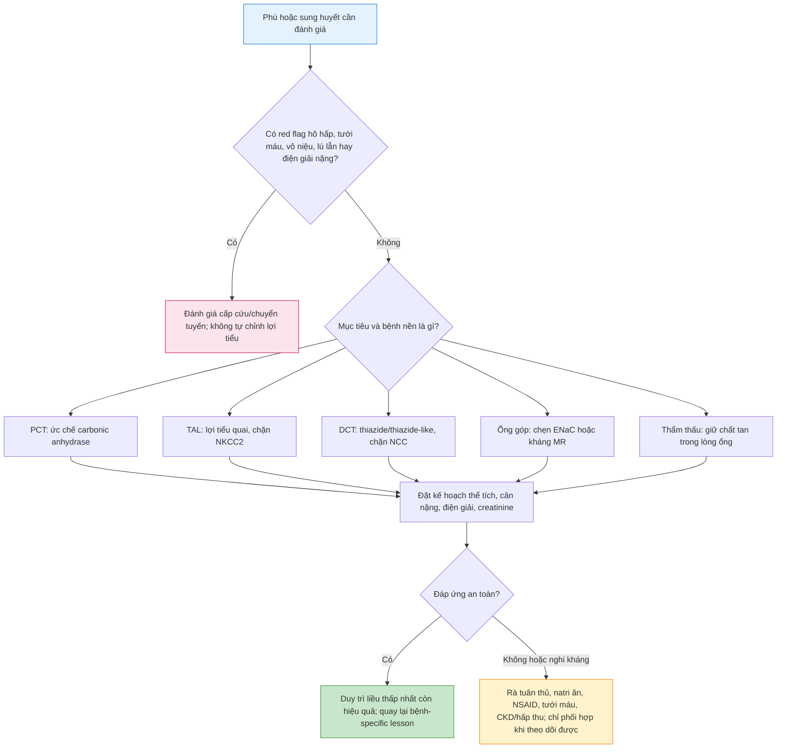
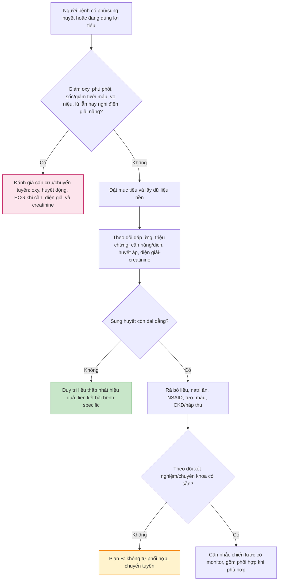

# Thuốc lợi tiểu: chọn theo nephron, theo dõi theo nguy cơ

**Mã bài:** Thuoc_loi_tieu  
**Ngày:** 2026-07-22 | **Chuyên khoa:** Nội khoa, Nội thận, Tim mạch, Hồi sức cấp cứu  
**Đối tượng:** Sinh viên y khoa, bác sĩ mới thực hành và người học cần một khung kê đơn an toàn  
**Bài tiên quyết:** [Sinh lý Nephron](../Sinh_ly_nephron/Sinh_ly_nephron_2026-07-22_RELEASE_v2.md)

**Revision phát hành:** RELEASE v2  
**Research brief khóa nguồn:** [Thuoc_loi_tieu_2026-07-22_RELEASE_v2_RESEARCH_BRIEF.md](Thuoc_loi_tieu_2026-07-22_RELEASE_v2_RESEARCH_BRIEF.md)  
**Phạm vi review:** artifact này chỉ dùng các PMID có trong research brief RELEASE v2; liều, ngưỡng và protocol bệnh-specific vẫn thuộc bài liên kết hoặc protocol cơ sở.

---

## 0. Tổng quan — thuốc lợi tiểu giải quyết gì và không giải quyết gì?

**Thuốc lợi tiểu** làm tăng bài tiết natri qua nước tiểu. Nước đi theo natri nên thuốc có thể giảm sung huyết hoặc phù ở người phù hợp. Đây không phải là thuốc “làm thận hoạt động” cho mọi người có tiểu ít, và không thay thế điều trị nguyên nhân của suy tim, xơ gan, CKD hoặc tăng huyết áp.

Để dùng an toàn, cần trả lời lần lượt: mục tiêu là gì; người bệnh có còn tưới máu và có red flag không; thuốc chặn đoạn nephron nào; đáp ứng được đo bằng gì; khi nào phải dừng hoặc chuyển tuyến. Ellison (2019) nhấn mạnh lợi tiểu được phân nhóm theo đoạn nephron và cơ chế vận chuyển chúng ức chế.

**Phạm vi bằng chứng:** đây là bài dược lý và ra quyết định an toàn theo cơ chế, không nhằm báo cáo tỷ lệ, prevalence hoặc incidence bệnh; các số liệu dịch tễ thuộc bài bệnh nguyên tương ứng.

### 0.1 Nền tảng tối thiểu cần dùng ngay

Nếu chưa học kỹ bài nền, dùng bốn mốc này trước:  
- **PCT:** tái hấp thu hàng loạt nước, natri và bicarbonate.  
- **TAL:** tái hấp thu NaCl qua NKCC2 nhưng không cho nước đi theo.  
- **DCT:** tái hấp thu NaCl qua NCC.  
- **Ống góp:** ENaC tinh chỉnh natri/kali; ADH tinh chỉnh nước.

Xem giải thích đầy đủ tại [Sinh lý Nephron](../Sinh_ly_nephron/Sinh_ly_nephron_2026-07-22_RELEASE_v2.md). Bài này chỉ nhắc lại đủ để dự đoán tác dụng, điện giải và nguy cơ của từng nhóm thuốc.

> 🚨 **BOX ĐỎ — dừng nhánh kê đơn thường quy:** giảm oxy hoặc phù phổi; sốc/dấu giảm tưới máu; vô niệu; lú lẫn; rối loạn điện giải có triệu chứng hoặc nghi thay đổi ECG; chức năng thận xấu nhanh; hoặc không thể theo dõi. Đánh giá cấp cứu/chuyển tuyến tại nơi có oxy, huyết động, điện giải, creatinine/eGFR và năng lực chuyên khoa. Không tự tăng lợi tiểu hoặc thêm thuốc thứ hai trong các tình huống này.

---

## 1. Nhắc nhanh nephron để dự đoán tác dụng thuốc

Một thuốc chặn tái hấp thu natri càng “sớm” hoặc ở đoạn tái hấp thu lớn, lượng natri đi xuống đoạn sau càng tăng. Đoạn sau có thể tái hấp thu bù; đó là một cơ chế của kháng lợi tiểu. Ngược lại, khi natri đến ống góp nhiều hơn, kali và hydrogen có thể thay đổi rõ hơn. Vì thế hiệu quả lợi tiểu luôn đi kèm nhu cầu theo dõi thể tích và điện giải.

**Quy tắc học:** không học “thuốc A gây kali gì” như danh sách rời rạc. Hãy hỏi: thuốc làm natri dừng ở đoạn nào; nước đi theo thế nào; natri đến ống góp tăng hay giảm; kali, magnesium, calcium và acid–base có xu hướng gì?

---

## 2. Bản đồ nhóm thuốc – đoạn nephron – hệ quả dự đoán được

### 2.1 Ức chế carbonic anhydrase: PCT

**Acetazolamide** ức chế carbonic anhydrase tại PCT, giảm tái hấp thu NaHCO3. Hệ quả là tăng bicarbonate niệu, natri niệu và xu hướng toan chuyển hóa. Nhóm này không phải lựa chọn chung cho mọi phù; các ứng dụng như tăng nhãn áp, bệnh độ cao hoặc một số bối cảnh acid–base thuộc chỉ định và protocol chuyên khoa.

- **Theo dõi cần nghĩ đến:** bicarbonate, kali, chức năng thận và tình trạng thể tích theo bối cảnh.
- **Bẫy:** thấy tiểu tăng không có nghĩa đã giải quyết nguyên nhân hoặc đã an toàn về acid–base.

### 2.2 Lợi tiểu quai: TAL

Furosemide, bumetanide và torsemide ức chế **NKCC2** ở TAL. Vì TAL giữ NaCl nhưng không giữ nước, thuốc gây lợi natri mạnh và làm giảm khả năng cô đặc nước tiểu. Mất điện thế lòng ống dương cũng làm tăng xu hướng bài tiết calcium và magnesium. Ellison (2019) mô tả nguy cơ giảm thể tích, hạ kali, hạ magnesium, kiềm chuyển hóa và độc tính tai tùy thuốc/liều/bối cảnh.

- **Mục tiêu phù hợp:** giảm sung huyết khi nguyên nhân và nơi điều trị đã được xác định; với suy tim, xem [IM-22 Suy tim](../IM-22_Suy_tim/IM-22_Suy_tim_2026-07-17.md).
- **Giới hạn an toàn:** đáp ứng phụ thuộc tưới máu thận, GFR, hấp thu, lượng natri ăn vào và thuốc phối hợp. Không có một liều đúng cho mọi người.
- **Theo dõi:** triệu chứng sung huyết, huyết áp/tưới máu, cân nặng hoặc dịch vào-ra, natri/kali/magnesium và creatinine/eGFR theo nguy cơ.

### 2.3 Thiazide và thiazide-like: DCT

Hydrochlorothiazide, indapamide, chlorthalidone và metolazone chặn **NCC** ở DCT. Chúng làm tăng bài tiết NaCl; khác với lợi tiểu quai, chúng có xu hướng tăng tái hấp thu calcium ở DCT. Nguy cơ thường gặp là hạ natri, hạ kali, hạ magnesium, tăng uric acid và giảm thể tích.

- **Mục tiêu phù hợp:** tăng huyết áp hoặc phù nhẹ trong bệnh cảnh phù hợp; thuật toán tăng huyết áp nằm ở [IM-20 Tăng huyết áp](../IM-20_Tang_huyet_ap/).
- **Ranh giới CKD:** khi GFR giảm, đáp ứng và nguy cơ đều thay đổi. Không áp dụng quy tắc eGFR cứng thay cho đánh giá thể tích, xét nghiệm và chuyên khoa; xem [IM-44 Bệnh thận mạn](../IM-44_Benh_than_man/IM-44_Benh_than_man_2026-07-17.md).

### 2.4 Tiết kiệm kali: ống góp

Có hai cách chính: **spironolactone/eplerenone** đối kháng thụ thể mineralocorticoid (MR), còn **amiloride/triamterene** chẹn trực tiếp ENaC. Cả hai làm giảm tái hấp thu natri đoạn cuối và giảm bài tiết kali/hydrogen. Vì vậy lợi ích giữ kali đi kèm nguy cơ **tăng kali máu** và toan chuyển hóa, nhất là ở CKD hoặc khi phối hợp thuốc ảnh hưởng hệ renin–angiotensin.

- **Mục tiêu phù hợp:** chỉ định phụ thuộc bệnh nền. Với cổ trướng do xơ gan, dùng bài [IM-40 Xơ gan tăng áp cửa](../IM-40_Xo_gan_tang_ap_cua/IM-40_Xo_gan_tang_ap_cua_2026-07-19.md); với HFrEF, dùng IM-22.
- **Bẫy:** “giữ kali” không nghĩa là tự thêm thuốc khi chưa có kali và creatinine nền hoặc khi không thể kiểm lại sớm.

### 2.5 Lợi tiểu thẩm thấu

Mannitol làm tăng chất tan trong dịch lòng ống, cản tái hấp thu nước ở các đoạn thấm nước. Việc tăng dịch trong lòng mạch trước khi có lợi tiểu có thể làm nặng quá tải tuần hoàn. Do đó tăng áp lực nội sọ, tăng nhãn áp hoặc suy tim/phù phổi là những bối cảnh cần quyết định chuyên khoa, không phải lựa chọn ngoại trú thông thường.

---

## 3. Chọn thuốc theo mục tiêu — link thay vì sao chép thuật toán bệnh

### 3.1 Tăng huyết áp

Thiazide/thiazide-like có thể là một thành phần trong chiến lược hạ áp, nhưng lựa chọn đầu tay, xác nhận huyết áp, bệnh kèm, thai kỳ và mục tiêu nằm ở [IM-20 Tăng huyết áp](../IM-20_Tang_huyet_ap/). Bài này chỉ trả lời cơ chế: NCC bị chặn ở DCT làm giảm tái hấp thu NaCl và đòi hỏi theo dõi natri/kali.

### 3.2 Phù và suy tim

Sung huyết/giữ dịch là vấn đề trung tâm của suy tim mất bù; Wu và cộng sự (2024) nêu lợi tiểu quai là nhóm ưu tiên để giảm triệu chứng sung huyết. Đường dùng, điều chỉnh cường độ, đánh giá huyết động và theo dõi tại viện thuộc [IM-22 Suy tim](../IM-22_Suy_tim/IM-22_Suy_tim_2026-07-17.md). Phù phổi, giảm oxy hoặc giảm tưới máu luôn thuộc BOX ĐỎ.

### 3.3 Cổ trướng do xơ gan

Cơ chế giữ natri của aldosterone giúp giải thích vai trò của đối kháng MR. Nhưng bệnh nhân cổ trướng có nguy cơ hạ natri, suy thận, tăng kali/hạ kali và bệnh não gan; mọi tỷ lệ phối hợp, liều và mốc dừng thuộc [IM-40 Xơ gan tăng áp cửa](../IM-40_Xo_gan_tang_ap_cua/IM-40_Xo_gan_tang_ap_cua_2026-07-19.md). Lú lẫn mới xuất hiện không phải lý do chỉ tăng lợi tiểu.

### 3.4 CKD, tăng calcium niệu và tăng áp lực nội sọ/nhãn áp

- **CKD:** giảm chức năng thận làm thay đổi lượng thuốc đến lòng ống và nguy cơ điện giải. Xem IM-44 để phân tầng/chuyển tuyến.
- **Tăng calcium niệu:** thiazide có xu hướng giảm calcium niệu nhưng điều tra sỏi và chỉ định cần bài bệnh-specific/chuyên khoa.
- **Tăng áp lực nội sọ hoặc nhãn áp:** acetazolamide/mannitol không phải “thuốc lợi tiểu cho phù” mà là thuốc trong đường xử trí chuyên khoa có chống chỉ định và theo dõi riêng.

---

## 4. Kê đơn thực hành: từ mục tiêu đến dừng/escalate

### 4.1 Quy trình bảy bước

1. **Đặt mục tiêu quan sát được:** giảm sung huyết, hỗ trợ kiểm soát huyết áp hoặc mục tiêu chuyên khoa rõ ràng. “Tiểu nhiều hơn” không đủ là mục tiêu.
2. **Sàng lọc phù hợp/chống chỉ định:** hỏi triệu chứng red flag, đánh giá huyết áp/tưới máu, vô niệu, bệnh thận/gan/tim và thai kỳ khi phù hợp.
3. **Lấy dữ liệu nền:** cân nặng hoặc dịch vào-ra, huyết áp tư thế khi cần, natri, kali, creatinine/eGFR; thêm bicarbonate, magnesium hoặc xét nghiệm khác tùy nhóm thuốc.
4. **Chọn nhóm theo đoạn nephron và bệnh cảnh:** dùng bài liên kết cho thuật toán bệnh-specific; dùng protocol cơ sở cho liều, đường và thời điểm.
5. **Đo đáp ứng có cấu trúc:** triệu chứng, phù, cân nặng/dịch vào-ra, tưới máu và xét nghiệm. Không đánh giá chỉ bằng lượng nước tiểu.
6. **Rà an toàn:** hạ huyết áp, giảm tưới máu, thay đổi natri/kali/magnesium, acid–base và creatinine.
7. **Dừng/escalate đúng lúc:** red flag hoặc không thể theo dõi → đánh giá khẩn/chuyển tuyến; không thêm thuốc thứ hai theo thói quen.

### 4.2 Plan A / Plan B

- **Plan A — đủ nguồn lực:** có xét nghiệm điện giải/creatinine đúng lúc, có khả năng theo dõi cân nặng–dịch–huyết áp và hội chẩn khi kháng lợi tiểu.
- **Plan B — thiếu nguồn lực:** không khởi/tăng phối hợp nguy cơ cao nếu không kiểm được kali/creatinine. Làm những việc vẫn làm được: rà thuốc, hạn chế natri theo bệnh-specific guidance, đo dấu sinh tồn, ghi lượng vào-ra/cân nặng và chuyển tuyến khi bất thường hoặc không chắc.

---

## 5. Kháng lợi tiểu và khóa nephron nối tiếp

**Kháng lợi tiểu** là đáp ứng giảm hơn mong đợi, không đơn giản là “chưa tiểu nhiều”. Trước khi kết luận, Ellison (2019) gợi các cơ chế có thể sửa được: không tuân thủ, lượng natri ăn vào cao, NSAID, giảm tưới máu, CKD, hấp thu đường uống kém, giảm bài tiết thuốc vào lòng ống và tái hấp thu bù ở đoạn xa.

### 5.1 Bảng rà trước khi thêm thuốc

| Câu hỏi | Nếu có | Hành động an toàn |
|---|---|---|
| Bỏ liều hoặc ăn mặn? | Có thể làm cân bằng natri vẫn dương | Sửa nguyên nhân, đo lại cân nặng/dịch vào-ra; không vội thêm thuốc. |
| Có NSAID/thuốc cản đáp ứng? | Có thể giảm bài tiết/hiệu quả lợi tiểu và tăng nguy cơ thận | Rà và ngừng/thay thế khi phù hợp; đánh giá thận. |
| Có giảm tưới máu, sốc hoặc AKI? | Tăng nguy cơ tổn thương thận khi ép lợi tiểu | Đi BOX ĐỎ hoặc hội chẩn. |
| Có thể làm xét nghiệm và theo dõi sát? | Quyết định mức an toàn của phối hợp | Không đủ nguồn lực: chuyển tuyến thay vì phối hợp mù quáng. |

### 5.2 Sequential nephron blockade

Khi sung huyết còn dai dẳng sau khi đã loại trừ các nguyên nhân trên, có thể cần chặn thêm NCC ở DCT bằng thiazide/thiazide-like cùng lợi tiểu quai. Lý do là giảm tái hấp thu natri bù ở đoạn xa. Đây là **phối hợp nguy cơ cao**: nguy cơ giảm thể tích, hạ natri, hạ kali, hạ magnesium và tăng creatinine tăng lên. Vì vậy nó chỉ phù hợp khi có chỉ định rõ và một kế hoạch theo dõi/can thiệp, thường trong môi trường chuyên môn phù hợp.

---

## 6. Tác dụng phụ, tương tác và nhóm đặc biệt

### 6.1 Hướng tác dụng phụ để dự đoán, không học thuộc rời rạc

| Nhóm | Hướng thay đổi cần cảnh giác | Bẫy quan trọng |
|---|---|---|
| Quai | giảm thể tích; hạ K/Mg; tăng thải Ca; có thể kiềm chuyển hóa | NSAID, CKD và giảm tưới máu làm đáp ứng/an toàn khó dự đoán. |
| Thiazide | hạ Na/K/Mg; giảm calcium niệu; có thể tăng uric acid | Phối hợp với quai làm nguy cơ mất điện giải mạnh hơn. |
| Tiết kiệm K | tăng K, có thể toan chuyển hóa | CKD và ACEi/ARB/MRA làm tăng nguy cơ tăng kali. |
| Ức chế CA | mất bicarbonate và kali | Không dùng như thuốc “giảm phù chung”. |
| Thẩm thấu | thay đổi thể tích nhanh | Có thể làm nặng quá tải tuần hoàn trước lợi tiểu. |

### 6.2 Tương tác cần rà

- **NSAID:** có thể làm giảm đáp ứng lợi tiểu và làm xấu huyết động thận.
- **Thuốc ảnh hưởng hệ renin–angiotensin và thuốc tiết kiệm kali:** tăng nguy cơ tăng kali, đặc biệt ở CKD.
- **Nhiều thuốc làm tụt huyết áp hoặc mất dịch:** tăng nguy cơ chóng mặt, té ngã và giảm tưới máu.
- **Bệnh nhân cao tuổi, CKD, xơ gan, suy tim hoặc có hấp thu kém:** không phải “liều chuẩn thấp hơn/cao hơn” một cách tự động; họ cần đánh giá và theo dõi sát hơn.

---

## 7. Lưu đồ red flags và hành động an toàn

**Diễn giải:**
1. Red flags luôn được xử trí trước vì nguy cơ tử vong/tổn thương cơ quan không chờ đáp ứng lợi tiểu.
2. Người ổn định cần dữ liệu nền trước khi thay đổi thuốc để sau đó biết thay đổi là hiệu quả, mất thể tích hay độc tính.
3. “Không đáp ứng” phải dẫn đến rà nguyên nhân sửa được trước, đặc biệt natri ăn, NSAID và tưới máu.
4. Thiếu xét nghiệm không phải lý do để thêm thiazide hoặc MRA; đó là ngưỡng Plan B để chuyển tuyến.

---

## 8. Cases lâm sàng

### Case 1 — phù ổn định, không red flag

**Bệnh nhân:** phù mắt cá nhẹ, không khó thở, huyết áp ổn, vẫn tiểu được.  
**Câu hỏi:** làm thế nào đi từ mục tiêu đến theo dõi?

1. **Nhận diện nguy cơ:** xác nhận không giảm oxy, đau ngực, lú lẫn, vô niệu, tụt huyết áp hay dấu giảm tưới máu.
2. **Dữ kiện đổi quyết định:** bệnh nền, cân nặng theo chuỗi, huyết áp, thuốc đang dùng, natri/kali/creatinine nền và nguyên nhân phù.
3. **Hành động ngay:** xác định mục tiêu và dùng bài bệnh-specific để chọn nhóm/đường/chiến lược; không dùng một “liều phù” chung.
4. **Theo dõi:** cân nặng, triệu chứng, phù, huyết áp và điện giải–creatinine theo nguy cơ/protocol.
5. **Vì sao không chọn phương án sai:** chỉ cho thuốc vì nhìn thấy phù có thể bỏ qua suy tĩnh mạch, thuốc gây phù, CKD, suy tim hoặc giảm thể tích hiệu quả.

### Case 2 — phù kèm khó thở và giảm oxy

**Bệnh nhân:** phù tăng nhanh, khó thở lúc nằm, giảm oxy.  

1. **Nhận diện nguy cơ:** đây là red flag, có thể là phù phổi hoặc bệnh cấp khác.
2. **Dữ kiện đổi quyết định:** dấu sinh tồn, tưới máu, tim phổi, ECG khi cần, điện giải, creatinine và đánh giá cấp cứu định hướng đường điều trị.
3. **Hành động ngay:** đi nhánh cấp cứu có hỗ trợ hô hấp và theo dõi; lợi tiểu nếu phù hợp phải nằm trong kế hoạch điều trị có monitor.
4. **Theo dõi/chuyển tuyến:** đánh giá đáp ứng hô hấp, dịch vào-ra, tưới máu và điện giải–creatinine; ICU/chuyển tuyến khi không ổn định.
5. **Vì sao không chọn phương án sai:** tự tăng lợi tiểu tại nhà/trạm không xử lý thiếu oxy, sốc hoặc nguyên nhân nguy hiểm khác.

### Case 3 — sung huyết dai dẳng sau lợi tiểu quai

**Bệnh nhân:** đang dùng lợi tiểu quai nhưng cân nặng/phù không cải thiện; không có red flag ngay lúc đánh giá.  

1. **Nhận diện nguy cơ:** trước hết xác nhận huyết áp/tưới máu, lượng nước tiểu, triệu chứng và xét nghiệm để bảo đảm vẫn ổn định.
2. **Dữ kiện đổi quyết định:** hỏi bỏ liều, ăn mặn, NSAID, thuốc khác, CKD, hấp thu đường uống và thay đổi gần đây của creatinine/điện giải.
3. **Hành động ngay:** sửa yếu tố cản trở; dùng thuật toán IM-22/IM-44 theo bệnh nền. Không mặc định đó là “cần thêm thuốc”.
4. **Theo dõi/chuyển tuyến:** nếu cần sequential blockade, chỉ làm khi có xét nghiệm và năng lực theo dõi; nếu không, Plan B là chuyển tuyến/hội chẩn.
5. **Vì sao không chọn phương án sai:** thêm thiazide khi chưa rà NSAID, natri ăn hay tưới máu có thể biến kháng lợi tiểu giả thành hạ natri/hạ kali hoặc AKI thật.

---

## 9. Tips thực hành

1. Lợi tiểu tốt là **giảm sung huyết an toàn**, không phải số lần đi tiểu cao nhất.
2. Hãy nối từng nhóm thuốc với một đoạn nephron trước khi dự đoán điện giải.
3. Cân nặng theo chuỗi và dịch vào-ra hữu ích hơn một con số đơn lẻ.
4. Luôn rà NSAID trước khi gọi là kháng lợi tiểu.
5. Kali, magnesium và bicarbonate có thể giải thích vì sao triệu chứng hoặc hạ kali dai dẳng.
6. MRA/ENaC blocker cần kali và creatinine nền cùng kế hoạch kiểm lại.
7. Phối hợp quai–thiazide là chiến lược có monitor, không phải mẹo ngoại trú.
8. CKD làm thay đổi cả hiệu quả lẫn an toàn; xem IM-44.
9. Lú lẫn ở xơ gan/cổ trướng là dấu cần đánh giá, không chỉ tăng lợi tiểu; xem IM-40.
10. Giảm oxy, sốc, vô niệu hoặc rối loạn điện giải nặng luôn thắng nhánh thường quy.

---

## 10. Tổng kết — 10 điểm cần nhớ

1. Lợi tiểu tăng thải natri; nước đi theo natri.
2. Chọn thuốc phải bắt đầu từ mục tiêu, thể tích/tưới máu và đoạn nephron.
3. Quai chặn NKCC2 ở TAL; thiazide chặn NCC ở DCT.
4. Chẹn ENaC/kháng MR ở ống góp giữ kali nhưng tăng nguy cơ tăng kali.
5. Điều trị không chỉ là chọn thuốc: phải có dữ liệu nền, thước đo đáp ứng và mốc dừng.
6. Suy tim, tăng huyết áp, xơ gan cổ trướng và CKD cần bài thuật toán riêng.
7. Kháng lợi tiểu trước hết là vấn đề cần rà tuân thủ, natri ăn, NSAID, tưới máu, CKD và hấp thu.
8. Sequential blockade có thể hữu ích nhưng làm tăng nguy cơ điện giải/AKI và cần monitor.
9. Thiếu nguồn lực xét nghiệm là lý do chuyển tuyến, không phải lý do tăng thuốc mù quáng.
10. Phù phổi, sốc, vô niệu, lú lẫn và rối loạn điện giải nặng là red flags cấp cứu.

### 🛑 Tự kiểm tra cuối bài

> 1. Vì sao lợi tiểu quai và thiazide đều có thể làm kali giảm nhưng tác động ở hai đoạn khác nhau?  
> 2. Trước khi thêm thiazide cho người chưa đáp ứng với lợi tiểu quai, bốn nhóm yếu tố cần rà là gì?  
> 3. Một người dùng spironolactone có CKD: hai dữ liệu an toàn không thể bỏ qua là gì?  
>
> *(Đáp án: 1. Cả hai làm tăng natri đến đoạn xa, tạo điều kiện bài tiết kali; quai chặn TAL, thiazide chặn DCT. 2. Tuân thủ/natri ăn, NSAID/thuốc kèm, tưới máu–CKD/hấp thu và khả năng theo dõi. 3. Kali và creatinine/eGFR, kèm triệu chứng/thuốc phối hợp.)*

---

## 11. Tài liệu tham khảo

1. Ellison DH. *Clinical Pharmacology in Diuretic Use*. *Clinical Journal of the American Society of Nephrology*. PMID: 30936153. [ABSTRACT VERIFIED]
2. Wu L, Rodriguez M, El Hachem K, et al. *Diuretic Treatment in Heart Failure: A Practical Guide for Clinicians*. *Journal of Clinical Medicine*. PMID: 39124738. [ABSTRACT VERIFIED]
3. KDIGO CKD Work Group. *KDIGO 2024 Clinical Practice Guideline for the Evaluation and Management of Chronic Kidney Disease*. *Kidney International*. PMID: 38490803. [GUIDELINE VERIFIED]
4. Biggins SW, Angeli P, Garcia-Tsao G, et al. *Diagnosis, Evaluation, and Management of Ascites, Spontaneous Bacterial Peritonitis and Hepatorenal Syndrome: 2021 Practice Guidance by the American Association for the Study of Liver Diseases*. *Hepatology*. PMID: 33942342. [GUIDELINE VERIFIED]

**— Hết bài học ngày 2026-07-22 —**
