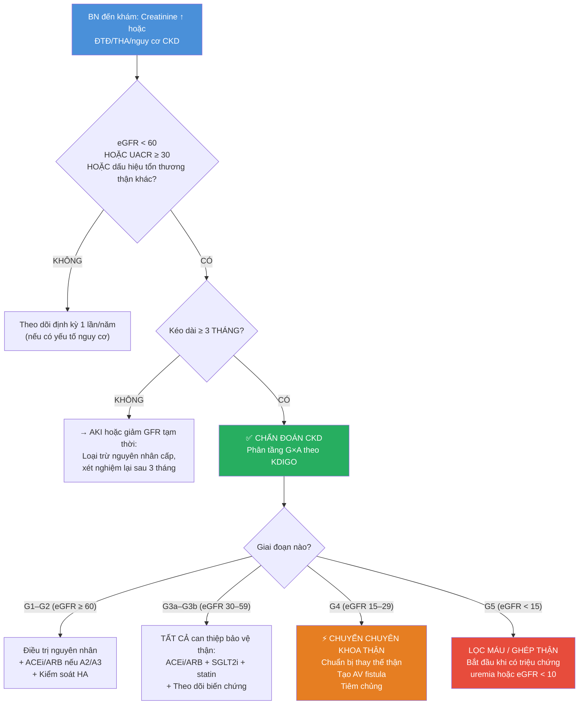

# IM-44: BỆNH THẬN MẠN (CHRONIC KIDNEY DISEASE — CKD)

**Cấp độ:** L2 Standard | **Block:** 5 — Thận | **Ngày:** 2026-07-17
**Guideline chính:** KDIGO 2024 CKD Guideline (Kidney International, 03/2024) | NICE NG203 (08/2021)

---

> **Mục tiêu bài học:** Sau bài này, học viên có thể:
> 1. Định nghĩa và phân tầng CKD theo bảng nhiệt KDIGO (G1–G5 × A1–A3).
> 2. Nhận diện và xử trí 5 biến chứng chính: thiếu máu, CKD-MBD, toan chuyển hóa, tăng kali máu, biến cố tim mạch.
> 3. Kê đơn thuốc bảo vệ thận (ACEi/ARB, SGLT2i) và theo dõi an toàn.
> 4. Xác định thời điểm chuyển tuyến chuyên khoa thận và chuẩn bị thay thế thận.
> 5. Tránh các thuốc và hành vi gây độc thận ở bệnh nhân CKD.

> **Prerequisites:** IM-01–IM-06 (chưa có). Bài này sẽ nhắc nhanh giải phẫu–sinh lý thận và cách đọc creatinine/eGFR trong Section 1.

---

## 0. TỔNG QUAN

**CKD là "kẻ giết người thầm lặng" — không triệu chứng cho đến giai đoạn muộn.**

Bệnh thận mạn ảnh hưởng khoảng **10% dân số toàn cầu** (~850 triệu người), và là nguyên nhân tử vong đứng thứ 12 trên thế giới. Tại Việt Nam, CKD cực kỳ phổ biến — hai nguyên nhân hàng đầu là **tăng huyết áp (THA)** và **đái tháo đường (ĐTĐ)**, theo sát sau là viêm cầu thận mạn (đặc biệt bệnh thận IgA rất phổ biến ở châu Á).

**Tại sao CKD quan trọng với bác sĩ tuyến tỉnh?**

Bạn là người **phát hiện đầu tiên**. Bệnh nhân đến khám vì THA, ĐTĐ, hoặc tình cờ làm xét nghiệm — và bạn thấy creatinine hơi cao. Hành động của bạn trong 5 phút tiếp theo sẽ quyết định bệnh nhân có phải chạy thận nhân tạo 10 năm sau hay không.

**Ba sự thật gây sốc về CKD:**
- **90% bệnh nhân CKD giai đoạn 3 không biết mình bị bệnh thận.** Họ chỉ thấy "creatinine hơi cao" và bác sĩ nói "không sao đâu."
- **Nguyên nhân tử vong số 1 ở bệnh nhân CKD không phải suy thận — mà là bệnh tim mạch.** CKD là yếu tố nguy cơ tim mạch tương đương với ĐTĐ.
- **SGLT2i và ACEi/ARB có thể làm chậm tiến triển CKD 30–40%** — nhưng phần lớn bệnh nhân CKD trên thế giới không được dùng các thuốc này.

**Mục tiêu của bài này:** Trang bị cho bạn kiến thức và công cụ để không bỏ sót CKD, phân tầng đúng, xử trí biến chứng, bảo vệ thận bằng thuốc, và biết khi nào cần chuyển bác sĩ chuyên khoa thận.

---

### 0.1 Nền tảng tối thiểu cần dùng ngay

Thận lọc máu qua **cầu thận (glomerulus)** rồi các ống thận điều chỉnh nước và điện giải. **Creatinine** là chất thải dùng để ước tính **eGFR**; eGFR thấp gợi giảm chức năng lọc nhưng một kết quả bất thường có thể là tổn thương thận cấp hoặc thay đổi tạm thời. **UACR** đo albumin niệu, cho biết hàng rào lọc bị tổn thương. CKD chỉ được xác nhận khi bất thường cấu trúc/chức năng tồn tại từ ba tháng trở lên. Suy giảm eGFR nhanh, tăng kali có thay đổi ECG, phù phổi, triệu chứng urê huyết hoặc nghi bệnh cầu thận cần nhánh cấp cứu/chuyên khoa, không chờ phân tầng ngoại trú.

> **Nguồn:** KDIGO CKD 2024, DOI 10.1016/j.kint.2023.10.018. [GUIDELINE VERIFIED]

## 1. ĐỊNH NGHĨA & PHÂN TẦNG [CỐT LÕI]

### 1.0 Nhắc nhanh: Giải phẫu–sinh lý thận

Thận là hai cơ quan hình hạt đậu, mỗi bên chứa khoảng **1 triệu nephron** — đơn vị chức năng cơ bản. Mỗi nephron gồm:

- **Cầu thận (glomerulus):** Búi mao mạch nơi máu được LỌC qua màng lọc cầu thận. Dịch lọc đi vào khoang Bowman.
- **Ống thận (tubule):** Ống lượn gần → quai Henle → ống lượn xa → ống góp. Tại đây nước, điện giải, glucose, amino acid được TÁI HẤP THU hoặc BÀI TIẾT.

> 🔑 **Công thức lâm sàng quan trọng nhất:** eGFR. Mức lọc cầu thận ước tính (estimated Glomerular Filtration Rate) là chỉ số TỐT NHẤT để đánh giá chức năng thận. Bình thường: ≥ 90 mL/min/1.73m².

**Creatinine huyết thanh:** Sản phẩm thoái hóa của creatine trong cơ. Được lọc tự do qua cầu thận và KHÔNG được tái hấp thu (có bài tiết nhẹ ở ống thận). Creatinine tăng khi GFR giảm — nhưng **creatinine chỉ bắt đầu tăng khi GFR đã mất ≥ 50%**. Đây là lý do creatinine "bình thường" không loại trừ CKD giai đoạn sớm.

### 1.1 Định nghĩa CKD theo KDIGO 2024

Theo KDIGO 2024, CKD được định nghĩa là **bất thường cấu trúc hoặc chức năng thận kéo dài ≥ 3 THÁNG**, có ảnh hưởng đến sức khỏe.

**Tiêu chuẩn chẩn đoán CKD (≥ 1 tiêu chuẩn, kéo dài ≥ 3 tháng):**

| # | Tiêu chuẩn | Ví dụ |
|---|---|---|
| 1 | **eGFR < 60 mL/min/1.73m²** | Giai đoạn G3a–G5 |
| 2 | **Albumin niệu ≥ 30 mg/g (UACR)** | A2 hoặc A3 |
| 3 | **Bất thường cặn lắng nước tiểu** | Hồng cầu niệu, trụ hồng cầu, trụ bạch cầu |
| 4 | **Bất thường điện giải/ống thận** | Toan ống thận, đái tháo nhạt do thận |
| 5 | **Bất thường mô học** | Sinh thiết thận: xơ hóa cầu thận, xơ hóa mô kẽ |
| 6 | **Bất thường cấu trúc trên hình ảnh học** | Thận teo nhỏ, nang thận, thận ứ nước, sẹo thận |
| 7 | **Tiền sử ghép thận** | Đã ghép thận = CKD (bất kể eGFR) |

> ⚠️ **BẪY HAY GẶP NHẤT:** "eGFR 55 = CKD giai đoạn 3" → **SAI!** Nếu eGFR 55 nhưng KHÔNG có albumin niệu VÀ không có bất kỳ dấu hiệu tổn thương thận nào khác, và tình trạng này không kéo dài ≥ 3 tháng → **CHƯA ĐỦ** tiêu chuẩn chẩn đoán CKD. Đây chỉ là "giảm GFR" (có thể do tuổi già, mất nước, dùng NSAIDs...). Luôn xác nhận bằng xét nghiệm LẦN 2 sau ≥ 3 tháng.

### 1.2 Phân tầng CKD: Bảng nhiệt KDIGO (Heat Map)

KDIGO phân tầng CKD theo **HAI TRỤC**:

#### Trục G — eGFR (mL/min/1.73m²)

| Giai đoạn | eGFR | Mô tả |
|---|---|---|
| **G1** | ≥ 90 | eGFR bình thường hoặc cao + có dấu hiệu tổn thương thận |
| **G2** | 60–89 | eGFR giảm nhẹ + có dấu hiệu tổn thương thận |
| **G3a** | 45–59 | eGFR giảm nhẹ–trung bình |
| **G3b** | 30–44 | eGFR giảm trung bình–nặng |
| **G4** | 15–29 | eGFR giảm nặng |
| **G5** | < 15 | Suy thận (kidney failure) |

#### Trục A — Albumin niệu (UACR, mg/g)

| Phân độ | UACR (mg/g) | Mô tả |
|---|---|---|
| **A1** | < 30 | Bình thường đến tăng nhẹ |
| **A2** | 30–300 | Tăng trung bình (trước đây gọi "microalbumin niệu") |
| **A3** | > 300 | Tăng nặng (trước đây gọi "macroalbumin niệu") |

#### Bảng nhiệt KDIGO — Màu sắc = Mức độ nguy cơ

| | **A1** | **A2** | **A3** |
|---|---|---|---|
| **G1** | 🟢 Thấp (nếu có tổn thương thận) | 🟡 Trung bình | 🔴 Rất cao |
| **G2** | 🟢 Thấp (nếu có tổn thương thận) | 🟡 Trung bình | 🔴 Rất cao |
| **G3a** | 🟡 Trung bình | 🔴 Cao | 🔴 Rất cao |
| **G3b** | 🔴 Cao | 🔴 Rất cao | 🔴 Rất cao |
| **G4** | 🔴 Rất cao | 🔴 Rất cao | 🔴 Rất cao |
| **G5** | 🔴 Rất cao | 🔴 Rất cao | 🔴 Rất cao |

> 🔑 **"Tại sao phân tầng quan trọng?"** Vì nguy cơ tim mạch và tiến triển CKD tăng theo **CẢ G và A**. Một bệnh nhân G2A3 (eGFR 70 + UACR 500) có nguy cơ TIẾN TRIỂN và BIẾN CỐ TIM MẠCH CAO HƠN bệnh nhân G3bA1 (eGFR 35 + không albumin niệu). Màu sắc trên bảng nhiệt = mức độ tích cực trong điều trị.

### 1.3 Công thức eGFR

**CKD-EPI 2021 (không dùng race):** Công thức chuẩn hiện nay. Dùng creatinine huyết thanh, tuổi, giới tính. KHÔNG còn dùng hệ số điều chỉnh chủng tộc.

- **CKD-EPI creatinine (2021):** Chính xác nhất khi eGFR 30–90. Thiếu chính xác ở eGFR > 90 hoặc ở người có khối lượng cơ bất thường (suy mòn, tập thể hình, cụt chi).
- **CKD-EPI cystatin C:** Cystatin C là protein do TẤT CẢ tế bào có nhân sản xuất với tốc độ hằng định. Không phụ thuộc khối lượng cơ → chính xác hơn creatinine ở người suy mòn, xơ gan, hoặc tập thể hình. Dùng khi cần xác nhận CKD ở bệnh nhân có eGFR creatinine "vùng xám" (45–59 không albumin niệu).
- **Tại VN:** Chủ yếu dùng CKD-EPI creatinine (có sẵn, rẻ). Cystatin C chưa phổ biến ở tuyến tỉnh.

> ⚠️ **eGFR < 60 KHÔNG tự động = CKD.** Phải xác nhận kéo dài ≥ 3 tháng +/ hoặc có dấu hiệu tổn thương thận khác.

---

## 2. NGUYÊN NHÂN & SINH LÝ BỆNH [CỐT LÕI]

### 2.1 Nguyên nhân hàng đầu tại Việt Nam

| Nguyên nhân | Tần suất tại VN | Ghi chú |
|---|---|---|
| **Đái tháo đường** | #1 (~40%) | Bệnh thận do ĐTĐ: dày màng đáy cầu thận → xơ hóa cầu thận dạng nốt (Kimmelstiel-Wilson) |
| **Tăng huyết áp** | #2 (~25%) | Xơ cứng động mạch thận (nephrosclerosis) |
| **Viêm cầu thận mạn** | #3 (~20%) | IgA nephropathy cực kỳ phổ biến ở châu Á; lupus, FSGS, membranous |
| **Sỏi thận/bệnh thận tắc nghẽn** | #4 (~5%) | Sỏi san hô, hẹp niệu quản |
| **Bệnh thận bẩm sinh/di truyền** | #5 (~5%) | Thận đa nang (ADPKD), hội chứng Alport |
| **Khác** | ~5% | Thuốc (NSAIDs, aminoglycoside, TCM không rõ nguồn gốc tại VN!), độc chất |

### 2.2 Cơ chế tiến triển CKD: "Vòng xoắn chết"

**Nguyên lý quan trọng nhất trong sinh lý bệnh CKD:** Bất kể nguyên nhân khởi đầu là gì (ĐTĐ, THA, viêm cầu thận...), một khi số nephron mất đi vượt ngưỡng (~50%), CKD sẽ tiến triển theo cơ chế CHUNG, không phụ thuộc nguyên nhân ban đầu.

```
Mất nephron
    ↓
Các nephron còn lại TĂNG LỌC BÙ (hyperfiltration)
    ↓
Tăng áp lực mao mạch cầu thận (glomerular hypertension)
    ↓
Tổn thương tế bào có chân (podocyte) → protein niệu
    ↓
Xơ hóa cầu thận (glomerulosclerosis) + xơ hóa mô kẽ (tubulointerstitial fibrosis)
    ↓
Mất THÊM nephron → VÒNG XOẮN LẶP LẠI
```

**Đây là lý do ACEi/ARB và SGLT2i bảo vệ thận:** Cả hai đều GIẢM áp lực mao mạch cầu thận:
- **ACEi/ARB:** Giãn tiểu động mạch RA (efferent) → giảm áp lực trong cầu thận.
- **SGLT2i:** Co tiểu động mạch VÀO (afferent) qua phản hồi ống thận–cầu thận (tubuloglomerular feedback) → giảm hyperfiltration.

> 🔑 **So sánh dễ nhớ:** "ACEi/ARB mở cửa sau (efferent), SGLT2i đóng cửa trước (afferent). Cả hai đều làm giảm áp lực trong nhà (cầu thận)."

### 2.3 Hậu quả của CKD: Độc tố uremic (uremic toxins)

Khi thận suy, hàng trăm chất thải tích tụ trong máu — gọi là **độc tố uremic**. Đây là nguyên nhân gây tổn thương đa cơ quan:

| Cơ quan bị ảnh hưởng | Hậu quả |
|---|---|
| **Tim mạch** | Xơ vữa tăng tốc, vôi hóa mạch máu, phì đại thất trái, suy tim |
| **Máu** | ↓ EPO → thiếu máu; ↓ chức năng tiểu cầu |
| **Xương** | ↓ Calcitriol → ↓ Ca, ↑ P, ↑ PTH → CKD-MBD |
| **Thần kinh** | Bệnh thần kinh do uremia, rối loạn giấc ngủ, "uremic frost" |
| **Miễn dịch** | Suy giảm miễn dịch → nhiễm trùng (nguyên nhân tử vong #2 sau tim mạch) |
| **Nội tiết** | ↓ Testosterone, rối loạn kinh nguyệt, kháng insulin |

---

### BOX ĐỎ — khi phải rời nhánh thường quy

> **Thiểu niệu/vô niệu mới, phù phổi, tăng kali có thay đổi ECG, lú lẫn/triệu chứng urê huyết, tăng creatinine nhanh, tăng huyết áp cấp cứu hoặc nghi viêm cầu thận tiến triển nhanh → nguy cơ AKI/biến chứng đe dọa tính mạng → đánh giá cấp cứu, ECG–điện giải và hội chẩn/chuyển thận–hồi sức.** Không chờ xác nhận ba tháng để xử trí.

## 3. CHẨN ĐOÁN & THEO DÕI [CỐT LÕI]

### 3.1 Xét nghiệm chẩn đoán CKD

**Bộ xét nghiệm tối thiểu khi nghi ngờ CKD:**

| Xét nghiệm | Ý nghĩa | Tần suất |
|---|---|---|
| **Creatinine huyết thanh + eGFR (CKD-EPI)** | Đánh giá mức lọc cầu thận | Mỗi lần khám |
| **UACR (urine albumin-to-creatinine ratio)** | Phát hiện albumin niệu — dấu hiệu tổn thương thận SỚM NHẤT | Ít nhất 1 lần/năm, 2 lần/năm nếu đã có CKD |
| **Tổng phân tích nước tiểu + cặn lắng** | Phát hiện hồng cầu niệu, trụ niệu, bạch cầu niệu | Chẩn đoán ban đầu |
| **Siêu âm thận** | Kích thước thận, phân biệt CKD cấp–mạn, phát hiện tắc nghẽn, nang | Chẩn đoán ban đầu, sau đó khi có chỉ định |
| **Điện giải đồ (Na⁺, K⁺, Cl⁻, HCO₃⁻)** | Phát hiện toan chuyển hóa, tăng kali | Mỗi lần khám nếu G3b+ |
| **Ca²⁺, P, PTH, vitamin D** | Tầm soát CKD-MBD | Bắt đầu từ G3b |

> 🔑 **UACR là gì và tại sao quan trọng?** UACR = tỉ lệ albumin/creatinine trong nước tiểu (mẫu nước tiểu ngẫu nhiên, sáng sớm tốt nhất). Albumin niệu là dấu hiệu sớm nhất của tổn thương cầu thận — xuất hiện TRƯỚC KHI eGFR giảm. Đây là lý do KDIGO khuyến cáo tầm soát UACR ở mọi bệnh nhân ĐTĐ, THA, hoặc có yếu tố nguy cơ CKD.

### 3.2 Tần suất theo dõi theo giai đoạn KDIGO 2024

| Giai đoạn | eGFR (mL/min) | Tần suất theo dõi (tối thiểu) |
|---|---|---|
| **G1–G2 + A1** | ≥ 60 + UACR < 30 | 1 lần/năm |
| **G1–G2 + A2–A3** | ≥ 60 + UACR ≥ 30 | 1–2 lần/năm |
| **G3a** | 45–59 | 2 lần/năm |
| **G3b** | 30–44 | 3–4 lần/năm |
| **G4** | 15–29 | 4 lần/năm |
| **G5** | < 15 | 6+ lần/năm |

### 3.3 Chỉ định sinh thiết thận

Sinh thiết thận được chỉ định khi:
- **Protein niệu nặng không rõ nguyên nhân** (UACR > 300 mg/g hoặc protein niệu 24h > 1g)
- **Hồng cầu niệu kèm protein niệu** (nghi ngờ viêm cầu thận)
- **CKD tiến triển nhanh** (eGFR giảm > 5 mL/min/năm dù đã điều trị tối ưu)
- **Nghi ngờ bệnh thận do lupus, viêm mạch, hoặc bệnh cầu thận tiến triển nhanh (RPGN)**
- Trước khi quyết định dùng thuốc ức chế miễn dịch

> ⚠️ **Chống chỉ định sinh thiết thận:** Thận teo nhỏ (< 8cm), rối loạn đông máu không kiểm soát được, THA không kiểm soát, thận đơn độc.

---

## 4. BIẾN CHỨNG CKD [CỐT LÕI]

### 4.1 Thiếu máu do CKD

**Cơ chế:**
- ↓ Erythropoietin (EPO) từ tế bào quanh ống thận (peritubular fibroblasts) → tủy xương sản xuất ít hồng cầu.
- Thiếu sắt chức năng (do viêm mạn tính, hepcidin ↑ → ức chế hấp thu và giải phóng sắt).
- Đời sống hồng cầu ngắn hơn (uremic toxins).

**Chẩn đoán:**
- Hb < 13 g/dL (nam) hoặc < 12 g/dL (nữ) + eGFR < 60.
- Loại trừ thiếu sắt (ferritin, TSAT), thiếu B12/folate, xuất huyết tiêu hóa.

**Target điều trị (KDIGO):**
- **Hb mục tiêu: 10–11.5 g/dL.** KHÔNG đẩy lên > 13 g/dL (tăng nguy cơ đột quỵ, huyết khối, tử vong tim mạch từ các RCT).
- **Sắt IV nếu:** Ferritin < 100 ng/mL hoặc TSAT < 20% → bổ sung sắt IV (ưu tiên hơn sắt uống trong CKD do hấp thu kém).
- **ESA (erythropoiesis-stimulating agent):** bắt đầu khi Hb < 10 g/dL, đã loại trừ thiếu sắt, bắt đầu liều thấp. Ví dụ: epoetin alfa 50–100 IU/kg/tuần SC.

> 🔑 **Tại sao target Hb THẤP (10–11.5) chứ không đưa về bình thường?** Các RCT (CHOIR, CREATE, TREAT) cho thấy: target Hb > 13 g/dL → TĂNG biến cố tim mạch, đột quỵ, huyết khối, và tử vong — mà KHÔNG cải thiện chất lượng cuộc sống hơn Hb 10–11.5.

### 4.2 CKD-MBD (Rối loạn xương–khoáng do CKD)

**Cơ chế từng bước:**

```
↓ eGFR → ↓ Calcitriol (1,25-(OH)₂-vitamin D — dạng hoạt động)
    ↓
↓ Hấp thu Ca ở ruột → ↓ Ca máu
    ↓
↑ P (do ↓ bài tiết P qua thận)
    ↓
↓ Ca + ↑ P → ↑ PTH (cường cận giáp thứ phát)
    ↓
PTH ↑ kéo dài → tiêu xương, xơ hóa tủy xương (osteitis fibrosa cystica)
    ↓
ĐỒNG THỜI: ↑ P + ↑ Ca → vôi hóa mạch máu (vascular calcification)
```

**Bộ xét nghiệm CKD-MBD (bắt đầu từ G3b):**

| Xét nghiệm | Tần suất | Mục tiêu (KDIGO) |
|---|---|---|
| Ca²⁺ hiệu chỉnh | 6–12 tháng | Bình thường (giới hạn dưới của lab) |
| P | 6–12 tháng | Bình thường |
| PTH (intact) | 6–12 tháng | 2–9× giới hạn trên bình thường (với G5 dialysis) |
| 25-(OH)-vitamin D | Khi có chỉ định | > 30 ng/mL |
| ALP (alkaline phosphatase) | 6–12 tháng | Bình thường hoặc tăng nhẹ |

**Điều trị CKD-MBD từng bước:**

| Bước | Điều trị | Chỉ định |
|---|---|---|
| **1** | Hạn chế P trong chế độ ăn (< 800–1000 mg/ngày) | P ↑ |
| **2** | Phosphate binder (Calcium carbonate hoặc Calcium acetate) | P vẫn cao sau bước 1 |
| **3** | Phosphate binder KHÔNG CHỨA CALCIUM (sevelamer, lanthanum) | Tăng Ca máu + ↑ P, hoặc bằng chứng vôi hóa mạch máu |
| **4** | Vitamin D hoạt tính (calcitriol) hoặc analog (paricalcitol) | PTH ↑ cao, 25-(OH)-D đã đủ |
| **5** | Cinacalcet (calcimimetic) | PTH vẫn rất cao dù đã điều trị tối đa, hoặc tăng Ca máu |

> ⚠️ **"Phosphate binder chứa calcium: an toàn nhưng đừng lạm dụng."** Calcium-based binders rẻ, sẵn có tại VN, nhưng dùng liều cao kéo dài → nguy cơ tăng Ca máu và vôi hóa mạch máu. Tổng lượng calcium nguyên tố từ binder không nên vượt quá 1500 mg/ngày.

### 4.3 Toan chuyển hóa

**Cơ chế:** ↓ bài tiết acid (NH₄⁺) ở ống thận → tích tụ acid → HCO₃⁻ giảm.

**Hậu quả của toan chuyển hóa mạn trong CKD:**
- Tiêu xương (xương là buffer chính)
- Dị hóa protein → teo cơ, suy dinh dưỡng
- Kháng insulin
- Tăng tiến triển CKD

**Chẩn đoán và điều trị:**

| HCO₃⁻ (mmol/L) | Hành động |
|---|---|
| **≥ 22** | Không cần điều trị |
| **18–21** | **Bắt đầu NaHCO₃ uống:** 0.5–1 g (650–1300 mg) × 2–3 lần/ngày |
| **< 18** | Tăng liều NaHCO₃, kiểm tra compliance |

> 🔑 **Mục tiêu: HCO₃⁻ serum 22–29 mmol/L.** KDIGO khuyến cáo bổ sung bicarbonate đường uống để duy trì HCO₃⁻ ≥ 22.

### 4.4 Tăng kali máu

**Cơ chế:** ↓ bài tiết K⁺ qua thận (ống lượn xa, ống góp — dưới tác dụng của aldosterone).

**Yếu tố thúc đẩy ở bệnh nhân CKD:**
- **Thuốc:** ACEi/ARB (↓ aldosterone), spironolactone/eplerenone, NSAIDs, TMP/SMX, heparin.
- **Chế độ ăn:** Trái cây giàu kali (chuối, cam, cà chua, khoai lang), muối thay thế (KCl).
- **Cấp tính:** Toan chuyển hóa, tiêu cơ vân, tan máu.

**ECG trong tăng kali máu (tiến triển từ nhẹ → nặng):**

```
1. Sóng T CAO, NHỌN, ĐỐI XỨNG ("tented T waves") — K⁺ ~5.5–6.5
2. Mất sóng P, PR kéo dài — K⁺ ~6.5–7.5
3. QRS giãn rộng — K⁺ ~7.0–8.0
4. QRS giãn rộng + ST chênh lên giả STEMI — K⁺ ~8.0–9.0
5. Sóng sin (sine wave) → VF (rung thất) hoặc vô tâm thu — NGUY CẤP TỨC THÌ!
```

**Xử trí tăng kali máu cấp (K⁺ > 6.0 hoặc có thay đổi ECG):**

| Thuốc | Cơ chế | Liều | Khởi phát | Thời gian |
|---|---|---|---|---|
| **Calcium gluconate 10%** (hoặc CaCl₂) | Ổn định màng tế bào cơ tim (không làm giảm K⁺) | 10 mL IV chậm trong 2–5 phút, lặp lại sau 5 phút nếu ECG chưa cải thiện | 1–3 phút | 30–60 phút |
| **Insulin + Glucose** | Đẩy K⁺ VÀO trong tế bào (qua Na⁺/K⁺-ATPase) | 10 units insulin regular + 50 mL D50 (hoặc 500 mL D10) IV | 10–20 phút | 4–6 giờ |
| **Salbutamol** | Giống insulin (kích thích β₂ → Na⁺/K⁺-ATPase) | 10–20 mg phun khí dung (NEVER IV!) | 20–30 phút | 2–4 giờ |
| **NaHCO₃** | Đẩy K⁺ vào tế bào (chỉ khi có toan chuyển hóa) | 50–100 mmol IV | 30–60 phút | 2–4 giờ |
| **Furosemide** | Thải K⁺ qua thận | 40–80 mg IV | 30–60 phút | Vài giờ |
| **Lọc máu cấp cứu** | Loại bỏ K⁺ khỏi cơ thể | — | Ngay khi bắt đầu | Trong suốt buổi lọc |

> ⚠️ **Calcium gluconate LÀ THUỐC CỨU MẠNG trong tăng kali máu nặng có ECG thay đổi. Nó KHÔNG làm giảm K⁺ — chỉ bảo vệ tim trong khi chờ các thuốc khác đẩy K⁺ vào tế bào.**

> 🔑 **Patented thực hành tại VN:** Nếu K⁺ 6.0–6.4, ECG bình thường → bắt đầu bằng: hạn chế K⁺ ăn vào + furosemide + patiromer/zirconium (nếu có). Nếu K⁺ > 6.5 hoặc ECG thay đổi → calcium gluconate NGAY + insulin/glucose + chuyển cấp cứu.

### 4.5 Biến chứng tim mạch trong CKD

**Nguyên nhân tử vong SỐ 1 ở bệnh nhân CKD.**

| Biến chứng tim mạch | Cơ chế trong CKD | Quản lý |
|---|---|---|
| **Phì đại thất trái (LVH)** | Tăng hậu tải (THA + xơ cứng mạch máu), thiếu máu | Kiểm soát HA, điều trị thiếu máu |
| **Suy tim** | LVH → suy tim tâm trương; quá tải dịch | Hạn chế muối, lợi tiểu, SGLT2i |
| **Vôi hóa mạch máu** | ↑ P, ↑ Ca, ↓ fetuin-A, ↓ MGP (Matrix Gla Protein) | Kiểm soát P, tránh calcium-based binder quá mức |
| **Xơ vữa động mạch tăng tốc** | Uremic toxins + viêm mạn tính + rối loạn lipid | Statin (theo SHARP trial) |
| **Đột tử do tim** | LVH + xơ hóa cơ tim + rối loạn điện giải | Theo dõi K⁺, Mg²⁺ |

> 🔑 **Statin trong CKD:** SHARP trial (PMID 21663949) — simvastatin + ezetimibe giảm 17% biến cố xơ vữa lớn ở bệnh nhân CKD. Khuyến cáo: statin cho mọi bệnh nhân CKD ≥ 50 tuổi. KHÔNG cần LDL target cụ thể — dùng statin liều trung bình cố định.

---

## 5. BẢO VỆ THẬN [CỐT LÕI]

Đây là phần QUAN TRỌNG NHẤT của bài — những thứ bạn có thể làm HÔM NAY để bệnh nhân không phải chạy thận NGÀY MAI.

### 5.1 ACEi/ARB — Nền tảng bảo vệ thận

**Cơ chế bảo vệ thận:**
- Giãn tiểu động mạch RA (efferent arteriole) → giảm áp lực mao mạch cầu thận (glomerular capillary pressure) → giảm hyperfiltration.
- Giảm protein niệu (bảo vệ podocyte).
- Chống xơ hóa (giảm TGF-β, angiotensin II là chất tiền xơ hóa mạnh).

**Chỉ định — KDIGO 2024:**
- **Class I:** CKD + UACR ≥ 30 mg/g (A2 hoặc A3), BẤT KỂ có THA hay không.
- **Class IIa:** CKD + UACR < 30 mg/g + THA (dùng như thuốc hạ HA).

**Cách dùng:**
- Bắt đầu liều thấp, chuẩn độ mỗi 2–4 tuần đến liều tối đa dung nạp được.
- Theo dõi K⁺ và creatinine sau 1–2 tuần khởi đầu hoặc tăng liều.

**"Creatinine tăng 20–30% là CHẤP NHẬN ĐƯỢC!"**
> Đây là điểm HAY BỊ HIỂU SAI NHẤT. Khi bắt đầu ACEi/ARB, creatinine CÓ THỂ TĂNG 20–30% trong tuần đầu — đây là DẤU HIỆU THUỐC CÓ TÁC DỤNG (giảm áp lực cầu thận → giảm GFR tạm thời), KHÔNG phải dấu hiệu độc thận. Chỉ NGƯNG thuốc nếu:
> - Creatinine tăng > 30% so với baseline.
> - K⁺ > 5.5 mmol/L.
> - Có triệu chứng hạ HA.

| Tác dụng phụ | Xử trí |
|---|---|
| Ho khan (ACEi) | Đổi sang ARB (không gây ho) |
| Tăng K⁺ | Hạn chế K⁺ ăn vào, lợi tiểu, cân nhắc patiromer; nếu K⁺ > 5.5 → giảm liều hoặc ngừng |
| Tăng creatinine > 30% | Loại trừ hẹp động mạch thận 2 bên, giảm liều hoặc ngừng |

### 5.2 SGLT2i — Cuộc cách mạng bảo vệ thận

**Cơ chế bảo vệ thận:**
- Ức chế SGLT2 ở ống lượn gần → giảm tái hấp thu Na⁺ và glucose.
- ↑ Na⁺ đến macula densa → phản hồi ống thận–cầu thận (tubuloglomerular feedback) → co tiểu động mạch VÀO (afferent) → giảm hyperfiltration → giảm áp lực cầu thận.
- Cơ chế chuyển hóa: cải thiện chức năng ty thể, giảm stress oxy hóa, giảm viêm, giảm xơ hóa.
- Giảm huyết áp nhẹ, giảm cân, giảm acid uric.

**Lợi ích ĐỘC LẬP với ĐTĐ — đây là thuốc bảo vệ thận, không chỉ hạ glucose!**

**Evidence từ 3 RCT nền tảng:**

| Trial | Thuốc | Dân số | Kết quả chính |
|---|---|---|---|
| **CREDENCE** (PMID 30990260) | Canagliflozin 100 mg | T2D + CKD (eGFR 30–90, UACR >300), n=4401 | **HR 0.70 (95% CI 0.59–0.82)** cho composite thận. Renal-specific composite: **HR 0.66**. ESRD: **HR 0.68**. |
| **DAPA-CKD** (PMID 32970396) | Dapagliflozin 10 mg | CKD có/không T2D (eGFR 25–75, UACR 200–5000), n=4304 | **HR 0.61 (95% CI 0.51–0.72)** cho composite thận. NNT=19. Lợi ích như nhau có/không ĐTĐ. |
| **EMPA-KIDNEY** (PMID 36331190) | Empagliflozin 10 mg | CKD có/không T2D (eGFR ≥ 20–45 hoặc 45–90 + UACR ≥ 200), n=6609 | HR 0.72 (95% CI 0.64–0.82) cho tiến triển bệnh thận hoặc tử vong tim mạch. |

**Chỉ định KDIGO 2024:**
- **Class I:** CKD + UACR ≥ 200 mg/g (A2 ngưỡng cao hoặc A3) + eGFR ≥ 20.
- **Class I:** CKD + suy tim (bất kể UACR).
- **Class IIa:** CKD + UACR 30–200 mg/g.
- **Bắt đầu được khi eGFR ≥ 20** (dapa/empa) hoặc ≥ 30 (cana).

**Thực hành:**
- Dapagliflozin 10 mg uống 1 lần/ngày. Empagliflozin 10 mg. Canagliflozin 100 mg.
- **KHÔNG cần chỉnh liều theo eGFR** (lợi ích bảo vệ thận vẫn có, nhưng tác dụng hạ glucose giảm khi eGFR < 45).
- **Ngưng khi eGFR < 20** (khởi đầu) hoặc khi bắt đầu lọc máu.
- **Sick-day rule:** TẠM NGƯNG SGLT2i khi: nôn ói, tiêu chảy, nhịn ăn, sốt cao, chuẩn bị phẫu thuật → nguy cơ DKA euglycemic.

> ⚠️ **Euglycemic DKA:** Biến chứng hiếm nhưng NGUY HIỂM của SGLT2i. Glucose máu CÓ THỂ < 250 mg/dL nhưng vẫn DKA. Triệu chứng: buồn nôn, nôn, đau bụng, mệt, thở nhanh sâu (Kussmaul). Chẩn đoán: ↑ anion gap, ↓ HCO₃⁻, ketone máu/nước tiểu (+). Xử trí: NGƯNG SGLT2i ngay, truyền insulin + glucose.

### 5.3 Kiểm soát huyết áp

**Mục tiêu HA theo KDIGO 2024:**
- **< 120/80 mmHg** (đo tại phòng khám, đo chuẩn) — đây là mục tiêu chặt hơn trước đây.
- **Tối thiểu < 130/80 mmHg** nếu không dung nạp mục tiêu thấp hơn.

**Nguyên tắc:**
- **ACEi/ARB là nền tảng.** Ưu tiên dùng ACEi/ARB trước nếu có albumin niệu.
- Phối hợp: ACEi/ARB + CCB + lợi tiểu (trình tự điển hình).
- **TRÁNH phối hợp ACEi + ARB** (ONTARGET, ALTITUDE: tăng nguy cơ suy thận cấp, tăng K⁺ mà không có lợi ích thêm).
- **TRÁNH phối hợp ACEi/ARB + MRA (spironolactone/eplerenone)** nếu eGFR < 30 hoặc K⁺ > 5.0 (nguy cơ tăng K⁺ nặng). Nếu dùng → theo dõi K⁺ rất sát.
- **Finerenone** (non-steroidal MRA) — lựa chọn mới cho CKD + T2D (FIDELIO-DKD, FIGARO-DKD): giảm tiến triển CKD và biến cố tim mạch, ít tăng K⁺ hơn steroidal MRA.

### 5.4 Tránh độc thận — "Điều KHÔNG LÀM cũng quan trọng như điều LÀM"

| Thuốc/Chất | Cơ chế gây độc thận | Hành động ở bệnh nhân CKD |
|---|---|---|
| **NSAIDs** (ibuprofen, diclofenac, meloxicam, celecoxib...) | ↓ PGE₂ → co tiểu động mạch vào (afferent) → ↓ GFR cấp. Mạn tính: bệnh thận do NSAID (xơ hóa mô kẽ). | **CHỐNG CHỈ ĐỊNH TUYỆT ĐỐI ở CKD G4–G5.** Tránh ở mọi giai đoạn. Nếu bắt buộc: dùng liều thấp nhất, ngắn nhất |
| **Aminoglycoside** (gentamicin, amikacin, tobramycin) | Tích tụ trong tế bào ống lượn gần → hoại tử ống thận cấp (ATN) | Tránh nếu có thể. Nếu bắt buộc: chỉnh liều theo eGFR + theo dõi nồng độ thuốc |
| **Thuốc cản quang** (contrast) | Co mạch thận + độc trực tiếp ống thận | Dự phòng: truyền NaCl 0.9% 1 mL/kg/h × 12h trước–sau. Tránh nếu eGFR < 30 |
| **TCM (thuốc nam không rõ nguồn gốc tại VN)** | Thường chứa aristolochic acid (độc ống thận mạn, ung thư đường tiết niệu), kim loại nặng, NSAIDs trộn | **CẢNH BÁO MẠNH MẼ** cho bệnh nhân: "Thuốc nam không rõ thành phần có thể giết chết thận còn lại của bạn" |
| **PPI dài hạn** | Viêm thận mô kẽ cấp (AIN) | Cân nhắc ngưng nếu không có chỉ định rõ ràng |
| **Metformin** | Nguy cơ nhiễm acid lactic khi eGFR < 30 | **Giảm liều khi eGFR 30–44** (max 1000 mg/ngày). **Ngưng khi eGFR < 30** |

### 5.5 Chế độ ăn trong CKD

| Thành phần | Khuyến cáo | Ghi chú |
|---|---|---|
| **Muối (NaCl)** | **< 5 g/ngày** (~2g Na⁺) | Giảm muối là can thiệp đơn giản NHẤT và HIỆU QUẢ NHẤT trong kiểm soát HA và giảm protein niệu |
| **Protein** | **0.8 g/kg/ngày** (không thấp hơn 0.6) | Chế độ ăn RẤT THẤP protein (0.3–0.6 g/kg) + ketoanalogues: có thể trì hoãn lọc máu, nhưng cần giám sát chuyên khoa thận — không tự ý áp dụng ở tuyến tỉnh |
| **Kali** | Hạn chế nếu K⁺ > 5.0 | Tránh: chuối, cam, cà chua, khoai lang, nước dừa, muối thay thế (KCl). Ưu tiên: táo, lê, dưa hấu |
| **Phospho** | < 800–1000 mg/ngày nếu P ↑ | Tránh: sữa và chế phẩm, đậu, hạt, nước ngọt có ga (cola chứa phosphoric acid), thực phẩm chế biến sẵn (phosphate additives) |
| **Nước** | Theo khát, không ép uống | Chỉ hạn chế nước khi có hạ Na⁺ pha loãng hoặc quá tải dịch. KHÔNG ép "uống nhiều nước để tốt cho thận" |
| **Calo** | 25–35 kcal/kg/ngày | Duy trì cân nặng, tránh suy dinh dưỡng (rất phổ biến ở CKD G4–5!) |

---

## 6. CHUẨN BỊ THAY THẾ THẬN [CỐT LÕI]

### 6.1 Khi nào bắt đầu lọc máu?

**Chỉ định LỌC MÁU CẤP CỨU (không phụ thuộc eGFR):**
- **Tăng K⁺ nặng kháng trị** (K⁺ > 6.5 sau điều trị nội tối đa)
- **Quá tải dịch kháng trị** (phù phổi cấp không đáp ứng lợi tiểu)
- **Toan chuyển hóa nặng** (HCO₃⁻ < 12, không đáp ứng NaHCO₃)
- **Hội chứng uremic cấp** (uremic pericarditis, uremic encephalopathy, chảy máu do uremia)
- **Ngộ độc chất có thể lọc được** (methanol, ethylene glycol, lithium, salicylate...)

**Chỉ định lọc máu CHỦ ĐỘNG (theo KDIGO):**

| eGFR (mL/min) | Hành động |
|---|---|
| **< 20** | **BẮT ĐẦU CHUẨN BỊ:** Giáo dục bệnh nhân về lựa chọn thay thế thận, tiêm chủng (viêm gan B, phế cầu, cúm), **tạo AV fistula** |
| **< 15 (có ĐTĐ)** hoặc **< 10 (không ĐTĐ)** + triệu chứng uremia | **BẮT ĐẦU LỌC MÁU CHỦ ĐỘNG** |

> 🔑 **"Đừng đợi đến lúc cần lọc máu mới tạo AV fistula!"** AV fistula cần 6–12 tuần để "trưởng thành" (mature). Tạo fistula khi eGFR 15–20 → có sẵn đường vào mạch máu khi eGFR chạm ngưỡng lọc máu. Fistula tạo muộn → phải lọc qua catheter tạm → tăng nguy cơ nhiễm trùng, hẹp tĩnh mạch trung tâm.

### 6.2 Các phương thức thay thế thận

| Phương thức | Ưu điểm | Nhược điểm | Phù hợp |
|---|---|---|---|
| **Hemodialysis (HD)** — Lọc máu ngoài cơ thể | Nhanh (3–4h × 3 lần/tuần), hiệu quả | Phụ thuộc trung tâm, mệt sau lọc, cần AV fistula, hạn chế dịch | BN trẻ, tự chăm sóc được, sống gần trung tâm |
| **Peritoneal dialysis (PD)** — Lọc màng bụng | Tự làm tại nhà, ổn định hơn, bảo tồn chức năng thận tồn dư tốt hơn, không cần kim | Nguy cơ viêm phúc mạc, cần tự chăm sóc tốt, hiệu quả giảm dần | BN có công việc linh hoạt, sống xa trung tâm, còn chức năng thận tồn dư |
| **Ghép thận** | Chất lượng sống TỐT NHẤT, không phụ thuộc máy | Thiếu nguồn thận, cần thuốc ức chế miễn dịch suốt đời, nguy cơ thải ghép/nhiễm trùng/ung thư | BN trẻ (< 65t), không có CCĐ phẫu thuật |

> 🔑 **PD rất phù hợp với điều kiện VN:** Không cần máy đắt tiền, BN ở xa có thể tự làm tại nhà, giảm chi phí đi lại. Nhưng cần đào tạo kỹ và theo dõi sát. Tại VN, PD đang được mở rộng ở nhiều tỉnh.

### 6.3 Tiêm chủng trước ghép/lọc máu

- **Viêm gan B (HBV):** Bắt buộc, lịch 0-1-6 tháng, kiểm tra anti-HBs sau tiêm.
- **Phế cầu (Pneumococcal):** PCV13 + PPSV23.
- **Cúm (Influenza):** Hàng năm.
- **COVID-19:** Theo khuyến cáo hiện hành.
- **Viêm gan A:** Cân nhắc nếu có bệnh gan mạn.

---

## 7. EVIDENCE & GUIDELINES [CỐT LÕI]

### 7.1 KDIGO 2024 Clinical Practice Guideline for CKD

**Nguồn chính:** Kidney International, tháng 3/2024. Cập nhật toàn diện từ KDIGO 2012.
**Điểm mới chính so với 2012:**
- **Phân tầng nguy cơ:** Bảng nhiệt G×A, nhấn mạnh CẢ eGFR và albumin niệu.
- **SGLT2i:** Class I cho CKD có albumin niệu (dựa trên DAPA-CKD, EMPA-KIDNEY, CREDENCE).
- **Mục tiêu HA:** Hạ xuống < 120/80 mmHg systolic.
- **CKD-EPI 2021:** Không dùng race.
- **Điều trị nội khoa toàn diện:** Statin, SGLT2i, ACEi/ARB, kiểm soát HA là "4 trụ cột".

### 7.2 NICE NG203 (2021) — Chronic Kidney Disease

**Nguồn:** NICE, UK, công bố tháng 8/2021, cập nhật tháng 11/2021.
**Điểm chính:**
- Phân loại CKD theo G×A, tương tự KDIGO.
- Tần suất theo dõi dựa trên nguy cơ tiến triển.
- ACEi/ARB cho CKD + protein niệu (UACR ≥ 30).
- SGLT2i được thêm vào như lựa chọn điều trị (theo các technology appraisal của NICE).

### 7.3 Landmark Trials

#### DAPA-CKD (PMID 32970396) — Dapagliflozin in CKD

| Thông số | Dữ liệu |
|---|---|
| **Thiết kế** | RCT, mù đôi, dapagliflozin 10 mg vs placebo |
| **Dân số** | 4304 BN, eGFR 25–75, UACR 200–5000, CÓ HOẶC KHÔNG ĐTĐ |
| **Theo dõi trung vị** | 2.4 năm |
| **Kết quả chính** | HR 0.61 (95% CI 0.51–0.72), p<0.001; NNT=19 |
| **Kết quả thận** | HR 0.56 (95% CI 0.45–0.68) cho composite thận |
| **Kết quả tim mạch** | HR 0.71 (95% CI 0.55–0.92) cho tử vong tim mạch/nhập viện suy tim |
| **Tử vong toàn bộ** | HR 0.69 (95% CI 0.53–0.88), p=0.004 |
| **Lợi ích có/không ĐTĐ** | Như nhau |

> **Ý nghĩa lâm sàng:** DAPA-CKD là trial đầu tiên chứng minh SGLT2i bảo vệ thận ở bệnh nhân CKD **KHÔNG có ĐTĐ**. Điều này thay đổi hoàn toàn cách tiếp cận: SGLT2i là thuốc bảo vệ thận, không chỉ là thuốc hạ glucose.

#### EMPA-KIDNEY (PMID 36331190) — Empagliflozin in CKD

| Thông số | Dữ liệu |
|---|---|
| **Thiết kế** | RCT, mù đôi, empagliflozin 10 mg vs placebo |
| **Dân số** | 6609 BN, eGFR ≥ 20–45 hoặc 45–90 + UACR ≥ 200 |
| **Kết quả chính** | HR 0.72 (95% CI 0.64–0.82) cho tiến triển bệnh thận hoặc tử vong tim mạch |
| **Dân số rộng hơn** | Bao gồm cả BN có eGFR thấp hơn và UACR thấp hơn so với DAPA-CKD |

> **Ý nghĩa lâm sàng:** EMPA-KIDNEY mở rộng bằng chứng SGLT2i cho dân số CKD rộng hơn, bao gồm cả BN có albumin niệu thấp hơn.

#### CREDENCE (PMID 30990260) — Canagliflozin in T2D + CKD

| Thông số | Dữ liệu |
|---|---|
| **Dân số** | 4401 BN, T2D + CKD (eGFR 30–90, UACR >300) |
| **Theo dõi** | 2.62 năm |
| **Kết quả chính** | HR 0.70 (95% CI 0.59–0.82), p=0.00001 |
| **Renal-specific** | HR 0.66 (95% CI 0.53–0.81) |
| **ESRD** | HR 0.68 (95% CI 0.54–0.86) |
| **Tim mạch** | HR 0.80 (95% CI 0.67–0.95) cho MACE; HR 0.61 cho nhập viện suy tim |

> **Ý nghĩa lâm sàng:** CREDENCE là trial đầu tiên được thiết kế ĐẶC HIỆU để đánh giá kết cục thận của SGLT2i (các trial trước đó chỉ có kết cục thận là secondary). Kết quả dẫn đến FDA chấp thuận canagliflozin cho chỉ định bảo vệ thận.

#### IDNT (PMID 11565517) — Irbesartan in Diabetic Nephropathy

| Thông số | Dữ liệu |
|---|---|
| **Dân số** | 1715 BN, THA + ĐTĐ type 2 + bệnh thận |
| **So sánh** | Irbesartan 300 mg vs amlodipine 10 mg vs placebo |
| **Theo dõi** | 2.6 năm |
| **Kết quả** | Irbesartan giảm 20% primary endpoint vs placebo (p=0.02); 23% vs amlodipine (p=0.006) |
| **Doubling creatinine** | Giảm 33% vs placebo (p=0.003) |

> **Ý nghĩa lâm sàng:** Nền tảng cho Class I khuyến cáo ARB trong bệnh thận ĐTĐ. Chứng minh bảo vệ thận ĐỘC LẬP với hạ HA.

#### RENAAL (PMID 11565518) — Losartan in Diabetic Nephropathy

| Thông số | Dữ liệu |
|---|---|
| **Dân số** | 1513 BN, T2D + bệnh thận |
| **So sánh** | Losartan 50–100 mg vs placebo |
| **Theo dõi** | 3.4 năm |
| **Kết quả** | Giảm 16% primary endpoint (p=0.02); giảm 25% doubling creatinine (p=0.006); giảm 28% ESRD (p=0.002) |
| **Protein niệu** | Giảm 35% (p<0.001) |

#### SHARP (PMID 21663949) — Statin in CKD

| Thông số | Dữ liệu |
|---|---|
| **Dân số** | 9270 BN, CKD (3023 lọc máu, 6247 không lọc máu) |
| **Can thiệp** | Simvastatin 20 mg + ezetimibe 10 mg vs placebo |
| **Theo dõi** | 4.9 năm |
| **Kết quả** | Giảm 17% biến cố xơ vữa lớn (RR 0.83, 95% CI 0.74–0.94, p=0.0021) |

---

## 8. FLOWCHART — TIẾP CẬN CKD [CỐT LÕI]



### Diễn giải lưu đồ từng bước

1. Creatinine/eGFR bất thường hoặc yếu tố nguy cơ chỉ là tín hiệu bắt đầu. Nếu có red flag cấp, rời lưu đồ và đánh giá AKI/cấp cứu ngay.
2. eGFR thấp, albumin niệu hoặc dấu hiệu tổn thương thận cần được lặp lại để xác định kéo dài. Chưa đủ ba tháng không được gắn nhãn CKD; tìm nguyên nhân cấp/reversible và lên kế hoạch đo lại.
3. CKD đã xác nhận được phân tầng G×A để điều trị nguyên nhân, giảm nguy cơ và theo dõi biến chứng. Nếu không làm được UACR, dùng nước tiểu que thử/UPCR như sàng lọc nhưng không coi âm tính là loại trừ hoàn toàn; gửi xét nghiệm phù hợp.
4. G4, biến chứng kháng trị, tiến triển nhanh hoặc cần chuẩn bị thay thế thận là nhánh chuyển chuyên khoa. Không có nephrologist hoặc lọc máu tại chỗ không cho phép trì hoãn chuyển tuyến.


---

## 9. SAI LẦM THƯỜNG GẶP [CỐT LÕI]

### #1: "eGFR 55 = CKD giai đoạn 3"

**Sai lầm:** Dán nhãn CKD cho mọi bệnh nhân có eGFR < 60 mà không kiểm tra albumin niệu và không xác nhận kéo dài ≥ 3 tháng.

**Hậu quả:** Bệnh nhân bị "gán mác" CKD suốt đời, chịu hạn chế thuốc (NSAIDs, metformin...) không cần thiết. Hoặc ngược lại: AKI bị bỏ sót vì nghĩ là CKD.

**Cách tránh:** Luôn kiểm tra UACR và xét nghiệm lại sau ≥ 3 tháng trước khi chẩn đoán CKD.

### #2: "Creatinine tăng sau ACEi/ARB → ngừng thuốc ngay"

**Sai lầm:** Ngừng ACEi/ARB khi creatinine tăng 10–25% trong tuần đầu.

**Hậu quả:** Bệnh nhân mất cơ hội bảo vệ thận lâu dài.

**Cách tránh:** Creatinine tăng ≤ 30% là CHẤP NHẬN ĐƯỢC. Chỉ ngừng khi tăng > 30% hoặc K⁺ > 5.5.

### #3: "SGLT2i là thuốc trị ĐTĐ, không dùng cho CKD không ĐTĐ"

**Sai lầm:** Chỉ kê SGLT2i cho bệnh nhân CKD + ĐTĐ.

**Hậu quả:** Bỏ lỡ cơ hội giảm 30–39% tiến triển CKD ở BN không ĐTĐ (DAPA-CKD, EMPA-KIDNEY).

**Cách tránh:** SGLT2i là THUỐC BẢO VỆ THẬN, dùng được cho CKD có/không ĐTĐ, miễn là eGFR ≥ 20 và UACR ≥ 200 (hoặc suy tim).

### #4: "Không tạo AV fistula vì 'chưa đến lúc lọc máu'"

**Sai lầm:** Trì hoãn tạo AV fistula đến khi eGFR < 10.

**Hậu quả:** Khi cần lọc máu cấp cứu, không có đường vào mạch máu trưởng thành → phải đặt catheter tạm → nhiễm trùng, hẹp tĩnh mạch trung tâm.

**Cách tránh:** Tạo AV fistula khi eGFR 15–20 (G4). "Fistula first" — ưu tiên fistula, không phải catheter.

### #5: "NSAIDs vài viên không sao đâu"

**Sai lầm:** Kê NSAIDs cho đau lưng/đau khớp ở bệnh nhân CKD.

**Hậu quả:** AKI trên nền CKD, đôi khi không hồi phục.

**Cách tránh:** CHỐNG CHỈ ĐỊNH NSAIDs ở CKD G3b trở lên. Thay bằng: paracetamol, tramadol, gabapentin (đau thần kinh), hoặc vật lý trị liệu.

### #6: "Hb thấp thì truyền máu, không cần ESA/sắt"

**Sai lầm:** Truyền máu để điều trị thiếu máu mạn trong CKD.

**Hậu quả:** Nhạy cảm HLA → khó tìm thận ghép sau này. Quá tải sắt. Nguy cơ lây nhiễm (dù thấp).

**Cách tránh:** Thiếu máu mạn do CKD → sắt IV + ESA. Truyền máu CHỈ dành cho thiếu máu CẤP, có triệu chứng, Hb < 7.

### #7: "Bệnh nhân CKD không được ăn đạm"

**Sai lầm:** Hạn chế protein quá mức (0.3–0.4 g/kg) mà không có giám sát chuyên khoa.

**Hậu quả:** Suy dinh dưỡng nặng → teo cơ, suy giảm miễn dịch, tăng tỉ lệ tử vong (protein-energy wasting — PEW). Tỉ lệ tử vong ở BN lọc máu tăng khi albumin < 3.5 g/dL!

**Cách tránh:** 0.8 g/kg/ngày là an toàn. Chế độ ăn RẤT THẤP protein chỉ áp dụng dưới hướng dẫn chuyên khoa thận + chuyên gia dinh dưỡng, có bổ sung ketoanalogues.

### #8: "Không cần statin vì cholesterol không cao"

**Sai lầm:** Không kê statin cho bệnh nhân CKD vì lipid profile "bình thường."

**Hậu quả:** Bỏ lỡ giảm 17% biến cố xơ vữa (SHARP).

**Cách tránh:** Statin cho mọi BN CKD ≥ 50 tuổi, KHÔNG cần dựa trên LDL target. SHARP trial dùng simvastatin 20 mg + ezetimibe 10 mg cố định liều.

---

## 10. BẢNG THUỐC QUAN TRỌNG TRONG CKD

### Bảng 1: Thuốc bảo vệ thận

| Thuốc | Nhóm | Liều khởi đầu | Liều đích | Theo dõi | CCĐ chính |
|---|---|---|---|---|---|
| Enalapril | ACEi | 2.5–5 mg/ngày | 10–40 mg/ngày | K⁺, creatinine sau 1–2 tuần | Hẹp ĐM thận 2 bên, K⁺ > 5.5, có thai |
| Lisinopril | ACEi | 2.5–5 mg/ngày | 10–40 mg/ngày | Như trên | Như trên |
| Losartan | ARB | 25–50 mg/ngày | 50–100 mg/ngày | Như trên | Như trên |
| Irbesartan | ARB | 75–150 mg/ngày | 150–300 mg/ngày | Như trên | Như trên |
| Dapagliflozin | SGLT2i | 10 mg/ngày | 10 mg/ngày | eGFR, dấu hiệu DKA | eGFR < 20 (khởi đầu), DKA tiền sử |
| Empagliflozin | SGLT2i | 10 mg/ngày | 10 mg/ngày | Như trên | Như trên |

### Bảng 2: Thuốc điều trị biến chứng

| Thuốc | Biến chứng | Liều | Ghi chú |
|---|---|---|---|
| NaHCO₃ uống | Toan chuyển hóa | 0.5–1 g × 2–3 lần/ngày | Mục tiêu HCO₃⁻ ≥ 22 |
| Calcium carbonate | ↑ P (CKD-MBD) | 500–1000 mg × 3 lần/ngày (trong bữa ăn) | KHÔNG vượt 1500 mg Ca nguyên tố/ngày |
| Calcitriol | ↑ PTH | 0.25 µg/ngày, chỉnh theo PTH, Ca | Theo dõi Ca, P mỗi 1–3 tháng |
| Cinacalcet | ↑ PTH (G5 dialysis) | 25 mg/ngày, chỉnh mỗi 3–4 tuần | Chỉ khi PTH rất cao + tăng Ca |
| Epoetin alfa | Thiếu máu | 50–100 IU/kg/tuần SC | Mục tiêu Hb 10–11.5 |
| Iron sucrose IV | Thiếu sắt | 100–200 mg/lần, tổng liều theo công thức Ganzoni | Ferritin mục tiêu > 100, TSAT > 20% |
| Furosemide | Quá tải dịch | 40–120 mg/ngày | Có thể cần liều cao ở CKD G4–5 |
| Patiromer | Tăng K⁺ mạn | 8.4 g/ngày | Giúp TIẾP TỤC dùng ACEi/ARB |

### Bảng 3: Thuốc CẦN TRÁNH hoặc chỉnh liều

| Thuốc | Vấn đề | Hành động |
|---|---|---|
| **NSAIDs** | ↓ GFR cấp | **CCĐ tuyệt đối G4–5**, tránh ở mọi giai đoạn |
| **Metformin** | Nhiễm acid lactic | Giảm liều G3b, **NGƯNG G4–5** |
| **Aminoglycoside** | ATN | Tránh, nếu bắt buộc: chỉnh liều theo eGFR |
| **Enoxaparin** | Tích lũy (↓ thanh thải) | Giảm liều khi eGFR < 30 (1 mg/kg × 1 lần/ngày thay vì 2) |
| **Spironolactone/Eplerenone** | Tăng K⁺ nặng | CCĐ nếu eGFR < 30 hoặc K⁺ > 5.0 |
| **Thuốc cản quang** | CI-AKI | Dự phòng truyền dịch; tránh nếu eGFR < 30 |
| **Bisphosphonate** | Độc thận (zoledronate) | CCĐ eGFR < 35. Pamidronate: giảm liều |

---

## 11. ÁP DỤNG TẠI VIỆT NAM [CỐT LÕI]

### Plan A — nguồn lực đầy đủ

- Dùng creatinine/eGFR, UACR, nước tiểu, siêu âm khi phù hợp để xác nhận mạn tính, phân tầng G×A, điều trị nguyên nhân/biến chứng và trao đổi sớm với chuyên khoa thận.
- Điều chỉnh thuốc và chuẩn bị thay thế thận theo KDIGO, NICE và protocol thận địa phương; không dùng bảng giá hoặc giả định BHYT/cung ứng chung.

### Plan B — tuyến hạn chế nguồn lực

- **Làm ngay được:** đo lại creatinine/eGFR, huyết áp, que thử nước tiểu, rà soát thuốc độc thận, giáo dục tránh NSAID và lập lịch xác nhận mạn tính. Khi không có UACR, dùng que thử/UPCR để sàng lọc và gửi mẫu phù hợp.
- **Không được suy diễn/thay thế:** que thử âm tính không loại trừ albumin niệu; một creatinine tăng không tự là CKD; không có SGLT2i, xét nghiệm chuyên sâu hay lọc máu không cho phép bỏ qua referral.
- **Chuyển:** G4/G5, tiến triển nhanh, albumin niệu nặng, nghi cầu thận, biến chứng kháng trị hoặc chỉ định thay thế thận. Tăng kali có ECG, phù phổi, thiểu niệu/vô niệu là cấp cứu.

> **Nguồn:** KDIGO CKD 2024, DOI 10.1016/j.kint.2023.10.018; NICE NG203. [GUIDELINE VERIFIED]
## 12. CASE LÂM SÀNG
> **Cách đọc đáp án cho từng case:** (1) **Nhận diện cấp cứu/nguy cơ**; (2) **Dữ kiện quyết định**; (3) **Hành động ngay**; (4) **Theo dõi hoặc chuyển tuyến**; (5) **Vì sao không chọn phương án khác**. Không đủ dữ kiện xác nhận mạn tính là lý do lặp xét nghiệm/đánh giá AKI, không phải lý do dán nhãn CKD.


### Case 1: Phát hiện CKD tình cờ

**Bệnh nhân:** Nữ 55 tuổi, đến khám THA định kỳ. THA 5 năm, đang dùng amlodipine 5 mg. HA 145/90. Không triệu chứng.

**Xét nghiệm:** Creatinine 1.5 mg/dL → eGFR (CKD-EPI) = 38 mL/min/1.73m². UACR = 85 mg/g.

**Câu hỏi 1:** Bệnh nhân này có CKD không? Giai đoạn nào?

**Trả lời:** CÓ — eGFR < 60 + UACR ≥ 30. Cần xác nhận kéo dài ≥ 3 tháng. Nếu xác nhận: **G3bA2** — nguy cơ CAO.

**Câu hỏi 2:** Điều trị gì hôm nay?

**Trả lời:**
1. **Thêm ACEi/ARB:** Đổi amlodipine thành losartan 50 mg/ngày (hoặc thêm losartan + giữ amlodipine nếu HA chưa kiểm soát).
2. **Xét nghiệm thêm:** K⁺, Ca²⁺, P, HCO₃⁻, Hb, siêu âm thận.
3. **Tư vấn chế độ ăn:** giảm muối (< 5 g/ngày), tránh NSAIDs.
4. **Hẹn lại 2 tuần:** kiểm tra K⁺, creatinine sau khi bắt đầu ARB.

### Case 2: CKD + ĐTĐ — tối ưu bảo vệ thận

**Bệnh nhân:** Nam 62 tuổi, ĐTĐ type 2 (10 năm, HbA1c 8.2%), THA. Đang dùng metformin 1000 mg × 2 + gliclazide 60 mg + amlodipine 5 mg.

**Xét nghiệm:** eGFR 42, UACR 450 mg/g, K⁺ 4.8, Hb 11.5 g/dL, HCO₃⁻ 21.

**Câu hỏi:** Điều chỉnh điều trị thế nào?

**Trả lời:**
1. **Giảm metformin** (eGFR 42 → max 1000 mg/ngày).
2. **Thêm ACEi/ARB** (từ THA + A3): losartan 50 mg, chuẩn độ lên 100 mg.
3. **Thêm SGLT2i** (CKD + A3 + eGFR ≥ 20 + ĐTĐ): dapagliflozin 10 mg/ngày. Có lợi kép: bảo vệ thận + kiểm soát glucose.
4. **Thêm statin** (> 50 tuổi): atorvastatin 10 mg/ngày.
5. **Bổ sung NaHCO₃** (HCO₃⁻ 21) — 1 g × 2 lần/ngày.
6. **Theo dõi K⁺ và creatinine trong 2 tuần.**

### Case 3: CKD G4 — bàn giao chuyên khoa thận

**Bệnh nhân:** Nam 48 tuổi, CKD do viêm cầu thận IgA (sinh thiết 2018). Đang dùng losartan 100 mg, dapagliflozin 10 mg, atorvastatin 10 mg.

**Xét nghiệm gần đây:** eGFR 18 (từ 24 cách đây 8 tháng). K⁺ 5.6, P 5.8 mg/dL, Ca 8.2 mg/dL, HCO₃⁻ 18, Hb 9.8, UACR 1200.

**Câu hỏi:** Xử trí gì?

**Trả lời:**
1. **CHUYỂN CHUYÊN KHOA THẬN NGAY.**
2. **Tạm ngưng losartan** (K⁺ 5.6). Cân nhắc dùng lại sau khi kiểm soát K⁺ (patiromer nếu có).
3. **Bắt đầu NaHCO₃** (HCO₃⁻ 18 → 1 g × 3 lần/ngày).
4. **Kiểm soát P:** calcium carbonate 500 mg × 3 lần/ngày trong bữa ăn.
5. **Thiếu máu:** ferritin, TSAT → nếu thiếu sắt: iron sucrose IV. Nếu đủ sắt: bắt đầu ESA.
6. **Chuẩn bị thay thế thận:** tư vấn HD vs PD, **tạo AV fistula NGAY** (eGFR < 20!).
7. **Tiêm chủng:** viêm gan B, phế cầu, cúm.
8. **Ngưng dapagliflozin** khi eGFR < 20.

---

## 13. TIPS THỰC HÀNH (CLINICAL PEARLS)

1. **"Luôn kiểm tra UACR."** Đây là xét nghiệm rẻ nhất và bị bỏ quên nhiều nhất. Một UACR đơn giản có thể thay đổi hoàn toàn phân tầng nguy cơ và điều trị.

2. **"Creatinine tăng 20–30% sau ACEi/ARB = thuốc có tác dụng, không phải độc thận."** Đừng vội ngừng. Theo dõi, chỉ ngừng khi tăng > 30% hoặc K⁺ > 5.5.

3. **"ACEi/ARB + SGLT2i = cặp đôi bảo vệ thận mạnh nhất."** Cả hai giảm áp lực cầu thận qua cơ chế KHÁC NHAU (efferent vs afferent). Nếu BN có thể dùng cả hai → lợi ích CỘNG HỢP.

4. **"Sick-day rule cho SGLT2i: NGƯNG khi ốm."** Nôn ói, tiêu chảy, sốt cao, nhịn ăn, phẫu thuật → TẠM NGƯNG SGLT2i để tránh DKA euglycemic. Dùng lại khi ăn uống bình thường.

5. **"Không bao giờ phối hợp ACEi + ARB."** Tăng nguy cơ suy thận cấp + tăng K⁺ mà không có lợi ích thêm. Kết luận từ ONTARGET.

6. **"NSAIDs và CKD = kẻ thù không đội trời chung."** Dù chỉ 1–2 viên ibuprofen cũng có thể gây AKI trên nền CKD. Ghi rõ trong sổ khám: "DỊ ỨNG/CHỐNG CHỈ ĐỊNH NSAIDs."

7. **"Fistula first — đừng đợi đến lúc cần lọc máu."** Tạo AV fistula khi eGFR 15–20. Catheter tạm = kế hoạch thất bại.

8. **"Statin cho MỌI BN CKD ≥ 50 tuổi, không cần LDL target."** SHARP trial: simvastatin 20 + ezetimibe 10, lợi ích rõ ràng. Không cần theo dõi LDL mục tiêu — dùng liều cố định.

9. **"Toan chuyển hóa trong CKD: đừng quên NaHCO₃."** Rẻ, an toàn, và làm chậm tiến triển CKD. Mục tiêu HCO₃⁻ ≥ 22.

10. **"Thiếu máu do CKD: sắt IV trước, ESA sau."** Đừng nhảy thẳng vào ESA khi chưa loại trừ thiếu sắt. Sắt IV hiệu quả và an toàn hơn sắt uống trong CKD.

11. **"Đừng quên hỏi bệnh nhân về thuốc nam."** Tại VN, TCM không rõ nguồn gốc là nguyên nhân CKD và AKI thường gặp. Cảnh báo nhẹ nhàng nhưng kiên quyết.

12. **"eGFR < 30 = chuyển chuyên khoa thận, không ngoại lệ."** Đây là ngưỡng mà lợi ích của chuyên khoa thận vượt trội. Đừng tự mình xoay xở.

---

## 14. TỔNG KẾT — 12 ĐIỂM CẦN NHỚ

1. **CKD = eGFR < 60 HOẶC dấu hiệu tổn thương thận, KÉO DÀI ≥ 3 THÁNG.** Không chẩn đoán CKD từ 1 lần xét nghiệm.

2. **Phân tầng G×A (KDIGO heat map).** Nguy cơ tăng theo CẢ eGFR và albumin niệu.

3. **UACR là xét nghiệm quan trọng nhất bị bỏ quên.** Làm cho mọi BN ĐTĐ, THA, và eGFR < 60.

4. **5 biến chứng chính cần tầm soát định kỳ:** thiếu máu, CKD-MBD, toan chuyển hóa, tăng kali máu, bệnh tim mạch.

5. **ACEi/ARB + SGLT2i = 2 trụ cột bảo vệ thận.** Dùng CẢ HAI nếu có thể, đặc biệt khi albumin niệu ≥ 30 mg/g.

6. **Creatinine tăng ≤ 30% sau ACEi/ARB là chấp nhận được — KHÔNG ngừng thuốc.**

7. **SGLT2i là thuốc bảo vệ thận, không chỉ hạ glucose.** Lợi ích ĐỘC LẬP với ĐTĐ (DAPA-CKD HR 0.61, EMPA-KIDNEY HR 0.72).

8. **Kiểm soát HA < 130/80 (lý tưởng < 120/80 systolic).** Đo HA chuẩn.

9. **NSAIDs và CKD = CHỐNG CHỈ ĐỊNH.**

10. **eGFR < 20 → tạo AV fistula NGAY. Fistula first!**

11. **eGFR < 30 → chuyển chuyên khoa thận.**

12. **Statin cho mọi BN CKD ≥ 50 tuổi (SHARP: giảm 17% biến cố xơ vữa).**

---

## TÀI LIỆU THAM KHẢO

### Guidelines

1. **KDIGO 2024 Clinical Practice Guideline for the Evaluation and Management of Chronic Kidney Disease.** Kidney International, March 2024. DOI: 10.1016/j.kint.2023.10.018. [GUIDELINE VERIFIED]

2. **NICE NG203 — Chronic Kidney Disease: Assessment and Management.** NICE, August 2021 (updated November 2021). [GUIDELINE VERIFIED]

3. **KDIGO 2017 Clinical Practice Guideline Update for the Diagnosis, Evaluation, Prevention, and Treatment of CKD-MBD.** Kidney International Supplements, 2017. [GUIDELINE VERIFIED]

### Landmark Trials

4. **DAPA-CKD:** Heerspink HJL et al. Dapagliflozin in Patients with Chronic Kidney Disease. *N Engl J Med.* 2020;383(15):1436-1446. PMID: 32970396. [ABSTRACT VERIFIED]

5. **EMPA-KIDNEY:** Herrington WG et al. Empagliflozin in Patients with Chronic Kidney Disease. *N Engl J Med.* 2023;388(2):117-127. PMID: 36331190. [ABSTRACT VERIFIED]

6. **CREDENCE:** Perkovic V et al. Canagliflozin and Renal Outcomes in Type 2 Diabetes and Nephropathy. *N Engl J Med.* 2019;380(24):2295-2306. PMID: 30990260. [ABSTRACT VERIFIED]

7. **IDNT:** Lewis EJ et al. Renoprotective effect of irbesartan in patients with nephropathy due to type 2 diabetes. *N Engl J Med.* 2001;345(12):851-60. PMID: 11565517. [ABSTRACT VERIFIED]

8. **RENAAL:** Brenner BM et al. Effects of losartan on renal and cardiovascular outcomes in patients with type 2 diabetes and nephropathy. *N Engl J Med.* 2001;345(12):861-9. PMID: 11565518. [ABSTRACT VERIFIED]

9. **SHARP:** Baigent C et al. The effects of lowering LDL cholesterol with simvastatin plus ezetimibe in patients with CKD. *Lancet.* 2011;377(9784):2181-92. PMID: 21663949. [ABSTRACT VERIFIED]

10. **CHOIR:** Singh AK et al. Correction of anemia with epoetin alfa in chronic kidney disease. *N Engl J Med.* 2006;355(20):2085-98. PMID: 17108343.

11. **CREATE:** Drüeke TB et al. Normalization of hemoglobin level in patients with chronic kidney disease and anemia. *N Engl J Med.* 2006;355(20):2071-84. PMID: 17108342.

---

*Bài viết hoàn thành ngày 2026-07-17. Nội dung dựa trên KDIGO 2024 CKD Guideline và các RCT nền tảng đã được xác minh qua PubMed.*
