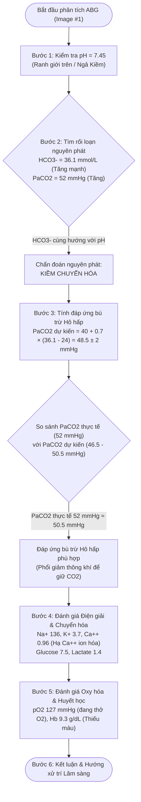

# BÀI GIẢNG: HƯỚNG DẪN ĐỌC KẾT QUẢ KHÍ MÁU ĐỘNG MẠCH (ABG) & GIẢI THÍCH THEO SINH LÝ LÂM SÀNG (PHIÊN BẢN V2 - PHÂN TÍCH CA LÂM SÀNG THỰC TẾ)

**Chuyên khoa:** Nội khoa - Cấp cứu - Hồi sức tích cực & Thận - Hô hấp  
**Đối tượng:** Bác sĩ lâm sàng, học viên sau đại học, sinh viên y khoa  
**Tài liệu tham chiếu:** *Oxford Handbook of Clinical Medicine, ERS Handbook of Respiratory Medicine, West's Respiratory Physiology, Harrison's Principles of Internal Medicine.*

---

## MỤC TIÊU HỌC TẬP

Sau khi hoàn thành bài học này, người học có khả năng:
1. **Trích xuất và phân loại** đầy đủ các thông số đo trực tiếp, thông số tính toán và điện giải/chuyển hóa trên phiếu kết quả khí máu động mạch (ABG).
2. **Thực hành quy trình 6 bước có hệ thống** để phân tích chính xác rối loạn toan-kiềm đơn thuần và hỗn hợp.
3. **Tính toán đáp ứng bù trừ sinh lý** bằng các công thức chuẩn (Winters, bù trừ kiềm chuyển hóa, toan/kiềm hô hấp cấp/mạn).
4. **Giải thích cơ chế sinh lý bệnh** của ca lâm sàng thực tế (Image #1): Kiềm chuyển hóa nguyên phát kết hợp đáp ứng bù trừ hô hấp, hạ calci ion hóa thứ phát do kiềm máu và thiếu máu đẳng sắc đẳng bào.
5. **Đề xuất chiến lược xử trí lâm sàng an toàn**, toàn diện dựa trên nguyên nhân gốc rễ và diễn tiến sinh lý của bệnh nhân.

---

## PHẦN 1: ĐẠI CƯƠNG VÀ CÁC THÔNG SỐ TRÊN PHIẾU ABG

### 1.1 Khái niệm cốt lõi về Cân bằng Acid - Base

Môi trường nội bào và ngoại bào duy trì trạng thái **homeostasis của nồng độ ion Hydrogen ($H^+$)** cực kỳ nghiêm ngặt. Nồng độ $H^+$ bình thường trong máu động mạch xấp xỉ $40 \text{ nmol/L}$, tương ứng với chỉ số $\text{pH} = 7.35 - 7.45$.

Phương trình cân bằng Henderson - Hasselbalch:

$$\text{pH} = \text{pK} + \log \left( \frac{[\text{HCO}_3^-]}{0.03 \times \text{PaCO}_2} \right)$$

Trong đó:
- **Nhánh Hô hấp ($\text{PaCO}_2$):** Được điều hòa bởi thông khí phế nang tại phổi (diễn ra trong vài phút đến vài giờ).
- **Nhánh Chuyển hóa ($\text{HCO}_3^-$):** Được điều hòa bởi sự tái hấp thu và bài tiết của thận (diễn ra trong 12 đến 72 giờ).

---

### 1.2 Cấu trúc phiếu xét nghiệm ABG thực tế (Phân tích mẫu xét nghiệm từ Image #1)

Khi nhận phiếu kết quả ABG, bác sĩ cần phân biệt 3 nhóm thông số chính:

| Nhóm thông số | Thông số trên phiếu | Giá trị thực tế (Image #1) | Khoảng tham chiếu | Nhận xét sinh lý |
| :--- | :--- | :--- | :--- | :--- |
| **1. Trực tiếp đo / Acid-Base** | **pH** | **7.45** | 7.35 – 7.45 | Ranh giới trên bình thường (ngả Kiềm) |
| | **pCO2** | **52 mmHg** | 35 – 45 mmHg | **TĂNG [H]** — Ứ đọng $CO_2$ (Toan hô hấp/Bù trừ) |
| | **HCO3-** | **36.1 mmol/L** | 22 – 26 mmol/L | **TĂNG MẠNH [H]** — Kiềm chuyển hóa |
| | **HCO3Std** | **33.3 mmol/L** | 22 – 26 mmol/L | **TĂNG [H]** — Bicarbonate chuẩn |
| | **TCO2** | **37.7 mmol/L** | 24 – 30 mmol/L | **TĂNG [H]** — Tổng lượng $CO_2$ hòa tan & đệm |
| | **BEecf / BE(B)** | **+12.1 / +10.7 mmol/L**| -2 đến +2 mmol/L | **TĂNG MẠNH [H]** — Dư thừa Base chuyển hóa |
| **2. Oxy hóa & Huyết học** | **pO2** | **127 mmHg** | 80 – 100 mmHg | **TĂNG [H]** — Đang thở oxy hỗ trợ |
| | **SO2c** | **99 %** | 95 – 100 % | Độ bão hòa Oxy bảo tồn |
| | **THbc (Hb)** | **9.3 g/dL** | 12 – 16 g/dL | **GIẢM [L]** — Thiếu máu mức độ trung bình |
| | **Hct** | **30 %** | 37 – 48 % | **GIẢM [L]** — Giảm thể tích khối hồng cầu |
| **3. Điện giải & Chuyển hóa**| **Na+** | **136 mmol/L** | 135 – 145 mmol/L | Bình thường |
| | **K+** | **3.7 mmol/L** | 3.5 – 5.0 mmol/L | Ranh giới dưới bình thường |
| | **Ca++ (ion hóa)** | **0.96 mmol/L** | 1.15 – 1.35 mmol/L | **GIẢM [L]** — Hạ Calci ion hóa do kiềm máu |
| | **Glucose** | **7.5 mmol/L** | 3.9 – 6.1 mmol/L | **TĂNG [H]** — Tăng đường huyết nhẹ |
| | **Lactate** | **1.4 mmol/L** | < 2.0 mmol/L | Tưới máu mô bình thường |
| **4. Hiệu chỉnh nhiệt độ (37.5°C)**| **pH(T) / pCO2(T) / pO2(T)**| **7.44 / 53 / 130** | Theo nhiệt độ | Giá trị hiệu chỉnh thực tế tại thân nhiệt $37.5^\circ\text{C}$ |

---

## PHẦN 2: QUY TRÌNH 6 BƯỚC ĐỌC ABG & PHÂN TÍCH CA LÂM SÀNG IMAGE #1



---

### BƯỚC 1: ĐÁNH GIÁ pH (MÁU TOAN HAY KIỀM?)
- **Quy tắc:**
  - $\text{pH} < 7.35 \implies$ Máu toan (Acidemia).
  - $\text{pH} > 7.45 \implies$ Máu kiềm (Alkalemia).
  - $7.35 \le \text{pH} \le 7.45 \implies$ pH bình thường HOẶC rối loạn toan-kiềm đã bù trừ hoàn toàn / rối loạn hỗn hợp triệt tiêu lẫn nhau.
- **Áp dụng vào phiếu xét nghiệm (Image #1):**
  - $\text{pH} = 7.45$ $\implies$ Máu ở mốc ranh giới trên của bình thường, ngả về phía **Kiềm máu (Alkalemia)**.

---

### BƯỚC 2: XÁC ĐỊNH RỐI LOẠN NGUYÊN PHÁT (PRIMARY DISORDER)
- **Quy tắc:**
  - So sánh chiều biến đổi của $\text{PaCO}_2$ và $\text{HCO}_3^-$ với chiều dịch chuyển của $\text{pH}$.
  - Nếu $\text{HCO}_3^-$ dịch chuyển cùng chiều với $\text{pH} \implies$ Nguyên nhân **Chuyển hóa**.
  - Nếu $\text{PaCO}_2$ dịch chuyển ngược chiều với $\text{pH} \implies$ Nguyên nhân **Hô hấp**.
- **Áp dụng vào phiếu xét nghiệm (Image #1):**
  - $\text{pH} = 7.45$ (ngả kiềm).
  - $\text{HCO}_3^- = 36.1\text{ mmol/L}$ (tăng rất cao từ mốc $24\text{ mmol/L}$, cùng chiều tăng với pH).
  - $\text{BE} = +12.1\text{ mmol/L}$ (dư thừa base vượt trội).
  - $\text{PaCO}_2 = 52\text{ mmHg}$ (tăng từ mốc $40\text{ mmHg}$, ngược chiều giảm với pH nếu là hô hấp).
  - **Kết luận Bước 2:** Rối loạn nguyên phát là **KIỀM CHUYỂN HÓA (Metabolic Alkalosis)**.

---

### BƯỚC 3: ĐÁNH GIÁ MỨC ĐỘ BÙ TRỪ SINH LÝ (COMPENSATION)

Cơ thể sẽ dùng hệ hô hấp (thay đổi thông khí phế nang) để bù trừ cho rối loạn chuyển hóa. 

#### Bảng công thức dự kiến bù trừ chuẩn y khoa:
1. **Kiềm chuyển hóa (Ca bệnh hiện tại):**
   $$\text{PaCO}_2\text{ dự kiến} = 40 + 0.7 \times (\text{HCO}_3^- - 24) \pm 2\text{ mmHg}$$
   *(Giới hạn bù trừ tối đa của phổi cho kiềm chuyển hóa là $\text{PaCO}_2 \approx 55\text{ mmHg}$ để tránh thiếu oxy máu nặng).*

2. **Toan chuyển hóa (Công thức Winters):**
   $$\text{PaCO}_2\text{ dự kiến} = 1.5 \times \text{HCO}_3^- + 8 \pm 2\text{ mmHg}$$

3. **Toan hô hấp:**
   - Cấp: $\text{HCO}_3^-$ tăng $1\text{ mmol/L}$ cho mỗi $10\text{ mmHg } \text{PaCO}_2$ tăng trên $40$.
   - Mạn: $\text{HCO}_3^-$ tăng $3.5\text{ mmol/L}$ cho mỗi $10\text{ mmHg } \text{PaCO}_2$ tăng trên $40$.

4. **Kiềm hô hấp:**
   - Cấp: $\text{HCO}_3^-$ giảm $2\text{ mmol/L}$ cho mỗi $10\text{ mmHg } \text{PaCO}_2$ giảm dưới $40$.
   - Mạn: $\text{HCO}_3^-$ giảm $5\text{ mmol/L}$ cho mỗi $10\text{ mmHg } \text{PaCO}_2$ giảm dưới $40$.

#### Tính toán cụ thể cho phiếu xét nghiệm Image #1:
- Mức tăng $\text{HCO}_3^- = 36.1 - 24 = 12.1\text{ mmol/L}$.
- $\text{PaCO}_2\text{ dự kiến} = 40 + (0.7 \times 12.1) \pm 2 = 40 + 8.47 \pm 2 = 48.5 \pm 2\text{ mmHg}$ (khoảng từ $46.5$ đến $50.5\text{ mmHg}$).
- **So sánh:** $\text{PaCO}_2$ thực tế của bệnh nhân là $52\text{ mmHg}$.
- **Diễn giải sinh lý:** $\text{PaCO}_2 = 52\text{ mmHg}$ nằm ngay sát ngưỡng bù trừ hô hấp dự kiến tối đa. Trung khu hô hấp đã giảm thông khí phế nang thích ứng để tích tụ $CO_2$ (acid bay hơi) nhằm đưa pH từ mức kiềm nặng trở về ranh giới $7.45$.
- **Kết luận Bước 3:** **Kiềm chuyển hóa nguyên phát đã có đáp ứng bù trừ hô hấp phù hợp.**

---

### BƯỚC 4: ĐÁNH GIÁ ĐIỆN GIẢI, CHUYỂN HÓA VÀ KHOẢNG TRỐNG ANION (ANION GAP)

#### 1. Khoảng trống Anion ($AG$):
$$AG = [\text{Na}^+] - ([\text{Cl}^-] + [\text{HCO}_3^-])$$
*(Trong ca này không có giá trị $Cl^-$, nhưng $AG$ chủ yếu dùng đánh giá Toan chuyển hóa. Ở bệnh nhân Kiềm chuyển hóa, $AG$ có thể tăng nhẹ $2-4\text{ mEq/L}$ do đệm albumin mang điện tích âm gia tăng).*

#### 2. Phân tích hiện tượng Hạ Calci ion hóa thứ phát ($\text{Ca}^{++} = 0.96\text{ mmol/L}$):
- **Cơ chế sinh lý:** Trong môi trường máu bị kiềm hóa ($\text{pH} = 7.45$, $\text{HCO}_3^- = 36.1$), các ion $H^+$ nhả khỏi các vị trí gắn trên gốc protein máu (chủ yếu là Albumin). Các vị trí mang điện tích âm trống này tăng cường gắn kết với ion $\text{Ca}^{++}$ tự do.
- **Hậu quả:** Nồng độ Calci ion hóa ($\text{Ca}^{++}$) tự do trong máu giảm xuống còn $0.96\text{ mmol/L}$ (bình thường $1.15 - 1.35\text{ mmol/L}$), mặc dù tổng lượng calci toàn phần trong cơ thể có thể không thay đổi.
- **Biểu hiện lâm sàng cần theo dõi:** Tăng kích thích thần kinh cơ, dị cảm đầu chi, dấu Chvostek, Trousseau, co cứng cơ (tetany), hoặc kéo dài khoảng QT trên ECG.

#### 3. Phân tích Kali máu ($\text{K}^+ = 3.7\text{ mmol/L}$):
- Kali ranh giới thấp. Cần lưu ý kiềm chuyển hóa rất thường đi kèm **Hạ Kali máu** do:
  - Ion $K^+$ đi vào trong tế bào để trao đổi ion $H^+$ đi ra ngoài ngoại bào.
  - Thận tăng bài tiết $K^+$ tại ống lượn xa dưới tác động của aldosterone và sự hiện diện của lượng lớn $\text{HCO}_3^-$ không được tái hấp thu.

---

### BƯỚC 5: ĐÁNH GIÁ OXY HÓA MÁU & CHỈ SỐ HUYẾT HỌC

1. **Tình trạng Oxy hóa máu ($\text{pO}_2 = 127\text{ mmHg}, \text{SO}_2\text{c} = 99\%$):**
   - $\text{pO}_2 = 127\text{ mmHg}$ (vượt ngưỡng bình thường $80-100\text{ mmHg}$ trên khí trời).
   - Chứng tỏ bệnh nhân **đang được thở oxy hỗ trợ** (ví dụ: qua canula mũi hoặc mask).
   - Việc thở oxy duy trì $\text{pO}_2$ cao giúp ngăn ngừa tình trạng thiếu oxy máu thứ phát do phản ứng giảm thông khí phế nang bù trừ ($\text{PaCO}_2 = 52\text{ mmHg}$).

2. **Tình trạng Huyết học ($\text{Hb/THbc} = 9.3\text{ g/dL}, \text{Hct} = 30\%$):**
   - Bệnh nhân có **thiếu máu mức độ trung bình** ($\text{Hb} < 10\text{ g/dL}$).
   - Thiếu máu làm giảm dung tích vận chuyển oxy của máu ($\text{CaO}_2$), càng đòi hỏi phải duy trì độ bão hòa oxy $\text{SO}_2$ ở mức cao ($99\%$) để đảm bảo cung cấp oxy cho mô ($\text{DO}_2$).

---

### BƯỚC 6: KẾT LUẬN VÀ ĐỀ XUẤT HÀNH ĐỘNG LÂM SÀNG

#### 1. Tổng hợp chẩn đoán ABG hoàn chỉnh:
> **Kiềm chuyển hóa nguyên phát mức độ nặng, bù trừ hô hấp phù hợp — Có hỗ trợ Oxy — Hạ Calci ion hóa thứ phát — Thiếu máu đẳng sắc đẳng bào mức độ trung bình.**

#### 2. Nguyên nhân lâm sàng thường gặp gây Kiềm chuyển hóa:
- **Nhóm đáp ứng với Chloride ($\text{Cl}^-$ niệu $< 20\text{ mEq/L}$):** Mất dịch chứa Acid dạ dày (nôn nhiều, hẹp môn vị, hút dịch dạ dày kéo dài), dùng thuốc lợi tiểu quai / thiazide, mất nước giảm thể tích.
- **Nhóm không đáp ứng với Chloride ($\text{Cl}^-$ niệu $> 20\text{ mEq/L}$):** Tăng Aldosterone nguyên phát/thứ phát, hội chứng Cushing, hạ Kali máu nặng kéo dài, truyền/uống quá nhiều Bicarbonate hoặc Citrate (chế phẩm máu).

#### 3. Kế hoạch quản lý & xử trí lâm sàng từng bước:

```text
[HÀNH ĐỘNG LÂM SÀNG TIẾP THEO]
1. Đánh giá nguyên nhân mất dịch/acid: Kiểm tra tiền sử nôn, hút dịch dạ dày, hoặc sử dụng thuốc lợi tiểu gần đây.
2. Kiểm tra Chloride niệu (Cl- niệu): Để phân loại kiềm chuyển hóa đáp ứng với Chloride hay kháng Chloride.
3. Bù dịch NaCl 0.9%: Nếu bệnh nhân có giảm thể tích ngoại bào (giúp bù Cl- và Na+, tạo điều kiện cho thận thải bớt HCO3-).
4. Bù Kali (KCl): Duy trì K+ máu ở mức 4.0 - 4.5 mmol/L (bù K+ là chìa khóa để sửa chữa kiềm chuyển hóa).
5. Theo dõi triệu chứng hạ Ca++ ion hóa: Nếu có co thắt cơ, tetany hoặc QT kéo dài, cân nhắc bù Calci gluconate chậm đường tĩnh mạch.
6. Giám sát hô hấp: Giảm dần FiO2 hỗ trợ khi kiềm chuyển hóa cải thiện, tránh để PaCO2 tăng quá cao gây suy hô hấp phụ.
```

---

## PHẦN 3: BẢNG TỔNG HỢP NĂNG LỰC ĐỌC ABG NHANH TẠI GIƯỜNG

| Bước | Câu hỏi lâm sàng | Chỉ số đánh giá | Giá trị ca mẫu (Image #1) | Diễn giải ca mẫu |
| :--- | :--- | :--- | :--- | :--- |
| **1** | Máu Toan hay Kiềm? | $\text{pH}$ | $7.45$ | Ranh giới Kiềm |
| **2** | Nguyên phát do Hô hấp hay Chuyển hóa? | $\text{PaCO}_2$ vs $\text{HCO}_3^-$ | $\text{HCO}_3^- = 36.1$ ($\uparrow$ cùng chiều pH) | **Kiềm chuyển hóa** |
| **3** | Phổi/Thận đã bù trừ đúng mức chưa? | Công thức bù trừ dự kiến | $\text{PaCO}_2\text{ dk} = 48.5 \pm 2\text{ mmHg}$ | $\text{PaCO}_2 = 52\text{ mmHg} \implies$ **Bù trừ hô hấp tốt** |
| **4** | Có bất thường điện giải/chuyển hóa kèm theo? | $\text{K}^+, \text{Ca}^{++}, \text{Glu}, \text{Lactate}$ | $\text{Ca}^{++} = 0.96\text{ L}, \text{K}^+ = 3.7$ | **Hạ Calci ion hóa thứ phát** |
| **5** | Tình trạng oxy hóa & mang oxy máu ra sao?| $\text{pO}_2, \text{SO}_2, \text{Hb}$ | $\text{pO}_2 = 127\text{ H}, \text{Hb} = 9.3\text{ L}$ | Đang thở O2 hỗ trợ, Thiếu máu nhè nhẹ |
| **6** | Hướng điều trị ưu tiên là gì? | Nguyên nhân gốc | Mất $H^+/\text{Cl}^-$ hoặc Lợi tiểu | Bù $\text{NaCl } 0.9\%$, Bù $\text{KCl}$, xử trí hạ $\text{Ca}^{++}$ |

---
**- HẾT BÀI GIẢNG V2 -**
