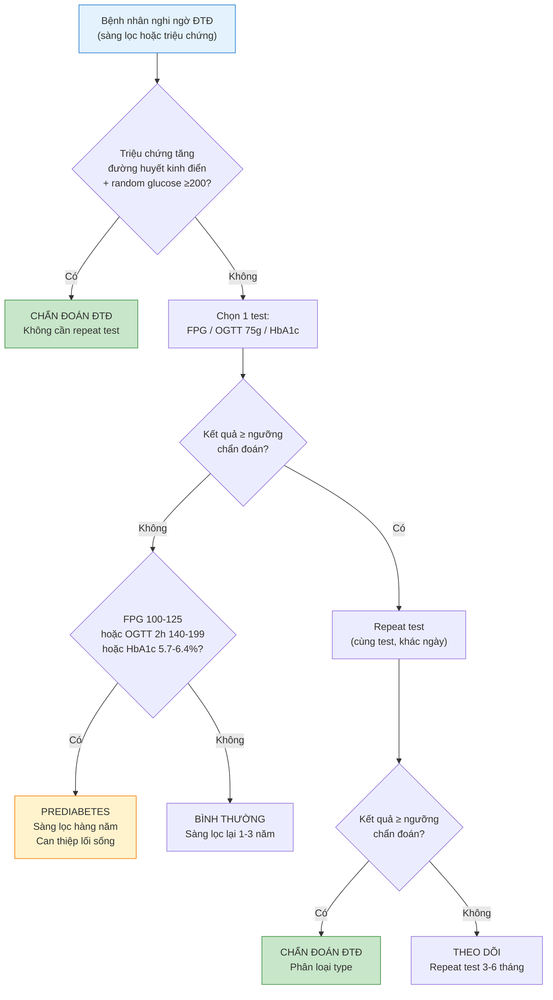
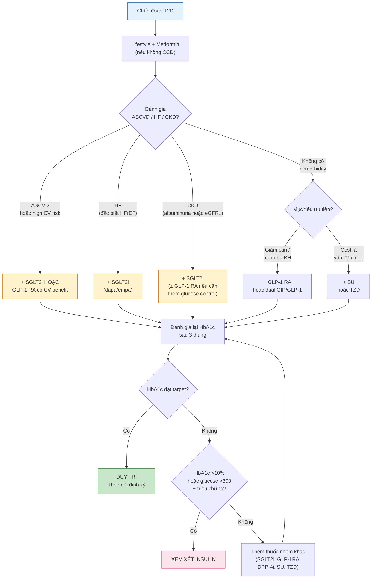

# BÀI HỌC Y KHOA: ĐÁI THÁO ĐƯỜNG TYPE 1 / TYPE 2
****Mã bài học:** IM-51 | Ngày:** 2026-07-16 | **Chuyên khoa:** Nội khoa — Nội tiết & Chuyển hóa | **Đối tượng:** Bác sĩ Nội khoa, học viên sau đại học, sinh viên y khoa năm cuối

---

## 0. TỔNG QUAN — VÌ SAO BÀI NÀY QUAN TRỌNG?

Đái tháo đường (ĐTĐ) là đại dịch không lây của thế kỷ 21. Khoảng 537 triệu người trưởng thành trên thế giới đang sống chung với ĐTĐ (IDF 2021), và con số này dự kiến đạt 783 triệu vào năm 2045. Tại Việt Nam, ước tính khoảng 5% dân số trưởng thành mắc bệnh — và đến 50-60% trong số đó chưa được chẩn đoán.

Bác sĩ Nội khoa tuyến tỉnh là người đầu tiên tiếp xúc với phần lớn bệnh nhân ĐTĐ tại Việt Nam. Mỗi quyết định — từ việc chọn thuốc đầu tay, cá thể hóa mục tiêu HbA1c, đến nhận diện biến chứng cấp — đều có hậu quả lâu dài cho bệnh nhân. Một lựa chọn sai ở lần khám đầu tiên (ví dụ: dùng sulfonylurea cho bệnh nhân LADA, hoặc trì hoãn insulin ở T2D mất bù) có thể đẩy nhanh suy tế bào beta và biến chứng không hồi phục.

Bài này bao phủ **toàn bộ phổ ĐTĐ type 1 và type 2** mà bác sĩ Nội khoa cần nắm: từ chẩn đoán, cá thể hóa mục tiêu, thuốc uống và thuốc tiêm, insulin therapy, đến các biến chứng cấp và mạn. Evidence được cập nhật đến **ADA Standards of Care 2026** và NICE NG28 (cập nhật tháng 2/2026).

**Mục tiêu của bài:**
- Chẩn đoán chính xác ĐTĐ type 1, type 2, prediabetes theo tiêu chuẩn ADA 2026
- Cá thể hóa mục tiêu HbA1c dựa trên tuổi, bệnh nền, nguy cơ hạ đường huyết và kỳ vọng sống
- Lựa chọn thuốc hạ đường huyết theo comorbidity (ASCVD, suy tim, bệnh thận mạn) — không chỉ dựa trên HbA1c
- Sử dụng insulin an toàn: khởi đầu, điều chỉnh liều, phác đồ basal-bolus và pump/closed-loop
- Nhận diện và xử trí ban đầu DKA, HHS và hạ đường huyết nặng
- Thiết lập kế hoạch tầm soát biến chứng mạn hàng năm (mắt, thận, thần kinh, tim mạch, bàn chân)

---

### 📋 TRƯỚC KHI ĐỌC — BẠN CẦN NẮM CHẮC

> Để hiểu bài này, bạn nên đã biết:
> - **Sinh lý tụy nội tiết**: cấu trúc đảo tụy Langerhans (tế bào β tiết insulin ~60-70%, tế bào α tiết glucagon ~20-25%, tế bào δ tiết somatostatin). Cơ chế tiết insulin kích thích bởi glucose: GLUT2 → glucokinase → ATP → đóng kênh K-ATP → khử cực màng → mở kênh Ca²⁺ voltage-gated → exocytosis của hạt insulin.
> - **Chuyển hóa glucose bình thường**: Trạng thái no (insulin ↑: tăng thu nhận glucose ở cơ và mỡ qua GLUT4, tăng tổng hợp glycogen ở gan, ức chế gluconeogenesis). Trạng thái đói (glucagon ↑: glycogenolysis, gluconeogenesis, lipolysis).
> - **Insulin signaling**: Insulin gắn thụ thể tyrosine kinase → IRS-1/PI3K/Akt → translocation GLUT4 ra màng tế bào.
> - **Đọc xét nghiệm cơ bản**: FPG, OGTT, HbA1c — nguyên lý, ý nghĩa và các yếu tố gây nhiễu.
> - **Các bài học nền tảng**: Khi Block 0 hoàn tất, xem lại IM-01 (Cách tiếp cận bệnh nhân Nội khoa), IM-04 (Đọc xét nghiệm cơ bản), IM-06 (Kê đơn Nội khoa an toàn).
>
> Nếu chưa vững phần nào: quay lại tài liệu sinh lý hoặc bài nền tảng trước, rồi đọc tiếp. Nếu đã nắm chắc: bỏ qua box này, mất 5 giây.

---

### 0.1 Nền tảng tối thiểu cần dùng ngay

Sau ăn, glucose đi từ ruột vào máu; **insulin** giúp cơ và mô mỡ sử dụng glucose, đồng thời giảm việc gan giải phóng glucose. Khi đói, **glucagon** giúp gan giải phóng năng lượng vừa đủ. Đường huyết có thể ghi bằng mg/dL hoặc mmol/L; cần luôn xem đơn vị và phương pháp xét nghiệm trước khi so sánh ngưỡng. Tăng đường huyết ngoại trú không đồng nghĩa an toàn: ketone/toan, mất nước nặng, rối loạn ý thức hoặc hạ đường huyết cần hỗ trợ là nhánh cấp cứu. Mục tiêu của buổi khám thường quy là xác nhận chẩn đoán, chọn điều trị an toàn và tạo kế hoạch theo dõi; không tự thay thế protocol DKA/HHS.

> **Nguồn:** ADA Standards of Care 2026. [GUIDELINE VERIFIED]

## 1. ĐỊNH NGHĨA, PHÂN LOẠI & TIÊU CHUẨN CHẨN ĐOÁN [CỐT LÕI]

### 1.0 Nhắc nhanh: Sinh lý glucose bình thường

> **Nguồn kiến thức nền:** [TEXTBOOK: Endotext, Pancreatic Islet Function & Glucose Metabolism. NBK279043, NBK279048]

Bình thường, glucose máu được duy trì trong khoảng hẹp 70-140 mg/dL nhờ cân bằng giữa insulin (hormone đồng hóa duy nhất) và các hormone đối kháng (glucagon, catecholamine, cortisol, GH). Sau bữa ăn, glucose vào máu → tế bào β tụy tăng tiết insulin → insulin thúc đẩy thu nhận glucose vào cơ (GLUT4) và mỡ, đồng thời ức chế sản xuất glucose ở gan. Khi đói, insulin giảm, glucagon tăng → gan tăng glycogenolysis và gluconeogenesis để duy trì glucose cho não và hồng cầu.

Khi cơ chế này hỏng — hoặc do thiếu insulin tuyệt đối (T1D) hoặc do đề kháng insulin kèm suy giảm tiết insulin tương đối (T2D) — glucose máu tăng mạn tính, dẫn đến tổn thương đa cơ quan qua 4 con đường chuyển hóa: polyol, AGE, PKC, và hexosamine.

> **Hiểu đơn giản:** Insulin giống như "chìa khóa" mở cửa cho glucose từ máu vào trong tế bào. Ở T1D: tuyến tụy KHÔNG SẢN XUẤT chìa khóa → glucose không vào được tế bào → tế bào "đói" dù máu đầy glucose. Ở T2D: tuyến tụy VẪN SẢN XUẤT chìa khóa, nhưng "ổ khóa" trên tế bào bị RỈ SÉT (đề kháng insulin) → chìa khóa không vặn được → glucose cũng không vào được tế bào. Cả hai đều dẫn đến cùng một hậu quả: glucose ứ đọng trong máu, gây tổn thương mạch máu khắp cơ thể.

### 1.1. Định nghĩa đái tháo đường

Đái tháo đường là một nhóm rối loạn chuyển hóa đặc trưng bởi **tăng đường huyết mạn tính** do khiếm khuyết tiết insulin, khiếm khuyết tác động của insulin, hoặc cả hai. Tăng đường huyết mạn tính gây tổn thương, rối loạn chức năng và suy nhiều cơ quan — đặc biệt là mắt, thận, thần kinh, tim và mạch máu. [GUIDELINE VERIFIED: ADA SOC 2026 Section 2]

### 1.2. Tiêu chuẩn chẩn đoán — ADA 2026

Theo ADA Standards of Care 2026, ĐTĐ được chẩn đoán khi có **một trong bốn tiêu chuẩn sau**, và cần được xác nhận bằng xét nghiệm lặp lại (trừ khi có tăng đường huyết rõ rệt kèm triệu chứng kinh điển): [GUIDELINE VERIFIED: ADA SOC 2026 Section 2]

| # | Tiêu chuẩn | Ngưỡng |
|---|---|---|
| 1 | Đường huyết đói (FPG — fasting plasma glucose) | ≥126 mg/dL (7.0 mmol/L). Nhịn đói ≥8 giờ. |
| 2 | Nghiệm pháp dung nạp glucose (OGTT) — glucose 2 giờ sau 75g glucose | ≥200 mg/dL (11.1 mmol/L) |
| 3 | HbA1c | ≥6.5% (48 mmol/mol). Phải được thực hiện bằng phương pháp NGSP-certified và chuẩn hóa theo DCCT. |
| 4 | Đường huyết ngẫu nhiên + triệu chứng tăng đường huyết kinh điển | ≥200 mg/dL (11.1 mmol/L) kèm polyuria, polydipsia, weight loss không rõ nguyên nhân |

**Lưu ý quan trọng về HbA1c:** HbA1c rất tiện lợi (không cần nhịn đói, phản ánh glucose 2-3 tháng), nhưng có nhiều tình huống **không nên dùng HbA1c để chẩn đoán**: [GUIDELINE VERIFIED: ADA SOC 2026]
- Bệnh hemoglobin (HbS, HbC, HbE, thalassemia): HbA1c không phản ánh chính xác
- Thai kỳ: dùng OGTT
- Bệnh thận mạn giai đoạn 4-5 (eGFR <30)
- Mất máu gần đây, truyền máu, hoặc đang dùng erythropoietin
- Thiếu máu tan máu, thiếu sắt nặng (điều trị sắt có thể làm HbA1c giảm giả tạo)

Nếu hai xét nghiệm khác nhau cho kết quả trái ngược (ví dụ: FPG đạt ngưỡng chẩn đoán nhưng HbA1c không đạt) → lặp lại xét nghiệm bất thường đó vào một ngày khác.

### 1.3. Phân loại đái tháo đường

ADA phân loại ĐTĐ thành 4 nhóm chính: [GUIDELINE VERIFIED: ADA SOC 2026 Section 2]

#### Type 1 Diabetes (T1D) — chiếm 5-10%
Do **phá hủy tế bào β tự miễn** dẫn đến thiếu insulin tuyệt đối. Đặc trưng bởi sự hiện diện của tự kháng thể (autoantibodies): GAD65, IA-2, ZnT8, IAA (insulin autoantibody). Tốc độ phá hủy tế bào β thay đổi: nhanh ở trẻ em, chậm hơn ở người lớn (LADA — Latent Autoimmune Diabetes in Adults). Bệnh nhân T1D phụ thuộc insulin ngoại sinh để sống và có nguy cơ DKA cao. [REVIEW: PMID 29916386]

#### Type 2 Diabetes (T2D) — chiếm 90-95%
Do **đề kháng insulin kèm suy giảm tiết insulin tương đối**. Thường khởi phát ở người trưởng thành, liên quan chặt chẽ với béo phì (đặc biệt béo bụng), ít vận động, và yếu tố di truyền. T2D có thể không có triệu chứng trong nhiều năm — vì vậy tầm soát rất quan trọng. Nguy cơ DKA thấp hơn T1D nhưng có thể xảy ra dưới stress (nhiễm trùng, phẫu thuật) hoặc khi dùng SGLT2i (euglycemic DKA). [REVIEW: PMID 32872570]

#### Gestational Diabetes Mellitus (GDM)
ĐTĐ được chẩn đoán trong tam cá nguyệt thứ 2 hoặc 3 của thai kỳ, không có tiền sử ĐTĐ trước đó. → Xem chi tiết tại bài **GDM** (`01_San phu khoa/08_GDM/GDM_Comprehensive/`).

#### Các type đặc hiệu khác
- **MODY (Maturity-Onset Diabetes of the Young):** ĐTĐ đơn gen, khởi phát <25 tuổi, di truyền trội trên nhiễm sắc thể thường, không béo phì, C-peptide còn detectable. Các type thường gặp: HNF1A (MODY3), GCK (MODY2), HNF4A (MODY1). MODY2 thường không cần điều trị.
- **ĐTĐ sơ sinh (neonatal diabetes):** Đột biến KCNJ11, ABCC8, INS — đáp ứng với sulfonylurea đường uống thay vì insulin
- **ĐTĐ do bệnh tụy ngoại tiết:** Viêm tụy mạn, xơ nang (CFRD), ung thư tụy, cắt tụy
- **ĐTĐ do thuốc:** Glucocorticoid, tacrolimus, cyclosporine, thuốc chống loạn thần không điển hình (olanzapine, clozapine), thuốc kháng retrovirus (protease inhibitor)
- **ĐTĐ do bệnh nội tiết:** Cushing, acromegaly, pheochromocytoma, cường giáp, glucagonoma
- **Hội chứng di truyền:** Down, Klinefelter, Turner, Wolfram (DIDMOAD), Prader-Willi

> ⚠️ HỌC VIÊN HAY NHẦM: Nhầm **LADA** với T2D. LADA (Latent Autoimmune Diabetes in Adults) là thể T1D tiến triển chậm ở người >30 tuổi, thường gầy, khởi phát giống T2D nhưng C-peptide thấp và GAD65 dương tính. Nếu dùng sulfonylurea cho LADA → tăng tốc suy tế bào β. Quy tắc: T2D không đáp ứng với ≥2 thuốc uống + gầy + khởi phát trẻ → nghĩ đến LADA → kiểm tra GAD65.

### 1.4. Prediabetes — "Vùng xám"

Prediabetes là trạng thái đường huyết cao hơn bình thường nhưng chưa đạt ngưỡng chẩn đoán ĐTĐ. Đây là yếu tố nguy cơ cao cho T2D, bệnh tim mạch, và các biến chứng vi mạch có thể đã bắt đầu. [GUIDELINE VERIFIED: ADA SOC 2026 Section 2]

| Phân loại | Tiêu chuẩn |
|---|---|
| **IFG** (Impaired Fasting Glucose) | FPG 100–125 mg/dL (5.6–6.9 mmol/L) |
| **IGT** (Impaired Glucose Tolerance) | OGTT 2h glucose 140–199 mg/dL (7.8–11.0 mmol/L) |
| **HbA1c tăng** (Increased risk) | HbA1c 5.7–6.4% (39–47 mmol/mol) |

Nguy cơ tiến triển từ prediabetes → T2D khoảng **5-10%/năm** nếu không can thiệp. Can thiệp lối sống (giảm 7% cân nặng, tập thể dục 150 phút/tuần) có thể giảm nguy cơ tiến triển đến **58%** (theo Diabetes Prevention Program — DPP). Metformin có thể xem xét ở người prediabetes nguy cơ cao: BMI ≥35, tuổi <60, hoặc phụ nữ có tiền sử GDM. [GUIDELINE VERIFIED: ADA SOC 2026 Section 3]

### 🛑 DỪNG 1 PHÚT — TỰ KIỂM TRA

> 1. Bệnh nhân nữ 42 tuổi, FPG lần 1 = 130 mg/dL, lần 2 (cách 3 ngày) = 128 mg/dL. HbA1c = 6.3%. Chẩn đoán là gì? Giải thích vì sao HbA1c không đạt ngưỡng nhưng vẫn chẩn đoán được?
> 2. Bệnh nhân nam 30 tuổi, BMI 22, được chẩn đoán T2D cách đây 1 năm, đang dùng metformin 1g × 2 + glimepiride 4mg, HbA1c vẫn 9.5%. Bạn nghi ngờ gì? Cần xét nghiệm thêm gì?
>
> *(Đáp án: 1. Chẩn đoán ĐTĐ — FPG ≥126 ở hai lần riêng biệt là đủ, không cần HbA1c ≥6.5% nếu FPG đã đạt ngưỡng. HbA1c 6.3% chỉ là yếu tố hỗ trợ. 2. Nghi ngờ LADA — T2D khởi phát trẻ, gầy, không đáp ứng với thuốc uống. Cần kiểm tra GAD65, IA-2, C-peptide.)*

---

## 2. SINH LÝ BỆNH [CỐT LÕI]

> **Nguồn kiến thức nền:** [REVIEW: PMID 32872570 — Pathophysiology of Type 2 Diabetes Mellitus; PMID 29916386 — Type 1 diabetes (Lancet Seminar); TEXTBOOK: Endotext, Insulin Biosynthesis & Signaling]

### 2.1. Sinh lý bệnh Type 2 Diabetes

T2D không phải là bệnh của một cơ quan — mà là hội chứng rối loạn đa cơ quan. DeFronzo (2009) mô tả **"Ominous Octet"** — 8 khiếm khuyết cùng góp phần vào tăng đường huyết: [REVIEW: PMID 32872570]

#### 8 "thủ phạm" trong T2D:

| # | Cơ quan | Khiếm khuyết | Hậu quả |
|---|---|---|---|
| 1 | **Tế bào β tụy** | ↓ khối lượng và chức năng tế bào β (apoptosis ↑, mất phase 1 insulin secretion) | ↓ tiết insulin, đặc biệt sớm sau ăn |
| 2 | **Cơ vân** | Đề kháng insulin → ↓ GLUT4 translocation | ↓ thu nhận glucose sau ăn (chiếm ~80% glucose disposal) |
| 3 | **Gan** | ↑ gluconeogenesis (không bị insulin ức chế) | ↑ glucose đói (đóng góp chính vào tăng đường huyết lúc đói) |
| 4 | **Mô mỡ** | ↑ lipolysis → ↑ FFA | Lipotoxicity ở gan, cơ, tế bào β; viêm mạn tính |
| 5 | **Ruột** | ↓ incretin effect (GLP-1, GIP) | ↓ khuếch đại tiết insulin sau ăn (incretin effect chịu trách nhiệm 50-70% tiết insulin sau ăn) |
| 6 | **Tế bào α tụy** | ↑ glucagon (không bị ức chế bởi glucose/insulin) | ↑ sản xuất glucose ở gan, đặc biệt sau ăn |
| 7 | **Thận** | ↑ SGLT2 expression → tăng tái hấp thu glucose | Ngưỡng thận glucose tăng (bình thường ~180 mg/dL, ở T2D có thể >200-240) |
| 8 | **Não** | ↓ dopamine signaling, rối loạn vùng dưới đồi | Rối loạn điều hòa cảm giác ngon miệng, góp phần béo phì |

**Cơ chế phân tử cốt lõi:** [REVIEW: PMID 32872570]
- **Đề kháng insulin:** giảm phosphoryl hóa IRS-1, giảm hoạt hóa PI3K/Akt → ↓ GLUT4 translocation. Nguyên nhân: tăng FFA (lipotoxicity), tăng cytokine viêm (TNF-α, IL-6 từ mô mỡ), stress oxy hóa, rối loạn chức năng ty thể.
- **Suy tế bào β:** Cơ chế bao gồm: (1) glucolipotoxicity — glucose + FFA cao gây stress ER và stress oxy hóa, (2) lắng đọng amyloid (islet amyloid polypeptide — IAPP), (3) viêm tiểu đảo (insulitis mức độ thấp), (4) suy giảm autophagy và tăng apoptosis, (5) yếu tố di truyền (biến thể gen TCF7L2, SLC30A8, KCNJ11).
- **Diễn tiến tự nhiên:** T2D tiến triển qua nhiều năm: bắt đầu với đề kháng insulin → tế bào β bù trừ bằng tăng tiết insulin (hyperinsulinemia) → theo thời gian tế bào β suy kiệt → glucose đói tăng, glucose sau ăn tăng → chẩn đoán T2D.

### 2.2. Sinh lý bệnh Type 1 Diabetes

T1D là bệnh **tự miễn qua trung gian tế bào T** dẫn đến phá hủy chọn lọc tế bào β. Quá trình diễn ra qua 3 giai đoạn: [REVIEW: PMID 29916386]

| Giai đoạn | Đặc điểm |
|---|---|
| **Stage 1** | ≥2 tự kháng thể dương tính (GAD65, IA-2, ZnT8, IAA), đường huyết BÌNH THƯỜNG, không triệu chứng |
| **Stage 2** | ≥2 tự kháng thể dương tính + rối loạn đường huyết (FPG 100-125 hoặc OGTT 140-199 hoặc HbA1c ≥5.7%), CHƯA có triệu chứng lâm sàng |
| **Stage 3** | Triệu chứng lâm sàng (tiểu nhiều, uống nhiều, sút cân) + tăng đường huyết đạt tiêu chuẩn chẩn đoán → ĐTĐ lâm sàng |

**Cơ chế miễn dịch:** [REVIEW: PMID 29916386]
- **Yếu tố di truyền:** HLA class II (DR3-DQ2, DR4-DQ8) — nguy cơ cao nhất. >50 gen liên quan (INS, PTPN22, CTLA4, IL2RA).
- **Yếu tố môi trường:** Nhiễm virus (Coxsackie B, enterovirus — phát hiện trong tiểu đảo tụy của bệnh nhân mới chẩn đoán), yếu tố chế độ ăn (sữa bò? gluten? — chưa kết luận), vitamin D thấp.
- **Cơ chế phá hủy:** Tế bào T CD8+ tự phản ứng xâm nhập tiểu đảo (insulitis) → nhận diện kháng nguyên tế bào β (insulin, GAD65, IA-2, ZnT8) qua MHC class I → tiêu diệt tế bào β qua perforin/granzyme và Fas/FasL. Tế bào T CD4+ hỗ trợ và khuếch đại đáp ứng. Tế bào B sản xuất tự kháng thể (không trực tiếp gây phá hủy nhưng là dấu ấn chẩn đoán).
- **Tự kháng thể:** Xuất hiện trước triệu chứng lâm sàng nhiều năm. Nguy cơ tiến triển → lâm sàng tăng theo số lượng tự kháng thể: 1 Ab ~10-20%, ≥2 Ab ~50-80% trong 5-10 năm. Teplizumab (anti-CD3) đã được FDA chấp thuận để trì hoãn tiến triển từ Stage 2 → Stage 3 (giảm ~50% nguy cơ trong 2 năm).

### 2.3. Cơ chế biến chứng do tăng đường huyết

Tăng đường huyết mạn tính gây tổn thương tế bào qua **4 con đường chuyển hóa chính**, tất cả đều khởi nguồn từ **tăng sản xuất superoxide ty thể**: [REVIEW: PMID 32872570]

| Con đường | Cơ chế | Hậu quả |
|---|---|---|
| **Polyol pathway** | Glucose → sorbitol (aldose reductase) → fructose. Tiêu thụ NADPH, tăng stress thẩm thấu. | Tổn thương thần kinh, võng mạc, thận |
| **AGE formation** | Glucose + protein → advanced glycation end-products (AGEs). AGEs gắn thụ thể RAGE → viêm, stress oxy hóa. | Dày màng đáy, xơ hóa, rối loạn chức năng nội mô |
| **PKC activation** | DAG (diacylglycerol) tăng → hoạt hóa PKC → ↑ VEGF, ↑ TGF-β, ↓ eNOS. | Tăng sinh mạch máu bất thường (võng mạc), xơ hóa (thận), rối loạn vận mạch |
| **Hexosamine pathway** | Fructose-6-P → UDP-GlcNAc → glycosyl hóa yếu tố phiên mã (Sp1) → ↑ PAI-1, ↑ TGF-β. | Viêm, huyết khối, xơ hóa |

**Hậu quả lâm sàng:**
- **Biến chứng vi mạch:** Dày màng đáy mao mạch → tắc vi mạch → bệnh võng mạc (mất pericytes, vi phình mạch, tân mạch), bệnh thận (xơ hóa cầu thận dạng nốt Kimmelstiel-Wilson), bệnh thần kinh (mất myelin, thoái hóa sợi trục).
- **Biến chứng đại mạch:** Xơ vữa động mạch tăng tốc qua AGE/RAGE + viêm + stress oxy hóa + rối loạn lipid (tăng TG, LDL nhỏ đậm đặc, HDL rối loạn chức năng) + trạng thái tăng đông.

**"Metabolic memory" (trí nhớ chuyển hóa):** DCCT/EDIC đã chứng minh: nhóm intensive insulin có HbA1c tốt hơn trong 6.5 năm → sau đó HbA1c hai nhóm hội tụ (converged) → nhưng nhóm intensive VẪN có ít biến chứng hơn sau 10-20 năm. Điều này hàm ý: tăng đường huyết để lại "dấu ấn" lâu dài (qua thay đổi epigenetic — methyl hóa DNA, biến đổi histone, microRNA) → cần kiểm soát đường huyết tốt **càng sớm càng tốt**.

> ⚠️ HỌC VIÊN HAY NHẦM: Nhầm giữa T1D và T2D về mặt sinh lý bệnh. T1D là bệnh **tự miễn**, tế bào β bị phá hủy → **thiếu insulin tuyệt đối** → bắt buộc dùng insulin ngoại sinh. T2D là bệnh **chuyển hóa**, tế bào β còn nhưng **đề kháng insulin + suy giảm chức năng tương đối** → ban đầu có thể kiểm soát bằng thuốc uống, insulin dùng khi suy tế bào β tiến triển.

### 🛑 DỪNG 1 PHÚT — TỰ KIỂM TRA

> 1. Tại sao bệnh nhân T2D có glucose đói tăng ngay cả khi chưa ăn gì? Cơ quan nào chịu trách nhiệm chính?
> 2. Một trẻ 10 tuổi có GAD65 (+), IA-2 (+), glucose đói 90 mg/dL, OGTT 2h = 130 mg/dL. Đây là giai đoạn nào của T1D? Có chỉ định điều trị gì không?
>
> *(Đáp án: 1. Glucose đói tăng chủ yếu do gan tăng gluconeogenesis — "khiếm khuyết #3" trong Ominous Octet. Insulin không ức chế được gluconeogenesis do đề kháng insulin ở gan. 2. Đây là T1D Stage 1: ≥2 autoantibodies dương tính, đường huyết bình thường. Hiện tại chưa có điều trị chuẩn — theo dõi định kỳ. Teplizumab có thể xem xét nếu tiến triển sang Stage 2.)*

---

### BOX ĐỎ — khi phải rời nhánh thường quy

> **Ketone/toan, mất nước nặng, rối loạn ý thức, nôn dai dẳng, hạ đường huyết cần người khác hỗ trợ, sepsis, đau ngực hoặc thai kỳ → nguy cơ DKA/HHS/hạ đường huyết nặng hay bệnh đồng mắc cấp → ABCDE, glucose tại giường, ketone/điện giải khi có và chuyển cấp cứu/sản khoa.** Không đưa người bệnh vào algorithm ngoại trú hoặc tự dùng Plan B thay protocol cấp cứu.

## 3. CHẨN ĐOÁN & SÀNG LỌC [CỐT LÕI]

### 3.1. Sàng lọc — Ai, khi nào, bằng gì?

**Sàng lọc T2D ở người không triệu chứng:** [GUIDELINE VERIFIED: ADA SOC 2026 Section 2]

| Đối tượng | Thời điểm bắt đầu | Tần suất |
|---|---|---|
| **Tất cả người trưởng thành** | ≥35 tuổi | Mỗi 1-3 năm nếu bình thường |
| **Người thừa cân/béo phì** (BMI ≥25, hoặc ≥23 ở người châu Á) + ≥1 yếu tố nguy cơ | Bất kỳ tuổi nào | Mỗi 1-3 năm nếu bình thường; thường xuyên hơn nếu prediabetes |
| **Phụ nữ có tiền sử GDM** | Sau sinh và suốt đời | Mỗi 1-3 năm |
| **Người có prediabetes** | Tại thời điểm chẩn đoán prediabetes | Hàng năm |
| **Trẻ em và thanh thiếu niên thừa cân/béo phì** (BMI ≥85th percentile) + ≥1 yếu tố nguy cơ | Từ 10 tuổi hoặc khi bắt đầu dậy thì | Mỗi 3 năm |

**Yếu tố nguy cơ T2D:** Tiền sử gia đình T2D (bậc 1), chủng tộc nguy cơ cao (châu Á, Mỹ gốc Phi, Hispanic, Native American, Pacific Islander), tiền sử bệnh tim mạch, tăng huyết áp (≥140/90 hoặc đang điều trị), HDL <35 mg/dL và/hoặc TG >250 mg/dL, PCOS, ít vận động thể lực, dấu hiệu đề kháng insulin (acanthosis nigricans), tiền sử GDM hoặc sinh con ≥4 kg.

**Sàng lọc T1D:** [GUIDELINE VERIFIED: ADA SOC 2026]
- Không sàng lọc T1D trong cộng đồng (chưa có can thiệp chứng minh hiệu quả ở người không triệu chứng ngoài research setting)
- **Người thân bậc 1 của bệnh nhân T1D:** có thể tham gia nghiên cứu sàng lọc (TrialNet) — kiểm tra tự kháng thể. Nếu ≥2 autoantibodies (+) → risk of progression 50-80% trong 5-10 năm
- Tại thời điểm chẩn đoán T1D: sàng lọc bệnh tuyến giáp (TSH), bệnh celiac (tTG-IgA nếu có triệu chứng hoặc type 1), rối loạn lipid (lipid panel). Lặp lại TSH mỗi 1-2 năm.

**Phương pháp sàng lọc:** FPG, OGTT 75g, hoặc HbA1c đều được chấp nhận. FPG tiện nhất và rẻ nhất. OGTT nhạy nhất nhưng bất tiện. HbA1c tiện lợi nhưng lưu ý các yếu tố gây nhiễu (xem 1.2).

### 3.2. Chẩn đoán phân biệt — T1D vs T2D trên lâm sàng

| Đặc điểm | T1D | T2D |
|---|---|---|
| **Tuổi khởi phát điển hình** | <30 tuổi (nhưng có LADA khởi phát >30) | >40 tuổi (nhưng ngày càng trẻ hóa) |
| **BMI** | Thường gầy hoặc bình thường | Thường thừa cân/béo phì (~80%) |
| **Khởi phát** | Cấp tính (tuần — tháng), triệu chứng rõ | Từ từ (tháng — năm), thường không triệu chứng |
| **Tiền sử gia đình** | 5-10% bậc 1 (thấp hơn T2D) | 75-90% có tiền sử gia đình |
| **C-peptide** | Thấp / không detectable | Bình thường hoặc cao (đề kháng insulin) |
| **Tự kháng thể** | GAD65, IA-2, ZnT8, IAA (+) | Âm tính |
| **DKA risk** | Cao (có thể là biểu hiện đầu tiên) | Thấp (trừ khi stress hoặc SGLT2i) |
| **Điều trị** | Bắt buộc insulin | Ban đầu: thuốc uống ± insulin sau |

**LADA — cạm bẫy chẩn đoán:** [REVIEW: PMID 29916386]
- Bệnh nhân >30 tuổi, thường gầy hoặc BMI bình thường, khởi phát giống T2D
- Ban đầu có thể đáp ứng với thuốc uống (metformin, SU) → sau 6 tháng — 2 năm: thất bại điều trị
- Cần **C-peptide thấp + GAD65 (+)** để chẩn đoán
- Điều trị: insulin sớm để bảo tồn tế bào β còn lại

**MODY — khi nào nghi ngờ?**
- ĐTĐ khởi phát <25 tuổi, strong family history (≥2 thế hệ, autosomal dominant)
- Không béo phì, không có dấu hiệu đề kháng insulin
- Không có tự kháng thể (GAD65 âm tính)
- C-peptide detectable
- Genetic testing có thể xác định subtype → quyết định điều trị (MODY2/GCK: thường không cần thuốc; MODY3/HNF1A: nhạy với sulfonylurea liều thấp)

> ⚠️ HỌC VIÊN HAY NHẦM: Chẩn đoán T2D cho tất cả bệnh nhân ĐTĐ khởi phát >30 tuổi. Khoảng 5-10% bệnh nhân "T2D" thực chất là LADA. Quy tắc: nếu T2D không đáp ứng với thuốc uống, sút cân, và C-peptide thấp → nghĩ đến LADA, check GAD65.

### 🛑 DỪNG 1 PHÚT — TỰ KIỂM TRA

> 1. Bệnh nhân nữ 25 tuổi, BMI 23, chẩn đoán T2D 6 tháng trước. Đang dùng metformin 1g × 2 + gliclazide MR 60mg. HbA1c = 9.8%. C-peptide = 0.3 ng/mL (thấp), GAD65 = dương tính. Chẩn đoán lại là gì? Điều chỉnh điều trị thế nào?
> 2. Bé gái 12 tuổi, BMI 30, acanthosis nigricans (+). Mẹ và bà ngoại bị T2D. Glucose đói = 118 mg/dL. HbA1c = 6.0%. Chẩn đoán? Cần làm thêm xét nghiệm gì?
>
> *(Đáp án: 1. LADA — C-peptide thấp + GAD65 (+) ở bệnh nhân trẻ, gầy, không đáp ứng thuốc uống. Ngừng SU, bắt đầu insulin nền (basal) + tiếp tục metformin. 2. Prediabetes (IFG + HbA1c 5.7-6.4%). Béo phì + acanthosis nigricans + tiền sử gia đình → nguy cơ T2D cao. Can thiệp lối sống tích cực: giảm cân, tập thể dục. Theo dõi HbA1c/FPG mỗi 6-12 tháng.)*

---

## 4. MỤC TIÊU ĐIỀU TRỊ CÁ THỂ HÓA [CỐT LÕI]

> **Nguồn:** [GUIDELINE VERIFIED: ADA SOC 2026 Section 6 — Glycemic Goals; Section 10 — Cardiovascular Disease and Risk Management; NICE NG28]

Mục tiêu điều trị ĐTĐ không phải là "một con số cho tất cả." ADA 2026 nhấn mạnh: **cá thể hóa** dựa trên tuổi, thời gian mắc bệnh, kỳ vọng sống, bệnh nền, biến chứng đã có, nguy cơ hạ đường huyết, và yếu tố tâm lý xã hội.

### 4.1. Mục tiêu HbA1c

| Mức HbA1c | Đối tượng |
|---|---|
| **<6.5%** | Bệnh nhân trẻ, mới chẩn đoán, không có bệnh tim mạch, kỳ vọng sống dài, không có nguy cơ hạ đường huyết — nếu đạt được an toàn (không gây hạ đường huyết nặng) |
| **<7.0%** | Mục tiêu chuẩn cho **hầu hết** người lớn không mang thai |
| **<7.5-8.0%** | Người cao tuổi (≥65), nhiều bệnh nền, biến chứng tiến triển, hoặc tiền sử hạ đường huyết nặng — cân bằng giữa lợi ích (phòng biến chứng) và nguy cơ (hạ đường huyết, gánh nặng điều trị) |
| **<8.0-8.5%** | Bệnh nhân cuối đời, nursing home, kỳ vọng sống rất hạn chế — mục tiêu chính: tránh triệu chứng tăng đường huyết và hạ đường huyết, duy trì chất lượng sống |

**Nguyên tắc chọn mục tiêu HbA1c:** [GUIDELINE VERIFIED: ADA SOC 2026 Section 6]
- Mục tiêu thấp hơn (<6.5-7.0%) nếu: bệnh nhân trẻ, không có ASCVD, thời gian mắc bệnh ngắn, không có biến chứng, không có hạ đường huyết nặng
- Mục tiêu cao hơn (7.5-8.5%) nếu: tuổi cao, nhiều bệnh nền, tiền sử hạ đường huyết nặng, biến chứng tiến triển, kỳ vọng sống hạn chế, nguồn lực hạn chế
- Quan trọng hơn con số: **tránh hạ đường huyết** — hạ đường huyết nặng làm tăng nguy cơ tử vong, rối loạn nhịp tim, sa sút trí tuệ, và té ngã ở người cao tuổi
- **Bài học từ ACCORD (2008):** Nhóm intensive (HbA1c target <6.0%) → tăng tỷ lệ tử vong (HR 1.22, p=0.04) so với nhóm standard (7.0-7.9%). Nguyên nhân: hạ đường huyết nặng, đa thuốc, điều chỉnh quá nhanh. Khác với ADVANCE: hạ HbA1c từ từ (từ 7.3% → 6.5%), dùng gliclazide MR, không tăng tử vong. **Bài học: hạ HbA1c từ từ, tránh hạ đường huyết, cá thể hóa target.**

### 4.2. Mục tiêu glucose máu — SMBG và CGM

**Với bệnh nhân tự theo dõi đường huyết (SMBG):** [GUIDELINE VERIFIED: ADA SOC 2026 Section 6]

| Thời điểm | Mục tiêu (mg/dL) | Ghi chú |
|---|---|---|
| **Trước ăn (preprandial)** | 80–130 | Mục tiêu fasting glucose |
| **Đỉnh sau ăn (peak postprandial)** | <180 | Đo 1-2h sau bữa ăn |

**Với bệnh nhân dùng CGM (Continuous Glucose Monitoring):** [GUIDELINE VERIFIED: ADA SOC 2026 Section 6]

CGM nên được offer cho tất cả bệnh nhân T1D và bệnh nhân T2D dùng insulin tích cực (MDI hoặc pump). CGM metrics (dựa trên dữ liệu ≥14 ngày):

| Chỉ số | Mục tiêu | Ý nghĩa |
|---|---|---|
| **TIR (Time-in-Range)** 70-180 mg/dL | **>70%** (~16h48m/ngày) | Phản ánh thời gian glucose trong ngưỡng mục tiêu |
| **TBR (Time-Below-Range)** <70 mg/dL | **<4%** (<1h/ngày) | Hạ đường huyết alert |
| **TBR** <54 mg/dL | **<1%** (<15 phút/ngày) | Hạ đường huyết có ý nghĩa lâm sàng |
| **TAR (Time-Above-Range)** >180 mg/dL | **<25%** | Tăng đường huyết |
| **TAR** >250 mg/dL | **<5%** | Tăng đường huyết nặng |
| **CV (Coefficient of Variation)** | **≤36%** | Dao động glucose — mục tiêu "ổn định" |

TIR có tương quan chặt với HbA1c: TIR 70% ≈ HbA1c ~7.0%. Mỗi 10% thay đổi TIR ≈ 0.5% thay đổi HbA1c.

**Tần suất SMBG:**
- T1D / T2D dùng MDI hoặc pump: ≥4 lần/ngày (trước mỗi bữa ăn + trước ngủ), lý tưởng là 6-10 lần
- T2D dùng insulin nền (basal-only): ≥1 lần/ngày (fasting), thêm preprandial khi chỉnh liều
- T2D dùng thuốc uống không gây hạ đường huyết: tần suất tùy theo mục tiêu và nguồn lực, nhưng SMBG vẫn có vai trò giáo dục

### 4.3. Mục tiêu huyết áp

[GUIDELINE VERIFIED: ADA SOC 2026 Section 10]

| Mục tiêu | Đối tượng |
|---|---|
| **<130/80 mmHg** | Hầu hết bệnh nhân ĐTĐ và tăng huyết áp |
| **<120/80 mmHg** | Có thể xem xét ở bệnh nhân trẻ, nguy cơ đột quỵ cao, nếu đạt được không tăng gánh nặng điều trị |
| **<140/90 mmHg** | Bệnh nhân cao tuổi, nguy cơ tụt huyết áp tư thế, hoặc khó dung nạp điều trị hạ áp tích cực |

**Lưu ý:** Ưu tiên ACEi hoặc ARB cho bệnh nhân có albuminuria (UACR ≥30 mg/g) — các thuốc này có bằng chứng làm chậm tiến triển bệnh thận ĐTĐ. Phối hợp thuốc thường cần ≥2-3 nhóm để đạt mục tiêu. Kiểm tra huyết áp tư thế đứng ở bệnh nhân cao tuổi và bệnh nhân có bệnh thần kinh tự chủ.

### 4.4. Mục tiêu lipid máu

[GUIDELINE VERIFIED: ADA SOC 2026 Section 10]

| Mức LDL-C | Đối tượng |
|---|---|
| **<70 mg/dL** | Bệnh nhân ĐTĐ + ASCVD đã xác định (secondary prevention) |
| **<100 mg/dL** | Bệnh nhân ĐTĐ 40-75 tuổi, không có ASCVD |

**Statin therapy dựa trên tuổi + risk:**

- **High-intensity statin** (atorvastatin 40-80mg / rosuvastatin 20-40mg): age 40-75 + ASCVD risk factors hoặc ASCVD
- **Moderate-intensity statin** (atorvastatin 10-20mg / rosuvastatin 5-10mg): age 40-75, không có risk factors
- Nếu không dung nạp statin hoặc không đạt target: thêm ezetimibe hoặc PCSK9 inhibitor

### 4.5. Antiplatelet therapy

- **Secondary prevention:** Aspirin 75-162 mg/day cho tất cả bệnh nhân ĐTĐ + tiền sử ASCVD
- **Primary prevention:** CÂN NHẮC aspirin ở bệnh nhân 50-70 tuổi + ≥1 risk factor + nguy cơ chảy máu thấp

### 🛑 DỪNG 1 PHÚT — TỰ KIỂM TRA

> Bệnh nhân nam 72 tuổi, T2D 15 năm, CKD stage 3, suy tim EF 35%, tiền sử hạ đường huyết nặng. HbA1c 7.2%. Mục tiêu HbA1c?
>
> *(Đáp án: Nới target lên 7.5-8.0% — tuổi cao, CKD, suy tim, tiền sử hạ đường huyết nặng → nguy cơ hạ đường huyết > lợi ích của kiểm soát chặt.)*

---

## 5. ĐIỀU TRỊ KHÔNG DÙNG THUỐC [CỐT LÕI]

> **Nguồn:** [GUIDELINE VERIFIED: ADA SOC 2026 Section 5; NICE NG28; TEXTBOOK: Endotext, Dietary Advice — NBK279012]

Nền tảng của mọi kế hoạch điều trị ĐTĐ là thay đổi lối sống.

### 5.1. Medical Nutrition Therapy (MNT)

MNT do chuyên gia dinh dưỡng thực hiện có thể giảm HbA1c 1.0-1.9% (T1D) và 0.3-2.0% (T2D).

| Thành phần | Khuyến cáo |
|---|---|
| **Carbohydrate** | Nhấn mạnh nguồn nguyên cám, giàu chất xơ (≥14g xơ/1000 kcal), chế biến tối thiểu. Hạn chế đường bổ sung và nước ngọt. |
| **Fat** | Thay saturated/trans fat bằng MUFA và PUFA. Chế độ ăn kiểu Địa Trung Hải giảm nguy cơ tim mạch. |
| **Protein** | Không hạn chế nếu chức năng thận bình thường. CKD stage 3-5: giảm còn 0.8 g/kg/day. |
| **Sodium** | <2300 mg/ngày. Thấp hơn nếu tăng huyết áp. |
| **Alcohol** | ≤1 ly/ngày (nữ), ≤2 ly/ngày (nam). Cảnh báo: rượu làm tăng nguy cơ hạ đường huyết muộn. |

**Carb counting:** Insulin-to-carb ratio (ICR) = 500 ÷ total daily insulin dose. Correction factor (CF) = 1800 ÷ total daily insulin dose.

### 5.2. Hoạt động thể lực

- **Aerobic:** ≥150 phút/tuần cường độ trung bình, phân bố ≥3 ngày/tuần.
- **Resistance training:** 2-3 buổi/tuần.
- **Giảm sedentary time:** đứng dậy mỗi 30 phút.
- **Trước tập:** kiểm tra glucose. Không tập nếu glucose >250 + ketones (+).

### 5.3. DSMES & Tâm lý xã hội

- DSMES tại 4 thời điểm: chẩn đoán, hàng năm, khi biến chứng/thay đổi điều trị, chuyển tiếp chăm sóc.
- Sàng lọc trầm cảm, lo âu, diabetes distress (ảnh hưởng 30-45% bệnh nhân).

### 5.4. Ngừng thuốc lá

Tất cả bệnh nhân nên được tư vấn + pharmacotherapy (nicotine replacement, bupropion, varenicline).

---

## 6. THUỐC UỐNG & THUỐC TIÊM KHÔNG INSULIN — T2D [CỐT LÕI]

> **Nguồn:** [GUIDELINE VERIFIED: ADA SOC 2026 Section 9; NICE NG28; META-ANALYSIS: PMID 33441402, 38286487, 32598218]

### 6.1. Nguyên tắc chọn thuốc — ADA 2026

Không còn "metformin first, thêm bất kỳ thuốc gì." Chọn thuốc dựa trên: **(1) comorbidity trước** (ASCVD/HF/CKD) → thuốc có CV/renal benefit; **(2) hiệu quả hạ HbA1c; (3) tác động cân nặng; (4) nguy cơ hạ đường huyết; (5) chi phí.**

### 6.2. Các nhóm thuốc

| Nhóm | Ví dụ | Cơ chế | ↓ HbA1c | Ưu điểm chính | Nhược điểm chính |
|---|---|---|---|---|---|
| **Biguanide** | Metformin | ↓ Sản xuất glucose gan, ↑ nhạy insulin | 1.0-1.5% | Rẻ, an toàn, UKPDS evidence | Tiêu chảy, B12↓, CCĐ eGFR<30 |
| **SGLT2i** | Empagliflozin, Dapagliflozin | Ức chế SGLT2 → glucose niệu | 0.5-1.0% | ↓ CV death, ↓ HF, ↓ CKD, giảm cân, giảm HA | Nấm SD, UTI, euglycemic DKA, đắt |
| **GLP-1 RA** | Liraglutide, Semaglutide, Dulaglutide, Tirzepatide (dual) | ↑ Insulin GD, ↓ glucagon, ↓ appetite | 1.0-2.0% | ↓ MACE, giảm cân (tirzepatide 15-20%), ít hạ ĐH | Buồn nôn, tiêm, đắt, CCĐ MTC/MEN2 |
| **DPP-4i** | Sitagliptin, Linagliptin | Ức chế DPP-4 → ↑ GLP-1/GIP | 0.5-0.8% | Trung tính CN, không hạ ĐH, CKD OK | Hiệu quả khiêm tốn |
| **SU** | Glimepiride, Gliclazide MR | Đóng K-ATP → tiết insulin | 1.0-1.5% | Rẻ, hiệu quả nhanh | **Hạ đường huyết**, tăng cân |
| **TZD** | Pioglitazone | PPAR-γ → ↑ nhạy insulin | 0.5-1.4% | Bền vững, ↓ TG, stroke benefit | Tăng cân, giữ nước/HF, gãy xương |
| **α-GI** | Acarbose | ↓ Hấp thu carb ở ruột | 0.5-0.8% | Không hạ ĐH, tại ruột | Đầy hơi, tiêu chảy, 3 lần/ngày |

### 6.3. ADA/EASD Treatment Algorithm

**Bước 1 — Tất cả bệnh nhân:** Lifestyle + Metformin (nếu không CCĐ).

**Bước 2 — Chọn add-on theo comorbidity:**
- **ASCVD hoặc high CV risk:** → + SGLT2i HOẶC GLP-1 RA có CV benefit. Empagliflozin (EMPA-REG: ↓ 38% CV death, HR 0.62, p<0.001). Liraglutide (LEADER: ↓ 13% MACE, HR 0.87). Dapagliflozin (DECLARE-TIMI: ↓ 27% HF hosp). [ABSTRACT VERIFIED: PMID 26378978, 27295427, 30415602]
- **HF (đặc biệt HFrEF):** → + SGLT2i (dapagliflozin, empagliflozin — DAPA-HF, EMPEROR-Reduced). Dùng cả khi KHÔNG CÓ T2D.
- **CKD (eGFR 20-60 hoặc albuminuria):** → + SGLT2i (DAPA-CKD, EMPA-KIDNEY). Finerenone (non-steroidal MRA) nếu còn albuminuria.
- **Cần giảm cân / minimize hypoglycemia:** → GLP-1 RA hoặc dual GIP/GLP-1 RA (tirzepatide).
- **Cost là vấn đề chính:** → SU (gliclazide MR) hoặc TZD.

**Bước 3 — Đánh giá lại sau 3-6 tháng.** Nếu chưa đạt target → thêm thuốc nhóm khác. HbA1c >10% hoặc glucose >300 + triệu chứng → insulin.

### 6.4. Phối hợp thuốc

- Initial combination khi HbA1c >1.5% trên target.
- Khi bắt đầu basal-bolus insulin: NGỪNG SU. Tiếp tục metformin, SGLT2i, GLP-1RA.
- Fixed-dose combinations cải thiện tuân thủ.

> ⚠️ HỌC VIÊN HAY NHẦM: "Thuốc nào cũng như nhau, miễn hạ HbA1c." SGLT2i và GLP-1RA có CV/renal benefit ĐỘC LẬP với hạ glucose → ưu tiên ở ASCVD/HF/CKD ngay cả khi HbA1c đã đạt target. SU tuy rẻ nhưng tăng hạ đường huyết + tử vong CV (tranh cãi) → hạn chế ở elderly/CKD.

### 🛑 DỪNG 1 PHÚT

> Bệnh nhân T2D 62 tuổi, post-MI (PCI 2 stent), HbA1c 8.2%, đang metformin 1g×2. Chọn thêm thuốc gì?
>
> *(Đáp án: ASCVD rõ → + SGLT2i (empagliflozin) hoặc GLP-1 RA (liraglutide). Cả hai có CV benefit. Nếu chọn SGLT2i: theo dõi eGFR, nấm SD. Nếu GLP-1RA: tăng liều từ từ để tránh buồn nôn.)*

---

## 7. INSULIN THERAPY [CỐT LÕI]

> **Nguồn:** [GUIDELINE VERIFIED: ADA SOC 2026 Section 9; ABSTRACT VERIFIED: PMID 35450868]

### 7.1. Các loại insulin

| Loại | Ví dụ | Khởi phát | Đỉnh | Thời gian |
|---|---|---|---|---|
| **Rapid-acting** | Lispro, Aspart, Faster aspart | 5-15 min | 1-2h | 3-5h |
| **Short-acting** | Regular (Actrapid) | 30-60 min | 2-4h | 6-8h |
| **Intermediate** | NPH (Insulatard) | 1-3h | 4-8h | 12-18h |
| **Long-acting** | Glargine U100, Detemir | 1-2h | Không đỉnh | 20-24h |
| **Ultra-long** | Glargine U300, Degludec | 1-6h | Không đỉnh | 24-42h |
| **Premixed** | 70/30, 75/25, 50/50 | Thay đổi | 2 đỉnh | 12-18h |

### 7.2. T1D — Basal-Bolus = Standard of Care

- Tổng liều khởi đầu: **0.4-0.5 U/kg/ngày** (cao hơn ở tuổi dậy thì: 0.7-1.0)
- **Basal:** 40-50% tổng liều. **Bolus:** 50-60% chia 3 bữa.
- Titrate basal mỗi 2-3 ngày dựa trên fasting glucose (target 80-130).
- Insulin-to-carb ratio (ICR) = 500 ÷ TDD. Correction factor (CF) = 1800 ÷ TDD.

### 7.3. T2D — Step-wise Approach

**Khi bắt đầu insulin?** HbA1c >10% + triệu chứng; không đạt target với ≥2-3 non-insulin; bằng chứng suy β-cell (sút cân, C-peptide thấp); thai kỳ; bệnh cấp/phẫu thuật.

**Step 1 — Basal insulin:** 0.1-0.2 U/kg (thường 10U). Titrate mỗi 2-3 ngày (target fasting 80-130). Degludec ít hạ đường huyết nhất.

**Step 2 — Basal-plus:** Thêm 1 mũi rapid-acting trước bữa ăn lớn nhất nếu HbA1c vẫn > target.

**Step 3 — Basal-bolus (MDI):** Prandial insulin cho tất cả bữa ăn. Ngừng SU.

### 7.4. Insulin Pump & Hybrid Closed-Loop

[ABSTRACT VERIFIED: PMID 35450868]
- **HCL tăng TIR 10-15%, giảm HbA1c 0.3-0.5%, giảm hạ đường huyết.**
- Chỉ định: T1D không đạt target MDI, recurrent severe hypoglycemia, hypoglycemia unawareness, dawn phenomenon.
- Nguy cơ: DKA nhanh hơn (không depot basal) nếu set hỏng → backup insulin + test ketone.

> ⚠️ HỌC VIÊN HAY NHẦM: Giữ SU khi bắt đầu basal-bolus → nguy cơ hạ đường huyết nặng chồng lấp. **Ngừng SU khi bắt đầu basal-bolus.**

### 🛑 DỪNG 1 PHÚT

> Bệnh nhân nữ 28 tuổi, T1D mới chẩn đoán, nặng 60 kg. Tính liều insulin khởi đầu? Sau 1 tuần fasting glucose TB = 170 mg/dL. Điều chỉnh?
>
> *(Đáp án: Tổng 0.4-0.5 × 60 = 24-30 U. Basal 12-15 U, bolus ~6-7 U × 3. Fasting 170 → tăng basal 2-4 U lên 14-19 U, kiểm tra lại sau 2-3 ngày.)*

---

## 8. BIẾN CHỨNG CẤP [CỐT LÕI]

> **Nguồn:** [ABSTRACT VERIFIED: PMID 19564476 — ADA Consensus; GUIDELINE VERIFIED: ADA SOC 2026 Section 6]

### 8.1 Nhận diện DKA

**Cơ chế:** Thiếu insulin tuyệt đối/tương đối nặng → ↑ counter-regulatory hormones → ↑ lipolysis → ↑ FFA → ketogenesis (β-hydroxybutyrate, acetoacetate) → toan chuyển hóa + ↑ gluconeogenesis → tăng glucose → lợi tiểu thẩm thấu.

**Yếu tố khởi phát:** Bỏ insulin (#1 T1D), nhiễm trùng (30-50%), T1D mới, MI, stroke, SGLT2i (euglycemic DKA!), corticosteroid.

**Chẩn đoán DKA:**

| Tiêu chí | Nhẹ | Trung bình | Nặng |
|---|---|---|---|
| Glucose | >250 | >250 | >250 |
| pH | 7.25-7.30 | 7.00-7.24 | <7.00 |
| HCO3 | 15-18 | 10-<15 | <10 |
| Anion gap | >10 | >12 | >12 |
| Ketone | (+) | (+) | (+) |

**Euglycemic DKA:** Glucose <250 nhưng vẫn toan + ketone. Gặp: SGLT2i, thai kỳ, bỏ ăn kéo dài. Luôn kiểm tra ketone khi nghi ngờ.

### 8.1 DKA/HHS — nhận diện và chuyển cấp cứu

DKA/HHS là cấp cứu chuyển hóa, không phải protocol ngoại trú. Ketone/toan, mất nước nặng, nôn dai dẳng, thay đổi ý thức hoặc tăng đường huyết kèm bệnh cấp phải được đánh giá ABCDE, glucose tại giường, ketone và điện giải/khí máu khi có, rồi kích hoạt protocol cấp cứu–ICU đã xác minh. Dịch, insulin tĩnh mạch, kali, dextrose, tốc độ điều chỉnh và tiêu chí hồi phục đòi hỏi monitor và xét nghiệm nối tiếp; khi không có năng lực này, ổn định ban đầu theo protocol cơ sở và chuyển khẩn.

### 8.2 Hạ đường huyết

Người còn tỉnh và nuốt an toàn có thể dùng carbohydrate hấp thu nhanh theo kế hoạch đã được hướng dẫn, sau đó đo lại và tìm nguyên nhân. Bất kỳ hạ đường huyết nào cần người khác hỗ trợ, có co giật, giảm ý thức hoặc không nuốt an toàn là cấp cứu: ABCDE, điều trị theo protocol cơ sở và chuyển khi không hồi phục nhanh hoặc có nguyên nhân phức tạp.

> **Nguồn:** ADA Standards of Care 2026; ADA hyperglycemic-crisis consensus, PMID 19564476. [GUIDELINE VERIFIED]

**Dự phòng:** CGM với alarm, tránh SU ở elderly/CKD, nới target HbA1c nếu tái diễn. Hypoglycemia unawareness → nới target 2-3 tuần, CGM, giáo dục.

> ⚠️ HỌC VIÊN HAY NHẦM: Dùng carb phức (bánh mì, cơm, chocolate) để xử trí hạ đường huyết cấp → hấp thu chậm, không hiệu quả. Luôn dùng **đường đơn** TRƯỚC. Carb phức CHỈ sau khi glucose ≥70.

### 🛑 DỪNG 1 PHÚT

> BN T2D 68 tuổi, metformin + empagliflozin + glargine 30U. Nhập viện viêm phổi, glucose 850, pH 7.32, HCO3 20, ketone vết, Na 148 (corrected 152). Effective osmolality? Chẩn đoán? Điều trị gì trước?
>
> *(Đáp án: Osm = 2×152 + 850/18 = 351. HHS (glucose >600, pH >7.30, HCO3 >18, osmolality >320). Bắt đầu TRUYỀN DỊCH 0.9% NaCl 1-1.5L. Insulin SAU 1-2h.)*

---

## 9. BIẾN CHỨNG MẠN [CỐT LÕI]

> **Nguồn:** [GUIDELINE VERIFIED: ADA SOC 2026 Sections 10-12]

### 9.1. Bệnh võng mạc ĐTĐ (Diabetic Retinopathy — DR)

**Cơ chế:** Pericyte loss, dày màng đáy mao mạch, vi phình mạch, tắc mao mạch → thiếu máu võng mạc → VEGF↑ → tân mạch (PDR).

**Phân loại:** NPDR (mild → moderate → severe) và PDR. DME (diabetic macular edema) có thể ở bất kỳ stage nào.

**Sàng lọc:** [GUIDELINE VERIFIED: ADA SOC 2026 Section 12]
- **T1D:** Trong vòng 5 năm sau chẩn đoán, sau đó hàng năm (có thể 2 năm nếu ≥2 lần bình thường)
- **T2D:** Tại thời điểm chẩn đoán (vì T2D có thể đã tồn tại nhiều năm trước chẩn đoán), sau đó hàng năm
- **Thai kỳ:** Khám mắt trước khi có thai và mỗi trimester (DR có thể worsen nhanh trong thai kỳ)

**Điều trị:** Kiểm soát glucose + BP + lipid. **Anti-VEGF injections** (ranibizumab, aflibercept, bevacizumab) cho DME và PDR — first-line cho center-involving DME. **Laser PRP** (panretinal photocoagulation) cho PDR. **Vitrectomy** cho vitreous hemorrhage hoặc tractional retinal detachment.

### 9.2. Bệnh thận ĐTĐ (Diabetic Kidney Disease — DKD)

**Cơ chế:** Glomerular hyperfiltration → mesangial expansion → GBM thickening → nodular glomerulosclerosis (Kimmelstiel-Wilson) → progressive GFR decline.

**Sàng lọc:** [GUIDELINE VERIFIED: ADA SOC 2026 Section 11]
- **UACR (spot urine albumin-to-creatinine ratio) + eGFR hàng năm.**
- DKD = UACR ≥30 mg/g (hoặc ≥30 mg/24h) và/hoặc eGFR <60, kéo dài ≥3 tháng

**Điều trị:**
- **ACEi hoặc ARB:** cho albuminuria (UACR ≥30 mg/g), titrate đến liều tối đa dung nạp — kể cả khi không THA. KHÔNG phối hợp ACEi + ARB.
- **SGLT2i:** dapagliflozin, empagliflozin cho eGFR ≥20 + albuminuria (DAPA-CKD, EMPA-KIDNEY evidence)
- **Finerenone** (non-steroidal MRA): giảm CKD progression + CV events. Dùng khi vẫn còn albuminuria dù đã ACEi/ARB + SGLT2i.
- **BP target <130/80.** Tránh nephrotoxins (NSAIDs, contrast). Refer nephrology khi eGFR <30 hoặc rapidly declining.

### 9.3. Bệnh thần kinh ĐTĐ (Diabetic Neuropathy)

**Phân loại chính:**

| Loại | Biểu hiện | Sàng lọc |
|---|---|---|
| **Distal symmetric polyneuropathy (DSPN)** | Stocking-glove, tê/bỏng rát/đau, mất cảm giác bảo vệ | Monofilament 10g (4 sites/bàn chân) + rung (128Hz) + proprioception + ankle reflexes — hàng năm |
| **Autonomic neuropathy** | Tim mạch (tachycardia khi nghỉ, tụt HA tư thế, silent MI), tiêu hóa (gastroparesis, táo bón/tiêu chảy), tiết niệu-SD (rối loạn cương, bàng quang thần kinh), tiết mồ hôi (gustatory sweating, anhidrosis → da khô nứt nẻ) | Hỏi triệu chứng (đặc biệt chóng mặt tư thế, đầy bụng sớm, rối loạn cương) — hàng năm |

**Điều trị DSPN đau:**
- **First-line:** Gabapentin/Pregabalin, Duloxetine (SNRI), hoặc TCA (amitriptyline, nortriptyline) — chọn dựa trên comorbidity, tác dụng phụ, chi phí.
- **Second-line:** Tramadol, tapentadol (cân nhắc nguy cơ nghiện). Capsaicin topical.

**Chăm sóc bàn chân:** Khám chân hàng năm (monofilament, rung, mạch, biến dạng, loét). Giáo dục: kiểm tra chân hàng ngày, rửa nước ấm, lau khô kẽ ngón, không đi chân trần, giày dép phù hợp. Charcot foot cấp → non-weight bearing, offloading, refer chuyên khoa.

### 9.4. Bệnh tim mạch

**ASCVD risk:** Tăng 2-4× ở patients ĐTĐ. Accelerated atherosclerosis do AGE/RAGE + inflammation + oxidative stress + prothrombotic state.

**Statin (xem Section 4.4):** High-intensity cho age 40-75 + ASCVD hoặc risk factors.

**Aspirin:** Secondary prevention: tất cả. Primary: shared decision-making (age 50-70 + ≥1 risk factor + low bleeding risk).

**HF screening:** Đo BNP/NT-proBNP nếu nghi ngờ (khó thở, phù, mệt). SGLT2i cho T2D + HF bất kể EF. GLP-1RA có thể có lợi ích HFpEF (STEP-HFpEF với semaglutide).

### 🛑 DỪNG 1 PHÚT

> BN T2D 58 tuổi, 10 năm. HbA1c 8.0%, UACR 85 mg/g, eGFR 55. Đang dùng metformin + lisinopril 20mg. BP 136/84. Thêm thuốc gì để bảo vệ thận?
>
> *(Đáp án: DKD (UACR >30 + eGFR <60). Đã có ACEi max dose. Thêm SGLT2i (dapagliflozin hoặc empagliflozin — evidence từ DAPA-CKD/EMPA-KIDNEY). Nếu vẫn albuminuria sau 3-6 tháng: thêm finerenone. Target BP <130/80 — có thể cần thêm CCB hoặc lợi tiểu.)*

---

## 10. EVIDENCE & LANDMARK TRIALS [CỐT LÕI]

### 10.1. Glucose Control Trials

**DCCT (1983-1993) — T1D:** [ABSTRACT VERIFIED: PMID 8366922]
- 1441 T1D. Intensive vs conventional insulin → HbA1c 7.2% vs 9.0%.
- ↓ Retinopathy 76%, ↓ Nephropathy 50%, ↓ Neuropathy 60%.
- **EDIC follow-up:** "Metabolic memory" — continued benefit dù HbA1c converge sau trial.

**UKPDS 33 (1998) — T2D newly diagnosed:** [ABSTRACT VERIFIED: PMID 9742976]
- 5102 patients. Intensive (SU/insulin) vs conventional → HbA1c 7.0% vs 7.9%.
- ↓ 25% Microvascular (p=0.0099). ↓ 16% MI (p=0.052 — borderline).
- **UKPDS 34 (Metformin subset):** ↓ 32% any diabetes endpoint, ↓ 42% diabetes death, ↓ 36% all-cause mortality. **Metformin = only oral agent with mortality benefit.**
- **10-year post-trial follow-up:** Legacy effect confirmed.

**ACCORD (2008):**
- Intensive (target <6.0%) vs standard (7.0-7.9%) → ↑ 22% mortality (HR 1.22, p=0.04). Trial dừng sớm.
- **Bài học: Aggressive glucose lowering ở patients nguy cơ cao CÓ HẠI. Hạ đường huyết nặng + polypharmacy.**

**ADVANCE (2008):**
- Intensive (HbA1c 6.5%) vs standard (7.3%) → ↓ 21% nephropathy. Không tăng mortality.
- Khác ACCORD: dùng gliclazide MR (không multi-agents), hạ HbA1c từ từ hơn.

### 10.2. CV Outcome Trials — SGLT2i

**EMPA-REG OUTCOME (2015):** [ABSTRACT VERIFIED: PMID 26378978]
- Empagliflozin vs placebo ở T2D + established CVD.
- **↓ 38% CV death (HR 0.62, 95% CI 0.49-0.77, p<0.001). ↓ 35% HF hospitalization. ↓ 32% all-cause mortality.**
- **Ý nghĩa:** SGLT2i → CV benefit ngoài glucose lowering. Mở ra kỷ nguyên CVOT.

**DECLARE-TIMI 58 (2019):** [ABSTRACT VERIFIED: PMID 30415602]
- Dapagliflozin vs placebo ở T2D + MRF (nhiều primary prevention hơn EMPA-REG).
- MACE không significant. **↓ 27% HF hospitalization (HR 0.73, CI 0.61-0.88).**

**DAPA-HF (2019, PMID 31535829):**
- Dapagliflozin ở HFrEF (có và không có T2D). ↓ 26% worsening HF or CV death.
- **SGLT2i = HF treatment, không chỉ diabetes drug.**

### 10.3. CV Outcome Trials — GLP-1RA

**LEADER (2016):** [ABSTRACT VERIFIED: PMID 27295427]
- Liraglutide vs placebo ở T2D + high CV risk.
- **↓ 13% MACE (HR 0.87, 95% CI 0.78-0.97, p=0.01). ↓ 22% CV death. ↓ 15% all-cause mortality.**

**SUSTAIN-6 (2016, PMID 27633186):**
- Semaglutide SC vs placebo ở T2D + high CV risk.
- ↓ 26% MACE (HR 0.74). ↓ 39% non-fatal stroke. ↑ Retinopathy complications (tranh cãi — likely do rapid glucose lowering).

**REWIND (2019, PMID 31189511):**
- Dulaglutide vs placebo. ↓ 12% MACE (HR 0.88). Primary prevention majority.

**FLOW (2024, PMID 38785209):**
- Semaglutide ở T2D + CKD. ↓ 24% primary kidney composite. **GLP-1RA → renal benefit confirmed.**

### 10.4. Ý nghĩa lâm sàng của CVOTs

1. SGLT2i và GLP-1RA **giảm CV events ĐỘC LẬP với hạ glucose** → cơ chế pleiotropic.
2. SGLT2i mạnh hơn cho **HF** (↓ HF hospitalization ~27-35%).
3. GLP-1RA mạnh hơn cho **atherosclerotic events** (↓ MACE ~12-26%) và **stroke**.
4. Cả hai nhóm đều có **renal benefit** → nên dùng sớm ở patients có CKD.
5. **SU, DPP-4i, insulin chưa chứng minh được CV benefit** (một số DPP-4i có signal tăng HF).

---

## 11. TÌNH HUỐNG ĐẶC BIỆT [NÂNG CAO]

### 11.1. Thai kỳ

**Pre-existing diabetes (T1D/T2D):** Preconception HbA1c <6.5% nếu an toàn. Trong thai kỳ: target fasting <95, 1h postprandial <140, 2h <120 mg/dL. Insulin là treatment of choice. Metformin còn tranh cãi (crosses placenta) nhưng có thể dùng T2D nếu lợi ích > nguy cơ. SGLT2i, GLP-1RA, DPP-4i, SU: **KHÔNG DÙNG trong thai kỳ** (thiếu safety data).

**GDM:** Sàng lọc tuần 24-28 (OGTT 75g 1-step hoặc 2-step). Điều trị: MNT → insulin nếu không đạt target. → Xem chi tiết: `01_San phu khoa/08_GDM/GDM_Comprehensive/`

### 11.2. Phẫu thuật / Perioperative

- **Target glucose 80-180 mg/dL** trong phẫu thuật.
- **Ngừng SGLT2i 3-4 ngày** trước phẫu thuật (nguy cơ euglycemic DKA!).
- **Metformin:** ngừng 24h trước nếu nguy cơ AKI (contrast, hypotension, major surgery).
- **Insulin:** giảm basal 25-50% đêm trước + NPO. Dùng insulin IV trong major surgery.
- **SU, DPP-4i, GLP-1RA:** ngừng buổi sáng phẫu thuật (nguy cơ hạ đường huyết / chậm rỗng dạ dày).

### 11.3. Corticosteroid-induced hyperglycemia

- Dexamethasone, prednisone → ↑ insulin resistance + ↑ hepatic glucose production.
- Glucose tăng chủ yếu **SAU ĂN (chiều/tối)** — fasting có thể bình thường.
- Điều trị: tăng **prandial insulin**. NPH buổi sáng có thể giúp vì peak khớp steroid.
- Nếu chưa dùng insulin → xem xét insulin khi glucose >200 mg/dL kéo dài.

### 11.4. Bệnh cấp / Hospitalized patients

- **ICU:** Target glucose 140-180 mg/dL. **Insulin IV protocol.**
- **Non-ICU:** Basal-bolus insulin ưu tiên hơn sliding scale (SSI đơn độc → glucose roller-coaster).
- **DKA/HHS:** Protocol Section 8.
- Khi xuất viện: chuyển về phác đồ trước đó, điều chỉnh nếu cần.

---

## 12. FLOWCHART [CỐT LÕI]

### 12.1. Tiếp cận chẩn đoán ĐTĐ

### Diễn giải lưu đồ từng bước

1. Trước xét nghiệm chẩn đoán, sàng red flag; ketone, toan, suy giảm ý thức hoặc hạ đường huyết nặng là nhánh cấp cứu chứ không phải “đường cao cần điều chỉnh thuốc”.
2. Có triệu chứng kinh điển kèm glucose ngẫu nhiên đạt ngưỡng có thể chẩn đoán; nếu không, một xét nghiệm bất thường cần được xác nhận để tránh gắn nhãn sai.
3. Kết quả vùng tiền đái tháo đường là cơ hội can thiệp và theo dõi, không phải kê thuốc cấp cứu. Kết quả không chắc/sai khác biệt với lâm sàng cần lặp xét nghiệm hay chuyển đánh giá nguyên nhân nhiễu.

### 12.2. Thuật toán điều trị T2D — ADA/EASD 2026

### Diễn giải lưu đồ từng bước

1. Đây là flowchart cho T2D ổn định sau khi đã loại DKA/HHS/hạ đường huyết nặng. Metformin chỉ dùng nếu phù hợp chức năng thận, dung nạp và chống chỉ định.
2. ASCVD, suy tim hoặc CKD thay đổi mục tiêu chọn thuốc vì lợi ích cơ quan đích; không chọn chỉ theo HbA1c. Khi thuốc ưu tiên không có, Plan B tập trung tránh hạ đường huyết, giáo dục và chuyển khi cần, không thay thế cấp cứu.
3. Đánh giá lại theo dữ kiện glucose/HbA1c, tác dụng phụ, eGFR và khả năng tự chăm sóc. Triệu chứng mất bù/đường rất cao cần đánh giá insulin và tìm cấp cứu, không chỉ cộng thêm thuốc uống.

---

## 13. SAI LẦM THƯỜNG GẶP — LÂM SÀNG [CỐT LÕI]

| # | Sai lầm | Hậu quả | Cách tránh |
|---|---|---|---|
| 1 | **Chẩn đoán nhầm LADA là T2D** → dùng SU sớm | Accelerate β-cell failure, DKA | Check GAD65 ở T2D gầy, young-onset, không đáp ứng thuốc uống |
| 2 | **Dùng sliding scale insulin đơn độc ở bệnh nhân nội trú** | Glucose roller-coaster, kéo dài nằm viện | Luôn dùng basal-bolus ± correction scale. SSI chỉ để supplement. |
| 3 | **Ngừng metformin ở eGFR 30-44** | Mất nền tảng điều trị, tăng nhu cầu insulin | Metformin dùng được đến eGFR 30 với liều giảm (500-1000 mg/ngày). Ngừng khi eGFR <30. |
| 4 | **Không tầm soát biến chứng hàng năm** | Bỏ lỡ giai đoạn can thiệp sớm, biến chứng không hồi phục | Set reminder: retinal exam, UACR+eGFR, foot exam, lipid — mỗi năm 1 lần. |
| 5 | **Dùng SU ở elderly (≥65 tuổi) hoặc CKD stage 3-5** | Hạ đường huyết nặng, té ngã, gãy xương, tử vong | Tránh SU. Dùng DPP-4i (linagliptin), SGLT2i, hoặc GLP-1RA nếu phù hợp. Nếu buộc dùng SU: gliclazide MR liều thấp. |
| 6 | **Quên điều chỉnh insulin khi bắt đầu corticosteroid** | Tăng glucose nặng, đặc biệt sau ăn | Tăng prandial insulin. Theo dõi glucose chiều/tối. |
| 7 | **Trì hoãn insulin ở T2D (clinical inertia)** | Kéo dài glucotoxicity → tổn thương β-cell không hồi phục | Khi HbA1c >9-10% hoặc không đạt target với ≥2 agents → initiate insulin. Đừng trì hoãn. |

---

## 14. BẢNG THUỐC VÀ LIỀU DÙNG [THAM KHẢO]

### 14.1. Thuốc uống & thuốc tiêm không insulin

| Thuốc | Liều khởi đầu | Liều tối đa | Đường dùng | Chỉ định chính | Chống chỉ định |
|---|---|---|---|---|---|
| **Metformin** | 500 mg × 1-2 | 2000-2550 mg/ngày | Uống | First-line T2D | eGFR <30, toan lactic, suy gan nặng |
| **Empagliflozin** | 10 mg × 1 | 25 mg × 1 | Uống | T2D + ASCVD/HF/CKD | eGFR <20 (initiation), eGFR <20 dialysis, DKA |
| **Dapagliflozin** | 5-10 mg × 1 | 10 mg × 1 | Uống | T2D + HF/CKD | eGFR <25 (initiation), DKA |
| **Liraglutide** | 0.6 mg × 1 | 1.8 mg × 1 | Tiêm SC | T2D + ASCVD, obesity | MTC, MEN2, pancreatitis |
| **Semaglutide SC** | 0.25 mg/tuần | 2.0 mg/tuần | Tiêm SC | T2D + ASCVD, obesity | MTC, MEN2 |
| **Semaglutide uống** | 3 mg × 1 | 14 mg × 1 | Uống (bụng đói) | T2D + ASCVD | MTC, MEN2, gastroparesis |
| **Dulaglutide** | 0.75 mg/tuần | 4.5 mg/tuần | Tiêm SC | T2D + ASCVD | MTC, MEN2 |
| **Tirzepatide** | 2.5 mg/tuần | 15 mg/tuần | Tiêm SC | T2D + obesity | MTC, MEN2 |
| **Sitagliptin** | 100 mg × 1 | 100 mg × 1 | Uống | T2D add-on | eGFR <30 (giảm liều 25 mg) |
| **Linagliptin** | 5 mg × 1 | 5 mg × 1 | Uống | T2D + CKD (any stage) | Không cần chỉnh liều |
| **Glimepiride** | 1-2 mg × 1 | 8 mg × 1 | Uống | T2D (cost-sensitive) | Elderly, CKD, pregnancy |
| **Gliclazide MR** | 30 mg × 1 | 120 mg × 1 | Uống | T2D (cost-sensitive) | Elderly, CKD, pregnancy |
| **Pioglitazone** | 15-30 mg × 1 | 45 mg × 1 | Uống | T2D (insulin resistance) | HF, bladder CA history, liver disease |

### 14.2. Insulin

| Insulin | Khởi đầu | Điều chỉnh | Đường dùng |
|---|---|---|---|
| Glargine U100 (Lantus) | 10 U hoặc 0.1-0.2 U/kg | Tăng 2-4 U mỗi 2-3 ngày | SC |
| Glargine U300 (Toujeo) | 0.2 U/kg | Tăng 2-4 U mỗi 3-4 ngày | SC |
| Degludec (Tresiba) | 10 U hoặc 0.1-0.2 U/kg | Tăng 2 U mỗi 3-4 ngày | SC |
| Detemir (Levemir) | 10 U hoặc 0.1-0.2 U/kg × 1-2 | Tăng 2-3 U mỗi 2-3 ngày | SC |
| NPH (Insulatard) | 10 U × 1-2 | Tăng 2 U mỗi 2-3 ngày | SC |
| Lispro/Aspart | 4-6 U trước ăn hoặc ICR | Điều chỉnh theo pre + postprandial glucose | SC |
| Faster aspart (Fiasp) | Tương tự analog nhanh | Có thể tiêm trong bữa ăn | SC |
| Glucagon (GlucaGen) | 1 mg IM/SC (cấp cứu) | — | IM/SC |
| Glucagon nasal (Baqsimi) | 3 mg xịt mũi (cấp cứu) | — | Nasal |

---

## 15. ÁP DỤNG TẠI VIỆT NAM [CỐT LÕI]

### Plan A — nguồn lực đầy đủ

- Xác nhận type/chẩn đoán, đánh giá ASCVD–suy tim–CKD, lựa chọn thuốc và insulin theo ADA/NICE; bảo đảm giáo dục tự theo dõi, xử trí hạ đường huyết và tái khám.
- Ketone/toan, hạ đường huyết nặng, thai kỳ hoặc bệnh cấp luôn đi nhánh cấp cứu/sản khoa đã xác minh, không xử trí như buổi khám ngoại trú.

### Plan B — tuyến hạn chế nguồn lực

- **Làm ngay được:** glucose tại chỗ hoặc xét nghiệm chuẩn, huyết áp, eGFR khi có, tư vấn ăn uống/vận động, nhận diện hạ đường huyết và một kế hoạch theo dõi an toàn. Chọn thuốc dựa trên chống chỉ định, nguy cơ hạ đường huyết và khả năng theo dõi thực tế.
- **Không được suy diễn/thay thế:** không có HbA1c/CGM hay thuốc mới không cho phép bỏ qua xét nghiệm xác nhận, đánh giá biến chứng hoặc giáo dục; thiếu nguồn lực không biến DKA/HHS thành Plan B ngoại trú.
- **Chuyển:** ketone/toan, mất nước/rối loạn ý thức, hạ đường huyết cần hỗ trợ, nghi T1D/LADA mất bù, thai kỳ, loét/nhiễm trùng nặng hoặc thất bại an toàn với điều trị tại chỗ.

> **Nguồn:** ADA Standards of Care 2026; NICE NG28. [GUIDELINE VERIFIED]
> **Cách đọc đáp án cho từng case:** (1) **Nhận diện cấp cứu/nguy cơ**; (2) **Dữ kiện quyết định**; (3) **Hành động ngay**; (4) **Theo dõi hoặc chuyển tuyến**; (5) **Vì sao không chọn phương án khác**. Case có ketone/toan, mất nước nặng hay hạ đường huyết cần hỗ trợ phải rời nhánh ngoại trú.

## 16. CASE LÂM SÀNG [NÂNG CAO]

### Case 1: T2D mới chẩn đoán

**Bệnh nhân:** Nam 45 tuổi, nhân viên văn phòng. BMI 28 (châu Á: béo phì). Tình cờ phát hiện FPG 165 mg/dL khi khám sức khỏe. Không triệu chứng. Mẹ T2D. HA 135/85. HbA1c 7.8%, eGFR 95, UACR bình thường. LDL 140, HDL 35, TG 220.

**Câu hỏi:**
1. Chẩn đoán xác định? Cần confirm test gì?
2. Mục tiêu HbA1c cho bệnh nhân này?
3. Chọn thuốc đầu tay? Cần statin không? Loại nào, liều bao nhiêu?

*(Gợi ý: 1. Repeat FPG hoặc HbA1c → xác nhận chẩn đoán T2D. HbA1c 7.8% đã trên ngưỡng. 2. Target <7.0% — trẻ, mới chẩn đoán, không ASCVD. 3. First-line: Metformin 500mg × 2, tăng dần đến 1g × 2 + lifestyle (giảm cân, tập thể dục). Statin moderate-intensity (atorvastatin 10-20mg) — age 40-75, không ASCVD, LDL >100 + 1 risk factor (tăng HA). BP: lifestyle trước, target <130/80.)*

### Case 2: T2D với ASCVD

**Bệnh nhân:** Nam 62 tuổi, T2D 8 năm. Đang metformin 1g × 2 + glimepiride 4mg. HbA1c 8.2%. Tiền sử: PCI 2 stent DES 18 tháng trước (post-MI). BMI 26. eGFR 72, UACR 45 mg/g. HA 138/82. Đang dùng: atorvastatin 40mg, aspirin 81mg, bisoprolol 5mg, ramipril 5mg.

**Câu hỏi:**
1. HbA1c chưa đạt target — chọn thêm thuốc gì? Dựa trên tiêu chí nào?
2. Có nên ngừng glimepiride không? Tại sao?
3. UACR 45 mg/g — đã đủ chẩn đoán DKD chưa? Cần thêm gì?

*(Gợi ý: 1. Có ASCVD rõ → add SGLT2i (empagliflozin) hoặc GLP-1RA (liraglutide) — ưu tiên thuốc có CV benefit. Nếu chọn SGLT2i: thêm renal protection (UACR tăng). 2. CÂN NHẮC ngừng glimepiride — nguy cơ hạ đường huyết khi phối hợp SGLT2i/GLP-1RA, và SU không có CV benefit. 3. UACR 45 mg/g → moderately increased albuminuria (A2). DKD diagnosis cần ≥3 tháng persist. Lặp UACR sau 3 tháng. Đã có ramipril → maximize dose nếu chưa. Thêm SGLT2i.)*

### Case 3: T1D với recurrent hypoglycemia

**Bệnh nhân:** Nữ 19 tuổi, T1D 6 năm. MDI: glargine 18U + lispro 6-8U trước bữa ăn. HbA1c 8.5%. CGM (Freestyle Libre) cho thấy TIR 55%, **nocturnal hypoglycemia thường xuyên** (glucose <54 mg/dL 3-4 đêm/tuần). Dawn phenomenon rõ (glucose tăng 3-5 AM). Bệnh nhân hỏi về insulin pump.

**Câu hỏi:**
1. Chỉ định pump cho bệnh nhân này có phù hợp không? Những tiêu chí nào?
2. Lợi ích mong đợi so với MDI?
3. Nguy cơ cần tư vấn trước khi bắt đầu pump?

*(Gợi ý: 1. RẤT PHÙ HỢP — recurrent nocturnal hypoglycemia, dawn phenomenon, HbA1c > target. Chỉ định pump hoặc HCL để giảm hạ đường huyết + tăng TIR. 2. HCL có thể tự động giảm basal khi CGM dự báo hạ đường huyết → giảm nocturnal hypoglycemia. Có thể program basal rate cao hơn vào 3-7 AM để đối phó dawn phenomenon. Tăng TIR 10-15%, giảm HbA1c 0.3-0.5%. 3. DKA risk nhanh hơn MDI nếu set hỏng (không depot basal) → backup insulin + test ketone. Skin infection. Cost. Cần training tốt.)*

---

---

### Case 4: T2D + suy thận mạn — điều chỉnh thuốc

**Bệnh nhân:** Nam 70 tuổi, T2D 15 năm, THA. Đang dùng metformin 1g × 2, glimepiride 4 mg/ngày, sitagliptin 100 mg/ngày. Gần đây mệt, buồn nôn. Xét nghiệm: HbA1c 8.2%, creatinine 3.1 mg/dL, eGFR 22 mL/min/1.73m² (CKD giai đoạn 4). Glucose đói 180 mg/dL.

**Câu hỏi:** Cần điều chỉnh thuốc gì? Chọn thuốc mới thế nào?

*(Gợi ý trả lời: (1) **Ngừng metformin ngay** — CCĐ khi eGFR < 30 (nguy cơ nhiễm toan lactic). (2) **Ngừng glimepiride** — SU tác dụng kéo dài + suy thận → tích lũy thuốc → hạ đường huyết kéo dài nguy hiểm. Đổi sang gliclazide MR 30 mg nếu cần, hoặc insulin. (3) **Sitagliptin cần chỉnh liều:** eGFR < 50 → giảm còn 25 mg/ngày (liều thông thường 100 mg). (4) **Khởi động insulin:** bắt đầu insulin nền (NPH hoặc glargine) 8-10 units trước ngủ. Tiếp tục điều chỉnh dựa trên fasting glucose. Mục tiêu HbA1c nới lỏng lên 7.5-8.0% (tránh hạ đường huyết). (5) **Thêm SGLT2i nếu eGFR chưa dưới 20:** dapagliflozin có thể dùng đến eGFR 20 — nhưng ở eGFR 22, lợi ích bảo vệ thận vẫn còn. (6) **Tối ưu HA:** ACEi/ARB nếu chưa dùng, mục tiêu < 130/80.)*

---

## 17. TIPS THỰC HÀNH (CLINICAL PEARLS) [THAM KHẢO]

1. **"Metformin là nền tảng — không bao giờ bỏ trừ khi CCĐ."** Metformin rẻ, an toàn, có bằng chứng tim mạch (UKPDS), và KHÔNG gây hạ đường huyết. Luôn bắt đầu với metformin trừ khi eGFR < 30 hoặc không dung nạp tiêu hóa nghiêm trọng. Nếu tiêu chảy: giảm liều, dùng dạng XR (Extended Release), hoặc uống sau ăn.

2. **"HbA1c < 7.0% là mục tiêu — nhưng tránh hạ đường huyết bằng mọi giá."** Một đợt hạ đường huyết nặng có thể xóa sạch mọi lợi ích của kiểm soát đường huyết tốt. Ở BN cao tuổi, target HbA1c nên nới lỏng lên 7.5-8.0% — "chất lượng sống > con số."

3. **"SGLT2i và GLP-1 RA không chỉ hạ đường huyết — chúng BẢO VỆ TIM THẬN."** Khi BN T2D có ASCVD, suy tim, hoặc CKD → chọn thuốc không chỉ dựa trên HbA1c. SGLT2i ↓ nhập viện suy tim và ↓ tiến triển bệnh thận. GLP-1 RA ↓ MACE (MI, đột quỵ, tử vong tim mạch). Đây là "thuốc hạ đường huyết 2.0" — tác dụng bảo vệ cơ quan ĐỘC LẬP với hạ glucose.

4. **"Euglycemic DKA ở T2D dùng SGLT2i: glucose CÓ THỂ < 250 mg/dL!"** Đây là cạm bẫy chết người. BN T2D đang dùng SGLT2i, vào viện vì buồn nôn, mệt, khó thở — glucose "chỉ" 200-250 → tưởng không phải DKA. Nhưng khí máu: toan chuyển hóa, anion gap tăng, ketone huyết thanh DƯƠNG TÍNH. Luôn kiểm tra ketone và khí máu ở BN dùng SGLT2i có triệu chứng, bất kể glucose!

5. **"Insulin basal: khởi đầu 10 units hoặc 0.1-0.2 U/kg/ngày, chỉnh mỗi 3 ngày."** Quy tắc vàng: bắt đầu THẤP, tăng CHẬM. Mục tiêu fasting glucose 80-130. Nếu fasting > 130 trong ≥ 3 ngày → tăng 2-4 units. Nếu có hạ đường huyết về đêm → giảm 10-20%. Không tăng quá 10-15% mỗi tuần.

6. **"Luôn kiểm tra C-peptide trước khi kết luận T2D ở BN trẻ, gầy."** Khoảng 5-10% "T2D" khởi phát > 30 tuổi thực chất là LADA. Nếu BN gầy, không đáp ứng với ≥ 2 thuốc uống sau 6 tháng, HbA1c vẫn > 9% → check GAD65 + C-peptide. Phát hiện LADA sớm → dùng insulin sớm → bảo tồn tế bào beta còn lại.

7. **"Đừng quên bàn chân — khám mỗi lần tái khám."** Bảo BN tháo giày, tất. Nhìn: vết chai, vết thương, biến dạng, nấm móng. Khám cảm giác: monofilament 10g (4 điểm mỗi bàn chân). Bắt mạch mu chân + chày sau. Nếu mất cảm giác bảo vệ + mạch yếu → chuyển chuyên khoa Bàn chân ĐTĐ ngay. Một vết loét nhỏ bỏ sót có thể dẫn đến cắt cụt chi.

8. **"Khám mắt đáy mỗi năm — không chỉ đo thị lực."** Bệnh võng mạc ĐTĐ là nguyên nhân gây mù hàng đầu ở người trưởng thành trong độ tuổi lao động. Soi đáy mắt hoặc chụp võng mạc không nhỏ giãn mỗi năm. Nếu có bệnh võng mạc → chuyển chuyên khoa Mắt. Kiểm soát glucose và HA tốt là cách phòng ngừa HIỆU QUẢ NHẤT.

9. **"Microalbumin niệu mỗi năm — chỉ số sớm nhất của bệnh thận ĐTĐ."** UACR (urine albumin-to-creatinine ratio) ≥ 30 mg/g = tăng albumin niệu. Đây là DẤU HIỆU SỚM NHẤT của bệnh thận ĐTĐ — xuất hiện TRƯỚC khi eGFR giảm. Khi UACR ≥ 30 → tối ưu ACEi/ARB + kiểm soát HA < 130/80 + cân nhắc SGLT2i. "Microalbumin niệu không phải bệnh nhẹ — nó là hồi chuông cảnh báo."

10. **"Tiêm chủng cho BN ĐTĐ — đừng quên!"** BN ĐTĐ có nguy cơ nhiễm trùng NẶNG hơn. Cần: cúm mùa (hàng năm), phế cầu (PPSV23 hoặc PCV13+PPSV23), COVID-19 (theo hướng dẫn), viêm gan B (T1D/T2D tuổi 19-59 chưa tiêm; ≥ 60 tuổi cân nhắc), Zoster (≥ 50 tuổi). Nhiễm trùng làm tăng đường huyết và nguy cơ DKA/HHS.

11. **"Metformin + SU không còn là 'tiêu chuẩn' khi BN có ASCVD hoặc CKD."** Trước đây: metformin → SU → insulin. Ngày nay: nếu BN có ASCVD → thêm SGLT2i hoặc GLP-1 RA NGAY SAU metformin. Nếu có CKD → thêm SGLT2i (dù HbA1c đã đạt mục tiêu — vì lợi ích bảo vệ thận). SU và DPP-4i không có lợi ích bảo vệ cơ quan.

12. **"Tại tuyến tỉnh Việt Nam: metformin + gliclazide + NPH insulin vẫn cứu được hàng nghìn BN mỗi năm."** Khi không có SGLT2i, GLP-1 RA, insulin analog, hoặc CGM: dùng những gì bạn có. Metformin + SU (gliclazide ưu tiên — ít hạ đường huyết hơn glimepiride) + NPH insulin nếu cần. SMBG với lịch đo chiến lược (fasting + trước ngủ). "Không có điều kiện tốt nhất không có nghĩa là không làm gì."
## 18. TỔNG KẾT — 10 ĐIỂM CẦN NHỚ [CỐT LÕI]

1. **Chẩn đoán ĐTĐ khi FPG ≥126, OGTT 2h ≥200, HbA1c ≥6.5%, hoặc random glucose ≥200 + triệu chứng.** Confirm bằng repeat test khác ngày (trừ khi có triệu chứng kinh điển).
2. **HbA1c mục tiêu phải CÁ THỂ HÓA:** <6.5% (trẻ, khỏe), <7.0% (hầu hết), <7.5-8.0% (cao tuổi, nhiều bệnh nền, hạ đường huyết nặng). Đừng lặp lại sai lầm ACCORD — aggressive lowering CÓ THỂ GÂY HẠI.
3. **Metformin là nền tảng T2D.** Nhưng comorbidity QUAN TRỌNG HƠN HbA1c: ASCVD → SGLT2i/GLP-1RA, HF → SGLT2i, CKD → SGLT2i ± finerenone. Đây là paradigm shift của ADA 2026.
4. **T1D cần insulin suốt đời.** Basal-bolus hoặc pump. Hybrid closed-loop là tiêu chuẩn vàng — tăng TIR, giảm hạ đường huyết.
5. **DCCT và UKPDS chứng minh intensive glucose control ↓ biến chứng vi mạch.** Metabolic memory / legacy effect → bắt đầu tốt CÀNG SỚM CÀNG TỐT.
6. **EMPA-REG, LEADER, DECLARE mở ra kỷ nguyên CVOT:** SGLT2i và GLP-1RA giảm CV events ĐỘC LẬP với hạ glucose. SU, DPP-4i không có CV benefit.
7. **DKA:** Insulin deficiency → ketosis → acidosis. Điều trị: **dịch → insulin IV → K+.** Đừng quên tìm + điều trị yếu tố khởi phát. Euglycemic DKA (SGLT2i) — glucose có thể <250.
8. **HHS:** Dịch QUAN TRỌNG HƠN insulin. Bắt đầu insulin SAU 1-2h truyền dịch. Tử vong 5-20% (cao hơn DKA). Chống đông dự phòng.
9. **Tầm soát biến chứng HÀNG NĂM:** retinal exam (T1D: 5 năm, T2D: ngay khi chẩn đoán), UACR + eGFR, foot exam (monofilament, rung), lipid panel. Đừng bỏ lỡ giai đoạn can thiệp sớm.
10. **Clinical inertia là kẻ thù:** Khi HbA1c không đạt target, escalate treatment mỗi 3-6 tháng. Đừng trì hoãn insulin khi đã cần. Tại VN: SU rẻ nhưng nguy hiểm ở elderly/CKD → chuyển dần sang SGLT2i/GLP-1RA/DPP-4i khi có thể. Giáo dục bệnh nhân + chăm sóc bàn chân còn yếu → bác sĩ tuyến tỉnh cần làm nhiều hơn.

---

### 🛑 TỰ KIỂM TRA CUỐI BÀI

> 1. Bệnh nhân T2D 55 tuổi, metformin 1g×2 + glimepiride 4mg. HbA1c 8.8%. C-peptide thấp, GAD65 (+), BMI 21. Chẩn đoán lại? Điều trị tiếp theo?
> 2. Case: BN nữ 70 tuổi, T2D 20 năm, CKD stage 4, HFpEF, tiền sử TIA. HbA1c 7.1%. Đang metformin 500mg + linagliptin 5mg + gliclazide MR 60mg + insulin glargine 16U. Phân tích phác đồ hiện tại — cần điều chỉnh gì?
> 3. Tại sao phải kiểm tra K+ trước khi bắt đầu insulin trong DKA? Điều gì xảy ra nếu bắt đầu insulin khi K+ <3.3?
>
> *(Đáp án: 1. LADA — T2D "gầy", C-peptide thấp, GAD65 (+), không đáp ứng thuốc uống. Ngừng glimepiride → bắt đầu basal insulin + tiếp tục metformin. Theo dõi C-peptide, có thể cần basal-bolus sớm. 2. Vấn đề: glimepiride + insulin → nguy cơ hạ đường huyết cao ở elderly + CKD. NÊN NGỪNG gliclazide. Metformin liều thấp OK (eGFR stage 4 — cân nhắc ngừng nếu eGFR <30). Linagliptin OK (không cần chỉnh liều CKD). Insulin glargine: xem xét chuyển sang degludec (ít hạ ĐH hơn). Target HbA1c: nới 7.5-8.0% (70 tuổi, CKD, TIA). 3. Insulin đẩy K+ vào tế bào → K+ máu tụt nhanh. Nếu K+ <3.3 mà bắt đầu insulin → nguy cơ loạn nhịp tim, ngừng tim do hạ K+ nặng. Phải bù K+ TRƯỚC đến khi K+ >3.3 rồi mới bắt đầu insulin.)*

---

## 19. TÀI LIỆU THAM KHẢO

**Guidelines:**

1. **American Diabetes Association.** "Standards of Care in Diabetes—2026." *Diabetes Care.* 2026;49(Suppl 1):S1-S310. [GUIDELINE VERIFIED] https://professional.diabetes.org/standards-of-care

2. **National Institute for Health and Care Excellence.** "Type 2 diabetes in adults: management (NG28)." Published: 2015. Last updated: 18 February 2026. [GUIDELINE VERIFIED] https://www.nice.org.uk/guidance/ng28

3. **World Health Organization.** "Global report on diabetes." 2016. ISBN: 9789241565257. [GUIDELINE VERIFIED]

**Pathophysiology & Reviews:**
4. Galicia-Garcia U, Benito-Vicente A, Jebari S, et al. "Pathophysiology of Type 2 Diabetes Mellitus." *Int J Mol Sci.* 2020;21(17):6275. PMID: **32872570**. [ABSTRACT VERIFIED]

5. DiMeglio LA, Evans-Molina C, Oram RA. "Type 1 diabetes." *Lancet.* 2018;391(10138):2449-2462. PMID: **29916386**. [ABSTRACT VERIFIED]

6. Kitabchi AE, Umpierrez GE, Miles JM, Fisher JN. "Hyperglycemic crises in adult patients with diabetes." *Diabetes Care.* 2009;32(7):1335-1343. PMID: **19564476**. [ABSTRACT VERIFIED]

**Meta-analyses:**

7. Palmer SC, Tendal B, Mustafa RA, et al. "Sodium-glucose cotransporter protein-2 (SGLT-2) inhibitors and glucagon-like peptide-1 (GLP-1) receptor agonists for type 2 diabetes: systematic review and network meta-analysis of randomised controlled trials." *BMJ.* 2021;372:m4573. PMID: **33441402**. [FETCHED]

8. Yao H, Zhang A, Li D, et al. "Comparative effectiveness of GLP-1 receptor agonists on glycemic control, body weight, and lipid profile for type 2 diabetes: systematic review and network meta-analysis." *BMJ.* 2024;384:e076410. PMID: **38286487**. [FETCHED]

9. Tsapas A, Avgerinos I, Karagiannis T, et al. "Comparative Effectiveness of Glucose-Lowering Drugs for Type 2 Diabetes: A Systematic Review and Network Meta-analysis." *Ann Intern Med.* 2020;173(4):278-286. PMID: **32598218**. [FETCHED]

**Landmark RCTs:**

10. The Diabetes Control and Complications Trial Research Group. "The effect of intensive treatment of diabetes on the development and progression of long-term complications in insulin-dependent diabetes mellitus." *N Engl J Med.* 1993;329(14):977-986. PMID: **8366922**. [ABSTRACT VERIFIED]

11. UK Prospective Diabetes Study (UKPDS) Group. "Intensive blood-glucose control with sulphonylureas or insulin compared with conventional treatment and risk of complications in patients with type 2 diabetes (UKPDS 33)." *Lancet.* 1998;352(9131):837-853. PMID: **9742976**. [ABSTRACT VERIFIED]

12. Zinman B, Wanner C, Lachin JM, et al. "Empagliflozin, Cardiovascular Outcomes, and Mortality in Type 2 Diabetes." *N Engl J Med.* 2015;373(22):2117-2128. PMID: **26378978**. [ABSTRACT VERIFIED]

13. Marso SP, Daniels GH, Brown-Frandsen K, et al. "Liraglutide and Cardiovascular Outcomes in Type 2 Diabetes." *N Engl J Med.* 2016;375(4):311-322. PMID: **27295427**. [ABSTRACT VERIFIED]

14. Wiviott SD, Raz I, Bonaca MP, et al. "Dapagliflozin and Cardiovascular Outcomes in Type 2 Diabetes." *N Engl J Med.* 2019;380(4):347-357. PMID: **30415602**. [ABSTRACT VERIFIED]

**FLOW & Renal:**

16. Perkovic V, Tuttle KR, Rossing P, et al. "Effects of Semaglutide on Chronic Kidney Disease in Patients with Type 2 Diabetes." *N Engl J Med.* 2024;391(2):109-121. PMID: **38785209**. [ABSTRACT VERIFIED]

**Closed-loop & Technology:**

15. Pease A, Lo C, Earnest A, et al. "Better TIR, HbA1c, and less hypoglycemia in closed-loop insulin delivery in type 1 diabetes: a systematic review and meta-analysis." *BMJ Open Diabetes Res Care.* 2022;10(2):e002633. PMID: **35450868**. [ABSTRACT VERIFIED]

---

**— Hết bài học ngày 2026-07-16 —**

**Bác sĩ:** Ngọc Hưng 🍅 🐈‍⬛ | **AI:** DeepSeek V4 Pro