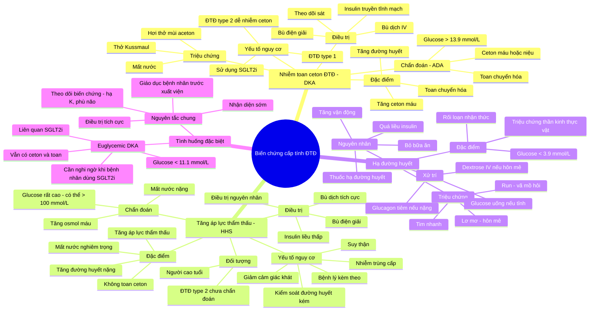
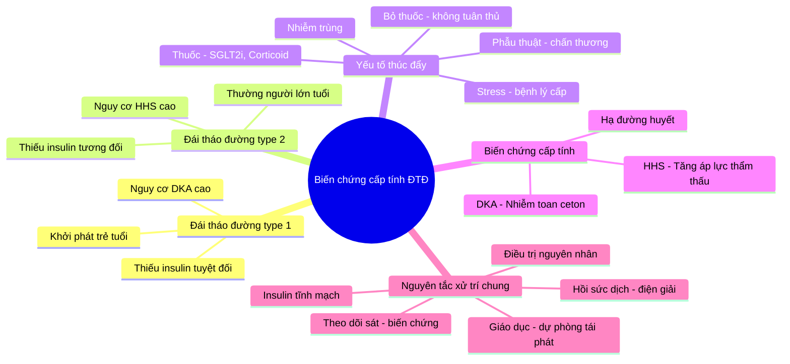

# Bài Học: Chẩn Đoán và Điều Trị Các Biến Chứng Cấp Tính của Bệnh Đái Tháo Đường

## Mục Tiêu Học Tập

Sau khi hoàn thành bài học này, người học sẽ có thể:
1. Phân biệt được ba biến chứng cấp tính chính của đái tháo đường (ĐTĐ): Hôn mê tăng áp lực thẩm thấu (HHS), Nhiễm toan ceton do đái tháo đường (DKA), và Hạ đường huyết (Hypoglycemia)
2. Trình bày được tiêu chuẩn chẩn đoán của từng biến chứng
3. Giải thích được nguyên lý điều trị cốt lõi của từng biến chứng
4. Nhận diện được các yếu tố nguy cơ và tình huống đặc biệt (euglycemic DKA)

---

## Phần 1: Tổng Quan – Ba Biến Chứng Cấp Tính Chính

### 1.1 Bối cảnh lâm sàng

Các biến chứng cấp tính của ĐTĐ là những tình trạng **đe dọa tính mạng**, cần được **nhận diện và xử trí khẩn cấp**. Khoảng **1% tổng số ca nhập viện** ở người bệnh ĐTĐ là do các cơn tăng đường huyết cấp tính [3].

| Biến chứng | Đặc điểm cốt lõi | Đối tượng thường gặp |
|------------|------------------|---------------------|
| **DKA** (Nhiễm toan ceton) | Tăng đường huyết + Toan chuyển hóa + Tăng ceton | ĐTĐ type 1, ĐTĐ type 2 có xu hướng nhiễm ceton |
| **HHS** (Hôn mê tăng áp lực thẩm thấu) | Tăng đường huyết rất nặng + Tăng áp lực thẩm thấu + Mất nước nặng, **không** toan | Người cao tuổi, ĐTĐ type 2 |
| **Hạ đường huyết** | Đường huyết < 70 mg/dL (3.9 mmol/L) | Người dùng insulin hoặc sulfonylurea |

### 1.2 Nguyên lý sinh lý bệnh nền tảng

**Điểm mấu chốt để hiểu**: Cả DKA và HHS đều xuất phát từ **thiếu hụt insulin tương đối hoặc tuyệt đối**, dẫn đến:

- **Tăng đường huyết**: Do tăng sản xuất glucose tại gan (tân tạo đường – gluconeogenesis) và giảm sử dụng glucose ở mô ngoại biên
- **Mất nước**: Do tăng đường huyết gây lợi niệu thẩm thấu (osmotic diuresis) – glucose "kéo" nước ra ngoài qua thận

**Sự khác biệt then chốt giữa DKA và HHS**:
- Trong **DKA**: Thiếu insulin **tuyệt đối** → cơ thể chuyển sang đốt cháy chất béo → tạo ceton → toan chuyển hóa
- Trong **HHS**: Thiếu insulin **tương đối** → vẫn còn đủ insulin để **ức chế** quá trình phân giải mỡ (lipolysis) và tạo ceton (ketogenesis) → **không có toan** nhưng đường huyết tăng rất cao [7]

> 💡 **Ghi nhớ nhanh**: "DKA = đói nhiên liệu (đốt mỡ tạo ceton), HHS = mất nước cực độ (đường rất cao nhưng không toan)"

---

## Phần 2: Nhiễm Toan Ceton do Đái Tháo Đường (DKA)

### 2.1 Định nghĩa và cơ chế

DKA là biến chứng chuyển hóa cấp tính đe dọa tính mạng, đặc trưng bởi **tam chứng**: tăng đường huyết, tăng ceton máu, và toan chuyển hóa [2].

**Cơ chế bệnh sinh (4 bước)**:
1. **Thiếu insulin** (tuyệt đối hoặc tương đối) + **tăng hormone đối kháng** (glucagon, cortisol, growth hormone, catecholamines)
2. **Tăng phân giải mỡ** (lipolysis) tại mô mỡ → giải phóng acid béo tự do
3. **Gan chuyển hóa acid béo** → tạo thể ceton (beta-hydroxybutyrate, acetoacetate) [8]
4. **Tích tụ ceton** → toan chuyển hóa khoảng trống anion (anion gap metabolic acidosis)

### 2.2 Đối tượng nguy cơ

- **ĐTĐ type 1**: Nguy cơ cao nhất do thiếu insulin tuyệt đối
- **ĐTĐ type 2**: Có thể xảy ra trong tình huống stress (phẫu thuật, chấn thương, nhiễm trùng, dùng corticosteroid liều cao) [5]
- **ĐTĐ type 2 dùng SGLT2 inhibitors**: Nguy cơ DKA, đặc biệt là **euglycemic DKA** (DKA không tăng đường huyết) [2][5]
- **Nhóm đặc biệt nguy cơ cao**: Người rất trẻ, người cao tuổi, phụ nữ mang thai [5]

### 2.3 Tiêu chuẩn chẩn đoán

Theo **Hiệp hội Đái tháo đường Hoa Kỳ (ADA)** [2]:

| Tiêu chí | Giá trị |
|----------|---------|
| Ceton máu hoặc ceton niệu | Dương tính |
| Đường huyết | > 13.9 mmol/L (> 250 mg/dL) |
| Bicarbonate huyết thanh (HCO₃⁻) | < 18 mmol/L |
| pH động mạch | < 7.3 |
| Khoảng trống anion (Anion gap) | > 10 |

> ⚠️ **Lưu ý quan trọng**: Với bệnh nhân đang dùng **SGLT2 inhibitors**, **không bắt buộc** phải có tăng đường huyết để chẩn đoán DKA do nguy cơ euglycemic DKA [2][4].

### 2.4 Phân loại mức độ nặng (theo ADA) [2]

| Mức độ | Đặc điểm |
|--------|----------|
| **Nhẹ** | pH 7.25–7.30, HCO₃⁻ 15–18 mmol/L |
| **Trung bình** | pH 7.00–7.24, HCO₃⁻ 10–14 mmol/L |
| **Nặng** | pH < 7.00, HCO₃⁻ < 10 mmol/L |

### 2.5 Triệu chứng lâm sàng

**Triệu chứng kinh điển** [7]:
- Khát nhiều (polydipsia), tiểu nhiều (polyuria)
- Mất nước, nhịp tim nhanh (tachycardia), thở nhanh (tachypnea)
- **Thở Kussmaul**: Thở sâu, nhanh, gắng sức – là cơ chế bù trừ cho toan chuyển hóa [2]
- **Hơi thở có mùi acetone** (mùi trái cây chín)
- Buồn nôn, nôn, đau bụng
- Nhìn mờ, đau đầu, lú lẫn, buồn ngủ, giảm dần ý thức [7]

### 2.6 DKA trong thai kỳ – Tình huống đặc biệt

- DKA ở phụ nữ mang thai có thể **nặng hơn, diễn tiến nhanh hơn**, và xuất hiện với **đường huyết thấp hơn** so với người không mang thai [7]
- **Tỷ lệ thai lưu (fetal demise) có thể lên đến 35%** [7]
- Yếu tố thúc đẩy: Không tuân thủ insulin, nhiễm trùng, dùng glucocorticoid hoặc thuốc giảm co beta-mimetic [7]

---

## Phần 3: Hôn Mê Tăng Áp Lực Thẩm Thấu (HHS)

### 3.1 Định nghĩa và cơ chế

HHS là tình trạng **tăng đường huyết nghiêm trọng và tăng áp lực thẩm thấu** mà **không có** nhiễm ceton nặng và toan chuyển hóa [6].

**Cơ chế bệnh sinh** [7]:
- Thiếu insulin **tương đối** (không tuyệt đối như DKA)
- Hormone đối kháng (glucagon, catecholamines, cortisol) tăng → kích thích phân giải glycogen (glycogenolysis) và tân tạo đường (gluconeogenesis)
- **Insulin còn đủ để ức chế phân giải mỡ và tạo ceton** → không có toan
- Hậu quả: Tăng đường huyết rất nặng → lợi niệu thẩm thấu → mất nước nghiêm trọng và tăng áp lực thẩm thấu

### 3.2 Dịch tễ học và tiên lượng

- **Tỷ lệ tử vong: 15–20% hoặc cao hơn** ở người lớn – **cao hơn đáng kể so với DKA** [1][7]
- Thường gặp hơn ở **người cao tuổi** [1]
- Đường huyết có thể lên đến mức **báo động: 1800 mg/dL (100 mmol/L)** [1]

### 3.3 Yếu tố nguy cơ và yếu tố thúc đẩy

**Yếu tố nguy cơ ở người cao tuổi** [1]:
- Bệnh đi kèm (comorbidities)
- Giảm cảm giác khát (diminished thirst response)
- Suy thận
- Kiểm soát đường huyết kém
- Sai lầm dinh dưỡng
- Nhiễm trùng cấp tính

**Yếu tố thúc đẩy chính** [1][7]:
- **Nhiễm trùng (50–60% các trường hợp)**
- Không tuân thủ điều trị
- Hạn chế uống nước
- Thuốc: Beta-blockers, thiazide, glucocorticoid, thuốc chống loạn thần thế hệ 2 (second-generation antipsychotics) [1][7]

### 3.4 Tiêu chuẩn chẩn đoán

Theo **Consensus Report về Khủng hoảng Tăng đường huyết ở Người lớn** [6] – **cần đủ 4 tiêu chí**:

| Tiêu chí | Giá trị |
|----------|---------|
| Đường huyết huyết tương | > 600 mg/dL (33.3 mmol/L) |
| pH tĩnh mạch | > 7.25 |
| pH động mạch | > 7.30 |
| Bicarbonate huyết thanh | > 15 mmol/L |
| Ceton niệu | Nhẹ, ceton máu không có hoặc nhẹ |
| Áp lực thẩm thấu hiệu dụng (Effective serum osmolality) | > 320 mOsm/kg |

> 💡 **Lưu ý**: Hơn **1/3 số người bệnh** có biểu hiện **chồng lấp lâm sàng giữa DKA và HHS** [6]. Mặc dù hầu hết bệnh nhân HHS có pH ≥ 7.30 và HCO₃⁻ ≥ 18 mmol/L, **ceton máu nhẹ vẫn có thể hiện diện** [6].

### 3.5 So sánh DKA và HHS – Bảng đối chiếu chẩn đoán [7]

| Chỉ số | HHS | DKA |
|--------|-----|-----|
| pH động mạch | > 7.30 | ≤ 7.30 |
| Đường huyết huyết tương | > 600 mg/dL | > 250 mg/dL |
| Bicarbonate huyết thanh | > 15 mEq/L | < 18 mEq/L |
| Khoảng trống anion | < 12 | > 12 |
| Áp lực thẩm thấu huyết thanh | > 320 mOsm/kg | Thay đổi |
| Ceton | Không hoặc vết (trace) | Hiện diện |

### 3.6 Đặc điểm lâm sàng

- **Khởi phát từ từ** hơn DKA, triệu chứng phát triển qua **nhiều ngày** [7]
- **Thiếu hụt nước lớn hơn**: HHS ~9 L so với DKA ~6 L [7]
- **Rối loạn ý thức là dấu hiệu kinh điển** [7]
- Co giật và liệt nửa người thoáng qua (transient hemiplegia) có thể gặp [7]
- Sốt hoặc bạch cầu > 25,000/μL gợi ý **nhiễm trùng tiềm ẩn** [7]

---

## Phần 4: Hạ Đường Huyết (Hypoglycemia)

### 4.1 Định nghĩa

Hạ đường huyết là hội chứng lâm sàng với **rối loạn chức năng thần kinh tự chủ và suy giảm nhận thức** khi đường huyết giảm dưới ngưỡng sinh lý bình thường [7].

**Ngưỡng chẩn đoán ở người ĐTĐ**: Đường huyết < 70 mg/dL (3.9 mmol/L) [7]

### 4.2 Tầm quan trọng lâm sàng

> ⚠️ **Dữ liệu đáng chú ý**: Nhập viện vì **hạ đường huyết nặng có nguy cơ tử vong cao hơn** nhập viện vì tăng đường huyết ở bệnh nhân Medicare Hoa Kỳ [7].

**Xu hướng dịch tễ học** [7]:
- Nhập viện vì tăng đường huyết: **Giảm 39%** (1999–2011)
- Nhập viện vì hạ đường huyết: **Tăng 12%** (cùng giai đoạn)

### 4.3 Yếu tố thúc đẩy [7]

| Nhóm | Yếu tố |
|------|--------|
| **Tác dụng phụ thuốc** | Insulin, sulfonylurea (thuốc kích thích tiết insulin), beta-blockers, ACE inhibitors, rượu |
| **Bệnh lý** | Nhiễm trùng huyết, nhồi máu cơ tim, suy thận, suy gan, suy thượng thận |
| **Ung thư** | Insulinoma, khối u sản xuất IGF-2, gánh nặng khối u lớn |
| **Khác** | Sau phẫu thuật dạ dày, nhịn đói, bệnh tự miễn |

### 4.4 Triệu chứng lâm sàng [7]

**Triệu chứng thần kinh do thiếu glucose (Neuroglycopenic)**:
- Rối loạn ý thức, lơ mơ, lú lẫn
- Đau đầu, chóng mặt
- Khiếm khuyết thần kinh khu trú
- Rối loạn thị giác
- Co giật, không đáp ứng

**Triệu chứng tự chủ/Cholinergic**:
- Nhịp tim bất thường (nhanh hoặc chậm)
- Lo âu, hồi hộp (palpitations)
- Vã mồ hôi (diaphoresis)
- Run tay
- Buồn nôn, nôn

### 4.5 Nguyên tắc xử trí [7]

**Bệnh nhân tỉnh táo, nuốt được**:
- Cho **15–20 g carbohydrate hấp thu nhanh** (nước trái cây, nước ngọt, gel glucose)
- Kiểm tra lại đường huyết sau **15 phút**, mục tiêu ≥ 100 mg/dL
- Cho ăn nhẹ sau đó để giảm nguy cơ tái phát
- Nếu đường huyết không tăng: Lặp lại, cân nhắc dextrose đường tĩnh mạch

**Bệnh nhân lơ mơ, không nuốt được, hoặc hạ đường huyết dai dẳng**:
- **Dextrose đường tĩnh mạch**: 25 g dextrose 50% (bolus), hoặc 10 g dextrose 10% (bolus), hoặc 25 g dextrose 10% truyền trong 20 phút
- **Glucagon tiêm bắp**: 1 mg

---

## Phần 5: Nguyên Tắc Điều Trị DKA và HHS

### 5.1 Ba trụ cột điều trị [3][8]

Theo **Standards of Care in Diabetes—2026** (Khuyến cáo 16.16, Mức khuyến cáo A) [3]:

> "Xử trí DKA và HHS bằng cách **truyền dịch tĩnh mạch, insulin, và điện giải**, đồng thời theo dõi chặt chẽ trong quá trình điều trị, đảm bảo chuyển tiếp kịp thời và liền mạch sang insulin tiêm dưới da duy trì, và xác định cũng như điều trị nguyên nhân thúc đẩy." [3]

| Trụ cột | Mục tiêu |
|---------|----------|
| **1. Bù dịch (Fluid resuscitation)** | Phục hồi thể tích tuần hoàn, cải thiện tưới máu mô |
| **2. Insulin** | Ức chế tạo ceton, giảm đường huyết |
| **3. Bù điện giải** | Đặc biệt là kali (K⁺) – nguy cơ hạ kali máu |

### 5.2 Bù dịch – Khác biệt giữa DKA và HHS

**Trong HHS**: Cần **bù dịch tích cực hơn** để tránh suy sụp tuần hoàn [7].

**Lý do quan trọng**: Khi áp lực thẩm thấu huyết thanh giảm trong quá trình điều trị, nước di chuyển từ **trong lòng mạch ra ngoài khoang ngoại bào**. Sự di chuyển nước này cùng với lợi niệu thẩm thấu do tăng đường huyết cực độ có thể dẫn đến **giảm thể tích lòng mạch nhanh chóng** [7].

**Phác đồ bù dịch HHS (người lớn)** [7]:
- **Bolus đầu tiên**: ≥ 20 mL/kg dung dịch muối đẳng trương (0.9% NaCl)
- Có thể lặp lại bolus nhanh để phục hồi tưới máu ngoại biên
- Khi chuyển sang dịch duy trì: Giả định thiếu hụt thể tích **12–15% trọng lượng cơ thể**, truyền bù trong **24–48 giờ**
- Bù thêm lượng nước tiểu mất đi
- Có thể dùng NaCl 0.45% hoặc 0.9%

**Bảng hướng dẫn thay thế dịch truyền (DKA và HHS)** [7]:

| Đường huyết huyết tương | Natri hiệu chỉnh | Lựa chọn dịch truyền |
|-------------------------|------------------|---------------------|
| Ban đầu, > 600 mg/dL | n/a | 1000 mL NaCl 0.9% bolus trong giờ đầu |
| n/a | > 140 | NaCl 0.45%, tốc độ 250–500 mL/h |
| n/a | < 140 | NaCl 0.9%, tốc độ 250–500 mL/h |
| < 250 mg/dL | n/a | Thêm D5 vào dịch NaCl |

### 5.3 Insulin

**Nguyên tắc chung**:
- Bắt đầu insulin **sau khi đã bù dịch ban đầu** – một số khuyến cáo **trì hoãn insulin cho đến khi đường huyết ngừng giảm** chỉ với bù dịch [3]
- Trong HHS: Khi tốc độ giảm đường huyết chậm lại < 50 mg/dL/giờ (2.8 mmol/L/giờ), bắt đầu **insulin truyền tĩnh mạch liên tục** với tốc độ **0.025–0.05 units/kg/giờ** [7]
- Điều chỉnh liều để đường huyết giảm có kiểm soát ở mức **50–75 mg/dL mỗi giờ** [7]

### 5.4 Bù điện giải – Trọng tâm là Kali

**Nguy cơ hạ kali máu** là mối đe dọa chính trong điều trị DKA và HHS [4][8].

**Bảng bù kali trong DKA và HHS** [7]:

| Kali huyết thanh | Insulin | Bù kali tĩnh mạch |
|------------------|---------|-------------------|
| < 3.3 mEq/L | **Tạm ngừng** | 20–30 mEq/giờ cho đến khi K > 3.3 mEq/L |
| 3.3–5.3 mEq/L | Tiếp tục | 20–30 mEq/L dịch truyền để duy trì K 4–5 mEq/L |
| > 5.3 mEq/L | Tiếp tục | **Tạm ngừng** bù kali |

**Lưu ý đặc biệt cho HHS** [7]:
- HHS thường mất **nhiều kali, phosphate, và magnesium hơn DKA**
- Bù kali: Thêm **40 mmol/L** vào dịch truyền khi chức năng thận đủ và kali huyết thanh trong giới hạn bình thường
- Bù phosphate: Dung dịch pha **50:50 kali phosphate + muối kali khác** (kali chloride hoặc kali acetate)
- Bù magnesium: Cân nhắc khi hạ magnesium máu nặng kèm hạ calci máu, liều khởi đầu **25–50 mg/kg/liều**, 3–4 liều, mỗi 4–6 giờ
- **Theo dõi điện giải mỗi 2–4 giờ** (kali, calci, magnesium, phosphate)

> ⛔ **Chống chỉ định**: **Bicarbonate** trong HHS vì làm **tăng nguy cơ hạ kali máu** và **suy giảm cung cấp oxy cho mô** [7].

### 5.5 Tiêu chuẩn giải quyết (Resolution criteria) [3]

| Biến chứng | Tiêu chuẩn giải quyết |
|------------|----------------------|
| **DKA** | pH tĩnh mạch > 7.3 HOẶC bicarbonate > 18 mmol/L VÀ ceton huyết tương/mao mạch giảm |
| **HHS** | Áp lực thẩm thấu huyết thanh tính toán giảm xuống mức phù hợp VÀ đường huyết kiểm soát được |

> 💡 **Lưu ý**: Sử dụng **phán đoán lâm sàng** – không trì hoãn xuất viện hoặc chuyển mức độ chăm sóc nếu các tiêu chuẩn này chưa đạt được [3].

### 5.6 Theo dõi và phòng ngừa tái phát

**Theo dõi trong điều trị** [4]:
- Hạ đường huyết (hypoglycemia)
- Hạ kali máu (hypokalemia)
- Phù não (cerebral edema) – đặc biệt ở trẻ em

**Phòng ngừa tái phát** [3-4]:
- **Đánh giá tuân thủ điều trị** (medication adherence)
- **Xác định và điều trị yếu tố thúc đẩy**: Nhiễm trùng cấp tính, biến cố tim mạch, thuốc gây tăng đường huyết [4]
- **Giáo dục bệnh nhân** về nhận biết, phòng ngừa và xử trí DKA/HHS trước khi xuất viện (Khuyến cáo 16.17, Mức B) [3]

---

## Phần 6: Tình Huống Đặc Biệt – Euglycemic DKA (DKA không tăng đường huyết)

### 6.1 Định nghĩa và bối cảnh

Euglycemic DKA (euDKA) là DKA xảy ra với **đường huyết không tăng đáng kể** – thường gặp ở bệnh nhân dùng **SGLT2 inhibitors** [2][5][7].

**Tỷ lệ**: Khoảng **10% số người trải qua DKA** có biểu hiện euglycemic DKA [3].

### 6.2 Vì sao nguy hiểm?

- Do **không có tăng đường huyết rõ rệt**, euDKA có thể **bị bỏ sót**, dẫn đến **chẩn đoán và điều trị trì hoãn** [5]
- Bệnh nhân có thể có toan chuyển hóa nặng nhưng đường huyết chỉ tăng nhẹ hoặc bình thường

### 6.3 Khuyến cáo lâm sàng

- **Nghi ngờ DKA** ở bệnh nhân dùng SGLT2 inhibitors có **tình trạng toàn trạng kém** ngay cả khi **không có tăng đường huyết** [4]
- **Không bắt buộc có tăng đường huyết** để chẩn đoán DKA ở bệnh nhân đang dùng SGLT2i [2]
- **Bác sĩ gia đình cần thông báo** cho tất cả bệnh nhân bắt đầu dùng SGLT2 inhibitors về nguy cơ DKA/euDKA, bao gồm triệu chứng, dấu hiệu, và hướng dẫn xử trí [5]
- **Đặc biệt lưu ý**: Giai đoạn **chu phẫu (perioperative)** và khi có **bệnh lý đan xen nghiêm trọng** (significant intercurrent illness) [5]

---

## Phần 7: Tóm Tắt và Câu Hỏi Tự Lượng Giá

### 7.1 Bảng tóm tắt nhanh

| Đặc điểm | DKA | HHS | Hạ đường huyết |
|----------|-----|-----|----------------|
| Đường huyết | > 250 mg/dL | > 600 mg/dL | < 70 mg/dL |
| pH | < 7.3 | > 7.3 | Bình thường |
| Ceton | Hiện diện | Không/vết | Không |
| Toan chuyển hóa | Có | Không | Không |
| Mất nước | Có (6 L) | Nặng (9 L) | Không |
| Tử vong | Thấp hơn | 15–20% | Nguy cơ cao khi nhập viện |
| Điều trị chính | Dịch + Insulin + Kali | Dịch tích cực + Insulin liều thấp + Kali | Glucose/Glucagon |

### 7.2 Câu hỏi tự lượng giá

**Câu 1**: Bệnh nhân nam 72 tuổi, ĐTĐ type 2, được đưa vào cấp cứu trong tình trạng lơ mơ. Xét nghiệm: Đường huyết 850 mg/dL, pH 7.35, HCO₃⁻ 22 mmol/L, ceton niệu âm tính, osmolality huyết thanh 340 mOsm/kg. Chẩn đoán phù hợp nhất là gì?

<b>Đáp án</b>

HHS. Bệnh nhân có tăng đường huyết rất nặng (> 600 mg/dL), tăng áp lực thẩm thấu (> 320 mOsm/kg), pH và bicarbonate bình thường, không có ceton – phù hợp tiêu chuẩn chẩn đoán HHS [6-7].

**Câu 2**: Bệnh nhân nữ 28 tuổi, ĐTĐ type 1, đang dùng insulin. Nhập viện vì nôn, đau bụng, thở nhanh sâu. Đường huyết 320 mg/dL, pH 7.18, HCO₃⁻ 12 mmol/L, anion gap 18, ceton máu dương tính. Chẩn đoán và mức độ nặng?

<b>Đáp án</b>

DKA mức độ trung bình. Tiêu chuẩn: Đường huyết > 250 mg/dL, pH 7.00–7.24, HCO₃⁻ 10–14 mmol/L, anion gap > 10, ceton dương tính [2].

**Câu 3**: Bệnh nhân nam 60 tuổi, ĐTĐ type 2, đang dùng empagliflozin (SGLT2 inhibitor), nhập viện vì mệt, buồn nôn sau đợt nhiễm trùng hô hấp. Đường huyết 180 mg/dL, pH 7.20, HCO₃⁻ 14 mmol/L, ceton máu dương tính. Chẩn đoán?

<b>Đáp án</b>

Euglycemic DKA. Bệnh nhân dùng SGLT2 inhibitor có DKA với đường huyết không tăng đáng kể. Không bắt buộc có tăng đường huyết để chẩn đoán DKA ở nhóm này [2][4-5].

**Câu 4**: Trong điều trị HHS, tại sao cần bù dịch tích cực hơn so với DKA?

<b>Đáp án</b>

Vì khi áp lực thẩm thấu huyết thanh giảm trong quá trình điều trị, nước di chuyển từ trong lòng mạch ra ngoài khoang ngoại bào. Sự di chuyển nước này cùng với lợi niệu thẩm thấu do tăng đường huyết cực độ có thể dẫn đến giảm thể tích lòng mạch nhanh chóng, gây suy sụp tuần hoàn [7].

**Câu 5**: Bệnh nhân DKA có kali huyết thanh 3.0 mEq/L. Xử trí insulin như thế nào?

<b>Đáp án</b>

Tạm ngừng insulin và bù kali 20–30 mEq/giờ cho đến khi kali > 3.3 mEq/L trước khi bắt đầu hoặc tiếp tục insulin. Nguyên tắc: Không bao giờ bắt đầu insulin khi kali < 3.3 mEq/L vì insulin sẽ đẩy kali vào trong tế bào, làm hạ kali máu trầm trọng hơn [7].

---

## Phần 8: Các Bẫy Lâm Sàng Thường Gặp (Clinical Pitfalls)

| Bẫy | Hậu quả | Cách tránh |
|-----|---------|------------|
| Bỏ sót euDKA ở bệnh nhân dùng SGLT2i | Trì hoãn điều trị, toan nặng hơn | Luôn nghĩ đến DKA khi bệnh nhân SGLT2i có toàn trạng kém, dù đường huyết bình thường [4-5] |
| Bắt đầu insulin khi kali < 3.3 mEq/L | Hạ kali máu nặng, rối loạn nhịp tim | Kiểm tra kali trước, bù kali trước/đồng thời [7] |
| Dùng bicarbonate trong HHS | Tăng nguy cơ hạ kali máu, giảm cung cấp oxy mô | Chống chỉ định bicarbonate trong HHS [7] |
| Bù dịch không đủ tích cực trong HHS | Suy sụp tuần hoàn do giảm thể tích lòng mạch | Bolus ≥ 20 mL/kg NaCl 0.9% ngay từ đầu [7] |
| Không xác định yếu tố thúc đẩy | Tái phát DKA/HHS, tăng tỷ lệ nhập viện lại | Luôn tìm và điều trị nhiễm trùng, đánh giá tuân thủ thuốc [3-4] |
| Không giáo dục bệnh nhân trước xuất viện | Không nhận biết sớm triệu chứng, tái phát | Giáo dục về nhận biết, phòng ngừa, xử trí DKA/HHS [3] |

---

## Kết Luận

Ba biến chứng cấp

References:
[1] https://www.medsci.cn/guideline/show_article.do?id=bc9591c005318a40
[2] Intensive Care Manual[M]. Philadelphia: Elsevier; 2026.
[3] https://www.medsci.cn/guideline/show_article.do?id=e494b1c00530a55a
[4] https://dx.doi.org/10.4093/dmj.2025.0469
[5] Management of type 2 diabetes[M]. 2025.
[6] https://dx.doi.org/10.2337/dci24-0032
[7] Diabetes Management in Hospitalized Patients A Comprehensive Clinical Guide Contemporary Endocrinology[M]. New York: Springer Nature Switzerland; 2024.
[8] https://dx.doi.org/10.1111/dme.14788