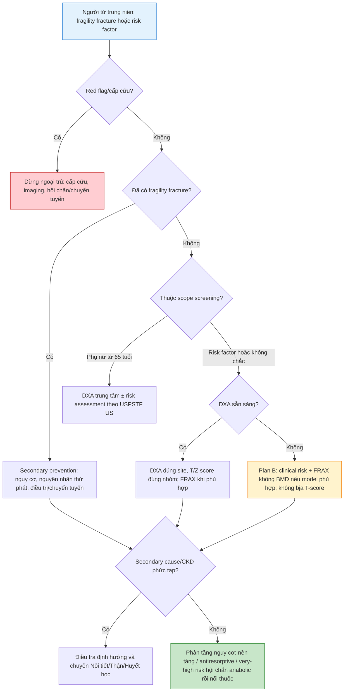

# BÀI HỌC Y KHOA: CHUYỂN HÓA XƯƠNG, VITAMIN D VÀ LOÃNG XƯƠNG
****Mã bài học:** IM-57 | Ngày:** 2026-07-22 | **Chuyên khoa:** Nội khoa — Nội tiết và chuyển hóa | **Đối tượng:** Bác sĩ, học viên sau đại học và người học mất gốc cần học từ nền tảng

---

## 0. TỔNG QUAN — VÌ SAO BÀI NÀY QUAN TRỌNG?

Loãng xương thường im lặng cho đến khi người bệnh gãy xương. Vì vậy, **tỷ lệ** người được nhận ra nguy cơ trước gãy còn chưa tương xứng với gánh nặng bệnh; **prevalence** tăng theo tuổi và **tần suất** gãy khiến mất độc lập là vấn đề thực hành quan trọng. Gãy do lực thấp không phải chỉ là “té xui”: nó buộc ta đánh giá độ bền xương, nguyên nhân thứ phát và nguy cơ gãy tiếp theo. BHOF xem gãy mới ở người lớn tuổi là một sentinel event cần đánh giá và can thiệp kịp thời (PMID: 35478046) [ABSTRACT VERIFIED].

**Mục tiêu của bài:**
- Nhận diện gãy fragility, red flag và người cần đánh giá nguy cơ.
- Đọc đúng vai trò của DXA, T-score, Z-score và FRAX; không dùng một con số thay thế suy luận lâm sàng.
- Phân tầng điều trị, chuẩn bị an toàn trước thuốc và lập kế hoạch theo dõi/chuyển tuyến.

> **HỘP PHẠM VI — RANH GIỚI VỚI CÁC BÀI KHÁC**
>
> - IM-57 sở hữu chuyển hóa/tái cấu trúc xương, vitamin D, nguy cơ gãy, DXA/FRAX, loãng xương và chiến lược giảm gãy.
> - Hạ hoặc tăng calcium/phosphat/magnesi cấp, cường cận giáp: chuyển sang IM-55 khi bài đó sẵn sàng.
> - CKD và bệnh xương do CKD cần phối hợp/chuyển chuyên khoa thận theo IM-44; không dùng bảng thuốc này thay thế đánh giá CKD-MBD.
> - Té ngã, suy yếu và phục hồi chức năng: nối với IM-88. Đau/viêm khớp, gout và bệnh hệ thống thuộc IM-81–IM-86.

### 0.1 Nền tảng tối thiểu cần dùng ngay

**Xương vỏ** là lớp vỏ cứng giúp xương chịu lực; **xương bè** là mạng bè bên trong, chuyển hóa nhanh và dễ tổn thương khi mất cân bằng kéo dài. Xương không phải vật vô tri: nó vừa chịu lực vừa được thay mới liên tục.

**Osteoblast** là tế bào tạo phần nền xương mới; **osteoclast** là tế bào tiêu xương cũ; **osteocyte** nằm trong xương, cảm nhận tải lực và điều phối sửa chữa. Chu kỳ lấy phần xương cũ đi rồi tạo phần mới gọi là **remodeling**. Bình thường, tiêu và tạo cân bằng; khi tiêu vượt tạo kéo dài, xương mất sức bền.

**Vitamin D, calcium, phosphat và PTH** là một hệ phối hợp. Vitamin D từ da/thức ăn được chuyển thành 25(OH)D rồi dạng hoạt động; calcium và phosphat là vật liệu khoáng hóa; PTH giúp điều hòa chúng. Bài này chỉ dùng nền tảng ấy để hiểu xương; rối loạn điện giải cấp thuộc bài khác. [TEXTBOOK: Harrison’s 21e, calcium and bone metabolism]

**Gãy do lực thấp (fragility fracture)** là gãy sau cơ chế lẽ ra không làm gãy xương khỏe, điển hình là té từ tư thế đứng. Đừng phủ nhận ý nghĩa chỉ vì người bệnh “có té”; lực và độ bền xương phải được xét cùng nhau.

---

## 1. ĐỊNH NGHĨA — TỪ XƯƠNG YẾU ĐẾN GÃY XƯƠNG [CỐT LÕI]

### 1.1 Loãng xương là gì?

**Loãng xương (osteoporosis)** là bệnh lý xương làm giảm độ bền xương và tăng nguy cơ gãy. Độ bền không chỉ là mật độ khoáng xương (BMD), mà còn chịu ảnh hưởng của cấu trúc, chất lượng và nguy cơ té. Vì thế, một DXA không thay thế hỏi bệnh, khám và nhận diện nguyên nhân thứ phát.

Loãng xương thường không gây đau. Đau xuất hiện khi có gãy, biến dạng cột sống, nguyên nhân khác ở xương, hoặc bệnh khác hoàn toàn. Mục tiêu điều trị là **ngừa gãy đầu tiên hoặc gãy tiếp theo**, không chỉ “làm đẹp T-score”.

### 1.2 Gãy fragility và gãy kế tiếp

Một gãy mới ở người trưởng thành lớn tuổi cần kích hoạt đánh giá nguy cơ gãy tiếp theo. Đặc biệt, gãy đốt sống lâm sàng hoặc dưới lâm sàng liên quan nguy cơ gãy thêm cao hơn (PMID: 35478046) [ABSTRACT VERIFIED]. Vì vậy, secondary prevention không đợi đến khi DXA “đủ thấp”.

| Khái niệm | Nghĩa thực hành | Hành động đầu tiên |
|---|---|---|
| Fragility fracture | Gãy sau lực thấp | Đánh giá cấp cứu/red flag, rồi tìm nguy cơ và nguyên nhân |
| Osteoporosis | Độ bền xương giảm, nguy cơ gãy tăng | Phân tầng nguy cơ, không nhìn BMD đơn độc |
| Osteomalacia | Khoáng hóa xương bất thường | Tìm rối loạn chuyển hóa, không tự gán là osteoporosis |

> ⚠️ **HỌC VIÊN HAY NHẦM:** “Có té nên không phải osteoporosis.” Té có thể là lực gây gãy; độ bền xương quyết định vì sao lực đó đủ làm gãy.

### 🛑 DỪNG 1 PHÚT — TỰ KIỂM TRA
> 1. Vì sao fragility fracture không thể bị bỏ qua chỉ vì người bệnh có té?
> 2. BMD và nguy cơ gãy có phải là cùng một khái niệm không?
>
> *(Đáp án: Té và xương yếu cùng góp phần; BMD là một phần của đánh giá nguy cơ, không phải toàn bộ độ bền xương.)*

---

## 2. CƠ CHẾ — REMODELING, VITAMIN D VÀ MẤT ĐỘ BỀN XƯƠNG [CỐT LÕI]

### 2.1 Remodeling bình thường

Ở vị trí xương bị vi tổn thương, osteoclast tiêu phần xương cũ, rồi osteoblast tạo osteoid và khoáng hóa thành xương mới. Osteocyte giúp cảm nhận tải lực để quá trình này phù hợp nhu cầu cơ học. Chu kỳ này sửa chữa xương, không phải dấu hiệu bệnh. [TEXTBOOK: Robbins & Cotran 10e, bone]

| Thành phần | Vai trò bình thường | Khi mất cân bằng kéo dài |
|---|---|---|
| Osteoclast | Tiêu xương cũ có kiểm soát | Tiêu vượt tạo, mất xương |
| Osteoblast | Tạo osteoid và xương mới | Tạo không bù đủ phần đã mất |
| Osteocyte | Cảm nhận tải lực, điều phối | Tín hiệu cơ học/điều hòa thay đổi |

### 2.2 Vitamin D, PTH, calcium và phosphat

Vitamin D hỗ trợ hệ calcium–phosphat cần cho khoáng hóa. Khi người bệnh có nguy cơ thiếu vitamin D hoặc nghi osteomalacia, đánh giá phải đặt trong bối cảnh lâm sàng và xét nghiệm thích hợp; không dùng xét nghiệm vitamin D đại trà ở người khỏe mạnh chỉ để “phòng bệnh”. Endocrine Society không tìm thấy bằng chứng ủng hộ routine 25(OH)D screening ở các quần thể không có chỉ định đã xác lập (PMID: 38828931) [ABSTRACT VERIFIED].

### 2.3 Vì sao tuổi, thuốc và bệnh nền làm nguy cơ tăng?

Tuổi tăng, tiền sử gãy, cân nặng thấp, hút thuốc, rượu quá mức, glucocorticoid, bệnh nội tiết, malabsorption, CKD và thuốc gây mất xương có thể làm nguy cơ tăng. Một số yếu tố làm BMD giảm; số khác làm nguy cơ gãy tăng ngoài BMD, ví dụ té ngã. NOGG nhấn mạnh clinical judgement khi nguy cơ vượt những biến số FRAX có thể nhập. [NOGG 2024 — GUIDELINE VERIFIED]

---

## 3. CHẨN ĐOÁN — AN TOÀN TRƯỚC, ĐÁNH GIÁ ĐÚNG SAU [CỐT LÕI]

> 🚨 **BOX ĐỎ — DỪNG NHÁNH NGOẠI TRÚ**
>
> | Dấu hiệu → nguy cơ | Hành động ngay | Nơi chuyển |
> |---|---|---|
> | Đau dữ dội sau té, biến dạng chi, không chịu lực được; hoặc đau lưng cấp kèm yếu/tê/rối loạn cơ tròn → gãy cổ xương đùi/cột sống cấp hoặc chèn ép thần kinh | Đánh giá cấp cứu, bất động phù hợp, hình ảnh học và hội chẩn; **không** tiếp tục work-up osteoporosis ngoại trú | Cấp cứu/Chấn thương chỉnh hình/Thần kinh |
> | Đau xương kèm tăng calcium, thiếu máu, suy thận, sụt cân → myeloma/malignancy/di căn | Đánh giá cấp cứu hoặc khẩn, xét nghiệm/hình ảnh theo tuyến; không gán là osteoporosis | Cấp cứu/Huyết học–Ung bướu |
> | Hạ calcium có triệu chứng trước thuốc parenteral → biến cố do điều trị | Xử trí hạ calcium và xác định nguyên nhân trước thuốc | Cấp cứu/Nội tiết |
> | Đau đùi, bẹn hoặc hông mới ở người dùng antiresorptive → AFF | Hình ảnh femur, đánh giá bên đối diện khi AFF xác định | Chuyên khoa xương/Chấn thương chỉnh hình |
> | Gãy đốt sống mới sau trễ/ngừng denosumab → rebound fracture | Không tự “bù lịch” hoặc ngừng thuốc; lập kế hoạch antiresorptive/chuyển chuyên khoa khẩn | Nội tiết/Loãng xương |

### 3.1 Hỏi bệnh theo đường nguy cơ

Bắt đầu bằng: có gãy sau lực thấp không; có đau cấp/red flag không; có giảm chiều cao, kyphosis, đau lưng mới không; tiền sử gia đình gãy hông; thuốc như glucocorticoid; hút thuốc/rượu; bệnh nội tiết, tiêu hóa hấp thu kém, bệnh gan/thận; tiền sử té ngã và khả năng vận động.

| Nhóm nguy cơ | Gợi ý cần hỏi | Quyết định thay đổi |
|---|---|---|
| Gãy trước đó | Cơ chế, vị trí, hình ảnh cũ | Secondary prevention, không trì hoãn vì DXA |
| Thuốc/bệnh nền | Glucocorticoid, CKD, endocrine, cancer | Tìm nguyên nhân thứ phát/chuyển tuyến |
| Té ngã | Té lặp lại, thị lực, yếu cơ, thuốc an thần | Kèm giảm nguy cơ té, không chỉ dùng thuốc xương |

### 3.2 Screening và case finding: không lẫn hai tình huống

USPSTF 2025 áp dụng cho người từ trung niên không có known osteoporosis hay fragility fracture. Hướng dẫn này khuyến cáo screening phụ nữ từ 65 tuổi bằng DXA trung tâm, có hoặc không kèm đánh giá nguy cơ gãy; phụ nữ sau mãn kinh trẻ hơn có yếu tố nguy cơ cần risk assessment trước khi quyết định DXA. Bằng chứng chưa đủ để đưa khuyến cáo screening quần thể cho nam giới (PMID: 39808425) [ABSTRACT VERIFIED]. Đây là **khung US**, không phải policy Việt Nam.

Người đã có fragility fracture hoặc yếu tố nguy cơ lâm sàng không còn là “screening đơn thuần”: họ cần **case finding**, đánh giá nguy cơ, nguyên nhân và quyết định điều trị/chuyển tuyến đúng lúc.

### 3.3 DXA: mục tiêu, cách đọc và giới hạn

DXA (dual-energy X-ray absorptiometry) đo BMD ở vị trí trung tâm. Nó giúp phân loại mật độ xương, định lượng baseline và theo dõi khi kết quả có thể thay đổi quản lý. ISCD khuyến nghị đo hip và PA spine khi phù hợp; forearm dành cho tình huống hip/spine không đo hoặc không diễn giải được, hyperparathyroidism, hoặc giới hạn bàn máy. [ISCD 2023 — GUIDELINE VERIFIED]

> 📘 **DXA là gì?** — DXA (dual-energy X-ray absorptiometry) là máy chụp X-quang liều rất thấp dùng 2 mức năng lượng để đo lượng khoáng chất trong xương. Bệnh nhân nằm yên trên bàn, máy quét qua hông và cột sống trong 5-10 phút, không đau, không tiêm thuốc. Kết quả là chỉ số BMD (bone mineral density, đơn vị g/cm²), từ đó tính ra T-score và Z-score.

> 📘 **T-score là gì?** — T-score được định nghĩa là: **(BMD của bệnh nhân - BMD trung bình của người trẻ 20-30 tuổi) / độ lệch chuẩn (SD)**. Nói cách khác, T-score cho biết mật độ xương của bạn cách người trẻ khỏe mạnh bao nhiêu độ lệch chuẩn. Theo WHO: T-score ≥ -1.0 = bình thường; -1.0 đến -2.5 = osteopenia (giảm mật độ xương); ≤ -2.5 = osteoporosis (loãng xương); ≤ -2.5 + có gãy fragility = osteoporosis nặng.

> 📘 **Z-score là gì?** — Z-score được định nghĩa là: **(BMD của bệnh nhân - BMD trung bình của người cùng tuổi, giới, chủng tộc) / độ lệch chuẩn (SD)**. Z-score so sánh bạn với người cùng lứa tuổi. Z-score < -2.0 gợi ý có nguyên nhân thứ phát gây mất xương (thuốc, bệnh nội tiết, malabsorption...) cần được tìm kiếm.

| Chỉ số | Dùng chủ yếu cho ai | Không được suy diễn |
|---|---|---|
| T-score | Phụ nữ sau mãn kinh, nam từ 50 tuổi | Không tự chẩn đoán nguyên nhân đau xương |
| Z-score | Phụ nữ trước mãn kinh, nam dưới 50 tuổi | Không chẩn đoán osteoporosis chỉ từ BMD |
| BMD | Mật độ khoáng tại vị trí đo | Không thay đánh giá té, fracture history, bệnh nền |

T-score thấp không tự nói vì sao xương yếu. Z-score thấp gợi ý cần tìm thêm nguyên nhân trong bối cảnh phù hợp. Không dùng Ward’s area hoặc các vị trí không hợp lệ để chẩn đoán. Một DXA bị artifact/thoái hóa hoặc so sánh giữa máy không cross-calibrated có thể dẫn đến kết luận sai.

### 3.4 FRAX: đưa nguy cơ vào bối cảnh

FRAX ước tính xác suất gãy dựa vào tuổi, giới, BMI và các yếu tố lâm sàng; femoral-neck BMD là đầu vào tùy chọn. Nó có thể giúp case finding khi chưa có DXA, nhưng không thay clinical judgement, không đo đáp ứng thuốc và không chứa mọi yếu tố như té ngã/frailty. Dùng model quốc gia phù hợp nếu có; không lấy threshold NOGG của UK gắn thành threshold Việt Nam. [NOGG 2024 — GUIDELINE VERIFIED]

### 3.5 Xét nghiệm nền và nguyên nhân thứ phát

Mục tiêu xét nghiệm không phải “làm đủ danh sách”, mà là tìm nguyên nhân thay đổi điều trị hoặc làm thuốc nguy hiểm. Chọn xét nghiệm nền theo bệnh sử/khám: calcium, phosphat, chức năng thận, xét nghiệm liên quan vitamin D/PTH khi có chỉ định, công thức máu và các xét nghiệm định hướng endocrine, malabsorption hoặc myeloma khi nghi ngờ.

| Câu hỏi lâm sàng | Dữ liệu cần cân nhắc | Hành động nếu bất thường |
|---|---|---|
| Có rối loạn khoáng hóa? | Calcium, phosphat, vitamin D/PTH theo chỉ định | Phân biệt osteomalacia/rối loạn PTH; không vội dùng thuốc xương |
| Có CKD-MBD? | Chức năng thận, mineral parameters | Phối hợp Thận–Nội tiết |
| Có malignancy/myeloma? | CBC, calcium, renal function, xét nghiệm/hình ảnh định hướng | Chuyển Huyết học–Ung bướu |

### 3.6 Chẩn đoán phân biệt: khi low BMD không đủ lời giải

| Tình huống | Điểm dễ giống osteoporosis | Điểm quyết định |
|---|---|---|
| Osteomalacia | Đau xương, low BMD | Rối loạn khoáng hóa/nguyên nhân thiếu vitamin D hoặc phosphat cần tìm |
| Cường cận giáp | Mất xương | Rối loạn PTH/calcium thuộc trục IM-55 |
| CKD-MBD | Gãy/low BMD | CKD thay đổi sinh lý khoáng xương và lựa chọn thuốc |
| Myeloma/di căn | Đau xương/gãy | Red flags toàn thân, thiếu máu, renal dysfunction, tổn thương nghi ngờ |

> ⚠️ **HỌC VIÊN HAY NHẦM:** “T-score thấp = chẩn đoán xong.” T-score trả lời về mật độ; bệnh cảnh và xét nghiệm trả lời nguyên nhân, nguy cơ và độ an toàn điều trị.

### 🛑 DỪNG 1 PHÚT — TỰ KIỂM TRA
> 1. DXA có thay thế đánh giá nguyên nhân thứ phát không?
> 2. Người có gãy hông do té từ tư thế đứng nhưng chưa có DXA thuộc screening hay case finding?
>
> *(Đáp án: Không. Người đã gãy cần case finding/secondary prevention, không chờ screening.)*

---

## 4. ĐIỀU TRỊ — GIẢM GÃY, KHÔNG CHỈ TĂNG BMD [CỐT LÕI]

### 4.1 Nền tảng cho mọi mức nguy cơ

Can thiệp nền tảng gồm vận động chịu lực và kháng lực phù hợp khả năng, dinh dưỡng đủ, ưu tiên calcium từ khẩu phần, vitamin D theo chỉ định, tránh hút thuốc/rượu quá mức và đánh giá giảm té ngã. Những việc này bổ sung chứ không thay thế thuốc khi nguy cơ đã đủ để cần thuốc. (PMID: 35478046) [ABSTRACT VERIFIED]

### 4.2 Phân tầng để chọn hướng điều trị

NOGG dùng đánh giá risk, sự phù hợp và ưu tiên người bệnh để chọn thuốc. Phần sau là khung suy luận, không đưa threshold UK thành quy tắc Việt Nam.

| Mức/bối cảnh | Hướng chính | Cần tránh |
|---|---|---|
| Nguy cơ thấp hoặc chưa đủ dữ liệu | Nền tảng, bổ sung đánh giá đúng mục tiêu | Kê thuốc chỉ vì một kết quả đơn lẻ |
| Nguy cơ cao/fragility fracture | Cân nhắc antiresorptive và secondary prevention | Chờ DXA khi việc đó làm trì hoãn chăm sóc cần thiết |
| Very-high risk, nhất là vertebral fracture | Hội chẩn anabolic/dual-action rồi kế hoạch nối antiresorptive | Dùng anabolic xong mà không có chiến lược nối |

### 4.3 Antiresorptive, parenteral và anabolic

**Antiresorptive** chủ yếu làm giảm tiêu xương do osteoclast. NOGG xem oral bisphosphonate hoặc IV zoledronate là lựa chọn hiệu quả chi phí; denosumab là lựa chọn khác tùy người bệnh. **Anabolic** kích thích tạo xương; romosozumab có tác dụng kép. Ở very-high risk, anabolic/dual-action rồi antiresorptive nối tiếp có thể phù hợp. (PMID: 28892457; PMID: 29129436) [ABSTRACT VERIFIED]

> 💊 **BẢNG LIỀU THUỐC CHỐNG LOÃNG XƯƠNG** (cho người mới học)

| Thuốc (biệt dược phổ biến) | Đường dùng | Liều & Tần suất | Ghi chú quan trọng |
|---|---|---|---|
| **Alendronate** (Fosamax) | Uống | **70 mg/tuần** hoặc 10 mg/ngày | Uống lúc đói, 1 ly nước đầy (≥200 mL), ngồi thẳng ≥30 phút, không nằm. CCĐ: hẹp thực quản, không ngồi được 30 phút |
| **Risedronate** (Actonel) | Uống | **35 mg/tuần** hoặc 150 mg/tháng | Tương tự alendronate. Có dạng uống 1 lần/tháng tiện hơn |
| **Zoledronic acid** (Aclasta) | Truyền TM | **5 mg/năm**, truyền trong ≥15 phút | Phải bổ sung calcium + vitamin D trước. Nguy cơ phản ứng giả cúm sau truyền lần đầu |
| **Denosumab** (Prolia) | Tiêm dưới da | **60 mg/6 tháng** | **Tuyệt đối không được bỏ liều hoặc trì hoãn**. Phải có kế hoạch thuốc nối tiếp khi ngừng (rebound fracture risk) |
| **Teriparatide** (Forsteo) | Tiêm dưới da | **20 μg/ngày** × tối đa 18-24 tháng | Anabolic (tạo xương). Chỉ định: very-high risk, gãy đốt sống nhiều. CCĐ: tăng calcium, Paget, xạ trị xương trước đó |
| **Romosozumab** (Evenity) | Tiêm dưới da | **210 mg/tháng** × 12 tháng | Dual-action (tạo xương + giảm tiêu xương). CCĐ: tiền sử NMCT/đột quỵ trong 1 năm |
| **Calcium + Vitamin D** (nền tảng) | Uống | Calcium **1.000-1.200 mg/ngày** (ưu tiên từ ăn), Vitamin D **800-2.000 IU/ngày** | Không thay thế thuốc chống loãng xương. Bắt buộc bổ sung trước khi dùng zoledronic acid/denosumab |

| Nhóm | Người có thể phù hợp | Chuẩn bị/monitoring/điểm dừng |
|---|---|---|
| Oral bisphosphonate | Người phù hợp uống thuốc và không có vấn đề cản trở sử dụng an toàn | Kiểm tra chống chỉ định, kỹ thuật dùng, adherence và nguyên nhân thứ phát |
| IV bisphosphonate | Không phù hợp đường uống hoặc cần lựa chọn parenteral | Đánh giá renal function, calcium/vitamin D; không dùng khi chưa xử lý hypocalcemia |
| Denosumab | Cần lựa chọn antiresorptive với kế hoạch lâu dài | Không trì hoãn/ngừng không kế hoạch; phải có kế hoạch sequential therapy |
| Anabolic/dual-action | Very-high risk, đặc biệt có vertebral fracture | Chuyên khoa khởi trị; lên kế hoạch antiresorptive nối tiếp từ đầu |

### 4.4 Hai quy tắc an toàn không thương lượng

**Quy tắc một:** trước parenteral anti-osteoporosis therapy, nhận diện và xử lý hypocalcemia/vitamin D deficiency thích hợp. CKD hay rối loạn khoáng xương phức tạp phải có kế hoạch chuyên khoa.

**Quy tắc hai:** không tự ý ngừng hay chậm denosumab khi không có thuốc antiresorptive kế tiếp. NOGG yêu cầu kế hoạch quản lý dài hạn trước khi bắt đầu; unplanned cessation có thể làm tăng nguy cơ vertebral fracture. (PMID: 19671655) [ABSTRACT VERIFIED; NOGG 2024 — GUIDELINE VERIFIED]

---

## 5. THEO DÕI — ĐO ĐIỀU CÓ THỂ ĐỔI QUYẾT ĐỊNH [CỐT LÕI]

### 5.1 Theo dõi đáp ứng và adherence

Theo dõi bắt đầu bằng câu hỏi: người bệnh đã nhận thuốc đúng, dùng đúng và gặp tác dụng không mong muốn gì? Gãy mới khi đang điều trị cần xem adherence, nguyên nhân thứ phát, té ngã và nguy cơ hiện tại; không chỉ đổi thuốc theo phản xạ.

DXA lặp lại chỉ có ích khi mục tiêu rõ và kết quả có thể đổi management. ISCD nêu interval phải cá thể hóa theo tuổi, BMD ban đầu, thuốc và yếu tố làm thay đổi BMD nhanh; fracture mới hoặc risk factor mới cần đánh giá lại nhưng không được trì hoãn secondary prevention. [ISCD 2023 — GUIDELINE VERIFIED]

### 5.2 AFF, ONJ và an toàn nha khoa

AFF hiếm nhưng quan trọng: dặn người bệnh báo đau đùi/bẹn/hông không giải thích; nếu có, imaging femur và chuyển chuyên khoa. Với antiresorptive, khuyến khích vệ sinh răng miệng, khám răng định kỳ, báo đau/sưng/răng lung lay. Người có dental disease nặng cần đánh giá nha khoa; không tự ngừng thuốc với hy vọng giảm ONJ nếu chưa cân bằng nguy cơ gãy. [NOGG 2024 — GUIDELINE VERIFIED]

### 5.3 Denosumab và kế hoạch nối thuốc

Denosumab không phải thuốc để “tiêm rồi quên”. Trước liều đầu, thống nhất ai theo dõi, cách nhắc hẹn, xử trí nếu người bệnh chuyển nơi ở và plan antiresorptive nếu dừng. Nếu người bệnh trễ hẹn hoặc muốn dừng, liên hệ người quản lý osteoporosis/chuyên khoa để lập nối thuốc thay vì tự quyết. [NOGG 2024 — GUIDELINE VERIFIED]

---

## 6. TÓM TẮT LƯU ĐỒ QUYẾT ĐỊNH LÂM SÀNG [CỐT LÕI]

1. Nếu có red flag, **dừng** work-up ngoại trú và chuyển cấp cứu.
2. Có fragility fracture nghĩa là vào nhánh secondary prevention; DXA có thể bổ sung nhưng không được làm chậm điều trị/chuyển tuyến cần thiết.
3. Không có fracture: xác định có thuộc scope screening hay case finding. Case phụ nữ 67 tuổi không có gãy thuộc screening USPSTF US; áp dụng địa phương cần cân nhắc hệ thống sẵn có.
4. Nếu thiếu DXA, Plan B là clinical risk, xử trí gãy hiện tại, giảm té ngã và FRAX không BMD khi model quốc gia phù hợp. **Không** tự tạo T-score hoặc dùng ultrasound thay DXA để chẩn đoán.
5. Mọi nhánh điều trị phải dừng lại kiểm tra secondary cause, calcium/vitamin D và safety trước thuốc parenteral.

---

## 7. TIPS THỰC HÀNH (CLINICAL PEARLS) [CỐT LÕI]

1. **Gãy trước, giải thích sau:** gặp fragility fracture thì nghĩ secondary prevention ngay.
2. **Hỏi cơ chế té:** một cú té không xóa ý nghĩa của xương yếu.
3. **Đọc đúng người:** T-score và Z-score phục vụ nhóm tuổi/sinh lý khác nhau.
4. **FRAX là trợ lý, không phải người quyết định:** thiếu biến số quan trọng thì dùng judgement.
5. **DXA tốt phải đúng site, đúng chất lượng và đúng câu hỏi lâm sàng.**
6. **Không để vitamin D trở thành xét nghiệm “mặc định”** khi không có chỉ định; nhưng cũng không bỏ qua khi nghi osteomalacia.
7. **Parenteral không an toàn nếu calcium/vitamin D chưa được xem xét.**
8. **Denosumab cần lịch và kế hoạch dừng ngay từ lúc kê.**
9. **Đau đùi/bẹn/hông mới khi dùng antiresorptive là triệu chứng cần hỏi chủ động.**
10. **Low BMD kèm anemia, renal dysfunction hoặc weight loss không phải bài toán osteoporosis đơn thuần.**

---

## 8. BẰNG CHỨNG VÀ GUIDELINE [CỐT LÕI]

### 8.1 NOGG, ISCD, USPSTF và Endocrine Society dùng vào đâu?

NOGG 2024 cung cấp khung risk, thuốc, sequence và safety; dùng nó như guideline UK, không sao chép threshold sang Việt Nam. ISCD 2023 bảo đảm DXA được chỉ định/đọc và theo dõi đúng. USPSTF 2025 đóng phạm vi screening cho phụ nữ không có known osteoporosis hoặc fragility fracture. Endocrine Society 2024 giúp tránh routine vitamin D testing/supplementation quá mức ở người không có chỉ định. [NOGG 2024] [ISCD 2023] [USPSTF 2025]

### 8.2 Trial landmark thay đổi cách hiểu về lựa chọn và sequence

FREEDOM xác nhận denosumab giảm gãy vertebral, nonvertebral và hip ở phụ nữ sau mãn kinh osteoporosis (PMID: 19671655) [ABSTRACT VERIFIED]. HORIZON cho thấy zoledronic acid giảm các loại gãy chính trong postmenopausal osteoporosis (PMID: 17476007) [ABSTRACT VERIFIED]. ARCH và VERO hỗ trợ tư duy rằng very-high risk có thể cần anabolic/dual-action, rồi antiresorptive nối tiếp thay vì chỉ lặp một lựa chọn cho mọi người (PMID: 28892457; PMID: 29129436) [ABSTRACT VERIFIED].

---

## 9. CASE LÂM SÀNG [NÂNG CAO]

### Case 1: Phụ nữ 67 tuổi chưa từng gãy

**Bệnh nhân:** Phụ nữ 67 tuổi, không có gãy fragility, không dùng glucocorticoid, muốn “xét nghiệm xương vì bạn vừa gãy hông”.

1. **Nhận diện:** Không red flag, không gãy trước; đây là screening, không phải secondary prevention.
2. **Dữ kiện quyết định:** Tuổi và không có known osteoporosis/gãy đặt bà trong scope USPSTF US.
3. **Hành động:** Giải thích DXA trung tâm, có hoặc không risk assessment; đánh giá yếu tố nguy cơ và dùng quy trình địa phương thay vì tự áp threshold UK.
4. **Theo dõi/chuyển:** Đọc DXA đúng T-score, bổ sung risk assessment/secondary work-up nếu kết quả hoặc bệnh sử gợi ý.
5. **Vì sao sai:** Không nói “nam/nữ tuổi nào cũng phải chụp như nhau”; không tự kê thuốc hoặc vitamin D chỉ vì bạn bà gãy.

### Case 2: Gãy cổ xương đùi sau té đứng

**Bệnh nhân:** Người 72 tuổi gãy cổ xương đùi sau té từ tư thế đứng, chưa từng làm DXA.

1. **Nhận diện:** Đây là gãy cần chăm sóc cấp cứu/chấn thương chỉnh hình trước.
2. **Dữ kiện quyết định:** Cơ chế lực thấp và tuổi làm fragility fracture có ý nghĩa; chưa có DXA không loại trừ nguy cơ.
3. **Hành động:** Sau ổn định, kích hoạt secondary prevention: review thuốc/bệnh nền, nguyên nhân thứ phát, giảm té ngã và kế hoạch điều trị.
4. **Theo dõi/chuyển:** DXA khi hữu ích, nhưng không để nó trì hoãn referral/điều trị cần thiết.
5. **Vì sao sai:** “Chờ T-score đủ thấp” bỏ lỡ cơ hội ngừa gãy tiếp theo.

### Case 3: Glucocorticoid và CKD

**Bệnh nhân:** Người 63 tuổi dùng glucocorticoid kéo dài, eGFR giảm, đau lưng tăng dần và chưa rõ calcium/vitamin D/PTH.

1. **Nhận diện:** Không tự coi đây là osteoporosis thông thường; phải sàng lọc red flag và CKD-MBD/secondary cause.
2. **Dữ kiện quyết định:** Glucocorticoid và CKD làm tăng nguy cơ, đồng thời ảnh hưởng độ an toàn lựa chọn thuốc.
3. **Hành động:** DXA/risk assessment theo mục tiêu, xét nghiệm khoáng–thận định hướng và review thuốc.
4. **Theo dõi/chuyển:** Phối hợp Nội tiết–Thận trước parenteral therapy hoặc khi rối loạn khoáng hóa.
5. **Vì sao sai:** Kê thuốc parenteral trước khi biết hypocalcemia/CKD-MBD có thể không an toàn.

### Case 4: Người bệnh trễ denosumab

**Bệnh nhân:** Người 70 tuổi đang denosumab, nói “trễ hẹn một thời gian rồi chắc ngừng luôn”.

1. **Nhận diện:** Không red flag tức thì nhưng là safety issue vì khoảng trống điều trị.
2. **Dữ kiện quyết định:** Denosumab không được ngừng/trì hoãn khi chưa có sequential antiresorptive plan.
3. **Hành động:** Liên hệ người quản lý osteoporosis/chuyên khoa ngay để xác định kế hoạch nối thuốc, calcium/vitamin D và thời điểm an toàn.
4. **Theo dõi/chuyển:** Dặn báo đau lưng mới hoặc triệu chứng gãy; bảo đảm lịch follow-up rõ ràng.
5. **Vì sao sai:** Tự ngừng vì “BMD đã tốt hơn” bỏ qua nguy cơ vertebral fracture sau unplanned cessation.

---

## 10. TÓM TẮT — 10 ĐIỂM CẦN NHỚ [CỐT LÕI]

1. Loãng xương thường im lặng cho đến khi gãy; mục tiêu là giảm gãy.
2. Fragility fracture kích hoạt secondary prevention, không chờ DXA.
3. Luôn loại red flag/cấp cứu trước nhánh ngoại trú.
4. DXA là công cụ BMD, không thay câu chuyện lâm sàng.
5. T-score và Z-score phải đặt đúng nhóm người bệnh.
6. FRAX có/không BMD hỗ trợ đánh giá, nhưng không thay judgement và phải dùng model phù hợp.
7. Low BMD cần tìm nguyên nhân thứ phát khi bệnh cảnh gợi ý.
8. Nền tảng giảm gãy gồm vận động phù hợp, dinh dưỡng, giảm thuốc lá/rượu và phòng té.
9. Parenteral therapy cần kiểm tra hypocalcemia/vitamin D và bối cảnh CKD.
10. Denosumab không được dừng hoặc chậm khi không có kế hoạch nối antiresorptive.

### 🛑 TỰ KIỂM TRA CUỐI BÀI
> 1. Người đã gãy hông do lực thấp nhưng chưa có DXA đi vào nhánh nào?
> 2. Plan B khi thiếu DXA là gì, và điều gì tuyệt đối không được bịa?
> 3. Người muốn ngừng denosumab cần được hỏi/làm gì trước?
>
> *(Đáp án: Secondary prevention; dùng clinical risk/FRAX không BMD nếu phù hợp và không bịa T-score; lập sequential antiresorptive plan cùng người quản lý chuyên khoa.)*

---

## 11. TÀI LIỆU THAM KHẢO

1. **LeBoff MS et al. (2022)** “The clinician’s guide to prevention and treatment of osteoporosis.” *Osteoporosis International.* PMID: 35478046. [ABSTRACT VERIFIED]
2. **Demay MB et al. (2024)** “Vitamin D for the Prevention of Disease: An Endocrine Society Clinical Practice Guideline.” *Journal of Clinical Endocrinology and Metabolism.* PMID: 38828931. [ABSTRACT VERIFIED]
3. **Gregson CL et al. (2025)** “The 2024 UK clinical guideline for the prevention and treatment of osteoporosis.” *Archives of Osteoporosis.* PMID: 40921943. [ABSTRACT VERIFIED]
4. **US Preventive Services Task Force (2025)** “Screening for Osteoporosis to Prevent Fractures.” *JAMA.* PMID: 39808425. [ABSTRACT VERIFIED]
5. **Cummings SR et al. (2009)** “Denosumab for prevention of fractures in postmenopausal women with osteoporosis.” *New England Journal of Medicine.* PMID: 19671655. [ABSTRACT VERIFIED]
6. **Black DM et al. (2007)** “Once-yearly zoledronic acid for treatment of postmenopausal osteoporosis.” *New England Journal of Medicine.* PMID: 17476007. [ABSTRACT VERIFIED]
7. **Saag KG et al. (2017)** “Romosozumab or Alendronate for Fracture Prevention in Women with Osteoporosis.” *New England Journal of Medicine.* PMID: 28892457. [ABSTRACT VERIFIED]
8. **Kendler DL et al. (2018)** “Effects of teriparatide and risedronate on new fractures in post-menopausal women with severe osteoporosis.” *Lancet.* PMID: 29129436. [ABSTRACT VERIFIED]
9. **Neer RM et al. (2001)** “Effect of parathyroid hormone (1-34) on fractures and bone mineral density in postmenopausal women with osteoporosis.” *New England Journal of Medicine.* PMID: 11346808. [ABSTRACT VERIFIED]
10. **Liberman UA et al. (1995)** “Effect of oral alendronate on bone mineral density and the incidence of fractures in postmenopausal osteoporosis.” *New England Journal of Medicine.* PMID: 7477143. [ABSTRACT VERIFIED]
11. **Black DM et al. (2006)** “Effects of continuing or stopping alendronate after 5 years of treatment: FLEX.” *JAMA.* PMID: 17190893. [ABSTRACT VERIFIED]
12. **Boonen S et al. (2011)** “Treatment with denosumab reduces the incidence of new vertebral and hip fractures in postmenopausal women at high risk.” *Journal of Clinical Endocrinology and Metabolism.* PMID: 21411557. [ABSTRACT VERIFIED]
13. **National Osteoporosis Guideline Group (2024)** “Clinical guideline for the prevention and treatment of osteoporosis.” [GUIDELINE VERIFIED]
14. **International Society for Clinical Densitometry (2023)** “Official Adult Positions.” [GUIDELINE VERIFIED]
15. **US Preventive Services Task Force (2025)** “Osteoporosis to Prevent Fractures: Screening.” [GUIDELINE VERIFIED]

---

**— Hết bài học ngày 2026-07-22 —**