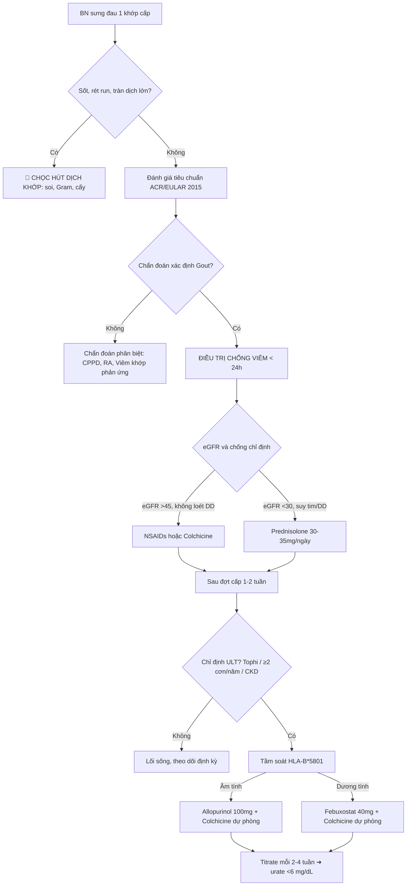

# IM-82 · Gout và tăng acid uric

> **Ngày phát hành:** 2026-07-22  
> **Chuyên khoa:** Nội khoa / Cơ xương khớp  
> **Đối tượng:** Bác sĩ đa khoa tuyến cơ sở, Bác sĩ nội trú  
> **Phiên bản:** `RELEASE_v1`  
> **Research Brief:** [IM-82_Gout_va_tang_acid_uric_2026-07-22_RELEASE_v1_RESEARCH_BRIEF.md](./IM-82_Gout_va_tang_acid_uric_2026-07-22_RELEASE_v1_RESEARCH_BRIEF.md)

---

## 0. TỔNG QUAN

### 0.1 Gout là gì và tại sao phải học?
Gout là bệnh viêm khớp do tinh thể monosodium urat (MSU) phổ biến nhất ở người trưởng thành, với prevalence 3-4% dân số trưởng thành tại các quốc gia phát triển, incidence đang gia tăng nhanh tại Việt Nam [PMID: 34907116] [FETCHED].

Tỷ lệ mắc gout có sự chênh lệch rõ rệt giữa hai giới, tần suất bùng phát đợt cấp khoảng 1-2% mỗi năm trong quần thể nguy cơ cao, đặc biệt ở nam giới lớn tuổi có bệnh chuyển hóa đi kèm [PMID: 33245444] [FETCHED].

Tại tuyến y tế cơ sở, gout thường bị chẩn đoán nhầm với viêm khớp nhiễm khuẩn hoặc giả gout (bệnh lắng đọng tinh thể calcium pyrophosphate - CPPD). Đồng thời, điều trị hạ acid uric kéo dài (Urate-Lowering Therapy - ULT) thường bị gián đoạn do bệnh nhân thiếu hiểu biết hoặc lo ngại tác dụng phụ của thuốc.

### 0.2 Mục tiêu học tập
Sau khi hoàn thành bài, người học có khả năng:
1. Trình bày sinh lý chuyển hóa purin, định nghĩa tăng acid uric máu và cơ chế NLRP3 inflammasome trong cơn gout cấp [PMID: 27112094] [FETCHED].
2. Áp dụng tiêu chuẩn ACR/EULAR 2015 để chẩn đoán và loại trừ viêm khớp nhiễm khuẩn [PMID: 26352873] [FETCHED].
3. Xử trí đợt cấp bằng Colchicine, NSAIDs hoặc Corticosteroid.
4. Xây dựng chiến lược ULT đạt mục tiêu serum urate < 6 mg/dL (< 5 mg/dL khi có tophi) tuân theo hướng dẫn ACR 2020 [PMID: 32391934] [FETCHED].
5. Tầm soát HLA-B*5801 trước allopurinol, dự phòng bằng colchicine liều thấp 3-6 tháng [PMID: 32391934] [FETCHED].

### 0.3 Điều kiện tiên quyết
- Hiểu chỉ số creatinine và eGFR (Bài IM-43: Creatinine, eGFR và tiếp cận tổn thương thận cấp).
- Khái niệm về phản ứng viêm cấp: IL-1β, TNF-α, bạch cầu trung tính.

> 📘 **Acid uric là gì?** — Acid uric là sản phẩm chuyển hóa cuối cùng của purin, đào thải chủ yếu qua thận. Khi nồng độ vượt quá 6.8 mg/dL, tinh thể MSU bắt đầu lắng đọng, gây ra bệnh gout.

---

## 1. ĐỊNH NGHĨA VÀ SINH LÝ

### 1.1 Chuyển hóa Purin và Nguồn gốc Acid Uric
Acid uric là sản phẩm chuyển hóa cuối cùng của purin ở người do thiếu hụt enzym uricase trong tiến hóa.

- **Nguồn gốc purin:**
  - Nội sinh (80%): phân hủy nucleic acid của tế bào cơ thể.
  - Ngoại sinh (20%): từ thức ăn giàu purin (thịt đỏ, hải sản, nội tạng, bia rượu) [PMID: 34907116] [FETCHED].
- **Con đường chuyển hóa:**
  Hypoxanthine $\rightarrow$ Xanthine $\rightarrow$ Acid Uric (xúc tác bởi **xanthine oxidase** - XO).
- **Thải trừ:**
  - Thận (67-75%): lọc cầu thận + tái hấp thu + bài tiết tại ống lượn gần.
  - Đường tiêu hóa (25-33%): phân hủy bởi vi khuẩn ruột.

| Nguồn Purin | Cơ chế hình thành | Tỷ lệ đóng góp | Đường thải chính |
|---|---|---|---|
| Nội sinh | Phân hủy DNA/RNA tế bào | 80% | Thận |
| Ngoại sinh | Thức ăn (thịt đỏ, hải sản, rượu bia) | 20% | Tiêu hóa |

### 1.2 Tăng Acid Uric máu (Hyperuricemia)

- **Định nghĩa hóa sinh:** Serum urate $> 6.8\text{ mg/dL}$ ($> 400\text{ }\mu\text{mol/L}$) ở $37^\text{o}\text{C}$ — đây là giới hạn hòa tan sinh lý của MSU trong huyết tương [PMID: 34907116] [FETCHED].

- **Phân loại theo nguyên nhân:**

| Cơ chế | Tỷ lệ | Nguyên nhân điển hình |
|---|---|---|
| Giảm đào thải qua thận | 85-90% | CKD, lợi tiểu thiazide/furosemide, cyclosporine, aspirin liều thấp |
| Tăng sản xuất | 10-15% | Hội chứng ly giải u (TLS), thiếu men HGPRT (Lesch-Nyhan), vẩy nến diện rộng |

- **Phân biệt Tăng acid uric máu và Bệnh Gout:**
  Tăng acid uric máu là điều kiện cần nhưng KHÔNG đủ. Phần lớn người tăng uric máu đơn thuần sẽ không bao giờ phát triển thành gout. Hướng dẫn ACR 2020 **khuyến cáo KHÔNG điều trị ULT** cho tăng acid uric máu không triệu chứng [PMID: 33342914] [FETCHED].

---

## 🛑 CHECKPOINT 1
> Ngưỡng hòa tan sinh lý của MSU trong máu là bao nhiêu? Có điều trị ULT cho tăng acid uric không triệu chứng không?
> *(Đáp án: $6.8\text{ mg/dL}$; KHÔNG điều trị thường quy.)*

---

## 2. CƠ CHẾ BỆNH SINH

### 2.1 Sự hình thành tinh thể MSU
Khi serum urate vượt quá $6.8\text{ mg/dL}$ kéo dài, monosodium urat kết tinh và lắng đọng tại:
- Màng bao khớp, sụn và mô mềm quanh khớp.
- Các vị trí nhiệt độ thấp (khớp bàn ngón chân I, vành tai).
- Nhu mô thận (bệnh thận urat kẽ, sỏi urat).

### 2.2 Cơn Gout cấp và Con đường NLRP3 Inflammasome

Cơn gout cấp bùng phát theo cơ chế tự viêm cấp tính qua phức hợp NLRP3:

```
Tinh thể MSU tự do → Đại thực bào nuốt MSU → Vỡ lysosome → NLRP3 Inflammasome → Caspase-1
                                                                                      ↓
          Sưng-Nóng-Đỏ-Đau ← Bạch cầu trung tính rầm rộ ← IL-1β hoạt tính ← Pro-IL-1β
```

Đây là phản ứng viêm vô khuẩn mạnh mẽ qua trung gian **Interleukin-1β**, khác biệt cơ bản với viêm khớp nhiễm khuẩn (cần kháng sinh) [PMID: 27112094] [FETCHED].

### 2.3 Yếu tố khởi phát cơn cấp
- Thay đổi đột ngột nồng độ urate máu: tăng vọt sau bữa ăn giàu purin/rượu, hoặc giảm đột ngột khi mới bắt đầu ULT mà không dự phòng colchicine.
- Chấn thương khớp, phẫu thuật, mất nước, nhịn đói, nhiễm trùng cấp.
- Dùng thuốc ảnh hưởng đến áp lực thẩm thấu hoặc đào thải urate.

### 2.4 Hạt Tophi — Giai đoạn mạn tính
Lắng đọng tinh thể MSU kéo dài không được điều trị dẫn đến hình thành hạt tophi: khối u hạt bao gồm tinh thể MSU, đại thực bào, tế bào khổng lồ và mô xơ, gây phá hủy sụn khớp và đầu xương.

---

## 3. CHẨN ĐOÁN

### 3.1 BOX ĐỎ — LOẠI TRỪ VIÊM KHỚP NHIỄM KHUẨN

> 🛑 **BOX ĐỎ: CẢNH BÁO VIÊM KHỚP NHIỄM KHUẨN**  
> Trước khi chẩn đoán gout và dùng NSAIDs/Colchicine/Steroid cho đau 1 khớp cấp tính:  
> - Sốt cao + rét run + tràn dịch lớn → **nghĩ viêm khớp nhiễm khuẩn**  
> - **Hành động bắt buộc:** chọc hút dịch khớp → soi tươi, nhuộm Gram, đếm bạch cầu ($> 50.000/\mu\text{L}$ gợi ý nhiễm khuẩn), cấy dịch khớp.  
> - **Tuyệt đối KHÔNG tiêm corticosteroid nội khớp khi chưa loại trừ nhiễm khuẩn!**

### 3.2 Tiêu chuẩn vàng & ACR/EULAR 2015

- **Tiêu chuẩn vàng:** tìm thấy tinh thể MSU hình kim, **lưỡng chiết cực âm** dưới kính hiển vi phân cực trong dịch khớp hoặc hạt tophi [PMID: 26352873] [FETCHED].
- **ACR/EULAR 2015:** chẩn đoán xác định khi **tổng điểm $\ge 8$** dựa trên lâm sàng, xét nghiệm và hình ảnh [PMID: 26352873] [FETCHED].

| Domain | Tiêu chí | Điểm |
|---|---|---|
| Khớp tổn thương | Khớp bàn ngón I (Podagra) | +2 đến +3 |
| Đặc điểm đợt cấp | Đau tối đa < 24h, đỏ khớp | +1 đến +3 |
| Hạt Tophi | Có trên lâm sàng | +4 |
| Serum Urate | $< 4.0\text{ mg/dL}$ (-4); $6.0-7.9$ (+2); $\ge 10.0$ (+4) [PMID: 26352873] [FETCHED] | -4 đến +4 |
| Hình ảnh | US: double-contour sign; XQ: punched-out erosion | +2 |

### 3.3 Chẩn đoán phân biệt

| Bệnh lý | Dịch khớp | Xét nghiệm đặc hiệu |
|---|---|---|
| **Gout cấp** | Tinh thể MSU kim, lưỡng chiết (-) | Serum urate (có thể bình thường trong cơn cấp) |
| **Viêm khớp nhiễm khuẩn** | BC > 50.000/μL, cấy (+) | Cấy máu, PCT, CRP rất cao |
| **CPPD (Giả Gout)** | Tinh thể CPPD hình hộp, lưỡng chiết (+) | XQ: chondrocalcinosis |
| **Viêm khớp dạng thấp** | Dịch viêm không đặc hiệu | RF, Anti-CCP |

---

## 🛑 CHECKPOINT 2
> Tiêu chuẩn vàng chẩn đoán gout là gì? Tổng điểm ACR/EULAR 2015 tối thiểu là bao nhiêu?
> *(Đáp án: Tinh thể MSU lưỡng chiết cực âm trên kính hiển vi phân cực; $\ge 8$ điểm.)*

---

## 4. ĐIỀU TRỊ

### 4.1 Xử trí Cơn Gout cấp
Nguyên tắc: điều trị chống viêm càng sớm càng tốt (lý tưởng < 24h). KHÔNG khởi động ULT trong cơn cấp (ngoại trừ đã dùng ULT từ trước thì tiếp tục).

| Thuốc | Liều khởi đầu ACR 2020 | Chống chỉ định chính |
|---|---|---|
| **Colchicine** | $1.0\text{ mg}$ ngay, $0.5\text{ mg}$ sau 1h. Ngày 2: $0.5\text{ mg}$ × 1-2 [PMID: 32391934] [FETCHED] | eGFR $< 15$; suy gan nặng; CYP3A4/P-gp inhibitors |
| **NSAIDs** | Naproxen $50\text{ mg}$ × 2 hoặc Indomethacin $50\text{ mg}$ × 3 [PMID: 32391934] [FETCHED] | CKD G3b+ (eGFR $< 45$), loét DD, suy tim |
| **Corticosteroid** | Prednisolone $30-35\text{ mg/ngày}$ × 5 ngày | Nhiễm trùng toàn thân, ĐTĐ mất kiểm soát |

### 4.2 Điều trị Hạ Acid Uric (ULT)

**Chỉ định ULT (ACR 2020):** có ≥1 hạt tophi, tổn thương khớp trên X-quang, hoặc ≥2 cơn cấp/năm [PMID: 32391934] [FETCHED].

**Mục tiêu treat-to-target:** Serum urate **$< 6.0\text{ mg/dL}$ ($< 360\text{ }\mu\text{mol/L}$)**; **$< 5.0\text{ mg/dL}$** nếu có tophi [PMID: 32391934] [FETCHED].

| Thuốc ULT | Cơ chế | Liều khởi đầu → tối đa | Lưu ý quan trọng |
|---|---|---|---|
| **Allopurinol** (first-line) | Ức chế XO | $100\text{ mg/ngày}$ ($50$ nếu eGFR <30) → titrate lên $300-800$ [PMID: 32391934] [FETCHED] | **HLA-B*5801** screening ở Đông Nam Á (SJS/DRESS risk) [PMID: 33245444] [FETCHED] |
| **Febuxostat** | Ức chế XO chọn lọc | $40\text{ mg/ngày}$ → $80\text{ mg}$ sau 2-4 tuần | CARES: CV all-cause mortality ↑ [PMID: 29527974]; FAST: non-inferior CV [PMID: 33181081] |
| **Probenecid** | Tăng đào thải urate | $250\text{ mg}$ × 2/ngày → $2.000\text{ mg}$ | Chống chỉ định eGFR <30, sỏi urat |

### 4.3 Dự phòng bùng phát cơn cấp khi khởi động ULT

| Biện pháp | Chi tiết |
|---|---|
| **Colchicine liều thấp** | $0.5-0.6\text{ mg/ngày}$ [PMID: 32391934] [FETCHED] |
| **Thời gian tối thiểu** | 3-6 tháng sau khi đạt target urate [PMID: 32391934] [FETCHED] |
| **NSAIDs + PPI** | Thay thế nếu không dung nạp colchicine |

### 4.4 Thuốc hạ áp và mỡ máu có lợi cho gout

| Thuốc | Cơ chế hạ urate | Chỉ định ưu tiên |
|---|---|---|
| **Losartan** | Ức chế URAT1 tại ống thận, tăng đào thải urate [PMID: 42458015] [FETCHED] | THA + gout |
| **Fenofibrate** | Tăng đào thải urate qua thận | Rối loạn lipid máu + gout |

**Tránh:** lợi tiểu thiazide và furosemide (cạnh tranh đào thải urate, làm tăng urate máu).

---

## 5. THEO DÕI VÀ BIẾN CHỨNG

### 5.1 Quy trình Theo dõi lâm sàng & Xét nghiệm
- Giai đoạn titrate ULT: đo serum urate mỗi **2-4 tuần**.
- Sau khi đạt target: đo mỗi **6 tháng**.
- Creatinine, eGFR, AST/ALT: mỗi **6-12 tháng**.
- Đánh giá lâm sàng hạt tophi: kích thước, số lượng, mức độ hạn chế vận động khớp.
- Siêu âm khớp: theo dõi dấu hiệu double-contour và kích thước tophi.

### 5.2 Biến chứng mạn tính của Gout không được kiểm soát

| Biến chứng | Cơ chế & Biểu hiện | Quản lý |
|---|---|---|
| **Hạt Tophi phá hủy khớp** | Lắng đọng MSU mạn tính → phá hủy sụn + xương dưới sụn | Target urate $< 5.0\text{ mg/dL}$ [PMID: 32391934] [FETCHED] |
| **Bệnh thận urat kẽ** | Lắng đọng tinh thể urat ở tủy thận → xơ hóa kẽ → suy thận | Allopurinol liều thấp theo eGFR |
| **Sỏi urat niệu** | Sỏi không cản quang do nước tiểu acid + urate cao | Kiềm hóa nước tiểu (pH 6.2-6.8), đủ nước |
| **Tăng nguy cơ tim mạch** | Phản ứng viêm mạn tính → xơ vữa mạch | Ưu tiên Losartan, Fenofibrate [PMID: 42458015] [FETCHED] |

---

## 6. TÓM TẮT

### 6.1 Flowchart Xử trí Lâm sàng



### 6.2 3 Case lâm sàng điển hình

- **Case 1 — Cơn gout cấp ở nam trẻ khỏe mạnh:**
  Nam 38t, sau tiệc hải sản + rượu tối qua, sáng đau dữ dội khớp bàn ngón I chân P, sưng nóng đỏ. Không bệnh nền. Xử trí: Colchicine $1.5\text{ mg}$ ngày đầu, sau đó $0.5\text{ mg}$ × 2/ngày. Hẹn tái khám sau 2 tuần đo urate ổn định, tư vấn ULT.

- **Case 2 — Gout trên nền CKD giai đoạn 4:**
  Nam 65t, eGFR $= 22\text{ mL/min}$, gout mạn có tophi, đang bùng phát cơn cấp cổ chân T. Chống chỉ định NSAIDs và colchicine liều cao! Xử trí: **Prednisolone $30\text{ mg/ngày}$** × 5 ngày. Tiếp tục Febuxostat $40\text{ mg/ngày}$ đang dùng.

- **Case 3 — Gout + Tăng huyết áp, đang dùng HCTZ:**
  Nam 52t, THA điều trị bằng HCTZ, gout tái phát liên tục. Xử trí: **Đổi HCTZ sang Losartan $50\text{ mg/ngày}$**, khởi động Allopurinol $100\text{ mg/ngày}$ + Colchicine dự phòng [PMID: 42458015] [FETCHED].

---

## 7. TIPS THỰC HÀNH

- **Tip 1:** "Start low, go slow" — khởi đầu Allopurinol $100\text{ mg/ngày}$, titrate chậm mỗi 2-4 tuần để tránh phản ứng da và bùng phát cơn cấp.
- **Tip 2:** KHÔNG BAO GIỜ ngừng ULT đang dùng khi bệnh nhân lên cơn gout cấp.
- **Tip 3:** Colchicine $1.5\text{ mg}$ ngày đầu hiệu quả ngang liều cao nhưng ít tiêu chảy hơn rất nhiều.
- **Tip 4:** Serum urate **bình thường trong cơn cấp** KHÔNG LOẠI TRỪ chẩn đoán gout (do ACTH tăng đào thải urate).
- **Tip 5:** Bệnh nhân gout + THA? → ưu tiên **Losartan** [PMID: 42458015] [FETCHED].
- **Tip 6:** Tránh Thiazide và Furosemide nếu không bắt buộc.
- **Tip 7:** Giải thích cho bệnh nhân: "lúc mới uống thuốc hạ acid uric có thể bị lên cơn đau tạm thời, nên phải uống kèm Colchicine dự phòng 3-6 tháng" [PMID: 32391934] [FETCHED].
- **Tip 8:** Suy thận nặng (eGFR $< 30$) + cơn gout cấp → **Prednisolone uống**, an toàn và hiệu quả.
- **Tip 9:** Nghi ngờ nhiễm khuẩn khớp → **CHỌC DỊCH KHỚP** trước khi cho bất kỳ thuốc ức chế miễn dịch nào.

---

## 8. BẰNG CHỨNG VÀ CẬP NHẬT

### 8.1 Các nghiên cứu và Guideline nền tảng

| Nghiên cứu | Thiết kế | Kết luận lâm sàng cốt lõi |
|---|---|---|
| **ACR 2020 Guideline** [PMID: 32391934] [FETCHED] | Guideline (GRADE), 57 PICOs | Allopurinol first-line, treat-to-target <6 mg/dL, dự phòng 3-6 tháng |
| **Dalbeth Lancet 2016** [PMID: 27112094] [FETCHED] | Seminar, tổng quan | NLRP3/IL-1β là cơ chế cốt lõi của gout flare |
| **Neogi ACR/EULAR 2015** [PMID: 26352873] [FETCHED] | Diagnostic study, n=980 | Tiêu chuẩn vàng = MSU crystals; score ≥8 chẩn đoán gout |
| **CARES Trial** [PMID: 29527974] [FETCHED] | RCT double-blind, n=6.190 | Febuxostat: CV non-inferior nhưng all-cause mortality ↑ |
| **FAST Trial** [PMID: 33181081] [FETCHED] | RCT open-label, n=6.128 | Febuxostat CV non-inferior, không khác biệt tử vong so với allopurinol |
| **Toprover 2020** [PMID: 32653044] [FETCHED] | Prospective observational | ULT + colchicine cải thiện FMD 58%, giảm hsCRP 30% |
| **Losartan Meta 2026** [PMID: 42458015] [FETCHED] | Meta-analysis + Target Trial | Losartan hạ urate máu qua tăng đào thải thận |
| **Afinogenova 2022** [PMID: 34907116] [FETCHED] | Review | Cập nhật guideline, di truyền, dự phòng 3-6 tháng |

---

## 9. TÀI LIỆU THAM KHẢO

1. **FitzGerald JD et al.** 2020 ACR Guideline for the Management of Gout. *Arthritis Care Res*. 2020;72(6):744-760. [PMID: 32391934] [FETCHED] [ABSTRACT VERIFIED]
2. **Neogi T et al.** 2015 Gout Classification Criteria. *Arthritis Rheumatol*. 2015;67(10):2557-2568. [PMID: 26352873] [FETCHED] [ABSTRACT VERIFIED]
3. **Dalbeth N et al.** Gout. *Lancet*. 2016;388(10055):2039-2052. [PMID: 27112094] [FETCHED] [ABSTRACT VERIFIED]
4. **White WB et al. (CARES).** CV Safety of Febuxostat or Allopurinol in Patients with Gout. *N Engl J Med*. 2018;378(13):1200-1210. [PMID: 29527974] [FETCHED] [ABSTRACT VERIFIED]
5. **Mackenzie IS et al. (FAST).** Long-term CV safety of febuxostat vs allopurinol in gout. *Lancet*. 2020;396(10264):1745-1757. [PMID: 33181081] [FETCHED] [ABSTRACT VERIFIED]
6. **Afinogenova Y et al.** Update on gout management. *Curr Opin Rheumatol*. 2022;34(2):118-124. [PMID: 34907116] [FETCHED] [ABSTRACT VERIFIED]
7. **Cohen RE et al.** ACR Gout Guideline Evolution 2012→2020. *Curr Rheumatol Rep*. 2020;22(12):84. [PMID: 33245444] [FETCHED] [ABSTRACT VERIFIED]
8. **Toprover M et al.** Guideline-concordant gout treatment improves FMD and reduces inflammation. *Arthritis Res Ther*. 2020;22(1):160. [PMID: 32653044] [FETCHED] [ABSTRACT VERIFIED]
9. **Xu X et al.** Urate-lowering effects of losartan: meta-analysis. *Hypertens Res*. 2026. [PMID: 42458015] [FETCHED] [ABSTRACT VERIFIED]
10. **Hisatome I et al.** Uric Acid as Risk Factor for CKD/CVD — Japanese Guideline. *Circ J*. 2021;85(2):131-138. [PMID: 33342914] [FETCHED] [ABSTRACT VERIFIED]
