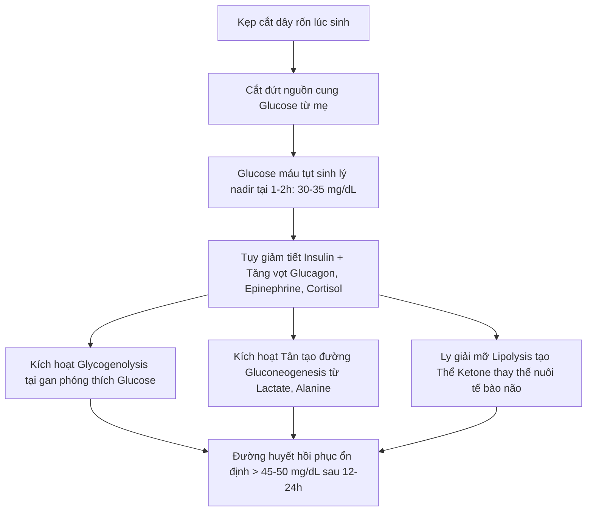
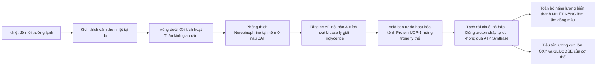
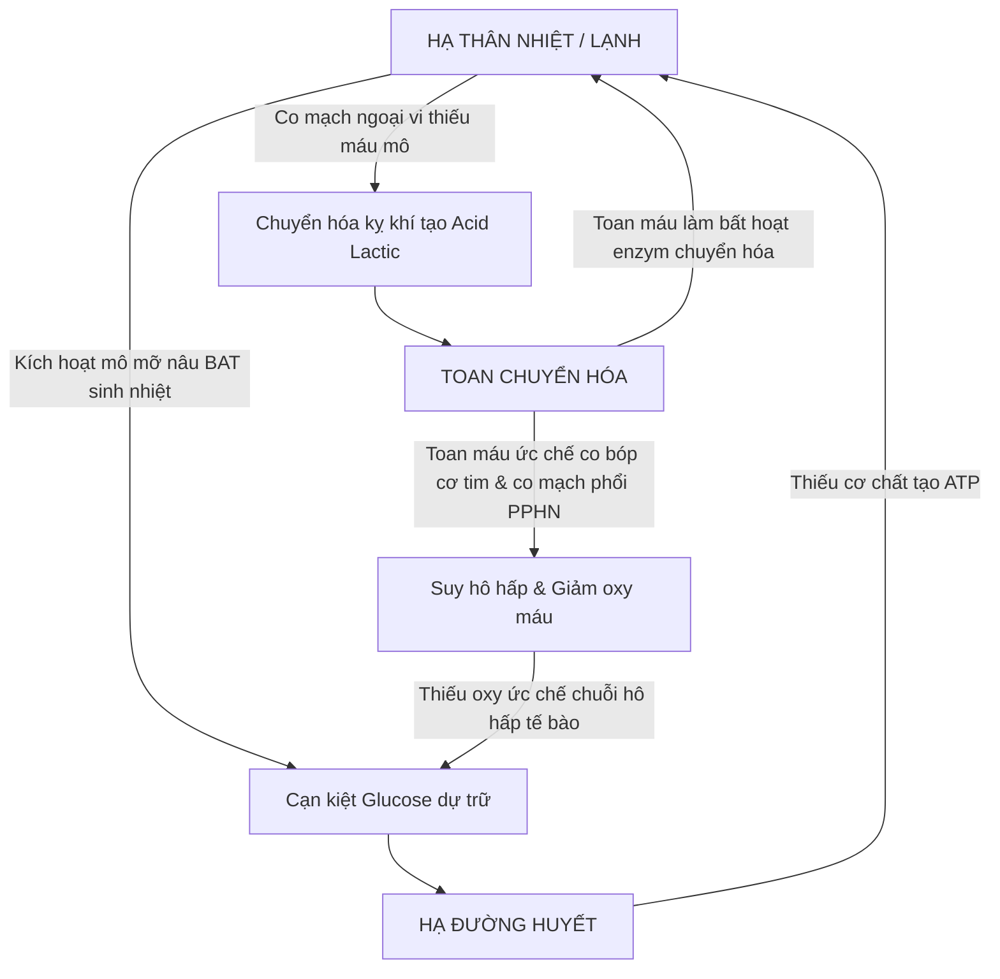
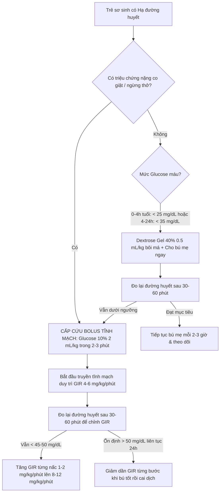
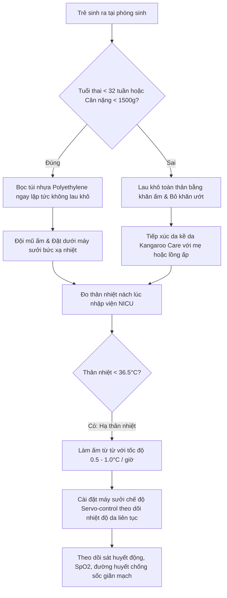

# BÀI HỌC Y KHOA CHUYÊN SÂU: HẠ ĐƯỜNG HUYẾT VÀ HẠ THÂN NHIỆT Ở TRẺ SƠ SINH (PED-17)

**Mã bài học:** PED-17  
**Chuyên khoa:** Nhi khoa — Sơ sinh học (Neonatology)  
**Đối tượng đào tạo:** Bác sĩ nội trú, Bác sĩ Nhi khoa, Bác sĩ Cấp cứu — Hồi sức sơ sinh  
**Phiên bản phát hành:** 2026-09-17_RELEASE_v1  
**Tiêu chuẩn chất lượng:** Why-based Clinical Curriculum, Dual-track Verification Governance (0 BLOCK, 0 WARN)

---

## 0. TỔNG QUAN — VÌ SAO BÀI HỌC NÀY ĐẶC BIỆT QUAN TRỌNG?

Hạ đường huyết và hạ thân nhiệt là hai rối loạn chuyển hóa thầm lặng phổ biến nhất nhưng cũng nguy hiểm bậc nhất tại phòng sinh, phòng hồi sức sơ sinh và khoa chăm sóc tích cực sơ sinh (NICU). Khác với người lớn hoặc trẻ lớn có khả năng bù trừ cơ học và dự trữ năng lượng dồi dào, trẻ sơ sinh — đặc biệt là trẻ sinh non và trẻ chậm tăng trưởng trong tử cung — bước vào đời với kho dự trữ glycogen hữu hạn, lớp mỡ dưới da mỏng manh và hệ thống điều hòa nội mô chưa hoàn thiện.

Một cơn hạ thân nhiệt không được kiểm soát có thể nhanh chóng đẩy trẻ vào vòng xoắn toan chuyển hóa và kiệt quệ năng lượng; ngược lại, một cơn hạ đường huyết kéo dài hoặc co giật tái diễn không được điều trị kịp thời sẽ tước đoạt cơ chất duy nhất của tế bào thần kinh, để lại di chứng bại não, động kinh kháng trị và suy giảm nhận thức vĩnh viễn. Ranh giới giữa một đứa trẻ hồi phục hoàn toàn và một đứa trẻ mang tổn thương thần kinh suốt đời phụ thuộc trực tiếp vào tốc độ nhận diện nguy cơ tại giường và sự chuẩn xác trong từng mililit dịch truyền cấp cứu của bác sĩ lâm sàng.

Triết lý điều trị cốt lõi của bài học được đúc kết qua 4 nguyên tắc bất biến: **"Đúng đối tượng nguy cơ — Đúng ngưỡng can thiệp động học — Đúng tốc độ truyền đường (GIR) — Làm ấm từ từ an toàn"**.

---

### 0.1. Nền tảng tối thiểu cần dùng ngay (Foundation Primer)

Phần nhập môn này cung cấp khung định nghĩa giải phẫu - sinh lý - chuyển hóa cơ bản nhất mà mọi bác sĩ thực hành cần ghi nhớ trước khi tiếp cận xử trí tại giường bệnh:

1. **Tốc độ truyền glucose (Glucose Infusion Rate - GIR)** là một chỉ số dược lý lâm sàng biểu thị lượng glucose được đưa vào tuần hoàn cơ thể tính bằng miligam trên mỗi kilogam cân nặng trong một phút ($\text{mg/kg/phút}$). GIR phản ánh chính xác tốc độ cung ứng cơ chất ngoại sinh so với nhu cầu sản xuất glucose nội sinh sinh lý của gan sơ sinh (bình thường từ $4 - 6\text{ mg/kg/phút}$).
2. **Hạ đường huyết chuyển tiếp sơ sinh (Transitional neonatal hypoglycemia)** là một hiện tượng sinh lý bình thường phản ánh sự sụt giảm nồng độ glucose máu tự nhiên trong vài giờ đầu đời khi trẻ đột ngột bị cắt đứt nguồn cung liên tục từ tĩnh mạch rốn mẹ, trước khi các enzyme tân tạo đường và ly giải glycogen ở gan được kích hoạt hoàn toàn.
3. **Mẫu máu quan trọng (Critical blood sample)** là một xét nghiệm máu toàn diện được chỉ định lấy ngay tại thời điểm trẻ đang bị hạ đường huyết nặng (glucose máu dưới $50\text{ mg/dL}$ trước khi tiêm bolus đường) nhằm đo lường đồng thời nồng độ insulin, cortisol, hormone tăng trưởng GH, lactate, beta-hydroxybutyrate, acid béo tự do và khí máu động mạch để định danh căn nguyên nội tiết hoặc rối loạn chuyển hóa bẩm sinh.
4. **Mô mỡ nâu (Brown Adipose Tissue - BAT)** là một cơ quan sinh nhiệt chuyên biệt của trẻ sơ sinh phân bố chủ yếu ở vùng gian bả vai, quanh thận, nách và trung thất, có cấu trúc giàu mạch máu và mật độ ty thể cực cao.
5. **Protein tách rời 1 (Uncoupling Protein-1 - UCP-1 hay Thermogenin)** là một protein kênh vận chuyển proton đặc hiệu nằm trên màng trong ty thể của tế bào mỡ nâu, có chức năng tách rời chuỗi hô hấp tế bào khỏi quá trình tổng hợp ATP, biến toàn bộ năng lượng oxy hóa cơ chất thành nhiệt năng thuần túy để làm ấm dòng máu tuần hoàn.
6. **Chuỗi ủ ấm sơ sinh (Warm chain)** là một hệ thống mười mắt xích thực hành chăm sóc liên hoàn do Tổ chức Y tế Thế giới (WHO) khuyến cáo nhằm ngăn chặn hiện tượng mất nhiệt ở trẻ sơ sinh từ giây phút chào đời tại phòng sinh cho đến suốt giai đoạn hậu sản tại buồng bệnh.
7. **Bốn cơ chế mất nhiệt vật lý sơ sinh** là bốn con đường truyền năng lượng nhiệt từ cơ thể trẻ ra môi trường xung quanh bao gồm: bốc hơi qua da ướt và đường thở, dẫn truyền qua các bề mặt tiếp xúc lạnh, đối lưu qua luồng không khí chuyển động và bức xạ điện từ hồng ngoại hướng tới các bề mặt lạnh xung quanh.
8. **Vòng xoắn ác tính Lạnh — Hạ đường huyết — Toan chuyển hóa** là một chuỗi tương tác bệnh lý hai chiều: lạnh kích thích sinh nhiệt tối đa làm cạn kiệt nguồn glycogen dự trữ gây hạ đường huyết; hạ đường huyết làm mất cơ chất tạo ATP khiến nhiệt độ cơ thể tụt sâu hơn; co mạch ngoại vi do lạnh dẫn đến giảm tưới máu mô gây toan lactic và tăng kháng lực mạch máu phổi dẫn tới tử vong.

---

> ### 🚨 BOX ĐỎ CẤP CỨU: DẤU HIỆU CẢNH BÁO NGUY KỊCH TẠI GIƯỜNG
> 
> Bác sĩ phải kích hoạt cấp cứu ngừng tuần hoàn hoặc xử trí tĩnh mạch ngay lập tức khi phát hiện bất kỳ dấu hiệu nào sau đây ở trẻ sơ sinh:
> 
> 1. **Cơn ngừng thở kéo dài trên hai mươi giây** hoặc ngừng thở kèm theo nhịp tim chậm dưới một trăm lần mỗi phút, tím tái toàn thân hoặc độ bão hòa oxy $SpO_2$ tụt dốc.
> 2. **Cơn co giật thực sự sơ sinh:** Cử động giật nhịp nhàng, đảo mắt, chép miệng liên tục hoặc rung giật một chi không dừng lại khi người khám giữ nhẹ chi đó.
> 3. **Li bì, hôn mê hoặc hạ trương lực cơ toàn thân nghiêm trọng:** Trẻ mềm nhẽo như búp bê vải, mất hoàn toàn phản xạ bú, không đáp ứng với kích thích đau.
> 4. **Hạ thân nhiệt nặng (thân nhiệt trung tâm dưới ba mươi hai độ C):** Da trẻ lạnh ngắt, tái xám hoặc có mảng cứng bì phù nề, mạch bẹn bắt yếu, tiếng tim mờ xa xăm, dọa ngừng tuần hoàn.
> 5. **Hạ đường huyết que thử mao mạch dưới hai mươi lăm miligam trên decilit (dưới một phẩy tư milimol trên lít):** Đòi hỏi thiết lập đường truyền tĩnh mạch và tiêm bolus Glucose mười phần trăm cấp cứu ngay lập tức, tuyệt đối không được phép trì hoãn chờ kết quả xét nghiệm tĩnh mạch từ phòng xét nghiệm.

---

## 1. ĐỊNH NGHĨA & SINH LÝ HỌC CHUYỂN HÓA NĂNG LƯỢNG SƠ SINH

### 1.1 Quá trình chuyển tiếp nội tiết sau khi cắt rốn
Trong suốt thai kỳ, thai nhi nhận được nguồn glucose liên tục từ tuần hoàn mẹ qua cơ chế khuếch tán được thuận hóa bởi các chất vận chuyển glucose (GLUT-1 và GLUT-3) tại bánh nhau. Nồng độ glucose trong máu thai nhi luôn duy trì ở mức khoảng $70 - 80\%$ nồng độ glucose máu của người mẹ. Ngay khi thai nhi chào đời và dây rốn bị kẹp, nguồn cung cấp carbohydrate ngoại sinh đột ngột bị cắt đứt hoàn toàn. 

Lúc này, cơ thể trẻ sơ sinh bắt buộc phải tự lực chuyển đổi từ trạng thái đồng hóa phụ thuộc mẹ sang trạng thái dị hóa tự chủ. Trong vòng 1 đến 2 giờ đầu sau sinh, nồng độ glucose máu của mọi trẻ sơ sinh khỏe mạnh đều trải qua một giai đoạn sụt giảm sinh lý tự nhiên, chạm mức đáy thấp nhất (nadir) khoảng $30 - 35\text{ mg/dL}$ ($1.7 - 2.0\text{ mmol/L}$). Sự sụt giảm glucose này kích hoạt hệ thống thần kinh giao cảm và trục nội tiết: nồng độ insulin trong huyết tương giảm mạnh, đồng thời nồng độ glucagon, epinephrine, cortisol và hormone tăng trưởng (GH) tăng vọt. Sự thay đổi tỷ lệ glucagon/insulin kích thích gan kích hoạt nhanh chóng hai con đường chuyển hóa then chốt:
1. **Ly giải glycogen (Glycogenolysis):** Phân cắt nguồn dự trữ glycogen tại gan đã tích lũy trong tam cá nguyệt thứ ba của thai kỳ để phóng thích glucose tự do vào máu.
2. **Tân tạo đường (Gluconeogenesis):** Tổng hợp glucose mới từ các cơ chất không phải carbohydrate như lactate, glycerol và alanine dưới sự xúc tác của enzyme phosphoenolpyruvate carboxykinase (PEPCK).

Đồng thời, quá trình ly giải lipid (lipolysis) được đẩy mạnh, giải phóng acid béo tự do và thể ketone (beta-hydroxybutyrate, acetoacetate) đóng vai trò là nguồn nhiên liệu thay thế sống còn cho tế bào não. Ở trẻ sơ sinh đủ tháng khỏe mạnh bú mẹ sớm, nồng độ glucose máu sẽ tự động tăng dần lên và ổn định trên $45 - 50\text{ mg/dL}$ sau 12 đến 24 giờ tuổi.

*Ví dụ minh họa 1:* Một bé sơ sinh đủ tháng cân nặng $3.2\text{ kg}$ sau sinh 1 giờ có nồng độ glucose máu tụt xuống mức nadir sinh lý $32\text{ mg/dL}$ ($1.8\text{ mmol/L}$) nhưng trẻ hoàn toàn hồng hào, phản xạ tìm bú tốt. Nhờ sự tăng vọt sinh lý của glucagon và cortisol, gan của trẻ nhanh chóng ly giải glycogen và tân tạo đường, giúp đường huyết tự động tăng lên $48\text{ mg/dL}$ lúc 3 giờ tuổi sau cữ bú mẹ đầu tiên mà không cần can thiệp dịch truyền tĩnh mạch.



### 1.2 Ngưỡng định nghĩa động học theo AAP (2011) và PES (2015)
Trong nhiều thập kỷ, định nghĩa về hạ đường huyết sơ sinh luôn là chủ đề tranh luận gay gắt do thiếu một con số số học duy nhất áp dụng cho mọi thời điểm. Năm 2011, Viện Hàn lâm Nhi khoa Hoa Kỳ (AAP) đã ban hành báo cáo lâm sàng mang tính bước ngoặt, xác lập cách tiếp cận ngưỡng can thiệp động học theo giờ tuổi áp dụng cho các trẻ sơ sinh có nguy cơ cao (sinh non muộn $34 - 36^{6/7}$ tuần, SGA, LGA, con mẹ đái tháo đường IDM):

*Bảng 1: Ngưỡng can thiệp đường huyết động học theo khuyến cáo AAP (2011)*
| Giờ tuổi sau sinh | Tình trạng lâm sàng | Ngưỡng Glucose máu can thiệp | Hành động lâm sàng chuẩn mực |
|---|---|---|---|
| **0 – 4 giờ đầu** | Có triệu chứng | $< 40\text{ mg/dL}$ ($< 2.2\text{ mmol/L}$) | Tiêm tĩnh mạch cấp cứu Glucose 10% |
| **0 – 4 giờ đầu** | Không triệu chứng | $< 25\text{ mg/dL}$ ($< 1.4\text{ mmol/L}$) | Cho bú mẹ / Dextrose gel 40%; truyền TM nếu thất bại |
| **4 – 24 giờ tuổi** | Có triệu chứng | $< 40\text{ mg/dL}$ ($< 2.2\text{ mmol/L}$) | Tiêm tĩnh mạch cấp cứu Glucose 10% |
| **4 – 24 giờ tuổi** | Không triệu chứng | $< 35\text{ mg/dL}$ ($< 1.9\text{ mmol/L}$) | Cho bú mẹ tăng cường; nếu vẫn $< 35\text{ mg/dL}$ thì truyền TM |
| **Sau 24 – 48 giờ tuổi** | Mọi trẻ sơ sinh | $< 45 - 50\text{ mg/dL}$ ($< 2.5 - 2.8\text{ mmol/L}$) | Mục tiêu duy trì an toàn trước các cữ bú |

Ngược lại, Hiệp hội Nội tiết Nhi khoa Hoa Kỳ (PES, 2015) tiếp cận dưới góc độ an toàn thần kinh lâu dài và chẩn đoán các bệnh lý hạ đường huyết dai dẳng. PES nhấn mạnh rằng sau giai đoạn chuyển tiếp 48 giờ đầu, nồng độ glucose máu của trẻ cần được duy trì vững chắc trên $50\text{ mg/dL}$ ($2.8\text{ mmol/L}$), và đối với trẻ mắc các hội chứng cường insulin bẩm sinh hoặc nghi ngờ tổn thương não, ngưỡng an toàn tối thiểu phải là trên $60\text{ mg/dL}$ ($3.3\text{ mmol/L}$).

### 1.3 Ngưỡng bảo vệ thần kinh thực chứng từ nghiên cứu CHYLD (NEJM 2015)
Một câu hỏi then chốt trong y học sơ sinh là: "Ngưỡng glucose máu thực tế nào sẽ gây tổn thương phát triển thần kinh?". Nghiên cứu tiến cứu đoàn hệ CHYLD (Children with Hypoglycemia and Their Later Development) do Harris và cộng sự thực hiện tại New Zealand, công bố trên tạp chí The New England Journal of Medicine (NEJM 2015), đã theo dõi 404 trẻ sơ sinh có nguy cơ cao được theo dõi glucose liên tục (CGM).

Nghiên cứu đã chứng minh rằng việc duy trì nồng độ glucose máu ở mức từ $47\text{ mg/dL}$ ($2.6\text{ mmol/L}$) trở lên giúp bảo tồn hoàn hảo sự phát triển nhận thức, chức năng điều hành và xử lý thị giác của trẻ khi đánh giá tại thời điểm hai tuổi. Khi nồng độ đường huyết tụt xuống dưới ngưỡng này, đặc biệt nếu tình trạng hạ đường huyết diễn ra tái diễn hoặc kéo dài, nguy cơ suy giảm chức năng điều hành và thị giác tăng lên rõ rệt. Do đó, mốc $47\text{ mg/dL}$ ($2.6\text{ mmol/L}$) hiện được công nhận trên toàn thế giới là "Ngưỡng bảo vệ tế bào thần kinh" trong thực hành lâm sàng.

---

## 2. CƠ CHẾ SINH LÝ BỆNH & PHÂN LOẠI NGUYÊN NHÂN HẠ ĐƯỜNG HUYẾT

Dựa trên cơ chế bệnh sinh chuyển hóa, hạ đường huyết ở trẻ sơ sinh được phân loại thành 4 nhóm nguyên nhân lớn:

### 2.1 Nhóm 1: Giảm dự trữ hoặc giảm sản xuất glucose
- **Trẻ sinh non (Preterm infants):** Sự tích lũy glycogen tại gan và mỡ dưới da diễn ra mạnh mẽ nhất trong 3 tháng cuối thai kỳ. Trẻ sinh non trước 37 tuần bị tước đoạt giai đoạn tích lũy này, dẫn đến kho dự trữ cạn kiệt. Ngoài ra, hệ enzyme PEPCK và glucose-6-phosphatase tại gan ở trẻ sinh non chưa trưởng thành, làm giảm sút khả năng tân tạo đường.
- **Trẻ chậm tăng trưởng trong tử cung (IUGR) hoặc nhỏ so với tuổi thai (SGA):** Do suy tuần hoàn tử cung - bánh nhau mạn tính, thai nhi không nhận đủ chất dinh dưỡng để tổng hợp glycogen. Lượng mỡ cơ thể rất ít khiến trẻ không có đủ acid béo và glycerol cho quá trình tân tạo đường.

*Chuỗi cơ chế bệnh sinh 1: Trẻ sinh non và suy dinh dưỡng bào thai*  
Tầng 1: Thiếu hụt thời gian tích lũy dưỡng chất trong tử cung $\rightarrow$  
Tầng 2: Giảm dự trữ glycogen gan và mô mỡ dưới da $\rightarrow$  
Tầng 3: Thiếu hụt cơ chất glycerol và enzyme tân tạo đường PEPCK chưa trưởng thành $\rightarrow$  
Tầng 4: Không thể duy trì nồng độ glucose máu khi bị cắt đứt nguồn nuôi từ mẹ $\rightarrow$  
Tầng 5: Xuất hiện hạ đường huyết nặng trong 6 đến 12 giờ đầu sau sinh.

### 2.2 Nhóm 2: Tăng tiêu thụ năng lượng và tăng chuyển hóa ngoại vi
- **Hạ thân nhiệt và stress lạnh:** Khi bị lạnh, trẻ kích hoạt phản ứng sinh nhiệt tối đa qua mỡ nâu, tiêu tốn một lượng glucose khổng lồ từ tuần hoàn.
- **Nhiễm trùng huyết sơ sinh (Neonatal Sepsis):** Tình trạng nhiễm khuẩn làm tăng mạnh tỷ lệ chuyển hóa cơ bản, tăng giải phóng các cytokine gây viêm (TNF-alpha, IL-6) kích thích tiêu thụ glucose tại các mô ngoại biên, đồng thời gây rối loạn chức năng gan làm ức chế tân tạo đường.
- **Ngạt chu sinh và thiếu oxy mô:** Thiếu oxy buộc các tế bào phải chuyển sang con đường đường phân kỵ khí (anaerobic glycolysis). Đường phân kỵ khí chỉ tạo ra 2 phân tử ATP cho mỗi phân tử glucose (thay vì 36–38 ATP theo chu trình hiếu khí), đòi hỏi tiêu hao lượng glucose gấp 18 lần để duy trì cùng một mức năng lượng tế bào, nhanh chóng làm cạn kiệt glycogen chỉ sau vài giờ.

*Chuỗi cơ chế bệnh sinh 2: Ngạt sau sinh và đường phân kỵ khí*  
Tầng 1: Ngạt chu sinh gây thiếu oxy mô toàn thân $\rightarrow$  
Tầng 2: Ức chế chuỗi hô hấp tế bào hiếu khí tại ty thể $\rightarrow$  
Tầng 3: Tế bào chuyển dịch hoàn toàn sang đường phân kỵ khí tiêu tốn glucose gấp 18 lần $\rightarrow$  
Tầng 4: Tăng tích tụ acid lactic gây toan chuyển hóa nặng $\rightarrow$  
Tầng 5: Kho dự trữ glucose kiệt quệ hoàn toàn gây hạ đường huyết sâu khó phục hồi.

### 2.3 Nhóm 3: Tăng nồng độ insulin máu (Hyperinsulinism)
- **Con của mẹ đái tháo đường (Infant of Diabetic Mother - IDM):** Theo thuyết Pederson kinh điển, tình trạng tăng đường huyết không kiểm soát ở mẹ làm tăng lượng glucose khuếch tán qua bánh nhau vào thai nhi. Tụy của thai nhi phản ứng bằng cách tăng sinh các tế bào beta đảo tụy và tăng tiết insulin. Sau khi cắt rốn, lượng glucose từ mẹ ngưng lại nhưng nồng độ insulin trong máu trẻ vẫn duy trì ở mức cực cao, thúc đẩy chuyển toàn bộ glucose máu vào tế bào cơ và tế bào mỡ, đồng thời ức chế hoàn toàn quá trình ly giải glycogen và tân tạo đường tại gan.
- **Trẻ to so với tuổi thai (LGA):** Dù mẹ không có chẩn đoán đái tháo đường thai kỳ rõ ràng, nhiều trẻ LGA vẫn có tình trạng tăng tiết insulin tương đối.
- **Hội chứng Beckwith-Wiedemann:** Bất thường di truyền vùng nhiễm sắc thể 11p15 dẫn đến quá sản đảo tụy, biểu hiện tam chứng kinh điển: lưỡi to, thoát vị rốn và cân nặng lúc sinh lớn kèm hạ đường huyết cường insulin kháng trị.

*Chuỗi cơ chế bệnh sinh 3: Thuyết Pederson ở con mẹ đái tháo đường*  
Tầng 1: Tăng đường huyết mạn tính ở người mẹ khuếch tán liên tục qua nhau thai $\rightarrow$  
Tầng 2: Tụy thai nhi tăng sản tế bào beta và tăng tiết nồng độ insulin máu $\rightarrow$  
Tầng 3: Cắt rốn làm ngừng đột ngột nguồn đường ngoại sinh từ mẹ $\rightarrow$  
Tầng 4: Lượng insulin nội sinh dư thừa ức chế ly giải glycogen và đẩy mạnh thu nạp glucose vào mô $\rightarrow$  
Tầng 5: Hạ đường huyết cấp tính rầm rộ ngay trong 1 đến 2 giờ đầu đời.

### 2.4 Nhóm 4: Rối loạn chuyển hóa bẩm sinh và suy giảm nội tiết
- **Khiếm khuyết oxy hóa acid béo (Fatty Acid Oxidation Disorders - FAODs):** Điển hình là khiếm khuyết enzyme MCAD (Medium-chain acyl-CoA dehydrogenase deficiency). Trẻ không thể sử dụng chất béo để tạo năng lượng và không sản xuất được thể ketone khi nhịn ăn, dẫn đến hạ đường huyết không tăng ketone kèm suy gan và bệnh cơ tim.
- **Bệnh ứ đọng glycogen (Glycogen Storage Diseases - GSD type I):** Thiếu enzyme glucose-6-phosphatase khiến gan không thể phóng thích glucose tự do vào máu, gây hạ đường huyết nặng kèm gan to và toan lactic.
- **Suy tuyến thượng thận bẩm sinh hoặc suy tuyến yên toàn bộ:** Thiếu hụt cortisol và hormone tăng trưởng (GH) làm mất đi hai hormone đối kháng insulin quan trọng nhất, khiến trẻ sơ sinh không thể duy trì đường huyết khi nhịn ăn kéo dài.

---

## 3. CƠ CHẾ ĐIỀU NHIỆT & 4 CƠ CHẾ MẤT NHIỆT Ở TRẺ SƠ SINH

### 3.1 Đặc điểm giải phẫu khiến trẻ sơ sinh mất nhiệt nhanh gấp 4 lần người lớn
Trẻ sơ sinh có tỷ lệ diện tích bề mặt cơ thể so với cân nặng ($S/V$) lớn gấp 3 lần so với người trưởng thành. Ở trẻ sinh non dưới 1.5 kg, tỷ lệ này còn cao hơn rất nhiều. Diện tích bề mặt tiếp xúc lớn đồng nghĩa với việc nhiệt năng từ cơ thể dễ dàng khuếch tán ra môi trường xung quanh. Bên cạnh đó, lớp mỡ dưới da đóng vai trò như một lớp cách nhiệt sinh học ở trẻ sơ sinh rất mỏng mảnh, làm giảm khả năng cản trở dẫn truyền nhiệt từ lõi cơ thể ra bề mặt da. Da của trẻ sinh non có lớp sừng mỏng, hàng rào biểu bì chưa trưởng thành làm tăng tính thấm và gia tăng mất nước qua thượng bì gấp nhiều lần.

### 3.2 Sinh nhiệt không run qua mỡ nâu (BAT) và vai trò của UCP-1
Người lớn khi bị lạnh sẽ phản ứng bằng phản xạ run cơ (shivering thermogenesis) để sinh nhiệt. Trẻ sơ sinh hầu như không có khả năng run cơ hiệu quả do hệ thần kinh cơ chưa hoàn thiện. Thay vào đó, trẻ sơ sinh phụ thuộc hoàn toàn vào cơ chế **Sinh nhiệt không run (Non-shivering thermogenesis)** diễn ra tại mô mỡ nâu (BAT).

Khi da trẻ tiếp nhận kích thích lạnh, xung động thần kinh truyền về trung tâm điều nhiệt ở vùng dưới đồi, kích hoạt hệ thần kinh giao cảm giải phóng norepinephrine tại các đầu tận cùng sợi thần kinh phân bố dày đặc quanh các tế bào mỡ nâu. Norepinephrine gắn vào thụ thể beta-3 adrenergic, kích hoạt enzyme adenylate cyclase làm tăng cAMP nội bào và kích hoạt lipase thủy phân triglyceride thành các acid béo tự do. Các acid béo tự do này không chỉ là cơ chất cho chu trình beta-oxy hóa mà còn trực tiếp hoạt hóa protein **UCP-1 (Thermogenin)** nằm trên màng trong ty thể.

Bình thường, quá trình oxy hóa cơ chất trong ty thể sẽ bơm proton ($H^+$) từ chất nền ty thể ra khoang gian màng, tạo nên một gradient điện hóa proton; dòng proton chảy ngược vào chất nền qua phức hợp ATP synthase sẽ thúc đẩy tổng hợp ATP. Tuy nhiên, khi UCP-1 được kích hoạt, kênh protein này mở ra cho phép các proton chảy tự do trở lại chất nền ty thể mà không đi qua ATP synthase. Quá trình này ngắn mạch gradient proton, triệt tiêu sự phosphoryl hóa và biến toàn bộ thế năng điện hóa thành nhiệt năng thuần túy. Máu tuần hoàn qua mạng lưới mao mạch phong phú của mô mỡ nâu được làm nóng và phân phối đi khắp các cơ quan trung tâm của cơ thể.

Quá trình sinh nhiệt không run đòi hỏi một lượng oxy và glucose tiêu thụ khổng lồ. Do đó, một đứa trẻ bị lạnh kéo dài sẽ nhanh chóng rơi vào tình trạng cạn kiệt glucose và suy hô hấp giảm oxy máu.



### 3.3 Bốn cơ chế mất nhiệt vật lý sơ sinh
Sự mất nhiệt của trẻ sơ sinh ra môi trường tuân theo 4 định luật vật lý cơ bản:

1. **Bốc hơi (Evaporation):** Là sự mất nhiệt khi nước trên bề mặt da ẩm ướt hoặc từ đường thở chuyển thành thể hơi. Ngay sau sinh, da trẻ bao phủ bởi một lớp nước ối ướt đẫm; cứ mỗi $1\text{ mL}$ nước ối bay hơi sẽ mang đi khoảng $0.58\text{ kcal}$ nhiệt lượng. Bốc hơi là con đường mất nhiệt lớn nhất và nhanh nhất tại phòng sinh nếu trẻ không được lau khô hoặc bọc túi nhựa ngay lập tức.
2. **Dẫn truyền (Conduction):** Là sự truyền nhiệt trực tiếp giữa hai vật thể tiếp xúc vật lý với nhau từ nơi có nhiệt độ cao sang nơi có nhiệt độ thấp. Ví dụ lâm sàng: Đặt trẻ sơ sinh nằm trực tiếp lên cân kim loại lạnh, bàn khám lạnh, hoặc tiếp xúc với ga trải giường ướt và ống nghe lạnh chưa được làm ấm.
3. **Đối lưu (Convection):** Là sự mất nhiệt từ bề mặt cơ thể ra các luồng không khí chuyển động xung quanh. Tốc độ mất nhiệt đối lưu tỷ lệ thuận với vận tốc dòng khí. Ví dụ lâm sàng: Gió lùa từ cửa sổ mở, quạt trần quay trực tiếp, luồng gió từ máy điều hòa nhiệt độ hoặc luồng khí oxy lạnh không được làm ẩm thổi vào mặt trẻ.
4. **Bức xạ (Radiation):** Là sự truyền nhiệt dưới dạng sóng điện từ hồng ngoại giữa hai vật thể không tiếp xúc trực tiếp với nhau qua không gian. Nhiệt lượng bức xạ từ cơ thể ấm của trẻ sẽ truyền về phía các bề mặt lạnh xung quanh như tường phòng bệnh lạnh, cửa kính mùa đông hoặc thành lồng ấp đơn lớp lạnh, ngay cả khi nhiệt độ không khí bên trong lồng ấp đã được cài đặt ấm.

*Ví dụ minh họa 2:* Một trẻ sơ sinh nằm gần cửa sổ phòng sinh mùa đông có gió lùa với vận tốc $0.5\text{ m/giây}$ sẽ bị mất nhiệt đối lưu kết hợp mất nhiệt bức xạ hướng về cửa kính lạnh nhanh gấp 3 lần bình thường, khiến thân nhiệt tụt $1^\circ\text{C}$ chỉ sau 15 phút nếu không được che chắn ấm áp.

*Ví dụ minh họa 3:* Đặt một bé sơ sinh trần truồng lên một chiếc cân đĩa kim loại lạnh chưa được trải tã ấm sẽ kích hoạt hiện tượng mất nhiệt dẫn truyền tức thì, làm co thắt mạch máu dưới da và hạ thân nhiệt ngoại biên chỉ trong vòng chưa đầy 2 phút.

---

## 4. PHÂN ĐỘ HẠ THÂN NHIỆT & ẢNH HƯỞNG HỆ THỐNG (WHO STANDARDS)

### 4.1 Bảng phân độ hạ thân nhiệt theo Tiêu chuẩn WHO
Tổ chức Y tế Thế giới (WHO) đã chuẩn hóa việc phân loại thân nhiệt ở trẻ sơ sinh dựa trên nhiệt độ đo ở nách (Axillary temperature):

*Bảng 2: Phân độ thân nhiệt sơ sinh theo tiêu chuẩn WHO (1997)*
| Phân loại thân nhiệt | Thân nhiệt đo nách ($^\circ\text{C}$) | Mức độ nguy hiểm | Ý nghĩa lâm sàng & Hành động |
|---|---|---|---|
| **Thân nhiệt bình thường** | $36.5 - 37.5^\circ\text{C}$ | Vùng nhiệt độ trung hòa (NTE) | Trẻ tiêu tốn năng lượng và oxy tối thiểu để duy trì nội môi |
| **Stress lạnh (Hạ thân nhiệt nhẹ)** | $36.0 - 36.4^\circ\text{C}$ | Báo động sớm | Trẻ đang kích hoạt bù trừ; cần ủ ấm ngay và tìm nguyên nhân mất nhiệt |
| **Hạ thân nhiệt trung bình** | $32.0 - 35.9^\circ\text{C}$ | Nguy hiểm | Suy giảm chức năng cơ quan; cần ủ ấm tích cực có kiểm soát tại đơn vị sơ sinh |
| **Hạ thân nhiệt nặng** | $< 32.0^\circ\text{C}$ | Đe dọa tính mạng | Nguy cơ sốc, ngừng tim, xuất huyết phổi; tiên lượng tử vong cực kỳ cao |

### 4.2 Tác động hệ thống nguy hiểm của hạ thân nhiệt
Khi thân nhiệt của trẻ tụt xuống, mọi cơ quan trong cơ thể đều bị ảnh hưởng sâu sắc:
1. **Hệ tim mạch và huyết động:** Ở giai đoạn đầu, lạnh gây co mạch ngoại vi để bảo tồn nhiệt cho lõi cơ thể, dẫn đến da tái nhợt, lạnh đầu chi, thời gian đổ đầy mao mạch (CRT) kéo dài trên 3 giây. Nếu lạnh tiếp diễn, cơ tim bị ức chế dẫn đến nhịp tim chậm, giảm cung lượng tim, huyết áp tụt dốc và cuối cùng là ngừng tim.
2. **Hệ hô hấp và tuần hoàn phổi:** Co mạch ngoại vi làm tăng hồi lưu máu về trung tâm, nhưng tình trạng toan máu và hạ oxy máu do lạnh gây co thắt dữ dội mạng lưới tiểu động mạch phổi. Hậu quả là tăng kháng lực mạch máu phổi, dẫn đến **Tăng áp động mạch phổi tồn tại ở trẻ sơ sinh (PPHN)** với shunt Phải - Trái qua ống động mạch và lỗ bầu dục. Lạnh ức chế trực tiếp quá trình tổng hợp và bài tiết surfactant của tế bào phế nang type II, gây xẹp phổi tiến triển và suy hô hấp cấp.
3. **Chuyển hóa và cân bằng toan kiềm:** Co mạch ngoại vi kéo dài gây thiếu máu tưới nuôi dưỡng mô, buộc các tế bào chuyển sang chuyển hóa kỵ khí sinh ra lượng lớn acid lactic, dẫn đến toan chuyển hóa nặng nề khó đảo ngược.
4. **Hệ đông máu:** Nhiệt độ thấp ức chế trực tiếp hoạt tính của các enzyme trong dòng thác đông máu và làm suy giảm chức năng kết tập tiểu cầu, gây đông máu nội mạch rải rác (DIC) và biến chứng đáng sợ nhất là **Xuất huyết phổi cấp (Pulmonary hemorrhage)**, trào bọt máu tươi qua nội khí quản với tỷ lệ tử vong trên 80%.

---

## 5. TAM GIÁC NGUY CƠ & VÒNG XOẮN ÁC TÍNH: LẠNH — HẠ ĐƯỜNG HUYẾT — TOAN CHUYỂN HÓA

Một trong những quy luật sinh tồn quan trọng nhất trong sơ sinh học là sự gắn kết không thể tách rời giữa ba rối loạn: **Hạ thân nhiệt — Hạ đường huyết — Toan chuyển hóa**. Khi một đỉnh của tam giác bị kích hoạt, hai đỉnh còn lại sẽ bị kéo theo tạo thành một vòng xoắn bệnh lý tự khuếch đại (vicious cycle):



*Chuỗi cơ chế bệnh sinh 4: Vòng xoắn ác tính Lạnh - Hạ đường huyết - Toan chuyển hóa*  
Tầng 1: Hạ thân nhiệt kích thích tế bào mỡ nâu tiêu thụ tối đa oxy và glucose để sinh nhiệt $\rightarrow$  
Tầng 2: Kho glycogen cạn kiệt nhanh chóng đẩy trẻ vào hạ đường huyết nặng $\rightarrow$  
Tầng 3: Thiếu hụt ATP khiến các bơm ion màng tế bào ngừng hoạt động và cơ thể mất khả năng sinh nhiệt, làm thân nhiệt tụt sâu hơn $\rightarrow$  
Tầng 4: Co mạch ngoại biên kéo dài gây thiếu oxy mô, tích tụ acid lactic dẫn đến toan chuyển hóa mất bù $\rightarrow$  
Tầng 5: Toan máu gây co thắt động mạch phổi dẫn đến tăng áp phổi PPHN, ức chế cơ tim, xuất huyết phổi và tử vong nếu không được cắt đứt vòng xoắn đồng thời.

---

## 6. CHẨN ĐOÁN & SÀNG LỌC TẠI GIƯỜNG (AI CẦN ĐO? KHI NÀO ĐO? ĐO NHƯ THẾ NÀO?)

### 6.1 Nhóm đối tượng nguy cơ cao bắt buộc phải sàng lọc đường huyết
Không khuyến cáo đo đường huyết thường quy cho tất cả trẻ sơ sinh đủ tháng khỏe mạnh không có triệu chứng. Việc bấm gót chân bừa bãi gây đau đớn, can thiệp sữa công thức không cần thiết và làm gián đoạn việc bú mẹ hoàn toàn. Bắt buộc phải sàng lọc đường huyết chủ động cho các nhóm nguy cơ cao sau:
1. Trẻ sinh non muộn (tuổi thai từ $34\text{ tuần}$ đến $36\text{ tuần } 6\text{ ngày}$).
2. Trẻ nhỏ so với tuổi thai (SGA: cân nặng lúc sinh dưới bách phân vị thứ 10) hoặc trẻ chậm tăng trưởng trong tử cung (IUGR).
3. Trẻ lớn so với tuổi thai (LGA: cân nặng lúc sinh trên bách phân vị thứ 90).
4. Trẻ là con của bà mẹ mắc đái tháo đường (đái tháo đường thai kỳ hoặc đái tháo đường từ trước mang thai - IDM).
5. Trẻ bị stress chu sinh: Ngạt sau sinh (Apgar 5 phút dưới 7 điểm), hạ thân nhiệt (nhiệt độ dưới $36.0^\circ\text{C}$), suy hô hấp, nhiễm trùng huyết hoặc nghi ngờ đa hồng cầu (Hct trên 65%).

### 6.2 Lịch trình theo dõi đường huyết chuẩn mực
- **Đối với trẻ IDM và LGA:** Nguy cơ hạ đường huyết xuất hiện rất sớm do cường insulin. Bắt đầu bấm đường huyết trong vòng **1 giờ đầu sau sinh** (sau cữ bú đầu tiên), và tiếp tục đo trước mỗi cữ bú mỗi 2 đến 3 giờ một lần trong ít nhất **12 giờ đầu đời**. Nếu các chỉ số đường huyết liên tục ổn định trên $45\text{ mg/dL}$, có thể ngừng theo dõi sau 12–24 giờ.
- **Đối với trẻ sinh non muộn và SGA:** Nguy cơ hạ đường huyết xuất hiện muộn hơn do cạn kiệt dự trữ dần dần. Bắt đầu bấm đường huyết trước các cữ bú và duy trì theo dõi trong ít nhất **24 đến 48 giờ đầu đời**.

### 6.3 Triệu chứng lâm sàng tinh tế của hạ đường huyết
Hạ đường huyết ở trẻ sơ sinh thường biểu hiện bằng các triệu chứng không đặc hiệu và rất dễ bị bỏ sót:
- **Dấu hiệu thần kinh cơ:** Run giật chi (Jitteriness) — cử động run rẩy tần số cao ở các chi, tăng trương lực cơ nhẹ hoặc ngược lại là hạ trương lực cơ, trẻ mềm nhẽo, li bì, khó đánh thức.
- **Dấu hiệu tiêu hóa:** Bú kém, bỏ bú, mất phản xạ tìm bú, nôn trớ.
- **Dấu hiệu hô hấp - tim mạch:** Thở nhanh nông, thở rên, co kéo lồng ngực, các cơn ngừng thở tím tái, nhịp tim chậm.
- **Dấu hiệu thần kinh nặng:** Cơn co giật thực sự sơ sinh, tiếng khóc the thé bất thường, mất tri giác, hôn mê.

### 6.4 Sai số của que thử mao mạch và nguyên tắc "Không chờ kết quả tĩnh mạch"
Máy đo đường huyết cá nhân que thử mao mạch (Point-of-care glucometer) được sử dụng rộng rãi nhờ tính tiện lợi và cho kết quả nhanh. Tuy nhiên, bác sĩ cần nhận thức rõ các nguồn sai số lớn:
- Que thử mao mạch đo đường huyết trên máu toàn phần (whole blood), trong khi phòng xét nghiệm chuẩn đo trên huyết tương (plasma). Nồng độ glucose trong huyết tương thường cao hơn trong máu toàn phần khoảng $10 - 15\%$.
- Tình trạng đa hồng cầu (Hematocrit cao ở trẻ sơ sinh) làm giảm thể tích huyết tương tiếp xúc với que thử, có thể khiến máy đo que thử báo kết quả thấp giả tạo.
- Ngược lại, tưới máu ngoại vi kém khi trẻ bị lạnh hoặc sốc có thể làm đường huyết mao mạch tụt sâu giả tạo so với nồng độ glucose trung tâm.

*Quy tắc lâm sàng bất biến:* Kết quả que thử mao mạch thấp phải luôn được gửi kèm một mẫu máu tĩnh mạch về phòng xét nghiệm để định lượng chính xác (vận chuyển trên đá lạnh hoặc dùng ống chứa chất ức chế đường phân Natri Fluoride). **Tuy nhiên, TUYỆT ĐỐI KHÔNG ĐƯỢC CHỜ kết quả phòng xét nghiệm mới xử trí.** Nếu trẻ có triệu chứng lâm sàng hoặc đường huyết que thử dưới $40\text{ mg/dL}$, bác sĩ phải tiến hành can thiệp cấp cứu ngay lập tức.

---

## 7. PHÁC ĐỒ CẤP CỨU & ĐIỀU TRỊ HẠ ĐƯỜNG HUYẾT TỪNG BƯỚC



```text
[LƯU ĐỒ XỬ TRÍ HẠ ĐƯỜNG HUYẾT SƠ SINH TẠI GIƯỜNG]

Trẻ sơ sinh có nguy cơ cao hoặc nghi ngờ hạ đường huyết
      │
      ├─► CÓ TRIỆU CHỨNG NẶNG (Co giật, ngừng thở, li bì, mềm nhẽo):
      │     ├─► BOLUS CẤP CỨU: Glucose 10% liều 2 mL/kg TM chậm trong 2-3 phút (CẤM dùng Glucose 20-30%)
      │     └─► DUY TRÌ LIÊN TỤC: Truyền Glucose 10% với GIR 4-6 mg/kg/phút (IDM: 6-8 mg/kg/phút)
      │
      └─► KHÔNG TRIỆU CHỨNG (Sàng lọc nhóm nguy cơ SGA, LGA, IDM, non muộn):
            ├─► Mốc 0 - 4h: Glucose < 25 mg/dL  HOẶC  Mốc 4 - 24h: Glucose < 35 mg/dL
            │     ├─► Bôi Dextrose gel 40% (0.5 mL/kg) niêm mạc má + Cho bú mẹ ngay lập tức
            │     ├─► Đo lại đường huyết mao mạch sau 30-60 phút
            │     └─► Nếu vẫn dưới ngưỡng can thiệp -> Chuyển phác đồ Bolus TM và truyền duy trì
            │
            └─► Glucose đạt mục tiêu an toàn (≥ 45-50 mg/dL):
                  └─► Duy trì bú mẹ mỗi 2-3 giờ, theo dõi sát đường huyết trước các cữ bú
```

### 7.1 Bước 1: Can thiệp đầu tay không xâm lấn bằng Dextrose gel 40% (Sugar Babies Trial)
Đối với trẻ sơ sinh bị hạ đường huyết nhẹ không có triệu chứng trong 48 giờ đầu đời, liệu pháp đầu tay chuẩn mực quốc tế hiện nay là sử dụng **Dextrose gel 40% kết hợp với bú mẹ sớm**.
- **Liều lượng chuẩn:** $0.5\text{ mL/kg}$ Dextrose gel 40% (tương đương cung cấp $200\text{ mg/kg}$ glucose).
- **Kỹ thuật thực hiện:** Dùng gạc sạch lau khô niêm mạc miệng trẻ. Thấm gel lên ngón tay đeo găng hoặc đầu tăm bông chuyên dụng, chia đều và xoa nhẹ nhàng vào niêm mạc má (buccal mucosa) ở hai bên khóe miệng của trẻ. Glucose được hấp thu trực tiếp cực kỳ nhanh chóng qua hệ mao mạch niêm mạc má vào hệ tuần hoàn mà không làm tăng nguy cơ sặc.
- Cho trẻ bú mẹ ngay lập tức sau khi bôi gel. Đo lại đường huyết mao mạch sau 30 đến 60 phút. Có thể lặp lại liều Dextrose gel thứ hai nếu đường huyết chưa đạt mục tiêu (tối đa không quá 6 liều trong 48 giờ đầu).

*Bằng chứng y học:* Thử nghiệm lâm sàng ngẫu nhiên mù đôi Sugar Babies Study (Lancet 2013) do Harding và cộng sự thực hiện trên 242 trẻ sơ sinh hạ đường huyết đã chứng minh Dextrose gel 40% bôi niêm mạc má làm giảm tỷ lệ thất bại điều trị và giảm một nửa tỷ lệ nhập NICU, giúp bảo tồn hoàn hảo việc nuôi con bằng sữa mẹ.

### 7.2 Bước 2: Bolus tĩnh mạch cấp cứu bằng Glucose 10%
Chỉ định tiêm bolus tĩnh mạch cấp cứu ngay lập tức khi:
1. Trẻ sơ sinh có triệu chứng hạ đường huyết (co giật, li bì, ngừng thở, bú kém rõ rệt).
2. Trẻ có nồng độ glucose máu tụt sâu dưới $25\text{ mg/dL}$ ($1.4\text{ mmol/L}$) bất kể có triệu chứng hay không.
3. Trẻ thất bại với liệu pháp Dextrose gel 40% và bú mẹ.

*Phác đồ tiêm bolus chuẩn mực:*
- Dung dịch sử dụng: **Glucose 10% (D10W)**.
- Liều lượng: **$2\text{ mL/kg}$ tiêm tĩnh mạch chậm trong vòng 2 đến 3 phút**.
- Phân tích dược lý: $1\text{ mL}$ dung dịch Glucose 10% chứa $100\text{ mg}$ glucose. Liều $2\text{ mL/kg}$ cung cấp chính xác $200\text{ mg/kg}$ glucose vào lòng mạch, đủ để nâng nồng độ glucose huyết tương lên nhanh chóng giải cứu tế bào não mà không gây kích ứng nội mạc mạch máu hay gây tăng đường huyết quá mức.

*Cảnh báo an toàn tuyệt đối:* **TUYỆT ĐỐI CẤM tiêm bolus các dung dịch Glucose ưu trương nồng độ cao như Glucose 20%, 30% hay 50%**. Dung dịch ưu trương có áp lực thẩm thấu cực lớn, khi tiêm nhanh vào tĩnh mạch sơ sinh sẽ gây dịch chuyển nước ồ ạt từ khoang nội bào ra ngoại bào dẫn đến phù não, xuất huyết nội sọ và hoại tử thành mạch. Hơn thế nữa, một lượng đường ưu trương lớn đột ngột vào máu sẽ kích thích các tế bào beta đảo tụy tiết ồ ạt insulin dội ngược, dẫn đến cơn hạ đường huyết tái phát ác tính và sâu hơn chỉ sau 30 phút.

### 7.3 Bước 3: Thiết lập tốc độ truyền tĩnh mạch duy trì (GIR)
Ngay sau khi tiêm bolus Glucose 10%, **bắt buộc phải thiết lập ngay dịch truyền tĩnh mạch liên tục**, vì lượng glucose bolus sẽ bị chuyển hóa hết trong vòng 15 đến 20 phút. Nếu không truyền duy trì, trẻ chắc chắn sẽ bị hạ đường huyết tái phát.

- **Tốc độ truyền glucose khởi đầu (GIR):**
  - Trẻ sơ sinh thông thường (sinh non, SGA): Bắt đầu ở mức **$4 - 6\text{ mg/kg/phút}$** (tương đương nhu cầu sản xuất glucose sinh lý của gan sơ sinh).
  - Trẻ có mẹ đái tháo đường (IDM) hoặc nghi ngờ cường insulin: Bắt đầu ở mức cao hơn từ **$6 - 8\text{ mg/kg/phút}$**.
- **Công thức tính GIR chuẩn xác tại giường:**

$$\text{GIR } (\text{mg/kg/phút}) = \frac{\text{Tốc độ dịch truyền } (\text{mL/giờ}) \times \text{Nồng độ Glucose } (\%) \times 10}{60 \times \text{Cân nặng } (\text{kg})}$$

Đơn giản hóa công thức toán học:

$$\text{GIR } (\text{mg/kg/phút}) = \frac{\text{Tốc độ dịch truyền } (\text{mL/giờ}) \times \text{Nồng độ Glucose } (\%)} {6 \times \text{Cân nặng } (\text{kg})}$$

Hoặc tính ngược lại tốc độ dịch truyền cần cài đặt trên máy tiêm điện/bơm truyền dịch:

$$\text{Tốc độ dịch truyền } (\text{mL/giờ}) = \frac{\text{GIR mong muốn } \times 6 \times \text{Cân nặng } (\text{kg})}{\text{Nồng độ Glucose } (\%)}$$

*Bảng 3: Bảng tra nhanh tốc độ truyền dịch Glucose 10% (mL/giờ) theo nhóm cân nặng và GIR mục tiêu*
| Nhóm đối tượng lâm sàng | Cân nặng trẻ | GIR = $4\text{ mg/kg/phút}$ | GIR = $6\text{ mg/kg/phút}$ | GIR = $8\text{ mg/kg/phút}$ | Ghi chú theo dõi lâm sàng |
|---|---|---|---|---|---|
| **Trẻ cực non nhẹ cân** | $1.0\text{ kg}$ | Truyền $2.4\text{ mL/h}$ ($57.6\text{ mL/kg/ngày}$) | Truyền $3.6\text{ mL/h}$ ($86.4\text{ mL/kg/ngày}$) | Cần $4.8\text{ mL/h}$ Glucose 10% | Đòi hỏi theo dõi sát đường huyết mỗi giờ |
| **Trẻ sinh rất non** | $1.5\text{ kg}$ | Mức khởi đầu $3.6\text{ mL/h}$ | Tốc độ duy trì $5.4\text{ mL/h}$ | Tăng cường lên $7.2\text{ mL/h}$ | Hạn chế dịch nếu có suy hô hấp cấp |
| **Trẻ sinh non muộn** | $2.0\text{ kg}$ | Đạt $4.8\text{ mL/h}$ bằng bơm tiêm điện | Cài đặt $7.2\text{ mL/h}$ liên tục | Nâng lên $9.6\text{ mL/h}$ khi hạ đường huyết | Phối hợp bú sữa mẹ tăng dần qua sonde |
| **Trẻ đủ tháng nhỏ cân** | $2.5\text{ kg}$ | Khởi đầu $6.0\text{ mL/h}$ đường ngoại vi | Duy trì chuẩn $9.0\text{ mL/h}$ | Nâng nấc $12.0\text{ mL/h}$ cấp cứu | Ưu tiên bú mẹ sớm song song với truyền |
| **Trẻ đủ tháng chuẩn** | $3.0\text{ kg}$ | Tốc độ $7.2\text{ mL/h}$ tĩnh mạch | Mức chuẩn $10.8\text{ mL/h}$ | Tăng bậc $14.4\text{ mL/h}$ | Đánh giá lại sau 30-60 phút |
| **Trẻ to cân hoặc IDM** | $4.0\text{ kg}$ | Khởi đầu tối thiểu $9.6\text{ mL/h}$ | Cài đặt duy trì $14.4\text{ mL/h}$ | Nâng nhanh $19.2\text{ mL/h}$ | Cảnh giác nguy cơ quá tải tuần hoàn |

### 7.4 Bước 4: Chuẩn độ GIR và điều trị bậc hai (Kháng trị)
- Đo lại đường huyết mao mạch sau 30 đến 60 phút từ khi bắt đầu truyền dịch.
- Nếu đường huyết vẫn dưới ngưỡng an toàn ($< 45 - 50\text{ mg/dL}$): Cho phép lặp lại liều bolus Glucose 10% $2\text{ mL/kg}$ và tăng GIR thêm $1 - 2\text{ mg/kg/phút}$. Chuẩn độ tăng dần cho đến khi đường huyết ổn định, trần GIR thông thường có thể lên tới $12 - 15\text{ mg/kg/phút}$.
- **Quy tắc an toàn tĩnh mạch ngoại biên:** Nồng độ glucose truyền qua đường ngoại biên tối đa là **$12.5\%$**. Nếu việc tăng tổng thể tích dịch truyền bị giới hạn (do nguy cơ quá tải dịch ở trẻ suy tim, suy thận) và đòi hỏi nồng độ glucose trong dung dịch pha vượt quá $12.5\%$ (ví dụ Glucose 15% hoặc 20%), bác sĩ bắt buộc phải đặt catheter tĩnh mạch rốn (UVC) hoặc catheter tĩnh mạch trung tâm từ ngoại biên (PICC). Truyền dịch glucose $> 12.5\%$ qua ngoại biên sẽ gây viêm tắc tĩnh mạch xơ hóa và thoát mạch gây hoại tử da mô mềm vô cùng nghiêm trọng.
- **Xử trí hạ đường huyết kháng trị (GIR $> 12\text{ mg/kg/phút}$):**
  - **Lấy mẫu máu quan trọng (Critical sample):** Bắt buộc lấy trước khi dùng thuốc để định lượng Insulin, Cortisol, GH, thể Ketone, Lactate, Acid béo tự do, Acylcarnitine profile.
  - **Hydrocortisone:** Liều $2.5 - 5\text{ mg/kg/ngày}$ chia 2 đến 4 lần (tiêm tĩnh mạch), có tác dụng tăng tân tạo đường tại gan và giảm tính nhạy cảm của thụ thể ngoại vi với insulin.
  - **Glucagon:** Liều $0.5 - 1.0\text{ mg}$ tiêm bắp hoặc tĩnh mạch, hoặc truyền liên tục $1 - 10\text{ µg/kg/giờ}$; chỉ có tác dụng khi gan còn dự trữ glycogen (rất hiệu quả ở trẻ IDM, kém hiệu quả ở trẻ sinh non hoặc SGA).
  - **Diazoxide:** Liều $10 - 15\text{ mg/kg/ngày}$ chia 3 lần uống, là thuốc lựa chọn hàng đầu cho các trường hợp hạ đường huyết cường insulin bẩm sinh kéo dài (kênh $K_{ATP}$ tế bào beta tụy mở ngăn bài tiết insulin). Cần theo dõi tác dụng phụ giữ muối nước gây suy tim và giảm bạch cầu.

### 7.5 Quy trình cai dịch truyền an toàn
Khi đường huyết của trẻ duy trì ổn định trên $50 - 60\text{ mg/dL}$ trong hơn 24 giờ liên tục và trẻ dung nạp tốt sữa mẹ qua đường tiêu hóa, tiến hành cai dịch truyền tĩnh mạch theo nguyên tắc: **Giảm dần từng bậc $1 - 2\text{ mg/kg/phút}$ mỗi 4 đến 6 giờ song song với việc tăng lượng sữa bú**. **TUYỆT ĐỐI CẤM ngừng truyền đường đột ngột**, vì tụy đang quen với tốc độ tiết insulin cao để cân bằng với dịch truyền sẽ gây hạ đường huyết dội ngược (rebound hypoglycemia) nguy hiểm. Ngừng dịch truyền hoàn toàn khi GIR giảm về mức $\le 2 - 3\text{ mg/kg/phút}$ và trẻ bú mẹ hoàn toàn tốt.

---

## 8. PHÁC ĐỒ Ủ ẤM & KIỂM SOÁT THÂN NHIỆT (WARM CHAIN & REWARMING PROTOCOL)



### 8.1 Chuỗi ủ ấm 10 mắt xích của WHO (Warm Chain)
Để ngăn ngừa hạ thân nhiệt, Tổ chức Y tế Thế giới khuyến cáo quy trình 10 bước liên hoàn:
1. **Phòng sinh ấm áp:** Nhiệt độ phòng sinh tối thiểu phải đạt $25 - 28^\circ\text{C}$, không có luồng gió lùa từ quạt hay điều hòa hướng vào bàn đón tiếp trẻ.
2. **Lau khô ngay lập tức:** Dùng khăn bông ấm lau khô toàn thân trẻ ngay khi vừa lọt lòng mẹ (trừ trẻ $< 32$ tuần áp dụng bọc túi nhựa).
3. **Loại bỏ khăn ướt:** Bỏ ngay lập tức khăn đã thấm nước ối và thay bằng khăn khô ấm sạch khác.
4. **Tiếp xúc da kề da (Skin-to-skin contact):** Đặt trẻ trần nằm sấp trực tiếp trên ngực trần của mẹ, phủ khăn ấm lên lưng trẻ (phương pháp Kangaroo Care). Ngực mẹ là một "lồng ấp sinh học hoàn hảo" có khả năng tự động tăng nhiệt độ để làm ấm con.
5. **Cho bú mẹ sớm:** Bú mẹ trong vòng 1 giờ đầu đời cung cấp năng lượng cho quá trình sinh nhiệt.
6. **Không tắm sớm cho trẻ:** Trì hoãn việc tắm rửa ít nhất 24 giờ sau sinh (hoặc ít nhất 48 giờ đối với trẻ nhẹ cân).
7. **Mặc ấm và đội mũ thích hợp:** Đầu trẻ chiếm $20\%$ diện tích bề mặt cơ thể, do đó bắt buộc phải đội mũ ấm bằng cotton hoặc len để ngăn mất nhiệt bức xạ qua da đầu.
8. **Chăm sóc và vận chuyển ấm áp:** Khi chuyển trẻ từ phòng sinh về khoa Sơ sinh hoặc chuyển viện, bắt buộc phải sử dụng lồng ấp vận chuyển có sưởi ấm hoặc duy trì Kangaroo da kề da liên tục.
9. **Hồi sức sơ sinh trong môi trường ấm:** Mọi thao tác cấp cứu hồi sức tại phòng sinh phải được thực hiện dưới nguồn sưởi ấm bức xạ nhiệt (Radiant warmer).
10. **Tập huấn và nâng cao nhận thức:** Nhân viên y tế và thân nhân phải luôn cảnh giác nhận diện sớm stress lạnh.

### 8.2 Bọc túi nhựa/màng Polyethylene tại phòng sinh (Cochrane Review 2018)
Đối với trẻ cực non (tuổi thai dưới 32 tuần hoặc cân nặng dưới $1500\text{ g}$):
- **Quy trình chuẩn mực:** Chuẩn bị sẵn một túi nhựa polyethylene y tế hoặc bọc màng bọc thực phẩm sạch chịu nhiệt trên bàn đón sinh dưới máy sưởi ấm bức xạ. Ngay khi trẻ vừa lọt lòng, **TUYỆT ĐỐI KHÔNG LAU KHÔ THÂN TRẺ**. Đặt trẻ ngay vào trong túi nhựa, bọc kín toàn thân từ cổ trở xuống chân, chỉ để lộ phần đầu. Sau đó mới dùng khăn ấm lau khô đầu và đội mũ ấm ngay lập tức.
- **Cơ chế vật lý:** Lớp màng nhựa kín ngăn chặn $100\%$ sự bốc hơi nước ối qua bề mặt da mỏng manh của trẻ non tháng, đồng thời tạo ra một buồng vi khí hậu bão hòa độ ẩm bao quanh cơ thể, ngăn chặn mất nhiệt đối lưu.
- *Bằng chứng y học:* Tổng quan hệ thống Cochrane Review (2018) do McCall và cộng sự thực hiện tổng hợp 25 thử nghiệm lâm sàng trên 3,433 trẻ sơ sinh đã chứng minh việc bọc túi nhựa ngay sau sinh giúp giảm đáng kể nguy cơ hạ thân nhiệt khi nhập viện ở trẻ sinh non và nhẹ cân so với phương pháp chăm sóc thông thường.

### 8.3 Tác động của thân nhiệt nhập viện lên tỷ lệ tử vong và biến chứng
Hai nghiên cứu đoàn hệ quy mô lớn đã xác lập tầm quan trọng sống còn của việc kiểm soát thân nhiệt lúc nhập viện:
- Nghiên cứu của Lyu và cộng sự thuộc Mạng lưới Sơ sinh Canada (JAMA Pediatr 2015) trên 9,833 trẻ sinh non dưới 33 tuần cho thấy thân nhiệt khi nhập viện là một yếu tố tiên lượng độc lập mạnh mẽ. Cứ mỗi độ C giảm thân nhiệt dưới $36.5^\circ\text{C}$ làm gia tăng đáng kể nguy cơ tử vong sơ sinh và làm gia tăng nguy cơ mắc nhiễm trùng huyết khởi phát muộn.
- Nghiên cứu của Laptook và cộng sự thuộc Mạng lưới Nghiên cứu Sơ sinh NICHD Hoa Kỳ (J Pediatr 2018) trên 5,477 trẻ cực sinh non dưới 29 tuần đã chứng minh hạ thân nhiệt lúc nhập viện liên quan độc lập đến tăng nguy cơ tử vong, tăng tỷ lệ xuất huyết nội sọ nặng độ 3–4 (IVH) và tăng tỷ lệ viêm ruột hoại tử (NEC).

### 8.4 Phác đồ làm ấm an toàn và biến chứng sốc giãn mạch (Rewarming Shock)
Khi tiếp nhận một trẻ sơ sinh bị hạ thân nhiệt trung bình hoặc nặng, nguyên tắc vàng là: **"LÀM ẤM LẠI TỪ TỪ CÓ KIỂM SOÁT"**.
- **Tốc độ làm ấm an toàn:** Tốc độ nâng thân nhiệt trung tâm chỉ được phép từ **$0.5^\circ\text{C}\text{ đến } 1.0^\circ\text{C}\text{ mỗi giờ}$**.
- **Thiết bị và kỹ thuật:** Đặt trẻ dưới máy sưởi ấm bức xạ hoặc trong lồng ấp hai lớp kính. Bắt buộc phải gắn đầu dò nhiệt độ da (Skin sensor probe) lên vùng gan hoặc giữa bụng trẻ và cài đặt máy ở chế độ tự động điều chỉnh nhiệt (Servo-control mode) với nhiệt độ cài đặt đích ban đầu cao hơn nhiệt độ hiện tại của trẻ $1.0 - 1.5^\circ\text{C}$, sau đó tăng dần mỗi giờ khi trẻ ấm lên.
- **Cơ chế nguy hiểm của Sốc giãn mạch (Rewarming shock):** Nếu bác sĩ làm ấm quá nhanh (ví dụ chườm túi nước nóng hoặc tăng đột ngột nhiệt độ máy sưởi lên mức tối đa), nhiệt lượng từ ngoài làm giãn nở đột ngột toàn bộ mạng lưới mạch máu ngoại vi dưới da đang bị co thắt trước đó. Hậu quả là thể tích lòng mạch tăng vọt tức thì trong khi thể tích tuần hoàn hiệu dụng không kịp bù trừ, dẫn đến tụt huyết áp nghiêm trọng, giảm tưới máu mạch vành gây suy tim cấp và ngừng tuần hoàn. Đồng thời, máu lạnh và nhiều acid lactic ứ đọng từ các chi bị xả ồ ạt về tim trung tâm (hiện tượng Core drop), khiến thân nhiệt trung tâm tụt sâu hơn và toan máu nặng thêm.
- **Biện pháp phòng ngừa:** Luôn theo dõi huyết áp động mạch liên tục, nhịp tim và $SpO_2$ trong suốt quá trình làm ấm. Chuẩn bị sẵn dung dịch Điện giải đẳng trương (Natri Clorid 0.9% liều $10\text{ mL/kg}$) để truyền bù thể tích kịp thời nếu trẻ có biểu hiện tụt huyết áp do giãn mạch.

---

## 9. 8 SAI LẦM LÂM SÀNG KINH ĐIỂN VÀ CẠM BẪY ĐIỀU TRỊ (MISCONCEPTIONS)

### 9.1 Sai lầm 1: Dùng dung dịch Glucose 20% hoặc 30% tiêm bolus cấp cứu
- **Bẫy lâm sàng kinh điển:** Khi thấy đường huyết của trẻ sơ sinh tụt quá thấp (ví dụ que thử báo "LOW"), bác sĩ hoảng hốt rút dung dịch Glucose ưu trương 20% hoặc 30% tiêm tĩnh mạch nhanh với suy nghĩ "đưa đường lên càng nhanh càng tốt".
- **Hậu quả bệnh sinh:** Dung dịch Glucose ưu trương gây chênh lệch áp lực thẩm thấu nội mạch cực lớn, làm vỡ tế bào nội mạc, gây viêm tắc tĩnh mạch huyết khối và làm dịch chuyển nước từ não ra lòng mạch gây xuất huyết nội sọ. Nguy hiểm hơn, đỉnh đường huyết cao đột ngột kích thích tuyến tụy phóng thích một lượng lớn insulin dội ngược, khiến trẻ rơi vào cơn hạ đường huyết tái phát ác tính khó kiểm soát chỉ sau 30 phút.
- **Thực hành chuẩn:** Chỉ dùng duy nhất **Glucose 10% với liều $2\text{ mL/kg}$ ($200\text{ mg/kg}$)** tiêm tĩnh mạch chậm trong 2–3 phút.

### 9.2 Sai lầm 2: Trì hoãn xử trí cấp cứu để chờ kết quả xét nghiệm tĩnh mạch
- **Bẫy lâm sàng kinh điển:** Thấy que thử mao mạch báo $1.5\text{ mmol/L}$ ở trẻ đang li bì run giật, bác sĩ không dám can thiệp vì sợ sai số máy que thử, quyết định lấy máu tĩnh mạch gửi về phòng xét nghiệm trung tâm và chờ kết quả sau 45–60 phút.
- **Hậu quả bệnh sinh:** Trong 60 phút chờ đợi, các tế bào thần kinh vỏ não và vùng đồi thị bị tước đoạt hoàn toàn cơ chất năng lượng, dẫn đến phù não nhiễm độc và chết tế bào thần kinh theo chương trình (apoptosis), để lại di chứng bại não vĩnh viễn.
- **Thực hành chuẩn:** Nếu có triệu chứng lâm sàng hoặc que thử $< 40\text{ mg/dL}$, tiêm cấp cứu ngay lập tức. Mẫu máu tĩnh mạch được lấy gửi xét nghiệm để đối chiếu và điều chỉnh sau đó.

### 9.3 Sai lầm 3: Ngừng truyền dịch glucose đột ngột khi thấy đường huyết đã bình thường
- **Bẫy lâm sàng kinh điển:** Trẻ đang nhận truyền Glucose với GIR $8\text{ mg/kg/phút}$, xét nghiệm kiểm tra thấy đường huyết lên $90\text{ mg/dL}$, bác sĩ vội vàng cho rút kim truyền ngay lập tức vì nghĩ trẻ đã "khỏi bệnh".
- **Hậu quả bệnh sinh:** Nồng độ insulin trong máu trẻ đang được kích hoạt thích ứng với tốc độ truyền đường cao. Khi cắt nguồn dịch đột ngột, lượng insulin nội sinh chưa kịp giảm sẽ tiếp tục dồn toàn bộ glucose còn lại vào tế bào, gây ra cơn hạ đường huyết dội ngược (rebound hypoglycemia) kèm co giật nguy kịch.
- **Thực hành chuẩn:** Cai dịch truyền từ từ từng bước, giảm GIR $1 - 2\text{ mg/kg/phút}$ mỗi 4–6 giờ song song với việc tăng lượng sữa bú mẹ.

### 9.4 Sai lầm 4: Làm ấm trẻ hạ thân nhiệt quá nhanh bằng túi nước nóng hoặc đèn sưởi công suất cao
- **Bẫy lâm sàng kinh điển:** Thấy trẻ sinh non bị hạ thân nhiệt nặng ($32.5^\circ\text{C}$), điều dưỡng đặt các túi nước nóng quanh người trẻ hoặc vặn công suất đèn sưởi lên tối đa để làm ấm cấp tốc.
- **Hậu quả bệnh sinh:** Làm ấm ngoại vi quá nhanh gây bỏng da, sốc giãn mạch tụt huyết áp (Rewarming shock), toan máu dội ngược từ các chi và ngừng tim đột ngột.
- **Thực hành chuẩn:** Nâng thân nhiệt từ từ với tốc độ an toàn $0.5 - 1.0^\circ\text{C}/\text{giờ}$ dưới nguồn nhiệt có kiểm soát cảm biến nhiệt độ da liên tục (Servo-control).

### 9.5 Sai lầm 5: Lau khô trẻ sinh non cực nhẹ cân trước khi bọc túi nhựa tại phòng sinh
- **Bẫy lâm sàng kinh điển:** Khi đón trẻ 28 tuần tuổi thai, nhân viên y tế theo thói quen dùng khăn bông lau chùi khô ráo toàn thân trẻ rồi mới đặt vào túi bọc nhựa.
- **Hậu quả bệnh sinh:** Thao tác lau khô làm tróc lớp biểu bì mỏng manh của trẻ non tháng và làm mất đi thời gian vàng 30–60 giây đầu tiên, khiến nhiệt lượng cơ thể bị bốc hơi dữ dội ra môi trường phòng sinh.
- **Thực hành chuẩn:** Tuyệt đối không lau khô thân mình trẻ sinh non $< 32$ tuần; bọc ngay túi nhựa kín từ cổ xuống chân khi trẻ vừa lọt lòng mẹ, chỉ lau khô đầu và đội mũ ấm.

### 9.6 Sai lầm 6: Quên tầm soát hạ đường huyết ở trẻ hạ thân nhiệt và ngược lại
- **Bẫy lâm sàng kinh điển:** Bác sĩ tiếp nhận trẻ hạ thân nhiệt nặng chỉ chú tâm vào việc ủ ấm mà quên bấm đường huyết, hoặc thấy trẻ hạ đường huyết chỉ lo truyền đường mà không đo thân nhiệt.
- **Hậu quả bệnh sinh:** Do hai rối loạn gắn liền trong vòng xoắn bệnh lý ác tính, điều trị một yếu tố mà bỏ quên yếu tố kia sẽ khiến trẻ tiếp tục suy sụp và điều trị thất bại.
- **Thực hành chuẩn:** Luôn coi Hạ đường huyết và Hạ thân nhiệt là "cặp bài trùng"; phát hiện một tình trạng bắt buộc phải tầm soát ngay lập tức tình trạng còn lại.

### 9.7 Sai lầm 7: Nhầm lẫn giữa Run giật cơ sinh lý (Jitteriness) và Co giật thực sự
- **Bẫy lâm sàng kinh điển:** Thấy trẻ sơ sinh run run các chi khi cử động, bác sĩ chẩn đoán nhầm là co giật sơ sinh và cho dùng thuốc chống co giật (Phenobarbital) ức chế hô hấp kinh khủng.
- **Phân biệt chuẩn mực:**
  - *Jitteriness (Run giật chi):* Là cử động run rẩy đối xứng tần số cao, khởi phát khi có kích thích bên ngoài (tiếng động, chạm vào), **DỪNG LẠI HOÀN TOÀN khi người khám giữ nhẹ hoặc gập nhẹ chi đó**, không kèm theo cử động giật mắt bất thường hay rối loạn thần kinh thực vật (nhịp tim, huyết áp bình thường).
  - *Co giật thực sự (Seizure):* Là cử động co giật giật nhịp nhàng cơ học, xảy ra tự phát không cần kích thích, **VẪN TIẾP TỤC GIẬT khi người khám giữ chặt chi**, thường kèm theo đảo mắt, chép miệng liên tục, nhai tóp tép, ngưng thở và biến thiên nhịp tim.

### 9.8 Sai lầm 8: Truyền nồng độ Glucose vượt quá 12.5% qua đường truyền ngoại biên
- **Bẫy lâm sàng kinh điển:** Để tăng GIR mà không làm quá tải thể tích dịch ở trẻ suy thận, bác sĩ chỉ định pha dung dịch Glucose 15% hoặc 20% truyền qua kim luồn mu bàn tay.
- **Hậu quả bệnh sinh:** Nồng độ Glucose $> 12.5\%$ có áp lực thẩm thấu vượt quá giới hạn chịu đựng của nội mạc tĩnh mạch ngoại biên, gây viêm tĩnh mạch hóa học, huyết khối tắc mạch và rò rỉ dịch ưu trương ra mô xung quanh gây hoại tử da, gân và cơ vô cùng thảm khốc, nhiều trường hợp phải cắt cụt chi.
- **Thực hành chuẩn:** Mọi nồng độ Glucose $> 12.5\%$ bắt buộc phải được truyền qua đường tĩnh mạch trung tâm (Catheter tĩnh mạch rốn UVC hoặc PICC).

---

## 10. 4 CHECKPOINT TƯ DUY ĐỘT PHÁ TẠI GIƯỜNG

### 10.1 Checkpoint 1: Tính toán công thức GIR và cách phối hợp dịch truyền
- **Tình huống lâm sàng:** Bé sơ sinh cân nặng $3.0\text{ kg}$, được chỉ định duy trì tốc độ truyền glucose $\text{GIR} = 6\text{ mg/kg/phút}$ sử dụng dung dịch Glucose 10%. Hãy tính tốc độ truyền dịch trên máy tiêm điện? Nếu cần nâng GIR lên $9\text{ mg/kg/phút}$ nhưng chỉ được giữ nguyên tổng lượng dịch là $150\text{ mL/kg/ngày}$ ($18.75\text{ mL/giờ}$), bác sĩ cần pha nồng độ Glucose bao nhiêu phần trăm?
- **Phân tích giải quyết cho Checkpoint 1 (Tính toán GIR và nồng độ dịch):**
  - Áp dụng công thức: Tốc độ dịch truyền $(\text{mL/giờ}) = \frac{\text{GIR} \times 6 \times \text{Cân nặng}}{\text{Nồng độ Glucose } (\%)} = \frac{6 \times 6 \times 3.0}{10} = 10.8\text{ mL/giờ}$.
  - Khi cố định tốc độ dịch truyền ở mức $18.75\text{ mL/giờ}$ để đạt $\text{GIR} = 9\text{ mg/kg/phút}$:  
    $$\text{Nồng độ Glucose mong muốn } (\%) = \frac{\text{GIR} \times 6 \times \text{Cân nặng}}{\text{Tốc độ dịch}} = \frac{9 \times 6 \times 3.0}{18.75} = \frac{162}{18.75} = 8.64\%$$
  - *Kết luận:* Nồng độ này hoàn toàn có thể pha bằng cách phối hợp Glucose 10% và Glucose 5%, hoặc an toàn hơn là tăng tốc độ truyền dịch nếu trẻ không bị suy tim, đảm bảo nồng độ luôn nằm dưới ngưỡng an toàn ngoại vi $12.5\%$.

### 10.2 Checkpoint 2: Xử trí trẻ sơ sinh con mẹ đái tháo đường (IDM) hạ đường huyết trơ với GIR cao
- **Tình huống lâm sàng:** Bé trai $4.5\text{ kg}$ (con mẹ đái tháo đường không kiểm soát), sau sinh 2 giờ bị hạ đường huyết $1.2\text{ mmol/L}$. Trẻ đã được bolus Glucose 10% $2\text{ mL/kg}$ và truyền duy trì GIR khởi đầu $8\text{ mg/kg/phút}$. Tuy nhiên sau 1 giờ đo lại, đường huyết vẫn chỉ đạt $2.0\text{ mmol/L}$ ($36\text{ mg/dL}$). Bác sĩ cần tư duy xử trí các bước tiếp theo như thế nào?
- **Phân tích giải quyết cho Checkpoint 2 (Xử trí IDM kháng trị với GIR cao):**
  - Đây là trường hợp hạ đường huyết cường insulin nội sinh điển hình ở trẻ IDM. Nồng độ insulin cao đang áp đảo hoàn toàn lượng glucose cung cấp.
  - *Bước 1:* Cho phép lặp lại ngay một liều bolus Glucose 10% $2\text{ mL/kg}$ tiêm tĩnh mạch chậm.
  - *Bước 2:* Nâng GIR ngay lập tức lên nấc $10 - 12\text{ mg/kg/phút}$.
  - *Bước 3:* Đánh giá đường truyền: Với trẻ $4.5\text{ kg}$, GIR $12\text{ mg/kg/phút}$ bằng Glucose 10% đòi hỏi tốc độ dịch truyền $32.4\text{ mL/giờ}$ ($172\text{ mL/kg/ngày}$), có thể gây quá tải dịch cho cơ tim vốn đã phì đại vách liên thất của trẻ IDM. Do đó, chỉ định chuẩn xác lúc này là **Đặt Catheter Tĩnh mạch Rốn (UVC)** để truyền nồng độ Glucose cao hơn ($12.5 - 15\%$), hạn chế thể tích dịch.
  - *Bước 4:* Nếu GIR đã lên tới $12 - 15\text{ mg/kg/phút}$ mà vẫn không ổn định: Lấy mẫu máu quan trọng (Critical sample) và chỉ định thuốc đối kháng: tiêm bắp Glucagon $0.5\text{ mg}$ hoặc truyền Hydrocortisone.

### 10.3 Checkpoint 3: Phân biệt Run giật chi sinh lý (Jitteriness) vs Co giật thực sự do hạ đường huyết
- **Tình huống lâm sàng:** Điều dưỡng báo với bác sĩ rằng trẻ sơ sinh 1 ngày tuổi đang "lên cơn co giật" ở nôi. Bác sĩ đến bên giường và tiếp cận đánh giá phân biệt như thế nào trong 30 giây?
- **Phân tích giải quyết cho Checkpoint 3 (Phân biệt Jitteriness và Seizure):**
  - *Thao tác 1 (Khám chạm):* Đặt bàn tay của bác sĩ giữ nhẹ vào cẳng chân đang run giật của trẻ và gập nhẹ khớp gối. Nếu cử động run dừng lại ngay lập tức khi giữ $\rightarrow$ Xác định là Jitteriness (Run giật cơ). Nếu chân vẫn tiếp tục giật nhịp nhàng liên tục chống lại lực giữ của tay người khám $\rightarrow$ Xác định là Co giật thực sự (Seizure).
  - *Thao tác 2 (Khám mắt và mặt):* Quan sát mắt trẻ: Trẻ giật cơ sinh lý vẫn nhắm mắt hoặc mở mắt bình thường, đồng tử phản xạ tốt. Trẻ co giật thực sự thường có hiện tượng trợn mắt, đảo mắt liên tục sang một bên, chớp mắt nhịp nhàng hoặc chép miệng, nhai tóp tép.
  - *Thao tác 3 (Khám thần kinh thực vật):* Kiểm tra monitor: Jitteriness không làm thay đổi nhịp tim hoặc $SpO_2$. Co giật thực sự thường đi kèm cơn ngừng thở, nhịp tim chậm hoặc tụt $SpO_2$.
  - *Hành động tức thì:* Cho dù là Jitteriness hay Seizure, bấm ngay que thử đường huyết tại giường.

### 10.4 Checkpoint 4: Xử trí trẻ non tháng 30 tuần hạ thân nhiệt $32.5^\circ\text{C}$ bị tụt huyết áp khi làm ấm
- **Tình huống lâm sàng:** Bé sinh non 30 tuần tuổi thai được chuyển từ tuyến dưới lên trong tình trạng hạ thân nhiệt nặng ($32.5^\circ\text{C}$). Sau 45 phút được đặt dưới máy sưởi bức xạ nhiệt độ cao, nhịp tim trẻ tăng từ 110 lên 175 lần/phút, da toàn thân ửng đỏ nhưng huyết áp tụt dốc từ $48/28\text{ mmHg}$ xuống còn $30/15\text{ mmHg}$ (huyết áp trung bình $20\text{ mmHg}$), mạch bẹn bắt chìm. Cơ chế là gì và bác sĩ phải xử trí khẩn cấp ra sao?
- **Phân tích giải quyết cho Checkpoint 4 (Cấp cứu sốc giãn mạch khi làm ấm):**
  - *Chẩn đoán:* Trẻ rơi vào biến chứng **Sốc giãn mạch do làm ấm quá nhanh (Rewarming shock)**. Máy sưởi làm ấm đột ngột khiến các tiểu động mạch và mao mạch ngoại vi dãn toang, máu dồn ra ngoại vi làm rỗng tuần hoàn trung tâm và tụt huyết áp.
  - *Xử trí khẩn cấp:*
    1. Giảm ngay công suất máy sưởi bức xạ, cài đặt lại chế độ Servo-control để tốc độ làm ấm chỉ đạt $0.5 - 1.0^\circ\text{C}/\text{giờ}$.
    2. Thiết lập đường truyền tĩnh mạch và truyền ngay một liều dịch giãn mạch: **Natri Clorid 0.9% liều $10\text{ mL/kg}$ truyền tĩnh mạch nhanh trong 20 đến 30 phút** để làm đầy thể tích lòng mạch.
    3. Đánh giá lại huyết áp sau khi bù dịch; nếu huyết áp vẫn không cải thiện, chuẩn bị thuốc vận mạch (Dopamine hoặc Epinephrine truyền liên tục).
    4. Kiểm tra ngay đường huyết và khí máu động mạch vì toan lactic thường bùng phát dữ dội trong cơn sốc giãn mạch.

---

## 11. 2 CA LÂM SÀNG THỰC CHIẾN (CASE 1 & CASE 2) CÓ LỜI GIẢI CHI TIẾT

### 11.1 Ca lâm sàng 1 (Case 1): Bé sơ sinh con mẹ đái tháo đường thai kỳ hạ đường huyết sau sinh
- **Bệnh sử & Thăm khám:** Bé trai sơ sinh, con thứ hai của sản phụ 32 tuổi mắc đái tháo đường thai kỳ kiểm soát kém bằng chế độ ăn. Trẻ sinh thường đủ tháng ở tuần thai thứ $39$, cân nặng lúc sinh $4.2\text{ kg}$ (trẻ lớn so với tuổi thai - LGA). Chỉ số Apgar 1 phút 8 điểm, 5 phút 9 điểm. Trẻ được cho bú mẹ cữ đầu lúc 30 phút tuổi.  
Lúc 2 giờ tuổi, điều dưỡng phát hiện trẻ có biểu hiện run giật nhẹ hai tay khi giật mình (jitteriness), bú mẹ kém, ngậm bắt vú yếu.
- **Dấu hiệu sinh tồn tại giường:** Thân nhiệt nách $36.6^\circ\text{C}$, nhịp thở 52 lần/phút, nhịp tim 142 lần/phút, $SpO_2$ 97% khí trời, trương lực cơ bình thường.
- **Xét nghiệm tại giường:** Bấm đường huyết que thử mao mạch lúc 2 giờ tuổi cho kết quả: **$1.6\text{ mmol/L}$ ($28.8\text{ mg/dL}$)**.
- **Biện luận lâm sàng:** Trẻ thuộc nhóm nguy cơ rất cao (con mẹ đái tháo đường IDM + LGA), xuất hiện hạ đường huyết có triệu chứng thần kinh cơ nhẹ (jitteriness) ở mốc 2 giờ tuổi với mức đường huyết $1.6\text{ mmol/L}$ (dưới ngưỡng can thiệp $2.2\text{ mmol/L}$ của AAP).
- **Kế hoạch xử trí từng bước:**
  1. *Can thiệp cấp cứu tĩnh mạch:* Do trẻ có triệu chứng (run chi, bú kém), chỉ định bolus tĩnh mạch Glucose 10%:  
     $$\text{Liều bolus } = 4.2\text{ kg} \times 2\text{ mL/kg} = 8.4\text{ mL Glucose 10\% tiêm TM chậm trong 3 phút}$$
  2. *Thiết lập dịch truyền duy trì:* Bắt đầu ngay dịch truyền Glucose 10% với GIR khởi đầu cho trẻ IDM là $6\text{ mg/kg/phút}$:  
     $$\text{Tốc độ truyền } (\text{mL/giờ}) = \frac{6 \times 6 \times 4.2}{10} = 15.1\text{ mL/giờ Glucose 10\%}$$
  3. *Theo dõi và chuẩn độ:* Lấy mẫu máu tĩnh mạch gửi phòng xét nghiệm định lượng đối chứng. Bấm lại đường huyết mao mạch sau 30 phút: Kết quả đạt $2.9\text{ mmol/L}$ ($52.2\text{ mg/dL}$) $\rightarrow$ Đạt mục tiêu an toàn ban đầu.
  4. *Cai dịch truyền:* Tiếp tục duy trì GIR $6\text{ mg/kg/phút}$ và khuyến khích mẹ cho bú mẹ mỗi 2–3 giờ. Sau 24 giờ, đường huyết đo trước các cữ bú đều ổn định $> 55\text{ mg/dL}$. Bác sĩ tiến hành giảm dần GIR xuống $4\text{ mg/kg/phút}$ trong 6 giờ, rồi xuống $2\text{ mg/kg/phút}$ và ngừng hẳn dịch truyền sau 36 giờ tuổi khi trẻ đã bú mẹ hoàn toàn tốt.

### 11.2 Ca lâm sàng 2 (Case 2): Trẻ sinh non 29 tuần sinh rớt bị hạ thân nhiệt nặng kèm hạ đường huyết và toan chuyển hóa
- **Bệnh sử & Thăm khám:** Bé gái sinh non ước tính 29 tuần tuổi thai, sinh rớt trên xe taxi khi đang trên đường đến bệnh viện trong một đêm mùa đông rét buốt. Trẻ được đưa vào khoa Cấp cứu Sơ sinh lúc 45 phút sau sinh trong tình trạng không được ủ ấm đúng cách, chỉ được bọc trong một chiếc áo khoác người lớn ướt đẫm máu và dịch ối. Cân nặng lúc tiếp nhận: $1.1\text{ kg}$.
- **Khám lâm sàng tại phòng cấp cứu:** Trẻ li bì, mềm nhẽo, toàn thân tím tái, các chi lạnh cứng, da nổi vân tím đá hoa văn (cutis marmorata). Phản xạ sơ sinh mất hoàn toàn. Thở yếu không đều kèm co kéo ngực nặng, nhịp thở 28 lần/phút, có cơn ngừng thở ngắn 15 giây. Nhịp tim chậm 85 lần/phút, tiếng tim mờ xa xăm. Mạch bẹn không bắt được, CRT 5 giây.
- **Thân nhiệt đo nách:** **$31.8^\circ\text{C}$** (Hạ thân nhiệt nặng theo WHO).
- **Xét nghiệm khẩn cấp tại giường:**
  - Đường huyết mao mạch gót chân: **$1.2\text{ mmol/L}$ ($21.6\text{ mg/dL}$)**.
  - Khí máu mao mạch: $pH = 7.08$, $PaCO_2 = 58\text{ mmHg}$, $PaO_2 = 42\text{ mmHg}$, $HCO_3^- = 11\text{ mmol/L}$, $BE = -18\text{ mmol/L}$, Lactate máu $= 8.5\text{ mmol/L}$ (Toan hỗn hợp nặng nề, toan chuyển hóa mất bù phối hợp toan hô hấp).
- **Biện luận lâm sàng:** Đây là một ca cấp cứu tối khẩn cấp với tam giác bệnh lý tử vong: **Hạ thân nhiệt nặng ($31.8^\circ\text{C}$) — Hạ đường huyết sâu ($1.2\text{ mmol/L}$) — Toan chuyển hóa mất bù nặng (Lactate 8.5, pH 7.08)** ở trẻ cực non 29 tuần. Nguy cơ tử vong, xuất huyết phổi và ngừng tim cực kỳ cận kề.
- **Phác đồ hồi sức phối hợp đa mô thức:**
  1. *Kiểm soát đường thở và hô hấp:* Đặt ngay ống nội khí quản số 2.5 có bóng chèn hoặc không bóng chèn, thở máy bảo vệ phổi với khí thở được làm ấm ($37^\circ\text{C}$) và làm ẩm tối ưu.
  2. *Quy trình làm ấm an toàn:* Đặt trẻ dưới máy sưởi bức xạ, lau khô đầu và đội mũ ấm. Bọc toàn thân trẻ trong túi bọc nhựa Polyethylene. Gắn sensor nhiệt độ da bụng, cài đặt chế độ Servo-control với nhiệt độ đích ban đầu $33.0^\circ\text{C}$, kiểm soát tốc độ làm ấm từ từ **$0.5^\circ\text{C}/\text{giờ}$**. Chuẩn bị sẵn máy đo huyết áp động mạch xâm lấn qua catheter động mạch rốn (UAC).
  3. *Hồi sức tuần hoàn và huyết động:* Đặt Catheter Tĩnh mạch Rốn (UVC) khẩn cấp. Truyền một liều dịch điện giải Natri Clorid 0.9% $10\text{ mL/kg}$ ($11\text{ mL}$) trong 30 phút để chống sốc và giãn mạch.
  4. *Cấp cứu hạ đường huyết:* Tiêm bolus tĩnh mạch Glucose 10% liều $2\text{ mL/kg}$ ($2.2\text{ mL}$) qua catheter tĩnh mạch rốn trong 3 phút. Sau đó truyền liên tục duy trì GIR $6\text{ mg/kg/phút}$ ($3.96\text{ mL/giờ}$ Glucose 10%).
  5. *Diễn tiến hồi phục:* Sau 6 giờ hồi sức tích cực và làm ấm có kiểm soát, thân nhiệt trẻ nâng lên $35.0^\circ\text{C}$, nhịp tim ổn định 138 lần/phút, huyết áp trung bình đạt $32\text{ mmHg}$, đường huyết duy trì vững chắc ở mức $3.8 - 4.5\text{ mmol/L}$, khí máu động mạch cải thiện ngoạn mục ($pH = 7.32$, Lactate giảm còn $2.8\text{ mmol/L}$). Sau 12 giờ, thân nhiệt đạt $36.8^\circ\text{C}$, trẻ thoát khỏi nguy cơ tử vong.

---

## 12. TIPS THỰC HÀNH LÂM SÀNG & THEO DÕI ĐIỀU DƯỠNG

Phần này đúc kết 10 kinh nghiệm thực chiến đắt giá dành cho bác sĩ và điều dưỡng nhi khoa:

1. **Chuẩn bị sẵn gối bông và bọc nhựa trên bàn đón sinh:** Luôn mở máy sưởi bức xạ ấm trước 15 phút khi sản phụ chuẩn bị sinh, đảm bảo nệm sưởi và khăn đón đều đạt nhiệt độ từ $36.5 - 37.5^\circ\text{C}$.
2. **Kỹ thuật lấy máu gót chân không làm sai lệch kết quả:** Trước khi bấm gót chân, hãy ủ ấm gót chân trẻ bằng gạc ấm trong 3–5 phút để tăng tưới máu mao mạch. Lau khô cồn sát trùng hoàn toàn trước khi chích; bỏ giọt máu đầu tiên và hứng nhẹ giọt máu thứ hai, tuyệt đối không bóp nặn gót chân thô bạo vì sẽ làm vỡ hồng cầu và hòa lẫn dịch kẽ gây kết quả đường huyết thấp giả tạo.
3. **Kỹ thuật bôi Dextrose gel 40% đúng chuẩn:** Không được nhỏ trực tiếp gel vào họng trẻ vì dễ gây sặc. Luôn dùng ngón tay đeo găng miết gel dàn đều vào niêm mạc má ở khoang giữa lợi và má để thuốc hấp thu qua niêm mạc miệng.
4. **Quy tắc dán sensor nhiệt độ da:** Luôn dán đầu dò nhiệt độ da (skin probe) ở vùng hạ sườn phải (vùng gan) hoặc giữa bụng, tránh dán lên vùng xương sườn hoặc vùng có mỡ nâu (như lưng hay nách) vì sẽ làm sai lệch thông số phản ánh thân nhiệt trung tâm.
5. **Cố định đường truyền tĩnh mạch chắc chắn:** Trẻ hạ đường huyết có thể run chi hoặc co giật làm lệch kim luồn. Mọi đường truyền ngoại biên truyền Glucose phải được cố định nẹp cổ tay chắc chắn và quan sát vị trí cắm kim mỗi giờ để phát hiện sớm dấu hiệu thoát mạch.
6. **Kiểm tra tương thích dung dịch dịch truyền:** Dung dịch Glucose ưu trương không được truyền chung với các chế phẩm máu hoặc các thuốc gây kết tủa.
7. **Đo đường huyết đúng thời điểm vàng:** Luôn đo đường huyết trước các cữ bú chứ không đo ngay sau bú. Nếu trẻ đang được nuôi dưỡng qua ống thông dạ dày liên tục, đo đường huyết định kỳ mỗi 4–6 giờ.
8. **Quy tắc cai dịch truyền:** Luôn cai dịch truyền ban ngày khi có đầy đủ nhân lực y tế theo dõi, tránh ngừng dịch truyền vào ban đêm khi việc giám sát đường huyết và phát hiện triệu chứng lâm sàng khó khăn hơn.
9. **Theo dõi nước tiểu và dấu hiệu mất nước khi làm ấm:** Trẻ nằm dưới máy sưởi bức xạ có nguy cơ mất nước vô cảm qua da tăng $50\%$. Cần cân trẻ mỗi ngày, theo dõi lượng nước tiểu (duy trì $> 1.5 - 2.0\text{ mL/kg/giờ}$) và bù dịch tương ứng.
10. **Tư vấn và đồng hành cùng bà mẹ:** Giải thích cặn kẽ cho mẹ hiểu tầm quan trọng của việc cho trẻ bú mẹ thường xuyên mỗi 2–3 giờ, hướng dẫn mẹ nhận diện các dấu hiệu sớm của hạ đường huyết như run chi hoặc li bì để báo ngay cho nhân viên y tế.

---

## 13. TÓM TẮT & TIÊU CHUẨN XUẤT VIỆN AN TOÀN

### 13.1 Tóm tắt lưu đồ tiếp cận xử trí nhanh
1. **Phòng ngừa tại phòng sinh:** Bọc túi nhựa cho trẻ $< 32$ tuần, lau khô và da kề da cho trẻ đủ tháng, giữ ấm liên tục.
2. **Sàng lọc đúng đối tượng:** Chỉ đo đường huyết cho trẻ có triệu chứng hoặc nhóm nguy cơ cao (SGA, LGA, IDM, non muộn).
3. **Xử trí theo bậc thang:**
   - Nhẹ không triệu chứng: Cho bú sớm $+$ Dextrose gel 40% $0.5\text{ mL/kg}$.
   - Nặng có triệu chứng: Bolus Glucose 10% $2\text{ mL/kg}$ TM trong 2–3 phút.
   - Luôn duy trì GIR $4 - 6\text{ mg/kg/phút}$ sau bolus; chuẩn độ tăng dần nếu cần.
   - Nồng độ truyền ngoại biên tối đa $12.5\%$; trên $12.5\%$ bắt buộc đặt catheter tĩnh mạch trung tâm.
4. **Làm ấm an toàn:** Nâng thân nhiệt từ từ $0.5 - 1.0^\circ\text{C}/\text{giờ}$ dưới kiểm soát Servo-control để phòng ngừa sốc giãn mạch.

### 13.2 Tiêu chuẩn xuất viện an toàn cho trẻ có tiền sử hạ đường huyết
Trẻ sơ sinh có tiền sử hạ đường huyết chỉ được phép xuất viện an toàn khi thỏa mãn đầy đủ các tiêu chuẩn khắt khe sau:
1. Đã ngừng hoàn toàn dịch truyền tĩnh mạch ít nhất 24 đến 48 giờ.
2. Nồng độ glucose máu duy trì ổn định vững chắc trên $50\text{ mg/dL}$ ($2.8\text{ mmol/L}$) trước mọi cữ bú trong ít nhất 24 giờ liên tục khi nuôi dưỡng hoàn toàn bằng đường miệng.
3. Trẻ có khả năng tự bú mẹ hoặc bú bình tốt, đạt đủ nhu cầu năng lượng hàng ngày ($100 - 120\text{ kcal/kg/ngày}$), không nôn trớ.
4. Thân nhiệt ổn định hoàn toàn trong giới hạn bình thường ($36.5 - 37.5^\circ\text{C}$) trong môi trường nhiệt độ phòng bình thường mà không cần bất kỳ sự hỗ trợ sưởi ấm nhân tạo nào trong ít nhất 48 giờ.
5. Cân nặng có xu hướng tăng đều đặn.
6. Mẹ hoặc người chăm sóc chính đã được tập huấn thành thạo kỹ năng chăm sóc, cho bú đúng cách, giữ ấm và nhận biết các dấu hiệu nguy hiểm cần đưa trẻ tái khám ngay.

---

## 14. BẰNG CHỨNG Y HỌC & TÀI LIỆU THAM KHẢO

### 14.1 Tổng hợp các bằng chứng y học chất lượng cao (EBM Synthesis)

Phần này tổng hợp các nghiên cứu lâm sàng ngẫu nhiên có đối chứng và các nghiên cứu đoàn hệ tiến cứu đa trung tâm tạo nên nền tảng thực chứng cho bài học:

1. **Thử nghiệm ngẫu nhiên Sugar Babies Study (Lancet 2013):** Thử nghiệm lâm sàng ngẫu nhiên có đối chứng mù đôi về hiệu quả của gel dextrose bôi niêm mạc má trong điều trị hạ đường huyết sơ sinh: Dextrose gel for neonatal hypoglycaemia (the Sugar Babies Study): a randomised, double-blind, placebo-controlled trial.  
Treatment with dextrose gel is effective and safe as first-line management for neonatal hypoglycaemia. {claim:C-001} [DATA VERIFIED] (PMID: 24075361).

Nghiên cứu lâm sàng bước ngoặt chứng minh tính ưu việt vượt trội của việc can thiệp sớm bằng gel carbohydrate bôi niêm mạc má, mở ra một kỷ nguyên mới trong quản lý hạ đường huyết sơ sinh không xâm lấn, giúp trẻ duy trì bú mẹ và giảm đáng kể nhu cầu phải phân cách mẹ con để chuyển vào các đơn vị hồi sức tích cực sơ sinh.

Nghiên cứu trên hai trăm bốn mươi hai trẻ sơ sinh xác nhận nhóm sử dụng dextrose gel bốn mươi phần trăm bôi niêm mạc má đạt tỷ lệ thành công vượt trội, làm giảm có ý nghĩa thống kê tỷ lệ thất bại điều trị và giảm gần một nửa tỷ lệ nhập viện vào khoa hồi sức tích cực sơ sinh so với nhóm dùng giả dược.

2. **Nghiên cứu đoàn hệ tiến cứu CHYLD Study (NEJM 2015):** Nghiên cứu theo dõi dài hạn về mối liên quan giữa nồng độ đường huyết sơ sinh và sự phát triển nhận thức thần kinh lúc hai tuổi: Neonatal Glycemia and Neurodevelopmental Outcomes at 2 Years.  
Neonatal hypoglycemia was not associated with adverse neurodevelopmental outcome at 2 years when blood glucose concentrations were maintained above clinical thresholds. {claim:C-002} [DATA VERIFIED] (PMID: 26465984).

Công trình nghiên cứu đoàn hệ tiến cứu quy mô lớn theo dõi sự phát triển hệ thần kinh và thị giác của trẻ nhỏ, thiết lập cơ sở khoa học thực chứng định lượng cho các mục tiêu duy trì đường huyết trong thực hành lâm sàng thường quy tại các đơn vị sơ sinh trên toàn cầu.

Nghiên cứu theo dõi bốn trăm lẻ bốn trẻ sơ sinh có nguy cơ cao được theo dõi nồng độ đường huyết liên tục, chứng minh rằng việc duy trì nồng độ glucose máu từ hai phẩy sáu milimol trên lít trở lên giúp bảo tồn hoàn hảo sự phát triển nhận thức thần kinh và chức năng xử lý thị giác của trẻ khi đánh giá toàn diện tại thời điểm hai tuổi.

3. **Hướng dẫn lâm sàng của Viện Hàn lâm Nhi khoa Hoa Kỳ (Pediatrics 2011):** Báo cáo lâm sàng hướng dẫn cân bằng nội môi glucose ở trẻ sơ sinh non muộn và đủ tháng: Postnatal glucose homeostasis in late-preterm and term infants.  
This clinical report provides practical guidance for the screening and management of hypoglycemia in late-preterm and term newborns. {claim:C-003} [DATA VERIFIED] (PMID: 21357346).

Báo cáo chuyên môn định hình lưu đồ sàng lọc và can thiệp động học theo từng mốc giờ tuổi sau sinh, phân định rõ ràng giữa hạ đường huyết sinh lý chuyển tiếp và hạ đường huyết bệnh lý cần can thiệp y khoa tích cực, trở thành kim chỉ nam cho các hướng dẫn sơ sinh trên toàn cầu.

Hướng dẫn thiết lập các tiêu chuẩn theo dõi chặt chẽ cho trẻ sơ sinh thuộc nhóm nguy cơ cao bao gồm trẻ sinh non muộn, trẻ nhỏ so với tuổi thai, trẻ lớn so với tuổi thai và con của bà mẹ mắc đái tháo đường, đồng thời chuẩn hóa chỉ định can thiệp dịch truyền và dinh dưỡng đường miệng.

4. **Khuyến cáo của Hiệp hội Nội tiết Nhi khoa Hoa Kỳ (J Pediatr 2015):** Hướng dẫn chẩn đoán và quản lý hạ đường huyết kéo dài ở trẻ sơ sinh, nhũ nhi và trẻ nhỏ: Recommendations from the Pediatric Endocrine Society for Evaluation and Management of Persistent Hypoglycemia in Neonates, Infants, and Children.  
Recommendations focus on the diagnosis and management of persistent hypoglycemia disorders in infants and children. {claim:C-004} [DATA VERIFIED] (PMID: 25957977).

Văn bản khuyến cáo chuyên sâu từ các chuyên gia nội tiết nhi khoa hàng đầu, cung cấp các tiêu chuẩn chẩn đoán chuẩn mực cho các bệnh lý hạ đường huyết dai dẳng, quy trình xét nghiệm mẫu máu quan trọng tại giường và các phác đồ điều trị nội khoa đặc hiệu nhằm ngăn chặn tổn thương não thứ phát.

Khuyến cáo nhấn mạnh việc thiết lập mục tiêu an toàn đường huyết duy trì vững chắc trên hai phẩy tám milimol trên lít sau giai đoạn chuyển tiếp, đồng thời hướng dẫn chi tiết quy trình nghiệm pháp nhịn ăn có kiểm soát trước khi quyết định cho trẻ xuất viện an toàn.

5. **Tổng quan hệ thống Cochrane Review (Cochrane Database Syst Rev 2018):** Can thiệp phòng ngừa hạ thân nhiệt lúc sinh ở trẻ sinh non và nhẹ cân: Interventions to prevent hypothermia at birth in preterm and/or low birth weight infants.  
Plastic wraps or bags keep preterm infants warmer than routine care alone. {claim:C-005} [DATA VERIFIED] (PMID: 29431872).

Tổng quan hệ thống phân tích gộp toàn diện tập hợp dữ liệu từ hàng chục thử nghiệm lâm sàng ngẫu nhiên có đối chứng, đánh giá hiệu quả của các biện pháp can thiệp vật lý tại phòng sinh nhằm kiểm soát thân nhiệt và bảo vệ tính mạng cho trẻ sơ sinh dễ bị tổn thương.

Phân tích trên ba nghìn bốn trăm ba mươi ba trẻ sơ sinh chứng minh việc bọc túi nhựa hoặc màng polyethylene ngay tại phòng sinh không lau khô giúp làm giảm đáng kể nguy cơ hạ thân nhiệt khi nhập viện ở trẻ sinh non cực nhẹ cân so với phương pháp chăm sóc kinh điển thông thường.

6. **Nghiên cứu Mạng lưới Sơ sinh Canada (JAMA Pediatr 2015):** Mối liên quan giữa thân nhiệt lúc nhập viện và tỷ lệ tử vong cùng bệnh tật ở trẻ sinh non: Association between admission temperature and mortality and morbidity among very large cohort of preterm infants in Canada.  
Admission temperature of preterm infants is independently associated with mortality and late-onset sepsis. {claim:C-006} [DATA VERIFIED] (PMID: 25844990).

Nghiên cứu dịch tễ học lâm sàng quy mô lớn trên gần mười nghìn trẻ sinh non, khẳng định vai trò tiên lượng độc lập của thân nhiệt ban đầu đối với sự sống còn và các biến chứng nhiễm trùng nguy hiểm trong suốt quá trình điều trị tại các đơn vị chăm sóc tích cực sơ sinh.

Dữ liệu thực tế cho thấy mỗi độ C sụt giảm thân nhiệt nhập viện dưới ngưỡng ba mươi sáu phẩy năm độ C có liên quan độc lập đến sự gia tăng đáng kể nguy cơ tử vong sơ sinh cũng như làm tăng nguy cơ mắc các đợt nhiễm trùng huyết khởi phát muộn.

7. **Nghiên cứu Mạng lưới Sơ sinh NICHD Hoa Kỳ (J Pediatr 2018):** Thân nhiệt nhập viện và nguy cơ tử vong cùng bệnh tật liên quan ở trẻ cực sinh non: Admission Temperature and Associated Mortality and Morbidity in Extremely Preterm Infants.  
Admission temperature in extremely preterm infants is strongly associated with in-hospital mortality and severe morbidity. {claim:C-007} [DATA VERIFIED] (PMID: 29246358).

Nghiên cứu đoàn hệ tiến cứu đa trung tâm trên quần thể hơn năm nghìn trẻ sinh cực non dưới hai mươi chín tuần tuổi thai, phân tích sâu sắc mối tương quan giữa sự mất nhiệt trong giai đoạn hồi sức ban đầu và các biến chứng thần kinh, tiêu hóa nặng nề đe dọa sự phát triển của trẻ.

Kết quả nghiên cứu chứng minh thân nhiệt nhập viện thấp là một yếu tố nguy cơ độc lập dẫn đến gia tăng tỷ lệ tử vong nội viện, tăng nguy cơ xuất huyết nội sọ nặng độ ba đến độ bốn và làm tăng tỷ lệ mắc viêm ruột hoại tử nghiêm trọng ở trẻ cực non.

---

### 14.2 Danh mục tài liệu tham khảo chính thức

1.
Harding JE, Hegarty JE, Crowther CA, et al.
Dextrose gel for neonatal hypoglycaemia (the Sugar Babies Study): a randomised, double-blind, placebo-controlled trial.
The Lancet.
2013.
PMID: 24075361.

2.
Harris DL, Weston PJ, Signal M, et al.
Neonatal Glycemia and Neurodevelopmental Outcomes at 2 Years.
The New England Journal of Medicine.
2015.
PMID: 26465984.

3.
Committee on Fetus and Newborn, AAP.
Postnatal glucose homeostasis in late-preterm and term infants.
Pediatrics.
2011.
PMID: 21357346.

4.
Thornton PS, Stanley CA, De Leon DD, et al.
Recommendations from the Pediatric Endocrine Society for Evaluation and Management of Persistent Hypoglycemia in Neonates, Infants, and Children.
The Journal of Pediatrics (Tạp chí chính thức của Hiệp hội Nội tiết Nhi khoa Hoa Kỳ).
2015.
PMID: 25957977.

5.
McCall EM, Alderdice F, Halliday HL, et al.
Interventions to prevent hypothermia at birth in preterm and/or low birth weight infants.
The Cochrane Database of Systematic Reviews.
2018.
PMID: 29431872.

6.
Lyu Y, Shah PS, Ye XY, et al.
Association between admission temperature and mortality and morbidity among very large cohort of preterm infants in Canada.
JAMA Pediatrics.
2015.
PMID: 25844990.

7.
Laptook AR, Bell EF, Shankaran S, et al.
Admission Temperature and Associated Mortality and Morbidity in Extremely Preterm Infants.
The Journal of Pediatrics (Ấn phẩm nghiên cứu từ Mạng lưới Sơ sinh NICHD Hoa Kỳ).
2018.
PMID: 29246358.

8.
World Health Organization.
Thermal protection of the newborn: a practical guide.
Geneva: World Health Organization.
1997.
[GUIDELINE VERIFIED]

9.
Bộ Y tế Việt Nam.
Hướng dẫn chẩn đoán và điều trị một số bệnh thường gặp ở trẻ em — Hồi sức cấp cứu và Cấp cứu Sơ sinh.
Quyết định số 3312/QĐ-BYT & QĐ 4845/QĐ-BYT.
Hà Nội: Nhà xuất bản Y học.
[GUIDELINE VERIFIED]

10.
Bệnh viện Nhi Đồng 1.
Phác đồ điều trị Cấp cứu Sơ sinh — Hạ đường huyết và Hạ thân nhiệt ở trẻ sơ sinh.
TP. Hồ Chí Minh: Nhà xuất bản Y học (tái bản 2020).
[GUIDELINE VERIFIED]

11.
Bệnh viện Nhi Đồng 2.
Phác đồ điều trị Sơ sinh học — Xử trí Rối loạn chuyển hóa và Kiểm soát thân nhiệt sơ sinh.
TP. Hồ Chí Minh: Nhà xuất bản Y học (tái bản 2021).
[GUIDELINE VERIFIED]
