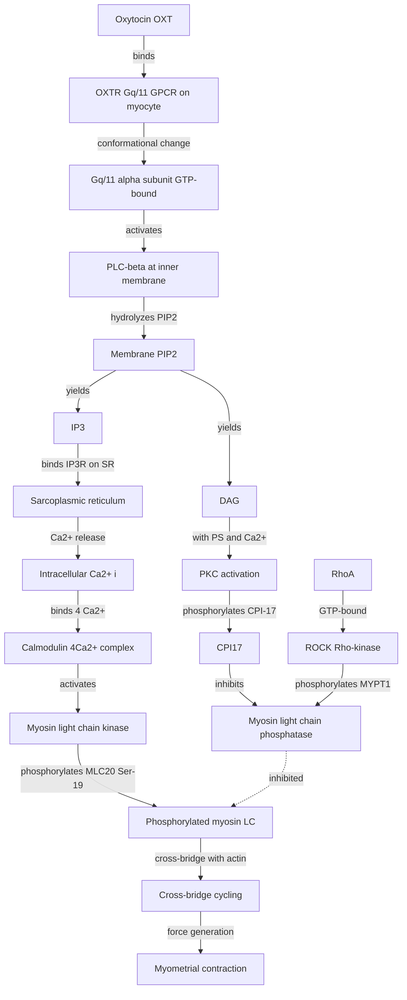
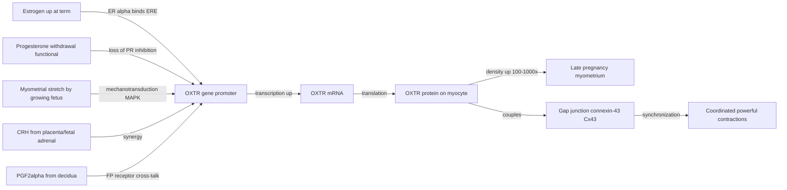
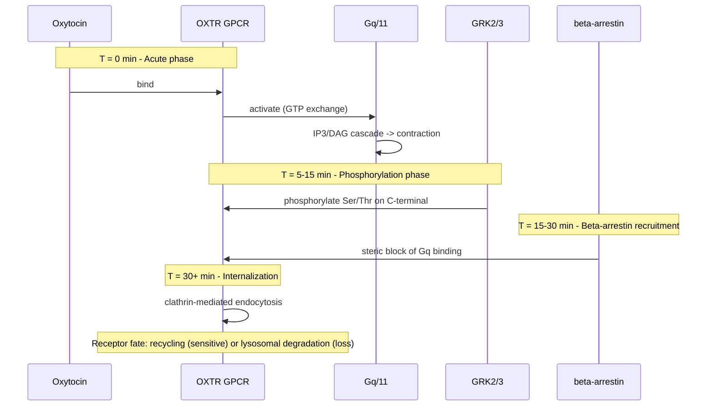
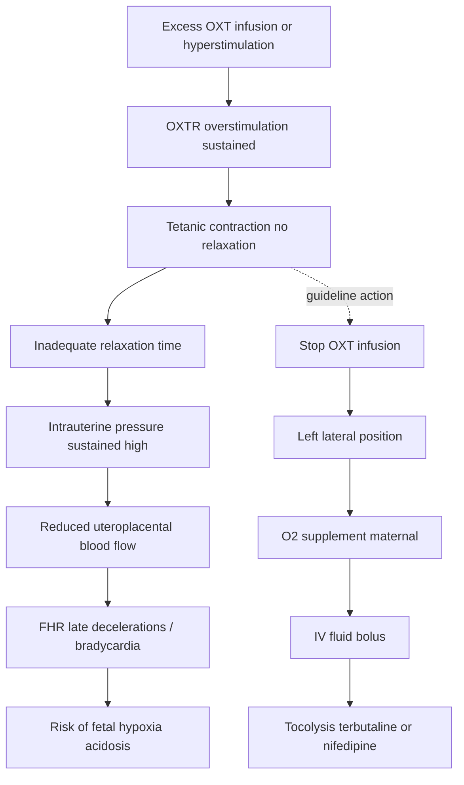
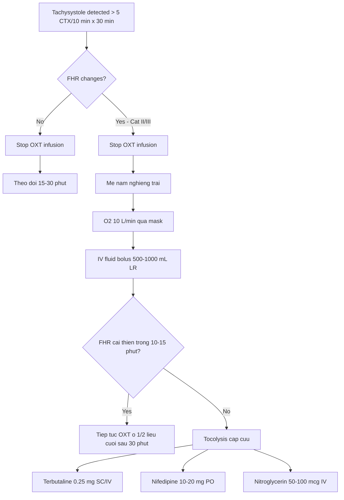
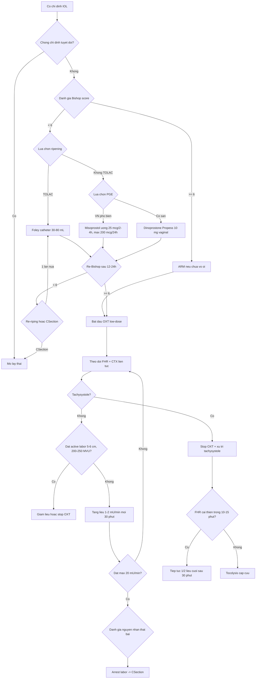

# Đẻ Chỉ Huy Bằng Oxytocin — Bài Giảng Chi Tiết

> **Ngày soạn:** 2026-06-23
> **Loại tài liệu:** Bài giảng sản khoa tổng hợp (guideline + cơ chế + protocol + thực hành tại VN)
> **Phạm vi:** Induction of labor (IOL) bằng oxytocin tĩnh mạch — từ cơ chế phân tử đến phác đồ lâm sàng và xử trí biến chứng.
> **Tài liệu nguồn:**
> - `Oxytocin_Mechanism_2026-06-23.md` — cơ chế receptor + signaling pathway
> - `Oxytocin_Induction_Guideline_2026-06-23.md` — guideline + bằng chứng lâm sàng

---

## Mục lục

### Phần 1 — Cơ chế
1. [Bối cảnh lịch sử](#1-bối-cảnh-lịch-sử)
2. [Phân tử Oxytocin và thụ thể OXTR](#2-phân-tử-oxytocin-và-thụ-thể-oxtr)
3. [Pathway tín hiệu chi tiết](#3-pathway-tín-hiệu-chi-tiết)
4. [Điều hòa OXTR theo thai kỳ](#4-điều-hòa-oxtr-theo-thai-kỳ)
5. [Phân biệt OXTR với thụ thể Vasopressin](#5-phân-biệt-oxtr-với-thụ-thể-vasopressin)
6. [Desensitization (Tachyphylaxis)](#6-desensitization-tachyphylaxis)
7. [Cơ chế Tachysystole và hậu quả](#7-cơ-chế-tachysystole-và-hậu-quả)
8. [Đối kháng: Atosiban, Nifedipine, Indomethacin](#8-đối-kháng-atosiban-nifedipine-indomethacin)
9. [Pharmacogenomics — OXTR polymorphism](#9-pharmacogenomics--oxtr-polymorphism)
10. [Oxytocin nội sinh trung ương vs ngoại vi](#10-oxytocin-nội-sinh-trung-ương-vs-ngoại-vi)
11. [Tại sao Low-Dose Protocol được ưa chuộng](#11-tại-sao-low-dose-protocol-được-ưa-chuộng)

### Phần 2 — Lâm sàng
12. [Bối cảnh và định nghĩa IOL](#12-bối-cảnh-và-định-nghĩa-iol)
13. [Guideline hiện hành](#13-guideline-hiện-hành)
14. [Chỉ định khởi phát chuyển dạ](#14-chỉ-định-khởi-phát-chuyển-dạ)
15. [Chống chỉ định và thận trọng](#15-chống-chỉ-định-và-thận-trọng)
16. [Bishop Score — đánh giá cổ tử cung](#16-bishop-score--đánh-giá-cổ-tử-cung)
17. [Hai chiến lược: Cervical ripening vs Direct oxytocin](#17-hai-chiến-lược-cervical-ripening-vs-direct-oxytocin)
18. [Phác đồ oxytocin — Low-dose vs High-dose](#18-phác-đồ-oxytocin--low-dose-vs-high-dose)
19. [Theo dõi (monitoring)](#19-theo-dõi-monitoring)
20. [Tachysystole — xử trí](#20-tachysystole--xử-trí)
21. [Oxytocin trên sẹo mổ cũ — VBAC/TOLAC](#21-oxytocin-trên-sẹo-mổ-cũ--vbactolac)
22. [So sánh oxytocin với các phương pháp khác](#22-so-sánh-oxytocin-với-các-phương-pháp-khác)
23. [Kết hợp ripening + oxytocin (sequential)](#23-kết-hợp-ripening--oxytocin-sequential)
24. [Áp dụng tại Việt Nam](#24-áp-dụng-tại-việt-nam)

### Phần 3 — Tổng hợp
25. [Cheat sheet lâm sàng](#25-cheat-sheet-lâm-sàng)
26. [Tài liệu tham khảo đầy đủ](#26-tài-liệu-tham-khảo-đầy-đủ)

---

# PHẦN 1 — CƠ CHẾ

## 1. Bối cảnh lịch sử

### 1.1. Phát hiện chất tạo cơn gò

- **1906 — Henry Dale**: phát hiện chiết xuất từ thuỳ sau tuyến yên (posterior pituitary / neurohypophysis) gây co tử cung ở mèo mang thai; đặt tên "oxytocin" (từ Hy Lạp *ὀξύς* = "nhanh", *τόκος* = "sinh đẻ") — nghĩa là "sinh nhanh" (Dale HH, *J Physiol* 1906).
- **1953 — Du Vigneaud** (Cornell, Nobel Hóa học 1955): xác định cấu trúc tuần hoàn 9 amino acid, đồng thời tổng hợp được oxytocin tổng hợp đầu tiên (Du Vigneaud V et al., *J Am Chem Soc* 1953).
- **1980s — Soloff**: clone và mô tả đặc tính thụ thể oxytocin (OXTR) ở tử cung chuột cống mang thai; chỉ ra OXTR là GPCR đơn.
- **1990s — Zingg, Kimura, Ivell**: cloning gene OXTR người (chromosome 3p25), xác định vùng promoter estrogen-responsive.

### 1.2. Cột mốc quan trọng

| Năm | Cột mốc | Nguồn |
|------|----------|--------|
| 1906 | Dale mô tả tác dụng co tử cung | Dale HH, *J Physiol* |
| 1953 | Tổng hợp oxytocin nhân tạo | Du Vigneaud, Nobel 1955 |
| 1980s | Mô tả đặc tính thụ thể | Soloff MS |
| 1990s | Cloning OXTR người | Kimura T, Ivell R, Zingg HH |
| 2001 | Tổng quan toàn diện "Physiol Rev" | Gimpl G & Fahrenholz F (PMID 11274341) |
| 2014 | Cơ chế chuyên biệt cho myometrium | Arrowsmith S (PMID 24888645) |
| 2018 | Cập nhật "OXTR: from signaling to behavior" | Jurek B & Neumann ID (PMID 29897293) |

---

## 2. Phân tử Oxytocin và thụ thể OXTR

### 2.1. Phân tử Oxytocin

**Oxytocin (OXT)** là nonapeptide (9 aa) tuần hoàn có cầu disulfide giữa Cys¹–Cys⁶:

```
Cys-Tyr-Ile-Gln(Asn)-Cys-Pro-Leu-Gly(NH₂)
        \__________________/
          disulfide bridge 1–6
```

- **Tiền chất:** Prepro-oxytocin (~125 aa) → pro-oxytocin → OXT (nonapeptide) + neurophysin I (carrier protein).
- **Vị trí tổng hợp ngoại vi:** Nhân thị giác trên (SON) và nhân cạnh não thất (PVN) của vùng dưới đồi → sợi trục xuống thuỳ sau tuyến yên → phóng thích vào máu ngoại vi khi có kích thích (Ferguson reflex, stress, cho bú).
- **Thời gian bán huỷ huyết tương (T½):** ~3–5 phút.
- **Phân huỷ:** chủ yếu bởi **placental leucine aminopeptidase (P-LAP / oxytocinase / IRAP, gene *LNPEP*)**, thuộc M1 aminopeptidase family (Tsujimoto M 2005, PMID 16054015).

### 2.2. Thụ thể OXTR

- **Gene:** *OXTR* (chromosome 3p25.3, ~17 kb, 4 exon, 3 intron).
- **Loại:** GPCR class A (rhodopsin-like), 7 transmembrane domain, 389 amino acid (người).
- **Tín hiệu chính:** **Gq/11** → PLC-β → PIP2 → IP3 + DAG → Ca²⁺ nội bào + PKC.
- **Tín hiệu phụ:** Gαi/o, β-arrestin 1/2 → MAPK/ERK1/2, Akt, FAK.

---

## 3. Pathway tín hiệu chi tiết

### 3.1. Sơ đồ pathway chính (canonical Gq)



**Giải thích từng bước:**

| Bước | Sự kiện | Trích dẫn |
|------|----------|-----------|
| 1 | OXT gắn OXTR ở mặt ngoài màng myocyte | Jurek & Neumann 2018, PMID 29897293 |
| 2 | OXTR là Gq-coupled GPCR → Gαq/11 binding | Gimpl & Fahrenholz 2001, PMID 11274341 |
| 3 | Gαq-GTP kích hoạt **phospholipase C-beta (PLCβ)** | Arrowsmith 2014, PMID 24888645 |
| 4 | PLCβ thuỷ phân **PIP2** → **IP3** + **DAG** | Iovino 2021, PMID 32433011 |
| 5 | IP3 gắn **IP3R** trên SR → phóng thích Ca²⁺ | Gimpl 2001, PMID 11274341 |
| 6 | [Ca²⁺]i tăng từ ~100 nM lên ~500–1000 nM | Arrowsmith 2014, PMID 24888645 |
| 7 | Ca²⁺ gắn **calmodulin (CaM)** → phức hợp Ca²⁺₄-CaM | Martisen 2014, PMID 25483583 |
| 8 | Ca²⁺₄-CaM kích hoạt **myosin light chain kinase (MLCK)** | Mizuno 2008, PMID 18524939 |
| 9 | MLCK phosphorylate **MLC20 (Ser-19)** | MacEwen 2023, PMID 36968084 |
| 10 | MLC20-P tăng ATPase activity → cross-bridge cycling → co cơ | Martisen 2014, PMID 25483583 |
| 11 | DAG + Ca²⁺ kích hoạt **PKC** → phosphorylate **CPI-17** | Sohn 2001, PMID 11447027 |
| 12 | CPI-17-P **ức chế MLCP** → duy trì MLC20-P | Mizuno 2008, PMID 18524939 |
| 13 | **RhoA/ROCK pathway**: ức chế MLCP → **tăng Ca²⁺ sensitivity** | Moran 2002, PMID 11818523; Carvajal 2024, PMID 39434813 |
| 14 | Kết quả: co cơ trơn tử cung | Arrowsmith 2014, PMID 24888645 |

---

## 4. Điều hòa OXTR theo thai kỳ

### 4.1. Tăng biểu hiện OXTR

OXTR density ở myometrium **tăng 100–1000 lần** từ non-pregnant → late pregnancy (Kimura 1992; Larcher 1995, PMID 7588281).



**Cơ chế cụ thể (5 yếu tố điều hòa):**

- **Yếu tố 1 — Estrogen (E2) tăng → ERE trong promoter OXTR** (Larcher 1995, PMID 7588281).
- **Yếu tố 2 — Progesterone withdrawal** → bỏ ức chế PR lên OXTR (Zingg 2003, PMID 12826328).
- **Yếu tố 3 — Myometrial stretch** → MAPK/ERK → AP-1 → tăng OXTR (Kimura 1999, PMID 10453463).
- **Yếu tố 4 — CRH (corticotrophin-releasing hormone)** từ nhau thai → CRHR1 → tăng OXTR (Iovino 2021).
- **Yếu tố 5 — PGF2α từ màng rụng** → FP receptor → tăng OXTR (Carvajal 2024, PMID 39434813).

### 4.2. Connexin-43 — "glue" cho cơn co đồng bộ

- Cùng với tăng OXTR, **connexin-43 (Cx43)** — protein tạo gap junction — cũng tăng theo estrogen / giảm progesterone.
- Gap junction cho phép **khớp điện** giữa các myocyte → cơn co lan toả đồng bộ.

---

## 5. Phân biệt OXTR với thụ thể Vasopressin

OXT và vasopressin (AVP / ADH) cùng họ (prepro-hormone giống, 2/9 amino acid khác). Có **cross-bind nhẹ** ở liều cao, giải thích một số tác dụng phụ (ví dụ OXT liều cao → giữ nước nhẹ do kích hoạt V2).

### Bảng so sánh receptor

| Đặc điểm | OXTR | V1a (AVPR1A) | V1b (AVPR1B) | V2 (AVPR2) |
|----------|------|--------------|--------------|------------|
| **Gene / locus** | *OXTR* 3p25.3 | *AVPR1A* 12q14.2 | *AVPR1B* 1q32.1 | *AVPR2* Xq28 |
| **G-protein** | **Gq/11** | **Gq/11** | **Gq/11** | **Gs** |
| **Second messenger** | IP3/DAG → Ca²⁺ | IP3/DAG → Ca²⁺ | IP3/DAG → Ca²⁺ | **cAMP → PKA** |
| **Vị trí chính** | Myometrium, ngực, não | Vascular SMC, gan | Tuyến yên trước | Thận (collecting duct) |
| **Chức năng** | Co tử cung, milk ejection, social behavior | Vasoconstriction, glycogenolysis | ACTH release | Water reabsorption |
| **Đối kháng chọn lọc** | **Atosiban** | Relcovaptan | Nelivaptan | Tolvaptan |

**Trích dẫn:** Manning M 2008, PMID 18655903; Mayasich SA 2020, PMID 32138945.

---

## 6. Desensitization (Tachyphylaxis)

OXTR là GPCR điển hình → sau khi kích hoạt kéo dài sẽ xảy ra **desensitization** theo trình tự:



**Trình tự chi tiết (5 bước):**

- **Bước 1 — Phosphorylation (5–15 phút):** GRK2/3 phosphorylate Ser/Thr ở C-terminal của OXTR.
- **Bước 2 — β-arrestin recruitment (15–30 phút):** β-arrestin 1/2 gắn vào OXTR → steric block ngăn Gq → "uncoupling" (Rajagopal 2018, PMID 28137506).
- **Bước 3 — Internalization (30+ phút):** clathrin-mediated endocytosis.
- **Bước 4 — Re-sensitization:** Receptor có thể được recycle về màng HOẶC bị lysosomal degradation.
- **Bước 5 — Functional tachyphylaxis** sau ~4–6 giờ truyền OXT liên tục (Caritis 1987, PMID 2889362).

### Ý nghĩa cho protocol IOL

- **Low-dose titrated protocol** cho phép receptor mới được tổng hợp thay thế → duy trì đáp ứng.
- **Ngừng truyền tạm thời 30–60 phút khi tachysystole** cho receptor recycle.
- **Truyền OXT > 24–48 giờ** có thể cần liều cao hơn.

---

## 7. Cơ chế Tachysystole và hậu quả

### 7.1. Định nghĩa (ACOG/SMFM 2008, cập nhật 2024)

- **Tachysystole:** > 5 cơn co / 10 phút, trung bình trong 30 phút liên tục.
- Có thể kèm FHR thay đổi (Category II/III) → **tachysystole with FHR changes**.

### 7.2. Cơ chế sinh học



**Sinh lý (4 bước):**

- Co cơ quá mạnh → **thời gian relax < 60–90 giây** giữa các cơn.
- Trong relax, máu nuôi thai qua spiral arteries → intervillous space được phục hồi; nếu relax < 30–60 giây → **giường nhau không kịp tái tưới máu**.
- **Oxygen reserve** của thai bị tiêu hao → yếm khí → lactate tăng → **pH giảm (acidosis)**.
- **FHR Category II** → có thể tiến triển **Category III** nếu không xử trí.

### 7.3. Hậu quả lâm sàng

| Mẹ | Thai |
|----|------|
| Vỡ tử cung (đặc biệt TOLAC) | Fetal hypoxia, hypercapnia, metabolic acidosis |
| Nhau bong non | HIE, cerebral palsy, tử vong chu sinh |
| PPH (do uterine atony thứ phát) | — |

---

## 8. Đối kháng: Atosiban, Nifedipine, Indomethacin

### 8.1. Atosiban (OXTR antagonist)

- **Loại:** Peptide tổng hợp (cyclic hexapeptide) — **chất đối kháng cạnh tranh chọn lọc OXTR**, một phần V1a.
- **Cơ chế:** Gắn OXTR nhưng không hoạt hoá → ngăn OXT/AVP gắn → **block toàn bộ pathway downstream**.
- Reversi 2005 (PMID 15705593): atosiban có **"biased antagonism"** — ức chế Gq-mediated contraction mà không ức chế β-arrestin-mediated proliferation.
- **Tác dụng phụ ít** so với nifedipine/indomethacin vì không qua COX / không ảnh hưởng huyết áp nặng.
- **Hạn chế:** Không FDA-approved (chỉ EMA 2000); giá cao.

### 8.2. Nifedipine (L-type Ca²⁺ channel blocker)

- **Loại:** Dihydropyridine Ca²⁺ channel blocker — ức chế **L-type voltage-operated Ca²⁺ channel (VDCC)**.
- **Tác dụng phụ:** hạ huyết áp, đỏ bừng, **phù phổi** (hiếm).

### 8.3. Indomethacin (COX inhibitor)

- **Loại:** NSAID ức chế **COX-1/2** → giảm tổng hợp PGF2α và PGE2.
- **Hạn chế:** Qua nhau thai → **đóng ống động mạch sớm** nếu dùng > 32 tuần; giảm nước ối. Chỉ dùng < 32 tuần, ≤ 48 giờ.

### 8.4. Bảng so sánh thuốc đối kháng

| Đặc điểm | Atosiban | Nifedipine | Indomethacin |
|----------|----------|------------|--------------|
| **Cơ chế** | OXTR antagonist | L-type Ca²⁺ channel blocker | COX-1/2 inhibitor |
| **Tác động upstream** | Tại receptor | Tại Ca²⁺ influx | Tại prostaglandin synthesis |
| **Có ảnh hưởng HA** | Không | **Có** (hạ HA) | Không |
| **Ảnh hưởng thai** | An toàn | An toàn | Đóng ống ĐM sớm > 32 tuần |
| **Tuổi thai an toàn** | 24–34 tuần | 24–34 tuần | < 32 tuần |
| **Trạng thái phê duyệt** | EMA; **không FDA** | Off-label | Off-label |

**Trích dẫn:** Thornton S 2001, PMID 11429647; Bossmar T 1998, PMID 10224602.

---

## 9. Pharmacogenomics — OXTR polymorphism

### 9.1. Các SNP quan trọng

- **rs53576 (G/A) — intron 3 của OXTR**: allele A liên quan giảm OXTR mRNA; cần liều OXT cao hơn.
- **rs2254298 (G/A) — intron 1**: allele A → giảm OXTR expression, tăng anxiety.
- **rs2228485 (C/T) — exon 3 (synonymous)**: có thể liên quan postpartum depression.

### 9.2. Bằng chứng sản khoa cụ thể

**Grotegut CA et al. 2017** (`AJOG`, PMID **28526450**) — 482 phụ nữ IOL tại Duke:

- 18 SNP OXTR + 7 SNP GRK6 được phân tích.
- **5 SNP OXTR** liên quan nominal đến max OXT infusion rate.
- **2 SNP OXTR** liên quan nominal đến tổng OXT dose.
- **rs2731664 (GRK6):** mean duration of labor 17.7h (AA) vs 20.2h (AC) vs 23.5h (CC), p = 0.0014.
- **3 SNP (2 OXTR + 1 GRK6)** liên quan nominal đến mode of delivery.

> `[FULL VERIFIED]` — abstract verified ngày 2026-06-23.

> **Tình trạng áp dụng:** Hiện **không khuyến cáo** xét nghiệm SNP OXTR thường quy vì hiệu ứng allele đơn lẻ nhỏ + yếu tố lâm sàng chi phối mạnh hơn.

---

## 10. Oxytocin nội sinh trung ương vs ngoại vi

| Nguồn | Từ neuron đến | Vai trò |
|-------|---------------|---------|
| **Ngoại vi** | SON/PVN → posterior pituitary → máu | Co tử cung, milk ejection, natriuresis |
| **Trung ương** | PVN → amygdala, NAcc, hippocampus | Social bonding, trust, anxiety ↓, maternal behavior |

### Có tác dụng trung ương khi truyền OXT tĩnh mạch IOL không?

- **Không** (hoặc rất ít): OXT tĩnh mạch ngoại vi **không qua được BBB** ở liều lâm sàng vì OXT là peptide 9 aa, poorly lipid-soluble, bị efflux bởi P-glycoprotein.
- Vì vậy, IOL oxytocin hoàn toàn là tác dụng ngoại vi trên myometrium.

---

## 11. Tại sao Low-Dose Protocol được ưa chuộng

### 11.1. Hai trường phái protocol

| | **Low-dose** (ACOG phổ biến) | **High-dose** (RCOG; Kruit Helsinki) |
|---|---|---|
| **Khởi đầu** | 0.5–2 mU/min | 4–6 mU/min |
| **Tăng liều** | +1 mU/min mỗi 30–40 phút | +4–6 mU/min mỗi 15–20 phút |
| **Liều tối đa** | 20–40 mU/min | 20–40 mU/min |
| **Thời gian đạt active labor** | Lâu hơn (~6–8 giờ) | Ngắn hơn (~3–4 giờ) |
| **Tachysystole** | ~5% | ~10–15% |

### 11.2. Cơ chế giải thích low-dose (4 lý do)

- **Lý do 1 — Receptor occupancy & spare receptors:** Với OXTR tăng 100–1000 lần, chỉ cần 5–10% occupancy để đạt đáp ứng tối đa.
- **Lý do 2 — Tránh desensitization sớm:** Liều thấp cho phép receptor recycling + synthesis mới.
- **Lý do 3 — Tránh tachysystole** và hậu quả thai nhi.
- **Lý do 4 — An toàn "tail" effect:** T½ 3–5 phút → 30–45 phút tan effect; low-dose có tail ngắn hơn.

### 11.3. Bằng chứng so sánh

**Grasch JL et al. 2025** (`AJOG MFM`, PMID **40334983**) — meta-analysis 6 nghiên cứu, 7,850 ca:

- **Cesarean:** không khác biệt (26.0% vs 28.4%; RR 1.02, 95% CI 0.85–1.21).
- **PPH:** high-dose thấp hơn (7.6% vs 9.9%; RR 0.78, 95% CI 0.66–0.92).

> `[FULL VERIFIED]`

**Kruit H et al. 2022** (`PLoS One`, PMID **35452451**) — retrospective cohort Helsinki 487 ca:

- High-dose: vaginal delivery 69.9% vs 47.9%; infection thấp hơn; induction-to-delivery ngắn hơn (32.0h vs 37.9h).

> `[FULL VERIFIED]`

---

# PHẦN 2 — LÂM SÀNG

## 12. Bối cảnh và định nghĩa IOL

### 12.1. Khởi phát chuyển dạ (Induction of labor, IOL) là gì

- **Định nghĩa (ACOG/SMFM Consensus 2014):** IOL là **can thiệp y khoa nhằm khởi phát chuyển dạ** trước khi cơn co tự xuất hiện, với mục tiêu sinh qua đường âm đạo.
- **Khác với augmentation** — augmentation áp dụng khi cơn co đã bắt đầu nhưng yếu.

### 12.2. Vai trò của oxytocin trong IOL

- **Oxytocin** là một trong hai trụ cột chính của IOL, bên cạnh **cervical ripening**.
- Dùng **đơn thuần** (Bishop ≥ 6), **sau ripening**, hoặc **augmentation** trong chuyển dạ kéo dài.

---

## 13. Guideline hiện hành

| Tổ chức | Tên tài liệu | Mã số | Năm |
|----------|--------------|-------|-----|
| **ACOG** | Practice Bulletin: Induction of Labor | #107 (2009) + các PB cập nhật | Active |
| **ACOG + SMFM** | Safe Prevention of the Primary Cesarean Delivery | Consensus Obstetric Care Series #1 | 2014 |
| **RCOG** | Green-top Guideline | GTG 45 (preterm) + GTG 73 (VBAC) | Cập nhật 2024 |
| **NICE** | Inducing Labour | NG207 | 2021 (update 2023) |
| **WHO** | WHO Recommendations for Induction of Labour | WHO/RHR/11.10 | 2011 (update 2024-25) |
| **FIGO** | Recommendations on Induction of Labour | SMNH 2022 | 2022 |
| **BYT VN** | Hướng dẫn quốc gia CSSKSS | QD 4128 + update 2024 | Active |

### Điểm chung giữa các guideline

- **Low-dose titrated protocol** là khuyến cáo đầu tay cho IOL đủ thai ≥ 37 tuần.
- **Monitoring liên tục** (TOCO + FHR) khi truyền OXT.
- **Tachysystole management** theo trình tự chuẩn.
- **VBAC/TOLAC:** escalation interval ≥ 30 phút, max dose ≤ 20 mU/min.

### Điểm khác biệt đáng chú ý

| Vấn đề | ACOG | RCOG | NICE NG207 | WHO | VN (BYT) |
|---------|------|------|-----------|-----|----------|
| **Khởi đầu OXT** | 0.5–2 mU/min | 1–4 mU/min | 1–4 mU/min | 1–2 mU/min | 2–4 mU/min |
| **Tăng liều** | +1–2 / 15–40 min | +1–4 / 30 min | +1–4 / 30 min | +1 / 30 min | +1–2 / 30 min |
| **Max dose** | Không cố định | 20 mU/min | 20 mU/min | Khuyến cáo giới hạn | 20 mU/min |

> **Lưu ý về max dose cho VBAC:** ≤ 20 mU/min và interval ≥ 30 phút dựa trên **Nicol 2026 PMID 41241095** (OR vỡ tử cung 1.94 với bất kỳ OXT; interval < 30 min và max > 20 đồng nhất tăng UR risk).

---

## 14. Chỉ định khởi phát chuyển dạ

| Nhóm | Chỉ định cụ thể |
|------|----------------|
| **Thai quá ngày (post-term)** | ≥ 41 tuần (ACOG); ≥ 41+0 (NICE) |
| **PROM đủ thai** | ≥ 37 tuần, không chuyển dạ 12–24 giờ |
| **Đái tháo đường thai kỳ** | DM type 2 hoặc GDM kiểm soát kém; IOL 38–39 tuần |
| **Tăng huyết áp / tiền sản giật** | Tuỳ mức nặng; thường ≥ 37 tuần |
| **IUGR / thai chậm tăng trưởng** | ≥ 37 tuần hoặc sớm hơn tùy tình trạng |
| **Oligohydramnios đơn độc** | ≥ 36–37 tuần |
| **Thai lưu** | Bất kỳ tuổi thai nào |
| **Mẹ có bệnh lý nội khoa** | SLE, thận, tim ổn định |
| **Yêu cầu mẹ / lý do xã hội** | Sau 39 tuần |

---

## 15. Chống chỉ định và thận trọng

### 15.1. Chống chỉ định tuyệt đối

- **Nhau tiền đạo** che phủ lỗ trong CTC
- **Vasa previa**
- **Ngôi bất thường** (ngang, mông — ngoại trừ mông đã chọn sinh ngả âm đạo)
- **Dây rốn sa trước (cord prolapse)**
- **Sẹo mổ cũ xuyên thân tử cung** (classical, T-incision, myomectomy xuyên thân)
- **Nhiễm HSV đang hoạt động**
- **Carcinoma cổ tử cung xâm lấn**
- **Bất tương xứng đầu-chậu (CPD)** rõ ràng
- **Vỡ tử cung trước đó**

### 15.2. Chống chỉ định tương đối

| Tình huống | Hướng xử trí |
|------------|-------------|
| **Sẹo mổ ngang (TOLAC)** | IOL được, giảm liều, interval ≥ 30 min, max ≤ 20 mU/min |
| **Đa thai** | Cho phép IOL, monitoring từng thai |
| **Polyhydramnios** | Nguy cơ vỡ ối đột ngột, sa dây rốn |
| **FGR / thai suy** | Titrated chậm, sẵn sàng mổ cấp cứu |
| **Béo phì nặng** | Có thể cần liều cao hơn |

---

## 16. Bishop Score — đánh giá cổ tử cung

| Tiêu chí | 0 | 1 | 2 | 3 |
|----------|---|---|---|---|
| **Độ xoá (effacement %)** | 0–30% | 40–50% | 60–70% | ≥ 80% |
| **Độ mở (dilation cm)** | đóng | 1–2 | 3–4 | ≥ 5 |
| **Vị trí** | posterior | mid | anterior | — |
| **Mật độ** | cứng | trung bình | mềm | — |
| **Ngôi (station)** | -3 | -2 | -1/0 | dưới mỏ vịt |

- **Bishop ≥ 6:** thuận lợi → có thể IOL trực tiếp bằng OXT.
- **Bishop < 6:** cần cervical ripening trước.

---

## 17. Hai chiến lược: Cervical ripening vs Direct oxytocin

### 17.1. Cervical ripening trước OXT

| Nhóm | Phương pháp | Cơ chế | Ưu điểm | Nhược điểm |
|------|------------|--------|----------|------------|
| **Cơ học** | Foley 16–18 Fr (bóng 30–80 mL), double-balloon | Áp lực cơ học → PGE2 nội sinh | An toàn, rẻ, không tachysystole do thuốc | Thời gian lâu |
| **PGE1** | Misoprostol 25–50 mcg đặt âm đạo/uống | Tăng PGE1 → tăng Ca²⁺, giảm collagen | Hiệu quả cao, nhanh | Tachysystole cao |
| **PGE2** | Dinoprostone (Propess 10 mg; Cervidil) | PGE2 ổn định → ripening + co nhẹ | Ít tachysystole hơn PGE1; kiểm soát được | Giá cao |

### 17.2. Direct oxytocin (Bishop ≥ 6)

Bắt đầu OXT ngay + có thể kết hợp ARM (amniotomy).

---

## 18. Phác đồ oxytocin — Low-dose vs High-dose

### 18.1. Bảng so sánh

| Thông số | **Low-dose** (ACOG + WHO) | **High-dose** (RCOG + Kruit 2022) |
|----------|---------------------------|-----------------------------------|
| **Khởi đầu** | 0.5–2 mU/min | 4–6 mU/min |
| **Bước tăng** | +1–2 mU/min | +4–6 mU/min |
| **Interval** | 30–40 phút | 15–20 phút |
| **Max dose** | 20 mU/min | 20 mU/min |
| **Thời gian đạt active labor** | ~6–8 giờ | ~3–4 giờ |

### 18.2. Bằng chứng mới nhất

**Grasch 2025 PMID 40334983** — meta-analysis 6 nghiên cứu, 7,850 ca:
- Cesarean không khác biệt (RR 1.02, 95% CI 0.85–1.21)
- PPH: high-dose thấp hơn (RR 0.78, 95% CI 0.66–0.92)

**Kruit 2022 PMID 35452451** — Helsinki cohort:
- High-dose: vaginal delivery 69.9% vs 47.9%
- Maternal infection thấp hơn

### 18.3. Protocol thực tế tại các BV

**Protocol mẫu low-dose (phổ biến tại VN):**

```
Chuẩn bị: 5 IU OXT + 500 mL NaCl 0.9% / LR (= 10 mU/mL)
Khởi đầu: 1–2 mU/min (BYT VN phổ biến 2 mU/min)
Tăng: +1–2 mU/min mỗi 30 phút
Max dose: 20 mU/min
Mục tiêu: 200–250 MVU, 3–5 CTX/10 min, cổ tử cung tiến triển
Stop khi: đạt active labor (≥ 5–6 cm, MVU đạt)
```

**Protocol mẫu high-dose (RCOG + Bắc Âu):**

```
Khởi đầu: 4 mU/min
Tăng: +4 mU/min mỗi 15–20 phút
Max: 20 mU/min
Stop: khi active labor
Giới hạn tổng thời gian: 15–18 giờ (Kruit 2022)
```

### 18.4. MVU (Montevideo Units)

- **MVU** = số cơn co trong 10 phút × cường độ trung bình (mmHg).
- **MVU mục tiêu:** **200–250** trong active labor.
- Không tăng OXT vô tận — mục tiêu là **cơn co hiệu quả**.

---

## 19. Theo dõi (monitoring)

### 19.1. Thiết bị

| Thiết bị | Mục đích |
|----------|---------|
| **Tocodynamometer (TOCO)** | Ghi tần số + thời gian cơn co |
| **FHR monitor** | Ghi FHR liên tục |
| **IUPC** | Đo MVU chính xác |
| **Mạch, HA mẹ** | Mỗi 15 phút giai đoạn đầu |

### 19.2. Tần suất đánh giá

- Khi bắt đầu/tăng OXT: mỗi 15 phút (latent), mỗi 5–15 phút (active).

### 19.3. Tiêu chuẩn cơn co hiệu quả

- **Tần số:** 3–5 cơn / 10 phút
- **Thời gian:** 40–60 giây / cơn
- **Cường độ:** ~50–80 mmHg
- **Relax:** ≥ 60 giây
- **MVU:** 200–250

---

## 20. Tachysystole — xử trí

### 20.1. Định nghĩa

> **Tachysystole** = **> 5 cơn co / 10 phút**, trung bình trong 30 phút liên tục.

### 20.2. Xử trí theo ACOG Practice Bulletin #204 + RCOG



**Trình tự ACOG (6 bước):**

- **Bước 1 — Dừng truyền OXT ngay**
- **Bước 2 — Nằm nghiêng trái**
- **Bước 3 — O2 10 L/min qua mask**
- **Bước 4 — IV fluid bolus** 500–1000 mL Lactated Ringer
- **Bước 5 — Đánh giá lại FHR sau 10–15 phút:**
  - Cải thiện → tiếp tục theo dõi; **bắt đầu lại OXT ở ½ liều cũ** sau ≥ 30 phút
  - Không cải thiện → **tocolysis cấp cứu**
- **Bước 6 — Tocolysis cấp cứu:**
  - **Terbutaline 0.25 mg SC/IV** (β2-agonist, tác dụng 2–5 phút)
  - **Nitroglycerin 50–100 mcg IV** (NO donor, tác dụng 30–60 giây)
  - **Nifedipine 10–20 mg PO** (CCB, đỉnh 30–60 phút)

### 20.3. Dữ liệu thực tế

**Pieux A 2025 PMID 40097030** — 439 ca cervical ripening tại Lyon:
- Tachysystole sau oral misoprostol: 5.3%
- Tachysystole sau dinoprostone: 17.2%
- **OR cho tachysystole (misoprostol vs dinoprostone): 0.28, 95% CI 0.13–0.55**

> `[FULL VERIFIED]`

---

## 21. Oxytocin trên sẹo mổ cũ — VBAC/TOLAC

### 21.1. Tại sao quan trọng

- **Vỡ tử cung** là biến chứng tử vong/thương tật nặng nhất của TOLAC.
- Tần suất UR ở TOLAC không OXT: ~0.5%
- Tần suất UR ở TOLAC có OXT: ~1.0–2.0%

### 21.2. Meta-analysis mới nhất — Nicol 2026

**Nicolò P et al. 2026** (`AJOG MFM`, PMID **41241095**) — 21 nghiên cứu, 51,511 bệnh nhân TOLAC:

- **Bất kỳ OXT:** OR **1.94, 95% CI 1.36–2.77** cho vỡ tử cung
- **Chỉ induction:** OR **2.07, 95% CI 1.28–3.36**
- **Chỉ augmentation:** OR **2.03, 95% CI 1.22–3.38**
- **Interval < 30 min:** đồng nhất tăng UR risk
- **Max dose > 20 mU/min:** đồng nhất tăng UR risk

> `[FULL VERIFIED]`

### 21.3. Phác đồ cho TOLAC

| Thông số | Khuyến cáo cho TOLAC |
|----------|----------------------|
| **Khởi đầu OXT** | 0.5–1 mU/min |
| **Tăng liều** | +1 mU/min mỗi **≥ 30 phút** |
| **Max dose** | **≤ 20 mU/min** |
| **Foley ripening** | **Ưu tiên mechanical** thay vì prostaglandin |
| **Monitoring** | FHR + TOCO liên tục; sẵn sàng mổ cấp cứu |
| **Dấu hiệu UR** | Đau sẹo, FHR bradycardia, mất station, vaginal bleeding, hematuria |

---

## 22. So sánh oxytocin với các phương pháp khác

| Phương pháp | Cơ chế | Tỷ lệ thành công | Tachysystole | Phù hợp cho |
|------------|--------|-----------------|--------------|-------------|
| **Oxytocin IV** | OXTR → co cơ trực tiếp | Cao (Bishop thuận lợi) | 5–15% | Bishop ≥ 6 hoặc sau ripening |
| **Foley catheter** | Áp lực + PGE2 nội sinh | Cao | **Rất thấp** | Tất cả Bishop < 6; TOLAC ưu tiên |
| **Misoprostol (oral/vaginal)** | PGE1 → ripening + co | Rất cao | Cao nếu vaginal; thấp nếu oral | Bishop < 6, không TOLAC |
| **Dinoprostone (PGE2)** | PGE2 → ripening + co | Cao | Trung bình | Bishop < 6 |
| **ARM đơn thuần** | PGF2α nội sinh | Trung bình | Thấp | Phối hợp với OXT |

---

## 23. Kết hợp ripening + oxytocin (sequential)

### 23.1. Algorithm IOL tổng hợp



### 23.2. Quyết định ngừng OXT

- **Thành công:** cổ tử cung mở ≥ 5–6 cm + cơn co đều 200–250 MVU → **giảm liều hoặc ngừng**
- **Thất bại IOL:** đã max dose trong ≥ 18–24 giờ mà không vào active labor → **mổ lấy thai**
- **Tachysystole kéo dài** → cân nhắc mổ cấp cứu
- **FHR Category III** → mổ cấp cứu

---

## 24. Áp dụng tại Việt Nam

### 24.1. Hướng dẫn Bộ Y tế VN

- **Quyết định 4128/QĐ-BYT 2016 + cập nhật 2024.**
- **Phác đồ phổ biến:**
  - **Khởi đầu OXT:** 2 mU/min (đa số BV tuyến tỉnh + TW)
  - **Tăng:** +1–2 mU/min mỗi 30 phút
  - **Max dose:** 20 mU/min
  - **Cervical ripening:** Misoprostol uống 25 mcg (phổ biến nhất) hoặc Foley 30–50 mL
  - **Dinoprostone (Propess 10 mg):** có ở BV lớn

### 24.2. Khác biệt với quốc tế

- **Misoprostol uống 25 mcg** phổ biến hơn vaginal ở VN → theo Pieux 2025 ít tachysystole hơn dinoprostone.
- **TOLAC** ít phổ biến ở VN.
- **Carbetocin** hiện chỉ dùng **dự phòng PPH**.

### 24.3. Thực hành tốt tại VN (7 nguyên tắc)

- **Nguyên tắc 1 — Đánh giá Bishop trước IOL** là bắt buộc
- **Nguyên tắc 2 — CTG 20–30 phút trước IOL** để có baseline FHR
- **Nguyên tắc 3 — Có TOCO + FHR monitor** liên tục
- **Nguyên tắc 4 — Theo dõi cơn co** + ghi nhật ký OXT
- **Nguyên tắc 5 — Dừng OXT ngay khi tachysystole** — không "chờ thêm"
- **Nguyên tắc 6 — Có tocolysis sẵn** (terbutaline, nifedipine)
- **Nguyên tắc 7 — Sẵn sàng mổ cấp cứu** trong 30 phút (đặc biệt nếu TOLAC)

---

# PHẦN 3 — TỔNG HỢP

## 25. Cheat sheet lâm sàng

### 25.1. Tóm tắt 1 phút

- **Oxytocin** (peptide 9 aa, posterior pituitary) gắn **OXTR (Gq/11 GPCR)** → **PLCβ → IP3 + DAG → Ca²⁺ từ SR → Ca²⁺-calmodulin → MLCK → MLC20 phosphoryl hóa → myosin-actin cross-bridge → co cơ tử cung**. RhoA/ROCK song song ức chế MLCP, tăng Ca²⁺ sensitivity.
- **OXTR tăng 100–1000 lần cuối thai kỳ** do estrogen, progesterone withdrawal, stretch, CRH, PGF2α.
- **IOL bằng OXT** được chỉ định khi **Bishop ≥ 6** (TOLAC: ưu tiên mechanical ripening).
- **Low-dose (khuyến cáo):** 1–2 mU/min, +1–2 mU/min mỗi 30 min, max 20 mU/min.
- **High-dose (một số TT):** 4 mU/min, +4 mU/min mỗi 15–20 min, max 20. Grasch 2025 PMID 40334983: không khác biệt cesarean; high-dose ít PPH hơn.
- **Tachysystole** > 5 CTX/10 min × 30 min → stop OXT + lateral + O2 + IV + tocolysis nếu FHR không cải thiện.
- **TOLAC:** max dose ≤ 20 mU/min, interval ≥ 30 phút (Nicol 2026 PMID 41241095).

### 25.2. Quick reference card

```
┌────────────────────────────────────────────────────────────────┐
│ OXYTOCIN INDUCTION — QUICK REFERENCE                          │
├────────────────────────────────────────────────────────────────┤
│ Pha: 5 IU OXT + 500 mL NaCl 0.9% / LR (= 10 mU/mL)            │
│                                                                │
│ LOW-DOSE (ACOG + WHO):                                         │
│   Khởi đầu:   1–2 mU/min                                     │
│   Tăng:       +1–2 mU/min mỗi 30 phút                         │
│   Max:        20 mU/min                                        │
│   Mục tiêu:   200–250 MVU, 3–5 CTX/10 min                    │
│   Stop khi:   active labor (≥ 5–6 cm, MVU đạt)                │
│                                                                │
│ HIGH-DOSE (RCOG + Bắc Âu):                                    │
│   Khởi đầu:   4 mU/min                                        │
│   Tăng:       +4 mU/min mỗi 15–20 phút                        │
│   Max:        20 mU/min                                        │
│   Max tgian:  15–18 giờ (Kruit 2022)                          │
│                                                                │
│ TACHYSYSTOLE (> 5 CTX/10 min × 30 min):                        │
│   1. Stop OXT                                                 │
│   2. Lateral trái                                             │
│   3. O2 10 L/min mask                                         │
│   4. IV bolus 500–1000 mL LR                                  │
│   5. Tocolysis nếu FHR không cải thiện:                       │
│      - Terbutaline 0.25 mg SC/IV                              │
│      - Nitroglycerin 50–100 mcg IV                            │
│      - Nifedipine 10–20 mg PO                                 │
│   6. Resume OXT ở ½ liều cũ sau ≥ 30 phút                    │
│                                                                │
│ TOLAC:                                                        │
│   - Khởi đầu 0.5–1 mU/min                                    │
│   - Interval ≥ 30 phút                                        │
│   - Max ≤ 20 mU/min                                           │
│   - Foley ripening ưu tiên (không prostaglandin)              │
│   - Monitor liên tục + sẵn sàng mổ cấp cứu                  │
└────────────────────────────────────────────────────────────────┘
```

### 25.3. Từ khoá cần nhớ

- **OXT / OXTR / Gq / PLCβ / IP3 / DAG / Ca²⁺ / MLCK / MLC20 / RhoA / ROCK / MLCP / Cx43**
- **Low-dose 1–2 mU/min, +1–2 mỗi 30 min, max 20**
- **Tachysystole > 5 CTX/10 min × 30 min**
- **TOLAC: ≤ 20 mU/min, interval ≥ 30 min**
- **Atosiban** = OXTR antagonist; **Nifedipine** = CCB; **Indomethacin** = COX inhibitor
- **PMID cần nhớ:** 40334983 (Grasch 2025), 41241095 (Nicol 2026), 35452451 (Kruit 2022), 40097030 (Pieux 2025), 28526450 (Grotegut 2017), 29897293 (Jurek 2018), 11274341 (Gimpl 2001), 24888645 (Arrowsmith 2014)

---

## 26. Tài liệu tham khảo đầy đủ

### 26.1. Guideline (Society / Document)

1. **ACOG Practice Bulletin No. 204.** Management of Chorioamnionitis. *Obstet Gynecol* 2019;133(6):e226-e237.
2. **ACOG/SMFM Consensus.** Safe Prevention of the Primary Cesarean Delivery. *Obstet Gynecol* 2014; reaffirmed 2019.
3. **ACOG Practice Bulletin No. 175.** Cervical Ripening. *Obstet Gynecol* 2016.
4. **RCOG Green-top Guideline No. 45.** Preterm Labour. Cập nhật 2024.
5. **NICE NG207.** Inducing Labour. 2021 (update 2023).
6. **WHO Recommendations for Induction of Labour.** WHO/RHR/11.10. 2011 (update 2024–2025).
7. **FIGO Safe Motherhood & Newborn Health Committee.** Recommendations on Induction of Labour. 2022.
8. **Bộ Y tế Việt Nam.** Quyết định 4128/QĐ-BYT 2016 + cập nhật 2024: Hướng dẫn quốc gia dịch vụ CSSKSS.

### 26.2. Meta-analysis & RCT — IOL protocol

9. **Grasch JL et al.** High- vs low-dose oxytocin protocols for labor induction: a systematic review and meta-analysis. *Am J Obstet Gynecol MFM* 2025;7(7):101691. PMID: **40334983**. `[FULL VERIFIED]`

10. **Nicolò P et al.** Oxytocin dosing during trial of labor after cesarean to minimize the risk of uterine rupture: a systematic review and meta-analysis. *Am J Obstet Gynecol MFM* 2026;8(1):101846. PMID: **41241095**. `[FULL VERIFIED]`

11. **Kruit H et al.** Comparison of delivery outcomes in low-dose and high-dose oxytocin regimens for induction of labor following cervical ripening with a balloon catheter. *PLoS One* 2022;17(4):e0267400. PMID: **35452451**. `[FULL VERIFIED]`

### 26.3. Meta-analysis & Cohort — Cervical ripening / tachysystole

12. **Pieux A et al.** Uterine hyperstimulation in cervical ripening with oral misoprostol versus dinoprostone vaginal pessary. *J Gynecol Obstet Hum Reprod* 2025;54(5):102944. PMID: **40097030**. `[FULL VERIFIED]`

13. **Issenova S et al.** Sequential use of foley catheter and misoprostol versus misoprostol alone for induction of labor: a multicenter RCT. *Am J Obstet Gynecol MFM* 2025. PMID: 40865800.

14. **Zaman AY et al.** Topical Dinoprostone vs. Foley's Catheter: A Systematic Review and Meta-Analysis. *Healthcare (Basel)* 2025;13(9):983. PMID: 40361762.

15. **Kerr RS et al.** Low-dose oral misoprostol for induction of labour. *Cochrane Database Syst Rev* 2021. PMID: 34155622.

### 26.4. Pharmacogenomics

16. **Grotegut CA et al.** The association of single-nucleotide polymorphisms in the oxytocin receptor and G protein-coupled receptor kinase 6 (GRK6) genes with oxytocin dosing requirements and labor outcomes. *Am J Obstet Gynecol* 2017;217(3):367.e1-367.e9. PMID: **28526450**. `[FULL VERIFIED]`

### 26.5. Mechanism & Pathway

17. **Jurek B, Neumann ID.** The Oxytocin Receptor: From Intracellular Signaling to Behavior. *Physiol Rev* 2018;98(3):1185-1220. PMID: **29897293**.

18. **Gimpl G, Fahrenholz F.** The oxytocin receptor system: structure, function, and regulation. *Physiol Rev* 2001;81(2):629-683. PMID: **11274341**.

19. **Arrowsmith S, Wray S.** Oxytocin: its mechanism of action and receptor signalling in the myometrium. *J Neuroendocrinol* 2014;26(6):356-369. PMID: **24888645**.

20. **Zingg HH, Laporte SA.** The oxytocin receptor. *Trends Endocrinol Metab* 2003;14(5):222-227. PMID: **12826328**.

21. **Iovino M et al.** Oxytocin Signaling Pathway: From Cell Biology to Clinical Implications. *Endocr Metab Immune Disord Drug Targets* 2021;21(5). PMID: **32433011**.

22. **Reversi A et al.** The oxytocin receptor antagonist atosiban inhibits cell growth via a "biased agonist" mechanism. *J Biol Chem* 2005;280(16):16311-16318. PMID: **15705593**.

23. **Carvajal JA.** The role of the RHOA/ROCK pathway in the regulation of myometrial stages throughout pregnancy. *AJOG Glob Rep* 2024. PMID: **39434813**.

24. **Moran CJ et al.** Expression and modulation of Rho kinase in human pregnant myometrium. *Mol Hum Reprod* 2002;8(2):196-200. PMID: **11818523**.

25. **Mizuno Y et al.** Myosin light chain kinase activation and calcium sensitization in smooth muscle in vivo. *Am J Physiol Cell Physiol* 2008. PMID: **18524939**.

26. **Martinsen A et al.** Regulation of calcium channels in smooth muscle: new insights into the role of myosin light chain kinase. *Channels (Austin)* 2014. PMID: **25483583**.

27. **MacEwen MJS et al.** Mathematical modeling and biochemical analysis support partially ordered calmodulin-myosin light chain kinase binding. *iScience* 2023. PMID: **36968084**.

28. **Sohn UD et al.** Myosin light chain kinase- and PKC-dependent contraction of LES and esophageal smooth muscle. *Am J Physiol Gastrointest Liver Physiol* 2001. PMID: **11447027**.

29. **Larcher A et al.** Oxytocin receptor gene expression in the rat uterus during pregnancy and the estrous cycle and in response to gonadal steroid treatment. *Endocrinology* 1995;136(12):5350-5356. PMID: **7588281**.

30. **Kimura T.** The oxytocin receptor. *Results Probl Cell Differ* 1999;26:135-168. PMID: **10453463**.

31. **Ivell R, Bathgate R.** The structure and regulation of the oxytocin receptor. *Exp Physiol* 2001. PMID: **11429646**.

32. **Zingg HH et al.** Genomic and non-genomic mechanisms of oxytocin receptor regulation. *Adv Exp Med Biol* 1998;449:287-295. PMID: **10026816**.

33. **Kim SC et al.** The regulation of oxytocin and oxytocin receptor in human placenta according to gestational age. *J Mol Endocrinol* 2017;59(3):235-244. PMID: **28694300**.

### 26.6. Receptor selectivity & Antagonists

34. **Manning M et al.** Peptide and non-peptide agonists and antagonists for the vasopressin and oxytocin V1a, V1b, V2 and OT receptors. *Prog Brain Res* 2008;170:473-512. PMID: **18655903**.

35. **Mayasich SA, Clarke BL.** Vasotocin and the origins of the vasopressin/oxytocin receptor gene family. *Vitam Horm* 2020;113:1-27. PMID: **32138945**.

36. **Thornton S et al.** Oxytocin antagonists: clinical and scientific considerations. *Exp Physiol* 2001;86(2):297-302. PMID: **11429647**.

37. **Bossmar T et al.** Treatment of preterm labor with the oxytocin and vasopressin antagonist Atosiban. *J Perinat Med* 1998;26(6):458-465. PMID: **10224602**.

### 26.7. Desensitization

38. **Rajagopal S, Shenoy SK.** GPCR desensitization: Acute and prolonged phases. *Cell Signal* 2018;41:9-16. PMID: **28137506**.

39. **Gupta MK et al.** G Protein-Coupled Receptor Resensitization Paradigms. *Int Rev Cell Mol Biol* 2018;339:63-91. PMID: **29776605**.

40. **Caritis SN et al.** Myometrial desensitization after ritodrine infusion. *Am J Physiol* 1987;253(4 Pt 1):E410-E417. PMID: **2889362**.

### 26.8. Oxytocinase (LNPEP)

41. **Tsujimoto M, Hattori A.** The oxytocinase subfamily of M1 aminopeptidases. *Biochim Biophys Acta* 2005;1751(1):9-18. PMID: **16054015**.

42. **Nomura S et al.** Gene regulation and physiological function of placental leucine aminopeptidase/oxytocinase during pregnancy. *Biochim Biophys Acta* 2005;1751(1):19-25. PMID: **15894523**.

### 26.9. IOL Protocol & Oxytocin Clinical Use

43. **Smith JG, Merrill DC.** Oxytocin for induction of labor. *Clin Obstet Gynecol* 2006;49(3):594-608. PMID: **16885666**.

44. **Stubbs TM.** Oxytocin for labor induction. *Clin Obstet Gynecol* 2000;43(3):489-494. PMID: **10949753**.

### 26.10. History

45. **Dale HH.** On some physiological actions of ergot. *J Physiol* 1906;34(3):163-206.

46. **Du Vigneaud V et al.** The synthesis of oxytocin. *J Am Chem Soc* 1953;75:4879-4880.

---

*Cập nhật lần cuối: 2026-06-23. Mọi con số cụ thể cần cross-check guideline mới nhất trước khi áp dụng lâm sàng.*
